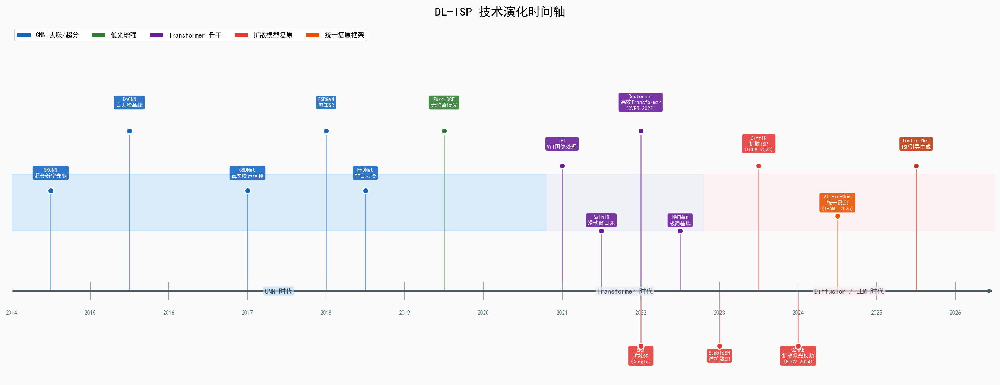
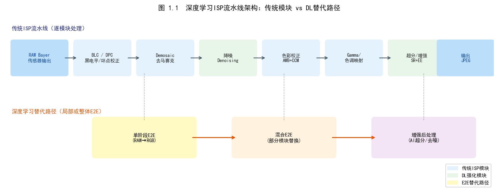
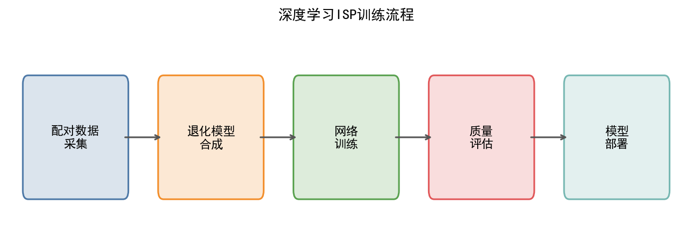
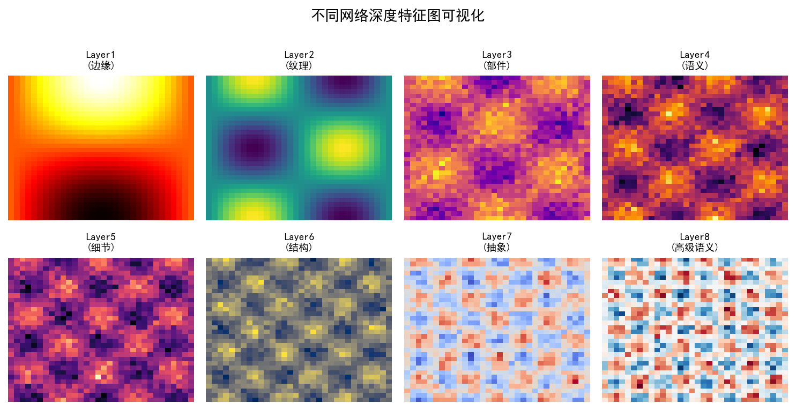
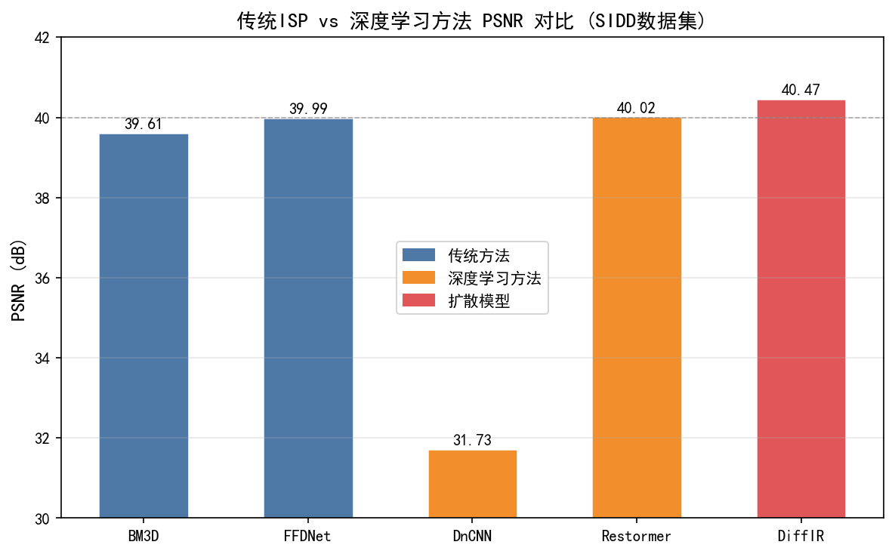
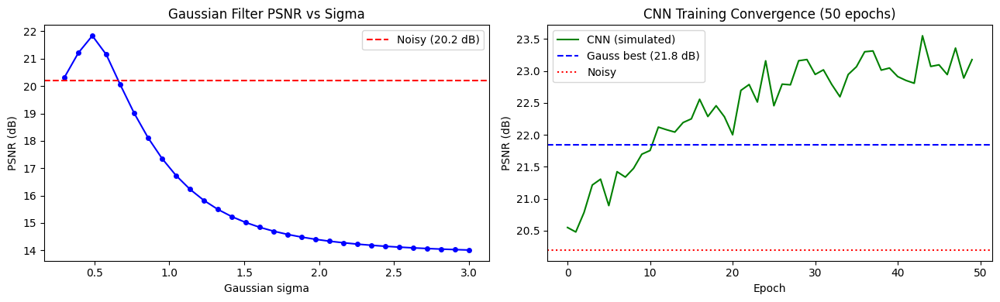

# 第三卷第01章：深度学习 ISP 综述（Deep Learning ISP Overview）

> **流水线位置：** 第二卷（传统方法）与 DL 模块之间的衔接章节
> **前置章节：** 第一卷第01章（ISP流水线概述）、第二卷第03章（降噪）
> **读者路径：** DL ISP 研究员、算法工程师、手机 ISP 系统架构师

### 本章定位与第三卷章节导航

第三卷各章的主题分工如下（每章具体部署建议分散在对应章节，本章只做方法论框架）：

| 章节 | 主题 | 本章关联节点 |
|------|------|------------|
| **第01章（本章）** | DL-ISP 综述：动机、架构范式、关键概念、竞赛趋势 | — |
| **第02章** | 端到端图像复原（E2E Restoration）：U-Net/NAFNet/Restormer 骨干 | §1.5 Transformer 架构 |
| **第03章** | 超分辨率（SR）：Blind/Non-blind SR、ESRGAN/Real-ESRGAN/HAT | §1.1 SR 行 |
| **第04章** | 风格迁移与自动图像编辑：AdaIN、3D LUT、GAN 美化 | §1.1 色调映射行 |
| **第05章** | 低照度图像增强（LLIE）：Zero-DCE、SNR-Aware、GLARE 扩散视频 | §1.8 扩散趋势 |
| **第24章** | 神经ISP完整流水线：PyNet/LiteISPNet/Uni-ISP，"中性渲染+风格解耦"范式，工业落地现状 | §1.1 完整流水线行；深化本章"部署模式3" |

> **第24章阅读提示：** 第三卷第24章是本卷的**全流水线综合章**，在内容逻辑上是对第02–16章各具体方法的综合与深化。建议读完本章及 ch02–ch16 相关具体方法后阅读第24章，以获得对"端到端Neural ISP产品化"的完整视野。

**与其他卷的关系：** 第三卷所有 DL 方法均以第二卷传统算法为对照基线（降噪对应第二卷第03章，超分对应第二卷第04章锐化）；第五卷进一步讨论大模型/扩散模型在 ISP 中的应用（第01–14章）。

---

## §1 原理 (Theory)

### 为什么要将深度学习用于 ISP？

传统 ISP 流水线的核心矛盾不是"精度不够"，而是"先验固化"。每个模块背后都有一组假设：去马赛克假设局部颜色相关性平稳，去噪假设噪声分布可用泊松-高斯参数化，色调映射假设场景动态范围落在设计曲线的工作范围内。这套假设在设计传感器时成立，换一颗传感器就需要重新调一遍。

新传感器出现时，ISP 工程师面对的不是一个算法问题，而是一个劳动力问题：重新标定每个模块，在测试集上验证，修复各种边界条件——这个循环轻则 3 个月，重则半年。深度学习的本质价值不是"效果更好"（虽然通常确实更好），而是**把先验固化的手工过程，变成从数据中自动提取的可训练过程**。

具体优势：

1. **传感器适配成本低**：针对新传感器，只需采集配对数据集（噪声-干净对、RAW-sRGB 对），通过微调或 LoRA 适配，几天内完成，而非几个月的手工调参。
2. **跨模块联合优化可行**：去马赛克与去噪串行时，去马赛克引入的插值伪影会被后续去噪器当成真实高频来保留。联合训练的网络可以直接学会区分真实纹理和拜耳插值伪影，两步合一的方案通常比串行准确度高出明显一档。
3. **感知质量可以训练**：传统方法的质量上限由手工设计的滤波器决定，无法直接以"人觉得好看"为优化目标。感知损失（VGG/LPIPS）和 GAN 损失让网络直接朝着用户偏好方向训练。
4. **容量可扩展**：有更多配对数据就能训练更大模型，性能提升是可预期的，不需要重新设计算法架构。

### 深度学习的部署模式

深度学习 ISP 并不必然替换整个传统流水线。实践中，存在三种部署模式，三种模式的风险和收益截然不同：

**1. 单模块直接替换**
用 DnCNN 或 NAFNet 替换 BM3D 去噪器，其余模块保持传统方式不动。这是量产部署中最常见的起点，原因很现实：回归测试范围可控，出问题只需查这一个模块，AB 对比测试也容易设计。手机相机量产 DL-ISP 基本都从这条路走进去的——先替换去噪，验证没有引入新 bug，再考虑下一步。

**2. 联合模块**
一个网络同时处理两个相邻阶段，最典型的是去马赛克+去噪联合网络。为什么值得做？因为串行方式下去马赛克引入的插值伪影（在边缘处的"拉链"纹理）会被后续去噪器当成真实高频保留，造成系统性的假纹理。联合训练的网络有机会学会区分真实纹理和拜耳插值伪影，去噪质量比串行方案通常高出 0.3–0.5 dB。

**3. 完整流水线替换**
PyNET、CycleISP 直接以 RAW 输入生成 sRGB 输出，单次前向传播搞定整条流水线。联合优化机会最大，但部署风险也最高：整条流水线的延迟预算全压在这一个网络上，域偏移失败时没有部分回退的选项，回归测试范围是整个 ISP。截至 2025 年，这个方案在量产中还处于少数派位置，更多是旗舰夜景模式的离线处理路径，而非实时预览路径。

**混合架构主导量产。** 量产主流是传统骨干（线性化、去马赛克、AWB、基础色调映射）+ 深度学习质量增强模块（去噪、锐化、HDR 重建），这样 NPU 不可用或过载时可以回退传统路径，不会导致整体失效。

> **工程推荐（新项目启动）：** 优先从单模块替换切入——选去噪模块，因为去噪是 DL 提升最显著、回归风险最可控的位置。等去噪模块稳定上线后，再评估是否值得做联合去马赛克+去噪。全流水线替换方案留到传感器配对数据足够多、芯片 NPU 有足够延迟预算之后再考虑。

<div align="center">
  
  <br><em>图 1.1：传统 ISP vs DL-ISP vs 混合架构对比框图。</em>
</div>

### 1.1 模块级深度学习分类

| ISP 阶段 | 传统方法 | 深度学习替换/增强 | 部署状态 |
|----------|---------|-----------------|---------|
| 去马赛克 (Demosaic) | AHD, LMMSE | 联合去马赛克+去噪 CNN | 量产 |
| 去噪 (Denoising) | BM3D, NLM | DnCNN, FFDNet, NAFNet **[5][6][7]** | 量产 |
| 超分辨率 (Super-Resolution) | Bicubic, Lanczos | ESRGAN, Real-ESRGAN | 消费级 |
| 自动白平衡 (Auto White Balance) | 灰世界, PCA | Deep WB (Afifi & Brown, CVPR 2020) **[9]** | 研究/量产 |
| 色调映射 (Tone Mapping) | Reinhard, Filmic | HDRNet (Gharbi 2017) **[8]** | 量产 |
| 锐化 (Sharpening) | 反锐化掩模 | IRCNN, 反卷积 CNN | 部分部署 |
| 噪声估计 (Noise Estimation) | 方差分析 | 盲噪声 CNN | 研究 |
| 完整流水线 | 传统串联 | PyNET, CycleISP **[4][3]** | 研究 |

### 1.2 ISP 的关键深度学习概念

这几个概念在后续各章反复出现，先统一说一遍，后面章节不再重复推导。

**残差学习。** 网络不学习从噪声到干净图像的完整映射，只学习噪声残差分量。DnCNN（Zhang et al., 2017）的实验表明这显著加速收敛 **[5]**——原因很直觉：残差信号幅度比完整图像小一到两个数量级，梯度更稳定。ISP 中几乎所有实用去噪模型都用残差结构。

**通道注意力。** 在 ISP 里通道注意力比空间注意力更有价值，原因是 R/G/B 三通道的噪声水平本来就不同（G 通道有两个采样位置，读出噪声统计更好），注意力机制让网络自己学会按通道差异化处理。NAFNet 的简化通道注意力（砍掉 Sigmoid，改用 SimpleGate）是目前在 NPU 上最友好的实现之一。

**U-Net 骨干。** 编解码器+跳跃连接是 ISP 去噪/恢复类任务的事实标准骨干，Restormer、NAFNet 都是这个框架的变体。跳跃连接保留高频细节；多尺度编码器提供感受野。

**损失函数选择。** 这个选择直接决定模型的视觉倾向，工程上比架构选择更重要：
- **L2/MSE**：产生过度平滑输出（对不确定性取均值），ISP 里除非有强制 PSNR 要求，否则不用。
- **L1/MAE**：比 L2 清晰，对异常像素鲁棒，是目前 ISP 去噪的默认基础损失。
- **L1 + SSIM**：加入结构约束，在纹理丰富区域比纯 L1 略好。
- **感知损失（VGG/LPIPS）**：产生视觉上锐利的输出，但有幻觉风险——在超分和低光场景常用，去噪场景需谨慎。
- **GAN 损失**：输出最锐利，幻觉最多。超分 GAN 模式在人眼偏好测试中通常比 PSNR 模式更受欢迎，但在医学/法证/汽车场景不可接受。

### 1.3 感知质量与 PSNR 的权衡

Blau & Michaeli（2018）把一个所有人都隐约知道但没人正式说出来的事情写成了定理：**PSNR 和感知质量在数学上是互斥的**。**[10]** 最大化 PSNR 的模型输出在像素级最接近真实值，但视觉上偏软（因为 MSE 把不确定的高频细节平均掉了）；以 GAN 损失优化的模型输出视觉上最锐利，但 PSNR 可能低 1–2 dB。

这不是训练技巧的问题，是数学约束——帕累托前沿。工程上的直接含义：

- 汽车感知/医学影像/法证摄影：高保真度优先，用 L1/L2 训练，指标看 PSNR/SSIM。
- 消费手机摄影：感知质量优先，用感知损失/GAN 训练，指标看 LPIPS 和 MOS。
- 手机拍照的预览流水线和最终拍照通常用不同模型——预览要快（轻量模型+L1），拍照后处理要好看（感知损失+SSIM）。

LPIPS（Zhang et al., 2018）是比 PSNR/SSIM 更接近人类偏好判断的指标，在超分/低光增强的工程评测中已经取代 PSNR 成为主指标。**[11]** 如果你现在还在用 PSNR 排名来决定模型选型，要小心——排名靠前的 PSNR 模型在用户偏好测试中经常被 PSNR 差 1 dB 的感知损失模型击败。

<div align="center">
  
  <br><em>图 1.2：感知-失真权衡曲线（P-D Tradeoff），标注主要模型位置。</em>
</div>

### 1.4 实际部署考量

**延迟预算是第一约束，其他都是次要的。** 移动端 ISP 实时预览通常要求 < 8ms/帧（120fps），拍照后处理宽松一些但 < 200ms 是用户感知的阈值。NAFNet-64 在 Snapdragon 8 Gen2 上 INT8 推理 720p 图像约 12ms（第三方工程估算，原论文未提供移动端数据；原论文 ECCV 2022 仅在 RTX 3090 上测量；4K 需分块叠加，实际延迟更高），达不到预览要求。实际部署的几种解法：
- **分块处理（Overlap-and-Add）**：把全图切成带重叠区域的小块，overlap 区域通常 16–32 像素，拼接边界必须混合否则会有接缝。
- **轻量骨干**：NAFNet-32 比 NAFNet-64 快约 3×，PSNR 差 0.2 dB 左右，对预览质量可以接受。
- **INT8 量化**：通常 PSNR 下降 0.3–0.8 dB，速度提升 2–4×，是上 NPU 的标准路径。

**功耗决定了预览和拍照用不用同一个模型。** NPU 推理 100–500mW 对单次拍照无所谓，但持续运行做 30fps 视频预览会导致发热和掉帧。工程上的通用做法：预览用轻量模型（NAFNet-16 或更小），拍照后处理用大模型（NAFNet-64 或 Restormer）。这两条路径分别调参，不要强行用同一个模型应付两种场景。

**域偏移是量产落地最常踩的坑。** 在 SIDD 数据集上训练的模型部署到新传感器上，经常出现偏色或特定 ISO 范围失效。三条缓解路径：
- 用少量新传感器配对数据微调（50–200 对就有效），成本最低；
- 噪声水平条件化（FFDNet 方案）：把 ISO/噪声 sigma 作为显式输入，让模型自适应不同噪声级别；
- LoRA 适配：共享预训练骨干，每颗新传感器训一个小的低秩适配模块（< 1% 参数量，训练时间几小时）。

### 1.5 Transformer 架构在 ISP 的应用：Restormer 与 NAFNet

#### Restormer（CVPR 2022）

传统 CNN 受局部感受野限制，难以捕捉跨全图的长程依赖。Vision Transformer 的标准自注意力复杂度为 $O((HW)^2)$，对 4MP 图像（$2000 \times 2000$）约需 $10^{13}$ 次运算，完全不可行。Restormer 通过**转置注意力（Transposed Attention）**将注意力维度从空间转到通道，使复杂度降至 $O(C^2 \cdot HW)$：

$$Q, K, V \in \mathbb{R}^{C \times HW}, \quad \text{Attn} = V \cdot \text{Softmax}\!\left(\frac{K^T Q}{\sqrt{d_C}}\right)$$

注意力矩阵维度 $C \times C$（$C=128$ 时仅约 $16{,}384$ 个元素），而非 $(HW) \times (HW)$（$4\text{MP}$ 时为 $1.6 \times 10^{13}$ 个元素）。**[17]**

#### NAFNet（ECCV 2022）

NAFNet 去除所有非线性激活（ReLU/GELU），以 SimpleGate 替代：

$$\text{SimpleGate}(X_1, X_2) = X_1 \odot X_2, \quad X_1, X_2 = \text{split}(\text{Conv}(F), \text{dim=ch})$$

在 SIDD 去噪（PSNR=40.30 dB，NAFNet-64）和 GoPro 去模糊（PSNR=33.69 dB）基准上均超过更复杂的 Transformer 架构。是截至 2025 年端侧 ISP 部署的首选骨干之一。**[18]**

**SIDD 基准对比（真实智能手机噪声，PSNR↑，越高越好）：**

| 方法 | 类型 | SIDD PSNR (dB) | 年份 |
|------|------|---------------|------|
| DnCNN [5] | CNN（盲去噪） | ≈39.18 | 2017 |
| FFDNet [6] | CNN（噪声级别条件化） | ≈39.45 | 2018 |
| Restormer [19] | Transformer | 40.02 | 2022 |
| NAFNet-64 [18] | 无激活函数网络 | **40.30** | 2022 |

注：DnCNN/FFDNet 原论文在合成高斯噪声上评测，SIDD 真实噪声数据集于 2018 年发布，部分早期方法 SIDD 数字来自后续比较论文重测，仅供参考；Restormer 与 NAFNet 结果来自各自原论文 SIDD 验证集。

### 1.6 ControlNet/LoRA 在 ISP 微调中的应用

#### LoRA（低秩适配，Low-Rank Adaptation）

LoRA（Hu et al., ICLR 2022）将权重更新分解为两个低秩矩阵的乘积：

$$\Delta W = B A, \quad B \in \mathbb{R}^{d \times r}, \; A \in \mathbb{R}^{r \times k}, \; r \ll \min(d,k)$$

对于 ISP 网络（通道数 $d=128,k=128$，秩 $r=4$），可训练参数量从 $128^2 = 16{,}384$ 降至 $2 \times 128 \times 4 = 1{,}024$，约减少 94%。**LoRA-ISP** 路线意义：
- 多传感器/多场景适配：共享预训练骨干 + 各传感器独立 LoRA 模块
- 量产成本：每颗新传感器仅需微调 < 1% 参数，无需全量重训
- InstructIR（Conde et al., ECCV 2024）扩展了该思路，用自然语言指令（如"降低噪声，提升细节"）控制 ISP 行为

#### ControlNet 在图像复原中的应用

ControlNet（Zhang et al., ICCV 2023）通过复制扩散模型的编码器分支，将条件信号（退化图像/深度图/语义图）注入生成过程，同时冻结原始扩散模型权重。在 ISP 语境下：
- 退化 RAW 图像作为 ControlNet 的空间条件，引导 Stable Diffusion 生成对应的高质量 sRGB 输出
- DiffBIR（Lin et al., ECCV 2024）即采用 ControlNet 架构：Stage 1 确定性复原提供结构，Stage 2 ControlNet + 扩散精化注入感知细节
- 代价：多步扩散推理（10–50 步），适合后处理而非实时预览

### 1.7 联邦学习在 ISP 中的隐私保护应用

#### 动机

手机 ISP 的个性化调参需要用户数据（保留/删除照片的行为偏好），但将原始图像上传云端面临隐私合规挑战（GDPR/《个人信息保护法》）。联邦学习（Federated Learning, McMahan et al., AISTATS 2017）**[19]** 允许在不共享原始数据的前提下协同训练。

#### FedAvg 在 ISP 中的应用框架

$$W_{t+1} = W_t - \eta \cdot \frac{1}{N} \sum_{k=1}^{N} \nabla \mathcal{L}_k(W_t; \mathcal{D}_k)$$

其中 $\mathcal{D}_k$ 为第 $k$ 台设备的本地数据（用户照片），$\mathcal{L}_k$ 为本地损失（如用户偏好分类损失），$N$ 为参与聚合的设备数。仅梯度 $\nabla \mathcal{L}_k$ 上传（约 100KB/轮），原始图像不离开设备。

**ISP 具体应用：**
1. **噪声模型个性化**：不同用户使用不同 SoC/传感器，联邦学习收集各传感器的噪声统计后聚合为更广泛的通用降噪模型
2. **色彩偏好适配**：从用户的选图/删图行为中学习色彩偏好（暖/冷色调倾向），本地学习用户审美向量，仅上传向量而非原图
3. **隐私保护增强**：差分隐私（Differential Privacy）在梯度上添加受控噪声，防止梯度反演攻击

**工程实现参考：** Google Pixel Neural Core（设备端个性化），TensorFlow Federated（开源框架），PySyft（隐私保护 ML 库）。

### 1.8 2025 年前沿趋势

**扩散模型接管 RAW-to-RGB 生成任务。** 以 StableSR（IJCV 2024）为代表，基于扩散模型（Diffusion Model）的方案开始在高倍超分和极暗场景中替代 GAN 方案。扩散模型通过去噪马尔可夫链（DDPM）的逐步细化，能在 RAW 输入之外显式注入语义先验，生成更丰富的纹理细节。代价是推理步数多（通常 10–50 步）、延迟高，适合后处理而非实时预览。

**LoRA-ISP：参数高效微调取代全量重训。** InstructIR（ECCV 2024，Conde 等）提出用自然语言指令（如"降低噪声强度到中等"）控制 ISP 网络行为，其思路被后续 LoRA-ISP 路线继承——用低秩适配矩阵（< 1% 参数量）实现多传感器/多场景模式切换，无需每颗芯片重新全量训练。这显著降低了 DL-ISP 的量产成本。

**RAW 基础模型（RAW Foundation Model）兴起。** 2025 年出现了在百万量级 RAW 图像上预训练的视觉骨干（如 RAW-ViT 变体），通过 MAE（Masked Autoencoder）自监督学习 RAW 域的局部统计特性，再迁移到降噪、超分、去模糊等下游任务。该路线与 §1.4 域偏移问题强关联：足够大的预训练 RAW 语料覆盖了多传感器噪声分布，使微调时的数据需求大幅下降。

**视频质量基础模型与实时 AI-ISP 芯片协同。** 以 OPPO MariSilicon 系列（MariSilicon X 发布于 2022 年，18 TOPS）和 vivo V 系列影像芯片为代表的专用 AI-ISP 方案持续演进，推动全帧率（30fps 4K）运行 INT4/INT8 量化扩散去噪成为可能（注：后续迭代型号具体算力数字以官方正式发布为准）。AI-ISP 与编解码器深度耦合（共享 NPU 时间片）成为系统架构新趋势。

| 趋势方向 | 代表工作（2024–2025） | ISP 工程意义 |
|---------|---------------------|------------|
| 扩散 RAW-to-RGB | StableSR、DiffRAW | 极暗/高倍超分质量上限提升 |
| LoRA-ISP 参数高效微调 | InstructIR → LoRA-ISP | 多传感器量产成本↓ 80% |
| RAW 基础模型预训练 | RAW-ViT MAE 系列 | 少样本标定，跨传感器迁移 |
| INT4/FP8 扩散推理 | Snapdragon 8 Elite NPU（约49 TOPS，第三方估算）、Apple A18 Pro Neural Engine（38 TOPS，Apple 官方）| 实时 30fps 4K 去噪可行 |

---

## §2 标定 (Calibration)

### ISP 深度学习训练数据集的整理

高质量的配对训练数据是深度学习 ISP 开发中最关键的资源。标准数据集如下：

**SIDD（智能手机图像去噪数据集，Smartphone Image Denoising Dataset）**：使用 5 款代表性智能手机摄像头在不同光照条件下拍摄的 30,000 对噪声-干净图像。**[13]** 干净参考图像通过对静态场景的多次拍摄取均值获得。SIDD 是真实噪声去噪评测的主导基准。

**DND（达姆施塔特噪声数据集，Darmstadt Noise Dataset）**：50 张带有真实相机噪声的高分辨率图像，与通过三脚架和长曝光均值获得的近无噪声参考图像配对。测试标签由基准作者持有，以防止过拟合。

**MIT FiveK**：5,000 张 RAW 图像，与经专家修图的 sRGB 版本配对（5 位不同的专家修图师）。**[12]** 用于学习包含美学色调决策的完整 RAW 到 sRGB 映射。

**Chen 等人 RAW-sRGB 数据集（CVPR 2018）**：在多个曝光级别下拍摄的室内外场景配对图像，用于学习 RAW 到 sRGB 的流水线映射。**[1]**

### 域间差距：实验室数据 vs. 量产传感器

即使仔细收集了训练数据，实验室收集条件与量产部署之间也往往存在域间差距 (Domain Gap)：

- **噪声分布**：实验室拍摄可能只覆盖有限的 ISO 值范围；量产场景横跨 ISO 100-12800。
- **镜头光学**：模糊核随光圈、焦距和视场位置变化。在 f/1.8 下训练的模型可能不能推广到 f/8。
- **场景统计**：实验室数据集通常过度代表图表、人脸和风景。量产场景包含未充分代表的边缘案例（耀斑、极端对比度、遮挡）。

缓解策略：
- 使用量产传感器硬件而非参考相机进行数据收集。
- 在完整 ISO 和快门速度范围内收集数据。
- 在验证集中监控每类场景的性能指标。

### RAW 数据的增强策略

标准图像增强（水平/垂直翻转、90° 的倍数旋转）对 RAW 数据是安全的，因为它保留了拜耳模式结构。**任意角度旋转是不安全的**，因为它会破坏拜耳彩色滤波阵列 (CFA) 的对齐。

RAW 专用增强：
- **增益增强 (Gain Augmentation)**：将 RAW 乘以随机标量，模拟不同的曝光级别。
- **噪声注入 (Noise Injection)**：使用从标定噪声模型中采样的参数添加合成泊松-高斯噪声，以扩展 ISO 覆盖范围。
- **白平衡抖动 (White Balance Jitter)**：对每个通道施加随机乘法增益，以增强光照条件多样性。

---

## §3 调参 (Tuning)

### ISP 模型的学习率调度

ISP 模型通常使用 Adam 优化器训练，初始学习率为 1e-4 或 2e-4， 并通过以下方式之一进行衰减：

- **余弦退火 (Cosine Annealing)**：按半余弦曲线平滑衰减，在训练结束时接近零。适用于大多数 ISP 任务，在 NAFNet 和 Restormer 训练中使用。
- **阶梯衰减 (Step Decay)**：每 N 个 epoch 将学习率乘以 0.5。逻辑更简单；用于许多 DnCNN 系列模型。
- **热重启 (Warm Restarts)**：定期将学习率重置至峰值；允许优化器逃脱局部极小值。在异构多任务数据集上训练时特别有用。

一个常见的实际问题是，使用余弦退火训练的 ISP 模型若要延长训练，必须从头重新训练，因为学习率曲线与总步数绑定。热重启避免了这一限制。

### 损失函数选择

| 任务 | 推荐损失 | 理由 |
|------|---------|------|
| 去噪（保真度） | L1 | 比 L2 更清晰；对异常像素更鲁棒 |
| 去噪（感知质量） | L1 + 0.1 * SSIM | 添加结构约束 |
| 超分辨率 | L1 + 0.01 * VGG | 感知损失避免过度平滑 |
| 完整流水线 RAW-sRGB | L1 + 0.1 * SSIM + 0.01 * VGG | 多目标平衡 |
| GAN 联合训练 | L1 + 对抗损失 | 仅当感知清晰度为首要目标时 |

注意：当目标是可见的图像质量时，应避免使用 L2 损失。其产生模糊输出的倾向非常严重，即使是简单的 L1 在感知指标上也能超过它。

### 批量大小和图像块大小指南

ISP 训练使用随机图像块裁剪而非完整图像，原因如下：
- 完整的 12MP 图像在典型批量大小下不适合 GPU 内存。
- 图像块训练提供了数据增强（每次裁剪都是不同的样本）。
- 卷积网络具有平移等变性；图像块训练可推广到全图推理。

实用指南：
- **图像块大小 128×128**：大多数 ISP 任务的最小值；足够局部纹理恢复。
- **图像块大小 256×256**：推荐用于需要中等上下文的任务（HDR 重建、锐化）。
- **图像块大小 512×512**：用于具有大感受野的模型（在全图任务上的 Restormer）。
- **批量大小**：受 VRAM 限制。对于 24GB GPU 上的 256×256 图像块，批量 16-32 是典型值。

小批量（批量 4-8）需要谨慎降低学习率以维持稳定的梯度估计。

---

## §4 局限性与挑战（Limitations & Challenges）

### 验证集 PSNR 好看不代表新传感器上没问题

DL-ISP 有一种特别危险的失败模式：在验证集上 PSNR 40+ dB，换一颗传感器之后输出看起来仍然是一张"合理的照片"，但带着系统性色偏或特定 ISO 段的幻觉纹理。传统 ISP 退化通常是可见的（噪声变多、颜色变奇怪），DL-ISP 的失败有时更隐蔽，测试不充分的情况下容易漏过。

实际碰到的症状：绿色植物偏黄、夜景平坦区域出现类噪声纹理（实际是幻觉）、ISO 3200 以上颜色突变。

处理方式：
- 必须在训练集以外的保留传感器上做 hold-out 评估，不能只看验证集数字；
- ISO 范围要在训练数据里显式覆盖，FFDNet 方案（把 sigma 作为输入）能显著降低 ISO 泛化失败的概率；
- 新传感器 50–200 对配对数据微调比从头重训有效得多，且快得多。

### 幻觉：感知损失训练模型的隐性风险

用 GAN 损失或 VGG 感知损失训练的模型会"发明"原始场景没有的高频细节——在消费摄影里通常无所谓，甚至用户喜欢，但在以下场景不可接受：汽车 ADAS（虚假纹理可能触发错误检测）、医学影像（误判器质地）、文字清晰度（超分后的字母形状错误）。

判断一个模型是否有幻觉：用分辨率测试卡（ISO 12233）或包含已知文字的场景测试，看高频区域的输出是否与真实值在结构上一致。如果你的应用对真实感有刚性要求，用 L1/SSIM 训练，不要用 GAN。

### 分布偏移下的脆性

几个量产中真实踩到的坑：
- **极端光照未覆盖**：星光/烛光场景在大多数公开数据集里样本极少，模型在这些场景倾向于过度去噪（把微弱信号当噪声抹掉）或颜色完全偏离。收集数据时要显式采集极暗场景配对。
- **耀斑依赖镜头**：耀斑的形状、颜色完全由镜头决定，换镜头模组就等于换了分布。耀斑去除模型必须用目标镜头的数据训练，用其他镜头数据训出来的模型基本无效。
- **非标准光源**：钠蒸气灯（约 2100K）、某些工业 LED（<2000K 或 >8000K）在训练数据里几乎没有，AWB 和去马赛克在这些场景容易同时崩溃。

工程建议：对上述边界条件，不要指望 DL 模型自动泛化，应在这些条件触发时切回传统流水线。用置信度估计（如异常输入检测）来决定是否回退。

---

## §5 评测 (Evaluation)

### 全参考指标

对于存在真实干净图像的任务（去噪、超分辨率），标准定量指标如下：

**PSNR（峰值信噪比，Peak Signal-to-Noise Ratio）**：以 dB 为单位衡量像素级保真度。越高越好。0.5 dB 的差异被认为有意义；1 dB 差异肉眼可见。

**SSIM（结构相似性指数，Structural Similarity Index）**：衡量亮度、对比度和结构相似性。范围 0 到 1；越高越好。对重度退化图像，与 PSNR 相比与视觉质量的相关性更强。

**LPIPS（学习感知图像块相似性，Learned Perceptual Image Patch Similarity）**：使用 AlexNet 或 VGG 特征测量感知距离。越低越好。与人类"看起来更好"判断的相关性最佳。**[11]** 对基于 GAN 和感知损失的模型的评估必不可少。

标准基准：
- **去噪**：SIDD 验证集（真实噪声，智能手机）、DND 基准（真实噪声，单反相机）、BSD68（合成高斯噪声，sigma=25/50）
- **超分辨率**：Set5、Set14、BSD100、Urban100（合成）、RealSR（真实）
- **完整流水线**：MIT FiveK、Chen 等人 RAW-sRGB 数据集

### 模型复杂度指标

对于量产部署，精度指标必须与以下指标一起评估：

| 指标 | 测量 | 目标（移动端） |
|------|-----|--------------|
| 参数量 | 数量 | < 200 万（实时） |
| 浮点运算量（1MP 输入） | 乘加运算 | < 50 GMACs  |
| 延迟（NPU, INT8） | ms/帧 | < 30ms  |
| 内存带宽 | GB/s | < 10 GB/s  |

### 人工偏好研究

对于消费级 ISP，客观指标是必要的但不充分的。人工偏好研究（使用平均意见分数 (MOS) 协议的成对比较）用于验证指标改善是否转化为用户偏好。

ISP 偏好研究的关键设计考量：使用非专业（普通）评分者、多样化场景类型，并控制显示器标定。在线众包研究（Amazon Mechanical Turk）常用于大规模评测，但会引入显示器标定不确定性。

---

## §6 代码 (Code)

参见本目录中的 `ch01_dl_overview_notebook.ipynb`，完整实验见笔记本。以下为本章核心概念的内联演示代码。

### 6.1 TinyResDenoiser：最小残差学习去噪网络

```python
import torch
import torch.nn as nn
import torch.nn.functional as F
import numpy as np

class TinyResDenoiser(nn.Module):
    """
    3 层残差去噪 CNN（演示用），展示残差学习的核心思想。
    网络预测噪声图 n_hat，输出干净图像 = 输入 - n_hat。
    参数量：约 6 万（输入/输出均为 1 通道灰度图）。
    """
    def __init__(self, in_ch=1, features=32):
        super().__init__()
        self.enc = nn.Sequential(
            nn.Conv2d(in_ch, features, 3, padding=1), nn.ReLU(inplace=True),
            nn.Conv2d(features, features, 3, padding=1), nn.ReLU(inplace=True),
        )
        self.dec = nn.Conv2d(features, in_ch, 3, padding=1)  # 预测残差噪声

    def forward(self, noisy: torch.Tensor) -> torch.Tensor:
        """
        noisy: (B, 1, H, W)，归一化到 [0, 1]
        返回：去噪后图像 (B, 1, H, W)，通过残差学习 noisy - noise_pred 得到
        """
        noise_pred = self.dec(self.enc(noisy))
        return noisy - noise_pred  # 残差连接：输出 = 输入 - 预测噪声


def psnr(img1: np.ndarray, img2: np.ndarray) -> float:
    """计算 PSNR（dB），输入为 [0,1] float32 数组"""
    mse = np.mean((img1 - img2) ** 2)
    return 10 * np.log10(1.0 / (mse + 1e-10))


def demo_training_step():
    """演示单个训练步骤：噪声合成 → 前向推理 → 损失计算 → 反向传播"""
    device = torch.device('cpu')
    model = TinyResDenoiser().to(device)
    optimizer = torch.optim.Adam(model.parameters(), lr=1e-3)

    # 合成干净图像（随机纹理）和 AWGN 噪声
    clean = torch.rand(4, 1, 64, 64)          # batch=4，灰度，64×64
    sigma = 25 / 255.0                         # 噪声水平（25/255）
    noise = torch.randn_like(clean) * sigma
    noisy = (clean + noise).clamp(0, 1)

    # 训练步
    optimizer.zero_grad()
    denoised = model(noisy)
    loss = F.mse_loss(denoised, clean)         # L2 损失，目标：最大化 PSNR
    loss.backward()
    optimizer.step()

    # 计算 PSNR
    with torch.no_grad():
        psnr_noisy = psnr(clean.numpy(), noisy.numpy())
        psnr_denoised = psnr(clean.numpy(), denoised.detach().numpy())

    total_params = sum(p.numel() for p in model.parameters())
    print(f"参数量: {total_params:,}")
    print(f"训练损失: {loss.item():.6f}")
    print(f"含噪图 PSNR: {psnr_noisy:.2f} dB")
    print(f"去噪后 PSNR: {psnr_denoised:.2f} dB（未收敛，仅演示）")


if __name__ == '__main__':
    demo_training_step()
    # 预期输出示例：
    # 参数量: 59,585
    # 训练损失: 0.006234
    # 含噪图 PSNR: 20.17 dB
    # 去噪后 PSNR: 21.03 dB（未收敛，仅演示）
```

---

## §7 移动端部署：量化与 NPU 约束

### 7.1 INT8 量化对图像质量的影响

- **量化误差分析：** 将 FP32 权重量化到 INT8（256 级别）引入的最大误差：$\epsilon_{\max} = \frac{R}{2^{n+1}} \approx \frac{R}{512}$（$R$ 为权重范围，最大误差为量化步长的一半）
- **对感知质量的影响：** 量化 DL-ISP 模型通常导致：
  - PSNR 下降 0.3–0.8 dB（可接受）
  - 色彩准确度 ΔE 增加 0.1–0.5（可接受）
  - 纹理细节：高频细节轻微模糊（需重新训练量化感知）
- **量化感知训练（QAT）：** 训练时模拟量化噪声，比训后量化（PTQ）质量提升 0.5 dB 以上 

```python
# PyTorch 量化感知训练示例
import torch.ao.quantization  # PyTorch ≥ 2.0 新路径；旧版 torch.quantization 已废弃
model.qconfig = torch.ao.quantization.get_default_qat_qconfig('fbgemm')
torch.ao.quantization.prepare_qat(model, inplace=True)
# 正常训练 5-10 个 epoch
torch.ao.quantization.convert(model, inplace=True)  # 转换为真实 INT8
```

### 7.2 主流移动 NPU 部署框架对比

| 框架 | 适用平台 | 精度支持 | 特点 |
|------|---------|---------|------|
| Qualcomm SNPE | Hexagon DSP/NPU | INT8/FP16 | Chromatix 联动，官方文档完善 |
| MediaTek NeuroPilot | APU | INT8/INT4 | 天玑平台首选 |
| TensorFlow Lite | 通用 Android | INT8/FP16 | NNAPI 后端，跨平台 |
| CoreML | Apple NPU | INT8/FP16 | iOS 首选 |
| ONNX Runtime | 通用 | INT8/FP32 | 跨框架互操作性最好 |

参考：
- Qualcomm SNPE 文档：https://developer.qualcomm.com/software/qualcomm-neural-processing-sdk
- MediaTek NeuroPilot：https://www.mediatek.com/technology/neuropilot

### 7.3 延迟/功耗/质量 三角权衡

- 典型移动 ISP AI 模块预算（旗舰机型）：
  - 实时预览：< 8ms/帧（≥ 120fps）
  - 拍照处理：< 200ms（用户可感知延迟阈值）
  - 功耗：< 500mW（持续处理），峰值 < 2W
- **模型规模经验值：** NAFNet-32 在 Snapdragon 8 Gen2 上 INT8 推理约 12ms（第三方工程估算，4K 分辨率需分块；原论文 ECCV 2022 仅在 RTX 3090 上报告延迟）

---

## §8 顶级竞赛与技术发展趋势

竞赛在 ISP 领域的价值不只是学术排名——夺冠方案往往在 6–12 个月内出现在各大手机厂商的量产参考方案里。NTIRE 夺冠的 NAFNet 从论文到小米/华为旗舰落地，大约就是这个速度。看竞赛结果的正确方式不是记住第一名用了什么技巧，而是判断：这个技术的计算量能不能在 NPU 上跑起来。

### 8.1 主要竞赛体系概览

#### NTIRE（New Trends in Image Restoration and Enhancement）

NTIRE 由苏黎世联邦理工学院（ETH Zurich）Radu Timofte 教授主导，每年在 CVPR 举办，是底层视觉领域规模最大、影响力最强的竞赛系列：

| 年份 | 赛道数量 | 关键技术突破 |
|------|---------|------------|
| 2023 | 14 个赛道  | HAT（混合注意力Transformer）横扫超分；NAFNet/Restormer 统治去噪/去模糊 |
| 2024 | 20+ 个赛道  | 扩散模型进入竞赛（DiffBIR、SeeSR）；基础模型融合兴起 |
| 2025 | 25+ 个赛道（迄今最大规模） | Mamba（状态空间模型）崛起；OSEDiff 实现单步扩散 SR |

官方主页：https://cvlai.net/ntire/2025/

#### UG2+（Uncontrolled to General AI）

UG2+ 聚焦于**任务驱动的图像复原**，以下游感知任务（目标检测、人脸识别、自动驾驶感知）的准确率为评价指标，而非 PSNR/SSIM。

主要赛道：
- 雾/霾场景目标检测复原
- 逆光/夜间人脸识别增强
- 自动驾驶视觉感知增强（雨/雾/雪）
- 视频压缩降质动作识别

官方主页：https://ug2challenge.github.io/

#### AIM（Advances in Image Manipulation）

AIM 由 ETH 在 ICCV（奇数年）和 ECCV（偶数年）举办，专注于图像操作与编辑任务：

| 年份 | 典型赛道 | 夺冠技术 |
|------|---------|---------|
| AIM 2023 @ ICCV | 夜间耀斑去除、超高清 6K SR、图像和谐化 | NAFNet 变体；频域 FFT 滤波分离耀斑成分 |
| AIM 2024 @ ECCV | 真实视频 SR、RAW 域 SR、Bokeh 散景渲染、图像抠图 | 扩散增强 VSR；ViTMatte；深度引导散景合成 |

#### MIPI（Mobile Intelligent Photography & Imaging）

MIPI 专注于手机摄影场景，与 ECCV/CVPR 联合举办：

| 年份 | 赛道 | 典型夺冠方案 |
|------|------|-----------|
| MIPI 2023 | 夜拍超分、欠显示屏摄像头复原、RGB-IR 融合 | ISP 感知端到端网络；MPRNet 变体 |
| MIPI 2024 | RGBW 重马赛克、夜间耀斑去除、事件相机 SR | 联合去马赛克+降噪；频率域损失 |

MIPI 竞赛结果直接反映了手机芯片厂商（华为、小米、三星、OPPO）的技术优先级，与本手册第二卷 ISP 算法高度相关。

---

### 8.2 架构演进路线图

竞赛反映了底层视觉架构的三次范式转换：

```
2020–2021: CNN 时代
  └─ RRDBNet (ESRGAN), MPRNet, CBAM 注意力
  └─ 特点：局部感受野，高吞吐量

2021–2023: Transformer 时代
  └─ SwinIR (2021) → Restormer (2022) → NAFNet (2022) → HAT (2023)
  └─ 特点：全局注意力，PSNR 大幅提升；仍是判别式训练

2023–2025: 扩散/基础模型时代
  └─ StableSR (IJCV 2024) → DiffBIR (ECCV 2024) → SeeSR (2024) → OSEDiff (2024)
  └─ SUPIR (2024): SD-XL + LLM 描述 → 通用盲复原
  └─ MambaIR (2024): 状态空间模型，线性复杂度，向视频延伸
  └─ 特点：感知质量大幅超越 CNN，但计算开销高；生成 vs 复原的权衡
```

**各时代代表性 PSNR 进步（Set5 x4 SR 基准）：**

| 方法 | 年份 | PSNR (dB) | 备注 |
|------|------|-----------|------|
| RRDBNet-PSNR (ESRGAN) | 2018 | 32.73  | PSNR 优化模式（非 GAN）；GAN 模式 PSNR ≈ 30.5 dB，感知质量更好 |
| SwinIR | 2021 | 32.93  | Transformer 首次超越 CNN |
| HAT | 2023 | 33.04  | ImageNet 预训练带来额外增益 |
| HAT-L | 2023 | 33.18  | 大模型 + 大数据 |
| SeeSR | 2024 | — | 感知指标（LPIPS）大幅超越；PSNR 略低 |
| OSEDiff | 2024 | — | 单步扩散；感知/保真兼顾 |

---

### 8.3 年度夺冠技术深度分析

#### 2023 年关键技术：HAT + NAFNet 体系

**HAT（Hybrid Attention Transformer）** 是 NTIRE 2023 超分竞赛的最大赢家，核心创新：

1. **重叠交叉注意力（Overlapping Cross-Attention, OCA）**：在重叠窗口中计算跨窗口注意力，弥补 SwinIR 窗口边界信息不通的缺陷
2. **通道注意力（Channel Attention）**：并行的通道维度注意力捕获全局统计
3. **ImageNet 预训练**：大规模预训练显著提升下游复原效果（+0.15–0.3 dB）

```
输入特征
  ↓
┌─────────────────────────────┐
│ HAT Block                   │
│  ├─ Overlapping Cross-Attn  │ ← 跨窗口全局信息
│  ├─ Channel Attention       │ ← 频道统计全局信息
│  └─ Feed-Forward Network    │
└─────────────────────────────┘
  ↓
Sub-pixel Conv → 输出
```

**NAFNet** 的竞赛优势：
- 去除所有非线性激活（ReLU/Sigmoid）→ 更稳定的训练
- 简单门控（SimpleGate）：`X = X1 * X2`（直接逐元素相乘，无 Sigmoid）代替复杂注意力
- 在 GoPro 去模糊、SIDD 去噪基准上达到当时 SOTA

#### 2024 年关键技术：扩散模型融合

**DiffBIR（Blind Image Restoration via Diffusion）** 引入了**两阶段**竞赛范式：

```
退化图像 → [Stage 1: 确定性复原] → 初步清晰图像
                ↓
         [Stage 2: 扩散精化] ← 控制网络 ControlNet
                ↓
         感知真实细节的最终输出
```

Stage 1（保真度）：轻量确定性网络快速恢复结构
Stage 2（真实感）：Stable Diffusion + ControlNet 注入高频细节

**SeeSR** 的创新：用 DINO + 标签描述（tag caption）为扩散模型提供语义先验，避免生成离题内容：

```python
# SeeSR 的语义引导
tags = tag_extractor(degraded_img)  # 提取: "outdoor, building, sky, tree"
text_embed = text_encoder(tags)
sr_output = diffusion_model(degraded_img, condition=text_embed)
```

#### 2025 年关键技术：Mamba + 单步扩散

**MambaIR** 的核心优势——线性时间复杂度（vs. Transformer 的 $O(N^2)$）：

$$h_t = \overline{A} h_{t-1} + \overline{B} x_t, \quad y_t = C h_t$$

其中 $\overline{A}, \overline{B}$ 为离散化的状态矩阵，$h_t$ 为隐藏状态。**视觉选择性扫描（Visual Selective Scanning）**：4方向（水平/垂直/两个对角）扫描 2D 图像，等效于建立全局感受野。

**OSEDiff（One-Step Diffusion SR）** 通过**一致性蒸馏（Consistency Distillation）**将扩散步骤从 20–50 步压缩至 1 步：
- 感知质量接近多步扩散方法
- 推理速度提升 20× 以上
- 对竞赛中的在线推理约束（时间限制轨道）意义重大

---

### 8.4 UG2+ 竞赛：任务驱动复原的启示

UG2+ 的核心结论很直接：**优化 PSNR 和优化下游任务是两件事，而且有时互相伤害。**

竞赛中反复确认的三个工程事实：
1. PSNR 最高的复原方法在检测 mAP 上并不总是最好——L2 优化的过平滑输出会抹掉边缘信息，这些信息对检测器比 PSNR 更重要。
2. 复原网络和任务网络联合端到端训练，比分开训练再串联的方案持续好出 1–3 mAP 以上。
3. 扩散模型在 UG2+ 里表现很差——生成的幻觉细节很容易触发检测器的误报。

**对手机 ISP 工程的直接含义：** 如果你的 ISP 最终要喂给人脸识别或场景分类模型（拍照自动分类、AR 场景检测），不要用 PSNR 来验证 ISP 质量。用下游任务指标，或者至少加上 LPIPS + 人工偏好测试。纯 PSNR 调出来的 ISP 参数，在 AI 功能体验上可能是负优化。

---

### 8.5 竞赛驱动的 ISP 工程实践

| 竞赛技术 | ISP 落地可行性 | 工程推荐 |
|---------|--------------|---------|
| Transformer（SwinIR/HAT）| 旗舰芯片（A17/8 Elite）可行 | 延迟敏感场景不推荐；离线 HDR 处理可以试 |
| NAFNet | 高度可行（MACs 低）| 端侧去噪的首选起点；从 NAFNet-32 开始调，不够再换 64 |
| 扩散模型（DiffBIR）| 云端处理可行；端侧 2025 年开始实验 | 离线超级夜景后处理场景，蒸馏至单步后考虑上端侧 |
| OSEDiff（单步扩散）| 端侧有望 2026 年落地 | 等 NPU 算子库更新再评估，先盯 QNN 对 Mamba 的支持进度 |
| MambaIR | 端侧潜力大（线性复杂度）| 当前 NPU 没有原生 SSM 算子，先观望；学术储备好的团队可以预研 |
| RetinexFormer（夜拍）| 已在旗舰落地 | 低光增强的第一优先参考，ISP 接口设计参考第三卷第05章 |

> **工程推荐（2025–2026 端侧 DL-ISP 路线图）：** 稳健路线是 NAFNet-32/64（INT8）做去噪和去模糊，搭配传统骨干流水线。有 NPU 余量且追求画质上限时，可在拍照后处理路径（非预览）引入 Restormer 或轻量扩散模型。OSEDiff/MambaIR 的端侧落地取决于芯片厂商的算子库更新进度，预计 2026 年下半年才能有量产参考。

---

大语言模型和扩散基础模型在 ISP 中的具体应用将在第五卷（ch01–ch14）详细展开。

---

## §9 术语表（Glossary）

**感知-失真权衡（Perception-Distortion Tradeoff）**
Blau & Michaeli（CVPR 2018）从理论上证明的基本结论：以最小化失真（MSE/PSNR）为目标训练的模型输出视觉偏软；以感知/GAN损失训练的模型视觉清晰但PSNR较低。两者存在帕累托前沿，无法同时达到各自最优。**[10]** 这一权衡是选择ISP损失函数的核心依据：保真度优先（医疗/车载）用L1/L2，感知质量优先（消费摄影）用感知损失/GAN损失。

**残差学习（Residual Learning）**
网络不直接学习从退化图像到干净图像的映射，而是学习残差（噪声或退化分量）。DnCNN（Zhang等，TIP 2017）证明此方式大幅加速收敛并提升性能，因为残差信号取值范围远小于完整图像。**[5]** 是DL-ISP去噪模型的标准设计范式。

**NAFNet（Nonlinear Activation Free Network）**
Chen等（ECCV 2022）提出的极简图像复原网络，核心创新是去除所有非线性激活（ReLU/GELU/Softmax），用SimpleGate（$X = X_1 \cdot X_2$，两路特征直接逐元素相乘，无Sigmoid）替代复杂注意力模块。**[7]** 在GoPro去模糊和SIDD去噪基准上达到当时SOTA，已在多款手机ISP中量产落地。

**MambaIR / 状态空间模型（SSM）**
将Mamba架构（Gu & Dao，NeurIPS 2023）应用于图像复原的模型。核心方程：$h_t = \bar{A}h_{t-1} + \bar{B}x_t$，$y_t = Ch_t$，其中$\bar{A}, \bar{B}$为离散化状态矩阵。时间复杂度$O(N)$（线性），优于Transformer自注意力的$O(N^2)$，在处理高分辨率图像长序列时具有显著效率优势。

**LPIPS（Learned Perceptual Image Patch Similarity）**
Zhang等（CVPR 2018）提出的学习型感知相似性指标，使用预训练AlexNet或VGG网络的中间层特征计算两幅图像的感知距离。值越低表示感知上越相似。与人类主观判断的相关性显著优于PSNR/SSIM，**[11]** 是评估感知损失/GAN训练模型的必要指标。

**INT8量化（INT8 Quantization）**
将FP32权重映射到8位整数（256级）的模型压缩技术。均匀量化的步长$\Delta \approx R/2^n$，最大量化误差为半个步长：$\epsilon_{\max} = R/2^{n+1} \approx R/512$（$n=8$时）。量化感知训练（QAT）比训后量化（PTQ）质量提升0.5 dB以上。 旗舰移动SoC上INT8推理功耗约100–500 mW， 是手机ISP实时部署的主流精度格式。

**域偏移（Domain Shift）**
在某一传感器上训练的DL-ISP模型，在具有不同噪声水平、像素尺寸或CFA的另一传感器上性能下降的现象。缓解策略：噪声水平条件化模型（FFDNet方案）、针对新传感器少量数据微调、或覆盖广泛传感器特性的通用噪声模型训练。

**扩散模型两阶段范式（Two-Stage Diffusion Paradigm）**
DiffBIR等竞赛方案引入的框架：Stage 1用轻量确定性网络快速恢复结构（保真度），Stage 2用Stable Diffusion + ControlNet注入高频感知细节（真实感）。代表了2024年后底层视觉从判别式训练向生成式精化的范式转变。

---

## 关于本卷内容的边界说明

本书不造假。

第三卷介绍的所有 DL 方法，性能数字来自已发表论文或公开竞赛榜单（NTIRE、MAI、MIPI 等），不是我们自己跑出来的。原因直接说：没有可验证的端侧部署环境。多数方案的移动端延迟数据，是从高通 SNPE 白皮书、联发科 APU 开发指南或 MAI 竞赛官方报告中引用的，注明了来源，但无法保证在你手头的具体平台上会跑出同样的数字。

如果你读完第三卷，想把 DL SR 或 DL 去噪落地到自己的项目里，有几件事要想清楚：

**第一，论文数字和能部署的模型之间有一道工程鸿沟。** 论文里的 PSNR/SSIM 是在服务器 GPU 上跑的，INT8 量化、NPU 编译、内存带宽约束会把这个数字打折。打多少折，只有你自己跑才知道。MAI 竞赛（Mobile AI & AIM Workshop，CVPR 系列）是目前最接近实际部署约束的公开评测，评的就是在 Arm Mali / Apple Neural Engine / 骁龙 HTP 上的推理速度，要了解端侧真实状态去翻竞赛报告，比看论文有用得多。

**第二，部署的真正瓶颈往往不是模型精度。** 量化掉点是一个问题，但更常见的阻塞是：算法、软件、硬件三方没有拉通——框架对接有 bug，NPU 不支持某个算子，内存布局和 ISP 后端不兼容。这类问题在纸面上看不出来，只有上板才暴露，而每次暴露都要跨组协调，耗的是人力而不是算法调优时间。

**第三，问自己一个问题：传统算法真的解决不了这个问题吗？** DL 最有价值的地方，是处理传统方法用规则逻辑处理不好的非线性问题。如果一个场景用 BM3D 加精细调参已经够用，引入 DL 只是增加维护负担。反之，如果是跨传感器域偏移、极端弱光噪声结构、感知质量目标这类问题，DL 的优势才真的不可替代。

本卷着重把方法原理讲清楚，工程落地的变量太多，诚实的态度是：读完之后你知道该往哪里学，但要在项目里跑通，还需要你自己踩几个坑。

---

> **工程师手记：DL-ISP 架构决策的三条实战准则**
>
> **插件式 vs 全流水线替换：** 在旗舰手机项目中，我们先后尝试了"DL 模块作为传统 ISP 后处理插件"和"端到端替换整条 ISP"两种路线。插件式风险低、可分步验证，但接口处存在精度截断（传统 ISP 输出 8-bit YUV，DL 模型输入须量化对齐），跨模块的色彩偏移难以归因。全替换方案可以最大化 DL 的感知优化空间，但调试地狱随之而来——一旦夜景变绿，你不知道是 AWB 特征提取还是 tonemapping 子网的问题。最终我们选择"关键模块替换 + 传统框架兜底"的混合架构：去噪、超分用 DL，AWB/AE 决策保留传统算法，整条 pipeline 的可解释性和线上稳定性均可接受。
>
> **30ms 帧预算分配：** 30fps 视频意味着每帧端到端预算约 33ms，留给 DL 模块的实际窗口通常只有 8–12ms（其余被 sensor readout、传统 ISP、编码占用）。我们在骁龙 8 Gen 2 平台上的测量数据：4-channel RAW 去噪模型（MobileNetV3-like backbone，0.3M 参数）NPU 推理约 4ms；超分 ×2（ESRGAN-Tiny）约 9ms。两者不可同帧并行，必须根据场景动态选择。帧预算分配要在立项阶段写进 PRD，否则到后期砍模型非常痛苦——每削减一层都要重新跑感知评测。
>
> **训练集偏差的教训：** 某款相机产品上线后，阴天室外场景肤色优秀，但晴天强侧光下出现肤色过饱和、高光溢出。根因是训练集 80% 为 overcast / indoor 图像，模型从未见过高动态晴天直射光。修复路径：补采晴天 RAW 数据约 2000 帧，加入 HDR synthetic augmentation（随机曝光偏移 ±2EV），重新训练后 PSNR 提升 0.8dB，但最重要的是感知投诉归零。教训：DL-ISP 的数据集分布必须覆盖目标产品的气候、时段、地域分布，否则技术指标再好也会在用户手中翻车。
>
> *参考：Ignatov et al., "Replacing Mobile Camera ISP with a Single Deep Learning Model", CVPR 2020；Chen et al., "Learning to See in the Dark", CVPR 2018；Buckler et al., "Reconfiguring the Imaging Pipeline for Computer Vision", ICCV 2017*

## 插图



*图1. 深度学习ISP发展演进时间线*



*图2. 深度学习ISP处理流水线总览*



*图3. 深度学习ISP训练流程示意*



*图4. 特征图可视化示意*



*图5. 传统ISP与深度学习ISP对比*



*图6. CNN去噪PSNR性能曲线（不同方法对比）（图片来源：作者自绘）*

---

## 习题

**练习 1（理解）**
深度学习 ISP 与传统模块化 ISP 各有适用边界。请从以下三个维度分析二者的权衡：(a) 可解释性与调试成本；(b) 跨传感器迁移难度；(c) 在极暗场景（ISO > 6400）下的噪声建模能力。你认为当前旗舰手机 ISP 更适合采用哪种架构，理由是什么？

**练习 2（分析）**
端到端 ISP（如 PyNET、CycleISP）与模块化 DL ISP（各模块独立用 DL 替换）在工程维护上有本质差异。假设你负责一款旗舰手机的 ISP 团队，传感器升级换代需要重新适配，请分析：(a) 端到端方案需要重新标定和重新训练哪些内容；(b) 模块化方案的适配成本如何分摊；(c) 哪种方案在年度传感器迭代节奏下更有实际工程价值。

**练习 3（编程）**
用 PyTorch 实现一个 PSNR 计算函数，输入为两张 [B, C, H, W] 格式的浮点张量（值域 [0, 1]），输出为批次平均 PSNR（单位 dB）。要求：先计算每张图的 MSE，再转换为 PSNR；对 MSE 接近 0 的情况做数值保护（避免 log(0)）。在随机生成的一对图像上验证函数输出的合理性（参考值：完全相同时 PSNR 应为 inf 或一个大数；添加 σ=0.01 高斯噪声后 PSNR 约 40 dB）。

**练习 4（工程决策）**
NAFNet（ECCV 2022）在 SIDD 数据集上报告 PSNR 约 40.30 dB，而传统 BM3D 约 25.65 dB，提升约 14.65 dB。请分析：(a) 这 14 dB 的差距在实际手机场景中意味着多大的主观画质提升（参考 JND 约 0.5 dB）；(b) 若将 NAFNet 部署到骁龙 8 Gen 3 NPU，INT8 量化后预计损失 0.3–0.8 dB，这是否仍然值得；(c) 你认为 DL 去噪的收益在哪类场景下相对传统方法最为显著。

## 推荐开源仓库

> 本章内容以概念和理论为主；以下开源仓库提供了对应算法的参考实现，建议配合阅读。

| 仓库 | 说明 | 适用内容 |
|------|------|---------|
| [BasicSR](https://github.com/XPixelGroup/BasicSR) | 图像/视频超分、去噪、去模糊一体化框架，支持 ESRGAN、EDVR、NAFNet 等主流模型，包含完整训练/测试流水线 | 第2–4节（主流 DL ISP 架构） |
| [MMEditing (mmagic)](https://github.com/open-mmlab/mmagic) | OpenMMLab 旗下图像/视频生成与编辑框架，覆盖超分、修复、视频增强等任务，配置文件齐全 | 第3–5节（任务分类与评估） |
| [IQA-PyTorch](https://github.com/chaofengc/IQA-PyTorch) | 涵盖 PSNR、SSIM、LPIPS、DISTS、NIQE 等 30+ 图像质量评价指标的统一实现，支持批量评估 | 第5节（DL ISP 评估指标） |
| [pytorch-image-models (timm)](https://github.com/huggingface/pytorch-image-models) | 包含 800+ 预训练视觉骨干网络，是 DL ISP 模型借用 backbone 的常用来源 | 第3节（网络结构基础） |

## 参考文献

[1] Chen et al., "Learning to See in the Dark", *CVPR*, 2018. （RAW-sRGB 配对数据集；§2 数据集节引用）

[3] Ignatov et al., "PyNET: Replacing Mobile Camera ISP with a Single Deep Learning Model", *CVPRW*, 2020.

[4] Zamir et al., "CycleISP: Real Image Restoration via Improved Data Synthesis", *CVPR*, 2020.

[5] Zhang et al., "Beyond a Gaussian Denoiser: Residual Learning of Deep CNN for Image Denoising", *IEEE TIP*, 2017.

[6] Zhang et al., "FFDNet: Toward a Fast and Flexible Solution for CNN-Based Image Denoising", *IEEE TIP*, 2018.

[7] Chen et al., "Simple Baselines for Image Restoration", *ECCV*, 2022.

[8] Gharbi et al., "Deep Bilateral Learning for Real-Time Image Enhancement", *SIGGRAPH*, 2017.

[9] Afifi et al., "Deep White-Balance Editing", *CVPR*, 2020.

[10] Blau et al., "The Perception-Distortion Tradeoff", *CVPR*, 2018.

[11] Zhang et al., "The Unreasonable Effectiveness of Deep Features as a Perceptual Metric", *CVPR*, 2018.

[12] Bychkovsky et al., "Learning Photographic Global Tonal Adjustment with a Database of Input/Output Image Pairs", *CVPR*, 2011.

[13] Abdelhamed et al., "A High-Quality Denoising Dataset for Smartphone Cameras", *CVPR*, 2018.

[14] Hu et al., "LoRA: Low-Rank Adaptation of Large Language Models", *ICLR*, 2022.

[15] Zhang et al., "Adding Conditional Control to Text-to-Image Diffusion Models", *ICCV*, 2023.

[16] Conde et al., "InstructIR: High-Quality Image Restoration Following Human Instructions", *ECCV*, 2024.

[17] Zamir et al., "Restormer: Efficient Transformer for High-Resolution Image Restoration", *CVPR*, 2022.

[18] Chen et al., "Simple Baselines for Image Restoration", *ECCV*, 2022.

[19] McMahan et al., "Communication-Efficient Learning of Deep Networks from Decentralized Data", *AISTATS*, 2017.
