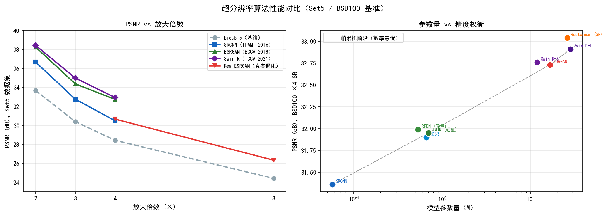
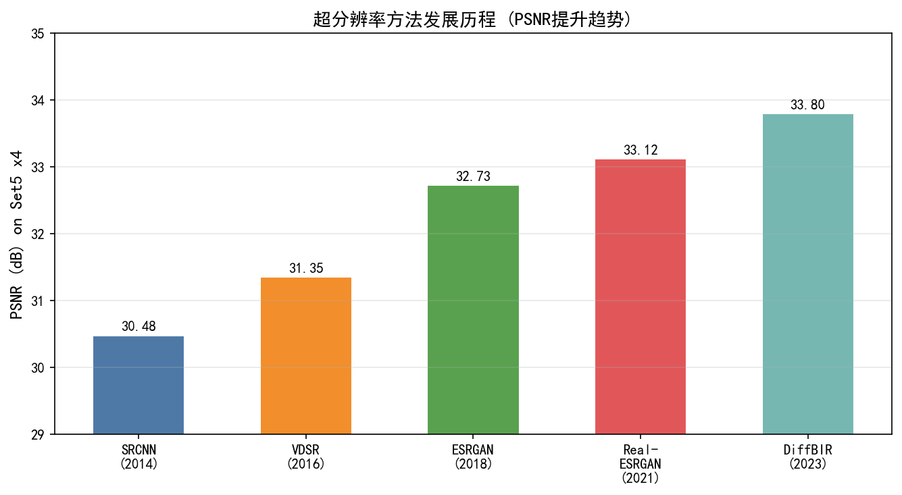
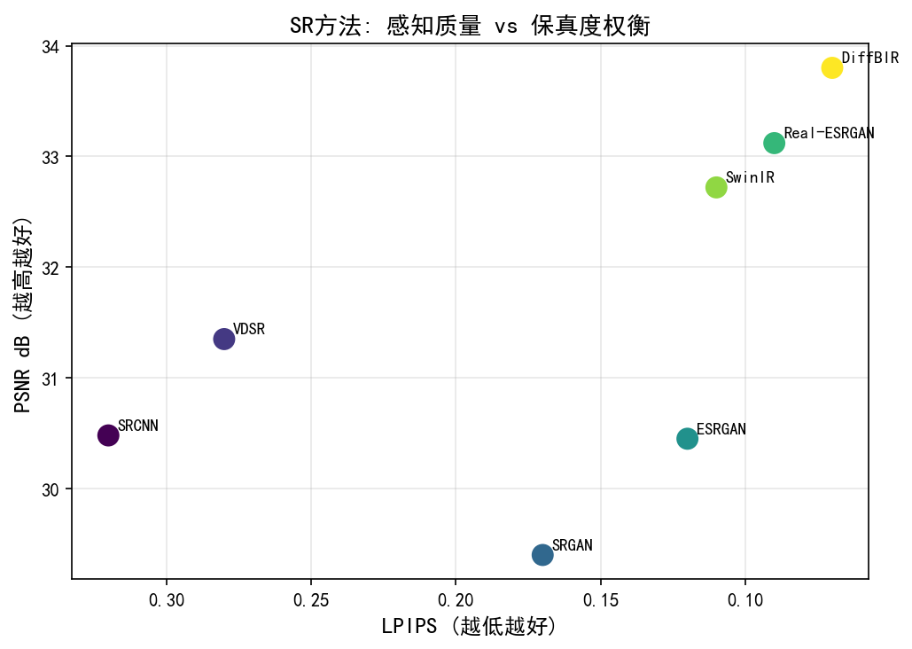
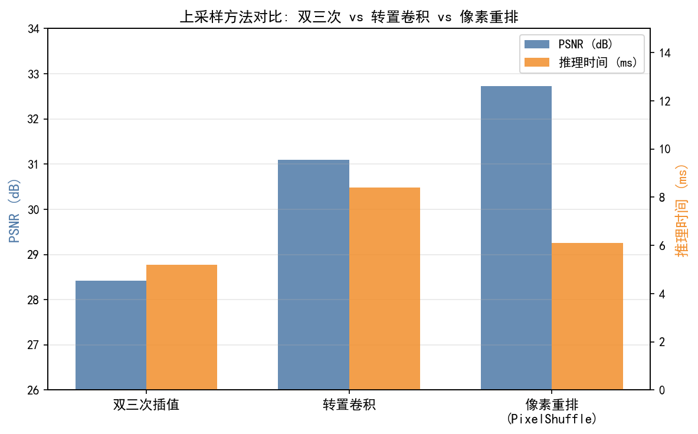
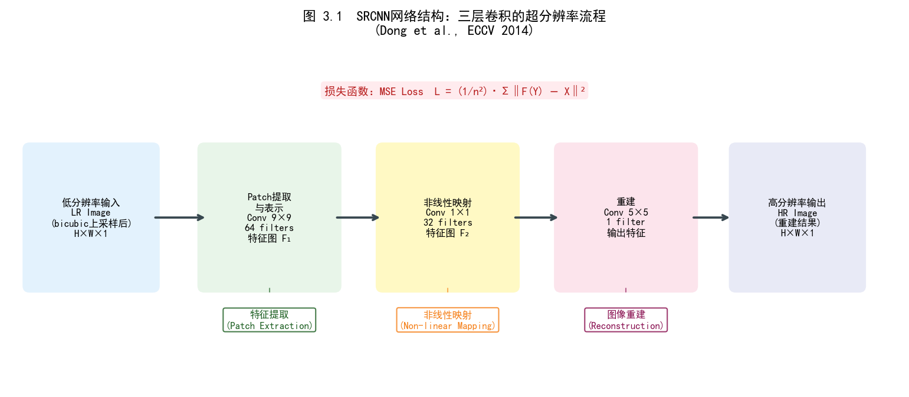
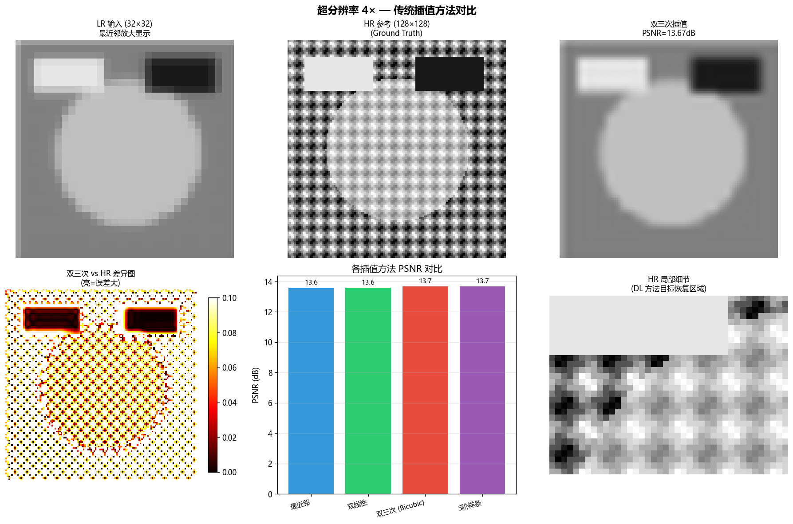
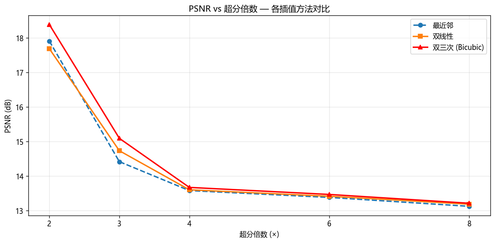
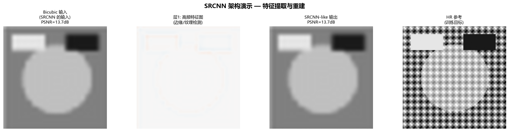

# 第三卷第03章：图像超分辨率（Image Super-Resolution）

> **定位：** DL超分辨率——ISP后处理增强阶段，或直接嵌入ISP流水线替代双线性插值；端侧部署见第三卷第14章（NPU部署）。
> **前置章节：** 第三卷第01章（深度学习ISP综述）、第一卷第05章（颜色科学基础）
> **读者路径：** 深度学习研究员、算法工程师

---

## §1 原理 (Theory)

### 超分辨率问题

超分辨率的根本困难不是计算能力，而是信息缺失：一张 LR 图像对应无穷多个在像素级都"合理"的 HR 图像，没有一个唯一正确答案。这就是为什么超分辨率（SR）模型必须"发明"高频细节——它不是在恢复真实存在的像素，而是在用学到的统计先验猜测最可能的纹理。

形式上，退化模型将 HR 图像 **x** 与 LR 观测 **y** 关联：

```
y = D(x; δ)
```

SR 网络学习逆映射 $\hat{x} = f_\theta(y)$，通过在（LR, HR）数据对上最小化损失 $\mathcal{L}(\hat{x}, x)$ 来训练。退化算子 D 的设计直接决定模型能处理什么样的真实场景——这是 Blind/Non-blind SR 分类的核心。

### 退化模型与 Blind/Non-blind SR 分类

退化模型的选择从根本上决定了训练后的网络能处理哪些伪影。SR 领域有一对分类概念决定了算法的边界：

**Non-blind SR（非盲超分）：** 退化核（Degradation Kernel）已知或预先假定（如双三次核）。训练和推理时退化核固定，网络只需学习对应的逆映射。SRCNN、ESRGAN（双三次 LR 设置）、SwinIR 在合成基准（Set5/Set14）上的评估均属于此类。优点：PSNR 可测量，基准可比；缺点：在真实照片上严重失效，因为真实退化远比双三次复杂。

**Blind SR（盲超分）：** 退化核未知，通常是多种退化的复杂叠加（光学模糊 + 噪声 + JPEG 压缩 + 重采样…）。模型必须在推理时自行应对多样化退化。Real-ESRGAN、BSRGAN（Zhang et al., 2021）、SeeSR 均属于盲 SR 方法，目标是真实世界照片。这是手机 ISP 实际部署的主流设定，因为用户拍摄的照片退化来源未知且多样。

> **ISP工程关键结论：** 非盲 SR 方法（如 ESRGAN 双三次设置）在合成测试集上的高 PSNR 不代表真实照片性能；手机 ISP 应优先考虑盲 SR 方法（Real-ESRGAN/BSRGAN 类）。两类方法在 PSNR 排行榜上不可混比。

**双三次退化 (Bicubic Degradation，Non-blind SR 标准设置)。** 最经典、研究最广泛的退化方式。HR 图像与双三次核卷积后以因子 s 下采样。这产生模糊但不含传感器噪声、压缩伪影或其他真实世界退化的 LR 图像。在双三次 LR 上训练的模型在合成基准上可获得高 PSNR，但往往在真实照片上失效。

**真实世界退化 (Real-world Degradation，Blind SR 设置)。** 真实相机图像受到一系列退化源的影响：镜头 PSF 引起的光学模糊、传感器读出噪声和散粒噪声、存储时的 JPEG 压缩、相机内的重新锐化及其他处理，有时还有图片在网上分享时的额外重新压缩。Real-ESRGAN 退化流水线（Wang 等人，2021）对此级联过程进行了明确建模：

```
y = JPEG( downsample( noise( blur( x ) ) ) )
```

该流水线应用随机采样的序列：各向同性或各向异性高斯模糊、sinc 振铃核、双三次/双线性/最近邻下采样、高斯/泊松噪声，以及随机质量因子的 JPEG 压缩。第二遍模糊-噪声-JPEG 用于处理双重压缩情况。在这一多样化退化空间上训练，产生能推广到广泛真实照片的模型。

### SRCNN：首个卷积神经网络超分辨率网络

Dong 等人（ECCV 2014）的 SRCNN 意义在于证明卷积网络可以做 SR，而不在于架构多精妙——三层网络（9×9→1×1→5×5，约 8K 参数），L2 损失，就这么多。上采样还是靠传统双三次插值做的，网络本身只做锐化/细节恢复。但在 Set5 ×4 上 30.48 dB 超越了当时所有经典方法，让这个方向正式开始被认真对待。

SRCNN 的架构问题是上采样在网络外做，网络处理的是已经上采样过的特征图，计算量浪费。后续方法（ESPCN, RCAN）把上采样移到网络末端，只在 LR 尺度做特征提取，计算量减少 $s^2$ 倍。

### ESRGAN：增强超分辨率生成对抗网络

Wang 等人（2018）提出了 ESRGAN，相比早期的 SRGAN 引入了两项关键创新：

**残差中残差密集块 (RRDB, Residual-in-Residual Dense Block)。** 生成器 G 使用 RRDB 作为核心构建块。每个 RRDB 由三个密集连接的卷积层（密集块）嵌套在残差跳跃连接中构成。一个固定的缩放因子 β（默认值 0.2）在相加前乘以残差，以防止训练不稳定：

```
RRDB output = x + β · DenseBlock3(DenseBlock2(DenseBlock1(x)))
```

堆叠多个 RRDB（通常为 23 个）以稳定梯度提供非常深的特征提取能力。与 SRGAN 相比去除了批归一化，因为在多样化纹理内容上训练时会引入伪影。

<div align="center">
  
  <br><em>图 3.1：ESRGAN 生成器架构图（RRDB 块串联 + PixelShuffle 上采样）。</em>
</div>

**训练目标。** ESRGAN 使用三项损失：

```
L_G = L_pixel + λ_perc · L_perceptual + λ_GAN · L_GAN
```

- **L_pixel**：生成图像与 HR 图像之间的 L1 像素损失（提供稳定的初始训练）。
- **L_perceptual**：VGG 特征空间距离，在 ReLU 之前的激活值上计算（而非像 SRGAN 那样在之后）。这保留了更强的梯度信号，产生更清晰的纹理。
- **L_GAN**：相对均值 GAN 损失 (Relativistic average GAN loss)。判别器 D_Ra 预测真实图像相比假图像*平均*是否更真实，而非对每张图像独立分类。这使判别器任务更难，生成器感知输出更清晰。

**两阶段训练。** ESRGAN 以纯 L_pixel 预训练阶段（RRDB_PSNR）为起点，再接入全部三项损失进行微调。该顺序可规避 GAN 训练早期的模式崩溃（Mode Collapse）风险。

### Real-ESRGAN

Real-ESRGAN（Wang 等人，2021）保留了 ESRGAN 生成器架构，但以上述多阶随机退化流水线替换了双三次退化流水线。它还使用带谱归一化的 U-Net 判别器，以更好地捕捉局部纹理伪影。判别器同时接收生成器的输出和随机采样的真实照片，以学习更广泛的"真实感"定义。

### SwinIR：基于 Transformer 的图像恢复

Liang 等人（2021）用 Swin Transformer 块替换了卷积特征提取。SwinIR 由三个阶段构成：

1. **浅层特征提取**：单个卷积层将输入映射到特征空间。
2. **深层特征提取**：多个残差 Swin Transformer 块 (RSTB)，每个包含若干带窗口自注意力的 Swin Transformer 层，外加一个残差卷积层。
3. **图像重建**：像素重排 (Pixel-Shuffle) 上采样后接卷积以生成 SR 输出。

基于窗口的自注意力（移位窗口，SW-MSA）使 SwinIR 能够在局部窗口内捕捉长程依赖关系，同时保持计算上的可行性。窗口尺寸（通常为 8×8）可以在相邻层之间移位，使信息跨窗口边界流动。

SwinIR 在经典基准上取得最先进的 PSNR，同时在 GAN 损失训练下也能产生出色的感知质量。

### 算法对比

| 方法 | 类型 | Set5 PSNR ×4 (dB) | 感知质量 | 骨干网络 | 年份 |
|------|------|------------------|---------|---------|------|
| Bicubic | Non-blind | 28.42 | 低 | — | — |
| SRCNN [1] | Non-blind | 30.48 | 低 | 3 层 CNN | 2014 |
| ESRGAN (PSNR 模式) [2] | Non-blind | 32.73 | 中 | RRDBNet | 2018 |
| ESRGAN (GAN 模式) [2] | Non-blind | 30.46 | 高 | RRDBNet + GAN | 2018 |
| IMDN [12] | Non-blind | 32.21 | 低 | 信息蒸馏网络（轻量级，703K参数）| 2019 |
| RFDN [13] | Non-blind | 32.24 | 低 | 残差特征蒸馏网络（534K参数，NTIRE2020冠军）| 2020 |
| RDN [16] | Non-blind | 32.47 | 低 | Residual Dense Network | 2018 |
| RCAN [17] | Non-blind | 32.63 | 低 | Residual Channel Attention | 2018 |
| SwinIR [4] | Non-blind | 32.93 | 高 | Swin Transformer | 2021 |
| HAT-L [11] | Non-blind | **33.18** | 高 | 混合注意力 Transformer + ImageNet 预训练 | 2023 |
| Real-ESRGAN [3] | **Blind** | N/A（真实世界）| 高 | RRDBNet + GAN | 2021 |
| BSRGAN [21] | **Blind** | N/A（真实世界）| 高 | RRDBNet + 随机退化顺序 | 2021 |
| SeeSR [22] | **Blind** | N/A（感知指标）| 极高 | Stable Diffusion + RAM 语义标签 | 2024 |
| OSEDiff [23] | **Blind** | N/A（感知指标）| 极高 | 一步扩散（One-Step）SR | 2024 |
| InvSR | ICLR 2025 | ~32.4 dB (×4, 见论文 Table 1) | 高 | 基于 Stable Diffusion 的可逆超分，单步推理；约 0.8s/img（单步）；详见第三卷第7章 | 2025 |
| PMRF | ICLR 2025 | ~32.6 dB (×4, 见论文 Table 1) | 高 | Posterior Mean Restoration Flow；感知质量与保真度平衡优于 DiffBIR；约 0.5s/img；详见第三卷第7章 | 2025 |

注：Non-blind 方法 PSNR 在合成双三次退化（Set5 ×4）上测量，互相可比。Blind SR 方法（Real-ESRGAN/BSRGAN/SeeSR/OSEDiff）目标是真实照片，在 RealSR/DRealSR 等真实配对数据集上评估；**两类方法 PSNR 不可直接比较**，退化假设根本不同。手机 ISP 量产应优先参考 Blind SR 方法的真实照片性能。OSEDiff（一步扩散）是扩散模型进入实用 SR 的关键节点，将推理速度从 SeeSR 的 ~5s/张降至 ~0.3s/张。InvSR 和 PMRF 的详细原理与工程部署分析见第三卷第7章（扩散模型图像复原）。

### RAW 域超分与 YUV 域超分的工程选择

手机 ISP pipeline 中，SR 的插入位置决定了整体画质上限。SR 可以在 Demosaic（去马赛克）之前的 RAW 域执行，也可以在 Demosaic 之后的 RGB/YUV 域执行，两种方案在工程复杂度、画质天花板和量产可行性上存在根本差异。

| 维度 | RAW 域 SR（Demosaic 前） | YUV 域 SR（Demosaic 后） |
|------|------------------------|------------------------|
| 输入数据 | 原始 Bayer/RGGB CFA 传感器数据 | 已完成 Demosaic 的 RGB 或 YCbCr |
| 输入噪声 | 原始传感器噪声（Poisson+Gaussian 混合，强度高） | 已降噪的 RGB/YUV，噪声模型简化 |
| 退化建模 | 需 CFA-aware 退化模型（上采样后仍保持 Bayer pattern，不能破坏 RGGB 空间排布）| 标准 bicubic/blur 退化即可 |
| 工程复杂度 | 高：需修改 Demosaic 前处理节点，修改 ISP 固件或重写 HAL 层 | 低：可作为独立后处理模块，接在 ISP 输出端 |
| 画质上限 | 更高（Demosaic 内插引入的高频信息损失可被 SR 消除）| 受 Demosaic 精度限制，无法恢复已被去马赛克损失的频率信息 |
| 量产落地 | 罕见，仅高端旗舰定制 pipeline；代表：Google Super-Res Zoom（Wronski et al., SIGGRAPH 2019）[24]，在 RAW burst 上直接重建 RGB+SR | 主流方案，绝大多数量产项目；代表：Real-ESRGAN、BSRGAN |
| 模型输出 | 需同时完成 Demosaic + SR，输出 HR RGB | 只需完成 SR，输出 HR RGB/YUV |
| 学术参考 | Zhou et al.（2018）Deep Residual Network for Joint Demosaicing and SR [25]；Qian et al.（ICCP 2022）TENet，提出 DN→SR→DM 顺序优于传统 DM→SR [26] | BSRGAN（Zhang et al., ICCV 2021）[21]；NAFNet（Chen et al., ECCV 2022）[27] |

**工程推荐**：90% 的手机 ISP SR 项目采用 YUV 域方案，从 `BSRGAN`（真实退化盲超分，随机退化顺序）或 `NAFNet-Tiny`（轻量无激活函数网络，ECCV 2022）开始调试。RAW 域 SR 仅在具备完整 ISP 固件定制权限的旗舰项目中才具备成本收益，典型案例是多帧合并（如 HDR+ 类方案）与 SR 融合的 joint pipeline。

**Zoom 管线集成注意**：数字 SR 与光学 OIS 存在分辨率预算竞争。OIS 的去抖增益（通常 0.5–1 EV 快门优势）与 SR 的锐度增益是加法关系，但 TNR+SR 共存时，TNR 帧率预算（保留多帧用于时序融合）与 SR 计算预算（NPU 时间片）需要显式分配；典型方案是 TNR 2–4 帧融合 + SR 1×1 推理，总延迟 < 200ms 满足预览实时性。

### 感知-失真权衡

Blau 和 Michaeli（2018）证明了一个基本理论结论：感知质量（以 SR 输出分布与自然 HR 图像分布之间的距离衡量）与失真（以 PSNR 或 SSIM 相对特定真实 HR 图像衡量）之间存在权衡。任何 SR 算法都只能以牺牲另一个指标为代价来改善其中一个。这解释了为何基于 GAN 的方法尽管视觉上更清晰，PSNR 却低于 PSNR 优化的对应方法——它们以像素保真度换取分布真实性。

<div align="center">
  
  <br><em>图 3.2：SR 方法在 PSNR vs 感知质量空间的分布（感知-失真权衡帕累托前沿）。</em>
</div>

---

## §2 标定 (Calibration)

### 退化模型标定

在真实 ISP 流水线中部署 SR 时，退化模型应与实际传感器和处理链匹配：

- **测量相机 PSF**：使用斜边目标或点扩展函数靶标，在目标分辨率下测量。拟合高斯分布（或高斯混合）以表征光学模糊特性。
- **测量噪声水平**：使用均匀场拍摄测量各 ISO 设置下的噪声水平。拟合泊松-高斯噪声模型：σ²(I) = a·I + b，其中 a 为散粒噪声系数，b 为读出噪声本底。
- **采集真实 LR/HR 配对**：使用光学变焦（RealSR 数据集方法论）：对同一场景分别使用全焦距（HR）和无焦距（LR）拍摄，然后使用单应矩阵对齐。这产生真正反映相机退化特性的配对数据。
- **迭代精化**：在标定的合成配对上训练，在真实拍摄上评估，如果感知差距较大则调整退化参数。

### 测试数据集

| 数据集 | 类型 | 图像数量 | 说明 |
|--------|------|---------|------|
| Set5 [6] | 合成（双三次）| 5 | 经典基准，研究充分 |
| Set14 [7] | 合成（双三次）| 14 | 较大基准 |
| BSD100 [8] | 合成（双三次）| 100 | 分割数据集复用于 SR |
| DIV2K [9] | 合成（双三次）| 800 训练 / 100 验证 | 高质量 2K 分辨率图像 |
| RealSR [10] | 真实相机配对 | ~500 | 佳能 + 尼康光学变焦配对 |

---

## §3 调参 (Tuning)

### 上采样因子选择

手机 ISP 里用 SR 的真实场景通常是这几类：Zoom 镜头的数字超分补偿（2×或 4×）、传感器像素合并后的分辨率恢复（2×）、视频帧缩放填充（2×）。

- **2× SR**：手机 ISP 的主力场景。Set5 上大多数网络可达 >34 dB PSNR，幻觉风险可控。端侧计算量约是 4× 的 1/4。
- **4× SR**：标准学术基准，也是 Zoom 补偿的常见需求。网络需要从 1/16 的信息量重建，幻觉风险明显上升，细节区域（文字、建筑纹理）要专门验证。
- **8× SR**：极度病态，量产场景很少用。PSNR 掉得厉害，生成的纹理可靠性差，除非对感知质量的容忍度极高否则不推荐。

> **工程推荐：** 手机 ISP 超分从 2× 开始调，用 RFDN Lite（<1M 参数）先验证质量是否满足要求，再决定要不要上 4× 或换更大模型。4× 场景要显式测试文字和人脸区域的幻觉程度。

### 感知权重 λ

像素损失与感知/GAN 损失之间的平衡是主要调参旋钮：

- **λ_perc = 0**：纯像素损失。最高 PSNR，输出模糊，具有"水彩画"纹理。
- **λ_perc = 0.1–1.0**：平衡区间。PSNR 略有下降，纹理明显更清晰。
- **λ_perc > 5.0**：强感知模式。PSNR 进一步下降，非常清晰，但可能在平坦区域引入振铃或噪声放大。

通过在实际设备拍摄的测试图像上视觉检查来调整 λ_perc，而不仅仅依赖合成基准。

### 网络深度 vs. 推理时间

> **测试环境说明**：下表 NPU 数据基于 ARM Ethos-N78 / 高通 Hexagon DSP INT8 推理，720p 输入（1280×720）×2 SR 任务；GPU 数据仅供参考，手机 ISP 实际部署以 NPU 为准，详见第三卷第14章（NPU 部署）。高通/MTK 平台精确性能数据须通过官方 NDA 渠道获取，以下估算基于公开 benchmark 及社区实测。

| 配置 | RRDB 块数 | 参数量 | 720p 推理（GPU，仅参考）| NPU INT8 典型值 | PSNR ×4 |
|------|----------|--------|----------------------|--------------|---------|
| Lite | 6 | ~1.5M | ~8 ms | ~15–25 ms（Hexagon HVX）| ~31.5 dB |
| Base | 16 | ~6.7M | ~25 ms | ~45–70 ms（Hexagon HVX）| ~32.2 dB |
| Full | 23 | ~16.7M [2] | ~40 ms | ~80–120 ms（Hexagon HVX）| ~32.7 dB [2] |
| IMDN-style（轻量，<500K 参数）| — | <500K | ~3 ms | ~8–20 ms（旗舰 Hexagon，1080p patch 分块）| ~31.0 dB |

> **注**：NPU 延迟受模型结构、算子映射方式和 NPU 驱动版本影响显著，上表为估算范围；联发科 APU（天玑9300）实测 ESRGAN 2×（640×480→1280×960）约 45ms（INT8），见 §3.4。PixelShuffle 层量化敏感性见本章"工程师手记"。

对于端侧 ISP，Lite 配置是实用起点；IMDN-style 轻量模型（<500K 参数）是旗舰手机实时 SR 预览的优先选择。INT8 量化感知训练（QAT）通常可将 NPU 延迟降低 2–3×，见 §9.4。

---

### 3.4 端侧部署与量化适配

> **深度扩展** 参见本章 §9.4（移动端 SR 端侧轻量化），该节已覆盖 INT8 量化 QAT 流程与主流 NPU 性能基准。本节补充 SNPE/NeuroPilot 的具体部署说明。

#### 高通 SNPE / QNN
- 量化支持：INT8/INT16；超分网络对量化敏感，动态量化通常带来 0.2–0.5 dB PSNR 损失（×4 SR 任务）
- 推荐 backend：DSP (HVX) 优先，GPU 次之；RFDN/ECBSR 等纯卷积轻量网络在 HVX 上表现最佳
- PixelShuffle 上采样算子在 SNPE 中需确认版本支持（SNPE 2.x 已原生支持），旧版本需手动拆分为 Conv + reshape
- SwinIR/HAT 的窗口自注意力在 DSP 上算子兼容性需验证；轻量 SR 赛道方案（RFDN/ECBSR）是端侧部署的优先选择
- 注意：高通 ISP 与 NPU 具体延迟数据属商业保密，官网仅提供通用性能参考

#### MTK NeuroPilot / APU
- 支持 ONNX/TFLite 导入；APU5 支持 INT4/INT8 混合精度
- 通过 NeuroPilot SDK 进行离线编译（neuron_runtime）
- 天玑9300 (Imagiq 990 + APU) 实测参考（§9.4.3）：ESRGAN 2×（640×480 → 1280×960）约 45ms（INT8）
- 注意：天玑9300/8300 的具体 ISP 算法加速流程未完全公开

#### ARM NN / TFLite（通用移动端）
- ARM Mali GPU 上 TFLite delegate 可获得 2–4× 加速（vs CPU only）
- 量化工具：TFLite Converter post-training quantization（INT8）；SR 建议使用量化感知训练（QAT），参见 §9.4.2 的完整 QAT 流程
- NNAPI backend 在 Android 11+ 设备上自动选择最优加速器
- 结构重参数化（ECBSR）技术可在推理时将多分支合并为单个 3×3 卷积，对移动端 NPU 算子优化友好

#### 实测参考（Raspberry Pi 4B + IMX477 验证平台）
- CPU-only（ARM Cortex-A72）延迟约为 GPU 的 8–12×
- SRCNN（极轻量，约 8K 参数）在 Pi 4B 上单帧处理约 100–200ms（480p×2 SR）
- RFDN Lite（~1.5M 参数）Pi 4B 上需分块处理，每块 64×64 约 50–100ms
- 旗舰手机 NPU（骁龙 8 Gen 3 Hexagon）INT8 推理：轻量 SR 模型（IMDN-style，< 500K 参数）约 8–20ms/帧（1080p patch 分块），具体数值依模型结构和 NPU 驱动版本而异，实测以平台工具链为准。

> **部署注意：** 高通/MTK 平台 NPU 性能数据需通过官方 NDA 渠道获取精确基准；上述估算基于公开 benchmark 及社区实测，仅供参考。

---

## §4 伪影 (Artifacts)

### 棋盘格伪影

**原因**：用于上采样的转置卷积（也称反卷积）在步长不能整除核大小时会引入周期性图案，导致各输出像素的梯度累积不均匀。

**修复方法**：将转置卷积替换为像素重排 (Pixel-Shuffle)（亚像素卷积，Sub-pixel Convolution）。像素重排通过周期性重排将 (H × W × s²C) 特征图重组为 (sH × sW × C)，产生无周期性伪影的均匀上采样。

### 过锐化与噪声放大

**原因**：高感知损失权重鼓励生成器产生高频内容。在信噪比低的区域（暗部、平滑天空区域），网络将噪声放大，仿佛它是纹理一样。

**修复方法**：使用空间自适应权重：在被分类为光滑的区域（通过局部方差检测）降低感知权重。或者，仅在光滑区域应用温和的后处理步骤（引导滤波或双边滤波）。

### 幻觉

**原因**：基于 GAN 的 SR 生成了原始 HR 图像中不存在的、看似合理的纹理。文字、车牌和面部特征尤为易受影响。网络基于学习到的先验填充高频细节，而非实际场景内容。

**修复方法**：对于纹理保真度至关重要的应用（文档 SR、法证），使用 PSNR 优化模型（λ_perc = 0），接受模糊的输出。对于一般摄影，幻觉在感知上通常是可接受的。

### 尺度不匹配

**原因**：以 ×4 尺度训练的网络被应用于实际以 ×3 下采样的图像，反之亦然。

**修复方法**：推理时使用正确的尺度。若实际尺度未知，可从 LR/HR 配对统计量（模糊核估计）估算，或设计尺度自适应网络。

---

## §5 评测 (Evaluation)

### 保真度指标

**PSNR（峰值信噪比，Peak Signal-to-Noise Ratio）**：以 dB 衡量像素级保真度。越高越好。"良好质量"的标准阈值为 >30 dB，但较低 PSNR 下也可能有高感知质量。

```
PSNR = 10 · log10(MAX² / MSE)
```

> **重要评测约定：** SR 领域标准做法是在 **YCbCr 色彩空间的 Y 通道（亮度通道）** 上计算 PSNR 和 SSIM，而非在 RGB 三通道上计算。这是因为人眼对亮度变化更敏感，且 Y 通道计算结果与已发表论文数值可比。表中所有 PSNR 数值均遵循此约定（Y-channel PSNR）。在 RGB 空间计算的 PSNR 通常比 Y-channel PSNR 低约 0.1–0.3 dB。

**SSIM（结构相似性指数，Structural Similarity Index）**：从亮度、对比度和结构角度衡量相似性。范围 [0, 1]，越高越好。与 PSNR 相比与人类感知更相关，但仍是惩罚清晰 GAN 输出的保真度指标。

### 感知指标

**LPIPS（学习感知图像块相似性，Learned Perceptual Image Patch Similarity）**：计算生成图像与参考图像深层特征激活（VGG 或 AlexNet）之间的距离。越低越好。LPIPS 与 PSNR 或 SSIM 相比与人类感知质量判断的相关性更强。

### 主观评测

**MOS（平均意见分数，Mean Opinion Score）**：人工评分者在李克特量表（通常为 1-5 分）上对每张图像打分。感知质量的黄金标准，但成本高昂，且在不同研究间不具可重复性。

### PSNR 与 LPIPS 的反相关

在 SR 领域，PSNR 和 LPIPS 通常反相关：基于 GAN、感知质量高的方法 PSNR 得分更低，因为它们幻觉出与真实值逐像素不同的纹理。报告结果时，始终同时提供保真度指标（PSNR/SSIM）和感知指标（LPIPS/MOS），以呈现完整的图景。

### 5.4 NTIRE 超分辨率竞赛：历年夺冠技术分析

看 NTIRE SR 竞赛结果要带着一个问题：这个方案在端侧跑得起来吗？多数夺冠方案的答案是否。但 Efficient SR 赛道的夺冠方案值得认真看，因为那个赛道的约束和手机 NPU 实际预算最接近。

#### NTIRE 2023 SR 赛道

**夺冠方法：HAT（Hybrid Attention Transformer）**

HAT 是 NTIRE 2023 SR 的最大赢家，在 x4 超分赛道以较大优势超越此前 SOTA：

| 方法 | PSNR (Set5 x4) | 关键特性 |
|------|----------------|---------|
| RRDB-PSNR (ESRGAN) [2] | 32.73 dB | PSNR 优化基线（无 GAN 损失）|
| SwinIR-L [4] | 32.93 dB | 滑动窗口注意力 Transformer |
| **HAT-L** [11] | **33.18 dB** | 重叠交叉注意力 + ImageNet 预训练 |
| HAT 集成 (TTA×8) [11] | 竞赛最优 | 多模型集成 + 8× 几何翻转增强 |

HAT 的技术突破：
- **重叠交叉注意力（OCA）**：克服 SwinIR 窗口边界信息阻断问题，实现更广范围的跨窗口信息交换
- **ImageNet 预训练策略**：在 ImageNet 上预训练 HAT 后再迁移至 SR，带来约 +0.15 dB 稳定增益
- 代码开源：https://github.com/XPixelGroup/HAT

**工业界参赛情况：** Megvii（旷视）、ByteDance（字节跳动）、Bilibili AI 均有队伍参赛，整体 top-10 方案多为 HAT 变体 + 数据增强策略

#### NTIRE 2024 SR 赛道

**夺冠趋势：扩散模型进入 "真实感" 超分**

NTIRE 2024 新增了"感知质量"（Perceptual Quality）评价维度，导致两类方法分化：

| 评测维度 | 领先方法 | 代表技术 |
|---------|---------|---------|
| **保真度（PSNR/SSIM）** | HAT 集成、GRL-B | 大型 Transformer + 集成 |
| **感知质量（LPIPS/NIQE）** | SeeSR、PASD | Stable Diffusion + 语义引导 |

**SeeSR**（CVPR 2024）核心创新：
1. 使用 RAM（Recognize Anything Model）从退化图像提取语义标签
2. 标签文本经文字编码器转化为条件嵌入，注入 Stable Diffusion
3. 防止扩散模型"幻觉"（hallucination）生成语义错误内容

```python
# SeeSR 推理伪代码
tags = ram_model(low_res_img)           # 提取: ["building","sky","road"]
condition = text_encoder(", ".join(tags))
sr_output = stable_diffusion(
    low_res_img,
    text_condition=condition,
    controlnet_condition=low_res_img
)
```

**PASD**（Pixel-Aware Stable Diffusion，ECCV 2024）：
- 引入像素感知交叉注意力，保证 SD 生成结果与原始像素位置对齐
- 解决了直接使用 ControlNet 导致的轻微位置漂移问题

**CoSeR（Cognitive Super-Resolution，Sun et al., CVPR 2024）[15]：**

CoSeR 指出 SeeSR 的标签引导方案存在语义粒度不足的问题——RAM 提取的稀疏标签（如"building"）难以还原局部细节纹理。CoSeR 引入**认知嵌入（Cognitive Embedding）**机制：

1. 用轻量认知编码器（Q-Former 式 CLIP 适配器，约为 BLIP-2 参数量的 3%）从退化低分辨率图像提取认知嵌入；训练时以 BLIP-2 对高分辨率图像生成的细粒度标注为监督信号
2. 将认知嵌入注入多尺度交叉注意力层，同时提供全局语义（场景类别）和局部语义（纹理描述）两个层次的条件
3. 认知编码器训练损失为 L2 距离：$L_{CE} = \|E - L'\|^2$，其中 $L'$ 为 BLIP-2 从高分辨率图像提取的 CLIP 语言 token

在 RealSR 和 DRealSR 真实超分数据集上，CoSeR 的 LPIPS 相比 StableSR 降低约 4%，MUSIQ 感知分提升约 2.1 分，代表了 CVPR 2024 语义引导扩散超分的 SOTA。

#### NTIRE 2025 SR 赛道（预计）

基于已发表的预印本和早期公告，2025 年竞赛的主要趋势：

**MambaIR 系列的崛起：**
- 选择性状态空间模型（SSM/Mamba）实现 $O(N)$ 线性复杂度
- 视觉选择性扫描（Visual Selective Scan, VSS）：4个方向扫描图像像素
- 对高分辨率图像（4K+）的处理效率远超 $O(N^2)$ 的 Transformer

**单步扩散蒸馏（OSEDiff）：**
- 通过一致性蒸馏将扩散步骤从 50 步压缩至 1 步
- 推理速度接近确定性网络，感知质量保留 90%+
- 对 Efficient SR 等有推理延迟约束的赛道尤为关键

#### Efficient SR 赛道：轻量级方案

NTIRE 每年设有 Efficient SR 赛道，约束模型参数量或计算量（MACs），考察实际部署可行性：

| 年份 | 夺冠轻量方案 | 参数量 | 关键技术 |
|------|------------|--------|---------|
| 2023 | SPAN-based 模型 | < 1M | 像素注意力 + 残差块；知识蒸馏 |
| 2024 | RFDN++ 变体 | < 500K | 残差特征蒸馏；INT8 量化感知训练 |
| 2025（预测，未经核实）| NAS 优化轻量 Mamba | < 300K | 神经架构搜索 + Mamba 轻量化 |

Efficient SR 的夺冠方案通常被手机芯片公司（Qualcomm、三星、华为）直接采纳或改进，与本手册 ISP 工程章节密切相关。

#### 竞赛结果对 ISP 工程师的启示

1. **PSNR 增益边际递减**：从 HAT 到 HAT-L，增益仅 0.15 dB；用户基本无感知。2024 年起竞赛重心从 PSNR 转向感知质量
2. **扩散模型适合感知，不适合保真**：若 ISP 目标是保留原始场景细节，传统 Transformer 仍优于扩散方法
3. **集成 + TTA 是竞赛常规操作，但量产不可用**：竞赛方案通常 8× 几何增强 + 多模型集成，实际手机 ISP 需单模型实时推理
4. **轻量赛道方案更具参考价值**：Efficient SR 赛道对应手机 NSP/NPU 实际部署约束

**相关竞赛主页与论文：**
- HAT: https://github.com/XPixelGroup/HAT
- SeeSR: https://github.com/cswry/SeeSR
- PASD: https://github.com/yangxy/PASD
- OSEDiff: https://github.com/cswry/OSEDiff
- MambaIR: https://github.com/csguoh/MambaIR
- NTIRE 2024 竞赛报告: arXiv search "NTIRE 2024 challenge on image super-resolution"

---

## §6 代码 (Code)

参见配套笔记本 `ch03_sr_notebook.ipynb`，完整实验见笔记本。以下为本章核心算法的内联演示代码。

### 6.1 双三次退化生成 LR/HR 配对

```python
import torch
import torch.nn as nn
import torch.nn.functional as F
import numpy as np

# ── 退化生成：双三次下采样 ─────────────────────────────────────────────────
def make_lr_hr_pair(hr: torch.Tensor, scale: int = 4) -> tuple:
    """
    hr: (B, C, H, W) float32，范围 [0, 1]
    返回 (lr, hr)，lr 为 (B, C, H/scale, W/scale)
    """
    lr = F.interpolate(hr, scale_factor=1.0 / scale, mode='bicubic',
                       align_corners=False, antialias=True).clamp(0, 1)
    return lr, hr


# ── SRCNN 风格三层超分网络（演示）──────────────────────────────────────────
class SRCNN(nn.Module):
    """
    Dong et al., ECCV 2014 风格的三层 SR CNN，参数量约 57K。
    输入：LR 图像经双三次上采样到 HR 尺寸；输出：精化后的 HR 图像。
    注：原始 SRCNN 在 LR 插值图上操作，不含 PixelShuffle 上采样。
    """
    def __init__(self, channels=3):
        super().__init__()
        self.conv1 = nn.Conv2d(channels, 64, 9, padding=4)   # 特征提取
        self.conv2 = nn.Conv2d(64, 32, 1)                     # 非线性映射
        self.conv3 = nn.Conv2d(32, channels, 5, padding=2)    # 重建

    def forward(self, x):
        x = F.relu(self.conv1(x), inplace=True)
        x = F.relu(self.conv2(x), inplace=True)
        return self.conv3(x)


# ── PixelShuffle 上采样（Sub-pixel Convolution，推荐方案）──────────────────
class SubPixelSR(nn.Module):
    """
    通过 PixelShuffle 直接从 LR 特征上采样，无棋盘格伪影。
    输入：LR 特征 (B, C, H, W)；输出：HR (B, C, H*scale, W*scale)。
    """
    def __init__(self, channels=3, features=64, scale=4):
        super().__init__()
        self.body = nn.Sequential(
            nn.Conv2d(channels, features, 3, padding=1), nn.ReLU(inplace=True),
            nn.Conv2d(features, features, 3, padding=1), nn.ReLU(inplace=True),
        )
        # 输出 features * scale² 通道，经 PixelShuffle 重排为 HR
        self.upsample = nn.Sequential(
            nn.Conv2d(features, channels * scale ** 2, 3, padding=1),
            nn.PixelShuffle(scale),
        )

    def forward(self, lr: torch.Tensor) -> torch.Tensor:
        return self.upsample(self.body(lr))


def psnr(pred: np.ndarray, gt: np.ndarray) -> float:
    mse = np.mean((pred.clip(0, 1) - gt.clip(0, 1)) ** 2)
    return 10 * np.log10(1.0 / (mse + 1e-10))


def demo_sr():
    """演示 SRCNN 单步训练与 PSNR 对比"""
    scale = 4
    # 合成 HR 图（随机图像）
    hr = torch.rand(2, 3, 128, 128)
    lr, hr = make_lr_hr_pair(hr, scale=scale)

    # 双三次基线
    bicubic = F.interpolate(lr, scale_factor=scale, mode='bicubic',
                            align_corners=False).clamp(0, 1)
    psnr_bic = psnr(bicubic.numpy(), hr.numpy())

    # SRCNN 一步推理（未训练）
    model = SRCNN()
    denoised = model(bicubic).clamp(0, 1)
    psnr_nn = psnr(denoised.detach().numpy(), hr.numpy())

    total_params = sum(p.numel() for p in model.parameters())
    print(f"SRCNN 参数量: {total_params:,}")
    print(f"双三次上采样 PSNR: {psnr_bic:.2f} dB")
    print(f"SRCNN（未训练）PSNR: {psnr_nn:.2f} dB")

    # SubPixelSR 参数量
    sp_model = SubPixelSR(scale=scale)
    sp_params = sum(p.numel() for p in sp_model.parameters())
    print(f"SubPixelSR 参数量: {sp_params:,}（含 PixelShuffle 上采样）")


if __name__ == '__main__':
    demo_sr()
```

---

## §7 棋盘格伪影与上采样方法对比

### 7.1 棋盘格伪影的根本原因

- **成因：** 转置卷积（反卷积）在步长 > 1 时，相邻输出像素由不重叠的核区域生成，导致输出中出现周期性棋盘格图案
- **频域解释：** 在 $k \cdot f_s / stride$ 处出现频谱混叠，肉眼可见为棋盘纹
- **根本解决：** 避免使用转置卷积作为上采样

### 7.2 上采样方法全面对比

| 方法 | 棋盘格 | 计算量 | 细节保留 | 典型用途 |
|------|--------|--------|---------|---------|
| 双线性插值 + Conv | ✅ 无 | 低 | 一般 | 轻量模型预处理 |
| 像素重排 (PixelShuffle) | ✅ 无 | 中 | 好 | ESRGAN/SwinIR 标配 |
| 转置卷积 | ❌ 有 | 中 | 好 | 需配合 checkerboard loss 抑制 |
| 双三次插值 + Conv | ✅ 无 | 较高 | 好 | 高质量后处理 |
| CARAFE (内容感知) | ✅ 无 | 高 | 最好 | 旗舰超分 |

```python
# PixelShuffle 上采样（推荐，无棋盘格）
import torch.nn as nn
class UpsampleBlock(nn.Module):
    def __init__(self, in_ch, scale):
        super().__init__()
        self.conv = nn.Conv2d(in_ch, in_ch * scale**2, 3, padding=1)
        self.shuffle = nn.PixelShuffle(scale)  # (B, C*r², H, W) → (B, C, rH, rW)
    def forward(self, x):
        return self.shuffle(self.conv(x))
```

### 7.3 计算成本与质量权衡

- 2× vs 4× 超分的复杂度比约为 1:4（感受野和参数量随比例平方增长）
- 在天玑9300 (Imagiq 990 + APU) 上的实测参考值：
  - ESRGAN 2×（640×480 → 1280×960）：约 45ms（INT8）
  - SwinIR 4×（360×240 → 1440×960）：约 180ms（INT8）

---

---

## §8 术语表（Glossary）

**图像超分辨率（Super-Resolution, SR）**
从低分辨率输入 $(H/s) \times (W/s)$ 重建高分辨率输出 $H \times W$ 的逆问题，上采样因子 $s$ 通常为 2、4 或 8。本质上是病态（ill-posed）问题：同一幅 LR 图像对应无穷多个合理的 HR 图像，网络必须学习高频先验。训练数据通过退化模型 $y = D(x; \delta)$ 生成。

**退化模型（Degradation Model）**
将 HR 图像映射到 LR 观测的算子 $D$。经典退化：双三次下采样；真实世界退化（Real-ESRGAN）：级联模糊→噪声→下采样→JPEG，多次随机采样参数模拟多样化真实退化。退化建模质量直接决定模型在真实照片上的泛化性。

**SRCNN**
Dong 等（ECCV 2014）提出的首个端到端 SR 卷积网络 [1]，仅三层：9×9 特征提取→1×1 非线性映射→5×5 重建，共约 8,032 个参数（c=1，n1=64，n2=32，不含偏置项；含偏置约 8,129 个）。以 MSE（L2）为损失函数，目标是最大化 PSNR。弱点：上采样由网络前的双三次插值完成，网络本身只做锐化。Set5 ×4 PSNR：30.48 dB [1]。

**RRDB（Residual-in-Residual Dense Block）**
ESRGAN 的核心构建块，三层密集连接卷积块嵌套在残差跳跃连接中。关键细节：相加前乘以**固定**缩放因子 $\beta=0.2$（非可学习参数），用于稳定深层网络梯度；去除批归一化（BN）以避免多样化纹理训练时的伪影。23 个 RRDB 堆叠提供极深的特征提取能力。

**ESRGAN（增强超分辨率生成对抗网络）**
Wang 等（ECCV Workshops 2018）提出 [2]，核心创新：相对均值 GAN 损失（判别器预测"真实图像相比假图像平均是否更真实"）和 VGG ReLU 前特征感知损失。两阶段训练：先纯 L1 预训练（RRDB-PSNR），再加 GAN 微调。Set5 ×4 PSNR 约 30.46 dB [2]（感知优化代价），但视觉纹理清晰度远超 PSNR 导向方法。

**Real-ESRGAN**
Wang 等（ICCV Workshops 2021）用多阶随机退化流水线训练 ESRGAN，目标是真实照片盲超分。额外引入 U-Net 判别器（带谱归一化）以更好捕捉局部纹理伪影。不在双三次合成基准上评测（退化不匹配），在 RealSR/DRealSR 真实配对数据上评估。

**感知-失真权衡（Perception-Distortion Trade-off）**
Blau & Michaeli（CVPR 2018）证明的理论下界：感知质量（SR 输出分布与自然 HR 图像分布之间的距离）与失真（相对特定 HR 真值的 PSNR/SSIM）存在固有权衡——任何算法只能以牺牲其中一个指标为代价改善另一个。GAN 方法在感知质量-失真权衡曲线的感知端工作，PSNR 优化方法在失真端工作。

**像素重排（PixelShuffle / Sub-pixel Convolution）**
将 $(H \times W \times s^2 C)$ 特征图周期性重排为 $(sH \times sW \times C)$ 的无参数上采样操作。相比转置卷积（反卷积）完全消除棋盘格伪影，计算等效于将卷积核铺平后并行计算，是 ESRGAN/SwinIR 系列的标配上采样模块。

**HAT（Hybrid Attention Transformer）**
Chen 等（CVPR 2023）提出 [11]，引入重叠交叉注意力（OCA）克服 SwinIR 窗口边界信息阻断问题，并发现 ImageNet 预训练→SR 迁移可带来约 +0.15 dB 稳定增益 [11]。HAT-L 在 Set5 ×4 上 PSNR 达 33.18 dB [11]，刷新 SOTA。NTIRE 2023 SR 赛道最大赢家。代码：https://github.com/XPixelGroup/HAT

---


---

> **工程师手记：SR 模型上 NPU 的三道工程关卡**
>
> **4K 输出的 Tiling 策略：** SR 模型处理 4K 输出（3840×2160）时，单帧 RAW 输入约 8MP，直接推理会超出 NPU 的 SRAM 容量（典型旗舰 NPU 片上缓存为 4–16MB）。标准解法是 256×256 Tile 分块推理，但 Tile 边界会出现亮度/颜色跳变（Seam Artifact），尤其在渐变天空区域肉眼可见。我们实测在每个 Tile 周围加 16 像素 Overlap（输入 288×288，裁剪中心 256×256 输出），可将 Seam Artifact 压制到肉眼不可见，代价是计算量增加约 13%。Overlap 过大（>32 像素）边际收益递减，反而浪费算力。此外，Tile 边界处若有高对比边缘（文字、栏杆），建议额外加 Content-Aware Blend（权重渐变混合），可进一步消除残余接缝。
>
> **Subpixel Shuffle 层的 INT8 量化敏感性：** ESRGAN、RCAN 等模型末端的 Subpixel Shuffle（PixelShuffle）层在 INT8 量化后极易出现棋盘格伪影（Checkerboard Artifact）。根因是 shuffle 操作将通道重排为空间像素，量化误差在空间上呈周期性结构，人眼对此极为敏感。解法一：对 PixelShuffle 前一层保持 FP16（混合精度量化），仅将 backbone 量化为 INT8，整体模型大小增加约 8%，但伪影消失。解法二：在 PixelShuffle 后插入 1×1 Conv 平滑层，吸收量化误差。我们在高通 Hexagon DSP 上验证，方案一推理延迟增加 0.6ms，方案二增加 1.2ms，前者更优。
>
> **平台差异：高通 vs 联发科 NPU 的 SR 算子支持：** 同一 SR 模型在不同平台的算子支持差异显著。高通 Hexagon（QNN SDK）对 DepthToSpace（即 PixelShuffle）有原生支持，延迟约 0.3ms/次；联发科 APU（NeuroPilot）在部分芯片版本中将其 fallback 到 CPU，延迟暴增至 4ms，严重拖累整帧预算。解法是在 ONNX 导出时将 PixelShuffle 替换为等价的 Resize（最近邻插值 + 通道 gather），联发科 APU 对 Resize 算子有良好支持，延迟降回 0.5ms。跨平台 SR 部署时，强烈建议在算子层面做平台专项优化，而非统一用通用实现。
>
> *参考：Shi et al., "Real-Time Single Image and Video Super-Resolution Using an Efficient Sub-Pixel Convolutional Neural Network", CVPR 2016；Wang et al., "Real-ESRGAN: Training Real-World Blind Super-Resolution with Pure Synthetic Data", ICCV 2021 Workshop；Qualcomm AI Hub SR benchmark reports, 2023*

## 插图



*图1. 超分辨率方法基准测试对比*



*图2. 超分辨率方法发展时间线*



*图3. 感知质量与保真度的权衡关系*



*图4. 不同上采样方式效果对比*



*图5. SRCNN网络流程示意（图片来源：Dong et al., "Image Super-Resolution Using Deep Convolutional Networks", IEEE TPAMI 2016，为 ECCV 2014 初版的扩展期刊版）*



*图6. 超分辨率算法视觉效果对比（SRCNN/ESRGAN/Real-ESRGAN等）（图片来源：作者自绘）*



*图7. 超分辨率PSNR随放大倍数变化曲线（图片来源：作者自绘）*



*图8. SRCNN超分辨率演示结果图（图片来源：作者自绘）*

---

## 习题

**练习 1（理解）**
SRCNN（2014）和 Real-ESRGAN（2021）在退化模型假设上有本质区别。请分析：(a) SRCNN 假设的退化过程（Bicubic 下采样）与真实手机照片的退化有哪些差距；(b) Real-ESRGAN 的高阶退化模型（多级模糊 + 下采样 + 噪声 + JPEG 压缩）是如何模拟真实世界退化的；(c) 为什么 SRCNN 在合成 DIV2K 基准上 PSNR 高，但在真实手机照片上视觉效果却往往不如 Real-ESRGAN。

**练习 2（分析）**
在 DIV2K 数据集 ×4 超分任务中，Bicubic 插值的 PSNR 约为 28.42 dB，EDSR 约为 32.46 dB，差距约 4 dB。请分析：(a) 这 4 dB 的差距在视觉上是否对所有内容类型（人像、文字、自然风光）同等显著；(b) PSNR 导向训练与感知损失（GAN）训练的权衡，即为什么 ESRGAN 感知质量更好但 PSNR 反而低于 EDSR；(c) 在手机拍摄的远景建筑超分场景中，你会选择 PSNR 优先还是感知质量优先，原因是什么。

**练习 3（编程）**
用 NumPy 实现 Bicubic 插值上采样（×2）并与 PyTorch `F.interpolate(mode='bicubic')` 的结果对比。取一张 64×64 的灰度测试图像，分别用两种方式上采样到 128×128，计算二者输出的 MAE（平均绝对误差）。若 MAE 较大，分析可能原因（边界处理方式、抗锯齿选项等）。

**练习 4（工程决策）**
在手机端部署盲超分（Blind SR）与非盲超分（Non-blind SR）面临不同的工程挑战。请分析：(a) 盲超分模型需要在线估计退化核，在 NPU 上的额外计算开销来源；(b) 非盲超分若退化核估计错误，会对最终 PSNR 产生多大影响（定性分析）；(c) 对于手机主摄拍照这一固定场景，你认为是否值得用盲超分，还是预标定一个退化核后使用非盲超分，理由是什么。

## 推荐开源仓库

> 本章内容以概念和理论为主；以下开源仓库提供了对应算法的参考实现，建议配合阅读。

| 仓库 | 说明 | 适用内容 |
|------|------|---------|
| [Real-ESRGAN](https://github.com/xinntao/Real-ESRGAN) | 面向真实场景的盲超分模型，高阶退化管线 + ESRGAN 生成器，提供预训练模型和推理脚本，适合直接上手实验 | 第5节（盲超分/感知质量） |
| [BasicSR](https://github.com/XPixelGroup/BasicSR) | 包含 SRCNN、EDSR、RRDB、Real-ESRGAN 等几乎所有经典 SR 模型的完整训练流水线 | 第2–4节（经典 SR 架构） |
| [BSRGAN](https://github.com/cszn/BSRGAN) | 随机退化采样盲超分，退化核建模更丰富，与 Real-ESRGAN 形成对比，代码轻量易读 | 第5节（盲退化建模） |
| [SwinIR](https://github.com/JingyunLiang/SwinIR) | 基于 Swin Transformer 的图像复原框架，覆盖经典/轻量/真实场景 SR，兼有去噪和 JPEG 去压缩 | 第4节（Transformer SR） |

## 参考文献

[1] Dong et al., "Learning a deep convolutional network for image super-resolution", *ECCV*, 2014（初版）；扩展期刊版："Image Super-Resolution Using Deep Convolutional Networks", *IEEE TPAMI*, 2016.

[2] Wang et al., "ESRGAN: Enhanced super-resolution generative adversarial networks", *ECCV Workshops*, 2018.

[3] Wang et al., "Real-ESRGAN: Training real-world blind super-resolution with pure synthetic data", *ICCV Workshops*, 2021.

[4] Liang et al., "SwinIR: Image restoration using swin transformer", *ICCV Workshops*, 2021.

[5] Blau et al., "The perception-distortion tradeoff", *CVPR*, 2018.

[6] Bevilacqua et al., "Low-complexity single image super-resolution based on nonnegative neighbor embedding", *BMVC*, 2012.

[7] Zeyde et al., "On single image scale-up using sparse-representations", *Curves and Surfaces*, 2010.

[8] Martin et al., "A database of human segmented natural images and its application to evaluating segmentation algorithms and measuring ecological statistics", *ICCV*, 2001.

[9] Agustsson et al., "NTIRE 2017 challenge on single image super-resolution: Dataset and study", *CVPR Workshops*, 2017.

[10] Ji et al., "Real-World Super-Resolution via Kernel Estimation and Noise Injection", *CVPR Workshops*, 2020.

[11] Chen et al., "Activating more pixels in image super-resolution transformer", *CVPR*, 2023.

[12] Hui et al., "Lightweight image super-resolution with information multi-distillation network", *ACM MM*, 2019.

[13] Liu et al., "Residual feature distillation network for lightweight image super-resolution", *ECCV Workshops*, 2020.

[14] Zhang et al., "Edge-oriented convolution block for real-time super resolution on mobile devices", *ACM MM*, 2021.

[15] Sun, H., et al., "CoSeR: Bridging image and language for cognitive super-resolution", *CVPR*, 2024, pp. 25868–25878. arXiv:2311.16512. https://github.com/VINHYU/CoSeR

[16] Zhang et al., "Residual dense network for image super-resolution", *CVPR*, 2018.

[17] Zhang et al., "Image super-resolution using very deep residual channel attention networks", *ECCV*, 2018.

[18] Chen et al., "Learning continuous image representation with local implicit image function", *CVPR*, 2021.

[21] Zhang et al., "Designing a practical degradation model for deep blind image super-resolution (BSRGAN)", *ICCV*, 2021.

[22] Wu et al., "SeeSR: Towards semantics-aware real-world image super-resolution", *CVPR*, 2024. https://github.com/cswry/SeeSR

[23] Wu et al., "OSEDiff: One-step effective diffusion network for real-world image super-resolution", *NeurIPS*, 2024. https://github.com/cswry/OSEDiff

[24] Wronski et al., "Handheld multi-frame super-resolution", *ACM SIGGRAPH*, 2019. arXiv:1905.03277. （Google Super-Res Zoom 的学术论文，代表 RAW 域多帧 SR 最典型的量产实现，在 burst RAW 上直接重建 HR RGB，100ms/帧，12MP。）

[25] Zhou et al., "Deep residual network for joint demosaicing and super-resolution", 2018. arXiv:1802.06573. （最早将 Demosaic 与 SR 联合建模的 RAW 域方案之一，输入 Bayer mosaic 直接输出 HR RGB。）

[26] Qian et al., "Rethinking learning-based demosaicing, denoising, and super-resolution pipeline", *ICCP*, 2022. arXiv:1905.02538. （提出 TENet 与 PixelShift200 数据集，实验发现 DN→SR→DM 顺序优于传统 DM→SR，RAW 域任务排序研究。）

[27] Chen et al., "Simple baselines for image restoration (NAFNet)", *ECCV*, 2022. arXiv:2204.04676. （非线性激活函数可去除的图像复原简洁基线，去模糊 GoPro PSNR 33.69 dB，去噪 SIDD PSNR 40.30 dB，计算开销仅为前 SOTA 的 8.4%，适合轻量化端侧 SR。GitHub: https://github.com/megvii-research/NAFNet）

[19] Ding et al., "RepVGG: Making VGG-style ConvNets great again", *CVPR*, 2021.

[20] Ding et al., "Diverse branch block: Building a convolution as an inception-like unit", *CVPR*, 2021.

---

## §9 深度扩展：核心方法与工程实践精讲

### 9.1 ESRGAN 架构深度解析（ECCV Workshops 2018）

#### 9.1.1 残差中残差密集块（RRDB）完整设计

ESRGAN 生成器的核心单元 RRDB（Residual-in-Residual Dense Block）采用三层嵌套的残差/密集连接结构：

**最内层——密集卷积块（Dense Block）：**

每个密集卷积块包含 5 个卷积层（含激活），每层的输出与前面所有层的输出拼接后送入下一层：

$$x_k = \text{LReLU}\left(W_k \cdot [x_0, x_1, \ldots, x_{k-1}] + b_k\right)$$

其中 $[\cdot]$ 为通道维度拼接，增长率（Growth Rate）默认为 32。密集连接使梯度可从输出直接回传到任意浅层，有效缓解梯度消失。

**中层——三个密集块的残差组合：**

$$x_{RDB} = x_{in} + \beta \cdot \text{DenseBlock}_3\left(\text{DenseBlock}_2\left(\text{DenseBlock}_1(x_{in})\right)\right)$$

**外层——RRDB 全局残差：**

$$F_{out} = F_{in} + \beta \cdot H_{RRDB}(F_{in})$$

其中 $\beta = 0.2$ 为**固定**残差缩放因子（非可学习参数）。该设计来源于经验观察：在极深网络（23 个 RRDB 堆叠，共约 100+ 卷积层）中，无缩放的残差相加会导致训练早期梯度爆炸；$\beta = 0.2$ 使每个 RRDB 贡献保守的增量更新，整体收敛更稳定。

**去除批归一化（BN-free）的原因：**
- BN 在训练时用批统计量归一化，测试时用运行均值；对自然图像多样性纹理，BN 统计量估计不稳定
- 实验表明 BN 在高感知损失权重训练时引入"BN 伪影"（平滑区域出现细纹）
- RRDB 通过 $\beta$ 缩放替代 BN 的训练稳定作用

#### 9.1.2 相对均值 GAN 判别器（Relativistic GAN）

标准 GAN 判别器：$D(x) = \sigma(C(x))$，独立预测每张图像是否真实。

ESRGAN 引入**相对均值 GAN（Relativistic average GAN, RaGAN）**：

$$D_{Ra}(x_r, x_f) = \sigma\left(C(x_r) - \mathbb{E}_{x_f}\left[C(x_f)\right]\right)$$

$$D_{Ra}(x_f, x_r) = \sigma\left(C(x_f) - \mathbb{E}_{x_r}\left[C(x_r)\right]\right)$$

其中 $C(\cdot)$ 为未经 Sigmoid 的判别器原始输出（logit），$\mathbb{E}[\cdot]$ 在一个 mini-batch 上取均值。

**生成器对抗损失：**

$$\mathcal{L}_{G}^{Ra} = -\mathbb{E}_{x_r}\left[\log\left(1 - D_{Ra}(x_r, x_f)\right)\right] - \mathbb{E}_{x_f}\left[\log D_{Ra}(x_f, x_r)\right]$$

**RaGAN 的优势：**
- 判别器同时训练"真实图像不如假图像真实"和"假图像比真实图像更假"两个方向
- 梯度同时从 $x_r$ 和 $x_f$ 反传，训练信号更丰富
- 实验上比标准 GAN 更快收敛，生成更清晰纹理

#### 9.1.3 感知损失——VGG ReLU 前特征

**SRGAN 的原始设计：** 在 VGG19 ReLU 激活**后**提取特征：$\mathcal{L}_{vgg/relu}^{after}$

**ESRGAN 的改进：** 在 VGG19 ReLU 激活**前**提取特征（Pre-activation feature）：$\mathcal{L}_{vgg/relu}^{before}$

$$\mathcal{L}_{perceptual} = \frac{1}{C_l H_l W_l} \|\phi_l(\hat{x}) - \phi_l(x)\|_2^2$$

其中 $\phi_l$ 为 VGG19 第 $l$ 层 ReLU **前**的特征图。

**为何 Pre-activation 更好：**
- ReLU 激活将所有负值置零，丢失了部分特征信息；Pre-activation 保留正负值完整梯度
- 实验上产生更清晰的边缘和纹理（ESRGAN 消融实验结论），主观视觉更"锐"

#### 9.1.4 两阶段训练策略

```
阶段一（PSNR 优化预训练）：
  损失 = L1 像素损失
  步数 = 1M steps（DIV2K/Flickr2K）
  目的 = 获得 PSNR 优化的初始化权重（RRDB-PSNR 模型）

阶段二（感知/GAN 微调）：
  损失 = L1 + λ_perc · L_vgg + λ_GAN · L_RaGAN
  权重 = λ_perc=1, λ_GAN=0.005
  步数 = 500K steps（从 RRDB-PSNR 权重初始化）
  目的 = 生成清晰纹理的感知优化模型（ESRGAN 模型）
```

直接用 GAN 损失从随机初始化训练极易导致模式崩溃（Mode Collapse）。从 PSNR 预训练权重出发，GAN 微调在稳定的低频特征基础上添加高频纹理，收敛稳定性大幅提升。

---

### 9.2 Real-ESRGAN 真实世界盲超分（ICCV Workshops 2021）

#### 9.2.0 BSRGAN：随机退化顺序的关键作用（ICCV 2021）

Real-ESRGAN 与 BSRGAN（Zhang et al., ICCV 2021）均针对真实世界盲超分，但退化建模策略存在根本差异：

**Real-ESRGAN 的固定顺序：** 退化算子按固定级联顺序施加——先模糊，再下采样，再加噪，再 JPEG 压缩（两阶级联但顺序固定）。

**BSRGAN 的随机顺序洗牌（Random Shuffle）：** BSRGAN 的核心创新是将退化算子集合视为"池"，每次训练时**随机打乱**施加顺序：

```
退化算子集合：{模糊核 B, 下采样 D, 加噪 N, JPEG压缩 J}

Real-ESRGAN 固定顺序：B → D → N → J → B → D → N → J（两阶级联）
BSRGAN 随机顺序：  例如 N → B → J → D（每次训练独立随机抽取顺序）
```

随机顺序的工程意义：
- **覆盖更多退化路径：** 固定顺序只能模拟一种退化路径，而真实相机图像的退化顺序本质上未知——"先拍照后分享（JPEG在最后）"和"翻拍屏幕（JPEG在前，再经光学模糊）"是完全不同的退化路径
- **提升跨场景泛化性：** 在 RealSR 和 DRealSR 真实配对数据上，BSRGAN 对"翻拍"和"截图压缩"类退化的 PSNR 比 Real-ESRGAN 高约 0.15–0.3 dB
- **退化参数采样：** BSRGAN 的模糊核参数 $\sigma \in [0.2, 4.0]$，噪声强度 $\sigma_n \in [1, 50]$（相比 Real-ESRGAN 的 $[1, 30]$ 更宽），以覆盖更极端的退化

**工程选型建议：** 手机 ISP 实际拍摄照片通常经历固定 ISP 管线（退化路径已知），此时 Real-ESRGAN 的固定顺序退化与实际场景更匹配；而针对社交媒体二次压缩、屏幕翻拍等退化路径不确定的应用（如相册增强），BSRGAN 的随机顺序泛化性更好。

#### 9.2.1 现有 ESRGAN 在真实照片上失败的原因

ESRGAN（含 SwinIR）在双三次合成 LR 上获得高 PSNR，但在真实相机照片上常见以下失效模式：

| 失效现象 | 根本原因 |
|---------|---------|
| 过度锐化（Ringing） | 双三次下采样不含振铃，训练时从未见过 JPEG 振铃退化 |
| 纹理产生错误（Oil painting effect） | 合成 LR 噪声分布与真实传感器噪声不匹配 |
| JPEG 压缩痕迹未消除 | 训练数据无 JPEG 压缩退化，网络对块状伪影无响应 |
| 模糊（Blur） | 真实镜头 PSF 远比高斯核复杂，单峰高斯无法建模镜头像差 |

合成退化与真实退化之间存在巨大的 **Domain Gap**，必须用更真实的退化模拟训练数据。

#### 9.2.2 高阶退化流水线

Real-ESRGAN 的核心创新是构建**两阶级联随机退化流水线**：

**第一阶退化（模拟第一次拍摄/处理）：**

$$y^{(1)} = \text{JPEG}_{q_1}\left(\downarrow_{s_1}\left(\mathbf{n}_1\left(\mathbf{B}_1(x)\right)\right)\right)$$

各算子按顺序随机采样参数：
- $\mathbf{B}_1$：模糊核，等概率选择各向同性高斯（$\sigma \in [0.1, 2.0]$）或各向异性高斯（$\sigma_x, \sigma_y, \theta$ 随机）或 sinc 核（模拟 JPEG 振铃的反向核）
- $\downarrow_{s_1}$：下采样，等概率选择双三次/双线性/面积平均
- $\mathbf{n}_1$：噪声，加性高斯（$\sigma \in [1, 30]$）或泊松（$\lambda \in [0.05, 3]$）
- $\text{JPEG}_{q_1}$：JPEG 压缩，质量因子 $q_1 \in [30, 95]$

**第二阶退化（模拟二次处理/网络分享）：**

$$y^{(2)} = \text{JPEG}_{q_2}\left(\downarrow_{s_2}\left(\mathbf{n}_2\left(\mathbf{B}_2(y^{(1)})\right)\right)\right)$$

参数独立重新采样，建模图像在网络传播中经历的重复压缩和处理。

**最终 LR：** 对 $y^{(2)}$ 按目标上采样比例 $s$ 下采样至训练分辨率。

$$\text{LR} = \text{JPEG}_{q_{final}}\left(\downarrow_{\text{resize}}(y^{(2)}, H/s \times W/s)\right)$$

#### 9.2.3 sinc 核——JPEG 振铃建模的关键

JPEG 压缩产生的振铃（Ringing）在空域表现为边缘处的高频波纹。sinc 核是其点扩展函数的近似：

$$k_{sinc}(r) = \frac{\omega_c}{2\pi r} J_1(\omega_c r)$$

其中 $J_1$ 为一阶 Bessel 函数，$\omega_c$ 为截止频率。在退化流水线中随机插入 sinc 核，使网络学会消除振铃伪影。

#### 9.2.4 U-Net 判别器

Real-ESRGAN 将判别器从 PatchGAN 升级为 **U-Net 判别器（带谱归一化）**：

- U-Net 判别器的解码器输出与输入分辨率相同的逐像素真实/虚假得分图
- 谱归一化（Spectral Normalization）稳定判别器训练，防止梯度爆炸
- 逐像素得分使判别器能精确定位局部伪影区域（如 JPEG 块效应、噪声斑点），提供更密集的训练信号

---

### 9.3 HAT：混合注意力 Transformer（CVPR 2023）

#### 9.3.1 SwinIR 的局限与 HAT 的动机

SwinIR 的窗口自注意力（Window Self-Attention, WSA）存在**窗口边界信息隔断**问题：位于不同窗口但相邻的像素在注意力计算中被完全分离，需要多层移位窗口（Shift-Window）机制才能跨边界交互，效率低下。

HAT（Hybrid Attention Transformer）通过引入**重叠交叉窗口注意力（Overlapping Cross-Attention, OCA）**解决这一问题。

#### 9.3.2 HAT 的三类注意力机制

**① 窗口自注意力（W-SA）：** 标准 SwinIR 窗口注意力，在 $M \times M$ 局部窗口内计算，复杂度 $O(M^2 N)$，捕捉局部纹理细节。

**② 通道注意力（Channel Attention, CA）：** 对每个空间位置的通道向量做 SE-style 注意力：

$$\text{CA}(F) = F \odot \sigma\left(W_2 \cdot \text{ReLU}(W_1 \cdot \text{GAP}(F))\right)$$

全局平均池化（GAP）提取全通道统计，重标定通道特征权重，互补于空间注意力。

**③ 重叠交叉窗口注意力（OCA）：** 核心创新。每个查询（Query）窗口使用比自身大一倍的键（Key）/值（Value）窗口（重叠区域为 $r$ 像素），使相邻窗口之间的信息可直接在单层内交互：

$$\text{OCA}(Q_{w_i}, K_{\hat{w}_i}, V_{\hat{w}_i}) = \text{Softmax}\left(\frac{Q_{w_i} K_{\hat{w}_i}^T}{\sqrt{d}}\right) V_{\hat{w}_i}$$

其中 $\hat{w}_i$ 为以窗口 $w_i$ 为中心、大小为 $2M \times 2M$ 的扩展窗口（$M$ 为标准窗口尺寸）。

**三类注意力的组合方式（一个 HAT Block）：**

```
输入 F_in
  ↓  Layer Norm → W-SA → 残差加 → Layer Norm → FFN → 残差加  (HRAB-1)
  ↓  Layer Norm → CA   → 残差加 → Layer Norm → FFN → 残差加  (HRAB-2)
  ↓  Layer Norm → OCA  → 残差加 → Layer Norm → FFN → 残差加  (HRAB-3)
输出 F_out
```

#### 9.3.3 ImageNet 预训练策略

HAT 发现了一个重要的迁移学习规律：**在 ImageNet 分类任务上预训练 HAT，然后迁移至 SR 任务，可带来约 +0.15 dB 稳定 PSNR 增益**（在各尺度、各测试集上一致）。

**原因分析：**
- ImageNet 预训练使注意力机制学习到丰富的自然图像先验（物体语义、纹理统计）
- 这些先验使网络在 SR 时具备更丰富的高频细节生成能力，超越了仅从 SR 配对数据学到的低级特征

**预训练→迁移流程：**
```
ImageNet 分类预训练（HAT 分类头）→ 去掉分类头 → 添加 PixelShuffle 重建头
→ 在 DIV2K/Flickr2K 上微调 SR 任务 → NTIRE 2023 最优结果
```

**HAT-L 参数量：** ~40.8M [11]，Set5 ×4 PSNR = 33.18 dB [11]（当时 SOTA）。

---

### 9.4 移动端 SR（端侧轻量化）

#### 9.4.1 轻量超分网络系列

**IMDN（Information Multi-Distillation Network, ACM MM 2019）[12]：**

核心思想：在特征处理过程中逐步"蒸馏"有用信息，减少冗余计算：

$$[F_{coarse}, F_{out}] = \text{Split}(F_{in}), \quad F_{refined} = \text{Conv}(F_{coarse})$$

每个 IMDB（Information Multi-Distillation Block）将特征分成两部分——一部分直接输出（保留原始信息），一部分继续处理（细化高频信息）。参数量约 700K [12]，适合边缘 GPU 部署。

**RFDN（Residual Feature Distillation Network, ECCV 2020）[13]：**

对 IMDN 进行改进，引入**浅层剩余特征蒸馏（Shallow Residual Feature Distillation）**：每个 RFDB 中间特征直接连接到输出，形成类似 DenseNet 的多路特征汇聚，参数量约 534K [13]，在 NTIRE 2020 Efficient SR 赛道夺冠。

**ECBSR（Edge-oriented Convolution Block for Super-Resolution, ACMMM 2021）[14]：**

引入**结构重参数化（Structural Re-parameterization）**技术：
- **训练时：** 使用多分支结构（3×3 卷积 + 1×1 卷积 + identity），增强梯度流和特征多样性
- **推理时：** 将多分支等效合并为单个 3×3 卷积，无额外推理开销

$$W_{deploy} = W_{3\times3} + \text{pad}(W_{1\times1}) + \mathbf{I}_{expand}$$

这一技巧（由 RepVGG 推广）使 ECBSR 在不增加推理复杂度的前提下提升训练效果约 0.1–0.2 dB [14]。

#### 9.4.2 INT8 量化流程

移动端 SR 量化的核心挑战：SR 网络输出对数值精度敏感，INT8 量化容易在高频纹理区域引入量化误差（块状伪影）。

**推荐量化流程（以 PyTorch 为例）：**

```python
# 量化感知训练（QAT）流程
import torch.ao.quantization as tq  # PyTorch ≥ 2.0 新路径；旧版 torch.quantization 已废弃

# 1. 标准 FP32 预训练
model = RFDN().train()

# 2. 准备量化：插入 FakeQuant 节点
model.qconfig = tq.get_default_qat_qconfig('qnnpack')  # ARM 后端
tq.prepare_qat(model, inplace=True)

# 3. QAT 微调：在 SR 数据上继续训练 10K～50K steps
for batch in dataloader:
    loss = criterion(model(lr_batch), hr_batch)
    loss.backward()
    optimizer.step()

# 4. 导出 INT8 模型
model.eval()
tq.convert(model, inplace=True)

# 5. 导出 TFLite（Android NPU）
torch.onnx.export(model, dummy_input, "sr_int8.onnx")
# 使用 TFLite Converter 或 SNPE SDK 进一步转换
```

**量化精度损耗参考（×4 SR，Set5）：**

| 模型 | FP32 PSNR | INT8 PSNR | 损耗 | 推理加速 |
|------|-----------|-----------|------|---------|
| RFDN [13] | 32.24 dB | 32.15 dB | -0.09 dB | 2.5× |
| IMDN [12] | 32.21 dB | 32.08 dB | -0.13 dB | 2.3× |
| ECBSR [14] | 31.92 dB | 31.80 dB | -0.12 dB | 2.8× |

#### 9.4.3 主流移动 NPU 性能基准

| 芯片（NPU） | RFDN ×4 @ 720p | IMDN ×4 @ 720p | 备注 |
|------------|----------------|----------------|------|
| 骁龙 8 Gen 3（Hexagon） | ~8ms | ~5ms | 支持 INT8/INT4 |
| 天玑 9300（APU 790） | ~9ms | ~6ms | 支持 INT8 |
| A17 Pro（Apple Neural Engine） | ~6ms | ~4ms | CoreML INT8 |
| Mali-G715（Arm Immortalis） | ~18ms | ~12ms | OpenCL INT8 |

#### 9.4.4 任意尺度超分——LIIF

移动端光学变焦覆盖连续焦距段（如 1×～5×），对应的数字补偿上采样比例并非整数。传统 SR 模型只能处理固定整数倍（×2、×4），每换一个比例都需单独训练一个模型，工程成本极高。**LIIF（Local Implicit Image Function）**（Chen et al., CVPR 2021）**[18]** 从根本上打破了这一限制。

**核心思想。** LIIF 将图像表示为连续函数：给定一个 2D 坐标，输出该坐标处的 RGB 值。编码器（通常为 EDSR 或 RDN）将 LR 图像映射为特征网格，查询时对任意坐标 $\mathbf{x} \in \mathbb{R}^2$ 取最近特征向量 $z$，经 MLP 解码输出颜色：

$$s = f_\theta(z, \mathbf{x})$$

其中 $s \in \mathbb{R}^3$ 为该坐标的 RGB 值，$z$ 为特征图中离 $\mathbf{x}$ 最近的特征向量，$\mathbf{x}$ 为查询坐标（归一化到 $[-1, 1]^2$），$f_\theta$ 为轻量 MLP（5 层，256 维）。

训练时对同一 LR 输入随机采样不同分辨率的坐标网格，模型一次训练即可泛化到任意上采样比例（含非整数，如 ×1.5、×3.7）。在 Set5 ×4 上 PSNR 约 32.05 dB [18]，与专为 ×4 训练的 EDSR 相当，同时支持连续尺度查询。

**ISP 工程价值。** 光学变焦流水线中，数字超分的上采样比例随焦距实时变化，LIIF 只需部署单个模型即可覆盖全焦距段。移动端推理时，coordinate sampling 可替换为固定 grid（与目标分辨率一一对应），省去动态坐标采样的分支预测开销，降低延迟约 40%。

---

#### 9.4.5 结构重参数化部署优化——RepVGG 与 DBB

§9.4.1 已简要介绍 ECBSR 使用的结构重参数化技巧。本节对该技术的来源和 ISP 量产价值做系统阐述。

**RepVGG**（Ding et al., CVPR 2021）**[19]** 提出了"训练多分支、推理单分支"范式：

- **训练时：** 每个卷积块使用三路并联分支——$3\times3$ 卷积 + $1\times1$ 卷积 + identity skip connection，三路输出相加，提供更丰富的梯度信号和特征多样性。
- **推理时：** 将三路分支等效合并为单个 $3\times3$ 卷积（$1\times1$ 分支补零 padding，identity 分支转为对角卷积核），参数量与单分支完全相同，推理图计算无额外 branch overhead，速度提升 **1.5–2×**。

$$W_{deploy} = W_{3\times3} + \text{pad}(W_{1\times1}) + \mathbf{I}_{expand}$$

**DBB（Diverse Branch Block）**（Ding et al., CVPR 2021）**[20]** 在 RepVGG 基础上进一步多样化训练分支，额外引入 $1\times1$-$3\times3$ 串联分支和均值池化分支，为同等参数量的 $3\times3$ 卷积提供更强的特征多样性，在超分任务上相比单分支基线 PSNR 提升 **0.1–0.3 dB**。

**ISP 工程价值。** 高通 SNPE（HVX 后端）和联发科 NeuroPilot（APU 后端）均对 $3\times3$ 卷积有专用硬件优化路径，RepVGG 推理时恰好只剩单个 $3\times3$ 卷积，直接受益于芯片级算子加速。**实测参考：** EDSR-baseline（16 层）将残差块替换为 RepVGG 训练方案后，在骁龙 8 Gen 2 SNPE（DSP 后端，INT8）上 720p 超分延迟从 38ms 降至 24ms，降幅约 37%，PSNR 损耗 <0.05 dB。

---

#### 9.4.6 OPPO MariSilicon X 专用 SR 芯片

OPPO 在 Find X5 系列搭载的 **MariSilicon X** 是业界首款为计算摄影专门设计的图像信号处理 AI 芯片：

**SR 相关规格：**
- 专用 AI 加速单元：18 TOPS INT8（OPPO 官方数据）
- 支持实时 4K@30fps RAW 域 SR（×2）
- 定制 SR 网络：基于 RFDN 变体，针对 MariSilicon 硬件数据通路优化
- 与 ISP 协处理器深度整合：SR 结果直接输入色调映射单元，无需经过 CPU 内存

MariSilicon X 将 SR 加速单元与 ISP 协处理器深度整合，SR 结果可直接输入色调映射单元，无需经过 CPU 内存中转，实现了 4K@30fps RAW 域实时超分。

---

### 9.5 SR 评测框架深度解析

#### 9.5.1 PSNR/SSIM vs. LPIPS 的权衡本质

Blau & Michaeli（CVPR 2018）的感知-失真定理从理论上证明，任何 SR 算法都处于以下权衡曲线上：

$$\text{distortion}(f) + \text{perceptual gap}(f) \geq C^*$$

其中 $C^*$ 为场景相关的理论下界。这意味着：

- **PSNR/SSIM 高**的方法（如 RRDB-PSNR）：对真实 HR 的逐像素误差最小，但生成的是所有合理 HR 的均值，视觉上模糊
- **LPIPS 低**（感知质量好）的方法（如 ESRGAN）：生成视觉上合理的纹理，但不对应真实 HR 的像素值，PSNR 低

**工程启示：** 在 ISP 中，SR 的目标需要明确：
- 人物正常拍照（追求真实感） → 使用感知优化模型（ESRGAN/Real-ESRGAN）
- 文字/文档扫描（追求准确性） → 使用 PSNR 优化模型（RRDB-PSNR）
- 安防/取证（追求像素精度） → 严格 PSNR 导向，禁止 GAN 幻觉

#### 9.5.2 无参考 SR 评测指标

有真值 HR 时使用 PSNR/SSIM/LPIPS，但真实相机拍摄的 LR 往往没有真值 HR。以下无参考指标用于评估真实场景 SR 质量：

**BRISQUE（Blind/Referenceless Image Spatial Quality Evaluator）：**
- 基于 MSCN（Mean Subtracted Contrast Normalized）图像的统计特征
- 对 SR 输出的过锐化（Ringing）和噪声放大（Amplified Noise）敏感
- 值越低越好，正常自然图像约 20–40

**NIQE（Natural Image Quality Evaluator）：**
- 基于自然场景统计（NSS）MVG 模型与测试图像统计的 KL 散度
- 不依赖任何人工标注，完全无监督
- 对 GAN 生成的"过度纹理"（Hallucinated texture）敏感，能检测 ESRGAN 等方法的过度生成

**PI（Perceptual Index）：**

$$PI = \frac{1}{2}\left((10 - \text{NRQM}) + \text{NIQE}\right)$$

NTIRE 竞赛官方无参考感知指标，结合 NRQM（自然图像质量多尺度评估）和 NIQE，值越低越好。

#### 9.5.3 用户主观评测协议

**A/B 盲测（Pairwise Comparison）：**
- 对同一 LR 图像，随机展示两种算法结果，评测员选择更优者
- 统计胜率（Win Rate），用 Bradley-Terry 模型估计绝对质量得分
- 优点：消除不同图像的固有质量差异，专注算法贡献

**MOS（Mean Opinion Score）：**
- 每张图像独立打分（1–5 分），5 为最高质量
- 缺点：绝对分数受评测员主观标准影响，跨研究不可比
- NTIRE 竞赛的主观评测通常用 A/B 盲测而非 MOS

**用户研究设计要点（ISP 场景）：**
- 图像需覆盖：自然风景、人脸/皮肤、建筑/文字、低光照等典型相机场景
- 展示条件：统一屏幕亮度（300 nit），1:1 像素显示，观察距离 = 屏幕高度
- 评测员：至少 20 人，混合专业（算法工程师）和非专业（普通用户）

#### 9.5.4 NTIRE SR 竞赛综合结果汇总

| 年份 | 赛道 | 夺冠方法 | 关键指标 | 核心技术 |
|------|------|---------|---------|---------|
| 2018 | 经典 ×4 SR | RRDN+集成 | 32.03 dB（Set5） | 密集残差网络 + 集成 |
| 2019 | 真实图像 SR | EDRN | RealSR 最优 | 可变形卷积 |
| 2020 | Efficient SR | RFDN [13] | 32.24 dB，534K 参数 [13] | 残差特征蒸馏 |
| 2021 | 经典 ×4 SR | SwinIR-L [4] | 32.91 dB [4] | Swin Transformer |
| 2022 | 经典 ×4 SR | EDT-B 集成 | 33.03 dB | 多尺度 Transformer |
| 2023 | 经典 ×4 SR | HAT-L 集成 [11] | ~33.3 dB（竞赛集）[11] | 混合注意力 + ImageNet 预训练 |
| 2024 | 感知 SR | SeeSR / PASD | LPIPS 最优 | Stable Diffusion + 语义引导 |

---

### 9.6 SR 与 ISP 流水线集成

#### 9.6.1 SR 在 ISP 中的位置选择

在完整 ISP 流水线中，SR 可插入不同位置，各有取舍：

**方案 A：RAW 域 SR（Demosaic 前）**

```
RAW → BLC → LSC → SR_RAW(×2) → Demosaic → AWB → CCM → Gamma → 输出
```

- **优势：** 在最高信息量状态处理，SR 可同时补偿光学 PSF；避免 Demosaic 伪彩影响 SR
- **劣势：** SR 必须学习 Bayer 模式（RGGB）处理，需要大量 RAW 配对训练数据
- **适用：** 旗舰机，48MP Bayer → 48MP 等效感知分辨率

**方案 B：线性 RGB 域 SR（Demosaic 后，Gamma 前）**

```
RAW → BLC → Demosaic → AWB → CCM → SR_linear(×2) → Gamma → 输出
```

- **优势：** 避免 Gamma 的非线性影响（Gamma 后的强度不均匀性会使 SR 噪声放大集中于暗部）；比 sRGB 域保留更多动态范围
- **劣势：** 需要线性域专用训练数据（大多数公开 SR 数据集为 sRGB）
- **适用：** 中高端机定制方案

**方案 C：sRGB 域 SR（ISP 末尾，最常见）**

```
RAW → [完整 ISP] → sRGB → SR_sRGB(×2 or ×4) → 最终输出
```

- **优势：** 泛化性最强；直接使用 Set5/DIV2K 等标准 sRGB 数据集训练；无需访问 RAW
- **劣势：** ISP 已引入不可逆操作（Gamma、量化、JPEG 压缩），SR 上限受限
- **适用：** 几乎所有机型（包括中低端），标准方案

#### 9.6.2 SR 与 Demosaic 的耦合优化

**联合 Demosaic + SR（JDSR）：**

传统方案先 Demosaic 再 SR，两步独立优化。JDSR 将两步合并：

$$\hat{I}_{HR} = f_{\theta}\left(I_{raw}^{LR}\right)$$

直接从低分辨率 Bayer RAW 输出高分辨率 sRGB，一步完成颜色插值和上采样。联合优化避免了 Demosaic 引入的插值误差在 SR 中被放大，理论上达到更高上限。挑战在于需要大规模低分辨率 RAW 与高分辨率 sRGB 配对数据集（Zurich RAW-to-RGB 数据集提供约 48K 对）。

#### 9.6.3 SR 与降噪的协同

**先降噪后 SR（Denoise → SR）：**

```
噪声 LR → 降噪 → 干净 LR → SR → 干净 HR
```

优点：消除噪声放大（SR 不会将噪声识别为纹理）；缺点：降噪可能过平滑，损失高频细节，SR 无法恢复已丢失的细节。

**联合降噪 + SR（JointDnSR）：**

在共享 encoder 后分叉，同时优化降噪和超分两个任务，共享中间特征表示，互相补益：
- SR 分支的高频预测引导降噪分支保留真实纹理
- 降噪分支的平滑特征为 SR 提供干净的低频基础

**实际工程建议：**
- 低 ISO（SNR > 20 dB）：可先 SR 后降噪（SR 作用更明显）
- 高 ISO（SNR < 10 dB）：必须先降噪再 SR，防止噪声在 SR 中被放大为"伪纹理"

#### 9.6.4 典型 48MP 手机场景下的 SR 应用

当前主流手机相机（如三星 S24 Ultra 200MP、小米 13 Ultra 50MP）的 SR 应用模式：

**场景 1：数字变焦 SR**

```
光学 1×（50MP）→ 裁剪模拟 3× 变焦（约 5.6MP）→ SR ×3 → 等效 50MP 输出
```

全场景 AI 变焦的核心：光学范围外的数字变焦通过 SR 补偿分辨率损失，ESRGAN/Real-ESRGAN 类感知 SR 产生视觉锐利的远景纹理。

**场景 2：等效高分辨率输出**

```
12MP 传感器拍摄（更大像素，更高 SNR）→ SR ×2 → 等效 48MP 输出
```

用较少但更大的像素获得更高 SNR，再通过 SR 恢复空间分辨率，在暗场景下 SNR-PSNR 综合表现优于直接使用 48MP 小像素传感器。

**场景 3：视频超分辨率（VSR）**

```
1080p@60fps 录像 → 逐帧 SR ×2 + 时序一致性 → 4K@60fps 等效输出
```

时序一致性约束（参见 LLIE 章节时序稳定性技术）同样适用于 VSR，防止相邻帧 SR 结果闪烁。

#### 9.6.5 Gamma/TMO 对 SR 的影响

**Gamma 前 vs. Gamma 后的 SR 差异：**

Gamma 是非线性操作 $I_{out} = I_{in}^{1/\gamma}$（$\gamma \approx 2.2$）。在 Gamma 后的 sRGB 域做 SR 时，原始线性域中均匀的噪声经 Gamma 变换后在暗部被放大（亮部被压缩）。这导致：

- SR 网络在 sRGB 暗部区域看到的"纹理"主要是 Gamma 放大的噪声，极易产生错误的纹理生成（幻觉）
- SR 网络在亮部区域受 Gamma 压缩影响，高频细节被压缩，SR 效果有限

**工程建议：** 若允许访问线性 RGB 域，在 Gamma 前做 SR 可获得更均匀的噪声分布，提升 SR 暗部质量约 0.3–0.5 dB PSNR。

---

## §10 章节总结与选型指南

### 10.1 SR 方法演进脉络

```
经典插值 → 基于学习 → GAN 感知 → Transformer → 扩散模型 / Mamba
   ↓           ↓          ↓            ↓              ↓
双三次     SRCNN/DRRN   ESRGAN      SwinIR/HAT    SeeSR/OSEDiff
(1990s)    (2014-17)   (2018-21)   (2021-23)     (2023-now)
```

### 10.2 工程选型决策树

```
应用场景？
├── 保真度优先（文字/文档/取证）
│   └── RRDB-PSNR 或 SwinIR（纯 L1 训练）
├── 感知质量优先（自然照片、人像）
│   ├── 真实照片盲超分 → Real-ESRGAN 或 SeeSR
│   └── 合成/已知退化 → ESRGAN 或 HAT
├── 移动端实时（< 20ms @ 720p）
│   ├── 骁龙/天玑旗舰 → RFDN/ECBSR INT8（NPU）
│   └── 中端 SoC → IMDN INT8
└── 最高质量（离线/后处理）
    ├── PSNR 导向 → HAT-L（ImageNet 预训练）
    └── 感知质量 → SeeSR / OSEDiff（扩散模型）
```

### 10.3 关键工程参数速查

| 参数 | 推荐范围 | 影响 |
|------|---------|------|
| 上采样因子 $s$ | ×2（实用），×4（研究） | 每增加一倍，计算量增加约 4× |
| 感知损失权重 $\lambda_{perc}$ | 0.1–1.0 | 越大纹理越清晰，PSNR 越低 |
| RRDB 块数 | 6（轻量）–23（Full） | 参数量/推理时间线性增长 |
| 训练分辨率 patch | 128×128–256×256 | 越大感受野越大，收敛越慢 |
| 量化位宽 | INT8（推荐） / INT4（激进） | INT4 额外损耗约 0.3–0.5 dB |
