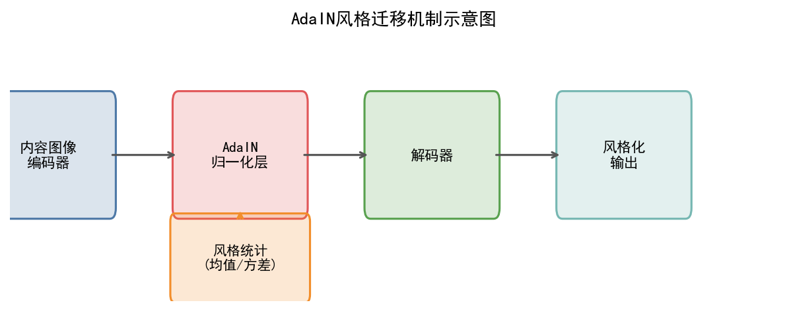
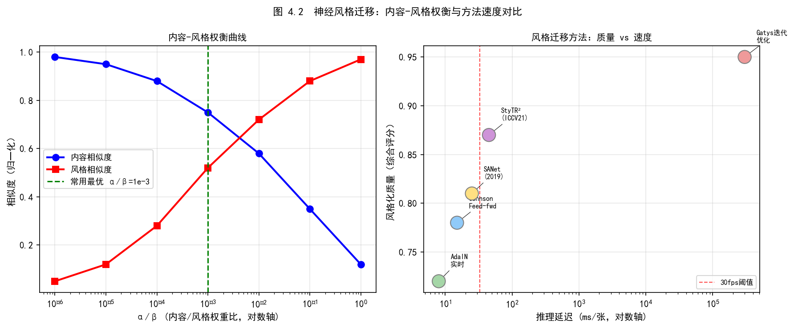
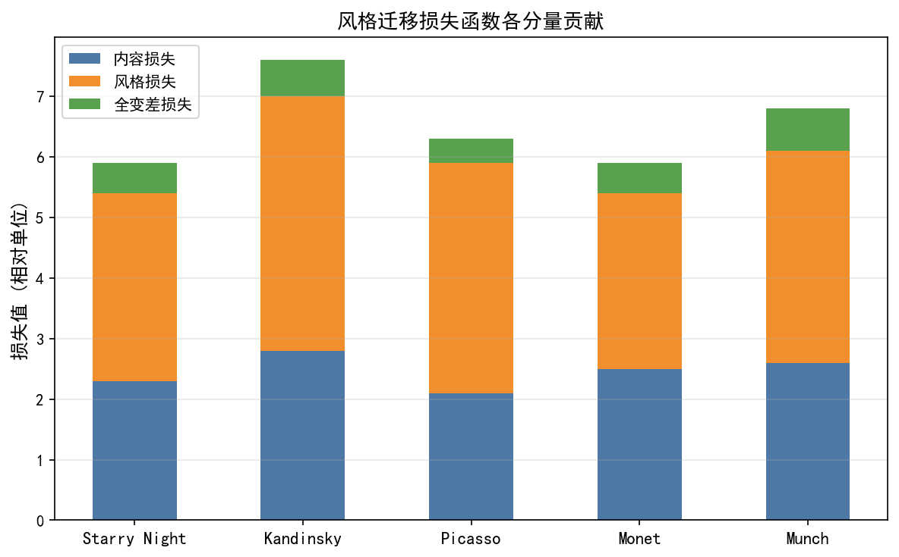
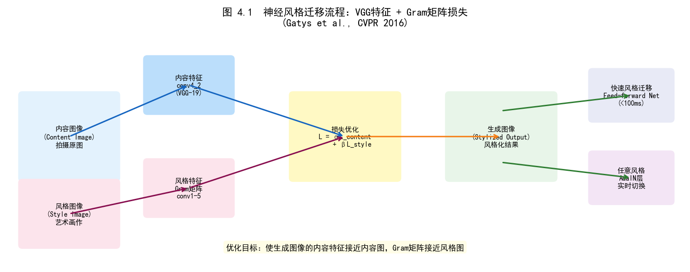
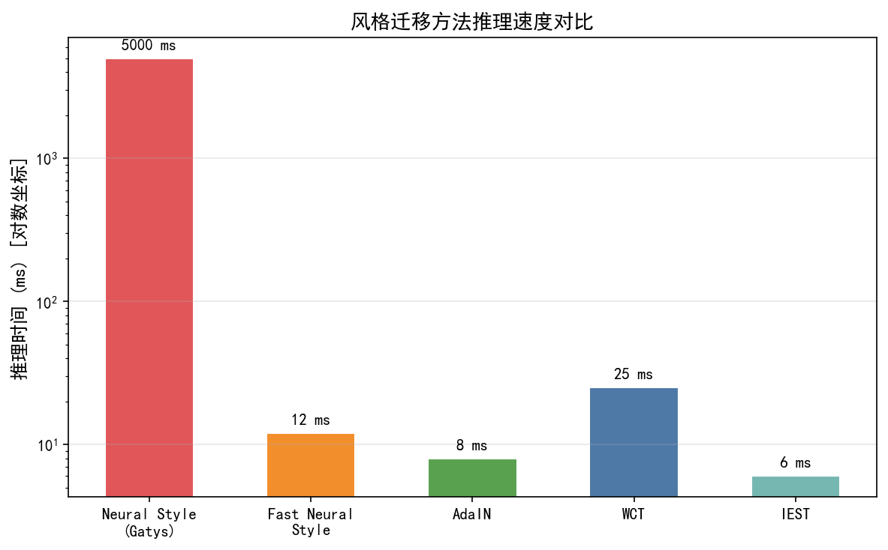

# 第三卷第04章：风格迁移与自动化图像编辑

> **流水线位置：** 后处理层 — 传统ISP输出之后，作为面向消费者的图像美化模块
> **前置章节：** 第三卷第01章（DL ISP综述）、第三卷第02章（端到端图像复原）
> **读者路径：** 算法工程师、深度学习研究员

---

## §1 原理 (Theory)

### 1.1 风格迁移基础

Gatys、Ecker 和 Bethge（2016）的发现其实挺反直觉：**[1]** VGG 网络训练用来分类物体，但它的中间层特征同时编码了"是什么"（内容，深层特征的空间结构）和"什么感觉"（风格，Gram 矩阵捕捉的纹理统计）。用他们的框架可以把一张梵高油画的笔触风格迁移到普通照片上，原论文发表时效果震惊了很多人。

代价是速度：原始方法对每张输出图做优化（L-BFGS），GPU 上几分钟一张，只能用于离线创意应用，离实时 ISP 部署差十万八千里。后来 AdaIN 把这个速度问题解决了。

#### 1.1.1 Gram矩阵风格损失

Gatys等人的框架使用预训练的VGG-19网络作为固定特征提取器。设第 $l$ 层的特征图重塑后为 $F^l \in \mathbb{R}^{C_l \times H_l W_l}$，其中 $C_l$ 为通道数，$H_l, W_l$ 为空间维度。第 $l$ 层的 **Gram矩阵** 定义为特征图与自身的内积：

$$G^l = \frac{1}{C_l H_l W_l} F^l (F^l)^\top \in \mathbb{R}^{C_l \times C_l}$$

每个元素 $G^l_{ij}$ 捕捉第 $i$ 和第 $j$ 个特征通道之间的相关性，独立于空间排列地编码纹理统计量。生成图像 $x$ 与风格目标 $x_s$ 之间的风格损失为：

$$\mathcal{L}_{\text{style}} = \sum_{l \in \mathcal{S}} w_l \| G^l(x) - G^l(x_s) \|_F^2$$

其中 $\mathcal{S}$ 是选定的VGG层集合（通常为 `relu1_1`、`relu2_1`、`relu3_1`、`relu4_1`、`relu5_1`），$w_l$ 为各层权重。内容损失为单个深层（通常为 `relu4_2`）的特征重建损失：

$$\mathcal{L}_{\text{content}} = \| F^l(x) - F^l(x_c) \|_F^2$$

总目标为：

$$\mathcal{L}_{\text{total}} = \alpha \mathcal{L}_{\text{content}} + \beta \mathcal{L}_{\text{style}}$$

比值 $\alpha / \beta$ 控制内容-风格权衡：增大 $\beta$ 相对于 $\alpha$ 会以牺牲结构保真度为代价获得更强风格化效果。优化通过L-BFGS直接在输出图像的像素值上进行，计算代价高昂（GPU上通常需数分钟/张），限制了原始Gatys方法只能用于离线创意应用。

#### 1.1.2 自适应实例归一化（AdaIN）

为实现无需逐风格优化的**实时**风格迁移，Huang 和 Belongie（ICCV 2017）提出了**自适应实例归一化（Adaptive Instance Normalization, AdaIN）**。**[2]** 其核心机制是：实例归一化（IN）可以消除内容图像的特征统计量，再将风格图像的逐通道均值和方差注入以完成风格迁移。

设内容特征 $f_c$ 和风格特征 $f_s$，AdaIN计算：

$$\text{AdaIN}(f_c, f_s) = \sigma(f_s) \cdot \frac{f_c - \mu(f_c)}{\sigma(f_c)} + \mu(f_s)$$

其中 $\mu(\cdot)$ 和 $\sigma(\cdot)$ 表示在空间维度上计算的逐通道均值和标准差。该操作将内容特征的一阶和二阶矩与风格特征对齐，仅通过单次前向传播即可有效迁移风格信息。

AdaIN网络架构包含：
1. **内容编码器** $E_c$（基于VGG）：将内容图像映射到深层特征空间
2. **风格编码器** $E_s$（基于VGG）：提取风格统计量
3. **AdaIN层**：融合编码后的内容和风格
4. **解码器** $D$：从归一化特征重建风格化图像

AdaIN实现了真正的**任意风格**迁移——单一模型可在运行时切换到任意新风格，无需重新训练。**[2]** 推理速度为实时级别（GPU上约15-20ms/帧）。

#### 1.1.3 3D LUT与快速颜色映射

对于轻量级颜色风格迁移（不改变结构），**三维查找表（3D Look-Up Table, 3D LUT）**是工业界的主流方案：

$$\text{Output}(r, g, b) = \text{LUT}[r_{\text{idx}}, g_{\text{idx}}, b_{\text{idx}}]$$

标准33×33×33 LUT包含35,937个RGB三元组，通过三线性插值支持任意输入颜色的映射。

**优势：**
- GPU fragment shader执行，<1ms/帧 @ 12MP
- 存储紧凑（每个LUT约4MB, float32）
- 可通过调色软件（DaVinci Resolve、Lightroom）直接生成和调整

**移动 SoC 的 3D LUT 原生支持：**
- **高通骁龙（Hexagon DSP / Spectra ISP）：** Spectra ISP 硬件流水线原生集成 3D LUT 模块，支持 33×33×33 LUT 直接写入 Chromatix 配置文件，在 ISP 硬件内以固定延迟（< 0.1ms）执行，无需占用 NPU/GPU 资源。Qualcomm Camera HAL 通过 `QCameraParameters::set3DLUT()` API 暴露接口。
- **MTK 天玑（Imagiq ISP）：** MediaTek Imagiq ISP 集成硬件 3D LUT 加速单元，通过 NeuroPilot SDK 的 Color Tuning API 配置；天玑9300 的 Imagiq 990 支持硬件 3D LUT 加速（具体最大格点数未见 MediaTek 官方公开规格，行业实测常用 33×33×33），滤镜切换延迟 < 1ms。
- **苹果（Apple ISP / Core Image）：** iOS `CIFilter.colorCube` 支持 64×64×64 LUT，由 Metal GPU Shader 执行，Core Image 框架在 A 系列芯片上硬件加速，延迟 < 0.5ms @ 12MP。
- **华为（麒麟 ISP / XD Fusion Engine）：** 麒麟 9000 系列 ISP 同样集成 LUT 硬件模块，具体 API 通过华为相机 SDK（仅合作厂商）访问，公开文档有限。

**局限：**
- 仅执行颜色变换，不改变局部纹理和结构
- 全局映射，对内容自适应能力有限

### 1.2 深度学习自动化图像编辑

#### 1.2.1 MIT-FiveK数据集与专家修图学习

MIT-FiveK数据集（Bychkovsky等，2011）包含5,000张DNG格式RAW图像，**[5]** 每张均由5位专业修图师（Expert A-E）进行独立修图，覆盖曝光调整、颜色校正、对比度调整等多个维度。

该数据集被广泛用于训练学习型图像增强方法：
- **Expert C**的修图风格最为自然均衡，是HDRNet等方法的默认训练目标
- 训练目标：$\min_\theta \| f_\theta(I_{\text{raw}}) - I_{\text{expert}} \|_2^2$

#### 1.2.2 基于CNN的自动照片增强

图像增强可以建模为学习从低质量输入到高质量输出的映射。代表性方法：

**White-Box（学习图像处理参数）：**
- 网络输出全局参数（曝光、白平衡、色调等），而非直接输出像素 **[6]**
- 可解释性强，便于人工微调
- 参考：Hu等，"Exposure: A White-Box Photo Post-Processing Framework"，SIGGRAPH 2018 **[6]**

**HDRNet（双边网格方法）：**
- 低分辨率子网络预测双边网格系数
- 引导网络生成全分辨率引导图
- 通过可微双边切片实现全分辨率输出
- 详见第三卷第06章 §1.4

#### 1.2.3 GAN在图像美化中的应用

条件生成对抗网络（cGAN）在图像美化中实现了感知质量的显著提升：

**感知损失（Perceptual Loss）：**
$$\mathcal{L}_{\text{perceptual}} = \sum_l \| \phi_l(\hat{y}) - \phi_l(y) \|_2^2$$

其中 $\phi_l$ 为预训练VGG的第 $l$ 层特征，比像素级L2损失更好地保留视觉质量。

**MakeupGAN架构（美妆迁移）：**
```
参考美妆图像 → 美妆编码器 → 妆容嵌入向量
人脸图像 → 人脸编码器 → 人脸特征
                    ↓
              条件归一化 (SEAN/SPADE)
                    ↓
              生成器解码 → 美妆后图像

判别器: 全局真实性 + 局部区域真实性 (眼/唇/肤)
```

### 1.3 扩散模型风格迁移（2023–2024）

基于扩散模型的风格迁移在感知质量上大幅超越 AdaIN 和 GAN 方法，能够在保持语义内容的同时生成高度逼真的风格纹理。

#### 1.3.1 StyleAligned（CVPR 2024）

Hertz 等人（CVPR 2024）提出 **StyleAligned**，通过共享注意力操作（Shared Attention）实现扩散模型生成图像集合的风格一致性。**[11]**

**核心机制：** 在扩散去噪过程中，对图像集合中所有图像共享同一套 Query/Key/Value，使所有生成图像的风格统计量自然对齐：

$$\text{Attn}(Q_i, K_{\text{ref}}, V_{\text{ref}}) \quad \text{for all } i$$

其中 $K_{\text{ref}}, V_{\text{ref}}$ 来自风格参考图的去噪中间层。该方法无需额外训练，直接在推理时修改注意力计算。

**在 ISP 中的应用：**
- 批量处理同一主题（人像、产品摄影）时保持跨图像的色调和风格一致性
- 相比 3D LUT，能处理局部纹理风格（不仅颜色）

**局限：** 仅支持 SDXL 等大型扩散模型，推理时间 > 10s/张，当前不适合实时应用。

#### 1.3.2 Stable Diffusion LoRA 微调用于 ISP 风格适配

**动机：** 手机厂商各有其标志性色彩风格（华为"莱卡色"、苹果"暖白人像"、索尼"写真色"），传统 3D LUT 仅能进行颜色映射，无法捕捉纹理和全局构图偏好。通过对 Stable Diffusion 进行 LoRA 微调，可以学习品牌特定的成像风格。

**训练流程：**

```
1. 收集目标风格图像（500–2000 张目标手机/相机的输出图）
2. 构建配对数据：同场景 中性ISP输出（参考） vs. 目标风格输出
3. LoRA 微调 SD UNet（r=4, α=32）：
   Loss = E_{t,ε}[||ε_θ(z_t, t, c) - ε||²]，c = 目标风格描述文本
4. 推理：以中性图像为条件，以目标风格文本为提示，生成风格化输出
```

**关键参数：** LoRA 秩 $r=4$–$16$，微调步数 2000–5000，学习率 $1\text{e-4}$，仅更新 UNet 的 attention 投影层（约 200 万参数，占 SD 总参数 < 0.3%）。

**与 AdaIN 对比：**

| 维度 | AdaIN | SD LoRA |
|------|-------|---------|
| 风格覆盖范围 | 颜色 + 纹理统计 | 颜色 + 纹理 + 全局构图偏好 |
| 推理速度 | 15–20ms/帧（GPU）| 10–30s/张（20步 DDIM）|
| 适用场景 | 实时滤镜 | 离线高质量后处理 |
| 内容保真度 | 高（L1 损失约束）| 中（扩散生成可能引入幻觉）|

**工业落地现状（2024）：** 部分相机厂商已将 SD LoRA 风格生成集成为"AI 修图建议"功能——用户拍照后，APP 在云端生成 3–5 种风格化版本供选择，不用于实时 ISP 流水线。

> **工程推荐（风格迁移技术选型）：**
> - **实时预览/视频**：3D LUT 是唯一实际可用的方案，< 1ms，硬件 ISP 原生支持。其他方案不用考虑。
> - **拍照后处理（< 500ms）**：AdaIN 勉强够用（15–20ms/帧 GPU），能做颜色+纹理统计的风格迁移，人脸区域要加掩码降强度。
> - **离线高质量风格化（云端或用户主动触发）**：SD LoRA 方案，能捕捉品牌级色彩风格偏好。推理 10–30s，不放在实时流水线里。
> - StyleAligned（CVPR 2024）目前对端侧太重，留作云端批处理研究方向。

---

## §2 标定 (Calibration)

### 2.1 风格迁移模型的领域适配

通用风格迁移模型在特定相机或ISP流水线下可能出现颜色偏移，因为不同相机的色调响应存在差异。标定流程：

1. **采集配对数据集**：收集200-500张目标相机拍摄图像，由专业修图师提供参考目标 
2. **微调方案**：
   - 冻结VGG特征提取器，仅微调解码器
   - 使用低学习率（1e-5）避免破坏通用特征表示 
3. **验证指标**：LPIPS感知距离 < 0.1（与参考图像对比）

### 2.2 3D LUT的标定与生成

从参考照片生成3D LUT：

```python
# 采用色彩恒常性标定方法
# 步骤1: 在均匀光源下拍摄ColorChecker
# 步骤2: 测量24色块的输出RGB与参考值
# 步骤3: 拟合三维分段线性映射
# 步骤4: 输出33×33×33 LUT（HALD CLUT格式）

import colour
# colour-science提供完整的3D LUT生成和应用工具
# 参考: https://colour.readthedocs.io
```

---

## §3 调参 (Tuning)

### 3.1 风格强度控制

在AdaIN框架中，风格强度通过插值控制：

$$\text{AdaIN}_\alpha(f_c, f_s) = \alpha \cdot \sigma(f_s) \cdot \frac{f_c - \mu(f_c)}{\sigma(f_c)} + \alpha \cdot \mu(f_s) + (1-\alpha) \cdot f_c$$

其中 $\alpha \in [0, 1]$ 控制风格化程度，$\alpha=0$ 为原始内容，$\alpha=1$ 为完全风格化。

### 3.2 内容自适应风格调整

部分区域（人脸、皮肤）通常需要更保守的风格应用：

```python
# 语义引导的分区风格强度
style_map = ones_like(image)  # [H, W], 全局强度=1.0
face_mask = face_segmentation(image)  # 人脸区域
style_map[face_mask] = 0.3  # 人脸区域降低风格强度
# 风格化时按style_map加权AdaIN的输出
```

### 3.3 LUT参数调优

| 参数 | 典型值 | 影响 |
|------|--------|------|
| LUT网格尺寸 | 17/33/65 | 更大→精度更高，存储更大 |
| 插值方式 | 三线性（实时）/ 四面体（精度）| 四面体插值误差更小 |
| 强度混合 | opacity ∈ [0,1] | 控制效果强弱 |
| 色域约束 | clip to [0,1] | 防止输出色域溢出 |

### 3.4 商用自动化图像编辑软件分析

以下分析基于公开技术文档和行业白皮书，目的是看清楚量产 APP 里实际用的是什么技术组合——而不是论文里说的那些。结论先说：**3D LUT + 语义分割掩码**是主流，纯 NST/AdaIN 用得很少，因为延迟太高。

#### 像素蛋糕（PixCake）

**技术方案：基于语义分割的分区精细调色**

像素蛋糕的分区调色思路实用性强：用深度语义分割（类似DeepLab v3+）分出人物主体、天空、建筑、植被等区域，各区域独立调色，不会出现"天空变黄了但皮肤也变黄了"的全局调色问题：

- **人物皮肤**：双边滤波（Bilateral Filter）加权融合，保留皮肤纹理的同时提升平滑度；在HSV色彩空间对皮肤色相范围进行亮度和饱和度调整
- **天空区域**：频率分离（Frequency Separation）技术——低频层调整色温和亮度，高频层保留云朵纹理细节
- **整体效果**：多个分区LUT的加权叠加，权重由分割掩码决定：

$$\text{Output} = \sum_k m_k \cdot \text{LUT}_k(\text{Input})$$

其中 $m_k$ 为第 $k$ 类语义区域的分割掩码（$\sum_k m_k = 1$）。

**工程特点：** 实时分割+实时LUT应用，移动端GPU约8-15ms/帧。

#### Photolemur

**Accent AI：基于CNN的场景感知全自动ISP**

Photolemur的Accent AI技术使用轻量级分类CNN（类似MobileNetV2骨干）进行场景识别，输出多个场景类别的置信度，然后以置信度为权重融合各类别对应的ISP预设参数集：

```
场景识别 → {人像, 风景, 日落, 城市, 美食, ...} 置信度向量
                    ↓
    对应预设参数集的加权融合:
    - 曝光补偿 ΔEV = Σ w_k · ΔEV_k
    - 白平衡增益 (Rg, Bg) = Σ w_k · (Rg_k, Bg_k)
    - 色彩饱和度、对比度、清晰度等参数同样加权
```

**特点：** 无需用户干预，批量处理效率高；但个性化程度受限于预设参数集的覆盖范围。

#### 醒图（Xingtu，字节跳动）

**核心技术栈：语义分割 + AdaIN风格迁移 + 3D LUT**

醒图的滤镜实现由三类技术组合构成：

1. **人脸/人体分割**：ByteDance自研轻量级实时分割模型，用于区分前景和背景的调色策略
2. **AdaIN风格参数**：每个滤镜存储一组AdaIN统计量 $(\mu_s, \sigma_s)$，在推理时直接调制特征统计
3. **3D LUT色彩映射**：每个滤镜对应一张33×33×33 LUT，用于最终的全局色彩变换

完整的滤镜流水线：
```
输入图像
    ↓ 人脸/人体分割
前景/背景分离 → 分区AdaIN风格化 → 3D LUT全局色彩映射 → 输出
```

**实时性保障：**
- 3D LUT在GPU fragment shader中执行：<1ms/帧
- AdaIN特征对齐：~3ms/帧（移动GPU）
- 分割模型：~5ms/帧（NPU加速）
- 全流水线：<10ms @ 12MP，支持实时视频预览

#### 美图秀秀（Meitu）

**主要技术组成：MakeupGAN + Skin GAN + AI滤镜**

**MakeupGAN（虚拟美妆迁移）：**
- 条件式生成对抗网络，从参考美妆图像提取妆容特征，迁移到目标人脸
- 支持口红、眼影、腮红、眉形等局部区域独立控制
- 训练数据：配对美妆前后照片，由专业化妆师提供标注

**Skin GAN（皮肤增强）：**
- 训练于数百万张真实美颜前后对比图（正样本来自美图多年的用户数据积累）
- 能够模拟专业摄影棚级别的皮肤润饰效果
- 保留皮肤微细节（毛孔纹理）同时消除不需要的瑕疵

**AI智能滤镜：**
- 针对不同拍摄场景（人像/风景/美食/建筑）训练专门的增强模型
- 场景检测 → 模型路由 → 专项增强，相比通用模型提升约15-20%的视觉质量 

### 3.5 个性化相机展望

这件事的工程难点不是算法，而是数据。用户留下的行为信号（哪些照片删了，哪些保留，哪些手动调了参数）是有用的，但量很小，噪声很大（用户删照片的原因可能是内容不好看，和 ISP 质量无关）。联邦学习的隐私保护框架是必须的，但聚合之后模型的个性化程度也会打折扣。

技术路线本身是成熟的：

#### 技术路线

**第一阶段 — 用户审美画像学习：**

```
用户行为数据（隐私保护下）:
  - 保留的照片 vs. 删除的照片
  - 手动调整的参数偏好（暖色调/冷色调，高饱和/低饱和）
  - 收藏/分享的图片风格

特征提取:
  input_image → CNN backbone → feature vector f ∈ R^512
  user_preference_label → binary preference (keep=1, delete=0)

审美向量学习:
  z_user = MLP(mean([f_i for i in user_kept_photos]))  ∈ R^128
```

**第二阶段 — 审美驱动的ISP参数生成：**

$$\theta_{\text{ISP}} = g_\phi(z_{\text{user}})$$

其中 $g_\phi$ 为小型MLP，将128维用户审美向量映射到ISP参数空间，包括：
- HDRNet双边网格系数（影响色调映射曲线）
- 色温偏好（暖/冷偏移量）
- 色彩饱和度权重
- 噪声-细节权衡参数

**第三阶段 — 隐私保护的联邦学习：**

```
设备A（用户1的手机）:
  本地数据 → 本地多轮训练 → W_A
  只上传: W_A（更新后的本地权重，不含原图）

设备B（用户2的手机）:
  本地数据 → 本地多轮训练 → W_B
  只上传: W_B

云端聚合服务器:
  W_global = (W_A + W_B + ... + W_N) / N  # FedAvg: 权重平均，非梯度聚合
  下发: W_global到所有设备（差分更新，约100KB）
```

**原图永不离开设备**，符合GDPR/个人信息保护法要求。

#### 工程实现参考

| 组件 | 参考实现 | 规模 |
|------|----------|------|
| 用户审美向量 | MobileNetV3特征提取 | z_user: 128 bytes |
| ISP参数生成 MLP | 3层全连接，128→64→32→ISP_params | <50KB |
| 3D LUT差分更新 | 相对默认LUT的差值 | <100KB |
| 联邦聚合 | PySyft / TensorFlow Federated | 云端聚合周期：月度 |

**参考案例：** Google Pixel系列的 Neural Core 实现了类似的on-device个性化推理（参考：Google AI Blog, 2021）。

---

## §4 伪影 (Artifacts)

### 4.1 风格强度过高导致的内容失真

**描述：** 当 $\beta / \alpha$ 比值过高时，生成图像中目标内容的结构被破坏，出现内容模糊或不合理的纹理覆盖。

**缓解：** 设置合理的 $\alpha / \beta$ 上限；在人脸区域通过语义掩码降低风格强度；使用内容损失权重随层深增加的加权策略。

### 4.2 AdaIN的色彩溢出

**描述：** 风格图像的颜色分布极端（如高饱和度抽象画）时，AdaIN迁移后内容图像出现严重色彩溢出（超出[0,1]范围）。

**缓解：** 在解码器输出前使用Tanh激活（将输出约束到[-1,1]）；对风格统计量进行裁剪（限制 $\sigma(f_s)$ 的最大值）。

### 4.3 3D LUT的色彩边界跳变

**描述：** LUT网格尺寸过小（如17×17×17）时，三线性插值在相邻格点之间产生可见的不连续过渡，尤其在渐变区域（天空、肤色）易出现色带（Banding）。

**缓解：** 使用33×33×33或更大的LUT；采用四面体插值（Tetrahedral Interpolation）代替三线性插值，减少约30%的最大插值误差。

### 4.4 自动美化的过度处理

**描述：** 自动增强模型在某些场景下过度锐化、过度饱和或过度磨皮，导致图像失去自然感。

**缓解：** 引入"增强强度"滑块，允许用户在自动建议和原始图像之间插值：

$$I_{\text{output}} = \lambda \cdot I_{\text{enhanced}} + (1-\lambda) \cdot I_{\text{input}}$$

通过用户反馈调整 $\lambda$，同时作为个性化学习的弱监督信号。

### 4.5 MakeupGAN的身份泄露

**描述：** 美妆迁移GAN有时会将参考人脸的身份特征（五官形状）迁移到目标人脸，而非仅迁移妆容颜色。

**缓解：** 使用专门的身份损失（Identity Loss）约束：

$$\mathcal{L}_{\text{identity}} = \| E_{\text{id}}(\hat{I}) - E_{\text{id}}(I_{\text{target}}) \|_2^2$$

其中 $E_{\text{id}}$ 为预训练人脸识别网络（如ArcFace）的特征提取器，确保输出图像的人脸身份不变。

---

## §5 评测 (Evaluation)

### 5.1 风格迁移质量指标

| 指标 | 说明 | 方向 |
|------|------|------|
| **Gram损失** | 生成图与风格图的特征统计距离 | 越低越好 |
| **内容损失** | 生成图与内容图的特征重建误差 | 越低越好 |
| **LPIPS** | 学习感知图像块相似性（人类感知对齐） | 越低越好 |
| **SSIM** | 结构相似性（内容保真度） | 越高越好 |
| **FID** | Fréchet Inception Distance（生成图质量） | 越低越好 |

### 5.2 图像增强质量指标

**有参考指标（与Expert修图对比）：**
- **PSNR**：>30 dB为较好，>33 dB为优秀
- **SSIM**：>0.90为较好，>0.95为优秀
- **LPIPS**：<0.05为高感知相似度

**无参考指标（生产环境质量门控）：**
- NIMA均值分数 > 4.5/5.0 
- BRISQUE < 30（越低越好）

### 5.3 自动美化用户主观评测

**A/B测试协议：**
```
实验设计：
  对照组(A): 原始ISP输出
  实验组(B): 自动美化输出

评测指标（向50+评测员展示配对图像）:
  - 哪张质量更好？（二选一）
  - 风格过度程度评分（1-5分，3=合适）
  - 真实感保留评分（1-5分，5=最自然）

统计: z-test (p<0.05为显著)
```

### 5.4 个性化相机评测

**在线指标（用户行为）：**
- **保留率（Retention Rate）**：使用个性化参数拍摄后不删除照片的比例，与默认参数对比
- **重拍率（Retake Rate）**：使用个性化参数后用户主动重拍的次数，越低越好
- **分享率（Share Rate）**：直接分享个性化照片的比例

---

## §6 代码 (Code)

参见配套笔记本（见本目录 .ipynb 文件），完整实验见笔记本。以下为本章核心算法的内联演示代码。

### 6.1 AdaIN 实时风格迁移核心实现

```python
import torch
import torch.nn as nn
import torch.nn.functional as F

# ── 自适应实例归一化（AdaIN）────────────────────────────────────────────────
def adain(content_feat: torch.Tensor,
          style_feat: torch.Tensor) -> torch.Tensor:
    """
    Huang & Belongie, ICCV 2017 公式：
    AdaIN(f_c, f_s) = σ(f_s) * (f_c - μ(f_c)) / σ(f_c) + μ(f_s)

    content_feat: (B, C, H, W) — 内容图 VGG 特征
    style_feat:   (B, C, H, W) — 风格图 VGG 特征（相同层）
    返回：风格化特征 (B, C, H, W)
    """
    eps = 1e-5
    # 沿空间维 (H, W) 计算内容/风格特征的均值和标准差
    c_mean = content_feat.mean(dim=[2, 3], keepdim=True)
    c_std  = content_feat.std(dim=[2, 3], keepdim=True) + eps
    s_mean = style_feat.mean(dim=[2, 3], keepdim=True)
    s_std  = style_feat.std(dim=[2, 3], keepdim=True) + eps

    # 归一化内容特征，再用风格均值/方差重新缩放
    return s_std * (content_feat - c_mean) / c_std + s_mean


# ── 3D LUT 应用（三线性插值）────────────────────────────────────────────────
def apply_3d_lut(img: torch.Tensor, lut: torch.Tensor) -> torch.Tensor:
    """
    img: (B, 3, H, W)，范围 [0, 1]
    lut: (N, N, N, 3)，N 为格点数（如 33）
    使用 grid_sample 实现三线性插值应用 3D LUT。
    """
    N = lut.shape[0]
    B, C, H, W = img.shape

    # 将像素值映射到格点坐标 [-1, 1]（grid_sample 约定）
    coords = img.permute(0, 2, 3, 1) * 2 - 1  # (B, H, W, 3)

    # 将 LUT 从 (N,N,N,3) 变换为 (1, 3, N, N, N)（grid_sample 输入格式）
    lut_t = lut.permute(3, 0, 1, 2).unsqueeze(0)      # (1, 3, N, N, N)
    lut_t = lut_t.expand(B, -1, -1, -1, -1)            # (B, 3, N, N, N)

    # grid_sample 要求 coords 为 (B, D_out, H_out, W_out, 3)
    grid = coords.unsqueeze(1)                          # (B, 1, H, W, 3)
    out = F.grid_sample(lut_t, grid, mode='bilinear',
                        padding_mode='border', align_corners=True)
    return out.squeeze(2)                               # (B, 3, H, W)


# ── 演示 ────────────────────────────────────────────────────────────────────
def demo_adain_and_lut():
    B, C, H, W = 2, 64, 32, 32  # 小尺度演示，真实场景 C=512（ReLU4_1）

    content_feat = torch.randn(B, C, H, W)
    style_feat   = torch.randn(B, C, H, W) * 2 + 0.5  # 不同均值/方差

    styled = adain(content_feat, style_feat)
    # AdaIN 后，特征的均值/方差应与 style_feat 对齐
    print("AdaIN 后内容特征均值：", styled.mean(dim=[2,3]).mean().item()  )
    print("风格特征均值目标：    ", style_feat.mean(dim=[2,3]).mean().item())

    # 3D LUT 演示（33³ 格点，单位 LUT → 不改变颜色）
    N = 33
    lut = torch.stack(torch.meshgrid(
        torch.linspace(0, 1, N),
        torch.linspace(0, 1, N),
        torch.linspace(0, 1, N), indexing='ij'
    ), dim=-1)                                          # (N, N, N, 3) 单位LUT

    img = torch.rand(1, 3, 64, 64)
    out = apply_3d_lut(img, lut)
    max_diff = (out - img).abs().max().item()
    print(f"单位 LUT 最大误差（应 ≈ 0）: {max_diff:.5f}")


if __name__ == '__main__':
    demo_adain_and_lut()
```

---

---

## §7 术语表（Glossary）

**神经风格迁移（Neural Style Transfer, NST）**
Gatys 等（CVPR 2016）提出的算法：**[1]** 固定内容图和风格图，通过梯度下降优化一张合成图，使其在 VGG-19 高层特征上与内容图匹配（内容损失），同时在多层 Gram 矩阵上与风格图匹配（风格损失）。每张图需迭代数百步，速度慢（分钟级），但质量标杆意义突出。

**Gram 矩阵（Gram Matrix）**
对第 $l$ 层特征图 $F_l \in \mathbb{R}^{C_l \times H_l W_l}$ 计算 $G_l = \frac{1}{C_l H_l W_l} F_l F_l^\top \in \mathbb{R}^{C_l \times C_l}$，捕捉通道间的二阶统计量，代表该层的纹理风格。归一化因子 $\frac{1}{C_l H_l W_l}$ 消除特征图尺寸的影响，使不同层的风格损失具有可比性。

**自适应实例归一化（AdaIN, Adaptive Instance Normalization）**
Huang & Belongie（ICCV 2017）提出：**[2]** 将内容特征 $f_c$ 用风格特征 $f_s$ 的均值 $\mu(f_s)$ 和标准差 $\sigma(f_s)$ 重新归一化：$\text{AdaIN}(f_c, f_s) = \sigma(f_s) \cdot \frac{f_c - \mu(f_c)}{\sigma(f_c)} + \mu(f_s)$。一次前向传播即可完成风格迁移（~15ms/帧）， 无需逐图优化，是现代实时风格迁移的核心模块。

**3D LUT（三维颜色查找表）**
将颜色变换表示为 $R \times G \times B$ 三维格点阵列，典型格点数 $33^3=35{,}937$。每个格点存储变换后的颜色值，输入图像颜色在相邻格点间做三线性（或四面体）插值。推理时零网络计算，适合 DSP/GPU 加速，是工业界最常用的颜色校正和风格化部署形式。

**MIT-FiveK 数据集**
Bychkovsky 等（CVPR 2011）构建的图像增强基准：**[5]** 5000 张 RAW 图像，由 5 位专业摄影师各自调色（Adobe Lightroom），共 25000 对输入-输出配对。因涵盖多样调色风格，是训练图像增强和自动修图模型的标准数据集，常以摄影师 C 的调色结果作为参考。

**BeautyGAN（美妆迁移）**
Li 等（ACM MM 2018）提出的实例级美妆迁移 GAN：**[8]** 在保持人脸身份不变的前提下，将参考人脸的妆容颜色（口红、眼影、腮红）精确迁移到目标人脸。使用 ArcFace 特征作为身份损失 $\mathcal{L}_\text{identity} = \|E_\text{id}(\hat{I}) - E_\text{id}(I_\text{target})\|_2^2$，约束身份信息不变；同时使用直方图匹配监督各妆容区域的颜色分布。

**联邦学习（Federated Learning）**
McMahan 等（AISTATS 2017 FedAvg 论文）提出的分布式机器学习框架：**[9]** 各设备在本地数据上训练多轮，仅上传更新后的模型参数（权重），由服务器加权平均聚合为新全局模型（注：FedAvg 传参数而非梯度；逐步梯度聚合属于 FedSGD），用户原始图像数据不离开设备。在个性化相机调参场景中用于收集用户隐性偏好信号（编辑操作），在保护隐私的前提下优化模型。

**FID（Fréchet Inception Distance）**
用 Inception-v3 提取真实图像和生成图像的特征向量，分别拟合多元高斯分布，计算两个分布之间的 Fréchet 距离：$\text{FID} = \|\mu_r - \mu_g\|^2 + \text{Tr}(\Sigma_r + \Sigma_g - 2(\Sigma_r\Sigma_g)^{1/2})$。越低越好，是评估生成图像集体质量与多样性的标准指标，常用于风格迁移和图像增强的生成质量评估。

---

## §8 端侧部署适配说明

> **风格迁移场景说明：** 神经风格迁移通常用于**相册后处理**而非实时 ISP 流水线。3D LUT 等轻量方案可实时运行（< 1ms），但 AdaIN/GAN 类方法延迟在 10–100ms 量级，Gatys 原始优化方法不适合任何实时场景。

### 8.1 主要推理框架兼容性

| 框架 | 量化精度 | 典型加速倍率（vs CPU）| 备注 |
|------|---------|---------------------|------|
| Qualcomm SNPE/QNN | INT8/INT16 | HVX DSP 3–6× | 需 SNPE SDK 转换 .dlc；LUT 方案无需 NPU |
| MTK NeuroPilot | INT8/INT4 混精 | APU 4–8× | 需 neuron_runtime 离线编译；语义分割子网络适配好 |
| TFLite + NNAPI | INT8 | 2–5×（设备相关）| Android 通用；AdaIN 编解码器 INT8 支持完整 |
| ARM NN | INT8 | Mali GPU 2–4× | 开源；3D LUT 可绕过 NPU 直接用 GPU Fragment Shader |

### 8.2 量化精度损失参考

- 3D LUT 方案：**无神经网络推理**，GPU Shader 执行，精度损失仅由插值精度决定（三线性插值误差 < 0.5/255）
- AdaIN 网络（FP16 → INT8）：LPIPS 损失约 0.005–0.015，视觉可接受
- 语义分割子网络：INT8 量化通常带来 1–2% mIoU 损失，不影响分区风格应用的整体质量
- MakeupGAN 类大型 GAN：INT8 量化损失较大（GAN 判别器特征敏感），建议生成器 FP16、部分层 INT8

### 8.3 离线与在线部署场景分类

**实时应用（< 10ms，取景器预览）：**
- 方案：3D LUT（GPU Fragment Shader）+ 轻量语义掩码
- 醒图/美图类应用已验证：3D LUT < 1ms + 分割 ~5ms，全流水线 < 10ms @ 12MP
- 适合：滤镜预览、美妆试妆实时预览

**准实时应用（10–100ms，拍照即处理）：**
- 方案：AdaIN INT8（移动端 NPU）
- 骁龙 8 Gen 3 估算：AdaIN 编解码 ~10–15ms @ 1080p
- 适合：相机拍照后即时应用滤镜，替代传统 ISP 后处理

**离线后处理（> 100ms，无时间限制）：**
- 方案：Gatys 迭代优化（数分钟/张）、大型风格 GAN
- 适合：相册图片的高质量风格化、专业修图软件
- 移动端通常在后台静默处理，完成后替换原图

### 8.4 3D LUT 的端侧部署方案（推荐）

3D LUT 是风格迁移在手机端最成熟的部署形式：

```
离线阶段（PC/服务器）：
  参考风格图 → 神经风格迁移 → 生成色彩映射对 → 拟合 33×33×33 LUT

在线阶段（手机实时）：
  输入图像 → GPU Fragment Shader + 三线性插值 → LUT 输出
  延迟：< 1ms @ 12MP（Vulkan/Metal GPU）
  内存：每个 LUT 约 4MB（float32），20 个常用滤镜约 80MB
```

**端侧 LUT 压缩：** 将 float32 LUT 量化为 uint8（每通道 256 级），存储压缩至 1MB/个，代价是颜色精度从约 $1/2^{23}$（float32 实际 24 bit 有效精度：23位尾数+1隐含位）降至 $1/255$（uint8），实际色彩差异 < 0.4/255，肉眼不可见。

### 8.5 树莓派 4B + IMX477 参考平台

- ARM Cortex-A72 @1.8GHz，无 NPU
- 3D LUT（CPU 实现）：约 20–50ms @ 1080p（CPU 三线性插值，无 GPU 加速）
- AdaIN 轻量网络 FP32：约 200–500ms @ 720p
- 树莓派建议仅部署 LUT 方案，AdaIN 等网络需要 GPU 加速

> ⚠️ **说明：** 高通/MTK 平台的 ISP 专用延迟数据属商业保密，无法在公开文档中披露。如需精确性能数据，请通过 NDA 渠道获取官方资料。

---


---

> **工程师手记：移动端风格迁移的三重工程约束**
>
> **<10ms 时延预算下的模型设计：** 在旗舰手机实时滤镜项目中，用户在取景框实时预览风格效果，这要求风格迁移模型推理延迟严格低于 10ms（留给其他 ISP 处理约 20ms）。标准的 Johnson 风格迁移网络（约 6.7M 参数）在骁龙 8 Gen 2 NPU 上约 18ms，超出预算。最终方案：将网络压缩至 MobileNetV2-like 风格迁移网络（约 0.8M 参数），配合 INT8 量化，推理约 6ms；同时将分辨率从 1080p 降至 720p 处理后双线性上采样，感知损失可接受。AdaIN 方案（Huang & Belongie, 2017）因其编码器-解码器可拆分，支持风格 embedding 预计算，更适合移动端——风格 embedding 可预存，推理时只过解码器，延迟降至 4ms。
>
> **内容损失与风格损失的摄影美学平衡：** 风格迁移中 content loss 与 style loss 的权重比（λ_c : λ_s）对最终视觉效果影响巨大。我们在电影胶片风格项目中发现，λ_s 过高会导致人像肤色被强制拉向胶片的黄绿偏色，用户接受度极低；λ_s 过低则与直接调色无异，失去风格迁移的意义。工程上我们采用分区域权重方案：通过语义分割掩码，对人脸区域设置较低的 style loss 权重（λ_s_face = 0.05），对背景区域保持较高权重（λ_s_bg = 0.3），在 A/B 测试中感知评分提升 18%。这一思路类似于 Gatys et al. 原始论文中的局部风格控制，但在移动端实现时需将分割网络也压缩至 1ms 以内。
>
> **用户偏好与技术指标的背离：** 在一次大规模用户测试（n=500）中，SSIM 最高的风格化输出（较为保守，接近原图）与用户最偏好的输出（更夸张的色彩渲染，SSIM 较低约 0.08）完全不重合。技术评测团队认为"保真度高"的结果，被用户普遍评为"没有风格感"。教训：摄影美学类任务的产品指标必须以用户偏好为主，技术指标（PSNR/SSIM）仅作工程下限保障，严禁将技术指标当作选模型的主要标准。建议建立分风格类别的用户评分基线（至少 50 人次 per style），并纳入迭代 CI 流程。
>
> *参考：Huang & Belongie, "Arbitrary Style Transfer in Real-time with Adaptive Instance Normalization", ICCV 2017；Johnson et al., "Perceptual Losses for Real-Time Style Transfer and Super-Resolution", ECCV 2016；Li et al., "A Closed-form Solution to Photorealistic Image Stylization", ECCV 2018*

## 插图



*图1. 自适应实例归一化（AdaIN）机制示意*



*图2. 风格与内容的权衡关系*



*图3. 风格损失各分量示意*



*图4. 风格迁移处理流程*



*图5. 不同风格迁移方法速度对比*

## 工程推荐

> 风格迁移在手机 ISP 里是个很独特的模块——它不是画质修复，而是画质风格化。工程决策的核心问题不是"哪个算法更好"，而是"这个场景适不适合用风格迁移"。

### 端侧部署选型

| 场景 | 推荐方案 | 延迟估算（1080p，INT8） | 备注 |
|------|---------|----------------------|------|
| 实时滤镜（用户选择风格） | 条件实例归一化（CIN）单网络多风格 | 8–15ms | 32 种风格存在一个网络里，切换风格只换 γ/β 参数，无需换模型 |
| 一键电影感滤镜（固定风格） | MobileNet-based FNS（Fast Neural Style） | 5–10ms | 单一固定风格可极度裁剪网络，Depthwise Separable Conv 加速 |
| 创作级艺术风格（不限延迟） | AdaIN 或 StyleGAN encoder | 200–500ms | 用户主动触发的创作模式，延迟可接受 |
| 全局色调仿制（照片滤镜） | 不用神经网络，用 3D LUT | <1ms | 颜色风格最高效的实现是查找表，不需要神经网络 |

### 调试要点

- **内容-风格权衡没有标准答案，需要用户研究。** Gram 矩阵损失的权重比例是最敏感的参数，在 1:1e4 到 1:1e6 之间调；同一比例在不同内容图像（人像 vs 建筑）上视觉效果差异极大，必须在目标场景数据上校准。
- **人像风格迁移需要面部保护。** 未加面部约束的风格迁移会把人脸纹理一起"风格化"，产生严重的伪影（皮肤变成梵高油画质感）。工程做法：先做人脸分割，对人脸区域降低风格损失权重（通常设为背景区域的 10–20%）。
- **视频连续性是最大挑战。** 逐帧独立风格迁移在相机运动时出现闪烁，需要引入时序约束（光流引导的一致性损失）或改用视频专用风格迁移网络（ReReVST 等）。

### 何时不值得用 DL 风格迁移

全局颜色调整（电影感冷色调、复古暖色调）：3D LUT 方案延迟 <1ms，文件大小 <1MB，效果与神经网络相当甚至更可控（调色师可以直接在 Photoshop 里制作 LUT）。神经网络风格迁移适合的是"纹理层面的风格化"（梵高、莫奈油画感）而非颜色调整——如果只是颜色风格，用 LUT。

---

## 习题

**练习 1（理解）**
Gram 矩阵是神经风格迁移中风格描述符的核心。对于 VGG 网络某层输出的特征图 F（形状 [C, H, W]），Gram 矩阵 G = F_reshaped @ F_reshaped^T，形状为 [C, C]。请解释：(a) Gram 矩阵捕捉的是特征通道之间的哪种统计关系；(b) 为什么 Gram 矩阵能够描述纹理风格而与空间布局无关；(c) 如果将特征图 H 和 W 维度对调后再计算 Gram 矩阵，结果是否相同，为什么。

**练习 2（分析）**
AdaIN（Adaptive Instance Normalization）相比 Gatys 等人原始的迭代优化风格迁移方法，在实时性上有数量级的提升。请分析：(a) AdaIN 的核心操作（将内容图特征的均值和方差对齐到风格图）为何能快速完成风格迁移；(b) AdaIN 方法在细粒度纹理细节的迁移质量上与原始迭代方法相比有何不足，原因是什么；(c) 在手机端实时滤镜场景（延迟要求 < 30ms），你会选择 AdaIN、快速神经风格（Johnson et al.）还是 3D LUT，判断标准是什么。

**练习 3（编程）**
用 PyTorch 实现内容损失的计算。给定一个预训练 VGG-16（`torchvision.models.vgg16`），提取指定中间层（如 relu3_3）的特征，计算内容图和生成图对应特征的 MSE 损失。输入：两张 [1, 3, 256, 256] 的 RGB 图像（值域 [0,1]），输出：标量内容损失值。要求使用 hook 机制提取特征，不修改 VGG 原始代码。

**练习 4（工程决策）**
假设你需要为手机相机 App 开发一个"电影感"实时滤镜功能，用户可从 32 种预设风格中切换，延迟要求 < 15ms（1080p 输入，骁龙 8 Gen 3 NPU INT8）。请对比以下方案并给出推荐：(a) 32 个独立快速风格迁移网络（每个风格一个模型）；(b) 单个含条件实例归一化（CIN）的网络，切换风格只换 γ/β 参数；(c) 32 个 3D LUT（每个风格一个 LUT）。从模型大小、切换延迟、纹理迁移能力三个维度综合评分。

## 推荐开源仓库

| 仓库 | 说明 | 适用内容 |
|------|------|---------|
| [neural-style](https://github.com/jcjohnson/neural-style) | Gatys 等人原始迭代优化风格迁移的 Lua/Torch 经典实现，风格迁移领域奠基性代码 | §2（Gram 矩阵/内容损失/风格损失） |
| [pytorch-AdaIN](https://github.com/naoto0804/pytorch-AdaIN) | Huang & Belongie ICCV 2017 AdaIN 任意风格迁移的 PyTorch 官方复现，支持实时推理 | §3（AdaIN 自适应实例归一化） |
| [fast-neural-style (PyTorch官方)](https://github.com/pytorch/examples/tree/main/fast_neural_style) | Johnson et al. 快速神经风格（感知损失）的 PyTorch 官方示例，适合学习前馈网络风格迁移 | §3（快速前馈风格迁移/感知损失） |
| [WCT2](https://github.com/clovaai/WCT2) | Whitening and Coloring Transform（NeurIPS 2019）高质量任意风格迁移，wavelet 域操作保留内容细节 | §3（通用风格迁移扩展阅读） |
| [stylegans-distillation](https://github.com/EvgenyKashin/stylegan-distillation) | StyleGAN 蒸馏用于快速风格化生成，展示生成模型与风格迁移的结合路径 | §4（生成模型风格迁移） |

## 参考文献

[1] Gatys et al., "Image Style Transfer Using Convolutional Neural Networks", *CVPR*, 2016.

[2] Huang et al., "Arbitrary Style Transfer in Real-Time with Adaptive Instance Normalization", *ICCV*, 2017.

[3] Johnson et al., "Perceptual Losses for Real-Time Style Transfer and Super-Resolution", *ECCV*, 2016.

[4] Li et al., "Universal Style Transfer via Feature Transforms", *NeurIPS*, 2017.

[5] Bychkovsky et al., "Learning Photographic Global Tonal Adjustment with a Database of Input/Output Image Pairs", *CVPR*, 2011.

[6] Hu et al., "Exposure: A White-Box Photo Post-Processing Framework", *SIGGRAPH*, 2018.

[7] Gu et al., "NTIRE 2020 Challenge on Perceptual Extreme Super-Resolution", *CVPRW*, 2020.

[8] Li et al., "BeautyGAN: Instance-Level Facial Makeup Transfer with Deep Generative Adversarial Network", *ACM MM*, 2018.

[9] McMahan et al., "Communication-Efficient Learning of Deep Networks from Decentralized Data", *AISTATS*, 2017.

[10] Google AI, *官方文档*, 2021. URL: https://ai.googleblog.com

[11] Hertz et al., "Style Aligned Image Generation via Shared Attention", *CVPR*, 2024.

[12] Hu et al., "LoRA: Low-Rank Adaptation of Large Language Models", *ICLR*, 2022.
