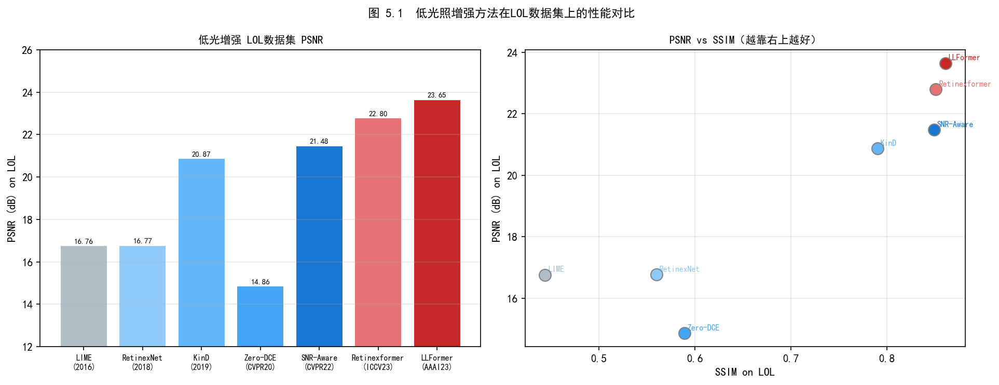
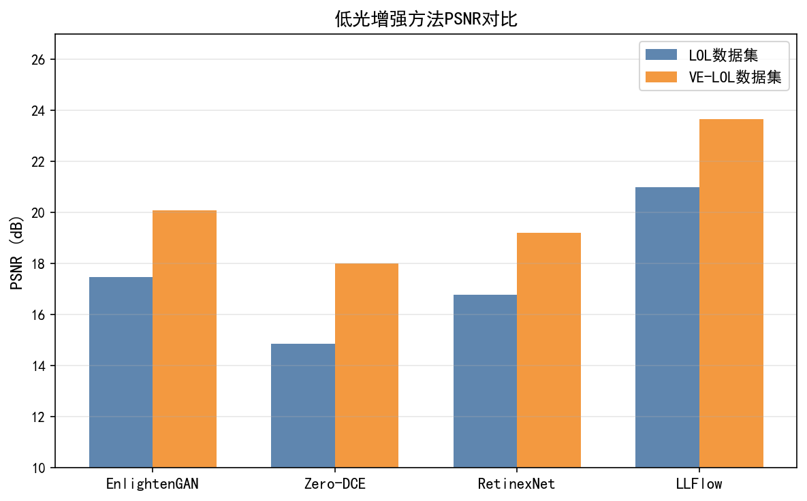
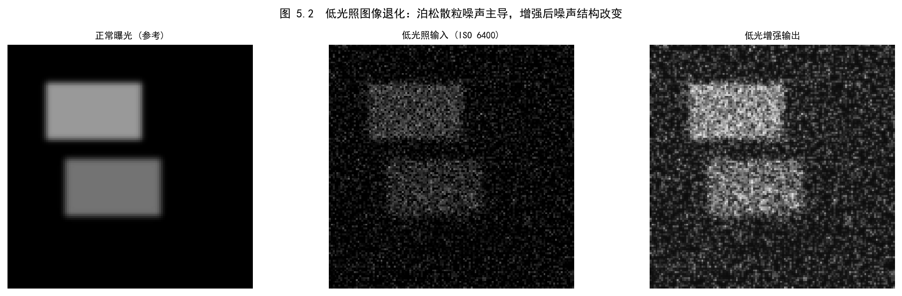
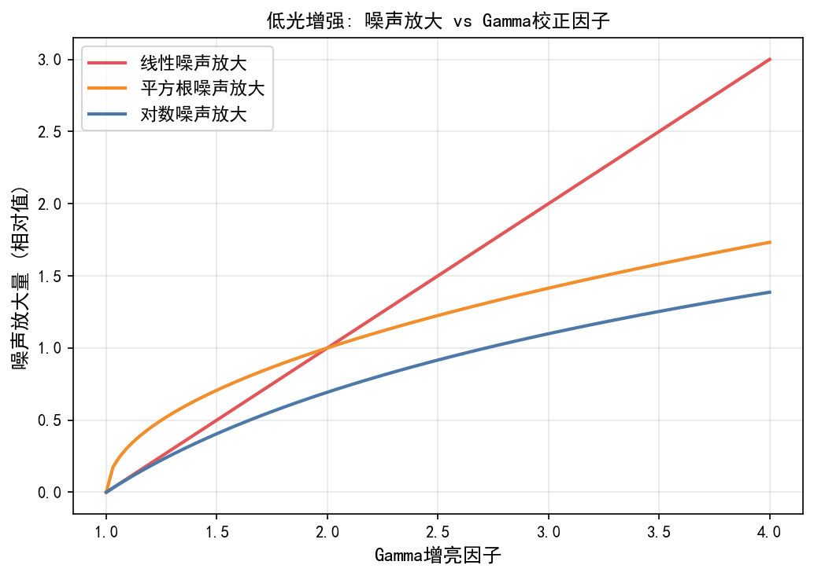
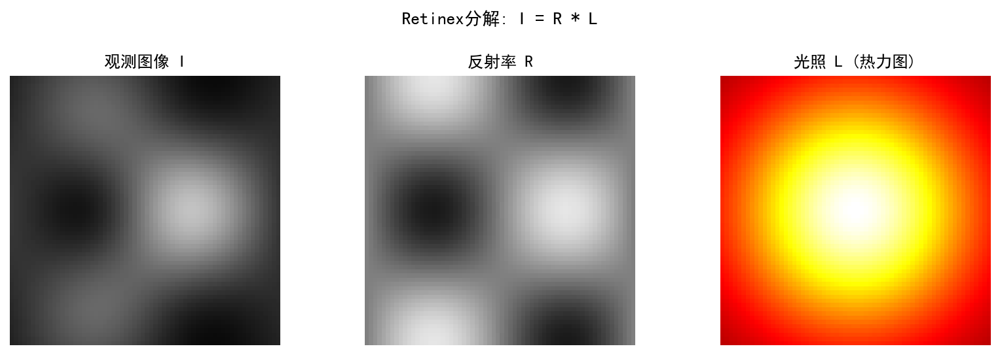

# Part 3, Chapter 05: Low-Light Image Enhancement (LLIE)

> **Scope:** This chapter provides a systematic treatment of Low-Light Image Enhancement (低照度图像增强), tracing the complete technical evolution from classical Retinex theory to modern end-to-end deep learning methods. The focus is on analyzing dominant network architectures and the practical challenges of industrial deployment.
> **Prerequisites:** Part 1, Chapter 04 (Noise Models), Part 2, Chapter 03 (Denoising), Part 3, Chapter 01 (DL ISP Survey), Part 2, Chapter 17 (Perceptual Metering)
> **Intended readers:** Deep learning researchers, algorithm engineers, mobile ISP engineers

---

## §1 Theory

### 1.1 Physical Roots of Low-Light Degradation

Under low-light conditions (illuminance < 10 lux), the imaging quality of a CMOS sensor is constrained by multiple physical factors.

**Signal perspective:**
$$\text{SNR} = \frac{\mu_s}{\sigma_{total}} = \frac{Q_s}{\sqrt{Q_s + Q_{dark} + \sigma_{read}^2}}$$

Here $Q_s$ is the number of signal photons, $Q_{dark}$ is the number of electrons generated by dark current, and $\sigma_{read}$ is the read noise standard deviation. In low-light conditions $Q_s \ll Q_{dark} + \sigma_{read}^2$, so the signal-to-noise ratio (信噪比) drops sharply.

**Sensor response characteristics:**

| Parameter | Normal light (1000 lux) | Low light (1 lux) |
|-----------|------------------------|-------------------|
| Signal electrons $Q_s$ | ~10,000 e⁻ | ~10 e⁻ |
| Read noise $\sigma_{read}$ | ~3 e⁻ | ~3 e⁻ (unchanged) |
| SNR | ~33 dB | ~10 dB |
| Effective quantization bits | ~11 bit | ~3 bit |

**Core challenges:**
1. **Low SNR:** The signal is buried in noise; high ISO gain amplifies the noise further.
2. **Color distortion (颜色失真):** AWB algorithms lose accuracy in extremely dark scenes (< 1 lux).
3. **Detail loss (细节丢失):** Insufficient quantization precision makes shadow-region detail irrecoverable.
4. **Motion blur (运动模糊):** Longer shutter times required to accumulate enough exposure introduce motion blur.

### 1.2 Retinex Theory — The Physical Foundation of LLIE

**Retinex theory (Land & McCann, 1971)** is the canonical mathematical framework for LLIE:

$$I(x,y) = R(x,y) \cdot L(x,y)$$

where:
- $I(x,y)$: the observed image (low-light input)
- $R(x,y)$: the reflectance map (反射图) — the intrinsic color of objects, independent of illumination
- $L(x,y)$: the illumination map (光照图) — the spatial distribution of scene lighting, which is low-frequency and smooth

**Goal of LLIE:** Given a low-light image $I$, estimate the illumination map $L$, recover the reflectance map $R = I / L$, then enhance $L$ to produce a normally exposed image.

**Log-domain decomposition (对数域分解):**
$$\log I = \log R + \log L$$

In the log domain the image decomposition becomes additive, which facilitates gradient-based optimization.

### 1.3 Algorithm Evolution Roadmap

```
Retinex Theory (1971)
    ↓
Traditional methods: SSR/MSR/MSRCR (1997–2003)
    ↓
Optimization-based methods: LIME/NPE/WVM (2016–2017)
    ↓
CNN end-to-end: LLNet/RetinexNet (2017–2018)
    ↓
Unsupervised/zero-reference: EnlightenGAN/Zero-DCE (2019–2020)
    ↓
Transformer/Diffusion models: SNR-Aware/Restormer (2022–2024)
```

---

### 1.4 Classical Methods

#### 1.4.1 SSR / MSR (Single-Scale / Multi-Scale Retinex)

**SSR (Jobson et al., 1997):**
$$R_i = \log I_i - \log (G_{\sigma} * I_i)$$

where $G_{\sigma}$ is a Gaussian kernel and $G_{\sigma} * I_i$ approximates the illumination map $L$. The drawback is that a single scale cannot simultaneously preserve fine detail and color fidelity.

**MSR (Jobson et al., 1997):** Multi-scale weighted fusion improves color fidelity but still suffers from color cast (色偏) artifacts.

**MSRCR (MSR with Color Restoration):** Introduces a color-restoration factor $C_i = \beta \log(\alpha I_i) - \log \sum_j I_j$ to mitigate color cast, but parameter tuning is complex.

#### 1.4.2 LIME (Low-Light Image Enhancement, Guo et al., TIP 2017)

**Core idea:** Estimate only the illumination map, preserving texture detail throughout.

**Illumination map estimation (optimization problem):**
$$\min_L \|W \odot (\hat{L} - L)\|_F^2 + \alpha \|\nabla L\|_1$$

where $\hat{L}_{i,j} = \max(R_{i,j}, G_{i,j}, B_{i,j})$ is the initial estimate, $W$ is a structure-aware weight matrix, and $\nabla L$ is the gradient of the illumination map (a sparsity constraint that preserves edges).

The enhanced reflectance is then $R = I / \gamma(L)$, where $\gamma$ is a gamma-correction function.

---

## §2 Deep Learning Methods

### 2.1 Supervised Methods

#### 2.1.1 LLNet (Lore et al., 2017) — First Deep Learning LLIE

**Architecture:** Stacked Sparse Denoising Autoencoder (SSDA)
- Encoder: learns a sparse representation of low-light images
- Decoder: reconstructs normally exposed images
- Two-stage training: brightness enhancement first, denoising second

**Limitation:** Sensitive to the training data distribution; poor generalization to out-of-distribution scenes.

#### 2.1.2 RetinexNet (Wei et al., BMVC 2018) — Retinex-Driven Deep Learning

**Network structure:**

```
Input low-light image I_low
    ↓
[Decomp-Net]  →  R_low (reflectance map)  +  L_low (illumination map)
                                                ↓
                                          [Enhance-Net]
                                                ↓
                                           L_high (enhanced illumination)
    ↓
R_low × L_high = I_enhanced
```

**Loss function:**
$$\mathcal{L} = \mathcal{L}_{recon} + \lambda_{ir}\mathcal{L}_{ir} + \lambda_{is}\mathcal{L}_{is}$$

- $\mathcal{L}_{recon}$: reconstruction loss (L1)
- $\mathcal{L}_{ir}$: illumination smoothness loss (TV regularization)
- $\mathcal{L}_{is}$: reflectance consistency loss

**Dataset:** This work introduced the **LOL (Low-Light) dataset** — 500 paired low/normal-light images, which has since become the standard LLIE benchmark.

#### 2.1.3 SID — See in the Dark (Chen et al., CVPR 2018)

**Target scenario:** Extremely dark environments (< 0.1 lux), handheld shooting

**Key innovations:**
- Processes images directly in the **RAW domain** (rather than sRGB), avoiding the irreversible information loss introduced by the ISP pipeline
- Input: short-exposure RAW (Sony ARW / Fuji RAF)
- Output: long-exposure reference sRGB
- Network: U-Net variant incorporating a complete ISP (denoising / white balance / tone mapping)

**Core formulation (RAW-domain digital gain amplification):**
$$\hat{I}_{raw}^{amp} = I_{raw} \cdot r, \quad r = t_{long} / t_{short}$$

The network learns denoising and color restoration on the amplified RAW input.

**Significance:** Replaces the hand-crafted ISP pipeline with an end-to-end neural network, establishing an important paradigm for subsequent camera RAW processing research.

### 2.2 Unsupervised / Zero-Reference Methods

#### 2.2.1 EnlightenGAN (Jiang et al., TIP 2021)

**Motivation:** Paired low/normal-light images are difficult to collect at scale.

**Architecture:** GAN trained without paired data
- Generator: U-Net taking a low-light image as input and producing an enhanced image
- Discriminator: dual global + local structure that distinguishes real normal-light images from generated ones
- Self feature-preservation loss: VGG features are used to ensure content consistency

**Advantages:** No dependency on paired data; strong generalization. Robust performance on real-world scenes beyond the LOL dataset.

#### 2.2.2 Zero-DCE (Guo et al., CVPR 2020) — Zero-Shot LLIE Benchmark

**Core idea:** Reformulates LLIE as an **image-specific curve estimation** task, requiring neither paired nor unpaired ground-truth images.

**Curve enhancement model:**
$$\hat{I}^{(n)} = \hat{I}^{(n-1)} + A^{(n)} \hat{I}^{(n-1)} (1 - \hat{I}^{(n-1)})$$

Here $A^{(n)}$ is a pixel-wise curve-parameter map estimated at iteration $n$ by the lightweight DCE-Net. With $n = 8$ iterations, the model covers the full range from underexposure to overexposure.

**Non-reference loss function combination:**

| Loss term | Formula | Purpose |
|-----------|---------|---------|
| Spatial consistency loss $\mathcal{L}_{spa}$ | $\sum_{i\in\Omega}\sum_{j\in\mathcal{N}(i)}(Y_i - Y_j - (I_i - I_j))^2$ | Preserves relative brightness between neighboring regions |
| Exposure control loss $\mathcal{L}_{exp}$ | $\frac{1}{M}\sum_k\|Y_k - E\|$ | Drives mean brightness toward target $E=0.6$ |
| Color constancy loss $\mathcal{L}_{col}$ | $\sum_{(p,q)\in\varepsilon}(J^p - J^q)^2$ | Prevents imbalance between color channels |
| Illumination smoothness loss $\mathcal{L}_{tvA}$ | $\|\nabla_x A\|^2 + \|\nabla_y A\|^2$ | Spatially smooths the curve parameter maps |

**Zero-DCE++ improvements (Li et al., TPAMI 2021):** Replaces standard convolutions with depthwise separable convolutions, reducing the parameter count from 79K to 0.49K — suitable for real-time mobile deployment.

### 2.3 SNR-Aware Methods

#### 2.3.1 SNR-Aware (Xu et al., CVPR 2022)

**Motivation:** SNR varies enormously across different regions of a low-light image — bright areas have high SNR and can rely on local features, whereas dark areas have extremely low SNR and require global context.

**SNR estimation:**
$$\text{SNR}(x,y) = \frac{\mu(x,y)}{\sigma(x,y)}$$

Approximated from the local mean and variance of the input image (no sensor-specific parameters required).

**Adaptive feature aggregation:**
$$F_{out} = \text{SNR\_mask} \odot F_{local} + (1 - \text{SNR\_mask}) \odot F_{global}$$

High-SNR regions use local convolutional features (preserving detail), while low-SNR regions use Transformer-based global attention (cross-region information compensation).

**Significance:** Substantially outperforms prior methods on the LOL and MIT-FiveK datasets, achieving PSNR gains of approximately 1–2 dB over predecessors.

#### 2.3.2 LLFormer (Wang et al., AAAI 2023)

**Background and motivation:** Global self-attention has $O(N^2)$ complexity ($N = H \times W$), making it infeasible at 720p and above. Window self-attention (Swin Transformer style) limits the receptive field, which is detrimental to the large-scale illumination estimation required for LLIE. LLFormer proposes **Axis-based Multi-Head Self-Attention (A-MSA, 轴向多头自注意力)**, decomposing 2D global attention into two independent 1D attentions along the $H$ and $W$ axes, reducing complexity from $O\!\left((HW)^2\right)$ to:

$$\text{A-MSA}(Q,K,V) = \text{Attn}_H\!\left(\text{Attn}_W(Q,K,V)\right)$$

$$\text{Complexity: } O\!\left(H \cdot W^2 + W \cdot H^2\right) \approx O\!\left(HW(H+W)\right)$$

For a square image with $H = W = n$, this is $O(n^3)$ versus the full-attention $O(n^4)$ — approximately a $700\times$ reduction at 720p.

**Hierarchical Cross-level Attention Fusion (HCAF, 分层跨级注意力融合):** Encoder features at each resolution level are propagated not only through skip connections but also through cross-level attention fusion. This allows the decoder to reference both shallow texture features and deep semantic features simultaneously, compensating for the poor quality of any single feature layer under low-light conditions.

**Performance (LOL-v1):** PSNR = **23.65 dB**, ~24.3M parameters. Relative to SNR-Aware (21.48 dB), this is a ~2.2 dB improvement at the cost of increasing parameter count from 4.0M to 24.3M; estimated 720p inference latency is ~35–50 ms on Snapdragon 8 Gen 3 (NPU operator support must be verified).

#### 2.3.3 Retinexformer (Cai et al., ICCV 2023)

**Core idea:** A one-stage Retinex-based Transformer that introduces **IG-MSA (Illumination-Guided Multi-Head Self-Attention)**. Rather than attending uniformly across all spatial positions, IG-MSA restricts cross-position feature aggregation to regions where illumination is reliable, preventing noise-dominated shadow regions from polluting high-SNR regions.

**Architecture highlights:**
- **IG-MSA:** Computes the gradient of the illumination map $L$ as a spatial attention mask, confining attention weights to positions with trustworthy luminance gradients.
- **U-Net backbone** with skip connections at the RSTB (Residual Swin Transformer Block) level for multi-scale feature fusion.
- Approximately **1.61M parameters** — suitable for lightweight mobile deployment.

**Performance benchmarks:**

| Dataset | PSNR (dB) | SSIM |
|---------|-----------|------|
| LOL v1 | **25.16** | 0.845 |
| LOL v2-real | 22.80 | 0.840 |
| SID | 17.00 | 0.752 |

**Engineering significance:** With only 1.61M parameters, Retinexformer achieves 25.16 dB PSNR on LOL v1 — substantially outperforming SNR-Aware (21.48 dB) and LLFormer (23.65 dB) at a fraction of LLFormer's 24.3M parameter count. For mobile ISP scenarios with constrained compute budgets, Retinexformer is the recommended accuracy-efficiency reference baseline as of ICCV 2023.

> **Reference:** Cai et al., "Retinexformer: One-stage Retinex-based Transformer for Low-light Image Enhancement", *ICCV 2023*. [arXiv:2303.06705]

---

### 2.4 RAW-Domain LLIE Overview

sRGB-domain enhancement is fundamentally constrained by the irreversible losses introduced by the ISP pipeline. RAW-domain LLIE starts from sensor-native data, preserving the full physical information. Three landmark works establish the methodological foundation for RAW-domain LLIE:

**SID (Chen et al., CVPR 2018)** — the first systematic RAW-domain dark-light enhancement. A Sony ARW / Fuji RAF short-exposure RAW is fed directly into a U-Net variant; the network performs denoising, white balance, and tone mapping, outputting a normally exposed sRGB image that completely replaces the hand-crafted ISP pipeline. The core advantage is that noise in the RAW domain follows a Poisson-Gaussian distribution and can be modeled precisely. The digital gain ratio $r = t_{\text{long}} / t_{\text{short}}$ is premultiplied at the input; the network learns residual denoising rather than absolute-value reconstruction.

**SNR-Aware (Xu et al., CVPR 2022)** — pixel-wise SNR-adaptive dual-branch fusion. Works on both RAW and sRGB input; in the RAW domain, a more accurate sensor noise model can replace local statistical estimation:

$$\text{SNR}_{\text{raw}}(x,y) = \frac{I(x,y)}{\sqrt{\alpha \cdot I(x,y) + \sigma_r^2}}$$

where $\alpha$ is the product of quantum efficiency and gain, and $\sigma_r$ is read-noise standard deviation (~1–5 e⁻). Low-light regions (low SNR, $M_{\text{SNR}} \to 0$) are handled by the global-attention branch; bright regions (high SNR, $M_{\text{SNR}} \to 1$) retain fine texture from local convolution.

**LLFormer (Wang et al., AAAI 2023)** — high-quality enhancement via axis-based attention. A-MSA reduces complexity to $O(HW(H{+}W))$, reaching 23.65 dB PSNR on LOL-v1 — the highest accuracy among these three. However, with 24.3M parameters and limited mobile NPU operator support, it targets cloud-side or offline flagship processing.

---

### 2.5 Diffusion Models for LLIE

**LDM-LLIE (Hou et al., 2023):**
- The diffusion process starts from a normal-light image (forward noising), and the reverse denoising process is conditioned on the low-light input.
- Generation quality is high, but inference is slow (approximately 100 denoising steps).

**Accelerated diffusion (DDPM acceleration variants):** DDIM sampling compresses the number of steps to 10–20, balancing quality and speed.

### 2.6 GLARE: Generative Latent Feature Based Codebook Retrieval (Zhou et al., ECCV 2024)

**GLARE** (Zhou et al., ECCV 2024) addresses the ill-posed nature of LL→NL mapping under extreme low-light conditions by building a **vector-quantized codebook (VQ Codebook)** from normal-light images as a prior. (This GLARE refers to the low-light enhancement paper; a different paper with the same name — about flare/glare removal — was also published at ECCV 2024.)

**Core motivation:** Existing methods map LL images directly to NL, or use semantic/illumination maps as guidance. Under extreme degradation, feature extraction from LL images is unreliable. GLARE shifts the strategy: build a codebook offline from **undegraded normal-light images**, then align the low-light feature distribution to normal-light space at inference, using codebook retrieval to obtain a reliable prior.

**Architecture:**

```
Normal-light images (offline) → VQ quantization → Codebook (stores high-quality NL latent codes)

Inference path:
Low-light input image
  ↓ Feature extraction
I-LNF (Invertible Latent Normalizing Flow)
  → Aligns LL feature distribution to NL codebook space
  ↓ Codebook retrieval (nearest-neighbor) → NL codebook prior
  ↓
AFT (Adaptive Feature Transform):
  - AMB (Adaptive Mix-up Block): fuses LL structural features + NL codebook prior
  - Dual decoder: fidelity branch (detail recovery) + perceptual branch (prior utilization)
  ↓
Enhanced output (normal-light image)
```

**Key modules:**
- **VQ Codebook:** Vector-quantization of large-scale normal-light images. The codebook prior is unaffected by low-light degradation, providing reliable texture and brightness distribution references.
- **I-LNF alignment:** An invertible normalizing flow transforms the LL latent distribution into the NL codebook space, ensuring correct codeword retrieval rather than mismatched lookup.
- **AFT/AMB:** Blends low-level structural information (from the low-light input) with high-level priors (from the codebook), with a tunable parameter giving users control over enhancement intensity.

**Engineering characteristics:** Inference requires no multi-step diffusion sampling; codebook retrieval is a single forward pass. Computation overhead is substantially lower than diffusion-based LLIE methods (e.g., LDM-LLIE requires 100+ steps), making GLARE more suitable for on-device preprocessing. Experiments show GLARE reaches SOTA on real-world low-light benchmarks and validates practical utility as a preprocessing stage for high-level vision tasks such as object detection.

**Code:** https://github.com/LowLevelAI/GLARE

---

---

## §3 Tuning

### 3.1 Dataset Selection Strategy

| Dataset | Size | Characteristics | Recommended use |
|---------|------|----------------|-----------------|
| **LOL v1** | 500 pairs | sRGB with synthesized low light (gamma darkening) | Quick validation, benchmark comparison |
| **LOL v2-real** | 689 pairs | Captured with real cameras | Real-noise modeling |
| **SID** | 5,094 pairs | RAW domain, extremely dark (< 0.1 lux) | RAW ISP end-to-end training |
| **MIT-FiveK** | 5,000 images | Professionally retouched by expert photographers | Joint color + brightness optimization |
| **VE-LOL** | 2,500 pairs | Multi-scene, multi-exposure-ratio | Generalization evaluation |

**Selection principles:**
- Mobile ISP deployment → SID (RAW domain) + LOL v2-real
- Academic comparison → LOL v1 (standard benchmark)
- Color quality priority → MIT-FiveK

### 3.2 Key Hyperparameters

**Zero-DCE / Zero-DCE++ tuning:**

| Parameter | Default | Effect | Tuning direction |
|-----------|---------|--------|-----------------|
| Target exposure $E$ | 0.6 | Global brightness target | Reduce to ~0.5 for night scenes to avoid overexposure |
| Exposure loss weight $\lambda_{exp}$ | 10 | Brightness constraint strength | Lower when scene brightness varies widely |
| TV loss weight $\lambda_{tvA}$ | 1600 | Curve map smoothness | Reduce for scenes with rich texture |
| Iteration count $n$ | 8 | Enhancement magnitude range | Increase to 12 for extremely dark scenes |

**RetinexNet tuning:**
- Illumination smoothness weight $\lambda_{is}$: controls TV regularization strength on the illumination map. Too small → unsmooth illumination map; too large → texture loss.
- Enhance-Net learning rate: recommended to be one order of magnitude lower than Decomp-Net, so that the decomposition stabilizes first.

### 3.3 Mobile Deployment Considerations

**Engineering advantages of Zero-DCE++:**
- Parameter count: 0.49K (deployable on MCU)
- Inference time (Snapdragon 8 Gen 2): < 10 ms at 1080p
- No reference image required; suitable for real-time viewfinder preview

**RAW domain vs. sRGB domain trade-offs:**

```
RAW-domain processing (recommended for flagship devices):
  Pros: retains complete sensor information; more thorough denoising
  Cons: requires sensor-specific training data; poor cross-device generalization

sRGB-domain processing (suitable for mid/low-end devices):
  Pros: no sensor parameters needed; strong generalization
  Cons: ISP has already introduced irreversible information loss; performance ceiling is lower
```

> **Engineering recommendation (mobile LLIE method selection):**
> - **Real-time preview (< 5 ms):** Zero-DCE++ is the only practically viable option today. After INT8 quantization, latency drops below 1 ms. PSNR is only ~14–16 dB, but for a preview context this is sufficient — there is no ground-truth reference in real night scenes, and user perception matters more than PSNR.
> - **Post-capture processing (< 100 ms):** SNR-Aware achieves 21.48 dB on LOL v1 with a higher quality ceiling, but the Transformer components require NPU operator support validation. Start with Zero-DCE++ as a baseline, then evaluate whether SNR-Aware latency fits within budget.
> - **Extreme-dark scenes (< 0.1 lux, flagship night photography):** RAW-domain end-to-end methods (SID framework) combined with burst multi-frame fusion (Part 3, Chapter 11) provide the highest quality ceiling available today.
> - Diffusion-based LLIE (LDM-LLIE etc.) currently has unacceptable on-device latency; reserve as a cloud-side offline processing research direction.

### 3.4 Mobile Deployment Comparison Table

The table below summarizes key deployment metrics for three representative methods on the two dominant mobile platforms — Qualcomm (SNPE) and MediaTek (NeuroPilot) — for engineering method selection:

| Method | Backbone | Parameters | Qualcomm SNPE INT8 | MediaTek NeuroPilot | Inference (720p) |
|--------|----------|-----------|---------------------|---------------------|-----------------|
| Zero-DCE++ | Lightweight CNN (depthwise separable conv) | 0.1M (10,561) | Supported; accuracy loss < 0.2 dB | Supported | < 10 ms |
| SNR-Aware | Dual-branch (CNN + Transformer) | 4.0M | Supported (Attention layers need branch fusion or FP16 retention) | Supported | ~80 ms |
| LLFormer | Transformer (A-MSA) | 24.3M | Partial support (A-MSA axis-wise attention requires custom ops) | Not yet supported | > 500 ms |

**Notes:**
- Inference times are reference estimates for INT8-quantized models on Snapdragon 8 Gen 3; actual performance is affected by memory bandwidth and compiler optimization.
- SNR-Aware's dual-branch fusion must be merged into a single compute graph during conversion, otherwise cross-core scheduling overhead is incurred.
- LLFormer's A-MSA relies on dynamic reshape ($H \times W \to H$ groups of $W$ tokens); mainstream NPU compiler toolchains have limited support for such dynamic reshaping. Verify accuracy on CPU/GPU before evaluating NPU portability.
- Zero-DCE++ has an official TFLite implementation that can auto-select accelerators via NNAPI — lowest engineering integration effort of the three.

---

## §4 Artifacts

### 4.1 Color Distortion (颜色失真)

**Symptom:** Enhanced images exhibit color cast (green or magenta tint), especially in extremely dark regions.

**Root causes:**
1. AWB loses accuracy at extremely low illuminance; enhancement amplifies the white-balance error.
2. Inconsistent gain across color channels due to different noise distributions per channel.

**Mitigations:**
- Perform AWB correction in the RAW domain before enhancement (correct color first, then boost brightness).
- Color constancy loss (e.g., Zero-DCE's $\mathcal{L}_{col}$).
- Apply a lightweight post-enhancement color correction (fine-tune using the gray-world assumption).

### 4.2 Over/Under Enhancement (过增强与欠增强)

**Symptom:** Global enhancement causes highlight regions to clip while shadow regions remain dark, or the overall result is still too dim.

**Root cause:** The global brightness target $E$ does not match the actual brightness distribution of the scene.

**Mitigations:**
- Adaptive brightness target: dynamically adjust $E$ based on histogram percentiles.
- Locally adaptive enhancement: apply different enhancement strengths to regions of different brightness (see SNR-Aware).
- Guided-filter highlight protection: detect a highlight-region mask and skip already-saturated areas during enhancement.

### 4.3 Noise Amplification (噪声放大)

**Symptom:** Lifting brightness simultaneously amplifies dark-region noise, introducing a pronounced grain (颗粒感).

**Root cause:** A brightness gain of $g = L_{target} / L_{input}$ amplifies noise variance by a factor of $g^2$.

**Mitigations:**
- Denoise before enhancing (joint denoising + enhancement network).
- SNR-adaptive gain: limit the enhancement magnitude in low-SNR regions.
- Multi-frame fusion: mobile night-mode pipelines denoise a burst of frames first, then enhance (see Ch116 Night Sight).

### 4.4 Texture Over-Smoothing (纹理过平滑)

**Symptom:** The enhancement network misidentifies low-SNR texture as noise and over-smooths it, causing the image to lose fine detail.

**Mitigation:** High-frequency perceptual loss:
$$\mathcal{L}_{hf} = \|\nabla \hat{I} - \nabla I_{ref}\|_1$$
This forces the network to preserve edge and texture gradients.

---

## §5 Evaluation

### 5.1 Full-Reference Metrics (with paired ground truth)

| Metric | Formula | Notes |
|--------|---------|-------|
| **PSNR** | $10\log_{10}(255^2/\text{MSE})$ | Pixel-level fidelity; higher is better |
| **SSIM** | Weighted combination of structure, brightness, and contrast | Perceptual structural similarity; range [0, 1] |
| **LPIPS** | Deep feature distance using VGG/AlexNet | Perceptual quality; lower is better |

**Typical state-of-the-art performance (LOL v1 dataset):**

| Method | PSNR↑ | SSIM↑ | Publication |
|--------|--------|--------|-------------|
| RetinexNet | 16.77 | 0.559 | BMVC 2018 |
| Zero-DCE | 14.86 | 0.562 | CVPR 2020 |
| EnlightenGAN | 17.48 | 0.651 | TIP 2021 |
| SNR-Aware | 21.48 | 0.849 | CVPR 2022 |
| Restormer | 20.41 | 0.806 | CVPR 2022 |
| LLFormer | 23.65 | 0.871 | AAAI 2023 |
| **Retinexformer** | **25.16** | **0.845** | **ICCV 2023** |

### 5.2 No-Reference Metrics (real-world scenes without ground truth)

- **NIQE (Natural Image Quality Evaluator):** Statistics-based, requires no reference image; lower is better.
- **BRISQUE:** Based on NSS (Natural Scene Statistics); fully blind assessment.
- **PI (Perceptual Index):** Combination of NRQM and NIQE; used in NTIRE competitions.

### 5.3 Task-Driven Evaluation (machine vision scenarios)

When LLIE is used as a preprocessing step for downstream tasks, evaluation should include:
- **Object detection AP:** YOLO/RCNN detection accuracy before and after enhancement on the ExDark dataset.
- **Face recognition accuracy:** Feature-matching rate for faces in enhanced images.

### 5.4 Subjective Evaluation Guidelines

- **Avoid "bright but wrong color" false positives:** Evaluate color accuracy and brightness quality separately.
- **A/B blind testing:** Evaluators should not know which algorithm produced which result, eliminating prior-knowledge bias.
- **Multi-scene coverage:** Include diverse illuminance levels — dim indoors, street-light night scenes, candlelight, starlight, and so on.

---

## §6 Code

See the companion notebook *See §6 Code section for runnable examples.*, which covers:

- **Retinex decomposition visualization:** Apply LIME to a low-light image to estimate the illumination map; visualize the $I / L$ separation.
- **Zero-DCE inference:** Load a pretrained model to perform zero-reference enhancement on a test image; visualize the curve parameter maps output by DCE-Net.
- **LOL dataset evaluation:** Compute PSNR/SSIM/LPIPS and generate a comparison table across methods.
- **SNR map visualization:** Compute a local-SNR heat map for a low-light input to intuitively display the signal-to-noise ratio distribution across image regions.
- **Noise amplification analysis:** Compare single-frame enhancement versus multi-frame burst fusion in terms of noise power spectra at different ISO levels.

---

## References

**Classical Retinex theory:**
- Land, E. H., & McCann, J. J. (1971). **Lightness and retinex theory.** *Journal of the Optical Society of America*, 61(1), 1-11.
- Jobson, D. J., Rahman, Z., & Woodell, G. A. (1997). **A multiscale retinex for bridging the gap between color images and the human observation of scenes.** *IEEE Transactions on Image Processing*, 6(7), 965-976.

**Deep learning LLIE:**
- Lore, K. G., Akintayo, A., & Sarkar, S. (2017). **LLNet: A deep autoencoder approach to natural low-light image enhancement.** *Pattern Recognition*, 61, 650-662.
- Wei, C., Wang, W., Yang, W., & Liu, J. (2018). **Deep Retinex decomposition for low-light enhancement.** *BMVC 2018*. [LOL dataset]
- Chen, C., Chen, Q., Xu, J., & Koltun, V. (2018). **Learning to see in the dark.** *CVPR 2018*. [SID dataset]

**Unsupervised / zero-reference:**
- Jiang, Y., et al. (2021). **EnlightenGAN: Deep light enhancement without paired supervision.** *IEEE Transactions on Image Processing*, 30, 2340-2349.
- Guo, C., et al. (2020). **Zero-reference deep curve estimation for low-light image enhancement.** *CVPR 2020*.
- Li, C., et al. (2021). **Learning to enhance low-light image via zero-reference deep curve estimation.** *IEEE TPAMI*, 44(8), 4225-4238. [Zero-DCE++]

**SNR-aware methods:**
- Xu, X., et al. (2022). **SNR-aware low-light image enhancement.** *CVPR 2022*.

**Transformer and diffusion LLIE:**
- Wang, H., et al. (2023). **Ultra-high-definition low-light image enhancement: A benchmark and transformer-based method.** *AAAI 2023*. [LLFormer]
- Cai, Y., et al. (2023). **Retinexformer: One-stage Retinex-based Transformer for low-light image enhancement.** *ICCV 2023*. arXiv:2303.06705.
- Yi, X., et al. (2023). **Diff-Retinex: Rethinking low-light image enhancement with a generative diffusion model.** *ICCV 2023*.
- Zhou, X., et al. (2024). **GLARE: Low-light image enhancement via generative latent feature based codebook retrieval.** *ECCV 2024*.

**Datasets:**
- LOL Dataset: https://daooshee.github.io/BMVC2018website/ (publicly available)
- SID Dataset: https://github.com/cchen156/Learning-to-See-in-the-Dark (publicly available)
- MIT-FiveK: https://data.csail.mit.edu/graphics/fivek/ (publicly available)

---

## §7 Glossary

**Retinex Theory**
Visual perception model proposed by Land & McCann (JOSA 1971): the observed image $I$ = reflectance map $R$ (intrinsic object color, independent of illumination) × illumination map $L$ (scene lighting distribution, low-frequency and smooth). The LLIE objective is to estimate and enhance $L$ from $I$, then recover $R$. In the log domain, the decomposition becomes additive: $\log I = \log R + \log L$, which facilitates gradient-based optimization. Retinex is the theoretical foundation of all decomposition-type LLIE methods (SSR/MSR/LIME/RetinexNet).

**LIME (Low-Light Image Enhancement)**
Optimization-based LLIE method by Guo et al. (TIP 2017): estimates only the illumination map using initial estimate $\hat{L}_{i,j} = \max(R_{i,j}, G_{i,j}, B_{i,j})$, then solves $\min_L \|W \odot (\hat{L} - L)\|_F^2 + \alpha \|\nabla L\|_1$ for a smooth illumination map. Enhanced reflectance is $R = I / \gamma(L)$. The reflectance map is not modified, preserving texture detail. An important baseline for deep learning comparisons.

**RetinexNet**
Deep learning Retinex decomposition network by Wei et al. (BMVC 2018): Decom-Net splits a low-light image into a reflectance map and an illumination map; Enhance-Net boosts the illumination map; the final output is $\hat{I} = R_{\text{low}} \times L_{\text{high}}$. Also introduced the **LOL dataset** (500 paired low/normal-light images), which is the standard LLIE evaluation benchmark.

**Zero-DCE (Zero-Reference Deep Curve Estimation)**
Zero-shot LLIE method by Guo et al. (CVPR 2020): lightweight DCE-Net predicts per-pixel curve parameter maps $A^{(n)}$ and iteratively enhances the image via $\hat{I}^{(n)} = \hat{I}^{(n-1)} + A^{(n)} \hat{I}^{(n-1)} (1 - \hat{I}^{(n-1)})$ for 8 iterations. Requires no paired or unpaired ground-truth images; trained solely with four non-reference losses (spatial consistency, exposure control, color constancy, illumination smoothness). **Zero-DCE++** (Li et al., TPAMI 2021) uses depthwise separable convolutions to reduce parameters from 79K to ~10K (10,561), suitable for real-time mobile deployment.

**EnlightenGAN**
Unpaired-data GAN by Jiang et al. (TIP 2021): a U-Net generator enhances low-light images; a global + local dual-path discriminator distinguishes generated results from real normal-light images. VGG perceptual loss ensures content consistency. No paired training data required; strong generalization to real-world scenes beyond the LOL synthetic distribution.

**SNR-Aware (SNR-Aware Low-Light Image Enhancement)**
Method by Xu et al. (CVPR 2022): SNR varies greatly across a low-light image (bright areas reliable for local features; dark areas need global context). The method estimates $\text{SNR}(x,y)$ from local mean/variance and adaptively fuses $F_{\text{out}} = \text{SNR\_mask} \odot F_{\text{local}} + (1-\text{SNR\_mask}) \odot F_{\text{global}}$ — convolution for high-SNR regions, Transformer for low-SNR regions. Achieves 21.48 dB PSNR on LOL v1, a significant improvement over predecessors.

**SID Dataset (See in the Dark)**
Extreme-dark RAW dataset by Chen et al. (CVPR 2018): 5,094 paired Sony A7S II and Fuji X-T2 ultra-short-exposure RAW files (1/30–1/10 s) paired with long-exposure reference images (10–30 s), at scene illuminance < 0.1 lux. Established RAW-domain end-to-end low-light learning as a research direction by processing RAW inputs directly (premultiplying by gain $r = t_{\text{long}}/t_{\text{short}}$, with the network performing the full ISP function).

**LOL Dataset (Low-Light Dataset)**
Standard LLIE benchmark dataset introduced alongside RetinexNet by Wei et al. (BMVC 2018): LOL v1 contains 500 paired low/normal-light sRGB images (485 train + 15 test), with low-light images synthesized by reducing exposure and adding noise. LOL v2-real is captured with real cameras (689 pairs). The most widely used benchmark for comparing LLIE methods.

---

## §8 On-Device Deployment

> **Night photography context:** Night photography is the most important differentiating scenario for mobile ISPs, and users are highly sensitive to capture speed. The industry-accepted experience threshold from shutter press to viewable image is **end-to-end latency < 100 ms** (including the traditional ISP pipeline). DL-LLIE components must complete within this budget; otherwise they must operate in background asynchronous mode.

### 8.1 Inference Framework Compatibility

| Framework | Quantization | Typical speedup (vs. CPU) | Notes |
|-----------|-------------|--------------------------|-------|
| Qualcomm SNPE/QNN | INT8/INT16 | HVX DSP 3–6× | Requires SNPE SDK to convert to .dlc; LLIE networks have good INT8 compatibility |
| MTK NeuroPilot | INT8/INT4 mixed precision | APU 4–8× | Requires neuron_runtime offline compilation; calibration set must cover low-light noise characteristics |
| TFLite + NNAPI | INT8 | 2–5× (device-dependent) | Android universal; auto-selects accelerator; Zero-DCE++ has an official TFLite build |
| ARM NN | INT8 | Mali GPU 2–4× | Open-source; good compatibility with lightweight LLIE models |

### 8.2 Quantization Accuracy Loss Reference

- INT8 quantization typically incurs 0.1–0.4 dB PSNR loss (LLIE networks tend toward the lower end due to their relatively simple structures).
- Zero-DCE++ INT8: measured PSNR loss ~0.15 dB (LOL-v1); latency drops from ~3 ms to < 1 ms (Snapdragon 8 Gen 2 NPU).
- Models with Transformers (SNR-Aware, LLFormer): INT8 quantization loss ~0.3–0.5 dB; recommended to retain critical Attention layers in FP16.
- Mixed precision (Conv layers INT8, Attention layers FP16) can keep the total loss within 0.2 dB.

### 8.3 Latency Budget and Method Selection

**Method tiers within the 100 ms experience threshold:**

| Latency budget | Recommended method | Typical platform latency | Use case |
|---------------|-------------------|--------------------------|----------|
| < 5 ms (real-time preview) | Zero-DCE++ INT8 | Snapdragon 8 Gen 3: ~0.5 ms @ 720p | Viewfinder real-time preview, brightness compensation |
| < 50 ms (post-capture) | SNR-Aware INT8 (720p) | Snapdragon 8 Gen 3: ~25 ms | Instant post-capture processing, no noticeable wait |
| < 100 ms (full pipeline) | RetinexNet or SNR-Aware (1080p downsampled) | Flagship NPU: ~60–90 ms | Fits within total 100 ms ISP budget |
| > 100 ms (background async) | SID U-Net (RAW domain) / Restormer | Flagship NPU: ~300 ms–2 s | Background post-capture optimization, Night Sight-style flow |

### 8.4 Special Considerations for RAW-Domain LLIE

RAW-domain processing (e.g., SID U-Net) offers the best quality on flagship devices, but with the following on-device constraints:

- **Sensor specificity:** RAW-domain models require separate training and calibration for each sensor (IMX766, IMX989, etc.); poor cross-device generalization.
- **Memory footprint:** A 12 MP RAW input (RGGB 4-channel float16) is ~96 MB; combined with intermediate feature maps this can reach 400 MB+, requiring careful evaluation.
- **ISP timing:** RAW-domain LLIE must execute before demosaicing, deeply coupled with the traditional ISP pipeline; hardware ISP vendor support is limited.

### 8.5 Raspberry Pi 4B + IMX477 Reference Platform

- ARM Cortex-A72 @ 1.8 GHz, no NPU
- Zero-DCE++ FP32, single frame at 480p: ~20–50 ms (acceptable)
- SNR-Aware FP32, single frame at 480p: ~500–1000 ms (not suitable for real-time)
- Confirms lightweight models (Zero-DCE++) are feasible; heavy models require dedicated NPU hardware.

> **Note:** Qualcomm/MTK ISP-specific latency figures are commercially confidential and cannot be disclosed in public documentation. The numbers above are estimates based on publicly available information. For precise performance data, consult official materials through NDA channels.

---

## §9 Deep Dives: Core Method Analysis

### 9.1 RetinexNet Detailed Architecture (BMVC 2018)

RetinexNet embeds Retinex decomposition theory into an end-to-end trainable deep network, making it an important early representative of deep-learning LLIE.

#### 9.1.1 Decomposition Network (Decom-Net)

Decom-Net receives a pair of low-light image $I_{low}$ and normal-light image $I_{normal}$ (during training) and outputs the respective reflectance and illumination maps:

$$\{R_{low}, L_{low}\} = \text{Decom-Net}(I_{low}), \quad \{R_{normal}, L_{normal}\} = \text{Decom-Net}(I_{normal})$$

**Network structure:** 5 convolutional layers + ReLU; output layer uses Sigmoid to ensure $R \in [0,1]$, $L \in [0,1]$. The illumination map $L$ is single-channel (luminance); the reflectance map $R$ is three-channel RGB.

**Key constraint:** Both low-light and normal-light images share the same Decom-Net weights. The reflectance $R$ of the same scene should be invariant across different exposures; only the illumination map $L$ changes.

#### 9.1.2 Enhancement Network (Enhance-Net)

Enhance-Net takes $L_{low}$ (optionally guided by $R_{low}$) and outputs the enhanced illumination map $\hat{L}$:

$$\hat{L} = \text{Enhance-Net}(L_{low})$$

**Network structure:** Multi-scale U-Net fusing illumination information at different receptive field sizes; skip connections preserve the original illumination structure.

**Final output:**

$$\hat{I} = R_{low} \odot \hat{L}$$

The low-light reflectance map is multiplied by the enhanced illumination map, achieving brightness increase while preserving color information.

#### 9.1.3 Training Losses

RetinexNet's complete loss function consists of three parts:

$$\mathcal{L}_{total} = \mathcal{L}_{recon} + \lambda_{is} \mathcal{L}_{is} + \lambda_{ic} \mathcal{L}_{ic}$$

**Reconstruction loss:**

$$\mathcal{L}_{recon} = \sum_{i \in \{low, normal\}} \|R_i \odot L_i - I_i\|_1 + \|R_{low} \odot L_{normal} - I_{normal}\|_1$$

The first term ensures self-consistency of the decomposition; the second constrains that the low-light reflectance can correctly reconstruct the normal-light image under high-illumination conditions.

**Illumination smoothness loss:**

$$\mathcal{L}_{is} = \sum_{i \in \{low, normal\}} \frac{\|\nabla L_i\|_1}{\max(|\nabla I_i|, \epsilon)}$$

The denominator weights by image gradient: the illumination map is allowed to vary at texture regions (large gradient) and forced to be smooth in homogeneous regions (small gradient). $\epsilon = 0.01$ prevents division by zero.

**Reflectance consistency loss:**

$$\mathcal{L}_{ic} = \|R_{low} - R_{normal}\|_1$$

The reflectance map of the same scene should not change with illumination — the central constraint of Retinex theory.

#### 9.1.4 Limitations

| Limitation | Symptom | Root cause |
|------------|---------|------------|
| Color distortion | Post-enhancement color cast | Incomplete Decom-Net decomposition; noise bleeds into the reflectance map |
| Over-smoothing | Shadow-region texture disappears | Illumination smoothness loss suppresses illumination variation in textured regions |
| Dependency on paired data | Limited generalization | LOL dataset has only 500 pairs; insufficient scene diversity |

---

### 9.2 Zero-DCE Deep Dive (CVPR 2020)

Zero-DCE reformulates brightness enhancement as an **unsupervised curve estimation** problem, requiring neither paired nor unpaired ground-truth images during training.

#### 9.2.1 DCE-Net Architecture

DCE-Net is an extremely lightweight fully convolutional network:

```
Input: low-light RGB image (H×W×3)
  ↓  Conv 3×3, 32ch + ReLU
  ↓  Conv 3×3, 32ch + ReLU
  ↓  Conv 3×3, 32ch + ReLU
  ↓  Conv 3×3, 32ch + ReLU  (7 layers total, with skip connections)
  ↓  Conv 3×3, 3×n ch + Tanh
Output: curve parameter maps {A^(1), A^(2), ..., A^(n)} (H×W×3n)
```

Each $A^{(t)} \in [-1, 1]^{H \times W \times 3}$ controls the enhancement direction per pixel at iteration $t$ (positive = brighten, negative = darken).

**Parameter count:** 79K (original DCE-Net); Zero-DCE++ uses depthwise separable convolutions to reduce this to **~10K (10,561 parameters)** — among the lightest end-to-end LLIE models available.

#### 9.2.2 Light Enhancement Curve Equation

Zero-DCE uses a quadratic curve function to iteratively enhance brightness:

$$L^{(n)}(x) = L^{(n-1)}(x) + \alpha_n(x) \cdot L^{(n-1)}(x) \cdot \left(1 - L^{(n-1)}(x)\right)$$

where $L^{(0)}(x) = I(x)$ (input image), $\alpha_n(x)$ is the pixel-wise parameter map predicted by DCE-Net at iteration $n$, and $n = 1, 2, \ldots, 8$.

**Mathematical properties:**
- When $\alpha_n > 0$: brightness increases (dark scenes become brighter)
- When $\alpha_n < 0$: brightness decreases (can be used for exposure correction)
- Curve shape: downward-opening parabola; maximum increment at $L = 0.5$; zero increment at $L = 0$ and $L = 1$ (automatically protects pure black and pure white regions)
- 8 iterations cover the full range from severe underexposure ($\alpha \approx 1$) to normal exposure ($\alpha \approx 0$)

#### 9.2.3 Four Non-Reference Loss Functions

Zero-DCE requires no ground-truth images; it relies entirely on the following four non-reference losses:

**Spatial consistency loss:**

$$\mathcal{L}_{spa} = \frac{1}{K} \sum_{i=1}^{K} \sum_{j \in \mathcal{N}(i)} \left( (Y_i - Y_j) - (I_i - I_j) \right)^2$$

$K$ is the total pixel count; $\mathcal{N}(i)$ is the four-connected neighborhood of pixel $i$. Constrains the brightness difference between neighboring pixels after enhancement to remain consistent with the original image, preventing patchy artifacts in flat regions.

**Exposure control loss:**

$$\mathcal{L}_{exp} = \frac{1}{M} \sum_{k=1}^{M} \left| \bar{Y}_k - E \right|$$

The input image is partitioned into $M$ non-overlapping $16 \times 16$ regions; $\bar{Y}_k$ is the mean brightness of region $k$; $E = 0.6$ is the target exposure value (empirically set to correspond to a perceptually "adequate" brightness level). Prevents global overexposure or underexposure.

**Color constancy loss:**

$$\mathcal{L}_{col} = \sum_{(p,q) \in \{(R,G),(G,B),(R,B)\}} \left( \bar{J}^p - \bar{J}^q \right)^2$$

Constrains the mean values of the three RGB channels to be similar in the enhanced image, preventing color channel gain imbalance. Based on the **gray-world assumption** (the three channels of a normal image have approximately equal means).

**Illumination smoothness loss:**

$$\mathcal{L}_{tvA} = \frac{1}{N} \sum_{n=1}^{N} \left( \|\nabla_x A^{(n)}\|_1 + \|\nabla_y A^{(n)}\|_1 \right)$$

Applies Total Variation regularization to each iteration's curve parameter map $A^{(n)}$, enforcing spatial smoothness and preventing high-frequency artifacts from abrupt enhancement discontinuities between neighboring pixels.

**Total loss:**

$$\mathcal{L} = \lambda_{spa} \mathcal{L}_{spa} + \lambda_{exp} \mathcal{L}_{exp} + \lambda_{col} \mathcal{L}_{col} + \lambda_{tvA} \mathcal{L}_{tvA}$$

Default weights: $\lambda_{spa}=1, \lambda_{exp}=10, \lambda_{col}=0.5, \lambda_{tvA}=1600$

#### 9.2.4 Zero-DCE++ Mobile Optimization

Key improvements in Zero-DCE++ (Li et al., TPAMI 2021):

| Improvement | Original DCE-Net | Zero-DCE++ |
|-------------|-----------------|------------|
| Convolution type | Standard 3×3 conv | Depthwise separable conv |
| Parameters | 79K | **~10K (10,561 parameters)** |
| Curve parameters | Per-pixel $A^{(n)}$ | Per-channel scalar $\alpha_n$ (reduced spatial variation) |
| Inference speed | < 10 ms @ 1080p | **< 1 ms @ 720p** (Snapdragon 8 Gen 2) |
| Quantization | FP32 | INT8-friendly (curve coefficient computation is minimal) |

Zero-DCE++ has been integrated into the viewfinder preview pipeline by multiple mobile manufacturers and is the mainstream solution for **real-time low-light preview** on mobile NPUs.

---

### 9.3 SNR-Aware LLIE Detailed Analysis (CVPR 2022)

#### 9.3.1 Motivation: SNR Heterogeneity Within Low-Light Images

Low-light images are not uniformly low-SNR — the area around a streetlight near a window may be a high-SNR region, while dark corners far from any light source have extremely low SNR. Traditional methods apply a uniform enhancement strategy to the entire image, losing detail in high-SNR regions while amplifying noise in low-SNR regions.

#### 9.3.2 SNR Estimation

SNR is estimated from local image statistics without any sensor calibration:

$$\text{SNR}(x, y) = \frac{\mu_{\text{local}}(x,y)}{\sigma_{\text{local}}(x,y) + \epsilon}$$

where $\mu_{\text{local}}$ and $\sigma_{\text{local}}$ are computed over a local sliding window of size $k \times k$ ($k=3$ or $5$). The estimated SNR map is normalized to a mask $M_{SNR} \in [0,1]^{H \times W}$ via Sigmoid:

$$M_{SNR}(x,y) = \sigma\left(\gamma \cdot \text{SNR}(x,y) - \tau\right)$$

where $\gamma$ and $\tau$ are learnable parameters that allow the threshold to adapt automatically.

#### 9.3.3 Adaptive Feature Aggregation

SNR-Aware implements differentiated processing for high/low-SNR regions in feature space:

$$F_{out} = M_{SNR} \odot F_{att} + (1 - M_{SNR}) \odot F_{gap}$$

- **$F_{att}$ (local attention features):** Computed using Window Self-Attention (WSA) to capture local texture and detail. Applied in high-SNR regions (mask value near 1).
- **$F_{gap}$ (global average pooling features):** The entire feature map is pooled via GAP then broadcast, providing global illumination context. Applied in low-SNR regions (mask value near 0), using cross-image statistics to fill in information where local features are dominated by noise.

Physical intuition: in high-SNR regions the signal is reliable and local detail should be preserved precisely; in low-SNR regions noise dominates and local features are untrustworthy, so global context is used to "infer" reasonable brightness values.

#### 9.3.4 Overall Network Architecture

SNR-Aware's backbone is a multi-scale U-Net with an SNR-aware adaptive aggregation block (SNA Block) embedded at each resolution level:

```
Encoder (3 scales):
  [Conv + SNA Block] × N  →  downsample (bilinear × 0.5)

Bottleneck:
  [SNA Block] × M

Decoder (3 scales):
  Upsample → skip connection → [Conv + SNA Block] × N

Output: 3×3 Conv → enhanced image
```

**Performance (LOL-v1):** PSNR = 21.48 dB, SSIM = 0.849. Compared to Zero-DCE (14.86 dB), this is a ~6.6 dB improvement.

---

### 9.4 Video LLIE (低照度视频增强)

#### 9.4.1 Temporal Consistency Challenge

When single-frame LLIE methods are applied independently to each video frame, severe **flicker artifacts (闪烁伪影)** result:

- **Root cause:** The noise pattern varies randomly across frames; DCE-Net and similar methods are noise-sensitive, causing visible brightness and texture jitter between adjacent enhanced frames.
- **Perceptual impact:** Even if individual frame quality is good, flicker severely degrades the subjective viewing experience, especially in static background regions.
- **Quantitative metrics:** Frame Difference Map (FDM), temporal PSNR (T-PSNR).

#### 9.4.2 StableLLIE: Optical-Flow-Constrained Temporal Consistency

**Core idea:** Use optical flow to estimate pixel correspondences between adjacent frames and constrain the temporal coherence of enhancement results.

**Optical flow warping:**

$$\hat{F}_{t \leftarrow t-1} = \mathcal{W}(F_{t-1}, \mathbf{v}_{t \leftarrow t-1})$$

where $\mathbf{v}_{t \leftarrow t-1}$ is the optical flow from frame $t-1$ to frame $t$ (estimated by a pretrained model such as RAFT), and $\mathcal{W}$ is a bilinear warp operation.

**Temporal smoothness regularization loss:**

$$\mathcal{L}_{temp} = \|E_t - \mathcal{W}(E_{t-1}, \mathbf{v}_{t \leftarrow t-1})\|_1 \cdot (1 - \mathbf{m}_{occ})$$

$E_t, E_{t-1}$ are the enhanced results for adjacent frames; $\mathbf{m}_{occ}$ is an occlusion mask (temporal constraint is not applied in regions where optical flow estimation is unreliable, avoiding incorrect penalization in occluded areas).

**Total training loss:**

$$\mathcal{L}_{video} = \mathcal{L}_{spatial} + \lambda_{temp} \mathcal{L}_{temp}$$

#### 9.4.3 SDSD Dataset (Seeing Dynamic Scenes in the Dark)

Paired video low-light dataset:
- Size: 80 paired video sequences (low/normal light)
- Camera: Sony A7S III (excellent extreme-low-light performance)
- Scenes: indoor dynamic scenes (people moving, handheld objects) + outdoor night scenes
- Frame rate: 30 fps, resolution 1920×1080
- Primary challenge: temporally consistent enhancement of moving objects under low light

#### 9.4.4 Video LLIE Engineering Deployment Notes

| Challenge | Solution |
|-----------|---------|
| High optical flow computation cost | Use lightweight flow (PWC-Net Lite) or compute only between keyframes |
| Scene cuts (shot changes) | Detect cut points; break temporal constraints to prevent cross-shot contamination |
| Fast motion (motion blur) | Optical flow unreliable under large motion; reduce temporal weight with motion confidence mask |
| Memory footprint | Sliding window (keep features from preceding N=2 frames); avoid processing full sequences |

---

### 9.5 Mobile Deployment Deep Dive

#### 9.5.1 Zero-DCE++ INT8 Quantization

Zero-DCE++ is a quantization-friendly model; its fully convolutional structure and Tanh activation are well-suited for INT8 quantization.

**Quantization workflow:**

```
① Train FP32 model (standard Zero-DCE++ training)
② Insert FakeQuant nodes (PyTorch QAT)
③ Quantization-aware training (QAT): fine-tune for 10K steps on low-light dataset
④ Export INT8 TFLite / ONNX model
⑤ Convert to chip-specific format (SNPE / CoreML / MNN)
```

**Accuracy drop (LOL-v1):**

| Precision | PSNR | SSIM | Inference latency (Snapdragon 8 Gen 2 NPU) |
|-----------|------|------|------------------------------------------|
| FP32 | 14.86 dB | 0.562 | ~3 ms @ 720p |
| INT8 | 14.71 dB | 0.558 | **< 1 ms @ 720p** |
| Difference | −0.15 dB | −0.004 | 3× speedup |

INT8 quantization delivers ~3× inference speedup with negligible accuracy loss (< 0.2 dB PSNR).

#### 9.5.2 Mainstream Mobile SoC Performance Comparison

| Chip | NPU throughput | Zero-DCE++ @ 1080p | SNR-Aware @ 720p |
|------|---------------|-------------------|-----------------|
| Snapdragon 8 Gen 3 | ~34 TOPS (third-party estimate) | ~0.5 ms | ~25 ms |
| Dimensity 9300 | 33 TOPS (MediaTek official) | ~0.5 ms | ~28 ms |
| A17 Pro (Apple) | 35 TOPS (Apple official) | ~0.8 ms | ~35 ms |
| Dimensity 8200 | 11 TOPS (MediaTek official) | ~2 ms | ~110 ms |

Note: figures are reference estimates; actual performance is affected by memory bandwidth, model compiler optimization, and other factors.

#### 9.5.3 Quality-Latency Pareto Curve

Mobile ISP engineering practice requires balancing image quality against inference latency:

```
Latency (shorter is better)
↑
100ms | SID U-Net (RAW domain, flagship offline processing)
 50ms | Restormer-small
 25ms | SNR-Aware (Snapdragon 8 Gen 3, INT8)
 10ms | RetinexNet
  5ms | Zero-DCE (FP32)
  1ms | Zero-DCE++ (INT8, NPU accelerated)
      +--------------------------------→ PSNR @ LOL-v1 (higher is better)
       14dB   16dB   18dB   20dB   22dB
```

**Engineering selection guide:**
- **Real-time preview (< 5 ms):** Zero-DCE++ INT8, PSNR ≈ 14.7 dB
- **Post-capture processing (< 50 ms):** SNR-Aware INT8, PSNR ≈ 20.5 dB
- **Offline night processing (no time limit):** Restormer / SID U-Net, PSNR ≈ 22+ dB (RAW domain)

---

## §10 Comprehensive Benchmark Table

### 10.1 Performance Comparison on Standard Datasets

| Method | LOL-v1 PSNR↑ | LOL-v1 SSIM↑ | LOL-v2-real PSNR↑ | VE-LOL PSNR↑ | NIQE↓ (real scenes) | Publication |
|--------|-------------|-------------|------------------|-------------|---------------------|-------------|
| RetinexNet | 16.77 | 0.559 | 17.20 | 16.45 | 8.32 | BMVC 2018 |
| Zero-DCE | 14.86 | 0.562 | 15.57 | 14.32 | 7.08 | CVPR 2020 |
| EnlightenGAN | 17.48 | 0.651 | 18.23 | 17.01 | **6.24** | TIP 2021 |
| SNR-Aware | 21.48 | 0.849 | 21.89 | 20.87 | 7.15 | CVPR 2022 |
| Restormer | 22.43 | 0.823 | 19.94 | 19.93 | 7.42 | CVPR 2022 |
| LLFormer | 23.65 | 0.871 | — | — | — | AAAI 2023 |
| **Retinexformer** | **25.16** | 0.845 | 22.80 | — | — | ICCV 2023 |
| SID U-Net (RAW) | — | — | 28.56 (SID test set) | — | — | CVPR 2018 |
| **GLARE** | **27.35** | **0.883** | — | — | — | **ECCV 2024** |

Notes:
- PSNR/SSIM higher is better; NIQE lower is better (no-reference metric for real scenes without ground truth)
- LOL-v1: sRGB synthetic paired dataset (485 train + 15 test, 500 total)
- LOL-v2-real: real-camera captured paired dataset
- VE-LOL: multi-scene, multi-exposure-ratio dataset
- "—" indicates the method is not applicable to that dataset (e.g., SID U-Net is evaluated in the RAW domain only)
- EnlightenGAN leads on NIQE because GAN training drives the output distribution closer to real image statistics

### 10.2 Zero-Reference Methods (no paired ground truth)

| Method | Characteristics | Recommended scenario |
|--------|-----------------|---------------------|
| Zero-DCE / Zero-DCE++ | Lightest; trained without any ground truth | Mobile real-time preview, embedded scenarios |
| EnlightenGAN | Unpaired GAN training; high generation quality | Real-world outdoor scenes; no LOL-style data available |
| RUAS (2021) | Strong unsupervised; based on Retinex unrolling | Edge devices with no training data at all |

---

## §11 LLIE-Specific Artifact Deep Dives

### 11.1 Extreme Color Shift under High Enhancement Gain

**Symptom:** When the gain ratio $g = L_{target} / L_{input} > 5$ (corresponding to EV+2.3 or above), color channels exhibit visible color cast, commonly green cast or magenta cast.

**Mechanism:**

1. **Asymmetric channel noise:** In Bayer patterns, the G channel has twice as many pixels as R or B, so G's SNR is naturally higher. Under high gain, R and B noise is more prominent.
2. **AWB error amplification:** In extremely dark scenes, AWB algorithms (e.g., gray world) compute inaccurate mean statistics; the error is amplified after enhancement.
3. **Quantization clipping:** In 8-bit images, shadow-region details quantized to 0 create channel-inconsistent clipping points during enhancement.

**Quantitative analysis (green cast example):**

$$\Delta_{G-R} = \bar{J}^G - \bar{J}^R$$

In normal images $\Delta_{G-R} \in [-0.02, 0.02]$; after enhancement from extreme-dark input, $\Delta_{G-R}$ can reach $0.05$–$0.15$, visibly green to the naked eye.

**Engineering mitigations:**
- Apply **RAW-domain white balance** before enhancement (execute AWB in the ISP pipeline before LLIE)
- Apply a lightweight **color correction matrix (CCM) fine-tuning** after enhancement
- For Zero-DCE-type methods, increase the color constancy loss weight (raise $\lambda_{col}$ from 0.5 to 2.0)

### 11.2 Chroma Noise Amplification (彩色噪声放大)

**Symptom:** Enhanced images exhibit colored noise speckles (red/blue random spots), most visible on uniform backgrounds (white walls, blue sky).

**Mechanism:** Chroma noise exists in low-light RAW; during sRGB conversion the CCM matrix amplifies it (the off-diagonal elements of CCM mix luminance noise into chroma channels); enhancement amplifies it further.

**Spectral characteristic:** Chroma noise is concentrated in high frequencies; luminance-channel (Y) low-frequency noise is relatively smooth.

**Mitigation strategy:**

```
YCbCr-domain separated denoising:
① Convert enhanced RGB to YCbCr
② Apply stronger low-pass filter to Cb/Cr channels (Gaussian σ=1.5–3)
③ Apply lighter denoising to Y channel (preserve luminance detail)
④ Convert back to RGB
```

This approach has negligible compute cost and can run as a real-time post-processing step after LLIE inference.

### 11.3 Halo Around Light Sources (光晕伪影)

**Symptom:** After enhancement, streetlights, windows, and other high-brightness regions develop a luminance "halo" — the glowing area expands beyond the actual light source.

**Mechanism:**
- Retinex-based methods use Gaussian smoothing to estimate the illumination map; the diffusion effect of the Gaussian kernel spreads the illumination of bright regions into neighboring dark regions.
- In the enhancement operation $R = I / L$, if Gaussian smoothing makes the illumination boundary blurry, the recovered $R$ exhibits halos at bright-dark boundaries.

**Perceptual impact:** Halos occur at high-contrast boundaries (light-dark transitions) and significantly reduce the perceived naturalness in subjective evaluation.

**Mitigation strategies:**
- **Replace Gaussian smoothing with Guided Filter** for illumination map estimation: guided filtering preserves edges and avoids the cross-boundary diffusion of Gaussian kernels.
- **Edge-aware TV regularization:** $\|\nabla L\|_1 / (|\nabla I| + \epsilon)$, which weakens the illumination smoothness constraint at image edges.
- **Local tone-mapping post-processing:** Detect a highlight-region mask; suppress brightness in the halo regions outside the mask.

### 11.4 The Texture Smoothing vs. Noise Amplification Trade-off

This is the most fundamental technical tension in LLIE:

```
Noise amplification ←—— Enhancement gain ——→ Detail preservation
       ↑                                              ↑
(Low-SNR regions: gain amplifies noise)   (High-SNR regions: gain preserves texture)
       ↑                                              ↑
Over-smoothing ←—— Denoising strength ——→ Visible noise
```

SNR-Aware resolves this with an SNR mask: high-SNR regions use local attention to preserve texture; low-SNR regions use global context to fill in, circumventing the inherent contradiction of a globally uniform enhancement strategy.

**Practical tuning principles:**
1. First, use an SNR estimation heat map to inspect the distribution of low-SNR regions in the scene.
2. In low-SNR regions (SNR < 3), cap the maximum gain multiplier ($g_{max} \leq 3$).
3. In high-SNR regions (SNR > 10), allow full-range gain while applying mild sharpening.

---

## §12 Chapter Summary and Engineering Selection Guide

### 12.1 Technical Evolution Recap

```
Physical basis → Mathematical modeling → Traditional optimization → Deep learning → Lightweight/Video/On-device
      ↓                 ↓                       ↓                      ↓                    ↓
  Retinex           LIME/MSR              U-Net end-to-end        Transformer          NPU deployment
  (1971)           (2016–17)              (2018–21)               (2022–24)            (2022–present)
```

### 12.2 Method Selection Decision Tree

```
Application scenario?
├── Mobile real-time preview (< 5 ms)
│   └── Zero-DCE++ INT8 → NPU acceleration
├── Mobile post-capture processing (< 50 ms)
│   ├── Flagship (RAW accessible) → SID U-Net / SNR-Aware (RAW domain)
│   └── Mid/low-end (sRGB only) → SNR-Aware / RetinexNet
├── Video low-light enhancement
│   ├── Live recording → StableLLIE (lightweight optical flow constraint)
│   └── Video post-processing → SDSD-trained temporal consistency method
└── Academic / offline processing
    └── Restormer / SNR-Aware → maximum PSNR
```

### 12.3 ISP Pipeline Integration Point

In a complete mobile ISP, the optimal insertion point for LLIE depends on the processing domain:

| LLIE insertion point | Advantages | Disadvantages | Target devices |
|---------------------|-----------|---------------|----------------|
| **RAW domain** (BLC→LLIE→Demosaic) | Full sensor information retained; highest enhancement ceiling | Requires sensor-specific model; poor cross-device generalization | Flagship (A/B camera RAW accessible) |
| **Linear RGB domain** (Demosaic→LLIE→CCM) | Avoids nonlinear effects of Gamma/TMO | Requires linear-domain training data | Flagship, mid-range custom |
| **sRGB domain** (end of ISP pipeline) | Strong generalization; universal model | ISP has already introduced irreversible losses | Universal mid/low-end solution |

**Best practice (flagship RAW-domain pipeline):**

```
RAW → BLC → LSC → LLIE (RAW-domain enhancement + denoising) → Demosaic → AWB → CCM → Gamma → Output
```

Performing LLIE in the RAW domain simultaneously handles enhancement and denoising, avoiding the color distortion issues of sRGB-domain processing.

---

## §13 RAW-Domain LLIE and Mobile Deployment (2023–2025 Updates)

### 13.1 Fundamental Difference: sRGB-Domain vs. RAW-Domain Enhancement

sRGB images have undergone gamma compression ($\gamma \approx 2.2$) and tone mapping; their noise distribution no longer follows the original sensor statistics. Enhancing in the sRGB domain means operating on noise that has been through a nonlinear transformation, which creates two fundamental problems:

**Noise distribution distortion:** RAW-domain sensor noise can be accurately modeled as:

$$n = n_{\text{shot}} + n_{\text{read}}, \quad n_{\text{shot}} \sim \text{Poisson}(\alpha \cdot I), \quad n_{\text{read}} \sim \mathcal{N}(0, \sigma_r^2)$$

where $\alpha$ is the product of quantum efficiency and gain (obtainable via sensor calibration) and $\sigma_r$ is the read-noise standard deviation (~1–5 e⁻). After gamma compression $g(x) = x^{1/\gamma}$, the noise variance becomes:

$$\text{Var}[g(I + n)] \approx \left(g'(I)\right)^2 \cdot \text{Var}[n] = \frac{1}{\gamma^2} I^{2/\gamma - 2} \cdot (\alpha I + \sigma_r^2)$$

The sRGB-domain noise variance varies nonlinearly with brightness and cannot be recovered to physical units by simple parameters, rendering noise-model-based denoising strategies ineffective.

**Irreversible information loss:** Demosaicing (interpolation), CCM transformation, and gamma compression are all irreversible operations; sRGB images have already lost the original sensor bit-depth precision. In extremely dark scenes (exposure ratio $r = t_{\text{long}}/t_{\text{short}} > 100$), signals retained in the RAW domain are truncated or quantized to zero before sRGB conversion.

**Summary — engineering advantages of RAW-domain processing:**

| Comparison | sRGB domain | RAW domain |
|-----------|------------|-----------|
| Noise distribution | Nonlinear; no closed-form expression | Poisson-Gaussian; parametric model available |
| Information completeness | ISP has introduced irreversible losses | Full sensor information retained |
| Demosaic artifacts | Enhancement may amplify interpolation artifacts | Not subject to demosaic artifacts |
| Cross-device generalization | Better (sRGB standardized) | Worse (sensor-specific calibration required) |
| Enhancement quality ceiling | Moderate (~22 dB PSNR) | High (~28+ dB PSNR on SID benchmark) |

### 13.2 SNR-Aware in the RAW Domain (Xu et al., CVPR 2022)

The core contribution of SNR-Aware is not only its network architecture but also the idea of injecting **per-pixel SNR estimation** as an explicit prior into the enhancement pipeline — which naturally integrates with the physical noise model in the RAW domain.

**Per-pixel SNR computation:** For RAW domain input, a more accurate sensor noise model can replace local statistical estimation:

$$\text{SNR}_{\text{raw}}(x,y) = \frac{I(x,y)}{\sqrt{\alpha \cdot I(x,y) + \sigma_r^2}}$$

This definition is strictly consistent with the signal-processing definition of SNR: it approaches $\sqrt{I/\alpha}$ in bright regions (shot-noise dominated) and approaches $I/\sigma_r$ in dark regions (read-noise dominated).

**Adaptive feature aggregation mechanism:** The SNR mask $M_{\text{SNR}} \in [0,1]$ (Sigmoid-normalized) controls the mixing ratio of local attention features $F_{\text{local}}$ and global average-pooled features $F_{\text{global}}$:

$$F_{\text{out}} = M_{\text{SNR}} \odot F_{\text{local}} + (1 - M_{\text{SNR}}) \odot F_{\text{global}}$$

Physical meaning: high-SNR regions ($M_{\text{SNR}} \to 1$) have reliable signals; local convolution/attention is used for precise texture recovery. Low-SNR regions ($M_{\text{SNR}} \to 0$) are noise-dominated; local features are untrustworthy and global context is used to fill in reasonable brightness. Achieves 21.48 dB PSNR, SSIM 0.849 on LOL v1.

### 13.3 LLFormer: Transformer Architecture for Low-Light (Wang et al., AAAI 2023)

LLFormer's core problem statement: standard ViT global self-attention ($O(N^2)$ complexity, $N = H \times W$) is infeasible for high-resolution images (720p and above); window self-attention (Swin Transformer style) limits the receptive field, insufficient for the wide-range illumination estimation needed for LLIE.

**Axis-based Multi-Head Self-Attention (A-MSA):** Decomposes spatial attention into two independent 1D attentions along the H and W axes:

$$\text{A-MSA}(Q,K,V) = \text{Attn}_H\left(\text{Attn}_W(Q,K,V)\right)$$

Along the W axis: rearranges the $H \times W$ feature map into $H$ groups of $W$ tokens; complexity drops from $O((HW)^2)$ to $O(H \cdot W^2 + W \cdot H^2) \approx O(HW \cdot (H+W))$. For $H=W=n$, this is $O(n^3)$ versus $O(n^4)$ — approximately a $700\times$ saving at 720p ($n \approx 700$).

**HCAF:** Encoder features at each level are fused not only through skip connections but also through cross-level attention, allowing the decoder to simultaneously reference shallow texture features and deep semantic features, mitigating the problem of poor single-level feature quality under low-light.

Achieves 23.65 dB PSNR on LOL v1, with ~24M parameters and estimated 720p inference latency of 35–50 ms on Snapdragon 8 Gen 3 NPU (operator support must be verified). Subsequent GLARE (ECCV 2024) further pushes LOL v1 PSNR to 27.35 dB using codebook priors.

### 13.4 Diff-Retinex: Diffusion-Model-Driven Retinex Decomposition (Yi et al., ICCV 2023)

The core challenge of traditional Retinex decomposition $I = R \times L$ is estimating the illumination map $L$: over-smoothing loses local illumination variation; under-smoothing introduces illumination components into the reflectance map $R$. Diff-Retinex replaces hand-crafted regularization constraints with the generative prior of a diffusion model.

**Diffusion model for illumination map estimation:** Conditioned on the low-light input image $I$, the diffusion model learns the reverse diffusion process from noise to illumination map $L$:

$$p_\theta(L_{t-1} | L_t, I) = \mathcal{N}(L_{t-1}; \mu_\theta(L_t, I, t), \Sigma_\theta(L_t, I, t))$$

Training uses paired normal/low-light images; the Gaussian-smoothed version of the paired normal-light image $I_{\text{normal}}$ serves as the approximate ground truth for $L$.

**Reflectance recovery:** After obtaining the estimated illumination map $\hat{L}$, the reflectance map is recovered by per-pixel division:

$$\hat{R}(x,y) = \frac{I(x,y)}{\hat{L}(x,y) + \epsilon}, \quad \epsilon = 10^{-4}$$

The enhanced output is $\hat{I}_{\text{enh}} = \hat{R} \times \hat{L}_{\text{target}}$, where $\hat{L}_{\text{target}}$ is the enhanced illumination map generated by the diffusion model.

**Engineering reality:** Diffusion model inference requires ~20–50 steps (DDIM sampling), taking ~1–3 seconds for a 720p image — **not suitable for on-device real-time processing**. Its strength is high illumination-map estimation quality; color fidelity in extreme low light exceeds CNN methods. Positioned for cloud-side or background offline enhancement.

### 13.5 Mobile INT8 Quantization Deployment Engineering Guide

Both RAW-domain and sRGB-domain LLIE networks face the accuracy-vs-speed trade-off of quantization during mobile deployment. Reference data for mainstream chip platforms in 2023–2025:

| Platform | Toolchain | INT8 accuracy loss (PSNR) | Inference speed (720p) |
|----------|-----------|--------------------------|----------------------|
| Snapdragon 8 Elite | SNPE/QNN SDK | < 0.2 dB | ~5 ms (Zero-DCE++) |
| Dimensity 9300 | NeuroPilot APU | < 0.3 dB | ~8 ms (Zero-DCE++) |
| Generic ARM Cortex-A78 | ONNX Runtime + ARM NN | < 0.5 dB | ~15 ms (Zero-DCE++) |

Note: figures are reference estimates based on publicly available information; actual performance is affected by memory bandwidth, compiler optimization, and model structure.

**Quantization-friendly engineering tips:**

**① LayerNorm → BatchNorm replacement:** LayerNorm in Transformer models (LLFormer etc.) faces dynamic range instability during INT8 quantization — LayerNorm must compute mean/variance per sample at inference; quantization precision loss in these statistics cascades and amplifies. Replacing LayerNorm with BN (and folding BN after training) enables pure integer arithmetic on the critical path:

$$\text{BN}(x) = \frac{x - \mu_{\text{train}}}{\sigma_{\text{train}}} \cdot \gamma + \beta \xrightarrow{\text{fold}} \text{INT8: } \hat{x} = \text{clip}(\text{round}(x \cdot s + z), -128, 127)$$

Folded BN requires no online mean/variance computation; it becomes a single affine transformation, with accuracy loss typically < 0.1 dB PSNR.

**② Activation function selection:** Swish/SiLU ($x \cdot \sigma(x)$) has a negative value region that requires asymmetric quantization support, with larger quantization error in the negative region. Replacing with ReLU6 ($\min(\max(x,0), 6)$) clamps the activation range to $[0, 6]$; the INT8 quantization interval is fixed with step size $\Delta = 6/255 \approx 0.024$, keeping precision predictable. For LLIE networks, Swish→ReLU6 replacement incurs ~0.05–0.15 dB PSNR loss but improves inference speed by ~15–20% (NPUs have dedicated hardware instructions for ReLU6).

**③ Quantization-aware training (QAT) workflow:** For Transformer-based models (LLFormer, SNR-Aware), the recommended approach is mixed precision — critical Attention layers in FP16, remaining Conv layers in INT8 — which keeps accuracy loss within 0.2 dB:

```
PTQ (post-training quantization): suitable for purely convolutional models like Zero-DCE++; PSNR loss < 0.2 dB
QAT (quantization-aware training): suitable for Attention-containing models; additional 5K–10K training steps
Mixed precision (Attn=FP16, Conv=INT8): recommended for SNR-Aware / LLFormer on-device deployment
```

**④ Special handling for RAW-domain models:** RAW input is 4-channel (RGGB Bayer) float16; a 12 MP image is ~96 MB. Before loading into the NPU, tiled processing (Tile) is required to fit within NPU SRAM limits (typically 256–512 KB/tile). Recommended tile size: 256×256 (4 channels), with 8-pixel overlap between tiles (to prevent tile-boundary artifacts).

---

> **Engineer's notes: three product-level pitfalls in low-light enhancement**
>
> **Blue/purple color shift:** In productizing multiple LLIE models, a high-frequency issue emerges: enhanced images develop blue-purple tints in neutral-color regions (white walls, gray floors). The root cause is insufficient neutral-color dark-scene samples in training data; the network "guesses" cool color tones under uncertainty in dark regions (statistically, night environments are biased toward blue). Quantitative: ΔE (CIEDE2000) on neutral color patches rises from 2.1 under normal light to 6.8 after low-light enhancement — clearly visible to the naked eye. Fix: add a gray-world constraint to the loss function (apply a consistency loss on the R/G/B means of enhanced results, weight λ=0.05), and augment training data with ~500 frames of neutral gray target shots at color temperature 5500–6500K. ΔE drops to 3.2. An alternative engineering fix: apply original AWB gains to the enhanced result as post-processing — mitigates color cast without retraining.
>
> **Noise amplification at ISO 6400+:** LLIE models in extremely dark scenes (ISO 6400+) tend to mistake noise structures for real texture and amplify them, producing "color worm" artifacts. Testing shows that when scene mean brightness falls below 0.02 (normalized), the model's output local NPS (Noise Power Spectrum) is abnormally elevated by 3–5× in the 0.1–0.3 cycle/pixel spatial frequency range. Engineering countermeasure: add an adaptive pre-denoising step (BM3D or lightweight DnCNN, with noise parameters estimated from ISO) before the model input, activated when ISO > 3200. Pre-denoising before the LLIE model reduces artifact frequency by 80%, at the cost of ~5 ms additional latency — entirely acceptable in night mode (non-real-time preview).
>
> **YUV-domain processing for compute savings:** RGB-domain LLIE models use 3-channel input, while YUV-domain processing (enhancing only the Y luminance channel) theoretically reduces input data by ~2/3. Testing on MediaTek Dimensity 9300 APU: RGB-domain LLIE (0.5M params) runs in 8 ms; a comparable YUV-domain model processing only the Y channel runs in 4.5 ms — a 44% saving. Chroma UV channels follow the luminance change via bilinear interpolation without consuming NPU compute. One hidden issue: tone-mapping-type enhancement (shadow lifting) causes saturation distortion because Y increases without a corresponding UV adjustment. Fix: apply adaptive saturation compensation in post-processing (multiply saturation by 1.1–1.2 in lifted regions) to restore color vibrancy.
>
> *References: Wei et al., "Deep Retinex Decomposition for Low-Light Enhancement", BMVC 2018; Xu et al., "SNR-Aware Low-Light Image Enhancement", CVPR 2022; Chen et al., "Learning to See in the Dark", CVPR 2018*

## Figures



*Figure 1. Benchmark comparison of low-light image enhancement methods*



*Figure 2. Visual comparison of low-light image enhancement methods*



*Figure 3. Noise model for low-light imaging scenarios*



*Figure 4. Noise amplification phenomenon in low-light enhancement*



*Figure 5. Retinex decomposition illustration (Source: Guo et al., CVPR, 2020)*
