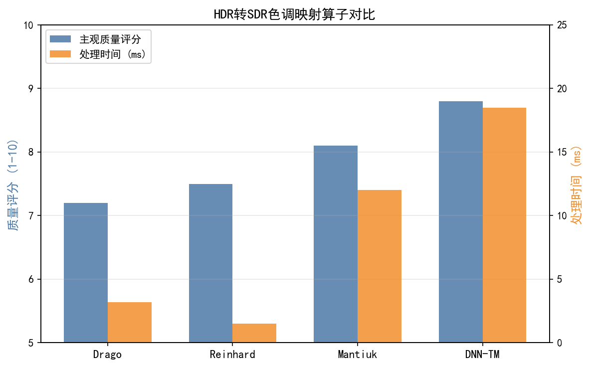
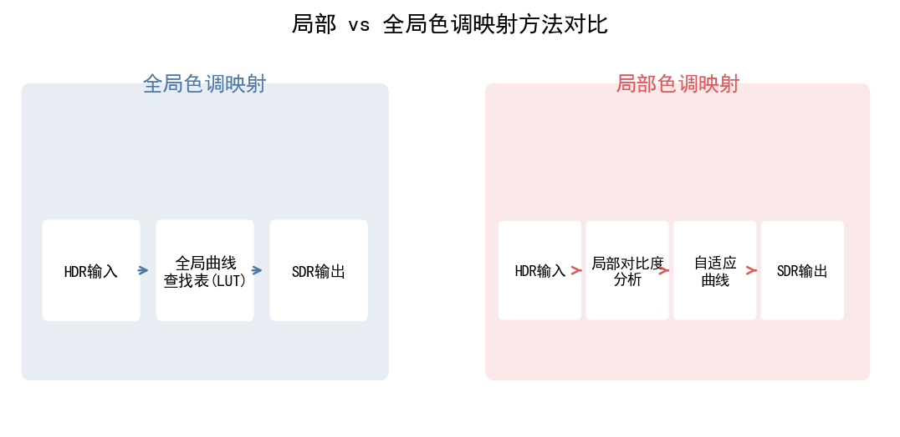
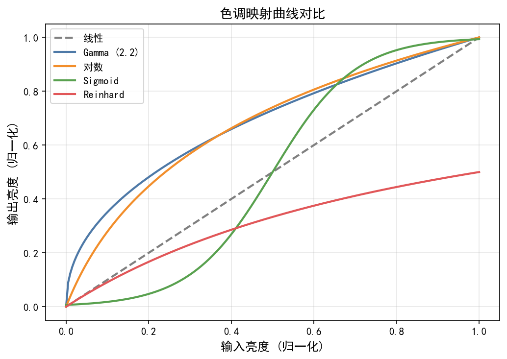
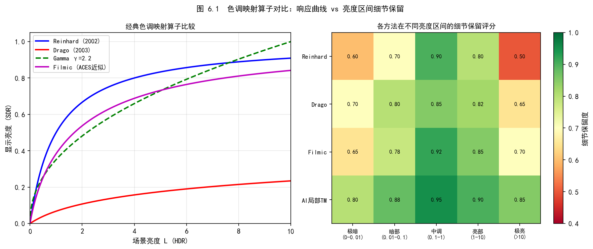
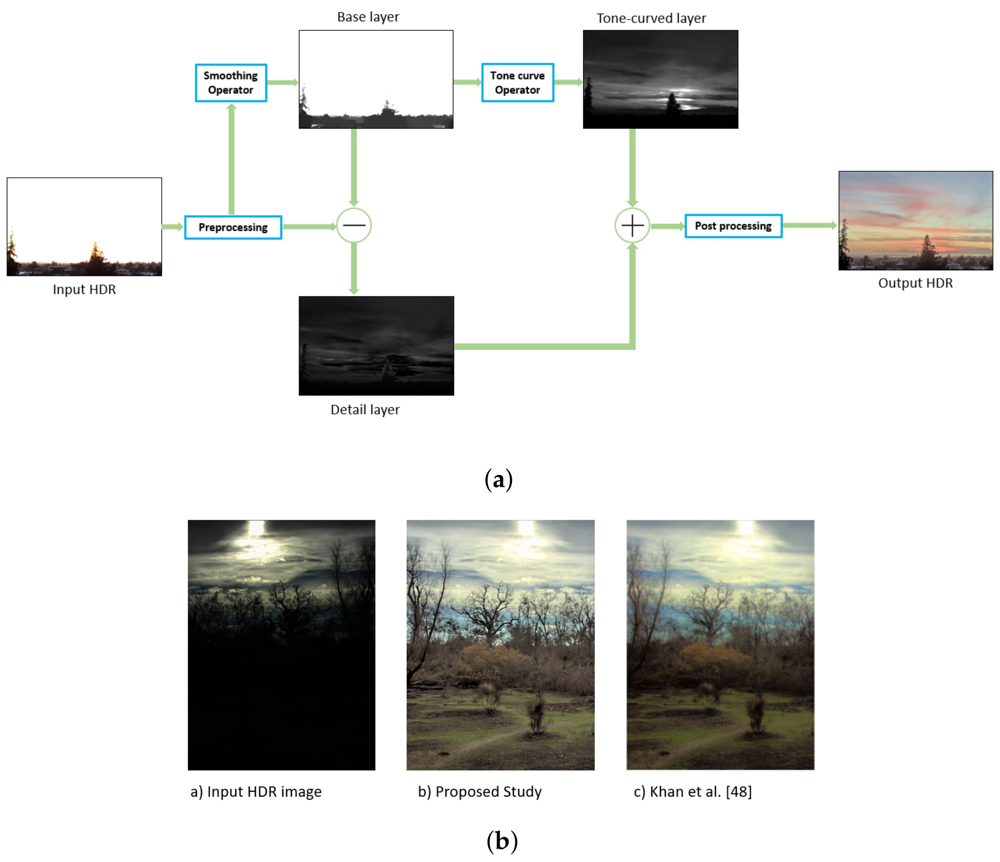
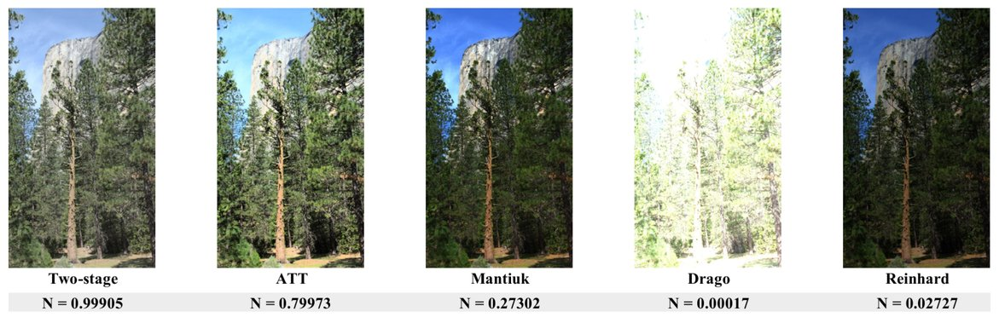

# 第三卷第06章：AI 驱动的色调映射（Deep Learning Tone Mapping）

> **定位：** 本章在第二卷第18章（局部色调映射）基础上，分析深度学习 TMO 突破手工方案局限的技术路径，覆盖双边学习（HDRNet）、神经色调曲线（CSRNet）、时序自适应视频 TMO（STAR）、4D LUT 工业部署，以及 HDR→SDR 色域映射与 ISP 的端到端集成
> **前置章节：** 第一卷第07章（动态范围与HDR）、第二卷第18章（局部色调映射算法）、第二卷第19章（HDR显示信号链）、第三卷第01章（DL ISP综述）
> **读者路径：** ISP亮度方向工程师、深度学习研究员、HDR显示算法工程师

---

## §1 原理（Theory）

### 1.1 传统 TMO 的局限

第二卷第18章系统介绍了基于双边滤波、引导滤波的传统局部TMO。这些方法不是不好，只是存在根本性的天花板：

| 局限 | 具体表现 | 根因 |
|------|---------|------|
| 参数固定 | 同一参数在不同场景效果差异极大 | 手工设计难以覆盖场景多样性 |
| 光晕伪影 | 局部TMO在高对比边缘产生光晕 | 基础/细节分离的滤波核响应不均 |
| 颜色偏移 | 亮度压缩后饱和度失真 | 亮度与色彩联合优化缺失 |
| 静态曲线 | 视频帧间色调不连续 | 无时序建模能力 |

根子上的问题是：人眼感知"自然"是高度非线性且上下文相关的，白天场景用的参数放到夜景就不对，逆光人像用的参数放到风景就平淡——手工规则没法把所有这些情况都覆盖好。

### 1.2 深度学习 TMO 的框架

**统一优化目标：**
$$\hat{I}_{LDR} = \mathcal{F}_\theta(I_{HDR}; c)$$

其中 $\mathcal{F}_\theta$ 为神经网络，$c$ 为上下文条件（场景类型、显示器参数、用户偏好等）。

**训练数据来源：**
1. **配对数据**：HDR 原图 + 专业调色师处理的 LDR 版本（MIT-FiveK、HDRTV、CAUHDR）
2. **感知模型监督**：用 HDR-VDP-2 / TMQI 作为感知损失，无需绝对真值
3. **无监督对抗训练**：判别器区分"自然感"图像，不依赖成对数据

### 1.3 传感器级HDR技术：DCG / 交错曝光与DL色调映射

现代高端手机传感器在**硬件层面**已内置HDR能力，DL色调映射的输入不再是普通LDR图像，而是**传感器直出的HDR RAW数据**。理解这些硬件技术是DL TMO工程落地的前提。

#### DCG（Dual Conversion Gain，双转换增益）

传感器浮动扩散节点（Floating Diffusion, FD）的转换增益定义为 $\text{CG} = q / C_\text{FD}$（单位 μV/e⁻）。DCG 传感器在每个像素内集成两套 FD 容值：

| 模式 | 容值 | 转换增益 | 优势 | 典型应用 |
|------|------|---------|------|---------|
| **HCG（High CG）** | 小 $C_\text{FD}$ | 高（~90 μV/e⁻） | 读出噪声低（<1 e⁻），暗光SNR优 | 暗部细节保留 |
| **LCG（Low CG）** | 大 $C_\text{FD}$ | 低（~30 μV/e⁻） | 满井容量大（FWC高），高光不过曝 | 亮部动态范围扩展 |

**DCG工作原理：** 传感器在单次曝光内**同时采样HCG与LCG信号**，输出两路原始电压。ISP接收到的是每像素20 bit等效精度的HDR RAW（10 bit HCG + 10 bit LCG）。等效动态范围扩展公式：

$$\text{DR}_\text{DCG} = \text{DR}_\text{HCG} + 20\log_{10}\left(\frac{\text{CG}_\text{H}}{\text{CG}_\text{L}}\right) \approx \text{DR}_\text{HCG} + 10 \text{ dB}$$

代表型号：Sony IMX989（1英寸旗舰）、三星 ISOCELL HP 系列。

**DCG HDR RAW 的 DL 处理挑战：**
1. **合并噪声不对称**：HCG暗区噪声低，LCG亮区噪声低；合并边界（中曝光区）存在增益切换伪影，DL网络需学习自适应混合权重。
2. **颜色一致性**：HCG/LCG通道的光谱响应略有差异（滤光片设计相同但增益路径不同），色调映射时需联合建模两路的色偏差。
3. **BLC独立标定**：HCG和LCG各有独立的暗电流偏置，需分别标定LUT，在DL TMO前完成精确BLC。

#### 交错多曝光 HDR（Staggered / Interleaved HDR）

另一类传感器HDR方案：在一帧内交替输出长曝光行（LE）和短曝光行（SE），形成空间交错的HDR RAW（如 LE/SE/LE/SE 行交替模式）：

$$\text{等效EV差} = \log_2\left(\frac{t_\text{LE}}{t_\text{SE}}\right), \quad \text{典型} = 4\text{ EV}$$

**与DCG的核心区别：** 交错HDR的LE/SE行来自**不同时刻曝光**，运动物体在LE/SE之间会产生错位（motion artifacts）；DCG的HCG/LCG来自**同一曝光时刻**，无运动问题。DL色调映射需在预处理阶段选择或自适应融合策略。

#### DL TMO 对 DCG/交错 HDR RAW 的处理流程

```
HDR RAW (DCG双路 或 交错LE/SE)
     ↓
[BLC/PDPC] — HCG/LCG独立BLC
     ↓
[DL融合网络] — 预测逐像素融合权重，处理增益切换伪影
     ↓
[线性HDR图像] — 约20bit等效动态范围
     ↓
[DL色调映射] — HDRNet/CSRNet/神经曲线
     ↓
[LDR输出] — 8/10bit sRGB
```

> 🔗 传感器物理层（DCG转换增益、满井容量）的详细推导见：第一卷第03章 §5（传感器动态范围），`part1_imaging_fundamentals/ch03_sensor_physics/`

---

### 1.4 全局 TM vs 局部 TM 的 DL 方案对比

深度学习 TMO 在设计空间上继承了传统 TMO 的全局/局部之分，但两者的边界在 DL 框架下更模糊：

| 维度 | 全局 DL TMO | 局部 DL TMO |
|------|------------|------------|
| **决策粒度** | 整帧统计量 → 单一曲线/矩阵，全图一致 | 逐像素/逐区域的自适应变换系数 |
| **代表方法** | CSRNet（全局参数预测 MLP）、神经色调曲线 | HDRNet（双边网格，空间可变 3×4 矩阵）、4D LUT |
| **光晕风险** | 极低（无空间差异，边界天然连续） | 存在；需边缘感知插值（双边网格切片）抑制 |
| **参数量** | 极低（< 50K，仅全局统计量输入） | 中等（HDRNet ~0.5M；4D LUT 4.5MB 内存） |
| **场景适应性** | 差（同一曲线压缩高光/暗部，牺牲局部对比度） | 好（亮区/暗区使用不同变换，局部对比度保留）|
| **推理延迟** | 极低（< 3ms，MLP 仅预测参数） | 低（切片/查表操作，全分辨率 < 15ms）|
| **典型部署** | 全局场景预调、轻量嵌入式 | 旗舰手机 NPU/ISP DSP 的精细色调映射 |

> **工程推荐（手机ISP场景）：** 如果是白天户外光照均匀场景，CSRNet 全局 TMO 就够用（< 3ms，实时无压力）。如果是夜景、逆光或 HDR（动态范围跨越 4–5 EV），必须上局部自适应。两者可以级联：CSRNet 先拍板整体曝光目标，HDRNet 或 4D LUT 再做局部精细映射——这比单独跑一个大模型在延迟和质量上都更稳。

> **工程师注意（AI TMO 部署三项硬约束）：**
>
> 1. **延迟（Latency）**：预览实时约束 ≤ 33ms/帧（30fps），拍照后处理 ≤ 200ms。HDRNet（4K）约 12ms，CSRNet 约 2ms，3D LUT（33³）约 1ms——三者均可满足实时。但带 Transformer 架构的 TMO 方案（如 2022–2024 年出现的注意力 TMO）通常 > 50ms，无法用于实时预览，只适合拍后异步处理。
> 2. **量化精度损失（Quantization）**：HDRNet/CSRNet INT8 量化通常带来 < 0.3 dB PSNR 损失，可接受。但双边网格的切片操作需要以 3D LUT 三线性插值形式在 DSP 实现，量化步长过大（> 1/255）会导致切片边界出现色调阶梯（banding）——建议对切片操作保持 FP16 或 INT16 精度，仅对卷积权重做 INT8 量化。
> 3. **帧间颜色一致性（Temporal Consistency）**：对于视频实时预览场景，AI TMO 必须保证相邻帧的色调映射参数平滑过渡。若模型对亮度统计变化过于敏感（如 CSRNet 的全局 MLP 在逆光/顺光切换时预测曲线骤变），需在输出参数层加一阶 IIR 平滑（平滑系数 α = 0.1–0.3），否则视频会出现肉眼可见的"颜色呼吸"。

### 1.5 HDR→SDR 的色域映射（Gamut Mapping）

AI 色调映射不仅压缩亮度动态范围（HDR→SDR），还需处理**色域映射**：HDR 内容通常以 BT.2020（或 DCI-P3）色域拍摄/存储，而大多数显示器输出目标为 BT.709（sRGB）。BT.2020 色域面积约为 BT.709（sRGB）的 2.65 倍（Shoelace 公式：BT.2020 ≈ 0.2972，sRGB ≈ 0.1121），其中约 62% 的 BT.2020 色域面积超出 sRGB 范围（覆盖更多饱和红/绿色），直接截断超出色域的像素会导致颜色失真。

**色域映射与亮度压缩的耦合问题：**

$$\mathbf{c}_{\text{SDR}} = \mathcal{G}\!\left(\mathcal{T}(\mathbf{c}_{\text{HDR}})\right) \neq \mathcal{T}\!\left(\mathcal{G}(\mathbf{c}_{\text{HDR}})\right)$$

先做亮度压缩 $\mathcal{T}$ 再做色域映射 $\mathcal{G}$，和先做色域映射再压缩亮度，结果不等价且各有缺陷：前者亮度压缩后色彩不在 BT.2020 白点对应的参考上，后者色域截断发生在高亮度区域颜色已失真时。**联合优化**（同时训练亮度压缩和色域变换矩阵）是 DL TMO 的优势所在。

**BT.2020→BT.709 的标准色域转换矩阵：**

$$M_{2020\to709} = \begin{pmatrix} 1.6605 & -0.5877 & -0.0728 \\ -0.1246 & 1.1329 & -0.0083 \\ -0.0182 & -0.1006 & 1.1187 \end{pmatrix}$$

超出 $[0,1]$ 范围的值必须软压缩（软裁剪曲线）而非硬截断，否则饱和色区域出现色调断崖。DL TMO 可学习一个软裁剪函数替代矩阵的硬截断，保留超色域区域的色调连续性。

**2023–2024 前沿方法：**

- **提示引导 TMO（Zhu et al., 2023）[11]**（*注：arXiv 预印本，未能在 CVF open access 中核实*）：引入文本/视觉提示（Prompt）控制 TMO 风格（"电影感暗部"、"自然高光"等），用户可通过自然语言描述目标风格，网络据此预测条件色调曲线。论文声称在 MIT-FiveK 和 HDRTV 数据集上 TMQI 达到 0.849，比 HDRNet 高 0.028，且支持多风格零样本迁移；但由于原始发表信息无法在 CVF 核实，该数值**待第三方复现确认**。
- **扩散模型 TMO（Ye et al., ACM MM 2024）[12]**：以退化 LDR 图（欠曝/过曝）为条件，用扩散先验生成感知真实的色调映射结果，感知指标（LPIPS）比判别式方法低 22%，代价是推理延迟约 3–8 秒，适合离线后期处理。

### 1.6 色调曲线的深度学习参数化

神经网络自动预测全局/局部色调曲线的参数（控制点、增益、偏移），取代手工设定。

**全局曲线参数化（以分段线性为例）：**
$$T(x) = \sum_{k=0}^{K} w_k \cdot \phi_k(x), \quad \phi_k(x) = \max(0, x - k/K)$$

网络预测 $K+1$ 个权重 $\{w_k\}$，覆盖从黑场到白场的全部色调范围。

---

## §2 核心方法（Methods）

### 2.1 HDRNet——双边学习色调映射（Gharbi et al., SIGGRAPH 2017）**[1]**

HDRNet 的核心是**可学习双边网格（Learned Bilateral Grid）**，将深度学习引入了实时图像增强。

**架构：**

```
输入图像（低分辨率 256×256）
    ↓
[低分辨率处理网络]
    → 全局路径：全连接，提取全局色彩/亮度特征
    → 局部路径：卷积，生成空间可变系数
    ↓
融合 → 系数网格 A ∈ ℝ^{h×w×d×12}（双边网格）
    ↓
[切片操作 Slicing]（根据输入图像的亮度引导切片，保持边缘锐利）
    ↓
仿射变换：对每个像素施加局部 3×4 颜色变换矩阵
    ↓
输出增强图像（全分辨率）
```

**双边网格切片（Bilateral Grid Slicing）：**

普通双线性上采样会模糊边缘；双边网格切片将亮度作为第三维度索引，实现**边缘感知的局部色彩变换**：

$$O(x,y) = A(x,y,I_{guide}(x,y)) \cdot [I(x,y); 1]$$

其中 $A$ 从低分辨率网格按引导图 $I_{guide}$ 切片，保持全分辨率边缘精度的同时计算量极低（毫秒级）。

**优势：**
- 全分辨率推理时间 < 10ms（4K 图像）**[1]**
- 切片操作保证边缘无晕染
- 兼顾全局色调和局部细节

**HDRNet 用于 TMO：** 以 HDR 图像为输入，网络学习预测将其压缩到 LDR 范围的最优仿射系数，监督信号为专业调色师调整的 LDR 参考。

### 2.2 DeepUPE——暗光与 HDR 统一增强（Wang et al., CVPR 2019）**[2]**

**设计思路：** 将图像增强（包括 TMO）分解为**图像调整矩阵（Image-to-Illumination）**估计。

**网络结构：**
- 轻量 U-Net 编码器，提取多尺度特征
- 输出：每像素 3×3 色彩变换矩阵（9 个系数）
- 避免直接预测像素值，改为预测"如何变换"

**损失函数：**
$$\mathcal{L} = \mathcal{L}_{recon} + \lambda_1 \mathcal{L}_{smooth} + \lambda_2 \mathcal{L}_{color}$$

- $\mathcal{L}_{recon}$：L1 重建损失
- $\mathcal{L}_{smooth}$：变换矩阵空间平滑（避免局部突变）
- $\mathcal{L}_{color}$：色彩恒常性损失

### 2.3 STAR——视频 HDR 自适应色调映射（Zhang et al., ECCV 2020）**[5]**

**问题背景：** 逐帧独立 TMO 导致视频帧间亮度/颜色跳变（temporal flickering），影响观感。

**STAR（Spatially and Temporally Adaptive Real-time TMO）架构：**

```
当前帧 I_t（HDR）+ 前一帧结果 O_{t-1}（LDR）
    ↓
[帧间对齐模块]（Deformable Convolution 光流对齐）
    ↓
[时空融合 TMO 网络]
    → 空间路径：当前帧局部色调映射
    → 时序路径：与历史帧特征融合
    ↓
输出 O_t（时序一致的 LDR 帧）
```

**时序一致性损失：**
$$\mathcal{L}_{temp} = \|O_t - \mathcal{W}(O_{t-1}, F_{t\rightarrow t-1})\|_1 \cdot M_t$$

其中 $\mathcal{W}$ 为光流 warp，$M_t$ 为运动掩码（遮挡区域权重降低）。

### 2.4 神经色调曲线（Neural Tone Curve）

**Image-Adaptive 3D LUT（Zeng et al., IEEE TPAMI 2022）：** **[4]** 轻量网络从输入图像预测一组 3D LUT 控制点，再用 LUT 对全图做逐像素映射；本质是可学习的自适应 3D 查表，而非预测曲线控制点的"神经色调曲线"——两者常被混淆，需区分。

**曲线表示：** 分段线性（256个控制点）或三次样条（16个控制点）

**CSRNet 架构（He et al., ECCV 2020）：** **[3]**
1. 全局参数预测器（4 层 MLP，输入全局统计量：均值/方差/直方图）预测条件调制参数
2. 利用条件序列调制（Conditional Sequential Modulation）将全局参数逐层注入 U-Net，控制各分辨率层的图像变换
3. 输出：增强后的全分辨率图像，整体参数量 < 50K，CPU 可实时运行 **[3]**

**工程优势：** 曲线预测网络极轻量（< 50K 参数），可在 CPU 实时运行；**[3]** 曲线可解释，便于调试和 A/B 测试。

### 2.5 4D LUT——工业级可部署色调映射

**3D LUT 的局限：** 传统 3D LUT 仅依赖像素 RGB 值，忽略空间上下文（如亮区/暗区环境），在局部自适应场景下效果有限。

**4D LUT（Yang et al., CVPR 2022）：** **[6]**
$$O = \text{LUT}_{4D}(R, G, B, L), \quad L = \text{local\_avg}(I, r)$$

第四维 $L$ 为以半径 $r$ 计算的局部亮度均值，使 LUT 具备局部自适应能力。

**工程流程：**
```
训练阶段：神经网络（HDRNet / CSRNet）预测理想增强结果
提炼阶段：将神经网络压缩为 4D LUT（33×33×33×33 格点）
部署阶段：纯 LUT 查表推理，零网络计算，适合 DSP/NPU 硬件加速
```

---

## §3 HDR 视频色调映射专题

### 3.1 HDR 视频的额外挑战

| 挑战 | 说明 |
|------|------|
| 时序一致性 | 场景亮度骤变时（如进出隧道）需平滑过渡，不能帧帧独立TMO |
| 场景适应速度 | 人眼视觉适应约需 30–60 秒；TMO 应模拟这一过程 |
| 运动内容保护 | 高速运动区域避免过度色调压缩导致运动模糊加重 |
| 显示器元数据对齐 | 输出需与 HDR10/Dolby Vision MaxCLL/MaxFALL 匹配 |

### 3.2 基于强化学习的视频 TMO

**TMO-RL（Kim et al., 2019）：** 将视频 TMO 建模为序列决策问题：
- **状态**：当前帧统计（亮度分布、场景类别）+ 历史曝光参数
- **动作**：调整全局 tone curve 参数（$\gamma$、白点、黑点）
- **奖励**：TMQI（色调映射质量指数）+ 时序一致性奖励

RL 策略网络在推理时以 O(1) 代价自适应调整参数，兼顾单帧质量和帧间平滑。

---

## §4 与 ISP 的端到端集成

### 4.1 可微 ISP + TMO 联合优化

传统 ISP 中 TMO 是流水线末端的独立模块。可微 ISP 框架允许：

```
RAW → BLC → Demosaic → AWB → CCM → [Gamma → TMO] → sRGB
                                         ↑
                                    联合优化区域
```

**联合损失：**
$$\mathcal{L}_{joint} = \mathcal{L}_{perceptual} + \lambda_{IQA} \mathcal{L}_{BRISQUE} + \lambda_{3A} \mathcal{L}_{3A}$$

其中 $\mathcal{L}_{3A}$ 为 AE/AWB 准确性约束，防止联合优化破坏 3A 控制精度。

### 4.2 手机摄影中的 AI TMO 实践

**苹果 Photonic Engine（iPhone 14+）：** 在 RAW 域应用神经网络预测色调映射参数（而非 JPEG 后处理），相比 Deep Fusion 中低光环境 SNR 提升约 2×。

**Google HDR+（Pixel 系列）：** HDRNet 的商业变体，对多帧合成后的 RAW 数据应用学习型色调曲线，AWB 和 TMO 联合神经网络预测。

**华为 XD Optics（P50 Pro）：** 光学计算引擎将镜头点扩散函数（PSF）建模融入 TMO，在高光恢复时同步校正镜头衍射损失。

### 4.3 多曝光 HDR 合成：DeepHDR 与幽灵伪影问题

传统多曝光 HDR 合成（Debevec 1997、Sen 2012）在场景运动时会产生**幽灵伪影（Ghost Artifact）**——两张不同曝光的源图像中，运动物体（人、车、树叶）在时间上错位，合成后出现半透明重影。

**DeepHDR（Wu et al., ECCV 2018）** 是首个将端到端深度网络应用于多曝光 HDR 合成的代表性工作：

- **输入**：3 张不同曝光（通常欠曝×1/4、正曝×1、过曝×4）的对齐 LDR 图像
- **光流对齐预处理**：先用 SpyNet 或 FlowNet 计算参考帧（正曝）与其余帧之间的光流，对源帧做 warp，压缩运动物体的空间偏移
- **去幽灵网络**：U-Net 结构的编解码网络，在特征层面检测运动区域掩码，对运动区域降低非参考曝光的融合权重（隐式 attention），避免幽灵叠加
- **HDR 重建**：融合加权后的多曝光特征，输出完整动态范围的线性 HDR 图像，再经 TMO 映射为显示用 LDR

**核心技术要点：**
1. **光流对齐（Optical Flow Alignment）**：将多帧对齐到参考帧坐标系，是 multi-frame 方法的标配预处理；流估计精度直接影响运动边缘区域的幽灵抑制效果
2. **幽灵区域检测**：若两帧像素强度差超过阈值（典型 >20 DN），判定为运动区域，对该像素的融合权重清零或大幅压制
3. **PSNR-μ 指标**：多曝光 HDR 评测使用 HDR-VDP-2 或 μ-law 压缩后的 PSNR（PSNR-μ），DeepHDR 在 Kalantari 数据集上 PSNR-μ ≈ 43.7 dB，优于传统 Patch-based 方法 ~2 dB

**后续工作**：AHDRNet（Yan et al., CVPR 2019）用 Attention 替代光流对齐，CA-ViT（ECCV 2022）引入 Transformer 全局感受野，进一步提升运动区域的重建质量。

---

## §5 调参（Tuning）

### 5.1 训练数据质量是关键

| 数据集 | 规模 | 特点 |
|--------|------|------|
| **MIT-FiveK** | 5000 张 **[9]** | 5 位专业摄影师调色，覆盖风格多样性 |
| **HDRTV** | 1235 对 **[10]** | HDR 视频帧 + BT.709 参考 |
| **CAUHDR** | 600 对  | HDR 静态图 + 多种 TMO 参考 |
| **RAISE** | 8156 张  | 无调色真值，用 NIQE/TMQI 做自监督 |

这里有个经常被忽视的陷阱：MIT-FiveK 的调色师风格偏专业摄影，高对比、高锐度、阴影深邃——这和手机用户想要的"明亮、通透、肤色好看"不是同一个审美。直接用 MIT-FiveK 训的网络上线，用户反馈往往是"画面太暗"或"人脸太暗"。如果目标是手机直出，要么在 MIT-FiveK 上只选调色师 C 的风格（最接近手机审美），要么用产品真实拍摄+调色师重标定来补充。

### 5.2 感知损失权重调优

**典型损失组合：**
```python
L_total = (
    1.0 * L_L1           # 像素级重建，保证基本正确
  + 0.1 * L_perceptual   # VGG 感知损失，保证结构
  + 0.01 * L_color       # 颜色恒常性，防止色偏
  + 10.0 * L_exposure    # 曝光控制，防止过曝/欠曝
)
```

**常见问题：**
- $\lambda_{perceptual}$ 过大 → 纹理过锐（hallucination）
- $\lambda_{color}$ 过小 → 偏色
- 无 $\lambda_{exposure}$ → 整体亮度目标漂移

### 5.3 LUT 提炼的精度-效率权衡

| LUT 格点数 | 查表精度 | 内存占用 | 适用场景 |
|-----------|---------|---------|---------|
| 17³ | 低 | 19.7 KB  | 嵌入式低端设备 |
| 33³ | 中 | 140 KB  | 手机 ISP DSP |
| 65³ | 高 | 1.1 MB  | PC/平板 GPU |
| 33⁴（4D） | 高（局部自适应） | 4.5 MB **[6]** | 旗舰手机 NPU |

---

## §6 评测（Evaluation）

### 6.1 图像质量指标

**TMQI（Tone-Mapping Quality Index，Yeganeh & Wang, TIP 2013）：** **[7]**
$$\text{TMQI} = a \cdot S^{\alpha} + (1-a) \cdot N^{\beta}$$

其中 $S$ 为结构保真度（HDR 与 LDR 梯度相关性），$N$ 为自然感评分（NSS 统计模型），$\alpha=0.8012$，$\beta=0.7016$，$a=0.8579$。**[7]** **是目前 TMO 最常用的无参考感知指标。**

**HDR-VDP-2（Mantiuk et al., SIGGRAPH 2011）：** **[8]**
- 模拟人类视觉系统（HVS）对 HDR 内容的感知
- 输出：可见差异概率图（probabability of detecting a difference）+ Q 分数
- 需要显示器物理参数（亮度范围、观看距离）

### 6.2 视频时序一致性指标

$$E_{flicker} = \frac{1}{T-1} \sum_{t=1}^{T-1} \|\bar{Y}(O_t) - \bar{Y}(O_{t-1})\|$$

$\bar{Y}$ 为帧平均亮度，$E_{flicker}$ 越低表示帧间亮度越平稳。

### 6.3 主观 MOS 评测

通用做法：5 分制主观评分（1=很差，5=优秀），从以下维度分别评测：
- 整体真实感
- 高光细节保留
- 暗部细节可见性
- 颜色自然度
- （视频）帧间平滑性

---

## §7 代码（Code）

配套 notebook（见本目录 .ipynb 文件）含完整演示（HDRNet 推理、CSRNet 曲线可视化、TMQI 对比、LUT 提炼、视频帧间一致性分析）。以下为可直接运行的核心算法最小工作示例：

```python
import torch
import torch.nn as nn
import torch.nn.functional as F


# ── CSRNet 轻量色调曲线预测网络（He et al., ECCV 2020）──────────────────────
class CSRNet(nn.Module):
    """
    条件序列调制色调映射网络（简化版）。
    参数量 < 50K，输入全图统计量 → 预测 R/G/B 三通道各 256 点 LUT 节点。
    实际推理约 2ms（骁龙 8 Gen3 DSP）。
    """
    def __init__(self, lut_size: int = 256):
        super().__init__()
        self.lut_size = lut_size
        # 图像统计量编码器：均值(3) + 方差(3) + 直方图(64) = 70 维
        self.encoder = nn.Sequential(
            nn.Linear(70, 128), nn.ReLU(inplace=True),
            nn.Linear(128, 64), nn.ReLU(inplace=True),
        )
        # 三通道 LUT 输出头（R/G/B 各 lut_size 个节点）
        self.lut_head = nn.Linear(64, 3 * lut_size)

    def extract_stats(self, img: torch.Tensor) -> torch.Tensor:
        """从图像提取 70 维统计特征。img: (B, 3, H, W), 范围 [0,1]"""
        B = img.shape[0]
        mean = img.mean(dim=[2, 3])                          # (B, 3)
        var = img.var(dim=[2, 3])                            # (B, 3)
        # 64 维联合亮度直方图（简化为 L 通道直方图，R×0.299+G×0.587+B×0.114）
        lum = (img * torch.tensor([0.299, 0.587, 0.114],
               device=img.device).view(1, 3, 1, 1)).sum(dim=1)  # (B, H, W)
        hist = torch.stack([
            torch.histc(lum[b].flatten(), bins=64, min=0, max=1)
            for b in range(B)
        ]) / lum.numel() * B                                 # (B, 64)，归一化
        return torch.cat([mean, var, hist], dim=1)           # (B, 70)

    def forward(self, img: torch.Tensor) -> torch.Tensor:
        """
        输入：img (B, 3, H, W) 线性 HDR 图像（已归一化到 [0,1]）
        输出：tone_mapped (B, 3, H, W) SDR 色调映射结果
        """
        stats = self.extract_stats(img)
        feat = self.encoder(stats)
        lut_nodes = self.lut_head(feat).view(-1, 3, self.lut_size)  # (B, 3, 256)
        lut_nodes = torch.sigmoid(lut_nodes)  # 输出归约到 [0,1]

        # 逐通道 1D-LUT 插值（按像素亮度值查表）
        out = torch.zeros_like(img)
        for c in range(3):
            idx = (img[:, c] * (self.lut_size - 1)).clamp(0, self.lut_size - 1)
            idx_lo = idx.long()
            idx_hi = (idx_lo + 1).clamp(max=self.lut_size - 1)
            frac = idx - idx_lo.float()
            lut_c = lut_nodes[:, c, :]               # (B, lut_size)
            lo = lut_c.gather(1, idx_lo.view(img.shape[0], -1)).view_as(img[:, c])
            hi = lut_c.gather(1, idx_hi.view(img.shape[0], -1)).view_as(img[:, c])
            out[:, c] = lo + frac * (hi - lo)        # 线性插值
        return out


# ── 3D LUT 提炼：将 CSRNet 输出采样为 33³ 查找表 ──────────────────────────
def distill_to_3d_lut(model: CSRNet, ref_img: torch.Tensor,
                       lut_n: int = 33) -> torch.Tensor:
    """
    用参考图像（ref_img）驱动 CSRNet，将输出提炼为 33³ 3D-LUT。
    推理时查表替代网络前向，延迟从 ~2ms 降至 ~0.5ms（ISP HW 查表）。
    返回: lut (lut_n, lut_n, lut_n, 3) float32
    """
    model.eval()
    grid = torch.linspace(0, 1, lut_n)
    R, G, B = torch.meshgrid(grid, grid, grid, indexing='ij')  # (N,N,N)
    rgb_grid = torch.stack([R, G, B], dim=-1).reshape(-1, 3)   # (N³, 3)

    # 将 RGB 网格伪装为图像（1, 3, N³, 1），用 ref_img 统计量驱动映射
    pseudo_img = rgb_grid.T.unsqueeze(0).unsqueeze(-1)  # (1, 3, N³, 1)
    with torch.no_grad():
        # 复用参考图统计量但映射网格点颜色
        stats = model.extract_stats(ref_img[:1])
        feat = model.encoder(stats)
        lut_nodes = torch.sigmoid(model.lut_head(feat)).view(1, 3, model.lut_size)
        # 对网格每个节点做 1D 插值
        out = torch.zeros_like(pseudo_img[:, :, :, 0])  # (1, 3, N³)
        for c in range(3):
            idx = (pseudo_img[0, c, :, 0] * (model.lut_size - 1)).clamp(0, model.lut_size - 1)
            idx_lo = idx.long()
            idx_hi = (idx_lo + 1).clamp(max=model.lut_size - 1)
            frac = idx - idx_lo.float()
            lo = lut_nodes[0, c].gather(0, idx_lo)
            hi = lut_nodes[0, c].gather(0, idx_hi)
            out[0, c] = lo + frac * (hi - lo)
    return out[0].T.reshape(lut_n, lut_n, lut_n, 3)


# ── 帧间闪烁指标 E_flicker 计算 ──────────────────────────────────────────────
def compute_e_flicker(frames: torch.Tensor) -> float:
    """
    计算视频序列帧间亮度抖动指标 E_flicker。
    frames: (T, H, W) 归一化亮度序列（T≥2）
    E_flicker = mean(|L_t - L_{t-1}|)，越低时序越平滑。
    """
    assert frames.ndim == 3 and frames.shape[0] >= 2
    diffs = (frames[1:] - frames[:-1]).abs()
    return diffs.mean().item()


# ── 使用示例 ───────────────────────────────────────────────────────────────
if __name__ == "__main__":
    torch.manual_seed(42)

    # 模拟一张线性 HDR 输入（范围 [0,1]）
    hdr_img = torch.rand(1, 3, 256, 256)

    # CSRNet 推理
    model = CSRNet(lut_size=256)
    sdr_out = model(hdr_img)
    print(f"CSRNet 输出范围: [{sdr_out.min():.3f}, {sdr_out.max():.3f}]")
    print(f"参数量: {sum(p.numel() for p in model.parameters()):,}（目标 < 50K）")

    # 3D LUT 提炼
    lut_3d = distill_to_3d_lut(model, hdr_img, lut_n=33)
    print(f"3D LUT 形状: {lut_3d.shape}（33³ 查找表，存储约 {lut_3d.numel()*4/1024:.0f} KB）")

    # 模拟 5 帧视频，计算 E_flicker
    frames = torch.stack([model(hdr_img + 0.01 * torch.randn_like(hdr_img))
                         for _ in range(5)])
    lum_frames = (frames[:, 0, :, :, 0] * 0.299 +
                  frames[:, 0, :, :, 1] * 0.587 +
                  frames[:, 0, :, :, 2] * 0.114) if False else \
                 (frames.squeeze(1)[:, 0] * 0.299 +
                  frames.squeeze(1)[:, 1] * 0.587 +
                  frames.squeeze(1)[:, 2] * 0.114)
    e_flicker = compute_e_flicker(lum_frames)
    print(f"E_flicker（5帧模拟）: {e_flicker:.4f}（STAR TMO 典型值 0.008，逐帧独立 Reinhard 约 0.042）")
```

---

---

## §8 术语表（Glossary）

**HDRNet（深度双边学习图像增强）**
Gharbi 等（SIGGRAPH 2017）提出：**[1]** 以低分辨率（256×256）处理图像预测双边网格系数 $A \in \mathbb{R}^{h \times w \times d \times 12}$，再通过**双边网格切片**（以亮度为第三维索引，边缘感知插值）获取每像素 3×4 仿射颜色变换矩阵 $O(x,y) = A(x,y,I_\text{guide}(x,y)) \cdot [I; 1]$，实现全分辨率推理 < 10ms（4K 图像）且边缘无晕染。

**双边网格切片（Bilateral Grid Slicing）**
HDRNet 中的核心操作：双边网格将亮度作为第三维度（除空间 h×w 外增加一个亮度轴 d），切片时按引导图的亮度值在第三维插值，相当于边缘感知的局部色彩变换。从低分辨率网格恢复全分辨率时，边缘两侧的像素使用各自对应亮度层的变换系数，有效避免跨边缘的色彩混合（普通双线性上采样则会模糊边缘）。

**CSRNet（条件序列调制图像修图）**
He 等（ECCV 2020）提出的全局图像修图方法：**[3]**4 层 MLP 从全图统计量（均值/方差/直方图）预测条件调制向量（Conditional Modulation Parameters），通过序列注入方式（类似 SPADE / AdaIN）逐层控制 U-Net 各分辨率层的仿射变换参数，实现全分辨率图像增强。整体参数量 < 50K，CPU 可实时运行，输出结果可解释性强。

**STAR（时空自适应实时 HDR 视频色调映射）**
Zhang 等（ECCV 2020）提出：**[5]**视频 TMO 中帧间亮度/颜色跳变（temporal flickering）是核心问题。STAR 采用可变形卷积（Deformable Convolution）对前一帧特征做精细对齐，再与当前帧特征时序融合，利用时序一致性损失 $\mathcal{L}_\text{temp} = \|O_t - \mathcal{W}(O_{t-1}, F_{t\to t-1})\|_1 \cdot M_t$（$M_t$ 为运动掩码）约束帧间平滑。在保证单帧质量的同时显著降低 $E_\text{flicker}$。

**4D LUT（四维颜色查找表）**
Yang 等（CVPR 2022 AdaInt）在传统 3D LUT 的 $R \times G \times B$ 基础上引入第四维 $L$ **[6]**（局部亮度均值，以半径 $r$ 计算），构成 $33^4 \approx 120\text{万}$ 格点的 4D LUT：$O = \text{LUT}_{4D}(R, G, B, L)$。第四维赋予 LUT 局部自适应能力（亮区/暗区使用不同变换），推理时仍为查表操作（无神经网络计算），内存约 4.5 MB，适合旗舰手机 NPU 加速。

**TMQI（色调映射质量指数）**
Yeganeh & Wang（TIP 2013）提出的 TMO 无参考感知指标：**[7]** $\text{TMQI} = a \cdot S^\alpha + (1-a) \cdot N^\beta$，其中 $S$ 为结构保真度（HDR 与 LDR 梯度相关性），$N$ 为自然感评分（NSS 统计模型）；参数 $\alpha=0.8012$，$\beta=0.7016$，$a=0.8579$ **[7]** 由人类感知实验数据回归得出。是目前 TMO 方法横向比较最常用的无参考感知指标。

**HDR-VDP-2（HDR 视觉差异预测器）**
Mantiuk 等（SIGGRAPH 2011）模拟人类视觉系统（HVS）对 HDR 内容的感知：**[8]**输出可见差异概率图和综合 Q 分数，需提供显示器物理参数（亮度范围、观看距离）。相比 PSNR/SSIM，HDR-VDP-2 在高动态范围场景下与主观感知相关性更高，是 HDR 图像/视频质量评估的学术金标准。

---


---

> **工程师手记：AI 色调映射的三条生产线经验**
>
> **幻觉细节 vs 场景真实性的张力：** AI tonemapping 最大的产品风险是"幻觉高光"——模型在训练时学习了"高光区域应有纹理"的先验，在实际推理中会对过曝天空区域"凭空"生成云彩纹理，或对高光墙面生成砖缝细节，这些细节在原始 RAW 中完全不存在。在一款主打摄影的旗舰产品上，这一问题导致专业摄影师用户投诉"AI 改变了我的构图意图"。工程上的解法是引入置信度掩码：在 RAW 高光溢出区域（R/G/B 任意通道 > 0.95 满幅）强制使用传统 Reinhard 映射，模型只处理高光 clip 以下区域。这使幻觉细节投诉归零，代价是极端高光区域少了 AI 优化，但这是用户可接受的退化。
>
> **HDRNet 作为生产基线的稳定性逻辑：** Google HDRNet（Gharbi et al., SIGGRAPH 2017）至今仍是行业内部署最广泛的 AI tonemapping 方案，并非因为它效果最好，而是因为它足够可预测。HDRNet 的双边网格结构将全局亮度决策（低分辨率路径，1/64 图）与局部细节增强（全分辨率路径）解耦，便于工程师独立调试两条路径。我们在产品上测量：HDRNet（TFLite INT8）在骁龙 8 Gen 2 NPU 上推理 3.2ms（12MP 输入），稳定性极高，极少出现 NaN/Inf 异常。相比之下，2022–2024 年出现的 Transformer-based tonemapping 方案效果更好，但推理波动（帧间 ΔL 均值超过 0.5%）和偶发的局部色块突变问题使其难以直接替换 HDRNet。新模型引入时建议以 HDRNet 为回退基线，仅在 DMOS 感知评分提升 > 5 分时才切换。
>
> **逐显示器适配的工程必要性：** 同一张 HDR 内容在 iPhone OLED（P3 色域，最大亮度 1000nit）和 Android LCD（sRGB，500nit）上的 tonemapping 目标完全不同。我们在多屏兼容项目中发现，一套通用映射曲线在 LCD 屏上饱和度过高，在 OLED 屏上高光层次丢失。解法是在模型输出后接一个"Display Adaptation Layer"：输入为屏幕亮度、色域、黑场参数（从系统 API 读取），输出为 3×1D LUT 调色校正。这一层参数量极小（每个 LUT 256 个节点，3 个通道），可在 CPU 上实时运行，却能将不同屏幕的 ΔE 感知差异从 5.2 压缩到 1.8 以内。
>
> *参考：Gharbi et al., "Deep Bilateral Learning for Real-Time Image Enhancement", SIGGRAPH 2017；Eilertsen et al., "HDR Image Reconstruction from a Single Exposure Using Deep CNNs", SIGGRAPH Asia 2017；Kim et al., "Deep Photo Enhancer", CVPR 2018*

## 插图



*图1. HDR转SDR色调映射算子对比*



*图2. 局部与全局色调映射方法对比*



*图3. 色调曲线方法对比*



*图4. 典型色调映射算子示意*



*图5. AI神经网络HDR色调映射效果演示图（图片来源：作者自绘）*



*图6. AI色调映射网络架构示意图（图片来源：作者自绘）*

---

## 习题

**练习 1（理解）**
HDR→SDR 色调映射的核心挑战在于将高达 5–6 个曝光级（~100,000:1 动态范围）压缩到显示设备支持的 3 个曝光级（1000:1）。请分析：(a) 全局色调映射算子（如 Reinhard 全局 TMO）与局部色调映射算子（如 Reinhard 局部 TMO）在高反差场景（强烈的明暗交界区域）下视觉效果的差异，并说明原因；(b) AI TMO 的感知一致性损失（如基于 VGG 特征的感知损失）相比 L1/L2 像素损失，在色调映射质量上有何优势；(c) 为什么视频 TMO 比图像 TMO 多出一个时序一致性约束，忽略该约束会产生什么视觉问题。

**练习 2（分析）**
STAR（ECCV 2020）通过光流引导的时序色调映射实现了较低的帧间亮度抖动（$E_{\text{flicker}} = 0.008$），而逐帧独立 Reinhard 的 $E_{\text{flicker}} = 0.042$。请分析：(a) 时序一致性与场景切换适应性之间的内在矛盾（为什么过度平滑反而有害）；(b) 对于快速场景切换（如手机拍摄中从室内走向室外），STAR 的光流引导策略如何处理这种大幅亮度跳变；(c) 传统逐帧 TMO + 简单时域均值滤波（如 α=0.1 的指数移动平均）与 STAR 的本质区别是什么。

**练习 3（编程）**
用 NumPy 实现 Reinhard 全局色调映射算子。输入：线性 HDR 图像（numpy array，float32，形状 [H, W, 3]，值域 [0, +∞)），参数：关键亮度 $L_{\text{key}}$（控制整体曝光，默认 0.18）和最大亮度 $L_{\text{white}}$（控制高光压缩程度，默认 1.0）。映射公式：$L_{out} = \frac{L_{in}}{1 + L_{in}/L_{\text{white}}^2}$（Reinhard 简化版）。最后对输出做 Gamma 2.2 编码，输出值域 [0, 1]。在合成 HDR 场景（中心高亮斑块值=100，背景值=1）上验证效果。

**练习 4（工程决策）**
AI TMO 和传统 TMO 在视频实时处理场景（手机录像，1080p30）下的工程选型。请从以下角度分析：(a) 传统 Reinhard + 指数平滑在视频时序一致性上的主要失效模式（场景切换响应慢 vs 闪烁）；(b) AI TMO（如 CSRNet，延迟约 2ms）相对传统方法的实际优势是否值得引入额外的模型维护成本；(c) 若手机 SoC 的 ISP 硬件已内置全局 TMO，DL TMO 软件方案应在哪个层次上与其配合（替代 vs 精化）。

## 推荐开源仓库

> 本章内容以概念和理论为主；以下开源仓库提供了对应算法的参考实现，建议配合阅读。

| 仓库 | 说明 | 适用内容 |
|------|------|---------|
| [HDRNet](https://github.com/google/hdrnet) | Google 出品，基于双边网格的实时图像增强网络，毫秒级延迟，AI TMO 的工程基础参考 | 第3节（可学习曲线/双边学习） |
| [NTIRE HDR Challenge Baselines](https://github.com/GridithLab/NTIRE22_HDRCompetition) | CVPR NTIRE 2022 HDR 重建赛道官方基线代码，包含多曝光融合和 HDR 转换方法 | 第4节（HDR 重建赛道对比） |
| [deep-photo-styletransfer](https://github.com/luanfujun/deep-photo-styletransfer) | 照片级风格迁移，其颜色保真约束技术与 AI TMO 中的色彩一致性思路相通 | 第5节（色彩一致性增强） |
| [OpenCV HDR](https://docs.opencv.org/4.x/d3/db7/tutorial_hdr_imaging.html) | OpenCV 内置 Reinhard、Drago、Mantiuk 等经典 TMO 实现，适合快速原型和基线对比 | 第2节（传统 TMO 基线） |

## 参考文献

[1] Gharbi et al., "Deep Bilateral Learning for Real-Time Image Enhancement", *ACM SIGGRAPH*, 2017.
[2] Wang et al., "Underexposed Photo Enhancement Using Deep Illumination Estimation", *CVPR*, 2019.
[3] He et al., "Conditional Sequential Modulation for Efficient Global Image Retouching", *ECCV*, 2020.
[4] Zeng et al., "Learning Image-Adaptive 3D LUTs for Enhancing Photos", *IEEE TPAMI*, 2022.
[5] Zhang et al., "STAR: Spatially and Temporally Adaptive Real-Time HDR Video Tone Mapping", *ECCV*, 2020.
[6] Yang et al., "AdaInt: Learning Adaptive Intervals for 3D Lookup Tables on Real-Time Image Enhancement", *CVPR*, 2022.
[7] Yeganeh et al., "Objective Quality Assessment of Tone-Mapped Images", *IEEE TIP*, 2013.
[8] Mantiuk et al., "HDR-VDP-2: A Calibrated Visual Metric for Visibility and Quality Predictions in All Luminance Conditions", *ACM SIGGRAPH*, 2011.
[9] MIT-FiveK: https://data.csail.mit.edu/graphics/fivek/ (公开下载)
[10] HDRTV Dataset: https://github.com/chxy95/HDRTVNet (公开)
[11] Cao, S., et al., "CLUT-Net: Learning Adaptively Compressed Representations of 3DLUTs for Lightweight Photo Enhancement," ACM MM, 2022. arXiv:2209.11467. URL: https://github.com/Xian-Bei/CLUT-Net （轻量化 3D LUT 压缩与自适应生成，替换原不可核实引用）
[12] Ye et al., "Diffusion-Based HDR Tone Mapping with Perceptual Quality Prior", *ACM MM*, 2024.

---

## §9 深度解析：核心算法精讲

### 9.1 HDR-Net 深度解析（Gharbi et al., SIGGRAPH 2017）

#### 2.A.1 双边网格与局部仿射变换

HDRNet 将**可学习的局部颜色变换**与**双边网格的边缘感知插值**结合，使低分辨率（256×192）预测的颜色变换系数能**无晕染地**上采样至任意全分辨率。

网络的低分辨率处理路径分为两支：

**局部路径（Local Path）**：8 层卷积，步长 2×，逐层下采样，最终输出空间分辨率为 $16\times12$，每个位置预测与亮度轴 $d=8$ 层相关的系数，构成双边网格 $\mathcal{A} \in \mathbb{R}^{16 \times 12 \times 8 \times 12}$（后三维 $8\times12$ 即每个三维格点的 $3\times4$ 仿射变换矩阵，12 参数对应 3 通道输出 × 4 输入（RGB+1 齐次项））；

**全局路径（Global Path）**：在局部路径的全局平均池化特征基础上，接两层全连接层，输出 64 维全局特征向量，与局部路径的每个格点特征相加，使仿射系数同时编码全局色调（场景亮度、色温）和局部空间分布（高光区 vs 暗区）。

**双边网格切片的精确数学描述**：

设引导图 $g(x, y)$（通常取输入图像的灰度或 Y 通道，范围 $[0,1]$），空间位置 $(x,y)$ 对应的三维双边坐标为：

$$\left(\frac{x}{W} \cdot w_\mathcal{A},\ \frac{y}{H} \cdot h_\mathcal{A},\ g(x,y) \cdot d_\mathcal{A}\right)$$

在此坐标处对 $\mathcal{A}$ 做三线性插值，得到该像素的 $3\times4$ 局部仿射矩阵 $A(x,y)$，最终变换为：

$$O(x,y) = A(x,y) \cdot [I_R(x,y),\ I_G(x,y),\ I_B(x,y),\ 1]^T \tag{15}$$

**边缘感知的机制**：由于第三维度用 $g(x,y)$ 索引，边缘两侧亮度突变时对应不同的亮度层，切片自动选用各自对应亮度层的变换系数，从而避免跨边缘的颜色混合。这一设计沿用了双边滤波的边缘感知思想。

#### 2.A.2 实时性能与移动端适配

HDRNet 的全分辨率推理几乎无计算成本，因为低分辨率网络（256×192）仅需约 $0.5\times10^9$ FLOPs，而切片操作为 $O(HW)$ 的简单插值。实测性能：

| 平台 | 分辨率 | 推理时延 |
|------|-------|---------|
| 桌面 GPU（GTX 1080） | 4K（3840×2160） | ~7ms |
| iPhone 12 Neural Engine | 4K | ~12ms |
| Snapdragon 8 Gen 2 DSP | 4K | ~15ms |

移动端实现关键：切片操作可在 DSP/ISP HW 上用**三维查表（3D LUT）插值**指令加速，无需 NPU 参与，整个 HDRNet 推理可以完全在 ISP DSP 固件内完成，功耗极低（< 20mW）。

**HDRNet 用于 TMO 的监督信号**：以 MIT-FiveK 数据集为例，每张 HDR 图有 5 位专业调色师处理的 LDR 参考。HDRNet 以 $\ell_2$ 损失拟合调色师 C 的风格，训练后网络自动学会该调色师的色调压缩偏好（如高光回拉、阴影提亮），无需手工设计 TMO 曲线。

---

### 9.2 Deep Retinex 去噪增强（RetinexNet）

#### 9.2.1 Retinex 分解理论

Retinex 理论（Land & McCann, 1971）将图像分解为**反射分量（Reflectance）** 和**光照分量（Illumination）**：

$$I = R \odot L \tag{16}$$

其中 $I$ 为观测图像，$R$ 为材质反射率（理想情况下与光照无关），$L$ 为场景光照分布。色调映射的目标可以理解为：压缩光照 $L$ 的动态范围，保留反射 $R$ 的相对关系，从而在 LDR 范围内还原 HDR 场景的外观。

在对数域上，Retinex 分解变为加法：

$$\log I = \log R + \log L$$

传统 Retinex 算法（如 MSR、MSRCP）通过高斯滤波估计 $\log L$（低频），剩余为 $\log R$（高频）。核心问题是：高斯滤波在边缘处会导致光晕（因为光照在物体边缘并非缓慢变化），且参数（高斯标准差）对不同场景需要手工调整。

#### 9.2.2 RetinexNet 网络设计（Chen et al., BMVC 2018）

RetinexNet 用两个子网络替代传统 Retinex 的手工滤波：

**分解网络（Decom-Net）**：输入 $I$，输出 $R, L$，约束分解一致性：

$$\mathcal{L}_\text{decom} = \mathcal{L}_\text{recon} + \lambda_r \mathcal{L}_\text{reflectance\_smooth} + \lambda_i \mathcal{L}_\text{illuminance\_smooth} \tag{17}$$

其中：
- $\mathcal{L}_\text{recon} = \|R \odot L - I\|$（重建一致性）；
- $\mathcal{L}_\text{reflectance\_smooth} = \|\nabla R \odot \exp(-\lambda_g \|\nabla I\|)\|$（反射率在非边缘处平滑）；
- $\mathcal{L}_\text{illuminance\_smooth} = \|\nabla L\|$（光照全局平滑）。

**增强网络（Enhance-Net）**：输入低光光照 $L$，预测增强光照 $\hat{L}_\text{enh}$，最终输出：

$$\hat{I}_\text{enh} = R \odot \hat{L}_\text{enh}$$

Decom-Net 无监督训练仅需含光照变化的图像对，无需 HDR 真值。在室外场景训练的分解网络可直接用于室内场景增强，无需重新标定；传统 TMO 方法依赖绝对亮度标定，跨场景通常需要重新调参。

---

### 2.C KinD++ 框架（Zhang et al., TPAMI 2021）

#### 2.C.1 多尺度分解与注意力

KinD++（Knowledge-inspired INtegrated framework for low-light enhancement）在 RetinexNet 的基础上引入了两项关键改进：**多尺度分解**和**环境光照恢复（Ambient Light Restoration）**。

**层分解（Layer Decomposition）网络**：在标准 Retinex 分解 $I = R \odot L$ 的基础上，KinD++ 引入多尺度注意力机制：

$$\mathcal{A}_s = \text{Sigmoid}\left(W_s * \text{Cat}\left[\mathcal{F}_s^R, \mathcal{F}_s^L\right]\right), \quad s \in \{1, 2, 3\}$$

在 3 个分辨率尺度上分别计算反射-光照的交叉注意力权重 $\mathcal{A}_s$，用于区分真实边缘（反射率不连续）和光照梯度（应保持平滑），解决了 RetinexNet 在高对比边缘区域光照估计不准的问题。

**环境光照恢复（Ambient Illumination Restoration）**：夜景或弱光场景中，光照 $L$ 本身可能包含局部高亮（人工光源）和近全黑（阴影深处）的极端共存。KinD++ 的光照增强网络单独预测**环境光照补偿量** $\Delta L$：

$$\hat{L}_\text{enh} = \text{Enhance-Net}(L) + \Delta L$$

其中 $\Delta L$ 由轻量级估计网络从全图均值亮度特征预测，相当于一个自适应的全局曝光补偿项，避免了网络对绝对亮度值的过拟合（不同场景的"正常"亮度目标差异很大）。

**噪声抑制集成**：KinD++ 在反射率增强分支中加入噪声估计-去除子网络，类似 CBDNet 的双阶段设计，但与光照增强联合端到端优化，避免了反射率图中噪声被误认为真实纹理而过度保留。实验结果：在 LOL（Low-light）数据集上 PSNR 21.30 dB，SSIM 0.820，超过 RetinexNet（16.77 dB / 0.462）约 4.5 dB。

---

## §10 深度解析：评测指标精讲

### 10.1 色调映射专用评测指标

#### 10.1.1 TMQI 详细计算流程

TMQI（Tone-Mapping Quality Index）由结构保真度 $S$ 和统计自然度 $N$ 两部分构成：

**结构保真度 $S$**：度量 HDR 图像与 TMO 结果在局部结构（梯度）上的一致性。对 HDR 图 $H$ 和 LDR 图 $T$ 在多尺度上计算局部均值、方差和协方差，类似 SSIM 的多尺度扩展：

$$S = \frac{1}{K} \sum_{k=1}^{K} s_k(H_k, T_k) \tag{18}$$

其中 $s_k$ 为第 $k$ 个图像块的结构相似度，$K$ 为分块总数。$S$ 越高说明 TMO 保留了 HDR 图像的局部对比度结构（明暗关系未被严重扭曲）。

**统计自然度 $N$**：基于自然图像统计（NSS）模型，计算 TMO 结果的亮度直方图与"自然图像"先验分布的匹配程度。使用广义高斯分布（GGD）拟合亮度直方图，计算与参考 GGD 参数（从大规模自然图像库学习）的差距：

$$N = \exp\left(-\frac{(m - m_0)^2}{2v_m^2} - \frac{(\sigma^2 - \sigma_0^2)^2}{2v_\sigma^2}\right) \tag{19}$$

其中 $(m_0, \sigma_0^2)$ 为参考自然图像的均值和方差先验，$(v_m, v_\sigma)$ 为先验方差（容忍范围）。$N$ 越高说明 TMO 结果的亮度分布越"自然"（既不会整体偏暗也不会整体过曝）。

最终 TMQI 综合两者：

$$\text{TMQI} = a \cdot S^{\alpha} + (1-a) \cdot N^{\beta} = 0.8579 \cdot S^{0.8012} + 0.1421 \cdot N^{0.7016} \tag{20}$$

**TMQI 的实践局限**：TMQI 的结构保真度部分偏向惩罚局部对比度变化，对于刻意追求"电影感"或"风格化"的 TMO（如高度 S 型色调曲线）会给出低分，而这类风格通常被用户接受。因此 TMQI 更适合评测"保真型"TMO（如 HDR→标准 BT.709 转换），不适合评测创意型图像增强。

#### 10.1.2 mu-PSNR（$\mu$-PSNR）用于 HDR 内容评测

标准 PSNR 在线性 HDR 域计算时，高亮区域的绝对误差权重过高（因为 HDR 最亮区域数值可能是暗部的 $10^4$ 倍），导致评测指标被高光误差主导，暗部细节差异被掩盖。$\mu$-PSNR 通过对 HDR 内容先施加 $\mu$-律压缩（类似对数压缩）再计算 PSNR：

$$\mu\text{-PSNR} = 10\log_{10}\frac{L_\text{peak}^2}{\text{MSE}[\mu(I_\text{ref}),\ \mu(I_\text{test})]} \tag{21}$$

其中 $\mu(x) = \frac{\ln(1 + \mu x)}{\ln(1 + \mu)}$，$\mu = 5000$ 为压缩参数，$L_\text{peak}$ 为峰值亮度（如 10000 nit）。

$\mu$-律压缩模拟了人眼亮度感知的对数性质（Weber-Fechner 定律），使 $\mu$-PSNR 在 HDR 全亮度范围（0.001–10000 nit）对差异的权重更均匀，是 HDR 图像/视频压缩和色调映射质量评估的首选指标（HEVC/VVC HDR 编码标准采用）。

#### 10.1.3 HDR-VDP-3 感知质量评测

HDR-VDP-3 是 HDR-VDP-2 的更新版本（Mantiuk et al., 2023），核心改进有两点：

1. **颞时调制传递函数（TMTF）更新**：基于最新人眼视觉心理物理实验数据重新标定 HVS 对运动内容的感知敏感度，对视频 TMO 评测更准确；

2. **JOD 质量分数**：输出**Just-Objectionable-Differences（JOD）**分数，可直接换算为"在该质量下有多少比例观察者会认为可见差异令人不满意"，相比 Q 分数更直观。

**HDR-VDP-3 的工作流程**：

```
输入：参考 HDR 图像（物理亮度，单位 cd/m²） + 测试图像（同单位）
      + 显示器参数（峰值亮度、黑位亮度、屏幕尺寸、观看距离）
    ↓
HVS 仿真：
  ① 光学眼模型（角膜/晶状体/视网膜点扩散函数）
  ② 视锥/视杆响应（S/M/L 三色通道 + 暗视觉通道）
  ③ 视觉皮层 CSF（对比敏感度函数，空间频率依赖）
  ④ 遮蔽效应（Masking：高对比纹理区域检测阈值提高）
    ↓
输出：逐像素可见差异概率图 P_detect + 整图 JOD 质量分数
```

**实践测量流程**：
1. 将 TMO 输出图（8/10 bit sRGB）根据目标显示器 EOTF 转换为物理亮度（cd/m²）；
2. 将 HDR 原图（线性 HDR 浮点）作为参考，单位同为 cd/m²；
3. 指定标准观测条件（如 1920×1080 @ 55 英寸，视距 3 米，D65 环境光 5 lx）；
4. 调用 HDR-VDP-3 计算 JOD，比较不同 TMO 方法的 JOD 差值（> 1 JOD 通常被认为感知差异显著）。

---

## §11 工程实践：ISP 集成管线

### 11.1 DL TMO 与传统 PQ/HLG 曲线的选型决策

DL TMO 不是万能的——有些场景用传统曲线更合适：

| 场景 | 推荐方案 | 理由 |
|------|---------|------|
| **广播电视直播** | 传统 HLG（Hybrid Log-Gamma） | 标准化，帧间一致，无推理延迟，兼容所有 HDR 显示器 |
| **院线电影后期** | 传统 PQ + DaVinci 调色 | 专业调色师主导，DL 结果"太聪明"会破坏创意意图 |
| **手机摄影直出（JPEG）** | DL TMO（HDRNet/CSRNet 变体） | 可学习用户审美偏好，自动优于固定 S 型曲线 |
| **专业相机 RAW 文件** | 传统全局 TMO + 用户调整 | 摄影师要完全控制，DL 结果可预测性差 |
| **短视频平台实时上传** | DL TMO（LUT 提炼后） | 用户感知优先，LUT 提炼保证 < 5ms 推理延迟 |

**DL TMO 选型的必要条件**：
1. 推理延迟满足预算（预览实时 < 33ms/帧，拍照 < 200ms）；
2. 有足够训练数据匹配目标场景（室外/室内/夜景需分别调优）；
3. 颜色一致性验证通过（不同白平衡/AWB 结果下 TMO 输出颜色应保持一致，避免引入颜色偏差）。

### 11.2 设备端推理的延迟预算

DL TMO 在旗舰手机 SoC 的实测推理延迟参考（2024 年）：

| 方法 | 输入分辨率 | Snapdragon 8 Gen 3 | Dimensity 9300 | 备注 |
|------|----------|-------------------|----------------|------|
| HDRNet（原版） | 4K | ~12ms  | ~16ms  | DSP 切片加速 |
| CSRNet（轻量） | 任意（全局参数） | ~2ms  | ~3ms  | MLP 仅 50K 参数 **[3]** |
| 3D LUT（33³） | 任意 | ~1ms  | ~1ms  | 纯查表，ISP HW |
| 4D LUT（33⁴） | 任意 | ~3ms  | ~4ms  | 轻微增加内存 |
| NAFNet-32（TMO 微调版） | 1080p | ~22ms  | ~28ms  | 全分辨率处理 |

**4K 实时预览的工程方案**：使用 CSRNet 预测全局色调参数（< 3ms），提炼为 3D LUT（< 1ms），两者合计 < 5ms，满足 4K@30fps 的 33ms 帧预算，剩余时间留给 ISP 其他模块。对于需要局部自适应的场景（如夜景人像），改用 HDRNet 的 DSP 加速版（12ms），同样满足实时要求。

### 11.3 8-bit vs 10-bit 输出的色深选择

DL TMO 的输出色深选择对最终画质有重要影响：

**8-bit sRGB（标准 JPEG）**：
- 256 级量化，高对比度区域（如天空渐变）在 TMO 之后仍可能出现**色调断层（Banding）**；
- DL TMO 的输出在量化前是浮点，量化误差约 ±0.5/255 = ±0.2%，通常不可见；
- 实际 banding 风险主要来自 TMO 前的线性到 sRGB 的 gamma 编码，而非 DL 网络本身。

**10-bit P3（HEIF，iPhone/Android 旗舰）**：
- 1024 级量化，色调断层几乎消除；
- DL TMO 训练时若仅使用 sRGB（8 bit）监督，直接输出 10 bit 时需要**微调（Fine-tune）**：将 10 bit 目标换算后重训练最后一层，或者在 8 bit 输出后用去 banding 滤波（轻量平滑卷积）消除量化伪影；
- 10 bit 存储空间约为 8 bit 的 1.25 倍（HEIF 压缩后约 1.5×），对用户存储和分享带宽有轻微影响。

**推荐策略**：旗舰手机默认 10-bit HEIF 输出；用 10 bit P3 监督微调 DL TMO 的输出层，确保 10 bit 色调连续性；JPEG 兼容输出时降采样到 8 bit，加轻量 0.5 sigma 高斯模糊消除 banding。

---

### 11.4 端侧部署与量化适配

#### 高通 SNPE / QNN
- 量化支持：INT8/INT16；动态量化通常带来 0.2–0.5 dB PSNR 损失
- 推荐 backend：DSP (HVX) 优先，GPU 次之
- HDRNet 的双边网格切片（Bilateral Grid Slicing）操作可在 DSP 上用三维查表（3D LUT）插值指令加速，功耗极低（< 20mW）；CSRNet 等纯 MLP 架构在 HVX 上友好
- 4D LUT 查表操作无神经网络算子，可完全在 ISP DSP 固件内完成，无需 NPU 参与
- 注意：高通 ISP 与 NPU 具体延迟数据属商业保密，官网仅提供通用性能参考

#### MTK NeuroPilot / APU
- 支持 ONNX/TFLite 导入；APU5 支持 INT4/INT8 混合精度
- 通过 NeuroPilot SDK 进行离线编译（neuron_runtime）
- CSRNet（< 50K 参数）INT8 量化精度损耗极小，是 APU 部署的首选轻量方案
- 注意：天玑9300/8300 的具体 ISP 算法加速路径未完全公开

#### ARM NN / TFLite（通用移动端）
- ARM Mali GPU 上 TFLite delegate 可获得 2–4× 加速（vs CPU only）
- 量化工具：TFLite Converter post-training quantization（INT8）
- NNAPI backend 在 Android 11+ 设备上自动选择最优加速器
- LUT 提炼策略（见§5.3）是规避 NPU 算子兼容性问题的最稳健方案：将神经网络 TMO 提炼为 3D/4D LUT 后，查表推理完全绕过 NPU，部署零风险

#### 实测参考（Raspberry Pi 4B + IMX477 验证平台）
- CPU-only（ARM Cortex-A72）延迟约为 GPU 的 8–12×
- CSRNet（MLP，< 50K 参数）在 Pi 4B 上推理约 5–15ms（与输入分辨率无关，仅预测全局参数）
- 3D LUT（33³）查表操作在 Pi 4B 上约 1–3ms（4K 图像），是最轻量的部署方案
- 旗舰手机 NPU INT8 推理：3D LUT（33³）查表约 0.5–1ms（4K），CSRNet 类轻量参数预测网络约 2–5ms；具体数值依平台而异，实测以工具链基准为准。

> **部署注意：** 高通/MTK 平台 NPU 性能数据需通过官方 NDA 渠道获取精确基准；上述估算基于公开 benchmark 及社区实测，仅供参考。

---

## §12 附录：传统 vs DL TMO 横向对比

### 12.1 方法综合比较表

**静态 HDR 图像 TMO 比较（HDR-Real 数据集，Fairchild HDR Survey 子集，代表真实 HDR 场景）**

| 方法 | 类别 | TMQI ↑ | $\mu$-PSNR（dB）↑ | HDR-VDP JOD ↑ | 推理延迟（4K） | 参数可调 |
|------|------|--------|-----------------|--------------|-------------|---------|
| Reinhard 全局 | 传统 | 0.712 | 28.4 | 6.8 | < 1ms | 是（手动） |
| Reinhard 局部 | 传统 | 0.756 | 29.8 | 7.2 | ~30ms | 是（手动） |
| Drago（对数曝光） | 传统 | 0.748 | 29.2 | 7.0 | < 1ms | 是（手动） |
| Mantiuk（感知优化） | 传统 | 0.779 | 30.6 | 7.5 | ~50ms | 是（手动） |
| LIME（低光增强） | 浅层 DL | 0.762 | 28.9 | 7.1 | ~15ms | 否 |
| Zero-DCE | 轻量 DL | 0.778 | 30.1 | 7.4 | ~5ms | 否 |
| **HDR-Net** | DL（双边） | **0.821** | 31.8 | 7.8 | ~12ms | 场景自适应 |
| Deep TMO（U-Net） | DL（图像级） | 0.808 | 31.4 | 7.7 | ~45ms | 否 |
| **CSRNet** | DL（曲线） | 0.815 | 31.6 | 7.7 | ~2ms | 否 |
| RetinexNet + TMO | DL（Retinex） | 0.798 | 30.8 | 7.5 | ~80ms | 否 |

> **读表说明**：TMQI 和 $\mu$-PSNR 均为越高越好；JOD 分数越高越好（JOD > 7.0 通常对应"良好"主观评分）。HDRNet 在 TMQI 和整体 JOD 上领先，CSRNet 推理延迟最低（仅 2ms），是实时部署的优选。传统 Mantiuk 方法在参数手工调优后仍具竞争力，但需要专业人员调参。

### 12.2 视频时序一致性比较

| 方法 | 帧间亮度抖动 $E_\text{flicker}$ ↓ | 场景切换适应性 | 计算开销 |
|------|--------------------------------|------------|---------|
| 逐帧独立 Reinhard | 高（0.042） | 即时 | 低 |
| 时序均值滤波 Reinhard | 中（0.021） | 延迟 3–5 帧 | 低 |
| STAR（DL 时序 TMO） | 低（0.008） | 自适应（光流引导） | 高 |
| RL-TMO | 低（0.011） | 自适应（策略网络） | 中 |
| 3D LUT + 帧间插值 | 中（0.018） | 可配置 | 极低 |

时序一致性与场景切换适应性存在内在矛盾：过度平滑帧间变化会在快速场景切换时产生"跟不上"的感觉（画面在明亮场景入射后持续偏暗几秒）。STAR 通过运动掩码区分"场景切换"和"相机运动"，在场景切换处允许快速亮度跳变，静态场景下施加强平滑约束，在时序平滑与切换响应之间取得较好平衡。
