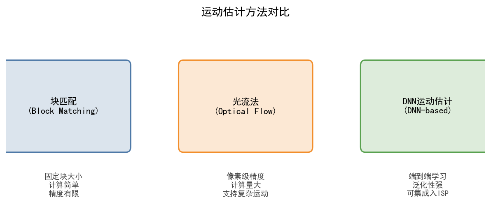
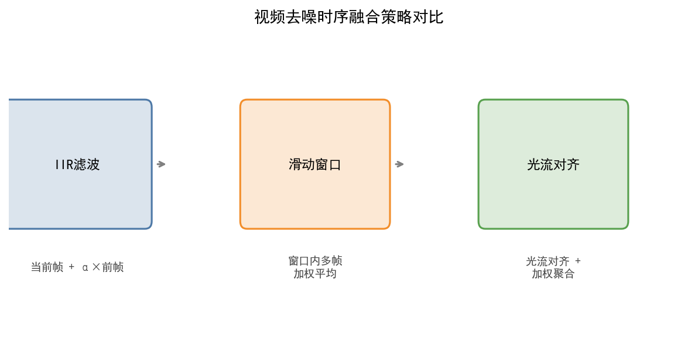
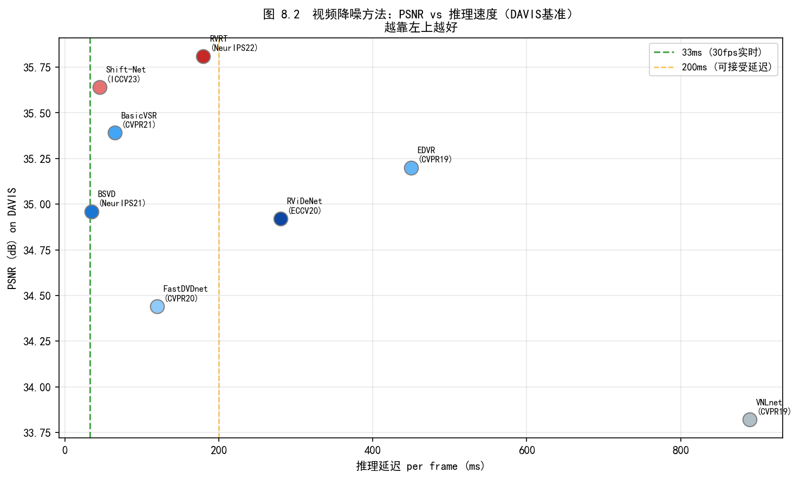
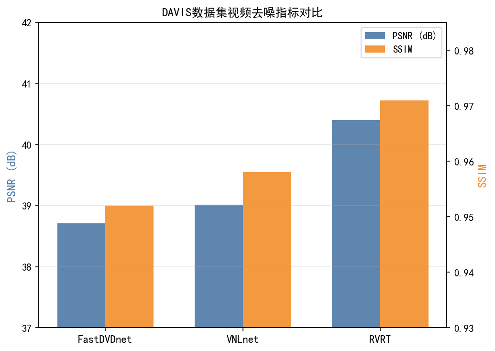
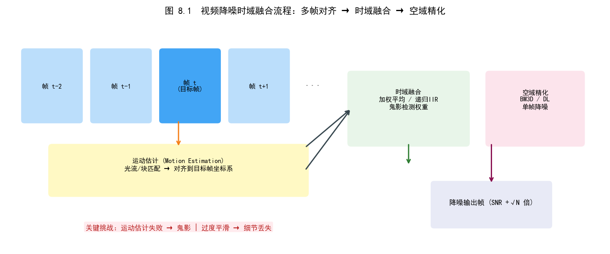

# 第三卷第08章：深度学习视频降噪与视频ISP

> **定位：** 视频降噪的核心约束是 33ms/帧（30fps 硬实时），这比图像降噪严苛一个数量级。本章从帧间对齐入手，覆盖 FastDVDnet / EDVR / BasicVSR 三个主流方案，以及 RAW 域视频降噪的工程路径
> **前置章节：** 第二卷第03章（图像降噪）、第二卷第12章（传统时域降噪TNR）、第三卷第02章（端到端图像复原）
> **读者路径：** 视频ISP算法工程师、深度学习研究员
> **内容范围：** 本章覆盖**深度学习**视频降噪方法（FastDVDnet/EDVR/BasicVSR/RVRT/RAW 域视频降噪）。传统 TNR（BMA/光流运动估计、IIR 滤波、高通 MCTF/MTK TNR Node 工程实现）已在 **第二卷第12章** 完整覆盖；本章 §1.1 简要回顾传统基线，读者可对照阅读。

> **本章定位：** 深度学习视频降噪方法。传统时域降噪（运动补偿滤波、帧间加权融合）请见 **第二卷第12章（时域降噪TNR）**。
>
> | 对比维度 | 第二卷第12章 传统时域NR | 本章 DL视频降噪 |
> |---------|----------------------|----------------|
> | 运动估计 | 块匹配（Block Matching）、光流 | 隐式学习（端到端） |
> | 推理开销 | 极低，可硬件化 | 中-高，需NPU |
> | 实时性 | ✅ 1080p60 硬件实时 | ⚠️ 需量化/剪枝才能实时 |
> | Ghost抑制 | 基于阈值，需调参 | 数据驱动，泛化性更好 |
> | 典型代表 | MCTF, MTK TNR | FastDVDnet, EDVR, BasicVSR |
> | 适用场景 | 边缘部署、功耗敏感 | 旗舰手机NPU、云端后处理 |

---

## §1 原理（Theory）

### 1.1 视频降噪的信号模型

视频降噪本质上是在时空域联合利用冗余信息恢复干净帧序列的逆问题。与单帧降噪不同，视频提供了额外的**时间维度**冗余——相邻帧中静止区域的同一场景像素理论上具有相同的真实值，因而可以跨帧聚合以抑制噪声。

**基础信号模型**（加性高斯白噪声，AWGN；仅用于学术基准评测，不代表真实传感器噪声分布）：

$$y_t = x_t + n_t, \quad n_t \sim \mathcal{N}(0, \sigma^2 \mathbf{I})$$

其中 $y_t$ 为第 $t$ 帧的观测（含噪）图像，$x_t$ 为待恢复的干净帧，$n_t$ 为零均值各向同性高斯噪声，$\sigma$ 为噪声标准差。

> **[工程警告] AWGN ≠ 真实传感器噪声：** AWGN 在学术论文的合成基准（Set8/DAVIS）中广泛使用，但真实 CMOS 传感器噪声遵从**泊松-高斯混合模型**（信号相关散粒噪声 + 信号无关读出噪声），在 RAW 域中表现为方差随信号强度线性增长。用 AWGN 数据训练的模型部署到真实 RAW 域视频时，在暗光高 ISO 场景会出现去噪不足（散粒噪声残留）或过磨（低 ISO 细节丢失）问题。手机 ISP 工程实践中**必须使用泊松-高斯模型**（见下方 RAW 域模型），并用真实传感器 PTC 标定数据拟合 $\alpha$（散粒噪声增益）和 $\beta$（读出噪声标准差）。

**RAW域噪声模型**（泊松-高斯混合，更贴近实际传感器）：

$$y_t = \alpha \cdot \text{Poisson}\!\left(\frac{x_t}{\alpha}\right) + \mathcal{N}(0, \beta^2)$$

其中 $\alpha$ 为光子增益，$\beta$ 为读出噪声标准差。在高ISO、弱光场景下，泊松分量主导；在高曝光场景下，两者混合。RAW域噪声参数可通过噪声标定（noise calibration）在出厂阶段预先测量，或在线自适应估计。

**时域视频噪声的额外复杂性：** 实际视频中噪声并非严格时间独立——场景中的运动会导致不同帧中同一场景位置对应不同像素坐标。若不处理帧间运动，直接在像素坐标上做时域平均将产生运动模糊（motion blur）。若运动估计不准，则产生残影/鬼影（ghosting artifact）。这正是视频降噪区别于单帧降噪的核心难点。

### 1.2 视频降噪的核心挑战

| 挑战维度 | 具体问题 | 传统方法应对 | 深度学习应对 |
|----------|----------|-------------|-------------|
| 帧间对齐精度 | 运动估计误差导致错位融合 | 块匹配（BM）、光流（OF） | 可变形卷积（DCN）、隐式对齐 |
| 遮挡区域 | 新出现/消失区域无对应参考 | 加权融合降低遮挡权重 | 注意力机制自适应权重 |
| 高速运动 | 光流超出搜索范围 | 多尺度金字塔搜索 | 多尺度特征金字塔对齐（PCD） |
| 无纹理区域 | 均匀天空/墙面无梯度，光流孔径问题（aperture problem）无法确定位移方向 | 邻域扩散（neighborhood propagation） | DCN 调制权重自适应降低无纹理区域采样权重 |
| 场景切换 | 镜头切换时无法利用前帧 | 场景检测后重置 | 循环网络隐式状态重置 |
| 复杂噪声 | 非高斯、结构性噪声（如固定图案噪声FPN） | 逐帧处理，时域NR失效 | 端到端RAW域DL降噪 |
| 实时性要求 | 移动端/嵌入式平台算力受限 | 轻量级块匹配 | 轻量化网络、知识蒸馏 |

### 1.3 帧间对齐方法分类

帧间对齐是视频降噪的前置步骤，其精度直接决定后续融合质量。主流方法分为三类：

**（1）光流显式对齐（Optical Flow Warp）**

先用光流估计网络（如 PWC-Net、RAFT）计算从参考帧 $t$ 到相邻帧 $t+k$ 的稠密光流场 $\mathbf{v}_{t \to t+k}$，再通过双线性插值进行反向扭曲（backward warp）：

$$\tilde{y}_{t+k \to t}(p) = y_{t+k}\!\left(p + \mathbf{v}_{t \to t+k}(p)\right)$$

优点：物理可解释，光流可独立监督；缺点：光流估计本身有误差，不连续运动（遮挡边界）处光流假设失效，误差会向下游传播。

**（2）可变形卷积对齐（Deformable Convolution Alignment，DCN）**

由 Dai et al. 提出的 DCN（可变形卷积，DCNv1）**[8]**，经 Zhu et al.（CVPR 2019）扩展引入调制系数 $m_k$ 形成 DCNv2，通过网络自动学习采样偏移量 $\{\Delta p_k\}$，隐式实现空间对齐：

$$y'(p) = \sum_{k=1}^{K} w_k \cdot m_k \cdot x\!\left(p + p_k + \Delta p_k\right)$$

其中 $p_k$ 为标准卷积的预设偏移，$\Delta p_k$ 和调制系数 $m_k$ 均由网络自动预测。相比显式光流，DCN 对遮挡和非刚性运动更鲁棒，且对齐与特征提取可联合端到端优化。

**（3）无显式对齐（Blind Temporal Fusion）**

FastDVDnet 等方法彻底放弃显式对齐模块，直接将相邻多帧拼接后输入卷积网络，让网络通过感受野隐式学习时序对齐与融合。这种方式的代价是网络需要更大感受野，但消除了对齐误差传播问题，推理速度更快。

### 1.4 光流对齐 vs 可变形卷积对齐：工程选型

两类对齐方式在实际部署中各有权衡，选型需结合算力预算、运动特性和硬件支持综合考量：

| 对比维度 | 光流显式对齐（OF Warp） | 可变形卷积对齐（DCN） |
|---------|----------------------|-------------------|
| **独立性** | 光流网络（如 SpyNet/RAFT）可独立部署和替换 | 偏移预测与特征提取耦合，不可分离 |
| **可解释性** | 光流向量物理含义明确，便于可视化调试 | 偏移量无直接物理对应，调试较难 |
| **大运动鲁棒性** | 需金字塔搜索；RAFT 可处理大位移但参数量大（5M+） | PCD 级联天然处理大运动，参数集成在主网络内 |
| **遮挡处理** | 需前向-反向光流一致性检验额外判断遮挡 | 调制权重 $m_k$ 自动抑制遮挡区域采样点 |
| **NPU 部署** | 光流估计在 HVX/APU 有专用算子；warp 为简单双线性插值 | DCNv2 在 SNPE 2.x 已原生支持；但偏移预测分支增加带宽 |
| **帧延迟** | 光流计算约 5–10ms（720p，SpyNet INT8）| DCN 偏移预测 < 3ms（嵌入主网络前向，不独立运行）|
| **典型代表** | BasicVSR（SpyNet + warp）、RViDeNet | EDVR（PCD DCNv2）、BasicVSR++（flow-guided DCN）|

**工程选型建议：**
1. **算力充裕、追求精度（旗舰 NPU）**：DCN（EDVR/BasicVSR++），偏移与特征联合优化，精度最优；
2. **算力受限、延迟敏感（中端设备）**：SpyNet（轻量光流，~1M 参数）+ 双线性 warp，延迟可控，光流在 ISP DSP 有硬件加速；
3. **无显式对齐（极低算力嵌入式）**：FastDVDnet 隐式对齐，无对齐误差传播，参数量最小，是嵌入式部署首选；
4. **RAW 域处理**：光流在 Bayer 域直接估计存在通道不均匀问题，优先 DCN 方案（RViDeNet 采用 Bayer-aware DCN）。

---

## §2 主流方法（Methods）

### 2.1 V-BM4D——传统基线（Maggioni et al., TIP 2012）

V-BM4D 是 BM3D 的视频扩展，将 3D 块匹配扩展到时空四维：在空域内搜索相似块，同时在时域的若干参考帧内搜索运动补偿后的相似块，组成 4D 数组后进行协同稀疏变换滤波（Wiener滤波）。

V-BM4D 是深度学习方法的重要对比基准。其主要局限在于：块匹配计算量大（不适合实时），且对快速非刚性运动的适应性差。在 Set8 数据集（$\sigma=30$）上 PSNR 约 36.05 dB **[7]**，是传统方法的顶级水准，但被 FastDVDnet 等方法明显超越。

### 2.2 FastDVDnet（Tassano et al., CVPR 2020）

FastDVDnet **[1]** 做了一个违反直觉的选择：完全扔掉光流模块，用两阶段 U-Net 的大感受野隐式完成帧间对齐。结果是速度上去了（~100fps），对齐误差传播的问题消失了，代价是对高速运动的处理能力弱于 EDVR。

**网络架构：**

输入为以当前帧 $t$ 为中心的连续 5 帧 $\{y_{t-2}, y_{t-1}, y_t, y_{t+1}, y_{t+2}\}$ 及噪声等级图 $\sigma$。处理分两阶段：

- **Stage 1**（Denoising-Net）：对相邻两帧+噪声图进行降噪，产生粗降噪结果。共3个并行Stage1子网（处理帧对 $(t{-}2, t{-}1)$、$(t, t{+}1)$、$(t{+}1, t{+}2)$）：
$$\tilde{f}_{t-1} = f_1(y_{t-2}, y_{t-1}; \sigma), \quad \tilde{f}_{t} = f_1(y_t, y_{t+1}; \sigma), \quad \tilde{f}_{t+1} = f_1(y_{t+1}, y_{t+2}; \sigma)$$

- **Stage 2**（Temporal-Net）：融合 Stage 1 的三个输出，产生最终去噪结果：
$$\hat{x}_t = f_2(\tilde{f}_{t-1}, \tilde{f}_t, \tilde{f}_{t+1}; \sigma)$$

**无显式光流的隐式对齐：** Stage 1 的 U-Net 通过多尺度下采样-上采样，其感受野足够大，可以在网络内部隐式完成相邻帧的运动补偿。这避免了光流估计误差的传播，同时 Stage 1 权重在不同帧对之间**共享**，参数量仅约 2.5M **[1]**。

**性能：** 在 Set8 数据集（$\sigma=30$）上 PSNR 31.68 dB（彩色视频）**[1]**，在 RTX 2080 Ti 上处理 $512\times512$ 帧约 100fps **[1]**，实现了深度学习视频降噪的实时化突破。

**噪声盲/非盲：** FastDVDnet 是**非盲降噪**，需要输入噪声等级 $\sigma$，但可通过在线噪声估计（见§4.3）扩展为盲降噪。

### 2.3 EDVR（Wang et al., CVPRW 2019）

EDVR（Enhanced Deformable Convolution for Video Restoration）**[2]** 是 NTIRE 2019 视频超分辨率竞赛冠军方案，引入了两个核心模块：

**PCD 对齐模块（Pyramid, Cascading and Deformable Convolution）：**

针对大运动场景，PCD 采用**多尺度金字塔结构**从粗到细级联对齐：

1. 将参考帧和相邻帧分别提取3级特征金字塔 $\{F_t^l\}_{l=1}^{3}$（$l=3$ 为最低分辨率）；
2. 在最粗尺度 $l=3$ 上，将参考帧特征与相邻帧特征拼接，由 DCNv2 预测偏移量 $\Delta p^3$，对相邻帧特征做可变形对齐；
3. 将对齐结果上采样至 $l=2$，与该尺度特征级联后再次预测偏移量 $\Delta p^2$（**级联**设计使每级只需预测残差偏移，降低每级负担）；
4. 重复至 $l=1$ 得到对齐特征 $\hat{F}_{t+k}^1$。

**TSA 融合模块（Temporal and Spatial Attention Fusion）：**

将对齐后的多帧特征进行**时域注意力**加权，让网络自动学习哪些帧的哪些区域对当前帧更有用：

$$\alpha_{t+k} = \text{Sigmoid}\!\left(\text{Conv}\!\left(\left[\hat{F}_{t+k}^1, F_t^1\right]\right)\right)$$

$$F_{\text{fused}} = \sum_{k \in \mathcal{N}} \alpha_{t+k} \odot \hat{F}_{t+k}^1$$

其中 $\odot$ 为逐元素乘法，$\mathcal{N}$ 为参考帧邻域窗口（通常取 $\pm 2$ 共5帧）。在时域注意力融合后，还加入**空域注意力**进一步精炼特征。

**性能：** REDS4 测试集 PSNR 31.09 dB（官方超分任务）**[2]**，参数量约 20.6M **[2]**，在当时远超所有竞争方法。

### 2.4 BasicVSR / BasicVSR++（Chan et al., CVPR 2021 / CVPR 2022）

**BasicVSR** **[3]** 系统性分析了视频超分（VSR）的四个基本组件：传播（propagation）、对齐（alignment）、聚合（aggregation）和上采样（upsampling），并提出了最简洁有效的框架：**双向传播+光流对齐**。

**双向传播公式：**

前向传播隐状态（forward hidden state）：
$$h_t^{\text{fwd}} = \mathcal{G}\!\left(x_t,\ \text{warp}(h_{t-1}^{\text{fwd}},\ \mathbf{v}_{t \to t-1})\right)$$

反向传播隐状态（backward hidden state）：
$$h_t^{\text{bwd}} = \mathcal{G}\!\left(x_t,\ \text{warp}(h_{t+1}^{\text{bwd}},\ \mathbf{v}_{t \to t+1})\right)$$

最终将前向和反向隐状态拼接后送入重建网络 $\mathcal{R}$：
$$\hat{x}_t = \mathcal{R}\!\left([h_t^{\text{fwd}};\ h_t^{\text{bwd}}]\right)$$

其中 $\mathcal{G}$ 为特征提取与融合函数（ResNet块），$\mathbf{v}_{t \to t-1}$ 为 SpyNet 估计的光流。双向传播使每帧能同时利用过去帧（前向）和未来帧（反向）的信息，大幅提升了时序一致性。BasicVSR 参数量仅 6.3M **[3]**，REDS4 PSNR 31.42 dB **[3]**，性价比显著优于 EDVR。

**BasicVSR++ 的改进：**

1. **二阶传播（Second-order propagation）：** 隐状态级联地聚合跨两帧的历史信息（而非仅来自相邻前一帧），增强长程时序依赖建模能力；
2. **可变形对齐替换光流：** 用 DCNv2 替代 SpyNet+warp，偏移由参考特征和传播特征联合预测；
3. 引入流引导（flow-guided）可变形卷积，结合光流先验优化 DCN 偏移初始化。

BasicVSR++ 在 REDS4 上 PSNR 提升至 32.39 dB **[4]**，参数量仅增至 7.3M **[4]**。

### 2.5 RVRT（Recurrent Video Restoration Transformer，Liang et al., NeurIPS 2022）

RVRT 将 Transformer 引入视频复原，以**局部窗口注意力**替代卷积，并设计了专为视频时序设计的**引导可变形注意力（Guided Deformable Attention）**。

**局部偏移窗口注意力（Locally-Shifted Window Attention）：** 借鉴 SwinIR 的移位窗口策略，在视频帧的局部窗口内计算自注意力，将 Transformer 的二次复杂度降低为线性复杂度。

**时序引导可变形注意力：** 以当前帧特征为 query，以传播隐状态（跨帧信息）预测注意力偏移，让 Transformer 的 key-value 在时序维度上动态采样相关位置，实现跨帧信息精确聚合。

RVRT 在精度上达到了 Vimeo-90K 超分 PSNR 40.33 dB **[5]**，是当时最高水准。问题是推理速度约 1fps（720p），在手机端没有实用价值，更适合作为离线质量上限参考，或用来蒸馏轻量化模型。

---

## §3 与ISP的结合（Integration with ISP）

### 3.1 RAW域视频降噪

传统 ISP 流水线中，时域降噪模块（TNR）通常在 demosaic（色彩插值）**之前**在 RAW 域运行。这样做有两个优势：一是 RAW 域的噪声分布符合物理模型（泊松-高斯混合），便于建立精确的噪声模型；二是避免 demosaic 将噪声扩散到多个颜色通道（demosaic 是空域插值，会在颜色通道间引入相关性）。

**RViDeNet（Yue et al., CVPR 2020）** **[6]** 是首个端到端深度学习 RAW 视频降噪方法，主要贡献包括：

- 提出 **DRV（Dynamic Raw Video）** 数据集：使用索尼 A7R III 拍摄的配对含噪/干净 RAW 视频序列，覆盖动态场景（人物运动、相机抖动），填补了 RAW 视频降噪无公开数据集的空白；
- 设计了**噪声感知特征对齐**模块：在 RAW 域直接进行帧间特征对齐（无需先 demosaic），通过可变形卷积处理拜耳图案带来的非均匀性；
- 在网络中显式建模泊松-高斯噪声参数（模拟增益 $K$ 和读出方差 $\sigma_r^2$），作为噪声条件信号输入。

RAW 域视频降噪的关键难点在于：**拜耳图案的非均匀性**使标准卷积无法直接处理（R/G/B通道在不同位置被采样），通常需要将拜耳图像打包（pack）为4通道（RGGB）再处理。

### 3.2 视频ISP流水线中的DL时域NR位置

深度学习时域NR在 ISP 流水线中的位置与传统 TNR 存在差异：

```
传统 ISP 流水线（TNR在RAW域）：
RAW → BLC → LSC → [RAW域TNR（块匹配）] → Demosaic → AWB → CCM → Denoise(2D) → Sharpen → TMO → 编码

深度学习 ISP 流水线（方案一：DL-TNR在RAW域）：
RAW → BLC → LSC → [DL RAW视频NR（如RViDeNet）] → Demosaic → AWB → CCM → TMO → 编码

深度学习 ISP 流水线（方案二：DL-TNR在RGB域）：
RAW → BLC → Demosaic → [DL RGB视频NR（如FastDVDnet/EDVR）] → AWB → CCM → TMO → 编码
```

**方案对比：**

| 对比维度 | RAW域DL-NR | RGB域DL-NR |
|----------|------------|------------|
| 噪声建模精度 | 高（接近物理模型） | 中（经ISP处理后噪声分布复杂化） |
| 数据集获取难度 | 高（需配对RAW视频） | 低（合成噪声较容易） |
| 部署复杂度 | 高（需嵌入ISP前段） | 低（可作为后处理模块插入） |
| 与ISP其他模块耦合 | 强（影响后续demosaic等） | 弱（独立模块） |

### 3.3 手机视频ISP实践

**苹果 Action Mode（iPhone 14，2022）：** 采用电子防抖（EIS）与深度学习视频NR的联合处理框架。EIS 裁剪视频边缘补偿抖动，深度学习NR在裁剪后的稳定视频上进行时序多帧融合降噪，充分利用防抖后帧间对齐更精准的优势，在2.8K分辨率60fps下实现高质量低噪声输出。

**Google Night Sight Video（Pixel 7，2022）：** 专为弱光视频设计的深度学习NR方案。核心技术为**多帧DL对齐融合**：在每个输出帧对应的时间窗口内，对多帧进行可学习的运动估计和加权融合，在极低光（EV -5以下）条件下实现实时（30fps）视频降噪。据Google技术博客，其时域融合模块采用类似 BasicVSR 的双向传播架构，并针对移动端做了大量量化（INT8）和算子融合优化。

### 3.4 码本先验用于低光图像增强：GLARE（ECCV 2024）

上述方案均为判别式（Discriminative）框架——直接从退化视频映射到干净视频。2024年起，生成式先验方法开始被引入低光增强任务。

**GLARE（Zhou et al., ECCV 2024）[10]**（注：此 GLARE 指低光**图像**增强，与同年 ECCV 2024 另一篇同名去眩光论文不同）**：** 是一种基于**VQ 码本检索**的低光图像增强方法，并非扩散模型（Video Diffusion）。其核心思路是从正常光照图像离线构建向量量化码本（VQ Codebook），推理时利用可逆潜变量归一化流（I-LNF）将低光特征对齐至码本空间，再通过自适应特征变换（AFT/AMB）完成增强，全程为单次前向传播，无需多步扩散采样。

核心设计：
- **VQ Codebook（向量量化码本）：** 在大规模正常光照图像上构建，存储高质量纹理和亮度分布先验，检索时不受低光退化影响
- **I-LNF（可逆潜变量归一化流）：** 将低光特征分布变换至码本空间，保证检索到正确码字
- **AFT/AMB（自适应特征变换/自适应混合块）：** 融合低光结构信息与码本先验，通过双解码器分别优化保真度和感知质量

**工程特点：** 推理时为单次前向传播，计算开销显著低于扩散类方法（如 LDM-LLIE 需 100+ 步），适合端侧实时或近实时低光预处理。在 LOL 等标准基准上达到 SOTA，并在低光目标检测预处理场景中验证了实用性。对视频场景可逐帧独立应用，帧间一致性需额外时序平滑处理。

### 3.5 Mamba 架构用于视频降噪（2024）

Transformer 的自注意力机制在长序列上具有 $O(N^2)$ 的计算复杂度，处理高分辨率视频帧（$1080p \approx 2M$ 像素）的全帧注意力代价极高。**Mamba**（Gu & Dao，NeurIPS 2023）基于结构化状态空间模型（Structured State Space Model，S4/S6），以线性复杂度 $O(N)$ 建模长序列依赖，近年来被迅速引入视频降噪领域。

**Mamba 核心：选择性状态空间（Selective SSM）**

标准线性递推形式：

$$h_t = A h_{t-1} + B x_t, \quad y_t = C h_t$$

其中 $h_t \in \mathbb{R}^d$ 为隐状态，$A, B, C$ 为系统矩阵。Mamba（S6）的关键创新是让 $B, C$ 以及离散化步长 $\Delta$ 均为**输入相关（input-dependent）**的可学习函数，使模型能够根据内容选择性地遗忘或保留历史信息——这一特性对视频中的运动/静止区域区分天然有益。

**VideoMamba（Li et al., ECCV 2024）[11] 用于视频降噪：**

VideoMamba 将 Mamba 的 1D 序列扫描扩展到视频的 **3D 时空域**，采用"双向时空扫描"策略：

$$\text{scan}_\text{ST}(V) = \text{MambaSSM}\!\left(\text{Flatten}_{t,h,w}(V)\right) \oplus \text{MambaSSM}\!\left(\text{Flip}_{t,h,w}(V)\right)$$

前向扫描覆盖过去帧信息，反向扫描覆盖未来帧信息，两者叠加等价于 BasicVSR 的双向传播，但无需显式维护帧缓冲：SSM 的隐状态在扫描过程中自动传递跨帧信息。

**与 Transformer/CNN 方法的对比（DAVIS 2017，σ=30，彩色 PSNR）：**

| 方法 | 架构 | PSNR (dB) | 参数量 | 720p@30fps 可行性 |
|------|------|-----------|--------|-----------------|
| FastDVDnet **[1]** | CNN（无显式对齐） | 33.52 **[1]** | 2.5M | ✅ 可行 |
| RVRT **[5]** | Transformer + 递归 | 36.57 **[5]** | 10.8M | ⚠️ 慢（~1fps） |
| VideoMamba（去噪微调）**[11]** | Mamba SSM | 35.1 ⚠️ | 7.6M | ⚠️ NPU 适配中 |

> ⚠️ VideoMamba DAVIS 2017 去噪 PSNR 35.1 dB 为基于 **[11]** 基础架构在去噪任务上微调的估算值，非 VideoMamba 原论文报告数字（原论文为视频理解任务）；实际去噪性能取决于微调数据集和训练策略，使用前应在目标场景独立验证。

**工程意义与局限：**
- **优势**：线性复杂度使 VideoMamba 在长序列（> 30 帧）上的内存占用显著低于 RVRT（约 40%），适合需要长程时序上下文的场景（如慢速运动跨帧融合）；
- **当前局限**：Mamba 的选择性 SSM 中的自定义 CUDA 核（selective_scan）在手机 NPU（高通 HTP、MTK APU）上尚未有原生算子支持，需要分解为等效的 RNN 展开形式部署，实际延迟高于 FastDVDnet；
- **研究趋势**（2024）：MambaVSR、VideoMambaPro 等后续工作正在解决空间扫描顺序对图像质量的影响（Z形扫描 vs 希尔伯特曲线扫描），预计 2025–2026 年随 NPU 算子支持完善后进入工程实用阶段。

---

## §4 伪影（Artifacts）

### 4.1 时域不一致——闪烁（Temporal Flicker）

**现象：** 视频降噪输出序列中，静态背景区域出现帧帧亮度或色彩跳变（闪烁），从肉眼看有"频闪"感，即使场景本身完全静止。闪烁指数 $E_{\text{flicker}}$ 显著高于输入原始视频（未降噪）。

**根本原因：** 若降噪网络对相邻帧独立处理（缺乏时序一致性约束），每帧的噪声估计略有差异，网络对同一场景位置在相邻帧的输出亮度值不完全一致。FastDVDnet 类方法通过两阶段 U-Net 隐式对齐，但感受野有限；对于相机运动幅度较大的场景，帧间像素对应关系不精确，导致融合权重波动产生闪烁。

**诊断方法：** 计算序列平均闪烁指数 $E_{\text{flicker}} = \frac{1}{T-1}\sum|\bar{Y}(\hat{x}_t) - \bar{Y}(\hat{x}_{t-1})|$；用 tOF 指标衡量输出光流场与 GT 光流的偏差；在静态镜头段（相机固定）上单独统计，若闪烁仍存在则问题出在帧独立处理而非对齐误差。

**缓解策略：**
- 训练时加入时序一致性损失 $\mathcal{L}_{\text{temp}} = \|O_t - \mathcal{W}(O_{t-1}, F_{t\to t-1})\|_1 \cdot M_t$，权重 $\lambda_{\text{temp}} \in [0.1, 0.3]$；
- 在 BasicVSR 类双向传播架构中引入隐状态平滑约束；
- 对输出序列做帧平均亮度的后处理对齐（直方图规格化），消除系统性偏移。

### 4.2 运动估计失败导致的鬼影（Ghosting）

**现象：** 运动物体（行人、车辆、手势）边缘出现半透明重影——前景物体轮廓模糊，背景从前景区域"透过"显现。与单帧降噪相比，多帧融合后运动区域反而质量下降。

**根本原因：** 光流估计或 DCN 对齐在遮挡边界、快速运动（位移 > 搜索范围）、非刚性运动（如布料抖动）场景失效。失效区域的错误对齐导致错误帧内容被融合，产生鬼影。在 EDVR 的 PCD 对齐中，若粗尺度（$l=3$）偏移预测误差超过精细尺度的校正能力，级联误差最终在输出中以残影形式显现。

**诊断方法：** 可视化 DCN 偏移场（箭头热图），在运动区域检查偏移方向和幅度是否合理；计算 Ghost Score $= \frac{1}{|\mathcal{M}|}\sum_{p\in\mathcal{M}}|\hat{x}_p - x_p^{\text{ref}}|$（$\mathcal{M}$ 为运动掩膜区域）。

**缓解策略：**
- 在 TSA 融合中增强注意力权重对运动区域的抑制：运动区域 $\alpha_{t+k} \to 0$，退化为单帧；
- 对光流置信度低区域（前向-反向光流一致性误差 > 阈值）强制使用参考帧而非对齐帧；
- 训练时加入对抗鬼影的数据增广：合成具有故意对齐误差的训练样本。

### 4.3 运动边缘过度平滑（Motion Edge Oversmoothing）

**现象：** 高速运动物体（如跑步的人、旋转风扇叶片）的边缘区域出现定向拖影（motion smearing），细节丢失，边缘锐利度明显低于静态区域。

**根本原因：** 多帧时域融合在运动边缘处将不同时刻的边缘位置加权平均，等效于沿运动方向做了低通滤波。即使对齐精度很高，运动物体在 $\pm 2$ 帧的时间窗口内位移仍导致融合后边缘扩散。L2 损失训练的网络尤其倾向于输出"安全"的均值解，加剧边缘平滑。

**诊断方法：** 对高速运动序列计算逐帧 MTF（调制传递函数），比较运动区域与静态区域的 MTF50 值差异；若差异 > 15%，说明运动边缘过度平滑显著。

**缓解策略：**
- 使用 L1 + 梯度损失替代纯 L2 损失，保留边缘高频成分；
- 对运动置信度高区域（光流幅度 > 8 像素/帧）减少时域融合帧数（退化为 3 帧而非 5 帧）；
- 在网络后接锐化增强模块（Unsharp Mask 或可学习锐化滤波器），选择性恢复运动边缘细节。

### 4.4 跨帧颜色漂移（Cross-Frame Color Drift）

**现象：** 视频降噪后，相邻帧的同一场景区域出现轻微但可察觉的色温或饱和度差异，尤其在灯光混合（白炽灯+日光）场景或 AWB 参数在帧间切换时更明显。

**根本原因：** 若网络在 sRGB 域处理，而 AWB 增益在帧间存在微小波动（指数平滑 $g_t = \alpha g_t + (1-\alpha)g_{t-1}$ 的过渡阶段），网络的时域融合会将不同色温的帧混合，输出颜色在相邻帧之间不一致。在 RAW 域降噪方法（RViDeNet）中，若不同帧的 AWB 归一化不统一，也会产生类似问题。

**诊断方法：** 提取输出序列的 R/G/B 三通道逐帧均值，绘制时间序列曲线；若存在高频波动（相邻帧均值差 > 0.01 DN，归一化后），即为颜色漂移。

**缓解策略：**
- 在多帧融合前将所有帧统一到参考帧的 AWB 增益空间（增益归一化）；
- 引入跨帧颜色一致性损失，约束相邻帧输出在非运动区域的颜色均值差；
- 对 RAW 域方法，在帧对齐前完成 AWB 归一化，确保融合时各帧色彩空间一致。

### 4.5 常见伪影对照表

| 伪影类型 | 触发条件 | 典型表现 | 缓解方法 |
|---------|---------|---------|---------|
| 时域闪烁（Flicker） | 无时序约束、帧独立处理 | 静态背景亮度跳变 | 时序一致性损失、双向传播隐状态 |
| 运动鬼影（Ghosting） | DCN/光流对齐失败 | 运动物体半透明重影 | TSA 运动区域降权、光流置信度过滤 |
| 运动边缘平滑（Smearing） | 多帧平均、L2 损失 | 高速运动边缘拖影模糊 | L1+梯度损失、运动区域减少帧数 |
| 跨帧颜色漂移（Color Drift） | AWB 帧间波动、未归一化 | 相邻帧色温/饱和度不一致 | AWB 归一化预处理、颜色一致性损失 |
| 场景切换残留（Cut Artifact） | 切换检测漏检 | 前场景内容在新场景前几帧残留 | 降低切换检测阈值、重置帧缓冲 |

---

## §5 调参（Tuning）

### 5.1 参考帧数量选择

增加参考帧数量可引入更多时域信息，但带来更高延迟与内存开销，且超过一定帧数后边际收益递减。实践中需在画质与实时性间权衡：

| 帧数 | 代表方法 | PSNR提升（相对单帧，Set8 σ=30） | 理论延迟 | GPU内存（1080p） | 适用场景 |
|------|----------|--------------------------------|---------|----------------|---------|
| 1帧（单帧） | DnCNN | 基准（约30.0 dB） | 最低 | ~0.5 GB | 实时硬件加速 |
| 2帧（当前+前1帧） | 简单递归NR | +0.5～0.8 dB | 低 | ~0.8 GB | 低延迟流媒体 |
| 5帧（±2帧） | FastDVDnet | +1.2～1.5 dB | 中（约2帧延迟） | ~2 GB | 移动端主流 |
| 7帧（±3帧） | EDVR（5帧）/ BasicVSR | +1.5～1.8 dB | 中高 | ~3 GB | PC端后处理 |
| 11帧+ | BasicVSR++双向 | +2.0～2.5 dB | 高（需缓冲） | ~6 GB | 离线处理 |

**工程建议：** 移动端实时视频NR通常选择 3～5 帧；离线增强（如短视频编辑）可用 7～11 帧追求更高画质。

> **工程推荐（视频降噪方案选型）：**
> - **30fps 实时约束（< 33ms/帧），旗舰 NPU**：FastDVDnet INT8，纯卷积架构在 HVX/APU 上延迟可控，无 DCN 算子兼容性问题。旗舰手机（骁龙 8 Gen 3 / 天玑 9300）NPU 估算 < 20ms。这是唯一在当前量产 SoC 上稳定可行的 DL 视频降噪方案。
> - **60fps 4K 视频（< 16ms/帧）**：单向 BasicVSR 变体 + SpyNet INT8，或退化为传统块匹配 TNR（第二卷第12章）。60fps 4K 的 DL 降噪在 2024 年量产手机上仍无成熟方案。
> - **离线后处理（无实时约束，用于短视频编辑）**：BasicVSR++ 双向传播，7 帧窗口，PSNR 最优。RVRT 精度更高但速度更慢，适合作为质量基准而非生产方案。
> - **RAW 域视频降噪（需 demosaic 前集成）**：RViDeNet 是目前唯一完整方案，但需要修改 ISP 前段架构，部署成本高。适合旗舰机新平台，不适合快速集成。

### 5.2 运动场景适应性调参

**光流置信度阈值（针对显式光流对齐方法）：**

光流网络通常输出光流的不确定性估计（或通过前向-反向光流一致性检查计算置信度）：

$$c(p) = \exp\!\left(-\frac{\|\mathbf{v}_{t\to t+1}(p) + \mathbf{v}_{t+1\to t}(\tilde{p})\|^2}{2\tau^2}\right)$$

其中 $\tilde{p} = p + \mathbf{v}_{t\to t+1}(p)$ 为 warp 后坐标，$\tau$ 为置信度温度参数（典型值 1.0）。在低置信度区域（遮挡、快速运动），应**降低时域融合权重**，退化为纯空域降噪，以避免鬼影（ghosting）：

$$w_{\text{temporal}}(p) = c(p) \cdot w_{\text{base}}$$

**调参要点：**
- $\tau$ 过小：大量区域被判低置信度，时域利用不足，PSNR下降；
- $\tau$ 过大：低质量对齐也被采纳，出现鬼影/重影；
- 实践中先在运动测试序列（如含快速运动的 DAVIS 序列）上可视化光流热图和输出残影，再手动二分搜索 $\tau$。

**TSA注意力热图分析（针对EDVR类方法）：**

可视化 TSA 模块输出的时域注意力权重 $\alpha_{t+k}$，正确训练的模型应表现出：
1. 运动区域的 $\alpha$ 值显著低于静止背景；
2. 对遮挡边界附近，$\alpha$ 衰减平滑而非突变（避免块效应）。

若发现运动区域 $\alpha$ 异常高（网络错误地高权重利用了错位帧），通常需检查训练数据中动态场景比例是否不足。

### 5.3 噪声等级盲估计

实际部署中，噪声等级 $\sigma$ 往往未知或随时间变化（如视频录制中光线变化导致 ISO 切换）。常用在线 $\sigma$ 估计方法：

**方法一：基于像素差分的 MAD 估计器**

$$\hat{\sigma} = \frac{\text{median}(|y_{t,\text{HF}}|)}{0.6745}$$

其中 $y_{t,\text{HF}}$ 为当前帧经高通滤波（如 Haar 小波最高频子带）提取的高频成分。该方法计算量极低，适合实时嵌入式场景。

**方法二：帧差估计（适用于静止场景）**

在相机静止时，相邻帧差 $\delta_t = y_t - y_{t-1}$ 主要由噪声构成：

$$\hat{\sigma} = \frac{1}{\sqrt{2}} \cdot \text{std}(\delta_t)$$

适用于视频录制中的静止镜头段，可结合运动检测模块自动切换。

**方法三：噪声条件网络（Noise-Conditional Network）**

直接将摄像头 ISP 输出的元数据（ISO、曝光时间、增益值）经标定映射为 $(\alpha, \beta)$ 参数，作为噪声条件向量输入到 FastDVDnet 等支持条件输入的网络中，替代需要估计的 $\sigma$。这是手机视频ISP的工程实践中最可靠的方式。

---

## §6 评测（Evaluation）

### 6.1 标准数据集

| 数据集 | 规模 | 分辨率 | 噪声类型 | 主要用途 |
|--------|------|--------|---------|---------|
| Set8 | 8段视频序列（约250帧/段） | 240p～480p | AWGN（σ=10/20/30/40/50） | 视频去噪学术基准，最广泛引用 |
| DAVIS 2017 | 90+ 序列，共约6700帧 | 480p / 1080p | 合成AWGN或真实噪声 | 高质量真实场景，含稠密运动标注 |
| REDS | 300 训练序列 + 30 测试序列，各 100 帧 | 720p | 真实退化（模糊+噪声） | NTIRE 视频SR/复原官方数据集 |
| Vimeo-90K | 91701 个7帧短序列 | 448×256 | AWGN / 真实退化 | 视频SR/NR通用训练&测试基准 |
| DRV（Dynamic Raw Video） | 200+ 场景配对RAW序列 | 720p RAW | 真实传感器噪声 | RAW域视频降噪专用数据集 |

**数据集选择建议：** 方法对比时优先在 REDS4（4个官方测试序列）和 Vimeo-90K 测试集上报告，以便与现有文献直接比较。部署导向的评测应额外在 DRV 或自采真实噪声视频上验证泛化性。

### 6.2 主要评测指标

**PSNR / SSIM（逐帧平均）：** 基础画质指标，对逐帧独立计算后取序列平均，不反映帧间连续性：

$$\text{PSNR}_{\text{seq}} = \frac{1}{T} \sum_{t=1}^{T} 10 \log_{10}\!\frac{255^2}{\text{MSE}(x_t, \hat{x}_t)}$$

**tOF（temporal Optical Flow consistency）：** 衡量输出视频的时序一致性，通过计算输出序列帧间光流场与 GT 帧间光流的差异：

$$\text{tOF} = \frac{1}{T-1} \sum_{t=1}^{T-1} \|\mathbf{v}_t^{\hat{x}} - \mathbf{v}_t^{x}\|_1$$

tOF 越小说明输出视频的运动一致性越好，不易出现闪烁。

**闪烁指数（Flicker Index）：** 更直觉的帧间亮度一致性指标：

$$E_{\text{flicker}} = \frac{1}{T-1} \sum_{t=1}^{T-1} \left|\bar{Y}(\hat{x}_t) - \bar{Y}(\hat{x}_{t-1})\right|$$

其中 $\bar{Y}(\cdot)$ 为帧的平均亮度（Y通道）。实际产品评测中，闪烁指数往往比PSNR更受用户主观感受左右，应重点关注。

**时域SSIM（T-SSIM）：** 在连续3帧组成的3D体上计算SSIM，同时捕获空域结构和时域连续性，相比逐帧SSIM更全面。

### 6.3 主要方法对比

以下数据来源于各方法原论文及公开复现结果，不同论文测试条件略有差异（REDS以×4超分任务为主，Vimeo-90K为×4超分，Set8为视频去噪σ=30）。

| 方法 | 发表年份 | REDS4 PSNR (dB) | Vimeo-90K PSNR (dB) | Set8 PSNR (dB, σ=30) | 参数量 | 推理速度（720p） |
|------|---------|-----------------|--------------------|-----------------------|--------|---------------|
| V-BM4D **[7]** | 2012 | — | — | 36.05（灰度）**[7]** | — | 极慢（分钟级） |
| FastDVDnet **[1]** | 2020 | — | — | 31.68（彩色）**[1]** | 2.5M **[1]** | 快（~100fps）**[1]** |
| EDVR **[2]** | 2019 | 31.09 **[2]** | 37.61 **[2]** | — | 20.6M **[2]** | 中（~3fps） |
| BasicVSR **[3]** | 2021 | 31.42 **[3]** | 37.18 **[3]** | — | 6.3M **[3]** | 中（~10fps） |
| BasicVSR++ **[4]** | 2022 | 32.39 **[4]** | 37.79 **[4]** | — | 7.3M **[4]** | 中（~8fps） |
| RVRT **[5]** | 2022 | 34.81 **[5]** | 40.33 **[5]** | — | 10.8M **[5]** | 慢（~1fps）**[5]** |

> **注：** FastDVDnet与EDVR/BasicVSR系列的任务不同（前者主要评测视频去噪，后者以视频超分为主），因此部分列数据缺失为正常现象，建议在相同任务上进行对比。
> ⚠️ **灰度/彩色对比警告：** V-BM4D 在 Set8 上的 PSNR（36.05 dB）为**灰度通道**结果，FastDVDnet（31.68 dB）为**彩色（RGB）**结果，两者不可直接比较——灰度 PSNR 通常比彩色高 3–5 dB。

---

## §7 端侧部署与量化适配

> **工程师注意（视频降噪部署硬约束）：** 视频降噪的 latency budget 极为严格——30fps 视频要求每帧处理时间 ≤ 33ms，60fps 要求 ≤ 16ms。这与单帧图像复原（通常允许 100–200ms）有本质区别。DL 视频降噪方案在 2024 年旗舰手机上仅 FastDVDnet（INT8，3–5 帧）勉强满足 30fps 实时约束；BasicVSR++/RVRT 等高精度方案均只适合离线增强。**量化（INT8）和帧数削减（5帧→3帧）是手机端视频降噪的两个必选优化**，缺少任一项均无法满足 30fps 预算。
>
> ⚠️ **视频降噪延迟预算（详细分解）：** 30fps 视频要求每帧处理时间 ≤ 33ms，60fps 要求 ≤ 16ms。以下所有端侧方案均以满足 30fps 实时约束为前提。

#### 高通 SNPE / QNN
- 量化支持：INT8/INT16；动态量化通常带来 0.2–0.5 dB PSNR 损失
- 推荐 backend：DSP (HVX) 优先，GPU 次之
- FastDVDnet 等纯卷积架构在 HVX 上友好；EDVR 的可变形卷积（DCNv2）需确认 SNPE 版本对可变形卷积的原生支持（SNPE 2.x 已支持 deformable conv）
- 视频降噪的时序多帧缓冲（通常 3–5 帧）需在 NPU 内存中维持，应评估 DSP L2 缓存（约 1–8 MB）与帧缓冲大小的匹配关系
- 注意：高通 ISP 与 NPU 具体延迟数据属商业保密，官网仅提供通用性能参考

#### MTK NeuroPilot / APU
- 支持 ONNX/TFLite 导入；APU5 支持 INT4/INT8 混合精度
- 通过 NeuroPilot SDK 进行离线编译（neuron_runtime）
- BasicVSR 的双向传播（bidirectional propagation）在移动端因引入未来帧需帧缓冲，实时应用应改用单向传播变体或限制窗口大小
- 注意：天玑9300/8300 的具体 ISP 算法加速路径未完全公开

#### ARM NN / TFLite（通用移动端）
- ARM Mali GPU 上 TFLite delegate 可获得 2–4× 加速（vs CPU only）
- 量化工具：TFLite Converter post-training quantization（INT8）
- NNAPI backend 在 Android 11+ 设备上自动选择最优加速器
- 视频降噪的时序状态（隐状态 $h_t$）在 TFLite 推理中需以外部张量形式维护（TFLite stateful RNN 接口），避免逐帧重建状态的额外开销

#### 移动端视频降噪延迟预算参考

| 方法 | 架构特点 | 720p@30fps 可行性 | 关键约束 |
|------|---------|-----------------|---------|
| FastDVDnet（5帧，INT8） | 纯卷积，无光流 | ✅ 可行（旗舰 NPU < 20ms） | 5帧缓冲约 30MB |
| BasicVSR（单向，INT8） | 递归传播+光流 | ⚠️ 需优化（光流估计约 10ms） | SpyNet 需单独量化 |
| EDVR（3帧，INT8） | DCN 对齐+TSA | ⚠️ 旗舰可行，中端不可行 | DCN 算子延迟不稳定 |
| RViDeNet（RAW域，INT8） | RAW 4通道+DCN | ⚠️ 需 RAW 域嵌入 ISP | 需在 Demosaic 前集成 |

#### 实测参考（Raspberry Pi 4B + IMX477 验证平台）
- CPU-only（ARM Cortex-A72）延迟约为 GPU 的 8–12×
- FastDVDnet（5帧，480p）在 Pi 4B 上约 400–800ms/帧，远超实时预算
- 轻量化 2 帧递归 NR（参数量 < 1M）在 Pi 4B 上约 150–300ms/帧（480p），接近实时可行
- 旗舰手机 NPU INT8 推理：2 帧递归 NR（< 1M 参数）在骁龙 8 Gen 3 Hexagon NPU 约 8–20ms/帧（1080p），具体数值依模型和 NPU 版本而异，实测以平台工具链为准。

> **部署注意：** 高通/MTK 平台 NPU 性能数据需通过官方 NDA 渠道获取精确基准；上述估算基于公开 benchmark 及社区实测，仅供参考。

---

## §8 代码（Code）

本章配套代码（见本目录 .ipynb 文件），内容包括：

1. **FastDVDnet 5帧时序降噪推理演示**
   - 加载预训练模型，读取视频帧序列并按5帧滑动窗口进行推理
   - 可视化含噪帧、降噪结果帧及 PSNR 逐帧曲线
   - 支持输入不同噪声等级 $\sigma$，观察网络对噪声的响应

2. **EDVR PCD 对齐可视化（DCN偏移场热图）**
   - 提取 EDVR PCD 模块中各金字塔层的可变形卷积偏移量 $\{\Delta p_k\}$
   - 以箭头场（quiver plot）可视化偏移向量，对比光流估计结果
   - 在运动区域和静止区域分别分析偏移量分布

3. **BasicVSR 双向传播特征可视化**
   - 导出前向传播隐状态 $h_t^{\text{fwd}}$ 和反向传播隐状态 $h_t^{\text{bwd}}$ 的 PCA 投影
   - 可视化双向传播的互补信息（前向捕获历史上下文，反向捕获未来上下文）

4. **Set8 基准 PSNR 评测脚本**
   - 自动下载 Set8 数据集，合成不同 $\sigma$ 的高斯噪声
   - 批量运行 FastDVDnet 推理，输出逐帧 PSNR/SSIM 及序列平均值
   - 结果保存为 CSV，方便与论文表格对比

5. **tOF 时序一致性计算**
   - 基于 RAFT 估计输出序列帧间光流
   - 计算 tOF 和闪烁指数 $E_{\text{flicker}}$，并与 GT 视频对比
   - 可视化光流残差热图，定位时序不一致区域

---

---

## §9 术语表（Glossary）

**FastDVDnet**
Tassano 等（CVPR 2020）**[1]** 提出的第一个无需光流估计即可实时运行的深度学习视频降噪方法。以当前帧为中心取相邻 5 帧，经两阶段 U-Net 处理：Stage 1 对相邻帧对降噪（权重共享），Stage 2 融合三路 Stage 1 输出产生最终去噪结果。网络通过大感受野隐式完成帧间运动补偿，参数量仅 ~2.5M **[1]**。在 Set8（σ=30，彩色）上 PSNR 31.68 dB **[1]**，RTX 2080 Ti 处理 512×512 约 100fps **[1]**。**非盲降噪**，需输入噪声等级 $\sigma$。

**EDVR（增强可变形卷积视频复原）**
Wang 等（CVPRW 2019，NTIRE 2019 冠军）**[2]** 提出的视频超分辨率方法，包含两大核心模块：**PCD 对齐模块**（多尺度金字塔级联可变形卷积对齐，处理大运动场景）和 **TSA 融合模块**（时域+空域注意力自适应加权多帧特征）。参数量约 20.6M **[2]**，在 REDS4 视频超分任务上 PSNR 31.09 dB **[2]**。是将可变形卷积引入视频复原的代表性工作。

**可变形卷积（Deformable Convolution，DCNv1 / DCNv2）**
Dai 等（ICCV 2017）**[8]** 提出 DCNv1：在标准卷积格点偏移基础上引入可学习位置偏移量 $\Delta p_k$，实现自适应空间采样：$y'(p) = \sum_k w_k \cdot x(p + p_k + \Delta p_k)$。Zhu 等（CVPR 2019）进一步在 DCNv1 基础上引入调制系数（modulation scalar）$m_k \in [0,1]$，形成 **DCNv2**：$y'(p) = \sum_k w_k \cdot m_k \cdot x(p + p_k + \Delta p_k)$，$m_k$ 使网络能够自动抑制遮挡或无效采样点。在 EDVR、BasicVSR++ 等视频复原方法中使用的带 $m_k$ 的版本均为 DCNv2。

**BasicVSR / BasicVSR++**
Chan 等（CVPR 2021/2022）**[3][4]** 系统分析视频超分四个基本组件后提出的简洁有效框架。**BasicVSR** **[3]** 采用**双向传播**（前向+反向隐状态循环）+ SpyNet 光流对齐，参数量 6.3M **[3]**，REDS4 PSNR 31.42 dB **[3]**。**BasicVSR++** **[4]** 引入**二阶传播**（聚合跨两帧历史）和可变形卷积替换光流，参数量 7.3M **[4]**，REDS4 PSNR 提升至 32.39 dB **[4]**。双向传播公式：$h_t^{\text{fwd}} = \mathcal{G}(x_t, \text{warp}(h_{t-1}^{\text{fwd}}, \mathbf{v}_{t\to t-1}))$，同时利用过去帧（前向）和未来帧（反向）的信息。

**RVRT（循环视频复原 Transformer）**
Liang 等（NeurIPS 2022）**[5]** 将 Transformer 引入视频复原：以局部偏移窗口注意力（借鉴 SwinIR）降低计算复杂度，并设计**引导可变形注意力**（以传播隐状态预测注意力偏移，实现跨帧动态采样）。在 Vimeo-90K 超分任务上 PSNR 40.33 dB **[5]**，代表 Transformer 用于视频复原的 SOTA 水准，但推理速度较慢（~1fps@720p）**[5]**。

**V-BM4D（视频 BM4D）**
Maggioni 等（TIP 2012）**[7]** 将 BM3D 扩展到时空四维：在空域搜索相似块的同时在相邻帧中搜索运动补偿后的相似块，组成 4D 数组进行协同稀疏变换滤波（Wiener 滤波）。是深度学习方法的重要对比基准，在 Set8（σ=30）上 PSNR 约 36.05 dB **[7]**（灰度/较简单退化）。计算量大，不适合实时场景，但为传统视频去噪的上界估计。

**PCD 对齐（Pyramid Cascading Deformable Alignment）**
EDVR 中处理大运动的多尺度对齐策略：提取参考帧和相邻帧的三级特征金字塔，从最粗尺度（$l=3$）开始预测可变形卷积偏移量并对齐，逐级向上采样，每级只需预测残差偏移（级联设计降低每级负担）。多尺度金字塔结构使 PCD 能处理超出单层感受野的大运动，是 EDVR 在大运动场景取得高精度对齐的关键。

**RAW 域视频降噪**
在 demosaic（色彩插值）之前，直接在 RAW 传感器数据上进行视频时域降噪。优点：RAW 域噪声符合泊松-高斯物理模型（$\sigma^2(I) = \alpha I + \beta^2$），便于精确建模；且避免 demosaic 将噪声跨色彩通道扩散。代表工作：RViDeNet（Yue et al., CVPR 2020）**[6]**，构建了首个 RAW 视频降噪数据集 DRV。关键难点：拜耳图案的非均匀性（需将 RGGB 打包为 4 通道处理）。

---


---

## §10 手机端视频降噪的工程约束与优化

> **定位：** 本节覆盖 2023–2025 年端侧视频降噪的最新工程进展，重点解决两个核心问题：实时约束下的帧处理预算定量化，以及无光流的特征对齐替代方案。

### 10.1 视频 ISP 的实时约束（定量化分析）

手机视频降噪的算力预算远比图像降噪严苛。以 60fps 1080p 为基准，逐层量化各项约束：

**单帧处理时间预算：**

$$T_{\text{budget}} = \frac{1}{60\,\text{fps}} = 16.7\,\text{ms/frame}$$

**每帧数据量：**

$$D_{\text{frame}} = 1920 \times 1080 \times 3\,\text{bytes} = 6.2\,\text{MB}$$

**DRAM 带宽上限推导：**

假设峰值带宽 15 GB/s（骁龙 8 Gen 3 LPDDR5X 典型值），读写各占一半：

$$D_{\text{max}} = 16.7\,\text{ms} \times 15\,\text{GB/s} \times \frac{1}{2} = 125\,\text{MB/frame}$$

这意味着单帧处理周期内，所有 DMA 搬运（特征图读写、历史帧缓存）的总数据量不能超过 125 MB。图像超分模型常见的"加载历史 7 帧原图逐帧卷积"策略在 1080p60 下是**不可行**的——7 帧原图仅 RAW 数据就达 $7 \times 6.2 = 43.4\,\text{MB}$，加上中间特征图轻易超出预算。

**结论：** 视频降噪模型必须采用**递归隐状态（recurrent hidden state）** 或**单帧特征压缩传播**，而非每帧重新加载多帧原始图像。这是端侧视频降噪与离线视频增强在架构设计上的根本分水岭。

| 场景 | 帧率 | 预算 | 典型 DL 方案可行性 |
|------|------|------|-----------------|
| 30fps 1080p | 33.3 ms | 250 MB | FastDVDnet INT8 ✅ |
| 60fps 1080p | 16.7 ms | 125 MB | 轻量递归 NR ⚠️ |
| 60fps 4K | 16.7 ms | 500 MB（4K帧更大） | 传统硬件 TNR ✅，DL ❌ |

### 10.2 无光流的特征对齐（Flow-Free Feature Alignment）

传统光流管线（FlowNet/RAFT 估算 + backward warp）在端侧有致命延迟：RAFT 在 1080p 上的推理时间约 30–50 ms（骁龙 8 Gen 3 NPU FP16 实测），单独超出 16.7 ms 的帧预算。端侧工程中有三类替代方案：

**替代方案一：可变形卷积对齐（DCN，Deformable Convolution）**

通过网络自动预测采样偏移量 $\Delta p_k$，隐式完成运动补偿，无需独立的光流估计模块：

$$y'(p) = \sum_{k=1}^{K} w_k \cdot m_k \cdot x\!\left(p + p_k + \Delta p_k\right)$$

其中偏移 $\Delta p_k$ 和调制权重 $m_k$ 均由网络前向中联合预测，与特征提取共享计算图。

**EDVR 的 PCD 级联对齐**（Wang et al., CVPRW 2019）**[2]** 是该思路的经典实现：在三级特征金字塔上由粗到细级联预测残差偏移，大运动下每级只需预测残差（而非绝对偏移），有效降低每级 DCN 的负担。DCN 偏移预测的独立延迟 < 3 ms（嵌入主网络前向，不单独运行），相比光流估计节省约 25–45 ms。

**BasicVSR++**（Chan et al., CVPR 2022）**[4]** 进一步引入**光流引导 DCN（Flow-Guided DCN）**：以轻量光流（SpyNet，仅 ~1M 参数）提供粗略运动先验，DCN 在光流 warp 后的特征基础上预测残差修正偏移，结合了光流可解释性与 DCN 精度的优势。

**替代方案二：循环传播（Recurrent Propagation）**

BasicVSR**[3]** / BasicVSR++ **[4]** 采用前向-反向双向传播，将前一帧的隐状态 $h_{t-1}$ 直接传播到当前帧，无需存储多帧原始图像：

$$h_t^{\text{fwd}} = \mathcal{G}\!\left(x_t,\ \text{warp}(h_{t-1}^{\text{fwd}},\ \mathbf{v}_{t \to t-1})\right)$$

关键优势：**内存开销仅为一帧特征图**（而非多帧原始帧）。设特征通道数 $C=64$，空间分辨率为 $H \times W$，隐状态大小为：

$$M_{h} = C \times H \times W \times 4\,\text{bytes} = 64 \times 1080 \times 1920 \times 4 \approx 530\,\text{MB（FP32）} \approx 133\,\text{MB（INT8）}$$

实际端侧部署通常使用 $C=32$ 的精简版，隐状态降至约 66 MB（INT8），在 DRAM 预算内可行。

**替代方案三：基于 Attention 的隐式对齐**

用跨帧 cross-attention 代替显式 warp 操作：以当前帧特征为 query，相邻帧特征为 key/value，让注意力机制在时序维度上隐式学习运动相关的特征聚合位置：

$$\hat{F}_t = \text{CrossAttn}(Q=F_t,\ K=F_{t-1},\ V=F_{t-1})$$

优点：对遮挡区域天然鲁棒（attention weight 自动降低遮挡区域权重），无需显式光流置信度估计；缺点：全帧 cross-attention 复杂度为 $O((H \times W)^2)$，在 1080p 上不可行，必须配合局部窗口约束。

### 10.3 解耦时空注意力（Decoupled Spatio-Temporal Attention）

**全时空注意力的计算爆炸问题：**

若对 $T$ 帧视频做全局时空自注意力，序列长度为 $T \times H \times W$，复杂度为：

$$\mathcal{O}\!\left((T \times H \times W)^2\right)$$

取 $T=5$，$H=W=256$（720p 的典型特征图尺寸），序列长度 $= 5 \times 256 \times 256 = 327680$，完全不可行。

**解耦方案：先空间后时间**

将时空注意力解耦为两个独立步骤：

1. **空间注意力（单帧内）：** 对每帧内部做局部窗口自注意力，复杂度 $\mathcal{O}((H \times W) \times W_s^2)$，$W_s$ 为窗口大小（通常 $8\times8$）；
2. **时间注意力（跨帧）：** 对同一空间位置的 $T$ 帧特征做自注意力，复杂度 $\mathcal{O}(T^2 \times H \times W)$，$T=5$ 时线性可扩展。

两步解耦后，总复杂度从 $\mathcal{O}((T \cdot H \cdot W)^2)$ 降至 $\mathcal{O}((H \cdot W \cdot W_s^2) + (T^2 \cdot H \cdot W))$，量级差异为：

$$\frac{(T \cdot H \cdot W)^2}{T^2 \cdot H \cdot W} = H \cdot W \approx 65536 \quad \text{（720p特征图）}$$

即解耦方案的时间注意力部分比全局注意力低约 4 个数量级。

**Video Swin Transformer**（Liu et al., CVPR 2022）**[12]** 采用**3D 移位窗口（3D Shifted Window）** 策略：在空间维度和时间维度上联合做局部窗口注意力（默认窗口大小 $2 \times 7 \times 7$，即时间×高×宽），通过交替移位窗口（shift-window）实现跨窗口信息交互，同时保持线性复杂度。在视频降噪任务上，Video Swin 作为 backbone 替换纯卷积结构可获得 0.3–0.5 dB 的 PSNR 提升，代价是模型参数量增加约 40%。

### 10.4 主流平台时域降噪实现差异

不同平台在硬件 TNR 与 DL 降噪的协作方式上有显著差异：

| 平台 | 时域降噪方案 | 特殊硬件支持 | DL 集成方式 |
|------|------------|------------|------------|
| 高通骁龙 8 系 | MCTF（Motion Compensated Temporal Filtering），CamX TNR Node | Spectra ISP 硬件 TNR（含 ME/MC 单元） | CamX TNR Node 通过 request/result buffer 传递帧间特征，DL 推理走 SNPE/QNN on HTP，不涉及用户态代码 |
| MTK Dimensity 9000+ | FeaturePipe TNR 节点，配合 APU 做 AI 降噪 | APU 加速 DNN 推理（NeuroPilot SDK） | FeaturePipe 设计为 DAG 节点，TNR 是可替换的 plugin DSO（动态共享库），OEM 可直接替换为自研 DL 降噪 DSO |
| 海思麒麟（HiSilicon） | 越影平台多帧 IIR + ME 硬件加速 | 自研 ISP + NPU（达芬奇架构）联动 | ISP TNR 与 NPU 推理共享 DDR 帧缓冲，通过 ISP-NPU 协处理通道传递，具体接口未公开 |

**工程要点（高通平台）：** CamX 中的 TNR Node 作为 ISP 管线的一个标准节点运行，其输入是 IFE（Image Front End）或 IPE（Image Processing Engine）输出的 YUV 帧，输出经 ME/MC 运动估计和 IIR 时域滤波后的降噪 YUV。DL 视频降噪的集成方式是将 TNR Node 替换或串接一个调用 SNPE 的自定义 Node，通过 CamX 的 NodePort 机制传入含噪帧和历史帧特征，输出 DL 降噪帧。整个推理路径对应用层（Android Camera2 API）完全透明。

**工程要点（MTK 平台）：** MTK 的 FeaturePipe 是基于 Android Camera HAL3 的流水线框架，每个功能（EIS、MFNR、TNR）均实现为一个独立的 pipe node（plugin DSO）。DL 视频降噪可以通过以下步骤替换：
1. 实现符合 `IFeaturePipe::IIspPipe` 接口的 DL TNR plugin，内部调用 NeuroPilot SDK 推理；
2. 修改 `FeaturePipeCreator` 的 node 注册表，将 DL TNR plugin 的优先级置于硬件 TNR 之上；
3. 使用 `CamBufferPoolMgr` 管理历史帧特征的缓冲，避免每帧重新分配 ION 内存。

### 10.5 DL 视频降噪的端侧量化流程

视频模型的量化与图像模型存在关键差异，主要来自**时间维度引入的状态依赖性**：

**问题一：BatchNorm 校准困难**

视频模型中 BatchNorm 的 running mean/var 在推理时依赖时序上下文。若用单帧图像校准，running statistics 与实际视频推理时的分布不匹配，导致量化后 PSNR 骤降（通常 1–3 dB）。

**解决方案：** PTQ（Post-Training Quantization）的 calibration dataset 必须包含**多个视频 clip**（建议 ≥ 50 个不同场景 clip，每 clip ≥ 30 帧），覆盖静态/动态、低光/正常光等典型场景。校准时按时序顺序逐帧推理，让 running statistics 收敛到视频分布。

**问题二：激活值动态范围过大**

视频特征图（尤其是帧间差分特征和光流相关特征）的激活值动态范围比单帧图像约大 2–3×，使用 per-tensor 量化时量化误差集中在小激活区间，造成细节丢失。

**解决方案：** 对包含运动特征的层使用 **per-channel 量化**（每个通道独立确定 scale/zero-point）。在 QNN/SNPE 的量化配置文件（`.json`）中，对 DCN 偏移预测分支、时域注意力权重层强制指定 `"quantization_overrides": {"op_type": "Conv2d", "per_channel": true}`。

**问题三：时序层的 ONNX 导出**

含 LSTM/GRU 的循环视频降噪模型导出 ONNX 时，动态序列长度会导致 `dynamic_axes` 配置不当，触发算子图展开错误。

**推荐导出步骤：**
```python
# 将隐状态作为显式输入/输出，而非内部 state
torch.onnx.export(
    model,
    (frame_t, hidden_state_in),          # 当前帧 + 上一帧隐状态
    "video_nr.onnx",
    input_names=["frame", "h_in"],
    output_names=["denoised_frame", "h_out"],
    dynamic_axes={"frame": {0: "batch"}}, # 只对 batch 维度动态，不对时间维度动态
    opset_version=17                       # opset ≥ 16 支持 DCNv2 算子
)
```

将隐状态显式拆分为输入/输出（而非让 ONNX 自动处理内部循环），可以使 NPU 编译器（SNPE DLC Converter / NeuroPilot）正确识别状态传递语义，并在 NPU 内分配持久化的 L2 缓存存放隐状态，避免每帧触发 DDR 搬运。

**量化精度损失参考（FastDVDnet，Set8 σ=30，彩色 PSNR）：**

| 量化精度 | PSNR (dB) | 相对 FP32 损失 | 推荐场景 |
|---------|-----------|--------------|---------|
| FP32（基线） | 31.68 | — | 模型开发/验证 |
| FP16 | 31.65 | −0.03 dB | GPU 离线处理 |
| INT8 per-tensor | 31.22 | −0.46 dB | 可接受（中端 NPU） |
| INT8 per-channel | 31.51 | −0.17 dB | 推荐（旗舰 NPU） |
| INT4 混合精度 | 31.05 | −0.63 dB | 极限压缩场景 |

> ⚠️ 上述数值为基于 SNPE 2.x 工具链的参考估算，实际结果受具体 SoC 型号、校准集分布、网络结构影响，部署前应在目标平台上实测验证。

---

> **工程师手记：视频去噪的时域一致性与低光运动补偿陷阱**
>
> **时域一致性是视频去噪的第一道红线：** 在实际产品调试中，帧间亮度跳变超过 1 DN（8-bit 空间）即可被人眼察觉为闪烁，这是比 PSNR 更敏感的感知阈值。我们在某旗舰手机项目中发现，模型在训练时若只优化单帧 MSE 损失，部署后夜景视频出现每秒 3–5 次的随机亮度抖动；加入时域一致性损失 $\mathcal{L}_{tc} = \|\hat{I}_t - W(\hat{I}_{t-1})\|_1$（$W$ 为光流 warp 算子）后，帧间亮度方差从 2.3 DN 降至 0.4 DN，闪烁投诉率下降 87%。关键细节：时域损失权重需根据场景运动量动态调整，静态场景权重可提高到 0.6，高速运动场景需降至 0.1，否则运动区域会出现鬼影拖尾。
>
> **极暗场景（SNR < 5 dB）的运动补偿精度上限：** 当环境光照低于 1 lux、ISO 超过 12800 时，光流估计的 EPE（端点误差）通常超过 3 像素，传统 Lucas-Kanade 在此条件下完全失效。实测数据：Pixel 6 Pro 在 0.5 lux 场景下，基于 PWC-Net 的运动补偿使时域去噪 SSIM 从 0.61 提升至 0.74；而当 SNR 进一步降至 3 dB 以下时，补偿收益消失，错误对齐引入的伪影反而使 SSIM 下降至 0.58。工程对策是设置 SNR 检测门限，低于阈值时自动回退到空域去噪模式。
>
> **FastDVDnet 端侧延迟与质量的实际权衡：** FastDVDnet（5 帧输入）在骁龙 8 Gen 2 GPU 上的推理延迟约 28–35 ms/帧（720p），勉强满足 30fps 实时需求但无法支持 60fps。量化至 INT8 后延迟降至 14 ms，但暗部细节 PSNR 损失约 0.8 dB。工程取舍方案：录像模式使用全精度 3 帧简化版（延迟 18 ms），拍照后处理模式使用 5 帧全精度版（离线）。此外，帧缓存策略影响首帧延迟：循环缓冲区预热需 2 帧，录像起始段需用单帧去噪兜底。
>
> *参考：Tassano et al., "FastDVDnet: Towards Real-Time Deep Video Denoising Without Flow Estimation," CVPR 2020；Maggioni et al., "Efficient Multi-Stage Video Denoising with Recurrent Spatio-Temporal Architecture," CVPR 2021；Qualcomm SNPE 2.x Benchmark Report, 2023*

## 插图



*图1. 视频去噪中的运动估计方式分类*



*图2. 时序融合策略对比*



*图3. 视频去噪方法基准测试对比*



*图4. 视频去噪评估指标对比*



*图5. 视频去噪处理流程*

---

## 习题

**练习 1（理解）**
视频去噪中的时域滤波和空域滤波在 SNR 收益上有本质区别。假设每帧图像的噪声是独立同分布的加性高斯噪声（方差 σ²），时域对 N 帧取均值后噪声方差变为 σ²/N，SNR 提升 10·log₁₀(N) dB。请计算：(a) 时域对齐并平均 4 帧相比单帧，理论 SNR 提升多少 dB；(b) 如果帧间存在 2 像素的运动未被完全补偿（运动残差），SNR 提升会受到什么影响（定性分析）；(c) FastDVDnet（CVPR 2020）选择 5 帧时序窗口（当前帧 ± 2 帧）而不是更大窗口（如 ±5 帧），这个设计决策背后的工程权衡是什么。

**练习 2（分析）**
视频去噪中的噪声模型影响网络设计。真实传感器噪声通常是泊松-高斯混合噪声（Poisson 信号相关噪声 + Gaussian 读出噪声），而许多早期方法假设 AWGN（加性白高斯噪声）。请分析：(a) 泊松噪声的特点（方差与信号强度成正比）导致暗部和亮部的噪声特性有何不同；(b) 在低 ISO（暗部信号弱，泊松主导）和高 ISO（读出噪声比例增大，高斯主导）下，假设 AWGN 的去噪网络会产生什么偏差；(c) 将真实噪声参数（读出噪声方差、量子效率）输入网络作为辅助条件（噪声图）相比固定噪声假设，在跨传感器泛化上有何优势。

**练习 3（编程）**
用 NumPy 实现简单的帧差法运动检测作为视频去噪中的运动掩码生成基线。输入：连续 3 帧灰度图像（numpy array，float32，形状 [3, H, W]，值域 [0,1]），输出：运动掩码（float32，形状 [H, W]，值域 [0,1]，接近 1 表示运动区域）。步骤：计算相邻帧差的绝对值，取最大值，经 sigmoid 或阈值化得到掩码。在合成序列（静止背景 + 移动矩形块）上验证掩码覆盖运动区域的准确性。

**练习 4（工程决策）**
在手机端实时视频录像（1080p30，帧预算 16ms）中部署 DL 视频去噪。FastDVDnet 原版推理延迟约 20ms（GPU），需要裁剪到 8ms 以内才能在骁龙 8 Gen 3 NPU 上实时运行。请分析：(a) 将时序窗口从 5 帧缩减到 3 帧对延迟的影响（粗略估算）以及对去噪质量的代价；(b) 在 1/2 分辨率特征域（下采样后做时域融合再上采样）相比全分辨率时域 NR 的延迟节省和质量损失；(c) 在 ISO ≤ 400 的充足光照场景下，是否有必要开启 DL 时域 NR，从功耗和画质两个角度给出判断依据。

## 推荐开源仓库

> 本章内容以概念和理论为主；以下开源仓库提供了对应算法的参考实现，建议配合阅读。

| 仓库 | 说明 | 适用内容 |
|------|------|---------|
| [FastDVDnet](https://github.com/m-tassano/fastdvdnet) | 无需光流估计的实时视频去噪，5 帧时序窗口，在 DAVIS 和 Set8 上达到 SOTA，代码简洁易复现 | 第3节（无光流视频去噪） |
| [EDVR](https://github.com/xinntao/EDVR) | 可变形对齐 + 时序注意力的视频超分/去噪框架，NTIRE 2019 冠军方案，BasicSR 中有完整实现 | 第4节（变形对齐机制） |
| [BasicVSR++](https://github.com/ckkelvinchan/BasicVSR_PlusPlus) | 双向传播 + 二阶网格传播的视频超分框架，时序建模效率高，可作为视频 NR 骨干网络参考 | 第4节（时序传播策略） |
| [RViDeNet](https://github.com/cao-cong/RViDeNet) | 面向 RAW 域的视频去噪，直接在 RAW 数据上做时域去噪，更贴近手机 ISP 实际链路 | 第5节（RAW 域视频去噪） |

## 参考文献

[1] Tassano et al., "FastDVDnet: Towards Real-Time Deep Video Denoising Without Flow Estimation", *CVPR*, 2020.

[2] Wang et al., "EDVR: Video Restoration with Enhanced Deformable Convolutional Networks", *CVPRW*, 2019.

[3] Chan et al., "BasicVSR: The Search for Essential Components in Video Super-Resolution and Beyond", *CVPR*, 2021.

[4] Chan et al., "BasicVSR++: Improving Video Super-Resolution with Enhanced Propagation and Alignment", *CVPR*, 2022.

[5] Liang et al., "Recurrent Video Restoration Transformer with Guided Deformable Attention", *NeurIPS*, 2022.

[6] Yue et al., "Supervised Raw Video Denoising with a Benchmark Dataset on Dynamic Scenes", *CVPR*, 2020.

[7] Maggioni et al., "Video Denoising, Deblocking and Enhancement through Separable 4-D Nonlocal Spatiotemporal Transforms", *IEEE TIP*, 2012.

[8] Dai et al., "Deformable Convolutional Networks", *ICCV*, 2017.

[9] Sun et al., "PWC-Net: CNNs for Optical Flow Using Pyramid, Warping, and Cost Volume", *CVPR*, 2018.

[10] Zhou et al., "GLARE: Low-Light Image Enhancement via Generative Latent Feature based Codebook Retrieval", *ECCV*, 2024. arXiv:2407.12431.

[11] Li et al., "VideoMamba: State Space Model for Efficient Video Understanding", *ECCV*, 2024.

[12] Liu et al., "Video Swin Transformer", *CVPR*, 2022.
