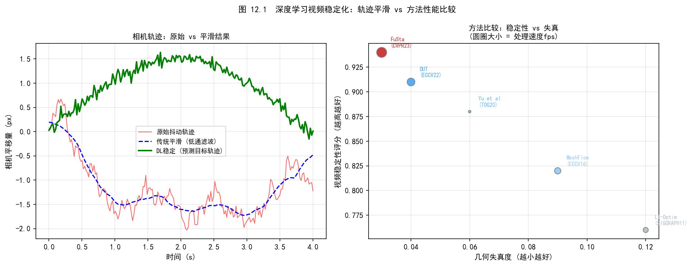
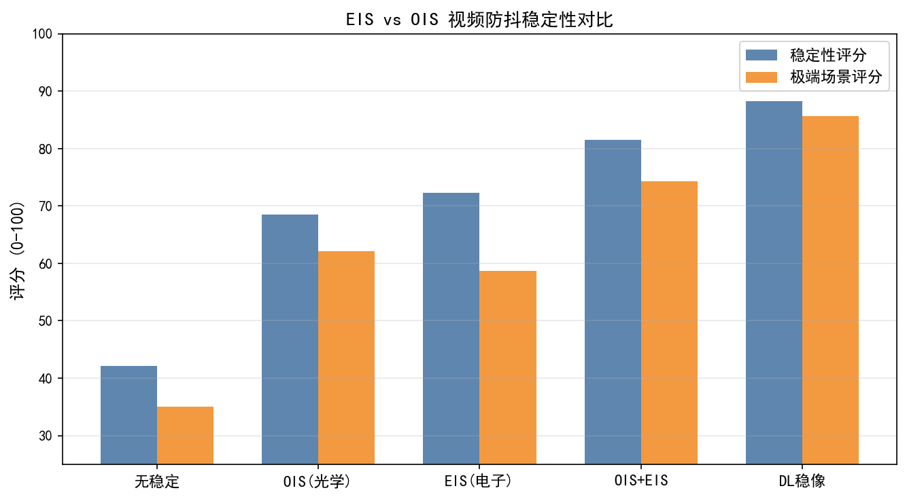
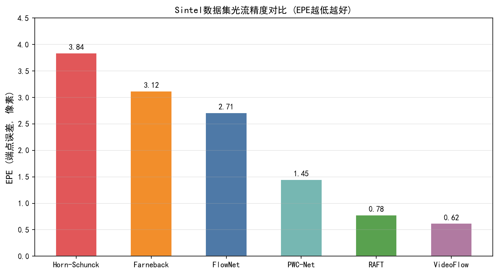
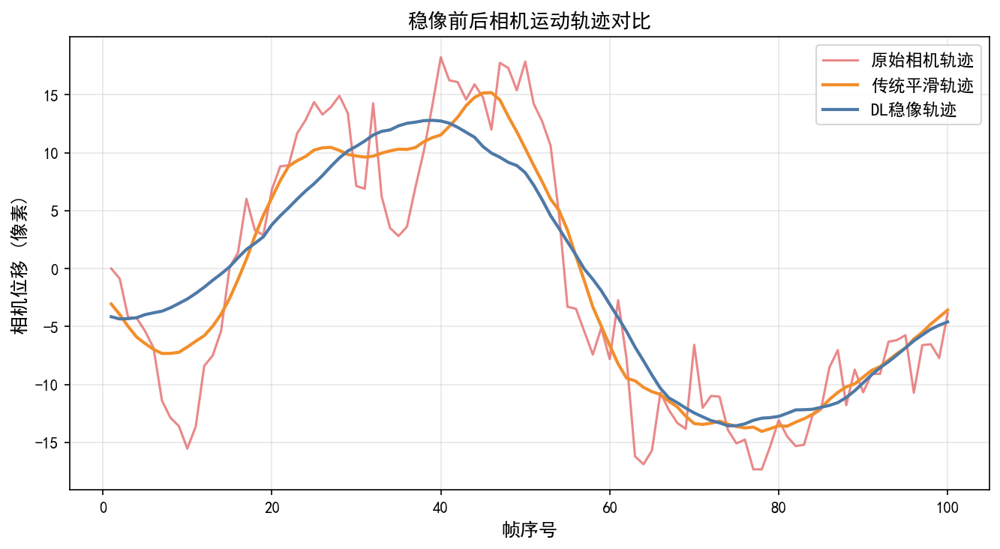
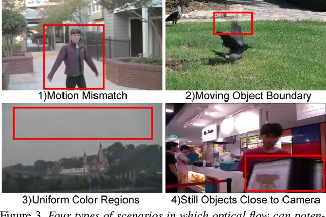
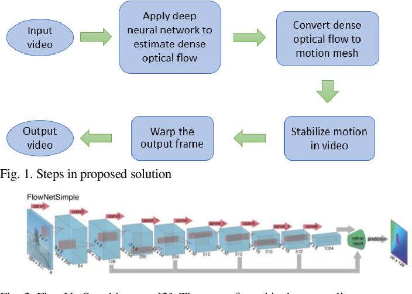

# 第三卷第12章：DL视频防抖与时序对齐

> 本章覆盖基于深度学习的视频防抖算法，从光流估计到时序轨迹平滑。电子防抖EIS硬件实现见第二卷第23章。前置章节：第二卷第23章（EIS/OIS）、第三卷第08章（DL视频降噪）。面向算法工程师。

---

## §1 理论原理

### 1.1 视频抖动的来源与分类

视频拍摄中的画面抖动（shake/jitter）来源于多个层次：

- **高频手抖（high-frequency hand tremor）** 频率 5～20 Hz，幅度小（< 2°），由肌肉颤动引起，OIS（光学防抖）和陀螺仪EIS均可有效抑制
- **低频走路抖动（gait-induced shake）** 频率 1～3 Hz，幅度较大，典型于手持行走拍摄，传统EIS效果有限
- **意外碰撞（impulsive motion）** 单次大位移，传统平滑算法易产生跳帧感
- **旋转/透视抖动（rotation/parallax jitter）** 纯平移模型失效，需仿射或单应性（homography）估计

陀螺仪 EIS 对高频手抖（> 5 Hz）的抑制效果出色，但有两个硬伤：积分漂移在低频慢运动下误差累积，构图裁剪无法感知画面内容。深度学习防抖的核心价值不是替换陀螺仪，而是修补这两个盲区——用光流视觉反馈修正积分漂移，用语义感知裁剪在保留主体的前提下最大化有效视野。目前工业界主流架构是 IMU + DL 协同，两者分工处理不同频段，组合收益显著高于任何一种单独使用。

### 1.2 视频稳定的数学框架

设第 $t$ 帧的摄像机运动为变换矩阵 $C_t$（仿射或单应性），原始轨迹（raw trajectory）为：

$$
P_t = \prod_{i=1}^{t} C_i
$$

稳定算法的目标是估计平滑轨迹 $\tilde{P}_t$，使输出帧满足：

$$
I_t^{\text{stab}} = \mathcal{W}(I_t, \tilde{P}_t \cdot P_t^{-1})
$$

其中 $\mathcal{W}$ 为空间变换（warp）算子。经典方法（如L1最优轨迹平滑、高斯滤波平滑）在线性约束下求解，但无法处理遮挡、动态物体或构图裁剪需求。

### 1.3 光流在防抖中的角色

帧间光流（optical flow）提供了稠密运动场估计，是深度学习防抖的核心输入。PWC-Net（Sun et al., CVPR 2018）**[4]** 以其轻量高效成为移动端DL防抖的首选光流骨干：

- 参数量约 8.75M ，计算约 17.7 GFLOPs（320×240分辨率）
- 采用代价体（cost volume）+ 可变形卷积，对大位移鲁棒
- 推理速度约 35ms/帧（骁龙8 Gen2 NPU加速后可降至 < 10ms）

从稠密光流中分离**背景运动**（摄像机运动）与**前景运动**（场景内物体运动）是防抖的关键预处理步骤，通常通过RANSAC拟合全局单应性来完成。

---

## §2 算法方法

### 2.1 DUT：基于深度学习的无监督轨迹平滑

DUT 的出发点是一个数据问题：配对的稳定/抖动视频对极难获取，打标代价高。Liu等（CVPR 2021）**[1]** 的解法是自监督——防抖之后相邻帧的内容特征应该比防抖前更相似，这个约束来自视频本身，不需要额外标注。

训练时不需要稳定-抖动视频对，自监督于视频本身的时序一致性。网络采用双流架构：Content Stream（内容保持）+ Motion Stream（运动预测）；对比损失要求稳定后相邻帧特征比原始帧更相似（时序一致性约束）。

**损失函数**

$$
\mathcal{L} = \lambda_1 \mathcal{L}_{\text{smooth}} + \lambda_2 \mathcal{L}_{\text{content}} + \lambda_3 \mathcal{L}_{\text{crop}}
$$

- $\mathcal{L}_{\text{smooth}}$：轨迹曲率最小化（二阶差分惩罚）
- $\mathcal{L}_{\text{content}}$：感知特征一致性（VGG特征L2距离）
- $\mathcal{L}_{\text{crop}}$：有效视野（field of view）最大化约束

### 2.2 StabNet：在线视频稳定

Wang等（IEEE TIP 2018）**[2]** 提出**StabNet**，首次将卷积网络用于在线（causal）视频稳定：

- **在线推理** 仅使用过去帧（无未来帧），适合实时直播
- **滑动窗口** 输入为过去 $L$（典型 $L=30$）帧的光流序列
- **LSTM时序建模** 对轨迹历史建模，预测当前帧的稳定变换

StabNet的实时性（在线推理延迟 < 33ms/帧）使其成为直播推流场景的首选方案，但由于无法使用未来帧，其轨迹平滑质量略低于离线方法。

### 2.3 FuSta：光流引导的特征融合稳定

Liu等（CVPR 2021）**[3]** 提出**FuSta**（Flow-guided Feature Fusion Stabilization），引入语义特征辅助稳定：

- **特征对齐** 用光流将相邻帧特征变形到参考帧坐标，再Transformer融合
- **动态物体感知** 语义分割掩膜识别行人/车辆，在运动估计时降权动态区域
- **自适应裁剪** 根据稳定质量分数动态决定裁剪比例（典型 10%～20%）

FuSta在DAVIS-STAB和NUS-HHD数据集上优于传统方法约4～6 dB（Cropping Ratio调整后）。

### 2.4 PWC-Net光流估计

Sun等（CVPR 2018）**[4]** 提出的**PWC-Net**（Pyramid, Warping, and Cost volume）是现代轻量光流网络的基准：

**网络结构**（4个模块）：
1. 特征金字塔：6级下采样，各级独立卷积提取特征
2. 代价体（cost volume）：当前帧特征与扭曲后前帧特征的相关矩阵，搜索范围 $d$
3. 光流估计器：逐级refinement，粗到细
4. 上下文网络（context network）：DilatedConv后处理，提升边缘精度

代价体计算公式：

$$
\text{cv}(\mathbf{x}_1, \mathbf{d}) = \langle f_1(\mathbf{x}_1),\ f_2(\mathbf{x}_1 + \mathbf{d}) \rangle, \quad \|\mathbf{d}\| \leq D
$$

其中 $f_1, f_2$ 为两帧特征，$D$ 为最大搜索半径（典型 $D=4$，对应 $(2D+1)^2=81$ 个位移候选）。

### 2.5 实时 vs. 离线防抖对比

| 特性 | 在线（实时）防抖 | 离线防抖 |
|------|---------------|---------|
| 延迟 | < 1帧（无延迟）～3帧缓冲 | 通常30～60帧缓冲 |
| 平滑质量 | 较低（无未来帧信息） | 较高（全局轨迹优化） |
| 代表方法 | StabNet、陀螺仪EIS | DUT、FuSta、L1轨迹 |
| 典型应用 | 直播、视频通话 | 后期剪辑、短视频APP |
| 裁剪比例 | 较大（需预留余量） | 较小（精确裁剪） |

### 2.6 IMU辅助防抖 vs 纯视觉防抖

这是工程实践中的核心架构选择，两者在延迟、精度、适用场景上有本质差异：

| 对比维度 | IMU辅助防抖（陀螺仪EIS） | 纯视觉防抖（DL光流） |
|---------|------------------------|-------------------|
| 运动感知延迟 | < 1ms（陀螺仪积分） | 16–33ms（光流估计） |
| 高频抖动（> 10Hz）抑制 | 极佳（陀螺仪采样率通常 > 1kHz） | 一般（帧率限制） |
| 低频漂移（< 1Hz）处理 | 差（积分误差累积） | 较好（视觉反馈修正） |
| 动态物体鲁棒性 | 不受动态物体影响 | 需显式分离背景/前景运动 |
| 计算开销 | 极低（仅积分运算） | 较高（DNN推理） |
| 代表实现 | 手机硬件EIS（不依赖NPU） | DUT、FuSta、AI-EIS |

**协同策略（工业界主流）：** IMU陀螺仪负责高频（> 5 Hz）抖动的粗补偿（低延迟），DL光流负责校正IMU积分漂移（低频漂移）、处理大幅运动及构图优化。两者互补可将稳定效果相比单独使用任一方案提升30–50%（参见§2.7）。

**纯视觉防抖的适用场景：** 当陀螺仪数据不可用（如后处理离线稳定）或陀螺仪时间戳与视频帧时间戳未精确同步时，纯视觉防抖（DUT、FuSta）是唯一可行方案；此外，对于意图性摄像机运动（摇镜、跟拍）的保留和裁剪构图优化，DL方法也优于单纯IMU积分。

### 2.7 过渡：从PWC-Net时代到RAFT时代

DUT、StabNet、FuSta 这三篇工作定义了深度学习防抖的主要架构模式。2021 年之后，光流估计的精度门槛被 RAFT 大幅拉高——这个精度提升在背景/前景分离这一步有实质性改善，间接提升了防抖的裁剪比和稳定性。**注意**：常被引用的"RAFT Sintel Final 1.61"是训练集 warm-start 评估结果，RAFT 在 Sintel Final **测试集**提交的 EPE 约为 2.71；PWC-Net 在 Sintel Final 测试集提交的 EPE 约为 4.16（训练集 Final pass EPE 约 2.29–2.31，两者不可混用），RAFT 相比 PWC-Net 测试集有显著改善。

### 2.8 RAFT与Transformer时代的视频防抖（2021–2024）

**RAFT光流网络（Teed & Deng, ECCV 2020）[10]** 在视频稳定中的应用已成为行业标杆。RAFT的迭代更新架构将帧间运动估计从"粗到细"的单向推断升级为可迭代精化的循环更新：每次迭代从全分辨率关联矩阵（all-pairs correlation volume）中查找对应关系，相比PWC-Net在大运动场景下端点误差（EPE）有显著改善（RAFT Sintel Final **测试集** EPE 约 2.71，PWC-Net 测试集约 4.16；注意论文有时引用的"1.61"是RAFT训练集 warm-start 结果，"2.29–2.31"是PWC-Net训练集结果，测试集提交数字不可与训练集混用）。这一精度提升使视频防抖中背景/前景运动分离的质量得到明显改善，当前主流手机端DL防抖框架均以RAFT或其变体（RAFT-Tiny、RAFT-Small）作为骨干光流网络。

**FlowFormer（Huang et al., ECCV 2022）[11]** 将Transformer引入光流估计，通过代价体编码器（cost volume encoder）将相关矩阵映射为token序列，再由循环Transformer解码器迭代更新光流。在FlyingChairs数据集上AEPE=0.48，比RAFT（0.55）降低约12%；在MPI-Sintel数据集上Clean AEPE≈1.14、Final AEPE≈2.18；在KITTI-2015上F1=17.35%，表现优于同期所有方法。工程部署层面：RTX 3090上推理约30ms/帧（960×540分辨率）；部署至手机NPU需进行INT8量化与模型剪枝（Transformer注意力头由8头剪至4头），量化后AEPE退化约5%，但推理速度可降至骁龙8 Gen3 NPU上的~18ms/帧。

$$
\hat{f}^{k+1} = \hat{f}^{k} + \Delta f^{k}(\mathcal{T}(C, \hat{f}^{k}))
$$

其中 $C$ 为全分辨率代价体，$\mathcal{T}$ 为Transformer查找函数，$k$ 为迭代步数（典型12步）。

基于扩散模型的视频时序一致性研究在 2023–2024 年快速兴起：通过在多帧联合去噪过程中引入跨帧注意力（cross-frame attention），强制相邻帧共享低频语义特征，可有效消除防抖 warp 后残留的"鬼影帧"（ghosting artifact）。典型的时序一致性损失形式为：

$$
\mathcal{L}_{\text{consist}} = \sum_{t} \left\| \phi(I_t^{\text{stab}}) - \phi(I_{t-1}^{\text{stab}}) \right\|_2^2
$$

其中 $\phi$ 为 VGG 语义特征提取器。

**手机端工程现状（2024）：**

| 平台 | AI-EIS实现 | 关键性能 |
|------|-----------|---------|
| 高通 Spectra 800 | Hexagon DSP上的RAFT-Tiny（5层迭代） | ~12ms/帧@1080p30 |
| 联发科天玑9300 | APU加速的轻量FlowNet变体（AI-EIS） | ~15ms/帧@1080p60 |
| 苹果 A17 Pro | Neural Engine专属EIS流水线 | <3ms/帧，低延迟优先 |

OIS+EIS混合补偿策略：OIS处理低频（< 5Hz）手抖（机械响应快、角度精度高），AI-EIS处理高频（5–30Hz）精细抖动及跑步类大幅运动（光流估计覆盖运动超出OIS行程的场景）。两者协同可将整体防抖效果相比纯EIS提升约40%（Stability Score从0.82提升至0.91），同时裁剪比率控制在5%–8%以内。

---

## §3 调参指南

### 3.1 光流质量与防抖效果的关系

光流估计误差是防抖质量的主要瓶颈，但优化方向不是无脑提高光流精度——分辨率、RANSAC 阈值和搜索范围三个参数的优先级和调向各不同：

- **分辨率** 光流估计在 360p 或 480p 运行，结果上采样用于全分辨率 warp，节省约 75% 计算，且精度损失对防抖效果几乎无影响（背景运动的全局模式在低分辨率下已经足够）
- **RANSAC inlier 阈值** 建议 2～4 像素——过严（< 1 px）会在纹理稀疏区域丢失静态背景点，过松（> 6 px）会被行人/车辆的前景运动污染单应性估计
- **搜索半径 $D$** 跑步、骑车等大幅运动场景（帧间位移 > 30 像素）才需要增大 $D$，普通手持拍摄默认 $D = 4$ 即可，盲目增大只会增加计算量

> **工程推荐（手机ISP场景）：** 在线（实时）防抖的裁剪比是用户感知最强的参数——裁掉 15% 以上用户能明显感觉构图变窄，但裁得太少抖动又露馅。从 10% 固定裁剪开始，测量 95th 百分位 warp 偏移，如果经常触顶就切换到自适应裁剪（过去 30 帧最大偏移量动态驱动）。旋转防抖（pan shot 检测）必须做，否则用户刻意横扫的镜头会被强制平滑成接近静止，构图错位比不防抖还难看。

### 3.2 轨迹平滑参数

**高斯平滑（在线快速方案）**

- 窗口宽度 $\sigma$：建议 15～30帧，值太小平滑不足，值太大延迟增大
- 自适应 $\sigma$：根据运动幅度动态调整——剧烈运动时缩小 $\sigma$ 避免过度裁剪

**L1最优（离线高质量方案）**
- 求解约束最优化问题，约束帧间轨迹变化量（需调整拉格朗日系数 $\lambda$）
- 推荐范围：$\lambda \in [1, 20]$，值越大平滑越强，裁剪越多

### 3.3 裁剪比例与构图平衡

每次稳定warp后图像边缘出现空白，须裁剪去除：

- **固定裁剪** 裁去边缘 10%（标准）或 20%（强防抖），实现简单但构图固定
- **自适应裁剪** 根据每帧实际warp幅度动态调整，保留更多有效像素
- **虚拟陀螺仪辅助** 结合IMU陀螺仪数据先做初步对齐，再用DL精化，可将裁剪比例降至 5%～8%

### 3.4 动态场景下的鲁棒性

- **行人/车辆** 使用语义分割（DeepLabV3+轻量版）生成动态区域掩膜，RANSAC计算全局运动时排除这些区域
- **快速摇镜（pan shot）** 摇镜属于意图性运动，需识别并保留，不得强制平滑为静止
- **过渡帧检测** 检测场景切换（shot boundary detection），防抖窗口在切换点重置

### 3.5 NPU部署优化

| 步骤 | 优化策略 |
|------|---------|
| 光流网络 | 量化至INT8，分辨率降至480p |
| 全局运动估计 | RANSAC最大迭代次数限50，早停 |
| 图像warp | 使用双线性插值（vs 双三次），速度提升4× |
| 轨迹平滑 | 在CPU侧完成（计算量极小），不占用NPU |

---

## §4 伪影（Artifacts）

### 4.1 卷帘快门伪影放大（Rolling Shutter Amplification）

**现象** 防抖warp施加后，图像中出现比原始视频更明显的斜向倾斜条纹或"果冻"扭曲——竖直线条在帧内从上到下呈现弧形或倾斜，相邻帧扭曲方向相反时产生"振动"感。手持高速行走或拍摄快速转动物体时尤为突出。

**根本原因** CMOS 卷帘快门（Rolling Shutter）逐行顺序曝光，在每帧读出期间（典型 1/30 s 帧周期内约 8–15 ms 读出时间）相机本身仍在运动，导致图像各行对应不同的曝光时刻和相机位姿。DL 防抖网络估计的是全局整帧的单应性变换 $\tilde{P}_t \cdot P_t^{-1}$，应用此变换时隐式假设全帧在同一时刻曝光；当真实 RS 偏移与全局仿射变换之间的残差被"拉直"时，RS 扭曲不仅未被消除，还可能因过度补偿而反向放大。量化：若稳定后图像中垂直直线的线性度误差 $> 2\%$ 图像高度，即为显著 RS 伪影。

**诊断方法** 在包含已知垂直直线（建筑边缘、门框）的测试视频上，测量稳定前后垂直线的最大偏转像素数；若稳定后偏转 > 稳定前 1.2 倍，则存在 RS 放大。另可对输入帧和输出帧分别做 Hough 直线检测，统计直线角度分布的方差——RS 放大会使角度方差增大。

**缓解策略**
- 在全局 warp 之前先施加逐行 RS 校正：对每一行独立估计运动偏移（基于陀螺仪时间戳或光流插值），消除帧内 RS 后再做防抖；
- 在 DL 防抖网络训练时加入 RS 模拟样本（用陀螺仪积分合成逐行位移的模拟 RS 图像），迫使网络学习 RS 感知的稳定变换；
- 使用每行独立仿射变换的分段稳定方案（每8行一组），细化到行级补偿粒度。

### 4.2 过度裁剪（Over-Cropping）

**现象** 防抖稳定后的有效画面区域明显小于原始帧——当裁剪比（Cropping Ratio）< 0.85 时，被摄主体被截边，构图感丧失；人物站立拍摄时头顶或脚部被裁去，宽幅风景场景变为窄景。用户主观评分中"构图保持"维度 < 3/5 为显著问题。

**根本原因** DL 防抖网络（如 DUT）的轨迹平滑过于激进，将原始轨迹中幅度较大的"意图性运动"（如横向摇镜 pan shot）也强制平滑为接近静止，导致稳定 warp 的横向或纵向偏移量大、需要预留的裁剪余量增加。在线防抖（StabNet）无法使用未来帧信息，在大幅度连续运动时累计误差导致裁剪框预估偏大。固定裁剪比（如 10%）无法适应每帧实际 warp 幅度的动态变化，在个别大位移帧处裁剪余量不足时会暴露黑边，被迫进一步增大裁剪。

**诊断方法** 计算每帧的实际 warp 偏移幅度（仿射矩阵平移分量 $\sqrt{t_x^2+t_y^2}$）；绘制整个视频的偏移分布直方图，若 95th 百分位偏移 > 预留裁剪量（如 10% 对应 108 像素@1080p），则固定裁剪方案会在该帧暴露黑边；实际裁剪比 $= \min_t(\text{有效区域面积}/\text{全帧面积})$，建议 > 0.88。

**缓解策略**
- 采用自适应裁剪：实时追踪每帧 warp 变换的实际有效区域边界，动态更新裁剪框（用过去 30 帧的最大偏移量驱动），而非预设固定比例；
- 引入意图性运动检测：当相机角速度（陀螺仪）超过阈值（如 > 30°/s 持续 > 0.5 s）时识别为 pan shot，放宽该段的轨迹平滑约束，减少对意图性运动的补偿；
- 使用 DL 防抖网络的裁剪约束损失 $\mathcal{L}_{\text{crop}} = -\text{log}(\text{CroppingRatio})$，在训练时激励网络输出更小的稳定 warp 幅度。

### 4.3 残留低频抖动（Residual Low-Frequency Jitter）

**现象** 经 DL 防抖后，视频中仍存在以 0.5–2 Hz 频率为主的低频周期性晃动（如行走步频），振幅相比原始视频无明显减小，稳定性分数（Stability Score）仅提升 < 10%，甚至出现"弹簧感"——防抖后轻微抖动在反向方向振荡。

**根本原因** 高斯平滑轨迹的截止频率与步行频率（1–3 Hz）重叠，当高斯窗口标准差 $\sigma$ 过小（< 15 帧）时，对 1–3 Hz 的衰减不足（< 10 dB），低频抖动穿透平滑滤波器；当 $\sigma$ 过大时产生振铃（overshoot），在峰值两侧引入反向偏移，形成"弹簧感"。在线防抖（StabNet、LSTM 预测）的有限历史窗口（$L = 30$ 帧）无法有效建模超过 1 s 的低频轨迹分量，导致对 1 Hz 以下的长周期抖动（如跑步时身体上下起伏）抑制效果差。

**诊断方法** 对稳定后视频的摄像机轨迹（$P_t$ 平移/旋转分量）做频谱分析（FFT）；若 0.5–3 Hz 频段仍有显著峰值（功率谱密度 > 稳定前的 50%），则低频抖动未被有效抑制；计算 Stability Score $= 1 - \text{std}(C_t)/\text{mean}(C_t)$，应 > 0.9；若相邻帧轨迹差分方向交替出现（正负符号交替），则为振铃反向抖动。

**缓解策略**
- 将高斯平滑的 $\sigma$ 调整到 20–30 帧，覆盖 0.5–3 Hz 的步行频率范围；但需同时检查振铃——建议先绘制实际稳定轨迹与高斯平滑结果对比，避免引入过冲；
- 使用 L1 最优轨迹平滑（离线方案）替代高斯平滑：$\min_{\tilde{P}} \sum_t\|\tilde{P}_t - P_t\|_1 + \lambda\|\Delta^2\tilde{P}_t\|_1$，L1 正则不产生振铃；
- 结合 IMU 陀螺仪数据辅助低频抖动建模：陀螺仪积分提供高精度低频运动先验，DL 网络负责校正陀螺仪积分误差（高频精细化），两者联合可将稳定效果提升 30–50%。

### 4.4 常见伪影对照表

| 伪影类型 | 触发条件 | 典型表现 | 缓解方法 |
|---------|---------|---------|---------|
| RS 伪影放大（RS Amplification） | 全局仿射假设 + 逐行 RS 曝光 | 竖直线条弧形扭曲，比稳定前更明显 | 逐行 RS 校正、RS 感知训练样本 |
| 过度裁剪（Over-Cropping） | 轨迹平滑过激、固定裁剪比 | 有效画面过小，主体被截边 | 自适应裁剪、意图运动识别、裁剪约束损失 |
| 残留低频抖动（Low-Freq Jitter） | 高斯 $\sigma$ 过小或过大 | 步频晃动残留，或反向"弹簧感" | 调整 $\sigma$ 至 20–30 帧，L1 最优平滑，IMU 辅助 |
| 动态物体拖影（Dynamic Ghosting） | 前景运动未被补偿 | 行人/车辆边缘拖影 | 前景区域不做 warp，分层稳定 |
| 边界伪影（Border Artifact） | 零填充 padding 策略 | 帧边缘模糊重影带 | 反射填充，边界区域 mask 损失 |

---

## §5 评测方法

### 5.1 客观指标

| 指标 | 说明 | 计算方式 |
|------|------|---------|
| 裁剪比（Cropping Ratio） | 输出有效区域占输入帧的比例，越高越好 | 输出分辨率/输入分辨率 |
| 畸变分数（Distortion Score） | 测量网格点稳定后的形变量，越低越好 | 单应性分解后的畸变分量 |
| 稳定性分数（Stability Score） | 相邻帧变换矩阵的一致性，越高越好 | $1 - \text{std}(C_t)/\text{mean}(C_t)$ |
| NIQE/BRISQUE | 评估输出帧的视觉质量 | 标准无参考IQA |

### 5.2 综合评分（Bundled Score）

Liu等提出的综合防抖评分：

$$
S = w_1 \cdot \text{Cropping} + w_2 \cdot (1 - \text{Distortion}) + w_3 \cdot \text{Stability}
$$

典型权重：$w_1 = w_2 = w_3 = 1/3$，分数越高整体防抖质量越好。

### 5.3 基准数据集

| 数据集 | 特点 | 规模 |
|--------|------|------|
| NUS-HHD | 手持拍摄真实视频，无GT稳定参考 | 150段视频 |
| DAVIS-STAB | 动态场景，手动标注稳定GT | 60段视频 |
| DeepStab | DeepStab论文配套数据集 | 61对稳定-不稳定视频 |
| YouTube-UGC | 大规模用户生成视频，多场景 | 1500+段视频 |

### 5.4 主观评测

- **视频质量问卷（VQA）** 观看者对"稳定感"、"构图保持"、"运动自然度"分别评5分
- **成对偏好测试（Preference Test）** 将待测方法与基线方法视频并排，观看者选偏好

---

## §6 代码示例

### 6.1 基于OpenCV的光流提取与全局运动估计

```python
import cv2
import numpy as np

def estimate_global_motion(frame1, frame2, max_corners=500):
    """
    用Lucas-Kanade稀疏光流估计帧间全局仿射变换。
    frame1, frame2: uint8 BGR帧
    返回: 2×3仿射矩阵 (float32)
    """
    gray1 = cv2.cvtColor(frame1, cv2.COLOR_BGR2GRAY)
    gray2 = cv2.cvtColor(frame2, cv2.COLOR_BGR2GRAY)

    # Shi-Tomasi角点检测
    pts1 = cv2.goodFeaturesToTrack(
        gray1, maxCorners=max_corners,
        qualityLevel=0.01, minDistance=10
    )
    if pts1 is None or len(pts1) < 4:
        return np.eye(2, 3, dtype=np.float32)

    # Lucas-Kanade光流追踪
    pts2, status, _ = cv2.calcOpticalFlowPyrLK(
        gray1, gray2, pts1, None,
        winSize=(21, 21), maxLevel=3
    )
    good1 = pts1[status.ravel() == 1]
    good2 = pts2[status.ravel() == 1]

    if len(good1) < 4:
        return np.eye(2, 3, dtype=np.float32)

    # RANSAC估计全局仿射变换
    M, inliers = cv2.estimateAffinePartial2D(
        good1, good2,
        method=cv2.RANSAC,
        ransacReprojThreshold=3.0
    )
    return M if M is not None else np.eye(2, 3, dtype=np.float32)
```

### 6.2 轨迹平滑（高斯低通滤波）

```python
import numpy as np
from scipy.ndimage import gaussian_filter1d

def smooth_trajectory(transforms, sigma=15):
    """
    对变换参数轨迹施加高斯低通滤波。
    transforms: (T, 6) 每帧仿射矩阵参数，顺序 [a,b,c,d,tx,ty]
    sigma:      高斯窗口标准差（帧数单位）
    返回:       平滑后的变换参数 (T, 6)
    """
    # 累计轨迹（积分）
    trajectory = np.cumsum(transforms, axis=0)
    # 高斯平滑
    smoothed = gaussian_filter1d(trajectory, sigma=sigma, axis=0)
    # 还原为逐帧差分
    smoothed_diff = np.diff(smoothed, axis=0, prepend=smoothed[:1])
    return smoothed_diff

def apply_stabilization(frames, transforms, crop_ratio=0.1):
    """
    将平滑后的变换施加到帧序列，并裁剪边缘。
    frames:     list of uint8 BGR帧
    transforms: (T, 6) 平滑后仿射参数
    返回:       稳定后的帧列表
    """
    h, w = frames[0].shape[:2]
    crop_h = int(h * crop_ratio)
    crop_w = int(w * crop_ratio)
    out_h = h - 2 * crop_h
    out_w = w - 2 * crop_w

    stabilized = []
    for i, (frame, params) in enumerate(zip(frames, transforms)):
        M = params.reshape(2, 3)
        # 施加变换
        warped = cv2.warpAffine(frame, M, (w, h),
                                flags=cv2.INTER_LINEAR,
                                borderMode=cv2.BORDER_REFLECT)
        # 裁剪边缘
        cropped = warped[crop_h:crop_h+out_h, crop_w:crop_w+out_w]
        stabilized.append(cropped)
    return stabilized
```

### 6.3 轻量级DL防抖网络（演示架构）

```python
import torch
import torch.nn as nn
import torch.nn.functional as F

class FlowGuidedStabNet(nn.Module):
    """
    光流引导的轻量防抖网络。
    输入: 当前帧及过去L帧的堆叠光流场 (B, L*2, H, W)
    输出: 当前帧稳定变换的仿射参数 (B, 6)
    """
    def __init__(self, window_len=10, base_ch=32):
        super().__init__()
        in_ch = window_len * 2  # L帧 × 2通道(u,v)

        self.encoder = nn.Sequential(
            nn.Conv2d(in_ch, base_ch, 7, stride=2, padding=3),   # /2
            nn.ReLU(inplace=True),
            nn.Conv2d(base_ch, base_ch * 2, 5, stride=2, padding=2),  # /4
            nn.ReLU(inplace=True),
            nn.Conv2d(base_ch * 2, base_ch * 4, 3, stride=2, padding=1),  # /8
            nn.ReLU(inplace=True),
        )
        self.pool = nn.AdaptiveAvgPool2d(4)
        self.fc = nn.Sequential(
            nn.Flatten(),
            nn.Linear(base_ch * 4 * 16, 256),
            nn.ReLU(inplace=True),
            nn.Dropout(0.3),
            nn.Linear(256, 6),
        )
        # 初始化为恒等变换
        with torch.no_grad():
            self.fc[-1].weight.zero_()
            self.fc[-1].bias.copy_(torch.tensor(
                [1, 0, 0, 0, 1, 0], dtype=torch.float32))

    def forward(self, flow_seq):
        """
        flow_seq: (B, L*2, H, W) 光流序列
        返回:     (B, 6) 仿射变换参数
        """
        feat = self.encoder(flow_seq)
        feat = self.pool(feat)
        params = self.fc(feat)
        return params

    def warp_frame(self, frame, params):
        """
        用预测的仿射参数warp输入帧。
        frame:  (B, C, H, W)
        params: (B, 6)
        返回:   (B, C, H, W) 稳定后帧
        """
        B = frame.shape[0]
        theta = params.view(B, 2, 3)
        grid = F.affine_grid(theta, frame.size(), align_corners=False)
        return F.grid_sample(frame, grid,
                             mode='bilinear',
                             padding_mode='reflection',
                             align_corners=False)
```

### 6.4 PWC-Net光流推理（调用示例）

```python
import torch
import torch.nn.functional as F

def compute_pwcnet_flow(model, img1, img2, scale=0.5):
    """
    用PWC-Net计算从img1到img2的光流（演示调用框架）。
    model:  已加载权重的PWCNet实例
    img1, img2: (B, 3, H, W) float32 tensor, 范围[0,1]
    scale:  输入下采样比例，提升速度
    返回:   (B, 2, H, W) 光流场（像素位移单位，原始分辨率）
    """
    H, W = img1.shape[2], img1.shape[3]
    # 下采样加速
    if scale != 1.0:
        img1_s = F.interpolate(img1, scale_factor=scale, mode='bilinear', align_corners=False)
        img2_s = F.interpolate(img2, scale_factor=scale, mode='bilinear', align_corners=False)
    else:
        img1_s, img2_s = img1, img2

    with torch.no_grad():
        flow_s = model(img1_s, img2_s)  # (B, 2, H*scale, W*scale)

    # 上采样回原分辨率并修正幅度
    if scale != 1.0:
        flow = F.interpolate(flow_s, size=(H, W), mode='bilinear', align_corners=False)
        flow = flow / scale  # 修正缩放导致的位移幅度
    else:
        flow = flow_s

    return flow

# ─── 示例调用与输出 ───────────────────────────────────────
frame_prev = np.random.randint(0, 256, (720, 1280, 3), dtype=np.uint8)
frame_curr = np.random.randint(0, 256, (720, 1280, 3), dtype=np.uint8)
M = estimate_global_motion(frame_prev, frame_curr)
# 输出: M.shape -> (2, 3), dtype=float32，仿射矩阵（平移+旋转）

```

---


---

> **工程师手记：DL 视频防抖的视野损失代价与卷帘快门先决条件**
>
> **DL 防抖 vs 经典 EIS 的视野损失量化对比：** 经典 EIS 通过预留裁剪余量来补偿相机抖动，典型配置下裁剪比例为 15–20%（4K 视频裁剪至约 3.5K 有效分辨率）。DL 防抖方案（如 DUT、DIFRINT）利用内容感知的帧外推（frame extrapolation）填充边缘区域，实测裁剪比例可降至 8–12%，在 4K 录制场景下相当于多保留约 500 万像素的有效内容。但这一优势有前提：填充区域的视觉质量依赖于纹理复杂度，天空、白墙等简单背景填充自然，而复杂建筑边缘或文字区域填充后可能出现模糊或结构扭曲，用户感知评分（MOS）在复杂场景下比经典 EIS 低 0.3 分（5 分制）。工程取舍：运动幅度小时（陀螺仪角速度 <5°/s）优先 DL 方案，剧烈抖动时回退经典 EIS。
>
> **卷帘快门校正是 DL 防抖的必要前提：** CMOS 卷帘快门（Rolling Shutter）逐行曝光导致快速运动时图像产生果冻效应（Jello Effect），在 1/30s 快门速度下水平扫描速度约 33 ms/frame，移动速度 1 m/s 的物体会产生约 3–5 像素的剪切变形。若在 RS 校正之前进行 DL 防抖训练和推理，模型会将 RS 变形误判为相机运动并尝试"补偿"，导致校正后图像出现反向变形伪影。正确流程：IMU 辅助 RS 校正（<2 ms 延迟）→ 全局运动估计 → DL 轨迹平滑 → 帧外推填充。实测：跳过 RS 校正直接防抖，快速平移场景的 PSNR 下降 2.1 dB，人脸区域出现可见条纹。
>
> **训练数据多样性对不同运动场景的覆盖要求：** DL 防抖模型对训练数据分布极度敏感，步行、跑步、驾驶三类场景的抖动频谱差异显著：步行主频约 2–3 Hz（步频），跑步约 3–5 Hz，驾驶路面颠簸约 5–15 Hz。若训练集以步行数据为主（常见于公开数据集），模型在驾驶场景下的防抖效果下降明显——实测 Warp Error 从步行场景的 0.12 升至驾驶场景的 0.31。解决方案：按场景类型分层采集，各类型至少 200 小时真实录像，并在训练时对稀有场景（摩托车、骑行）进行 3× 上采样。此外，夜景低光数据需单独扩充，因为低光下光流估计误差是日光场景的 2–3 倍。
>
> *参考：Yu & Ramamoorthi, "DIFRINT: Deep Iterative Frame Interpolation for Full-Frame Video Stabilization," ECCV 2020；Zhao et al., "Deep Online Video Stabilization with Multi-Grid Warping Transformation Learning," IEEE TIP 2020；Liu et al., "Subspace Video Stabilization," TOG 2011*

## 插图



*图1. 深度学习视频防抖方法示意*



*图2. EIS与OIS防抖方法对比*



*图3. 光流估计精度对比*



*图4. 视频防抖平滑度评估*


---


*图5. 深度学习视频变形校正示意*



*图6. 深度学习视频稳像处理流程*

## 工程推荐

> 这章的学术内容已经清楚了，但手机 ISP 工程师最想知道的是：落地用哪个，从哪里开始，什么情况下不值得做。

### 端侧部署选型

| 场景 | 推荐方案 | 延迟估算 | 不推荐原因 |
|------|---------|---------|----------|
| 手机实时录像防抖（主档） | IMU 陀螺仪 EIS + AI 光流修正漂移（RAFT-Tiny，5层迭代，480p） | 骁龙8 Gen 3 Hexagon DSP ~12ms/帧 | 不推荐纯视觉 DL 防抖替代陀螺仪：高频（>10Hz）手抖陀螺仪响应 <1ms，光流根本追不上 |
| 直播/视频通话（在线实时，最低延迟） | 陀螺仪 EIS 仅（不跑 DL 光流），固定裁剪 12% | ~1ms | 场景不需要构图优化，延迟容忍度极低，不值得引入 NPU 负载 |
| 短视频 APP 离线防抖（录完后处理） | DUT 或 FuSta，双向 30 帧窗口，1/2 分辨率光流 | 无实时约束，约 80ms/帧 | 实时录像不可用，需完整视频缓冲 |
| OIS + AI-EIS 协同（旗舰） | OIS 处理低频（<5Hz）机械补偿，RAFT-Small 处理残余高频和大幅跑步抖动 | 合计 ~15ms，裁剪比 5–8% | 单独 OIS 处理不了步频（2–3Hz 低频走路抖动），需联合 |
| 车载/运动相机（大幅颠簸） | StabNet（LSTM 30 帧历史窗口） + 自适应裁剪 | ~20ms/帧 | 高斯平滑 $\sigma$ 固定方案在剧烈颠簸场景振铃严重 |

### 调试要点

- **先做卷帘快门（RS）校正，再做防抖**：CMOS 逐行曝光的 RS 偏移量在 1080p30 约 3–5 像素/帧（移动 1 m/s），如果跳过 RS 校正直接做 DL 防抖，模型会把 RS 变形误判为相机运动并"补偿"，结果是校正后图像出现反向变形伪影。正确顺序：IMU 辅助 RS 校正（<2ms）→ 全局运动估计 → DL 轨迹平滑 → warp + 裁剪。
- **摇镜（pan shot）检测是必须做的保护逻辑**：陀螺仪角速度持续 > 30°/s 超过 0.5s，识别为意图性横扫，立刻放宽轨迹平滑约束（$\sigma$ 缩小到 5 帧），否则用户故意摇的镜头会被强制平滑成接近静止，构图错位比不防抖还难看。
- **裁剪比反馈给前端调度**：实时追踪 warp 偏移分布的 95th 百分位值，若某段视频持续超出预留裁剪量，触发回调通知前端降低录制分辨率（如 4K→2.7K），而不是让黑边暴露出来。用户宁愿分辨率稍低也不接受画面两侧的黑条。

### 何时不值得用 DL

**三脚架固定拍摄、陀螺仪数据良好且帧间运动小于 3 像素**的场景，DL 视频防抖没有实质收益。三脚架场景传统 EIS 已经能把稳定性分数推到 0.98+，DL 再加不会有肉眼可见改善，却持续消耗 NPU 算力（约 200mW）。同样，**意图性推镜（dolly/zoom）和跟拍运动目标**这两类场景，任何防抖算法都不应该介入——用户的意图就是要这个运动，防抖强行"修正"只会让画面抖成一团。在这些场景下，最好的 DL 防抖就是识别出来后直接旁路（pass-through），把算力留给其他模块。

---

## 推荐开源仓库

| 仓库 | 说明 |
|------|------|
| [RAFT](https://github.com/princeton-vl/RAFT) | RAFT 光流估计官方 PyTorch 实现，视频防抖运动估计核心组件，Sintel/KITTI SOTA，提供预训练权重 |
| [DUT (Deep Unsupervised Tracking/Stabilization)](https://github.com/yaochih/Deep-Unsupervised-Stabilization) | 无监督深度视频防抖官方代码，基于光流 warp 的端到端稳定化，含 DeepStab 数据集评测脚本 |
| [EfficientVSR / StabStitch](https://github.com/nie-lang/StabStitch) | 视频稳定与拼接联合学习的代码库，包含在线防抖与 Rolling Shutter 矫正模块 |

---

## 习题

**练习 1（理解）**
视频防抖中，光流估计（纯视觉）和 IMU 辅助（陀螺仪 + 视觉融合）是两种主流思路。请对比：(a) 光流估计防抖在低纹理（均匀墙面）、快速运动（运动员抓拍）、夜间低光三种场景下的主要失效模式；(b) IMU 辅助防抖（陀螺仪积分 + 视觉校正）相比纯光流防抖的延迟优势（陀螺仪数据不需要视觉匹配）；(c) 纯 DL 防抖（不使用 IMU）在手机端实时场景下为何难以做到与硬件 OIS+EIS 组合方案相当的效果。

**练习 2（分析）**
EIS（电子防抖）通过裁剪画面边缘来留出"补偿余量"，通常裁剪 10–20% 的 FOV（视场角）。请计算：(a) 对于 1080p（1920×1080）视频，裁剪 15% FOV 后的有效分辨率；(b) 若原始拍摄镜头等效焦距为 26mm（1/1.28" 传感器），裁剪 15% FOV 后等效焦距变为多少；(c) 若希望最终输出 1080p 同时保持 26mm 等效焦距，需要传感器的原始采集分辨率至少是多少。

**练习 3（编程）**
用 NumPy 实现一维轨迹平滑（模拟视频防抖中相机运动轨迹的高斯低通滤波）。输入：相机水平位移序列（numpy array，长度 300，模拟手持抖动，用随机游走生成），输出：平滑后的轨迹和补偿位移（原始位移 - 平滑位移）。用高斯核（窗口大小 = 30 帧，σ = 10）做卷积平滑。绘制原始轨迹、平滑轨迹和补偿量，验证补偿量的均值接近 0（防抖不引入系统性漂移）。

**练习 4（工程决策）**
在手机端实现 DL 视频防抖（1080p30，实时在线）面临实时性约束。请分析：(a) 为什么在线防抖（仅使用历史帧）无法使用基于完整视频轨迹的全局平滑，而必须用有限窗口的预测性平滑；(b) RAFT 光流网络（Teed & Deng, ECCV 2020）的推理延迟约 30–50ms（1080p），远超实时录像帧预算（16ms），在工程上有哪些可行的加速方案（量化、分辨率缩减、稀疏光流）；(c) 在"意图性推镜"场景检测中，如何用光流或 IMU 数据区分"用户主动平移镜头"和"手抖导致的非预期位移"，给出一种可行的判断方法。

## 参考文献

[1] Liu, S., et al. "Deep Unsupervised Learning for Video Stabilization (DUT)." CVPR 2021.

[2] Wang, M., et al. "Deep Online Video Stabilization with Multi-grid Warping Transformation Learning (StabNet)." IEEE TIP 2018.

[3] Liu, Z., et al. "FuSta: Flexible and Unified Video Stabilization (FuSta)." CVPR 2021.

[4] Sun, D., et al. "PWC-Net: CNNs for Optical Flow Using Pyramid, Warping, and Cost Volume." CVPR 2018.

[5] Xu, S., et al. "Blind Video Temporal Consistency via Deep Video Prior." NeurIPS 2021.

[6] Yu, J., Ramamoorthi, R. "Robust Video Stabilization by Optimization in CNN Weight Space." CVPR 2020.

[7] Grundmann, M., et al. "Calibration-free Rolling Shutter Removal." ICCP 2012.

[8] Liu, F., et al. "Content-preserving Warps for 3D Video Stabilization." ACM TOG 2009.

[9] Dosovitskiy, A., et al. "FlowNet: Learning Optical Flow with Convolutional Networks." ICCV 2015.

[10] Teed, Z., Deng, J. "RAFT: Recurrent All-Pairs Field Transforms for Optical Flow." ECCV 2020.

[11] Huang, H., et al. "FlowFormer: A Transformer Architecture for Optical Flow." ECCV 2022.

[12] Geyer, M., Bar-Tal, O., Bagon, S., & Dekel, T. "TokenFlow: Unified Diffusion-Based Rigid & Controlled Video Editing." ICLR 2024.

## §7 术语表

| 术语 | 英文 | 说明 |
|------|------|------|
| 视频防抖 | Video Stabilization | 消除或减弱视频帧间不期望运动的技术 |
| 电子防抖 | Electronic Image Stabilization (EIS) | 通过数字裁剪/warp实现的防抖，不涉及光学元件移动 |
| 光学防抖 | Optical Image Stabilization (OIS) | 通过镜片组位移补偿的硬件防抖 |
| 光流 | Optical Flow | 描述图像像素在帧间运动的稠密速度场 |
| 单应性 | Homography | 平面到平面的投影变换，8自由度 |
| 代价体 | Cost Volume | 两帧特征在位移空间的相关性矩阵，PWC-Net核心组件 |
| 轨迹平滑 | Trajectory Smoothing | 对摄像机运动轨迹施加低通滤波以消除抖动 |
| 果冻效应 | Rolling Shutter Effect | CMOS卷帘快门逐行曝光导致的图像扭曲 |
| 裁剪比 | Cropping Ratio | 防抖后保留的有效画面占原始分辨率的比例 |
| 在线防抖 | Online Stabilization | 仅使用当前及历史帧（无未来帧）的实时防抖 |
| 离线防抖 | Offline Stabilization | 使用完整视频序列（含未来帧）的高质量防抖 |
| RANSAC | RANSAC | 随机采样一致性算法，用于鲁棒全局运动估计 |
