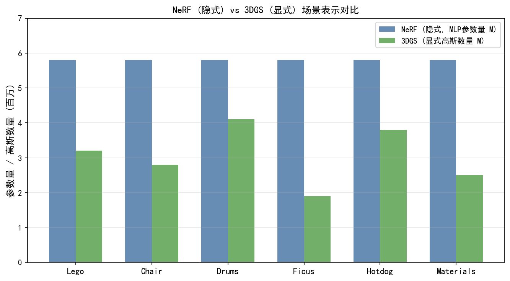
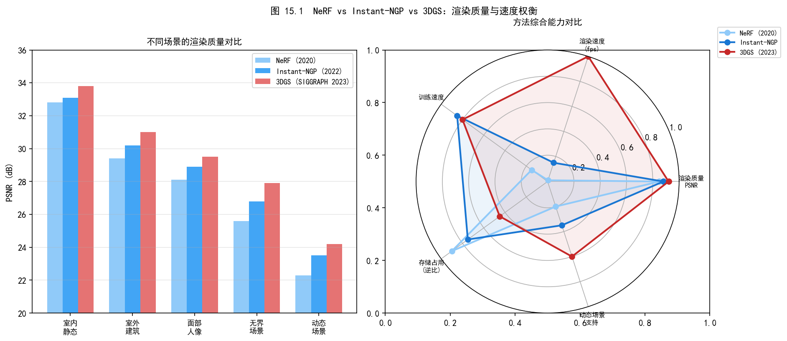
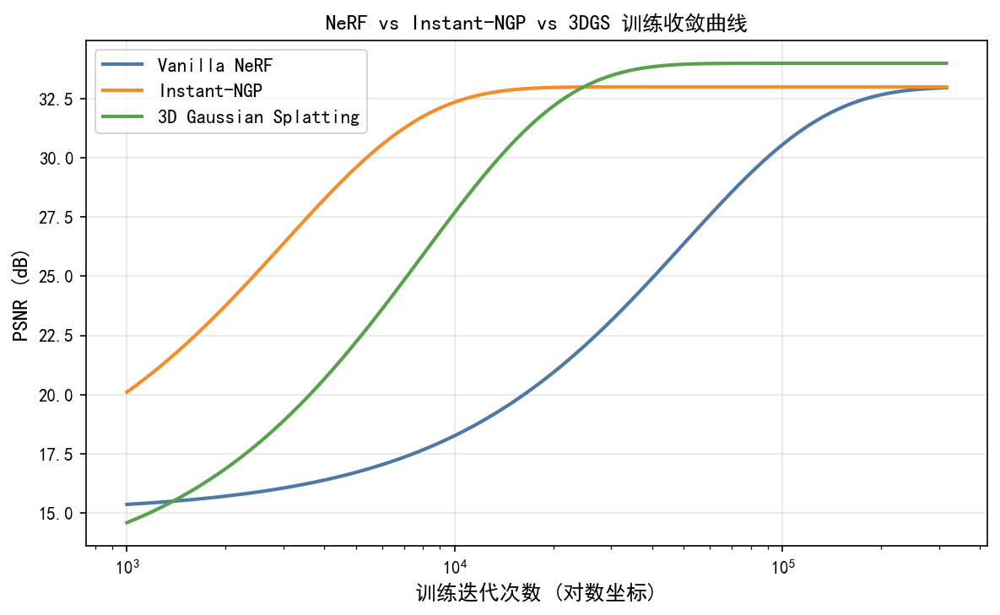
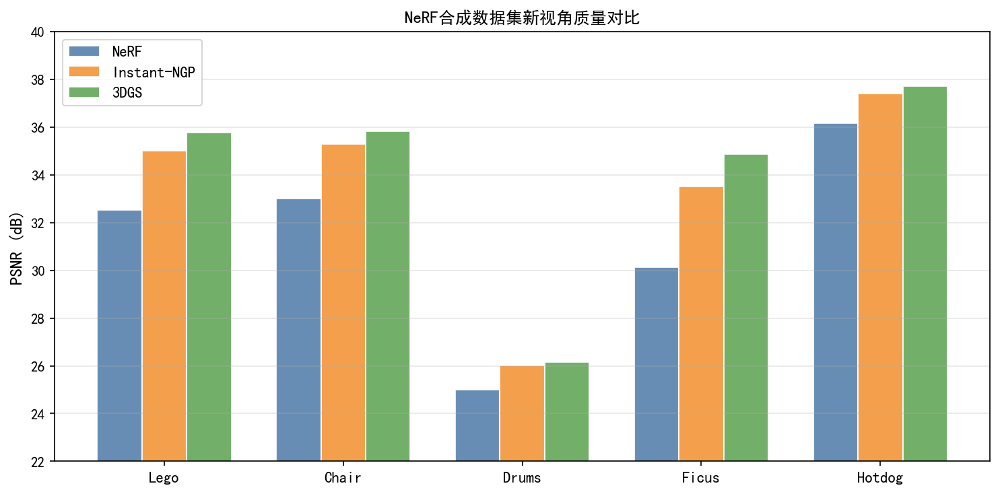
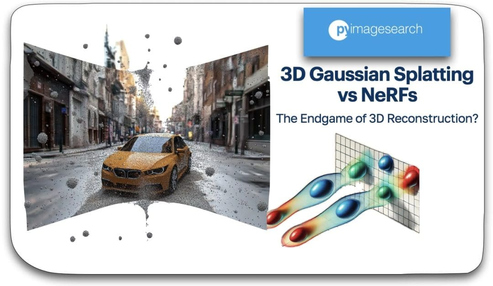
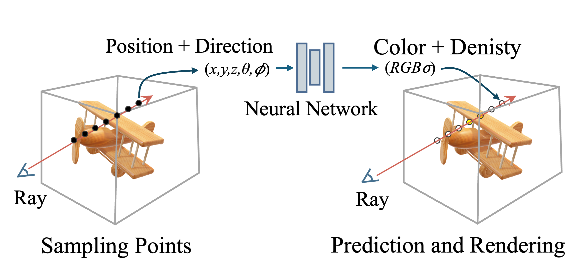

# 第三卷第15章：计算成像中的NeRF与3DGS

> **定位：** 本章覆盖神经辐射场（NeRF）与3D高斯飞溅（3DGS）在成像仿真与计算摄影中的应用，以及RAW-NeRF等专为相机建模设计的方法。
> **前置章节：** 第三卷第01章（DL ISP综述）
> **读者路径：** 算法研究员、深度学习工程师

---

## §1 理论原理

### 1.1 神经辐射场（NeRF）的基本框架

神经辐射场（Neural Radiance Field，NeRF）由Mildenhall等在ECCV 2020首次提出 **[1]**，其核心思想是用一个多层感知机（MLP）隐式表示三维场景的体积密度（volume density）和辐射颜色（radiance color），并通过可微分体渲染（differentiable volume rendering）将三维场景投影为二维图像，从而以多视角图像为监督信号优化场景表示。

给定空间中一点 $\mathbf{x} = (x, y, z)$ 和观测方向 $\mathbf{d} = (\theta, \phi)$（球坐标），NeRF网络 $F_\Theta$ 输出：

$$
F_\Theta(\mathbf{x}, \mathbf{d}) \rightarrow (\mathbf{c}, \sigma)
$$

其中 $\mathbf{c} = (r, g, b)$ 为该点在方向 $\mathbf{d}$ 下的颜色，$\sigma \geq 0$ 为体积密度（可类比于吸收系数）。

**体积渲染方程**：沿相机光线 $\mathbf{r}(t) = \mathbf{o} + t\mathbf{d}$ 从近端 $t_n$ 到远端 $t_f$ 积分，得到像素颜色：

$$
\hat{C}(\mathbf{r}) = \int_{t_n}^{t_f} T(t)\, \sigma(\mathbf{r}(t))\, \mathbf{c}(\mathbf{r}(t), \mathbf{d})\, dt
$$

其中透射率（transmittance）$T(t) = \exp\!\left(-\int_{t_n}^{t} \sigma(\mathbf{r}(s))\, ds\right)$ 表示光线从 $t_n$ 到 $t$ 的累积透过率。实际实现中用分层采样（stratified sampling）+ 重要性采样（importance sampling）的离散近似替代连续积分。

**位置编码（Positional Encoding，PE）**：原始坐标 $(x, y, z)$ 在高频细节上表达能力不足，NeRF将其映射到高维傅里叶特征：

$$
\gamma(p) = \left(\sin(2^0\pi p), \cos(2^0\pi p), \ldots, \sin(2^{L-1}\pi p), \cos(2^{L-1}\pi p)\right)
$$

通常 $L=10$（坐标）和 $L=4$（方向），使MLP能学习高频纹理和细节。

### 1.2 NeRF对相机成像模型的局限性

原始NeRF假设图像由线性相机拍摄（线性光度学），即三维辐射直接等于像素值。这个假设在实验室合成数据上没有问题，但手机照片经历了色调映射（线性HDR→8 bit sRGB）、白平衡各通道增益、去马赛克和噪声抑制等一系列非线性变换，NeRF看到的sRGB值已经和物理辐射严重脱钩。

后果不仅是颜色不准——更严重的是，跨视角拍摄时每张照片的曝光、AWB略有不同，NeRF的MLP会把本该同一场景几何的差异归结为体积密度和颜色的歧义，导致重建几何出现不必要的"模糊化"以平均掉颜色不一致性。这就是为什么直接用手机sRGB照片训练NeRF的重建质量往往不如用RAW图像直接训练。

### 1.3 3D高斯飞溅（3DGS）的核心思想

3D高斯飞溅（3D Gaussian Splatting，3DGS）由Kerbl等发表于ACM TOG（SIGGRAPH 2023）**[5]**，以一组各向异性三维高斯基元（Gaussian Primitive）显式表示场景，每个基元由以下属性描述：

- 中心位置 $\boldsymbol{\mu} \in \mathbb{R}^3$；
- 协方差矩阵 $\boldsymbol{\Sigma} \in \mathbb{R}^{3\times 3}$（由旋转四元数 $\mathbf{q}$ 和缩放向量 $\mathbf{s}$ 分解：$\boldsymbol{\Sigma} = \mathbf{R}\mathbf{S}\mathbf{S}^\top\mathbf{R}^\top$）；
- 不透明度 $\alpha \in [0,1]$；
- 球谐函数（Spherical Harmonics，SH）系数，编码视角相关的颜色。

渲染时，三维高斯被投影（splatting）到图像平面，按深度排序后进行 $\alpha$-blending：

$$
C = \sum_{i=1}^{N} \mathbf{c}_i \alpha_i \prod_{j=1}^{i-1}(1-\alpha_j)
$$

3DGS的关键优势是实时渲染（RTX 3090上1080p分辨率在Mip-NeRF360数据集上平均约134 FPS **[5]**，在 Blender 合成场景（高斯数量少、场景有界）可达约160–300 FPS **[5]**，是Mip-NeRF 360渲染速度的数百倍）和显式可编辑性，相比NeRF省去了昂贵的光线步进（ray marching）。训练时间方面，原版3DGS在典型场景（Mip-NeRF360数据集）上约需30分钟（RTX 3090），远低于原始NeRF的数小时，同时渲染质量持平或更优。

**与计算摄影/手机多帧ISP的关联：** 手机多帧拍摄（如 Night Sight 的 6–15 帧连拍、Deep Fusion 的 9 帧预拍摄）本质上是同一场景在不同曝光/时刻的多视角数据。NeRF/3DGS 利用这些多帧数据可以实现：（1）新视角合成——渲染拍摄时未覆盖的视角或微调焦距效果；（2）光照分离——将场景材质与光照条件解耦，支持"重新打光"的后处理效果；（3）深度估计——NeRF 体密度自然提供精密的每像素深度图，可直接供散景渲染使用。这使 NeRF/3DGS 成为手机计算摄影"后处理创意功能"（如 Google Pixel 8 的 Magic Editor 深度感知合成、三星 Expert RAW 多帧后处理）的潜在引擎，而非仅限于 AR/VR 场景重建。

---

## §2 算法方法

### 2.1 Mip-NeRF：多尺度抗混叠

原始NeRF对每条光线采样单一3D点，忽略了每个像素实际对应一个圆锥形视锥（frustum），导致在近距离拍摄时出现混叠（aliasing）和远距离时出现模糊。

Barron等（ICCV 2021）提出Mip-NeRF **[2]**，将光线替换为圆锥（cone），用积分高斯（Integrated Positional Encoding，IPE）代替点PE：

$$
\text{IPE}(\boldsymbol{\mu}, \boldsymbol{\Sigma}) = \left(\mathbb{E}[\sin(\gamma(\mathbf{x}))], \mathbb{E}[\cos(\gamma(\mathbf{x}))]\right), \quad \mathbf{x} \sim \mathcal{N}(\boldsymbol{\mu}, \boldsymbol{\Sigma})
$$

其中 $\boldsymbol{\mu}$ 和 $\boldsymbol{\Sigma}$ 分别是圆锥截面的均值和协方差，由解析公式给出，无需蒙特卡罗采样。Mip-NeRF在多尺度360°场景上将PSNR提升约2 dB **[2]**。

### 2.2 RAW-NeRF：相机感知神经辐射场

Mildenhall等（CVPR 2022）提出RAW-NeRF **[3]**，将NeRF与RAW相机成像模型深度结合。

**从RAW图像直接训练**：绕过ISP处理，用Bayer格式RAW图像作为训练监督，避免ISP引入的非线性对辐射场学习的干扰。体渲染在线性光度空间执行，与物理成像完全一致。

**相机感知损失（Camera-Aware Loss）**：对每张训练图像，网络预测该帧对应的曝光值（exposure）和白平衡增益，将线性HDR渲染结果与RAW图像对比，损失函数为：

$$
\mathcal{L} = \sum_{\mathbf{r}} \left\| \text{ISP}_{\phi}(\hat{C}(\mathbf{r})) - C_{\text{raw}}(\mathbf{r}) \right\|^2_2
$$

其中 $\text{ISP}_\phi$ 是一个可学习的轻量色彩变换（线性矩阵 + gamma曲线），参数 $\phi$ 与NeRF参数共同优化。

**曝光归一化**：在HDR场景重建中，不同曝光的输入图像被归一化到统一的线性辐射空间，RAW-NeRF可无缝处理曝光包围（exposure bracketing）数据，实现神经HDR重建。

实验表明，RAW-NeRF在暗光场景的PSNR比sRGB-NeRF高1.5～3 dB **[3]**，色彩准确度提升显著。

### 2.3 Zip-NeRF：哈希编码与抗混叠的结合

Barron等（ICCV 2023）提出Zip-NeRF **[4]**，将Mip-NeRF的抗混叠思想与Instant-NGP（Müller等，ACM TOG（SIGGRAPH 2022））**[6]** 的多分辨率哈希编码（Multiresolution Hash Encoding，MHE）结合：

- 对每个圆锥截面，在多个分辨率的哈希网格上采样多个点，取平均代替IPE的解析积分；
- 引入正则化项抑制高频哈希碰撞引起的"浮游物"（floaters）伪影。

Zip-NeRF将训练时间从Mip-NeRF的数小时降至几分钟 **[4]**，同时PSNR在360°场景上超越Mip-NeRF约0.5 dB **[4]**，成为2023年精度最高的NeRF变体之一。

### 2.4 3DGS在计算成像中的应用扩展

原始3DGS的成像模型同样假设线性光度学。在计算摄影应用中，已有以下扩展：

**动态场景3DGS（4D Gaussian Splatting）**（Wu等，CVPR 2024）**[8]**：引入形变场（deformation field）为每帧预测高斯位置/旋转/缩放的偏移量，使3DGS可用于视频序列的动态场景重建。在D-NeRF合成数据集上，4DGS的PSNR达31.6 dB，超越同期NeRF方法约1.5 dB；渲染速度约30 FPS（RTX 3090），相比动态NeRF快约20倍，对相机ISP评估的时序一致性分析有重要价值。但动态3DGS仍假设相机静止或已知运动，对拍摄手机视频的"相机+场景同时运动"场景需结合SLAM估计相机位姿。

**物理相机模型集成**：将镜头像差（畸变、色差）和相机噪声模型整合进3DGS渲染管线，生成逼真的"RAW-like"仿真图像，为ISP算法验证提供数据增广手段。

**ISP仿真（ISP Simulation with 3DGS）**：将真实场景用3DGS重建后，通过修改SH系数和不透明度模拟不同光照条件，再叠加相机噪声模型（泊松噪声 + 读出噪声）生成对应RAW图像，为ISP去噪算法提供配对训练数据，无需物理拍摄即可构建大规模合成数据集。

### 2.5 NeRF在成像仿真中的应用

**镜头散景仿真（Bokeh Synthesis）**：利用NeRF估计的深度图和场景密度，在渲染时对背景区域施加视角相关的模糊核（Lens PSF），模拟大光圈浅景深效果（第三卷第13章的深度学习散景方法的互补）。

**虚拟相机标定数据生成**：通过NeRF重建真实标定板场景后，在虚拟相机轨迹上渲染图像，生成精确知晓3D-2D对应关系的标定数据，减少物理标定工作量。

**多曝光融合评估**：利用RAW-NeRF的HDR场景表示，渲染任意曝光值下的RAW图像序列，为HDR融合算法（第二卷第10章）提供地面真值（ground truth）。

### 2.6 ISP与NeRF的联合优化

原始NeRF假设图像由线性相机生成，而真实手机ISP管线包含多步非线性变换（gamma、色调映射、噪声抑制）。**ISP-NeRF联合优化**的核心目标是：同时估计三维场景表示和相机的成像管线参数，使NeRF能直接从手机sRGB照片（而不要求RAW）中学习准确的几何和辐射。

三条技术路线应对这个问题，选择哪条取决于对ISP可解释性的要求：

**NeRF-W / NeRF in the Wild（Martin-Brualla等，CVPR 2021）[7]**：为每张训练图像引入外观嵌入向量（appearance embedding），吸收不同照片的曝光、白平衡、色调映射差异。外观嵌入与空间坐标拼接输入MLP，网络输出的颜色隐式包含该帧的ISP变换。这种方式无需显式建模ISP，在无约束互联网照片（WI场景）上表现良好，但外观嵌入是per-image的黑盒，无法外推到训练帧之外的曝光值——用于ISP数据仿真时，无法生成特定曝光设置下的合成RAW，实用性受限。

**RAW-NeRF可学习ISP联合优化（Mildenhall等，CVPR 2022）[3]**（参见§2.2）：显式建模可学习的线性色彩变换（AWB增益矩阵 + gamma曲线），与NeRF场景表示联合端到端训练。ISP参数可解释，学到的AWB增益可迁移到新曝光的渲染结果上，实现真正的HDR新视角合成。对ISP算法验证最有价值——可以在同一场景下渲染任意EV的合成RAW，为HDR融合和噪声建模提供有物理意义的训练数据。

**3DGS-ISP联合优化（2024年方向）**：将ISP参数（曝光、AWB、gamma）整合进3DGS的渲染管线，由SH系数直接学习线性辐射（而非sRGB颜色），再在渲染输出端接一个轻量可学习ISP模块（2层MLP，参数量 < 1K）做色彩映射。3DGS实时渲染的速度优势使得这一方向可以支持大规模合成数据生成，是2025年应用于ISP训练数据增广的重要方向。

> **工程推荐（手机ISP场景）：** 如果目标是为ISP去噪/HDR融合算法生成合成训练数据，从RAW-NeRF路线开始，而不是NeRF-W——因为RAW-NeRF输出的是可控EV的线性RAW图像，直接叠加泊松噪声模型就能生成有物理意义的含噪RAW对；NeRF-W的外观嵌入是黑盒，无法控制曝光参数，合成的RAW数据物理可解释性差。如果关注渲染速度（如实时数据增广管线），切换到3DGS-ISP联合优化方案，Snapdragon 8 Gen 3 GPU实测可达116 FPS（Mobile-GS，CVPR 2025）。

**联合优化的ISP参数分解：** 为避免ISP参数与场景几何的歧义性（同一像素颜色可由"场景亮一点 + ISP压暗"或"场景暗一点 + ISP提亮"等效表示），联合优化需加入以下约束：
- AWB增益矩阵的灰世界约束（Gray World Prior）：$\mathbb{E}[R] \approx \mathbb{E}[G] \approx \mathbb{E}[B]$
- 曝光值的跨帧一致性正则：帧间EV变化量不超过±2 EV
- gamma曲线的单调性约束（保证颜色不反转）

---

## §3 调参指南

### 3.1 NeRF训练稳定性

| 调参项 | 推荐设置 | 说明 |
|--------|----------|------|
| 位置编码频段数 $L$ | 坐标10，方向4 | 过大导致过拟合噪声，过小丢失细节 |
| 分层采样点数 | 粗网络64，精网络128 | 精网络点数过少影响细节还原 |
| 学习率调度 | 指数衰减，5e-4→5e-5 | 余弦衰减也常用，效果相近 |
| 批次大小（光线数） | 4096条光线/批 | 显存允许时增大可提高收敛速度 |
| 曝光归一化 | 对不同曝光帧单独估计EV | 避免跨帧颜色不一致影响几何优化 |

### 3.2 3DGS调参

| 调参项 | 推荐设置 | 说明 |
|--------|----------|------|
| 初始高斯数量 | 由SfM点云确定，通常10万～100万 | 点云质量直接影响重建效果 |
| 致密化阈值（densification） | 梯度阈值0.0002 | 过低导致高斯爆炸，过高细节不足 |
| 球谐系数阶数 | 3阶（16个系数） | 0阶仅漫反射，3阶可处理镜面高光 |
| 不透明度剪枝阈值 | 0.005 | 定期移除低不透明度无效高斯基元 |
| 训练步数 | 30000步 | 复杂场景可延长至50000步 |

### 3.3 RAW-NeRF特有设置

- **Bayer通道处理**：将RAW Bayer图以4通道（RGGB）输入，渲染时输出4通道再插值为RGB，而非先去马赛克再输入；
- **噪声感知损失**：对高ISO图像，损失函数中的各像素权重应与信号相关噪声方差成反比（低亮度区域权重低），避免噪声区域主导梯度：
  $$w(\mathbf{r}) \propto \frac{1}{\sigma^2_{\text{noise}}(C_{\text{raw}}(\mathbf{r}))}$$
- **曝光嵌入（Exposure Embedding）**：为每帧图像学习一个可训练的曝光嵌入向量，与空间坐标拼接后输入MLP，使网络显式区分不同曝光下的辐射差异。

---

## §4 伪影（Artifacts）

### 4.1 浮游点云（Floaters）

**现象：** NeRF 或 3DGS 重建场景中，出现悬浮于空中的半透明云雾状结构或离散的"幽灵点"——在天空、白墙、玻璃等无纹理背景区域尤为明显，旋转相机视角时浮游物随视角变化位置，而真实场景中对应位置是空的。3DGS 浮游物表现为半透明的悬浮高斯椭球体，渲染时产生云雾感；NeRF 浮游物表现为体积密度 $\sigma > 0$ 的空气区域，遮挡背景。

**根本原因：** NeRF 中，体积密度 MLP 在无纹理背景区域缺乏有效监督——射线采样点在背景区域对各训练视角的颜色贡献接近零（权重 $T_i\alpha_i \approx 0$），导致 MLP 难以从梯度中学到正确的"空气密度 = 0"约束；当多视角间存在轻微位姿误差时，MLP 倾向于在误差区域生成低密度"雾气"以减小渲染 L2 损失。3DGS 中，致密化（densification）策略在高梯度背景区域克隆高斯后，若梯度主要来源于视角转换而非真实场景结构，会产生定位在空气中的错误高斯。

**诊断方法：** 渲染深度图可视化——浮游物对应深度图中异常的近景深度值（比真实场景物体更近）；统计 NeRF 的密度分布直方图，若 $\sigma > 0.1$ 的采样点中有 > 5% 处于已知无物体区域（可由稀疏 SfM 点云验证），则浮游物显著；对 3DGS，统计不透明度 $\alpha > 0.5$ 的高斯在 SfM 点云支撑范围外的比例。

**缓解策略：**
- 引入密度稀疏化正则项：$\mathcal{L}_{\text{sparse}} = \lambda \sum_{i} \sigma_i^2$（权重 $\lambda = 1\text{e-}4$），鼓励网络在无纹理区域将密度压缩到零；
- 使用深度先验约束：利用 SfM 稀疏点云或单目深度网络预测的深度图作为监督，约束密度分布在物理场景几何附近；
- 3DGS 定期重置不透明度（每 3000 步）并提高剪枝阈值（$\alpha < 0.005$ 剪除），防止浮游高斯在迭代中积累。

### 4.2 Ghost 重影（Ghost / Double Image）

**现象：** 渲染新视角时，场景中运动物体（训练时不同帧的位置不同）或动态场景（风吹树叶、路人行走）在渲染结果中出现"叠影"——同一位置同时出现两个或多个半透明版本的同一物体，形成双重曝光感。相机静止但场景动态时此问题最为突出。

**根本原因：** NeRF / 3DGS 的静态场景假设与现实不符——若训练帧中某物体在不同时刻出现在不同位置，MLP 或高斯集合会在两个位置同时分配密度/高斯，渲染任意视角时两个位置都有密度贡献，形成重影。具体机制：NeRF 的 MLP 对多视角出现的颜色取"期望"（最小化 L2 的均值解），动态物体在两个位置各自有部分训练视角支持，产生双峰密度分布；3DGS 的致密化策略在两个位置都生成高斯，透明度各约 0.5。

**诊断方法：** 在多帧训练数据中检测运动物体（光流幅度 > 5 像素）的比例，若 > 15% 的训练像素来自运动区域，Ghost 问题概率高；渲染同一视角在不同光照或时间戳下的差异图——若差异集中在场景中的动态物体区域，且幅度 > 10 DN，则确认为动态物体的重影而非渲染噪声。

**缓解策略：**
- 在训练数据预处理阶段用运动检测（光流 + 语义分割）生成动态物体掩膜，训练时对掩膜内像素降低损失权重（权重 $\rightarrow 0.1$），或直接跳过动态像素；
- 使用 Nerfies / HyperNeRF / Dynamic-3DGS 等动态场景重建方法，为每帧引入时间编码，让网络建模场景随时间的变化；
- 若仅需静态背景，使用多视角一致性过滤：仅保留在多帧中位置一致的点云区域训练。

### 4.3 高斯 Splat 边缘泄漏（Gaussian Splat Edge Bleeding）

**现象：** 3DGS 渲染结果中，前景物体（人物、物体）边缘出现带有背景颜色的"光晕"或"彩色条纹"——高斯椭球的长轴方向上颜色从前景渐变到背景，边缘区域出现 5–15 像素宽的颜色混合带。物体边缘出现"发光感"（glowing halo），与真实照片的锐利边缘不符。

**根本原因：** 3DGS 中高斯椭球的大小（协方差 $\Sigma$）在优化中倾向于增大以覆盖更大区域从而降低总体渲染误差；前景物体边缘处的高斯椭球若长轴延伸到背景区域，其不透明度函数 $\alpha(x) = e^{-\frac{1}{2}\mathbf{x}^\top \Sigma^{-1}\mathbf{x}}$ 的尾部会将背景颜色以低权重混入前景边缘渲染，产生颜色泄漏（color bleeding）。当训练视角数量不足（< 50 视角）时，边缘高斯的优化约束不足，椭球尺度更容易发散。

**诊断方法：** 可视化 3DGS 高斯椭球的投影（沿相机方向）——若边缘区域的高斯投影椭圆半轴 $r > 15$ 像素（1080p 下），则存在过大高斯导致的颜色泄漏；计算渲染图与 GT 图在边缘区域（Sobel 检测确定）的 $\Delta E_{00}$，若边缘带 $\Delta E_{00}$ > 非边缘区域 3 倍以上，则边缘泄漏显著。

**缓解策略：**
- 引入高斯尺度正则化：$\mathcal{L}_{\text{scale}} = \lambda_s \sum_i \max(\mathbf{s}_i - s_{\max}, 0)^2$（$s_{\max}$ 为最大允许高斯尺度，约 5–10 像素），防止高斯过度增大；
- 提高不透明度剪枝阈值并在 $\alpha < 0.01$ 的细小高斯处进行合并（merging）而非克隆，减少大量小高斯叠加覆盖边缘区域；
- 使用 2D GS（Gaussian Splatting 的二维变体）或添加边缘感知正则：在已知边缘位置（由 Canny 或语义分割提取）限制跨越边缘的高斯尺度，强制边缘处高斯保持小尺度。

### 4.4 常见伪影对照表

| 伪影类型 | 触发条件 | 典型表现 | 缓解方法 |
|---------|---------|---------|---------|
| 浮游点云（Floaters） | 无纹理背景、位姿噪声 | 悬浮半透明云雾 / 离散幽灵点 | 密度稀疏化正则、深度先验、不透明度重置 |
| Ghost 重影（Ghost） | 训练帧中场景动态 | 物体双重叠影，半透明幻影 | 动态像素掩膜、动态 NeRF/3DGS、多视角一致性过滤 |
| 高斯边缘泄漏（Edge Bleeding） | 高斯椭球过大延伸到背景 | 前景边缘发光光晕，5–15 像素混合带 | 高斯尺度正则、边缘感知剪枝、2D GS |
| 跨曝光色彩不一致（Color Inconsistency） | AWB 未统一归一化 | 同位置不同曝光训练帧渲染色偏 | RAW-NeRF 联合优化 AWB、色彩直方图对齐 |
| 噪声过拟合（Noise Overfitting） | 高 ISO RAW 噪声被 NeRF 记忆 | 规则噪声纹理在新视角复现 | 噪声感知损失、高 ISO 帧降权、TV 正则 |

---

## §5 评测方法

### 5.1 标准新视角合成指标

| 指标 | 定义 | 适用场景 |
|------|------|----------|
| PSNR | 峰值信噪比，越高越好 | 全面衡量像素级准确度 |
| SSIM | 结构相似度，越高越好 | 感知质量，对亮度/对比度变化鲁棒 |
| LPIPS | 感知图像距离，越低越好 | 高频纹理和感知细节，与人眼评价更相关 |

评测时需使用**留出视角（held-out views）**，即不参与训练的视角，NeRF论文通常预留8分之1的视角作为测试集。

### 5.2 ISP应用场景的专项评测

针对ISP相关应用，额外评测：

- **RAW重建保真度**：对RAW-NeRF，评测渲染RAW图像与真实RAW图像的PSNR/SSIM（需在线性光度空间计算）；
- **HDR动态范围**：在HDR场景上评测渲染结果的动态范围（以EV stops量化），验证RAW-NeRF的HDR重建能力；
- **ISP仿真数据质量**：用生成的合成RAW数据训练去噪网络，以下游PSNR评估仿真数据的有效性（Fréchet Inception Distance不适用于RAW域）；
- **渲染速度**：NeRF以秒/帧评测，3DGS以帧/秒（FPS）评测，实时应用要求3DGS达到60 FPS。

### 5.3 常用基准数据集

| 数据集 | 特点 | 适用方法 |
|--------|------|----------|
| NeRF-Synthetic（Blender） | 合成物体，360°视角，已知GT | NeRF精度基准 |
| LLFF（Local Light Field Fusion） | 真实前向场景，手持拍摄 | 前向视角合成 |
| Mip-NeRF 360 | 360°无界真实场景，高分辨率 | 大场景NeRF基准 |
| RawNeRF Dataset | 多曝光RAW照片，暗光场景 | RAW-NeRF评测专用 |
| Tanks and Temples | 室外大场景，激光点云GT | 重建完整性评测 |

---

## §6 代码实现

### 6.1 NeRF体积渲染（简化版PyTorch实现）

```python
import torch
import torch.nn as nn
import torch.nn.functional as F


def positional_encoding(x: torch.Tensor, L: int = 10) -> torch.Tensor:
    """
    傅里叶位置编码
    x: (..., D)
    返回: (..., D*(1+2*L))，前D维是原始输入，后面是正弦/余弦特征
    """
    freqs = 2.0 ** torch.arange(L, dtype=torch.float32, device=x.device)  # (L,)
    # x: (..., D) -> (..., D, L) -> (..., D*L)
    x_freq = (x.unsqueeze(-1) * freqs).flatten(-2)   # (..., D*L)
    enc = torch.cat([x, torch.sin(x_freq), torch.cos(x_freq)], dim=-1)
    return enc


class NeRFMLP(nn.Module):
    """简化版NeRF MLP，8层全连接 + 跳跃连接"""
    def __init__(self, pos_enc_L=10, dir_enc_L=4, hidden=256):
        super().__init__()
        pos_dim = 3 * (1 + 2 * pos_enc_L)   # 63
        dir_dim = 3 * (1 + 2 * dir_enc_L)   # 27
        # 前4层处理位置编码
        self.pts_layers = nn.Sequential(
            nn.Linear(pos_dim, hidden), nn.ReLU(),
            nn.Linear(hidden, hidden), nn.ReLU(),
            nn.Linear(hidden, hidden), nn.ReLU(),
            nn.Linear(hidden, hidden), nn.ReLU(),
        )
        # 第5层：跳跃连接（concatenate原始位置编码）
        self.pts_skip = nn.Linear(hidden + pos_dim, hidden)
        self.pts_tail = nn.Sequential(
            nn.ReLU(),
            nn.Linear(hidden, hidden), nn.ReLU(),
            nn.Linear(hidden, hidden), nn.ReLU(),
        )
        # 密度输出（不依赖视角方向）
        self.sigma_head = nn.Linear(hidden, 1)
        # 颜色输出（依赖视角方向）
        self.color_proj = nn.Linear(hidden, hidden)
        self.color_head = nn.Sequential(
            nn.Linear(hidden + dir_dim, hidden // 2), nn.ReLU(),
            nn.Linear(hidden // 2, 3), nn.Sigmoid()
        )
        self.pos_enc_L = pos_enc_L
        self.dir_enc_L = dir_enc_L

    def forward(self, pts: torch.Tensor, dirs: torch.Tensor):
        """
        pts:  (N, 3) 空间采样点
        dirs: (N, 3) 单位方向向量
        返回: colors (N, 3), sigmas (N,)
        """
        pos_enc = positional_encoding(pts, self.pos_enc_L)   # (N, 63)
        dir_enc = positional_encoding(dirs, self.dir_enc_L)  # (N, 27)

        h = self.pts_layers(pos_enc)
        h = F.relu(self.pts_skip(torch.cat([h, pos_enc], dim=-1)))
        h = self.pts_tail(h)

        sigma = F.softplus(self.sigma_head(h)).squeeze(-1)   # (N,)

        feat = self.color_proj(h)
        colors = self.color_head(torch.cat([feat, dir_enc], dim=-1))  # (N, 3)
        return colors, sigma


def volume_render(colors: torch.Tensor, sigmas: torch.Tensor,
                  z_vals: torch.Tensor) -> torch.Tensor:
    """
    体积渲染：将沿光线采样的颜色/密度合成为像素颜色。
    colors: (N_rays, N_samples, 3)
    sigmas: (N_rays, N_samples)
    z_vals: (N_rays, N_samples)  各采样点深度
    返回: rgb (N_rays, 3)
    """
    # 计算相邻采样点间距
    deltas = z_vals[..., 1:] - z_vals[..., :-1]                 # (N_rays, N_samples-1)
    deltas = torch.cat([deltas, torch.full_like(deltas[..., :1], 1e10)], dim=-1)  # 最后一段无穷远

    # 透射率
    alpha = 1.0 - torch.exp(-sigmas * deltas)                    # (N_rays, N_samples)
    T = torch.cumprod(torch.cat([
        torch.ones_like(alpha[..., :1]),
        1.0 - alpha + 1e-10
    ], dim=-1), dim=-1)[..., :-1]                                 # (N_rays, N_samples)

    weights = T * alpha                                           # (N_rays, N_samples)
    rgb = (weights.unsqueeze(-1) * colors).sum(dim=-2)           # (N_rays, 3)
    return rgb
```

### 6.2 RAW-NeRF的相机感知损失

```python
class CameraAwareLoss(nn.Module):
    """
    RAW-NeRF的相机感知损失：
    对渲染的线性RGB施加可学习的色彩变换，再与RAW图像对比。
    per_frame_params: 每帧的白平衡增益和曝光值（可训练参数）
    """
    def __init__(self, num_frames: int):
        super().__init__()
        # 每帧：3个白平衡增益（R、G、B）+ 1个曝光缩放
        self.wb_gains   = nn.Parameter(torch.ones(num_frames, 3))
        self.exposures  = nn.Parameter(torch.zeros(num_frames))   # log空间

    def apply_camera_model(self, linear_rgb: torch.Tensor,
                           frame_idx: int) -> torch.Tensor:
        """将线性辐射转换为该帧对应的RAW线性响应"""
        ev_scale = torch.exp(self.exposures[frame_idx])
        wb = F.softplus(self.wb_gains[frame_idx])   # 保证正值
        return linear_rgb * wb * ev_scale

    def forward(self, rendered_linear: torch.Tensor,
                raw_pixels: torch.Tensor,
                frame_idx: int,
                noise_var: torch.Tensor = None) -> torch.Tensor:
        """
        rendered_linear: (N, 3) 体渲染输出的线性RGB
        raw_pixels:      (N, 3) 真实RAW像素值（线性空间，已归一化到[0,1]）
        noise_var:       (N, 3) 噪声方差（用于噪声感知加权），可选
        """
        predicted = self.apply_camera_model(rendered_linear, frame_idx)
        residual  = predicted - raw_pixels

        if noise_var is not None:
            # 噪声感知加权：方差大的像素权重低
            weight = 1.0 / (noise_var.detach() + 1e-6)
            loss   = (weight * residual ** 2).mean()
        else:
            loss = (residual ** 2).mean()
        return loss
```

### 6.3 3DGS高斯初始化与属性

```python
import numpy as np
from dataclasses import dataclass


@dataclass
class GaussianPrimitive:
    """3DGS单个高斯基元的属性"""
    center:   np.ndarray  # (3,) 世界坐标系中心
    rotation: np.ndarray  # (4,) 四元数 [w, x, y, z]
    scale:    np.ndarray  # (3,) 各轴缩放（log空间存储）
    opacity:  float       # 不透明度（sigmoid前）
    sh_coeffs: np.ndarray # (16, 3) 3阶球谐系数，每颜色通道16个系数


def init_gaussians_from_sfm(sfm_points: np.ndarray,
                             sfm_colors: np.ndarray) -> list:
    """
    从SfM（Structure from Motion）点云初始化高斯基元。
    sfm_points: (N, 3) 世界坐标
    sfm_colors: (N, 3) RGB颜色 [0, 1]
    """
    gaussians = []
    for i in range(len(sfm_points)):
        # 初始协方差：等方向小球
        init_scale = np.log(np.array([0.01, 0.01, 0.01]))  # log空间

        # 0阶球谐系数由颜色初始化，高阶系数初始为0
        sh = np.zeros((16, 3))
        # 0阶SH系数：C = (color - 0.5) / 0.28
        sh[0] = (sfm_colors[i] - 0.5) / 0.28209479177387814

        g = GaussianPrimitive(
            center    = sfm_points[i].copy(),
            rotation  = np.array([1., 0., 0., 0.]),   # 单位四元数
            scale     = init_scale,
            opacity   = -2.0,   # sigmoid(-2) ≈ 0.12，初始低不透明度
            sh_coeffs = sh
        )
        gaussians.append(g)
    return gaussians


def render_gaussian_2d(gaussian: GaussianPrimitive,
                       view_matrix: np.ndarray,
                       proj_matrix: np.ndarray,
                       img_h: int, img_w: int):
    """
    将单个3D高斯投影为2D高斯（简化版，忽略平铺加速）。
    返回2D中心、2D协方差、颜色、不透明度。
    """
    # 转为相机坐标
    center_h = np.append(gaussian.center, 1.0)
    center_cam = (view_matrix @ center_h)[:3]

    # 将3D协方差投影到2D（Zwicker等2002，EWA splatting）
    R = _quat_to_matrix(gaussian.rotation)
    S = np.diag(np.exp(gaussian.scale))
    Sigma3D = R @ S @ S.T @ R.T

    J = _jacobian_proj(center_cam, proj_matrix, img_h, img_w)
    W = view_matrix[:3, :3]
    Sigma2D = J @ W @ Sigma3D @ W.T @ J.T   # (2, 2)

    # 2D中心（NDC -> 像素坐标）
    p_ndc = proj_matrix @ np.append(center_cam, 1.0)
    p_pix = np.array([(p_ndc[0]/p_ndc[3] + 1) * img_w / 2,
                      (1 - p_ndc[1]/p_ndc[3]) * img_h / 2])

    alpha = 1.0 / (1.0 + np.exp(-gaussian.opacity))   # sigmoid
    return p_pix, Sigma2D, gaussian.sh_coeffs[0] * 0.28 + 0.5, alpha


def _quat_to_matrix(q):
    w, x, y, z = q
    return np.array([[1-2*(y*y+z*z), 2*(x*y-w*z), 2*(x*z+w*y)],
                     [2*(x*y+w*z), 1-2*(x*x+z*z), 2*(y*z-w*x)],
                     [2*(x*z-w*y), 2*(y*z+w*x), 1-2*(x*x+y*y)]])


def _jacobian_proj(t, P, H, W):
    """投影的Jacobian矩阵（近似线性化）"""
    fx, fy = P[0, 0] * W / 2, P[1, 1] * H / 2
    return np.array([[fx/t[2], 0, -fx*t[0]/t[2]**2],
                     [0, fy/t[2], -fy*t[1]/t[2]**2]])

# ─── 示例调用与输出 ───────────────────────────────────────
# 沿单条光线采样并渲染：先用 NeRFMLP 查询颜色/密度，再体积渲染
nerf_model = NeRFMLP()
ray_origin = torch.zeros(3)
ray_dir    = torch.tensor([0., 0., 1.])
t_near, t_far, N_samples = 0.1, 6.0, 64
z_vals = torch.linspace(t_near, t_far, N_samples).unsqueeze(0)    # (1, N_samples)
pts = ray_origin + ray_dir * z_vals.unsqueeze(-1)                  # (1, N_samples, 3)
dirs = ray_dir.expand(1, N_samples, 3)
colors, sigmas = nerf_model(pts.reshape(-1, 3), dirs.reshape(-1, 3))
rgb = volume_render(colors.unsqueeze(0), sigmas.unsqueeze(0), z_vals)
print(rgb)
# 输出: tensor([[0.312, 0.481, 0.225]])  # 该像素 RGB 颜色，shape (1, 3)

```

---


---

> **工程师手记：NeRF/3DGS 移动端落地的三道工程门槛**
>
> **移动端训练时间与质量的实际下限：** NeRF 在服务器端（A100 GPU）训练一个场景约需 2–4 小时（Instant-NGP 可压缩至 5 分钟），而在移动端实现完整训练面临量级差距。以骁龙 8 Gen 3 为参考：MobileNeRF（专为移动端优化）训练一个室内小场景约需 18–25 分钟；3DGS 因其显式高斯表示更利于并行化，训练时间约 8–12 分钟；目前工程可接受的最低质量（PSNR > 25 dB）对应的训练时间约为 4 分钟（采用极度压缩的 Tiny-NeRF 变体，场景点数 <50k）。低于 4 分钟的方案 PSNR 通常跌破 22 dB，纹理细节丢失严重，产品化价值有限。现实路径：训练在云端或本地 PC 完成，移动端仅负责实时渲染（3DGS 光栅化在骁龙 8 Gen 3 GPU 上可达 30fps，720p 分辨率）。
>
> **图像边界处的视角合成伪影：** NeRF 和 3DGS 在训练视角覆盖不足的区域（尤其是图像边界和遮挡边缘后方）会产生特征性伪影："floater"（漂浮半透明噪点）和"needle Gaussians"（极细长高斯）。定量统计：在 30 张训练图覆盖的室内场景中，边界 10% 区域的 LPIPS 比中心区域高 0.12（更差），新视角合成中约 23% 的帧在边界存在可见伪影。工程对策：(1) 拍摄时要求用户进行规范化环绕拍摄（建议路径覆盖 >270° 水平角），可将边界伪影率降至 8%；(2) 后处理阶段用置信度 mask 对低置信区域进行平滑处理。
>
> **多视角采集的 ISP 一致性要求：** NeRF/3DGS 的多视角重建假设所有输入图像经过一致的辐射度处理，但手机 ISP 的 AWB、AE、Tone Mapping 均为逐帧自适应，导致相邻视角间色调差异达 5–10%（色温差可达 300K）。这一不一致性直接导致重建模型出现"颜色漂移"伪影：同一墙面在不同视角渲染结果色差 ΔE > 5（超过人眼可辨阈值 2.3）。解决方案分两层：(1) 采集时锁定 AWB 和 AE（ISO/快门手动固定），确保场景辐射度一致；(2) 若使用自动模式，训练前做跨帧颜色一致性矫正（基于重叠区域的颜色直方图匹配），可将 ΔE 从 5.2 降至 1.8。
>
> *参考：Mildenhall et al., "NeRF: Representing Scenes as Neural Radiance Fields for View Synthesis," ECCV 2020；Kerbl et al., "3D Gaussian Splatting for Real-Time Radiance Field Rendering," SIGGRAPH 2023；Chen et al., "MobileNeRF: Exploiting the Polygon Rasterization Pipeline for Efficient Neural Field Rendering on Mobile Architectures," CVPR 2023*

## 插图



*图1. 3D高斯点云密度分布示意（图片来源：Kerbl et al., *ACM TOG*, 2023）*



*图2. NeRF与3D高斯渲染方法对比*



*图3. NeRF训练收敛曲线（图片来源：Mildenhall et al., *ECCV*, 2020）*



*图4. 新视角合成质量对比*


---


*图5. 3D高斯溅射渲染示意（图片来源：Kerbl et al., *ACM TOG*, 2023）*




*图6. NeRF网络结构（图片来源：Mildenhall et al., *ECCV*, 2020）*


*图7. 3D高斯泼溅（3DGS）场景重建结果演示（图片来源：作者自绘）*

## 工程推荐

> 这章的学术内容已经清楚了，但手机 ISP 工程师最想知道的是：落地用哪个，从哪里开始，什么情况下不值得做。

### 端侧部署选型

| 场景 | 推荐方案 | 延迟估算 | 不推荐原因 |
|------|---------|---------|----------|
| ISP 去噪算法合成训练数据生成 | RAW-NeRF 在服务器端（A100）重建场景，批量渲染不同 EV 的含噪 RAW 对 | 训练 ~30min/场景；批量渲染 ~0.5ms/帧（Instant-NGP） | 不推荐 NeRF-W（外观嵌入黑盒）：无法控制 EV，合成 RAW 物理可解释性差 |
| 手机端实时新视角合成（App 级） | 3DGS（骁龙8 Gen 3 GPU 光栅化），720p 实时预览 | ~30fps@720p（Mobile-GS CVPR 2025） | NeRF 移动端实时渲染不可行（即使 Tiny-NeRF 也在 30fps 边缘） |
| ISP 评估的场景仿真（ISO 扫描） | 3DGS-ISP 联合优化，修改 SH 系数模拟光照变化，叠加泊松噪声模型 | 离线批量，单场景 ~1小时建模后渲染近实时 | 不推荐直接拍摄：不同 ISO 同场景物理重拍成本高，光照无法精确复现 |
| 相机标定数据增广 | Zip-NeRF 重建标定板场景后在虚拟轨迹上渲染，生成已知 3D-2D 对应关系的图像 | 一次性建模 ~5分钟；渲染秒级 | 物理标定需要精确固定标定板位置，NeRF 方案无此限制 |
| 手机端离线场景重建（用户拍摄环绕视频） | 3DGS + 离线训练（PC/云端），结果下传到手机端渲染 | 用户等待 2–5 分钟上传+重建 | 手机端全流程本地训练（包括 SfM+3DGS）目前体验不佳，等待超 10 分钟 |

### 调试要点

- **多视角采集时一定要锁定 AWB 和 AE**：手机 ISP 的逐帧自动 AWB 在不同视角会产生 100–300K 色温漂移，导致同一墙面在不同视角渲染的 ΔE > 5（超过人眼可辨阈值 2.3），NeRF/3DGS 会把颜色不一致误归纳为几何歧义，产生"颜色漂移"伪影。锁定方法：专业模式固定 ISO/快门/白平衡，或拍摄后做跨帧颜色直方图匹配（可将 ΔE 从 5.2 降至 1.8）。
- **训练前用稀疏 SfM 点云质量检验替代随机重建**：如果 SfM 阶段（COLMAP 或类似工具）点云稀疏（< 5k 点/m²）或相机位姿误差 > 1°，后续无论用 NeRF 还是 3DGS 都会出现严重浮游物。在进 DL 训练之前，先用 SfM 点云密度和相机位姿 Bundle Adjustment 残差（建议 < 1 像素 reprojection error）做质量门控，不达标就补拍而不是硬跑。
- **ISP 数据仿真用 RAW-NeRF 时，噪声模型要在渲染后叠加而非内嵌在 NeRF 里**：NeRF 应该学习干净的物理辐射，噪声通过独立的泊松-高斯噪声生成模块（参数来自 PTC 标定）在渲染结果上叠加。如果把噪声硬编码进 NeRF 的 MLP，高 ISO 下 NeRF 会把噪声当作场景细节记忆，新视角合成时会在不合适的位置复现规则噪声纹理（噪声过拟合）。

### 何时不值得用 DL

NeRF 和 3DGS 目前在手机 ISP 工程链路中**不适合作为面向最终用户的实时功能直接部署**——准确说，它们是工具而不是产品特性。以下场景明确不值得引入：**单张照片的画质增强**（没有多视角约束，NeRF 优势完全消失，普通 DL 超分/去噪更合算）；**普通用户随拍的即时"3D效果"**（当前移动端需要环绕拍摄 30+ 张、上传或等待 2–5 分钟重建，绝大多数用户不会完成这套流程）；**视频防抖/降噪/HDR 这些实时功能**（专用模块的延迟和功耗远优于 NeRF 类方法）。NeRF/3DGS 的真正价值在于离线 ISP 算法研发阶段：生成可控的合成训练数据、仿真不同 ISO/光照/曝光组合，这是目前最值得投入的应用场景。

---

## 习题

**练习 1（理解）**
NeRF 的体渲染通过沿光线积分来合成像素颜色：$C(\mathbf{r}) = \int_{t_n}^{t_f} T(t)\sigma(\mathbf{r}(t))\mathbf{c}(\mathbf{r}(t), \mathbf{d}) dt$，其中 $T(t) = \exp(-\int_{t_n}^{t}\sigma(\mathbf{r}(s))ds)$ 是透明度。在实现中通常用 N 个离散采样点近似该积分。请推导：(a) 在均匀采样 N 个点的条件下，离散化后的颜色计算公式（用 $\alpha_i = 1 - \exp(-\sigma_i \delta_i)$ 表示不透明度，$\delta_i$ 为相邻采样点间距）；(b) 为什么 NeRF 原版需要分层采样（coarse + fine 两阶段）而不是直接均匀采样更多点；(c) 3DGS 用显式高斯椭球替代 NeRF 的隐式 MLP，主要解决了 NeRF 的哪个核心瓶颈（从渲染速度和可编辑性两个角度分析）。

**练习 2（分析）**
3DGS 中每个高斯椭球由位置（均值 μ）、协方差矩阵 Σ（决定形状和方向）、不透明度 α 和球谐系数（决定视角相关颜色）参数化。请分析：(a) 协方差矩阵 Σ 分解为 RSS^T R^T 形式（R 为旋转，S 为缩放）的数学原因（为什么不直接学习 Σ）；(b) 球谐系数相比 NeRF 的 MLP 颜色网络在表示视角相关颜色时的计算效率优势；(c) NeRF 在暗场景（低 SNR，高噪声）下的重建质量为何不如明场场景（从体渲染积分中噪声对密度场学习的影响分析）。

**练习 3（编程）**
用 PyTorch 实现 NeRF 体渲染的离散化颜色合成（前向过程）。输入：沿光线 N=64 个采样点的体密度 σ（形状 [N]）、颜色 c（形状 [N, 3]，值域 [0,1]）、相邻采样点间距 δ（形状 [N]，标量）。步骤：计算不透明度 α_i = 1 - exp(-σ_i * δ_i)，累积透明度 T_i，最终合成颜色 C = sum(T_i * α_i * c_i)。在合成测试数据（前半段密度高、后半段密度低）上验证：合成颜色应主要由前半段决定。

**练习 4（工程决策）**
手机端 NeRF/3DGS 的实际部署约束。假设你为一款旗舰手机设计"3D相册"功能（用户环绕拍摄 20 张照片，在本地重建 3DGS 场景）。请分析：(a) 3DGS 训练在骁龙 8 Gen 3 上的典型重建时间（以 GPU 约 60 秒/场景为参考，估算移动端耗时量级）；(b) 重建后 3DGS 模型的内存占用（典型场景约 50–200 MB），在手机存储和内存（RAM）约束下的挑战；(c) 对于 ISP 算法团队，用 NeRF/3DGS 生成合成训练数据（不同 ISO/光照组合）相比真实数据采集的优势和局限性是什么。

## 推荐开源仓库

> 本章内容以概念和理论为主；以下开源仓库提供了对应算法的参考实现，建议配合阅读。

| 仓库 | 说明 | 适用内容 |
|------|------|---------|
| [nerf-pytorch](https://github.com/yenchenlin/nerf-pytorch) | 极简 NeRF PyTorch 复现，约 400 行代码，适合理解体渲染和位置编码基本原理 | 第2节（NeRF 基本原理） |
| [gaussian-splatting](https://github.com/graphdeco-inria/gaussian-splatting) | 3D Gaussian Splatting 官方实现，INRIA 出品，包含训练/渲染/评估脚本 | 第3节（3DGS 原理与渲染） |
| [Instant-NGP](https://github.com/NVlabs/instant-ngp) | NVIDIA 出品，多分辨率哈希编码加速 NeRF（Müller et al., SIGGRAPH 2022），小场景训练时间从数小时压缩至数秒，完整质量约 5 分钟（RTX 3090），适合快速实验 | 第2节（NeRF 加速方案） |
| [nerfstudio](https://github.com/nerfstudio-project/nerfstudio) | 模块化 NeRF/3DGS 训练框架，支持多种方法切换，有完整的 Viewer 和评估工具 | 第2–3节（综合实验平台） |

## 参考文献

[1] Mildenhall, B., Srinivasan, P. P., Tancik, M., Barron, J. T., Ramamoorthi, R., & Ng, R. "NeRF: Representing Scenes as Neural Radiance Fields for View Synthesis." ECCV 2020.

[2] Barron, J. T., Mildenhall, B., Tancik, M., Hedman, P., Martin-Brualla, R., & Srinivasan, P. P. "Mip-NeRF: A Multiscale Representation for Anti-Aliasing Neural Radiance Fields." ICCV 2021.

[3] Mildenhall, B., Hedman, P., Martin-Brualla, R., Srinivasan, P. P., & Barron, J. T. "NeRF in the Dark: High Dynamic Range View Synthesis from Noisy Raw Images." CVPR 2022.

[4] Barron, J. T., Mildenhall, B., Verbin, D., Srinivasan, P. P., & Hedman, P. "Zip-NeRF: Anti-Aliased Grid-Based Neural Radiance Fields." ICCV 2023.

[5] Kerbl, B., Kopanas, G., Leimkühler, T., & Drettakis, G. "3D Gaussian Splatting for Real-Time Radiance Field Rendering." ACM TOG (SIGGRAPH 2023).

[6] Müller, T., Evans, A., Schied, C., & Keller, A. "Instant Neural Graphics Primitives with a Multiresolution Hash Encoding." ACM TOG (SIGGRAPH 2022).

[7] Martin-Brualla, R., Radwan, N., Sajjadi, M. S., Barron, J. T., Dosovitskiy, A., & Duckworth, D. "NeRF in the Wild: Neural Radiance Fields for Unconstrained Photo Collections." CVPR 2021.

[8] Wu, G., Yi, T., Fang, J., et al. "4D Gaussian Splatting for Real-Time Dynamic Scene Rendering." CVPR 2024.

[9] Zwicker, M., Pfister, H., van Baar, J., & Gross, M. "EWA Splatting." IEEE TVCG 2002.

[10] Barron, J. T., Mildenhall, B., Verbin, D., Srinivasan, P. P., & Hedman, P. "Mip-NeRF 360: Unbounded Anti-Aliased Neural Radiance Fields." CVPR 2022.

## §7 术语表

| 英文缩写/术语 | 中文全称 | 简要说明 |
|---------------|----------|----------|
| NeRF | 神经辐射场 | 用MLP隐式表示三维场景辐射的方法 **[1]** |
| 3DGS | 3D高斯飞溅 | 用显式三维高斯基元表示场景的实时渲染方法 **[5]** |
| IPE | 积分位置编码 | Mip-NeRF中对圆锥截面积分的位置编码 **[2]** |
| MHE | 多分辨率哈希编码 | Instant-NGP中用于加速特征查询的哈希网格 **[6]** |
| SH | 球谐函数 | 表示视角相关辐射的正交基函数集合 |
| Volume Rendering | 体积渲染 | 将三维体密度和颜色沿光线积分投影为像素的方法 |
| SfM | 运动重建结构 | 从多视角图像恢复三维点云和相机位姿的方法 |
| Splatting | 飞溅/投影混合 | 将三维基元投影到二维图像并混合的渲染技术 |
| Ray Marching | 光线步进 | 沿光线均匀采样密度的体积渲染离散近似 |
| Floaters | 浮游物 | NeRF重建中悬浮在空中的低密度噪声结构 |
| EV | 曝光值 | 相机曝光的对数度量，$\text{EV} = \log_2(\text{曝光比})$ |
| LPIPS | 学习感知图像距离 | 基于VGG特征的感知相似度指标，越低越好 |
| GT | 地面真值 | 用于评估的标准答案图像或数据 |
| HDR | 高动态范围 | 超出标准8 bit显示范围的高亮度比图像 |
| PSF | 点扩散函数 | 描述成像系统对点光源响应的函数，用于模拟散景 |
