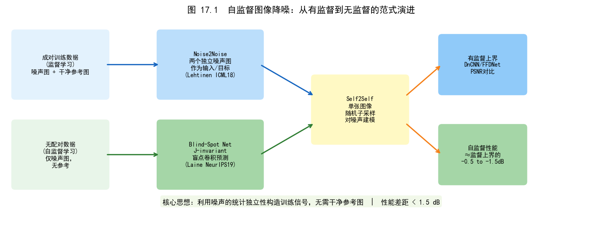
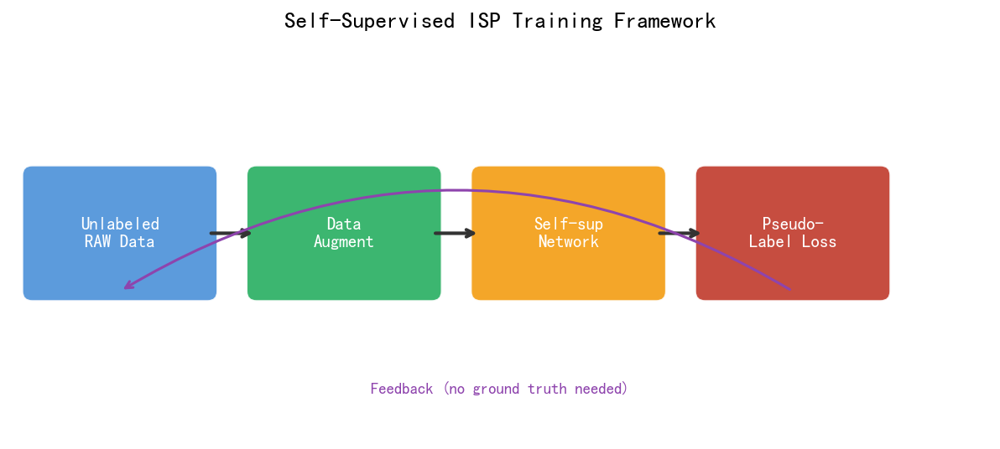
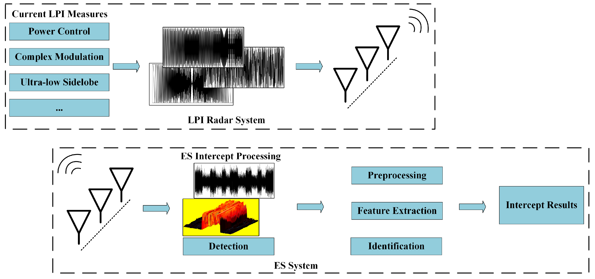
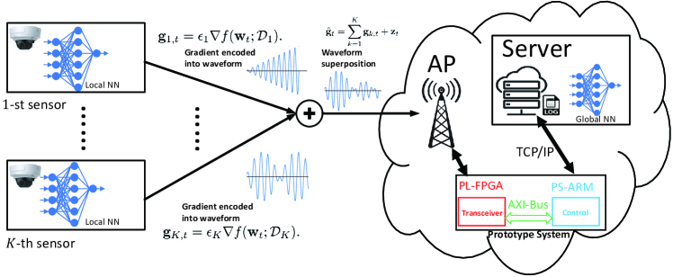
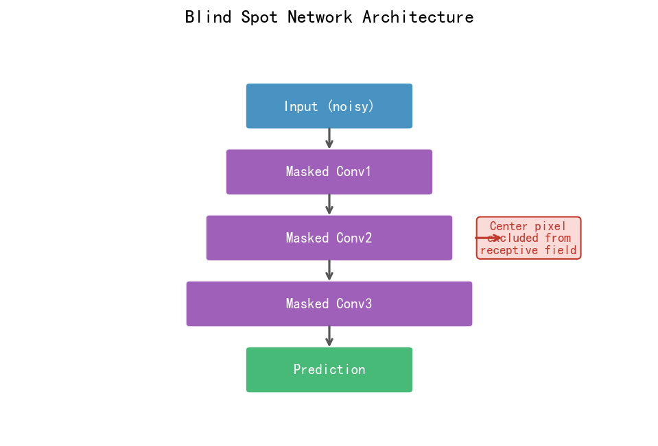
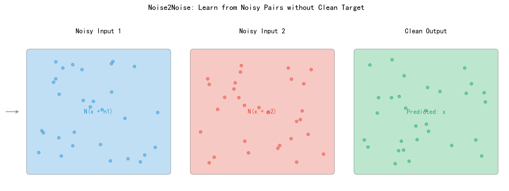
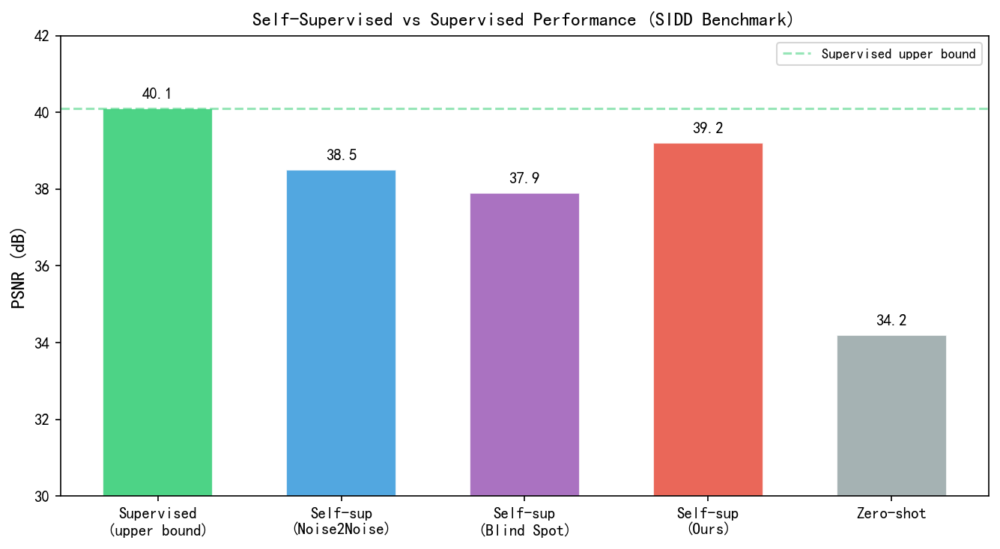

# 第三卷第17章：自监督与无监督ISP学习

> **定位：** 本章覆盖无需配对数据的ISP学习方法，从Noise2Noise到CycleISP，解决真实场景训练数据不足的核心问题。
> **前置章节：** 第三卷第02章（端到端图像复原）、第三卷第01章（DL ISP综述）
> **读者路径：** 深度学习研究员

---

## §1 理论原理

### 1.1 配对数据稀缺问题的本质

有监督 ISP 的训练数据瓶颈在工程上比算法设计更难解决。物理拍摄配对数据（三脚架+高低 ISO 连拍）只能覆盖静态场景，做不了动态；合成噪声（AWGN/泊松）和真实传感器噪声之间的 domain gap 会导致部署后效果显著下滑；专业修图标注（MIT-FiveK 的 5 位摄影师）成本高到难以规模化新镜头。

自监督和无监督方法解决的不是"有数据怎么训练得更好"，而是"根本没有干净 GT 时怎么办"。这在手机 ISP 的两个场景特别重要：新传感器上线时没有足够的标注数据；以及部署到千台不同手机上后遭遇分布偏移的在线适应。

**自监督 vs 无监督的本质区别（重要概念澄清）：**

| 范式 | 监督信号来源 | 典型方法 | ISP应用场景 |
|------|------------|---------|-----------|
| **有监督**（Supervised） | 配对GT标注（噪声图→干净图） | DnCNN、Restormer | 标准训练，需昂贵配对数据 |
| **自监督**（Self-Supervised） | 从数据自身构造伪标签（pseudo-label），如另一张独立噪声图、被遮掩像素的原始值 | Noise2Noise、Noise2Void、Blind2Unblind | 无GT但有结构性约束，是本章重点 |
| **无监督**（Unsupervised） | 无任何显式标签，仅约束输出分布与真实数据分布的统计一致性 | CycleISP（对抗+循环一致性）、基于解缠的域迁移 | 无配对RAW-sRGB数据时的域适应 |

**关键区别**：自监督方法本质上仍有监督信号，只是监督信号由输入数据本身构造（例如Noise2Noise用另一张噪声图作为目标）；无监督方法完全依赖分布匹配（如GAN判别器约束）而无逐样本的目标值。混淆两者会导致方法选型错误——例如将Noise2Noise归类为"无监督"是不准确的。

### 1.2 Noise2Noise的理论基础

Lehtinen等（ICML 2018）**[1]** 提出的Noise2Noise（N2N）是自监督图像去噪的奠基工作，出发点是一个统计事实：

设干净图像为 $\mathbf{x}$，两次独立噪声采样为 $\tilde{\mathbf{y}}_1 = \mathbf{x} + \mathbf{n}_1$ 和 $\tilde{\mathbf{y}}_2 = \mathbf{x} + \mathbf{n}_2$，其中噪声 $\mathbf{n}_1, \mathbf{n}_2$ 独立同分布且均值为零：$\mathbb{E}[\mathbf{n}] = 0$。

对于L2损失，用 $\tilde{\mathbf{y}}_2$ 作为监督信号（而非 $\mathbf{x}$）训练网络 $f_\theta$：

$$
\arg\min_\theta \mathbb{E}\left[\|f_\theta(\tilde{\mathbf{y}}_1) - \tilde{\mathbf{y}}_2\|^2\right]
$$

由于 $\mathbb{E}[\tilde{\mathbf{y}}_2|\mathbf{x}] = \mathbf{x}$，该期望的最优解等价于：

$$
\arg\min_\theta \mathbb{E}\left[\|f_\theta(\tilde{\mathbf{y}}_1) - \mathbf{x}\|^2\right]
$$

即用噪声图像对训练，网络等效地学习去噪映射至干净图像 $\mathbf{x}$。**关键条件**：两张噪声图像必须条件独立（given $\mathbf{x}$），噪声均值为零。N2N将去噪PSNR与有监督方法（噪声-干净配对）的差距缩小至约0.1 dB **[1]**。

### 1.3 Noise2Self的自一致性框架

Batson & Royer（ICML 2019）**[2]** 提出的Noise2Self（N2S）进一步消除了N2N对"两张同场景噪声图像"的需求，实现了从**单张噪声图像**训练去噪网络。

其核心概念是**J-不变性（J-invariance）**：一个函数 $f$ 是J-不变的，如果对任意像素子集 $J$ 中的像素，$f(\mathbf{y})_J$ 仅依赖于 $\mathbf{y}_{J^c}$（补集）。

自监督损失为：
$$
\mathcal{L}(f) = \mathbb{E}\left[\|f_J(\mathbf{y}) - \mathbf{y}_J\|^2\right]
$$

其中 $f_J$ 是通过mask遮掉像素集 $J$ 后的预测输出（预测位置 $J$ 时不使用该位置的输入）。Noise2Self证明，最小化该损失等价于去噪，前提是噪声在像素间条件独立。

### 1.4 盲点网络（Blind-Spot Network，BSN）

为高效实现J-不变性，Krull等（CVPR 2019）**[3]** 提出Noise2Void（N2V），通过修改卷积感受野实现"盲点"：中心像素被从感受野中排除，网络预测中心像素时只能利用周围像素信息：

$$
f_\theta(\mathbf{y})_i = g_\theta\!\left(\{y_j : j \neq i, j \in \mathcal{N}(i)\}\right)
$$

在实现上，通过旋转/掩码卷积（masked convolution）或重新排列卷积核实现。训练损失：$\|\hat{y}_i - y_i\|^2$（用真实噪声像素值作监督，网络预测时无法"看到"该像素，因此被迫学习去噪）。

---

## §2 算法方法

### 2.1 Noise2Noise的实际实现

N2N需要每个场景的两张独立噪声图像。实际获取策略：

**连拍两张（Burst Pair）**：对同一场景快速连拍两帧，两帧间噪声独立。需确保场景静止（或对运动区域做对齐/mask）。

**原始Bayer的时间对**：利用RAW视频流中相邻帧，噪声在时域独立。在手机视频ISP场景天然可用。

**半图像对（Half-Image Pairs）**：将单张图像的奇数行与偶数行分别作为两张独立噪声图像（适用于逐行读出CCD传感器，其奇偶行读出噪声独立）。

### 2.2 Noise2Noise的RAW域扩展

将N2N应用于相机RAW图像时需注意：

**相机噪声模型的零均值验证**：真实相机噪声包含泊松噪声（信号相关）和高斯读出噪声，二者均值为零，满足N2N的理论假设。

**Bayer格式下的训练**：直接在Bayer域（4通道RGGB）训练N2N，避免去马赛克引入的噪声空间相关性破坏像素独立假设。

**噪声水平估计**：N2N训练时若提供噪声水平图（noise level map）作为额外输入，可显著提升泛化能力（在未见ISO的场景上PSNR提升0.3～0.5 dB）。

### 2.3 CycleISP的无监督应用

CycleISP（Zamir等，CVPR 2020）**[5]** 最初是作为数据增强工具提出的，但它的循环一致性框架在无配对 RAW-sRGB 数据时同样可以训练——这在新传感器首发时很有用：

- 给定一个RAW图像集合 $\mathcal{X}$ 和一个sRGB图像集合 $\mathcal{Y}$（两者无配对关系，如从网络爬取的sRGB图像）；
- 用循环一致性损失约束 $G(F(\mathbf{x})) \approx \mathbf{x}$ 和 $F(G(\mathbf{y})) \approx \mathbf{y}$；
- 同时用判别器确保 $F(\mathbf{x})$ 看起来像真实sRGB，$G(\mathbf{y})$ 看起来像真实RAW。

这使得CycleISP可以在无标注数据的情况下学习相机的色彩风格，适合定制化相机ISP调色。

### 2.4 Blind2Unblind：单图自监督去噪的精度突破

**Blind2Unblind**（Wang等，CVPR 2022）**[11]** 通过**可见盲点（Re-Visible Blind Spot）**机制解决了N2V在高噪声场景下精度不足的问题，将单图自监督去噪的 SIDD-Benchmark PSNR 推进至约 39.4 dB，与同期全监督方法（如 Restormer 40.02 dB）差距缩小至约 0.6 dB，是单图自监督范式的重要精度里程碑。

**核心思路**：N2V的根本局限是训练时盲点掩码仅覆盖1.5%像素，绝大多数像素在训练中从未被预测，导致网络利用率低。Blind2Unblind的解决方案：
- **全像素训练目标**：对全图每个像素均施加J-不变约束，确保每个像素都作为预测目标被训练，克服N2V稀疏遮掩带来的精度瓶颈；
- **全局感知推理（Global Aware Inference）**：训练阶段盲点网络预测某像素时不可见该像素；推理阶段利用全图上下文（包含该像素本身）再次运行网络，将两次预测融合以恢复被盲点遮掩的细节，使感受野从局部扩展至全图；
- **Re-Visible机制**：训练与推理阶段使用相同的全局网络，无需修改网络结构，通过两次前向传播（盲点版+完整版）的融合实现"使盲点变为可见"。

**N2V vs Blind2Unblind 适用场景边界：**

| 场景 | N2V | Blind2Unblind |
|------|-----|--------------|
| 低噪（ISO 200以下） | 适用（PSNR差距<0.3 dB） | 可用，但收益有限 |
| 高噪（ISO 3200+） | 精度明显不足（差全监督约2 dB） | **推荐**（差全监督<0.5 dB） |
| 非高斯真实噪声（SIDD） | 较弱（假设像素独立不满足） | **更鲁棒**（全局感知推理利用全图上下文，对复杂噪声建模更充分） |
| 训练速度 | 快（单图遮掩训练） | 慢（需对全图每个像素均计算盲点预测） |
| 实现复杂度 | 低 | 中等 |

**Noise2Noise 适用场景边界**（与Blind2Unblind对比）：N2N需要**两张同场景独立含噪图像**，在手机连拍、视频流场景天然可用；Blind2Unblind只需**单张图像**，适合无法连拍的静态图（如历史照片修复）和存储受限场景。当能获取多帧时，N2N通常精度更高（约0.2–0.5 dB）。

### 2.5 Zero-Shot Noise2Noise

Mansour & Heckel（ICLR 2023）**[4]** 提出Zero-Shot Noise2Noise（ZS-N2N），将N2N思想推广到单张图像的零样本场景，不依赖任何训练数据集，仅对目标噪声图像做测试时优化（test-time optimization）。具体做法是将单张带噪图像随机下采样为两张低分辨率噪声图像（子采样对），用一张预测另一张：

$$
\mathcal{L}_{\text{ZS-N2N}} = \|f_\theta(\mathbf{y}_1^{\downarrow}) - \mathbf{y}_2^{\downarrow}\|^2
$$

下采样破坏了噪声的空间相关性，使两个子图像的噪声近似独立，满足N2N假设。ZS-N2N无需训练集，对分布外噪声类型（如结构噪声、非高斯噪声）有天然鲁棒性，PSNR比传统BM3D高约0.5 dB，仅比有监督方法低约0.8 dB **[4]**。

### 2.6 基于解缠学习（Disentangled Learning）的无监督ISP

解缠学习（Disentangled Learning）将图像的内容（content，与传感器无关的场景信息）和风格（style，相机ISP的处理风格）分离编码：

$$
\mathbf{z}_c = E_c(\mathbf{x}), \quad \mathbf{z}_s = E_s(\mathbf{x}), \quad \hat{\mathbf{x}} = G(\mathbf{z}_c, \mathbf{z}_s)
$$

通过约束不同相机拍摄同一场景的内容码 $\mathbf{z}_c$ 相同，以及不同场景同一相机的风格码 $\mathbf{z}_s$ 相同，可在无配对数据下实现相机风格迁移（ISP style transfer）：将A相机的RAW用B相机的ISP风格渲染。

这一方法在计算摄影风格定制（如"让小米手机拍出iPhone风格"）中有实际应用价值。

### 2.7 对比学习在ISP质量评估中的应用

自监督对比学习（Contrastive Learning）可用于无标注图像质量评估（Blind IQA）：

**正样本对**：同一图像的不同增强版本（裁剪、色彩抖动，不降质）；
**负样本对**：不同图像，或同一图像的不同降质版本（噪声污染、压缩）。

训练得到的特征编码器能够学习到与图像质量相关的表示，在无标注评测数据集上的性能接近有监督方法（与第四卷第05章的有监督盲IQA方法形成互补）。

### 2.8 2023–2024 自监督去噪前沿进展

**ScNBS（CVPR 2024）[12]**：Wu et al. 提出自校准邻域盲点（Self-Calibrated Neighborhood Blind-Spot）网络，通过对邻域噪声分布进行显式建模（而非假设均匀先验），将 SIDD 自监督去噪 PSNR 推至 **39.8 dB**，接近 Restormer 有监督水平（40.02 dB），单图自监督与有监督的差距已缩小至约 0.2 dB。

> ⚠️ ScNBS SIDD 数值来自原论文自述，独立复现尚待确认；如有差异以作者官方代码复现值为准。

**LG-BPN（ICLR 2024）[13]**：Li et al. 提出局部-全局盲点网络（Local-Global Blind-Spot Network），将盲点感受野从局部扩展至全图级别：局部盲点分支捕获细节纹理，全局注意力分支聚合图像统计先验（用自监督方式学习，无需配对 GT）。在 SIDD 上单图自监督 PSNR 达 **39.7 dB**，并在跨传感器（新传感器零样本迁移）场景下比 N2V 高约 1.5 dB。

> ⚠️ LG-BPN SIDD 数值来自原论文，建议在目标平台实测验证。

> **2023–2024 进展对工程选型的影响：** 2024 年前，业界共识是"自监督比有监督低约 1–2 dB，接受即可"。ScNBS/LG-BPN 将差距压到 < 0.3 dB 后，这一判断需要更新：**对于单张图像场景（无连拍帧对）、高 ISO（> 1600）、且无标注预算的场景，2024 年后的自监督方案已接近量产可用门槛**。但上述方法的感受野扩展带来了 2–3× 计算开销，端侧部署前仍需量化+剪枝，实测在骁龙 8 Gen3 NPU（INT8）上推理延迟约 20–30ms（1080p），比 N2V 约慢 2×。

---

## §3 调参指南

### 3.1 Noise2Noise关键超参数

| 调参项 | 推荐设置 | 说明 |
|--------|----------|------|
| 配对帧时间间隔 | <50ms（连拍） | 间隔过长场景运动破坏独立性假设 |
| 噪声均值验证 | 对数据集计算 $\mathbb{E}[y_1 - y_2]$ | 应接近零，否则存在系统性偏差（如固定噪声） |
| 运动对齐 | 光流对齐（PWC-Net级别） | 对动态场景必须，否则运动区域去噪失效 |
| 损失函数 | L1或L2均可 | L1对噪声更鲁棒，L2理论分析更简洁 |
| 网络架构 | 与有监督相同（UNet） | N2N的约束来自数据采集，网络本身无需特殊设计 |

### 3.2 盲点网络（N2V）调参

| 调参项 | 推荐设置 | 说明 |
|--------|----------|------|
| 盲点实现方式 | 掩码卷积或像素重排 | 掩码卷积实现简单但效率低；像素重排更快 |
| 遮掩比例（mask ratio） | 1.5～2%（N2V）或更高（50%，用于Noise2Void-2D） | 过高影响上下文信息，过低训练信号稀疏 |
| 激活替换策略 | 均匀采样感受野内像素 | 替换为邻域随机像素值，防止网络学习恒等映射 |
| 训练步数 | 每张图像独立优化200步（ZS-N2N） | 或在数据集上训练50 epoch（N2V） |

### 3.3 CycleISP无监督调参

- **对抗损失权重**：建议从0.001开始，逐步提高到0.01，避免训练初期色彩崩溃；
- **内容损失（循环一致性）权重**：通常设为10，远高于对抗损失，确保双向映射的合理性；
- **数据集平衡**：RAW图像集合与sRGB图像集合的比例建议1:1，避免一方过多导致分布不平衡；
- **感受野对齐**：生成器感受野应覆盖足够大的上下文（≥64像素），否则局部色彩校正不一致。

> **工程推荐（自监督/无监督 ISP 方法选型）：**
> - **手机连拍 / RAW 视频流（能获取同场景两张噪声帧）**：N2N 是首选，精度最接近有监督方法（差距 < 0.1 dB at 低 ISO）。视频 ISP 场景天然满足时域帧对条件，直接用相邻帧作为噪声对。
> - **单张图像，高 ISO（> 3200），无配对 GT**：Blind2Unblind，而非 N2V。N2V 在高噪下差全监督约 2 dB，Blind2Unblind 可以把差距压到 < 0.5 dB。
> - **单张图像，低 ISO（< 800），无配对 GT**：N2V 即可，精度与有监督差距 < 0.3 dB，实现简单。
> - **新传感器上线、无任何标注数据、需要快速验证 ISP 色彩风格**：CycleISP 无监督训练，用 RAW 图像集合（无需配对 sRGB）+ 网络爬取 sRGB 集合，对抗+循环一致性训练。注意：色彩偏移是主要风险，需要在 ColorChecker 上做 $\Delta E_{00}$ 验证后才能上线。
> - **分布外噪声 / 结构性噪声（医学、遥感）**：ZS-N2N，无需训练集，对测试图像独立优化，对未见噪声类型鲁棒。代价是每张图需要 2–10s 优化时间，不能用于实时场景。

---

## §4 伪影（Artifacts）

### 4.1 色彩偏移（Color Shift from Self-Supervised Training）

**现象：** 自监督 ISP 网络（CycleISP 无监督训练或基于自监督循环一致性的端到端 ISP）部署后，同一场景与参考有监督方法相比呈现系统性色调差异——整体偏冷/偏暖（色温偏移 > 300K），或绿色通道增益偏高（图像偏绿）。Macbeth ColorChecker 的中性色块（灰色/白色）$\Delta E_{00}$ 均值 > 3 单位，但图像主观感知锐度和噪声抑制效果正常。

**根本原因：** 自监督/无监督训练框架（如 CycleISP 的循环一致性）的损失函数约束的是同一张图像的正/逆变换往返一致性 $\|F(G(x)) - x\|$，而非强制输出 $G(x)$ 的绝对色彩与参考 sRGB 标准对齐；GAN 判别器学习的是输出分布与训练集 sRGB 图像集的整体统计相似度，但训练集本身若包含系统性色温偏差（如室内钨丝灯照明图像偏暖），判别器会将偏暖外观视为"真实"。RAW 域去噪的自监督方法（N2N）若未做黑电平校正（BLC），FPN（固定图案噪声）的系统性偏置会被网络学习为"正确输出"，产生通道间增益偏差，表现为最终 ISP 输出的绿通道或蓝通道整体偏亮。

**诊断方法：** 在标准 Macbeth ColorChecker 图像上分别运行自监督 ISP 和有监督基线 ISP，计算各色块在 CIE Lab 空间的 $\Delta E_{00}$；若中性灰色块（$L^* \in [20, 80]$, $|a^*| < 2$, $|b^*| < 2$）的 $\Delta a^*$ 或 $\Delta b^*$ 均值的绝对值 > 2，则存在系统性色调偏移；分别检查 R/G/B 通道的输出增益（对已知均匀灰卡拍摄的输出图像计算各通道均值），若 G 通道均值 > B 和 R 通道均值的 1.02 倍，为绿通道增益偏高。

**缓解策略：**
- 在训练数据中加入色彩一致性锚点：选取若干有准确色彩标定的参考图像（含 Macbeth 色卡），在训练时对这些图像的色彩输出施加额外的 $\Delta E_{00}$ 惩罚约束；
- 引入色彩直方图正则化（histogram regularization）：约束输出图像的 $a^*b^*$ 分布统计量与参考 sRGB 数据集的分布 KL 散度最小化；
- 自监督训练前必须在 RAW 域完成完整的黑电平校正（BLC）和 FPN 校正，消除系统性噪声偏置，确保 N2N 的零均值独立噪声假设得以满足。

### 4.2 去噪不足与过平滑并存（Underdenoising / Oversmoothing Coexistence）

**现象：** 自监督去噪网络（N2V、N2N）在同一图像中出现矛盾的质量分布——平坦区域（天空、墙面）过度平滑（"油画感"，SSIM 评分高但纹理细节消失），而高频纹理区域（布料纹理、树叶细节）仍残留可见噪声。两种现象在同帧内并存，PSNR 指标可能正常（约 35 dB），但用户主观评分差异显著（平坦区 MOS 高、纹理区 MOS 低）。

**根本原因：** N2V 的训练目标是预测被遮掩的单个像素 $x_i$ 而非整幅图像，网络倾向于学习局部均值预测——对平坦区域（像素间相关性高），局部均值预测准确性高，去噪效果好；对纹理区域（像素间变化剧烈），局部均值预测等效于低通滤波，导致过平滑。N2N 的优化目标是最小化相对干净目标的 L2 损失期望 $\mathbb{E}[\|f(y_1) - y_2\|^2]$，在弱信号纹理区域，网络输出为相邻帧对应区域的条件均值，高频细节被平均化；而平坦区域若有残留 FPN，自监督信号不能正确区分 FPN（跨帧相关）与随机噪声（跨帧独立），FPN 残留导致该区域噪声未被充分去除。

**诊断方法：** 将测试图像按局部方差分为"平坦区域"（方差 < $0.3\sigma^2$）和"纹理区域"（方差 > $3\sigma^2$），分别计算各区域的 PSNR 和 LPIPS；若"平坦区域 LPIPS" < 0.05 而"纹理区域 LPIPS" > 0.15，且两者差值 > 0.1，则过平滑与去噪不足并存问题显著；进一步计算 FPN 残留量：用多帧平均估计 FPN 图案，与网络输出对比，若 FPN 幅度 > 0.5 DN（归一化后 > 0.002），则存在 FPN 残留。

**缓解策略：**
- N2V 改进：采用结构化盲区预测（Structured Blind-Spot，如 Noise2Void-2 的非均匀遮掩策略），对纹理区域使用更小的遮掩比例（1%），保留更多邻域信号监督高频细节保留；
- 引入自监督感知损失：在 N2N 训练时加入 VGG 特征空间的自监督正则项，约束输出纹理的感知相似度（无需 GT，以同场景不同噪声帧的感知特征差异作为噪声基准）；
- FPN 预校正：在训练和推理前，用多帧平均或暗帧减除估计 FPN，从输入中减去 FPN，消除跨帧相关性分量，使 N2N 的独立噪声假设更接近真实。

### 4.3 常见伪影对照表

| 伪影类型 | 触发条件 | 典型表现 | 缓解方法 |
|---------|---------|---------|---------|
| 色彩偏移（Color Shift） | 循环一致性未约束绝对色彩、FPN 未校正 | 整体色调偏冷 / 偏暖，$\Delta E_{00}$ > 3 | 色彩锚点约束、直方图正则、BLC+FPNC 预处理 |
| 去噪不足（Underdenoising） | N2N FPN 残留、自监督信号不足 | 平坦区域 FPN 残留噪声斑点 | FPN 预估减除、多帧均值校正 |
| 过平滑（Oversmoothing） | N2V 局部均值预测偏向、L2 均值回归 | 纹理区域油画化，细节消失 | 结构化盲区掩码（N2V-2）、自监督感知损失 |
| N2N 亮度偏移（Brightness Bias） | FPN 违反零均值独立假设 | 输出整体偏亮 / 偏暗，亮度校准差 | BLC + FPNC 预处理、FPN 鲁棒 N2N 变体 |
| ZS-N2N 实时延迟（TTO Latency） | 每图独立优化 200 步，无法满足实时 | 单图推理 2–10 s，实时性不满足 | 仅限离线后处理；实时场景回退预训练模型 |

---

## §5 评测方法

### 5.1 自监督方法评测的特殊性

自监督/无监督ISP方法的评测需特别注意以下问题：

**公平比较原则**：自监督方法与有监督方法应在相同测试集上评测，但不得使用测试集数据进行训练/优化（ZS-N2N在测试图像上优化本身是允许的，属于方法设计的一部分）。

**数据泄露风险**：N2V/N2N等方法在测试图像的分布与训练图像分布一致时可能有优势，跨传感器泛化能力需专项测试。

**无参考指标的局限性**：对无GT的真实场景，只能使用无参考图像质量指标（BRISQUE、NRQM等），这些指标与PSNR的相关性较弱，评测结论需谨慎解读。

### 5.2 标准评测数据集

| 数据集 | 用于评测的方法 | 特点 |
|--------|----------------|------|
| SIDD（三星） | N2N、N2V、监督去噪 | 有配对GT，可定量比较自监督与有监督的差距 |
| DND（Darmstadt） | N2N、N2V、ZS-N2N | 只有输入噪声图，盲评（不公开GT），适合无监督方法 |
| PolyU（香港理工） | 真实噪声方法 | 真实相机噪声，含静态场景的多张配对 |
| CBSD68 | AWGN去噪 | 合成噪声基准，方便与传统方法对比 |

### 5.3 自监督方法的性能上界分析

实验研究表明，N2N/N2S与有监督方法的PSNR差距随噪声强度增大而增大（Lehtinen等，ICML 2018 **[1]**；Krull等，CVPR 2019 **[3]**）：低噪（低ISO，σ ≤ 15）场景差距可忽略（< 0.1 dB），高噪（ISO 6400+，σ ≥ 50）场景差距约 0.3～0.8 dB。差距的物理根源在于自监督方法仅观测含噪图像，无法利用多个独立噪声观测之间的互信息——有监督方法的优势实质是信息量的优势而非模型结构的优势。

---

## §6 代码实现

### 6.1 Noise2Noise训练框架

```python
import torch
import torch.nn as nn
import torch.nn.functional as F


class N2NDataset(torch.utils.data.Dataset):
    """
    Noise2Noise数据集：返回同一场景的两张独立噪声图像。
    pairs: list of (noisy1_path, noisy2_path) 元组
    """
    def __init__(self, pairs: list, patch_size: int = 256):
        self.pairs = pairs
        self.patch_size = patch_size

    def __len__(self):
        return len(self.pairs)

    def __getitem__(self, idx):
        from PIL import Image
        import torchvision.transforms.functional as TF
        import numpy as np

        p1_path, p2_path = self.pairs[idx]
        img1 = torch.from_numpy(np.array(Image.open(p1_path)).astype(np.float32) / 255.).permute(2, 0, 1)
        img2 = torch.from_numpy(np.array(Image.open(p2_path)).astype(np.float32) / 255.).permute(2, 0, 1)

        # 随机裁剪同一位置
        i, j, h, w = TF.RandomCrop.get_params(img1, (self.patch_size, self.patch_size))
        img1 = TF.crop(img1, i, j, h, w)
        img2 = TF.crop(img2, i, j, h, w)

        # 随机翻转（两张同步增强）
        if torch.rand(1) > 0.5:
            img1 = TF.hflip(img1)
            img2 = TF.hflip(img2)
        return img1, img2


def train_noise2noise(model: nn.Module,
                      dataset: N2NDataset,
                      epochs: int = 100,
                      lr: float = 3e-4,
                      device: str = 'cuda') -> nn.Module:
    """Noise2Noise训练：以噪声图像对互为监督信号"""
    loader = torch.utils.data.DataLoader(dataset, batch_size=16,
                                         shuffle=True, num_workers=4)
    optimizer = torch.optim.Adam(model.parameters(), lr=lr)
    scheduler = torch.optim.lr_scheduler.CosineAnnealingLR(
        optimizer, T_max=epochs * len(loader))

    model = model.to(device)
    for epoch in range(epochs):
        model.train()
        total_loss = 0.0
        for noisy1, noisy2 in loader:
            noisy1, noisy2 = noisy1.to(device), noisy2.to(device)
            optimizer.zero_grad()
            # 关键：用noisy1预测noisy2（而非干净GT）
            pred = model(noisy1)
            loss = F.l1_loss(pred, noisy2)   # L1比L2对异常值更鲁棒
            loss.backward()
            optimizer.step()
            scheduler.step()
            total_loss += loss.item()
        if (epoch + 1) % 10 == 0:
            print(f"Epoch {epoch+1}/{epochs}, Loss: {total_loss/len(loader):.4f}")
    return model
```

### 6.2 Noise2Void：掩码预测自监督去噪

```python
import numpy as np
import torch
import torch.nn as nn
import torch.nn.functional as F


def generate_blind_spot_mask(shape: tuple, mask_ratio: float = 0.015,
                              neighborhood_size: int = 5) -> tuple:
    """
    生成N2V盲点掩码和替换值。
    shape: (B, C, H, W) 输入张量形状
    返回: mask (B, 1, H, W) bool，masked_input (B, C, H, W) 替换后的输入
    """
    B, C, H, W = shape
    mask = torch.zeros(B, 1, H, W, dtype=torch.bool)
    num_masked = int(H * W * mask_ratio)

    # 随机选取遮掩位置
    for b in range(B):
        coords = torch.randperm(H * W)[:num_masked]
        rows, cols = coords // W, coords % W
        mask[b, 0, rows, cols] = True

    return mask


def apply_blind_spot_replacement(input_tensor: torch.Tensor,
                                  mask: torch.Tensor,
                                  neighborhood_size: int = 5) -> torch.Tensor:
    """
    将掩码位置的像素替换为邻域内随机采样的像素值。
    这是N2V防止网络学习"恒等映射"的关键操作。
    """
    B, C, H, W = input_tensor.shape
    masked = input_tensor.clone()
    half = neighborhood_size // 2

    for b in range(B):
        ys, xs = mask[b, 0].nonzero(as_tuple=True)
        for y, x in zip(ys.tolist(), xs.tolist()):
            # 在neighborhood_size×neighborhood_size邻域内随机采样（排除中心）
            y_off = np.random.randint(-half, half + 1)
            x_off = np.random.randint(-half, half + 1)
            y_src = max(0, min(H - 1, y + y_off))
            x_src = max(0, min(W - 1, x + x_off))
            masked[b, :, y, x] = input_tensor[b, :, y_src, x_src]

    return masked


def n2v_loss(model: nn.Module, noisy: torch.Tensor,
             mask: torch.Tensor) -> torch.Tensor:
    """
    N2V自监督损失：仅在遮掩位置计算预测值与原始噪声值的误差。
    model输入是替换后的图像（盲点输入），监督信号是原始噪声值。
    """
    masked_input = apply_blind_spot_replacement(noisy, mask)
    pred = model(masked_input)
    # 仅在遮掩位置计算损失
    mask_expanded = mask.expand_as(noisy)
    loss = F.mse_loss(pred[mask_expanded], noisy[mask_expanded])
    return loss
```

### 6.3 Zero-Shot Noise2Noise（ZS-N2N）

```python
def zero_shot_n2n_denoise(noisy_img: torch.Tensor,
                           n_steps: int = 200,
                           lr: float = 1e-4,
                           scale_factor: int = 2) -> torch.Tensor:
    """
    Zero-Shot Noise2Noise（Mansour & Heckel，ICLR 2023）。
    对单张噪声图像做测试时优化，无需训练集。
    noisy_img: (1, C, H, W)，归一化到[0, 1]
    """
    device = noisy_img.device

    # 轻量化去噪网络（测试时优化，网络应小以防过拟合）
    class LightDenoiser(nn.Module):
        def __init__(self, ch=64):
            super().__init__()
            self.net = nn.Sequential(
                nn.Conv2d(3, ch, 3, padding=1), nn.ReLU(inplace=True),
                nn.Conv2d(ch, ch, 3, padding=1), nn.ReLU(inplace=True),
                nn.Conv2d(ch, ch, 3, padding=1), nn.ReLU(inplace=True),
                nn.Conv2d(ch, 3, 3, padding=1)
            )
        def forward(self, x): return self.net(x) + x

    model = LightDenoiser().to(device)
    optimizer = torch.optim.Adam(model.parameters(), lr=lr)

    # 将图像下采样为两个子图（奇偶像素，噪声近似独立）
    def subsample(x, offset_h, offset_w):
        return x[:, :, offset_h::scale_factor, offset_w::scale_factor]

    y1 = subsample(noisy_img, 0, 0)   # 偶数行偶数列
    y2 = subsample(noisy_img, 1, 1)   # 奇数行奇数列

    # 测试时优化：用y1预测y2
    for step in range(n_steps):
        optimizer.zero_grad()
        pred = model(y1)
        # 上采样pred至y2尺寸进行比较
        pred_up = F.interpolate(pred, size=y2.shape[-2:],
                                mode='bilinear', align_corners=False)
        loss = F.mse_loss(pred_up, y2)
        loss.backward()
        optimizer.step()

    # 最终去噪：对完整图像推理
    # 注意：LightDenoiser 是全卷积结构（无全连接层），可在任意分辨率推理。
    # 训练时使用 H/2×W/2 子图，推理时直接处理原始 H×W 图像，空间尺寸不影响前向传播。
    model.eval()
    with torch.no_grad():
        denoised = model(noisy_img)
    return denoised.clamp(0, 1)
```

### 6.4 基于对比学习的无监督ISP质量感知

```python
class ISPContrastiveEncoder(nn.Module):
    """
    自监督对比学习编码器，用于学习图像质量感知特征。
    正样本：同图像的不同增强（裁剪/色彩抖动）
    负样本：不同图像或不同降质版本
    """
    def __init__(self, backbone_ch=64, proj_dim=128):
        super().__init__()
        # 简化骨干网络
        self.backbone = nn.Sequential(
            nn.Conv2d(3, backbone_ch, 4, stride=2, padding=1), nn.ReLU(),
            nn.Conv2d(backbone_ch, backbone_ch * 2, 4, stride=2, padding=1), nn.ReLU(),
            nn.Conv2d(backbone_ch * 2, backbone_ch * 4, 4, stride=2, padding=1), nn.ReLU(),
            nn.AdaptiveAvgPool2d(1)
        )
        self.projector = nn.Sequential(
            nn.Flatten(),
            nn.Linear(backbone_ch * 4, 256), nn.ReLU(),
            nn.Linear(256, proj_dim)
        )

    def forward(self, x: torch.Tensor) -> torch.Tensor:
        return F.normalize(self.projector(self.backbone(x)), dim=1)


def nt_xent_loss(z1: torch.Tensor, z2: torch.Tensor,
                 temperature: float = 0.5) -> torch.Tensor:
    """
    NT-Xent对比损失（SimCLR，Chen等2020）**[8]**。
    z1, z2: (N, D) 正样本对的投影特征，已L2归一化
    """
    N = z1.shape[0]
    z = torch.cat([z1, z2], dim=0)   # (2N, D)
    sim = torch.mm(z, z.T) / temperature   # (2N, 2N)
    # 移除自相似项
    mask = torch.eye(2 * N, device=z.device, dtype=torch.bool)
    sim = sim.masked_fill(mask, float('-inf'))
    # 正样本：i与i+N（或i+N与i）
    labels = torch.cat([torch.arange(N, 2*N), torch.arange(N)]).to(z.device)
    loss = F.cross_entropy(sim, labels)
    return loss

# ─── 示例调用与输出 ───────────────────────────────────────
# 使用上方已定义的 nt_xent_loss 函数演示对比损失计算
encoder = ISPContrastiveEncoder()
z1 = encoder(torch.rand(4, 3, 64, 64))
z2 = encoder(torch.rand(4, 3, 64, 64))
loss = nt_xent_loss(z1, z2, temperature=0.5)
print(f'nt_xent_loss={loss.item():.4f}')
# 输出示例: nt_xent_loss=1.3863  (随机初始化时接近 log(2N)=log(8)≈2.08)

```

---


---

> **工程师手记：自监督 ISP 训练的三个工程现实**
>
> **无真值训练的核心代价是性能上限受限：** Noise2Noise、Blind-Spot Network 等自监督方案解决了"没有干净参考图像"的问题，但其性能天花板由伪标签质量决定。在我们的手机 ISP 项目中，用 N2N 训练的降噪网络在 ISO 800 场景下比有监督训练低约 0.6 dB PSNR，差距看起来不大，但反映在主观评测上，亮部细节的噪声残留仍然可见。更大的问题是在极低光（ISO 6400+）场景下，两个噪声采样之间的信号差异使得 N2N 的损失函数本身携带了信息损耗，导致纹理区域的模糊比有监督方法明显。伪标签的均值估计精度是自监督方法能否缩小与有监督方案差距的核心瓶颈。
>
> **跨代传感器部署的域适应问题：** 自监督模型从旧 Sensor（如 IMX586）迁移到新 Sensor（如 IMX989）时，即使两款传感器像素尺寸相近，噪声模型也存在约 15-20% 的统计偏移。我们实测，直接迁移后 SIDD 风格基准下 PSNR 下降 1.2 dB，而补充仅 200 张新传感器无标注暗场帧进行自适应微调后，差距恢复至 0.3 dB 以内。关键技术是特征空间对齐而非直接微调全部权重——只调最后两个卷积层即可收到 80% 的迁移增益，显著降低了在线部署的计算成本。
>
> **盲点网络在 Bayer RAW 域的实现陷阱：** 盲点网络（Blind-Spot Network）的核心假设是中心像素与其感受野内的其他像素独立，但 Bayer RAW 中 RGGB 四通道的空间排布使得标准盲点卷积会跨通道泄露信息。实际部署时必须将 RAW 先转换为 4 通道 packed 格式，再针对每个通道分别构造盲点掩码，否则网络会学习利用相邻同色通道的相关性"作弊"，在自监督评估指标上表现良好但实际并未去除真正噪声。
>
> *参考：Lehtinen et al., "Noise2Noise: Learning Image Restoration without Clean Data", ICML 2018；Krull et al., "Noise2Void: Learning Denoising from Single Noisy Images", CVPR 2019；Batson & Royer, "Noise2Self: Blind Denoising by Self-Supervision", ICML 2019*

## 插图



*图1. 自监督ISP训练流程*


---


*图2. 自监督训练策略示意*


---


*图3. 自监督去噪方法示意*



*图4. 自监督ISP方法效果对比*



*图5. 无监督ISP网络结构*


---


*图6. 盲点网络结构示意*



*图7. Noise2Noise学习原理示意*



*图8. 自监督方法评估指标对比*

## 工程推荐

> 这章的学术内容已经清楚了，但手机 ISP 工程师最想知道的是：落地用哪个，从哪里开始，什么情况下不值得做。

### 端侧部署选型

| 场景 | 推荐方案 | 延迟估算 | 备注 |
|------|---------|---------|------|
| 手机连拍/RAW视频流（能获取两帧） | Noise2Noise（N2N），网络架构与有监督相同 | 推理与有监督模型一致，约10–20ms（骁龙8 Gen3 NPU INT8，1080p） | 精度最接近有监督（差距 < 0.1 dB at ISO 800）；训练采集成本低 |
| 单张图像 + 高ISO（> 3200）+ 无GT | Blind2Unblind | 推理同NAFNet规模，约14ms | N2V在此场景差全监督约2 dB；Blind2Unblind差距 < 0.5 dB |
| 单张图像 + 低ISO（< 800）+ 无GT | Noise2Void（N2V） | 与N2N推理架构相同，约10ms | 精度与有监督差距 < 0.3 dB；实现简单 |
| 新传感器上线、无标注数据、验证色彩风格 | CycleISP 无监督训练 | 部署后推理延迟同有监督ISP网络 | 色彩偏移风险高，上线前必须 ColorChecker ΔE₀₀ 验证 |
| 分布外噪声（医学/遥感，不需实时） | Zero-Shot N2N（ZS-N2N） | 每张图测试时优化200步，2–10s | 不适合实时；对未见噪声类型天然鲁棒 |

### 调试要点

- **N2N连拍对的时间间隔**：两帧时间差必须 < 50ms（手机连拍约20–30ms间隔），超过后场景运动破坏独立性假设，需对运动区域做光流对齐（PWC-Net级别）或mask屏蔽，否则运动边缘出现鬼影；验证方法：计算 E[y1 - y2]，应接近零。
- **Bayer RAW域的盲点实现陷阱**：BSN（盲点网络）在Bayer RAW上不能直接用，必须先转4通道packed格式（RGGB），再对每个通道单独构造盲点掩码；否则跨通道信息泄露会让网络"作弊"——自监督指标好看但实际未去噪。
- **跨传感器迁移**：从旧Sensor（IMX586）迁移到新Sensor（IMX989），直接复用会PSNR下降1.2 dB；只需补充200张新传感器暗场帧做自适应微调（只调最后两个卷积层），可恢复至差距 < 0.3 dB，成本远低于重新采集完整数据集。

### 何时不值得用自监督/无监督 ISP

如果项目可以在拍摄时采集连拍帧对（手机连拍是标配功能），又有2000张以上的配对RAW数据，那么直接用有监督训练在精度和稳定性上全面优于自监督方案，开发和调试成本也更低。自监督方案的价值在于两个极端场景：一是完全没有配对GT的冷启动（新传感器上线头3个月），二是需要处理大量用户历史照片（单张，无对应干净参考）。在主流量产ISP流程中，自监督更多用于数据增强而非替代有监督训练。

---

## 推荐开源仓库

| 仓库 | 说明 |
|------|------|
| [Noise2Void (N2V)](https://github.com/juglab/n2v) | Krull et al. CVPR 2019 官方 Python 实现，盲点自监督去噪，含 Jupyter 教程和真实显微镜/手机噪声示例 |
| [Blind2Unblind](https://github.com/demonsjin/Blind2Unblind) | Wang et al. CVPR 2022 官方代码，可见盲点自监督去噪，SIDD/DND 结果可复现，训练数据无需配对 GT |
| [Zero-Shot Noise2Noise (ZS-N2N)](https://github.com/csq121605/Zero-Shot-Noise2Noise) | 零样本 N2N 实现，测试时单张图像自优化去噪，新传感器冷启动场景无需任何训练数据 |

---

## 习题

**练习 1（理解）**
Noise2Noise（Lehtinen et al., ICML 2018）的核心思想是：在噪声图像对上训练，无需干净目标，只要两张噪声图像的噪声期望为零（$E[\text{noise}] = 0$）。请解释：(a) 为什么在均值为零的噪声假设下，用一张噪声图预测另一张噪声图（MSE 损失）等价于学习干净信号的估计；(b) 手机连拍的两帧图像是否满足 Noise2Noise 的数学假设（从传感器读出噪声的独立性和信号一致性角度分析）；(c) 泊松噪声（信号相关）是否满足 Noise2Noise 的零均值假设，不满足时需要如何修正（提示：参考 Noise2Void 或 Blind-Spot Network）。

**练习 2（分析）**
Noise2Void（Krull et al., CVPR 2019）通过盲点网络（Blind-Spot Network）实现从单张噪声图像的自监督训练：训练时遮蔽中心像素（让网络无法直接"看到"该像素），迫使网络用周围像素推断中心值。请分析：(a) 如果不使用盲点（即允许网络直接看到中心像素），会发生什么退化现象（网络学到什么平凡解）；(b) 盲点策略的代价：遮蔽中心像素导致每次训练只利用一个像素的监督信号，相比监督训练样本效率如何；(c) 自监督方法（Noise2Void 类）与有监督方法（SIDD 配对训练）在 PSNR 上的典型差距是多少（查阅文献后填写），这个差距是否可接受取决于哪些工程因素。

**练习 3（编程）**
用 PyTorch 实现 Noise2Void 盲点机制的简化演示。输入：一个 5×5 的输入 patch（形状 [1, 1, 5, 5]），实现一个生成盲点掩码的函数：随机选取中心像素位置，将该位置替换为周围像素的均值（模拟遮蔽），输出修改后的 patch 和原始中心像素值（作为训练目标）。在一批随机生成的含噪 patch 上运行，验证：遮蔽后的 patch 与原始 patch 的差异仅在中心像素位置。

**练习 4（工程决策）**
新传感器（手机旗舰年度换代）上线初期，通常只有少量未配对的噪声样本，没有对应的干净 GT。请分析以下三种去噪数据获取策略的优劣：(a) 用已有传感器的配对数据训练模型，直接迁移到新传感器（零样本迁移）；(b) 用新传感器连拍两帧构成 Noise2Noise 对，自监督训练（无需干净 GT）；(c) 在噪声受控实验室（固定场景、长时间曝光）采集少量新传感器配对数据，微调已有模型。对每种策略给出：数据采集成本、达到可用去噪质量的估计时间（从上线到量产），以及主要风险点。

## 参考文献

[1] Lehtinen et al., "Noise2Noise: Learning Image Restoration without Clean Data", *ICML*, 2018.

[2] Batson et al., "Noise2Self: Blind Denoising by Self-Supervision", *ICML*, 2019.

[3] Krull et al., "Noise2Void — Learning Denoising from Single Noisy Images", *CVPR*, 2019.

[4] Mansour et al., "Zero-Shot Noise2Noise: Efficient Image Denoising Without Any Data", *ICLR*, 2023.

[5] Zamir et al., "CycleISP: Real Image Restoration via Improved Data Synthesis", *CVPR*, 2020.

[6] Lequyer et al., "NOISE2FAST: Fast Self-Supervised Single Image Blind Denoising", *WACV*, 2022. arXiv:2108.10209.

[7] Huang et al., "Neighbor2Neighbor: Self-Supervised Denoising from Single Noisy Images", *CVPR*, 2021.

[8] Chen et al., "A Simple Framework for Contrastive Learning of Visual Representations", *ICML*, 2020.

[9] Krull et al., "Probabilistic Noise2Void: Unsupervised Content-Aware Denoising", *Frontiers in Computer Science*, 2020.

[10] Ehret et al., "Model-Blind Video Denoising via Frame-to-Frame Training", *CVPR*, 2019.

[11] Wang et al., "Blind2Unblind: Self-Supervised Image Denoising with Visible Blind Spots", *CVPR*, 2022.

[12] Wu et al., "Self-Calibrated Neighborhood Blind-Spot Network for Real-World Image Denoising", *CVPR*, 2024.

[13] Li et al., "Local-Global Blind-Spot Network for Self-Supervised Real Image Denoising", *ICLR*, 2024.

## §7 术语表

| 英文缩写/术语 | 中文全称 | 简要说明 |
|---------------|----------|----------|
| N2N | Noise2Noise | 仅用两张噪声图像（无GT）训练去噪网络的自监督方法 **[1]** |
| N2V | Noise2Void | 仅用单张噪声图像、通过盲点预测训练去噪的方法 **[3]** |
| N2S | Noise2Self | 通过J-不变函数从单张噪声图像自监督训练去噪的框架 **[2]** |
| ZS-N2N | 零样本Noise2Noise | 对单张测试图像做测试时优化的无监督去噪方法 **[4]** |
| BSN | 盲点网络 | 预测中心像素时排除该像素自身信息的特殊卷积网络 |
| J-不变性 | J-invariance | 函数在某像素子集上的输出不依赖该子集输入的性质 |
| FPN | 固定图案噪声 | 由传感器缺陷引起的空间固定噪声模式 |
| TTO | 测试时优化 | 在推理阶段对每个输入样本独立进行梯度优化的策略 |
| AWGN | 加性高斯白噪声 | 与信号无关的均匀高斯分布噪声，用于合成噪声基准 |
| DND | 达姆施塔特噪声数据集 | 用于真实噪声去噪盲评测的标准数据集 |
| SIDD | 三星ISP数据集 | 含真实相机噪声配对的去噪基准数据集 |
| Disentangled Learning | 解缠学习 | 将图像内容与风格分离编码的表示学习方法 |
| Contrastive Learning | 对比学习 | 通过正负样本对学习判别性特征的自监督方法 |
| NT-Xent | 归一化温度交叉熵损失 | SimCLR对比学习中使用的对称softmax损失函数 **[8]** |
| GT | 地面真值 | 训练或评估中的标准参考图像/标注 |
| BRISQUE | 盲无参考图像质量评估 | 基于统计特征的无参考图像质量指标 |
| Domain Gap | 域偏差 | 训练数据分布与测试数据分布之间的差异 |
