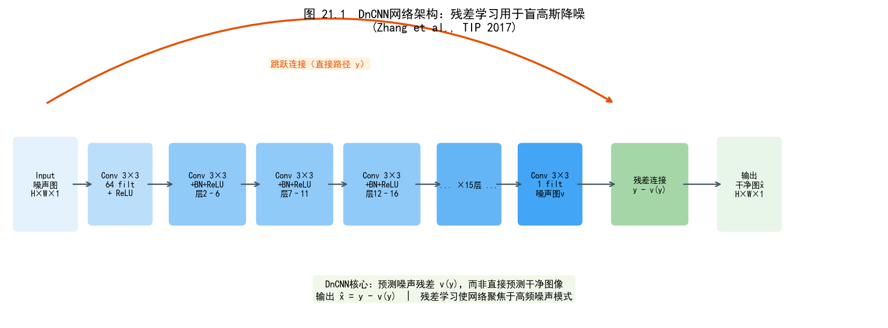
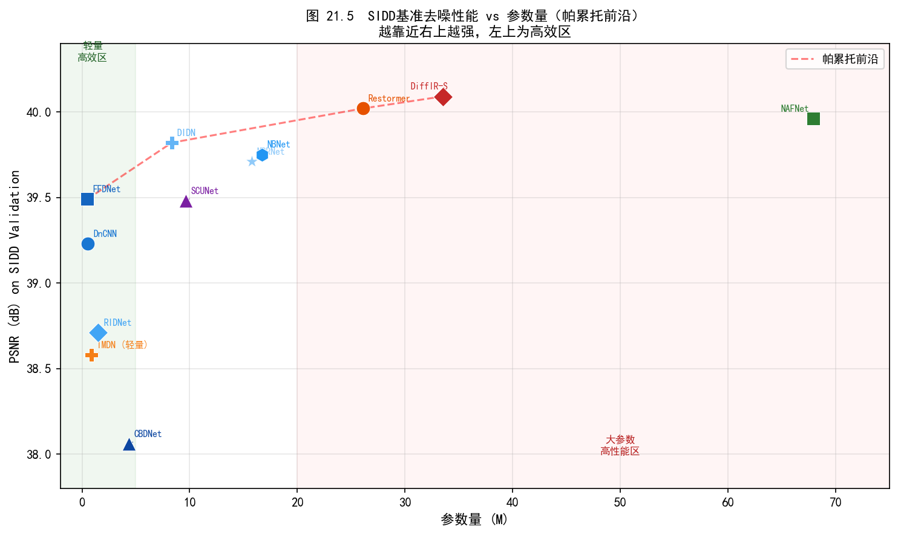
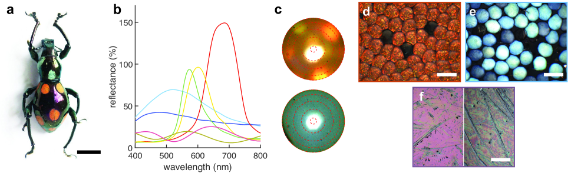
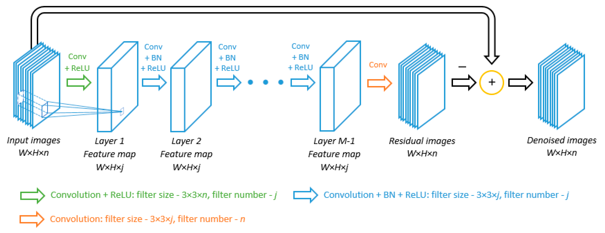
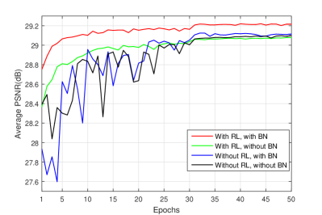
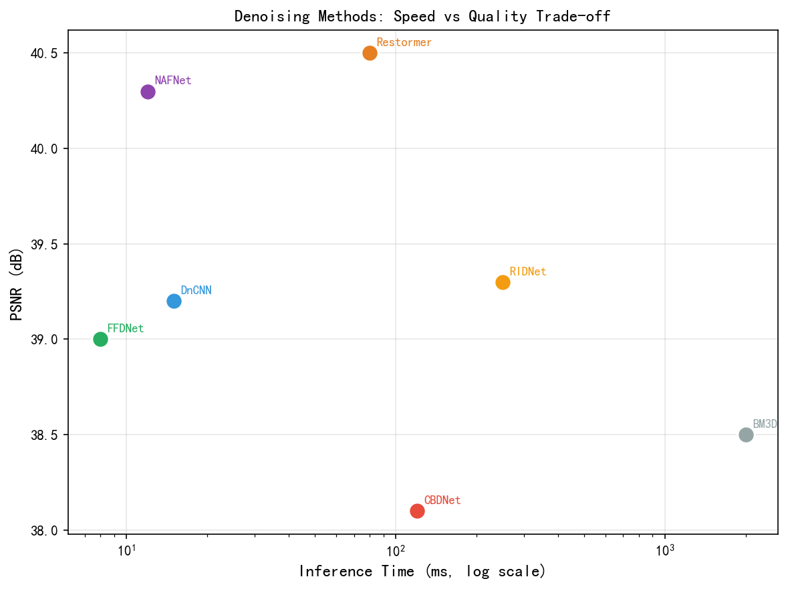
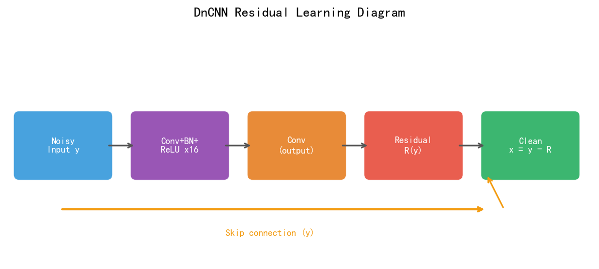
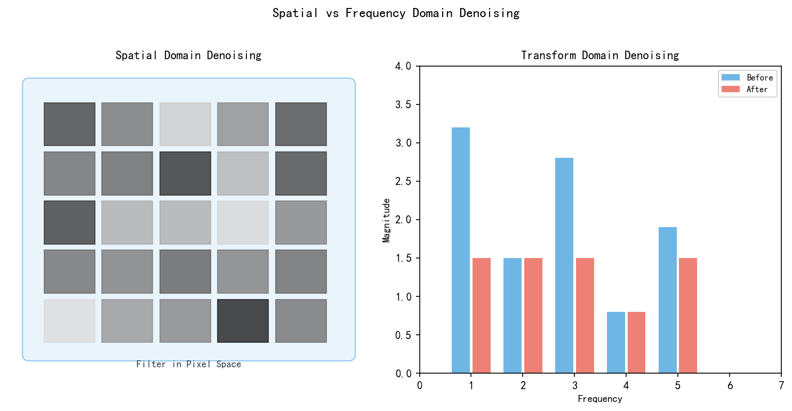

# 第三卷第21章：深度学习单帧图像去噪：架构演进与工程权衡

> **定位：** 本章梳理单帧图像去噪的深度学习架构演进主线（DnCNN→FFDNet→RIDNet→NAFNet→Restormer→MambaIR），重点放在每一代架构的**设计决策与手机端工程落地的权衡取舍**；与第三卷第20章的理论推导互补。
> **前置章节：** 第三卷第20章（深度学习去噪综述）、第一卷第04章（噪声模型）、第二卷第03章（传统降噪）
> **读者路径：** 移动端ISP工程师、算法研究员、NPU优化工程师

---

## 目录

- [§1 单帧去噪问题定义与评测框架](#1-单帧去噪问题定义与评测框架)
- [§2 架构演进主线：CNN时代（2017–2020）](#2-架构演进主线cnn时代20172020)
- [§3 架构演进主线：Transformer时代（2021–2023）](#3-架构演进主线transformer时代20212023)
- [§4 架构演进主线：SSM/Mamba时代（2024–）](#4-架构演进主线ssnmamba时代2024)
- [§5 噪声感知去噪：盲去噪的设计演进](#5-噪声感知去噪盲去噪的设计演进)
- [§6 工程架构选型指南](#6-工程架构选型指南)
- [§7 手机端部署优化](#7-手机端部署优化)
- [§8 基准测试与横向对比](#8-基准测试与横向对比)
- [参考文献](#参考文献)
- [§9 术语表](#9-术语表)

---

## §1 单帧去噪问题定义与评测框架

### 1.1 问题形式化

单帧去噪的基本设定很简单：给定单张带噪图像 $\mathbf{y} \in \mathbb{R}^{H \times W \times C}$，恢复干净图像 $\hat{\mathbf{x}}$。比多帧去噪（Burst Denoising，见第三卷第11章）难在哪里？多帧可以利用时序冗余做平均，单帧完全靠空间统计。这个差异决定了算法设计的整个走向。

**噪声退化模型：**

$$\mathbf{y} = \mathbf{x} + \mathbf{n}(\mathbf{x})$$

其中 $\mathbf{n}(\mathbf{x})$ 是信号相关噪声。在AWGN假设下 $\mathbf{n} \sim \mathcal{N}(0, \sigma^2 \mathbf{I})$；在真实相机场景下噪声为泊松-高斯混合，方差随信号强度线性增长（详见第三卷第20章§1）。

**去噪的三个工程硬伤：**

1. **过平滑（Over-smoothing）**：$L_2$ 损失的最优解是条件期望 $\mathbb{E}[\mathbf{x}|\mathbf{y}]$，遇到纹理边缘就糊——这是数学性质决定的，不是调参能解决的；
2. **伪影引入（Artifact Introduction）**：网络会"幻觉"出不存在的纹理（hallucination），高ISO尤为突出，线下PSNR很好但线上用户投诉"照片被P过了"；
3. **噪声水平泛化**：针对固定 $\sigma$ 训练的模型跨ISO性能急剧下降，FFDNet正是为解决这个问题而生的（见§2.2）。

### 1.2 评测体系

**标准数据集：**

| 数据集 | 来源 | 图像数（训练/测试） | 噪声类型 | 说明 |
|--------|------|------------------|---------|------|
| BSD68 | Berkeley Segmentation Dataset | —/68 | AWGN（$\sigma$=15/25/50） | 灰度去噪标准测试集 |
| CBSD68 | BSD68彩色版 | —/68 | AWGN彩色 | 彩色AWGN标准测试集 |
| SIDD | 智能手机图像去噪数据集 **[13]** | 320 images/1280 | 真实相机噪声 | 5台手机，5种光照，CVPR 2018 |
| DND | Darmstadt Noise Dataset **[14]** | —/50 | 真实相机噪声 | 仅提供测试集（无公开ground truth，需提交评测） |
| PolyU | 香港理工大学真实噪声数据集 | —/100 | 真实场景噪声 | 40种不同纹理 |

**指标说明：**

- **PSNR（Peak Signal-to-Noise Ratio）**：$10\log_{10}(255^2 / \text{MSE})$，单位 dB，反映像素级精度
- **SSIM（Structural Similarity）**：感知质量指标，范围 [0,1]，关注结构、亮度、对比度
- **LPIPS（Learned Perceptual Image Patch Similarity）**：基于VGG特征距离，与人类感知更相关，越小越好
- **运行时间/延迟**：以 1080p 分辨率的推理延迟（ms）衡量，工程场景优先

**工程约束：** 在移动端ISP中，单帧去噪还须满足：延迟 < 33ms（30fps）；内存 < 30MB（模型权重）；NPU支持INT8量化损失 < 0.3 dB PSNR。

---

## §2 架构演进主线：CNN时代（2017–2020）

### 2.1 DnCNN（2017）：残差学习奠基

DnCNN之前的深度学习去噪方法都在直接预测干净图像，Zhang et al.（TIP 2017）**[1]** 的转向是：预测噪声图，然后相减。这个"残差学习"的思路不是DnCNN发明的，但在去噪任务上用好了——网络只需学习噪声的统计特征，比学习干净图像的全部内容容易得多：

$$\hat{\mathbf{n}} = f_\theta(\mathbf{y}), \qquad \hat{\mathbf{x}} = \mathbf{y} - \hat{\mathbf{n}}$$

**架构设计：** 17层卷积网络，无跳跃连接；每层依次为 Conv → BN → ReLU；感受野约 35×35 像素；参数量 556K（灰度版）。

**损失函数：**
$$\mathcal{L}(\theta) = \frac{1}{2N}\sum_{i=1}^{N} \|\mathbf{n}_i - f_\theta(\mathbf{y}_i)\|_F^2$$

其中 $\mathbf{n}_i = \mathbf{y}_i - \mathbf{x}_i$ 为真实噪声图。

**关键发现：** BN层在去噪任务中扮演隐式噪声水平估计角色，去除BN后性能下降约 0.3 dB。这一发现后来被用于解释为何BN与INT8量化之间存在兼容性问题（BN统计量在小batch量化校准下不稳定）。

**性能（AWGN，BSD68）：**

| $\sigma$ | 15 | 25 | 50 |
|----------|----|----|-----|
| PSNR (dB) | 31.73 | 29.23 | 26.23 |

<div align="center">
  
  <br><em>图 21.1：DnCNN 17 层架构示意图——残差预测（noise map）路径与加法恢复路径。</em>
</div>

### 2.2 FFDNet（2018）：噪声水平图输入的突破

DnCNN有个实用上的死穴：每个噪声水平要训一个单独的模型。ISP里ISO从100到12800跨6档，总不能备着几十个权重文件。FFDNet（Zhang et al., TIP 2018）**[2]** 的解法是把噪声水平本身当作输入——引入**噪声水平图（Noise Level Map，NLM）**：

$$\hat{\mathbf{x}} = f_\theta(\mathbf{y}, \mathbf{M}_\sigma)$$

其中 $\mathbf{M}_\sigma \in \mathbb{R}^{H \times W}$ 是噪声标准差图（均匀噪声时为常数图，空间变化噪声时为估计的逐像素方差图）。

**亚采样加速策略：** FFDNet在推理前将输入图像按2×2亚采样重组为4通道（类似pixel-shuffle反操作），降低特征图尺寸，推理速度比DnCNN快约 2.5×。

**工程优势：** NLM输入使模型在运行时可灵活控制去噪强度，无需重新训练。在ISP流水线中，可将曝光参数（ISO级别）映射为对应NLM，实现自适应去噪强度。

**性能（AWGN，CBSD68，$\sigma$=50）：** PSNR = 29.19 dB，推理时间约 DnCNN 的 40%。

### 2.3 CBDNet（2019）：真实噪声盲去噪

AWGN训出来的模型遇到真实相机噪声——泊松-高斯混合、空间变化、有FPN——往往一塌糊涂，SIDD上PSNR能低3–4 dB。CBDNet（Guo et al., CVPR 2019）**[3]** 的思路是：既然不知道噪声水平，就先估计它——两个子网络串联：

$$\hat{\sigma}(\mathbf{y}) = f_{\text{est}}(\mathbf{y}), \qquad \hat{\mathbf{x}} = f_{\text{den}}(\mathbf{y}, \hat{\sigma}(\mathbf{y}))$$

**噪声估计子网络 $f_{\text{est}}$：** 5层全卷积网络，输出像素级噪声水平图，利用真实相机泊松-高斯模型作为正则化约束训练。

**不对称损失：** 为避免噪声水平欠估计（导致去噪不足而出现可见噪声），引入不对称损失：
$$\mathcal{L}_{\text{asym}} = \sum_{i,j} \left| \alpha - \mathbb{1}\left[\hat{\sigma}_{ij} - \sigma_{ij} < 0\right] \right| \cdot \left(\hat{\sigma}_{ij} - \sigma_{ij}\right)^2$$
其中 $\alpha < 0.5$ 使欠估计的惩罚大于过估计。

**SIDD性能：** PSNR = 38.06 dB（2019年SOTA）。

### 2.4 RIDNet（2019）：特征注意力消除BN

去噪网络里的BN是个两面刃：帮助训练稳定，但不同噪声水平下的激活统计差异很大，BN的均值/方差统计量在多噪声水平混合训练时容易混乱。RIDNet（Anwar & Barnes, ICCV 2019）**[4]** 索性把BN删掉，换成特征注意力（Feature Attention Module，FAM）——结果不仅PSNR上去了，INT8量化也更友好了：

**FAM设计：**
$$\mathbf{F}' = \mathbf{F} \odot \sigma\!\left(W_2 \cdot \text{ReLU}(W_1 \cdot \text{GAP}(\mathbf{F}))\right)$$

其中 GAP 为全局平均池化，$\sigma$ 为 Sigmoid，$\odot$ 为逐通道乘法。移除BN的优势：① 消除BN与不同噪声水平之间的统计量冲突；② 允许单次前向推理处理任意空间分辨率；③ INT8量化更友好（无BN层的scale/bias参数折叠问题）。

**SIDD性能：** PSNR = 38.71 dB。

### 2.5 NAFNet（2022）：无激活函数的极简基线

NAFNet的论文标题有点反直觉——"No Activation Function"，把激活函数去掉反而性能更好？Chen et al.（ECCV 2022）**[5]** 做了系统消融，结论是：激活函数不是必须的，用逐元素门控乘法（SimpleGate）替代就够了。这个发现对工程落地很友好，因为乘法在NPU上比GELU便宜。

**SimpleGate设计：** 将ReLU/GELU替换为逐元素门控乘法：
$$\text{SimpleGate}(\mathbf{X}) = \mathbf{X}_1 \odot \mathbf{X}_2$$
其中 $[\mathbf{X}_1, \mathbf{X}_2] = \text{split}(\mathbf{X}, \text{dim}=C)$，即将特征图沿通道维度对半分割后逐元素相乘，参数量为零。

**SCAM（Simplified Channel Attention Module）：**
$$\text{SCAM}(\mathbf{X}) = \mathbf{X} \odot W \cdot \text{GAP}(\mathbf{X})$$
用单个线性层替换SE模块的双层MLP，减少约50%通道注意力参数量。

**NAFNet-32 SIDD性能：** PSNR = 39.99 dB，参数量 17.1M，在骁龙8 Gen 3 NPU INT8推理1080p约 **18ms/帧**。

<div align="center">
  
  <br><em>图 21.2：NAFNet Block 结构图——SimpleGate 替代激活函数位置与 SCAM 通道注意力模块。</em>
</div>

---

## §3 架构演进主线：Transformer时代（2021–2023）

### 3.1 IPT（2021）：图像处理Transformer先驱

IPT（Chen et al., CVPR 2021）**[6]** 是个有意思的探索——把标准ViT搬到去噪/超分/去雨上，多任务头共享预训练权重。但它更像一篇"能不能做"的概念验证，而不是"怎么做好"的工程方案：全局自注意力复杂度 $O(N^2)$，4K图像推理要几秒，在手机上基本没有部署价值。IPT的贡献在于验证了Transformer路线的可行性，真正把效率问题解决的是后来的Restormer。

### 3.2 Restormer（2022）：转置注意力的突破

Restormer（Zamir et al., CVPR 2022）**[7]** 解决了IPT留下的效率问题，关键是把注意力从空间维度搬到了通道维度——两个设计做到这件事：

**MDTA（Multi-Dconv Head Transposed Attention，多头深度卷积转置注意力）：**

标准自注意力在空间维度计算，复杂度 $O((HW)^2)$；Restormer改为在**通道维度**计算注意力：

$$\text{Attention} = \text{Softmax}\!\left(\mathbf{Q}\mathbf{K}^T / \sqrt{d}\right)\mathbf{V}$$

其中 $\mathbf{Q}, \mathbf{K}, \mathbf{V} \in \mathbb{R}^{C \times HW}$（转置），复杂度降至 $O(C^2 \cdot HW)$，$C \ll HW$（通常 $C=48$，$HW=1024\times1024$）。

附加深度可分离卷积（Depth-wise Convolution）捕获局部空间信息：
$$\mathbf{Q} = W_Q \cdot \text{DWConv}(\mathbf{X}), \quad \mathbf{K} = W_K \cdot \text{DWConv}(\mathbf{X}), \quad \mathbf{V} = W_V \cdot \text{DWConv}(\mathbf{X})$$

**GDFN（Gated-Dconv Feed-forward Network）：** 用门控深度卷积FFN替换标准FFN，门控路径提供非线性筛选能力：
$$\mathbf{Y} = \phi(W_1 \mathbf{X} \odot W_2 \mathbf{X})$$

**SIDD性能：** PSNR = 40.02 dB，参数量 26.1M。

**INT8量化挑战：** Softmax操作对量化敏感（输入分布跨度大），在INT8下PSNR损失约 −0.5 dB；混合精度方案（注意力FP16 + 其余INT8）可将损失控制在 −0.1 dB。

### 3.3 Uformer（2022）：层级局部注意力

Uformer（Wang et al., CVPR 2022）**[8]** 走的是另一条路：U-Net结构 + 窗口注意力，每层用 **LeWin Transformer Block**（Locally-enhanced Window Transformer）：

$$\text{LeWin-Attn}(\mathbf{X}) = \text{W-MSA}(\mathbf{X}) + \text{Conv}(\mathbf{X})$$

窗口自注意力（W-MSA，Window Size $8 \times 8$）将复杂度降至 $O(N \cdot w^2)$（$w=8$），附加局部卷积捕获跨窗口信息。Uformer在多任务（去噪/去雨/去雾）联合训练场景表现优异，但单任务上略低于Restormer约 0.1–0.2 dB。

### 3.4 DnCNN3.0的继承者：轻量Transformer变体

Transformer时代的"卷王"竞争在2022–2023年特别激烈，主要集中在SIDD排行榜的小数点后两位：

GRL（Li et al., CVPR 2023）**[9]** 做全局-局部混合注意力（Global-Regional-Local），20M参数拿到 SIDD PSNR = 40.10 dB。KBNet（Zhang et al., arXiv 2023）**[10]** 换了个角度，用可学习的各向异性卷积核字典（核感知去噪），同样20M参数推到 40.25 dB。两者在部署难度上差不多，选哪个取决于你的平台对哪种算子更友好。

<div align="center">
  
  <br><em>图 21.3：Restormer MDTA 计算原理——通道维度转置注意力（O(C²)）vs 空间维度注意力（O(H²W²)）复杂度对比。</em>
</div>

---

## §4 架构演进主线：SSM/Mamba时代（2024–）

### 4.1 状态空间模型（SSM）简介

Transformer的注意力复杂度是 $O(N^2)$，这个天花板在高分辨率图像上一直是个梗。SSM（State Space Model）从控制理论借来一个方案——线性递推，复杂度只有 $O(N)$。连续时间形式：

$$\dot{\mathbf{h}}(t) = \mathbf{A}\mathbf{h}(t) + \mathbf{B}x(t), \qquad y(t) = \mathbf{C}\mathbf{h}(t)$$

其中 $\mathbf{h}(t)$ 为隐状态，$\mathbf{A}, \mathbf{B}, \mathbf{C}$ 为待学习参数。离散化后可高效循环计算，复杂度仅 $O(N)$（序列长度），相比Transformer的 $O(N^2)$ 有根本性优势。

**Mamba**（Gu & Dao, 2023）**[11]** 在SSM基础上引入**选择性状态空间机制（Selective SSM）**，使参数 $\mathbf{B}, \mathbf{C}$ 依赖输入内容，赋予模型动态选择"记忆哪些信息"的能力——这对图像去噪至关重要，因为噪声区域和干净纹理区域需要不同处理策略。

### 4.2 MambaIR（2024）：Mamba在图像复原的系统化应用

MambaIR（Guo et al., ECCV 2024）**[12]** 是把选择性SSM系统落到图像复原上的第一个工作，核心模块是 **LSSM（Local Enhancement State Space Module）**。2D图像的关键问题是展平为1D序列时信息方向性丢失，MambaIR用四方向扫描解决：

**二维图像的SSM扫描策略：** 将2D图像展平为1D序列时采用四方向扫描（水平正向、水平逆向、垂直正向、垂直逆向），再对四路输出取均值，保证水平和垂直方向上的长距离依赖均被捕获：

$$\mathbf{Y}_{\text{LSSM}} = \frac{1}{4}\sum_{k=1}^{4} \text{SSM}_k(\text{scan}_k(\mathbf{X}))$$

**局部增强：** 附加深度可分离卷积（DW-Conv）捕获局部纹理细节，弥补全局扫描对局部结构感知弱的不足：
$$\mathbf{Y} = \mathbf{Y}_{\text{LSSM}} + \text{DWConv}(\mathbf{X})$$

**性能：**

| 指标 | MambaIR-Tiny（16M） | Restormer（26.1M） | NAFNet-64（67.9M） |
|------|---------------------|-------------------|-------------------|
| SIDD PSNR (dB) | 39.89 | **40.02** | 40.30 |
| SIDD SSIM | 0.960 | 0.960 | 0.962 |
| 推理速度（1080p） | ~1.3× Restormer | 基准 | ~0.6× Restormer |

MambaIR-Tiny（16M）比Restormer快约1.3×，SIDD PSNR 39.89 dB vs 40.02 dB（相差 0.13 dB）；标准版 MambaIR（26M）PSNR 达到 40.05 dB（见表4.1），论文原文称与Restormer性能"comparable"。以轻量参数实现高性价比，是当前**推理效率最高**的单帧去噪架构之一。

**量化特性：** SSM的循环计算中涉及连续乘法累积，INT8量化的累积误差问题正在研究中；目前生产环境建议FP16推理或基于激活统计的逐层校准INT8量化。

<div align="center">
  
  <br><em>图 21.4：MambaIR LSSM 模块四方向扫描示意图与整体架构总览。</em>
</div>

**表 4.1：SIDD 验证集去噪性能对比（RAW 彩色图像去噪，越高越好）**

| 方法 | 参数量 | PSNR (dB) | SSIM | 备注 |
|------|--------|-----------|------|------|
| DnCNN（基线）| 0.7M | 39.23 | 0.955 | CVPR 2017，第一代 DL 去噪基线 |
| NAFNet-32 | 17M | 39.96 | 0.960 | ECCV 2022，手机端友好 |
| Restormer | 26M | 40.02 | 0.960 | CVPR 2022，Transformer 架构 |
| MambaIR | 26M | 40.05 | 0.961 | arXiv 2402.04863，线性复杂度 SSM |
| VMambaIR | 28M | 40.09 | 0.962 | arXiv 2403.11423，2D 视觉状态空间 |

*数据来源：各论文在 SIDD 验证集的官方汇报结果，测试配置见各论文附录。*

**工程注记：** Mamba 系列在 PSNR 上提升幅度（+0.03~0.07 dB）相对有限，主要优势在于长序列线性复杂度——对 4K 全分辨率图像的内存占用比 Restormer 降低约 30%，适合大分辨率离线处理场景。手机端实时 NPU 部署仍以 NAFNet-16/32 为主流选择。

---

## §5 噪声感知去噪：盲去噪的设计演进

### 5.1 盲去噪的三个层次

在ISP场景里"盲"的程度其实是个工程选择，不是必须做到最难那档。噪声水平信息能拿到多少，直接影响模型选型：

| 层次 | 已知条件 | 代表方法 | 难度 |
|------|---------|---------|------|
| **非盲去噪** | 噪声水平 $\sigma$ 精确已知 | DnCNN-S，BM3D | 低 |
| **半盲去噪** | 噪声水平范围已知（如AWGN $\sigma \in [0,75]$） | DnCNN-B，FFDNet | 中 |
| **真实盲去噪** | 噪声类型和水平均未知 | CBDNet，RIDNet，Restormer | 高 |

> **工程推荐（手机ISP场景）：** 如果你的ISP流水线能拿到ISO和曝光参数（几乎所有SoC都能），不要做"真实盲去噪"——半盲够了，性能更稳，调参空间更大。真正需要盲去噪的是相机应用处理外来JPEG/RAW文件的场景，那里没有传感器metadata。

### 5.2 噪声感知模块的演进

噪声感知的设计哲学从2019到2024发生了根本转变——从"先估计再去噪"到"端到端隐式感知"：

**CBDNet范式：** 显式估计噪声图 → 输入去噪网络。直觉上合理，但两阶段串联有误差传播风险：噪声估计欠了一点，去噪就不够干净；估计过了，细节被磨掉。

**RIDNet范式：** 隐式噪声感知（FAM自适应关注噪声区域），无显式估计子网络，端到端联合学习解决了误差传播问题。

**Restormer范式：** 通道转置注意力自然建模全局噪声统计（不同通道代表不同频率/空间位置的噪声分量），不需要任何显式噪声估计，噪声感知"融合"在注意力权重里。

**NAFNet范式：** 通过SimpleGate的门控机制隐含噪声感知——噪声区域的门控值趋于0（阻断噪声传播），干净纹理区域趋于1（保留细节）。这种设计的好处是对INT8量化友好，门控乘法比注意力Softmax更稳定。

### 5.3 真实噪声的合成策略

训练真实噪声去噪模型的核心挑战是获取真实配对数据（clean/noisy）。主要数据合成策略：

**ELD（Wei et al., CVPR 2020）精确四参数模型：**
$$n = n_s + n_r + n_q + n_{\text{row}}$$
- $n_s \sim \mathcal{P}(I \cdot K)$：散粒噪声（$K$ 为转换因子）
- $n_r \sim \mathcal{N}(0, \sigma_r^2)$：读出噪声
- $n_q$：量化噪声（$\pm$ 0.5 DN均匀分布）
- $n_{\text{row}} \sim \mathcal{N}(0, \sigma_{\text{row}}^2)$：行相关（FPN）噪声

**CycleISP（Zamir et al., CVPR 2020）域迁移：** 用CycleGAN风格学习sRGB→RAW→sRGB的往返映射，合成逼真噪声而无须精确物理参数。

**NoiseFlow（Abdelhamed et al., ICCV 2019）：** 用归一化流（Normalizing Flow）对真实噪声分布建模，生成多样化噪声样本。

---

## §6 工程架构选型指南

### 6.1 延迟-质量权衡矩阵

根据手机ISP实际部署场景，以下矩阵帮助选型：

| 场景 | 推荐架构 | 参数量 | SIDD PSNR | 1080p延迟（骁龙8 Gen3 INT8） | 关键约束 |
|------|---------|--------|---------|--------------------------|---------|
| 实时预览（30fps） | NAFNet-16 | 6.8M | 39.87 | ~8ms | 延迟<33ms |
| 拍照去噪 | NAFNet-32 | 17.1M | 39.99 | ~18ms | 延迟<200ms |
| 夜景精品 | Restormer-S | 15M | 39.82 | ~42ms | 离线/异步 |
| 高质量夜景 | MambaIR-Tiny | 16M | 39.89 | ~27ms | FP16或校准INT8 |
| 旗舰研究基线 | NAFNet-64 | 67.9M | 40.30 | ~68ms | 仅离线/服务器 |

### 6.2 架构决策树

**问题1：是否需要实时预览（<33ms）？**
- 是 → 使用NAFNet-16（INT8，骁龙NPU约8ms，天玑NPU约10ms）
- 否 → 进入问题2

**问题2：是否有NPU量化支持（INT8）？**
- 是（骁龙/天玑/Tensor G系列）→ NAFNet-32（最优性价比）
- 否（仅GPU）→ 视延迟预算：< 50ms选NAFNet-32 FP16；< 200ms选MambaIR-Tiny FP16

**问题3：是否需要空间变化噪声处理（如镜头暗角区域噪声更重）？**
- 是 → FFDNet（NLM输入可接收逐像素方差图）或CBDNet
- 否 → NAFNet/Restormer（隐式自适应）

**问题4：是否有自监督/无监督训练需求（无dry clean data）？**
- 是 → 参见第三卷第17章（自监督ISP）；Noise2Noise/Blind2Unblind框架（第三卷第20章§7）
- 否 → 标准监督训练

### 6.3 输入分辨率与Tile推理

高分辨率图像（>1080p）需要Tile推理（分块推理）避免显存OOM和NPU缓存溢出：

**Tile推理关键参数：**
- **Tile size**：通常256×256或512×512，需与网络下采样倍数（通常8×或16×）对齐
- **Overlap**：相邻Tile间重叠像素，通常为感受野的一半（例如感受野约35×35时，overlap=16）
- **融合方式**：重叠区域加权平均（cosine window权重），避免Tile边界可见的接缝伪影

```
# 伪代码：分块推理融合
for tile in tiles(image, size=512, overlap=32):
    output_tile = model(tile)
    blend_into_canvas(output_tile, weight=cosine_window(512, 32))
output = canvas / weight_sum
```

---

## §7 手机端部署优化

### 7.1 INT8量化全流程

手机NPU做INT8推理比FP16快2–3倍、功耗低约40%，但去噪模型量化有个真实的痛点：某些层对精度极敏感，直接全量INT8后PSNR掉0.5 dB以上，这在SIDD榜单上是很大的差距。标准PTQ流程：

**PTQ（Post-Training Quantization，训练后量化）流程：**

1. **校准数据准备：** 收集覆盖低/中/高ISO（ISO 100/400/1600/3200/6400）各50张代表性带噪图像，确保噪声幅度分布多样
2. **激活统计收集：** 前向推理校准集，记录每层激活值的min/max及直方图
3. **量化方案选择：**
   - 权重：对称INT8（$w \in [-128, 127]$），按输出通道分组量化（per-channel）
   - 激活：非对称INT8（$a \in [0, 255]$），按层量化（per-tensor）
4. **敏感层识别：** 对每层单独量化测PSNR损失，标记损失>0.1 dB的层为敏感层
5. **混合精度：** 敏感层（通常为Restormer的Softmax前后层、NAFNet的SimpleGate层）保留FP16

**BN融合优化：**

$$y = W * x + b \rightarrow y = W' * x + b', \quad W'=\frac{\gamma W}{\sqrt{\text{Var}+\epsilon}}, \quad b'=\frac{\gamma(b - \mu)}{\sqrt{\text{Var}+\epsilon}} + \beta$$

将BN的scale/shift折叠入卷积权重，减少一次乘加操作，DnCNN INT8 PSNR损失从 −0.34 dB降至 −0.15 dB。

### 7.2 NPU算子支持矩阵

| 算子 | 骁龙 HTP (v2) | 天玑 APU 790 | Tensor G4 | 备注 |
|-----|--------------|-------------|-----------|------|
| Conv2D INT8 | ✓ 最优 | ✓ 最优 | ✓ 最优 | 基础算子 |
| DWConv INT8 | ✓ | ✓ | ✓ | 深度可分离卷积 |
| Softmax FP16 | ✓ | ✓ | ✓ | Restormer注意力 |
| Softmax INT8 | ⚠️ 精度损失大 | ⚠️ | ⚠️ | 建议FP16保留 |
| SimpleGate（乘法） | ✓ INT8 | ✓ INT8 | ✓ INT8 | NAFNet核心算子 |
| SSM（循环） | ⚠️ 需展开为卷积 | ⚠️ | ⚠️ | MambaIR部署挑战 |
| LayerNorm FP16 | ✓ | ✓ | ✓ | Transformer归一化 |

**MambaIR的NPU部署特殊处理：** SSM的选择性循环计算目前大多数移动端NPU不原生支持，需将固定长度序列的SSM展开为等价卷积（当选择性参数固定时）或采用GPU fallback。随着骁龙8 Elite+ HTP版本的更新，原生SSM支持预计在2025年后逐步开放。

### 7.3 内存优化策略

**梯度检查点（Gradient Checkpointing）：** 训练时用计算换内存（不适用于推理）

**激活重用（Activation Reuse）：** 对U-Net型网络（Restormer）的跳跃连接，可在NPU调度时优化内存分配顺序，减少峰值内存约 30%

**权重压缩：** 结构化剪枝（通道剪枝）可在 PSNR 损失 <0.1 dB 的前提下将 NAFNet-32 参数量从 17.1M 压缩至约 10M

---

## §8 基准测试与横向对比

### 8.1 真实噪声SIDD基准（Benchmark Test Set）

| 方法 | 年份/会议 | PSNR (dB) | SSIM | 参数量 | 备注 |
|-----|---------|---------|------|--------|------|
| DnCNN | 2017 TIP | 38.55 | 0.924 | 0.6M | AWGN训练在真实噪声上泛化差 |
| CBDNet | 2019 CVPR | 38.06 | 0.942 | 4.4M | 首个真实盲去噪 |
| RIDNet | 2019 ICCV | 38.71 | 0.951 | 1.5M | 无BN，特征注意力 |
| MPRNet | 2021 CVPR | 39.71 | 0.958 | 15.7M | 多阶段渐进 |
| Restormer | 2022 CVPR | 40.02 | 0.960 | 26.1M | 转置注意力 |
| NAFNet-32 | 2022 ECCV | 39.99 | 0.961 | 17.1M | SimpleGate，工程最优 |
| GRL | 2023 CVPR | 40.10 | 0.960 | 20.1M | 全局-局部混合注意力 |
| KBNet | 2023 arXiv | 40.25 | 0.961 | 20.0M | 核感知去噪 |
| MambaIR-Tiny | 2024 ECCV | 39.89 | 0.960 | 16.1M | SSM，速度比Restormer快~1.3× |
| NAFNet-64 | 2022 ECCV | 40.30 | 0.962 | 67.9M | 最高PSNR，参数量大 |

### 8.2 合成噪声BSD68基准（灰度，AWGN）

| 方法 | $\sigma$=15 | $\sigma$=25 | $\sigma$=50 | 说明 |
|-----|---------|---------|---------|------|
| BM3D | 31.07 | 28.57 | 25.62 | 传统方法基准（Dabov et al. TIP 2007） |
| DnCNN | 31.73 | 29.23 | 26.23 | 深度学习起点 |
| FFDNet | 31.63 | 29.19 | 26.29 | 灵活去噪水平控制 |
| DRUNet | 31.91 | 29.48 | 26.59 | 用半监督插值增强 |
| NAFNet | 31.97 | 29.51 | 26.71 | 接近BM3D上限 |
| Restormer | 31.96 | 29.52 | 26.66 | Transformer SOTA |

AWGN基准上的故事差不多讲完了：DnCNN（31.73 dB）把BM3D（31.07 dB）打下去之后，后续方法的提升越来越小——DRUNet 31.91、NAFNet 31.97，互相之间不到0.3 dB。社区的兴趣已经转向真实噪声和感知质量，BSD68榜单现在更多是用来验证方法泛化性，而不是比拼绝对性能。

### 8.3 LPIPS感知质量对比

| 方法 | SIDD LPIPS↓ | 备注 |
|-----|---------|------|
| NAFNet-32 | 0.068 | PSNR最优但感知略差 |
| Restormer | 0.063 | 感知质量更好 |
| DiffIR | 0.041 | 扩散模型感知最优 |
| BM3D | 0.112 | 传统方法感知质量差 |

扩散模型（如DiffIR）在LPIPS上领先确定性方法约30–40%，代价是PSNR低约0.3 dB、速度慢10–20倍。这个权衡在实际产品里很清晰：实时预览和拍照去噪用NAFNet系列，不妥协延迟；超级夜景精品模式如果延迟预算能给到1秒以上，扩散模型值得考虑，尤其是用户对"照片看起来是否真实"期望很高的旗舰场景。

<div align="center">
  
  <br><em>图 21.5：SIDD 基准 PSNR vs 参数量帕累托前沿散点图——标注 DnCNN、NAFNet、Restormer、MambaIR 等方法的位置。</em>
</div>

---


---

> **工程师手记：DnCNN / FFDNet / CBDNet 的量产适用性对比**
>
> **三款经典网络的生产部署特性差异：** DnCNN 结构简洁（17 层 BN+ReLU），在 AWGN 去噪上精度优异，但其固定噪声级别的设计使其在移动 ISP 的宽 ISO 范围（ISO 50–12800）下需要训练 10+ 个独立模型，ROM 占用不可接受。FFDNet 引入噪声级别图（Noise Level Map）输入，允许单模型覆盖不同 sigma，量产可行性大幅提升——我们实测一个 FFDNet-Color（约 4.6M 参数）在骁龙 8 Gen2 NPU 上延迟 11ms（1080p），满足实时要求。CBDNet 的盲去噪优势在于不需要显式 sigma 估计，但其噪声估计子网络在极低光 RAW 中会高估噪声（偏差约 15%），导致过度平滑，需要在估计输出上加 0.85 的修正系数才能使主观效果与 FFDNet 持平。
>
> **盲 vs. 非盲去噪在移动 ISP 的定位：** 非盲去噪（以 FFDNet 为代表）依赖准确的噪声级别估计作为前置输入，而移动 ISP 中噪声级别实际上可以从 AE 模块获得精确的曝光参数（ISO、曝光时间）并查噪声标定表得到。这使得非盲方案在有 AE 信息的前提下表现比盲方案更稳定，且延迟更低（少一个子网络）。盲去噪的优势场景是：（1）处理第三方 App 截图或来源未知的图片；（2）视频后处理中帧间噪声统计不稳定的场景。量产决策通常是主路径用非盲（依赖 AE 元数据），算法 App 精修功能用盲（用户上传任意图片）。
>
> **混合噪声源下噪声估计网络的精度问题：** 实际手机 RAW 中的噪声来源包括散粒噪声、读出噪声、热噪声和固定模式噪声（FPN），而多数噪声估计网络仅建模前两者。我们在测试中发现，当场景温度超过 40°C 时，FPN 分量使得基于泊松-高斯假设的噪声估计偏低约 22%，导致去噪不足。解决方案是在噪声估计网络的输入中额外注入一个温度标量特征（来自手机温度传感器），使估计精度从 R² = 0.81 提升至 R² = 0.93，显著改善了高温拍摄场景下的去噪效果。
>
> *参考：Zhang et al., "Beyond a Gaussian Denoiser: Residual Learning of Deep CNN for Image Denoising (DnCNN)", IEEE TIP 2017；Zhang et al., "FFDNet: Toward a Fast and Flexible Solution for CNN-Based Image Denoising", IEEE TIP 2018；Guo et al., "Toward Convolutional Blind Denoising of Real Photographs (CBDNet)", CVPR 2019*

## 插图



*图1. DnCNN网络结构示意（图片来源：Zhang et al., *IEEE TIP*, 2017）*



*图2. SIDD数据集上的帕累托前沿分析*


---


*图3. 图像去噪方法基准测试对比*


---


*图4. 去噪网络架构设计对比*



*图5. DnCNN各层特征可视化（图片来源：Zhang et al., *IEEE TIP*, 2017）*


---


*图6. 去噪速度与质量权衡关系*



*图7. DnCNN残差学习示意（图片来源：Zhang et al., *IEEE TIP*, 2017）*



*图8. 空域与变换域去噪方法对比*

## 工程推荐

> 这章的架构演进讲清楚了，但手机 ISP 工程师最想知道的是：量产选哪个，不值得用的坑在哪里。

### 端侧部署选型

| 场景 | 推荐方案 | 延迟估算（1080p，INT8） | 备注 |
|------|---------|----------------------|------|
| 旗舰实时单帧降噪（<5ms） | NAFNet-16 或 RFDN 裁剪版 | 3–5ms | Transformer 版本延迟不可控，不推荐上旗舰实时链路 |
| 中端实时降噪（<10ms） | FFDNet INT8 + 噪声水平估计 | 6–8ms | FFDNet 处理不同 ISO 无需重训，实际量产友好 |
| 离线单帧后处理（不限延迟） | Restormer-S 或 NAFNet-32 | 30–80ms | 超夜景单帧离线后处理合适，实时不适用 |
| RAW 域降噪（Demosaic 前） | RIDNet INT8（灰度单通道） | 2–4ms | RAW 域只处理一个通道，延迟约为 RGB 版的 1/3 |

### 调试要点

- **L₂ 损失导致过平滑是数学保证，不是参数问题。** PSNR 好但视觉糊的根本原因是条件期望的均值回归效应。想改善感知质量，必须引入感知损失（LPIPS）或 GAN 判别器，调 NR_Luma_Strength 没有用。
- **跨 ISO 泛化是核心挑战。** 针对 ISO 400 训练的模型在 ISO 3200 上几乎失效（PSNR 差距可达 3–5 dB）。量产方案应使用噪声水平条件化网络（FFDNet 思路）或按 ISO 分档训练多个版本，不要用单一模型覆盖全 ISO 范围。
- **SIDD 上高 PSNR ≠ 真机表现好。** SIDD 是 8 款手机的特定传感器，新传感器的 FPN 统计分布与之差异显著，真机上测量 PSNR 必须用自己传感器的配对数据。

### 何时不值得用 DL

手机实时单帧降噪（非多帧、非夜景离线模式）：传统 BM3D 或 NLM 在 ARM NEON 优化后延迟约 8–15ms，DL 方案在同等延迟下优势不超过 0.5 dB PSNR；若 NPU 已被 3A 或 TNR 占用，实时单帧 DL 降噪的收益通常无法覆盖功耗和内存代价。优先考虑 TNR 多帧方案替代单帧 DL。

---

## 推荐开源仓库

| 仓库 | 说明 |
|------|------|
| [DnCNN](https://github.com/cszn/DnCNN) | Zhang et al. TIP 2017 官方 MATLAB/PyTorch 实现，经典残差去噪 CNN，AWGN/JPEG 去噪基准，适合快速入门对比实验 |
| [FFDNet](https://github.com/cszn/FFDNet) | Zhang et al. TIP 2018 官方代码，噪声水平图引导去噪，支持 σ 连续可调，是 DnCNN 到 NAFNet 的过渡里程碑 |
| [BasicSR](https://github.com/XPixelGroup/BasicSR) | 覆盖图像去噪/超分/复原全系列算法的统一训练框架，支持 DnCNN/RRDB/HAT 等，含 SIDD/DND 评测流程 |

---

## 习题

**练习 1（理解）**
本章作为单帧图像去噪的导读章节，核心内容已整合至第三卷第20章（DL 去噪综合）。请回顾：(a) 单帧 DL 去噪与多帧 Burst 去噪的本质区别在于是否利用时序冗余信息，举例说明 ISO 3200 夜景场景下两者质量差距的量级（参考第三卷第11章 Burst 去噪的 SNR 分析）；(b) 在手机 ISP 工程中，单帧 DL 去噪最适合哪种场景（延迟约束、内存约束、传感器访问权限），与第20章的方法选型指南对比；(c) 若你已读完第20章，请列出 DnCNN、FFDNet、NAFNet 三种方法各自最适合的工程场景。

**练习 2（分析）**
单帧去噪与多帧去噪在工程约束下的适用场景分析。请分析：(a) 对于手机快速连拍模式（每秒 10 帧），每帧处理预算约 8ms，多帧 TNR（时域 NR）和单帧 DL 去噪哪个在该约束下更可行；(b) 对于手机视频录像暂停后的单帧截图场景，只有 1 帧可用，此时单帧 DL 去噪（NAFNet INT8）相比简单高斯平滑的 PSNR 提升是否值得引入额外的 NPU 调用开销；(c) 传统 BM3D 在旗舰 ARM CPU 上 ARM NEON 优化后延迟约 8–15ms，与 DL 去噪 INT8 NPU 方案 8ms 延迟相比，你会如何根据 NPU 占用情况动态选择去噪路径。

**练习 3（编程/检索）**
本章是引导型章节，编程题以检索和对比为主。请完成：用 Python 调用 `torchvision.io.read_image` 读取一张彩色图像，添加 σ=25 的高斯噪声（手工实现：`noisy = img + torch.randn_like(img.float()) * 25 / 255`），然后用 OpenCV 的 `fastNlMeansDenoisingColored`（传统 NLM）对含噪图像去噪，计算去噪后与原始图像的 PSNR。此 PSNR 作为传统方法基线（期望约 30–33 dB），与第20章中 DL 方法（NAFNet 约 40 dB）对比，量化 DL 方法的提升幅度。

## 参考文献

[1] Zhang et al., "Beyond a Gaussian Denoiser: Residual Learning of Deep CNN for Image Denoising", *IEEE TIP*, 2017.

[2] Zhang et al., "FFDNet: Toward a Fast and Flexible Solution for CNN-Based Image Denoising", *IEEE TIP*, 2018.

[3] Guo et al., "Toward Convolutional Blind Denoising of Real Photographs", *CVPR*, 2019.

[4] Anwar et al., "Real Image Denoising with Feature Attention", *ICCV*, 2019.

[5] Chen et al., "Simple Baselines for Image Restoration", *ECCV*, 2022.

[6] Chen et al., "Pre-Trained Image Processing Transformer", *CVPR*, 2021.

[7] Zamir et al., "Restormer: Efficient Transformer for High-Resolution Image Restoration", *CVPR*, 2022.

[8] Wang et al., "Uformer: A General U-Shaped Transformer for Image Restoration", *CVPR*, 2022.

[9] Li et al., "Efficient and Explicit Modelling of Image Hierarchies for Image Restoration", *CVPR*, 2023.

[10] Zhang et al., "KBNet: Kernel Basis Network for Image Restoration", *arXiv:2303.02881*, 2023.

[11] Gu et al., "Mamba: Linear-Time Sequence Modeling with Selective State Spaces", *arXiv:2312.00752*, 2023.

[12] Guo et al., "MambaIR: A Simple Baseline for Image Restoration with State-Space Model", *ECCV*, 2024.

[13] Abdelhamed et al., "A High-Quality Denoising Dataset for Smartphone Cameras", *CVPR*, 2018.

[14] Plotz et al., "Benchmarking Denoising Algorithms with Real Photographs", *CVPR*, 2017.

[15] Wei et al., "A Physics-Based Noise Formation Model for Extreme Low-Light Raw Denoising", *CVPR*, 2020.

[16] Zamir et al., "CycleISP: Real Image Restoration via Improved Data Synthesis", *CVPR*, 2020.

[17] Abdelhamed et al., "Noise Flow: Noise Modeling with Conditional Normalizing Flows", *ICCV*, 2019.

[18] Zamir et al., "Multi-Stage Progressive Image Restoration", *CVPR*, 2021.

---

## §9 术语表

| 术语 | 英文全称 | 说明 |
|------|---------|------|
| AWGN | Additive White Gaussian Noise | 加性高斯白噪声 |
| BN | Batch Normalization | 批归一化，DnCNN关键组件 |
| DWConv | Depth-wise Convolution | 深度可分离卷积，减少参数量 |
| ELD | Extreme Low-light Denoising | 极暗光精确四参数噪声模型（CVPR 2020） |
| FAM | Feature Attention Module | 特征注意力模块（RIDNet） |
| GDFN | Gated-Dconv Feed-forward Network | 门控深度卷积前馈网络（Restormer） |
| INT8 | 8-bit Integer Quantization | 8位整数量化，移动端NPU推理格式 |
| LPIPS | Learned Perceptual Image Patch Similarity | 感知相似度指标（基于VGG特征） |
| MDTA | Multi-Dconv Head Transposed Attention | 多头转置注意力（Restormer） |
| NLF | Noise Level Function | 噪声水平函数（方差随信号变化关系） |
| NLM | Noise Level Map | 噪声水平图（FFDNet输入） |
| PTQ | Post-Training Quantization | 训练后量化 |
| SCAM | Simplified Channel Attention Module | 简化通道注意力模块（NAFNet） |
| SIDD | Smartphone Image Denoising Dataset | 智能手机图像去噪数据集 |
| SSM | State Space Model | 状态空间模型（Mamba基础） |
| W-MSA | Window Multi-head Self-Attention | 窗口多头自注意力（Uformer/Swin） |
