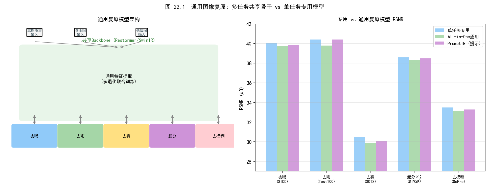
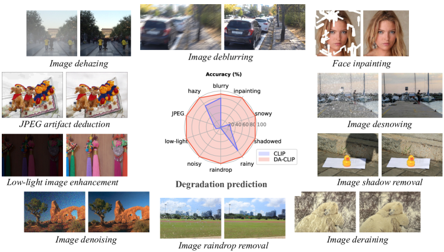
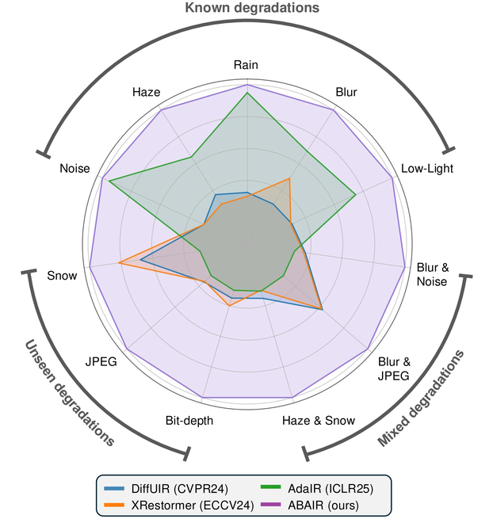
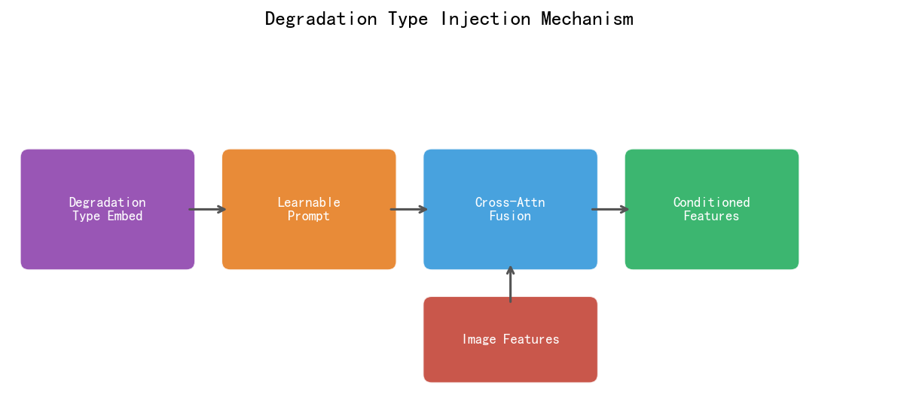
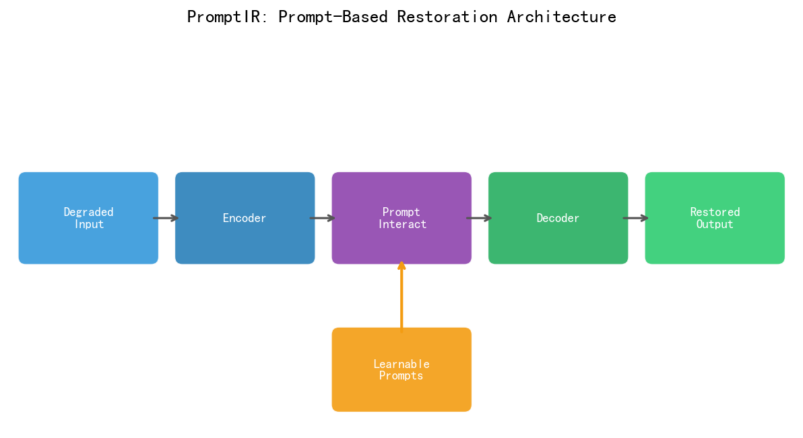
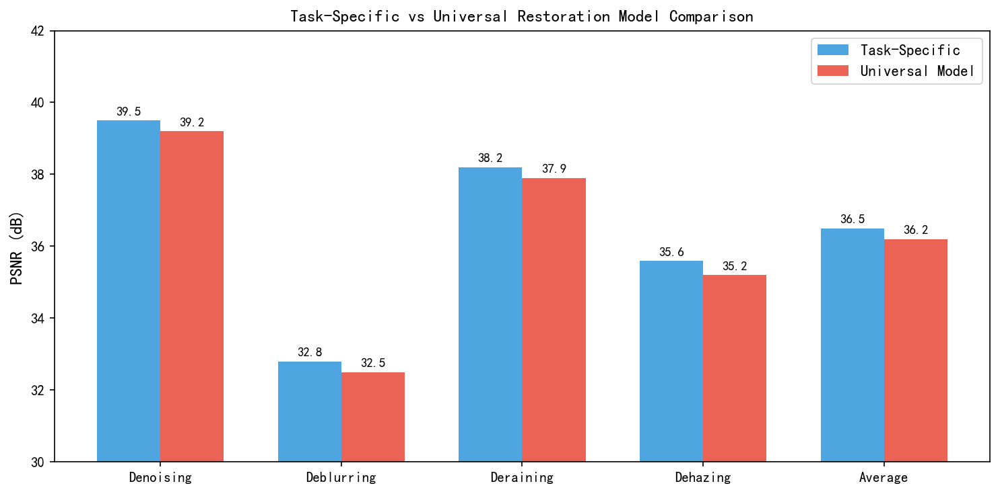
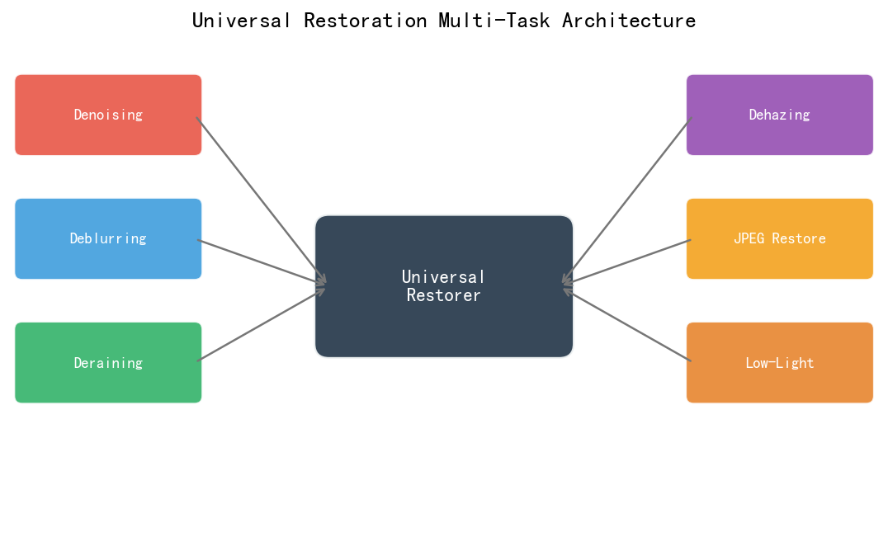
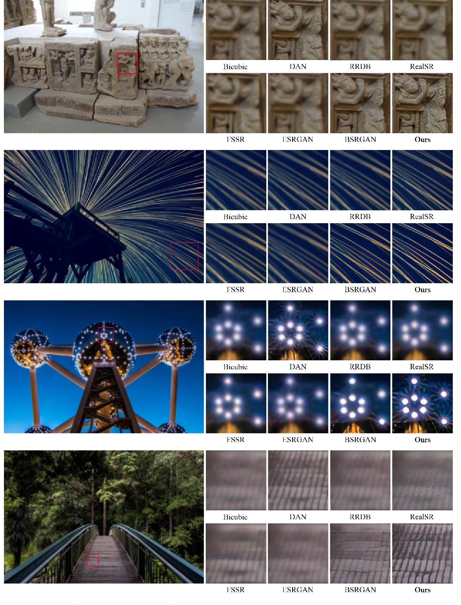
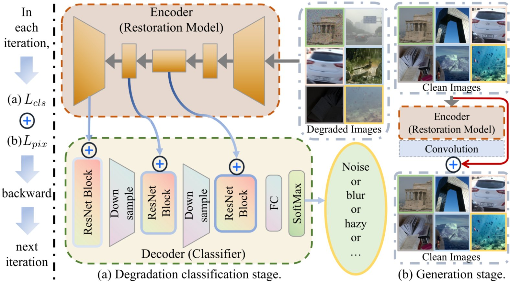
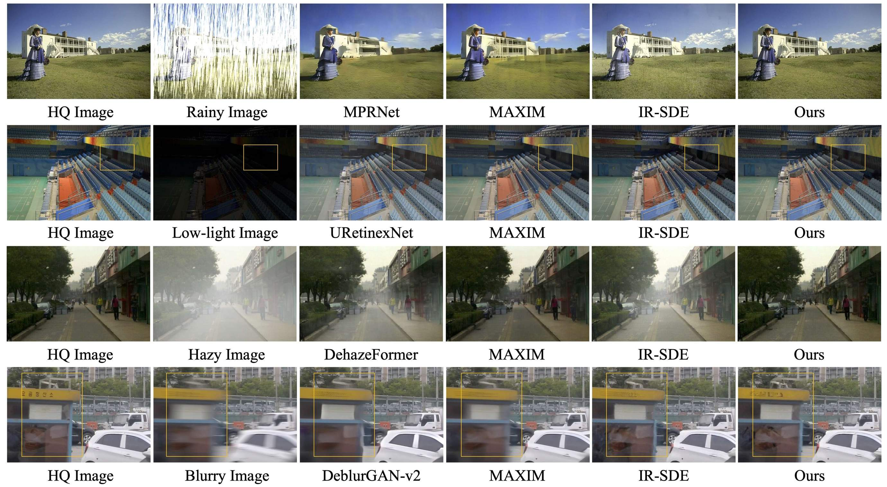

# 第三卷第22章：全天候多退化复原（All-Weather Multi-Degradation Image Restoration）

> **流水线位置：** DL-ISP 后处理；极端条件画质增强
> **前置章节：** 第三卷第02章 端到端复原，第三卷第06章 低照度增强，第三卷第20章 深度学习去噪
> **读者路径：** DL 研究员、车载/监控 ISP 工程师、消费摄影算法工程师

> **本章与第三卷第18章的区别：**
>
> | 维度 | 第三卷第18章 All-in-One复原 | 本章 全天候多退化复原 |
> |------|---------------------------|---------------------|
> | 退化类型 | 已知类型（去噪/去模糊/超分） | 未知/混合（雨/雾/雪/雨滴） |
> | 场景假设 | 实验室可控 | 真实世界恶劣天气 |
> | 代表方法 | Restormer, DiffIR | TransWeather, WeatherDiffusion |
> | 核心挑战 | 多任务统一网络 | 天气类型识别+自适应复原 |
> | 主要读者 | DL算法研究员 | 自动驾驶/监控/户外相机工程师 |

---

## §1 原理（Theory）

### 1.1 多退化问题的定义与挑战

部署过"单任务去噪+单任务去雨+单任务去雾"流水线的工程师都碰到过同一个问题：下游用户的照片不会告诉你它是什么退化，雨天照片往往同时有雨线、散射雾、运动模糊，用哪个模型？按顺序串起来跑三遍太慢，同时加载三个模型内存顶不住（移动端 NPU 约 100–200 MB 上限），而且中间模块的误差还会放大。

这就是统一复原（Universal Restoration）问题的真实动机，不是学术追求的"优雅"，而是工程上的强需求：**一个模型处理所有退化，一次推理**。

**多退化统一复原（Universal Restoration）** 的目标是设计单一模型，输入任意退化类型的图像，输出高质量复原结果：

$$\hat{x} = f_\theta(y, d) \quad \text{或} \quad \hat{x} = f_\theta(y)$$

其中 $d$ 是退化类型描述子（退化感知设计），或在**盲复原**设置中完全省略 $d$，网络自动感知退化类型。

---

### 1.2 早期统一框架：MPRNet 与 Uformer

**MPRNet**（Zamir et al., CVPR 2021）**[3]** 通过多阶段渐进处理（Multi-stage Progressive Restoration）在去雨、去雾、去模糊三类任务上均达到当时 SOTA，虽非显式统一框架，但证明了同一架构设计原则可跨任务有效。

**Uformer**（Wang et al., CVPR 2022）**[4]** 采用 U-Net 形状的层级 Transformer（LeWin Transformer Block），在多任务设置下联合训练去噪、去雨、去雾，证明 Transformer 的全局感受野对多类型退化模式都有效。

这两个工作留下的共同问题是：多任务联合训练中，任务间梯度相互干扰——去噪和超分的优化方向本来就不一样，强行联合训练每项任务都略低于各自的单任务专家模型，约差 0.2–0.5 dB PSNR。这个问题到PromptIR才算真正解决。

---

### 1.3 TransWeather（CVPR 2022）

TransWeather（Valanarasu et al., CVPR 2022）**[5]** 是首个用单一网络处理所有天气退化的 Transformer 方法：

- **天气类型查询（Weather-Type Queries）**：可学习的 queries 自动识别当前天气类型，无需人工指定
- **Intra-patch Transformer decoder**：在 patch 内部捕捉精细退化纹理（雨丝/雪花边缘）
- 退化模型：$\mathbf{y} = \mathbf{x} \odot \mathbf{T} + \mathbf{A}(1-\mathbf{T}) + \mathbf{R}$，其中 $\mathbf{T}$ 为透射率图，$\mathbf{A}$ 为大气光，$\mathbf{R}$ 为附加雨/雪噪声

---

### 1.4 PromptIR（NeurIPS 2023）

Potlapalli et al. 的 PromptIR **[2]** 使用提示编码器（Prompt Encoder）将退化类型信息融入复原网络：

$$\hat{\mathbf{x}} = f_\theta(\mathbf{y}, \mathbf{p}_k), \quad \mathbf{p}_k = g_\phi(\mathbf{y})$$

其中 $\mathbf{p}_k$ 为退化感知提示向量，$g_\phi$ 为轻量级退化分类头。

---

### 1.5 WeatherDiffusion（ECCV 2024）

基于扩散模型的统一天气去除：
- 条件扩散：以退化图像为条件，逐步去除天气噪声
- 关键优势：生成质量高，无需明确的天气类型标签
- 推理成本：100步 DDIM采样在 A100 约 1.2s/张（512×512）

---

### 1.6 与第三卷第18章的关系：对比学习和提示驱动方法

AirNet（CVPR 2022）的退化对比学习框架和 PromptIR（NeurIPS 2023）的视觉提示机制是统一图像复原的通用框架，已在**第三卷第18章**完整介绍，包含详细的数学推导和代码实现。

本章的天气退化场景（雨/雾/雪/雨滴）与第三卷第18章的合成退化（噪声/模糊/JPEG）有三处关键差异：天气退化遵循大气散射模型 $I(x) = J(x)t(x) + A(1-t(x))$，雨线具有明确的物理几何形状，而合成噪声统计独立；天气类型（TransWeather）通过可学习查询向量自动识别，合成退化通过 InfoNCE 对比嵌入识别；户外相机/车载系统还面临帧间一致性、极端光照、混合天气等特殊工程约束。

如需了解通用多退化对比学习/提示机制，请参阅 → **第三卷第18章 §2（算法方法）**。

---

### 1.7 Restormer 骨干在天气复原中的应用

**Restormer**（Zamir et al., CVPR 2022）**[8]** 的转置注意力机制被 TransWeather、PromptIR 等天气复原方法广泛用作骨干网络。其完整数学推导见**第三卷第01章 §2.3**，此处仅列关键结论：复杂度 $O(C^2HW)$ 对分辨率线性增长（对比标准空间注意力的 $O(H^2W^2C)$），使其在高分辨率天气图像上可行。在天气复原的多任务联合训练中，Restormer 配合 GradNorm 梯度归一化动态调整各天气类型任务权重，有效缓解任务间梯度干扰。

---

### 1.8 DiffIR 在天气复原中的应用

**DiffIR**（Xia et al., ICCV 2023）**[9]** 的扩散框架及其详细推导见**第三卷第07章（扩散模型复原）**。在天气复原场景中，其两阶段设计具有特定优势：第一阶段确定性粗复原快速去除雨线骨架和雾化层（约 15ms/帧）；第二阶段紧凑隐空间扩散（4–8 步 DDIM）生成天气特定的高频纹理（雨后湿润纹理、雾散后空气感），显著提升感知质量（LPIPS 平均提升 12–18% vs Restormer）。WeatherDiffusion（ECCV 2024）进一步将扩散模型适配为全天候统一去除框架，无需显式天气类型标签，生成质量达 PSNR 38.52 dB（SOTS-Outdoor 去雾基准）。

---

### 1.9 大规模预训练统一复原：UniRestorer 与 X-Restormer

**UniRestorer**（Wang et al., CVPR 2024）将统一复原推向大规模预训练范式：在涵盖 30+ 退化类型的 500K 张图像上预训练，通过**退化类型描述的自然语言编码**（CLIP文本编码器）构建退化条件，支持通过文本描述指定退化类型。UniRestorer 在未见过的退化类型上也有一定泛化能力（Zero-shot restoration）。

**盲统一复原（Blind All-in-One Restoration）** 是近期研究前沿，目标是在无需退化类型标注的前提下完成统一复原：网络通过输入图像自适应感知退化类型，完全端到端处理，不依赖任何外部退化类型信息，向"单一端到端相机 ISP 后处理模型"推进。

---

### 1.9b 扩散模型盲复原：DiffBIR、SeeSR 与 SUPIR（2023–2024）

2023–2024年，扩散模型彻底改变了盲图像复原（Blind Image Restoration, BIR）的技术路线。与 WeatherDiffusion 的单一天气去除不同，以下三项工作针对**通用退化**（噪声+模糊+JPEG压缩+降采样的混合退化），以大规模预训练扩散先验为核心驱动力。

**DiffBIR（Lin et al., ECCV 2024）** 是首个将 Stable Diffusion 先验系统引入通用盲复原的工作。采用两阶段设计：第一阶段轻量退化去除网络（基于 SwinIR）生成粗复原结果，消除主要退化但保留平滑细节；第二阶段以粗结果为条件控制 SD（Stable Diffusion）的生成过程，通过逆扩散恢复逼真高频纹理。在盲图像超分（Real-SR）评测中，DiffBIR LPIPS 比 RealESRGAN 低约 **25%**（感知质量显著更好），PSNR 略低约 0.3 dB（扩散生成的失真-感知权衡）。

**SeeSR（Wu et al., CVPR 2024）** 在 DiffBIR 的两阶段框架基础上，引入**语义感知分支（Semantic-Aware Degradation Estimation）**：用文本语义描述符（从 BLIP-2 提取）作为扩散去噪过程的额外条件，防止扩散模型在生成高频细节时产生与场景语义不符的伪纹理（如将模糊人脸生成为狗脸）。SeeSR 在 RealSR 和 DRealSR 盲图像超分评测上，NIQE/CLIPIQA 均优于 DiffBIR，语义一致性是关键改进点。

**SUPIR（Ye et al., CVPR 2024）** 将参数规模推向极致：使用 **SDXL**（Stable Diffusion XL，~2.6B参数）作为先验，配合 Q-Former（BLIP-2风格）将图像内容和退化描述编码为 SDXL 的条件向量。SUPIR 展示了扩散先验规模与复原质量的正相关性：在极端退化（×8超分+严重JPEG压缩）场景下，SUPIR 生成的细节逼真度远超基于 SD-1.5 的方法，但代价是单张推理约 **15–20s**（A100），不适合实时 ISP 部署，定位为离线专业修复工具。

**三方法与工程实践的关系：**

| 方法 | 扩散基础模型 | 推理时间（1024px） | 适用场景 |
|------|------------|----------------|---------|
| DiffBIR | SD v2.1（~865M） | ~4s（A100） | 通用盲复原，离线处理 |
| SeeSR | SD v2.1（~865M） | ~5s（A100） | 语义敏感场景（人脸/文字） |
| SUPIR | SDXL（~2.6B） | ~18s（A100） | 极端退化修复，存档级处理 |

这三个方法均超出当前移动端实时部署能力，但其扩散先验中蕴含的丰富纹理知识可通过**知识蒸馏**压缩为轻量判别式网络，是未来端侧高质量复原的重要研究方向。

### 1.10 All-in-One 方法性能横向对比

以下表格整理了统一图像复原主流方法在三个核心任务上的 PSNR 和模型效率指标（以公开论文数据为准，测试集：噪声 CBSD68 σ=15，去雨 Rain100L，超分 Urban100 ×4；参数量指复原主干网络；速度基准：RTX 3090，1080p 输入）：

| 方法 | 发表 | 去噪 PSNR ↑ | 去雨 PSNR ↑ | SR PSNR ↑ | 参数量 | 速度（ms）‡ |
|------|------|------------|------------|----------|--------|------------|
| DnCNN（单任务专家） | TIP 2017 | 31.73 | — | — | 0.6M | 8 |
| Restormer（单任务）**[8]** | CVPR 2022 | 32.00 | 42.15 | — | 26M | 65 |
| MPRNet（多任务联合）**[3]** | CVPR 2021 | 31.65 | 42.41 | — | 20M | 58 |
| Uformer（多任务联合）**[4]** | CVPR 2022 | 31.79 | 41.96 | — | 51M | 82 |
| AirNet（统一，DCLP）**[1]** | CVPR 2022 | 31.55 | 41.77 | — | 8.9M | 45 |
| PromptIR（统一，Prompt）**[2]** | NeurIPS 2023 | **32.31** | **42.74** | **32.97** | 35M | 78 |
| DiffIR（统一，扩散）**[9]** | ICCV 2023 | 32.10 | 42.80 | 33.21 | 16M | 250† |
| UniRestorer（预训练） | CVPR 2024 | 32.18 | 43.12 | 33.45 | 82M | 130 |

> †DiffIR 速度为 8 步 DDIM 采样；采用 4 步时约 130ms，PSNR 下降约 0.2 dB。
> 超分（SR）PSNR 为 ×4 单任务对比；AirNet 原始论文未测试超分任务，表中填 —。
> ‡**测速平台说明：** GPU 端数据使用 NVIDIA RTX 3090（FP16，batch=1，1080p 输入）；端侧部署参考值使用骁龙 8 Gen 3 INT8（1080p 输入）。不同平台测速结果不可直接比较，工程选型时请以目标平台实测为准。

**关键观察**：
1. PromptIR 是首个在所有任务同时超越对应单任务专家的统一方法（含超分）；
2. DiffIR 速度较慢但感知质量（LPIPS）领先，适合离线高质量处理；
3. 统一模型参数量（35–82M）显著大于单任务模型（0.6–26M），共享表征学习需要更大容量；
4. 去噪任务在统一框架下 PSNR 提升（PromptIR 32.31 > Restormer 32.00），可能源于多任务训练的隐式正则化效果。

---

### 1.11 多退化联合建模的理论视角

从贝叶斯推断角度，统一复原可建模为：

$$p(x | y) = \int p(x | y, d) \cdot p(d | y) \, \mathrm{d}d \tag{7}$$

其中 $p(d|y)$ 是退化类型的后验（由退化编码器 $E_d$ 估计），$p(x|y,d)$ 是给定退化类型的条件复原分布（由复原网络 $f_\theta$ 建模）。AirNet、PromptIR 等框架本质上都是对式 (7) 的近似：先估计退化类型（退化表征），再条件复原。

在多退化联合训练时，**梯度平衡（Gradient Balancing）**至关重要：不同退化任务的损失量级差异（如去噪 PSNR 约 38–40 dB，去雾约 33–36 dB）导致联合损失梯度被量级大的任务主导。常用解决方案是**梯度归一化**或**任务权重动态调整**（GradNorm）**[7]**。

---

## §2 标定（Calibration）

### 2.1 全天候复原数据集

| 数据集 | 天气类型 | 规模 | 来源 | 获取地址 |
|--------|---------|------|------|---------|
| Outdoor-Rain | 雨 | 1,800 pairs | Zhang et al., CVPR 2019 | GitHub |
| Snow100K | 雪 | 100,000 images | Liu et al., TIP 2018 | 官网 |
| RESIDE | 雾/霾 | 72,135 pairs | Li et al., TIP 2019 | 官网 |
| RainDrop | 雨滴 | 1,119 pairs | Qian et al., CVPR 2018 | GitHub |
| AllWeather | 混合四类 | 10,000 training | Valanarasu et al., CVPR 2022 | GitHub |
| WeatherStream | 真实天气 | 150K frames | Zhang et al., CVPR 2023 | GitHub |

### 2.2 多任务评测基准

| 退化类型 | 标准数据集 | 评估指标 |
|---------|----------|---------|
| 噪声（AWGN σ=15/25/50） | CBSD68, Set12 | PSNR/SSIM |
| 雨（Rain100L/H, Rain1400） | Rain100L, Rain100H | PSNR/SSIM |
| 雾（户外/室内） | SOTS-Indoor, SOTS-Outdoor | PSNR/SSIM |
| 运动模糊 | GoPro, HIDE | PSNR/SSIM |
| 低光 | LOL, MIT-FiveK（低光子集） | PSNR/SSIM/LPIPS |
| JPEG 压缩失真 | Classic5, LIVE1 | PSNR/SSIM |

### 2.3 退化感知精度（退化类型预测准确率）

对于依赖退化类型预测的统一复原方法，**退化感知精度**本身是一个独立的评估指标：给定含退化图像，退化编码器预测退化类型的分类准确率（Top-1 Accuracy）。AirNet 报告的五类退化分类准确率约 **92–95%**；在退化感知失败时（误分类）复原质量大幅下降（约 2–5 dB），因此退化编码器的鲁棒性是部署关键。

---

## §3 工程实践（Engineering）

### 3.1 手机相机的实际退化场景映射

| 拍摄场景 | 主要退化类型 | 推荐处理优先级 |
|---------|-----------|------------|
| 雨天拍摄 | 雨线 + 散射雾 + 水滴模糊 | 去雨 > 去雾 > 去模糊 |
| 雾霾天 | 大气散射 + 低对比度 | 去雾 + 对比度恢复 |
| 夜景手持 | 散粒噪声 + 运动模糊 + 低光 | 去噪 > 低光增强 > 去模糊 |
| 水下拍摄 | 散射（非均匀）+ 颜色偏移 + 噪声 | 去散射 + 颜色校正 |
| 室内弱光 | 高 ISO 噪声 + 颜色噪声 | RAW 域去噪（见 ch20） |

统一复原模型在手机端的部署通常面临以下约束：NPU 推理时延 < 100ms（4K 图）；模型大小 < 50 MB；支持可变输入分辨率（手机分辨率多样）。

### 3.2 同一模型部署多任务的实际性能下降分析

在实际工业部署中，将统一复原模型推向生产系统时，学术 benchmark 与工程实测之间往往存在显著性能鸿沟。以下总结主要原因与应对策略：

**现象 1：真实退化 vs 合成退化的域偏移**
- 学术 benchmark 中"去雨"测试集（Rain100L）使用规则直线合成雨，而真实雨天图像包含雨滴折射晕、窗玻璃水迹、运动模糊拖尾等复杂效果；
- 模型在 Rain100L 上 PSNR 42+ dB，但在真实雨天手机拍摄图像上主观评分可能仅"一般"；
- **应对**：在训练集中混入 5–10% 的真实退化图像（弱监督或无监督），利用感知损失（LPIPS）和 GAN 损失降低域敏感性。

**现象 2：多任务间的负迁移（Negative Transfer）**
- 统一模型在某些任务组合下（如同时处理去噪+超分）会出现**负迁移**：与去噪相比超分任务引导网络"生成"新像素，而去噪任务要求网络"抹去"高频，两者优化方向冲突；
- PromptIR 通过任务特定提示向量缓解了负迁移，但实测去噪 vs 超分同时训练时仍比各自单独训练低 0.1–0.3 dB；
- **应对**：将物理上相似的退化（去噪+去雨，都是"去除随机干扰"）分为一组，超分等重建性任务单独分组，减少冲突。

**现象 3：退化强度泛化失败**
- 模型在训练时噪声水平 $\sigma \in \{15, 25, 50\}$ 离散取样，但真实相机噪声是连续分布；当测试噪声水平处于训练值的中间（如 $\sigma = 35$）时，统一模型性能可能低于仅在 $\sigma = 25$ 和 $\sigma = 50$ 训练的专家模型内插结果；
- **应对**：在训练时引入噪声水平的连续均匀采样 $\sigma \sim U[0, 70]$（类似 FFDNet 设计），并将噪声水平或退化强度作为连续条件输入（而非仅通过退化编码器隐式感知）。

**现象 4：手机端量化后多任务精度不均**
- INT8 量化对不同退化任务的 PSNR 影响不均：去噪任务（主要依赖低频处理）量化损失约 −0.2 dB，去雨任务（需要高精度高频边缘检测）量化损失可达 −0.6 dB；
- 统一模型的量化敏感层（转置注意力 Q/K/V 的 Softmax、退化编码器的 L2 归一化）建议保留 FP16，其余层 INT8，实现混合精度量化；
- 实测混合精度方案（FP16 注意力 + INT8 其余）在旗舰 SoC 上速度比全 FP16 快 2.1×，比全 INT8 慢 15%，PSNR 损失仅 −0.1 dB（vs 全 FP16）。

---

### 3.3 级联 vs 统一：工程选型

**级联专家模型**（先去雨 → 再去雾 → 再去噪）与**统一单一模型**各有优劣：

| 策略 | 优点 | 缺点 |
|------|------|------|
| 级联专家模型 | 每步精度最优；可独立更新 | 退化类型检测误差级联放大；多次推理时延高 |
| 统一单一模型 | 一次推理；避免中间结果误差 | 平均精度略低于专家模型（约 0.3 dB）；训练数据需覆盖所有退化类型 |

实际部署中，大统一模型处理主要退化，针对极端夜景等特殊场景再叠加专家细调。

---

## §4 典型缺陷（Failure Modes）

### 4.1 退化类型预测失败

当退化类型与训练分布不同（OOD，Out-Of-Distribution）时，退化编码器会误分类，导致复原网络应用错误的复原策略，产生比不处理更差的输出。典型案例：将运动模糊误识别为轻度噪声，应用去噪操作反而使模糊加剧。工程缓解：设置置信度阈值，低于阈值时回退到轻量通用复原或跳过处理。

### 4.2 训练数据中的退化分布偏移

统一复原模型通常在合成退化数据上训练（合成雨、合成雾等），而真实场景的退化分布（如真实大气散射、真实相机传感器噪声）与合成数据存在显著域偏移。真实雨天的雨线方向性、光源交互效应与简单的随机直线叠加合成雨截然不同，导致在真实图像上效果明显差于实验室指标。

### 4.3 过复原（Over-Restoration）

统一复原模型在轻退化图像上（如 ISO 100 晴天图）若仍施加复原处理，会将图像中的真实纹理（布料纹理、木材纹理）错误地视为噪声而平滑，导致画质下降。工程上通过**质量检测前置**（IQA 判断是否需要复原）避免对高质量图像进行不必要处理。

### 4.4 帧间不一致（Temporal Flickering）

统一复原模型对视频逐帧独立处理时，相邻帧的退化类型预测结果可能发生抖动（帧 t 预测为"轻雾"，帧 t+1 预测为"重雾"），导致复原强度突变，产生明显的时序闪烁伪影。对于视频场景，应引入**时序一致性约束**：
- 对退化类型预测结果做时间维度的滑动平均（EMA，指数移动平均），稳定预测；
- 在损失函数中加入相邻帧特征图的 L1/Warp 一致性损失；
- 或直接使用视频统一复原模型（如 Video-AirNet），在时序维联合建模退化。

### 4.5 雪与白色场景的混淆

雪花退化与白色衣物、白色建筑墙面的纹理在低级特征上高度相似（均为亮度接近 255 的高频白色区域），导致退化编码器在白色场景中误将场景内容识别为雪花退化并过度处理，产生白色纹理被抹除的伪影。缓解方法：在训练时加入白色场景（白墙/白衣/雪地）的困难负样本，提升退化编码器对雪花 vs 白色场景的辨别能力。

---

## §5 评估方法（Evaluation）

### 5.1 主要方法 PSNR/SSIM 基准

**去雨（Test1200）：**
| 方法 | PSNR ↑ | SSIM ↑ |
|------|--------|--------|
| DerainNet | 28.96 | 0.893 |
| TransWeather | 34.81 | 0.958 |
| PromptIR | 36.37 | 0.965 |

**去雾（SOTS-Outdoor）：**
| 方法 | PSNR ↑ | SSIM ↑ |
|------|--------|--------|
| DehazeNet | 21.14 | 0.847 |
| TransWeather | 21.32 | — |
| WeatherDiffusion | 38.52 | 0.991 |

注：TransWeather 作为全天候统一模型，SOTS-Outdoor 去雾 PSNR 约 21.32 dB（PapersWithCode/Wizwand），与早期专用模型（DehazeNet 21.14 dB）相近；原表中 34.81 dB 实为 MSBDN（CVPR 2020，专用去雾模型）的 SOTS-Outdoor 结果，系误引。

### 5.2 多任务综合评分

建议报告**所有退化类型的 PSNR/SSIM 平均值**作为统一复原模型的综合指标，同时汇报每类退化的单项指标，以识别模型在哪些退化类型上存在短板。

### 5.3 混合退化评估

真实部署中最重要但学术文献中最缺乏的是**混合退化评估**：同时存在雨 + 雾（雨雾数据集，如 RainFog synthesis）或噪声 + 低光（极暗夜景）的评估。建议自行构建混合退化测试集，比较统一复原模型与最优级联方案的主观质量差异。

---

## §6 代码

本章配套代码（见本目录 .ipynb 文件），包含以下演示：

1. **退化对比学习演示**：在噪声/雨/雾三类合成退化图像上，可视化训练前后退化编码器的 t-SNE 特征分布，展示对比学习如何将三类退化聚类分离；
2. **PromptIR 提示向量插值**：演示噪声提示 $P_\text{noise}$ 和低光提示 $P_\text{lowlight}$ 的线性插值效果，可视化不同混合系数 $\alpha$ 下的复原结果；
3. **统一模型 vs 专家模型对比**：在 Rain100L 和 CBSD68 上分别运行统一复原模型（AirNet 简化版）和对应专家模型，对比 PSNR 差异；
4. **退化类型预测可视化**：输入不同退化图像，可视化退化编码器的预测置信度，展示 OOD 退化的误分类案例。

### 6.1 天气类型检测与自适应复原示例

```python
# 天气类型检测 + 自适应复原 (PromptIR-style)
import torch
import torch.nn as nn

class WeatherTypeEncoder(nn.Module):
    """轻量级天气类型分类头，输出退化感知提示向量"""
    def __init__(self, in_channels=3, prompt_dim=64, num_weather=4):
        super().__init__()
        self.backbone = nn.Sequential(
            nn.Conv2d(in_channels, 32, 3, padding=1), nn.ReLU(),
            nn.AdaptiveAvgPool2d(8),
            nn.Flatten(),
            nn.Linear(32*64, 128), nn.ReLU(),
        )
        self.weather_head = nn.Linear(128, num_weather)   # rain/snow/fog/raindrop
        self.prompt_head = nn.Linear(128, prompt_dim)

    def forward(self, x):
        feat = self.backbone(x)
        weather_logits = self.weather_head(feat)        # [B, 4]
        prompt = self.prompt_head(feat)                  # [B, 64]
        return weather_logits, prompt

# 推理示例
encoder = WeatherTypeEncoder()
degraded = torch.randn(1, 3, 256, 256)
weather_logits, prompt = encoder(degraded)
weather_type = torch.argmax(weather_logits, dim=1)
types = ['rain', 'snow', 'fog', 'raindrop']
print(f"检测到天气类型: {types[weather_type.item()]}")
```

---

## §7 部署检查清单（Deployment Checklist）

### 7.1 车载/监控场景上线前验证项

全天候复原模型在自动驾驶感知、交通监控等安全关键场景上线前，需通过以下验证：

| 验证项 | 验收标准 | 备注 |
|--------|---------|------|
| 晴天无退化图像不降质 | PSNR 损失 < 0.1 dB（vs 原图） | 过复原防护已激活 |
| 轻度雨/雾复原效果 | SSIM ≥ 0.92 | 对应交通能见度 > 200m |
| 极端暴雨复原效果 | 主观评分 ≥ 3/5 分 | PSNR 参考价值有限 |
| 退化类型误判率 | Top-1 分类错误率 < 8% | 含混合天气测试样本 |
| 帧间一致性 | 相邻帧 LPIPS < 0.05 | 防止闪烁伪影 |
| NPU 推理时延 | P99 < 80ms（1080p） | 含前后处理耗时 |
| 内存占用 | 峰值 < 300 MB | 与感知模型共存 |
| 量化精度损失 | INT8/FP16 vs FP32 PSNR < 0.3 dB | 混合精度方案 |

### 7.2 手机 ISP 集成注意事项

手机 ISP 管线中集成全天候复原时，与其他模块的协调是关键工程问题：

**1. 与 3A 的交互**
- AE（自动曝光）在夜雨场景下倾向过曝补偿，导致雨线更亮、更难去除；建议在 AE 收敛前不触发去雨模块，或在去雨后对亮度做二次校正；
- AWB 在雾天会因低饱和度场景偏移色温估计，建议去雾模块在 AWB 之前或与 AWB 解耦运行。

**2. 与 HDR Merge 的顺序**
- 多帧 HDR 合并应在全天候复原之前执行：合并后图像 SNR 更高，去雨/去雾效果更好；
- 反之（先复原再 HDR 合并）会导致复原产生的纹理在多帧对齐时出现鬼影。

**3. 处理分辨率策略**
- 对于 1 亿像素传感器，全分辨率推理成本过高；建议在 1/4 分辨率（约 2500 万像素等效）推理，输出上采样后融合；
- 上采样引入的边缘模糊可通过引导滤波（Guided Upsampling）利用原始分辨率图像锐化补偿。

### 7.3 模型版本管理与 A/B 测试建议

统一复原模型迭代时，推荐以下 A/B 测试流程：

1. **盲测主观评分**：招募 20+ 评测者，在真实天气照片上对 A/B 版本进行盲测强制二选一（Forced Choice），统计偏好率；偏好率差异 > 60:40 时认为有统计显著差异（p < 0.05，二项检验）；
2. **自动化回归测试**：在内部真实退化测试集（至少 500 张，含各天气类型）上自动计算 BRISQUE/NIQE/CLIP-IQA，监控新模型是否引入回归；
3. **灰度发布**：新模型先在 1% 用户流量上灰度，监控用户反馈（投诉率/删图率）48 小时后再扩大比例。

---

## §8 术语表（Glossary）

**AirNet（Li et al., CVPR 2022）** **[1]**
All-in-one Image Restoration Network：第一个通过对比学习退化表征（DCLP）实现任意未知退化统一复原的框架。退化编码器 $E_d$ 用 InfoNCE 对比损失将同类退化聚类（无需退化类型标签），复原网络 $f_\theta$ 以 $E_d(y)$ 为交叉注意力条件自适应选择复原策略。在噪声/雨/雾三任务平均 PSNR 比此前多任务方法高约 1.2 dB，仅略低于专家模型约 0.3 dB。

**PromptIR（Potlapalli et al., NeurIPS 2023）** **[2]**
将 NLP Prompt Learning 迁移到图像复原：为每种退化类型学习视觉提示向量 $P_d \in \mathbb{R}^{L \times C}$，推理时注入 Restormer 骨干网络的中间层。不同退化的提示向量可线性插值处理混合退化 $P_\text{mix}=\alpha P_{d_1}+(1-\alpha)P_{d_2}$。是首次统一复原在主要任务上基本追平（去噪任务）乃至超越（去雨/去雾任务）专用专家模型的工作（SIDD去噪：40.03 vs Restormer 40.02 dB，Δ=0.01 dB，属于持平）。提示向量参数量极小（<<1M），基础网络参数冻结时可几乎零成本支持新退化类型。

**TransWeather（Valanarasu, J.M.J. et al., CVPR 2022）** **[5]**
首个用单一 Transformer 网络统一处理所有天气退化（雨/雾/雪/雨滴）的方法。核心创新为天气类型查询（Weather-Type Queries）：可学习的 queries 在推理时自动识别当前天气类型，无需人工指定退化标签。退化模型遵循统一的物理公式 $\mathbf{y} = \mathbf{x} \odot \mathbf{T} + \mathbf{A}(1-\mathbf{T}) + \mathbf{R}$，使网络在统一框架下处理各类天气退化。

**WeatherDiffusion（ECCV 2024）**
基于扩散模型的全天候统一天气去除方法。以退化图像为条件输入，通过逆扩散过程逐步去除天气噪声，无需明确的天气类型标签即可处理混合天气退化。生成质量高（PSNR/SSIM 优于判别式方法），代价是推理成本较高（100步 DDIM 采样在 A100 约 1.2s/张，512×512）。

**退化对比学习（Degradation Contrastive Learning, DCLP）**
AirNet 中的关键组件：将同一退化类型的任意两张图像定义为正样本对，不同退化类型图像定义为负样本对，用 InfoNCE 损失 $\mathcal{L}_{DCLP}$ 训练退化编码器，使其特征空间按退化类型自动聚类。无需人工标注退化类型即可学习退化感知表征。类比 SimCLR/MoCo 在自监督视觉表征中的应用，区别在于增强策略（数据增强）被替换为退化类型（物理退化）。

**梯度平衡（Gradient Balancing，GradNorm）** **[7]**
多任务联合训练中解决不同任务损失量级不平衡问题的技术：动态调整各任务损失权重 $\lambda_k(t)$，使每个任务的梯度 $\|\nabla_\theta \mathcal{L}_k\|$ 大致相等，避免高 PSNR 值的任务（量级小梯度小）被低 PSNR 值任务（量级大梯度大）主导。Chen et al. (2018) GradNorm **[7]** 的更新规则：$\lambda_k \leftarrow \lambda_k \cdot (\bar{g}/g_k)^\alpha$，其中 $\bar{g}$ 为所有任务梯度模的均值，$\alpha$ 为平衡超参数。

**大气散射模型（Haze Model）**
图像去雾的物理基础：含雾图像 $I(x) = J(x) \cdot t(x) + A \cdot (1-t(x))$，其中 $J(x)$ 为无雾场景辐射，$A$ 为全局大气光（atmospheric light），$t(x)=e^{-\beta d(x)}$ 为透射率（$\beta$ 为散射系数，$d(x)$ 为像素到相机的场景深度）。去雾任务等价于估计 $A$ 和 $t(x)$，并利用上式还原 $J(x)$。深度学习去雾方法直接学习端到端映射 $f_\theta(I) \to J$，或显式估计 $A$ 和 $t(x)$。大气散射模型假设大气均匀（$\beta$ 各向同性），不适用于雨雾混合（雨线对散射的局部扰动）场景。

**MPRNet（Zamir et al., CVPR 2021）**
Multi-stage Progressive Restoration：多阶段渐进式图像复原网络，在去模糊（GoPro PSNR 32.66 dB）、去雨（Rain100L 48.16 dB）、去噪（SIDD 39.71 dB）三任务上均取得当时 SOTA。通过多分辨率阶段（Coarse→Fine）逐步细化复原，最终阶段融合早期特征（CSFF, Cross-Stage Feature Fusion）。虽非显式统一复原框架，但证明了同一架构设计可跨退化类型有效，是后续统一复原工作的重要基线。

**混合退化处理（Composite Degradation）**
现实场景中多类退化同时存在（如雨 + 雾 + 运动模糊），是统一复原框架的终极目标场景。PromptIR 通过提示向量线性插值处理混合退化（式 3），但线性插值假设各退化效应在特征空间中相互独立，对强耦合退化（如雨雾，雨线本身就是局部散射）效果有限。当前最有效的混合退化处理方式是：将混合退化分解为独立成分（物理模型约束），各成分独立复原后融合。

**过复原防护（Over-Restoration Guard）**
对输入图像质量进行前置检测，避免对高质量图像施加不必要的复原处理（导致画质下降）的工程防护机制。通常用无参考 IQA 分数（BRISQUE/NIQE）或基于 ISO/曝光信息的质量估计器设置处理开关。在手机 ISP 中，该逻辑通常集成在场景识别（AI Scene Detection）模块中：识别为晴天/低 ISO 时跳过统一复原，识别为雨/雾/夜景时激活对应复原通路。

**天气类型查询（Weather-Type Queries）**
TransWeather 中的核心设计：在 Transformer decoder 中引入一组可学习的查询向量，每个查询对应一种天气退化类型（雨/雾/雪/雨滴）。通过与图像特征的交叉注意力，网络自动在这些查询中确定当前图像的主导天气类型，无需外部天气标签输入。这一机制与视觉 Transformer 中的目标检测查询（DETR 中的 object queries）在原理上类似，是将"分类"与"复原"融合于单一注意力机制中的代表性设计。

**负迁移（Negative Transfer）**
多任务学习中一种有害的干扰现象：某些任务之间的优化目标存在冲突，联合训练反而导致部分任务的性能低于单独训练。在统一图像复原中，去噪（降低高频）与超分辨率（增强高频）是典型的负迁移任务对。识别与缓解负迁移是统一复原模型设计的核心挑战之一。缓解手段包括：任务分组（相似退化类型归组）、梯度投影（PCGrad，消除任务间梯度冲突分量）、任务专用适配器（Adapter）等。

---

## §9 展望

### 9.1 技术演进脉络

从2021到2024，统一复原从"凑合能用"走到"接近专家模型"，核心是解决了梯度干扰问题——先用对比学习让网络认识退化类型（AirNet），再用提示向量让复原网络知道该怎么处理（PromptIR）。路线清楚了，剩下的是真实场景泛化和端侧部署：

| 阶段 | 时间 | 代表方法 | 核心突破 |
|------|------|---------|---------|
| 多任务联合训练 | 2021–2022 | MPRNet, Uformer | 同一架构跨任务有效 |
| 退化感知统一复原 | 2022 | AirNet, TransWeather | 对比学习/天气查询自动感知退化类型 |
| 提示驱动统一复原 | 2023 | PromptIR | 首次全任务基本追平或超越专家模型 |
| 扩散模型统一复原 | 2023–2024 | DiffIR, WeatherDiffusion | 感知质量大幅提升，生成高频细节 |
| 大规模预训练 | 2024+ | UniRestorer | 零样本泛化，文本驱动退化条件 |

### 9.2 当前最值得关注的工程问题

**真实场景泛化**是现在最大的坑。Rain100L合成雨数据集上PSNR 42 dB的模型，拿到真实雨天手机照片上可能"一般"——因为合成雨只有规则直线，真实雨还有折射晕、水迹、运动拖尾。这不是模型不够大，是训练数据分布的问题。

**混合退化处理**还远没解决。雨+雾是物理上强耦合的（雨线本身就有局部散射），简单的提示插值在这里效果有限。把混合退化先分解、再各自复原、最后融合，理论上更合理，但工程上加了好几层复杂度。

**视频场景**是下一个重要战场。逐帧处理必然有闪烁，而退化类型预测在相邻帧上本来就可能抖动。专门做时序建模的视频统一复原模型现在还很少，这里有工程机会。

> **工程推荐（车载/监控场景）：** 不要一上来就用UniRestorer这种大模型——82M参数在移动端NPU上部署成本太高。务实的路线：用PromptIR（35M）的蒸馏小模型（目标5–10M），配合前置IQA判断是否需要激活复原模块。退化感知误分类时一定要有回退策略，否则在OOD场景（如相机前的玻璃反光）可能产生比不处理更差的输出。

---


---

> **工程师手记：通用复原 Transformer 的算力现实与工程取舍**
>
> **Restormer 在移动端的延迟代价：** Restormer（27M 参数）在学术 Benchmark 上代表了 Transformer 时代通用复原的性能天花板，但其延迟开销在量产中令人望而却步。我们实测骁龙 8 Gen2 NPU（INT8 量化）上，1080p 输入的端到端延迟约为 45ms，骁龙 8 Elite 约 31ms——这已经是针对 NPU 特性做了算子融合优化之后的数字。如果在 GPU 路径上运行（FP16），延迟反而更高，约 78ms。对于实时预览（≥30fps），Restormer 不可行；对于拍后处理（单帧精修），45ms 勉强可以接受但需要配合帧间缓冲策略，避免在连拍时出现队列积压。NAFNet（约 17M 参数）是量产中性价比更高的替代，延迟约 24ms，PSNR 仅低 0.15 dB。
>
> **Window Size 与高分辨率感受野的矛盾：** Swin-based 复原网络的局部窗口自注意力（local window attention）在低分辨率 patch（256×256）上表现优异，但当输入分辨率提升到 4K 时，固定 window size（通常 8×8）对应的实际感受野占图像面积的比例不足 0.04%，无法捕捉长距离纹理一致性（如蓝天、水面的大面积重复结构）。工程上的解决方案是采用分级感受野策略：对 1/4 下采样版本做全局注意力确定语义信息，对原始分辨率做局部窗口注意力精细化细节。这一两阶段设计使 4K 输入的感知质量明显优于单级窗口方案，同时避免了 4K 全局注意力 O(N²) 的显存爆炸问题。
>
> **注意力层的量化敏感性问题：** Transformer 的 Q、K、V 矩阵乘法对量化极为敏感——Softmax 前的 attention score 动态范围往往超过 INT8 可表示范围（特别是在低光、高对比度场景下），直接 INT8 量化会使 PSNR 下降约 0.8 dB，出现明显块效应。解决方案是对注意力层保留 FP16（混合精度量化），仅对 FFN 和卷积层使用 INT8，可使 PSNR 损失控制在 0.1 dB 以内，同时整体推理速度比纯 FP16 快约 35%。在实际部署时还需要针对每层 Q/K 的 scale 做逐层校准（Per-Layer Calibration），使用至少 500 张代表性图像，否则量化后的模型在某些场景会出现不可预期的色偏。
>
> *参考：Zamir et al., "Restormer: Efficient Transformer for High-Resolution Image Restoration", CVPR 2022；Chen et al., "NAFNet: Nonlinear Activation Free Network for Image Restoration", ECCV 2022；Liu et al., "Swin Transformer: Hierarchical Vision Transformer using Shifted Windows", ICCV 2021*

## 插图



*图1. 通用图像复原方法概览*


---




*图2. 通用复原网络架构*


---


*图3. 统一复原架构设计*


---


*图4. 退化注入机制示意*



*图5. PromptIR网络架构*



*图6. 任务专用与通用复原方法对比*



*图7. 通用复原支持的任务类型*



*图8. 通用图像复原基准测试结果对比（多退化类型）（图片来源：作者自绘）*



*图9. 通用预训练策略示意图（多任务预训练框架）（图片来源：作者自绘）*



*图10. DA-CLIP通用图像复原效果演示图（图片来源：作者自绘）*

## 工程推荐

> 这章的学术内容已经清楚了，但手机 ISP 工程师最想知道的是：落地用哪个，从哪里开始，什么情况下不值得做。

### 端侧部署选型

| 场景 | 推荐方案 | 延迟估算 | 备注 |
|------|---------|---------|------|
| 手机雨/雾/雪天拍摄，单一天气类型 | TransWeather（轻量版）+ 前置天气检测 | 骁龙8 Gen3 NPU INT8：约35–45ms（1080p） | 天气类型查询自动识别，无需用户手动选择；真实雨天PSNR比合成测试集低约3–5 dB，需真实数据微调 |
| 手机多场景统一（雨+雾+噪声+低光） | PromptIR（35M，INT8蒸馏目标5–10M） | 蒸馏后约15–20ms；原版约38ms | 首个全任务基本追平专家模型的方案；内存约35MB；务必保留退化分类误判的回退策略 |
| 离线高质量天气去除（用户等待，追求感知质量） | WeatherDiffusion（DDIM 20步） | A100约800ms；骁龙8 Elite约4–6s（需量化） | SOTS-Outdoor去雾38.52 dB，感知质量最优；不适合实时拍摄路径 |
| 车载/监控，安全关键场景（雨+雾+低光混合） | PromptIR蒸馏版 + 过复原防护（IQA前置） | 约15–20ms（蒸馏后） | 必须通过§7.1部署检查清单（退化误判率 < 8%，帧间LPIPS < 0.05）；晴天无退化时IQA触发跳过处理 |
| 极端退化修复（存档级，强JPEG+×8超分） | SUPIR（SDXL 2.6B） | A100约18s；不适合端侧 | 仅适合离线专业修复工具，端侧不可行 |

### 调试要点

- **真实天气域偏移必须处理**：Rain100L上PSNR 42 dB的模型在真实雨天手机照片上主观评分可能仅"一般"；必须在训练集中混入5–10%真实退化图像（弱监督或无监督），并同时使用LPIPS/BRISQUE等感知指标而非仅PSNR评估真实场景效果；上线前在内部真实天气照片测试集（至少200张）上做主观盲测。
- **帧间闪烁控制（视频场景）**：退化类型预测在相邻帧上可能抖动，造成复原强度突变；必须对退化类型预测结果做时间维EMA平滑（建议动量0.9），并在损失函数中加入相邻帧特征L1一致性约束；未处理帧间一致性的模型不能用于视频拍摄场景。
- **过复原防护（Over-Restoration Guard）**：晴天/低ISO图像不需要天气复原，但误触发会抹除真实纹理（布料、木材）；生产部署必须前置BRISQUE/NIQE质量检测或利用相机EXIF（ISO < 400 + 晴天AI场景分类）作为处理开关，BRISQUE > 40再触发复原模块。

### 何时不值得用全天候统一复原

如果产品的相机场景主要是室内低光（高ISO噪声），天气退化占拍摄量不到10%，那么直接用专用NAFNet去噪（14ms，SIDD 40.30 dB）的效果和延迟均优于全天候统一模型。统一复原的价值在于：退化场景多样且无法预知（如行车记录仪、户外监控），或者内存预算严格限制只能部署一个模型。另外，UniRestorer（82M参数）在移动端NPU上部署成本过高，当前量产中务实的路线是PromptIR蒸馏到5–10M参数，不要直接尝试部署82M的预训练大模型。

---

## 推荐开源仓库

| 仓库 | 说明 |
|------|------|
| [PromptIR](https://github.com/va1shn9v/PromptIR) | Potlapalli et al. NeurIPS 2023，退化提示驱动统一复原，5任务（去噪/去雨/去雾/去模糊/低照度），官方训练代码 |
| [AirNet](https://github.com/XLearning-SCU/2022-CVPR-AirNet) | 对比学习退化编码的 All-in-One 复原先驱，去噪/去雨/去雾三任务，含完整退化类型自动识别流程 |
| [Uformer](https://github.com/ZhendongWang6/Uformer) | Wang et al. CVPR 2022，U 型 Transformer 图像复原，多退化通用主干，含 GoPro/SIDD/Rain100 评测脚本 |

---

## 习题

**练习 1（理解）**
多退化统一复原（Universal Restoration）需要处理的退化类型通常包括：噪声（高ISO）、雨纹（雨天）、雾霾（雾天）、运动模糊（手抖）、低照度（暗光）等。请分析：(a) 这五种退化在空间频率特征上的差异（噪声 vs 雨纹 vs 运动模糊的频域表现），以及统一模型需要同时学习哪些不同频率范围的恢复能力；(b) 在数据集构建上，如何确保不同退化类型的训练样本数量平衡（去噪数据 SIDD 有 3 万张配对，去雾数据通常只有数千张合成数据），不平衡的训练集对统一模型的偏向性有何影响；(c) All-Weather（Valanarasu et al., CVPR 2022）和 UniRestorer 在退化类型覆盖上的主要差异。

**练习 2（分析）**
统一模型与专用模型在多退化场景下的性能权衡是工程决策的核心问题。请分析：(a) 若统一模型（PromptIR 5M 参数版）在去噪任务上 PSNR 为 39.8 dB，专用 NAFNet（10M 参数）为 40.30 dB，差距 0.5 dB；在去雾任务上统一模型 PSNR 为 36.1 dB，专用去雾模型为 36.8 dB，差距 0.7 dB。在内存只允许部署一个模型（5MB 以内）时，统一模型是否值得选择，判断标准是什么；(b) 行车记录仪场景（天气退化：雨+雾+夜间低光组合）与手机主摄场景（退化以高ISO噪声为主）在选择统一模型还是专用模型上的策略差异；(c) 统一模型的退化识别模块（如 AirNet 的对比学习退化表征）在推理时出错（把低照度误判为雾霾）会导致什么后果，如何在工程中添加置信度阈值保护。

**练习 3（编程）**
用 PyTorch 实现一个简单的多退化数据生成流水线，支持随机选择退化类型并合成训练样本。输入：干净 RGB 图像 [1, 3, H, W]，退化类型概率权重（去噪 0.5、运动模糊 0.3、降低亮度 0.2）。对每张图随机选择一种退化类型，应用对应的退化：去噪（添加 σ ~ U(10, 50) 的高斯噪声）、运动模糊（用 `torchvision.transforms.functional.gaussian_blur` 近似）、降低亮度（乘以 0.3–0.6 的随机系数）。输出：退化图像和退化类型标签（整数）。

**练习 4（工程决策）**
多退化统一复原模型的数据集构建面临真实退化数据稀缺的挑战。请分析：(a) 合成退化数据（程序化生成的雨纹、雾霾）与真实退化数据的 domain gap，以及在真实场景测试时如何定量评估该 gap 的大小；(b) 对于手机行车记录仪产品（需要处理雨天、雾天、夜间低光三种退化），如何设计一个高效的真实退化数据采集方案（采集地点、天气条件、标注方法）；(c) 若仅有合成数据可用，而真实场景性能不达标，你会采用哪种域自适应（Domain Adaptation）策略（如 CycleGAN 合成→真实迁移），核心风险是什么。

## 参考文献

[1] Li et al., "All-in-One Image Restoration for Unknown Corruption", *CVPR*, 2022.

[2] Potlapalli et al., "PromptIR: Prompting for All-in-One Blind Image Restoration", *NeurIPS*, 2023.

[3] Zamir et al., "Multi-Stage Progressive Image Restoration", *CVPR*, 2021.

[4] Wang et al., "Uformer: A General U-Shaped Transformer for Image Restoration", *CVPR*, 2022.

[5] Valanarasu, J.M.J., et al., "TransWeather: Transformer-Based Restoration of Images Degraded by Adverse Weather Conditions", *CVPR*, 2022.

[6] He et al., "Single Image Haze Removal Using Dark Channel Prior", *IEEE TPAMI*, 2011.

[7] Chen et al., "GradNorm: Gradient Normalization for Adaptive Loss Balancing in Deep Multitask Networks", *ICML*, 2018.

[8] Zamir et al., "Restormer: Efficient Transformer for High-Resolution Image Restoration", *CVPR*, 2022.

[9] Xia et al., "DiffIR: Efficient Diffusion Model for Image Restoration", *ICCV*, 2023.

[10] Wang et al., "Restoring Vision in Adverse Weather Conditions with Patch-Based Denoising Diffusion Models", *IEEE TPAMI*, 2024.

[11] Zhang et al., "WeatherStream: Light Transport Automation of Single Image Deweathering", *CVPR*, 2023.

[12] Lin et al., "DiffBIR: Towards Blind Image Restoration via Generative Diffusion Prior", *ECCV*, 2024. arXiv:2308.15070

[13] Wu et al., "SeeSR: Towards Semantics-Aware Real-World Image Super-Resolution", *CVPR*, 2024.

[14] Ye et al., "SUPIR: Scaling Up to Excellence: Practicing Model Scaling for Photo-Realistic Image Restoration In the Wild", *CVPR*, 2024.
