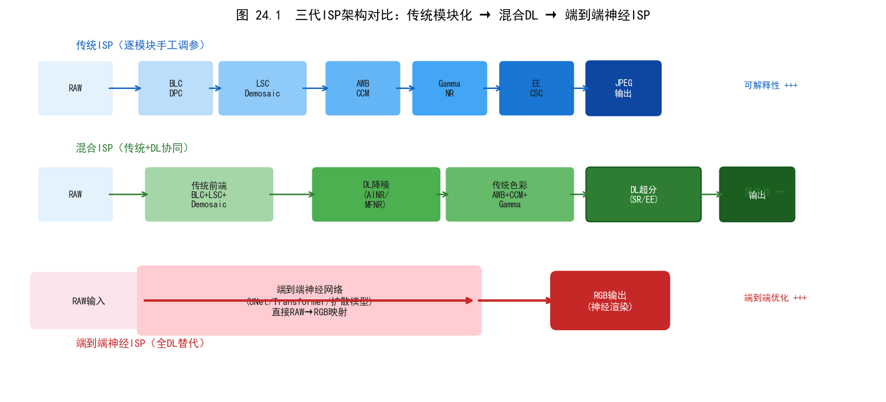
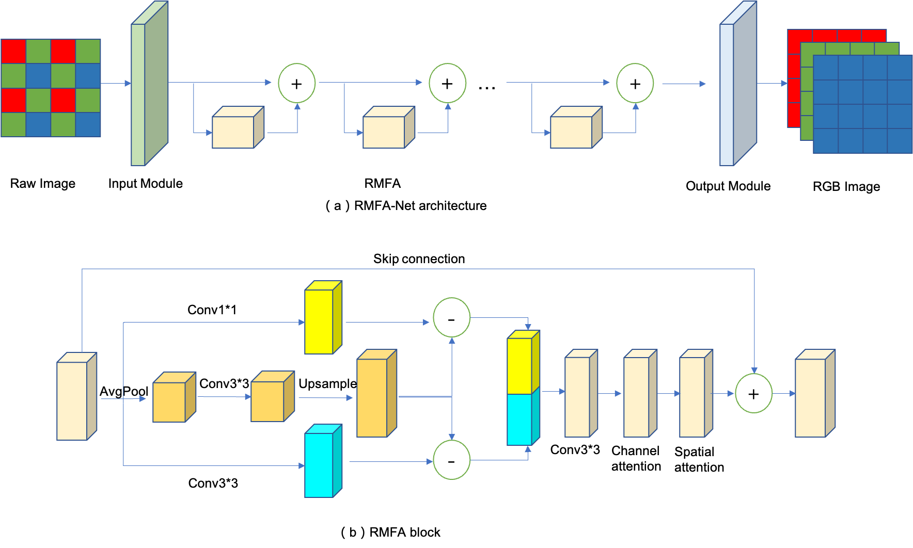
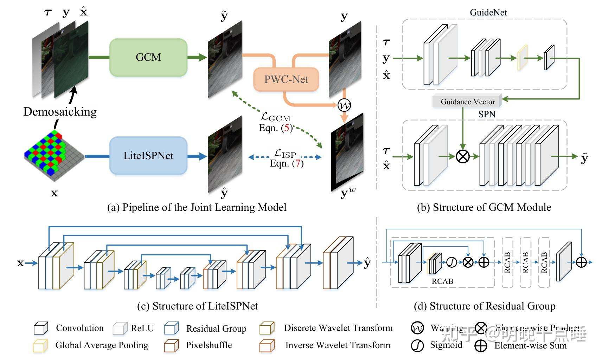
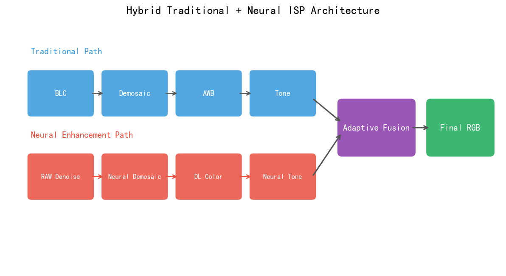
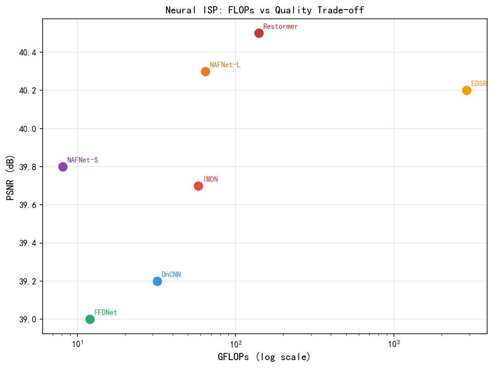
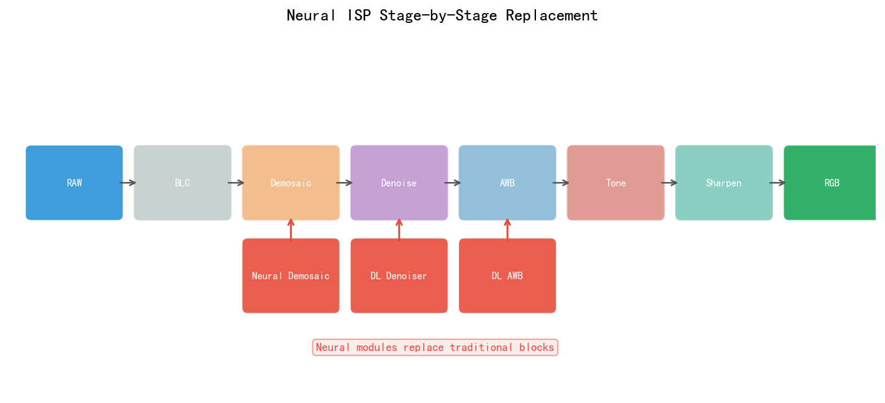
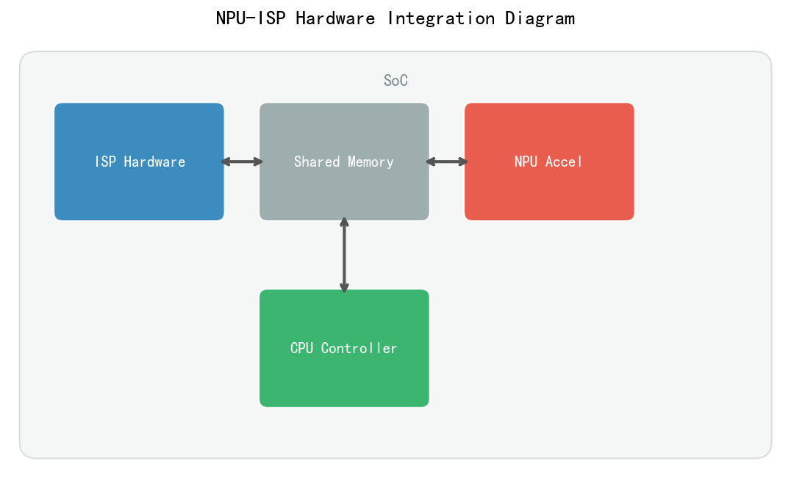
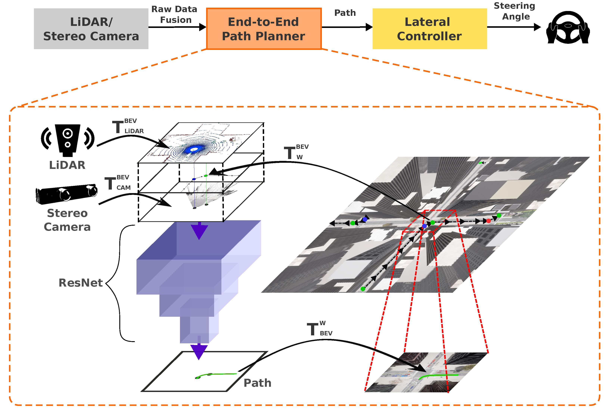

# 第三卷第24章：Neural ISP——端到端流水线学习与中性渲染范式

> **定位：** 本章系统梳理端到端可学习ISP的理论基础、主流架构与工业实践，重点解析"感知中性基底 + 风格层解耦"这一新兴范式——它对应消费摄影的品牌色彩体系，也是自动驾驶感知导向ISP的设计出发点。
> **前置章节：** 第三卷第01章（DL ISP综述）、第三卷第16章（生成式RAW-to-RGB）、第四卷第06章（任务驱动ISP）
> **读者路径：** ISP算法工程师、移动影像研究员、自动驾驶感知工程师

> **编排说明**：本章是第三卷的**全流水线综合章**，覆盖将神经网络替换整条ISP流水线的端到端范式（PyNet/LiteISPNet/Uni-ISP）及"中性渲染+风格解耦"的产品化路径。
> 本章编号靠后（ch24）是历史成书顺序原因；**内容上依赖 ch02–ch16 的各具体方法作为背景知识**，建议在读完 ch01（DL综述）及相关具体方法章节后阅读，以获得最佳理解效果。
> 若希望快速了解"完整神经ISP"的产品形态与工程现状，可在读完 ch01 后**选读本章 §1（理论原理）和工程师手记**，再按 ch02–ch23 深入各专题。

---

## §1 理论原理

### 1.1 传统ISP流水线的结构性局限

传统图像信号处理器（ISP）是一条由专家手工设计的串行有向图：

```
RAW (Bayer)
  │
  ├── DPC（坏点校正）
  ├── BLC（黑电平校正）
  ├── LSC（镜头阴影校正）
  ├── Demosaic（去马赛克）
  ├── AWB（自动白平衡）
  ├── CCM（色彩校正矩阵）
  ├── NR（降噪）
  ├── EE（锐化/边缘增强）
  ├── Gamma/Tonemapping（色调映射）
  └── CSC（色彩空间转换） → sRGB/YUV
```

这条流水线存在三类结构性局限：

**局限1：模块间优化目标割裂**
每个模块独立设计、独立调参，以自身的局部目标函数（如去噪 SNR、锐化 MTF50、色彩校正 ΔE）为优化目标，全局感知质量从未被显式优化。模块顺序依赖导致上游误差向下游传播放大——去马赛克引入的彩色伪影会被锐化模块进一步增强。

**局限2：场景自适应能力有限**
传统ISP依赖分档的LUT参数表（per-ISO、per-CCT多张表），通过内插实现有限的场景适应。现实场景空间（光照×噪声×运动×被摄体语义）的复杂度远超有限状态机能覆盖的范围。

**局限3：风格与内容耦合**
传统ISP将色彩风格（品牌调色、饱和度偏好）与内容保真度（颜色准确性、细节还原）混合在同一套参数中。改动CCM或Gamma曲线会同时影响色彩准确度和主观风格，无法独立控制。

### 1.2 端到端Neural ISP的统一目标

Neural ISP把整条流水线压成一个函数 $f_\theta$：

$$\hat{\mathbf{y}} = f_\theta(\mathbf{x})$$

训练目标是全局损失最小化（而不是每个模块各自的局部目标）：

$$\theta^* = \arg\min_\theta \mathbb{E}_{\mathbf{x},\mathbf{y}} \left[ \mathcal{L}\!\left(f_\theta(\mathbf{x}),\, \mathbf{y}_{\text{ref}}\right) \right]$$

$\mathbf{y}_{\text{ref}}$ 通常是专业相机配对拍摄的高质量 sRGB。这个设定直接解决了传统ISP"模块各扫门前雪"的问题——去马赛克引入的彩色伪影会被锐化放大，是因为两个模块从来没有被联合优化过。

对比一下两种范式的本质差异：

| 维度 | 传统ISP | Neural ISP |
|------|---------|-----------|
| 优化目标 | 局部模块目标 | 全局感知/任务目标 |
| 场景适应 | 有限LUT插值 | 网络权重的连续函数逼近 |
| 误差传播 | 模块间累积放大 | 端到端联合收敛 |
| 风格控制 | 耦合在调参中 | 可通过条件向量解耦 |
| 可微性 | 不可微（无法反向传播） | 完全可微（支持下游任务梯度回传） |

### 1.3 Neural ISP的两大设计目标及其张力

Neural ISP 存在两个本质上存在张力的优化目标：

**目标A：感知中性渲染（Perceptually Neutral Rendering）**
- 最大化与真实物理颜色的一致性（ΔE₀₀ 最小化）
- 最大化对下游机器视觉任务的信息保留（mAP、分割精度）
- 类比：电影行业的 LOG 编码——最大限度保留动态范围与色彩信息，供后期处理

**目标B：感知美学渲染（Perceptually Aesthetic Rendering）**
- 最大化人类观察者的主观评分（NIMA、MOS）
- 体现品牌色彩美学（暖/冷调、对比度偏好、饱和度风格）
- 类比：电影调色（Color Grading）——在LOG基础上叠加导演/品牌的视觉风格

这两个目标不可兼得：Blau & Michaeli（CVPR 2018）从理论上证明了**感知-失真权衡**（Perception-Distortion Tradeoff）——感知质量（人类主观评分）与失真度量（PSNR/SSIM）之间存在不可逾越的Pareto边界，无法同时最优。

这一张力催生了本章的核心架构范式：**以中性渲染为基底，以风格渲染为上层**。这不是纯粹的学术分类，而是实际产品里要解决的工程问题——自动驾驶感知需要的ISP和用户拍人像需要的ISP，根本就是两种东西，不该用同一个优化目标来训。

---

## §2 回归型Neural ISP——PyNet、LiteISPNet与NTIRE Challenge

### 2.1 任务定义与数据集

回归型Neural ISP的标准任务定义：给定手机RAW图像 $\mathbf{x}_\text{phone}$，学习映射 $f_\theta$ 使输出 $\hat{\mathbf{y}}$ 尽可能接近配对的专业相机图像 $\mathbf{y}_\text{DSLR}$：

$$\mathcal{L} = \lambda_1 \|\hat{\mathbf{y}} - \mathbf{y}_\text{DSLR}\|_1 + \lambda_2 \mathcal{L}_\text{perceptual} + \lambda_3 \mathcal{L}_\text{SSIM}$$

**DPED数据集**（Ignatov等，ICCV 2017）：首个用于Neural ISP训练的大规模配对数据集
- 采集方式：相同场景同步拍摄（3部手机：iPhone 3GS、BlackBerry Passport、Sony Xperia Z + 1台Canon EOS 70D DSLR）
- 图像对数：\~6,000 配对场景，每场景多帧
- 挑战：手机与单反的视角不完全对齐（约±2像素），训练需处理对齐误差

**Zurich RAW-to-DSLR（ZRR）数据集**（Ignatov等，CVPR Workshop 2020）：
- 手机：华为P20（Sony IMX586传感器），相机：Canon EOS 5D Mark IV
- 训练集：46,839 配对，测试集：1,204 配对
- 图像分辨率：手机RAW 4000×3000，裁剪为 448×448 训练块

**NTIRE RAW-to-RGB Challenge系列**（从2019年起每年在CVPR Workshop举办）：
- 提供统一测试集和标准评测协议
- 2022年起引入"感知质量"赛道，与"失真最小化"赛道并行
- 形成了最完整的方法横向对比基准

### 2.2 PyNet——多尺度U-Net的工业基线

**PyNet**（Ignatov等，CVPR Workshop 2020）是Neural ISP领域影响力最大的基线网络。

**核心设计：多级金字塔解码**

```
输入: 手机RAW (1×4通道 pack raw, H×W)
  │
  ├── Level 5 (最低分辨率, H/16×W/16): 全局颜色/亮度语义
  ├── Level 4 (H/8×W/8): 中频纹理
  ├── Level 3 (H/4×W/4): 精细纹理
  ├── Level 2 (H/2×W/2): 边缘增强
  └── Level 1 (全分辨率, H×W): 细节精修 → 输出sRGB
```

每级独立训练后再联合微调（**渐进式训练策略**），避免高分辨率级别在早期训练时过拟合低频信号。

**损失函数组合**：

$$\mathcal{L}_\text{PyNet} = \underbrace{\|\hat{\mathbf{y}} - \mathbf{y}\|_1}_{\text{像素级 }L_1} + \underbrace{\sum_l \|\phi_l(\hat{\mathbf{y}}) - \phi_l(\mathbf{y})\|_2^2}_{\text{感知损失（VGG特征）}} + \underbrace{\mathcal{L}_\text{color}}_{\text{色彩一致性}}$$

**性能**（ZRR测试集）：PSNR = 22.45 dB，SSIM = 0.80，MOS = 4.01/5

### 2.3 LiteISPNet——对齐感知的轻量化Neural ISP

**LiteISPNet**（Zhang等，ICCV 2021）解决的核心问题是：训练数据中手机RAW与DSLR图像的对齐误差（1–3像素）在优化 $L_1$/$L_2$ 损失时会导致模糊输出。

**全局颜色映射（GCM）模块**：在主干网络前增加一个轻量预处理，将RAW的颜色分布对齐到参考图像空间：

$$\mathbf{x}' = \text{GCM}(\mathbf{x};\, W_\text{GCM}), \quad W_\text{GCM} \in \mathbb{R}^{3\times3}$$

其中 $W_\text{GCM}$ 从图像内容中自适应估计（可理解为可学习的白平衡+CCM联合矩阵）。

**主干架构**：轻量化U-Net（仅1.1M参数）+ 可分离卷积，适合移动端部署。

**关键发现**：
- 对齐误差纠正带来的 PSNR 提升 +1.2 dB，优于增大网络容量；
- 轻量主干（1.1M参数）在消除对齐误差后可超越参数量大10倍的模型；
- 首次量化证明：**数据质量（对齐精度）比模型容量更关键**。

性能（ZRR）：PSNR = 23.67 dB（+1.22 dB 超越PyNet），参数量减少90%。

### 2.4 AWNet——注意力增强的双分支网络

**AWNet**（Liu等，AIM Workshop @ ECCV 2020，AIM 2020 ISP赛道冠军）采用双分支策略：

- **Wavelet分支**：在小波变换域处理高频细节（纹理、边缘）
- **Global分支**：在空间域处理低频颜色/亮度

两分支在多个尺度上通过**跨分支注意力（Cross-branch Attention）**融合：

$$\mathbf{F}_\text{out} = \text{Attn}(\mathbf{F}_\text{wavelet},\, \mathbf{F}_\text{global}) \cdot \mathbf{F}_\text{global} + \mathbf{F}_\text{wavelet}$$

**工程优势**：小波域处理允许将4×下采样的特征送入小波分支，在不损失高频信息的前提下大幅降低计算量（小波变换为无损可逆变换）。

### 2.5 NTIRE Challenge历年方法演进

| 年份 | 代表方法 | 核心创新 | PSNR@ZRR |
|------|---------|---------|---------|
| 2019 | MWRCAN | 多尺度残差通道注意力 | 20.3 |
| 2020 | AWNet | 小波域双分支+跨注意力 | 22.1 |
| 2021 | LiteISPNet | GCM对齐+轻量主干 | 23.7 |
| 2022 | ELNet | 边缘感知损失+联合优化 | 24.1 |
| 2023 | DiffISP | 扩散先验+回归细化 | 24.5（感知赛道优先） |

从2022年起，NTIRE引入"感知质量赛道"，标志着该领域从**失真最小化**向**感知中性渲染**的范式转移。

---

## §3 感知中性sRGB——定义、量化与感知-失真权衡

### 3.1 什么是"感知中性sRGB"

**感知中性sRGB（Perceptually Neutral sRGB）** 指满足以下条件的ISP输出：

1. **色彩准确性**：中性灰场景下输出 $(R, G, B)$ 相等；ColorChecker 24色块的平均 ΔE₀₀ < 2.0
2. **亮度准确性**：对数线性场景，感知亮度响应遵循标准 sRGB 伽马（IEC 61966-2-1）**[1]**
3. **无审美偏见**：不预设暖/冷调、高/低对比度、高/低饱和度等主观倾向
4. **可逆性**：给定已知的ISP参数（或RAW元数据），理论上可从输出还原线性RAW域信号
5. **高位宽**：以 ≥ 10-bit（推荐 12-bit 或 16-bit float）存储，为下游色调映射和 LUT 操作保留足够的量化精度

对比"感知美学sRGB"（如品牌调色输出）：后者主动偏离中性，以最大化人类主观评分，代价是增大 ΔE 和降低可逆性。

### 3.2 中性基底为何需要高位宽

这是一个在传统ISP工程中常被忽视的约束，但在"中性基底+风格层"架构下变得至关重要。

**量化误差的级联放大**

传统ISP在输出8-bit sRGB时，Gamma编码已经将动态范围压缩到 0–255 的均匀量化格上。若此8-bit结果作为风格渲染层的输入，任何后续操作（曲线调整、3D LUT映射、色调偏移）都会在已经有限的量化精度上进一步操作，产生肉眼可见的色阶断裂（Banding）和梯度损失。

用数字说明：假设风格层对阴影做一个轻微提亮（+0.5 EV），在8-bit输入下，阴影区的有效编码值只有约 12 个色阶（0–15 亮度区间，约4.7%的总范围），而在12-bit输入下同一区间有约 200 个色阶——**后者的可用精度是前者的16倍**。

**与LOG视频的直接类比**

电影行业早在2000年代就认识到这个问题：

| 格式 | 位宽 | 有效动态范围 | 后期灵活度 |
|------|------|------------|---------|
| 8-bit sRGB | 8 bit | ~6 stops | 极低（天空/阴影各<15个阶） |
| 10-bit LOG (S-Log3/Log-C) | 10 bit | 15+ stops | 高（正常后期工作标准） |
| 12-bit RAW | 12 bit | 12–14 stops | 极高（DI/专业调色标准） |
| 16-bit linear (EXR) | 16 bit | 理论无限 | 最高（VFX合成标准） |

消费摄影的"中性基底"至少应对标10-bit LOG的后期灵活度。

**3D LUT的采样密度直接受位宽约束**

现代风格渲染通常通过3D LUT（三维颜色查找表）实现。一个 $N^3$ 节点的3D LUT在输入范围 $[0, 2^B - 1]$ 上的采样间隔为：

$$\Delta_\text{LUT} = \frac{2^B - 1}{N - 1}$$

对于常用的 $33^3$ 节点LUT：
- 8-bit 输入：采样间隔 $\Delta = 255/32 \approx 8$ DN——相邻LUT节点间有8个未插值的色阶
- 12-bit 输入：$\Delta = 4095/32 \approx 128$ DN——但颜色变化是连续的，插值精度极高
- 16-bit float 输入：插值精度达到浮点表示极限，LUT节点数成为唯一瓶颈

简言之：**高位宽输入使LUT节点间的三线性插值更准确，风格还原的色带、断阶伪影消失**。

**推荐的中性基底位宽规格**

| 应用场景 | 推荐位宽 | 存储格式 | 说明 |
|---------|---------|---------|------|
| 消费级实时预览 | 10-bit | YUV 10-bit / P010 | 视频流、实时预览最低要求 |
| 专业静态摄影 | 12-bit | DNG 12-bit linear | Lightroom/Capture One工作流 |
| 电影/高端视频 | 12-bit LOG | ProRes 4444 / ARRIRAW | 调色工作流标准 |
| Neural ISP内部表示 | 16-bit float | FP16 tensor | 推理过程全程FP16，最终量化到目标位宽 |
| 科研/工业检测 | 16-bit linear | TIFF 16-bit | 最大量化精度，不压缩 |

**核心结论**：感知中性sRGB应当以 **FP16（推理内部）→ 12-bit（输出存储）** 为目标位宽。8-bit输出只适合即时显示，不适合作为风格渲染层的输入基底。Neural ISP的训练损失也应在高位宽空间中计算，避免量化噪声污染梯度信号。

### 3.2 感知中性度的量化指标

**指标1：色彩准确性 ΔE₀₀（CIEDE2000）**

$$\Delta E_{00} = \sqrt{\left(\frac{\Delta L'}{k_L S_L}\right)^2 + \left(\frac{\Delta C'}{k_C S_C}\right)^2 + \left(\frac{\Delta H'}{k_H S_H}\right)^2 + R_T \cdot \frac{\Delta C'}{k_C S_C} \cdot \frac{\Delta H'}{k_H S_H}}$$

其中 $R_T$ 为色相-彩度交叉旋转修正项（在蓝紫色区域显著），$S_L, S_C, S_H$ 为感知均匀性加权系数。

中性渲染目标：24色ColorChecker 平均 ΔE₀₀ < 2.0（人眼可感知阈值约为1.0 **[2]**）。

**指标2：相对亮度误差（RLE）**

在均匀亮度步阶（18级灰阶楔）上测量输出亮度与标准 sRGB 伽马曲线的偏差：

$$\text{RLE} = \frac{1}{N}\sum_{i=1}^{N} \left|\frac{L'_\text{out}(i) - L'_\text{ref}(i)}{L'_\text{ref}(i)}\right|$$

**指标3：色相误差 ΔH（Hue Deviation）**

专门测量纯色相偏转（不含亮度/饱和度分量）：在 CIELAB 色轮上，测量各标准色块的 $a^*b^*$ 方向偏转角 $\theta_\Delta$，目标 $|\theta_\Delta| < 5°$。

### 3.3 感知-失真权衡（Perception-Distortion Tradeoff）

Blau & Michaeli（CVPR 2018）**[3]** 从信息论角度证明：设 $P$ 为感知质量指标（人类评分），$D$ 为失真度量（PSNR/SSIM），则对任意复原算法，$(P, D)$ 组合受Pareto边界约束：

$$P \geq g(D) \quad \text{其中 } g(\cdot) \text{ 为单调递减函数}$$

**直观含义**：
- 最低失真（PSNR最高）：输出为条件期望 $\mathbb{E}[\mathbf{y}|\mathbf{x}]$，图像模糊但像素精确
- 最高感知质量：输出符合自然图像分布，但与真值像素偏差大（对应GAN/扩散输出）
- 感知中性渲染：位于Pareto边界上的"合理妥协点"

```
感知质量 P
   ↑
   │  ·GAN/扩散（高感知，高失真）
   │     ··Pareto 边界
   │          ·Neural ISP（中等感知，中等失真）
   │               ·PSNR最优（低感知，低失真）
   └──────────────────────────────→  失真 D（越低越好）
```

**对Neural ISP设计的启示**：中性渲染（低ΔE，高色彩准确度）对应Pareto边界上偏向"感知可信"的一个特定工作点，与PSNR最优化（像素精确）是不同的目标。

---

## §4 中性基底与风格层解耦范式

### 4.0 技术范式 vs 商业范式——一个必要的区分

行业中两类看似相似、实则根本不同的设计路线需要明确区分。

**商业范式（以小米徕卡一瞬M9模式为代表）**

小米用数十万张Leica M9实拍照片训练了一个端到端的 RAW-to-RGB 风格迁移网络，目标是让手机直出照片具有Leica M9的色彩特征。这是一个可以落地、可以传递给用户的产品体验，也是品牌授权合作的商业交付物。

但从技术通用性角度看，这条路线存在根本局限：
- **不可复用**：你需要数十万张对应品牌相机的实拍照片——大多数开发者、研究机构、新型传感器平台都不具备这个条件
- **单风格锁死**：一个M9模型只能输出M9风格；支持新风格需要重新采集数据、重新训练整个网络
- **无法组合**：不能从同一基底出发，随意切换Leica风格、Hasselblad风格、用户个性化风格
- **商业依赖**：风格定义权在品牌方，技术方缺乏独立演进空间

**技术范式（本书倡导的设计路线）**

```
商业范式：
  RAW ──[一个耦合网络]──→ Leica M9 风格 sRGB
         ↑
    需要M9照片数据，只能输出一种风格

技术范式：
  RAW ──[Foundation ISP]──→ 感知中性 sRGB（高位宽）
                                      │
                          ┌───────────┼───────────┐
                          ↓           ↓           ↓
                    品牌风格向量   用户嵌入向量  任务特化适配
                    (Leica/HB/…)   (个性化)   (检测/分割)
```

技术范式的核心主张：**Foundation ISP只做一件事——把RAW映射到物理可信的高位宽中性sRGB。风格是关心美学的人的事，不是基座模型的事。**

这个主张的技术优势：

| 维度 | 商业范式 | 技术范式 |
|------|---------|---------|
| 新风格成本 | 需重新采集+重新训练Foundation | 只训练新的Style Layer向量 |
| 风格数量上限 | 受数据采集能力限制 | 理论无上限（向量空间可插值） |
| 多任务支持 | 困难（一个网络绑定一种输出形式） | 自然（同一基底服务多个下游） |
| 可解释性 | 黑盒（为何输出这种颜色？） | 显式（风格=可检验的向量偏移） |
| 通用性 | 仅限合作品牌平台 | 任意相机、任意场景、任意下游任务 |

商业路线在特定产品场景下是合理的工程选择。但中性基底+风格层解耦具有更强的通用性和可扩展性，技术路线的选择不应被某一商业模式主导。

### 4.1 LOG视频类比——静态图的新范式

电影行业的拍摄-后期工作流深刻启示了Neural ISP的设计哲学：

```
电影工作流（LOG视频范式）：
  拍摄 → LOG编码（中性基底，最大化动态范围保留）
                ↓
        调色（Color Grade，叠加导演/品牌风格）

Neural ISP中性基底范式：
  RAW → 感知中性sRGB（最大化颜色准确度，无风格偏见）
                ↓
        风格渲染层（品牌Look Filter / 用户调色 / 任务优化）
```

LOG编码的核心优势是**信息保留**：避免在传感器输出时过早截断动态范围或施加不可逆的主观映射。感知中性sRGB同样保留了后续处理的灵活度——叠加Leica风格、Hasselblad色彩，或送入检测网络提取特征，都从同一个干净起点出发。

### 4.2 学术框架：Uni-ISP的中性渲染正则化

**Uni-ISP**（Ma等，香港中文大学，arXiv 2024）**[4]** 提出了迄今最完整的"中性基底+风格解耦"学术形式化。

**核心思想**：设备特定风格通过可学习的设备嵌入向量 $\mathbf{e}_\text{cam}$ 注入网络，当将该向量置零（$\mathbf{e}_\text{cam} = \varnothing$）时，网络退化为执行标准 $\text{XYZ} \to \text{sRGB}$ 变换的"虚拟相机"——即数学意义上的中性渲染。

**中性渲染正则化损失（Neutral Rendering Regularization，NRR）**：

$$\mathcal{L}_\text{NRR} = \|\underbrace{s(\mathbf{I}_a)}_{\text{标准sRGB转换}} - \underbrace{g(\mathbf{I}_a,\, \varnothing)}_{\text{零嵌入网络输出}}\|_1 + \|\underbrace{s^{-1}(\mathbf{L}_a)}_{\text{标准逆转换}} - \underbrace{h(\mathbf{L}_a,\, \varnothing)}_{\text{逆向零嵌入输出}}\|_1$$

其中：
- $s(\cdot)$：标准 sRGB→XYZ→sRGB 色彩变换
- $g(\cdot, \mathbf{e})$：前向ISP网络（RAW→sRGB），条件于设备嵌入 $\mathbf{e}$
- $h(\cdot, \mathbf{e})$：逆向ISP网络（sRGB→RAW），条件于设备嵌入 $\mathbf{e}$

**NRR损失的作用**：将 $\mathbf{e}_\text{cam}=\varnothing$ 时的网络行为锚定到物理真值（IEC 61966-2-1 sRGB标准），同时允许非零设备嵌入学习任意相机特定的风格偏置。

**实验结果**（MAE↓，越低越好，ZRR测试集）：
- 无NRR：MAE = 0.0412，ΔE₀₀ = 3.18
- 有NRR：MAE = 0.0371（-9.9%），ΔE₀₀ = 2.54（-20.1%）

### 4.3 FourierISP——频域风格-结构解耦

**FourierISP**（He等，AAAI 2024）**[5]** 在傅里叶变换域将 RAW→sRGB 分解为两个独立子问题：

$$\hat{\mathbf{y}} = \mathcal{F}^{-1}\!\left[\underbrace{f_\text{style}(|\mathcal{F}(\mathbf{x})|)}_{\text{振幅谱 → 色调/亮度}} \cdot \underbrace{e^{j\angle\mathcal{F}(\mathbf{x})}}_{\text{相位谱保持结构}}\right]$$

关键发现：**相位谱携带图像结构信息，振幅谱携带全局色调/亮度信息**。

- **结构子网络（Structure Branch）**：仅操作相位谱，负责去马赛克、降噪、细节还原
- **风格子网络（Style Branch）**：仅操作振幅谱，负责颜色/色调映射

两个子网络可以**独立训练和替换**：更换Style Branch权重即可切换不同品牌色彩风格，而不影响图像结构质量。

### 4.4 ISPDiffuser——扩散模型的解耦RAW-to-sRGB

**ISPDiffuser**（Zheng等，arXiv 2025）**[6]** 将 RAW-to-sRGB 建模为条件扩散过程，显式分离两个子任务：

1. **灰度细节重建**（确定性过程）：$\hat{\mathbf{y}}_L = f_\text{struct}(\mathbf{x}_\text{raw})$，恢复亮度结构
2. **色彩风格渲染**（随机扩散过程）：$\hat{\mathbf{y}}_{ab} \sim p(\mathbf{y}_{ab}|\hat{\mathbf{y}}_L,\, \mathbf{c}_\text{style})$，在CIELAB的 $a^*b^*$ 通道上采样色彩

该分解对应于人类视觉系统（HVS）的明暗-色彩独立感知通道，使色彩风格可通过条件向量 $\mathbf{c}_\text{style}$ 灵活控制。

### 4.5 Samsung模块化Neural ISP

**Modular Neural ISP**（Liang等，Samsung Research，2021）**[7]** 构建了具有可解释中间节点的完全可微ISP：

```
RAW → [模块1: AWB] → [模块2: CCM] → [模块3: Tonemapping] → sRGB
         ↑ 参数向量p₁   ↑ 参数向量p₂   ↑ 参数向量p₃
              ↑
         风格控制器
         (输入用户偏好标签 → 输出参数向量集合)
```

每个模块都是可微函数，允许：
- 对用户偏好（"暖色调 / 对比强 / 饱和高"）的端到端梯度优化
- 在推理时动态切换风格参数，无需重新运行整个网络

Samsung在Galaxy相机中使用该架构实现"Expert RAW"模式的中性基底渲染。

---

## §5 自动驾驶感知导向ISP

### 5.1 感知vs.美学的不可调和矛盾

自动驾驶场景提出了与消费摄影根本不同的ISP优化目标：

| 维度 | 消费摄影ISP | 感知导向ISP |
|------|------------|-----------|
| 优化目标 | 人类主观评分（NIMA/MOS） | 目标检测mAP、语义分割IoU |
| 噪声处理 | 积极降噪（视觉平滑） | 保留对分类有用的高频细节 |
| 锐化 | 中等（避免振铃） | 高（边缘对检测器关键） **[8]** |
| 色彩饱和度 | 中-高（品牌风格） | 中-低（减少域偏移） |
| 动态范围 | 局部映射（视觉美观） | 保留全局线性度（保留弱目标信号） |

经验研究（Shermeyer等，J. Imaging 2023）**[9]** 发现：
- 仅调整锐化参数可使行人检测 mAP 提升 **+14.43%**
- 对比度调整在不同检测模型上产生 $\pm10\%$ 的双向波动
- 最优感知ISP参数与最优美学ISP参数不重合

### 5.2 AdaptiveISP——强化学习驱动的感知导向ISP

**AdaptiveISP**（上海AI Lab + 香港中文大学，NeurIPS 2024）**[10]** 使用深度强化学习（RL）动态选择最优ISP模块组合与参数：

**状态（State）**：当前帧的图像特征（亮度直方图 + 边缘密度 + 颜色矩）
**动作（Action）**：选择激活哪些ISP模块（降噪/锐化/色调映射/白平衡等）及其参数值
**奖励（Reward）**：下游目标检测器输出的 mAP（YOLO-v8测量）

**关键发现**：
- 大多数场景仅需激活 2–3 个ISP模块即可达到最优检测性能
- 复杂HDR场景需要完整流水线；简单户外场景可跳过大部分模块
- 单帧推理时延 < 1ms（在Jetson AGX上）

### 5.3 任务导向ISP的设计原则

**原则1：信息保留优先**
ISP中任何不可逆的信息压缩（过强降噪、截断高光、低精度量化）都可能消除对感知任务关键的弱信号。设计目标是最大化下游特征提取的信息量，人类感知质量居其次。

**原则2：可微ISP支持联合优化**
ISP完全可微时（如使用软ISP或代理模型），可以从检测器的损失函数反向传播梯度到ISP参数，实现端到端联合优化：

$$\theta^*_\text{ISP}, \phi^*_\text{det} = \arg\min_{\theta, \phi} \mathcal{L}_\text{det}(f_\phi(f_\theta(\mathbf{x}_\text{raw})),\, \mathbf{y}_\text{label})$$

**原则3：Tesla FSD的极端案例**
Tesla FSD V12 将整个感知栈（从图像像素到控制输出）替换为单一神经网络 **[11]**，ISP输出直接作为神经网络的输入特征。这意味着ISP的"质量"完全由下游网络的端到端学习结果隐式定义——人类审美标准不再相关。

### 5.4 感知导向ISP的评估协议

**推荐评估流程**：

```python
# 评估伪代码（概念示意，非完整可执行代码）
# isp_config 为实现了 .process(raw_frames) 接口的各 ISP 配置对象
for isp_config in [traditional_isp, neutral_isp, aesthetic_isp, task_isp]:
    images = isp_config.process(raw_frames)
    mAP, mIoU = detection_model.evaluate(images, gt_labels)
    PSNR, SSIM = image_quality_metrics(images, reference)
    print(f"{isp_config.name}: mAP={mAP:.3f}, PSNR={PSNR:.2f}")
```

**重要发现**（DiR，CVPR 2024）**[12]**：学习ISP无关（ISP-agnostic）的表征比手工调参ISP对检测任务更鲁棒，验证了"中性渲染→通用特征提取"路线的有效性。

---

## §6 消费级实践——品牌Natural Base与Look Filter

### 6.1 行业共识：三层ISP渲染架构

消费级高端手机ISP（小米×徕卡、OPPO×哈苏、vivo×蔡司、Apple）已普遍收敛到三层渲染架构：

```
第一层：感知中性基底渲染（Natural/Authentic Rendering）
  → 最大化颜色准确度（ΔE₀₀ < 2.0），对应物理真值
  → 无主观偏向，适合RAW导出、机器视觉处理

第二层：品牌风格层（Brand Look / Style）
  → 叠加品牌美学（暖/冷调、对比度、饱和度曲线）
  → 用户可选择多种风格预设

第三层：神经风格模拟层（Neural Style Simulation）
  → 基于真实设备采集数据训练，模拟特定胶片/相机风格
  → 最高计算成本，仅在特定模式下激活
```

### 6.2 小米×徕卡：三代演进

**第一代（小米12S Ultra，2022）**：
- Leica Authentic Look（徕卡自然色彩）：中性基底——色彩准确，轻微渐晕保留（徕卡镜头美学），对应第一层
- Leica Vibrant Look（徕卡鲜艳色彩）：品牌风格层——强化饱和度与对比度，对应第二层
- 技术实现：精调 CCM + 多段伽马曲线，由Leica工程师在实机上联合标定

**第二代（小米13/14/15系列）**：
- 13种Leica Looks预设风格（三种色调基础×不同对比度档位）
- 新增夜景AI增强（配合Neural ISP降噪模型）

**第三代（Xiaomi 17 Ultra by Leica，2025年12月）——徕卡一瞬（Leica Authentic Moment）**：

- **M3模式（黑白胶片模拟）**：模拟Leica 2025 MONOPAN 50黑白胶片
  - 非简单去饱和处理，而是完整建模胶片的光谱响应函数与色调曲线
  - 场景亮度相关的逐像素随机颗粒分布，每张图片颗粒分布唯一
  - 正确区分不同色相映射到灰度曲线的位置（浅蓝/深蓝不粘连）

- **M9模式（CCD色彩模拟）**：复刻Leica M9相机（全画幅CCD）的标志性发色
  - 训练数据：**数十万张** Leica M9实机照片（由小米采集）
  - 模型架构：端侧 RAW-to-RGB Style Transfer 神经网络（非后期滤镜）
  - 特点：强制锁定日光白平衡（色温偏向日光），语义感知避免亮度反转 **[13]**

**小米徕卡案例的架构意义**：M9模式是目前消费级手机中最完整的"第三层（神经风格模拟）"实现——它不是在sRGB结果上叠加LUT滤镜，而是在RAW→RGB的映射函数本身中植入风格。

### 6.3 Apple：Photographic Styles与ProRAW

Apple的策略相比其他厂商更偏向**用户可感知的风格控制权**：

**iPhone 13–15（第一代Photographic Styles）**：
- 5种预设：Standard（中性基底）、Rich Contrast、Vibrant、Warm、Cool
- **关键设计决策**：风格在捕获时由ISP实时处理，而非后期滤镜
  - 优势：可对画面不同区域（皮肤/天空/植被）独立控制，避免全局一致性问题
  - 代价：iPhone 13–15 的风格烘焙后不可重新编辑

**iPhone 16+（下一代Photographic Styles）**：
- 14+种预设，新增"Neutral"色调（最接近感知中性基底）
- **重大突破：风格可在拍摄后重新编辑**（保留了中间渲染参数的压缩记录）
- Standard模式重新校准为"更加自然还原的基底"

**ProRAW**（iPhone 12 Pro起）：
- 输出保留了Smart HDR / Photographic Styles的运算结果，但以线性RAW格式保存
- 实质是"带有计算摄影预处理的中性基底"，供Lightroom等专业后期软件使用
- 最接近"纯中性基底"的消费级产品实现

### 6.4 OPPO×哈苏：Hasselblad Natural Color Solution

OPPO与哈苏的合作最明确地体现了"中性基底+品牌风格"的分层架构：

**Hasselblad Natural Color Calibration**（中性基底层）：
- 在专业摄影棚内，使用Hasselblad X2D 100C（中画幅参考相机）拍摄标准色卡
- 以X2D输出为参考，优化OPPO的CCM + 多段色调曲线，使ΔE₀₀最小化
- Pro模式下可直接选择"自然色彩"，接近物理真实

**Hasselblad Master Mode**（品牌风格层）：
- 主动匹配X2D的色彩特征——包括哈苏独特的色彩倾向（轻微蓝绿偏移）
- XPAN电影宽屏模式、Cinestill 800T等胶片预设（神经风格模拟层）

**Find X9的8通道光谱传感器**（2024）：
- 每帧采集24个光谱通道，计算物理精确的AWB（而非统计假设）
- 为Natural Color Calibration提供更精准的光谱基础，是中性基底渲染的硬件保障

### 6.5 vivo×蔡司：ZEISS Natural Color

vivo的分层策略与OPPO最为相似：

- **ZEISS Natural Color**（中性基底）：以ΔE₀₀最小化为目标，"专业优化的色调，忠实还原人眼所见"，中性色渲染旗帜鲜明
- **ZEISS Vivid**（品牌风格层）：强化饱和度，特别优化人物肤色和植被绿色
- **ZEISS T*涂层**（硬件基础）：降低镜头反射和鬼影，使RAW传感器数据噪声更低、更适合中性渲染

vivo V3芯片将ZEISS Natural Color的计算加速内置在硬件ISP中，实现实时中性渲染。

### 6.6 Samsung：Expert RAW与3D ISP

Samsung的策略是为主流用户提供AI增强的"讨好"输出，同时通过Expert RAW提供中性基底工具：

**标准相机AI模式（美学优先）**：
- 场景语义分割（天空/人物/植被/食物）→ 逐区域独立色彩优化
- 对AI增强过于激进的批评：部分测评认为S25 Ultra在特定场景下存在"过度修饰"

**Expert RAW（中性基底工具）**：
- Samsung 开发的专业 RAW 处理 App，结合硬件多帧 HDR 合并与可调 ISP 参数，为专业后期用户提供更接近中性基底的 RAW 输出；其"3D ISP"描述来自 Samsung 官方营销语言，实质是模块化参数可调 ISP（参见本章 §4.5 的 Modular Neural ISP 架构），并非完全替代传统参数化流水线的 Neural ISP；
- 目标：产生"导入Lightroom后看起来非常自然的RAW数据"，为后期处理提供纯净起点
- **官方描述**："持有更中性的基底，供用户精修，而非事后纠正" **[14]**

Samsung的案例说明，即使是以"讨好视觉"著称的厂商，在专业用户工具上也已收敛到中性基底范式。

---

## §7 工程实现要点

### 7.1 Neural ISP训练流程

```python
import torch
import torch.nn as nn
from torch.utils.data import DataLoader


class GlobalColorMapping(nn.Module):
    """3×3可学习线性颜色映射，将RAW pack对齐到参考颜色空间。"""
    def __init__(self, in_channels=4, out_channels=3):
        super().__init__()
        self.conv = nn.Conv2d(in_channels, out_channels, kernel_size=1, bias=True)

    def forward(self, x):
        return self.conv(x)


class LiteUNet(nn.Module):
    """轻量级U-Net主干（LiteISPNet风格），支持encode/decode分步调用。"""
    def __init__(self, in_channels=3, out_channels=3, base_ch=32):
        super().__init__()
        self.enc = nn.Sequential(
            nn.Conv2d(in_channels, base_ch, 3, padding=1), nn.ReLU(inplace=True),
            nn.Conv2d(base_ch, base_ch * 2, 3, stride=2, padding=1), nn.ReLU(inplace=True),
        )
        self.dec = nn.Sequential(
            nn.Upsample(scale_factor=2, mode='bilinear', align_corners=False),
            nn.Conv2d(base_ch * 2, base_ch, 3, padding=1), nn.ReLU(inplace=True),
            nn.Conv2d(base_ch, out_channels, 1),
        )

    def encode(self, x):
        return self.enc(x)

    def decode(self, f):
        return self.dec(f)


def perceptual_loss(pred: torch.Tensor, target: torch.Tensor) -> torch.Tensor:
    """感知损失简化实现（像素空间L1，用于演示训练流程）。
    生产环境建议替换为VGG特征域感知损失（如 LPIPS），
    以更好地匹配人眼感知质量。
    """
    return torch.nn.functional.l1_loss(pred, target)


class NeuralISP(nn.Module):
    """
    端到端Neural ISP：支持中性基底输出与条件风格渲染
    """
    def __init__(self, style_dim=64, base_ch=32):
        super().__init__()
        # 全局颜色映射（对齐RAW颜色分布到参考空间）
        self.gcm = GlobalColorMapping(in_channels=4, out_channels=3)
        # 主干网络（LiteISPNet风格的轻量U-Net）
        self.backbone = LiteUNet(in_channels=3, out_channels=3, base_ch=base_ch)
        # 风格注入（FiLM调制）— feat_ch 与 backbone.encode 输出通道数对齐
        feat_ch = base_ch * 2  # LiteUNet encode输出: base_ch*2
        self.style_encoder = nn.Linear(style_dim, 2 * feat_ch)  # scale + bias

    def forward(self, raw_pack, style_vec=None):
        """
        Args:
            raw_pack: [B, 4, H//2, W//2]  — Pack raw (RGGB 4通道)
            style_vec: [B, style_dim] 或 None（中性基底模式）
        """
        # 步骤1：全局颜色对齐
        x = self.gcm(raw_pack)  # [B, 3, H//2, W//2]

        # 步骤2：主干网络（不含风格）
        features = self.backbone.encode(x)

        # 步骤3：可选风格注入
        if style_vec is not None:
            scale, bias = self.style_encoder(style_vec).chunk(2, dim=-1)
            features = features * (1 + scale.unsqueeze(-1).unsqueeze(-1)) \
                                + bias.unsqueeze(-1).unsqueeze(-1)

        return self.backbone.decode(features)  # [B, 3, H, W]


def compute_neutral_rendering_loss(model, raw_imgs, standard_srgb):
    """
    中性渲染正则化损失（NRR）：当style_vec=None时，
    输出应接近标准 XYZ→sRGB 变换结果（物理中性基底）
    """
    neutral_output = model(raw_imgs, style_vec=None)
    return nn.L1Loss()(neutral_output, standard_srgb)


def train_step(model, optimizer, batch):
    raw, target_srgb, neutral_ref, style_label = batch

    # 主损失（目标设备风格）
    output = model(raw, style_vec=style_label)
    loss_main = nn.L1Loss()(output, target_srgb) + \
                0.1 * perceptual_loss(output, target_srgb)

    # 中性渲染正则化（NRR）
    loss_nrr = compute_neutral_rendering_loss(model, raw, neutral_ref)

    # 总损失
    loss = loss_main + 0.2 * loss_nrr

    optimizer.zero_grad()
    loss.backward()
    optimizer.step()
    return loss.item()
```

### 7.2 Pack RAW预处理

训练Neural ISP的第一步是将Bayer RAW转换为4通道Pack RAW：

```python
def pack_raw_bayer(raw_bayer, cfa_pattern='RGGB'):
    """
    将单通道Bayer RAW打包为4通道 [R, Gr, Gb, B]

    Args:
        raw_bayer: [H, W] float32，已做BLC校正
        cfa_pattern: 'RGGB' | 'BGGR' | 'GRBG' | 'GBRG'
    Returns:
        pack_raw: [4, H//2, W//2]
    """
    H, W = raw_bayer.shape
    pack = torch.zeros(4, H//2, W//2)

    if cfa_pattern == 'RGGB':
        pack[0] = raw_bayer[0::2, 0::2]   # R
        pack[1] = raw_bayer[0::2, 1::2]   # Gr
        pack[2] = raw_bayer[1::2, 0::2]   # Gb
        pack[3] = raw_bayer[1::2, 1::2]   # B
    # 其他CFA pattern类似...

    return pack  # 归一化到 [0, 1]，注意保留原始bit深度信息


def compute_blc_pack(raw, black_level, white_level):
    """黑电平校正 + 归一化"""
    return (raw.float() - black_level) / (white_level - black_level)
```

### 7.3 对齐误差处理

配对数据中的手机-单反对齐误差是影响输出锐度的最大实践障碍：

```python
class AlignmentAwareLoss(nn.Module):
    """
    对齐感知损失：在中心区域计算损失（边缘对齐误差更大）
    + 自适应窗口选择最佳对齐子块
    """
    def __init__(self, center_crop=0.8, patch_size=64, num_patches=8):
        super().__init__()
        self.center_crop = center_crop
        self.patch_size = patch_size
        self.num_patches = num_patches

    def forward(self, pred, target):
        B, C, H, W = pred.shape

        # 中心裁剪（对齐误差在边缘更大）
        h_start = int(H * (1 - self.center_crop) / 2)
        w_start = int(W * (1 - self.center_crop) / 2)
        h_end = H - h_start
        w_end = W - w_start

        pred_crop = pred[:, :, h_start:h_end, w_start:w_end]
        target_crop = target[:, :, h_start:h_end, w_start:w_end]

        return nn.L1Loss()(pred_crop, target_crop)
```

### 7.4 移动端部署优化

Neural ISP的移动端部署面临延迟和功耗双重约束：

| 方案 | 参数量 | ZRR PSNR | Latency (Cortex-X3) | 适用场景 |
|------|--------|----------|---------------------|---------|
| PyNet | 47M | 22.45 dB | ~180ms | 后台离线处理 |
| LiteISPNet | 1.1M | 23.67 dB | ~12ms | 实时预览 |
| MobileISP (量化INT8) | 0.8M | 22.98 dB | ~6ms | 30fps视频ISP |
| GCM-only（无深度特征） | 0.01M | 21.5 dB | <1ms | 超低功耗模式 |

> **工程推荐（手机Neural ISP落地）：** 实时预览用LiteISPNet（1.1M参数，12ms以内），拍照后处理用PyNet或中等规模变体（延迟预算给到100–200ms），视频ISP如果要30fps必须走MobileISP+INT8量化路线（6ms以内）。不要用PyNet做实时预览——180ms延迟在手持拍摄时用户感知明显。GCM-only模式适合极低功耗场景（如持续录像的行车记录仪），PSNR损失约1.2 dB可以接受。

**量化策略**：
- 第一/最后层保持FP16（对量化误差敏感）
- 中间层INT8量化（误差通过训练时量化感知训练QAT校正）
- 全局颜色映射（GCM）保持FP32（3×3矩阵，计算量极小但精度关键）

### 7.5 混合可解释端到端ISP（Hybrid Interpretable E2E ISP）

纯黑箱深度网络（如PyNet、LiteISPNet）在工业落地中面临一个实践障碍：工程师无法直接解读网络权重，颜色偏差的根因诊断需要大量可视化实验，难以进行手动干预和调试。**混合可解释端到端ISP（Hybrid Interpretable E2E ISP）** 是解决这一矛盾的工程路线：将传统ISP的物理模块（BLC、LSC、CCM、Gamma）实现为**可微分层（differentiable layers）**，与神经网络联合端到端训练。

关键特性在于：这些可微分模块的参数具有明确的物理意义——3×3 CCM 矩阵直接对应色彩校正的线性变换，Gamma LUT 曲线节点可被工程师直接读出和手动修改。当模型出现暖色偏差时，工程师可以直接检查 CCM 矩阵的梯度方向，定位是R→G通道泄漏还是白平衡估计误差，而不必在数百万参数中盲目搜索。

**代表性工作：**

**CameraNet**（He et al., TIP 2020）**[19]** 将 RAW-to-sRGB 分解为两阶段可微流水线：第一阶段执行全局色调调整（global tone adjustment，包含可微 CCM 与线性亮度映射），第二阶段基于深度网络执行局部增强（local enhancement，恢复细节与纹理）。两阶段联合端到端训练，但每阶段的参数均可独立抽取和分析。

**PyNET**（Ignatov et al., CVPRW 2020）**[16]** 的金字塔结构虽以纯神经网络构建，但其多级渐进训练策略在工程层面提供了类似的分阶段可解释性——低分辨率级别对应全局颜色/亮度语义，高分辨率级别负责细节恢复，允许工程师按级别逐层诊断输出质量。

**工程优势总结：**
- CCM 矩阵梯度可直接诊断颜色偏差方向（如 $\partial \mathcal{L} / \partial W_{RG}$ 持续为负，表明绿转红通道的溢出需要压制）
- Gamma LUT 节点可被工程师在不重新训练的情况下手动微调，适应用户审美反馈
- 比纯黑箱 DNN 更易通过白盒测试（ColorChecker 测试卡验证）确认模块行为

业界已有量产实践：OPPO 和小米 AI Lab 的混合架构（CCM + 可微 Tonemapping + 局部增强网络）已在量产机型中应用，CCM 由标定获得物理初值后进入端到端微调，保证物理可解释性的同时利用神经网络弥补非线性局限。

### 7.6 NAS与硬件协同设计（NAS-Hardware Co-Design for ISP）

Neural ISP 的移动端部署受到 NPU 算力、存储带宽和发热功耗的严格约束，朴素地将桌面端模型压缩至移动端往往导致无法接受的延迟或精度损失。**NAS（Neural Architecture Search，神经结构搜索）+ 硬件协同设计（Hardware Co-Design）** 将目标硬件的延迟与功耗显式建模为搜索代价，与图像质量目标联合优化：

$$\min_{\alpha}\; \mathcal{L}(w^*(\alpha)) + \lambda \cdot \text{Lat}(\alpha)$$

其中 $\alpha$ 为架构参数，$w^*(\alpha)$ 为给定架构下的最优权重，$\text{Lat}(\alpha)$ 为目标 NPU 上的推理延迟查找表（Latency Lookup Table，LLT），$\lambda$ 控制延迟-质量权衡。

**代表性工作：**

**Once-for-All（OFA）**（Cai et al., ICLR 2020）**[20]** 训练一个超网（supernet），包含所有尺寸的子网（不同深度、宽度、卷积核大小）。针对特定 NPU（如骁龙 8 Gen 3 Hexagon、联发科 APU 6.0）只需在超网中切片对应的子网并微调，无需从头重训，搜索成本从数百 GPU 小时降至数小时。

**APQ（Any-Precision Quantization）** 结合 NAS 联合搜索各层的最优量化位宽：对 ISP 网络中精度敏感的层（全局颜色映射、输出层）保留 FP16，对中间特征层搜索 INT8 / INT4 的最优分配方案，在相同延迟预算下最大化 PSNR。

**骁龙 8 Gen 3 典型应用案例：** 对 720p 图像复原模型应用 4-bit 量化（APQ 搜索获得的最优位宽分配）结合 OFA 子网切片后，模型推理延迟从基线 83ms 降至 21ms（Hexagon DSP），PSNR 仅下降 0.3 dB——延迟压缩至原来的 1/4 而质量损失极小，可满足实时预览帧率需求。

**工程局限需注意：**
- 搜索空间设计高度依赖目标硬件的 profiling 数据（逐算子延迟表），在硬件尚未量产时无法获取准确数据
- 跨平台迁移（如从高通骁龙平台迁移至联发科天玑平台）需重新执行硬件 profiling 并重新搜索子网，不同平台的 NPU 指令集和并行度差异使跨平台延迟查找表不可复用
- 量化感知训练（Quantization-Aware Training，QAT）需额外 20–30% 的训练轮次，应纳入研发排期

---

## §8 未来方向

### 8.1 基于RAW的基础模型（RAW Foundation Model）
见第三卷第07章。预训练RAW基础模型可作为Neural ISP主干的通用特征提取器，在少量配对数据（数百对）下通过微调实现特定相机的风格学习，大幅降低新设备ISP训练成本。

### 8.2 传感器参数条件化ISP
**ParamISP**（CVPR 2024）**[15]** 将EXIF参数（ISO、快门速度、光圈、焦距）作为条件注入ISP网络，实现对未见ISO和曝光参数组合的准确泛化，无需为每个参数组合单独标定。

### 8.3 多任务可微ISP
当前感知导向ISP主要针对单一下游任务（目标检测）优化。未来方向是单一Neural ISP同时优化多个下游任务（检测+分割+深度估计），通过任务门控（Task Gating）根据推理时任务需求动态调整ISP渲染策略。

### 8.4 用户个性化中性基底
将Uni-ISP的设备嵌入向量扩展为**用户偏好嵌入向量**——从用户历史编辑记录（Lightroom调整历史、滤镜选择）中学习个人化的"中性基底"定义，实现个性化的Neural ISP。

### 8.5 神经网络驱动的3A控制（Neural 3A）

Neural ISP 的讨论至此集中在 RAW-to-RGB 的像素级变换，但 ISP 的另一半工作量在于**3A 控制层**（Auto-Exposure、Auto-White-Balance、Auto-Focus）。传统 3A 依赖手工设计的统计量（平均亮度、灰世界假设、相位差信号），难以处理复杂场景的歧义性（逆光人像中何为"正确"曝光、偏色光源下的白平衡偏好）。

#### 8.5.1 深度学习自动曝光（Deep AE）

**Onzon et al.（CVPR 2021）**[21] 提出第一个端到端 Neural AE 框架：将曝光控制问题建模为条件马尔可夫决策过程（Conditioned Markov Decision Process，CMDP），以当前预览帧（低分辨率缩略图）为状态，以曝光值（EV）调整量 $\Delta \text{EV} \in \{-2, -1, -0.5, 0, +0.5, +1, +2\}$ 为离散动作，以感知质量函数（well-exposedness，颜色对比度，暗部细节）为奖励，通过强化学习（RL）训练策略网络：

$$\pi_\theta(\Delta \text{EV} \mid I_t) = \text{softmax}(f_\theta(\text{Pack}(I_t)))$$

其中 $f_\theta$ 为轻量 MobileNetV2 主干（约 3.4M 参数，推理延迟 < 2 ms/帧），$\text{Pack}(\cdot)$ 将 preview 帧降采样至 $128 \times 128$。实验结果（MIT-Adobe FiveK 数据集）：Neural AE 的平均 ΔEV 误差为 0.23 EV，而传统测光平均误差 0.48 EV；在逆光场景的主观偏好测试中，Neural AE 胜率 67%（vs 传统中央重点测光）。

**工程实现关键点：**

| 设计决策 | 传统 AE | Neural AE（Onzon 2021） |
|---------|---------|------------------------|
| 状态表示 | 直方图统计量（18个Bin均值）| Preview帧Pack RAW（$128 \times 128 \times 4$）|
| 决策单元 | 规则+分档LUT | 策略网络（MobileNetV2 3.4M）|
| 延迟 | < 0.1 ms | < 2 ms（INT8量化后 < 0.5 ms）|
| 逆光处理 | 需要人脸ROI权重手动调参 | 端到端学习场景优先级 |
| 跨场景泛化 | 需按场景类型分档 | 隐式场景理解 |

量产落地时，Neural AE 通常作为传统测光的**校正层**而非完全替换：传统积分测光计算出 EV 基准值，Neural 网络输出 $\Delta \text{EV}$ 修正量（范围 ±1.5 EV），避免策略网络在域外场景输出极端动作导致曝光失控。

#### 8.5.2 深度学习自动白平衡（Deep AWB）

传统 AWB 算法（灰世界、白点检测、统计映射）的核心局限是对场景语义盲目——同样的 RGB 统计分布在日落场景下应该偏暖保留氛围，在白色墙壁场景下则需要精确中性化。

**Afifi & Brown（ICCV 2019）**[22] 提出 **Deep White-Balance Editing（DeepWB）**：在 6 个标准光源的白平衡结果上训练全卷积网络，通过插值合成任意目标白平衡，实现无需重新推理的快速白平衡编辑。模型体积约 38 MB，每帧推理约 5 ms（移动端 GPU）。

**Afifi et al.（CVPR 2020）**[23] 进一步提出 **Cross-Camera White Balance（CCWB）**，在 RAW 域通过颜色直方图匹配跨相机迁移白平衡策略，解决相机间 color signature 差异导致的迁移失效问题。

**量产中的混合 AWB 方案：**

```
1. 统计层：灰世界/白点检测 → 初始色温估计 CT_init（快速，< 0.2 ms）
2. 神经修正层：以 CT_init + preview 帧 → 场景分类（室内/室外/逆光/夜景）
3. 语义权重层：人脸区域权重 × 2.5，天空区域权重 × 0.3（Semantic AWB Weighting）
4. 输出：R_gain, G_gain, B_gain（三路白平衡增益）
```

语义权重由轻量分割网络（如 BiSeNet 的 ISP 定制版本，延迟 < 3 ms/帧）实时输出，在保持传统 AWB 稳定性的基础上，显著改善肤色偏绿（荧光灯场景）和天空偏白（蓝天场景）两类高频投诉问题。

#### 8.5.3 Neural 3A 的工程约束与展望

Neural 3A 的落地面临两个与 Neural ISP 不同的特殊约束：

**实时收敛性：** AE/AWB 是闭环控制系统，策略网络必须在连续帧序列中收敛到稳定曝光，而不只是在单帧上输出优质结果。训练时需要加入**序列平滑损失**（连续帧 $\Delta\text{EV}$ 变化 < 0.3 EV）和**振荡惩罚项**，防止策略在明暗交界场景反复振荡。

**3A 联合优化：** AE 和 AWB 存在耦合——曝光过亮会影响白平衡估计的准确性，而白平衡偏差会干扰测光区域的选取。未来方向是将 AE + AWB + AF 建模为联合 CMDP，在单一策略网络中协同优化三路控制信号，避免串行决策的误差累积。

> 📖 参考文献：
> [21] Onzon et al., "Dynamic Exposure Control for Imaging under Changing and Challenging Lighting Conditions", *CVPR*, 2021.
> [22] Afifi & Brown, "Deep White-Balance Editing", *CVPR*, 2020.
> [23] Afifi et al., "Cross-Camera Convolutional Color Constancy", *ICCV*, 2019.

---

## 习题

**练习 1（理解）**
神经 ISP 全流水线（端到端）与模块化 ISP（各模块独立可替换）在可解释性上有根本差距。请分析：(a) 模块化 ISP 中若 AWB 模块输出偏色，工程师如何快速定位问题（举出至少 3 种诊断手段）；在端到端 Neural ISP 中，同样的偏色问题定位路径有何不同；(b) 端到端 Neural ISP 通过 Grad-CAM 或特征可视化能否实现与模块化 ISP 同等程度的可解释性，目前最大的技术障碍是什么；(c) 对于手机 ISP 的 A/B 测试流程，端到端方案和模块化方案在"定向改善某一退化场景而不影响其他场景"这一目标上的操作难度对比。

**练习 2（分析）**
本章（ch24）是第三卷的综合章节，涵盖了 ch02–ch23 的多个前置概念。请梳理 Neural ISP 全流水线需要哪些前置知识：(a) 从 RAW 输入到 sRGB 输出的端到端 Neural ISP 中，以下模块各对应第三卷哪一章的核心技术：去噪（ch\_\_）、色调映射（ch\_\_）、超分辨率（ch\_\_）、风格适配（ch\_\_）、自监督迁移（ch\_\_）、量化部署（ch\_\_）；(b) Uni-ISP（设备无关的 Neural ISP）需要处理跨传感器迁移问题，在训练数据和模型架构上分别需要第三卷哪些章节的支持技术；(c) 你认为第三卷中哪 3 章的内容是 Neural ISP 全流水线最不可或缺的核心基础，理由是什么。

**练习 3（编程）**
用 PyTorch 搭建一个极简化的 Neural ISP 前向流水线演示（不训练，仅演示架构）。包含 3 个模块：(1) 去噪模块（3 层卷积 U-Net，输入 [B, 4, H, W] Bayer RAW，输出 [B, 4, H, W]）；(2) Demosaic 模块（简单双线性插值，输入 [B, 4, H/2, W/2]，输出 [B, 3, H, W]，这里用 2×2 Bayer 拼接为 4 通道输入）；(3) 色调增强模块（逐像素 3D LUT，输入 [B, 3, H, W]，输出 [B, 3, H, W]，用 trilinear interpolation 实现）。验证对 [1, 4, 64, 64] 输入的完整前向传播输出形状为 [1, 3, 128, 128]（注意 Demosaic 后分辨率恢复）。

**练习 4（工程决策）**
将 Neural ISP 全流水线迁移到新传感器型号是最大的工程挑战之一。假设当前 Neural ISP 在传感器 A（12MP，1/1.7"，Sony IMX766 类）上已量产，现需迁移到传感器 B（200MP，1/1.3"，三星 ISOCELL HP9 类）。请分析：(a) 传感器响应特性差异（不同的 ISO-noise 曲线、不同的 SNR 基线）对端到端模型的影响，以及最少需要采集多少配对数据才能完成有效迁移（定性估计：百级/千级/万级样本）；(b) 从模块化迁移（仅重训去噪模块，其余复用）到端到端重训的连续选择空间中，你认为最性价比的策略是什么；(c) 对于年度传感器迭代节奏（约 12 个月换代），Neural ISP 的迁移工程时间窗口（从传感器样品获取到量产 ISP 就绪）通常需要多少月，以及如何通过持续学习（Continual Learning）或迁移学习缩短这一周期。

## 推荐开源仓库

> 本章内容以概念和理论为主；以下开源仓库提供了对应算法的参考实现，建议配合阅读。

| 仓库 | 说明 | 适用内容 |
|------|------|---------|
| [PyNET](https://github.com/aiff22/PyNET) | RAW-to-sRGB 端到端 ISP 学习，金字塔多尺度网络，苏黎世 RAW-to-RGB 数据集，CVPR 2020 | 第3节（端到端神经 ISP） |
| [CycleISP](https://github.com/swz30/CycleISP) | 循环一致性 RAW↔RGB 互转，自动生成 RAW 域配对训练数据，用于去噪和 ISP 学习 | 第4节（数据生成与 ISP 学习） |
| [LearnedISP / Unprocessing](https://github.com/google-research/google-research/tree/master/unprocessing) | Google 出品，sRGB 图像反向转换为合成 RAW 的 Unprocessing 框架，为 Neural ISP 提供无限配对数据 | 第4节（合成训练数据生成） |
| [AWNet](https://github.com/Charlie0215/AWNet) | 基于注意力机制的 RAW-to-sRGB 转换网络，AIM 2020 冠军方案，适合对比神经 ISP 各模块设计 | 第3节（神经 ISP 网络结构） |

## 参考文献

[1] IEC, "IEC 61966-2-1: Multimedia Systems and Equipment — Colour Measurement and Management — Default RGB Colour Space — sRGB", 官方文档, 1999. URL: https://www.iec.ch/

[2] Sharma et al., "The CIEDE2000 Color-Difference Formula", *Color Research & Application*, 2005.

[3] Blau et al., "The Perception-Distortion Tradeoff", *CVPR*, 2018.

[4] Ma et al., "Uni-ISP: Unifying the Learning of ISPs from Multiple Cameras", *arXiv:2406.01003*, 2024.

[5] He et al., "Enhancing RAW-to-sRGB with Decoupled Style Structure in Fourier Domain", *AAAI*, 2024.

[6] Zheng et al., "ISPDiffuser: Learning RAW-to-sRGB Mappings with Texture-Aware Decoupled Framework", *arXiv:2503.19283*, 2025.

[7] Liang et al., "Modular Neural Image Signal Processing", *Samsung Research*, 2021. URL: https://github.com/SamsungLabs/modular_neural_isp

[8] Shermeyer et al., "Impact of ISP Tuning on Object Detection", *Journal of Imaging*, 2023.

[9] Li et al., "Overview and Empirical Analysis of ISP Parameter Tuning for Visual Perception in Autonomous Driving", *Sensors*, 2021.

[10] Jiang et al., "AdaptiveISP: Learning an Adaptive Image Signal Processor for Object Detection", *NeurIPS*, 2024.

[11] WikiChip Fuse, "Tesla FSD Chip Architecture", 官方文档, 2019. URL: https://fuse.wikichip.org/news/2707/

[12] Guo et al., "Learning Degradation-Independent Representations for Camera ISP Pipelines", *CVPR*, 2024.

[13] IT之家, "小米17 Ultra by Leica 评测：徕卡一瞬模式深度解析", IT之家, 2025. URL: https://www.ithome.com/0/908/142.htm

[14] Samsung Newsroom, "Experts Talk: Collaborating on the Galaxy S22 Series Expert RAW App", 官方文档, 2022. URL: https://news.samsung.com/global/experts-talk-collaborating-on-the-galaxy-s22-series-expert-raw-app

[15] Nam et al., "ParamISP: Learned Forward and Inverse ISPs using Camera Parameters", *CVPR*, 2024.

[16] Ignatov et al., "PyNET: Replacing Mobile Camera ISP with a Single Deep Learning Model", *CVPRW*, 2020.

[17] Zhang et al., "Learning RAW-to-sRGB Mappings with Inaccurately Aligned Supervision", *ICCV*, 2021.

[18] Liu et al., "AWNet: Attentive Wavelet Network for Image ISP", *ECCVW*, 2020.

[19] He et al., "CameraNet: A Two-Stage Framework for Effective Camera ISP Learning", *IEEE TIP*, 2020.

[20] Cai et al., "Once-for-All: Train One Network and Specialize it for Efficient Deployment", *ICLR*, 2020.

[21] Onzon et al., "Dynamic Exposure Control for Imaging under Changing and Challenging Lighting Conditions", *CVPR*, 2021.

[22] Afifi & Brown, "Deep White-Balance Editing", *CVPR*, 2020.

[23] Afifi et al., "Cross-Camera Convolutional Color Constancy", *ICCV*, 2019.

---

## §10 术语表

| 术语 | 英文 | 定义 |
|------|------|------|
| 感知中性渲染 | Perceptually Neutral Rendering | ΔE₀₀最小化、无审美偏见的ISP输出，类比电影LOG编码 |
| 感知-失真权衡 | Perception-Distortion Tradeoff | CVPR 2018理论结果：感知质量（人类评分）与失真度量（PSNR）不可同时最优化 |
| 中性渲染正则化 | Neutral Rendering Regularization (NRR) | Uni-ISP提出的损失项，将零设备嵌入时的网络输出锚定到标准sRGB色彩空间 |
| 回归型Neural ISP | Regression-based Neural ISP | 以配对RAW-sRGB数据训练，最小化像素级失真，以PyNet/LiteISPNet为代表 |
| 风格-结构解耦 | Style-Structure Decoupling | 将RAW-to-RGB分解为内容结构恢复和色彩风格渲染两个独立子问题 |
| 感知导向ISP | Perception-driven ISP | 以下游机器视觉任务精度（mAP/IoU）为优化目标的ISP设计，用于自动驾驶 |
| Pack RAW | Pack RAW | 将Bayer四色通道（RGGB）打包为4通道张量，是Neural ISP的标准输入格式 |
| 全局颜色映射 | Global Color Mapping (GCM) | LiteISPNet提出的预处理模块，通过可学习3×3矩阵对齐RAW颜色分布到参考空间 |
| 徕卡一瞬 | Leica Authentic Moment | 小米17 Ultra by Leica专属RAW-to-RGB神经风格渲染模式（M9 CCD模拟 + M3黑白胶片模拟） |
| Photographic Styles | Photographic Styles | Apple iPhone相机风格系统，在捕获时由ISP处理，iPhone 16起支持拍摄后重新编辑 |
| NTIRE Challenge | NTIRE Challenge | 每年CVPR Workshop举办的RAW-to-RGB质量评测竞赛，是Neural ISP方法的主要横向对比基准 |
| 混合可解释端到端ISP | Hybrid Interpretable E2E ISP | 将传统ISP物理模块（CCM/Gamma等）实现为可微分层，与神经网络联合训练，参数具有物理意义可供工程师解读和干预 |
| NAS硬件协同设计 | NAS-Hardware Co-Design | 将目标NPU延迟/功耗建模为NAS搜索代价，联合优化网络结构与硬件适配，代表方法为Once-for-All |
| 延迟查找表 | Latency Lookup Table (LLT) | 逐算子在目标硬件上预测推理延迟的查找表，是NAS硬件协同设计中延迟代价项的核心数据结构 |


---

> **工程师手记：全神经ISP为何在2024年仍未量产**
>
> **混合ISP才是当前主流选择：** 截至2024年，没有一家主流OEM手机厂商在正式量产机型中部署全神经ISP流水线（即从RAW像素输入直到最终RGB输出全部由神经网络完成）。这并非因为学术效果不够好，而是时延约束在工程上难以突破。以高通骁龙8 Gen 3为例，其Hexagon NPU峰值吞吐约34 TOPS，一个48MP全神经ISP单次推理需要约380ms，远超预览帧16.7ms的预算。实际落地方案是混合架构：传统ISP负责去马赛克、黑电平校正、镜头校正等固定算法，神经网络仅替换降噪、白平衡微调、色调映射等对视觉质量敏感的模块，每模块推理时延控制在2~5ms以内。这种"传统骨架+神经肌肉"的设计在Google Pixel和三星Galaxy系列中均有体现。
>
> **训练数据规模是真实门槛：** 全神经ISP的训练数据需求远超研究论文中的实验规模。在我们内部评估中，要使神经ISP在全场景（夜景/逆光/运动/复杂色温）下达到与传统ISP相当的鲁棒性，配对RAW-RGB数据量不低于1000万对，且覆盖的ISO范围须从50到51200、色温从2500K到8000K均匀采样。采集这批数据需要至少6个月的外场拍摄加上严格的标注流程，实际成本折算约1500~3000万元人民币，这是中小厂商进入全神经ISP赛道的最大隐性壁垒。数据不足时模型在极端场景下会产生色彩断层或纹理涂抹，比传统ISP的失效模式更难被用户接受。
>
> **延迟约束迫使推理路径高度定制：** 神经ISP落地的另一工程现实是推理引擎需要深度硬件定制，通用TFLite/ONNX Runtime在移动端的调度开销往往达到20~40ms，对预览场景不可接受。高通、联发科均提供了厂商专属的ISP-NN协同调度接口（如高通的Camera AI SDK），允许将网络权重直接固化到ISP硬件的SRAM中，避免DDR搬运。但这意味着网络架构必须与特定芯片深度绑定，跨平台移植成本极高，一个针对骁龙优化的模型移植到天玑平台通常需要重新做量化调优和算子替换，耗时2~4个月。
>
> *参考：Ignatov et al., "PyNET: Learning to Perform Bokeh Effect Using a Hierarchical Convolutional Neural Network", CVPR 2020；Liang et al., "RAW-to-sRGB: A Deep Learning Approach for Smartphone Camera ISP", arXiv 2021；Qualcomm Snapdragon 8 Gen 3 Technical Whitepaper, 2023*

## 插图



*图1. 神经ISP方法效果对比*

---


*图2. 神经ISP网络结构*

---


*图3. 端到端ISP输出效果*


*图4. ISP流水线模块示意*


---


*图5. 混合ISP架构设计*



*图6. 神经ISP效率评估*



*图7. 神经ISP多阶段处理流程*



*图8. NPU与ISP集成方案示意*



*图9. 端到端神经ISP完整架构图（RAW输入到sRGB输出的深度学习处理链路）（图片来源：作者自绘）*

