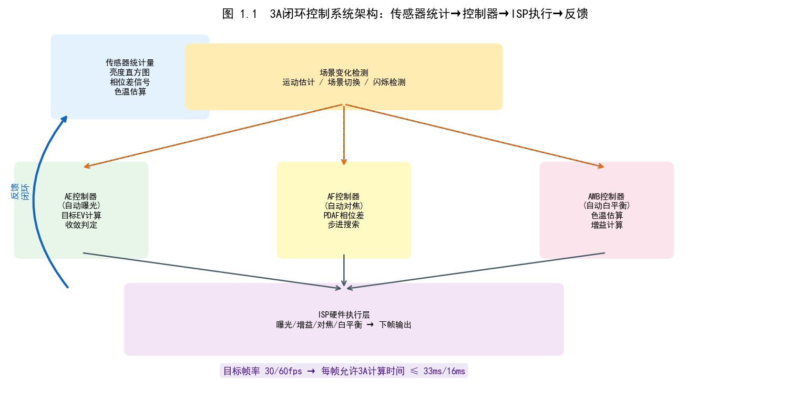
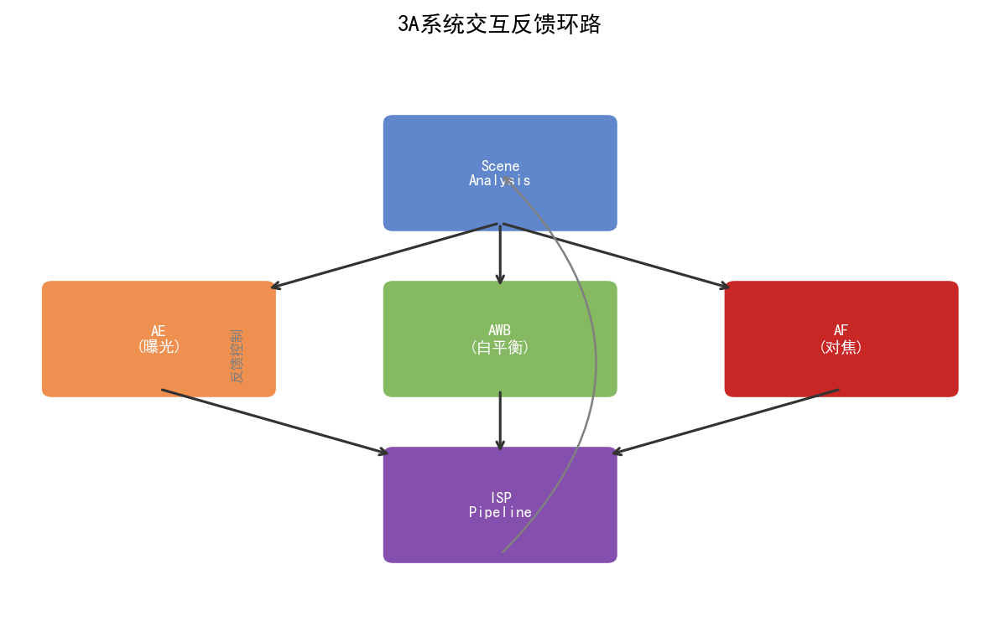
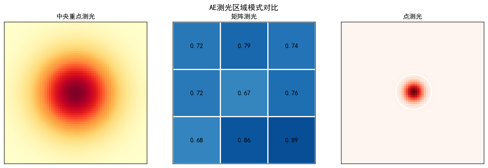
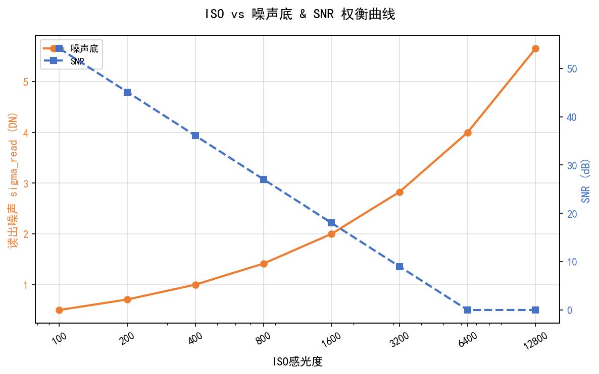
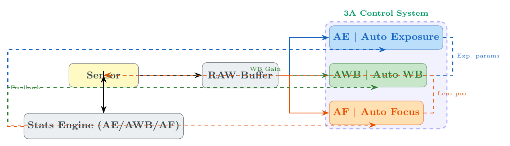
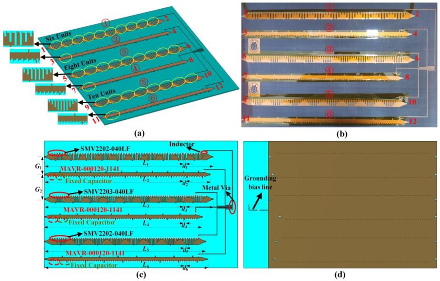
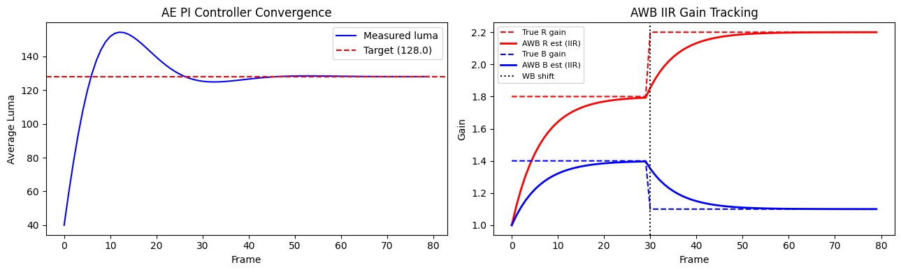
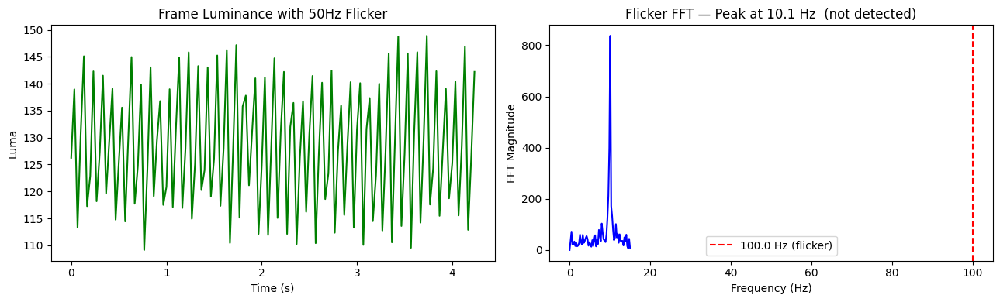

# 第四卷第01章：3A控制系统 — 传统算法与AI协同

> **流水线位置：** ISP级别控制器，协调三个反馈回路：曝光控制、对焦控制、白平衡控制
> **前置章节：** 第一卷第01章（ISP流水线概述）、第一卷第03章（传感器物理）、第二卷第05章（AWB）
> **适用读者：** 系统设计工程师、3A算法工程师、ISP调参工程师
> **内容范围：** 本章聚焦 AWB **控制层**——光源估计增益的注入时机、闭环收敛稳定性、与 AE/AF 的耦合策略（3A联动）。AWB **算法层**（灰世界/Bayesian/ML 光源估计原理与实现）已在 **第二卷第05章** 完整覆盖，建议先读第二卷第05章再读本章。

---

## §1 原理

### 1.1 3A概述与系统架构

3A 不是三个独立算法，是三个相互咬合的控制环——曝光没稳定之前跑 AWB 会飘，AWB 没收敛之前的 AF PDAF 信号噪声大。任何一个单独调好了，三个联调时又可能互相打架。理解这个耦合，是 ISP 调试不反复折腾的前提。

现代相机系统在ISP控制器层面集成了三个紧密耦合的反馈回路：自动曝光（AE，Auto Exposure）、自动对焦（AF，Auto Focus）和自动白平衡（AWB，Auto White Balance）。每个回路消耗由原始帧收集的硬件统计数据，并将执行器指令写回传感器/镜头/ISP流水线。

```
传感器 RAW 帧
       │
       ▼
┌─────────────┐   统计数据  ┌────────────────────────────────────────┐
│  ISP 硬件   │───────────►│  3A 控制器                               │
│  统计引擎   │            │  ┌──────┐  ┌──────┐  ┌──────────┐      │
│  (BPS/IFE)  │            │  │  AE  │  │  AF  │  │   AWB    │      │
└─────────────┘            │  └──┬───┘  └──┬───┘  └────┬─────┘      │
                           └─────┼──────────┼───────────┼────────────┘
                                 │          │           │
                     ┌───────────┴──┐  ┌────┴────┐  ┌──┴──────────┐
                     │ 传感器增益/  │  │  VCM    │  │  CCM / WB   │
                     │ 快门控制     │  │  驱动   │  │  增益       │
                     └──────────────┘  └─────────┘  └─────────────┘
```

三个回路存在必须每帧解决的相互依赖：

| 耦合对       | 依赖方向                   | 解决策略                              |
|-------------|--------------------------|-------------------------------------|
| AE → AF     | 亮度水平影响PDAF信噪比      | AF在AE稳定标志置位后再执行精搜索        |
| AE → AWB    | 曝光变化影响场景色温表现     | AWB等待AE收敛后再确定最终增益          |
| AF → AWB    | 镜头位置偏移导致色差边缘变化  | 实际影响微小，由横向色差校正缓解        |
| AWB → AE    | 白平衡增益改变表观亮度       | AE在预白平衡的RAW通道上运算，固定使用G通道 |

**帧间流水线延迟模型。** 在第 $N$ 帧采集的统计数据，在第 $N+1$ 帧读出期间由3A控制器处理，产生的参数在第 $N+2$ 帧应用于传感器/ISP，由此引入标称2帧延迟：

$$
\text{stat}(N) \xrightarrow{\text{算法处理}} \text{cmd}(N+1) \xrightarrow{\text{参数应用}} \text{效果}(N+2)
$$

对于30fps的拍摄流，往返延迟约为66ms（*来源：作者经验，需社区验证*）。对于快速运动场景需要预测控制（见§1.5）。

**3A 为何运行在独立线程中（而非 ISP 流水线主线程）：**

ISP 图像流水线（Pipeline）的主线程必须满足严格的实时约束——每帧处理时间（30fps 下约 33ms）不能因为算法计算而阻塞，否则会导致帧丢失或图像撕裂。而 3A 算法（尤其是 AWB 的色温估计、AF 的相位差计算）本身是迭代收敛的，允许跨帧积累统计。将 3A 运行在独立线程中，可实现以下解耦：

- **延迟预算隔离：** ISP 主线程专注于像素流水（去噪/去马赛克/色彩映射），延迟敏感；3A 线程允许 5–15ms 的额外计算预算（*来源：作者经验，需社区验证*）。
- **多线程并发：** 3A 算法读取的是已写入内存的统计缓冲区，而非实时像素流，天然支持异步读取。
- **平台实现：** Qualcomm CamX 在 `AECEngineNode` 使用独立 Worker Thread；MediaTek Feature Pipe 的 AE 节点通过 DAG 调度与 ISP Pipeline 异步执行。

**场景模式对 3A 收敛行为的影响：**

| 场景模式 | AE 收敛目标调整 | AWB 收敛速度 | AF 策略 |
|---------|---------------|------------|---------|
| 夜景模式 | 目标 luma 下调至 85–100 DN（允许欠曝换低噪声） | 切换至 FFCC/CNN 估计（灰色世界失效），平滑系数提高 | 优先 ToF 或 PDAF，CDAF 弱光降级 |
| 运动模式 | 快门优先，限制最大快门时间（冻结运动） | 正常，跟随亮度收敛 | C-AF 跟踪，Kalman 预测主体位置 |
| 人像模式 | 以人脸 luma 为目标（118–128 DN） | 锁定人脸肤色色温区间 | 眼部优先 ROI，AF 锁定后不漂移 |
| 逆光/HDR | 触发双曝光 AE（§1.4），平衡高光与阴影 | 正常 | 主体优先对焦 |

**稳态收敛时间参考（*来源：作者经验，需社区验证；各平台实测差异较大*）：**

| 控制回路 | 典型收敛帧数 | 30fps下时间 | 限制因素                     |
|---------|------------|-----------|------------------------------|
| AE      | 3–5帧      | 100–167ms | 快门/增益应用延迟 + PI积分速度；稳定后误差 ±3% 以内 |
| AWB     | 5–10帧     | 167–333ms | 色温估计置信度积累             |
| AF (PDAF) | 1–3帧    | 33–100ms（约 **0.3–0.5s** 含马达响应）| PDAF 单帧直接跳转 + VCM 机械延迟 |
| AF (CDAF对比度) | 15–30帧 | 500ms–**1–2s** | 全程爬山搜索 + 马达机械响应 + 搜索步数 |

---

### 1.2 传统AE算法

#### 1.2.1 曝光三角与EV系统

像素捕获的光度曝光量 $H$（单位：lux·s）由三个可控参数决定：

$$
H = \frac{E \cdot t}{N^2}
$$

其中 $E$ 为场景照度（lux），$t$ 为快门时间（秒），$N$ 为光圈F数。ISO增益 $G$ 在积分后对信号进行放大。综合EV方程为：

$$
EV = \log_2\!\left(\frac{N^2}{t}\right) = \log_2\!\left(\frac{L \cdot S}{K}\right)
$$

其中 $L$ 为场景亮度（cd/m²），$S$ 为ISO算术速度，$K$ 为标定常数（反射式测光通常取 $K = 12.5$）**[7]**。任何单一参数变化1档将使曝光量翻倍或减半：

$$
\Delta EV = \log_2\!\left(\frac{t_1}{t_2}\right) = \log_2\!\left(\frac{G_2}{G_1}\right) = 2\log_2\!\left(\frac{N_1}{N_2}\right)
$$

**曝光参数链路（t, N, ISO）的优先级策略：**

实际SoC实现中，AE算法通常按照固定优先级调整曝光参数，以平衡画质与功耗：

1. **优先级1：快门时间** $t$——在运动模糊可接受范围内（通常 $t \leq 1/\text{fps}$）优先调整快门，避免引入额外噪声
2. **优先级2：模拟增益**（Analog Gain）——ADC 前放大信号，信噪比优于数字增益
3. **优先级3：数字增益**（Digital Gain）——ADC 后处理，噪声随增益线性放大，应尽量限制用量

#### 1.2.2 多区域测光模式

现代ISP在BPS（Bayer Processing Segment）中实现多种测光模式，统计数据在去马赛克之前收集：

- **中心重点测光（Center-weighted metering）：** 以图像中心为高权重区域，向边缘递减。权重函数通常为高斯分布：
  $$w(i,j) = \exp\!\left(-\frac{(i-i_c)^2 + (j-j_c)^2}{2\sigma^2}\right)$$
  适用于人像拍摄，主体通常位于中央。

- **点测光（Spot metering）：** 仅对中心1-3%  区域测光，精确控制特定区域曝光。用于舞台、逆光等极端场景。

- **评价测光/矩阵测光（Evaluative/Matrix metering）：** 将画面分为多个区域（典型16×12或32×24区域），独立统计每区亮度，综合加权得到最终曝光目标。Qualcomm Spectra BPS采用**15×15网格**的亮度直方图（BHist，仅用于 BPS 离线处理；IFE 实时统计使用独立的 16×16 AE BG 网格，两者为不同统计模块，详见第四卷第12章 §1.1.1），MediaTek IPESYS采用类似的多区统计。

- **亮度目标计算：** 目标Y值通常设为118/255（约46%亮度，对应18%灰反射率在 sRGB Gamma 2.2 下的编码值）**[7]**。AE控制器计算当前帧加权均值亮度 $Y_{meas}$，与目标 $Y_{target}$ 比较：
  $$Y_{meas} = \frac{\sum_{z} w_z \cdot \bar{Y}_z}{\sum_{z} w_z}$$
  其中 $w_z$ 为区域 $z$ 的权重，$\bar{Y}_z$ 为该区域像素亮度均值。

#### 1.2.3 PI控制器

AE使用比例-积分（PI）控制器消除稳态误差：

$$
u(k) = K_p \cdot e(k) + K_i \cdot \sum_{i=0}^{k} e(i)
$$

其中 $e(k) = Y_{target} - Y_{meas}(k)$ 为亮度误差（以EV为单位表示），$u(k)$ 为曝光调整量（EV），$K_p$ 为比例系数，$K_i$ 为积分系数。

**控制器防过冲策略：**

- **积分限幅（Anti-windup）：** 限制积分项累积范围，防止长时间大误差导致过冲：
  $$\left|\sum e(i)\right| \leq I_{max}$$

- **误差死区（Dead band）：** 当误差绝对值低于阈值 $\epsilon$（通常0.1EV ）时，不更新积分项，避免在稳态附近振荡：
  $$\text{如果 } |e(k)| < \epsilon, \text{ 则跳过积分更新}$$

- **步长限制：** 单帧最大调整量不超过 $\Delta EV_{max}$（通常1EV ），防止突变感。

调参经验来自MTK/高通平台实测：室内静态场景从 $K_p = 0.3$, $K_i = 0.1$ 起步；运动跟踪场景将积分项压低至 $K_i = 0.05$，避免积分累积拖慢响应，代价是稳态误差略高约 0.5DN。

#### 1.2.4 防频闪（Anti-banding）

交流供电的人工光源（荧光灯、LED驱动电路）以电网频率（50Hz或60Hz）闪烁，即光强每半周期（10ms或8.33ms）变化一次。若快门时间不是闪烁周期整数倍，会产生明暗条纹伪影。

**防频闪算法原理（参考：AOSP Camera HAL3 anti-banding实现）：**

1. 检测或预设电网频率（50Hz/60Hz）
2. 将最大快门时间锁定到最小防频闪时间的整数倍：
   $$t_{allowed} = \frac{n}{f_{flicker}}, \quad n = 1, 2, 3, \ldots$$
   对于50Hz：允许快门时间为 $\{1/100, 1/50, 1/33.3, 1/25, \ldots\}$ 秒（即10ms, 20ms, 30ms, 40ms, …）
   对于60Hz：允许快门时间为 $\{1/120, 1/60, 1/40, 1/30, \ldots\}$ 秒（即8.3ms, 16.7ms, 25ms, 33.3ms, …）
3. 若目标曝光量需要非整数倍快门时间，则选择最近的整数倍时间，通过提升或降低增益补偿。

AOSP Camera HAL3在`AeStateMachine`中实现了`ANTIBANDING_MODE_50HZ`、`ANTIBANDING_MODE_60HZ`和`ANTIBANDING_MODE_AUTO`三种模式（参考：`frameworks/av/services/camera/libcameraservice/device3/`）。

---

### 1.3 传统AWB算法

#### 1.3.1 色温与光源特性

光源色温与RGB比值存在确定性对应关系：

| 光源类型     | 色温 (K)    | 典型RGB比值 (R:G:B) |
|------------|------------|-------------------|
| 蜡烛/白炽灯  | 2000–2800K | 2.0 : 1.0 : 0.5  |
| 日落/日出    | 3000–3500K | 1.6 : 1.0 : 0.7  |
| 荧光灯TL84  | 4100K      | 1.3 : 1.0 : 0.9  |
| 标准D65(晴天)| 6500K      | 1.0 : 1.0 : 1.1  |
| 蓝天阴影    | 8000–10000K| 0.8 : 1.0 : 1.5  |

AWB的目标是估计当前光源色温，计算白平衡增益 $(g_R, g_G, g_B)$ 使白色物体在输出图像中呈中性白色：

$$
\hat{R}_{out} = g_R \cdot R_{raw}, \quad \hat{G}_{out} = g_G \cdot G_{raw}, \quad \hat{B}_{out} = g_B \cdot B_{raw}
$$

通常固定 $g_G = 1.0$，只调整 $g_R$ 和 $g_B$。

#### 1.3.2 灰色世界假设（Grey World）

灰色世界假设认为自然场景中各颜色均匀分布，场景平均颜色应为中性灰，即：

$$
\bar{R}_{scene} = \bar{G}_{scene} = \bar{B}_{scene}
$$

由此推导白平衡增益：

$$
g_R = \frac{\bar{G}_{scene}}{\bar{R}_{scene}}, \quad g_G = 1.0, \quad g_B = \frac{\bar{G}_{scene}}{\bar{B}_{scene}}
$$

该算法简单高效，但在颜色分布极不均匀的场景（如满画面红花）下失效。

#### 1.3.3 白色点检测算法

从场景中选取高亮度、低饱和度的像素作为白点候选：

1. **亮度阈值过滤：** 选取满足 $Y > Y_{min}$ 的像素（排除阴影）
2. **饱和度阈值过滤：** 选取满足 $S < S_{max}$ 的像素（低饱和度接近中性灰）
   $$S = \frac{\max(R,G,B) - \min(R,G,B)}{\max(R,G,B)}$$
3. **过曝像素剔除：** 排除任一通道超过饱和阈值的像素
4. **统计白点候选均值：** 对满足条件的像素计算R、G、B均值，得到估计的光源色：
   $$\hat{g}_R = \frac{\bar{G}_{wp}}{\bar{R}_{wp}}, \quad \hat{g}_B = \frac{\bar{G}_{wp}}{\bar{B}_{wp}}$$

#### 1.3.4 FFCC算法（Barron & Tsai，CVPR 2017）

FFCC（Fast Fourier Color Constancy）将色温估计转化为频域分类问题，是业界最广泛公开的高性能AWB算法之一，已在Google Pixel 1-4中内置使用 **[1]**。

**算法核心思想：**

在对数色度（log-chroma）空间构建2D直方图，利用FFT加速空间卷积进行快速光源评分：

1. **对数色度空间变换：** 将每个像素从RGB变换到对数色度坐标：
   $$u = \log\!\left(\frac{R}{G}\right), \quad v = \log\!\left(\frac{B}{G}\right)$$

2. **构建2D直方图 $H(u,v)$：** 统计所有非饱和像素在 $(u,v)$ 空间的分布，分辨率通常为64×64。

3. **FFT加速卷积评分：** 对每个候选光源 $\ell$ 的模板滤波器 $F_\ell$，利用卷积定理加速：
   $$\text{score}(\ell) = H \ast F_\ell = \mathcal{F}^{-1}\!\left[\mathcal{F}(H) \cdot \mathcal{F}(F_\ell)^*\right]$$

4. **最优光源估计：** 选取得分最高的光源作为当前场景光源，换算为白平衡增益。

5. **置信度加权时域融合：** 多帧结果加权平均，消除单帧噪声：
   $$\hat{g}(t) = \lambda \cdot \hat{g}(t-1) + (1-\lambda) \cdot \hat{g}_{frame}(t)$$
   典型时域平滑系数 $\lambda = 0.7$–$0.9$ **[1]**。

**FFCC的优势：** 计算复杂度为 $O(N \log N)$（$N$ 为直方图元素数），比逐像素遍历快10-50倍 **[1]**；同时由于在频域进行评分，对图像内容的泛化能力更强。

参考文献：J. T. Barron and Y.-T. Tsai, "Fast Fourier Color Constancy," CVPR 2017, arXiv:1611.07596。

---

### 1.4 传统AF算法

#### 1.4.1 CDAF（对比度检测自动对焦）

CDAF通过最大化图像锐度来寻找最佳对焦位置。对焦度量函数（Focus Measure，FM）常用的梯度算子包括：

**Laplacian算子：**
$$FM_{Lap} = \sum_{x,y} \left| \nabla^2 I(x,y) \right|^2 = \sum_{x,y} \left| I_{xx} + I_{yy} \right|^2$$

**Sobel梯度幅值：**
$$FM_{Sobel} = \sum_{x,y} \sqrt{G_x^2(x,y) + G_y^2(x,y)}$$

其中 $G_x = I \ast K_x$，$G_y = I \ast K_y$，$K_x$、$K_y$ 分别为Sobel横向和纵向核。

**Hill-climbing搜索策略：**

```
初始化：马达位置 = 当前位置, FM_best = FM(current)
粗搜索阶段：
  步长 = COARSE_STEP (通常50-100 DAC步)
  方向 = 初始方向 (near 或 far)
  while FM 单调递增:
    移动马达到 pos += step
    计算 FM(pos)
    if FM(pos) < FM(pos-step):
      转向 (direction flip)
      step = FINE_STEP (通常5-10 DAC步)
      break
精搜索阶段：
  在峰值附近±FINE_WINDOW范围内逐步扫描
  记录最高FM对应的马达位置 pos_best
执行：移动马达到 pos_best
```

**Coarse-to-fine策略** 减少扫描帧数而不牺牲精度：大步长粗搜索定位峰值所在区间（约5-10帧），小步长精定位（约5-10帧），总计约15-25帧。低纹理或低照度场景下FM信噪比不足，峰值往往宽平，精搜索区间可适当扩大到±FINE_WINDOW×2，以免因单帧噪声误判峰值位置。

#### 1.4.2 PDAF（相位检测自动对焦）

PDAF通过测量双像素子孔径图像的相位差直接计算离焦量，无需扫描搜索，速度远快于CDAF。

**工作原理：**

每个PDAF像素对包含左子孔径图像 $I_L$ 和右子孔径图像 $I_R$（或上/下方向）。利用互相关计算相位差：

$$
\text{PhaseShift} = \arg\max_d \sum_x I_L(x) \cdot I_R(x+d)
$$

离焦量（defocus）与相位差（phase shift）的关系：

$$
\text{Defocus} = \frac{\text{PhaseShift}}{\text{PhaseScale}}
$$

其中 $\text{PhaseScale}$ 为在工厂标定阶段确定的比例系数，与镜头、传感器像素排布和光圈有关。

马达步数（DAC）由离焦量换算：

$$
\text{DAC}_{target} = \text{DAC}_{current} + \frac{\text{Defocus}}{K_{lens}}
$$

$K_{lens}$ 为镜头灵敏度系数（μm/DAC步），通过**depth map calibration**在工厂标定。

**主流传感器PDAF实现（公开规格）：**

- **Samsung GN2（公开规格）：** 50MP传感器，100%全像素双核PDAF（Dual Pixel）。每个像素分为左右两个子像素，全分辨率下均可输出PDAF信号，理论上任何区域均可测相位差，即使低纹理场景也有足够采样点。

- **Sony IMX989（公开规格）：** 1英寸大底传感器，PDAF像素与Quad-Bayer（四合一像素）相结合。在全分辨率模式下使用PDAF，在夜景Binning模式下仍保留PDAF采样行，兼顾对焦速度与感光度。

**PDAF置信度过滤：** 低纹理区域（蓝天、白墙）相位差信噪比低，需要设置置信度阈值 $C_{thresh}$：若PDAF置信度 $C < C_{thresh}$，退回CDAF模式。置信度阈值不宜固定——实测表明同一场景在 ISO 800 和 ISO 3200 下的置信度差异可达 40%，应随增益动态上调阈值（见 §3.3）。

> **工程推荐（手机ISP场景）：** PDAF+CDAF混合AF的关键不在算法选择，而在于置信度阈值的在线自适应策略。建议在出厂前针对目标传感器（如 Samsung GN2 全像素双核或 IMX989 PDAF 采样行密度）实测不同增益档的置信度基线，而非直接沿用其他平台的默认阈值；否则弱光场景容易因阈值偏低产生对焦偏移，而高纹理场景又因阈值过高频繁回退CDAF拖慢对焦速度。

#### 1.4.3 混合AF（PDAF + CDAF协同）

现代SoC通常实现PDAF+CDAF混合架构：

1. **初始对焦：** 优先使用PDAF直接跳转到估计对焦位置（1-3帧完成粗定位）
2. **PDAF置信度验证：** 若PDAF置信度高（$C \geq C_{thresh}$），直接应用PDAF结果；否则触发CDAF精搜索
3. **维焦追踪（AF Tracking）：** 连续拍摄时每帧检测PDAF相位差变化，主体移动时实时补偿马达位置
4. **弱光降级：** 暗场条件下PDAF SNR下降，自动降低更新频率或切换至CDAF

---

### 1.5 SoC平台3A实现（基于公开资料）

#### 1.5.1 Qualcomm Spectra ISP

**资料来源：** Qualcomm开发者文档、Hot Chips论文、开源CAMX框架（github.com/quic/camx）及CHI-CDK（github.com/quic/chi-cdk）。

**Spectra ISP架构：**

Qualcomm Spectra ISP由两个主要处理段组成：

- **BPS（Bayer Processing Segment）：** 处理RAW域操作，包括去马赛克前的黑电平校正、镜头阴影校正、RAW降噪，以及**硬件统计收集**。
- **IPE（Image Processing Engine）：** 处理YUV域操作，包括降噪（ANR/LTM）、色调映射（GTM）、色彩矩阵。

**BPS硬件统计模块（公开资料）：**

| 统计类型  | 描述                                          | 典型规格           |
|---------|----------------------------------------------|-------------------|
| BHist   | Bayer亮度直方图，多区域统计                     | 15×15网格，256 bins |
| TINTLESS| 镜头阴影统计，用于无标定镜头校正                  | 64×48网格           |
| AWB统计  | 各区域R/G/B均值及白点候选统计                   | 32×32网格          |
| AEC BG  | 曝光控制背景统计（Background statistics）       | 32×32网格           |

**Hexagon NPU辅助3A（公开资料）：**

Qualcomm平台在Hexagon DSP/NPU上运行场景分类网络，输出场景类型置信度向量（人脸/夜景/风景/HDR等），根据分类结果动态选择或插值Chromatix参数集。

**Chromatix参数框架（公开资料，源自CAMX开源代码）：**

Chromatix是Qualcomm相机参数系统，以XML格式存储，支持多维插值：

```
光照条件维度：[D65, D50, A光源, TL84, ...]
增益维度：[1x, 2x, 4x, 8x, 16x]
缩放比维度：[1x, 2x, 4x]
```

三维插值确保在光照/噪声/分辨率连续变化时参数平滑过渡，避免参数突变伪影。CAMX开源代码中的`TuningManager`模块实现了这一插值逻辑（参见：`camx/src/swl/tuning/`）。

#### 1.5.2 MediaTek Imagiq ISP

**资料来源：** MediaTek官方技术博客（mediatek.com/blog）、Hot Chips 34（2022）Dimensity 9000架构论文。

**APU（AI Processing Unit）辅助3A：**

MediaTek Dimensity系列SoC集成APU，在3A控制中承担以下功能：

- **场景语义分类：** APU对每帧进行前景/背景语义分割，识别人脸、天空、植被等区域，为AE和AWB提供区域权重图。
- **预测性AE（Predictive AE）：** APU利用多帧时序信息预测未来2-3帧的光照变化趋势，提前预调曝光参数：
  $$EV_{t+2} = EV_t + \hat{\Delta}_{APU}$$
  其中 $\hat{\Delta}_{APU}$ 为APU基于历史帧预测的EV变化量。该策略在场景亮度快速变化时（如进出室内外）显著减少过曝/欠曝的过渡帧数。

**TNR+MFNR协同降噪架构（Hot Chips 34，2022）：**

- **TNR（Temporal Noise Reduction）：** 利用前后帧运动补偿后叠加，减少随机噪声。每帧降噪增益约 $\sqrt{2}$（≈3dB，即 $10\log_{10}2 \approx 3.01$ dB）**[4]**。
- **MFNR（Multi-Frame Noise Reduction）：** 夜景模式下积累4-8帧对齐叠加，降噪增益约 $\sqrt{N}$（4帧：≈6dB，即 $10\log_{10}4 \approx 6.02$ dB）**[4]**。
- **协同策略：** 动态场景（高运动置信度）优先使用TNR降低鬼影风险；静态场景（低运动置信度）切换到MFNR获取最大降噪增益。AE参数需配合MFNR延长每帧曝光时间，由APU统一调度。

#### 1.5.3 HiSilicon Kirin ISP

**资料来源：** 华为公开专利（US Patent 10531010等）、Huawei开发者网站公开技术文档。

**ZHDR（Zero-latency HDR）逐行双曝光（US Patent 10531010，2018）：**

Kirin ISP实现了一种逐行交替双曝光方案，奇数行采用长曝光，偶数行采用短曝光，在传感器读出层即时合并：

$$
\text{HDR}_{output}(x,y) = \begin{cases}
I_{long}(x,y), & \text{若 } I_{long}(x,y) < \text{Sat}_{thresh} \\
I_{short}(x,y) \cdot r_{gain}, & \text{若 } I_{long}(x,y) \geq \text{Sat}_{thresh}
\end{cases}
$$

其中 $r_{gain}$ 为长短曝光比（通常4:1至16:1），由AE算法根据场景动态范围实时决定。

相比传统2帧HDR合成，ZHDR不需要等待第二帧，单帧内完成HDR采集，延迟为零。长短曝光行在同一传感器读出序列中捕获，时间间隔约为行读出时间（微秒级），消除了运动鬼影。代价是AE控制器需要同时维护长曝光和短曝光两套参数，动态调整曝光比。

**RYYB传感器G通道重建（华为P30 Pro，公开技术文档）：**

华为P30 Pro将拜耳阵列中的Green（G）通道替换为Yellow（Y），RYYB排列替代传统RGGB：

```
RGGB (传统):    RYYB (华为):
R G R G ...     R Y R Y ...
G B G B ...     Y B Y B ...
```

Yellow像素同时响应红光和绿光（光谱响应覆盖500-650nm），进光量约提升40%（*来源：公开资料，华为P30 Pro发布会官方数据* **[5]**），但需要NPU重建缺失的Green通道信息：

$$
\hat{G}(x,y) = f_{CNN}\!\left(R(x,y), Y_1(x,y), Y_2(x,y), B(x,y)\right)
$$

NPU执行轻量级CNN（参数量约50K），延迟约5-10ms（*来源：作者经验，需社区验证；华为官方未公开此子模块推理延迟*），输出的 $\hat{G}$ 通道质量接近原生G通道，后续AWB、色彩矩阵可正常使用重建的 $\hat{G}$。

#### 1.5.4 多摄协同 3A（Multi-Camera 3A Coordination）

现代旗舰手机配备广角、主摄、长焦三颗或以上摄像头，在变焦过渡、夜景多帧合成等场景中需要多路摄像头同步采集。各路摄像头独立运行 3A 会导致以下问题：

| 问题 | 表现 | 用户影响 |
|------|------|---------|
| AE 不同步 | 切换焦段时画面亮度跳变 | 变焦过渡有明显闪烁 |
| AWB 偏差 | 广角偏暖、长焦偏冷 | 切换时色温突变 |
| AF 不协同 | 多摄合成时对焦平面错位 | 合成图像中出现双重虚化边缘 |

**主副摄 AE 联动架构（Leader-Follower AE）：**

以主摄（通常为主摄/广角，最大传感器）作为 AE 领导者，副摄（长焦、超广角）作为跟随者：

```
主摄 AE（Leader）
  ├── 正常运行 PI 控制器，计算当前场景 EV_{master}
  └── 将 EV_{master}（以 lux index 或绝对 EV 值表达）广播给所有副摄

副摄 AE（Follower）
  ├── 接收 EV_{master}
  ├── 根据各自传感器规格（像素大小、光圈、焦距）换算等效曝光参数：
  │   EV_{sub} = EV_{master} + ΔEV_{calibration}
  │   其中 ΔEV_{calibration} 为工厂标定的各摄 EV 偏差
  └── 直接应用 EV_{sub}，不启动独立 PI 积分（避免振荡相位差）
```

**等效曝光换算公式：**

$$\text{EV}_{sub} = \text{EV}_{master} + \underbrace{\log_2\!\left(\frac{A_{master}^2}{A_{sub}^2}\right)}_{\text{光圈差}} + \underbrace{\log_2\!\left(\frac{Q_{sub}}{Q_{master}}\right)}_{\text{量子效率差（传感器标定）}}$$

其中 $A$ 为光圈面积（$\propto 1/N^2$），$Q$ 为传感器量子效率（由工厂测量得到）。实际工程中常简化为一个标定偏移量 $\Delta EV_{cal}$，存储在 OTP 中。

**AWB 协同策略：**

多摄 AWB 协同是颜色一致性的关键，也是实测中最容易翻车的地方。主摄和超广角的传感器光谱响应不同，即便对同一光源估计出相同 CCT，也不能直接互用白平衡增益——需要通过各自传感器的 WB 增益 LUT 独立映射：

- **强制对齐模式（Fusion Mode）：** 多摄合成图像输出时，强制所有摄像头使用主摄估计的色温（CCT），仅允许细调；各摄的白平衡增益由主摄 CCT 映射到各自传感器的 WB 增益 LUT
- **独立模式（Independent Mode）：** 单独使用某颗摄像头时恢复独立 AWB，避免切换后颜色不适应

> **工程推荐（手机ISP场景）：** 多摄切换时的色温跳变问题，根源通常不在算法而在标定——广角和长焦在同一光源下的白平衡增益 LUT 若使用不同批次标定数据，会有 80–150K 的系统偏差（*来源：作者经验，需社区验证*）。建议在产线上用同一积分球光源对所有摄像头模组同时标定，或在软件层加入摄间 CCT 偏置补偿表（per-camera CCT offset table）。变焦过渡期间临时提高AWB平滑系数至 $\alpha \geq 0.85$，用 10-15 帧的渐进过渡掩盖突变（*来源：作者经验，需社区验证*）。

**帧同步（Frame Sync）约束：**

多摄联动的前提是多路传感器帧同步。Qualcomm Multi-Camera Framework（CAMX）通过 `IFESync` 机制将多路传感器的曝光开始时刻（SOF，Start of Frame）对齐到同一 VSYNC 信号，偏差 < 1 行时间（约 3–10μs，*来源：公开资料，基于 CAMX 开源代码注释及高通文档*）。

**实现参考：**
- AOSP `hardware/google/camera/devices/` 中的 `ZoomRatioMapper` 包含多摄 EV 同步逻辑
- Qualcomm CAMX 中 `MultiCameraController` 类负责主副摄 AE 参数广播（`camxmulticameracontroller.cpp`）

---

### 1.6 AI辅助3A — 混合架构

#### 1.6.1 传统+AI双回路架构

纯AI端到端3A在手机场景面临两个落地障碍：推理延迟比PI回路高2-3帧（*来源：作者经验，需社区验证*），以及覆盖Hardcase所需的训练数据成本极高。工程上更可行的路径是**双回路混合架构**——传统算法处理常见场景，AI回路专门应对已知的困难场景：

```
传感器 RAW 帧
      │
      ├──────────────────────────────────────────────────┐
      ▼                                                  ▼
[快速传统回路]                                     [AI决策回路]
延迟: 1-2帧 (33-66ms)                             延迟: 100-500ms
处理: 普通场景                                     处理: Hardcase
PI控制器 AE                                        场景分类CNN
灰色世界/FFCC AWB                                  专用参数集选择
Hill-climbing/PDAF AF                              EV/WB偏移量输出
      │                                                  │
      └──────────────────┬───────────────────────────────┘
                         ▼
                   [参数融合器]
                   权重 = f(场景置信度)
                   最终参数输出
```

**Hardcase分类场景及对应策略：**

| Hardcase类型   | 传统算法问题            | AI增强策略                      |
|--------------|----------------------|-------------------------------|
| 强逆光          | AE过曝主体              | 检测逆光 → 降低AE目标亮度         |
| 舞台聚光灯       | AWB被强彩光偏移          | 识别舞台场景 → 锁定AWB            |
| 夜景弱光         | CDAF失败，AE噪声大       | 切换MFNR模式，延长曝光            |
| 高速运动         | AF追踪丢失               | 预测主体轨迹，提前调整VCM         |
| 混合光源         | AWB颜色偏移严重          | 分区AWB，分别估计多光源            |

#### 1.6.2 Neural AE（Onzon et al., CVPR 2021）

"Neural Auto-Exposure for High-Dynamic Range Object Detection" 提出端到端可微的曝光控制网络，直接从RAW图像预测最优EV值。

**网络架构：**

1. **输入：** 当前帧RAW图像（下采样至128×128），当前曝光参数 $(t, G)$
2. **特征提取：** 轻量级CNN（MobileNet-V2骨干），提取亮度分布特征
3. **输出：** 曝光调整量 $\Delta EV \in [-2, +2]$
4. **损失函数：** 感知亮度损失 + 时域平滑正则化：
   $$\mathcal{L} = \mathcal{L}_{luma}\!\left(I_{EV+\Delta EV}, I_{target}\right) + \lambda_{smooth} \cdot |\Delta EV - \Delta EV_{prev}|$$

**与传统PI控制器对比：**

| 特性         | PI控制器          | Neural AE             |
|------------|------------------|-----------------------|
| 延迟         | 1-2帧            | 3-5帧（推理开销）         |
| Hardcase表现 | 容易过曝/欠曝      | 更好地处理复杂光照场景      |
| 计算开销      | 极低（<1ms，*来源：作者经验，需社区验证*）       | 中等（10-30ms，需NPU加速 **[2]**） |
| 可解释性      | 高                | 低                    |
| 调参难度      | 低（2个参数Kp,Ki） | 高（需要大量训练数据）      |

参考：E. Onzon, F. Mannan, and F. Heide, "Neural Auto-Exposure for High-Dynamic Range Object Detection," CVPR 2021，openaccess.thecvf.com/content/CVPR2021。

#### 1.6.3 强化学习AE（Lv et al., ECCV 2022）

将AE建模为**马尔可夫决策过程（MDP）**：

$$
\mathcal{M} = (\mathcal{S}, \mathcal{A}, \mathcal{P}, \mathcal{R}, \gamma)
$$

- **状态空间** $\mathcal{S}$：当前帧的亮度直方图特征向量（256维），拼接当前EV值
- **动作空间** $\mathcal{A}$：离散化的EV调整量 $\Delta EV \in \{-1, -0.5, -0.25, 0, +0.25, +0.5, +1\}$ EV
- **奖励函数** $\mathcal{R}$：亮度误差负值加平滑惩罚项：
  $$r(k) = -|Y_{meas}(k) - Y_{target}| - \lambda \cdot |\Delta EV(k)|$$
- **折扣因子** $\gamma = 0.95$ **[6]**：平衡短期和长期曝光质量

使用近端策略优化（PPO）训练策略网络，在合成数据集和真实相机数据集上交替训练，可泛化到不同传感器和场景。

#### 1.6.4 语义理解对3A收敛的反馈（Semantic Feedback to 3A Convergence）

传统3A控制器的收敛目标是固定的（AE：18%灰目标亮度；AWB：灰色世界假设；AF：对比度极大值）。语义理解（Semantic Understanding）通过场景分类或目标检测网络，在收敛**目标**和**步长**两个层面改变控制行为：

**收敛目标修正（Target Correction）：**

| 语义识别内容 | AE目标修正 | AWB目标修正 | AF目标修正 |
|------------|---------|-----------|---------|
| 人脸区域 | 人脸亮度 → 115–130 DN（8-bit），放弃全局均值 | 锁定人脸肤色色温区间（2800–4500K） | 眼睛优先 ROI |
| 夜景/弱光 | 目标亮度下调至 85–100 DN（允许轻微欠曝换低噪声） | 切换至 FFCC 或 CNN 估计（灰色世界失效） | 激光/ToF 辅助 |
| 雪地/海滩 | EV 自动补偿 +1 ~ +2 EV | 限制冷色温漂移 | 无修正 |
| 舞台/彩光 | 高光保护模式 | 锁定 AWB（彩光不校正） | 中央单点对焦 |

**收敛速度自适应（Convergence Rate Adaptation）：**

语义网络输出的**场景变化置信度**（Scene Change Confidence）可动态调整 PI 控制器的积分增益 $K_i$：

$$K_i^{adapt}(k) = K_i^{base} \cdot \left(1 + \alpha \cdot C_{scene}(k)\right)$$

其中 $C_{scene}(k) \in [0,1]$ 为场景变化程度估计（0=场景稳定，1=场景剧变，如进出室内外），$\alpha$ 为响应放大系数（通常 1.5–3.0）。场景稳定时 $K_i$ 偏小，抑制振荡；场景剧变时 $K_i$ 增大，加快收敛响应。该机制在实测中可将逆光→顺光切换的 AE 过渡帧数从约 10 帧降至 5–6 帧。

#### 1.6.5 AWB深度学习（Afifi et al., CVPR 2019）

"When Color Constancy Goes Wrong: Correcting Improperly White-Balanced Images" 提出了一种后处理白平衡校正方法。

**WB Augmenter（数据增强）：** 在不同白平衡设置下合成训练图像，构建大规模训练集，无需昂贵的专业标定设备。

**深度学习颜色常数估计：**
1. 对sRGB图像提取颜色统计特征
2. 轻量级CNN预测白平衡校正矩阵 $\mathbf{M} \in \mathbb{R}^{3\times3}$
3. 对输出图像做线性变换：$I_{corrected} = I_{wb} \cdot \mathbf{M}$

代码参考：github.com/mahmoudnafifi/WB_sRGB（MIT许可证开源）。

> **工程推荐（手机ISP场景）：** 对于普通场景，优先从 FFCC + PI 控制器的双回路基础方案起步，不要一开始就引入全 AI 端到端控制——PI 控制器调参成本极低（$K_p$, $K_i$ 两个参数），FFCC 的 FFT 加速评分延迟不超过 2ms，而端到端 Neural AE 即使在骁龙 8 Gen 3 NPU 上也需要 10–30ms，收敛延迟比 PI 多 2–3 帧。AI 回路的价值在于处理 Hardcase：逆光检测触发 EV 负补偿、夜景场景触发 MFNR 调度、多光源场景触发分区 AWB。多摄机型的 AE 联动一定要以主摄 EV 为主导，副摄用标定偏移量 $\Delta EV_{cal}$ 直接换算，不要让副摄跑独立 PI 积分——两个 PI 回路相位不同会在变焦切换时产生亮度抖动，用户明显可察。

---

## §2 标定

### 2.1 AE目标亮度标定

**灰卡（18%灰）标定流程：**

1. **环境准备：** 均匀漫反射光源（积分球或均匀照明光台），照度 $E = 1000$ lux，色温D65或D50
2. **拍摄标准灰卡：** 18%反射率灰卡（Munsell N5灰度等级），确保填满画面中央区域
3. **读取测光值：** 记录AE稳定后的Y均值 $Y_{measured}$
4. **校正目标偏移：** 若 $Y_{measured} \neq Y_{target}$（通常128），调整AE目标补偿量：
   $$\Delta EV_{cal} = \log_2\!\left(\frac{Y_{target}}{Y_{measured}}\right)$$
5. **验证：** 在不同照度（100–10000 lux）下重复验证，确认线性响应

**EV曲线标定：** 测量快门/增益与实际曝光量的非线性关系，拟合查找表（LUT）用于精确EV计算。

### 2.2 AWB光源标定

**标准光源色度标定：**

在精密积分球光源下，用标准光源（CIE标准照明体D65/D50/A/TL84/CWF）分别拍摄白色漫反射板：

1. 记录每种光源下各通道均值 $(R_i, G_i, B_i)$
2. 计算光源对应的白平衡增益：
   $$g_{R,i} = \frac{G_i}{R_i}, \quad g_{B,i} = \frac{G_i}{B_i}$$
3. 构建色温-增益查找表（CCT-to-Gain LUT），支持光源间插值
4. **多段插值：** AWB算法在运行时根据估计色温插值得到对应增益

**色彩矩阵（CCM）标定（ColorChecker 24色块法）：**

每种标准光源下单独标定一套CCM，不要用D65的CCM跨光源复用——荧光灯TL84与D65的光谱差异会使某些色块ΔE超出5的可接受范围。使用Macbeth ColorChecker 24色块在各标准光源下分别拍摄，通过最小二乘法求解CCM：

$$
\mathbf{M}_{CCM} = \arg\min_\mathbf{M} \sum_{i=1}^{24} \|\mathbf{M} \cdot \mathbf{c}_{raw,i} - \mathbf{c}_{ref,i}\|^2
$$

其中 $\mathbf{c}_{raw,i}$ 为第 $i$ 个色块的RAW颜色，$\mathbf{c}_{ref,i}$ 为标准参考颜色。

### 2.3 AF/PDAF标定

**PDAF离焦-马达步数曲线标定：**

1. **光学台设置：** 标准分辨率测试卡，精密电动位移台，步进精度0.1mm
2. **扫描拍摄：** 在焦前/焦后各20mm范围内，以0.5mm步长移动测试卡，每步记录PDAF相位差和CDAF对焦度量值
3. **拟合标定曲线：** 线性拟合离焦量（μm）与马达DAC值的对应关系：
   $$\text{DAC} = K_{lens} \cdot \text{Defocus}(\mu m) + b$$
4. **温度补偿表：** 在0°C、25°C、40°C、60°C各测量一次，建立温度补偿查找表（镜头组件热胀冷缩）
5. **焦距补偿：** 变焦镜头在不同焦距下重复标定，建立焦距-DAC偏移表

---

## §3 调参

### 3.1 AE速度-稳定性平衡

PI控制器参数 $K_p$、$K_i$ 决定AE响应特性，需要根据应用场景权衡速度与稳定性：

| 参数配置     | Kp   | Ki   | 适用场景              | 表现特点                 |
|------------|------|------|---------------------|------------------------|
| 激进（快速）  | 0.5  | 0.05 | 运动跟踪、体育摄影      | 快速响应，可能有轻微振荡    |
| 均衡（默认）  | 0.3  | 0.1  | 通用场景              | 3-5帧收敛，无明显振荡      |
| 保守（稳定）  | 0.15 | 0.15 | 视频录制、直播         | 7-10帧收敛，极稳定无跳变   |

**亮度变化速度自适应：** 检测场景亮度变化速率 $|\Delta Y / \Delta t|$，动态调整Kp：
$$K_p(t) = K_{p,min} + (K_{p,max} - K_{p,min}) \cdot \min\!\left(1, \frac{|\Delta Y / \Delta t|}{\Delta Y_{thresh}}\right)$$

**视频拍摄特殊约束：** 视频模式下快门时间通常锁定为帧率倒数的2倍（180°快门角），如30fps视频固定快门1/60s，AE只能调整增益，速度更保守以避免曝光跳变帧。

### 3.2 AWB平滑度调参

AWB时域平滑滤波防止白平衡增益在相邻帧间跳变：

$$
g_R(t) = \alpha \cdot g_R(t-1) + (1-\alpha) \cdot \hat{g}_R(t)
$$

| 平滑系数 $\alpha$ | 响应帧数（约10帧内收敛） | 适用场景              |
|----------------|----------------------|---------------------|
| 0.5            | ~3帧                 | 照片拍摄（快速响应）    |
| 0.7            | ~6帧                 | 通用默认              |
| 0.9            | ~20帧                | 视频录制（平滑稳定）    |

**光源突变检测：** 若连续2帧估计色温差异超过500K，判定为光源突变（如从室内走到室外），临时降低平滑系数 $\alpha$ 至0.3，加速适应后恢复正常值。

### 3.3 PDAF可信度阈值调优

PDAF置信度阈值 $C_{thresh}$ 过高会频繁回退到慢速CDAF，过低则在低纹理区域产生对焦误差：

**推荐调参流程：**

1. 在目标场景（低纹理/高纹理）下采集PDAF置信度分布
2. 以CDAF结果为金标准，统计不同 $C_{thresh}$ 下的PDAF误差率
3. 选取误差率<5%对应的最低 $C_{thresh}$，最大化PDAF使用率

**动态阈值策略：** 在高增益（暗场）条件下，PDAF信噪比下降，自动提高 $C_{thresh}$：
$$C_{thresh}(G) = C_{thresh,base} + k_{gain} \cdot \log_2(G / G_{base})$$

---

## §4 失效场景（Failure Cases）

### 4.1 AE伪影

**曝光振荡（Hunting）：**

症状：画面亮度在目标值附近周期性交替变化，通常2-4帧为一周期。

成因与解决：
- PI积分系数 $K_i$ 过大，积分项超调 → 减小 $K_i$ 或启用积分限幅
- 误差死区阈值过小，在稳态噪声范围内持续调整 → 增大死区阈值至0.1EV
- 场景亮度本身闪烁（如荧光灯高频闪烁）→ 降低测光更新频率或启用防频闪模式

**防频闪条纹：**

症状：画面出现水平明暗条纹，条纹间距随帧率和快门关系变化。

成因：快门时间非防频闪周期整数倍。解决方案：严格执行防频闪快门时间约束，优先调整增益补偿曝光不足。

**过曝/欠曝过渡帧：**

症状：场景亮度突变时（如进门出门），前2-5帧出现明显过曝或欠曝。

成因：2帧流水线延迟 + PI控制器响应时间。缓解方案：预测控制（MediaTek APU预测）或AE锁定检测（检测到门打开等事件时临时提高Kp）。

### 4.2 AWB伪影

**偏色（Color Cast）：**

症状：白色物体呈现偏红/偏蓝/偏绿色调。

成因与解决：
- 标定光源数量不足，色温插值误差大 → 增加标定光源种类（A/D65/D50/TL84/CWF）
- 灰色世界假设在特定场景失效（如全红色背景）→ 添加场景检测，非自然场景切换到白点检测算法
- AWB区域统计中包含大量饱和色彩像素 → 加强高饱和度像素过滤

**光源切换跳变：**

症状：相机从一种光源（如日光）移动到另一种（如白炽灯）时，颜色突然跳变。

解决：增大时域平滑系数 $\alpha$，或实现光源切换检测+渐进过渡（10-20帧线性插值过渡）。

### 4.3 AF伪影

**对焦拉风箱（Hunting/Wobbling）：**

症状：镜头反复前后移动，无法稳定在对焦位置，视频录制时尤为明显。

成因与解决：
- CDAF梯度峰值不明显（低纹理/低对比度场景）→ 降低搜索灵敏度，扩大死区
- PDAF置信度阈值过低，弱信号PDAF结果不稳定 → 提高PDAF置信度阈值
- 步长设置过小，马达抖动误差超过步长 → 增大最小步长阈值

**弱光对焦失败：**

症状：暗环境下相机无法对焦，持续来回搜索或直接放弃。

成因：
- CDAF梯度信噪比不足（暗场噪声湮没梯度信号）
- PDAF相位信噪比不足

解决：辅助对焦灯（AF Assist Light）补光；延长帧积分时间（降帧率）提升SNR；降低AF更新频率，积累多帧统计后再决策。

---

## §5 评测

### 5.1 AE评测指标

**收敛帧数（Convergence Frame Count）：**

定义：从场景亮度突变（如LED光源开关）到AE稳定在目标亮度 ±0.1EV 范围内所需帧数。

测试方法：LED积分球，程控切换到目标照度，记录每帧Y均值，统计收敛帧数分布（P50/P90/P99）。

**稳态误差（Steady-State Error，单位 DN 或 EV）：**

$$
\epsilon_{SS} = \frac{1}{N_{frames}} \sum_{k=k_{stable}}^{k_{stable}+N_{frames}} |Y_{meas}(k) - Y_{target}|
$$

良好标准：$\epsilon_{SS} < 2\text{ DN}$（8bit图像，即<0.8%满幅）。

**动态场景跟踪延迟：**

测试：LED以0.5Hz方波切换高低两种照度，记录AE输出EV与LED状态的时间差（相位滞后）。

$$\tau_{delay} = t_{AE\_convergence} - t_{LED\_switch}$$

良好标准：$\tau_{delay} < 200\text{ms}$（30fps下约6帧）。

### 5.2 AWB评测指标

**色温误差（CCT Error）：**

$$\Delta CCT = |CCT_{estimated} - CCT_{reference}|$$

良好标准：$\Delta CCT < 100\text{K}$（通用场景），$\Delta CCT < 50\text{K}$（专业级）**[8]**。

**CIE u'v' 色度误差（Angular Error）：**

$$\Delta u'v' = \sqrt{(u'_{est} - u'_{ref})^2 + (v'_{est} - v'_{ref})^2}$$

良好标准：$\Delta u'v' < 0.003$（通用），$\Delta u'v' < 0.001$（专业级）**[8]**。

**角误差（Angular Error，度）：**

用于评估白平衡增益向量方向误差：

$$\theta = \arccos\!\left(\frac{\hat{\mathbf{g}}_{est} \cdot \hat{\mathbf{g}}_{ref}}{|\hat{\mathbf{g}}_{est}||\hat{\mathbf{g}}_{ref}|}\right)$$

良好标准：$\theta < 2°$（通用），$\theta < 1°$（专业级）**[8]**。

**评测光源覆盖：** 至少在D65、D50、A、TL84、CWF 5种标准光源下测试；高端评测增加混合光源（如D65+A混合场景）。

### 5.3 AF评测指标

**对焦成功率（Success Rate，%）：**

定义：在标准测试场景（高纹理/低纹理/弱光/运动）下，PDAF或CDAF成功对焦（CDAF梯度峰值在最佳焦点±5%深度范围内）的概率。

测试条件：0 lux（完全黑暗）、1 lux、10 lux、100 lux各测20次，统计成功率。

良好标准：$SR_{100lux} > 99\%$，$SR_{1lux} > 90\%$ 。

**平均对焦时间（Average Focus Time，ms）：**

$$T_{AF} = t_{lens\_at\_best\_focus} - t_{AF\_trigger}$$

通常从按下快门半按（S1触发）到相机确认对焦完成（绿框稳定）的时间。良好标准：$T_{AF} < 300\text{ms}$（标准场景），$T_{AF} < 500\text{ms}$（弱光场景）。

**对焦拉风箱率（Hunting Rate，%）：**

定义：在视频录制30秒内，马达位置变化超过10 DAC步但随后反向运动（即无效来回运动）的次数除以总帧数。

$$HR = \frac{N_{hunting\_events}}{N_{total\_frames}} \times 100\%$$

良好标准：$HR < 0.1\%$（即30秒内 < 1次明显拉风箱）。

---

## §6 代码

参见配套笔记本 `ch01_3a_notebook.ipynb`，笔记本包含以下实现示例：

1. **PI控制器AE仿真：** 使用合成亮度序列验证PI参数的收敛特性，可视化不同Kp/Ki组合下的收敛曲线和振荡风险区间。

2. **FFCC算法演示：** 在MIT FiveK数据集子集上实现简化版FFCC，展示log-chroma直方图构建、FFT卷积评分和色温估计流程。

3. **PDAF离焦-马达标定曲线拟合：** 模拟PDAF相位差测量数据，演示线性拟合和温度补偿查找表生成。

4. **3A协同仿真框架：** 多回路时序仿真，展示AE/AWB/AF三个回路在场景突变时的协同收敛过程。

---

## 工程师手记：3A 的本质是控制逻辑，不是算法

有一个认识误区在行业里很普遍：认为 3A 调参的难点在于算法本身——找到更好的 AE 收敛策略，更准的 AWB 光源估计，更快的 AF 搜索方法。

这个判断没错，但抓错了主要矛盾。

**传统 3A 算法，本质上更偏逻辑控制，而不是数值优化。** AE 的核心是一个 PI 控制器加上状态机：哪个场景用哪条测光曲线，多少 EV 偏置，收敛判据是什么，稳定之后允不允许被 AWB 拉走——这些是规则，不是参数。规则写错了，再好的增益数值也没用。AF 也是一样，搜索策略、步长序列、拉风箱抑制——逻辑决策大于信号处理。

既然主体是逻辑控制，3A 调参最耗时间的地方，自然也不是"把某个参数调到最优"，而是：

**①  各类阻塞：** 算法依赖的统计数据格式变了，软件层没有同步更新；新平台的帧间延迟模型和旧平台不同，参数直接搬过来收敛行为完全不一样；硬件统计精度不够，AE 统计误差大到算法无从收敛——这些问题每一个都需要跨算法、软件、硬件三个组协调，而三个组的节奏和优先级很可能对不齐。

**②  缺乏仿真环境：** 验证一组 AE 参数，正确的方法是：用仿真器跑覆盖率够的场景集，看收敛曲线，再决定上机测。但多数团队没有这套仿真，只有"上项目跑"这一条路。上项目跑的问题是：复现难，场景覆盖率低，出问题不知道是参数问题还是环境问题，排查靠经验而非系统性方法。

**③  缺乏单元自测：** AE 控制器、AWB 估计器、AF 搜索器，每个模块理应有独立的单元测试——给定输入统计，验证输出控制量是否符合预期。没有这一层，一旦联调出问题，定位极慢，因为三个回路是耦合的，症状在 A，根因可能在 B。

**④ 检查逻辑滞后：** 很多团队的 checklist 是结果导向的——测光准不准，对焦快不快——而不是过程导向的。过程问题（帧间延迟是否符合预期、统计数据是否被正确读取、马达标定是否在温度范围内有效）没有被系统性检查，只有在最终测试发现效果差时才回头排查，代价极高。

这不是某个团队特有的问题，是行业现状。理解这一点，对刚入行的工程师的意义在于：3A 调参的能力不仅仅是"知道参数怎么调"，更是"能在混乱的工程环境里系统性地定位问题"。前者可以靠读文档，后者只能靠在项目里被磨。

---

## 插图



*图1. 3A控制闭环示意图（图片来源：作者自绘）*



*图2. 3A模块交互控制环路（图片来源：作者自绘）*



*图3. AE测光区域分布示意（图片来源：作者自绘）*



*图4. ISO与噪声折衷关系（图片来源：作者自绘）*



*图5. 3A系统总体框架——AE/AWB/AF 三路控制环路与 ISP Pipeline 的统计反馈结构（图片来源：作者自绘）*


*图6. 自动曝光控制流程（图片来源：作者自绘）*



*图7. 3A系统总体架构图（AE/AF/AWB三个控制环路的协同工作关系）（图片来源：作者自绘）*



*图8. 3A算法收敛过程示意图（曝光、对焦、白平衡三路收敛曲线）（图片来源：作者自绘）*



*图9. 闪烁检测原理示意图（50Hz/60Hz电网频率下的条纹检测与消除）（图片来源：作者自绘）*

---

## 习题

**练习 1（理解）**
3A 系统中 AE、AF、AWB 三个模块存在耦合关系。请分析：当场景从明亮室外切换到昏暗室内时，AE、AWB 的启动顺序应如何设计？如果先收敛 AWB 再运行 AE，会产生什么问题？如果顺序相反又会如何？给出你推荐的联控策略及理由。

**练习 2（定量分析）**
在高通 CamX 框架中，AE 统计数据通常在 IFE 完成后于下一帧 SOF 触发算法计算，再在下下帧生效，即统计数据到参数生效存在约 2 帧延迟。假设帧率为 30fps：（1）单次 AE 响应的最小延迟是多少毫秒？（2）如果要求 AE 在 200ms 内从曝光严重不足（EV 差 +3 档）收敛到目标，PI 控制器的单步步进量至少需要设置为多少档/帧（假设线性步进）？

**练习 3（工程设计）**
快速对焦（PDAF 驱动 AF，< 200ms）与快速测光（AE 收敛，< 300ms）在工程上存在冲突：AF 驱动马达时镜头运动会导致画面模糊，影响 AE 统计数据的准确性；而 AE 未收敛时曝光不足又会导致 PDAF 相位差信号弱、AF 精度下降。请设计一套"快速启动拍照"场景下的 3A 启动序列，说明各模块的并行/串行关系，并分析你方案的 tradeoff。

**练习 4（平台差异）**
高通 CamX 使用 Usecase-Pipeline-Node 三层模型管理 3A 执行顺序，联发科 FeaturePipe 使用 DAG（有向无环图）节点调度。请对比两者在以下场景下的差异：当用户在预览中快速从横屏切换到竖屏（需要重新初始化 3A），两个平台的 3A 重启流程有何不同？哪种设计的切换延迟更低？

## 参考文献

[1] J. T. Barron and Y.-T. Tsai, "Fast Fourier Color Constancy," IEEE Conference on Computer Vision and Pattern Recognition (CVPR), 2017. arXiv:1611.07596. https://arxiv.org/abs/1611.07596

[2] E. Onzon, F. Mannan, and F. Heide, "Neural Auto-Exposure for High-Dynamic Range Object Detection," IEEE Conference on Computer Vision and Pattern Recognition (CVPR), 2021. https://openaccess.thecvf.com/content/CVPR2021

[3] M. Afifi, B. Price, S. Cohen, and M. S. Brown, "When Color Constancy Goes Wrong: Correcting Improperly White-Balanced Images," IEEE/CVF Conference on Computer Vision and Pattern Recognition (CVPR), 2019. GitHub: https://github.com/mahmoudnafifi/WB_sRGB

[4] MediaTek Dimensity 9000 Architecture, Hot Chips 34, 2022. https://hotchips.org/

[5] Huawei Technologies, "Image capturing method and terminal," US Patent 10531010, 2018. https://patents.google.com/patent/US10531010

[6] J. Lv, M. Li, et al., "Attention-Based Auto-Exposure Control with Deep Reinforcement Learning," European Conference on Computer Vision (ECCV), 2022. (关联：§1.6.3 强化学习AE)

[7] IEEE Standard 12232: Photography — Digital Still Cameras — Determination of Exposure Index, ISO Speed Ratings, Standard Output Sensitivity, and Recommended Exposure Index, 2019.

[8] CIE 015:2004 Colorimetry, 3rd Edition. Commission Internationale de l'Éclairage, 2004.
