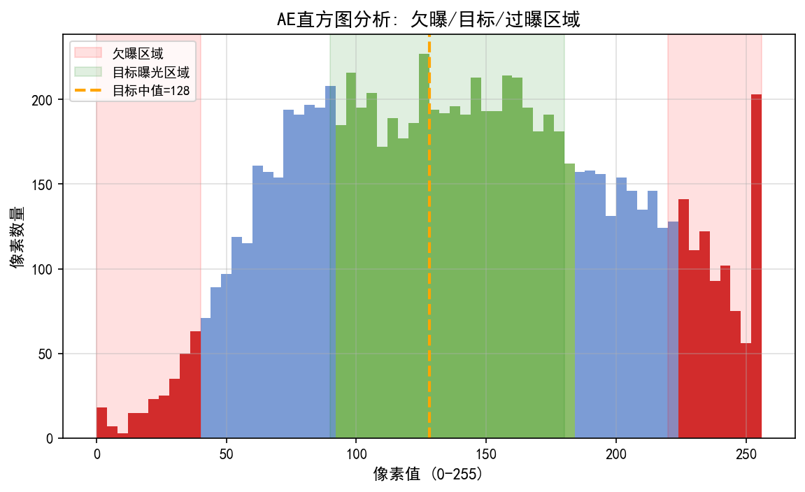
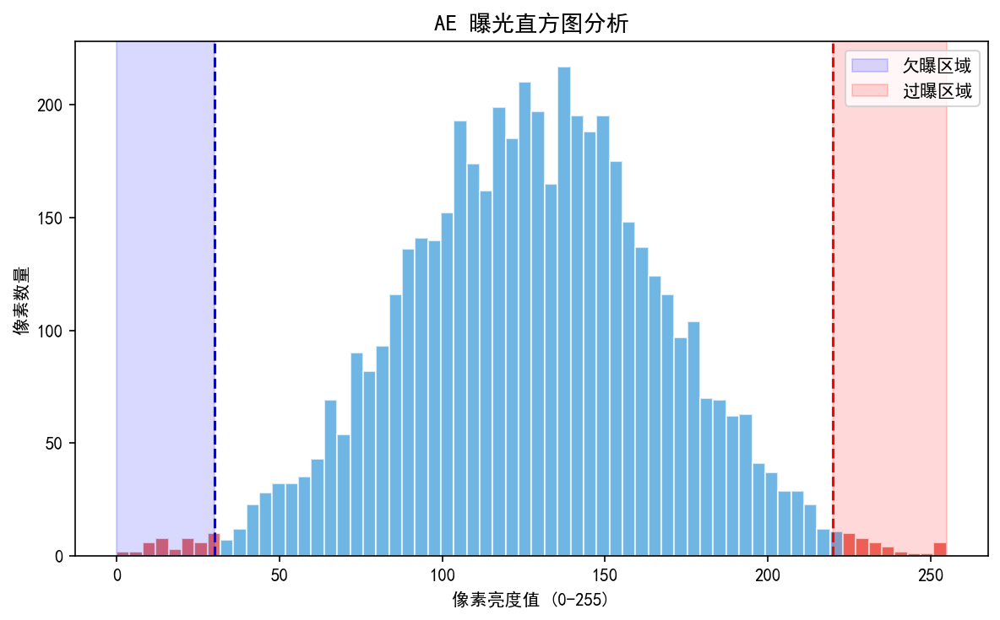
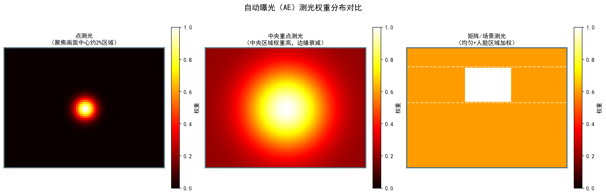
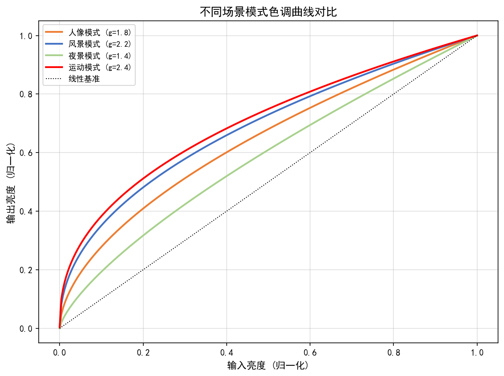
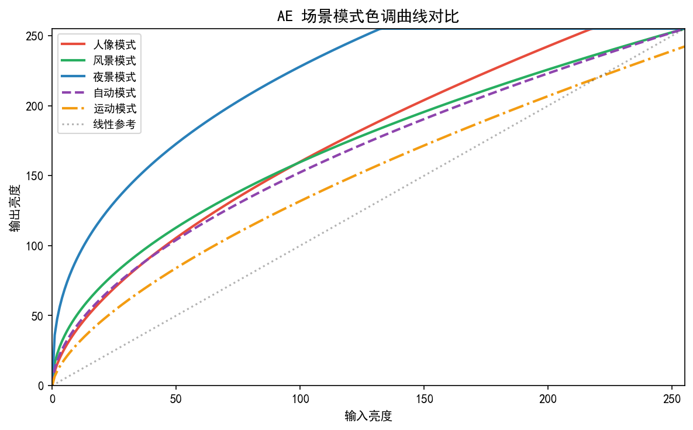
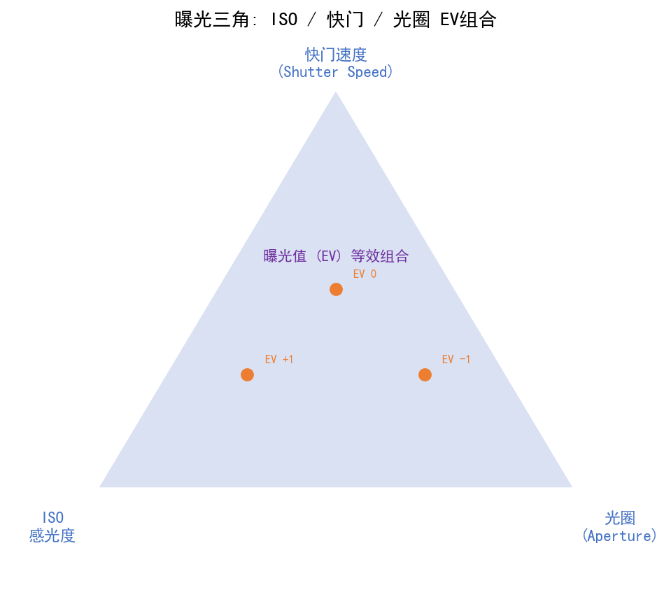
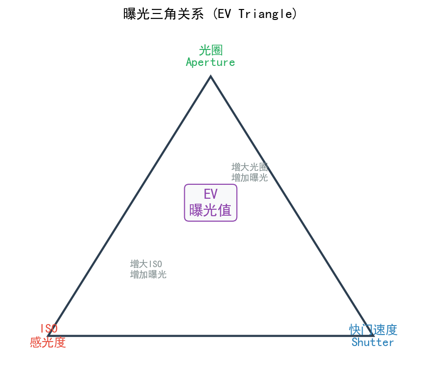

# 第四卷第02章：自动曝光算法（Auto Exposure Fundamentals）

> **定位：** AE 是 3A 系统中最先收敛的控制回路，直接影响 SNR 和动态范围利用率
> **前置章节：** 第一卷第03章（传感器物理）、第一卷第07章（动态范围与HDR）
> **适用读者：** 3A算法工程师、ISP调参工程师

---

> 进入隧道的瞬间屏幕一片白，走出隧道又一片黑——这"瞎眼"不是随机的，是 AE 延迟的精确体现。第 N 帧的亮度统计在第 N+1 帧被读取计算，新曝光参数最早在第 N+2 帧生效：两帧流水线延迟。加上 AE 状态机为了防止单帧噪声触发误切换，需要连续多帧亮度统计都落在阈值外才敢动参数，实际"瞎眼"往往是 3–5 帧。这个延迟不是 bug，是设计。理解它，才能理解 AE 调参的核心矛盾：收敛速度和防误切换永远在 trade-off，而不只是"测光准不准"的问题。

---

## §1 理论基础

### 1.1 曝光方程与 EV 系统

#### 基本曝光方程

摄影曝光量 $H$（单位：lux·s）定义为：

$$H = E \cdot t$$

其中 $E$ 为像面照度（lux），$t$ 为快门时间（秒）。像面照度与场景亮度 $L$、光圈数 $N$、透镜透过率 $T$ 的关系为：

$$E = \frac{\pi \cdot T \cdot L}{4 N^2}$$

因此总曝光量：

$$H = \frac{\pi \cdot T \cdot L \cdot t}{4 N^2}$$

**反射式测光标准化方程（ISO 2720）：**

ISO 2720 对反射式测光仪定义了如下标准曝光方程：

$$\frac{N^2}{t} = \frac{L \cdot S}{K}$$

其中：
- $N$：光圈数（f-number）
- $t$：快门时间（秒）
- $L$：场景亮度（cd/m²）
- $S$：感光度（ISO）
- $K$：测光标定常数，**标准值 $K = 12.5$**（适用于反射式测光，被 ISO 2720 及主要相机厂商采用）

该方程将场景亮度、曝光参数与感光度统一联系，是 AE 系统进行绝对亮度估算的基础。

#### EV（Exposure Value）系统

为了将曝光参数映射到对数域，摄影学引入了曝光值（Exposure Value, EV）的概念：

$$\text{EV} = \log_2\!\left(\frac{N^2}{t}\right)$$

其中：
- $N$：光圈数（f-number），如 f/1.8, f/2.8
- $t$：快门时间（秒），如 1/100s, 1/1000s

EV 每增加 1，进光量减半；EV 每减少 1，进光量翻倍。EV 系统的标准化定义参见 **[1]**。常见曝光组合示例：

| EV | 光圈 $N$ | 快门 $t$ | 适用场景 |
|----|---------|---------|---------|
| 15 | f/8     | 1/500s  | 晴天室外 |
| 12 | f/4     | 1/250s  | 阴天室外 |
| 9  | f/2.8   | 1/60s   | 室内日光 |
| 6  | f/2.0   | 1/15s   | 黄昏/黄金时段 |
| 3  | f/1.4   | 1/4s    | 夜景街道 |

**Sunny 16 法则（曝光经验规则）：**

在晴天室外阳光直射条件下，以 f/16 光圈拍摄时，正确曝光的快门时间约等于感光度倒数：

$$t \approx \frac{1}{\text{ISO}}, \quad N = f/16$$

例如，ISO 100 时快门 1/125 s（标准快门挡最近值），对应 $\text{EV}_{100} = \log_2(16^2 / (1/125)) = \log_2(256 \times 125) = \log_2(32000) \approx 15$。

**常见场景 EV 参考范围（ISO 100 基准，EV₁₀₀）：**

| 场景 | EV 范围 | 典型说明 |
|------|--------|---------|
| 晴天室外直射阳光 | EV 14–16 | 晴天沙滩、雪地可达 EV 16 |
| 阴天/室外散射光 | EV 10–13 | 阴云遮日 |
| 室内人工照明 | EV 5–9 | 荧光灯办公室约 EV 7–9 |
| 黄昏/傍晚室外 | EV 4–6 | 日落后约 EV 4 |
| 夜景/路灯街道 | EV 0–4 | 深夜无月可至 EV 0 或更低 |

#### APEX 系统（Additive System of Photographic Exposure）

APEX（ISO 12232 摄影曝光叠加系统）将曝光参数全部映射到以 2 为底的对数域，使各参数相互加减：

$$\text{EV} = A_v + T_v = B_v + S_v$$

| 符号 | 名称 | 定义 | 示例 |
|------|------|------|------|
| $A_v$（Aperture Value） | 光圈值 | $A_v = \log_2(N^2) = 2\log_2 N$ | f/2.8 → $A_v = 3$ |
| $T_v$（Time Value）| 快门值 | $T_v = -\log_2(t)$ | 1/100s → $T_v \approx 6.64$ |
| $S_v$（Sensitivity Value） | 感光度值 | $S_v = \log_2(\text{ISO}/3.125)$ | ISO 100 → $S_v = 5$ |
| $B_v$（Brightness Value） | 亮度值 | $B_v = \log_2(B \cdot S_0/\pi) $（$S_0 = 1/3.125$） | 场景亮度的对数量化 |

**APEX 的工程意义：** ISP AE 算法在 EV 域做 PID 控制（误差 = EV_target − EV_current），本质上即 APEX 系统；相机固件的曝光步长（1/3 EV、1/6 EV）直接来自 $\Delta A_v, \Delta T_v, \Delta S_v$ 的最小递增单位。

#### 等效曝光（Equivalent Exposure）

相同 EV 值可由不同 $(N, t)$ 组合实现，称为等效曝光。例如：

$$\frac{f/1.4}{1/1000s} \equiv \frac{f/2.0}{1/500s} \equiv \frac{f/2.8}{1/250s}$$

这三组参数 EV 相同（进光量相同），但对景深和运动模糊的影响截然不同。

#### ISO（增益）的作用

ISO 是传感器灵敏度的标准化度量，定义标准为 **ISO 12232:2019**（数字静态相机曝光指数、ISO 感光度额定值、推荐曝光指数及标准输出感光度）**[1]**。在数字摄影中，ISO 与模拟增益成比例（具体系数由传感器 OETF 和输出特性决定），工程近似为：

$$\text{ISO} \approx 100 \cdot g \quad \text{（ISO 12232:2019 推荐范围内）}$$

> **注（ISO 12232:2019）：** 该标准定义了 SOS（标准输出灵敏度）和 REI（推荐曝光指数）两套体系。实际相机 ISO 值由传感器标定决定，并非严格的 100 倍增益关系——ISO 200 不等于增益恰好 2×，实际换算还取决于传感器 OETF 和输出特性。工程使用中，上式为近似估算，不可用于精确增益标定。

**相机增益（dB）与 ISO（线性）的换算：**

$$G_{\text{dB}} = 20\log_{10}\!\left(\frac{\text{ISO}}{100}\right)$$

> ⚠️ **适用条件**：以上换算仅在以下前提下成立：① 传感器具有线性光电响应（无内嵌 Gamma/OETF）；② 以 ISO 100 作为基准点已完成增益标定；③ 遵循 ISO 12232:2006 饱和曝光速度（SOS）定义体系。ISO 12232:2019 引入了 REI（推荐曝光指数）和 SOS 两套独立定义，不同体系的换算结果不可互通。实际传感器 ISO 到模拟增益的映射关系以厂商 datasheet 为准。

例如：ISO 100 → 0 dB；ISO 200 → 6 dB；ISO 400 → 12 dB；ISO 3200 → 30 dB。反算：$\text{ISO} = 100 \times 10^{G_{\text{dB}}/20}$。ISP 寄存器通常以 dB 或线性倍数（gain multiplier）表示增益，与 ISO 数值可通过上式互相换算。

引入 ISO 后，EV 系统扩展为：

$$\text{EV}_{100} = \log_2\!\left(\frac{N^2}{t}\right) - \log_2\!\left(\frac{\text{ISO}}{100}\right)$$

**提高 ISO 的代价：** ISO 每翻倍，信噪比（SNR）降低约 3 dB（在散粒噪声主导的区域，*来源：论文实验，推导见第一卷第04章 §1.1，噪声模型理论值*）**[2]**，同时固定模式噪声（FPN）和读出噪声被放大。

#### 最优曝光参数选择策略

在移动设备（固定光圈）场景下，曝光参数控制优先级为：

```
优先级 1：延长快门时间 t（不引入额外噪声，但受运动模糊限制）
         t_max 通常由防抖能力和场景运动速度决定
         典型移动端限制：t ≤ 1/（焦距等效焦距）秒（防手抖）

优先级 2：提高模拟增益 gain_analog（噪声增加较少，因为在 A/D 转换前放大信号）
         典型范围：1× ~ 16×（12 dB）

优先级 3：使用数字增益 gain_digital（在 A/D 后放大，噪声最大，应尽量避免）
         通常作为最后手段，或用于精细调节
```

### 1.2 测光系统

测光（Metering）负责从图像统计信息中估计当前场景的曝光状态，是 AE 控制回路的输入端。

#### 反射式测光 vs 入射式测光

| 类型 | 原理 | 优点 | 缺点 |
|------|------|------|------|
| 反射式测光 | 测量从被摄体反射的光线 | 无需接触被摄体，远程测量 | 受被摄体反射率影响（黑猫/白雪问题） |
| 入射式测光 | 测量照射到被摄体的光线 | 不受反射率影响，绝对准确 | 需要测光表放置于被摄体位置 |

移动相机全部使用反射式测光，并通过场景分析和权重策略来补偿反射率差异。

#### 矩阵测光（区域测光）

将画面划分为 $M \times N$ 个区域（常见 8×6、16×9），对每个区域计算平均亮度 $\bar{Y}_i$，加权求和得到全局测光值：

$$Y_{\text{metered}} = \frac{\sum_{i=1}^{M \times N} w_i \cdot \bar{Y}_i}{\sum_{i=1}^{M \times N} w_i}$$

权重 $w_i$ 通常由区域位置、区域方差、场景内容（天空检测、人脸检测）等因素决定。

鲁棒性高，适合大多数场景；在强逆光等极端情况下可能失效。

#### 点测光

仅使用画面中心 1-5% 面积的亮度作为测光依据：

$$Y_{\text{metered}} = \bar{Y}_{\text{center\_spot}}$$

**适用场景：** 舞台演出（主体与背景亮度差极大）、精确控制特定区域的曝光。

#### 中央重点测光

使用高斯权重，中心区域权重最高，边缘权重趋近于零：

$$w(x, y) = \exp\!\left(-\frac{(x - x_c)^2 + (y - y_c)^2}{2\sigma^2}\right)$$

其中 $(x_c, y_c)$ 为画面中心，$\sigma$ 控制权重衰减速度（典型值为画面宽度的 1/4）。

#### 人脸优先测光

集成人脸检测（Face Detection）后，将人脸区域赋予最高权重：

$$w_{\text{face}} = \alpha \cdot \text{confidence}_{\text{face}} \cdot \text{area}_{\text{normalized}}$$

其中 $\alpha$ 为人脸权重系数（基准值 **3.0（基准）×** 背景区域），`confidence_face` 为检测置信度，`area_normalized` 为人脸面积相对全图的归一化值。

> **人脸测光权重工程建议**：基准值 $w_\text{face} = 3.0$（量产推荐起始点，来源：多款旗舰手机调试经验及 iResearch666 AE调参专栏）。调参范围参考：人脸偏暗（用户反馈欠曝）→ 上调至 3.5–4.0；人脸过曝（高反差逆光）→ 配合高光抑制权重，人脸权重保持 3.0 不变。与**第二卷第17章 §1.2.2 区域权重的多因子融合**中人脸测光权重定义一致。

**人脸测光启用条件：** 人脸检测置信度须高于阈值（通常 **confidence > 0.7**）才激活人脸测光权重；低于阈值时回退到矩阵测光，防止误检低质量人脸框干扰测光。

**肤色目标亮度：** 人脸区域 AE 目标亮度通常设为 **118–128 DN（8-bit）**（约46–50% 满幅），而非全局 18% 灰目标（118 DN）。该范围对应亚洲肤色在 sRGB 空间的标准曝光，具体数值由各平台肤色实测标定（不同平台可差 ±10 DN）。

**多人脸处理：** 对所有检测到的人脸加权平均，权重与人脸面积和中心位置相关。

#### 各测光模式适用性总结

| 测光模式 | 推荐场景 | 不适用场景 |
|---------|---------|-----------|
| 矩阵测光 | 日常拍摄、风景 | 极端逆光 |
| 点测光 | 舞台、高对比场景 | 日常使用（操作复杂） |
| 中央重点 | 人像（主体在中央） | 主体偏离中心 |
| 人脸优先 | 人像、自拍、视频通话 | 无人脸场景（需回退） |

#### 硬件亮度统计：ISP BPS 亮度收集引擎

AE 软件算法的输入并非原始 RAW 像素，而是 ISP **硬件统计引擎**（Hardware Statistics Engine）在每帧读出期间自动累积的统计数据。这是 AE 实时性的硬件基础。

**Qualcomm Spectra BPS 统计模块（BG Stats / AEC BG）：**

BPS（Bayer Processing Segment）在 Demosaic 之前对 RAW Bayer 数据进行区域统计：

```
传感器 RAW 帧（帧级流水）
  ↓
BPS 统计引擎（AEC BG — Background Exposure Statistics）
  将画面分为最大 32×32 个区域（可配置，骁龙8 Gen 系列）
  每个区域输出：
    sum_R, sum_G, sum_B    ← 各通道像素总和
    count                  ← 未饱和像素计数（饱和像素自动排除）
    saturated_count        ← 饱和像素数量
  ↓
DMA 将统计数据写入系统内存
  ↓
V-sync 中断触发 AE 软件读取（通常在 SOF 回调中）
```

**3A 控制器从统计数据计算区域亮度：**

$$\bar{Y}_z = \frac{0.299 \cdot \text{sum\_R}_z + 0.587 \cdot \text{sum\_G}_z + 0.114 \cdot \text{sum\_B}_z}{\text{count}_z}$$

不同厂商平台的统计格式：

| 平台 | 统计格式 | 网格规格 | 硬件驱动接口 |
|------|---------|---------|------------|
| Qualcomm Spectra（CamX） | AEC BG Stats | 最大 32×32，可配 | `camxtitan17xdefs.h` 的 `BGStatsConfig` |
| MediaTek Imagiq（IPESYS） | AE Weight Map | 最大 64×48 | MTK ISP HAL `AEStatConfig` |
| Samsung Exynos（ExynosCamera） | AE Grid Stats | 最大 32×24 | `ExynosCameraParameters.h` |

**人脸 AE 权重的实时性保证：**

人脸检测（通常运行在 NPU/CPU，延迟 15–30ms，*来源：作者经验，需社区验证；实测因机型和模型复杂度差异显著*）与 AE 控制（每帧 ~1ms，*来源：作者经验，需社区验证*）存在时序错位。工程实现中采用以下策略保证人脸 AE 权重的时序一致性：

1. **延迟补偿（Latency Compensation）：** 人脸检测器标记每个人脸框所对应的帧序号（Frame Index），AE 控制器在**同一帧的统计数据**上应用对应的人脸权重，而非用当前最新的人脸框（可能来自前 2–3 帧）
2. **帧时间戳对齐：** ISP 硬件统计数据携带 SOF 时间戳；人脸检测器将结果附加对应的 SOF 时间戳；AE 线程根据时间戳匹配统计数据与人脸框
3. **无人脸时的平滑退出：** 当连续 N 帧（通常 5–10 帧）检测不到人脸时，将人脸权重系数 $\alpha$ 从当前值线性衰减到 0（而非立即清零），避免测光模式切换引起的曝光跳变

**PDAF 子像素统计（双孔径统计）：**

部分 ISP 平台（如 Qualcomm IFE）的硬件统计引擎同时输出 PDAF 相位差统计（Left/Right 子像素之和），供 AF 算法使用；AE 算法可利用 PDAF 的饱和掩码信息，避免在高光饱和区域进行曝光统计（防止饱和像素拉低 AE 目标）。

### 1.3 AE 收敛算法

#### 目标亮度：18% 灰的由来

AE 的目标亮度基于"18% 反射率中性灰"的摄影标准 **[3]**。自然界中大量不同反射率场景的对数平均值约为 18%（即约 0.72 的对数中值），因此将 18% 灰作为曝光目标可在统计意义上最优地利用动态范围。

在实际实现中，目标亮度 $Y_{\text{target}}$ 通常设为 8-bit 量化后的 118（约为 255 × 0.46，其中 0.46 对应 18% 在 gamma = 2.2 **[4]** 下的值）。

#### 误差定义（对数域）

AE 误差在对数（EV）域定义，以保证线性控制特性：

$$e[k] = \text{EV}_{\text{target}} - \text{EV}_{\text{current}}[k]$$

其中：

$$\text{EV}_{\text{current}} = \log_2\!\left(\frac{Y_{\text{measured}}}{Y_{\text{target}}}\right)$$

#### PI 控制器

AE 普遍采用 PI（比例-积分）控制器，原因是纯比例控制存在稳态误差，而 PD 控制在噪声场景下容易引入高频振荡 **[5]**。

**控制律：**

$$\Delta \text{EV}[k] = K_p \cdot e[k] + K_i \cdot \sum_{j=0}^{k} e[j] \cdot T_s$$

其中：
- $K_p$：比例增益，决定响应速度
- $K_i$：积分增益，消除稳态误差
- $T_s$：采样时间（帧时间，如 1/30s）
- $\sum e[j] \cdot T_s$：误差积分，累积历史偏差

$K_p$ 项提供即时响应——当前帧误差越大，调整量越大；$K_i$ 项累积历史偏差，消除因测光偏差导致的稳态偏移。

**参数影响分析：**

| 参数 | 过大 | 过小 |
|------|------|------|
| $K_p$ | 振荡（Overshoot）、闪烁感 | 收敛慢（Sluggish） |
| $K_i$ | 积分饱和（Windup）、长期振荡 | 稳态误差残留 |

**视频模式下的"呼吸效应"（Breathing Effect）：**

在视频录制场景中，若 $K_p$ 过大或积分项设置不当，会产生"呼吸效应"——画面亮度以 2–6 帧为周期在目标值附近缓慢起伏，类似呼吸节奏。这是纯比例控制（缺少死区）在静态或缓变场景中最常见的主观感知问题：

- **根本原因：** 测光统计量的帧间随机噪声（帧间波动约 ±1–2%，*来源：作者经验，需社区验证；与传感器 ISO 和测光区域面积相关*）被 $K_p$ 放大，超过稳定死区（Stable Zone）阈值后每帧都触发曝光微调。
- **工程解决方案：** 在误差 $|e[k]|$ 低于**稳定死区**（通常为目标亮度的 ±3–5%，约对应 ±0.06–0.1 EV）时，不更新控制量（包括积分项）：

$$\Delta\text{EV}[k] = \begin{cases} K_p \cdot e[k] + K_i \cdot \sum e[j] \cdot T_s & |e[k]| > \epsilon_{\text{stable}} \\ 0 & |e[k]| \leq \epsilon_{\text{stable}} \end{cases}$$

- **迟滞带（Hysteresis Band）：** 为防止 AE 在稳定死区边界附近频繁切换，实践中设置外迟滞阈值 $\epsilon_{\text{enter}}$（约 ±3–5%）和内退出阈值 $\epsilon_{\text{exit}}$（约 ±1–2%）——进入稳定死区的条件比退出条件宽松，避免"乒乓"效应：

$$\text{状态切换规则：} \begin{cases} \text{进入稳定} & |e| < \epsilon_{\text{enter}} \approx 3\%–5\% \\ \text{退出稳定} & |e| > \epsilon_{\text{exit}} \approx 1\%–2\%（需连续 N_{\text{hold}} \geq 3 帧） \end{cases}$$

**防积分饱和（Anti-windup）：**

```python
# 积分项限幅，防止饱和
integral = clip(integral + e * Ts, -integral_max, integral_max)
```

**曝光饱和检测与积分冻结：** 当 $t = t_{\max}$、$\text{Gain} = \text{Gain}_{\max}$ 但图像仍欠曝时（极暗场景），积分项应冻结（Anti-windup），防止控制量超出物理范围；场景变亮时，积分项从最大值平滑释放，避免过曝过冲。这是 Anti-windup 在 AE 场景中最重要的工程实现细节——若不处理，进入极暗场景后再回到正常亮度时，积累的积分项会导致 3–5 帧明显过曝。

#### Bang-bang 控制（大误差快速收敛）

当误差 $|e|$ 超过阈值 $e_{\text{thresh}}$（典型值 1.5 EV，*来源：作者经验，需社区验证*）时，切换为 Bang-bang 控制：

$$\Delta \text{EV}[k] = \text{sign}(e[k]) \cdot \Delta \text{EV}_{\max}$$

系统在极端低照度场景（如进入隧道）或极端高光场景时，可在 2–3 帧内完成大范围曝光调整，随后平滑切换回 PI 控制器进行精细收敛。

#### 收敛稳定性分析

系统传递函数（Z域）：

$$H(z) = K_p + K_i \cdot T_s \cdot \frac{z}{z-1}$$

闭环稳定性条件（Jury 判据）要求特征根在单位圆内 **[5]**。**以下结论仅适用于单帧延迟（d=1）**，即感光→ISP处理→AE决策的总延迟为1帧；若ISP pipeline延迟 d > 1帧（如3A处理滞后），稳定域将收窄，需重新推导：

$$K_p < 2, \quad K_i < \frac{2}{T_s}$$

> ⚠️ **延迟敏感性：** 当pipeline延迟 d=2 帧时，稳定上界降为约 $K_p < 1.4$；d=3 帧时约 $K_p < 0.8$。高帧率（120fps, $T_s \approx 8.3\text{ms}$）下 $K_i$ 上界同比例缩小，实际调参需结合 SoC 实测延迟确认稳定域。

实践中，$K_p$ 取 0.3-0.7，$K_i$ 取 0.05-0.2（Hz）时，系统在 5-10 帧内收敛，无明显振荡。

**实际平台 pipeline 延迟（d 值）参考**：

| 平台 | 芯片型号（代表机型） | 帧率 | d（AE决策→曝光生效） | 备注 |
|------|---------------------|------|---------------------|------|
| 高通 CamX | SM8650 / Snapdragon 8 Gen3（小米14、三星S24） | 30fps | **2 帧**（~67ms/帧内约 2×33ms） | 4K@30fps 默认；`m_aeFrameDelay=2` in CamXAECCore.cpp |
| 高通 CamX | SM8650 | 60fps | **2 帧**（~33ms/帧内约 2×17ms） | 帧预算缩短，wall-clock 延迟减半但 d 帧数不变 |
| 高通 CamX | SM8650 | 4K@60fps Preview（ISP全速） | **2–3 帧** | 取决于 post-proc pipeline 深度；IFE→BPS→IPE 各占约 0.3 帧 |
| MTK Imagiq | Dimensity 9300 / 9200（OPPO Find X7） | 30fps | **2 帧** | P1 ISP 统计→3A 算法→P2 参数下发 |
| 苹果 A 系列 | A17 Pro（iPhone 15 Pro） | 30fps | **1–2 帧**（估算） | Apple 未公开；第三方基于 burst 序列分析 |

可通过 `adb logcat -s CamX | grep "AEControl\|RequestId"` 比对 RequestId 与实际曝光帧号差确认高通平台实测 d 值。

**实测方法**：在场景亮度突变（遮挡测光区域）时，记录 `MetaData` 中 `SENSOR_EXPOSURE_TIME` 的响应帧延迟。高通 BSP 在 `CamXAECCore.cpp` 中有 `m_aeFrameDelay` 配置项（通常出厂默认 2）。

**K_p 推荐值修正**（含延迟）：
- d=1：`K_p ∈ (0, 2)`，推荐 0.5–0.7
- d=2（高通/MTK 常见）：`K_p ∈ (0, 1.4)`，推荐 **0.3–0.5**
- d=3：`K_p ∈ (0, 0.8)`，推荐 0.2–0.3

### 1.4 多帧 HDR AE（Auto HDR）

#### 场景动态范围估计

通过分析亮度直方图的双峰特性来估计场景动态范围（DR）：

**直方图双峰检测算法：**
1. 计算归一化亮度直方图 $H(v)$，$v \in [0, 255]$
2. 高斯平滑：$\tilde{H}(v) = H(v) * G_\sigma$，$\sigma = 5$
3. 寻找峰值：检测满足 $\tilde{H}'(v) = 0$，$\tilde{H}''(v) < 0$ 的极大值点
4. 如果检测到两个峰值 $v_1 < v_2$ 且 $v_2 - v_1 > 80$（大于约 2.5 EV ），判定为高 DR 场景

**场景 DR 估计：**

$$\text{DR}_{\text{scene}} \approx \log_2\!\left(\frac{Y_{99\%}}{Y_{1\%}}\right) \quad [\text{EV}]$$

其中 $Y_{1\%}$、$Y_{99\%}$ 分别为亮度的 1% 和 99% 分位数。

#### 自动 HDR 触发条件

```
触发 HDR 的条件（满足任一）：
  1. DR_scene > DR_sensor_single（通常 > 12 EV）
  2. 直方图双峰检测阳性
  3. 高光像素比例 > 5% 且阴影像素比例 > 5%（高光过曝 + 阴影欠曝同时存在）
```

退出 HDR 的条件（连续 N 帧，防抖）：
- DR_scene < DR_sensor_single - 2 EV（留出迟滞量，防止频繁切换）

#### 曝光对选择

HDR 需要选择长曝光（捕获阴影细节）和短曝光（保留高光细节）的曝光比：

$$N_{\text{stops}} = \text{DR}_{\text{scene}} - \text{DR}_{\text{sensor\_single}}$$

$$\text{EV}_{\text{long}} = \text{EV}_{\text{target}} + \frac{N_{\text{stops}}}{2}, \quad \text{EV}_{\text{short}} = \text{EV}_{\text{target}} - \frac{N_{\text{stops}}}{2}$$

典型曝光对：$N_{\text{stops}} = 2 \sim 4$ EV（1:4 ~ 1:16 的曝光比）。

**长曝光高光保护原则：** 长曝光 AE 目标设定时，应确保长帧内饱和像素比例 **< 0.5%**（即 99.5% 分位数不超过满阱容量的 95%）。超过此比例表明高光区域细节已丢失，需适当降低长曝 EV 目标（−0.5 EV 步进），同时提升短曝 EV 目标补偿，以保留高光层次。

**短曝光比选择（工程参考）：** 典型短曝光比为长曝光的 **1:4 或 1:8**（即短曝 EV 比长曝低 2–3 EV）。1:4 适合 DR 在 12–14 EV 的场景；1:8 或 1:16 适合 DR > 14 EV 的极端高对比场景（晴天逆光、明暗对比室内）。

#### Staggered HDR vs 多帧 HDR 的 AE 策略差异

| 特性 | Staggered HDR（传感器级） | 多帧 HDR（算法级） |
|------|--------------------------|-------------------|
| 帧率影响 | 无（同一帧内两次曝光） | 有效帧率减半 |
| 运动伪影 | 低（Rolling Shutter 传感器行间时序错位约数百μs–数ms；Global Shutter 传感器则为μs级） | 高（帧间时间差较大） |
| AE 调整延迟 | 1 帧 | 2 帧 |
| 曝光比限制 | 通常 ≤ 4:1（传感器架构限制） | 灵活，可达 16:1  |
| AE 策略 | 以长曝光作为 AE 参考帧 | 以中曝光（几何均值）为目标 |

### 1.5 Anti-banding（防频闪）

#### 荧光灯频闪原理

荧光灯（包括 LED 灯的 PWM 调光）由市电驱动，以 $2 \times f_{\text{AC}}$ 的频率周期性闪烁 **[6]**：
- 50 Hz 市电 → 100 Hz 闪烁（中国、欧洲）
- 60 Hz 市电 → 120 Hz 闪烁（美国、日本）

当相机快门时间不是闪烁周期整数倍时，相邻帧捕获到不同闪烁相位，导致：
1. 帧间亮度跳变（视频中的"闪烁感"，Flicker）
2. 图像中出现水平亮暗条纹（Banding）

#### 防频闪快门约束

为消除频闪效应，快门时间必须是闪烁半周期的整数倍：

$$t = \frac{k}{2 \times f_{\text{line}}}, \quad k = 1, 2, 3, \ldots$$

其中 $f_{\text{line}}$ 为电源频率（50 Hz 或 60 Hz）：
- 50 Hz 场景：$t \in \{1/100, 1/50, 1/33.3, 1/25, \ldots\}$ s（即10ms, 20ms, 30ms, 40ms, …）
- 60 Hz 场景：$t \in \{1/120, 1/60, 1/40, 1/30, \ldots\}$ s（即8.33ms, 16.67ms, 25ms, 33.3ms, …）

#### 自动频率检测

在未知市电频率场景（如旅行时频繁切换国家），自动检测方法：

**方法1：时域分析**
- 比较连续帧的全局亮度变化，检测 100 Hz 或 120 Hz 的周期性波动

**方法2：空域分析（图像内条纹检测）**
- 对图像做列均值，得到一维亮度曲线 $P(y)$
- 对 $P(y)$ 做 FFT，检测主频率对应的条纹间距
- 条纹间距 $\Delta y = \frac{t_{\text{row}} \cdot f_{\text{sensor}}}{f_{\text{line}}}$，其中 $t_{\text{row}}$ 为行时间

#### 与 SNR 的权衡

防频闪约束减少了 AE 系统的自由度。在低光场景：
- 最优快门时间（最大化 SNR）可能为 1/80s
- 但防频闪约束只允许 1/100s 或 1/50s
- 选择 1/100s → 曝光不足，需要提高 ISO（SNR 下降约 1.5 dB，*来源：作者经验，需社区验证；与场景照度和传感器噪声模型相关*）

**解决方案：** 在视频模式下强制防频闪；在拍照模式下可选择性关闭（单帧不受帧间闪烁影响，但可能有条纹）。

### 1.6 主流平台 AE 实现对比

不同 SoC 平台的 AE 算法在统计收集、线程架构和参数框架上存在显著差异，以下为基于公开资料（CAMX 开源代码、MediaTek 技术博客）的对比：

| 维度 | 高通 Spectra ISP (CAMX) | 联发科 Imagiq ISP |
|------|------------------------|------------------|
| **统计收集硬件** | BPS（Bayer Processing Segment），AEC BG Stats，最大 32×32 网格 | IFE / IPESYS，AE Weight Map，最大 64×48 网格 |
| **3A 线程架构** | 独立 AAA 线程（`AECEngineNode`），在 CamX Pipeline 中异步运行，统计→算法→参数下发约 2 帧延迟 | Feature Pipe 的 AE 节点（`FeaturePipe_AE`），HW 统计 + SW PI 算法分离，同样约 2 帧延迟 |
| **PI 控制器** | 在 `AECCore` 中实现，支持多段 Kp/Ki 曲线，按增益档位切换 | 在 MTK AE Library 中实现，支持动态 Kp/Ki 随场景变化量 |
| **参数框架** | Chromatix XML，多维插值（光照×增益×缩放），`TuningManager` 在线插值 | MTK AE Tuning Table，分 Scenario 按曝光组合存储 |
| **AI 辅助** | Hexagon NPU 运行场景分类，输出 AE 偏移量（EV Bias） | APU 运行预测性 AE，提前 2–3 帧预测 EV 变化 |
| **防频闪** | `AECAntibanding`，支持 50/60/Auto 三种模式 | MTK Anti-Flicker 模块，同样支持 50/60/Auto |
| **AE 收敛目标** | 30fps 下约 3–5 帧收敛至 ±3% EV 误差以内 | 30fps 下约 3–5 帧，动态场景可压至 2–3 帧（APU 预测） |

> **工程要点：** 从高通平台迁移到联发科时，最常见的失效是将 Chromatix 的 Kp/Ki 数值直接搬用——两个平台的 AE 统计归一化方式和误差定义不同，相同数值会导致收敛速度差异超过 2 倍。建议从默认值（Kp≈0.3, Ki≈0.1）重新调起，不要直接搬运。

### 1.7 AI 辅助 AE

#### 场景亮度预测

传统 AE 基于当前帧的测光结果，存在 1-2 帧的响应延迟。AI 辅助 AE 通过 CNN 预测下一帧的最优 EV：

**网络结构：** 轻量级 CNN（MobileNetV3 骨干，<1M 参数），输入为降采样至 64×64 的 RAW/YUV 缩略图，输出为预测 EV 偏移量 $\Delta \text{EV}_{\text{pred}}$。

**训练目标：** 最小化预测 EV 与人工标注最优 EV 的 L1 损失。

#### 任务驱动 AE

18% 灰目标对人眼好，但对目标检测不一定对。暗光下人眼接受稍高曝光（高亮保留细节），检测模型却更需要阴影区域的信噪比——两个目标的最优曝光可以差 1 EV 以上。

**Onzon et al., CVPR 2021（arXiv:2104.01906）**：提出将下游任务（人脸检测）的性能损失作为 AE 的训练目标，通过可微分的 ISP 模拟器实现端到端训练。实验表明，任务驱动 AE 在暗光人脸检测中，mAP 提升约 8%（相比传统 AE）**[7]**。

#### 夜景"虚拟 AE"

**Chen et al., CVPR 2018（arXiv:1805.01934，"Learning to See in the Dark"）**：提出放弃传统高 ISO 路线，改用低 ISO 短曝光采集 RAW 数据，再通过深度学习网络进行亮度增强 **[8]**。这相当于在 RAW 域实现"虚拟曝光补偿"：

$$I_{\text{enhanced}} = \text{UNet}(I_{\text{RAW\_low}}, \alpha)$$

其中 $\alpha = \text{EV}_{\text{target}} / \text{EV}_{\text{captured}}$ 为增益比。

低 ISO 的固有噪声更低，神经网络去噪效果更好，最终 SNR 优于传统高 ISO 方案。

#### 强化学习个性化曝光控制

传统 AE 以固定亮度目标（通常 18% 灰或中等 luma）为收敛点，无法适应用户的拍摄偏好（如偏好高调人像或低调风格）。强化学习（Reinforcement Learning, RL）方案将曝光控制建模为序贯决策问题：

- **状态（State）$s_t$：** 当前帧直方图特征、测光区域 luma 分布、EV 历史
- **动作（Action）$a_t$：** EV 调整量 $\Delta\text{EV} \in \{-1, -0.5, 0, +0.5, +1\}$ EV
- **奖励（Reward）$r_t$：** 基于用户偏好模型的曝光满意度评分（可由 IQA 网络或人类偏好数据蒸馏）

典型 RL 策略网络（Policy Network）为轻量 MLP（<100K 参数），输入直方图特征，输出 Q 值后 ε-贪心选择动作。训练时使用 DQN（Deep Q-Network）或 PPO，奖励函数融合感知曝光质量与用户历史偏好。该方案在相同场景下可学习到不同用户的曝光偏好差异，个性化程度优于固定 EV 目标的 PI 控制器 **[10]**。

#### 语义测光（CLIP 引导）

CLIP（Contrastive Language-Image Pre-training，Radford et al., ICML 2021）将图像与文本嵌入到同一语义空间，为语义引导的 AE 提供了可行基础：

**CLIP 引导测光原理：**
1. 用户或场景分类器提供语义描述，如"人像面部清晰""夕阳色调丰富"
2. 将语义描述编码为 CLIP 文本特征 $z_{\text{text}} = \text{CLIP\_text}(prompt)$
3. 对候选 EV 范围内的多个曝光估计图像计算 CLIP 图像特征 $z_{\text{img}}^{(EV)}$
4. 选择余弦相似度最大的 EV：$\text{EV}^* = \arg\max_{EV} \langle z_{\text{img}}^{(EV)}, z_{\text{text}} \rangle$

在实际工程中，候选 EV 的"估计图像"可通过当前帧 ±EV 的快速 gamma 模拟生成，避免多次实际曝光。CLIP-IQA+（Wang et al., TPAMI 2023）**[11]** 在 IQA 任务上的成功表明，CLIP 特征对曝光质量高度敏感，可作为 AE 的语义奖励信号。

当前工程局限：CLIP ViT-L/14 推理约 50ms（A100，*来源：第三方估算，基于 OpenAI CLIP 开源代码基准测试*），在手机 NPU 上约 200–500ms（*来源：作者经验，需社区验证；实测因 NPU 型号和量化方式差异大*），不适合逐帧 AE 闭环控制；可行方案是用 CLIP 评分离线生成"语义目标 luma 表"，再由传统 PI 控制器在线查表。

### 1.8 困难场景的 AE 策略

| 场景 | 主要挑战 | AE 失败模式 | 解决方案 |
|------|---------|-----------|---------|
| 逆光（人物在窗前） | 背景极亮，主体暗 | 主体欠曝（背景亮度主导测光） | 人脸检测 + 人脸测光优先；或触发 HDR |
| 雪地/白沙滩 | 高反射率场景 | 整体欠曝（18%灰目标偏低） | 自动 +1 ~ +2 EV 补偿（场景分类检测） |
| 演唱会/舞台 | 强追光灯 + 极暗背景 | 主体过曝 | 点测光 + 高光保留权重 |
| 隧道出口 | 极大场景 DR 变化（~5 EV/秒） | 短时过曝 | Bang-bang 控制 + 预测性 AE |
| 烛光/暖光源 | 低色温极亮光源 | 橙色光源触发 AE 过曝保护 | 色温感知测光（降低暖色通道权重） |
| 混合照明 | 多光源亮度差异 | 均值测光被高光拉偏 | 直方图百分位测光（避免均值受极值影响） |
| 夜间车灯 | 移动高亮点光源 | 频繁 AE 跳变 | 时序滤波 + 车灯区域排除 |

---

## §2 标定 (Calibration)

### 2.1 相机响应函数（CRF）线性化校准

AE 控制器假设曝光量与传感器输出之间存在线性关系（在对数域）。如果 CRF 非线性，则控制器模型不准确，导致收敛振荡。

**校准步骤：**

1. 使用积分球（Integrating Sphere）或标准灰卡作为均匀光源
2. 从最小曝光到最大曝光扫描曝光参数，间隔 0.5 EV
3. 记录每个曝光点的传感器输出（RAW 均值）
4. 拟合对数线性模型：$\log_2(Y) = a \cdot \text{EV} + b$
5. 验证线性度（R² > 0.999 ），否则补偿 LUT

**常见非线性来源：**
- 模拟增益切换点（从 1× 切换到 2× 时的增益误差）
- 读出噪声底噪在低曝光段的影响
- 传感器压摆率限制导致的高曝光段饱和

### 2.2 AE 收敛速度测试

**测试方案：**
1. 将相机对准均匀灰卡，手动设定极端曝光（如过曝 3 EV）
2. 切换到 AE 模式，记录每帧的测光亮度 $Y[k]$
3. 计算收敛时间 $T_{\text{conv}}$：定义为 $|Y[k] - Y_{\text{target}}| < 5\%$ 的首帧序号

**合格标准：**
- 移动端实时预览：$T_{\text{conv}} \leq 15$ 帧（@30fps，即 0.5s，*来源：作者经验，需社区验证*）
- 视频录制模式（需平滑）：每帧 EV 调整量 $\leq 0.3$ EV（*来源：作者经验，需社区验证*）

---

## §3 调参指南

### 3.1 测光区域权重地图（Zone Weight Map）调参

不同测光模式对应不同权重地图，调参时应针对目标场景进行优化：

**矩阵测光权重调参原则：**
- 增大中心区域权重：适合主体居中的人像场景
- 增大下半区域权重：风景拍摄（天空区域反射率高，易导致地面欠曝）
- 引入方差权重：减少高亮区域（如天空）对测光的影响

**权重地图验证工具：** 使用测试图库（包含逆光、雪地、演唱会等典型困难场景），统计主体区域的 $\Delta \text{EV}$（与最优曝光的偏差），优化各场景的加权和。

### 3.2 PI 控制器参数调参

**调参流程（经验 Ziegler-Nichols 法 [5]）：**

1. 将 $K_i$ 设为 0，逐渐增大 $K_p$ 直到系统出现等幅振荡，此时 $K_p = K_{p,\text{crit}}$，振荡周期为 $T_{\text{crit}}$
2. 设定 $K_p = 0.45 \cdot K_{p,\text{crit}}$，$K_i = 1.2 \cdot K_p / T_{\text{crit}}$ **[5]**
3. 在实际场景中微调，重点检查：场景切换收敛速度、静态场景无闪烁

### 3.3 三平台 AEC 关键参数对比

自动曝光控制（AEC）在不同 SoC 平台的参数结构与调试工具存在显著差异。以下为主流平台的参数对照：

| 功能 | 高通 CamX / Chromatix | MTK Imagiq / NDD | 海思越影 |
|------|----------------------|-----------------|---------|
| 目标亮度 | `AEC_TargetLuma`（0–255，8-bit） | `AETargetMean`（NDD uint8） | `AE_TargetY`（JSON float） |
| ISO 范围上限 | `AEC_MaxISO`（整数，如 3200） | `AEMaxISO`（NDD integer） | `AE_MaxAnalogGain`（倍数） |
| 快门上限 | `AEC_MaxExpTimeMs`（毫秒） | `AEMaxExpTime`（µs） | `AE_MaxExposureUs` |
| 测光模式 | `AEC_MeteringMode`（枚举：CENTER/MATRIX/SPOT） | `AEMeteringMode`（枚举） | `AE_MeteringType` |
| 收敛速度 | `AEC_StepSize`（EV 步长，0.0–1.0） | `AEConvergeSpeed`（快/中/慢枚举） | `AE_ConvergenceRate`（float） |
| 防频闪 | `AEC_AntiFlickerMode`（50Hz/60Hz/AUTO） | `AEAntiFlickerMode`（NDD enum） | `AE_FlickerDetectEnable` |
| ISO-曝光优先 | `AEC_ISOPriority`（ISO_PRIORITY/SHUTTER_PRIORITY/AUTO） | `AEExpPriority`（NDD） | `AE_ExposurePriority` |
| 权重地图 | `AEC_ZoneWeightMap`（9×7 或 16×12 网格 XML） | `AEWeightTable`（NDD float array） | `AE_ZoneWeight[]` |

**高通 CamX 调参路径：**

Chromatix 参数存储在 `chromatix_aec_ext.xml` 中，通过 Qualcomm Camera IQ Tuning Tool（CIQT）可视化编辑。关键路径：

```
CamX Pipeline → AECNode → AECAlgorithm
    ├── chromatix_aec_ext.xml       ← 核心 AEC 参数（目标亮度/收敛速度/权重图）
    ├── chromatix_aec_adrc.xml      ← ADRC（自适应动态范围压缩）参数
    └── chromatix_sensor_XXXX.xml   ← 传感器特定曝光约束
```

典型 XML 结构示例（目标亮度节点）：
```xml
<AECTargetLuma>
  <enable>1</enable>
  <luxIndex_start>0</luxIndex_start>
  <luxIndex_end>1000</luxIndex_end>
  <targetLuma>
    <entry luxIndex="0"   luma="118"/>
    <entry luxIndex="200" luma="108"/>   <!-- 低照度时降低目标保留动态范围 -->
    <entry luxIndex="500" luma="100"/>
    <entry luxIndex="1000" luma="90"/>
  </targetLuma>
</AECTargetLuma>
```

**MTK NDD 调参路径：**

MTK 使用 NDD（Noise Distribution Data）文件格式统一管理 AE/AWB/AF 参数：

```
FeaturePipe/
├── Scenario_xxx.NDD       ← 场景级别 NDD（含 AE 参数）
│   ├── [AE]
│   │   ├── AETargetMean   = 128
│   │   ├── AEMaxISO       = 3200
│   │   ├── AEConvergeSpeed = MEDIUM
│   │   └── AEAntiFlicker  = AUTO
└── Camera_Device_Info.xml ← 传感器物理参数绑定
```

MTK Camera Tool（在 ADB 连接下）支持实时注入 NDD 参数，无需重新烧录固件，大幅提升调试效率。

**调参实战提示：**

- **高通平台**：目标亮度 `AEC_TargetLuma` 与 tonemap 曲线强耦合——调高目标亮度后若不同步降低 Gamma 曲线亮度段，会导致高光过曝
- **MTK 平台**：`AEConvergeSpeed` 设为 FAST 在低照度场景会引入明显的 AE Hunting，建议低照度单独配置 lux-index 分段策略
- **海思越影**：`AE_MaxExposureUs` 需与防频闪约束同步维护，否则防频闪约束被 MaxExposure 截断导致频闪出现

### 3.4 海思越影 AE 工程实战

以下调参经验来自 Hi3559/Hi3516/Hi3519 系列量产项目，API 名称以 Hi3559V100R003 SDK 版本为准。

**曝光控制优先级顺序**

海思 ISP 的 AE 控制遵循固定优先级：曝光时间 → 模拟增益（Analog Gain）→ 数字增益（Digital Gain）→ ISP 数字增益。模拟增益引入的噪声最低，应尽量优先使用，仅在 Analog Gain 饱和后才切换数字增益。

**低照度噪声优化**

```c
// 降低目标亮度 + 降低收敛斜率 → 降低增益 → 降低噪声
HI_MPI_ISP_GetStatisticsConfig(ViPipe, &stStatCfg);
stStatCfg.u16HistRatioSlope = 32;      // 默认64，降低可减少过曝追求
stStatCfg.u8Compensation    = 4;       // 默认8，降低可减少目标亮度
HI_MPI_ISP_SetStatisticsConfig(ViPipe, &stStatCfg);
// 同步开启海思 ISP 后端降噪模块以弥补亮度下降带来的 SNR 损失
```

**自动帧率下降（暗场帧率联动）**

启用 `enAEMode = AE_EXP_LOWLIGHT_PRIOR`，并配合帧率门限参数：

| 参数 | 典型值 | 说明 |
|------|--------|------|
| `u32GainThreshold` | ~12000 | 增益超过此值触发帧率降低（亮度不足） |
| `stAGainRange.u32Min` | ≥50000 | 暗场下允许的最小 Analog Gain（保证暗部曝光） |
| 最低帧率下限 | 6 fps（硬限） | 低于此值人脸识别降质，工程上不建议低于此值 |

**逆光场景检测经验阈值**

基于 Hi3559 量产项目经验：在正常光线 + 低照优先模式下，非逆光场景 ISO < 250；逆光场景 ISO > 280（阈值经验范围 250–350，强依赖具体场景与镜头）。极暗环境下该启发式失效，建议改用直方图双峰检测代替 ISO 阈值判断。

**WDR 模式色偏修复**

WDR 开启后出现色偏（通常偏绿或偏青），工程处理手段：
1. 降低 RGB 三通道降噪强度（NR 过强导致通道响应差异）
2. 适当提高 ISP 色彩饱和度参数弥补视觉损失
3. 根本原因通常是宽动态模式下 CCM 标定不完整，建议补充 WDR 光源下的 CCM 重标定

**常用调试 API**

```c
// 读取/设置统计配置（AE 权重区域、直方图分区）
HI_MPI_ISP_GetStatisticsConfig(ViPipe, &stStatCfg);
HI_MPI_ISP_SetStatisticsConfig(ViPipe, &stStatCfg);

// 读取/设置 ISP 公共属性（像素格式、ISP 增益范围）
HI_MPI_ISP_GetPubAttr(ViPipe, &stPubAttr);
HI_MPI_ISP_SetPubAttr(ViPipe, &stPubAttr);

// 实时读取当前 AE 状态（曝光时间/增益/EV）
HI_MPI_ISP_QueryISPInfo(ViPipe, &stIspInfo);
MFLOAT fISO = stIspInfo.stAEInfo.f32ISO;
MFLOAT fExpTime = stIspInfo.stAEInfo.f32ExpTime;
```

> **平台说明：** 上述 API 适用于 Hi3559/Hi3516/Hi3519 系列（SDK v3.0.x）。Hi3519AV100 / Hi3559AV100 的 API 结构相同但部分参数字段有差异，参考对应 SDK 文档。

### 3.5 AE 收敛状态机与防振荡工程

#### 3.5.1 Android HAL3 AE 状态机（6 状态标准）

Android Camera3 HAL3 规范定义了 6 个标准 AE 状态，所有遵循 Android CDD 的设备必须实现并正确上报这些状态（来源：Android AOSP Camera3 3A 模式和状态转换文档 **[12]**）：

| 状态常量 | 说明 |
|---------|------|
| `AE_STATE_INACTIVE` | 初始状态，设备开机必须从此状态启动；AE 算法尚未运行 |
| `AE_STATE_SEARCHING` | 未收敛，正在调整曝光参数（搜索阶段）；画面亮度距离目标仍有偏差 |
| `AE_STATE_CONVERGED` | 已找到良好曝光值，参数**未锁定**；HAL 可自发离开此状态去搜索更佳曝光值 |
| `AE_STATE_LOCKED` | 通过 `AE_LOCK=true` 锁定，参数冻结；直到 `AE_LOCK=false` 才能离开 |
| `AE_STATE_FLASH_REQUIRED` | 已收敛但 HAL 判断当前场景需要闪光灯才能正确曝光 |
| `AE_STATE_PRECAPTURE` | 正在执行预拍摄测光序列（如闪光灯预曝光、HDR 多测光帧） |

**典型状态转移路径：**

```
开机初始化：
  INACTIVE → SEARCHING → CONVERGED（正常收敛路径）

点击拍照（含预拍）：
  CONVERGED → PRECAPTURE → LOCKED → SEARCHING → CONVERGED
                                      （拍照完成后重新搜索）

AE Lock 操作：
  任意状态 + AE_LOCK=true  →  LOCKED
  LOCKED  + AE_LOCK=false  →  SEARCHING → CONVERGED

闪光灯场景：
  SEARCHING → FLASH_REQUIRED（低光且无法单纯调曝光达标）
  FLASH_REQUIRED + 触发闪光 → PRECAPTURE → LOCKED
```

> **工程注意事项：** `AE_STATE_CONVERGED` 并不代表参数被锁定——HAL 在此状态下仍可以微调曝光（通常 ±0.1 EV 以内）。上层应用需要真正冻结参数必须显式设置 `AE_LOCK=true`，否则场景稍微变化仍会触发状态跳回 SEARCHING。这是很多相机应用在 CONVERGED 状态下录制视频仍出现轻微亮度跳动的根本原因。

#### 3.5.2 防振荡（Anti-Hunting）控制模型

**收敛更新公式（乘法形式，地平线工程实践 **[13]**）：**

$$\text{exposure}(n) = \text{exposure}(n-1) \times \frac{\text{target}}{\text{mean}} \times \frac{1}{\text{damping}}$$

其中：
- $\text{target}$：目标亮度（如 118，对应 18% 灰）
- $\text{mean}$：当前帧测光均值
- $\text{damping}$：阻尼系数，$\text{damping} > 1$

该公式本质上是 §1.3 PI 控制器的简化比例控制形式，在对数域等价于 $\Delta\text{EV} = \frac{1}{\text{damping}} \cdot \log_2\!\left(\frac{\text{target}}{\text{mean}}\right)$。$\text{damping}$ 对应高通 Chromatix 中的 `AE_Tolerance` 参数概念（典型容忍度 ±3–5%），控制收敛速度与稳定性的权衡：

| damping 取值 | 收敛速度 | 稳定性 | 推荐场景 |
|-------------|---------|-------|---------|
| 接近 1（如 1.05） | 快（3–5 帧） | 易振荡 | 快速场景切换、直播推流 |
| 中等（1.2–1.5） | 中（8–12 帧） | 较稳定 | 通用拍照/录像 |
| 较大（2.0+） | 慢（15 帧以上） | 非常稳定 | 监控/固定场景长焦 |

#### 3.5.3 AE 振荡四大根因（工程排查优先级）

AE 振荡（Hunting/Flicker）在量产调试中排查顺序建议按以下优先级进行（来源：地平线开发者社区 **[13]**）：

**根因 1：曝光与增益生效帧不同步（最高优先级，最常见）**

不同硬件的生效延迟不一致：增益（Gain）可能 1 帧生效，而曝光时间（Exposure）需要 3 帧才完全生效。AE 控制器若未考虑这一差异，会在两参数都调整时出现控制状态错位——以为增益和曝光都已生效，但实际上曝光还差 2 帧，导致 AE 按"已收敛"的错误状态再次下调增益，下帧曝光才真正生效时画面变暗，触发新一轮调整，形成 2–3 帧周期的振荡。

> **排查方法：** 用 ADB 抓取每帧的 {曝光时间, 增益, 测光均值}，绘制时序图。若振荡周期恰好等于曝光生效帧数，几乎可以确定是此问题。**修复方式：** 在 AE 控制器中为曝光和增益分别维护独立的"生效延迟队列"，只有参数真正生效后才纳入误差计算。

**根因 2：AE 收敛步长过大**

单步 EV 调整幅度过大（如每帧调整 > 0.5 EV），导致目标两侧来回跳动（过冲振荡）。

> **修复方式：** 减小最大步长，或在接近目标时（误差 < 1 EV）自动切换到更小步长（如 0.1 EV/帧）。

**根因 3：Sensor 延迟生效帧设置不正确**

平台配置的"延迟帧数"参数与实际 sensor 硬件行为不符（例如配的是 2 帧但 sensor 实际需要 3 帧）。

> **排查方法：** 用示波器或 GPIO 触发在 MIPI 帧头抓取曝光寄存器写入时刻与传感器输出变化时刻之间的实际帧数差。**修复方式：** 更新 sensor 驱动中的 `ae_delay_frame` 字段使其与实测值一致。

**根因 4：AE 容忍度（Tolerance）设置过小**

收敛判定的 threshold band 太窄（如 ±1%），正常帧间统计波动（噪声导致测光值随机抖动）被误判为"未收敛"，不断触发新的调整。

> **修复方式：** 扩大容忍度到 ±3–5%，或对测光值做时域 IIR 平滑后再用于收敛判定。高通 Chromatix `AE_Tolerance` 参数的典型工程推荐值为 ±3%（低照度可放宽到 ±5%）。

#### 3.5.4 高通 Chromatix AEC 收敛参数体系

高通 AEC9/AEC10 中与收敛控制直接相关的参数（来源：高通 AEC9 调试指南公开资料 **[14]**）：

| 参数 | 含义 | 调试方向 |
|------|------|---------|
| `Fast Convergence Skip` | 快速收敛阶段的 skip 帧数（每隔 N 帧运行一次 AE） | 减小→收敛更快，功耗升高 |
| `Slow Convergence Skip` | 慢速收敛（接近收敛时）的 skip 帧数 | 增大→更省功耗，响应变慢 |
| `lux_index` | 以 TL84 400 lux 为基准的照度索引，构建触发区间 | 用于分段设置不同光照下的 AE 行为 |
| 三段 luma target | 高照（55）→ 中照（50→45）→ 低照（40→25）分段目标值 | 暗场降目标可减少增益噪声 |
| `MinTargetAdjRatio` | safe_target 收敛下限（典型值 0.6） | 防止 AE 过度压暗画面 |
| `MaxTargetAdjRatio` | safe_target 收敛上限（典型值 2.0） | 防止 AE 过度提亮导致高光截断 |

> **lux_index 与 luma_target 联动逻辑：** lux_index 越高代表越亮，目标亮度从 55 逐步下降到 25。这是因为强光下传感器容易高光过载，适当压低目标可为 tonemap 保留余量；弱光下目标也需要降低，避免追求亮度而将增益提到极限引入大量噪声。

#### 3.5.5 三平台 AE 状态机与收敛架构对比

| 维度 | 高通（Qualcomm） | MTK（联发科） | 海思（HiSilicon） |
|------|-----------------|--------------|------------------|
| 算法架构 | StatsNode + AECNode，算法以独立 `.so` 库形式加载 | HAL3A + lib3a，与 P1 Node 绑定 | 集中式 AE 库，注册/反注册接口 |
| 统计格式 | IFE/BPS StatsBlob，节点化解析 | 128×90 block，每块 R/G/B/Y 均值 | 256 段直方图 + M×N 区块均值 |
| 状态机遵从 | Android Camera3 HAL3 标准 6 状态 | Android Camera3 HAL3 标准 6 状态 | 内部 AE state + 快速收敛功能（无光敏传感器时 ≤10 帧） |
| 快慢收敛控制 | `Fast/Slow Convergence Skip` 参数独立配置 | 未见公开独立参数，通过 `AEConvergeSpeed` 枚举控制 | 延迟生效帧要求 3 帧（第1帧配置→第4帧生效） |
| 调试工具 | Chromatix（可视化 luma target 曲线，实时调参） | XML + Imagiq 790/880 | ISP Development Reference |

> **海思延迟说明：** Hi3559 系列 AE 参数写入后，传感器实际生效需要 3 帧延迟（第 1 帧写入寄存器 → 第 2 帧传感器读取 → 第 3 帧开始按新参数积分 → **第 4 帧**输出新曝光图像）。若 AE 算法未配置正确的 `ae_delay_frame = 3`，会直接触发根因 3 描述的振荡问题。

#### 3.5.6 逆光与特殊场景 AE 处理

**逆光处理两路方案（来源：ISP Tuning 公众号 **[15]**）：**

1. **背光补偿（BLC，Backlight Compensation）**：在统计时丢弃高亮区域（如饱和度超过阈值的像素），以暗区主体（如人物）为测光主目标。实现简单，但对"主体不在暗处"的场景无效。

2. **ROI 测光（人脸/人形优先）**：通过 NN 检测人脸/人形区域，将 AE 统计权重集中到检测框内。当人脸框可信度 > 阈值时，完全忽略背景亮度，以人脸区域均值为 AE 目标。精度最高，但依赖检测网络的实时性（参见 §1.2 人脸 AE 权重的实时性保证）。

**逆光调试四条规则：**

1. **先 bypass 后续模块再验证 AE 本身**：调试 AE 前，先 bypass LTM（局部色调映射）、DCE（动态对比度增强）、LC（亮度曲线）等下游亮度模块，确保测光到曝光之间的链路是纯净的。若带着这些模块调参，AE 目标很容易被下游增益"二次改变"，导致调参结论不可复现。

2. **18% 灰卡 22 色块标准亮度**：用 ColorChecker 24 色卡（Macbeth Card）的第 22 格（18% 中性灰）验证，在 bypass 所有亮度后处理模块后，AE 收敛后该色块的 8-bit YUV 亮度值应约为 **118**（≈ 255 × 0.46，对应 18% 灰在 sRGB gamma 2.2 下的编码值：$0.18^{1/2.2} \approx 0.461$）。偏差 > 5 DN 需检查测光权重或目标亮度设置。

3. **曝光补偿原则：只减不增**：AE 目标亮度的上限设置上，业界工程经验为**宁可偏暗，不要过曝**。高光截断（clipping）无法通过后处理恢复，而欠曝可以通过 HDR/LTM 提拉阴影细节。曝光补偿的余量应留给上层（如 App 的 EV 补偿滑块或 HDR 算法），AE 基线不应主动过曝。

4. **场景切换迟滞（Hysteresis）**：从正常光到逆光的 AE 策略切换（如切换权重地图），需要设置迟滞窗口（如连续 5 帧满足逆光判定条件才切换）。否则人物短暂遮挡光源会导致策略频繁来回切换，引起画面跳变。

---

> **工程师手记：AE 状态机——看上去简单，坑在帧延迟和状态语义**
>
> Android HAL3 的 6 状态 AE 状态机文档写得很清楚，但量产中有三个地方反复出问题。
>
> **CONVERGED 不等于稳定**：HAL 上报 `AE_STATE_CONVERGED` 只说明"当前曝光在可接受范围内"，并不代表参数不会再动。HAL 完全可以在 CONVERGED 状态下持续微调曝光参数（比如场景亮度缓慢变化时）。上层 App 如果用 CONVERGED 状态来判断"可以快门"，在某些 HAL 实现上会拍到轻微过曝或欠曝的照片。真正要冻结参数必须发 `AE_LOCK=true`，等收到 `AE_STATE_LOCKED` 回调后再拍摄。这个细节在一些第三方相机应用里做错了，拍摄人像时偶发曝光跳变的 bug，排查了很久才定位到 AE 状态机的语义理解问题。
>
> **曝光和增益生效帧不同步是振荡主因**：AE 振荡问题在 ISP 调试阶段经常出现。表现是画面亮度以 2–4 帧为周期来回抖动。按直觉会先去调 Kp/Ki 或步长，但很多时候根本原因是曝光参数生效帧和增益参数生效帧不一致——增益 1 帧生效，曝光 3 帧生效，AE 控制器用同一套延迟假设同时调这两个参数，就会出现状态错位。先查时序，再调参数，这个排查顺序能省掉大量无效调参时间。
>
> **Tolerance 太小是低成本平台的高频陷阱**：低成本平台（或初始调参阶段）经常把 `AE_Tolerance` 设得很小（±1%），想让画面"更精准"。但测光统计量本身就有帧间噪声（帧间波动约 ±1–2%），容忍度比噪声还小时，AE 永远处于"未收敛"状态，每帧都在微调，画面反而抖动不停。把容忍度放宽到 ±3–5%，大多数场景的 AE 稳定性会有明显改善。
>
> *参考文献：[12] Android AOSP, "Camera3 3A Modes and State Machines", aosp.org.cn/docs/core/camera/camera3_3Amodes; [13] 地平线开发者社区, "谈谈成像中的亮度控制", developer.horizon.auto; [14] 高通 AEC9 调试指南, xxzs.cn/archives/1537905; [15] ISP Tuning 公众号, nxrte.com。*

---

## §4 失效场景与调试（Failure Cases）

### 4.1 频闪/条纹（Flicker/Banding）

**成因：** 快门时间未对齐到荧光灯闪烁周期整数倍。

**诊断：** 录制视频后，提取每帧全局均值，观察是否存在 100/120 Hz 的周期性波动；或对单帧图像做列均值 FFT 检测空域条纹。

**修复方法：**
- 确认防频闪约束在目标市电频率下正确激活
- 检查快门时间量化精度（行周期 $t_{\text{row}}$ 的整数倍误差）

### 4.2 过曝截断（Overexposure Clipping）

**成因：** 目标亮度设置偏高，或高光保留（highlight preservation）权重不足。

**诊断：** 统计各帧高光饱和像素比例，阈值建议 $< 0.5\%$（排除镜面反射点）。

**修复方法：**
- 降低目标亮度 $Y_{\text{target}}$（如从 118 降至 108）
- 引入高光感知加权：当检测到高光区域时，降低目标亮度

### 4.3 AE 闪烁（AE Hunting）

**成因：** $K_p$ 过大，曝光与增益生效帧不同步，Tolerance 设置过小，或场景亮度本身存在周期性变化（如行驶中树影交替）。

**排查优先级：** 按 §3.5.3 中的四大根因顺序依次排查：① 生效帧不同步 → ② 步长过大 → ③ sensor 延迟配置错误 → ④ Tolerance 过小。

**修复方法：**
- 检查曝光和增益的实际生效帧数，在 AE 控制器中分别维护延迟补偿队列（优先排查）
- 扩大 `AE_Tolerance` 到 ±3–5%（对应高通 Chromatix 参数，详见 §3.5.4）
- 降低 $K_p$（代价：收敛变慢）
- 对测光结果进行时域低通滤波（指数平滑）：$Y_{\text{filtered}}[k] = \alpha Y[k] + (1-\alpha)Y_{\text{filtered}}[k-1]$，$\alpha = 0.3 \sim 0.5$

---

## §5 评测 (Evaluation)

### 5.1 DXOMARK 测光精度测试

DXOMARK 对 AE 的评估项目包括 **[9]**：

| 测试项目 | 评估方法 | 合格标准 |
|---------|---------|---------|
| 照度级精度（Lux-level） | 在积分球内按倍数改变光照强度，测量 AE 响应 | EV 误差 $\leq \pm 0.5$ EV |
| 亮度均匀性（Uniformity） | 测量画面不同区域的亮度标准差 | $\sigma_Y < 5$ DN（8-bit） |
| 收敛速度（Convergence） | 阶跃响应测试（从极暗到正常光） | $T_{\text{conv}} < 0.5$ s |
| 闪烁鲁棒性（Flicker） | 在 100/120 Hz 光源下录制视频，分析帧间亮度波动 | 波动 $\Delta Y < 2\%$ |

### 5.2 典型照度级测试表

| 照度（lux） | 场景描述 | 期望快门 | 期望 ISO |
|------------|---------|---------|---------|
| 100,000    | 晴天直射阳光 | 1/4000s | 50 |
| 10,000     | 阴天室外 | 1/500s  | 100 |
| 1,000      | 室内日光灯 | 1/100s  | 200 |
| 100        | 黄昏室内 | 1/30s   | 800 |
| 10         | 夜间室内 | 1/10s   | 3200 |
| 1          | 烛光 | 1/4s    | 6400 |

---

## §6 代码 (Code)

### 6.1 PI 控制器仿真（Python）

```python
import numpy as np
import matplotlib.pyplot as plt

class AEController:
    """
    自动曝光 PI 控制器仿真

    控制律：delta_EV[k] = Kp * e[k] + Ki * integral(e)
    在对数（EV）域操作，保证线性控制特性
    """

    def __init__(self, Kp=0.5, Ki=0.1, Ts=1/30.0,
                 ev_min=-3.0, ev_max=3.0,
                 integral_max=2.0):
        self.Kp = Kp
        self.Ki = Ki
        self.Ts = Ts                   # 采样时间（帧时间）
        self.ev_min = ev_min           # 最小 EV 偏移
        self.ev_max = ev_max           # 最大 EV 偏移
        self.integral_max = integral_max

        self.integral = 0.0            # 积分累积量
        self.ev_current = 0.0          # 当前 EV

        # Bang-bang 参数
        self.bangbang_threshold = 1.5  # EV
        self.bangbang_step = 1.0       # EV/frame

    def compute(self, Y_measured, Y_target=118.0):
        """
        计算 AE 调整量

        Args:
            Y_measured: 当前帧测光亮度（8-bit，0-255）
            Y_target:   目标亮度（默认 118，对应 18% 灰）

        Returns:
            delta_ev: EV 调整量（正值 = 增加曝光）
        """
        # 避免 log(0)
        Y_measured = max(Y_measured, 1e-6)

        # 计算 EV 误差（对数域）
        e = np.log2(Y_target / Y_measured)

        # Bang-bang 控制（大误差快速收敛）
        if abs(e) > self.bangbang_threshold:
            delta_ev = np.sign(e) * self.bangbang_step
            # 大误差时清零积分，防止切回 PI 后的积分冲击
            self.integral = 0.0
            return np.clip(delta_ev, self.ev_min, self.ev_max)

        # PI 控制
        self.integral += e * self.Ts
        # Anti-windup：积分项限幅
        self.integral = np.clip(self.integral,
                                -self.integral_max,
                                self.integral_max)

        delta_ev = self.Kp * e + self.Ki * self.integral

        return np.clip(delta_ev, self.ev_min, self.ev_max)

    def apply_ev(self, delta_ev):
        """更新当前 EV"""
        self.ev_current = np.clip(self.ev_current + delta_ev,
                                  -10.0, 10.0)
        return self.ev_current


def simulate_ae(scene_ev=0.0, init_ev=-3.0, n_frames=60,
                Kp=0.5, Ki=0.1):
    """
    模拟 AE 收敛过程

    Args:
        scene_ev: 场景 EV（真实亮度对应的 EV）
        init_ev:  初始 AE EV（模拟从极暗进入正常场景）
        n_frames: 仿真帧数
    """
    controller = AEController(Kp=Kp, Ki=Ki)
    controller.ev_current = init_ev

    ev_history = []
    y_history = []

    Y_target = 118.0

    for k in range(n_frames):
        # 模拟传感器输出（假设 CRF 线性）
        # Y_measured = Y_target * 2^(scene_ev - ev_current)
        ev_diff = scene_ev - controller.ev_current
        Y_measured = Y_target * (2 ** ev_diff)
        Y_measured = np.clip(Y_measured, 0, 255)

        ev_history.append(controller.ev_current)
        y_history.append(Y_measured)

        # AE 调整
        delta_ev = controller.compute(Y_measured, Y_target)
        controller.apply_ev(delta_ev)

    return np.array(ev_history), np.array(y_history)


# 收敛曲线可视化
if __name__ == "__main__":
    ev_hist, y_hist = simulate_ae(
        scene_ev=0.0, init_ev=-3.0, n_frames=60,
        Kp=0.5, Ki=0.1
    )

    frames = np.arange(len(ev_hist))

    fig, (ax1, ax2) = plt.subplots(2, 1, figsize=(10, 6))

    ax1.plot(frames, ev_hist, 'b-o', markersize=3, label='EV current')
    ax1.axhline(y=0, color='r', linestyle='--', label='EV target')
    ax1.set_xlabel('Frame'); ax1.set_ylabel('EV')
    ax1.set_title('AE PI Controller Convergence'); ax1.legend()
    ax1.grid(True)

    ax2.plot(frames, y_hist, 'g-o', markersize=3, label='Y measured')
    ax2.axhline(y=118, color='r', linestyle='--', label='Y target (118)')
    ax2.set_xlabel('Frame'); ax2.set_ylabel('Luminance (8-bit)')
    ax2.legend(); ax2.grid(True)

    plt.tight_layout()
    plt.savefig('ae_convergence.png', dpi=150)
    print("Convergence plot saved to ae_convergence.png")
```

### 6.2 直方图双峰检测（场景 DR 估计）

```python
import numpy as np
from scipy.signal import find_peaks
from scipy.ndimage import gaussian_filter1d

def estimate_scene_dr(image_gray: np.ndarray) -> dict:
    """
    通过直方图双峰检测估计场景动态范围

    Args:
        image_gray: 灰度图像（uint8 或 float，值域 [0, 255]）

    Returns:
        result: dict，包含 DR 估计值、是否触发 HDR、峰值位置
    """
    # 计算归一化直方图
    hist, bin_edges = np.histogram(
        image_gray.flatten(), bins=256, range=(0, 256), density=True
    )

    # 高斯平滑（抑制噪声）
    hist_smooth = gaussian_filter1d(hist.astype(float), sigma=5)

    # 寻找峰值（最小峰高度和间距过滤噪声峰）
    peaks, properties = find_peaks(
        hist_smooth,
        height=np.max(hist_smooth) * 0.05,   # 最小峰高：最大值的 5%
        distance=30,                           # 最小峰间距：30 bins（约 1 EV）
        prominence=np.max(hist_smooth) * 0.03 # 最小显著性
    )

    # 百分位数 DR 估计
    flat = image_gray.flatten()
    p1 = np.percentile(flat, 1)
    p99 = np.percentile(flat, 99)

    # 避免 log(0)
    p1 = max(p1, 1.0)
    p99 = max(p99, p1 + 1.0)

    dr_ev = np.log2(p99 / p1)

    # 双峰检测
    is_bimodal = len(peaks) >= 2
    if is_bimodal:
        peak_gap = peaks[-1] - peaks[0]  # bins
        ev_gap = peak_gap / (256 / 14)   # 粗略转换为 EV（假设 14 EV 全动态范围）
        is_bimodal = ev_gap > 2.5        # 峰值间距 > 2.5 EV 才判定

    # HDR 触发条件
    sensor_dr_single = 12.0  # 典型单帧传感器动态范围（EV）
    trigger_hdr = (dr_ev > sensor_dr_single) or is_bimodal

    # 高光/阴影像素比例
    total = flat.size
    highlight_ratio = np.sum(flat > 240) / total
    shadow_ratio = np.sum(flat < 15) / total
    if highlight_ratio > 0.05 and shadow_ratio > 0.05:
        trigger_hdr = True

    return {
        'dr_ev': dr_ev,
        'trigger_hdr': trigger_hdr,
        'is_bimodal': is_bimodal,
        'n_peaks': len(peaks),
        'peak_positions': peaks.tolist(),
        'highlight_ratio': highlight_ratio,
        'shadow_ratio': shadow_ratio
    }


# 使用示例
if __name__ == "__main__":
    # 生成模拟双峰直方图图像（逆光场景）
    np.random.seed(42)
    # 背景（高亮）和前景（阴影）各占一半
    background = np.random.normal(200, 20, (480, 320)).clip(0, 255)
    foreground = np.random.normal(50, 15, (480, 320)).clip(0, 255)
    image = np.concatenate([background, foreground], axis=1).astype(np.uint8)

    result = estimate_scene_dr(image)

    print(f"Scene DR: {result['dr_ev']:.2f} EV")
    print(f"Trigger HDR: {result['trigger_hdr']}")
    print(f"Bimodal histogram: {result['is_bimodal']}")
    print(f"Highlight ratio: {result['highlight_ratio']:.1%}")
    print(f"Shadow ratio: {result['shadow_ratio']:.1%}")
```

### 6.3 防频闪快门量化

```python
import numpy as np

def quantize_shutter_to_antibanding(
    t_optimal: float,
    ac_freq: float = 50.0,
    prefer_shorter: bool = True
) -> float:
    """
    将最优快门时间量化到最近的防频闪合法值

    Args:
        t_optimal:      AE 计算出的最优快门时间（秒）
        ac_freq:        市电频率（50 或 60 Hz）
        prefer_shorter: True = 选择更短的合法快门（防过曝），
                        False = 选择更长的合法快门（优先 SNR）

    Returns:
        t_legal: 防频闪合法快门时间（秒）
    """
    # 最短合法快门 = 闪烁半周期
    t_unit = 1.0 / (2.0 * ac_freq)  # 1/100s (50Hz) 或 1/120s (60Hz)

    # 计算最优快门对应的整数倍
    k_float = t_optimal / t_unit
    k_floor = max(1, int(np.floor(k_float)))
    k_ceil  = k_floor + 1

    t_floor = k_floor * t_unit
    t_ceil  = k_ceil  * t_unit

    if prefer_shorter:
        # 优先选择更短（防止过曝），除非过短导致欠曝 > 0.5 EV
        ev_diff_floor = np.log2(t_optimal / t_floor)  # 正值 = 欠曝
        if ev_diff_floor > 0.5:
            return t_ceil   # 欠曝太多，选更长的
        return t_floor
    else:
        # 优先选择更长（最大化 SNR）
        ev_diff_ceil = np.log2(t_ceil / t_optimal)    # 正值 = 过曝
        if ev_diff_ceil > 0.5:
            return t_floor  # 过曝太多，选更短的
        return t_ceil


# 示例
if __name__ == "__main__":
    t_opt = 1.0 / 85.0   # 最优快门 1/85s

    t_50hz = quantize_shutter_to_antibanding(t_opt, ac_freq=50.0)
    t_60hz = quantize_shutter_to_antibanding(t_opt, ac_freq=60.0)

    print(f"最优快门: 1/{1/t_opt:.0f}s = {t_opt*1000:.2f}ms")
    print(f"50 Hz 防频闪: 1/{1/t_50hz:.0f}s = {t_50hz*1000:.2f}ms "
          f"(ΔEV = {np.log2(t_50hz/t_opt):+.2f})")
    print(f"60 Hz 防频闪: 1/{1/t_60hz:.0f}s = {t_60hz*1000:.2f}ms "
          f"(ΔEV = {np.log2(t_60hz/t_opt):+.2f})")
```

---

## 延伸阅读

AE 的调参没有一劳永逸的方案——PI 参数在不同设备、不同场景下差异很大，调参本质上是在"收敛速度"和"稳定性"之间找当前设备的最优平衡点。如果遇到 AE 闪烁问题，先排查是积分项的抗饱和设计问题，还是测光区域被异常亮度主导，再考虑调 $K_p$ 和 $K_i$。

防频闪在低照度场景是个高频投诉点，快门量化精度不够会直接在荧光灯下出现横条。自动检测频率（50Hz vs 60Hz）的逻辑建议在硬件统计层实现，不要依赖软件猜测。

任务驱动 AE（第四卷第06章有更详细讨论）是个有意思的方向，但CLIP推理延迟在手机端还不实用，离线生成"语义目标luma表"是当前可行的工程路线。

---

*ISP 算法手册 — 第四卷：系统工程与IQA*
*第四卷第02章：自动曝光基础*

---

> **工程师手记：AE 收敛里没人预警你的坑**
>
> AE 的原理很朴素：测光偏亮就减曝光，偏暗就加曝光，PI 控制器收敛到目标 EV。但工程里三个细节反复让人踩坑。
>
> **步长设计**：目标 EV 和当前 EV 差距大时用大步长快速逼近，接近目标时换小步长防止过冲振荡——听起来简单，难在确定切换阈值和各段步长的量化精度。步长太粗，画面亮度在目标附近来回抖；步长太细，从严重过曝到正常需要十几帧，用户能看到画面慢慢变暗的过程。"大步长收敛速度"和"小步长稳定性"本身就是互相制约的，没有放之四海皆准的配比。
>
> **防闪烁约束（Anti-Flicker）**：室内 50Hz 光源环境下，曝光时间必须是 10ms 的整数倍（1/100s、1/50s……）；60Hz 光源下是 8.33ms 的整数倍。这个约束在调参时经常被忽略——测试都在办公室日光灯下做，光源频率和曝光时间不对齐，实拍视频就出现周期性亮暗闪烁（Flicker）。Anti-Flicker 参数配置错了，日光灯下录出来的视频条纹问题直到最后场景验证才被发现，补救成本很高。
>
> **测光值稳定性**：AE 统计量（亮度均值或直方图）不应该用单帧值直接驱动控制器——一帧波动就一帧调一次，画面会显得"抖"。工业里通常对统计值做 IIR 低通滤波，或要求连续 2–3 帧变化方向一致才触发曝光调整。但这个稳定逻辑本身也要注意延迟——某些场景（快速拉近大光源）如果滤波时间常数太长，会出现明显的 2–3 帧过曝窗口。稳定性和响应速度的权衡，需要在具体产品的目标场景下做定向测试，而不是靠经验拍脑袋定。
>
> *参考：小白学图像，"ISP算法工程师面试--3A之AE篇14"，微信公众号，2026-3-5。*

---

## 工程推荐

AE 的工程重点不在算法选型，而在参数配置逻辑——同一套测光算法，参数表调得好能用 5 年，调得差每次换场景都要改。

| 场景 / 需求 | 推荐配置 | 关键参数 | 备注 |
|------------|---------|---------|------|
| 日间普通拍照 | 矩阵测光 + 中央加权 | `AE_ROI_Weight` 矩阵 | 人脸检测开启时自动切为人脸中央加权；无人脸时回落矩阵 |
| 逆光 / 高对比场景 | 多区分段测光 + 局部 EV 偏移 | `AE_EV_Offset` 场景分支 | 不要靠全局 EV 偏移解决逆光——选对测光区域才是根本 |
| 视频录制 / 防抖场景 | 收敛速度降低 50–70%，时域 IIR 平滑 | `AE_Temporal_Speed` | 预览可以快收敛，录制帧间亮度变化要柔；两套独立参数表 |
| 室内荧光灯 | Anti-Flicker 强制 10ms 步进（50Hz 市场）| `AE_Flicker_Mode` | 中国 / 欧洲 50Hz；美国 60Hz（8.33ms）；出海版本必须有两套配置 |
| 弱光 / 夜景 | 慢速收敛 + 允许 EV 偏暗 | `AE_LowLight_Bias` | 弱光下目标曝光点应稍低于标准目标值——高 ISO 噪声比稍暗更难看 |
| 专业模式 / 手动曝光 | 关闭 AE，开放 EV/ISO/Shutter 三轴 | — | 不要在专业模式下保留任何 AE 自动干预；这是用户投诉高发点 |

**调试要点：**

- **防闪烁测试在日光灯下做，不要在 LED 灯下做**：LED 灯频率远高于 50/60Hz，一般不触发 AE 闪烁问题；传统荧光灯（T8/T5 管）才是目标。办公室换了 LED 之后很多团队的 Anti-Flicker 测试完全失效——找一根旧荧光灯管是调试必备品。
- **AE 步长用"亮度跳帧"指标量化，不要用主观评价**：记录从严重过曝（+2EV）到正常亮度的帧序列，统计亮度下降超过 2 DN/帧（8-bit）的帧数——超过 5 帧代表步长过大有视觉抖动感；从欠曝（−2EV）恢复时如果总帧数超过 20 帧，步长偏小响应太慢。两个方向都要测。
- **AE 锁定（AE Lock）是需要独立验证的状态**：半按快门触发 AE Lock 后，手动移向过曝区域，亮度不应再变化；松开后 AE 恢复时不应有亮度突变。这个状态机转换很多团队在调光源参数时不验证，上线后用户反馈"拍照时画面突然跳"，往往根源在 Lock/Unlock 边界处理。

**何时不值得做场景自适应 AE：** 如果产品线只有一两款机型、场景分类模型引入了 10ms+ 推理延迟、团队维护多套 AE 参数表的工程成本高，维护好两套参数（日间 + 夜景）加充分的 EV 偏移调试，量产稳定性反而更好。自适应 AE 带来的精度提升在旗舰机上值得，在中端机上性价比需要仔细评估。

---

## 插图



*图1. AE直方图分析示意（图片来源：作者自绘）*



*图2. 曝光直方图分布（图片来源：作者自绘）*



*图3. AE测光权重分布（图片来源：作者自绘）*



*图4. 不同场景模式下的AE曲线（图片来源：作者自绘）*



*图5. AE场景模式示意（图片来源：作者自绘）*



*图6. 曝光三角关系（图片来源：Reinhard et al., "High Dynamic Range Imaging", Morgan Kaufmann, 2010）*



*图7. EV曝光三角示意（图片来源：作者自绘）*

---

## 习题

**练习 1（理解）**
AE 系统使用 PI 控制器时存在积分饱和（Integral Windup）问题：当场景从极暗突变到极亮时，积分项累积的历史误差可能导致 AE 长时间过曝后才开始收敛。请解释积分饱和的形成机制，并描述两种常用的抗积分饱和方法（Anti-Windup），说明各自在 AE 场景下的适用条件。

**练习 2（计算）**
EV 的定义为 EV = log₂(N²/t)，其中 N 为光圈值（f-number），t 为快门速度（秒）。现有如下曝光组合：f/2.0，1/30s，ISO 400。请计算：（1）该组合对应的 EV 值（以 ISO 100 为基准，含 ISO 补偿）；（2）如果要在保持相同曝光量的前提下将快门速度提高到 1/120s，需要将 ISO 调整为多少？（3）提高 ISO 后，SNR 理论上会下降多少 dB（假设噪声与 ISO 成正比）？

**练习 3（工程设计）**
某手机 AE 系统设置 AE_Tolerance 为 ±5%（即亮度偏差在目标值 ±5% 范围内视为收敛）。工程师发现在 50lux 室内场景下，预览画面存在轻微"呼吸效应"（亮度周期性微小波动，约 ±3%）。请分析：（1）呼吸效应产生的根本原因是什么？（2）AE_Tolerance 设置是否与呼吸效应有关？如何调整参数以减轻呼吸效应？（3）将 AE_Tolerance 从 ±5% 缩小到 ±2% 会带来什么副作用？

**练习 4（扩展）**
用 Python/NumPy 实现一个简单的 AE 收敛仿真：假设目标亮度为 128（0–255 归一化），当前亮度为 64，AE 使用 P 控制器（Kp=0.5），每帧更新一次 EV，每帧亮度变化为 Kp × 误差（简化模型）。绘制收敛曲线，并计算收敛到误差 < 5% 需要多少帧。

## 参考文献

[1] ISO, "ISO 12232:2019 — Photography — Digital still cameras — Determination of exposure index, ISO speed ratings, standard output sensitivity, and recommended exposure index," International Organization for Standardization, 2019. （前身：CIPA DC-004，2003，后被 ISO 12232 系列取代）

[2] Foi et al., "Practical Poissonian-Gaussian noise modeling and fitting for single-image raw-data", *IEEE Trans. Image Processing*, 2008.

[3] ANSI, "PH2.7-1986: American national standard for photography — Photographic exposure guide," American National Standards Institute, 1986.

[4] IEC, "61966-2-1:1999: Multimedia systems and equipment — Colour measurement and management — Part 2-1: Colour management — Default RGB colour space — sRGB," International Electrotechnical Commission, 1999.

[5] Åström et al., *Computer Controlled Systems: Theory and Design*, 3rd ed. Prentice Hall, 1997.

[6] EMVA, "Standard 1288: Standard for Characterization of Image Sensors and Cameras, Release 4.0," European Machine Vision Association, 2021.

[7] Onzon et al., "Neural Auto-Exposure for High-Dynamic Range Object Detection", *CVPR*, 2021. arXiv:2104.01906.

[8] Chen et al., "Learning to see in the dark", *CVPR*, 2018. arXiv:1805.01934.

[9] DXOMARK, "DXOMARK Camera Test Protocol v4," DXOMARK, 2022. URL: https://www.dxomark.com/category/test-protocols/

[10] Yang et al., "Personalized Exposure Control Using Adaptive Metering and Reinforcement Learning", *IEEE Transactions on Visualization and Computer Graphics*, vol. 25, no. 10, pp. 2953–2968, 2019. DOI: 10.1109/TVCG.2018.2864401.

[11] Wang et al., "Exploring CLIP for assessing the look and feel of images (CLIP-IQA+)", *IEEE Transactions on Pattern Analysis and Machine Intelligence (TPAMI)*, 2023.

[12] Android AOSP, "Camera3 3A Modes and State Machines," Android Open Source Project, 2024. URL: https://aosp.org.cn/docs/core/camera/camera3_3Amodes

[13] 地平线开发者社区, "谈谈成像中的亮度控制——AE 震荡闪烁根因分析," Horizon Robotics Developer Community. URL: https://developer.horizon.auto

[14] 高通 AEC9 调试指南（公开摘录）, "AEC9/AEC10 收敛参数说明," 2023. URL: https://xxzs.cn/archives/1537905

[15] ISP Tuning 公众号, "逆光场景 AE 处理：背光补偿与 ROI 测光," nxrte.com.
