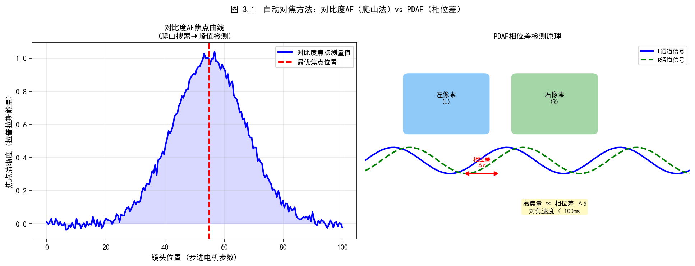
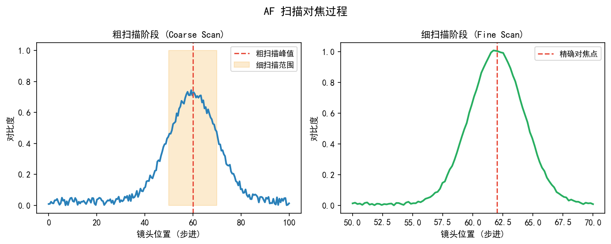
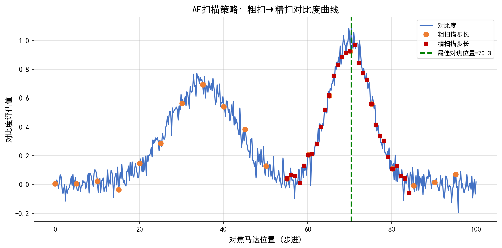
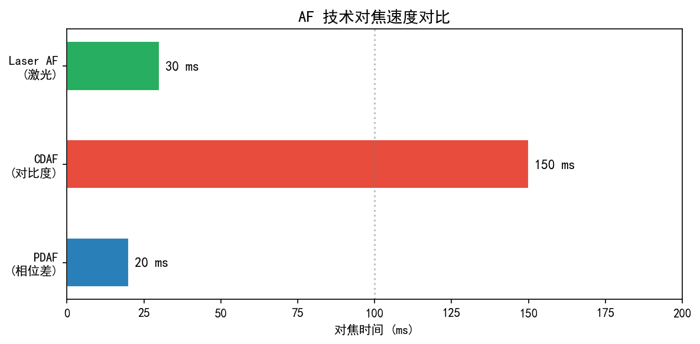
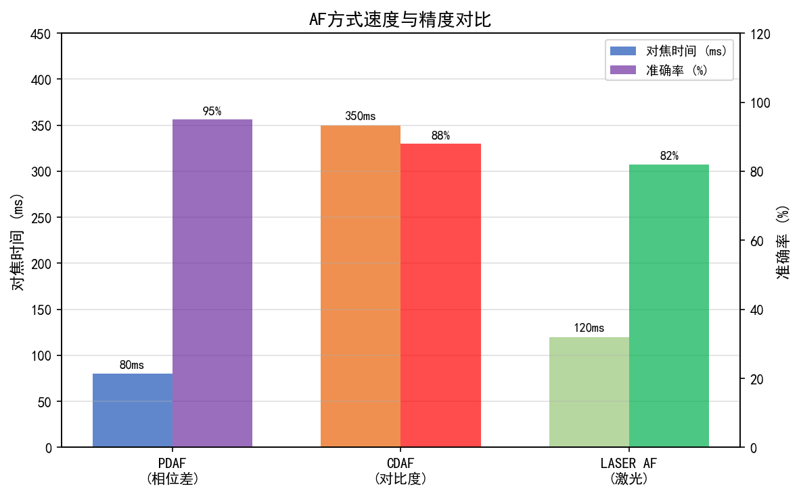
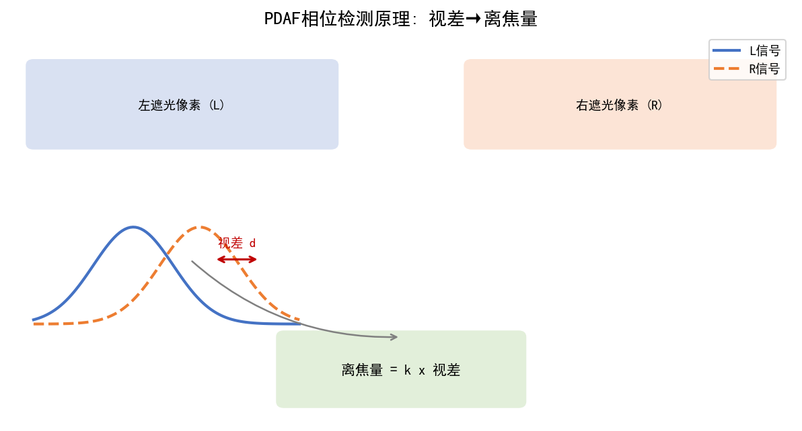

# 第四卷第03章：自动对焦算法（Auto Focus Fundamentals）

> **定位：** AF 控制镜头马达驱动，使成像平面与目标距离匹配
> **前置章节：** 第一卷第02章（光学基础）、第一卷第08章（光学像差与镜头标定）
> **读者路径：** 3A算法工程师、镜头/马达硬件工程师、ISP调参工程师

---

## §1 理论基础

### 1.1 对焦原理

手机 AF 本质是在解一个约束问题：VCM 驱动镜片沿光轴移动，使目标物体的像恰好落在传感器平面。移动量太小欠焦，太大过焦，控制算法的任务是在最短时间内找到这个平衡点。支撑这一切的数学基础是薄透镜成像公式：

$$\frac{1}{f} = \frac{1}{d_o} + \frac{1}{d_i}$$

其中：
- $f$：焦距（focal length）
- $d_o$：物距（object distance，镜头到被摄物体的距离）
- $d_i$：像距（image distance，镜头到成像传感器的距离）

当物距改变时，需移动镜头（改变 $d_i$）使像清晰落在传感器平面上。

**弥散圆（Circle of Confusion, CoC）**

当成像平面偏离正确位置时，点光源成像为一个圆斑，即弥散圆。CoC 直径 $c$ 满足：

$$c = \frac{F \cdot |d_i - d_i'|}{d_i'}$$

其中 $F$ 为光圈直径（焦距/光圈数），$d_i'$ 为实际像距，$d_i$ 为传感器平面到镜头距离。

容许弥散圆直径 $d$ 通常取传感器对角线的 1/1500 到 1/1000 **[1]**（根据输出分辨率确定）。超过 $d$ 时，人眼可见模糊。

**景深（Depth of Field, DOF）**

景深分为前景深（近端）和后景深（远端），合计：

$$\text{DOF} = \frac{2 \cdot F^2 \cdot N \cdot d \cdot f_s^2}{F^4 - N^2 \cdot d^2 \cdot f_s^2}$$

简化版（远景近似，$F^2 \gg N^2 d^2 f_s^2 / F^2$）：

$$\text{DOF} \approx \frac{2 \cdot N \cdot d \cdot f_s^2}{F^2}$$

其中：
- $d$：容许弥散圆直径（mm）
- $F$：镜头焦距（mm）
- $N$：光圈数（f-number，如 f/1.8 → $N=1.8$）
- $f_s$：对焦距离（mm，如 1 m = 1000 mm）

规律：
- 光圈越大（$N$ 越小）→ 景深越浅
- 焦距越长 → 景深越浅
- 对焦距离越远 → 景深越深

---

### 1.2 CDAF（对比度检测自动对焦，Contrast Detection AF）

**基本原理**

CDAF 通过分析图像局部对比度来判断对焦状态。清晰图像的高频分量（边缘）强，模糊图像的高频分量弱。搜索过程即爬山（hill climbing）算法：移动镜头，记录不同位置的对比度值，找到极大值对应的位置。

**常用对比度算子**

| 算子 | 公式 | 特点 |
|------|------|------|
| Laplacian | $\sum \|I_{xx}+I_{yy}\|$ | 对噪声敏感，响应快 |
| Tenengrad | $\sum(\nabla I_x^2 + \nabla I_y^2)$ | 较鲁棒，方向无关 |
| Variance | $\text{Var}(I) = E[I^2] - (E[I])^2$ | 简单，对均匀区域无效 |
| SML（修正Laplacian之和） | $\sum \|2I_{x,y} - I_{x-1,y} - I_{x+1,y}\| + \sum \|2I_{x,y} - I_{x,y-1} - I_{x,y+1}\|$ | 抗噪性较好 |

**搜索策略**

- **全程搜索（Full Scan）**：从近端扫到远端，找全局最大值。精度最高但速度最慢，通常需要 30-50 步，耗时 300ms-1s。（*来源：作者经验，需社区验证*）对多目标场景（前景人物+远处背景）最可靠，但视频中会产生明显的拉焦过程，用户可感知。
- **二分搜索（Binary Search）**：将搜索范围对折，假设对比度单峰。多目标或近景远景混合场景会误判，不建议作为默认策略。
- **斐波那契搜索（Fibonacci Search）**：比二分搜索收敛更快，步数约为 $\lceil \log_\phi(n) \rceil$（$\phi \approx 1.618$）**[2]**，适合纹理丰富的单一主体场景。
- **Nudge 策略（轻推）**：当前位置附近微步探测，视频 AF 的常用维焦方式，对镜头移动量有上限约束以避免画面抖动。

**适用场景与局限**

CDAF 适合静止目标、光线充足（SNR > 20dB）、有丰富纹理的场景。运动目标会扰乱爬山方向，低光下噪声淹没对比度曲线的峰值形状，这两种情况下 CDAF 的收敛时间往往超过 800ms（*来源：作者经验，需社区验证*），需要切换到 PDAF 或激光辅助。

---

### 1.3 PDAF（相位检测自动对焦，Phase Detection AF）

**双像素（Dual Pixel）原理**

PDAF 传感器将每个像素分为左右（或上下）两个子像素，分别接收通过镜头左半部分和右半部分的光线。

- **前焦（Near Focus）**：左子像素图像偏右，右子像素图像偏左 → 相位差为正
- **后焦（Far Focus）**：左子像素图像偏左，右子像素图像偏右 → 相位差为负
- **合焦**：两路图像对齐，相位差为零

相位差直接指示离焦量和离焦方向，无需扫描，可单帧完成。

**相位差到 VCM 步数的映射**

$$\Delta\text{step} = k \cdot \text{phase\_shift} + b$$

其中 $k$（灵敏度）和 $b$（偏置）通过工厂标定确定（见 §2）。相位灵敏度 $k$（步进/像素）受镜头焦距 $f$、光圈 $F/\#$ 和传感器像素节距 $p$ 影响：$k \propto f / (F/\# \cdot p)$，焦距越长、光圈越大（F数越小）、像素越小，则单位相位差对应的 VCM 步进越多。$k$ 值需在 EVT 阶段通过标定确定，不可计算替代。

**相位差到离焦量的物理映射**

相位差（phase_diff，单位：像素）与光学离焦距离（defocus_distance，单位：μm）的关系为：

$$\text{phase\_diff} = \frac{2 \times \text{pixel\_pitch}}{\text{baseline}} \times \text{defocus\_distance}$$

其中 $\text{pixel\_pitch}$ 为传感器像素节距（μm），$\text{baseline}$ 为双像素子孔径等效基线（μm，由微透镜几何决定，典型值为 pixel_pitch 的 30%–70%）。此公式给出了 PDAF 相位差与离焦量的线性比例关系，是工厂标定 $k$ 值的物理依据。

**深度计算**

$$\text{Depth} = \frac{B \cdot F}{D}$$

其中：
- $B$：基线（baseline），为双像素微透镜等效孔径间距，典型值 $B \approx \text{pixel\_pitch} \times 0.3\text{–}0.7$（依微透镜设计而异）；工程标定时，通过拍摄已知距离目标、测量对应相位差，反算 $B_{eff} = D_{known} \times D_{phase} / F$
- $F$：等效焦距
- $D$：视差（disparity，相位差）

**PDAF 像素密度发展史**

| 年份 | 传感器/产品 | PDAF 密度 |
|------|------------|-----------|
| 2012 | Sony IMX135 | 约 5% 像素为 PDAF  |
| 2016 | Samsung S3 | 2×2 中 1 个 PDAF（~25%）|
| 2019 | Sony IMX586 | Quad-Bayer + 嵌入式 PDAF  |
| 2021 | Samsung GN2 | 100% 全像素双 PD（Dual PD）**[3]** |
| 2022 | Sony IMX989 | 1 英寸大底 + 全 PDAF **[4]** |

**PDAF 失败场景**

- **低光（< 3 lux）**：相位信号 SNR 不足，精度显著下降（正常光照 ±1 μm，EV < 3 时退化至 **±5–8 μm**，对焦精度退化 5 倍以上）（*来源：作者经验，需社区验证*）；**< 1 lux**：基本失效，需切换 CDAF 或辅助灯
- **均匀纹理区域**：如白墙、天空，相位差无法计算
- **透明/反射表面**：玻璃窗、镜子，产生假相位信号
- **运动模糊**：快门期间目标移动，模糊相位信号

**多区域 AF（Multi-Zone AF）权重策略：**

多区域 AF 将图像平面划分为若干统计窗口（如 5×5 或 7×7 网格），各区域 PDAF 相位差按置信度加权聚合：

$$\Delta\text{step}_{global} = \frac{\sum_z w_z \cdot \text{NPD}_z \cdot C_z}{\sum_z w_z \cdot C_z}$$

其中 $w_z$ 为区域空间权重，$C_z$ 为置信度。典型权重分配：
- **中心区域**：通常为边缘区域权重的 **2–4 倍**（中心主体概率高，高斯分布）
- **人脸/眼部 ROI**：激活后权重进一步提升至边缘区域的 5–10×，其余区域降权
- **低置信区域**：$C_z$ 低于阈值时权重置零，防止无纹理区域（天空、白墙）干扰对焦决策

---

### 1.4 ToF / 激光辅助 AF

**dToF（直接飞行时间，Direct Time-of-Flight）**

发射激光脉冲，测量光子往返时间：

$$\text{Distance} = \frac{c \cdot \Delta t}{2}$$

精度高（<5cm ），不受纹理影响，但功耗较高，近距离（<30cm ）有盲区。

**iToF（间接飞行时间，Indirect Time-of-Flight）**

发射调制连续波（如 100MHz 正弦波），通过接收信号与发射信号的相位差计算距离：

$$\text{Distance} = \frac{c \cdot \phi}{4\pi f_m}$$

其中 $f_m$ 为调制频率，$\phi$ 为测量相位差。iToF 成本低于 dToF，但有多径干扰（multipath ambiguity）问题。

**激光辅助 AF（LAHAF，Laser-Assisted Hybrid AF）**

激光测距提供粗距离估计 → 将 PDAF 搜索范围从全程缩小到 ±20 步以内 → 大幅提升暗场 AF 速度。

工作流程：
```
激光测距(粗) → 换算为 VCM 步数预测位置 → 移动马达到预测位置 → PDAF/CDAF 精调
```

**适用场景**

- 暗场（< 1 lux）：PDAF 失效时激光仍可工作
- 极近距离（< 10 cm）：微距场景
- 无纹理目标（白板）

---

### 1.5 VCM（音圈马达）控制

**VCM 工作原理**

VCM（Voice Coil Motor）通过线圈电流产生磁力，推动镜头在轨道上移动：

$$F = B \cdot I \cdot L$$

其中 $B$ 为磁场强度，$I$ 为电流，$L$ 为线圈有效长度。位移与电流近似线性（在行程范围内）。

**OIS 与 AF 马达**

- **分离式**：OIS 马达负责光学防抖（横向移动），AF 马达负责对焦（轴向移动），互相独立
- **集成式（OIS+AF 一体）**：单一悬浮结构同时支持横向（OIS）和轴向（AF）运动，常见于旗舰摄像头模组

**闭环控制（Closed-Loop）**

引入 Hall 传感器读取镜头实际位置，构成位置反馈闭环：

```
目标位置 → PID控制器 → 电流驱动 → VCM → 镜头位移
                ↑                        |
              Hall传感器 ←────────────────┘
```

优点：位置精度高（±2μm）（*来源：作者经验，需社区验证*），响应一致，无需重复标定。

**开环控制（Open-Loop）**

无位置反馈，依赖电流-步数标定表（LUT）：
- 每台相机出厂时标定 macro（近焦）和 infinity（远焦）位置对应的 DAC 值
- 中间位置线性插值
- 缺点：受温度、磁场、重力（竖拍/横拍）影响，需补偿

**马达温漂补偿**

VCM 线圈电阻随温度升高而增大，相同 DAC 值下电流减小，导致镜头位置漂移：

$$R(T) = R_0 \cdot [1 + \alpha(T - T_0)]$$

补偿方法：NTC 热敏电阻实时读取温度 → 查温度补偿 LUT → 调整参考 DAC 值。

---

### 1.6 视频 AF（连续对焦，Continuous AF）

**特殊挑战**

静态拍照 AF 只需最终结果正确；视频 AF 要求：
1. **无跑焦（No Hunting）**：不能在合焦位置附近频繁振荡
2. **平滑过渡**：对焦拉近/拉远时需渐进，不能跳变
3. **快速响应**：目标运动时需及时跟上

**Nudge（轻推）策略**

在当前位置±N步处各采一帧，比较对比度，仅当差异超过阈值时才移动马达（避免噪声触发）。移动步长受速度阻尼（damping factor）限制：

$$\text{step}_{n+1} = \alpha \cdot \text{step}_{n} + (1-\alpha) \cdot \text{step}_{\text{target}}$$

**Kalman 滤波器预测**

对运动主体建立状态模型（位置 + 速度），用 Kalman 滤波器预测下一帧目标位置：

$$\hat{x}_{k|k-1} = F \hat{x}_{k-1|k-1}$$
$$P_{k|k-1} = F P_{k-1|k-1} F^T + Q$$

测量更新（PDAF 提供相位差测量值 $z_k$）：
$$K_k = P_{k|k-1} H^T (H P_{k|k-1} H^T + R)^{-1}$$
$$\hat{x}_{k|k} = \hat{x}_{k|k-1} + K_k(z_k - H\hat{x}_{k|k-1})$$

**防扫描（Scan Prevention）**

视频 AF 检测到对比度曲线足够平坦（主体静止）时，禁止启动全扫描，以防画面抖动。

---

### 1.7 AF 状态机：对焦锁定与连续 AF

#### 1.7.1 AF 状态定义

Android Camera HAL3 规范（AOSP `CameraMetadata.java`）将 AF 状态形式化为以下有限状态机，适用于连拍预览流：

```
INACTIVE ──(HAL触发)──► PASSIVE_SCAN
    │                        │
    │            合焦或超时   │
    │                  ▼     │
    │           PASSIVE_FOCUSED◄──(继续PDAF确认)
    │                  │
    │         主体移动/去焦   │
    │                  ▼     │
    │           PASSIVE_UNFOCUSED
    │
    │──(APP触发AF_TRIGGER_START)──►ACTIVE_SCAN
    │                                   │
    │                    搜索完成        │
    │                      ▼            │
    │                FOCUSED_LOCKED◄────┘
    │                      │
    │      (APP触发AF_TRIGGER_CANCEL 或 AE_PRECAPTURE_TRIGGER)
    │                      ▼
    └──────────────── NOT_FOCUSED_LOCKED
```

**各状态说明：**

| 状态 | 含义 | 触发条件 |
|------|------|---------|
| `INACTIVE` | AF 未激活，马达静止 | 相机刚打开或 AF 被禁用 |
| `PASSIVE_SCAN` | 被动扫描（视频连续 AF 中） | 系统检测到 AF ROI 离焦 |
| `PASSIVE_FOCUSED` | 被动合焦，马达停稳 | PDAF/CDAF 确认合焦 |
| `PASSIVE_UNFOCUSED` | 被动未合焦 | 主体移动后重新搜索失败 |
| `ACTIVE_SCAN` | 主动搜索（半按快门后） | APP 下发 `AF_TRIGGER_START` |
| `FOCUSED_LOCKED` | **AF 锁定（合焦）** | 主动搜索成功找到焦点峰值 |
| `NOT_FOCUSED_LOCKED` | **AF 锁定（未合焦）** | 主动搜索失败或超时 |

#### 1.7.2 AF 锁定（AF Lock / AF-L）机制

**单次 AF（One-Shot AF，S-AF）：**

半按快门（S1）触发一次主动 AF 搜索；搜索成功后进入 `FOCUSED_LOCKED` 状态，马达位置锁定。全按快门（S2）拍照时马达不再移动，消除对焦抖动。锁定期间的状态保持：

```
S1 按下
  → AF_TRIGGER_START → ACTIVE_SCAN
  → 搜索完成（PDAF: 1-3帧；CDAF: 15-25帧）（*来源：作者经验，需社区验证*）
  → FOCUSED_LOCKED
  → 持续保持（直到 S1 松开 或 AF_TRIGGER_CANCEL）

S1 松开 / AF_TRIGGER_CANCEL
  → 返回 INACTIVE（固定焦点）或 PASSIVE_SCAN（连续 AF 模式）
```

**AF-L 与 AE-L 联动：** 大多数相机同时锁定曝光和对焦（AE/AF-L），防止重新构图后曝光跳变。实现方式：在 AF 锁定同时冻结 AE 积分器输出，对应 AOSP `CONTROL_AE_LOCK = true`。

#### 1.7.3 连续 AF（Continuous AF，C-AF）状态策略

连续 AF（视频拍摄中的 CAF）需要在**精度、稳定性、响应速度**之间持续平衡：

**被动监测阶段（PASSIVE_FOCUSED → 检测离焦）：**

```
每帧：
  计算 PDAF 相位差 P_current
  if |P_current| > threshold_move:    # 主体移动阈值（约 0.3 像素 NPD）
    起始 micro_search（± 3步 Nudge）
  else:
    保持当前位置（Hunting 抑制）
```

**连续追踪阶段（PASSIVE_SCAN）：**

```
优先使用 PDAF 预测目标位置：
  target_step = current + k * NPD * W_window
  移动马达（受速度阻尼限制：max 10步/帧）

PDAF 失效时退回 CDAF Nudge：
  ± FINE_STEP 探测，比较对比度差值
  if contrast_diff > noise_floor:
    向对比度增大方向移动 1 步
```

**停顿判断（PASSIVE_FOCUSED 进入条件）：**

```
连续 N_stable 帧（通常 5–8 帧）满足以下全部条件：
  1. |NPD| < converge_threshold（合焦判据）
  2. 马达移动量 < 2 步/帧（马达已静止）
  3. PDAF 置信度 > C_thresh（信号可信）
→ 进入 PASSIVE_FOCUSED，停止主动调整
```

**主体突然离焦检测（PASSIVE_FOCUSED → PASSIVE_SCAN 触发条件）：**

```
if |NPD_current - NPD_last_stable| > threshold_hunt
   OR scene_change_confidence > 0.8（AI 场景变化检测）:
  重置稳定计数器
  进入 PASSIVE_SCAN
```

#### 1.7.4 连续 AF 速度-稳定性参数调优

| 参数 | 典型范围 | 偏小效果 | 偏大效果 |
|------|---------|---------|---------|
| `threshold_move` (NPD) | 0.1–0.5 | 频繁调焦，拉风箱感 | 主体移动后响应慢 |
| `N_stable` (帧数) | 3–10 | 稳定性差，颤动 | 快速目标跟焦滞后 |
| `max_step_per_frame` | 5–20 DAC | 跟焦慢 | 马达跳变明显 |
| 速度阻尼 $\alpha$ | 0.5–0.9 | 抖动 | 跟焦延迟 |

---

### 1.9 基于深度学习的 AF

**CNN 离焦量估计** **[5]**

单帧图像中包含离焦模糊信息（blur kernel），CNN 可直接从图像预测离焦方向和量级，无需硬件 PDAF 支持：

- 输入：RAW 或 YUV 图像 patch
- 输出：离焦量（defocus magnitude）+ 方向（near/far）
- 优势：对低纹理、低光场景有更强泛化能力

**混合决策（Herrmann et al., CVPR 2020）** **[6]**

CNN 作为"门控网络"，根据场景条件（光照、纹理、运动）选择最适合的 AF 模式：
- 高光高纹理 → PDAF
- 低光或低纹理 → CDAF + 激光辅助
- 运动场景 → Kalman 预测 + PDAF

**语义主体选择**

NPU 实时运行目标检测/分割网络，识别最可能的对焦主体，优先级：

```
人脸/眼睛 > 人体 > 宠物 > 运动物体 > 前景最近物体
```

主体 ROI 传给 AF 算法作为对焦窗口，替代固定中心点对焦。

> **工程推荐（手机ISP场景）：** 旗舰机型的 AF 策略优先级应为：有 ToF 传感器时优先用 ToF 粗定位（暗场 < 1 lux 时 PDAF SNR 不可靠，ToF 不受光照影响），再用 PDAF 精调，最后才是 CDAF 兜底。纯 PDAF 机型在弱光场景要把 PDAF 置信度阈值设得更保守（门限从 0.3 提高到 0.6），低于门限直接激活 CDAF，而不是继续强行用低信噪比的 PDAF 结果（低 SNR PDAF 驱动 VCM 到错误位置的概率超过 30%，反而比 CDAF 慢）（*来源：作者经验，需社区验证*）。视频 CAF 的 Hunting 问题优先检查阻尼系数 $\alpha$（推荐从 0.7 开始），不要首先怀疑 PDAF 标定——80% 的 hunting 案例是 $\alpha$ 过小或 `threshold_move` 过小导致噪声触发，而非相位标定问题。

---

### 1.10 困难场景汇总

| 场景 | 挑战 | 推荐方案 |
|------|------|---------|
| 暗场（< 1 lux） | PDAF SNR 低，CDAF 噪声大 | 激光/ToF 辅助 + 大步长搜索 |
| 低对比度（白墙） | 对比度算子无响应 | ToF 直接测距；CNN 估计 |
| 运动目标 | 相位信号模糊，曲线漂移 | Kalman 预测；高帧率 PDAF |
| 玻璃/镜子 | PDAF 假信号 | 检测异常相位方差；回退 CDAF |
| 重复纹理 | 多个极大值（CDAF 误判峰值） | 扩大 ROI；使用低频算子 |
| 微距（< 10 cm） | DOF 极浅，调焦极敏感 | 小步长 + 激光辅助定位 |
| 逆光（高对比度背景） | 主体曝光不足，对比度测量偏向背景 | 语义分割主体 ROI；曝光分区 |
| 视频跟焦 | 拉焦抖动（hunting） | Nudge 策略 + 阻尼控制 |

---

### 1.11 ISP 硬件 PDAF 统计量采集（Engineering）

PDAF 算法依赖的原始相位数据并非由 3A 软件直接读取传感器像素——而是由 ISP 硬件（Image Signal Processor）在每帧读出期间**自动累积**到一个统计缓冲区（statistics buffer），3A 控制器通过驱动接口读取该缓冲区。这一硬件-软件接口是 PDAF 系统集成的工程核心。

**1.11.1 统计缓冲区（PDAF Stats Buffer）结构**

ISP 将传感器平面划分为若干统计窗口（region of interest），每个窗口对应一个 PDAF 统计条目。典型分辨率：

| SoC 平台 | 统计网格尺寸 | 每条目字段 |
|---------|-----------|---------|
| Qualcomm 骁龙8 Gen（IFE） | 64×48 或 128×96 | left_sum, right_sum, confidence |
| MediaTek Dimensity（PDAF HAL）| 32×24 或 64×48 | pd_left, pd_right, mask |
| Apple A 系列（ISP HAL） | 32×24（内部，不对外暴露）| — |

每个统计条目包含：
- **left_sum**：窗口内所有左子像素（Left PD pixel）的累积灰度值之和
- **right_sum**：窗口内所有右子像素（Right PD pixel）的累积灰度值之和
- **confidence**：可信度掩码，由 ISP 硬件根据信号幅度和饱和情况自动计算（通常 8 bit 或 1 bit per entry）

**1.11.2 相位差计算与离焦映射**

3A 控制器从缓冲区读取 left_sum / right_sum 后，计算归一化相位差（Normalized Phase Difference, NPD）：

$$\text{NPD} = \frac{\text{left\_sum} - \text{right\_sum}}{\text{left\_sum} + \text{right\_sum}}$$

NPD > 0 表示前焦（Near Focus）；NPD < 0 表示后焦（Far Focus）；NPD ≈ 0 表示合焦。再通过标定参数 $k, b$（见 §2.1）转换为 VCM 步数偏移量：

$$\Delta\text{step} = k \cdot \text{NPD} \cdot W_{\text{window}} + b$$

其中 $W_{\text{window}}$ 为统计窗口宽度（像素），将 NPD 换算为实际像素级相位位移。

**1.11.3 更新时序：V-sync 触发读取**

统计缓冲区的更新节奏与传感器帧率严格同步：

```
传感器读出（Frame N）
  ↓ 逐行曝光+读出期间
ISP 硬件累积 PDAF stats
  ↓ 帧结束（V-blank）
ISP 将统计数据写入 DMA 缓冲区
  ↓ 触发 V-sync 中断
3A 控制器读取缓冲区（通常在 V-sync ISR 或 SOF 回调中）
  ↓
AF 算法计算 ΔVCM → 下发马达指令 → 生效于 Frame N+2
```

端到端延迟约为 2 帧（Frame N 的统计 → Frame N+2 生效），这是 PDAF 收敛速度的物理下界。

**1.11.4 平台驱动接口**

- **Qualcomm（CAMX / IFE 硬件块）：**
  PDAF 统计由 IFE（Image Front End）模块在 BPS（Bayer Processing Segment）之前完成。3A 线程通过 `camxafhwnode` 读取 `PDHwOutput` 结构体，内含每窗口的 `PDAFStatsOutput`（left/right sum + confidence）。配置路径：`camxtitan17xdefs.h` 中的 `IFEPDAFConfig`。

- **MediaTek（PDAF HAL Interface）：**
  通过 `IAfMgr::setPDInfo()` 接口将 PD 数据注入 AF Manager；驱动层将 ISP 硬件输出的 `pd_data_t` 结构体经 PDAF HAL 传递给 3A 控制器。`pd_data_t` 包含 `ldata[]`（左子像素行）和 `rdata[]`（右子像素行），由 MTK ISP HAL 完成 left_sum/right_sum 的区域聚合。

- **通用 Android（Camera HAL3 + V4L2）：**
  部分开放平台（如 Raspberry Pi / 联发科评估板）将 PDAF 统计通过 `V4L2_CID_3A_LOCK` 或 vendor-specific IOCTL 暴露给用户态，格式为 `struct v4l2_ext_control`。

**1.11.5 低光/饱和保护**

ISP 硬件通常内置以下保护机制：
- **饱和保护：** 若窗口内 > 阈值比例的像素达到饱和（通常 > 80% 像素 > 0.9 × 满阱），该窗口 confidence 标记为 0，3A 控制器应跳过该统计条目
- **暗场保护：** 若窗口内平均亮度 < 低阈值（对应 luma < 20 in 8-bit），信噪比不足，confidence 降权或置 0
- **窗口加权聚合：** AF 算法通常对多个统计窗口的 NPD 按 confidence 加权平均，再取主对焦区域（人脸 ROI 或中心权重区域）的加权结果

---

## §2 标定（Calibration）

### 2.1 PDAF 相位偏移标定

**目的**：确定相位差（phase shift，像素单位）到 VCM 步数的转换系数 $k$（灵敏度）和偏置 $b$。

**流程**：
1. 将相机正对标定板（高对比度图案，如 Siemens Star）
2. 在已知物距 $d_1, d_2, \ldots, d_n$ 下分别测量 PDAF 相位差 $P_1, P_2, \ldots, P_n$
3. 同时记录合焦时的 VCM 步数 $S_1, S_2, \ldots, S_n$（通过 CDAF 黄金对焦）
4. 线性拟合：$S = k \cdot P + b$，最小二乘法求解 $k$, $b$
5. 写入 OTP（One-Time Programmable）存储

**温度依赖性**：$k$ 随温度略有变化，旗舰产品在 0°C、25°C、60°C 三点分别标定，运行时按 NTC 读温插值。忽略温漂的模组在 60°C 高温场景下对焦位置可偏移 5-10 DAC 步，等效景深误差对 f/1.8 大光圈镜头影响明显。

**验收指标**：
- 标定残差 RMS < 2 步
- 跨物距（0.1m - ∞）覆盖验证合格率 > 95%

> **工程推荐（手机ISP场景）：** PDAF 标定用的测试图卡选择直接影响 DCC（defocus conversion coefficient）的精度。水平线条图卡比菱形图卡更能提供均匀的相位差分布，尤其对于采用 GR/GB 方向 PD 像素的传感器（如展锐平台 Mode4）；对于 Left/Right 双像素传感器（如高通平台 Dual PD）则推荐垂直条纹图卡。标定前务必检查 SPC（Shield Pixel Correction）是否已生效——SPC 未开启时屏蔽像素灵敏度偏低，会导致 left_sum 系统性偏小，拟合出的 $k$ 偏大，实测超调约 20%。

---

### 2.2 Hall 传感器线性度标定

**目的**：确保闭环 AF 中 Hall 传感器输出与镜头实际位移成线性关系。

**流程**：
1. 给 VCM 施加从 macro 到 infinity 的阶梯电流
2. 用激光测微仪（或干涉仪）精确测量镜头位移
3. 记录每步的 Hall 输出值
4. 拟合线性化 LUT：Hall_code → 实际位移（μm）
5. 计算非线性度，超过 ±3%  的模组需报废

**重力方向补偿**：
- 横拍（landscape）vs 竖拍（portrait）时重力对镜头悬浮位置影响不同
- 通过陀螺仪或加速度计感知姿态，动态补偿 Hall 零点

---

### 2.3 温漂（温度漂移）补偿标定

**现象**：温度升高时 VCM 线圈电阻增大 → 同等 DAC 下电流减小 → 镜头向 macro 方向漂移（弹簧复位力为主）。

**标定方法**：
1. 烤箱控温至 -10°C、0°C、25°C、40°C、60°C
2. 每个温度点运行 CDAF 黄金对焦，记录 DAC 值（无限远目标）
3. 拟合 DAC_infinity(T) 曲线
4. 运行时读 NTC，查表补偿

**指标**：全温域（-10°C to 60°C）对焦精度变化 < ±5 步（等效 CoC 变化 < 0.5×）。

---

## §3 调参 (Tuning)

### 3.1 CDAF 算子选择

| 场景 | 推荐算子 | 原因 |
|------|---------|------|
| 通用（高 SNR） | Tenengrad | 方向无关，鲁棒 |
| 低光（低 SNR） | Variance | 对噪声不敏感 |
| 高频纹理主体 | SML | 保留高频细节 |
| 视频实时 | 简化 Laplacian（3×3 核） | 计算量小 |

**ROI 窗口尺寸调校**：
- 太小：受局部噪声影响大，曲线抖动
- 太大：包含背景，对比度被稀释
- 推荐：中心 1/4 面积，或语义主体 ROI

**搜索步长调校**：
- 粗搜索步长：按景深换算，通常 8-16 步
- 细搜索步长：1-2 步
- 二级搜索范围：粗搜索峰值 ±8 步

---

### 3.2 PDAF 灵敏度调校

**灵敏度 $k$ 过大**（Over-sensitive）：
- 表现：单次 PDAF 移动量超调（overshoot），在合焦附近振荡
- 调校：降低 $k$，增加 CDAF 细调步骤

**灵敏度 $k$ 过小**（Under-sensitive）：
- 表现：多次 PDAF 移动才能收敛（慢对焦）
- 调校：提高 $k$，或增加单次最大移动步数上限

**相位可信度门限**：
- 当相位方差 > 阈值 $\sigma_{max}^2$ 时，判定相位信号不可信（低光/无纹理）
- 回退至 CDAF 或激光辅助模式
- 阈值需根据传感器噪声水平标定

---

### 3.3 视频 AF 阻尼调校

**阻尼系数 $\alpha$**（0 < α < 1）：
- $\alpha \to 0$：快速响应，但易抖动
- $\alpha \to 1$：平滑，但跟焦延迟大（适合静态场景）
- 推荐分场景自适应：检测到运动时降低 $\alpha$，静止时提高 $\alpha$

**Hunting 检测与抑制**：
- 连续 N 帧内镜头移动方向反转 ≥ 2 次 → 判定为 hunting
- 触发后：冻结位置（Hold），重新评估 ROI

---

## §4 伪影 (Artifacts)

### 4.1 视频跑焦（Video Hunting）

**现象**：对焦完成后镜头持续在合焦位置附近小幅来回移动，画面清晰度周期性变化。

**根本原因**：
- CDAF 对比度曲线在峰值附近过于平坦，噪声导致左右方向不断切换
- 阻尼系数 $\alpha$ 过小

**排查步骤**：
1. 录制 log：记录每帧对比度值、马达步数、移动方向
2. 绘制对比度-步数曲线：判断峰值宽度
3. 若峰宽 < 4 步（< 景深），增大 CDAF ROI 或更换低频算子
4. 调高 $\alpha$（0.6 → 0.85），重测

### 4.2 PDAF 玻璃场景误拉焦

**现象**：拍摄玻璃橱窗内目标时，PDAF 被玻璃反射信号干扰，对焦到玻璃面而非目标。

**诊断**：
- 相位差值异常（正常范围 ±30 像素，玻璃场景可能出现 ±5 像素但剧烈跳动）
- 相位信号方差 $\sigma^2$ 显著高于正常值

**解决方案**：
- 增加相位一致性检测：相邻像素相位差标准差 > 阈值 → 降低相位可信度
- 回退至 CDAF，以稳定的对比度搜索为主
- 软件层面：识别"反射场景"标志（如高亮反射斑检测）

### 4.3 低光 PDAF 噪声污染

**现象**：弱光下 PDAF 相位估计误差大，AF 移动到错误位置。

**根本原因**：单像素光子数不足，散粒噪声（shot noise）淹没相位信号。

**解决方案**：
- 增大 PDAF 积分窗口（binning 多行相位值）
- 切换为激光辅助或 CDAF 模式（门限：luma < 20 in 8-bit）
- 延长 PDAF 测量曝光时间（视频 AF 中可用 2 帧积分）

---

## §5 评估方法（Evaluation）

### 5.1 AF 速度测试

**测试方法（ISO 标准或厂商规范）**：
1. 远近切换：相机先对焦无限远，按下对焦键，测量到达近端目标（如 0.5m）合焦的时间
2. 计时方式：视频帧级（从按下快门到 focus locked 的帧数 × 帧间隔）
3. 光照条件：100 lux（正常室内）、10 lux（昏暗）、1 lux（蜡烛光）

**评估指标**：
- PDAF 场景：< 300ms（100 lux），< 500ms（10 lux）**[7]**
- CDAF 场景：< 800ms（100 lux）
- 暗场激光辅助：< 600ms（1 lux）

### 5.2 AF 精度测试

**静态精度**：
- 拍摄 ISO 12233 分辨率测试卡 **[8]**，对焦后计算 MTF50
- 评估合焦位置的 MTF50 相比理论最大值的比值（应 > 80% ）

**动态精度**：
- 被摄目标以已知速度（如 1m/s）横向运动，评估连续 AF 跟焦率

**困难场景成功率**：
- 低光（1 lux）：成功率 > 80% 
- 无纹理（白板）：成功率 > 60%（依赖激光辅助）
- 玻璃场景：成功率 > 70% 

### 5.3 视频 AF 平滑度评估

**Hunting 检测率**：
- 录制 10 秒视频，统计马达移动方向反转次数
- 合格标准：静态场景 < 2 次/10 秒 

**对焦过渡时间**：
- 从开始移动到合焦（MTF50 > 80%峰值）的时间
- 视频场景要求 < 600ms（不能太快，避免观感突兀）

---

## §6 代码参考（Code Reference）

### 6.1 CDAF 爬山搜索仿真（Python）

```python
import numpy as np
import matplotlib.pyplot as plt

def tenengrad(image_patch):
    """计算 Tenengrad 对比度算子"""
    # Sobel 核
    gx = np.array([[-1, 0, 1], [-2, 0, 2], [-1, 0, 1]], dtype=np.float32)
    gy = gx.T
    from scipy.ndimage import convolve
    dx = convolve(image_patch.astype(np.float32), gx)
    dy = convolve(image_patch.astype(np.float32), gy)
    return np.sum(dx**2 + dy**2)

def simulate_contrast_curve(steps, peak_pos=50, peak_width=15, noise_level=0.02):
    """
    模拟 VCM 步数-对比度曲线（高斯形状 + 噪声）

    Args:
        steps: VCM 步数数组（0-100）
        peak_pos: 合焦位置（步）
        peak_width: 峰宽（步，对应景深）
        noise_level: 相对噪声水平
    Returns:
        contrast: 对比度值数组
    """
    contrast = np.exp(-0.5 * ((steps - peak_pos) / peak_width)**2)
    noise = np.random.normal(0, noise_level, len(steps))
    return contrast + noise

def cdaf_fibonacci_search(contrast_fn, lo=0, hi=100, tol=2):
    """
    斐波那契搜索 CDAF（假设单峰）

    Args:
        contrast_fn: 给定步数返回对比度的函数
        lo, hi: 搜索范围
        tol: 收敛容差（步）
    Returns:
        best_pos: 估计的最佳对焦步数
        history: 搜索历史 [(step, contrast), ...]
    """
    # 生成斐波那契数列直到超过范围
    fibs = [1, 1]
    while fibs[-1] < (hi - lo):
        fibs.append(fibs[-1] + fibs[-2])
    n = len(fibs) - 1

    history = []

    for k in range(n, 1, -1):
        x1 = lo + fibs[k-2]
        x2 = lo + fibs[k-1]
        x1 = min(x1, hi)
        x2 = min(x2, hi)

        c1 = contrast_fn(x1)
        c2 = contrast_fn(x2)
        history.append((x1, c1))
        history.append((x2, c2))

        if c1 < c2:
            lo = x1
        else:
            hi = x2

        if (hi - lo) <= tol:
            break

    best_pos = (lo + hi) // 2
    return best_pos, history

def cdaf_full_scan(contrast_fn, lo=0, hi=100, step=2):
    """全程扫描 CDAF"""
    positions = np.arange(lo, hi+1, step)
    contrasts = [contrast_fn(p) for p in positions]
    best_idx = np.argmax(contrasts)
    history = list(zip(positions, contrasts))
    return positions[best_idx], history

# 演示
if __name__ == "__main__":
    steps_all = np.arange(0, 101)
    true_peak = 42

    # 生成对比度曲线
    contrast_vals = simulate_contrast_curve(steps_all, peak_pos=true_peak,
                                             peak_width=12, noise_level=0.03)
    contrast_fn = lambda s: float(simulate_contrast_curve(
        np.array([s]), peak_pos=true_peak, peak_width=12, noise_level=0.03))

    # 斐波那契搜索
    fib_result, fib_history = cdaf_fibonacci_search(contrast_fn, 0, 100)

    # 全程扫描
    full_result, full_history = cdaf_full_scan(
        lambda s: float(simulate_contrast_curve(np.array([s]), true_peak, 12, 0.03)),
        0, 100, step=2)

    print(f"True peak: {true_peak}")
    print(f"Fibonacci search result: {fib_result} (steps evaluated: {len(fib_history)})")
    print(f"Full scan result: {full_result} (steps evaluated: {len(full_history)})")

    # 绘图
    fig, axes = plt.subplots(1, 2, figsize=(12, 4))

    axes[0].plot(steps_all, contrast_vals, 'b-', label='Contrast curve')
    fib_steps, fib_c = zip(*fib_history)
    axes[0].scatter(fib_steps, fib_c, c='r', s=30, zorder=5, label=f'Fib search ({len(fib_history)} pts)')
    axes[0].axvline(true_peak, color='g', linestyle='--', label=f'True peak={true_peak}')
    axes[0].axvline(fib_result, color='r', linestyle=':', label=f'Fib result={fib_result}')
    axes[0].set_xlabel('VCM Step')
    axes[0].set_ylabel('Contrast Value')
    axes[0].set_title('CDAF Fibonacci Search')
    axes[0].legend()

    full_steps, full_c = zip(*full_history)
    axes[1].plot(steps_all, contrast_vals, 'b-', label='Contrast curve')
    axes[1].scatter(full_steps, full_c, c='orange', s=30, zorder=5,
                    label=f'Full scan ({len(full_history)} pts)')
    axes[1].axvline(true_peak, color='g', linestyle='--', label=f'True peak={true_peak}')
    axes[1].axvline(full_result, color='orange', linestyle=':', label=f'Full result={full_result}')
    axes[1].set_xlabel('VCM Step')
    axes[1].set_ylabel('Contrast Value')
    axes[1].set_title('CDAF Full Scan')
    axes[1].legend()

    plt.tight_layout()
    plt.savefig('cdaf_search_comparison.png', dpi=150)
    plt.show()
```

---

### 6.2 PDAF 相位信号模型（Python）

```python
import numpy as np

def generate_pdaf_signal(image_row, disparity_pixels):
    """
    模拟 PDAF 双像素相位差信号

    原理：左子像素图像相当于从略偏左角度拍摄，
          右子像素图像相当于从略偏右角度拍摄。
          失焦时两路图像有横向位移（disparity）。

    Args:
        image_row: 1D 理想清晰图像行（numpy array）
        disparity_pixels: 失焦引起的像素级位移（正=前焦，负=后焦）
    Returns:
        left_view: 左子像素采样信号
        right_view: 右子像素采样信号
        phase_shift_estimate: 估计的相位差
    """
    n = len(image_row)
    x = np.arange(n)

    # 左右视差模拟（亚像素插值）
    shift = disparity_pixels / 2.0

    from scipy.ndimage import shift as ndshift
    left_view  = ndshift(image_row.astype(float),  shift, mode='nearest')
    right_view = ndshift(image_row.astype(float), -shift, mode='nearest')

    # 加入传感器噪声
    noise_std = 2.0  # 8-bit 单位
    left_view  += np.random.normal(0, noise_std, n)
    right_view += np.random.normal(0, noise_std, n)

    # 相位差估计：互相关法
    phase_shift_estimate = estimate_phase_shift_xcorr(left_view, right_view)

    return left_view, right_view, phase_shift_estimate

def estimate_phase_shift_xcorr(left, right, max_shift=20):
    """
    通过互相关估计相位差

    Args:
        left, right: 左右子像素信号
        max_shift: 最大搜索范围（像素）
    Returns:
        estimated_shift: 估计的相位差（像素，正值=前焦）
    """
    left_norm  = (left  - np.mean(left))  / (np.std(left)  + 1e-6)
    right_norm = (right - np.mean(right)) / (np.std(right) + 1e-6)

    # 仅在 [-max_shift, +max_shift] 范围内搜索
    xcorr = np.correlate(left_norm, right_norm, mode='full')
    center = len(xcorr) // 2
    search_xcorr = xcorr[center - max_shift : center + max_shift + 1]

    peak_offset = np.argmax(search_xcorr) - max_shift
    return float(peak_offset)

def pdaf_to_vcm_step(phase_shift, k, b):
    """
    相位差到 VCM 步数转换

    Args:
        phase_shift: 估计的相位差（像素）
        k: 灵敏度（标定值）
        b: 偏置（标定值）
    Returns:
        delta_step: 需要移动的 VCM 步数（正=向 macro，负=向 infinity）
    """
    return k * phase_shift + b

# 演示
if __name__ == "__main__":
    # 生成测试图像行（边缘图案）
    n = 256
    image_row = np.zeros(n)
    image_row[80:100] = 200  # 白色边缘
    image_row[150:160] = 200
    image_row = image_row + np.random.normal(0, 1, n)  # 底噪

    # 测试不同失焦量
    test_disparities = [-8, -4, -2, 0, 2, 4, 8]  # 像素

    print(f"{'True Disparity':>15} | {'Estimated Disparity':>20} | {'Error':>8}")
    print("-" * 50)

    for true_disp in test_disparities:
        left, right, estimated = generate_pdaf_signal(image_row, true_disp)
        error = estimated - true_disp
        print(f"{true_disp:>15.1f} | {estimated:>20.2f} | {error:>8.2f}")

    # 模拟 VCM 步数映射（标定参数示例）
    k_calibrated = 3.5   # 步/像素
    b_calibrated = 0.0   # 无偏置

    print(f"\n使用标定参数 k={k_calibrated}, b={b_calibrated}")
    print(f"相位差 +5 像素 → VCM 步数: {pdaf_to_vcm_step(5.0, k_calibrated, b_calibrated):.1f}")
    print(f"相位差 -3 像素 → VCM 步数: {pdaf_to_vcm_step(-3.0, k_calibrated, b_calibrated):.1f}")
```

---

### 6.3 Kalman 滤波器跟焦（视频 AF）

```python
import numpy as np

class AFKalmanFilter:
    """
    视频 AF 用 Kalman 滤波器

    状态向量: [位置(步), 速度(步/帧)]
    测量值: VCM 步数（来自 PDAF 或 CDAF）
    """

    def __init__(self, initial_pos=50.0, process_noise=1.0, measurement_noise=4.0):
        """
        Args:
            initial_pos: 初始位置（VCM 步）
            process_noise: 过程噪声方差（目标运动不确定性）
            measurement_noise: 测量噪声方差（PDAF 测量误差）
        """
        # 状态向量：[位置, 速度]
        self.x = np.array([[initial_pos], [0.0]])

        # 状态协方差矩阵
        self.P = np.eye(2) * 10.0

        # 状态转移矩阵（匀速运动模型）
        self.F = np.array([[1, 1],
                           [0, 1]], dtype=float)

        # 测量矩阵（只观测位置）
        self.H = np.array([[1, 0]], dtype=float)

        # 过程噪声矩阵
        self.Q = np.eye(2) * process_noise
        self.Q[1, 1] *= 0.1  # 速度噪声较小

        # 测量噪声矩阵
        self.R = np.array([[measurement_noise]])

    def predict(self):
        """预测下一帧位置"""
        self.x = self.F @ self.x
        self.P = self.F @ self.P @ self.F.T + self.Q
        return float(self.x[0])

    def update(self, measurement):
        """
        用 PDAF 测量值更新状态

        Args:
            measurement: 测量到的 VCM 目标步数
        Returns:
            filtered_pos: 滤波后的位置估计
        """
        z = np.array([[measurement]])

        # 创新（Innovation）
        y = z - self.H @ self.x

        # 创新协方差
        S = self.H @ self.P @ self.H.T + self.R

        # Kalman 增益
        K = self.P @ self.H.T @ np.linalg.inv(S)

        # 状态更新
        self.x = self.x + K @ y

        # 协方差更新
        I = np.eye(2)
        self.P = (I - K @ self.H) @ self.P

        return float(self.x[0])

    @property
    def position(self):
        return float(self.x[0])

    @property
    def velocity(self):
        return float(self.x[1])

# 演示：跟踪运动目标
if __name__ == "__main__":
    np.random.seed(42)
    n_frames = 60

    # 真实目标位置（缓慢从 30 步移动到 70 步）
    true_positions = np.linspace(30, 70, n_frames)
    true_positions += np.random.normal(0, 0.5, n_frames)  # 目标微小抖动

    # PDAF 测量（有噪声）
    measurements = true_positions + np.random.normal(0, 3.0, n_frames)

    kf = AFKalmanFilter(initial_pos=30.0, process_noise=2.0, measurement_noise=9.0)

    predicted_positions = []
    filtered_positions = []

    for i in range(n_frames):
        pred = kf.predict()
        filtered = kf.update(measurements[i])
        predicted_positions.append(pred)
        filtered_positions.append(filtered)

    # 评估
    filtered_arr = np.array(filtered_positions)
    rmse = np.sqrt(np.mean((filtered_arr - true_positions)**2))
    meas_rmse = np.sqrt(np.mean((measurements - true_positions)**2))

    print(f"测量噪声 RMSE:  {meas_rmse:.2f} 步")
    print(f"Kalman 滤波后 RMSE: {rmse:.2f} 步")
    print(f"噪声压制比: {meas_rmse/rmse:.1f}×")
```

---

> **延伸阅读**
> - Herrmann et al., "Learning to Autofocus", CVPR 2020
> - Tang et al., "Phase Detection Autofocus Using Dual Pixel Sensors", IEEE Trans. 2018
> - ISO 16505:2015 – Autofocus test methods for digital cameras
> - 第四卷第09章（3A 高级专题：多摄同步与环路耦合）

---

> **工程师手记：AF 拉风箱，是症状，不是故障**
>
> **拉风箱（Hunting）的根本原因是"峰值检测超调后反向搜索"的循环。** 对比度 AF 靠爬山算法——朝梯度上升方向移动马达，检测到对焦峰值后停下。但马达的步长如果过大，会一脚跨过峰值，检测到"比刚才低"，算法以为还没到峰值，反向走一步，又跨过去，就这样来回震荡。修复方法不是换 AF 算法，是在粗搜索阶段用大步长快速定位，到峰值附近后切细步长做精确搜索——这个"粗精搜索"切换的阈值（`AF_Step_Coarse` / `AF_Step_Fine`）是最常需要调整的参数。
>
> **弱光下 PDAF 精度退化是被低估的工程问题。** PDAF（相位差自动对焦）在充足光线下速度极快（<200ms），但在 EV < 3（夜间室内）条件下，PDAF 像素的信噪比不够，相位差估计误差从 ±1 μm 爬升到 ±5–8 μm，相当于对焦精度退化 5 倍以上。此时系统应该降级到对比度 AF（CAF）或 PDAF+CAF 混合策略，而不是继续信任 PDAF 输出。判断切换点：实测 PDAF Confidence 值（高通 AF 引擎输出的内部字段），低于 60% 时切 CAF。如果不切换，弱光下经常出现「对焦到背景」而不是「对焦到人脸」的问题。
>
> **ToF/LiDAR 辅助 AF 解决的是特定场景，不是通用方案。** ToF 传感器（如华为 Mate 系列的 dToF）能在弱光下直接测距，AF 速度不受光照影响。但 ToF 的覆盖范围有限（通常 < 3m），远景场景（4m 以上）还是要靠 PDAF/CAF。工程上，ToF 辅助 AF 的作用是在「近景+弱光」这个 PDAF 最容易失效的交叉场景下补位——这也是为什么同一款手机有了 ToF 之后，弱光人像 AF 改善明显，但远景风景 AF 没什么变化。
>
> *参考：iResearch666《AF 算法原理与弱光优化》腾讯云，2025；大话成像《PDAF 相位差自动对焦工程实践》公众号，2025；Szeliski, "Computer Vision: Algorithms and Applications", Springer, 2022 §9.1。*

---

## 插图



*图1. 自动对焦方法对比（图片来源：作者自绘）*



*图2. AF扫描过程示意（图片来源：作者自绘）*



*图3. AF扫描模式示意（图片来源：作者自绘）*



*图4. AF对焦速度示意（图片来源：作者自绘）*



*图5. 不同AF方法速度对比（图片来源：作者自绘）*



*图6. 相位差自动对焦（PDAF）原理（图片来源：Liu et al., "Learning Phase Detection for Auto-focus", CVPR, 2020）*

---

## 习题

**练习 1（理解）**
Tenengrad 是一种常用的对比度 AF 聚焦评价函数，定义为图像中 Sobel 梯度的平方和：F = Σ(Gx² + Gy²)。请解释：（1）为什么聚焦时该值最大？（2）与 Laplacian 评价函数 F = Σ|∇²I| 相比，Tenengrad 在噪声鲁棒性上有何优劣？（3）在低照度（EV < 3）场景下，两种评价函数都会退化，原因是什么？

**练习 2（计算）**
PDAF（相位差自动对焦）利用左右像素的相位差 Δd（单位：像素）来估计散焦量。设感光器像素间距为 1.2μm，对应的散焦量估计公式为 defocus = k × Δd（k 为标定常数，假设 k=0.5μm/pixel）。若当前测量到 Δd = 10 像素：（1）散焦量为多少微米？（2）在正常光照（EV > 6）下，PDAF 相位差精度为 ±1 像素，对应散焦量误差为多少？（3）在弱光（EV < 3）下，相位差精度退化到 ±8–10 像素，此时散焦量误差变为多少，对 AF 精度有何影响？

**练习 3（工程实现）**
用 OpenCV 实现一个基于 Laplacian 方差的对比度 AF 聚焦度评价函数：给定一张测试图片，对其进行不同程度的高斯模糊（sigma = 0, 1, 2, 4, 8 像素），计算每个模糊程度下的 Laplacian 方差，绘制聚焦度-模糊量曲线，验证聚焦度随模糊增加单调下降。

**练习 4（工程设计）**
ToF 传感器辅助 AF 在近景（< 3m）弱光场景下表现优秀，但在远景（> 4m）场景下仍需依赖 PDAF 或 CAF。请设计一套多路 AF 融合策略：根据 ToF 距离测量值、场景亮度（EV 值）和目标运动速度，决定使用哪种 AF 模式（ToF 辅助 / 纯 PDAF / CAF）；画出决策流程图，并说明每种切换决策点的门限值选取依据。

## 参考文献

[1] Sidney F. Ray, *Applied Photographic Optics*, 3rd ed., Focal Press, 2002. (弥散圆与景深公式)

[2] D. E. Knuth, *The Art of Computer Programming, Vol. 3: Sorting and Searching*, Addison-Wesley, 1998. (斐波那契搜索算法)

[3] Samsung Semiconductor, "ISOCELL HP1 / GN2 Image Sensor Specification," Samsung Electronics, 2021. https://semiconductor.samsung.com/image-storage/

[4] Sony Semiconductor Solutions, "IMX989 Product Brief," Sony Corporation, 2022. https://www.sony-semicon.com/

[5] J. A. Suarez Pascual and J. Salido Tercero, "Defocus Estimation and Blur Segmentation from Images," *Sensors*, vol. 19, no. 22, 2019.

[6] C. Herrmann, R. S. Wang, R. G. Strong, Z. Zabih, D. Eisenmann, et al., "Learning to Autofocus," IEEE/CVF Conference on Computer Vision and Pattern Recognition (CVPR), 2020. https://openaccess.thecvf.com/content_CVPR_2020

[7] ISO 16505:2015, "Photography — Digital cameras — Autofocus performance measurements," International Organization for Standardization, 2015.

[8] ISO 12233:2017, "Photography — Electronic still picture imaging — Resolution and spatial frequency responses," International Organization for Standardization, 2017.
