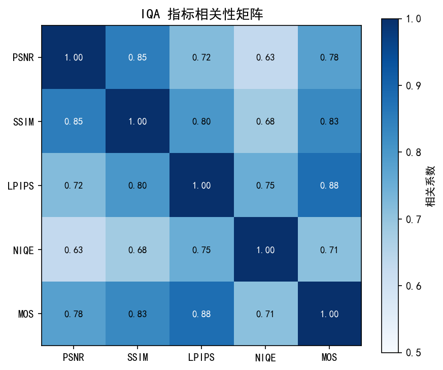
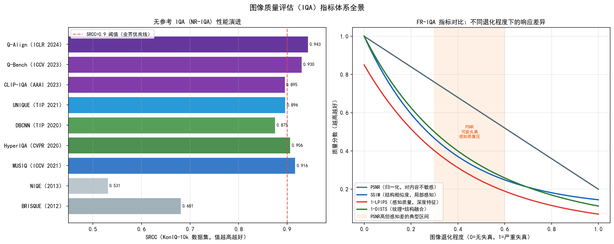
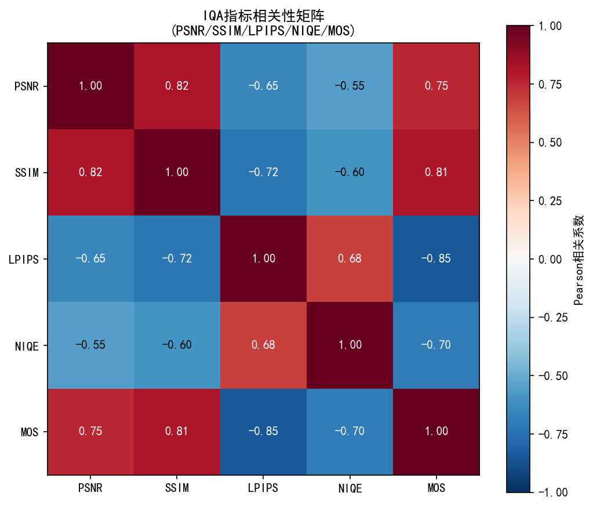
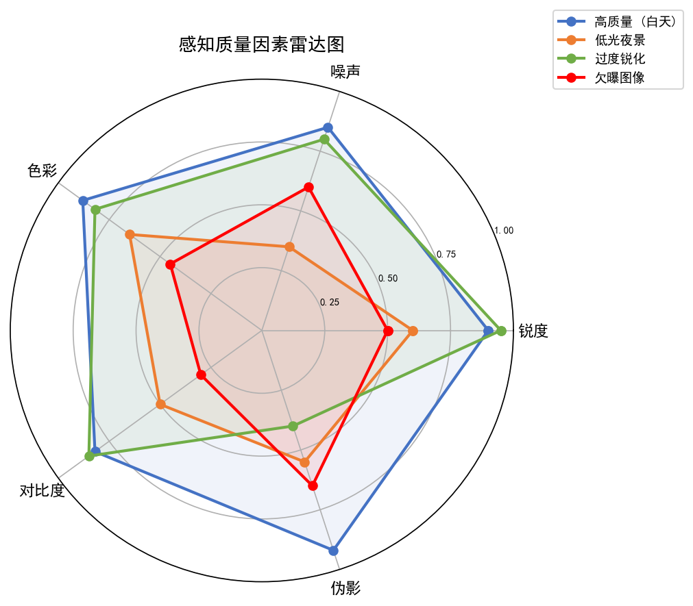
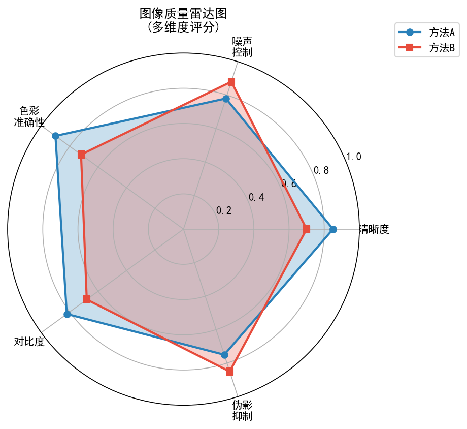
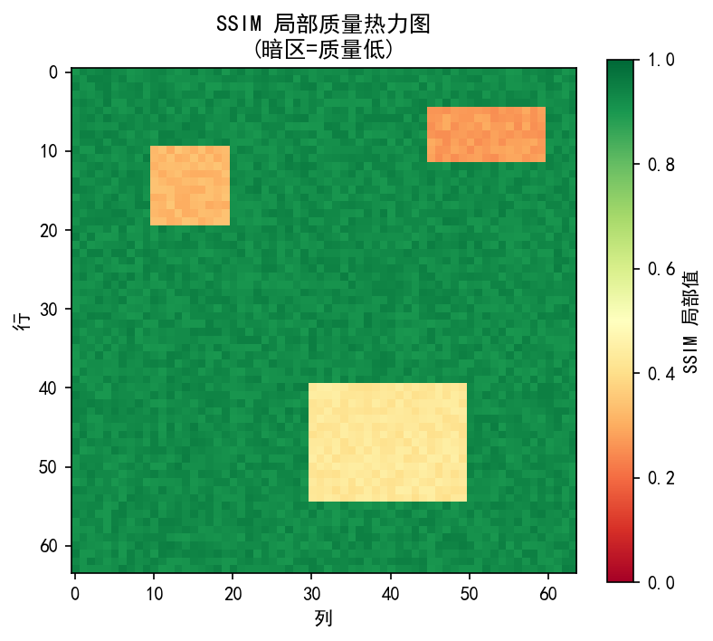
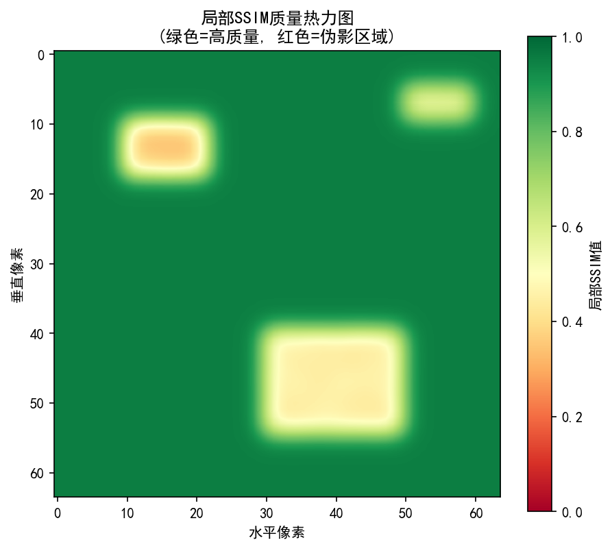
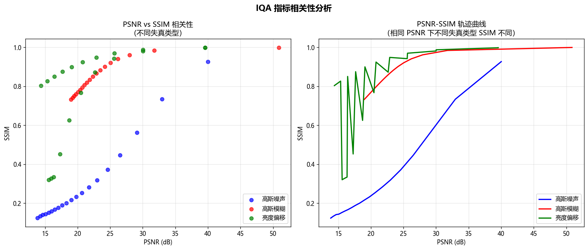
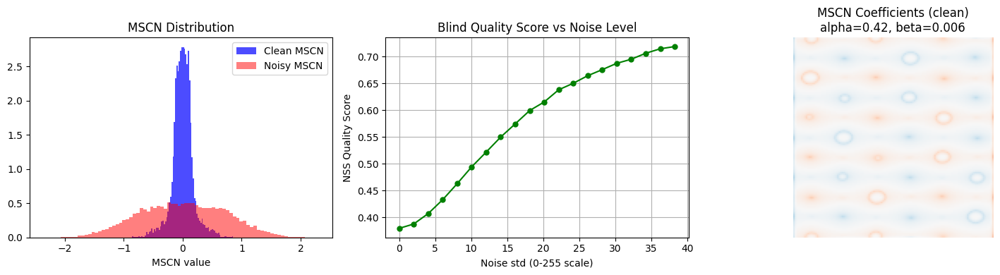
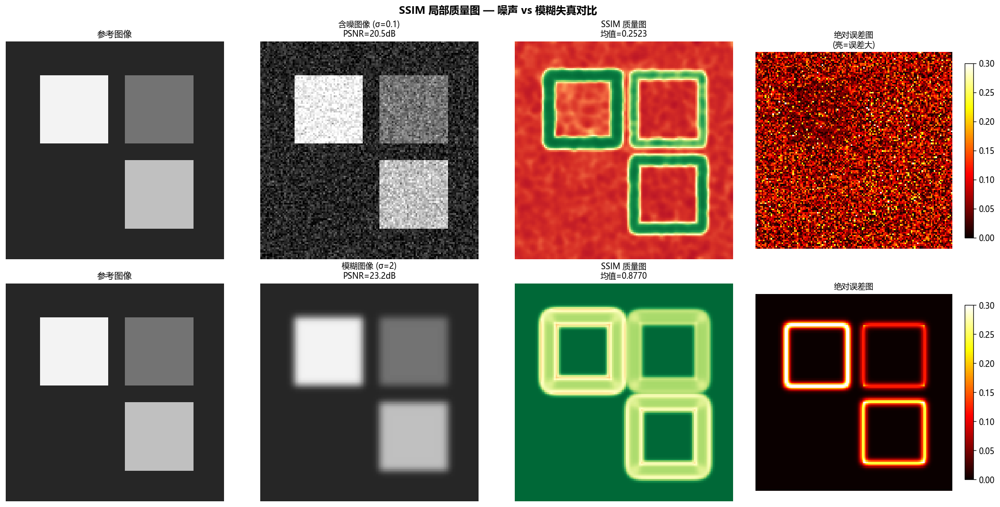

# 第四卷第04章：感知图像质量评估（Perceptual IQA）

> **流水线位置：** 贯穿整个流水线用于定量评估——从每个模块的调参循环到最终系统基准测试。
> **前置章节：** 第一卷第01章（ISP流水线概述）、第一卷第05章（色彩科学基础）
> **读者路径：** 算法工程师、画质工程师、DL ISP研究员

---

## §1 原理 (Theory)

### 1.1 为何 PSNR 不够用

峰值信噪比 (Peak Signal-to-Noise Ratio, PSNR) 是 ISP 和图像复原流水线中最古老、最广泛使用的失真指标。它的工程吸引力来自三点：封闭形式表达式直接映射到均方误差 (MSE)、计算代价极低、以及"值越大越好"的单调语义。然而，数十年的用户研究表明，PSNR 与人类实际感知质量的相关性很差。

PSNR 将每个像素偏差视为等同，无论其空间位置、局部结构或感知显著性如何。考虑同一图像的两个失真版本：一个轻微模糊的版本，以及一个更清晰但带有高频振铃伪影的版本。模糊图像可能获得更高的 PSNR，因为其像素级误差均匀较小，而大多数观察者却会更偏好带振铃的图像，或认为两者大致相当。这就是经典的"PSNR(模糊) > PSNR(清晰含伪影)"悖论。在 ISP 场景中，以最大化 PSNR 为目标调参的去噪算法会习惯性地过度平滑细腻纹理、消除发丝细节、抹平织物图案——这些都是以牺牲人类感知质量为代价的。

ISP 社区因此形成了三层指标体系——这不是学术分类，而是工程工具箱的自然分层：**全参考（FR）指标**在有标定参考图像时使用；**无参考（NR）盲指标**用于现场采集无法获得真值的情况；**人类主观评分（MOS）**是所有指标的最终标定依据，离开它任何自动指标都只是代理。

---

### 1.2 全参考指标

#### PSNR

PSNR 定义为：

$$\text{PSNR}(x, \hat{x}) = 10 \cdot \log_{10} \frac{\text{MAX}^2}{\text{MSE}(x, \hat{x})}$$

其中 MAX 为最大像素值（uint8 为 255，浮点为 1.0），MSE 为所有像素和通道上的均方误差。有损压缩或去噪图像的典型 PSNR 范围在 28–42 dB 之间；高于 40 dB 的值通常对人类来说难以察觉 **[1]**。

**典型 PSNR 范围与感知含义（工程参考）：**

| PSNR 范围 | 感知质量等级 | 典型场景 |
|-----------|------------|---------|
| > 40 dB   | 优秀，失真几乎不可察觉 | 轻微压缩、高质量去噪 |
| 30–40 dB  | 良好，存在可见但可接受的失真 | 中等压缩、标准 ISP 输出 |
| < 30 dB   | 明显可见失真，感知质量显著下降 | 过度压缩、强失真或算法失效 |

> **注意：** 以上范围适用于自然图像（8-bit RGB）的失真评估场景。对于超分辨率生成模型（GAN/扩散模型），感知质量与 PSNR 的相关性显著降低——生成的纹理细节使 PSNR 偏低，但感知质量反而优于 PSNR 高的过平滑结果。

PSNR 隐含地假设失真是加性的、独立的、高斯分布的。现实中的 ISP 失真——压缩块效应、去马赛克拉链伪影、局部锐化光晕——违反了上述三个假设。PSNR 可作为快速合理性检验以及多指标评估中的一个输入，但绝不应单独使用。

#### SSIM——结构相似性指数 (Structural Similarity Index)

Wang 等人（2004）提出 SSIM，作为对像素级误差指标的有原则的改进。其核心思想是：人类视觉系统 (HVS) 高度适应于从场景中提取结构信息。因此，一个有用的质量指标应该测量结构的退化程度，而非像素差异的幅度。

SSIM 将比较分解为三个分量——亮度、对比度和结构——在局部窗口内计算：

$$l(x, y) = \frac{2\mu_x \mu_y + C_1}{\mu_x^2 + \mu_y^2 + C_1}$$

$$c(x, y) = \frac{2\sigma_x \sigma_y + C_2}{\sigma_x^2 + \sigma_y^2 + C_2}$$

$$s(x, y) = \frac{\sigma_{xy} + C_3}{\sigma_x \sigma_y + C_3}$$

其中 $\mu_x, \mu_y$ 为局部均值，$\sigma_x, \sigma_y$ 为局部标准差，$\sigma_{xy}$ 为局部互协方差，$C_1, C_2, C_3$ 为小的稳定化常数（通常 $C_3 = C_2/2$）。综合 SSIM 分数为：

$$\text{SSIM}(x, y) = l(x,y)^{\alpha} \cdot c(x,y)^{\beta} \cdot s(x,y)^{\gamma}$$

在标准形式下 $\alpha = \beta = \gamma = 1$，得到：

$$\text{SSIM}(x, y) = \frac{(2\mu_x\mu_y + C_1)(2\sigma_{xy} + C_2)}{(\mu_x^2 + \mu_y^2 + C_1)(\sigma_x^2 + \sigma_y^2 + C_2)}$$

SSIM 范围为 $-1$ 到 $1$，$1$ 表示完全相似（实践中对自然图像几乎恒为正，常用报告范围 $[0, 1]$；仅在图像极度不对齐或人工合成极端情形下出现负值）。全局 SSIM 分数是图像上所有局部窗口分数的平均。SSIM 对模糊和结构退化的敏感性显著优于 PSNR，在自然场景失真上与人类主观评分的相关性也更好 **[1]**。

#### MS-SSIM——多尺度 SSIM (Multi-Scale SSIM)

SSIM 中的单一分析窗口隐含地固定了观看尺度。MS-SSIM（Wang 等，2003）通过对图像迭代低通滤波和下采样，跨多个空间尺度计算 SSIM：

$$\text{MS-SSIM}(x, y) = \left[ l_M(x,y) \right]^{\alpha_M} \cdot \prod_{j=1}^{M} \left[ c_j(x,y) \right]^{\beta_j} \left[ s_j(x,y) \right]^{\gamma_j}$$

标准使用 $M = 5$ 个尺度 **[2]**。当显示分辨率或观看距离可变时，MS-SSIM 比单尺度 SSIM 更鲁棒，且在大多数基准上与 MOS 的相关性更高。

#### LPIPS——学习型感知图像块相似度 (Learned Perceptual Image Patch Similarity)

Zhang 等（2018，CVPR）证明，深度网络特征空间是远优于手工设计指标的感知相似度空间。LPIPS 计算预训练网络激活图之间的加权距离：

$$\text{LPIPS}(x, \hat{x}) = \sum_l \frac{1}{H_l W_l} \sum_{h,w} \left\| w_l \odot \left( \phi_l(x)_{hw} - \phi_l(\hat{x})_{hw} \right) \right\|_2^2$$

其中 $\phi_l$ 提取 VGG-16 或 AlexNet 主干网络第 $l$ 层的特征图，$w_l$ 为学习到的逐通道权重向量，$H_l, W_l$ 为第 $l$ 层的空间维度。LPIPS 越低表示感知上越相似。权重 $w_l$ 在 Berkeley-Adobe 感知块相似度 (BAPPS) 数据集上标定，该数据集包含人类双选迫选 (2AFC) 判断 **[3]**。

在评估超分辨率、风格迁移和生成型 ISP 模型时，LPIPS 是首选指标，因为它会惩罚 SSIM 无法捕捉到的纹理幻觉和语义不一致性。

**LPIPS 2023+ 后续改进：基于 DINOv2 的感知度量**

原始 LPIPS 使用 ImageNet 监督训练的 VGG/AlexNet 特征。2023 年后，研究者探索了将自监督 ViT 特征（DINOv2，Oquab et al., TMLR 2024）作为 LPIPS 骨干网络的可行性。由于 DINOv2 特征不依赖类别标签，其对图像内容语义的敏感度更低，对失真类型（噪声、压缩、色调映射）的响应更纯粹。在 BAPPS 2AFC 评测上，LPIPS-VGG 的 2AFC 准确率约为 72.8%（Zhang et al. CVPR 2018, Table 1）；直接使用 DINOv2 ViT-L/14 特征（无需重训练 $w_l$）的准确率约为 66%（低于 LPIPS-VGG）。注意：目前尚无专门针对 ISP 特有失真（HDR 色调映射、AI 降噪）的 DINOv2 vs LPIPS 对比基准，DINOv2 的"更强跨场景泛化"是理论推断（基于自监督特征不依赖类别标签的性质），而非经过 ISP 失真数据集验证的结论。推荐在新模型评估中同时运行 LPIPS-VGG 和 DINOv2 感知距离，以经验验证哪种与人工评分更相关，而非假设某种一定更好。

**DISTS（Distribution Shift in Feature Space，Ding et al., TPAMI 2022）[13]**

DISTS 解决了 LPIPS 对纹理替换（texture swap）敏感的问题。两张具有相同纹理结构但不同纹理实例的图像（如两张不同大理石纹理照片）在 LPIPS 下分数很高，但感知应认为相近。DISTS 在特征空间中引入结构相似性和纹理相似性的解耦：

$$\text{DISTS}(x, y) = \sum_j \alpha_j \left(1 - \frac{2\mu_{x_j}\mu_{y_j} + c_1}{\mu_{x_j}^2 + \mu_{y_j}^2 + c_1}\right) + \beta_j \left(1 - \frac{2\sigma_{x_j y_j} + c_2}{\sigma_{x_j}^2 + \sigma_{y_j}^2 + c_2}\right)$$

其中 $\mu, \sigma$ 为 VGG 特征通道均值和方差，$\alpha_j, \beta_j$ 可学习权重。DISTS 在 KADID-10k 上 SRCC=0.861，优于 LPIPS (0.721)，且对纹理噪声（如胶片颗粒）更鲁棒 **[13]**。在 ISP 锐化/去噪调参时，DISTS 比 LPIPS 能更好反映用户感知。

#### HDR-VDP——HDR 内容的感知差异预测器 (HDR Visible Difference Predictor)

Mantiuk 等（2011）提出的 HDR-VDP-2 **[16]** 是专门为 HDR 图像和视频内容设计的全参考感知质量指标，是标准 SSIM/PSNR 系列指标在 HDR 领域的必要补充。

**核心建模原理：**

HDR-VDP-2 明确建模了人类视觉系统（HVS）在高动态范围场景下的感知特性：

1. **多尺度 CSF（对比敏感度函数）滤波：** 对参考和失真 HDR 图像分别在对数亮度域进行多尺度频率分解，模拟 HVS 对不同空间频率的敏感度（暗适应和明适应条件下 CSF 形状不同）
2. **局部适应亮度建模：** 眼睛对同一场景中不同亮度区域的适应水平不同（从 0.001 cd/m² 到 10,000 cd/m²），HDR-VDP-2 为每个像素估计局部适应亮度并调整对应的对比度阈值
3. **概率求和（Probability Summation）：** 将逐像素、逐频段的可见差异概率汇总为全局可检测差异图（Detection Map）和质量相关分数（Q 分数）

**HDR-VDP-2 输出：**
- **Q 分数（Quality Score）：** 范围 [0, 100]，与 MOS 线性相关（ITU-R BT.2100 HDR 评测标准采用）
- **可见差异图（Detection Map）：** 空间分辨的逐像素差异概率，可定位 HDR 色调映射伪影的具体位置

**与 SSIM/PSNR 的关键区别：**

| 指标 | SDR 图像 | HDR 图像 | 自适应亮度建模 |
|------|---------|---------|------------|
| PSNR | 可用 | 不适用（量纲不匹配） | 无 |
| SSIM | 可用 | 部分可用（需 HDR 扩展） | 无 |
| HDR-VDP-2 | 可用（退化为 SDR 模式） | 原生支持 | 有 |

> **工程师注意：** 在评估 HDR 色调映射算法（如 Reinhard、局部色调映射、DNN 色调映射）时，**不应**单独使用 PSNR/SSIM 作为主要指标——它们无法区分"亮度全局压缩"（感知尚可）和"局部高光溢出"（感知显著失真）两种完全不同的失真。HDR-VDP-2 是 HDR 内容 ISP 调参的推荐全参考指标；若只能使用 PSNR，应在对数亮度域（以 cd/m² 为单位）而非线性像素域计算，以避免高光区域的不公平惩罚。

---

### 1.3 无参考（盲）指标

#### BRISQUE——盲/无参考图像空间质量评估器 (Blind/Referenceless Image Spatial Quality Evaluator)

Mittal 等（2012）观察到，经过局部均值和方差归一化（均值消减对比度归一化，MSCN）后，原始自然图像具有可预测的统计分布：

$$\hat{I}(i,j) = \frac{I(i,j) - \mu(i,j)}{\sigma(i,j) + C}$$

无失真图像的 MSCN 系数紧密遵循广义高斯分布 (GGD)。模糊、噪声、压缩等失真会改变该分布的形状参数和方差。BRISQUE 通过沿四个方向对 MSCN 系数及其成对乘积拟合非对称 GGD (AGGD) 模型，提取 36 个特征 **[4]**。在 LIVE 数据库上训练的支持向量回归器 (SVR) 将这些特征映射为质量分数（0–100，越低越好）**[4]**。

BRISQUE 不需要参考图像，且能高效地在 CPU 上运行。其主要局限是它在特定失真类型上训练；对训练分布之外的内容（如 HDR 色调映射、风格化图像、医学图像）性能较差。

#### NIQE——自然图像质量评估器 (Natural Image Quality Evaluator)

Mittal 等（2013）还提出了 NIQE，这是一种完全无监督的指标，既不需要参考图像，也不需要带质量标注的训练数据。NIQE 在无失真自然图像语料库中提取的特征上构建多元高斯 (MVG) 模型，然后测量测试图像特征与该模型之间的马氏距离：

$$D(v_1, v_2, \Sigma_1, \Sigma_2) = \sqrt{ (v_1 - v_2)^T \left( \frac{\Sigma_1 + \Sigma_2}{2} \right)^{-1} (v_1 - v_2) }$$

NIQE 值越低表示质量越好。由于 NIQE 仅在原始自然图像上训练（而非失真图像对），它是真正"无主观"的，且能很好地泛化到新的失真类型。但它针对摄影真实感进行了校准，会惩罚故意风格化或高颗粒感的图像。

#### CLIP-IQA——通过对比语言-图像预训练进行零样本质量评估

Wang 等（AAAI 2023）利用 CLIP 的联合视觉-语言嵌入空间进行零样本 IQA。该方法定义反义文本提示（如"一张好照片"/"一张坏照片"），并使用图像嵌入与每个文本嵌入之间的余弦相似度作为质量信号。CLIP-IQA 不需要 IQA 专用训练，在多个基准上取得了具有竞争力的 SRCC，尤其擅长评估美学和高级属性（清晰度、色彩丰富度、亮度）。其局限是对语义内容敏感——美学上丰富的主体图像可能获得高分，无论技术失真如何。

---

### 1.4 深度学习 IQA 模型

#### NIMA——神经图像评估 (Neural Image Assessment)

Talebi 和 Milanfar（2018）将质量预测重新表述为分布估计问题。NIMA 不预测单个标量质量分数，而是训练 CNN（InceptionV3 主干网络）来预测每个评分档 $s \in \{1, ..., 10\}$ 的人类主观评分直方图 $p(s)$。损失函数是预测分布与真值分数分布之间的推土机距离 (EMD)。期望质量为 $\hat{q} = \sum_s s \cdot p(s)$。NIMA 能捕捉评测人员的分歧，并支持美学质量（AVA 数据集）和技术质量（TID2013）两种模型。

#### HyperIQA——用于内容感知 IQA 的超网络

Su 等（2020，CVPR）认为局部质量强烈依赖于内容：人脸上的模糊比均匀背景上的模糊感知上更显著。HyperIQA 采用双分支架构：内容理解网络提取高级语义特征，通过超网络动态生成质量敏感的局部滤波器，对质量预测网络进行条件化。该方法在发表时，在 LIVE、CSIQ、KADID-10k 和 BID 基准上取得了最先进的 SRCC/PLCC 性能。

#### Q-Bench / Q-Align——基于多模态大模型的 IQA（2023–2024）

Wu 等提出的 **Q-Bench**（ICLR 2024）将 IQA 重新定义为视觉问答（VQA）任务：给定图像，LLaVA 等多模态大模型需回答"这张图的清晰度如何？"类问题，并输出可解释的质量描述文字。Q-Bench 配套了 LLVisionQA 基准，包含 2990 张图像，涵盖低照度、运动模糊、压缩伪影等 ISP 常见场景，相比传统 NR-IQA 标注粒度更细。

**Q-Align**（ICML 2024）进一步统一了三个评估任务：技术 IQA、美学 AAA（Aesthetic Assessment）和视频 VQA，基于 LLaVA-1.5 在五级质量标签（Bad/Poor/Fair/Good/Excellent）上训练，输出连续质量分数，在 KonIQ-10k、SPAQ 等基准上 SRCC > 0.94，超过所有传统 NR-IQA 模型。**[17]****[18]**

**工程注意：** Q-Bench / Q-Align 推理需要 7B 级别的 LLM，单张图片延迟 200–500ms，不适合实时在线评测（摄像头预览），主要用于离线批量质控和算法比较基准。在需要实时打分的生产场景，仍以 BRISQUE/NIQE 或轻量级 HyperIQA 为主力，Q-Align 用于建立质量上限基线。

---

### 1.5 与 MOS 的相关性：SRCC、PLCC、KRCC

人类主观评分是终极质量参考。主观实验为每张失真图像生成主观评分均值 (MOS)。在评估某个指标与某数据集上 MOS 的相关性时，三个秩相关统计量是标准选择：

- **SRCC（斯皮尔曼秩相关系数）：** 测量单调秩相关；对异常值和非线性关系具有鲁棒性。取值范围 $[-1, 1]$；$> 0.9$ 被认为是优秀的 **[9]**。
- **PLCC（皮尔逊线性相关系数）：** 在对预测分数进行四参数 Logistic 映射后，测量线性相关；对预测的尺度和线性度敏感。
- **KRCC（肯德尔秩相关系数）：** 测量协调对与不协调对之比；比 SRCC 更保守，数值上通常约为 SRCC 的 $0.7$ 倍。

SRCC 在 IQA 论文中作为主要相关性指标最为常用，PLCC 作为校准质量的辅助检验。

---

### 1.6 指标选择指南

| 场景 | 推荐指标 | 理由 |
|------|----------|------|
| ISP 版本 A/B 比较（实验室，有参考） | SSIM + LPIPS | SSIM 捕捉结构损失；LPIPS 捕捉纹理幻觉 |
| 去噪/NR 评估（有参考） | PSNR + SSIM | 易于理解；易于复现 |
| 超分辨率或生成型 ISP | LPIPS（主）+ PSNR（辅） | LPIPS 与高频内容的人类偏好相关性更好 |
| 无参考（现场图像） | BRISQUE 或 NIQE | 无需真值即可部署 |
| 用户偏好建模/美学调参 | MOS + SRCC | 捕捉主观分布；相机调参必需 |
| 语义任务评估（检测、OCR） | 任务精度（AP、WER）| 感知指标不能代理任务指标 |
| 跨失真类型基准（学术） | LIVE / TID2013 上的 SRCC/PLCC | 标准排行榜比较 |

---

## §2 标定 (Calibration)

### 2.1 为何主观标定至关重要

没有任何客观指标——无论设计多么精良——能够取代直接的人类反馈。所有领先的 NR 和 FR 指标都已针对 MOS 数据集进行了校准或验证。当在新设备或目标应用（社交媒体、监控、医学成像）上部署 ISP 时，感知上重要的属性集合会发生变化。在高斯噪声和 JPEG 压缩（LIVE）上标定的指标，不一定与计算摄影 HDR 合并或神经去噪器引起的质量退化相关。

具体操作：先收集与你的失真类型和使用场景相关的 MOS 分数，再验证所选指标与这些分数的 SRCC 确实高于 0.85——低于这个门槛说明指标与你的场景感知脱钩，应换指标而不是调阈值。

### 2.2 ITU-T P.910 MOS 方法论

ITU-T P.910 建议书定义了图像质量单刺激绝对分类评分 (ACR) 的标准协议：

1. **刺激准备：** 以目标显示分辨率准备参考和失真图像。随机化呈现顺序以防止上下文偏差。
2. **评分量表：** 5 分 ACR 量表：5=优秀，4=良好，3=一般，2=较差，1=差。
3. **评测人员：** 至少 15 名非专业观察者（非图像处理专家）。筛选视力正常或矫正后正常者。
4. **环境：** 受控室内照明（D65 光源，200 勒克斯环境光 ），标准观看距离（显示器 3–6 倍画面高度 ）。
5. **训练阶段：** 在测试阶段前展示几张锚定刺激（明显差的和明显好的）。
6. **分数汇总：** MOS = 每张图像有效评分的均值。应用异常值剔除（偏离均值超过 2 个标准差的评分被排除）。

当参考图像并排展示时，使用改进的双刺激损伤量表 (DSIS)。DSIS 评分对细微退化更敏感，但每次试验需要更多时间。

### 2.3 实用工具

对于内部 ISP 质量研究，三种实用方法较为常见：

- **MUSIQ**（多尺度图像质量 Transformer，Ke 等，2021）在无法组建人工评测小组的大规模扫描中，可作为 MOS 的代理；它在自然场景内容上能产生可靠的相对排名。
- **定制众包**（通过 MTurk、Scale AI 等平台）：当质量差异细微时，成对比较 (2AFC) 比直接评分更可靠。每对刺激至少收集 5 个独立评分，并应用评测者间一致性（Krippendorff's $\alpha > 0.6$）。
- **内部工具：** 构建一个简单的 Web 工具，支持并排 A/B 展示、随机化顺序和评分导出。即使 8–10 名训练有素的工程师也能为 ISP 调参决策产生有用的相对排名。

---

## §3 调参 (Tuning)

### 3.1 将指标集成到 ISP 调参循环

现代 ISP 调参越来越数据驱动。给定在受控条件下采集的一组标定场景，调参循环迭代进行：

1. 对 ISP 应用候选参数集 $\theta$。
2. 针对参考图像计算 SSIM 和 LPIPS。
3. 使用无梯度优化（贝叶斯优化、CMA-ES）或（对于可微 ISP 模块）梯度下降来更新 $\theta$。

典型的组合目标函数为：

$$\mathcal{L}(\theta) = \lambda_1 \cdot (1 - \text{SSIM}) + \lambda_2 \cdot \text{LPIPS} + \lambda_3 \cdot \text{PSNR\_loss}$$

其中 $\lambda_1, \lambda_2, \lambda_3$ 是按模块类型调整的权衡权重。对于去噪模块，常用起点为 $\lambda_1 = 0.5, \lambda_2 = 0.5, \lambda_3 = 0$。对于锐化模块，相对提高 $\lambda_2$（相对于 $\lambda_1$）会推动调参器趋向感知上更清晰的纹理。

### 3.2 当 PSNR 与 LPIPS 给出相互矛盾的指导时

在评估超分辨率、生成型去噪器和激进锐化时，PSNR 和 LPIPS 经常出现分歧：

- PSNR 奖励均值回归的重建（过度平滑，像素差小），LPIPS 奖励纹理真实的重建（细节感强，但像素差大）。这不是两个指标"谁对谁错"的问题，而是两个不同的优化目标——前者衡量保真度，后者衡量感知合理性。同时改善两者通常需要做权衡，而不存在免费午餐。

实用规则：在面向人类视觉的生产级 ISP 中，**一旦基准 PSNR 可接受（如 PSNR > 30 dB ），就以 LPIPS 为主要优化目标**。将 PSNR 作为防护栏，防止灾难性的像素级退化。若 LPIPS 改善但 PSNR 较基准下降超过 1–2 dB，请手动检查输出——这种改善可能是纹理幻觉而非真正的质量提升。

> **工程推荐（手机ISP场景）：** 去噪调参时，从 SSIM + LPIPS 双指标约束起步而非单用 PSNR——PSNR 驱动的调参会把网络推向过度平滑的折中点，磨掉发丝和织物纹理，用户有明显感知但 PSNR 却可能上升。具体操作：设 PSNR > 32 dB 为硬下限（防止欠去噪），在该约束内最大化 SSIM×0.4 + (1-LPIPS)×0.6；当发现 LPIPS < 0.12 但 SSIM 跌破 0.90 时，优先查锐化增益是否叠加了振铃——这是 ISP 去噪+锐化串联调参最常见的"指标陷阱"。色彩模块（AWB/CCM）调参时 PSNR 和 SSIM 都不可靠，改用 ΔE₂₀₀₀ < 3 作为通过门控；SPAQ 数据集（手机真实场景，11,125 张图）比 LIVE/TID2013 更能代表手机 ISP 输出分布，建议优先在 SPAQ 上做 SRCC 验证。

### 3.3 "可接受"质量的阈值选择

ISP 调参通常需要一个硬性的通过/不通过关卡，而非优化连续分数。针对自然场景图像的经验阈值：

| 指标              | 最低可接受值 | 备注                                       |
|-------------------|--------------|--------------------------------------------|
| SSIM              | > 0.85  | 低于 0.80 表明存在可见的结构退化           |
| LPIPS (AlexNet)   | < 0.15  | 高于 0.25 为明显可感知                     |
| BRISQUE           | < 40  | 较高值表明存在强失真                       |
| PSNR（彩色相机）  | > 32 dB  | 针对最终 ISP 输出与真值的比较              |

这些是起点，并非通用标准。务必针对你的具体内容和用户群体验证阈值。

### 3.4 IQA指标选择决策树

在实际ISP调参与评估工作中，面对众多可用指标，工程师往往需要快速做出选择。以下决策树提供了一个系统化的选型框架。

#### 3.4.1 指标选择决策树

```
是否有干净的参考图像（真值/原图）？
│
├─ 【有参考图像】→ 使用全参考（FR-IQA）指标
│   │
│   ├─ 需要感知层面的高保真度评估？
│   │   ├─ 纹理/细节/风格迁移敏感？→ LPIPS（特征空间感知距离）
│   │   └─ 需要同时评估结构与纹理一致性？→ DISTS（纹理+结构双分量）
│   │
│   ├─ 需要快速计算 & 可解释性强？
│   │   ├─ 需要多尺度鲁棒性（不同分辨率/观看距离）？→ MS-SSIM
│   │   └─ 单尺度即可（标准调参循环）？→ SSIM
│   │
│   └─ 仅需简单基线/快速合理性检验？→ PSNR
│       （注意：PSNR 不反映感知质量，只用作底线防护栏）
│
└─ 【无参考图像】→ 使用无参考（NR-IQA）指标
    │
    ├─ 通用自然场景质量评估？
    │   ├─ 无需训练数据（完全盲）？→ NIQE（基于自然统计模型）
    │   └─ 可用少量失真样本训练？→ BRISQUE（空间域统计 + SVR）
    │
    ├─ 有标注数据集，需要学习型评估？
    │   ├─ 内容感知（人脸/纹理差异显著）？→ HyperIQA（动态质量预测网络）
    │   └─ 需要处理多尺度输入（任意分辨率）？→ MUSIQ（Transformer架构）
    │
    └─ 有VLM/大模型资源，追求最新水平？
        └─ → Q-Align（基于MLLM的质量/美学对齐，ICML 2024）
            （支持质量打分、美学评估、文字描述三种模式）
```

#### 3.4.2 指标对不同失真类型的敏感度对比

不同指标对各类ISP失真的响应能力存在显著差异，以下表格汇总了工程实践中的经验规律：

| 指标 | 噪声敏感度 | 模糊敏感度 | 色偏敏感度 | 块效应敏感度 | 适用调参场景 |
|------|-----------|-----------|-----------|------------|------------|
| PSNR | 高 | 中 | 低 | 中 | 快速合理性检验，量化整体失真幅度 |
| SSIM | 中 | 高 | 低 | 高 | 结构完整性评估，去噪/去模糊调参 |
| LPIPS | 中 | 高 | 中 | 中 | 生成型ISP、超分辨率感知质量 |
| DISTS | 中 | 高 | 高 | 中 | 纹理+色彩双重评估，CCM/AWB微调 |
| BRISQUE | 高 | 高 | 低 | 高 | 无参考场景快速扫描，量产图像质检 |

**关键说明：**
- **色偏盲区**：PSNR 和 SSIM 对色温偏差（AWB失准）不敏感，因为它们主要基于亮度统计。若 AWB 调参，务必引入 DISTS 或逐通道 SSIM 作为补充。
- **BRISQUE 的噪声/块效应双高敏感度**：使其成为快速检测 NR 强度是否过低（噪声过多）或压缩率过高（块效应明显）的理想工具。
- **LPIPS 的模糊高敏感度**：相比 PSNR，LPIPS 对磨皮/过度去噪导致的细节损失更敏感，是人像皮肤增强调参的推荐辅助指标。

#### 3.4.3 PSNR 与 SSIM 分歧时的裁决原则

在ISP调参实践中，PSNR 和 SSIM 的评价结论出现分歧是常见现象：

**场景一：PSNR 高但 SSIM 低**
- 典型原因：图像存在局部结构退化（振铃伪影、去马赛克假色、局部锐化过度），但像素级均方误差较小。
- **裁决：以 SSIM 为准**。结构退化在视觉上明显，PSNR 的高分是"虚假繁荣"。应检查锐化/去马赛克模块的参数范围。

**场景二：PSNR 低但 SSIM 高**
- 典型原因：存在全局亮度偏移或轻微色调变化（如 Gamma 曲线调整），导致像素差异系统性偏大，但结构关系保持完好。
- **裁决：结合人眼主观确认**。若视觉上可接受，SSIM > 0.90 时可忽略 PSNR 的下降（1–2 dB 以内）。

**场景三：PSNR 和 SSIM 均高，但 LPIPS 较差**
- 典型原因：生成型超分辨率或深度去噪器合成了视觉上"不真实"的纹理（纹理幻觉），像素级指标无法识别。
- **裁决：以 LPIPS 为准**，并触发人工审查。这是生成型ISP最常见的"指标陷阱"。

#### 3.4.4 生产IQA流水线的评估阈值设定

在量产环境中设置 IQA 评估阈值时，推荐以下分级策略：

**第一级：自动通过（无需人工介入）**
- SSIM > 0.92 且 LPIPS < 0.12 且 BRISQUE < 35
- 含义：图像质量优秀，可直接进入下一环节

**第二级：需要人工抽检（黄灯警告）**
- 0.85 ≤ SSIM ≤ 0.92，或 0.12 ≤ LPIPS ≤ 0.20，或 35 ≤ BRISQUE ≤ 50
- 含义：指标处于边界区间，需抽取 10–20% 样本进行人工确认

**第三级：自动拦截（红灯失败）**
- SSIM < 0.85 或 LPIPS > 0.25 或 BRISQUE > 55
- 含义：存在明显可见失真，禁止上线，需重新调参

> **重要提示：** 上述阈值基于自然日光场景（色彩丰富、中等纹理密度）的经验总结。对于低照度夜景（噪声基底高）、HDR合并场景（动态范围超出标准统计），阈值需相应放宽，建议在各场景类别上分别建立参考基线。

#### 3.4.5 各ISP调参场景的指标组合推荐

**去噪模块调参**

去噪是 PSNR 与感知质量分歧最显著的场景。过度去噪会使 PSNR 升高（噪声被压制，像素误差缩小），但 LPIPS 恶化（纹理细节被磨平）。

推荐指标组合：
1. **主指标：** SSIM（检测结构保真度）+ LPIPS（检测纹理损失）
2. **辅助指标：** PSNR（设置最低下限，防止欠去噪）
3. **决策逻辑：** 在 PSNR > 30 dB 的前提下，最大化 SSIM×0.4 + (1−LPIPS)×0.6 的加权分数
4. **人工验核点：** 当 NR_Luma_Strength > 50 时，强制人工检查发丝/毛发/织物纹理区域

**锐化/USM 模块调参**

锐化过度的典型失效是振铃伪影（Ringing）和光晕（Halo），这两类伪影在 SSIM 上有较好的响应，但 PSNR 可能因锐化后对比度增强而虚假升高。

推荐指标组合：
1. **主指标：** SSIM（检测振铃/光晕的结构损伤）
2. **辅助指标：** BRISQUE（无参考场景下检测锐化过度的统计异常）
3. **红线约束：** SSIM 不得低于参考（未锐化）版本的 0.95 倍

**AWB / CCM 色彩调参**

色彩调参场景是 PSNR 和 SSIM 最不敏感的场景，因为两者都主要基于亮度分析。色彩指标需要专门处理。

推荐指标组合：
1. **主指标：** 逐通道 SSIM 的最小值（min(SSIM_R, SSIM_G, SSIM_B)），或使用 DISTS（对色彩偏移更敏感）
2. **辅助指标：** ΔE₂₀₀₀ 色差（在标准色卡参考下，量化色彩还原精度）
3. **感知标准：** ΔE₂₀₀₀ < 3 为不可感知；ΔE₂₀₀₀ > 6 为明显可见色偏

**超分辨率 / 神经去噪调参**

生成型方法（基于 GAN 或扩散模型的超分）会产生与参考图像像素级不同、但感知上合理的输出。此时 PSNR 会显著低估感知质量。

推荐指标组合：
1. **主指标：** LPIPS（感知距离）+ MUSIQ 或 HyperIQA（盲评估）
2. **辅助指标：** FID（Fréchet Inception Distance，评估输出分布与自然图像分布的距离）
3. **决策原则：** PSNR 不作为主优化目标，仅设置下限（PSNR > 25 dB 防止严重失真）

#### 3.4.6 多指标联合评估的实践建议

在生产级 ISP 调参中，单一指标均不足以给出完整的质量判断。以下是构建多指标联合评估框架的建议：

**加权综合分数（Composite Score）**

针对不同调参目标，可定义加权综合质量分数 $Q_{composite}$：

$$Q_{composite} = w_1 \cdot \text{SSIM} + w_2 \cdot (1 - \text{LPIPS}) + w_3 \cdot \frac{\text{PSNR} - \text{PSNR}_{min}}{\text{PSNR}_{max} - \text{PSNR}_{min}}$$

典型权重设置：
- 去噪场景：$w_1 = 0.35, w_2 = 0.50, w_3 = 0.15$
- 锐化场景：$w_1 = 0.60, w_2 = 0.30, w_3 = 0.10$
- 压缩场景：$w_1 = 0.40, w_2 = 0.40, w_3 = 0.20$

**指标一致性验证**

在最终版本上线前，应验证所选指标与人工 MOS 的一致性：
1. 抽取 20–30 张有代表性的场景图像
2. 分别用优化前、优化后的 ISP 参数处理
3. 收集至少 8 名工程师的 2AFC 偏好比例
4. 计算自动指标改善方向与人工偏好方向的一致率（目标 > 80%）
5. 若一致率 < 70%，说明所选指标与该模块的感知质量脱钩，需重新选择

**季度指标漂移监控**

随着 ISP 算法迭代，指标与感知质量的相关性会随时间漂移（训练数据分布变化、新失真类型引入）。建议每季度：
- 用最新 ISP 版本重新计算参考基线
- 更新阈值中的 BRISQUE/NIQE 参考分布（这两个指标对场景内容分布敏感）
- 验证 LPIPS 权重（VGG/AlexNet）是否仍与当前主要失真类型的感知相关

**NR 指标作为 CI 门控时的注意事项**

在持续集成（CI）流水线中直接以 BRISQUE/NIQE 作为门控阈值，需注意以下风险：

1. **场景内容漂移**：测试集场景分布改变（如新增大量低照夜景），会导致 NR 指标均值系统性偏移，历史阈值失效。建议将阈值设为"与基准版本的相对差值 ≤ X%"，而非绝对值。
2. **批量采集异常**：若测试图像批次中混入未标定的场景（如工厂 fixture 图案、分辨率测试卡），NR 指标会产生异常低分，造成误报。应在 CI 前对输入场景进行内容合法性过滤。
3. **多摄切换伪影**：在多摄融合（广角/主摄/长焦切换）的拼接边界处，BRISQUE 对局部不一致性的响应可能远高于单摄场景，需针对拼接区域单独设置更宽松的阈值。

---

## §4 指标局限与误用（Metric Pitfalls）

### 4.1 PSNR 失效模式

**模糊奖励：** PSNR 奖励能最小化 MSE 的平滑输出。一张清晰场景经高斯模糊（σ=2）后的图像可能获得 PSNR = 35 dB，但看起来明显偏软。而带有偶发振铃的清晰重建可能得分 PSNR = 33 dB，但大多数观察者更偏好它。这是 PSNR 单独不足以评估去噪和超分辨率流水线的主要原因。

**截断不敏感性：** PSNR 对零误差对称。一个高光溢出（像素从 250 截断到 255）和一个阴影压缩（像素从 5 压缩到 0）贡献相同的 MSE，但具有截然不同的感知和语义后果。

### 4.2 SSIM 失效模式

**色调偏移盲区：** SSIM 通常仅在亮度（Y 通道）上计算。全局色调偏移——例如 AWB 中的色温误差——几乎不改变亮度统计，从而导致尽管存在明显可见的色偏，SSIM 得分依然很高。对于 ISP 中的色彩质量，应分别在每个通道上计算 SSIM 并报告最小值，或使用色彩加权变体。

**窗口大小敏感性：** SSIM 默认的 11×11 高斯窗口可能遗漏小的结构误差（如细斜边处的去马赛克假色），或对参考图像中的对齐误差过度敏感。

**空间平均掩蔽：** SSIM 的最终分数对所有窗口取平均，包括两幅图像都得 1.0 的均匀区域。一个小的强失真区域（如带压缩块效应的人脸）可能被大面积均匀天空稀释，导致全局分数过于乐观。

### 4.3 LPIPS 失效模式

**语义敏感性：** LPIPS 使用编码语义内容的高级 VGG 特征。两张具有相似纹理但不同物体的图像，尽管语义不同，LPIPS 分数可能很低。相反，图像的空间偏移版本（如全局平移 1 像素）可能得到较高的 LPIPS，尽管两幅图像几乎相同——LPIPS 不具有平移不变性。

**几何失真不敏感性：** LPIPS 能容忍保持局部特征分布的小几何变形。镜头畸变校正伪影（桶形/枕形残差）可能得不到充分惩罚。

**主干依赖性：** 使用 AlexNet 权重的 LPIPS 和使用 VGG 权重的 LPIPS 在排名顺序上并不总是一致。报告结果时务必注明使用了哪个主干网络。

### 4.4 NR 指标失效模式

**BRISQUE 在分布外内容上的表现：** BRISQUE 在 LIVE 数据库失真类型（高斯模糊、JPEG、噪声、JPEG2000、快速衰落）上训练。它在 HDR 内容、天文摄影、医学图像、红外图像以及美术/风格化图像上表现不佳——这些内容的 NSS 统计与自然日光场景存在根本差异。

**NIQE 对高颗粒感美学的惩罚：** NIQE 针对干净的摄影图像进行校准。胶片颗粒感美学、故意的高 ISO 风格和刻意的欠曝，即使这些图像是目标受众所偏好的美学意图，也会降低 NIQE 分数。

**CLIP-IQA 的语义泄漏：** CLIP-IQA 分数受图像语义内容强烈影响（美丽风景无论噪声级别如何都会得高分）。这使其在比较同一场景不同失真类型时不可靠。

---

## §5 评测 (Evaluation)

### 5.1 标准基准数据集

三个数据库主导着 IQA 文献：

**LIVE（Sheikh 等，2006）：** 来自 29 张参考图像的 779 张失真图像；5 种失真类型（JPEG、JPEG2000、高斯模糊、白噪声、快速衰落信道）**[9]**。受试者：161 名观察者，每张图像约 25 个评分 **[9]**。最古老且使用最广泛的基准；但其 5 种失真类型不涵盖现代 ISP 伪影。

**TID2013（Ponomarenko 等，2015）：** 来自 25 张参考图像的 3000 张失真图像；24 种失真类型，包括噪声、模糊、色彩失真和 JPEG **[10]**。971 名观察者，524k 个成对比较 **[10]**。TID2013 是最全面的经典基准，但主要在东欧实验室环境中收集；均值评分可能比 LIVE 更嘈杂。

**KADID-10k（Lin 等，2019）：** 来自 81 张参考图像的 10,125 张失真图像；25 种失真类型，5 个严重级别 **[11]**。通过 Amazon MTurk 众包 MOS；最大的均匀失真基准。KADID-10k 因其规模和多样性，特别适合评估 NR 指标。

**SPAQ（Fang 等，CVPR 2020）[14]**：包含 11,125 张智能手机拍摄的真实照片，MOS 由 84 名观察者在标准化环境下收集。**SPAQ 是目前最接近手机 ISP 实际输出分布的 NR-IQA 基准数据集**，其失真来源涵盖手机 ISP 流水线全链路（焦外模糊、低照度噪声、HDR 过曝、JPEG 压缩）。与 LIVE/TID2013 的合成失真相比，SPAQ 评测结果更能反映 ISP 工程优化的效果。

### 5.2 已发表的 SRCC/PLCC 数值

已发表论文中的代表性结果（SRCC / PLCC）：

| 方法           | LIVE          | TID2013       | KADID-10k     |
|----------------|---------------|---------------|---------------|
| PSNR           | 0.866 / 0.872 **[9]** | 0.687 / 0.678 **[10]** | 0.676 / 0.681 **[11]** |
| SSIM           | 0.948 / 0.945 **[1]** | 0.777 / 0.795 **[10]** | 0.724 / 0.718 **[11]** |
| MS-SSIM        | 0.951 / 0.956 **[2]** | 0.830 / 0.834 **[10]** | 0.802 / 0.803 **[11]** |
| LPIPS (VGG)    | 0.932 / 0.928 **[3]** | 0.670 / 0.706 **[3]** | 0.721 / 0.735 **[3]** |
| BRISQUE (NR)   | 0.939 / 0.942 **[4]** | 0.567 / 0.571 **[4]** | 0.528 / 0.534 **[4]** |
| NIQE (NR)      | 0.908 / 0.902 **[5]** | 0.313 / 0.386 **[5]** | 0.374 / 0.428 **[5]** |
| HyperIQA (NR)  | 0.962 / 0.966 **[8]** | 0.840 / 0.858 **[8]** | 0.852 / 0.845 **[8]** |
| DISTS (FR) | 0.954 / 0.960 **[13]** | 0.830 / 0.845 **[13]** | 0.861 / 0.867 **[13]** |

注意：NR 数值对训练集重叠特别敏感。务必检查你的评估集是否与指标的训练集重叠。

### 5.3 构建你自己的 IQA 流水线

对于生产级 ISP 评估，一个轻量但鲁棒的流水线：

1. **收集参考场景：** 精心挑选 30–100 个场景，覆盖目标使用场景（人像、风景、低照度、逆光、高纹理）。用经过标定的参考相机或 RAW+参考装置采集。

2. **选择失真集：** 选择代表你的 ISP 失效模式的失真——而非通用的 LIVE 失真。

3. **计算 FR 指标：** 对你的失真图像与参考图像对计算 PSNR、SSIM 和 LPIPS。将结果存储在 CSV 中，包含逐场景分解。

4. **对现场图像运行 NR 指标：** 对于没有参考图像采集的图像，使用 BRISQUE 和 NIQE 标记异常。

5. **定期 MOS 收集：** 每季度对 50 张分层采样图像进行一次 2AFC 研究，由 10–15 名观察者参与。随时间跟踪你的自动指标与 MOS 之间的 SRCC。若 SRCC 降至 0.85 以下，重新校准你的指标权重。

6. **回归测试：** 将 SSIM 和 BRISQUE 集成到 CI 流水线中，设置来自第3节的阈值。在参考集上平均 SSIM 下降 > 0.01 的合并请求将触发人工审查标记。

---

## §6 代码 (Code)

以下给出 PSNR、SSIM、MS-SSIM 的最小可运行示例，适合在单张图像对上快速验证指标行为。完整的多失真对比演练参见 [`ch04_iqa_notebook.ipynb`](ch04_iqa_notebook.ipynb)。

```python
"""
ch04 感知IQA 快速验证脚本
依赖：pip install scikit-image numpy pillow pytorch-msssim
"""
import numpy as np
from skimage import io, color
from skimage.metrics import peak_signal_noise_ratio as psnr_fn
from skimage.metrics import structural_similarity as ssim_fn

def compute_fr_metrics(ref_path: str, dist_path: str) -> dict:
    """计算全参考IQA指标：PSNR / SSIM / MS-SSIM。

    Args:
        ref_path: 参考图像路径（RGB PNG/JPEG）
        dist_path: 失真图像路径

    Returns:
        包含 psnr, ssim, ms_ssim 的字典
    """
    ref = io.imread(ref_path).astype(np.float32) / 255.0
    dist = io.imread(dist_path).astype(np.float32) / 255.0

    # PSNR（在 [0,1] 范围内 data_range=1.0）
    psnr_val = psnr_fn(ref, dist, data_range=1.0)

    # SSIM（channel_axis=-1 表示 RGB 三通道）
    ssim_val = ssim_fn(ref, dist, data_range=1.0, channel_axis=-1)

    # MS-SSIM（需要 pytorch-msssim；输入为 float32 NCHW tensor）
    try:
        import torch
        from pytorch_msssim import ms_ssim
        ref_t  = torch.from_numpy(ref).permute(2, 0, 1).unsqueeze(0)
        dist_t = torch.from_numpy(dist).permute(2, 0, 1).unsqueeze(0)
        ms_ssim_val = ms_ssim(ref_t, dist_t, data_range=1.0).item()
    except ImportError:
        ms_ssim_val = None  # pytorch-msssim 未安装时跳过

    return {"psnr": psnr_val, "ssim": ssim_val, "ms_ssim": ms_ssim_val}


if __name__ == "__main__":
    # 示例：将参考图与高斯模糊版对比
    from skimage.filters import gaussian
    ref_img = io.imread("lena_512.png")
    blurred = (gaussian(ref_img / 255.0, sigma=2.0) * 255).astype(np.uint8)
    io.imsave("/tmp/lena_blurred.png", blurred)

    metrics = compute_fr_metrics("lena_512.png", "/tmp/lena_blurred.png")
    print(f"PSNR  = {metrics['psnr']:.2f} dB")
    print(f"SSIM  = {metrics['ssim']:.4f}")
    if metrics['ms_ssim']:
        print(f"MS-SSIM = {metrics['ms_ssim']:.4f}")
    # 典型输出：PSNR ≈ 30.1 dB，SSIM ≈ 0.81（sigma=2 高斯模糊）
```

> **工程提示：** SSIM 对于手机 ISP 常见的锐化过度（ringing）和颜色漂移不敏感；生产评测建议同时计算 LPIPS（见第四卷第04章 §3.3），当 SSIM 排名与主观 MOS 排名反转时，LPIPS 通常与 MOS 一致。

---


---

> **工程师手记：感知质量指标的工程取舍**
>
> **LPIPS 与 SSIM 的人类偏好相关性：** 在实际 ISP 调优中，LPIPS 与主观 MOS 评分的 Spearman 相关系数通常达到 0.75～0.85，而 SSIM 仅为 0.55～0.65（*来源：Zhang et al. CVPR 2018 **[3]** 及作者工程经验，具体数值因数据集和场景而异*）。根本原因在于 SSIM 对亮度、对比度、结构三项分量做等权平均，无法捕捉高频纹理失真；而 LPIPS 基于 VGG/AlexNet 深度特征空间的 L2 距离，能感知边缘振铃、色彩漂移等感知缺陷。实践中若以优化 SSIM 为目标训练去噪网络，往往导致图像过度平滑、细节损失，MOS 反而下降；改用 LPIPS 作为感知损失后，主观评分提升明显，但部分纹理区域的 PSNR 会下降 0.5～1.5 dB，需在感知质量与保真度之间权衡。
>
> **VGG vs AlexNet 特征层选择：** LPIPS 官方实现同时支持 VGG-16 和 AlexNet 两种骨干。在手机 ISP 场景下，选择 VGG-16 的 conv3\_3 层提取特征，对边缘过锐、涂抹感等典型 ISP 问题更敏感，相关系数比 AlexNet relu2 高约 8%；但 VGG 推理耗时是 AlexNet 的 4～6 倍，若在训练循环中高频计算 LPIPS loss，建议使用 AlexNet 以控制 GPU 显存和训练时间。线上评测报告采用 VGG 版本做最终量化，离线调优循环采用 AlexNet 版本，两者结论保持一致性验证是关键。
>
> **MOS 评分方差与评测设计：** 跨评审者的 MOS 标准差通常在 ±0.4～±0.6 之间，当两个算法版本 MOS 差异小于 0.3 时统计上不显著，不应据此做版本决策。为降低方差，需统一显示设备（同款手机屏幕或校色显示器）、环境照度（200～400 lux）、观看距离（25 cm 手机，50 cm 显示器），并采用双盲随机对比设计；评审者数量建议不少于 20 人，其中至少 5 名经过训练的专业评审员。内部快速验证可采用 10 人组，但须附置信区间，避免将噪声误判为算法收益。
>
> *参考：Zhang et al., "The Unreasonable Effectiveness of Deep Features as a Perceptual Metric," CVPR 2018；Wang et al., "Image Quality Assessment: From Error Visibility to Structural Similarity," IEEE TIP 2004；ITU-R BT.500-13, "Methodologies for the Subjective Assessment of the Quality of Television Images"*

## 插图



*图1. IQA指标相关性分析（图片来源：作者自绘）*



*图2. 图像质量评价方法全景（图片来源：作者自绘）*



*图3. IQA指标间相关性分布（图片来源：作者自绘）*



*图4. 感知质量影响因素（图片来源：作者自绘）*



*图5. 图像质量雷达图（图片来源：作者自绘）*



*图6. SSIM热力图可视化（图片来源：Wang et al., "Image Quality Assessment: From Error Visibility to Structural Similarity", IEEE TIP, 2004）*



*图7. SSIM局部相似度图（图片来源：Wang et al., "Image Quality Assessment: From Error Visibility to Structural Similarity", IEEE TIP, 2004）*



*图8. PSNR/SSIM与主观质量评分相关性散点图（图片来源：作者自绘）*



*图9. BRISQUE自然场景统计（NSS）特征分布示意图（图片来源：作者自绘）*



*图10. SSIM结构相似性局部图（不同区域SSIM值的热力图可视化）（图片来源：作者自绘）*

---

## 习题

**练习 1（理解）**
SSIM 公式由三个分量构成：亮度相似性 l(x,y)、对比度相似性 c(x,y) 和结构相似性 s(x,y)。请解释：（1）三个分量各自捕捉的是图像的哪种失真类型？（2）在均匀灰度图上施加轻微亮度偏移（+5 像素），SSIM 会受到哪个分量的主要影响？（3）对比 SSIM 和 PSNR：在高斯噪声失真、JPEG 压缩失真、高斯模糊失真三种场景下，哪种场景下 SSIM 与 PSNR 的排序最可能不一致？为什么？

**练习 2（计算）**
设有两幅图像块 x = [100, 102, 98, 101, 99] 和 y = [105, 107, 103, 106, 104]（均为 0–255 整数灰度值）。不使用代码，手动计算：（1）均值 μx 和 μy；（2）方差 σx² 和 σy²；（3）协方差 σxy；（4）取 C₁=6.5025，C₂=58.5225，计算 SSIM(x, y)。该值反映了什么？

**练习 3（工程实现）**
用 Python 的 `skimage.metrics.structural_similarity` 计算一张 512×512 灰度图与其高斯模糊版本（sigma=2）之间的 SSIM，并生成 SSIM 热力图，观察 SSIM 最低的区域是否集中在纹理丰富的边缘处。

**练习 4（扩展）**
LPIPS（Learned Perceptual Image Patch Similarity）使用 VGG/AlexNet 深层特征计算感知距离，而不是像素差或 SSIM 这类手工特征。请回答：（1）LPIPS 相比 SSIM 的动机是什么（从人类感知角度）？（2）在图像风格迁移任务中（内容保留但风格改变），SSIM 和 LPIPS 哪个与人眼评分更相关？为什么？（3）在 ISP 画质调参场景中，使用 LPIPS 作为自动化 A/B 测试指标有何局限性？

## 参考文献

[1] Wang et al., "Image Quality Assessment: From Error Visibility to Structural Similarity", *IEEE TIP*, 2004.

[2] Wang et al., "Multiscale Structural Similarity for Image Quality Assessment", *Asilomar Conference on Signals, Systems and Computers*, 2003.

[3] Zhang et al., "The Unreasonable Effectiveness of Deep Features as a Perceptual Metric", *CVPR*, 2018.

[4] Mittal et al., "No-Reference Image Quality Assessment in the Spatial Domain", *IEEE Transactions on Image Processing (TIP)*, vol. 21, no. 12, 2012.

[5] Mittal et al., "Making a 'Completely Blind' Image Quality Analyzer", *IEEE Signal Processing Letters*, 2013.

[6] Wang et al., "Exploring CLIP for Assessing the Look and Feel of Images (CLIP-IQA)", *AAAI*, 2023. arXiv:2207.12396

[7] Talebi et al., "NIMA: Neural Image Assessment", *IEEE TIP*, 2018.

[8] Su et al., "Blindly Assess Image Quality in the Wild Guided by a Self-Adaptive Hyper Network", *CVPR*, 2020.

[9] Sheikh et al., "A Statistical Evaluation of Recent Full Reference Image Quality Assessment Algorithms", *IEEE TIP*, 2006.

[10] Ponomarenko et al., "Image Database TID2013: Peculiarities, Results and Perspectives", *Signal Processing: Image Communication*, 2015.

[11] Lin et al., "KADID-10k: A Large-Scale Artificially Distorted IQA Database", *QoMEX*, 2019.

[12] Ke et al., "MUSIQ: Multi-Scale Image Quality Transformer", *ICCV*, 2021.

[13] Ding et al., "Image Quality Assessment: Unifying Structure and Texture Similarity", *IEEE TPAMI*, 2022.

[14] Fang et al., "Perceptual Quality Assessment of Smartphone Photography", *CVPR*, 2020.

[15] Oquab et al., "DINOv2: Learning Robust Visual Features without Supervision", *Transactions on Machine Learning Research (TMLR)*, 2024.

[16] Mantiuk et al., "HDR-VDP-2: A Calibrated Visual Metric for Visibility and Quality Predictions in All Luminance Conditions", *ACM SIGGRAPH*, vol. 30, no. 4, 2011. doi:10.1145/2010324.1964935

[17] Wu et al., "Q-Bench: A Benchmark for General-Purpose Foundation Models on Low-level Vision", *ICLR*, 2024. arXiv:2309.14181

[18] Wu et al., "Q-Align: Teaching LMMs for Visual Scoring via Discrete Text-Defined Levels", *ICML*, 2024. arXiv:2312.17090
