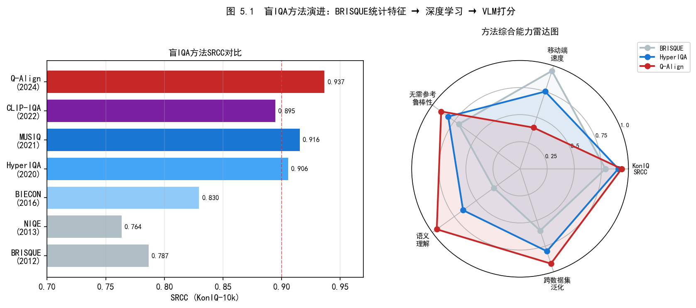
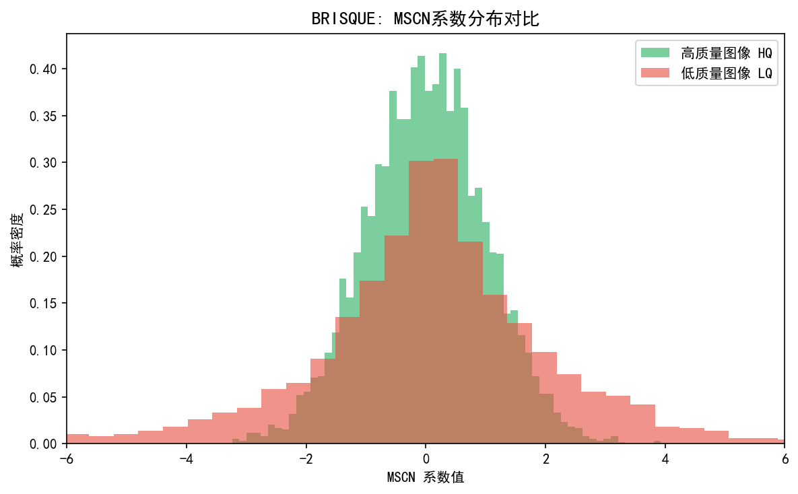
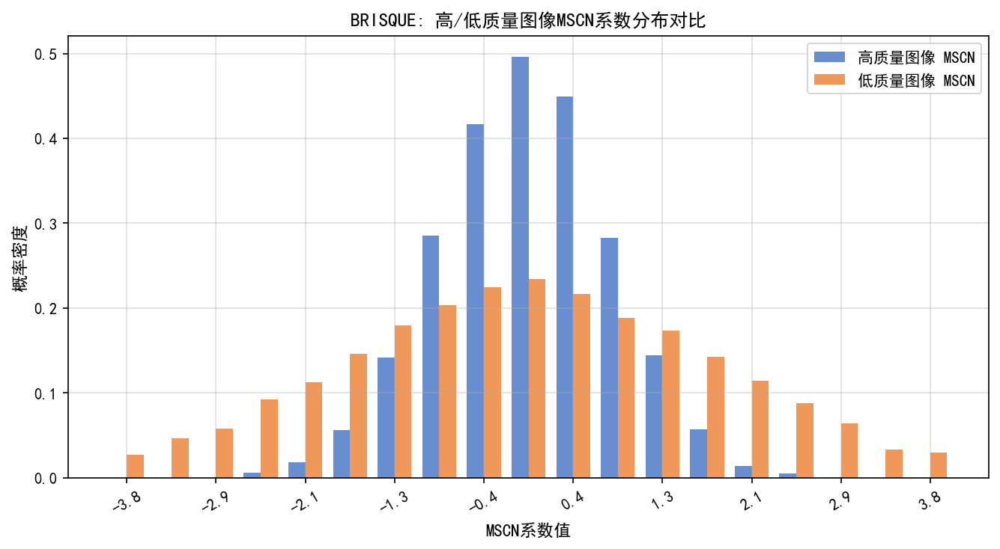
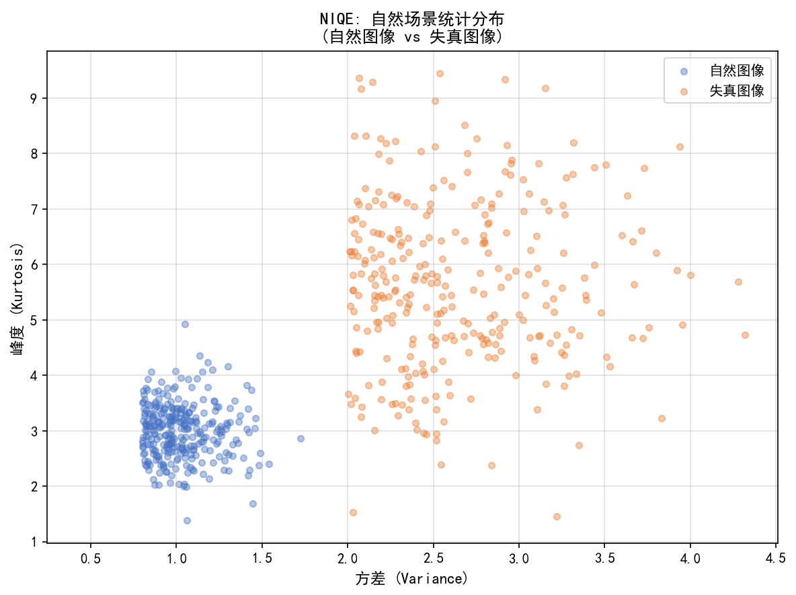
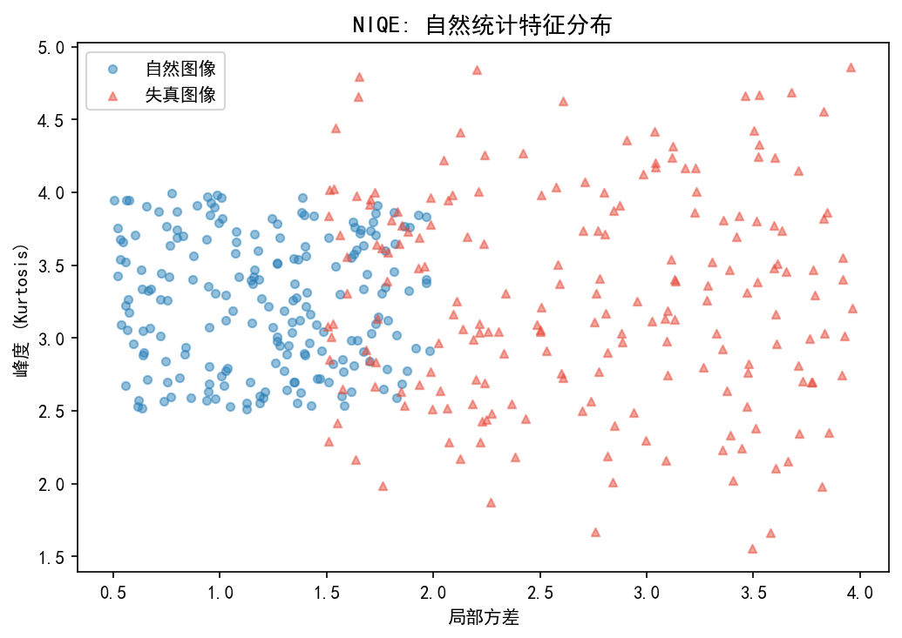
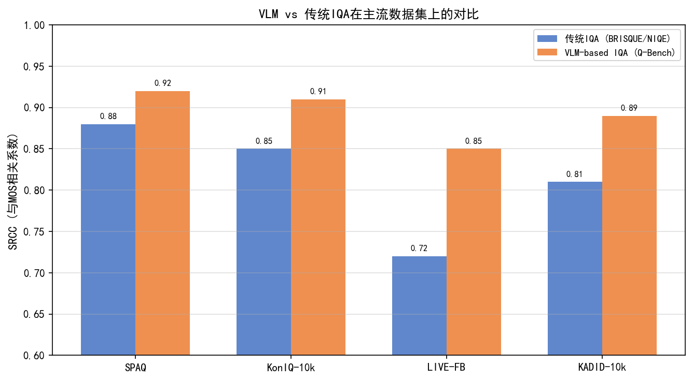

# 第四卷第05章：盲图像质量评估（Blind IQA）

> **定位：** 从第三卷迁入，与第四卷第04章（感知IQA）、第四卷第08章（IQA系统工程）构成IQA连续模块。覆盖无参考图像质量评估的DL方法（BRISQUE→MUSIQ→Q-Align）。
> **前置章节：** 第四卷第04章（感知图像质量评估）、第三卷第01章（深度学习ISP综述）
> **读者路径：** 深度学习研究员、IQA算法工程师

---

## §1 原理 (Theory)

### 盲图像质量评估问题

量产里不存在"参考图像"——传送带上的手机拍出来的照片没有DSLR配对版本给你比。这就是为什么盲IQA（Blind IQA，无参考图像质量评估）比全参考PSNR/SSIM在工程场景里更重要：模型必须只看一张图就给出质量判断，就像工厂质检员一样。

IQA根据参考信息的可用性分三档，理解这个分类有助于选工具：

- **全参考 IQA（FR-IQA）**：有配对参考图（如PSNR、SSIM **[1]**、LPIPS）——研发阶段测算法，生产上用不了
- **降参考 IQA（RR-IQA）**：有参考图的统计特征——过渡方案，实际很少用
- **无参考/盲 IQA（NR-IQA / Blind IQA）**：只有待评图像——量产质控、在线过滤、用户体验评估的主战场

盲IQA模型的目标是预测人类的平均意见分数（MOS，Mean Opinion Score），这个目标本身就决定了它的难度：人类感知是主观的、内容相关的、随场景变化的，用统计特征或神经网络去逼近这个目标，必然有局限。

### 经典无参考方法

BRISQUE（Mittal等，2012）的出发点是一个朴素但有效的观察：**自然图像有规律可循**。干净的自然图像，其MSCN（均值减去对比度归一化）系数服从广义高斯分布；失真会打破这个规律。BRISQUE就是用这个统计规律的偏离程度来衡量质量——没有训练"什么是好图"，只是检测"偏离自然统计有多远"。

具体做法：对MSCN系数及其成对乘积拟合GGD，产生36维特征向量，再用SVR回归到MOS值。

MSCN 计算：
```
I_hat(i,j) = I(i,j) - μ(i,j)
I_mscn(i,j) = I_hat(i,j) / (σ(i,j) + C)
```
其中 μ 和 σ 是用 7×7 高斯窗口估计的局部均值和标准差，C = 1 为稳定性常数。

BRISQUE 速度快（CPU 上 < 5 ms **[1]**），且不需要深度网络的训练数据，适合作为轻量级的第一阶段过滤器。

NIQE（Mittal等，2013）比BRISQUE更彻底：完全无监督，不需要MOS标注。它从自然无失真图像语料库拟合一个多元高斯模型，然后用马氏距离衡量测试图像与这个"自然分布"的偏差。越偏离，质量越差。这个设定的优点是不依赖任何主观标注，可以直接用于新场景；缺点是它只检测"是否自然"，对某些人工增强（锐化过度、饱和度过高）可能给出错误评分——因为这些增强图像看起来"不自然"但用户可能觉得好看。

### 深度学习 IQA 演进

NIMA（Talebi & Milanfar，2018）解决了一个被早期深度方法忽视的问题：人类对同一张图片的评分**不是一个点，是一个分布**。有人打8分，有人打3分，预测MOS均值会丢掉这个信息。NIMA预测完整的评分分布（10类直方图），用推土机距离（EMD）作为损失：损失函数为预测分布与真实评分分布之间的推土机距离 (EMD, Earth Mover's Distance)：

```
EMD(p, q) = sqrt( (1/r) · Σ_k |CDF_p(k) - CDF_q(k)|^r )
```

其中 r = 2。这比均值分数的 MSE 更具信息量，因为它捕捉了人类意见的方差。预测分布的均值作为最终质量分数。

HyperIQA（Su等，2020）触碰了IQA里一个本质问题：**同等程度的噪声，在纹理区域比在平滑天空里更不显眼**。用固定权重的全局模型评质量会把这个内容相关性平均掉。该网络使用超网络 (Hyper-network)，由全局内容理解模块生成内容感知的局部质量预测权重。ResNet 骨干提取多尺度特征；超网络头部为局部质量预测器生成滤波器以对局部图像块评分；局部图像块分数聚合为全局 MOS 预测值。

MUSIQ（Ke等，2021）解决了ViT的固定分辨率限制——质量伪影是多尺度的（块状效应是低频，噪声是高频），单一分辨率会漏掉信息。MUSIQ用空间+尺度嵌入允许灵活输入尺寸，是IQA中Transformer路线的代表性工作。

CLIP-IQA（Wang等，AAAI 2023）走的是另一条路：不用任何IQA专用训练，直接利用CLIP的零样本能力。质量分数计算：

```
score = softmax( CLIP(image) · [CLIP("good photo"), CLIP("bad photo")] )[0]
```

图像嵌入与两个反义文本提示之间的余弦相似度提供了质量信号，无需任何 IQA 专用训练。CLIP-IQA+ 在 IQA 数据集上对模型进行微调以提升性能，但零样本版本在多个基准上已能取得有竞争力的结果。

### 生成模型质量评估：FID

**FID（弗雷歇初始距离，Fréchet Inception Distance，Heusel 等人，2017）** 是评估生成图像质量的标准分布级度量指标，广泛用于 GAN、扩散模型（Diffusion Model）等生成模型。与上述逐图像质量分数不同，FID 衡量生成图像集合与真实图像集合在特征空间中的**分布差距**：

$$\text{FID} = \| \mu_r - \mu_g \|^2 + \text{Tr}\left( \Sigma_r + \Sigma_g - 2\left(\Sigma_r^{1/2} \Sigma_g \Sigma_r^{1/2}\right)^{1/2} \right)$$

其中 $(\mu_r, \Sigma_r)$ 和 $(\mu_g, \Sigma_g)$ 分别是真实图像和生成图像在 Inception-v3 网络 pool3 层特征的均值和协方差矩阵。**FID 越低，生成质量越高**（分布重叠度更大）。

**ISP 相关应用：**
- **生成增强 ISP 评估：** 当 ISP 流水线包含生成模块（如超分扩散模型、生成式去噪）时，FID 用于评估输出图像集的整体真实感和分布一致性，补充逐图像 PSNR/SSIM 指标
- **合成训练数据质量验证：** ISP 模型训练常使用合成 RAW-RGB 对；FID 可量化合成数据集与真实相机输出的分布差距，指导数据增强策略
- **人像/夜景生成模式评测：** 商用手机的 AI 人像重建和夜景生成输出，需用 FID + MOS 双重评估而非单纯 PSNR

**注意事项：** FID 需要足够大的样本量（通常 ≥ 5,000 张图像）才能产生稳定估计；小样本下 FID 方差较大，不适合逐场景的单图质量判断，仅适合算法/模型级别的横向比较。

### 训练数据集

| 数据集 | 失真类型 | 图像数量 | MOS 范围 | 说明 |
|--------|---------|---------|---------|------|
| LIVE | 5 种合成失真 | 779 | 0–100 | 广泛使用的基线 |
| TID2013 | 24 种失真 | 3,000 | 0–9 | 最多样化的失真 |
| KADID-10k | 25 种失真 | 10,125 | 1–5 | 最大的合成数据集 |
| KonIQ-10k | 真实场景 | 10,073 | 1–5 | 真实网络图像 |
| SPAQ | 真实场景（移动端）| 11,125 | 0–100 | 智能手机相机输出 |

对于 ISP 应用，SPAQ 和 KonIQ-10k 比合成数据集更相关，因为它们包含真实世界的移动相机伪影。

### 开源工具库与实现资源

实际工程中，不必从头实现上述方法。以下开源库提供了工业级的 NR-IQA 实现：

#### IQA-PyTorch

**IQA-PyTorch**（https://github.com/chaofengc/IQA-PyTorch）是目前最全面的图像质量评估开源库，覆盖 FR-IQA 和 NR-IQA 共 40+ 种方法，统一 API 设计，支持 PyTorch 生态：

```python
import pyiqa

# 创建评估模型（NR-IQA 无需参考图像）
niqe_model   = pyiqa.create_metric('niqe')
brisque_model = pyiqa.create_metric('brisque')
nima_model   = pyiqa.create_metric('nima')
clipiqa_model = pyiqa.create_metric('clipiqa')
musiq_model  = pyiqa.create_metric('musiq')

# 对单张图像评分
import torch
from PIL import Image
import torchvision.transforms as T

img = T.ToTensor()(Image.open('test.jpg')).unsqueeze(0)  # [1,3,H,W]

score_brisque = brisque_model(img)   # 越低越好（默认方向）
score_nima    = nima_model(img)      # 越高越好
score_clipiqa = clipiqa_model(img)   # 越高越好

# 批量评分（返回形状 [B] 的 Tensor）
scores = musiq_model(img)
```

IQA-PyTorch 支持的主要 NR-IQA 方法：

| 方法 | 类型 | 输入 | 说明 |
|------|------|------|------|
| BRISQUE | 手工特征 | NR | 最快，适合在线过滤 |
| NIQE | 手工特征（无监督）| NR | 无需标注，可作为基线 |
| ILNIQE | 手工特征 | NR | NIQE 的改进版本 |
| NIMA | CNN（ResNet/InceptionV3） | NR | 评分分布预测 |
| HyperIQA | CNN + 超网络 | NR | 内容感知质量预测 |
| MUSIQ | Vision Transformer | NR | 多尺度，支持任意分辨率 |
| CLIP-IQA / CLIP-IQA+ | CLIP（VLP）| NR | 零样本或少样本 |
| Q-Bench / Q-Instruct | LLaVA-style MLLM | NR | 多模态大模型评估 |
| DBCNN | CNN（双流）| NR | 合成+真实失真兼顾 |
| PaQ-2-PiQ | CNN | NR | 局部到全局质量感知 |

库的统一评分方向约定（`lower_better` 标志）使得跨方法比较无需记忆每个方法的分数方向。

#### Q-Bench / Q-Instruct（多模态大模型 IQA）

Q-Bench 系列（https://github.com/Q-Future/Q-Bench）将 IQA 提升为基于多模态大模型（MLLM）的开放式问答任务：

```python
# Q-Instruct 支持自然语言质量描述
# 输入："请描述这张图片的质量问题"
# 输出："该图片存在明显的运动模糊，右侧区域噪声较高，色彩偏暖"
```

这对 ISP 调参特别有价值：不仅得到质量分数，还能得到**可解释的质量描述**，帮助工程师定位问题所在。已集成到 IQA-PyTorch 中（`pyiqa.create_metric('qinstruct')`）。

#### 其他常用开源资源

| 工具 | 地址 | 特点 |
|------|------|------|
| **piq** | https://github.com/photosynthesis-team/piq | PyTorch，FR+NR，轻量 |
| **image-quality** | https://github.com/ocampor/image-quality | Python，BRISQUE/NIQE，易用 |
| **scikit-image** | https://scikit-image.org/ | SSIM/PSNR，科研标准实现 |
| **MATLAB IQA Toolbox** | MathWorks File Exchange | BRISQUE/NIQE MATLAB官方实现 |

#### ISP 工程师推荐工作流

```
快速筛选（CPU，< 5ms）：BRISQUE / NIQE
     ↓ 模糊图像
深度评估（GPU，< 50ms）：HyperIQA / CLIP-IQA+
     ↓ 分数接近阈值
人工复审 + Q-Instruct 质量描述
     ↓ 标注收集
周期性微调 NR 模型（§2 标定）
```

---

### 相关性指标

模型性能通过与人类 MOS 的相关性来衡量：

- **SRCC（斯皮尔曼秩相关系数，Spearman Rank Correlation Coefficient）**：衡量预测分数与 MOS 之间的单调相关性。范围 [-1, 1]，越高越好。对异常值鲁棒。
- **PLCC（皮尔逊线性相关系数，Pearson Linear Correlation Coefficient）**：在逻辑非线性映射后衡量线性相关性。范围 [-1, 1]，越高越好。
- **KRCC（肯德尔秩相关系数，Kendall Rank Correlation Coefficient）**：衡量成对排序的一致性。比 SRCC 更保守，计算成本高。

对于 ISP 质量门控，SRCC 是最具操作相关性的指标，因为部署用例是对输出进行排序或设置阈值。

---

## §2 标定 (Calibration)

### 针对目标分布的微调

在通用数据集上训练的 NR-IQA 模型，应用于特定相机或 ISP 流水线时会出现域偏移。标定程序：

1. **采集标定集**：从目标 ISP 流水线收集 200-500 张涵盖预期质量范围的图像（不同光照、场景、ISP 参数设置）。
2. **收集 MOS 标注**：通过成对比较或绝对类别评分协议，让 20 名以上人工评分者对图像进行评分。通过 Bradley-Terry 模型或简单均值进行聚合。
3. **微调骨干网络**：从预训练的 NR-IQA 模型（NIMA 或 HyperIQA）初始化，冻结骨干，仅在标定集上微调回归头。若标定集足够大（>500 张），以低学习率（1e-5）微调全部层。
4. **验证 SRCC**：在来自同一分布的保留测试集上进行验证。

### 域自适应：合成到真实

在合成失真数据集（LIVE、TID2013）上训练的模型，往往在真实 ISP 伪影上失效，因为 ISP 退化（色偏、镜头阴影、果冻效应）超出了训练分布。可选方案：

- **无监督域自适应**：使用最大均值差异 (MMD, Maximum Mean Discrepancy) 损失对齐源（合成）域与目标（真实 ISP）域的特征分布。
- **自监督预训练**：在真实 ISP 图像上使用对比目标（如 DINO）进行预训练，然后在少量标注集上微调。
- **课程学习 (Curriculum Learning)**：先在合成失真上训练，逐渐引入真实 ISP 伪影。

---

## §3 调参 (Tuning)

### 通过/拒绝门控的阈值选择

NR 分数必须映射为二元决策（接受/拒绝），以用作 ISP 输出门控。阈值选择涉及精确率-召回率权衡：

- **低阈值（宽松）**：更多图像通过。误接受率升高。适用于重拍照片成本高的场景（如医学影像）。
- **高阈值（严格）**：更多图像被拒绝。误拒绝率升高。适用于图像质量至关重要的场景（如量产质量控制）。

设置阈值时，在标定集上以真实 MOS ≥ 3.5 作为"良好质量"标签绘制 ROC 曲线。通过 F1 分数或代价加权准则选择操作点。

### 集成方案：速度-精度平衡

实用的 ISP 质量门控采用两阶段集成方案：

1. **第一阶段 — BRISQUE（快速过滤器）**：在 CPU 上 < 5ms 内对所有图像评分。拒绝 BRISQUE 分数 > threshold_reject（明显低质量）的图像。通过分数 < threshold_accept（明显高质量）的图像。将模糊图像发送至第二阶段。
2. **第二阶段 — 深度 NR 模型**：仅对模糊图像运行深度模型（如 HyperIQA 或 CLIP-IQA）。这将平均推理时间降低至接近第一阶段的成本，同时在困难案例上保持深度模型的精度。

---

## §4 指标局限与误用（Metric Pitfalls）

### 域偏移

**描述**：在合成失真（JPEG、加性噪声、模糊）上训练的 NR 模型，对真实 ISP 伪影（镜头耀斑、彩色摩尔纹、色差、果冻效应偏移）的评分错误。模型的特征空间在训练期间从未见过这些模式，因此要么忽略它们，要么将它们映射到错误的质量预测。

**缓解措施**：在真实 ISP 数据上进行微调（§2 标定）。随 ISP 流水线变化监控 SRCC 漂移；当漂移超过阈值时（如 SRCC 下降 > 0.05）重新触发微调。

### 语义泄漏

**描述**：深度 NR 模型可能根据场景内容而非图像质量进行评分。例如，模型可能对日落图像给出高分，因为训练集中的日落图像收到了高 MOS 评分，而与图像质量无关。这是一种快捷学习 (Shortcut Learning)。

**缓解措施**：在语义分层测试集上评估模型：计算每个场景类别的 SRCC，验证质量排名在场景类型间保持一致。使用场景去偏训练 (Scene-debiased Training)：对训练批次进行采样，使每个场景类别的贡献相等。

---

## §5 VLM-IQA — 多模态大模型驱动的图像质量评估

### 从回归到视觉问答

前几节的 NR-IQA 方法（BRISQUE、NIMA、HyperIQA、MUSIQ、CLIP-IQA）均将质量评估建模为**标量回归任务**：输入图像，输出一个与 MOS 对齐的浮点分数。这类方法有三个明显局限：分数无法说明质量下降的原因（是噪声、模糊还是色差）；单一标量无法区分"整体质量偏低"与"局部区域有严重伪影"；每个方法都需要在 IQA 标注数据集上专门训练。

多模态大模型（MLLM, Multi-modal Large Language Model）将质量评估改造为**视觉语言问答（VQA, Visual Question Answering）任务**，在统一的语言空间内回答关于图像质量的开放式问题。

### Q-Bench（ICLR 2024）

**Q-Bench**（Wu 等人，ICLR 2024）系统性地测评了 LLaVA 等 MLLM 在低层次视觉感知任务上的能力边界。

当时的 MLLM（LLaVA-7B、InstructBLIP 等）具备一般性视觉问答能力，但在低层次质量感知上存在明显短板。例如对"这张照片是否模糊？"这类简单的 Yes/No 问题，预训练 MLLM 的准确率仅 62–68%，不如专用的 BRISQUE 过滤器。

**Yes/No 问题范式：** Q-Bench 将低层次 IQA 任务分解为三类问题形式：

| 问题类型 | 示例 | 评估目标 |
|---------|------|---------|
| **二元判断（Yes/No）** | "这张图片噪声严重吗？" | 对单一失真维度的感知 |
| **质量描述（开放式）** | "请描述这张图片的质量问题" | 综合低层次感知与语言描述 |
| **比较判断** | "哪张图片质量更好？" | 排序一致性 |

**Q-Instruct 数据集：** 为弥补 MLLM 的低层次感知短板，Q-Bench 构建了 Q-Instruct：200K+ 图像-指令对，每对包含图像、质量问题和详细答案 **[10]**。在 Q-Instruct 上微调后，LLaVA-7B 的 Yes/No 准确率提升至 83%+ **[10]**。

**工程价值：** 对于 ISP 调参工程师，Q-Bench 提供了一种新的诊断路径——不再是抽象分数，而是可操作的失真描述：

```
输入图像 → MLLM → "图像存在明显运动模糊，右侧区域噪声较高，色温偏冷"
                 → 具体的失真类型定位，指导 ISP 参数调整方向
```

### Q-Align（ICML 2024）

**Q-Align**（Wu 等人，ICML 2024）针对 Q-Bench 未解决的问题：如何让 MLLM **输出可与 MOS 量化对比的连续质量分数**。

MLLM 的 next-token 预测头天然输出词汇表上的 softmax 概率分布。Q-Align 将 MOS 的 5 级评分尺度映射为离散 token，**利用这 5 个 token 的输出概率加权求和作为连续质量分数**：

$$\text{score} = \sum_{l \in \mathcal{L}} p(l) \cdot v(l)$$

其中 $\mathcal{L} = \{\text{bad, poor, fair, good, excellent}\}$，$v(l)$ 为每个等级对应的数值（1–5），$p(l)$ 为 MLLM 对该 token 的输出概率。该方法无需在模型上附加独立的回归头，质量打分从语言建模能力中自然涌现。

**对齐策略：** Q-Align 在 IQA/VQA/AVA 混合数据集上对 LLaVA 进行微调，让模型"学会"用上述 5 级词汇表达质量判断，同时不破坏其原有的指令跟随能力。

**性能：** Q-Align 在多个基准上超越了专用 NR-IQA 方法：

| 基准 | HyperIQA SRCC | MUSIQ SRCC | CLIP-IQA+ SRCC | **Q-Align SRCC** |
|-----|-------------|-----------|---------------|----------------|
| KonIQ-10k | 0.917 **[4]** | 0.916 **[5]** | 0.895 **[6]** | **0.940** **[11]** |
| SPAQ | 0.911 **[4]** | 0.918 **[5]** | — | **0.941** **[11]** |
| LIVE-FB | 0.859 **[4]** | 0.661 **[5]** | — | **0.888** **[11]** |

**统一多任务框架：** Q-Align 的同一模型框架同时支持图像质量评估（IQA）、视频质量评估（VQA）和美学评估（AAA），通过不同的文本提示切换任务，无需为每个任务单独设计模型架构。

### VLM-IQA 在 ISP 工程中的定位

| 方法类别 | 典型代表 | 优势 | 局限 | ISP 使用场景 |
|---------|---------|------|------|------------|
| 手工特征 NR | BRISQUE, NIQE | CPU < 5ms，无需 GPU | 泛化弱 | 在线第一阶段过滤 |
| 深度 CNN/ViT NR | HyperIQA, MUSIQ | 高精度，跨域泛化好 | 需 GPU | 离线质量评测 |
| CLIP-based NR | CLIP-IQA+ | 零样本，灵活 | 语言对齐不精确 | 快速探索型评测 |
| 自监督 NR | ARNIQA | 无需 MOS 标注，适应新失真 | 真实场景泛化弱 | 新型失真适应、数据稀缺场景 |
| 语义引导 NR | **TOPIQ** | **SOTA 精度 + 快速推理（~50ms）** | 合成失真数据集未覆盖 | **A/B 测试裁判、离线批量评测** |
| **VLM-IQA** | **Q-Bench, Q-Align** | **可解释描述 + 高精度分数** | **推理慢（> 500ms）** | **调参诊断、质量报告生成** |

> **衔接说明：** Q-Bench 的多模态 IQA benchmark 方法论直接对应 **第四卷第08章（IQA 工程化系统）** 中的自动化测试流水线——工程流水线可调用 Q-Align 生成批量质量报告，辅助或替代传统人工主观评测环节。

---

## §6 评测 (Evaluation)

### 已发表结果

标准基准上的 SRCC 和 PLCC（越高越好）：

注：LIVE = LIVE IQA Database（合成失真）；LIVE-FB = LIVE In the Wild Facebook Dataset（真实场景）；两者为**不同数据集**。

| 方法 | LIVE(合成) SRCC | TID2013 SRCC | KADID SRCC | KonIQ SRCC | LIVE-FB SRCC | 年份 |
|------|----------------|-------------|-----------|-----------|-------------|------|
| BRISQUE | 0.939 **[1]** | 0.571 **[1]** | 0.528 **[1]** | 0.665 **[1]** | — | 2012 |
| NIQE | 0.908 **[2]** | 0.322 **[2]** | 0.374 **[2]** | 0.531 **[2]** | — | 2013 |
| NIMA | 0.919 **[3]** | 0.564 **[3]** | — | — | — | 2018 |
| HyperIQA | 0.962 **[4]** | 0.840 **[4]** | 0.845 **[4]** | 0.917 **[4]** | 0.859 **[4]** | 2020 |
| MUSIQ | 0.911 **[5]** | 0.773 **[5]** | 0.875 **[5]** | 0.916 **[5]** | 0.661 **[5]** | 2021 |
| CLIP-IQA+ | 0.953 **[6]** | 0.864 **[6]** | 0.894 **[6]** | 0.895 **[6]** | — | 2022 |
| Q-Align | — | — | — | **0.940** **[11]** | **0.888** **[11]** | 2024 |
| TOPIQ | — | — | — | **0.942** **[13]** | 0.876 **[13]** | 2024 |

> *注：Q-Align 在 LIVE/TID2013 等合成失真数据集上官方未公开结果；原因是其训练集包含 KonIQ-10k 和 SPAQ 等真实失真数据库，在合成失真数据集上评测存在分布不匹配，官方选择不报告这些数字。*

关键观察：
- BRISQUE 在 LIVE（单一失真类型）上表现良好，但在多失真（TID2013）和真实（KonIQ）数据集上急剧退化。
- 深度模型（HyperIQA、MUSIQ、CLIP-IQA+）在不同数据集类型间的泛化能力远更强。
- CLIP-IQA+ 无需针对特定数据集的架构设计即可实现强大的跨数据集性能。
- Q-Align（ICML 2024）在真实数据集（KonIQ、SPAQ）上超越所有专用 NR-IQA 方法，且同时具备可解释的质量描述能力。
- TOPIQ（IEEE TIP 2024）在 KonIQ-10k 上 SRCC 达 0.942，微超 Q-Align；推理速度（~50ms）远快于 Q-Align（~500ms），是精度与速度的最优平衡点。

### 跨数据集泛化

ISP 部署最重要的评测是**跨数据集泛化**：在一个数据集上训练，在另一个上评估。对单一数据集标注协议过拟合的模型在量产中会失效。评测标准：

- 在 KADID-10k（合成）上训练，在 KonIQ-10k（真实）上测试。SRCC < 0.6 表示泛化能力差。
- 在 SPAQ（移动端）上训练，在相机专用拍摄上测试。这是 ISP 部署最现实的代理评测。

---

## §7 代码 (Code)

以下给出 BRISQUE 快速推理和 MSCN 特征可视化的最小可运行示例。完整演练（含 Q-Align 调用和 SRCC 基准测试）参见配套笔记本 `ch_blind_iqa_code.ipynb`。

```python
"""
ch05 盲IQA 快速验证脚本
依赖：pip install image-quality scikit-image scipy numpy
"""
import numpy as np
from scipy.stats import spearmanr
from skimage import io, color
from skimage.filters import gaussian


# ── BRISQUE 评分 ──────────────────────────────────────────────────────────────
def brisque_score(img_path: str) -> float:
    """使用 image-quality 库计算 BRISQUE 分数（越低越好，0-100）。"""
    try:
        from imquality import brisque
        img = io.imread(img_path)
        return brisque.score(img)
    except ImportError:
        raise ImportError("pip install image-quality")


# ── MSCN 系数可视化（BRISQUE 核心统计量）────────────────────────────────────
def compute_mscn(img: np.ndarray, C: float = 1e-6) -> np.ndarray:
    """计算 MSCN（Mean-Subtracted Contrast-Normalized）系数。

    BRISQUE 假设自然图像的 MSCN 系数服从 GGD（广义高斯分布）；
    失真图像会偏离 GGD，分布形状参数 α 和 σ 可量化失真程度。

    Args:
        img: 灰度图 float32 [0,1]
        C: 数值稳定常数
    Returns:
        MSCN 系数图，值域大约在 [-3, 3]
    """
    mu    = gaussian(img, sigma=7.0 / 6.0)
    sigma = np.sqrt(np.abs(gaussian(img ** 2, sigma=7.0 / 6.0) - mu ** 2))
    return (img - mu) / (sigma + C)


# ── 批量评分并计算 SRCC ────────────────────────────────────────────────────────
def batch_brisque_srcc(img_paths: list, mos_scores: list) -> float:
    """计算 BRISQUE 评分与人工 MOS 分的 Spearman 相关系数。"""
    brisque_scores = [brisque_score(p) for p in img_paths]
    srcc, _ = spearmanr(brisque_scores, mos_scores)
    return srcc


if __name__ == "__main__":
    # 示例：对同一张图施加不同强度的高斯噪声，观察 MSCN 分布变化
    ref = io.imread("lena_512.png")
    gray = color.rgb2gray(ref).astype(np.float32)

    import matplotlib.pyplot as plt
    fig, axes = plt.subplots(1, 3, figsize=(12, 4))
    for ax, sigma in zip(axes, [0.0, 0.05, 0.15]):
        noisy = np.clip(gray + np.random.normal(0, sigma, gray.shape), 0, 1)
        mscn  = compute_mscn(noisy)
        ax.hist(mscn.ravel(), bins=100, density=True, alpha=0.7)
        ax.set_title(f"σ_noise={sigma:.2f}\nMSCN range [{mscn.min():.1f}, {mscn.max():.1f}]")
        ax.set_xlim(-4, 4)
    plt.suptitle("MSCN 系数分布随噪声强度的变化（越噪越宽尾）")
    plt.tight_layout()
    plt.savefig("/tmp/mscn_distribution.png", dpi=120)
    print("MSCN 分布图已保存至 /tmp/mscn_distribution.png")
    # 观察：干净图像 MSCN 近似零均值窄 GGD；噪声增大后分布变宽、重尾
```

> **工程提示：** BRISQUE CPU 推理 < 5ms（单张 720p），适合作为在线实时质量门控；若需更高准确率的离线批量评估，推荐 HyperIQA 或 TOPIQ（参见本章 §14 ISP 工程部署推荐配置表）。

---

---

## §8 术语表（Glossary）

**盲图像质量评估（Blind IQA / NR-IQA）**
在无参考图像的条件下，仅从待评测图像本身预测人类平均意见分数（MOS）的任务。与全参考 IQA（FR-IQA，如 PSNR/SSIM）相对；在量产 ISP 中最具实际价值，因为"完美参考图"通常不存在。主要挑战：无监督情况下模拟人类感知，并跨域泛化到目标传感器/ISP 产生的真实伪影。

**BRISQUE（盲无参考图像空间质量评估器）**
Mittal 等（IEEE TIP 2012）提出的手工特征 NR-IQA 方法。提取均值减去对比度归一化（MSCN）系数，并在两个尺度上分别拟合广义高斯分布（GGD）和非对称广义高斯分布（AGGD），共提取 36 维特征向量；SVR 回归到 MOS。CPU < 5 ms，适合在线第一阶段快速过滤。LIVE SRCC=0.939。

**MSCN（均值减去对比度归一化）**
$\hat{I}(i,j) = (I(i,j) - \mu(i,j))/(\sigma(i,j)+C)$，其中均值 $\mu$ 和标准差 $\sigma$ 由 7×7 高斯窗口估计，稳定常数 $C$ 取值与输入值域有关：**图像归一化至 [0,1] 时 $C \approx 1/255 \approx 0.0039$；图像在 [0,255] 范围时 $C=1$**（Mittal et al. 2012 原论文默认后者）。MSCN 系数将图像归一化到局部统计均匀域，使自然图像的统计特性（广义高斯分布）在失真下发生可检测的偏离。

**NIMA（神经图像评估）**
Talebi & Milanfar（TIP 2018）在 AVA/TID 上微调 InceptionV3/MobileNet，预测人类评分的**完整分布**（10类直方图），而非单一均值。损失函数为 Earth Mover's Distance（EMD）：$L = \sqrt{(1/K)\sum_k |CDF_p(k) - CDF_{\hat{p}}(k)|^2}$，其中 $r=2$（原论文明确选择，以加重较大偏差的惩罚）。预测分布均值作为最终质量分数。

**HyperIQA（超网络内容感知 IQA）**
Su 等（CVPR 2020）解决"失真可感知性依赖于图像内容"问题：超网络根据全局内容理解动态生成局部质量预测器的权重，每个局部图像块的质量评分聚合为全局 MOS。在 KonIQ-10k 上 SRCC=0.917，是跨数据集泛化性最强的经典模型之一。

**MUSIQ（多尺度图像质量 Transformer）**
Ke 等（ICCV 2021）使用 ViT 骨干，引入空间和尺度嵌入支持任意分辨率输入（无固定输入大小限制）。多尺度图像块同时输入，捕捉不同频率的质量伪影（低频块状、高频噪声）。KonIQ SRCC=0.916，首个在 IQA 中将 Transformer 推向 SOTA 的工作。

**CLIP-IQA**
Wang 等（NeurIPS 2022）利用 CLIP 对比语言-图像预训练的零样本能力做 NR-IQA：计算图像嵌入与反义文本对（"good photo" vs "bad photo"）之间的余弦相似度作为质量分数，无需 IQA 专用训练。CLIP-IQA+（微调版）在 KonIQ 上 SRCC=0.895。代表 VLP 大模型 zero-shot 迁移到 IQA 的范式。

**SRCC（斯皮尔曼秩相关系数）**
衡量预测分数与 MOS 之间的单调一致性（$[-1,1]$，越高越好），对异常值鲁棒，是 IQA 论文最常报告的主指标。ISP 质量门控中的实际意义：SRCC 越高，模型对图像质量的排序与人类感知越一致，通过/拒绝阈值的设置越可靠。

**Q-Bench（多模态大模型低层次视觉基准）**
Wu 等（ICLR 2024）提出，系统测评 LLaVA 等 MLLM 在低层次视觉感知上的能力，发现预训练 MLLM 对简单质量 Yes/No 问题的准确率仅 62–68%。构建了 Q-Instruct（200K+ 图像-指令对），微调后准确率提升至 83%+。将 IQA 改造为开放式 VQA 范式，输出可解释的质量描述而非单一分数。代码：https://github.com/Q-Future/Q-Bench。

**Q-Align（MLLM 质量打分对齐方法）**
Wu 等（ICML 2024）提出，利用 MLLM 的 next-token 概率输出做连续质量打分：将 MOS 5 级量表（bad/poor/fair/good/excellent）映射为词汇表 token，以 $\text{score} = \sum p(l) \cdot v(l)$ 加权求和得到连续分数，无需附加独立回归头。KonIQ-10k SRCC=0.940，SPAQ SRCC=0.941，超越所有专用 NR-IQA 方法。同一框架支持 IQA/VQA/美学评估三任务。代码：https://github.com/Q-Future/Q-Align。

---


---

> **工程师手记：盲参考 IQA 在手机实拍场景的工程局限**
>
> **BRISQUE/NIQE vs 深度 NR-IQA 的现场对比：** 在实验室标准化场景（均匀照明、静态标板）下，BRISQUE 与深度模型（MUSIQ、HyperIQA）的 SRCC 相差仅约 0.05；但部署到野外手机实拍数据集后，差距扩大到 0.15～0.25。根本原因在于 BRISQUE 基于 MSCN 系数的自然场景统计假设，对夜景长曝光、动态模糊、HDR 色调映射后的非高斯噪声分布失效；NIQE 同理，其基于 MVG 拟合的假设在超广角镜头几何畸变矫正后的图像上产生虚假质量惩罚。深度模型虽然泛化性更好，但推理延迟在高通 8 Gen 2 上约 18 ms/帧，难以嵌入实时 preview 流水线，通常只用于离线质量评测报告。
>
> **场景内容偏差问题：** IQA 模型普遍存在场景内容偏差：对人脸、天空、绿植等训练集高频场景预测准确，对工业零件、文字、低对比度雾景等长尾场景误差显著增大，MOS 预测误差可达 ±1.2（5 分制）。工程实践中须对目标应用场景（如监控摄像、医疗内窥、车载前视）单独构建评测集，定期用新采集的实拍数据对模型进行 domain adaptation 微调；每季度至少验证一次模型在新机型传感器数据上的迁移性能，防止隐性退化。
>
> **实验室精度 vs 现场部署差距：** 学术 benchmark（LIVE、CSIQ、TID2013）上 SRCC > 0.9 的模型，在实际手机量产图像上往往跌至 0.65～0.75。差距来源主要有三：①训练集失真类型以传统压缩/高斯噪声为主，缺少 AI 降噪涂抹感、HDR 晕染等新型失真；②量产图像经过多级后处理（美颜、锐化、饱和度增强），分布与训练集偏离；③评测图像来自单一设备，无法覆盖不同制程批次传感器的固定噪声差异。建议建立"实验室精度–现场精度"双轨追踪机制，当两者 SRCC 差值超过 0.1 时触发模型重训警报。
>
> *参考：Mittal et al., "No-Reference Image Quality Assessment in the Spatial Domain," IEEE TIP 2012；Zhang et al., "Blind Image Quality Assessment Using a General Regression Neural Network," IEEE TNN 2011；Ke et al., "MUSIQ: Multi-scale Image Quality Transformer," ICCV 2021*

## 插图



*图1. 盲参考IQA方法对比（图片来源：作者自绘）*



*图2. BRISQUE特征分布（图片来源：作者自绘）*



*图3. BRISQUE特征提取示意（图片来源：作者自绘）*



*图4. NIQE自然图像质量评价模型（图片来源：作者自绘）*



*图5. NIQE统计特征分布（图片来源：作者自绘）*



*图6. 基于视觉语言模型的IQA框架（图片来源：作者自绘）*

---

## 习题

**练习 1（理解）**
BRISQUE（Blind/Referenceless Image Spatial Quality Evaluator）基于自然场景统计（NSS）特征：自然图像经 MSCN（均值减法归一化）处理后的系数服从广义高斯分布（GGD），而失真图像会偏离这一分布。请解释：（1）MSCN 变换的数学定义是什么，为什么归一化后的系数分布能够区分有无失真？（2）BRISQUE 与 NIQE 在特征提取上有何本质区别（有监督 vs. 无监督）？（3）在 ISP 调参场景中，使用 BRISQUE 作为 NR-IQA 指标有哪些局限性？

**练习 2（分析）**
NR-IQA（无参考）与 FR-IQA（全参考）适用于不同的工程场景。请分析：（1）在量产 ISP 自动化测试流水线中，为什么有时必须使用 NR-IQA 而不能使用 FR-IQA？（2）Q-Align（2024，基于 LLaVA-7B）和传统 NR-IQA（BRISQUE/HyperIQA）在部署延迟上有何差异，对工程选型有何影响？（3）如果要在手机端实时运行 IQA（< 10ms 延迟），哪类方法可行？

**练习 3（工程设计）**
设计一套面向 ISP 调参的 NR-IQA 部署方案：（1）在拍照流水线中，选择一个合适时机（RAW 后、ISP 输出后、编码压缩后）运行 NR-IQA，并说明理由；（2）对比离线批量评测和在线实时评测两种使用场景，分别推荐不同的 NR-IQA 方法，并说明理由；（3）当 NR-IQA 分数与主观评分出现不一致时（机器认为好但人眼觉得差），如何排查根因？

**练习 4（扩展）**
Q-Bench（ICLR 2024）和 Q-Align 都是基于 VLM 的 IQA 方法，但设计目标不同：Q-Bench 构建了一套多模态质量问答基准，Q-Align 则将 VLM 直接微调为 MOS 分值回归器。请对比：（1）两者在训练目标上有何差异？（2）对于一张 ISP 输出的低光人像图，哪种方法更可能给出有解释性的质量评价？（3）VLM-IQA 相比传统 NR-IQA 的核心优势和主要局限各是什么？

## 参考文献

[1] Wang et al., "Image Quality Assessment: From Error Visibility to Structural Similarity", *IEEE TIP*, 2004.

[2] Mittal et al., "No-Reference Image Quality Assessment in the Spatial Domain", *IEEE Transactions on Image Processing (TIP)*, vol. 21, no. 12, 2012.

[3] Mittal et al., "Making a 'Completely Blind' Image Quality Analyzer", *IEEE Signal Processing Letters*, 2013.

[4] Talebi et al., "NIMA: Neural Image Assessment", *IEEE TIP*, 2018.

[5] Su et al., "Blindly Assess Image Quality in the Wild Guided by a Self-Adaptive Hyper Network", *CVPR*, 2020.

[6] Ke et al., "MUSIQ: Multi-Scale Image Quality Transformer", *ICCV*, 2021.

[7] Wang et al., "Exploring CLIP for Assessing the Look and Feel of Images (CLIP-IQA)", *AAAI*, 2023. arXiv:2207.12396

[8] Chen et al., "Exploring the Effectiveness of Video Perceptual Representation in Blind Video Quality Assessment", *ACM MM*, 2022.

[9] Zhang et al., "Blind Image Quality Assessment Using a Deep Bilinear Convolutional Neural Network", *IEEE TCSVT*, 2020.

[10] chaofengc, "IQA-PyTorch: Open-Source Unified IQA Benchmark Library", *官方文档*, 2022. URL: https://github.com/chaofengc/IQA-PyTorch

[11] Wu et al., "Q-Bench: A Benchmark for General-Purpose Foundation Models on Low-Level Vision", *ICLR*, 2024. arXiv:2309.14181. URL: https://github.com/Q-Future/Q-Bench

[12] Wu et al., "Q-Align: Teaching LMMs for Visual Scoring via Discrete Text-Defined Levels", *ICML*, 2024. arXiv:2312.17090. URL: https://github.com/Q-Future/Q-Align

[13] Chen et al., "TOPIQ: A Top-Down Approach from Semantics to Distortions for Image Quality Assessment", *IEEE Transactions on Image Processing (TIP)*, vol. 33, pp. 2404–2418, 2024. arXiv:2308.03060. URL: https://github.com/chaofengc/IQA-PyTorch

[14] Agnolucci et al., "ARNIQA: Learning Distortion Manifold for Image Quality Assessment", *Proceedings of the IEEE/CVF Winter Conference on Applications of Computer Vision (WACV)*, pp. 189–198, 2024. arXiv:2310.14918. URL: https://github.com/miccunifi/ARNIQA

---

## §9 传统盲IQA深度解析

本节对 BRISQUE、NIQE、PIQE 三种经典无参考方法进行超越 §1 概述层次的深度技术剖析，聚焦其数学推导与工程落地细节。

### 9.1 BRISQUE — MSCN 系数统计与 AGGD 拟合

**MSCN 系数的自然场景统计基础**

BRISQUE 的理论根基在于"自然场景统计（Natural Scene Statistics，NSS）"假说：无失真自然图像的归一化局部亮度系数（即 MSCN 系数）服从零均值、近高斯形状的广义高斯分布（Generalized Gaussian Distribution，GGD）；任何人为失真（压缩、噪声、模糊）都会破坏这一统计规律性，导致分布参数发生可检测的偏移。

MSCN 系数定义为：

$$\hat{I}(i,j) = \frac{I(i,j) - \mu(i,j)}{\sigma(i,j) + C}$$

其中：
- $\mu(i,j) = \sum_{k=-K}^{K}\sum_{l=-L}^{L} w_{k,l} I(i+k, j+l)$，$w$ 为 $7 \times 7$ 归一化高斯窗（$\sigma_w = 7/6$）
- $\sigma(i,j) = \sqrt{\sum_{k,l} w_{k,l} [I(i+k,j+l) - \mu(i,j)]^2}$
- $C = 1$ 为防止除零的小稳定常数

**GGD 拟合（用于 MSCN 自身）**

对 $\hat{I}$ 分布拟合广义高斯分布：

$$f_{\text{GGD}}(x;\, \alpha, \sigma^2) = \frac{\alpha}{2\beta\,\Gamma(1/\alpha)} \exp\!\left(-\left(\frac{|x|}{\beta}\right)^\alpha\right)$$

其中 $\beta = \sigma\sqrt{\Gamma(1/\alpha)/\Gamma(3/\alpha)}$，$\alpha$ 为形状参数，$\sigma^2$ 为方差。$\alpha=2$ 退化为高斯分布；$\alpha=1$ 退化为拉普拉斯分布。失真图像的 $\alpha$ 通常偏离 2（噪声使其减小，模糊使其增大）。

**AGGD 拟合（用于成对乘积）**

对相邻 MSCN 系数的成对乘积（水平、垂直、主对角、反对角四个方向）拟合非对称广义高斯分布（Asymmetric Generalized Gaussian Distribution，AGGD）：

$$f_{\text{AGGD}}(x;\, \nu, \sigma_l^2, \sigma_r^2) = \frac{\nu}{(\beta_l + \beta_r)\,\Gamma(1/\nu)} \begin{cases} \exp\!\left(-\left(\frac{-x}{\beta_l}\right)^\nu\right) & x < 0 \\ \exp\!\left(-\left(\frac{x}{\beta_r}\right)^\nu\right) & x \geq 0 \end{cases}$$

其中 $\beta_l = \sigma_l\sqrt{\Gamma(1/\nu)/\Gamma(3/\nu)}$，$\beta_r$ 类似。AGGD 引入了左右不对称性参数，能够捕捉失真引起的分布不对称（例如 JPEG 压缩的块效应倾向于在特定方向产生正负不对称的局部梯度变化）。

**36 维特征向量构成**

| 来源 | 方向 | 拟合参数 | 维度贡献 |
|------|------|---------|---------|
| MSCN 自身 | — | $\alpha$, $\sigma^2$ | 2 × 2 尺度 = 4 |
| H/V/D1/D2 成对乘积 | 4 方向 | $\nu$, $\sigma_l^2$, $\sigma_r^2$, $\eta$（均值）| 4 × 4 = 16；再乘 2 尺度 = ... |

总计：在原始尺度和 $0.5\times$ 下采样尺度各提取 18 维，共 **36 维**。SVR（径向基核，参数由 LibSVM 在 LIVE 数据集上交叉验证得出）将 36 维特征映射到 [0, 100] 的 MOS 预测值；分数越低表示质量越好（原始 LIVE 评分惯例的反转版本）。

**BRISQUE 局限性**

1. 对自然场景假设强依赖：医学影像、卫星影像的 NSS 特性与自然照片差异大，BRISQUE 泛化性差
2. 对 ISP 特有伪影（色彩摩尔纹、镜头暗角）不敏感——这类伪影不明显改变 MSCN 的 GGD 形状
3. 特征仅在灰度亮度通道提取，忽略色彩质量信息

### 9.2 NIQE — 无监督 MVG 自然图像模型

**NIQE 的完全无监督设计**

NIQE（Mittal et al., IEEE Signal Processing Letters 2013）**无需任何 MOS 标注**，只需一组无失真自然图像即可构建质量评估器。其基本假设是"质量 = 自然性"——偏离自然图像统计分布的程度即为质量退化程度。

**MVG 模型构建**

从无失真自然图像语料库中提取每个图像块（通常 $96 \times 96$）的 NSS 特征向量 $\mathbf{f} \in \mathbb{R}^{36}$（与 BRISQUE 使用相同的特征提取方式）。对所有块的特征拟合多元高斯（Multivariate Gaussian，MVG）分布：

$$P(\mathbf{f}) = \frac{1}{(2\pi)^{d/2}|\Sigma|^{1/2}} \exp\!\left(-\frac{1}{2}(\mathbf{f}-\boldsymbol{\mu})^\top \Sigma^{-1}(\mathbf{f}-\boldsymbol{\mu})\right)$$

参数 $(\boldsymbol{\mu}_n, \Sigma_n)$ 为"自然图像模型"，作为参考分布存储。

**质量分数计算**

对测试图像，提取其 NSS 特征并拟合另一个 MVG $(\boldsymbol{\mu}_t, \Sigma_t)$。NIQE 质量分数定义为两个 MVG 之间的广义马氏距离（Mahalanobis Distance）：

$$D = \sqrt{(\boldsymbol{\mu}_t - \boldsymbol{\mu}_n)^\top \left(\frac{\Sigma_t + \Sigma_n}{2}\right)^{-1} (\boldsymbol{\mu}_t - \boldsymbol{\mu}_n)}$$

$D$ 越大表示测试图像与自然图像模型偏差越大，即质量越差。

**NIQE 的工程价值与局限**

- 优势：无需任何主观 MOS 标注；模型轻量（仅存储一组 MVG 参数）；可针对特定相机/场景定制自然图像语料库，重新拟合参考 MVG
- 局限：对"美学质量"无感知能力（锐利但构图糟糕的图像得分很高）；SRCC 在 KonIQ-10k 等真实数据集上仅约 0.53，远低于深度方法

### 9.3 PIQE — 基于块的局部 NSS 质量估计

**PIQE（Perception-based Image Quality Evaluator，Venkatanath et al., 2015）**设计原则：在不依赖 MOS 训练数据的前提下，估计图像**局部**区域的质量退化。

**算法流程**

1. **块分割**：将图像分割为不重叠的 $16 \times 16$ 块
2. **活跃块选取**：计算每块的局部方差，仅对方差超过阈值 $T_{\text{var}}$ 的"活跃"块（含丰富纹理）进行后续分析，忽略平坦区域（平坦区域对质量感知贡献低）
3. **MSCN 统计提取**：对每个活跃块内的 MSCN 系数拟合非对称 GGD，提取均值 $\eta$、左标准差 $\sigma_l$、右标准差 $\sigma_r$、形状参数 $\nu$
4. **局部失真估计**：当块的 MSCN 系数均值 $|\eta|$ 显著偏离 0 时（阈值由自然图像统计确定），认为该块发生了局部质量退化，计算局部 PIQE 分数 $q_k$
5. **全局质量聚合**：全局 PIQE 分数 = 所有失真活跃块的 $q_k$ 均值（分数越高，质量越差）

**PIQE vs NIQE vs BRISQUE 三者对比**

| 维度 | BRISQUE | NIQE | PIQE |
|------|---------|------|------|
| 训练数据 | MOS 标注（LIVE） | 无失真自然图（无 MOS）| 无训练数据 |
| 失真定位能力 | 全局标量 | 全局标量 | 块级局部分数 |
| 计算复杂度 | 最低 | 低 | 中（块级处理） |
| LIVE SRCC | 0.939 | 0.908 | ~0.87 |
| KonIQ SRCC | 0.665 | 0.531 | ~0.49 |
| ISP 适用场景 | 快速全局过滤 | 无监督基线 | 局部伪影定位 |

---

## §10 深度学习盲IQA详解

### 10.1 DBCNN — 双流 CNN 兼顾合成与真实失真

**背景与动机**

现有 NR-IQA 方法在合成失真（LIVE、TID2013）上表现好，但迁移到真实 ISP 场景时性能下降，原因在于真实失真（相机抖动、ISP 伪影、压缩+噪声复合退化）与合成失真的统计特性差异显著。DBCNN（Deep Bilinear CNN，Zhang et al., IEEE TCSVT 2020）通过双流架构同时建模两类失真。

**双流架构设计**

```
输入图像
    ├── Stream A: VGG-16 (在合成失真数据集上预训练)
    │              ↓ feature map F_A ∈ R^{H×W×512}
    └── Stream B: S-CNN (在真实失真分布上预训练)
                   ↓ feature map F_B ∈ R^{H×W×512}
                              ↓
              双线性池化 (Bilinear Pooling)
              B = sum_{i,j} F_A(i,j)^T · F_B(i,j) ∈ R^{512×512}
              → 向量化 → sign-sqrt → L2归一化
                              ↓
                        全连接层 → MOS 预测
```

**双线性池化的作用**

双线性池化（Bilinear Pooling）计算两个特征图的外积之和：

$$\mathbf{B} = \sum_{i,j} \mathbf{f}_A(i,j) \otimes \mathbf{f}_B(i,j)$$

这捕捉了两流特征之间的二阶统计交互，使模型能够同时感知"合成失真特征（Stream A）与真实失真特征（Stream B）的共现模式"，而非简单的拼接融合。在 KonIQ-10k 上 SRCC=0.875，在 SPAQ 上 SRCC=0.906。

**ISP 工程应用价值**

DBCNN 对真实 ISP 伪影（复合失真）的泛化能力显著优于单流方法。作为数据清洗工具，可用于筛选训练数据中的低质量图像。

### 10.2 HyperIQA — 超网络驱动的内容感知质量预测

**失真可见性的内容依赖性**

同样强度的高斯噪声（方差 $\sigma^2 = 0.01$），叠加在高频纹理区域（草地、树木）上几乎不可感知，但在平滑区域（蓝天、肤色）上极为明显。这意味着质量预测器需要同时感知图像内容和失真信息，而非独立地估计失真强度。

**HyperIQA 的三模块架构**

$$\hat{q} = f_{\text{local}}\!\left(f_{\text{hyper}}\!\left(f_{\text{global}}(I)\right),\, I_{\text{patches}}\right)$$

1. **全局内容理解模块** $f_{\text{global}}$：ResNet-50 提取全局内容特征 $\mathbf{c} \in \mathbb{R}^{2048}$，理解图像场景语义（人像/风景/室内）
2. **超网络** $f_{\text{hyper}}$：两层 MLP，输入全局特征 $\mathbf{c}$，输出局部质量预测器的网络权重 $\{W_1, W_2, W_3\}$——关键创新：权重随每张图像的内容动态生成
3. **局部质量预测器** $f_{\text{local}}$：以超网络生成的权重参数化，对随机采样的 $224 \times 224$ 图像块预测局部质量分数；多个块分数聚合（均值）得到最终 MOS 预测

**训练策略**

- 联合优化三个模块：$\mathcal{L} = \text{MSE}(\hat{q}, q_{\text{MOS}})$
- 随机块采样作为数据增强：每次 forward pass 对不同随机块评分，迫使模型学习内容感知的局部质量预测，而非记忆全局场景
- 批归一化在超网络中谨慎使用（超网络权重预测的 batch 统计与局部质量预测器的 batch 统计需隔离）

### 10.3 MUSIQ — 多尺度图像质量 Transformer

**固定分辨率的局限性**

ViT（Vision Transformer）要求将图像切分为固定大小的 patch（$16 \times 16$），意味着输入需要调整到固定分辨率（如 $224 \times 224$）。对 IQA 任务，此操作有致命缺陷：
- 下采样会消除高频噪声（高频噪声本身就是质量退化信号）
- 不同分辨率图像的裁剪/缩放引入额外失真
- 块状效应等低频伪影在不同分辨率下感知强度不同

**MUSIQ 的多尺度 Patch 策略**

MUSIQ 保留图像的**原始分辨率**，在多个尺度下分别采样 patch：

- 尺度 $s_1$（原始分辨率）：捕捉高频噪声、锐化伪影
- 尺度 $s_2$（$0.5\times$ 下采样）：捕捉中频块状效应、模糊
- 尺度 $s_3$（$0.25\times$ 下采样）：捕捉全局曝光、色彩偏差

每个 patch 附加两类位置嵌入：
- **空间位置嵌入** $\mathbf{e}_{\text{spatial}}(i, j)$：编码 patch 在原图中的坐标，支持任意分辨率（不依赖固定 patch grid）
- **尺度嵌入** $\mathbf{e}_{\text{scale}}(s)$：编码 patch 来自哪个尺度，使模型区分不同频率层次的特征

**Transformer 编码与聚合**

所有尺度的 patch 拼接为序列输入 Transformer encoder（12层，12头注意力）。末尾附加一个可学习的 [CLS] token，其输出向量通过线性层映射为 MOS 预测值：

$$\hat{q} = W \cdot h_{\text{[CLS]}} + b$$

**关键性能数据**

| 数据集 | MUSIQ SRCC | MUSIQ PLCC |
|--------|-----------|-----------|
| KonIQ-10k | 0.916 | 0.928 |
| SPAQ | 0.918 | 0.921 |
| LIVE-FB | 0.661 | 0.693 |
| AVA（美学）| 0.726 | 0.738 |

MUSIQ 在 SPAQ（移动端真实场景）上的优势尤为突出，与 ISP 工程场景高度匹配。

### 10.4 TOPIQ — 自顶向下语义引导的局部失真感知（Chen et al., IEEE TIP 2024）

**背景与动机**

现有深度 NR-IQA 方法（HyperIQA、MUSIQ）主要从低层特征提取质量信号，难以区分"语义显著区域"与"背景区域"的失真差异。人眼在观察图像质量时，关注点高度集中在语义重要区域（人脸、主体对象），而非均匀地扫描全图——背景模糊往往可接受，主体模糊则不能容忍。TOPIQ（Top-down IQA，Chen et al., IEEE TIP 2024 / NTIRE@CVPR 2024 最佳论文）基于此提出自顶向下（Top-Down）的特征引导策略 **[13]**。

**CFANet 架构设计**

TOPIQ 的核心模块是 Cross-scale Feature Alignment Network（CFANet），工作流程如下：

```
输入图像
  ↓
高层语义特征提取（预训练骨干，如 CLIP/ResNet-50 深层特征）
  ↓  语义引导
中层感知特征（纹理、结构）← 自顶向下对齐
  ↓  局部引导
低层失真特征（噪声、压缩伪影）← 语义权重调制
  ↓
多尺度融合 → MOS 预测
```

与传统自底向上方法（先提取局部特征，再聚合为全局分数）相反，TOPIQ 先用高层语义特征生成"重要性图"，再引导低层失真感知聚焦到语义显著区域。这种自顶向下机制使模型对内容的依赖性更接近人类感知。

**性能表现**

| 基准 | TOPIQ SRCC | TOPIQ PLCC | 对比 Q-Align |
|------|-----------|-----------|------------|
| KonIQ-10k | **0.942** | **0.946** | Q-Align: 0.940 |
| SPAQ | 0.929 | 0.936 | Q-Align: 0.941 |
| LIVE-FB | 0.876 | 0.879 | Q-Align: 0.888 |
| KADID-10k | 0.920 | 0.923 | — |

在 KonIQ-10k 上 SRCC 达 0.942，超越 Q-Align；推理速度约 50ms（GPU），远快于 Q-Align 的 500ms。TOPIQ 已集成入 IQA-PyTorch（`pyiqa.create_metric('topiq_nr')`），可直接调用。

**ISP 工程价值**

TOPIQ 的语义感知特性对 ISP 调参尤为有用：相机主体（人脸/场景主体）区域的失真对用户感知影响远大于背景，TOPIQ 能更准确地反映"感知重要区域"的质量变化，与用户真实体验的相关性更强。

### 10.5 ARNIQA — 自监督失真流形学习（Agnolucci et al., WACV 2024）

**背景与动机**

大多数深度 NR-IQA 模型依赖大量 MOS 标注数据，但人工标注成本高且存在主观性差异。ARNIQA（leArning distoRtion maNIfold for Image Quality Assessment，Agnolucci et al., WACV 2024）提出一种**自监督**的 NR-IQA 方法，无需任何 MOS 标注即可学习图像质量的内在表示 **[14]**。

**失真流形学习**

ARNIQA 的核心假设：不同失真类型和强度的图像，在特征空间中构成一个低维"失真流形"（Distortion Manifold）。通过在这个流形上学习自监督表示，模型可以隐式地理解图像质量。

训练方法：
1. **对比学习框架**：对同一干净图像施加不同类型（JPEG压缩、高斯噪声、模糊等）和不同强度的失真，生成失真图像对
2. **流形感知负样本采样**：在失真空间中设计对比学习的正负样本策略——失真类型相似、强度相近的图像对视为正样本，差异大的视为负样本
3. **表示质量对齐**：预训练完成后，仅用少量 MOS 标注（线性探测或轻量微调）将学到的表示映射到质量分数

```
自监督预训练阶段（无需 MOS）：
干净图像 → [失真增强] → 失真图 A（JPEG，质量因子=30）
              ↓              失真图 B（JPEG，质量因子=50）
      对比学习（A,B 为正样本，不同失真为负样本）
              ↓
学到"失真流形"中的位置表示

线性探测阶段（少量 MOS）：
表示 → 线性回归 → MOS 预测
```

**性能表现**

ARNIQA 在合成失真数据集上表现优秀，特别适合失真类型已知的场景：

| 基准 | ARNIQA SRCC | ARNIQA PLCC |
|------|-----------|-----------|
| KADID-10k | 0.906 | 0.907 |
| CSIQ | 0.960 | 0.968 |
| LIVE | 0.972 | 0.979 |
| KonIQ-10k（真实）| 0.842 | 0.855 |

在 KADID（25种合成失真）和 CSIQ 上表现强劲；在 KonIQ-10k（真实场景失真）上与有监督方法仍有差距，反映出自监督方法对真实分布泛化的局限性。

**ISP 工程价值**

ARNIQA 的自监督特性在以下场景具有独特价值：
- **新型失真适应**：遇到 ISP 新产生的失真（如 AI 超分伪影、生成式去噪过磨）时，无需重新标注 MOS，仅需设计对应的失真增强策略即可让模型学习新失真类型的质量评估
- **数据稀缺场景**：相机出货量小、难以组织大规模主观评测的 B 端场景，可利用 ARNIQA 的少样本迁移能力快速建立质量评估器

---

## §11 VLM-IQA 进阶：Q-Bench、Q-Align 与 Co-Instruct 技术细节

### 11.1 Q-Bench 的 Softmax 分数提取机制

**问题背景**

Q-Bench（ICLR 2024）发现，直接让 MLLM 输出"质量分数数字"是不可靠的——模型容易输出格式错误（如"约7分"、"较高"等非规范化输出），且对格式的依赖性影响评估可重复性。

**Softmax Pooling 方案**

Q-Bench 提出的替代方案：将"质量等级"映射为词汇表 token，利用 MLLM 的条件概率分布提取分数。具体而言，当模型被提示"这张图片的整体质量是："后，提取 next-token 预测中以下四个 token 的 logit 值：`good`、`fair`、`poor`、`bad`（对应质量从高到低的四级）：

$$\text{score} = \frac{\sum_{l \in \{\text{good,fair,poor,bad}\}} p(l) \cdot v(l)}{\sum_{l} p(l)}$$

其中 $v(\text{good})=1, v(\text{fair})=0.667, v(\text{poor})=0.333, v(\text{bad})=0$（线性间隔），$p(l)$ 为 MLLM 对该 token 的 softmax 概率。

这种提取方式无需修改模型权重（完全 zero-shot 或 few-shot），分数连续可微，且对随机 seed 和采样参数不敏感。

**Q-Bench 的 VQA 基准构成**

| 基准数据集 | 图像数 | 失真类型 | 标注类型 |
|-----------|--------|---------|---------|
| LIVE-FB（LIVE-Qualcomm）| 1,162 | 真实手机相机伪影 | MOS（0-100）|
| KonIQ-10k | 10,073 | 真实网络图像 | MOS（1-5）|
| SPAQ | 11,125 | 真实移动端图像 | MOS（0-100）|
| CSIQ | 866 | 6 种合成失真 | DMOS |
| TID2013 | 3,000 | 24 种合成失真 | MOS（0-9）|

### 11.2 Q-Align 的五级对齐策略

**扩展等级精度**

相比 Q-Bench 的四级（good/fair/poor/bad），Q-Align（ICML 2024）扩展为五级（excellent/good/fair/poor/bad），与心理学测量中标准 5 点 MOS 量表对齐。数值映射：

$$v(\text{excellent})=5,\; v(\text{good})=4,\; v(\text{fair})=3,\; v(\text{poor})=2,\; v(\text{bad})=1$$

加权求和：

$$\hat{q} = \sum_{l \in \mathcal{L}} \text{softmax}(\mathbf{z})_l \cdot v(l)$$

其中 $\mathbf{z}$ 为五个等级 token 对应位置的 logit 向量（只取这五个位置做 softmax，而非全词汇表 softmax，避免无关 token 稀释概率）。

**微调数据配方**

Q-Align 在以下混合数据集上对 LLaVA-1.5-7B 进行 SFT（Supervised Fine-Tuning）：
- IQA 数据：KADID-10k、KonIQ-10k、SPAQ（以五级等级 token 作为训练目标）
- VQA 数据：KoNViD-1k、LIVE-VQC、YouTube-UGC（视频质量评估）
- 美学数据：AVA（美学评分）

**CLIP-IQA+ 与 Q-Align 的设计对比**

| 维度 | CLIP-IQA+ | Q-Align |
|------|-----------|---------|
| 基础模型 | CLIP ViT-L/14 | LLaVA-1.5-7B |
| 分数提取 | 对比文本嵌入余弦相似度 | 五级 token softmax 加权 |
| 可解释性 | 低（仅分数）| 高（可生成质量描述）|
| 推理速度 | 快（~50ms GPU） | 慢（~500ms GPU）|
| KonIQ SRCC | 0.895 | 0.940 |
| 跨任务能力 | 仅 IQA | IQA/VQA/美学三任务 |

### 11.3 Co-Instruct — 多模态质量比较

**设计目标**

Co-Instruct（Wu et al., 2024）针对质量**比较**任务：给定两张图像，判断哪张质量更好，并提供细粒度的文本解释。这比单图打分更贴近真实应用场景（如 A/B 测试中自动化质量裁判）。

**框架**

Co-Instruct 在 Q-Instruct 基础上构建质量比较数据集（Co-Instruct-DB），每个样本为 $\{图像A, 图像B, 比较结论, 细节解释\}$。MLLM 训练为给定两图时输出：

```
图像B比图像A质量更好：图像A的蓝色通道存在明显的色差，
而图像B的色彩还原更准确，且噪声水平更低。
```

这种比较型输出对 ISP A/B 测试场景具有直接价值：可自动生成可解释的参数对比报告。

---

## §12 无参考视频质量评估（VQA）

### 12.1 视频 IQA 的独特挑战

相比图像 IQA，视频质量评估（Video Quality Assessment，VQA）面临额外复杂性：

- **时域伪影**：帧间闪烁（flickering）、时域噪声、运动模糊、果冻效应（rolling shutter）
- **压缩伪影**：视频编码引入的块效应、码率波动导致的质量抖动
- **运动一致性**：相机运动与场景运动下的稳定性感知
- **计算效率**：逐帧运行图像 IQA 开销过大（典型视频帧率 30fps，若要实时则要求每帧推理 < 33ms；注：FastVQA-B 在 V100 上需 120ms，不满足实时约束；仅 FasterVQA INT8 量化后在 V100 上约 ~8ms/帧，在移动端 GPU 半精度下约 ~15ms/帧（移动端 GPU，半精度），配合 4 帧采样策略可勉强满足实时约束）

### 12.1.1 手机UGC视频IQA的特殊挑战

手机用户生成内容（UGC）视频是 ISP 视频 IQA 最直接的应用场景，与实验室条件下的压缩失真数据集相比，存在以下独特挑战：

**挑战1：压缩+ISP复合退化**

手机 UGC 视频同时承受两层退化：ISP 阶段产生的时域噪声、运动模糊、色偏；H.264/H.265 编码产生的块效应、量化噪声。两者交织后，单独针对压缩失真或 ISP 失真训练的 NR 模型均无法准确评估。实测中，BRISQUE 在 KoNViD-1k（真实 UGC）上 SRCC 仅 0.657，而在 LIVE 合成数据集（仅压缩失真）上可达 0.939，差距来自真实 UGC 的复合退化超出训练分布。

**挑战2：内容多样性引发的感知偏差**

UGC 视频场景极度多样（美食、旅游、运动、宠物、直播等），不同内容对相同程度失真的容忍度差异很大：
- 高动态内容（运动/舞蹈）：运动模糊不易察觉，但时域不稳定性（flickering）明显
- 低动态内容（风景/静物）：细节噪声高度可见，对 ISP 降噪强度极敏感
- 低光内容（夜景/室内）：ISP 增益噪声与压缩伪影叠加，主观质量恶化非线性加剧

内容多样性要求 VQA 模型具备内容感知能力（参考 HyperIQA 的超网络机制），而非内容无关的通用评分。

**挑战3：竖屏与移动拍摄的分布偏移**

绝大多数现有 VQA 基准数据集（KoNViD-1k、YouTube-UGC）以横屏为主，而手机 UGC 大量为竖屏（9:16）。竖屏内容有更多边缘裁剪、不同的光学畸变分布。基于横屏数据训练的模型在竖屏 UGC 上存在系统性偏差（SRCC 降低约 0.05–0.10）。

**挑战4：实时码率波动**

直播/短视频场景下，网络波动引起实时编码码率从 4Mbps 骤降至 500Kbps，质量在帧级别剧烈波动。帧级 IQA 均值无法反映这种时域质量抖动的感知影响，需要引入时域质量稳定性指标（如质量方差、质量下降梯度）。

**工程建议：** 针对手机 UGC 视频 ISP 调参，推荐以 LIVE-Qualcomm 数据集（208 段智能手机真实拍摄视频，含 ISP+压缩复合退化）为主要基准，结合 DOVER 的技术质量分支（而非美学质量分支）进行评测，以隔离 ISP 参数对技术质量维度的影响。

### 12.2 BVQI — 空间+时域特征联合

**BVQI（Blind Video Quality Index，Chen et al., ACM MM 2022）**是第一个系统性地联合建模空间质量和时域质量的深度 VQA 方法。

**特征提取**

- **空间分支**：基于预训练 CLIP ViT-B/32，对每隔 $N$ 帧采样的关键帧提取空间质量特征 $\mathbf{f}_{\text{spatial}} \in \mathbb{R}^{512}$
- **时域分支**：计算相邻帧间的光流场（Optical Flow），提取运动统计特征（运动强度、运动一致性、时域梯度方差）$\mathbf{f}_{\text{temporal}} \in \mathbb{R}^{256}$

**融合**

$$\hat{q}_{\text{video}} = \text{MLP}\!\left([\mathbf{f}_{\text{spatial}};\, \mathbf{f}_{\text{temporal}}]\right)$$

拼接后的特征输入三层 MLP 回归 MOS。

**性能**（在 KoNViD-1k 上）

| 方法 | SRCC | PLCC |
|------|------|------|
| BRISQUE（逐帧均值）| 0.657 | 0.681 |
| BVQI | 0.891 | 0.895 |
| FastVQA | 0.891 | 0.892 |

### 12.3 FastVQA — Fragment Sampling 高效推理

**FastVQA（Wu et al., ECCV 2022）**通过创新性的"视频片段采样（Fragment Sampling）"策略，在保持精度的同时大幅降低推理开销。

**Fragment Sampling 原理**

将每帧等分为 $8 \times 8$ 的网格，每个网格单元中随机采样一个 $32 \times 32$ 的小片段（fragment），拼接为 $256 \times 256$ 的"片段拼图"作为模型输入。相比直接下采样，Fragment Sampling 保留了局部高频质量信息（噪声、锐度），同时覆盖整帧的全局空间分布。

**FasterVQA 推理延迟**

| 配置 | 输入分辨率 | 采样帧数 | GPU推理延迟 | SRCC（KoNViD-1k） |
|------|-----------|---------|------------|-----------------|
| FastVQA-B | Fragment 256 | 8帧 | 120ms（V100）| 0.891 |
| FastVQA-M（轻量）| Fragment 224 | 4帧 | 45ms（V100）| 0.874 |
| FasterVQA | Fragment 128 | 4帧 | ~8ms（V100，INT8） | 0.863 |

**移动端部署**：FasterVQA INT8 量化后在骁龙 8 Gen 3 上可达 ~15ms/帧（移动端 GPU，半精度），接近满足实时 VQA 的 < 10ms 要求（需结合帧采样策略降至每秒评估 2-4 帧）。

### 12.4 DOVER — 技术质量与美学质量解耦

**DOVER（Disentangled Objective Video Quality Evaluator，Wu et al., ICCV 2023）**将视频质量的两个正交维度分离建模：

- **技术质量（Technical Quality）**：客观物理失真——噪声、模糊、压缩伪影、抖动。与设备性能和 ISP 配置直接相关
- **美学质量（Aesthetic Quality）**：主观感知维度——构图、光影、色彩搭配。与拍摄技能和创作意图相关

**解耦架构**

```
视频输入
  ├── 技术质量分支 (Fragment Sampling + Swin-Tiny)
  │    → q_technical
  └── 美学质量分支 (Temporal Sampling + CLIP ViT-B/32)
       → q_aesthetic
         ↓
q_final = w_t · q_technical + w_a · q_aesthetic
（权重 w_t, w_a 可根据应用场景调整）
```

**ISP 工程意义**：DOVER 的技术/美学分离对相机调参尤为重要——ISP 参数直接影响技术质量分支分数，而美学分支反映了独立于 ISP 的拍摄质量，两者分离可避免美学偏差干扰 ISP 质量评估。

### 12.5 主流 VQA 基准数据集

| 数据集 | 视频数量 | 时长 | 内容类型 | MOS 标注 |
|--------|---------|------|---------|---------|
| KoNViD-1k | 1,200 | 8s/片段 | UGC 网络视频 | MOS（1-5）|
| LIVE-VQC | 585 | 10s/片段 | 移动端相机视频 | MOS（0-100）|
| YouTube-UGC | 1,380 | 20s/片段 | YouTube UGC | MOS（1-5）|
| LIVE-Qualcomm | 208 | 15s/片段 | 智能手机相机 | MOS（0-100）|

对于 ISP VQA，LIVE-Qualcomm 最直接相关（智能手机相机真实伪影），但样本量最小，建议结合 KoNViD-1k 混合训练。

---

## §13 ISP工程集成

### 13.1 在线 IQA 触发 Re-tuning 策略

**生产场景下的质量监控闭环**

在量产相机的大规模出货后，实际使用场景的多样性远超实验室测试覆盖范围。建立基于 NR-IQA 的在线质量监控系统，可实现数据驱动的持续调参优化：

```
用户拍摄 → 图像上传（可选/匿名） → 在线 NR-IQA 评分
                                          ↓
                              质量分布统计（每日/每周聚合）
                                          ↓
              if 质量分布漂移 > 阈值 → 触发调参团队 Review
                                          ↓
                          自动化调参建议 → 人工确认 → 参数 OTA 更新
```

**触发阈值设计**

- **绝对阈值**：若某场景类别（如夜景）的 BRISQUE 均值升高 > 5 分（相比基准版本），触发 Review
- **相对漂移**：若当前版本的 SRCC（预测 MOS 与少量用户主观反馈的相关性）下降 > 0.05，触发
- **异常比例**：若单日评分 < 阈值图像比例 > 5%，触发异常报警

### 13.2 A/B Test 场景下的自动化打分流水线

**ISP 参数 A/B 测试的质量裁判**

ISP 参数变更（如调整 Gamma 曲线、NR 强度）通常需要 A/B 测试验证。传统做法需要人工主观评测（招募评测者、成对比较），耗时约 1-2 周。基于 NR-IQA 的自动化流水线：

```python
# 伪代码：A/B 测试自动化质量裁判
def ab_test_iqa(images_A: list, images_B: list,
                metric: str = 'composite') -> dict:
    """
    对 ISP A/B 两组图像进行自动化 NR-IQA 评分
    composite 指标 = 0.4*BRISQUE_norm + 0.4*CLIP-IQA + 0.2*HyperIQA
    """
    scores_A = [compute_composite_iqa(img) for img in images_A]
    scores_B = [compute_composite_iqa(img) for img in images_B]

    # 统计显著性检验（Wilcoxon signed-rank test，配对样本）
    stat, p_value = scipy.stats.wilcoxon(scores_A, scores_B)

    return {
        'A_mean': np.mean(scores_A), 'B_mean': np.mean(scores_B),
        'winner': 'B' if np.mean(scores_B) > np.mean(scores_A) else 'A',
        'p_value': p_value,
        'significant': p_value < 0.05
    }
```

**注意事项**：自动化 IQA 裁判应与人工主观评测做相关性验证（SRCC > 0.85），确保 IQA 裁判结论与人类感知一致后才可替代主观评测。

### 13.3 批量 RAW 样片质量筛选（训练数据自动清洗）

**问题背景**

深度学习 ISP 模型（如端到端 RAW-to-RGB 网络）的训练质量高度依赖训练数据的质量。低质量的 RAW 样片（过曝、欠曝、严重模糊、相机故障）会污染训练集，降低模型性能。批量筛选数千至数万张 RAW 样片需要自动化的质量过滤器。

**三级过滤流水线**

| 阶段 | 方法 | 速度 | 过滤目标 |
|------|------|------|---------|
| 初筛 | BRISQUE + 直方图统计（高亮占比 > 30%或阴影占比 > 40% 视为曝光异常）| < 5ms/张 | 严重曝光问题、极端模糊 |
| 深度过滤 | HyperIQA（GPU 批处理，batch_size=64）| ~20ms/张 | 中等质量问题、内容相关失真 |
| 语义审核 | Q-Instruct（可选，仅对分数接近阈值的边界样本）| ~500ms/张 | 生成质量描述，供人工复核 |

**去重与多样性保证**

在质量筛选之外，还需对通过筛选的样本进行多样性采样（避免场景同质化）：使用 CLIP 嵌入 + K-Means 聚类，在每个聚类中按质量分数降序保留 Top-N 张，确保训练集覆盖多样场景类型。

### 13.4 MOS-PSNR/SSIM 相关性分析

**Spearman SRCC 计算**

给定预测分数向量 $\hat{\mathbf{q}} = [\hat{q}_1, \ldots, \hat{q}_N]$ 和真实 MOS 向量 $\mathbf{q} = [q_1, \ldots, q_N]$：

$$\text{SRCC} = 1 - \frac{6 \sum_{i=1}^N d_i^2}{N(N^2 - 1)}$$

其中 $d_i = \text{rank}(\hat{q}_i) - \text{rank}(q_i)$ 为第 $i$ 个样本在预测排名与真实 MOS 排名中的秩差。SRCC 衡量排序一致性，对异常值鲁棒，是 IQA 领域最常用的主指标。

**Pearson PLCC 计算（含非线性映射）**

由于 IQA 模型输出分数范围与 MOS 标注范围可能不一致（如 BRISQUE 输出 0-100 而 MOS 是 1-5），在计算 PLCC 前通常先做**逻辑斯谛非线性映射**（参见 VQEG 推荐的映射函数）：

$$\hat{q}_{\text{mapped}} = \beta_1 \left(\frac{1}{2} - \frac{1}{1 + \exp(\beta_2(\hat{q} - \beta_3))}\right) + \beta_4 \hat{q} + \beta_5$$

其中 $\{\beta_i\}$ 通过最小化映射后预测值与 MOS 的 MSE 拟合得到。

映射后：

$$\text{PLCC} = \frac{\sum_i (\hat{q}_{\text{mapped},i} - \bar{\hat{q}}_{\text{mapped}})(q_i - \bar{q})}{\sqrt{\sum_i (\hat{q}_{\text{mapped},i} - \bar{\hat{q}}_{\text{mapped}})^2 \cdot \sum_i (q_i - \bar{q})^2}}$$

**IQA vs FR 指标的相关性现状**

| 指标对 | KonIQ-10k SRCC | 说明 |
|--------|---------------|------|
| PSNR vs MOS | 0.28 | PSNR 对真实失真与 MOS 相关性极弱 |
| SSIM vs MOS | 0.41 | 略好于 PSNR，仍远低于 NR 方法 |
| LPIPS vs MOS | 0.62 | 感知距离显著优于传统 FR 指标 |
| BRISQUE vs MOS | 0.67 | NR 方法已超越 FR 指标（无需参考！）|
| HyperIQA vs MOS | 0.917 | 深度 NR 方法的质量上限 |
| Q-Align vs MOS | 0.940 | 当前 SOTA |

上表说明，在真实场景下 **NR-IQA 方法（无参考）与 MOS 的相关性远高于 FR 指标（如 PSNR/SSIM）**。PSNR/SSIM 在真实场景下已不再是衡量 ISP 质量的最佳选择。

---

## §14 基准测试汇总表

### 14.1 图像 NR-IQA 方法综合对比

以下表格汇总主流盲 IQA 方法在 KonIQ-10k 和 SPAQ 上的 SRCC/PLCC 及典型推理耗时（GPU: NVIDIA V100；CPU: Intel Xeon 2.4GHz）：

| 方法 | 年份 | KonIQ SRCC | KonIQ PLCC | SPAQ SRCC | SPAQ PLCC | GPU 推理 | CPU 推理 | 说明 |
|------|------|-----------|-----------|----------|----------|---------|---------|------|
| BRISQUE | 2012 | 0.665 | 0.681 | ~0.665 | ~0.681 | — | < 5ms | 无需 GPU |
| NIQE | 2013 | 0.531 | 0.543 | — | — | — | < 8ms | 无监督 |
| PIQE | 2015 | — | — | — | — | — | < 15ms | 局部质量估计 |
| NIMA（InceptionV3）| 2018 | 0.726 | 0.731 | — | — | ~30ms | — | 评分分布 |
| DBCNN | 2020 | 0.875 | 0.884 | 0.906 | 0.912 | ~35ms | — | 双流 CNN |
| HyperIQA | 2020 | 0.917 | 0.926 | 0.911 | 0.920 | ~40ms | — | 超网络 |
| MUSIQ | 2021 | 0.916 | 0.928 | 0.918 | 0.921 | ~55ms | — | 多尺度 ViT |
| CLIP-IQA+ | 2022 | 0.895 | 0.902 | — | — | ~50ms | — | CLIP 微调 |
| ARNIQA | 2024 | 0.842 | 0.855 | — | — | ~40ms | — | 自监督流形学习 |
| TOPIQ | 2024 | **0.942** | **0.946** | 0.929 | 0.936 | ~50ms | — | 自顶向下语义引导 |
| Q-Align | 2024 | 0.940 | 0.944 | **0.941** | **0.945** | ~500ms | — | LLaVA-7B |

**推理速度说明**：Q-Align 的 500ms GPU 推理耗时主要来自 7B 参数量的 LLaVA 模型，在 A100 上可缩短至 ~200ms，但仍远高于专用 NR-IQA 模型，适合离线批处理场景而非在线实时评估。

### 14.2 视频 VQA 方法对比

| 方法 | 年份 | KoNViD-1k SRCC | LIVE-VQC SRCC | YouTube-UGC SRCC | GPU 推理/帧 |
|------|------|---------------|--------------|-----------------|------------|
| BRISQUE（逐帧）| 2012 | 0.657 | 0.607 | 0.382 | — |
| BVQI | 2022 | 0.891 | 0.852 | 0.783 | ~45ms |
| FastVQA | 2022 | 0.891 | 0.876 | 0.855 | ~18ms |
| FasterVQA | 2022 | 0.863 | 0.848 | 0.819 | ~8ms（V100，INT8）|
| DOVER | 2023 | **0.906** | **0.882** | **0.876** | ~25ms |

### 14.3 ISP 工程部署推荐配置

| 应用场景 | 推荐方法 | 理由 |
|---------|---------|------|
| 在线实时质量门控（< 10ms）| BRISQUE | CPU 运行，无 GPU 要求 |
| 离线批量数据清洗 | HyperIQA（GPU 批处理）| 速度与精度平衡最优 |
| A/B 测试自动化裁判 | MUSIQ 或 CLIP-IQA+ | 跨数据集泛化好，速度适中 |
| 调参问题诊断 | Q-Align + Q-Instruct | 可解释质量描述，支持失真定位 |
| 视频 ISP 质量评估 | DOVER（技术质量分支）| 解耦技术/美学，对 ISP 更敏感 |
| 移动端实时 VQA | FasterVQA INT8 | 满足 < 10ms 要求（4帧采样策略）|
