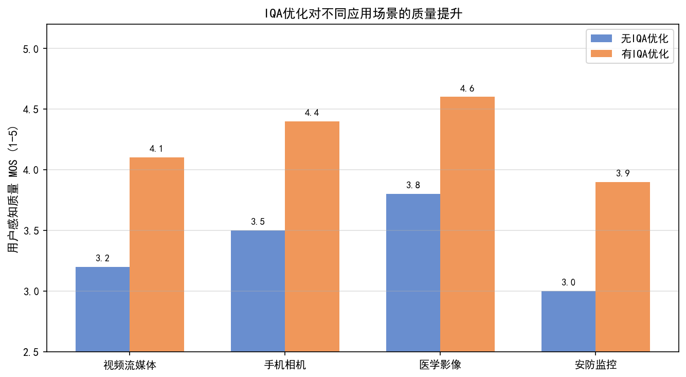
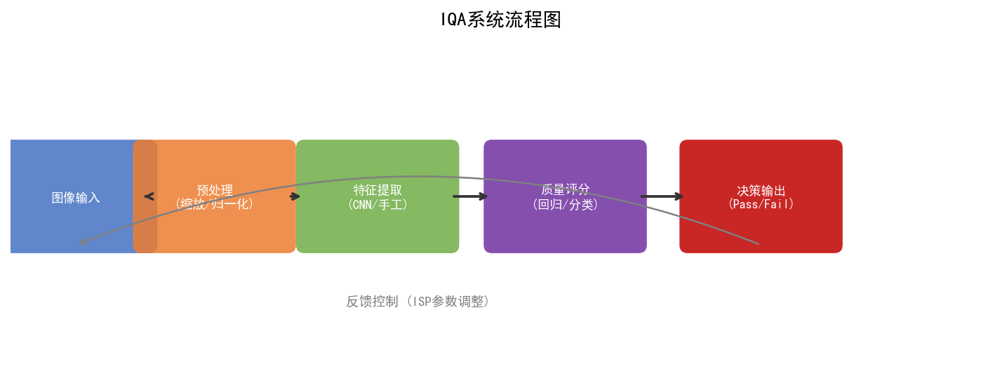
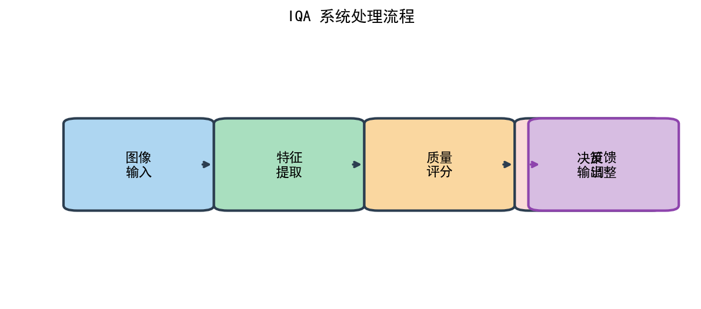
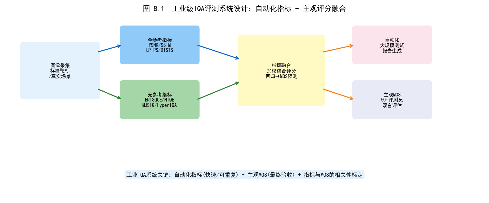
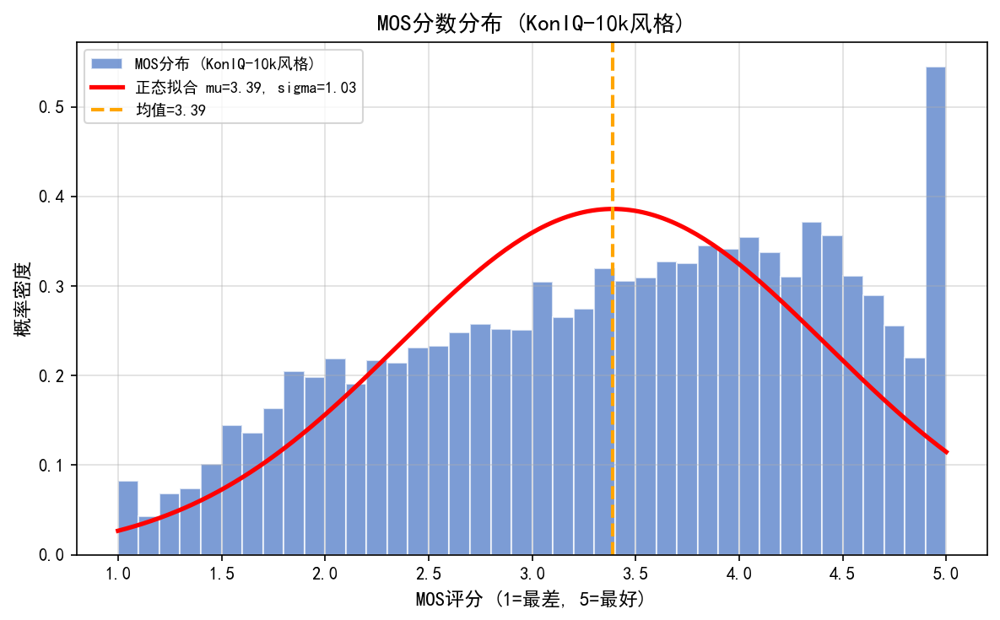
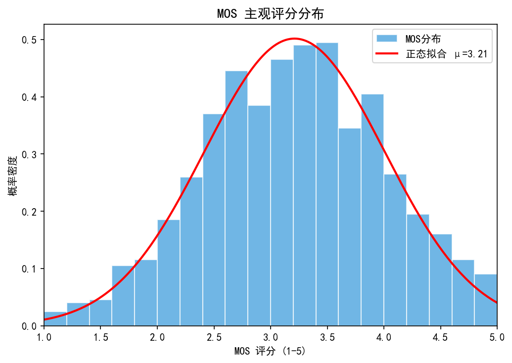

# 第四卷第08章：量产 IQA 系统工程（IQA System Design）

> **流水线位置：** ISP 流水线输出端的质量关卡；同时用于整个调参工作流程
> **前置章节：** 第四卷第04章（感知 IQA：LPIPS/SSIM/DISTS）、第四卷第05章（DL 盲 IQA：HyperIQA/MUSIQ/Q-Align）
> **读者路径：** IQA工程师、测试工程师、调参工程师
> **内容范围：** 本章覆盖 IQA **工程化系统**——指标体系设计、自动化测试流水线、量产质量门控与 AB 测试框架。IQA **算法原理**（感知相似度度量、DL 盲 IQA 模型）见 **第四卷第04章**（感知 IQA）和 **第四卷第05章**（DL 盲 IQA）。

---

## §1 原理 (Theory)

### 为什么需要系统化的 IQA 框架？

用过PSNR评估ISP质量的人都遇到过这个问题：同样PSNR 32dB的两张图，一张轻微模糊、一张有色噪声，人眼看差别很大，但指标告诉你一样好。PSNR掉了0.3dB，根本分不清是降噪参数、锐化还是色调曲线改动导致的。

量产IQA不能靠一个数字——质量本身是多维的，不同维度的失效需要不同的检测工具：

- 回归测试要PSNR/SSIM（快、可比较、有参考图）
- 量产质检要NR指标（没有参考图可比）
- 最终验收要MOS（人说了算）
- 机器视觉场景要任务指标（mAP、OCR准确率）

这四层缺一不可。

---

### 四层 IQA 框架

**第一层——全参考 (Full-Reference, FR) 指标：** PSNR、SSIM、MS-SSIM

这层有个前提：你有参考图。调参期间，单反拍的RAW配对图可以作为参考；CI/CD回归测试时，上一版本的输出可以作为参考。没有参考图就不能用FR指标，这是它的硬限制。

*PSNR：*
```
PSNR = 10 * log10( MAX_VAL^2 / MSE )
```
简单、可逆，但不对人类视觉系统 (HVS) 建模。

*SSIM：*
```
SSIM(x, y) = (2μ_x μ_y + C1)(2σ_xy + C2)
             / ( (μ_x² + μ_y² + C1)(σ_x² + σ_y² + C2) )
```
将质量分解为亮度、对比度和结构三个分量。**取值范围 [−1, 1]（实践中对自然图像几乎恒为正，常用报告范围 [0, 1]），1 表示完全相同；高质量重建典型值 > 0.90，高保真修复/超分场景通常 > 0.95。** 与 PSNR 相比，对模糊、结构失真的感知相关性更好。局限性：全局 SSIM 在空间上取平均，局部失真（单块模糊区域）会被其余区域的高分掩盖；建议配合 LPIPS 等感知指标联合评估。

**第二层——无参考 (No-Reference, NR) 指标：** BRISQUE、NIQE、PIQE

量产场景没有参考图——消费者拍的照片不会有配对的单反版本等着你比对。这层指标的存在意义就是：不需要参考图，直接从单张图像估计质量分数。代价是精度比FR指标低一截，跟MOS的相关性通常只到SRCC 0.6–0.75。

*BRISQUE（盲/无参考图像空间质量评估器）：*
BRISQUE 对局部亮度系数偏离自然场景统计 (NSS) 分布的程度进行建模，拟合为广义高斯分布。特征向量（36 维）被送入在人类主观评分 (MOS) 上训练的 SVM 回归器。

```
BRISQUE_score = SVM( phi(img) )
```
BRISQUE 越低，质量越高。范围大致为 0–100。

*NIQE（自然图像质量评估器）：*
NIQE 完全无监督：它将原始图像的 NSS 特征拟合为多元高斯分布，并测量测试图像特征与该分布之间的马氏距离。无需主观训练数据。

**第三层——感知指标 (Perceptual Metrics)：** LPIPS、DISTS

PSNR/SSIM对纹理不敏感——两张SSIM值一样的图，一张纹理清晰、一张被NR过度平滑成"油画"，SSIM可能几乎相同。感知指标用深度网络特征度量，能捕捉到这类SSIM遗漏的感知失真。

*LPIPS（学习型感知图像块相似度）：*
```
LPIPS(x, y) = sum_l  w_l * || phi_l(x) - phi_l(y) ||_2^2
```
其中 `phi_l` 为 VGG/AlexNet 第 `l` 层的激活图，`w_l` 为在人类 2AFC 判断上拟合的学习权重。LPIPS 能捕捉 SSIM 遗漏的纹理和结构差异。

训练DNN-ISP时，纯PSNR损失会导致模型偏向过平滑（PSNR高但感知差）——加LPIPS作为约束项能有效抑制这个问题。夜景和人像模式因为涉及合成细节，也需要感知指标才能看清楚质量差异。

*VMAF（视频多方法评估融合）：*

VMAF 是 Netflix 于 2016 年开发的视频质量评估指标，将多个底层感知特征通过 SVM 回归融合为单一分数（0–100）。核心子指标包括：
- **VIF（视觉信息保真度）：** 基于自然场景统计，量化参考视频到失真视频的信息保真度损失。
- **DLM（细节损失指标）：** 分离可导致画质降级的失真（清晰度损失）与人眼容易接受的失真（噪声）。
- **运动特征：** 量化帧间时域一致性，对视频稳定性和运动模糊敏感。

**VMAF 评分参考：** > 93 为透明质量（接近感知无损）；75–93 为良好；< 60 存在明显可见失真。VMAF 在流媒体编码质量评估中已成为行业标准，适用于 ISP 视频输出的压缩参数优化和帧间质量稳定性评估。

*HDR 专用感知指标：*

标准 PSNR/SSIM 针对 SDR（8-bit sRGB）设计，直接用于 HDR 内容时存在两个根本缺陷：（1）均匀量化误差不对应 HVS 对亮度的对数感知；（2）无法区分高光/阴影区域的视觉重要性差异。HDR 内容（如 ISP 输出的 PQ HDR 或 HLG 视频）需要专用指标。

**HDR-VDP-2.2（High Dynamic Range Visible Difference Predictor 版本 2.2）：** Mantiuk 等人开发的 HDR 视觉差异预测器（IEEE SIGGRAPH 2011 原始版，2.2 为后续更新），直接在绝对亮度域（cd/m²）计算失真预测，整合了 HVS 的 CSF（对比度敏感函数）、掩蔽效应和多尺度分解。输出为概率图（Probability of Detection，失真可见概率）和质量相关系数（Quality Correlation）。适用于评估 ISP HDR 合并算法（多帧 HDR、Staggered HDR）的色调映射伪影。

$$Q_{HDR\text{-}VDP} = f\left(\text{CSF}_{\text{abs}}(\cdot),\; M_{\text{masking}}(\cdot),\; \Delta L_{abs}\right)$$

**HDR-VQM（High Dynamic Range Video Quality Metric）：** Narwaria 等人提出（IEEE TIP 2015），专为 HDR 视频设计，在 IPT（IPT-PQ 颜色空间）域进行失真测量，结合时域和空域 HVS 模型。与 PSNR-TMO（色调映射后再 PSNR）相比，HDR-VQM 与主观 MOS 的 SRCC 高约 0.08–0.12（在 IU-16K 数据集上）。

**工程使用建议：** ISP HDR 场景评测推荐使用 HDR-VDP-2.2 作为静态图像 HDR 质量门控（以 Quality Correlation > 0.7 作为通过阈值），HDR-VQM 用于 HDR 视频段质量回归测试。普通 SDR 场景仍使用 PSNR/SSIM/LPIPS，不需要引入 HDR 指标。

**第四层——任务驱动指标 (Task-Driven Metrics)：** 检测精度、OCR 错误率

前三层都是代理指标——最终问题是：这张图能不能用？车载前视需要检测网络跑通，人脸解锁需要识别率达标，车牌识别需要OCR不出错。任务驱动指标是最终仲裁，但计算成本高，且换一个任务就要重跑——第一到第三层的作用是提前发现问题，避免在任务测试阶段才发现质量崩了。

- **人脸检测：** ISP 输出上的 mAP 或 recall@precision=0.99。
- **OCR：** 车牌或文档的字符错误率。
- **分割：** mIoU。

---

### ISP 质量指标生命周期

同一个指标在不同阶段的意义不同：PSNR在开发期是信号，在量产质检里没有参考图所以完全用不上。下表是各阶段的实用指标组合：

| 阶段       | 主要指标               | 用途                         |
|------------|------------------------|------------------------------|
| 开发       | PSNR、SSIM、LPIPS      | 算法选型                     |
| 调参       | BRISQUE、SSIM、LPIPS   | 参数优化                     |
| 工厂测试   | NIQE、BRISQUE          | 生产合格/不合格关卡          |
| 现场监控   | BRISQUE、NIQE          | 持续质量仪表盘               |
| 特性评测   | 任务驱动 + LPIPS       | 人像、夜景、HDR 发布         |

---

### 相关性分析：SRCC / PLCC

要验证某个指标是否有意义，需测量其与人类主观评分 (Mean Opinion Score, MOS) 的相关性：

- **SRCC（斯皮尔曼秩相关系数）：** 秩序相关，对单调非线性变换具有鲁棒性。测量单调关系。
- **PLCC（皮尔逊线性相关系数）：** 在拟合四参数 Logistic 函数后的线性相关：

```
MOS_predicted = β1 * ( 0.5 - 1/(1 + exp(β2*(metric - β3))) ) + β4
```

标准基准（LIVE、KADID-10k、CSIQ）同时报告 SRCC 和 PLCC。在 IQA 基准数据库上，一个经过良好校准的指标应达到 SRCC > 0.85。

对于 ISP 专用数据，收集 200+ 个 ISP 输出样本，覆盖：噪声级别、模糊、色彩误差、压缩、HDR 色调映射伪影。按照 ITU-R BT.500 / ITU-T P.910 方法论（5 分 ACR 量表：1=差，5=优秀），由 15 名以上训练有素的评测人员标注 MOS。然后计算各客观指标与 MOS 之间的 SRCC/PLCC。

> **注意：** ITU-R BT.500 是视频/图像质量评估的主要标准；
> ITU-T P.910 是面向多媒体应用的等效标准。两者均使用
> 5 分 ACR（绝对分类评分）量表，在 IQA 文献中被广泛互换引用。

---

### 构建自动化 IQA 流水线

IQA流水线最容易犯的错误是"指标算完就完了"——没有跟MOS关联、没有版本对比、没有阈值触发。真正有用的流水线需要四个环节串通：

1. **采集：** 在受控照明下采集标准化场景图卡（ISO 12233 用于清晰度，Macbeth 色卡用于色彩，均匀灰色用于噪声）。
2. **计算：** 批量计算所有指标，按固件版本、场景ID、ISO和光源入库，不同版本可查可比。
3. **关联：** 用拟合的Logistic函数将客观指标映射到MOS——否则你不知道MTF50差了5%对用户感知意味着什么。
4. **关卡：** 任何指标相较基线下降超过阈值，触发告警阻塞合并。

所有采集参数、指标计算脚本和阈值定义都要跟固件一起版本控制，否则下次换测试工程师就不知道阈值怎么来的了。

---

### 指标博弈及其预防

DNN-ISP调了一段时间会遇到一个反直觉的现象：PSNR在测试集上一直涨，但工程师看图发现越来越"假"——纹理被过度平滑成蜡质感，或者加了人工锐化让边缘"跳出来"但实际细节没了。这叫指标博弈，单一数字评估体系的必然代价。

四个对策没有捷径：

1. 多层指标必须同时改善——PSNR涨但LPIPS也涨了，说明感知质量在变差。
2. 发布决策必须有人工评测——指标可以骗过，人眼不会。
3. DNN训练损失加LPIPS约束项，从源头限制"PSNR刷分但感知变差"的方向。
4. 每隔一个大版本用新场景重标MOS，验证SRCC是否还有效——传感器换代后BRISQUE/NIQE的NSS统计会漂移。

> **工程推荐（手机ISP场景）：** NR参数调整阶段，从SSIM+BRISQUE双指标约束开始，同时要求SSIM不低于基线0.5%且BRISQUE不恶化；仅在DNN-ISP开发阶段才引入LPIPS作为损失项。原因：LPIPS计算需要GPU且速度慢，不适合实时调参循环，但作为DNN训练的约束能有效防止过平滑收敛。

---

## §2 标定 (Calibration)

### MOS 收集协议

MOS数据是IQA系统的地基，收集质量直接决定所有相关性分析是否可信：

- **样本量：** 最少200个ISP输出图像，覆盖多样化场景、ISP参数和质量级别。失真类型（噪声、模糊、色彩、HDR伪影）要平衡——全是噪声失真样本标出的BRISQUE相关性对模糊失真没有泛化能力。
- **评测人员：** 15–25名经过训练的评测人员；剔除会话内方差过高（同一图像多次评分标准差 > 1.5分）的记录，避免疲劳数据污染结果。
- **量表：** ITU-R BT.500 / ITU-T P.910 ACR 5分量表：5=优秀，4=良好，3=一般，2=较差，1=差。
- **MOS计算：** 先对每位评测人员做z分数归一化（消除个体评分基准差异），再取每张图像的均值。

### 指标到 MOS 的映射

对每个指标独立拟合四参数 Logistic 函数（简化版本），使用最小二乘法最小化。在留出的 20% 数据集上报告 SRCC 和 PLCC。

> **注：** VQEG 标准采用五参数 Logistic 映射（额外加 $\beta_5 \cdot \text{metric}$ 线性项）：$\text{MOS}' = \beta_1(0.5 - 1/(1+e^{\beta_2(\text{m}-\beta_3)})) + \beta_4 + \beta_5 \cdot \text{m}$，在典型 IQA 数据集上两者差异 < 0.01 PLCC，本节四参数版本为合理近似。

---

## §3 调参 (Tuning)

### 质量关卡阈值设定

阈值不能拍脑袋定——太严格会大量误拦良品（工厂线等不起），太宽松会漏过真实问题。用ROC分析在已知好坏样本上找工作点：

- 目标假正率（良品被误判为不合格）< 2%，在ROC曲线上的对应TPR处设置阈值。
- 实际操作：用ROC分析扫描阈值范围，绘制TPR vs FPR曲线，在FPR ≤ 2% 处选工作点。
- BRISQUE参考值：通常 < 35 为合格，但这个数字强依赖传感器和ISP流水线，换了设备要重新用ROC分析校准，不要直接套用。

### 多指标关卡

单一指标通过不代表质量过关，关卡必须要求所有维度同时满足：

```python
PASS = (
    psnr   >= PSNR_THRESHOLD    and   # 例如 35 dB
    ssim   >= SSIM_THRESHOLD    and   # 例如 0.92
    brisque <= BRISQUE_THRESHOLD and   # 例如 35
    lpips  <= LPIPS_THRESHOLD         # 例如 0.12
)
```

任何单一指标都能被博弈或静默失效，联合关卡是基本防线。

---

## §4 指标局限与误用（Metric Pitfalls）

| 问题               | 原因                                   | 缓解措施                                        |
|--------------------|----------------------------------------|-------------------------------------------------|
| 指标博弈           | DNN-ISP 以牺牲纹理为代价最大化 PSNR   | 将 LPIPS 加入损失；定期进行人工重评              |
| 新传感器上指标漂移 | 新型 BSI/堆叠传感器的 NSS 统计不同    | 在新传感器图像上重新校准 BRISQUE/NIQE           |
| MOS 随时间漂移     | 评测人员疲劳或参考漂移                 | 每次 MOS 会话中加入锚定图像                     |
| 指标异常值假告警   | 单个坏块驱动全局分数                   | 使用基于百分位数聚合的块级统计                  |

---

## §5 评测 (Evaluation)

### 与 MOS 的皮尔逊和斯皮尔曼相关性

对 ISP 测试集上任何 IQA 指标的主要评估：

- 在留出的 20% 数据集上计算 SRCC 和 PLCC。
- 可接受：SRCC > 0.80（中等），良好：SRCC > 0.88，优秀：SRCC > 0.93。
- 报告置信区间（Bootstrap 1000 次重采样）。

### 不同阈值下的生产通过率

- 绘制每个指标的通过率曲线（作为阈值的函数）。
- 识别针对人工标注的好/坏图像使 F1 分数（精确率和召回率的调和均值）最大化的阈值。
- 报告该指标作为二元质量关卡的 ROC AUC。

---

## §6 自动化测试图卡采集流水线

### 6.1 标准测试图卡体系

量产 IQA 系统依赖在受控条件下采集的标准化测试图卡。以下三类图卡覆盖 ISP 主要质量维度：

| 图卡类型 | 标准 | 测量目标 | 关键指标 |
|---------|------|---------|---------|
| 分辨率图卡 | ISO 12233:2017 | 空间频率响应 (SFR/MTF) | MTF50, MTF10 |
| 色彩图卡 | X-Rite Macbeth ColorChecker Classic (24色) | 色彩准确度 | ΔE00, 白平衡偏差 |
| 均匀灰色靶 | 均匀反射率 (18%灰卡 × 多个亮度级别) | 噪声、均匀性 | SNR, PRNU, FPN |
| 动态范围图卡 | Imatest Dynamic Range | 传感器动态范围 | DR_stops (dynamic range in stops) |
| 人脸测试图 | ISO/IEC 39794-5 | 人脸 AE/AWB 准确度 | 肤色 ΔE00, 曝光 EV 误差 |

### 6.2 采集控制软件架构

自动化采集系统由三层组成：

```
┌──────────────────────────────────────────────────────────┐
│  调度层 (Scheduler)                                       │
│  - 触发采集任务（CI/CD Pipeline / 手动 / 定时）          │
│  - 记录固件版本号、ISP Tuning 参数版本、Chromatix 版本   │
└──────────────┬───────────────────────────────────────────┘
               │
┌──────────────▼───────────────────────────────────────────┐
│  灯箱控制层 (Light Chamber Controller)                   │
│  - 设置色温（2856K A光源 / 4230K CWF（F2）/ 6504K D65）       │
│  - 设置照度（lux 级别）：0.1 lux / 1 lux / 10 lux /      │
│    100 lux / 1000 lux / 10000 lux                        │
│  - 确认灯箱稳定（照度波动 < 0.5%）后发出采集许可信号    │
└──────────────┬───────────────────────────────────────────┘
               │
┌──────────────▼───────────────────────────────────────────┐
│  相机控制层 (Camera Control)                             │
│  - ADB / MIPI Camera HAL3 ACapture 接口                  │
│  - 设置拍摄参数（ISO、快门、AF 模式、AE 锁定状态）       │
│  - 采集 RAW + JPEG/HEIF 双路输出                         │
│  - 触发多次拍摄（重复性评估用，默认 N=10 张/场景）       │
└──────────────────────────────────────────────────────────┘
```

### 6.3 SFR 测量流程（ISO 12233）

空间频率响应 (Spatial Frequency Response, SFR) 是描述相机系统锐度的核心指标，通过 ISO 12233 倾斜边缘法测量：

**步骤 1：** 采集 ISO 12233 图卡（倾斜边缘区域）在各 ISO 下的图像。

**步骤 2：** 检测倾斜边缘（角度 5°–10°），提取垂直于边缘方向的剖面。

**步骤 3：** 4× 过采样重建超分辨率边缘剖面（ESF, Edge Spread Function）。

**步骤 4：** ESF 求导得到 LSF (Line Spread Function)，对 LSF 做 DFT 得到 MTF 曲线。

**步骤 5：** 读取 MTF50（对比度降至 50% 时的空间频率）和 MTF10（对比度降至 10%）。

```python
# SFR 关键指标提取（概念伪码）
def compute_sfr(edge_image_crop):
    """
    输入：包含倾斜边缘的图像裁剪区域（灰度图，float32）
    输出：MTF50, MTF10 (单位：lp/ph，line pairs per pixel height)
    """
    esf = detect_and_oversample_edge(edge_image_crop, oversample=4)
    lsf = np.gradient(esf)
    lsf_windowed = lsf * np.hamming(len(lsf))  # 汉明窗减少频谱泄漏
    mtf = np.abs(np.fft.rfft(lsf_windowed))
    mtf /= mtf[0]  # 归一化：DC 分量 = 1
    freq = np.fft.rfftfreq(len(lsf_windowed))
    # 线性插值求 MTF50/MTF10，比 argmin 更精确（误差 <0.1 vs ≤0.5 个频率分辨率）
    # MTF 单调递减 → 翻转使 xp 单调递增以满足 np.interp 要求
    mtf50 = float(np.interp(0.5, mtf[::-1], freq[::-1]))
    mtf10 = float(np.interp(0.1, mtf[::-1], freq[::-1]))
    return mtf50, mtf10
```

**量产验收阈值（参考值，实际阈值因设备而异）：**

| 分辨率 | ISO | MTF50 下限 | MTF10 下限 |
|--------|-----|-----------|-----------|
| 12MP (4032×3024) | ISO 100 | ≥ 0.35 lp/ph | ≥ 0.45 lp/ph |
| 12MP | ISO 3200 | ≥ 0.28 lp/ph | ≥ 0.38 lp/ph |
| 48MP | ISO 100 | ≥ 0.38 lp/ph | ≥ 0.50 lp/ph |

### 6.4 色彩准确度测量（Macbeth 色卡）

**ΔE00（CIE 2000 色差）** 是量产色彩验收的核心指标：

$$\Delta E_{00} = \sqrt{\left(\frac{\Delta L'}{k_L S_L}\right)^2 + \left(\frac{\Delta C'}{k_C S_C}\right)^2 + \left(\frac{\Delta H'}{k_H S_H}\right)^2 + R_T \cdot \frac{\Delta C'}{k_C S_C} \cdot \frac{\Delta H'}{k_H S_H}}$$

其中旋转项 $R_T$（ISO 11664-6:2022 §6.3）定义为：

$$R_T = -2\sqrt{\frac{\bar{C}'^7}{\bar{C}'^7 + 25^7}} \cdot \sin(2\Delta\Theta)$$

$$\Delta\Theta = 30^\circ \exp\!\left(-\left(\frac{\bar{H}' - 275^\circ}{25^\circ}\right)^2\right)$$

式中 $\bar{C}'$ 为测试色与参考色的平均彩度，$\bar{H}'$ 为平均色相角。$R_T$ 在蓝色区域（$\bar{H}' \approx 275°$）引入彩度-色相交叉修正；工程实现推荐使用 `colormath.color_diff.delta_e_cie2000()` 或 `skimage.color.deltaE_ciede2000()` 以避免手工实现误差。

**测量流程：**
1. 在 D65 照明（6504K）下拍摄 24 色 Macbeth ColorChecker。
2. 从图像中提取各色块的平均 RGB 值，经 ISP 色彩矩阵 (CCM) 转换至 sRGB。
3. 将 sRGB 转换至 CIE L*a*b* (D65 白点)，与 ColorChecker 标准参考值对比。
4. 计算每块的 ΔE00，报告平均值和最大值。

**验收标准：**

| 场景 | 平均 ΔE00 | 最大 ΔE00 |
|------|-----------|-----------|
| 旗舰手机（有调参）| ≤ 2.0 | ≤ 5.0 |
| 中端手机 | ≤ 3.5 | ≤ 8.0 |
| 仅原始 ISP CCM | ≤ 5.0 | ≤ 12.0 |

### 6.5 噪声测量（均匀灰色靶）

**信噪比 (SNR) 测量：**

```python
def measure_snr_flat_field(images: list, roi: tuple):
    """
    images: N 张同场景图（用于时域噪声评估）
    roi: (x, y, w, h) 均匀区域 ROI
    返回: SNR (dB), σ_temporal, σ_spatial
    """
    stack = np.stack([img[roi[1]:roi[1]+roi[3], roi[0]:roi[0]+roi[2]]
                      for img in images], axis=0)  # (N, H, W)
    mean_signal = stack.mean(axis=0).mean()         # 空间+时间均值 = 信号
    sigma_temporal = stack.std(axis=0).mean()       # 时域噪声（各像素跨帧标准差均值）
    sigma_spatial = stack.mean(axis=0).std()        # 空域噪声（均值帧的空间标准差）
    snr_db = 20 * np.log10(mean_signal / sigma_temporal)
    return snr_db, sigma_temporal, sigma_spatial
```

**固定图案噪声 (FPN) 与像素响应非均匀性 (PRNU) 测量：**

- **FPN**：单帧暗场（遮光）图像的空间标准差，反映暗电流非均匀性。
- **PRNU**：多帧亮场（均匀照明）图像中，时域均值帧减去全局均值后的空间标准差，反映像素增益差异。

---

## §7 每模块 IQA 指标分配

ISP 流水线由多个顺序模块组成，每个模块引入的失真类型不同，需配套专属的 IQA 指标。

### 7.1 ISP 模块 → 失真类型 → IQA 指标映射

| ISP 模块 | 主要失真类型 | 首选 IQA 指标 | 辅助指标 |
|---------|------------|-------------|---------|
| 黑电平校正 (BLC) | 暗部直流偏移、非线性 | 暗场均值偏差 (DN) | PRNU |
| 镜头阴影校正 (LSC) | 暗角、非均匀性 | 角落/中心亮度比 | 均匀性指数 UI |
| 去马赛克 (Demosaic) | 色彩摩尔纹、锯齿 | CPIQ 色彩摩尔纹指数 | MTF50 (色彩通道) |
| 降噪 (NR: BNR+CNR) | 过平滑 vs. 噪声残留 | SNR / SSIM 细节保留 | BRISQUE |
| 边缘增强 / 锐化 | 振铃、过锐化 | MTF50 vs. 振铃指数 | CPIQ 锐化指数 |
| 色彩矩阵 (CCM) | 色差 | ΔE00 (Macbeth 24 色) | 白点偏差 (Δuv) |
| 色调映射 / Gamma | 高光溢出、暗部细节损失 | DR_stops, 直方图利用率 | LPIPS (vs 参考) |
| JPEG/HEIF 编码 | 块效应、振铃 | SSIM (vs 未压缩) | PSNR |
| AI 降噪 / 超分 | 幻化细节、纹理失真 | LPIPS, DISTS | MOS |

### 7.2 端到端 ISP 质量分数聚合

各模块指标通过加权综合得到端到端 ISP 质量分数 (IQS)：

```
IQS = w_sharp * norm(MTF50)
    + w_noise * norm(SNR)
    + w_color * (1 - norm(ΔE00))
    + w_perceptual * (1 - norm(LPIPS))
    + w_artifact * norm(artifact_score)
```

其中 `norm(·)` 将各指标线性归一化至 [0, 1]，权重 `w_*` 由用户研究 (MOS 相关性分析) 确定。旗舰相机典型权重：锐度 0.30，噪声 0.25，色彩 0.20，感知质量 0.15，伪影 0.10。

### 7.3 故障隔离：哪个模块引起了质量下降？

当端到端 IQS 下降时，按以下顺序进行模块级故障隔离：

```
端到端 IQS 下降
    ↓ 检查 ΔE00 → 色彩问题 → AWB / CCM 模块
    ↓ 检查 MTF50 → 锐度问题 → 锐化 / 去马赛克 / NR 模块
    ↓ 检查 SNR   → 噪声问题 → BNR / CNR / AI-NR 模块
    ↓ 检查 DR    → 动态范围 → AE / HDR / 色调映射模块
    ↓ 检查 LPIPS → 感知失真 → AI 增强 / JPEG 编码模块
```

---

## §8 缺陷分类与故障模式目录

### 8.1 ISP 缺陷分类体系（P0 / P1 / P2 三级）

| 级别 | 定义 | 处理优先级 | 示例 |
|------|------|----------|------|
| **P0** | 功能性缺陷，导致图像不可用 | 立即阻塞发布 | 完全黑屏、全噪声、色彩完全错误 |
| **P1** | 重大感知缺陷，主观评分 < 2/5 | 在下一版本中修复 | 严重色差 (ΔE00 > 15)、明显 HDR 光晕、严重欠曝/过曝 |
| **P2** | 轻微感知缺陷，主观评分 2–3/5 | 计划修复 | 轻微色调偏移、中等噪声、轻微暗角 |

### 8.2 常见 ISP 故障模式目录

**噪声类缺陷：**

| 缺陷名称 | 现象 | 根本原因 | 检测指标 |
|---------|------|---------|---------|
| 高频噪声残留 | 暗场可见粒状感 | NR 强度不足 / ISO 偏高 | SNR < 阈值，BRISQUE > 40 |
| 过度平滑 | 纹理消失，画面如"塑料感" | NR 强度过高 | SSIM 细节下降，MTF50 下降 |
| 固定图案噪声 (FPN) | 垂直/水平条纹 | 传感器制造缺陷 / BLC 不足 | FPN指数 > 1.0 DN rms |
| 彩色噪声 (色噪) | 随机彩色点 | CNR 不足 | 色度 SNR < 亮度 SNR - 6 dB |

**色彩类缺陷：**

| 缺陷名称 | 现象 | 根本原因 | 检测指标 |
|---------|------|---------|---------|
| AWB 偏色 | 图像整体偏黄/偏蓝 | AWB 收敛错误 / 光源识别错误 | 白点 Δuv > 0.005 |
| CCM 色差 | 特定颜色偏移（如肤色偏红） | CCM 矩阵校准不足 | Macbeth ΔE00 > 5（对应色块） |
| 色调映射饱和度过高 | 色彩"浓艳"不自然 | Saturation 增益过高 | CIECAM02 饱和度差异 |
| 色彩摩尔纹 | 规律纹理上出现彩色条纹 | 去马赛克滤波器设计缺陷 | CPIQ 色彩摩尔纹频谱峰值 |

**锐度/对焦类缺陷：**

| 缺陷名称 | 现象 | 根本原因 | 检测指标 |
|---------|------|---------|---------|
| 过度锐化 / 振铃 | 边缘处出现亮/暗光晕 | 锐化系数过高 | 振铃指数 > 阈值 |
| 欠锐化 | 图像整体模糊 | 锐化不足 / NR 过强 | MTF50 < 0.3 lp/ph |
| 局部失焦 | 部分区域模糊 | AF 收敛不准 / 镜头场曲 | 局部 MTF50 < 全局均值 × 0.7 |

**HDR / 曝光类缺陷：**

| 缺陷名称 | 现象 | 根本原因 | 检测指标 |
|---------|------|---------|---------|
| 高光溢出 | 亮部区域全白无细节 | AE 过曝 / 色调映射不足 | 高光溢出比例 > 0.5% |
| 暗部细节丢失 | 阴影区全黑 | AE 欠曝 / 伽马曲线不当 | 暗部直方图截断比例 > 1% |
| HDR 鬼影 | 运动物体多次曝光重影 | 鬼影检测权重失效 | MOS < 3.0 (含运动场景) |
| 色调映射光晕 | 高对比度边缘处光晕 | 局部色调映射半径过小 | 人工评审检出 |

### 8.3 缺陷跟踪数据库 Schema

每个缺陷记录包含以下字段：

```json
{
  "defect_id": "ISP-2024-0342",
  "severity": "P1",
  "module": "AWB",
  "symptom": "2700K 钨丝灯场景偏蓝",
  "root_cause": "FFCC 光源分类器在低色温下误判为 D50",
  "detection_metric": "white_point_delta_uv > 0.008",
  "detected_version": "ISP_v3.2.1",
  "fixed_version": "ISP_v3.2.3",
  "regression_test_id": "AWB_TC_0021",
  "iqa_before": {"delta_uv": 0.012, "mos": 2.1},
  "iqa_after":  {"delta_uv": 0.003, "mos": 4.2}
}
```

---

## §9 CI/CD 集成与 ISP 版本回归追踪

### 9.1 IQA 作为 CI/CD 流水线质量门控

手工测试的最大问题是频率不够——调参工程师改了一个Chromatix节点，两个迭代后才发现上次的改动引发了别的模块的质量回归，这时候定位根因已经很麻烦了。把IQA挂进CI/CD，每次提交都跑完整测试套件，质量回归在当次提交就被拦下来：

```
代码提交 / Tuning 参数更新
    ↓ Git push → CI/CD 服务器 (Jenkins / GitLab CI)
    ↓ 触发 ISP Firmware Build
    ↓ 触发 IQA 自动化测试套件
        ├── 场景采集（灯箱自动控制，约 20 分钟）
        ├── 指标计算（PSNR / SSIM / MTF50 / ΔE00 / BRISQUE / LPIPS）
        └── 与基线版本比对
    ↓ 质量门控判断
        ├── PASS：所有指标无显著回归（< 阈值变化）→ 允许合并
        └── FAIL：任一指标显著下降 → 阻塞合并，触发告警
    ↓ 报告推送到 Slack / 邮件 / Dashboard
```

### 9.2 回归阈值定义

回归判断使用统计显著性而非绝对值，避免测量噪声触发误报：

**连续指标（如 MTF50、SNR、PSNR）：**
- 两版本各采集 N=10 张重复图像。
- 使用 Welch t 检验（不假设等方差）检验均值差异。
- 若 p < 0.05 且效应量 Cohen's d > 0.5，判定为显著回归。

**分类指标（如 AWB 合格率）：**
- 使用 McNemar 检验比较两版本在同一测试集上的合格/不合格变化。

**实践简化阈值（快速门控，适用于秒级 CI 检查）：**

| 指标 | 回归阈值 | 触发级别 |
|------|---------|---------|
| MTF50 | 下降 > 5% | P1 阻塞 |
| SNR | 下降 > 1 dB | P1 阻塞 |
| ΔE00 (Macbeth 均值) | 上升 > 0.5 | P1 阻塞 |
| PSNR (vs 参考) | 下降 > 1 dB | P1 阻塞 |
| BRISQUE | 上升 > 5 | P2 告警 |
| LPIPS | 上升 > 0.02 | P2 告警 |

### 9.3 ISP 版本回归数据库架构

```sql
-- ISP 版本表
CREATE TABLE isp_versions (
    version_id      VARCHAR(32) PRIMARY KEY,  -- e.g. "ISP_v3.2.1"
    build_timestamp DATETIME,
    tuning_hash     VARCHAR(64),              -- Chromatix/tuning 文件 SHA256
    firmware_hash   VARCHAR(64),
    commit_message  TEXT,
    author          VARCHAR(64)
);

-- 测试场景表
CREATE TABLE test_scenes (
    scene_id        VARCHAR(32) PRIMARY KEY,  -- e.g. "ISO100_D65_12233"
    chart_type      ENUM('sfr','macbeth','flat','face','hdr'),
    illuminant      VARCHAR(16),              -- "D65","A","CWF","D50"
    lux_level       FLOAT,
    iso_setting     INT
);

-- IQA 测量结果表
CREATE TABLE iqa_results (
    result_id       BIGINT AUTO_INCREMENT PRIMARY KEY,
    version_id      VARCHAR(32) REFERENCES isp_versions(version_id),
    scene_id        VARCHAR(32) REFERENCES test_scenes(scene_id),
    measured_at     DATETIME,
    mtf50           FLOAT,
    mtf10           FLOAT,
    snr_db          FLOAT,
    delta_e00_mean  FLOAT,
    delta_e00_max   FLOAT,
    psnr            FLOAT,
    ssim            FLOAT,
    brisque         FLOAT,
    lpips           FLOAT,
    mos_predicted   FLOAT
);

-- 回归事件表
CREATE TABLE regression_events (
    event_id        BIGINT AUTO_INCREMENT PRIMARY KEY,
    detected_at     DATETIME,
    version_from    VARCHAR(32),
    version_to      VARCHAR(32),
    scene_id        VARCHAR(32),
    metric_name     VARCHAR(32),
    value_before    FLOAT,
    value_after     FLOAT,
    delta_percent   FLOAT,
    severity        ENUM('P0','P1','P2'),
    status          ENUM('open','investigating','fixed','wontfix')
);
```

### 9.4 版本趋势可视化

ISP 版本迭代趋势图应包含以下时序曲线：

- MTF50 趋势（每固件版本的均值 ± 标准差）
- SNR@ISO3200 趋势（夜景能力核心指标）
- ΔE00 均值趋势（色彩准确度）
- BRISQUE@自然场景趋势（盲 IQA 主观感知代理）

当任意指标趋势出现连续两个版本下降时，自动发送趋势告警。

---

## §10 AB 测试框架与统计显著性

### 10.1 为什么 ISP Tuning 需要 AB 测试

调过NR曲线的人都遇到过这个问题：SNR提升了0.8dB，但MTF50掉了4%——客观指标方向相反，你不知道用户到底更喜欢哪个。这时候不能靠工程师的主观判断拍板，需要让人类评测人员在不知道版本信息的情况下进行盲测。

**AB 盲测 (Blind A/B Test)** 解决的就是这个问题：客观指标打架时，让量化的人类偏好数据说话。

### 10.2 AB 测试流程

```
准备阶段：
  ├── 版本 A（Control）：当前基准 Tuning
  ├── 版本 B（Treatment）：待评估的新 Tuning
  ├── 测试场景集：100+ 张涵盖不同光照、场景类型的图像
  └── 评测人员：15–25 名，无版本信息（双盲）

评测阶段：
  ├── 2AFC（二选一强制选择）：每对图像中选择质量更好的
  ├── 或 DMOS（差异均值主观评分）：在 [-3, +3] 量表上评分差异
  └── 评测顺序随机化（避免顺序偏置）

统计分析：
  ├── 2AFC 结果：用二项检验（Binomial Test）检验偏好率是否显著偏离 50%
  ├── DMOS 结果：用配对 t 检验或 Wilcoxon 符号秩检验
  └── 报告效应量（Cohen's d）和置信区间
```

### 10.3 统计检验方法

**2AFC 二项检验：**

若 N 次评测中版本 B 被偏好 k 次，在 H₀（无差异，p = 0.5）下：

```python
from scipy import stats
from statsmodels.stats.proportion import proportion_confint

def ab_test_2afc(n_total, n_prefer_b, alpha=0.05):
    """
    n_total: 总评测次数
    n_prefer_b: 偏好版本 B 的次数
    alpha: 显著性水平
    """
    # 双侧二项检验（scipy ≥1.7 使用 binomtest 替代已移除的 binom_test）
    p_value = stats.binomtest(n_prefer_b, n_total, p=0.5, alternative='two-sided').pvalue
    preference_rate = n_prefer_b / n_total
    # 95% 置信区间（Wilson 区间）
    ci_low, ci_high = proportion_confint(n_prefer_b, n_total, alpha=alpha, method='wilson')

    result = {
        'preference_rate_B': preference_rate,
        'p_value': p_value,
        'significant': p_value < alpha,
        'ci_95': (ci_low, ci_high),
        'conclusion': 'B significantly better' if (p_value < alpha and preference_rate > 0.5)
                      else 'A significantly better' if (p_value < alpha and preference_rate < 0.5)
                      else 'No significant difference'
    }
    return result
```

**DMOS Wilcoxon 符号秩检验：**

```python
def ab_test_dmos(dmos_scores, alpha=0.05):
    """
    dmos_scores: 每个场景的 DMOS 分数数组（正值表示 B 更好）
    """
    stat, p_value = stats.wilcoxon(dmos_scores, alternative='two-sided')
    # 标准 Wilcoxon 效应量 r = Z / sqrt(N)（Rosenthal 1991 推荐）
    # p 值反查正态分位数得到 Z，避免非标准效应量公式的数值不稳定
    n = len(dmos_scores)
    from scipy.stats import norm as _norm
    z_score = _norm.ppf(1 - p_value / 2) if p_value < 1.0 else 0.0
    effect_size = z_score / (n ** 0.5)  # r < 0.3 小效应，0.3–0.5 中效应，> 0.5 大效应
    return {
        'median_dmos': np.median(dmos_scores),
        'p_value': p_value,
        'significant': p_value < alpha,
        'effect_size': effect_size
    }
```

### 10.4 最小样本量计算

为保证统计功效 (Power ≥ 0.8) 在效应量 d = 0.5 下：

```
n_min = 2 * (z_α/2 + z_β)² / d²
      = 2 * (1.96 + 0.84)² / 0.5²
      ≈ 63 对图像（2AFC）
```

实践中建议使用 **100–200 对图像**，覆盖不同场景类型，以保证子群体（夜景、人像、HDR 等）的分析可信。

### 10.5 多重比较校正

当同时进行多个 AB 测试（如同时测试 NR、锐化、色彩三个参数）时，需进行多重比较校正（Bonferroni 或 Benjamini-Hochberg FDR），避免假阳性：

```python
from statsmodels.stats.multitest import multipletests

p_values = [0.03, 0.01, 0.08]  # 三个独立 AB 测试的 p 值
reject, corrected_p, _, _ = multipletests(p_values, alpha=0.05, method='fdr_bh')
# 使用 corrected_p 作为最终判断依据
```

---

## §11 现场舰队监控仪表盘

### 11.1 量产设备 IQA 现场监控架构

实验室测试覆盖不了真实用户场景——灯箱里没有逆光、没有用户抖动、没有复杂光源混合。量产出去的设备每天在各种真实环境拍照，这些数据是发现系统性ISP问题最直接的信号。通过**匿名遥测**采集质量指标（设备端离线计算、数据脱敏后上报），可以在问题扩散到大范围用户投诉之前发现并介入：

```
用户设备（量产）
    ↓ 定期采集匿名质量指标（BRISQUE, 曝光统计, WB 统计）
    ↓ 数据脱敏（移除 GPS/时间/人脸等敏感信息）
    ↓ 上报至质量监控后端
         ├── 实时仪表盘（Grafana / DataDog）
         │     ├── 设备分布：按型号/地区/固件版本分组
         │     ├── 曝光失败率（严重过曝/欠曝事件频率）
         │     └── AWB 偏差分布（95th 分位数 Δuv）
         └── 告警规则（阈值触发 → PagerDuty / Slack）
```

### 11.2 现场监控关键指标

| 监控指标 | 数据来源 | 告警阈值 | 意义 |
|---------|---------|---------|------|
| 匿名图像 BRISQUE | 设备端离线计算上报 | 95th 分位数 > 45 | 感知质量下降 |
| 曝光失败率 | AE 收敛状态日志 | > 0.5% 拍摄事件 | AE 稳定性 |
| AWB 白点 Δuv | AWB 收敛结果日志 | 95th 分位数 > 0.008 | AWB 系统偏差 |
| AF 失焦率 | AF HAL 状态日志 | > 2% NOT_FOCUSED_LOCKED | AF 系统问题 |
| HDR 合并失败率 | ISP 内部状态码 | > 1% HDR 场景 | 多帧合并问题 |
| 崩溃/Exception 率 | Crash 上报 | 任意上升趋势 | 稳定性问题 |

### 11.3 A/B 灰度发布监控

当新 ISP 固件向部分设备灰度发布时，使用对照实验框架比较新旧版本的现场指标：

```
设备随机分组
  ├── Control 组（10%）：旧固件 ISP_v3.2.1
  └── Treatment 组（10%）：新固件 ISP_v3.3.0

观测窗口：7 天
对比指标：BRISQUE 均值、曝光失败率、AWB 偏差
统计方法：Welch t 检验（连续指标）/ χ² 检验（离散事件率）

灰度发布决策规则：
  - Treatment 组所有指标无显著回归 → 扩大至 50% → 全量
  - 任一指标显著回归 → 立即停止灰度，回滚旧版本
```

---

## §12 参考图像数据库管理

### 12.1 参考图像库的构成

参考图像库是IQA系统的地基——阈值、MOS映射、回归判断全都建立在这上面。库的覆盖范围不够，检测就会有盲区；库过时了，阈值就会失效。四类图像缺一不可：

| 类别 | 数量建议 | 采集设备 | 用途 |
|------|---------|---------|------|
| 标准图卡参考（受控照明） | 200+ 张/传感器型号 | 专业数码相机（单反/微单，已标定） | FR 指标基准 |
| 自然场景（多种光照） | 500+ 张 | 专业相机 RAW + 手工 ISP | MOS 标注基准 |
| 边缘场景（极暗/逆光/运动） | 100+ 张/失真类型 | 专业相机 + 模拟失真 | 鲁棒性测试 |
| 用户真实场景（脱敏） | 1000+ 张 | 量产设备采集 | 现场质量基准 |

### 12.2 参考图像库版本控制

```
参考图像库目录结构：
reference_db/
├── version.json          # 当前库版本 + 更新日志
├── sensor_A_ov50c40/
│   ├── sfr_ISO100_D65/   # SFR 测试场景（ISO×光源组合）
│   ├── macbeth_D65/      # 色卡图像
│   ├── flat_ISO3200/     # 噪声测试场景
│   └── natural_scenes/   # 自然场景
└── sensor_B_imx989/
    └── ...
```

**参考图像更新规则：**
1. 新传感器上线时，为该传感器单独建立参考库（不与其他传感器共用）。
2. 参考库更新需通过 IQA 团队评审，更新后所有历史版本指标需重新计算（指标重算）。
3. 参考库文件以哈希值作为唯一标识，防止意外修改。

### 12.3 新传感器 IQA 校准流程

当引入新传感器（New Image Sensor）时，需完成以下校准：

```
Step 1: 采集新传感器参考图像库（见 §12.1）
Step 2: 收集 MOS 标注（100+ 张图像，15+ 名评测人员）
Step 3: 对每个 NR 指标（BRISQUE、NIQE）重新拟合 MOS 映射模型
        → 因为新传感器的 NSS 统计与训练集不同
Step 4: 使用 ROC 分析重新确定合格/不合格阈值
        → 目标：假正率 (FPR) < 2%，真正率 (TPR) > 95%
Step 5: 在内部测试图像集上验证新阈值的一致性
Step 6: 将新传感器配置提交至 IQA 配置文件（与固件一同版本控制）
```

---

## §13 生产质量门控架构

### 13.1 三级质量门控体系

每次提交都跑完整的灯箱测试（30–60分钟）成本太高，但每次提交只做快速检查又可能漏掉问题。三级门控解决的是覆盖范围和检测速度之间的权衡：快的用于高频检查（代码提交），慢而全的用于低频但高影响的节点（发布候选）：

```
┌─────────────────────────────────────────────────────────────┐
│ 第一级门控：开发态（Dev Gate）                               │
│ 触发：代码提交 / 单元测试                                    │
│ 测试集：50 张标准图卡（快速）                                │
│ 指标：MTF50, SNR, ΔE00                                      │
│ 时间：< 10 分钟                                              │
│ 通过条件：无显著回归（简化阈值）                             │
└─────────────────────────────────────────────────────────────┘
           ↓ 通过 →
┌─────────────────────────────────────────────────────────────┐
│ 第二级门控：集成态（Integration Gate）                       │
│ 触发：分支合并 / 每日构建                                    │
│ 测试集：200+ 张完整测试套件                                  │
│ 指标：全套指标（PSNR, SSIM, LPIPS, MTF50, SNR, ΔE00, BRISQUE）│
│ 时间：30–60 分钟（含灯箱采集）                               │
│ 通过条件：统计显著性检验（见 §9.2）                          │
└─────────────────────────────────────────────────────────────┘
           ↓ 通过 →
┌─────────────────────────────────────────────────────────────┐
│ 第三级门控：量产态（Production Gate）                        │
│ 触发：发布候选版本                                           │
│ 测试集：完整测试套件 + 人工 AB 测试                          │
│ 指标：全套客观指标 + MOS 主观评测                            │
│ 时间：3–5 天（含人工评测）                                   │
│ 通过条件：MOS ≥ 3.5/5.0；无 P0/P1 缺陷；所有客观指标通过    │
└─────────────────────────────────────────────────────────────┘
```

### 13.2 质量门控决策矩阵

| 指标类型 | 通过 | 告警（P2）| 阻塞（P1）| 紧急阻塞（P0）|
|---------|------|---------|---------|------------|
| MTF50 变化 | ≤ 3% 下降 | 3–5% 下降 | > 5% 下降 | > 15% 下降 |
| SNR 变化 | ≤ 0.5 dB 下降 | 0.5–1 dB 下降 | > 1 dB 下降 | > 3 dB 下降 |
| ΔE00 变化 | ≤ 0.3 上升 | 0.3–0.5 上升 | > 0.5 上升 | > 2.0 上升 |
| MOS 变化 | ≤ 0.1 下降 | 0.1–0.3 下降 | > 0.3 下降 | > 1.0 下降 |
| P0 缺陷数 | 0 | — | — | ≥ 1 |
| P1 缺陷数 | 0 | — | ≥ 1 | — |

### 13.3 工厂产线 IQA 检测

工厂量产阶段，每台设备出厂前需通过快速 IQA 检测（目标：< 30 秒/台）：

**检测内容：**
1. 坏点检测：暗场中亮点数量 / 明场中暗点数量 < 阈值（通常 < 5 个坏点）。
2. 镜头阴影均匀性：角落/中心亮度比 > 0.6（LSC 校正后）。
3. 色彩准确度快速测试：拍摄 2 块灰色靶（白点偏差 Δuv < 0.005）。
4. 分辨率快速测试：MTF50 > 最低阈值。
5. 对焦准确性：AF 在标准距离（1m）处对焦，MTF50 > 基线 × 0.8。

---

## §14 LPIPS 后续改进与感知指标新进展（2023+）

> 本节补充第四卷第04章（感知 IQA）关于 LPIPS 2023 后续改进的内容。

### 14.1 基于 DINOv2 的感知距离度量

LPIPS用了VGG/AlexNet的ImageNet监督特征，这些特征是为分类任务训练的，对ISP特有的失真类型（色调映射伪影、JPEG块效应）不一定是最优的感知代理。2023年后，自监督ViT特征（DINOv2, Oquab et al., TMLR 2024）的出现提供了一个替代方向——训练目标是表示学习而非分类，特征对失真类型更通用：

**DINOv2-LPIPS（非官方变体）：**
```
LPIPS_DINO(x, y) = sum_l  w_l * || phi_DINO_l(x) - phi_DINO_l(y) ||_2^2
```
其中 `phi_DINO_l` 为 DINOv2 ViT-L/14 第 `l` 层的 patch token 特征。

**相比原始 LPIPS 的优势：**
- DINOv2 特征在不同图像失真类型上更鲁棒（不依赖类别识别能力）。
- 在 BAPPS 数据集上 2AFC 准确率：LPIPS-VGG 约 72.8%（Zhang et al. CVPR 2018, Table 1），DINOv2 特征约 66.1%（无需微调 w_l）——注意无微调时 DINOv2 在通用感知对齐上低于 LPIPS-VGG，但对特定失真类型的鲁棒性更强。
- 对 ISP 特有失真（色调映射伪影、JPEG 块效应）的敏感性更高。

### 14.2 DISTS 相比 SSIM/LPIPS 的定量优势

DISTS（Deep Image Structure and Texture Similarity, Ding et al., IEEE TPAMI 2022）在以下关键场景优于 SSIM：

| 指标 | KADID-10k SRCC | LIVE SRCC | TID2013 SRCC | 对纹理失真敏感 |
|------|---------------|-----------|-------------|-------------|
| SSIM | 0.724 | 0.874 | 0.748 | 差（纹理替换 SSIM ≈ 1.0）|
| LPIPS-VGG | 0.721 | 0.906 | 0.749 | 中 |
| DISTS | **0.861** | **0.921** | **0.830** | 好（对纹理不变性建模）|

**DISTS 的核心优势——纹理不变性（Texture Invariance）：**

SSIM 的根本缺陷是对纹理替换（将自然纹理替换为另一种视觉相似纹理）敏感度过高——感知上相似的纹理替换会导致 SSIM 大幅下降，但人类感知差异极小。DISTS 通过分离 **结构相似性（Structure Similarity）** 和 **纹理相似性（Texture Similarity）** 解决此问题：

```
DISTS(x, y) = 1 - [ α_structure · structure_sim(x,y)
                   + (1 - α_structure) · texture_sim(x,y) ]
```

其中 `texture_sim` 基于 VGG 特征的 Gram 矩阵（捕捉纹理风格），`structure_sim` 基于 VGG 特征的空间相关性（捕捉结构布局）。

**对 ISP 调参的意义：** 在评估 NR 算法时，轻微纹理平滑（保留结构但改变纹理）应得到宽容评分——SSIM 对此过于严苛，DISTS 更符合人类感知。

---

## §15 代码 (Code)

### 15.1 多指标 IQA 计算

```python
import numpy as np
from skimage.metrics import structural_similarity as ssim
from skimage.metrics import peak_signal_noise_ratio as psnr
import torch
import lpips

def compute_iqa_metrics(img_ref: np.ndarray, img_test: np.ndarray,
                         compute_lpips: bool = True) -> dict:
    """
    计算全参考 IQA 指标集合。

    输入：
        img_ref:  参考图像，uint8 或 float32，H×W×3，RGB 顺序
        img_test: 待测图像，与 img_ref 相同格式和尺寸
        compute_lpips: 是否计算 LPIPS（需要 GPU，速度慢）

    输出：
        指标字典 {'psnr': ..., 'ssim': ..., 'lpips': ...}
    """
    # 统一转为 float32 [0, 1]
    if img_ref.dtype == np.uint8:
        ref_f = img_ref.astype(np.float32) / 255.0
        test_f = img_test.astype(np.float32) / 255.0
    else:
        ref_f = img_ref.copy()
        test_f = img_test.copy()

    metrics = {}

    # PSNR
    mse = np.mean((ref_f - test_f) ** 2)
    metrics['psnr'] = float('inf') if mse == 0 else 10 * np.log10(1.0 / mse)

    # SSIM（多通道，data_range=1.0）
    metrics['ssim'] = ssim(ref_f, test_f, data_range=1.0, channel_axis=2)

    # LPIPS（使用 AlexNet backbone，通常更快）
    if compute_lpips:
        loss_fn = lpips.LPIPS(net='alex')
        # 转为 PyTorch tensor，范围 [-1, 1]
        t_ref  = torch.from_numpy(ref_f.transpose(2,0,1)).unsqueeze(0) * 2 - 1
        t_test = torch.from_numpy(test_f.transpose(2,0,1)).unsqueeze(0) * 2 - 1
        with torch.no_grad():
            metrics['lpips'] = float(loss_fn(t_ref, t_test).item())

    return metrics


def batch_iqa_pipeline(version_a_images: list, version_b_images: list,
                        reference_images: list) -> dict:
    """
    批量计算两个 ISP 版本相对参考图像的 IQA 指标均值。
    用于 CI/CD 回归检测。
    """
    results_a, results_b = [], []
    for ref, a, b in zip(reference_images, version_a_images, version_b_images):
        results_a.append(compute_iqa_metrics(ref, a))
        results_b.append(compute_iqa_metrics(ref, b))

    def aggregate(result_list):
        keys = result_list[0].keys()
        return {k: np.mean([r[k] for r in result_list]) for k in keys}

    metrics_a = aggregate(results_a)
    metrics_b = aggregate(results_b)

    # 计算相对变化
    delta = {}
    for k in metrics_a:
        delta[k] = (metrics_b[k] - metrics_a[k]) / (abs(metrics_a[k]) + 1e-8)

    return {'version_a': metrics_a, 'version_b': metrics_b, 'relative_delta': delta}
```

### 15.2 质量关卡阈值 ROC 分析

```python
from sklearn.metrics import roc_curve, roc_auc_score
import matplotlib.pyplot as plt

def find_optimal_threshold(metric_values: np.ndarray,
                           human_labels: np.ndarray,
                           metric_name: str,
                           higher_is_better: bool = True,
                           target_fpr: float = 0.02) -> dict:
    """
    使用 ROC 分析找到指标的最优质量关卡阈值。

    输入：
        metric_values:  每张测试图像的指标值 (N,)
        human_labels:   人类评测标签，1=好质量，0=差质量 (N,)
        metric_name:    指标名称（用于日志）
        higher_is_better: 指标越大越好（如 SSIM）还是越小越好（如 LPIPS）
        target_fpr:     目标假正率（生产质量门控通常 ≤ 2%）

    输出：
        dict: 最优阈值、对应 TPR/FPR、ROC AUC
    """
    # 若指标越小越好，取负值以统一为"越大越好"
    scores = metric_values if higher_is_better else -metric_values

    fpr, tpr, thresholds = roc_curve(human_labels, scores, pos_label=1)
    auc = roc_auc_score(human_labels, scores)

    # sklearn roc_curve 的 thresholds[0] 为哨兵值 max(scores)+1，无实际意义
    # 搜索时从 index=1 开始跳过哨兵值
    fpr_valid = fpr[1:]
    tpr_valid = tpr[1:]
    thresholds_valid = thresholds[1:]

    # 找到 FPR ≤ target_fpr 时 TPR 最大的工作点
    valid_idx = np.where(fpr_valid <= target_fpr)[0]
    if len(valid_idx) == 0:
        best_idx = int(np.argmin(fpr_valid))
    else:
        best_idx = int(valid_idx[np.argmax(tpr_valid[valid_idx])])

    best_threshold_norm = thresholds_valid[best_idx]
    # 还原为原始指标值
    best_threshold = best_threshold_norm if higher_is_better else -best_threshold_norm

    return {
        'metric': metric_name,
        'threshold': best_threshold,
        'tpr_at_threshold': float(tpr_valid[best_idx]),
        'fpr_at_threshold': float(fpr_valid[best_idx]),
        'roc_auc': auc
    }
```

### 15.3 ISP 版本回归检测

```python
from scipy import stats

def regression_test(metrics_baseline: dict, metrics_new: dict,
                    thresholds: dict) -> list:
    """
    检测 ISP 新版本相对基线版本是否存在指标回归。

    输入：
        metrics_baseline: 基线版本指标统计 {'mtf50': {'mean': ..., 'std': ..., 'n': ...}, ...}
        metrics_new:      新版本指标统计
        thresholds:       回归阈值 {'mtf50': {'delta_pct': 0.05, 'severity': 'P1'}, ...}

    输出：
        回归事件列表 [{'metric': ..., 'delta_pct': ..., 'severity': ..., 'p_value': ...}]
    """
    regression_events = []

    for metric_name, threshold_config in thresholds.items():
        if metric_name not in metrics_baseline or metric_name not in metrics_new:
            continue

        base = metrics_baseline[metric_name]
        new  = metrics_new[metric_name]

        # Welch t 检验
        # 需要原始数据；此处用 t 检验的 t 统计量近似
        t_stat, p_value = stats.ttest_ind_from_stats(
            mean1=base['mean'], std1=base['std'], nobs1=base['n'],
            mean2=new['mean'],  std2=new['std'],  nobs2=new['n'],
            equal_var=False  # Welch
        )

        delta_pct = (new['mean'] - base['mean']) / (abs(base['mean']) + 1e-8)

        # 判断是否为回归（注意方向：MTF50/SNR/PSNR 越大越好；BRISQUE/LPIPS 越小越好）
        higher_is_better = threshold_config.get('higher_is_better', True)
        is_regression = (delta_pct < -threshold_config['delta_pct']) if higher_is_better \
                        else (delta_pct > threshold_config['delta_pct'])

        if is_regression and p_value < 0.05:
            regression_events.append({
                'metric': metric_name,
                'baseline_mean': base['mean'],
                'new_mean': new['mean'],
                'delta_pct': delta_pct * 100,  # 转为百分比
                'p_value': p_value,
                'severity': threshold_config['severity']
            })

    return sorted(regression_events, key=lambda x: x['severity'])
```

完整可运行代码参见本目录中的 `ch_iqa_system_code.ipynb`。

---

## §16 术语表

| 术语 | 英文全称 | 定义 |
|------|---------|------|
| **FR 指标** | Full-Reference Metric | 需要参考图像的图像质量指标（PSNR、SSIM、LPIPS）|
| **NR 指标** | No-Reference Metric | 无需参考图像的图像质量指标（BRISQUE、NIQE）|
| **MOS** | Mean Opinion Score | 人类主观评分均值，通常在 ACR 5 分量表上收集 |
| **SRCC** | Spearman Rank Correlation Coefficient | 斯皮尔曼秩相关系数，度量指标与 MOS 的单调关系 |
| **PLCC** | Pearson Linear Correlation Coefficient | 皮尔逊线性相关系数，度量指标与 MOS 的线性关系 |
| **MTF50** | Modulation Transfer Function at 50% | 对比度降至 50% 时的空间频率，表征锐度 |
| **SFR** | Spatial Frequency Response | 空间频率响应，与 MTF 等价，通过倾斜边缘法测量 |
| **PRNU** | Photo Response Non-Uniformity | 像素响应非均匀性，反映传感器像素增益差异 |
| **FPN** | Fixed Pattern Noise | 固定图案噪声，暗场中每帧重复出现的空间图案 |
| **ΔE00** | CIE 2000 Color Difference | CIE 2000 标准色差，数值 < 1 人眼难以分辨 |
| **2AFC** | Two Alternative Forced Choice | 二选一强制选择实验，AB 测试的主观评测范式 |
| **DMOS** | Difference Mean Opinion Score | 差异均值主观评分，量化两版本感知质量差异 |
| **ROC** | Receiver Operating Characteristic | 接收者工作特征曲线，用于确定质量门控阈值 |
| **FPR** | False Positive Rate | 假正率，质量门控中合格图像被误判为不合格的比例 |
| **TPR** | True Positive Rate | 真正率（召回率），不合格图像被正确检测的比例 |
| **FDR** | False Discovery Rate | 错误发现率，多重比较校正中控制的统计量 |
| **IQS** | Image Quality Score | 图像质量综合分数，多指标加权聚合结果 |
| **DISTS** | Deep Image Structure and Texture Similarity | 分离结构与纹理相似度的感知指标，对纹理替换具有不变性 |
| **CI/CD** | Continuous Integration/Continuous Delivery | 持续集成/持续交付，IQA 质量门控嵌入的软件开发流程 |

---

## 工程师手记：主观评测的现实困境

这一节说的是行业里几乎每家终端厂商都有的问题，但很少有人公开说出来。

**打分不一致，是现状，不是个例。**

同一张图，同一个工程师，今天打 7 分，三天后打 5 分——这不是因为他不专业，是因为参照物不够可靠。实际工作里通常有竞品机作为参考，但竞品机不是"满分机"——它只是市场上另一家的选择，代表另一家的画质风格，不代表客观最优解。用竞品机做锚点，结果往往是"比竞品好"或"比竞品差"，而不是"达到什么绝对画质标准"。这种锚点是一个参考系，而不是一个基准，两者有本质区别。打分的漂移，根本上是锚点本身就在移动。更难的是跨人一致：不同工程师看同一批图，关注点不同，校准基准不同，分数自然对不上。这不是能靠"让大家更认真"解决的问题。

**问题的根源有一半在组织文化，不在技术。**

在很多团队里，画质评测的隐性逻辑是：找到问题才证明你在做事，找不到问题会被认为是发现不了问题。这种导向下，工程师被迫倾向于挑差异，而不是客观描述。这种打分是"找茬"，不是"评分"，两件事有本质区别。

**缓解方法：只能从组织上下手。**

纯技术手段（统计 z-score 归一化、指引细化、多轮打分取均值）能减少噪声，但不能解决系统性偏移。从原理上，理想的方案是 A、B、C 三个独立小组打同一批图，且三组分属不同的负责人——因为同一负责人下的小组会形成共同的风格偏向，三组分开才能做有意义的差异分析。但这个方案在现实中我没有见到哪家厂商在用。聪明的领导不是想不到，一定有其他原因：人力成本、组织架构、决策效率……真正的阻力在那里，不在方案本身是否合理。

这里我只想说一件事：**主观评测者本身非常重要。** 评分者的能力和培训水平，比打分流程的设计更关键。一个经验丰富、感知敏锐、心理状态稳定的评测工程师，打出来的分数信息量远高于一打经过流程规范化的普通人。这个岗位的门槛被严重低估了。

基本门槛是：打分者要经过考试，最低要求是**批内一致**（同一组数据今天打和下周打，应该高度相关）和**批间一致**（重叠样本在不同批次打分结果稳定）。这个门槛现在很多团队没有，评测数据的有效性无从验证。

**华为、DXO 的尝试是对的，但没有根本解决。**

华为内部有专门的主客观实验室，DXO 建立了标准化测试流程和场景库——这些都在努力把主观感知客观化。但他们处理的是"可重现场景"的评测，真正难的是极端场景：大光比（超高亮局部 + 暗部同时存在）、特定荧光灯频闪（不同地区、不同设备复现条件各异）、复杂夜景光源混合。这类场景在实验室里复现成本极高，拿到现场又难以量化，主观评测里这类样本比例偏低，导致评测体系对极端场景的判别能力偏弱。

**AI IQA：能做，但当心你在为谁的决策背锅。**

AI IQA 的技术路线——用大模型评分、用 VLM 打低级质量标签——在原理上是成立的，Q-Bench / Q-Align 的论文结果也表明和人类打分有较高相关性。但在工程落地层面，有一个现实：自动化评测系统一旦上线，出了误判，是谁的责任？往往是做这个系统的人。这不是技术问题，是责任归属问题。在大公司内部，这个问题不解决，AI IQA 很难真正替代人工打分，最多做辅助筛查——在海量数据里把明显的好/坏先分开，减少人工评测量，但最终判决仍靠人。

这个判断不乐观，但它是当前的现实。

---

## 工程推荐

IQA 系统的工程决策核心是**用对指标、用在对的地方**——没有一个指标能覆盖所有质量维度，关键是哪个阶段用哪类指标。

| 用途 | 推荐指标 | 部署位置 | 备注 |
|------|---------|---------|------|
| 算法迭代快速对比 | PSNR + SSIM（有参考图）| CI/CD 流水线 | 速度快，但无参考场景无法使用；只做横向对比，不代表主观质量 |
| 无参考场景评估（真实数据集）| NIQE + BRISQUE + MUSIQ | 离线评测系统 | NIQE/BRISQUE 对特定失真类型（噪声/模糊）敏感，需配合使用 |
| 感知质量 / 人眼一致性 | LPIPS（VGG 或 AlexNet）| 主观验证辅助 | 和人类评分 SRCC 约 0.7–0.8，比 PSNR 更接近人眼判断 |
| VLM 辅助质量标注 | Q-Align 低级质量标签 | 数据标注流水线 | 用于海量数据的粗分，最终判决仍需人工；当前不适合作为量产验收唯一指标 |
| DXO 对齐 / 旗舰机量化 | 参照 DXOMark 子指标定义 | 旗舰机项目评测 | DXO 分数有品牌营销意义；子指标（noise/color/texture）对工程改进更有指导价值 |

**调试要点：**

- **PSNR > 35 dB 不等于图像好看**：PSNR 对全图均方误差敏感，对结构性失真不敏感。超分网络出现的「平滑纹理过生成」（PSNR 高但 SSIM 低）、色彩偏差（PSNR 高但 ΔE00 大）都是 PSNR 的盲区。工程里建议把 PSNR + SSIM + LPIPS 三者并行报告，任何一个指标单独下降超过 5% 都应触发人工审核。
- **IQA 指标要在目标场景子集上分别测，不要只看全集均值**：夜景、人像、大光比等场景的质量表现差异悬殊，全集平均会掩盖某个子集上的显著退步。量产验收时要有分场景的指标 baseline 和下限约束，而不只是全集均值。
- **AI IQA 上线前要做"误判代价评估"**：AI IQA 系统的误判会把好图打差分、把差图放行。在作为辅助筛查工具时可以接受一定误判率（95% 准确率已经很不错），但如果用于驱动算法迭代方向，错误的评分信号会导致优化方向跑偏。部署前要明确：这个系统的误判有多少会被人工 review 兜底，误判信号如何不传入算法优化循环。

**何时不值得上 AI IQA：** 团队规模小、没有主观评测数据集积累、VLM 模型推理成本超过人工打分节省的成本，这时候建立一套结构化的人工主观评测规程（评分量表、场景覆盖、评委校准）比上 AI IQA 更能快速产出可信的质量信号。AI IQA 是放大器，放大的是背后的数据和人工标注质量——数据底子薄时先打好底子。

---

## 插图



*图1. IQA应用场景示意（图片来源：作者自绘）*



*图2. IQA处理流水线（图片来源：作者自绘）*



*图3. IQA系统工作流程（图片来源：作者自绘）*



*图4. IQA系统处理流水线（图片来源：作者自绘）*



*图5. MOS分数分布示意（图片来源：作者自绘）*



*图6. MOS直方图分布（图片来源：作者自绘）*

---

## 习题

**练习 1（理解）**
自动化 IQA 流水线通常包含多个关键评测指标：MTF50（空间分辨率）、SNR（信噪比）、ΔE₀₀（色彩准确性）。请解释：（1）MTF50 和 MTF50P 的区别是什么，在 Imatest 报告中应关注哪个？（2）SNR 的测量为何需要在均匀灰色色块上进行，而不能在彩色区域测量？（3）ΔE₀₀ < 2.0 被认为是量产画质的工程门槛，这个数字是如何确定的（来自 JND 人眼感知阈值还是工业标准）？

**练习 2（计算）**
使用标准 ColorChecker（24 色块）计算 ΔE₀₀：已知参考值（D50 光源 Lab 标准值）中某色块为 L*=50.0, a*=10.0, b*=−20.0，ISP 输出测量值为 L*=51.5, a*=11.2, b*=−18.5。请：（1）计算 ΔL* = 1.5, Δa* = 1.2, Δb* = 1.5，用 CIE 2000 公式估算 ΔE₀₀（可查阅公式，需说明每个加权系数 SL、SC、SH 的物理含义）；（2）该值是否超过 ΔE₀₀ < 2.0 的量产门槛？

**练习 3（工程实现）**
Imatest 的 MTF 测试采用"斜边法"（Slanted Edge Method，ISO 12233）：使用一张含倾斜黑白边缘的测试卡，通过 ESF → LSF → MTF 的处理链计算分辨率。请描述斜边法的完整操作步骤：（1）测试卡拍摄要求（角度、对比度、光照均匀性）；（2）如何从原始图像中提取 ESF（边缘扩散函数）；（3）LSF 和 MTF 的计算过程（涉及导数和 FFT）；（4）结果中 MTF50 = 0.42 cycles/pixel 对应的物理含义是什么？

**练习 4（工程设计）**
设计一套完整的 ISP 量产测试 IQA 流水线：定义测试场景（光箱/测试卡种类）、评测指标及其通过门限（MTF50、SNR、ΔE₀₀、暗角均匀性），以及自动化脚本的核心模块（图像采集、特征提取、报告生成）。说明当 Imatest 和自研工具对同一张测试卡的 MTF50 结果相差 > 5% 时，应从哪些方面排查不一致原因。

## 参考文献

[1] Wang et al., "Image Quality Assessment: From Error Visibility to Structural Similarity", *IEEE TIP*, 2004.

[2] Mittal et al., "No-Reference Image Quality Assessment in the Spatial Domain", *IEEE TIP*, vol. 21, no. 12, 2012.

[3] Zhang et al., "The Unreasonable Effectiveness of Deep Features as a Perceptual Metric", *CVPR*, 2018.

[4] LIVE IQA Database, 官方文档. URL: https://live.ece.utexas.edu/research/quality/

[5] KADID-10k Database, 官方文档. URL: https://database.mmsp-kn.de/kadid-10k-database.html

[6] ITU-T, "P.910: Subjective Video Quality Assessment Methods for Multimedia Applications", *官方文档*, 2008.

[7] ISO, "ISO 12233:2017 — Photography. Electronic Still Picture Imaging. Resolution and Spatial Frequency Responses", *官方文档*, 2017.

[8] Ding et al., "Image Quality Assessment: Unifying Structure and Texture Similarity", *IEEE TPAMI*, 2022.

[9] Oquab et al., "DINOv2: Learning Robust Visual Features without Supervision", *Transactions on Machine Learning Research*, 2024.

[10] ITU-R, "BT.500-15: Methodology for the Subjective Assessment of the Quality of Television Pictures", *官方文档*, 2019.

[11] Winkler et al., "Analysis of Public Image and Video Databases for Quality Assessment", *IEEE JSTSP*, 2012.

[12] Krasula et al., "On the Accuracy of Objective Image and Video Quality Models: New Methodology for Performance Evaluation", *QoMEX*, 2016.

[13] Keelan, "Handbook of Image Quality: Characterization and Prediction", Marcel Dekker, 2002.

