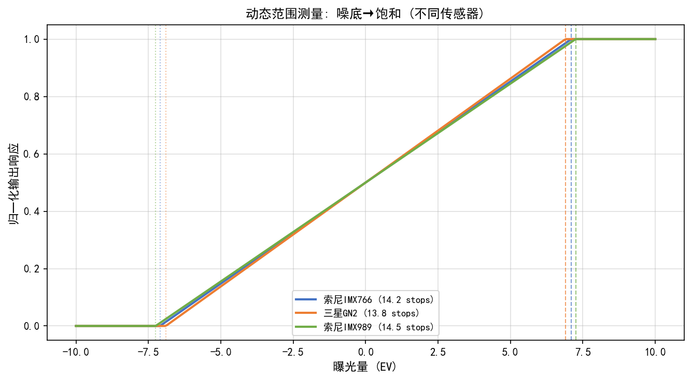
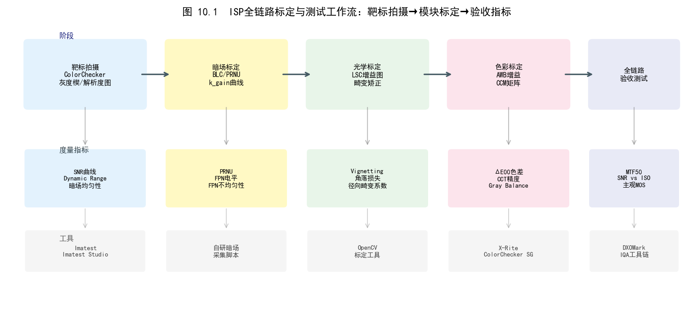
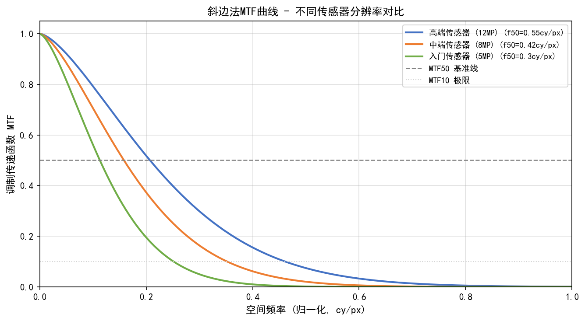
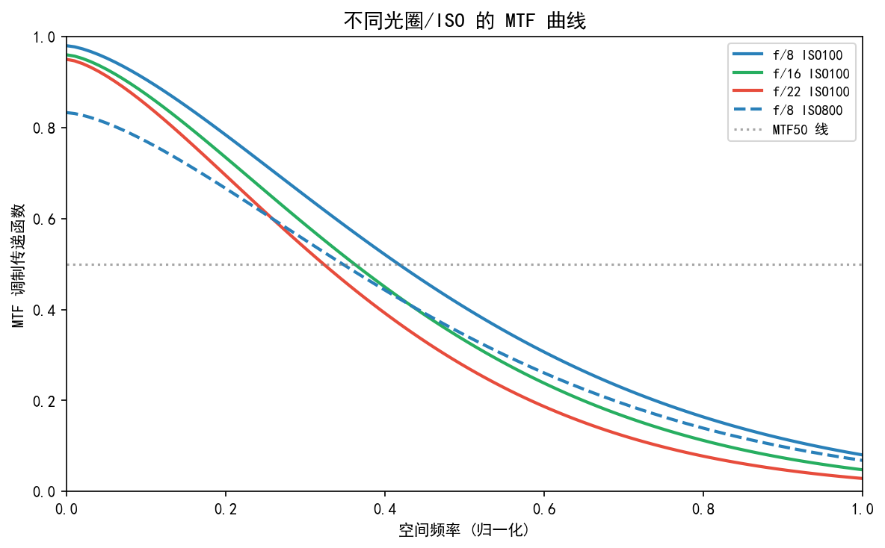
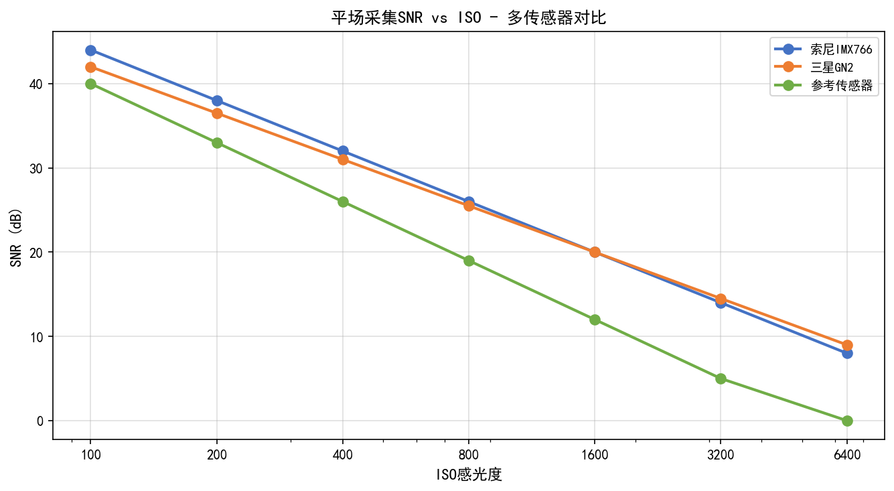
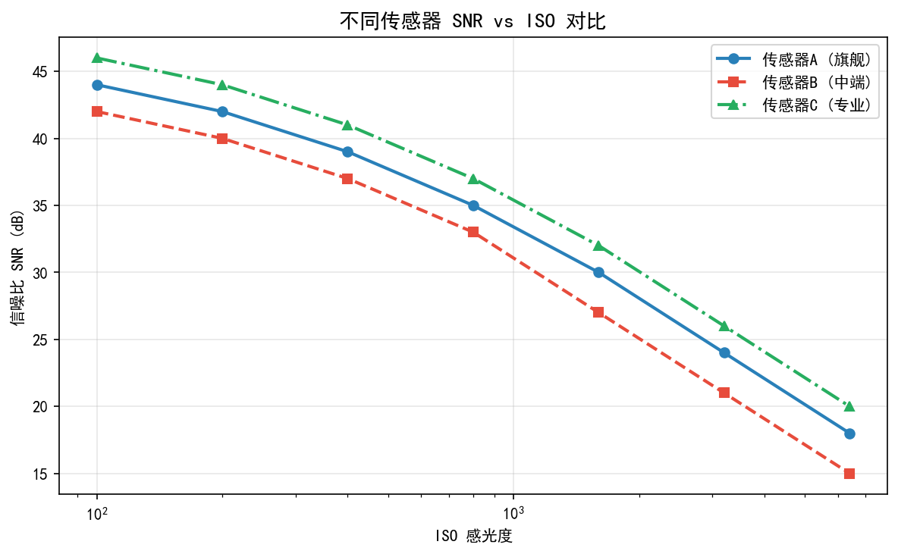
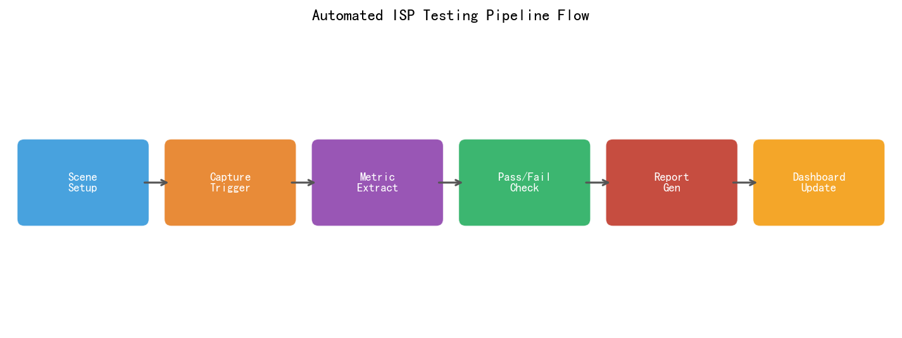
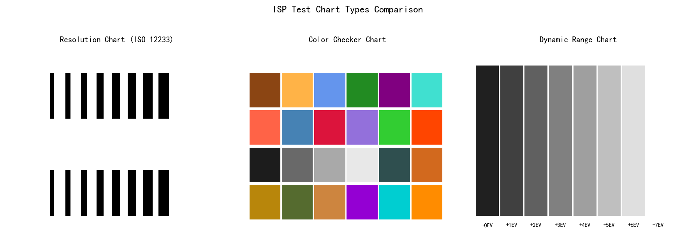
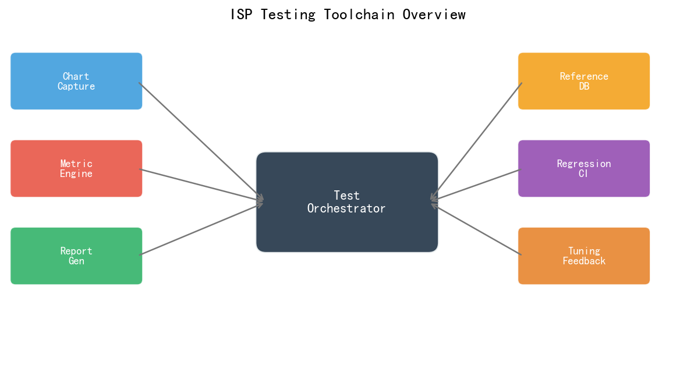

# 第四卷第10章：ISP测试与IQA工具链（Imatest / OpenCV / 自制标定板）

> **定位：** 本章覆盖ISP工程测试的完整工具链：Imatest MTF测量、ISO 12233、EMVA 1288、OpenCV颜色标定、自动化IQA评测系统搭建。
> **前置章节：** 第四卷第08章（IQA系统工程）、第四卷第04章（感知IQA）
> **读者路径：** IQA工程师、系统工程师

---

## 目录

- [§1 理论原理](#1-理论原理)
- [§2 标定与测量方法](#2-标定与测量方法)
- [§3 调参指南](#3-调参指南)
- [§4 常见测试伪影与误差来源](#4-常见测试伪影与误差来源)
- [§5 评测方法](#5-评测方法)
- [§6 代码实现](#6-代码实现)
- [参考资料](#参考资料)
- [§7 术语表](#7-术语表)

---

## §1 理论原理

### 1.1 ISP测试的工程目标

ISP测试工程师拿到一颗新传感器上线，首先要回答的就是这五个问题：

1. **分辨率（Resolution）：** ISP输出能否真实还原传感器的物理分辨率？有效像素数与标称值是否匹配？
2. **噪声（Noise）：** 在不同ISO和曝光组合下，输出图像的信噪比（SNR）是否满足规格？
3. **颜色准确性（Color Accuracy）：** AWB和CCM校正后，颜色还原的Delta E是否在可接受范围内？
4. **动态范围（Dynamic Range）：** 传感器和ISP联合处理后，可用动态范围是多少EV？
5. **镜头阴影（Lens Shading）：** LSC校正后，全画面亮度均匀性是否达标？

对应的测量工具是ISO 12233（分辨率）、EMVA 1288（噪声/DR）和ColorChecker（颜色），三者缺一不可。

**ISP 画质评估标准顺序（推荐执行流程）：**

在新传感器/新ISP版本上线前，建议按以下固定顺序执行画质评估，每一步通过后才进入下一步，确保不跳过基础指标直接进行高级评估：

```
Step 1: MTF（分辨率）
    ↓ 基础，若分辨率不达标后续评估无意义
Step 2: SNR（信噪比 @ 各ISO档位）
    ↓ 噪声基底决定动态范围上限
Step 3: DR（动态范围，EMVA 1288 PTC法）
    ↓ 确认传感器物理极限
Step 4: ΔE（色彩准确性，ColorChecker 24色，CIE 2000）
    ↓ 色彩模块校正后才能评估感知类指标
Step 5: PSNR / SSIM（与参考图像的全参考对比，ISP算法模块评估）
    ↓ 综合画质指标，用于版本A/B对比和回归测试
```

| 评估步骤 | 主要工具 | 通过门控 |
|---------|---------|---------|
| MTF（分辨率） | Imatest SFR / ISO 12233斜边法 | 中心MTF50 > 0.35 cy/px |
| SNR（信噪比） | Imatest Noise / EMVA 1288 PTC | SNR @ ISO 1600 > 30 dB |
| DR（动态范围） | EMVA 1288 PTC法 | DR > 60 dB（约10 EV） |
| ΔE（色彩） | Imatest ColorChecker | 均值ΔE₂₀₀₀ < 3.0 |
| PSNR/SSIM（感知） | OpenCV / SSIM库 | PSNR > 32 dB，SSIM > 0.85 |

> **工程原则：** MTF和SNR是ISP测试的基础门控——任何一项不合格，都说明存在光学/传感器层面的根本问题，继续进行色彩和感知评估没有意义。ΔE评估应在AWB和CCM调参完成后进行，否则色彩基线不稳定。PSNR/SSIM作为最后一步，是综合算法调优效果的量化验证。

### 1.2 MTF与分辨率测量理论

**MTF（Modulation Transfer Function，调制传递函数）** 是描述光学+传感器+ISP系统空间频率响应的核心指标。对于空间频率 $f$（单位：cycles/pixel 或 lp/mm）：

$$\text{MTF}(f) = \frac{\text{输出调制度}}{\text{输入调制度}} = \frac{(I_{\max} - I_{\min})_{\text{out}}}{(I_{\max} - I_{\min})_{\text{in}}}$$

MTF = 1.0 表示该频率完全传输（系统透明），MTF = 0 表示该频率完全消失（截止频率）。

**奈奎斯特频率（Nyquist Frequency）：** 对于像素间距 $p$，奈奎斯特频率为 $f_N = 1/(2p)$。超过奈奎斯特频率的信号会产生混叠（aliasing）。MTF在 $f_N$ 处的值（MTF50N）是评估ISP分辨率的关键参数。

**MTF50：** MTF下降到50%处对应的空间频率，单位通常为lp/mm或cy/px。MTF50越高，系统分辨率越好。

**斜边法（Slanted Edge Method）：** ISO 12233和Imatest采用的标准MTF测量方法。测量流程：
1. 拍摄倾斜角约5°的黑白边界（slanted edge）图案
2. 对斜边方向进行超分辨率采样，提取边缘扩散函数（ESF, Edge Spread Function）
3. 对ESF求导得到线扩散函数（LSF, Line Spread Function）
4. 对LSF做FFT得到MTF

斜边法的优势在于利用倾斜角实现亚像素采样，能够测量超过奈奎斯特频率的MTF（包括截止频率后的过冲，即振铃）。

### 1.3 EMVA 1288标准框架

**EMVA 1288**（European Machine Vision Association Standard 1288）是工业相机和传感器特性标准化测量的权威规范，涵盖：

**量子效率（QE, Quantum Efficiency）：** 将入射光子转化为光电子的效率：
$$\text{QE}(\lambda) = \frac{N_e}{N_{ph}(\lambda)}$$

**感光度（Responsivity）：** 每单位照度产生的数字信号输出：
$$R = \frac{\bar{\mu}_y}{\bar{\mu}_p} \cdot K$$

其中 $\bar{\mu}_y$ 为平均数字输出，$\bar{\mu}_p$ 为平均光子数，$K$ 为系统增益（DN/e$^-$）。

**噪声模型验证：** EMVA 1288通过PTC（Photon Transfer Curve）方法验证相机的噪声模型：在不同照度下拍摄均匀灰场，测量均值-方差关系（mean-variance curve）：

$$\sigma_y^2 = \sigma_d^2 + K \cdot \mu_y$$

其中 $\sigma_d^2$ 为暗电流噪声方差，$K$ 为增益，$\mu_y$ 为信号均值。线性拟合可以提取读出噪声和增益参数。

### 1.4 颜色标定理论

**颜色标定（Color Calibration）** 的目标是建立从相机RGB响应到标准色彩空间（如sRGB、CIE XYZ）的准确映射。标定流程基于以下假设：

1. 使用标准色卡（如X-Rite ColorChecker Classic 24色）作为参考
2. 每个色块有已知的 CIE XYZ 参考值（标准照明体D50/D65下测量）
3. 通过最小二乘法（Least Squares）求解CCM（Color Correction Matrix）

**CCM求解：** 给定 $N$ 个色块的相机RGB测量值 $\mathbf{R}_i \in \mathbb{R}^3$ 和对应的参考XYZ值 $\mathbf{X}_i \in \mathbb{R}^3$：

$$\min_{\mathbf{M}} \sum_{i=1}^N \| \mathbf{M} \mathbf{R}_i - \mathbf{X}_i \|^2$$

解析解为：$\mathbf{M} = \mathbf{X} \mathbf{R}^T (\mathbf{R} \mathbf{R}^T)^{-1}$，其中 $\mathbf{R}, \mathbf{X}$ 为按列堆叠的测量矩阵。

**多项式CCM：** 标准3×3 CCM对非线性颜色响应拟合不足，实践中常引入二次项扩展特征：$\tilde{\mathbf{r}} = [R, G, B, R^2, G^2, B^2, RG, RB, GB, 1]^T$，使用3×10 CCM。

---

## §2 标定与测量方法

### 2.1 Imatest工具链

**Imatest** 是工业界最广泛使用的相机图像质量测试软件，支持以下核心测量：

**MTF测量（SFR模块）：**
- 输入：包含斜边图案的RAW或JPEG图像
- 输出：MTF曲线、MTF50、MTF50P（归一化到奈奎斯特频率的MTF50）
- 支持多区域测量：中心、四角、边缘区域的MTF分布（镜头像差评估）

**噪声测量（Noise模块）：**
- 输入：均匀灰场图像（平场，flat field）
- 输出：不同信号水平下的RMS噪声、信噪比（SNR）、动态范围（DR）

**色卡分析（ColorChecker模块）：**
- 输入：含X-Rite ColorChecker的图像
- 输出：各色块Delta E（CIE76/CIE2000）、白点偏差、颜色矩阵建议值

**镜头阴影（Uniformity模块）：**
- 输入：均匀照明的白板图像
- 输出：全画面亮度均匀性图、角落亮度比（corner/center luminance ratio）

### 2.2 ISO 12233测试卡与流程

ISO 12233标准规定了用于测量相机分辨率的标准测试卡（resolution test chart）格式。常用测试图卡形态：

- **ISO 12233 原版图卡：** 包含分辨率楔形（Siemens Star）和斜边区域，既可目视读数（线对/图高，LPH），也可通过斜边法软件分析得到 MTF 曲线；适合验证是否满足传统 LPH 分辨率规格。
- **SFRplus 测试图（Imatest 专有格式）：** 在 ISO 12233 斜边基础上增加密集正方形图案矩阵，支持全画面多区域（通常 35–45 个区域）MTF 同步分析；自动检测图卡角点，减少手动 ROI 操作，适合量产自动化测试流水线。
- **eSFR ISO（Enhanced SFR ISO，即 ISO 12233:2017 推荐图案）：** 2014 年 ISO 12233 修订版引入的增强型图卡，整合斜边矩阵与噪声/均匀度测量区域，支持单张图卡同时完成 MTF、噪声、色彩 SNR 评估；Imatest 的 eSFR ISO 模块直接支持该格式的自动化分析。

**工程选型建议：** 量产自动化测试优先选 SFRplus（Imatest 生态完整，自动多点测量）；ISO 兼容性验证使用 eSFR ISO；与客户或监管机构沟通分辨率规格时引用 ISO 12233 LPH 数值。

推荐测试流程：

1. **环境准备：**
   - 照度：1000-2000 lux，色温 D50（5000K）或 D65（6500K）（ISO 12233:2017 Annex C 规定）
   - 镜头光圈：f/5.6至f/8（避免衍射和像差极端区域）
   - 对焦：手动精确对焦于测试卡面

2. **拍摄参数：**
   - ISO：100（基准ISO，最低噪声）
   - 快门速度：不产生运动模糊（1/200s以上）
   - RAW+JPEG同时保存，分别评估传感器和ISP的贡献

3. **分析：**
   - 使用Imatest或Matlab/OpenCV分析斜边区域
   - 记录中心MTF50、四角MTF50，计算像场均匀性

4. **典型规格（智能手机主摄）：**
   - 中心MTF50 > 0.35 cy/px
   - 角落/中心MTF50比 > 0.6
   - MTF @ 奈奎斯特 > 0.1（避免严重混叠）

### 2.3 EMVA 1288测量流程

**PTC（Photon Transfer Curve）测量步骤：**

1. **暗帧采集：** 遮盖镜头，拍摄系列图像（>50帧），计算暗电流均值和方差
2. **亮帧采集：** 均匀照明光源（积分球或均匀照明板），从低照度到饱和照度拍摄系列图像（每档照度≥10帧）
3. **均值-方差计算：** 对每档照度，计算ROI区域的均值 $\mu$ 和方差 $\sigma^2$（使用时间序列方差，消除PRNU影响）
4. **线性拟合：** 对 $(\mu, \sigma^2)$ 点做线性拟合，提取斜率（增益 $K$）和截距（读出噪声 $\sigma_d^2$）
5. **动态范围计算：** $DR = 20 \log_{10}(FWC / \sigma_d)$（dB），其中 $FWC$ 为满阱容量（Full Well Capacity）

### 2.4 ISO 12232:2019 感光度（ISO Speed）测量

**ISO 12232:2019**（Photography — Digital still cameras — Determination of exposure index, ISO speed ratings, standard output sensitivity, and recommended exposure index）是数字相机感光度标定的权威国际标准，与 EMVA 1288 测量噪声/DR 不同，ISO 12232 专门定义了向消费者报告的 ISO 感光度数值如何从物理测量中推导。

**标准定义的四种感光度指标：**

| 指标 | 英文全称 | 定义方法 | 适用场景 |
|------|---------|---------|---------|
| SOS | Standard Output Sensitivity | 基于输出图像信噪比（SNR = 40，对应 18% 灰板亮度信噪比 > 40:1）推导 | 消费类相机 ISO 标称值（最常用） |
| REI | Recommended Exposure Index | 厂商自定义（以获得厂商认为最佳曝光为目标），无信噪比约束 | 旗舰手机（苹果/谷歌/华为用此方法覆盖 Computational ISP 场景） |
| REIS | Recommended Exposure Index for Still | REI 的静态图像变体 | — |
| Saturation-based | — | 基于传感器满阱容量的最大信号推导 | 工业/广播相机 |

**SOS 推导方法（简化流程）：**

1. 拍摄 18% 反射率灰板（满足 ISO 12232 照明规范，通常 D65 2000 lux）
2. 测量输出图像中灰板区域的亮度均值 $\bar{y}$ 和标准差 $\sigma_y$
3. 计算 SNR = $\bar{y} / \sigma_y$
4. 调整曝光，找到使 SNR ≥ 40 的最低照度曝光值
5. 由此推导 ISO SOS = $10 / H_{SOS}$（其中 $H_{SOS}$ 为对应的曝光量，单位 lux·s）

**工程意义：** 手机 ISP 中 Computational Photography（多帧合并、AI-NR）会显著改变有效 ISO 曲线——同样的传感器物理增益（gain），经过 MFNR 后输出 SNR 提升 $\sqrt{N}$ 倍，导致 SOS 计算结果偏高。旗舰手机厂商普遍使用 REI 方法，由厂商自定义"最佳 ISO 起点"，使 ISO 标称值与用户感知曝光一致，而非严格遵循 SOS 的 SNR=40 阈值。

### 2.5 OpenCV颜色标定流程

OpenCV提供了完整的颜色标定工具链，支持色卡检测和CCM计算：

**色卡检测（自动化流程）：**
- `cv2.mcc.CCheckerDetector`：自动检测ColorChecker色卡位置和色块
- 支持多种色卡格式：Classic 24, Passport, Digital SG

**色彩空间变换验证：**
- 使用`cv2.cvtColor`在RGB/XYZ/Lab空间之间转换
- 通过Delta E评估标定精度

---

## §3 调参指南

### 3.1 MTF测量的关键影响因素

**斜边倾角选择：** ISO 12233推荐5°±0.5°。倾角过大（>10°）会降低超分辨率采样密度，影响高频MTF精度；倾角过小（<2°）会减少有效采样点数，增加估计误差。

**感兴趣区域（ROI）大小：** Imatest建议ROI包含10-100行像素（在斜边方向）。ROI过小时，估计方差大；ROI过大时，镜头场曲（field curvature）导致不同位置的PSF差异被平均，MTF测量偏低。

**锐化（Sharpening）对MTF的影响：** ISP中的锐化算法会人为提高MTF，使MTF50数值高于光学+传感器的真实分辨率。测试时建议：
- 关闭ISP锐化（通过参数配置或使用RAW）单独测量光学分辨率
- 开启锐化后测量，记录ISP对MTF的"增益"量

**典型陷阱：** JPEG压缩的DCT块效应会在MTF曲线上制造高频假峰（spurious resolution）——看起来高频响应很好，实际是压缩块边界的周期性能量。MTF分析要用RAW或最高质量JPEG（压缩率>90%），否则量的是压缩算法而不是光学系统。

### 3.2 颜色标定的优化策略

**Delta E指标选择：**
- CIE76（$\Delta E_{76}$）：简单欧氏距离，计算快，但与人眼感知相关性低
- CIE2000（$\Delta E_{00}$）：考虑感知均匀性的加权距离，是目前推荐标准
- 工业接受标准：$\Delta E_{00} < 3$ 为可接受，$< 1$ 为优秀

**CCM约束：** 无约束最小二乘CCM可能产生物理上不合理的矩阵（如负权重），导致某些颜色失真。实践中建议添加约束：
- 行和约束（row sum = 1）：保持灰度轴不受颜色串扰
- 非负约束（non-negative entries）：通过约束最小二乘（NNLS）实现
- 正则化（Tikhonov regularization）：$\| \mathbf{M} - \mathbf{I} \|_F^2$ 作为正则项，使CCM向单位矩阵靠拢，限制色彩失真范围

**多光源标定：** 单一光源下标定的CCM只在该色温附近准确——在2700K钨丝灯下用D65标定的CCM，拍出来的皮肤色必然偏红。至少要在2700K/4000K/6500K三档分别标定，AWB估计出色温后查表插值选CCM。

> **工程推荐（手机ISP场景）：** CCM标定至少覆盖2700K（钨丝灯）、4150K（CWF荧光灯）、6500K（D65日光）三档；如果产品需要在极端低色温（烛光1800K）下表现正常，还要加一档。色温插值选线性插值即可，不需要高阶——两档CCM之间本就是线性变化，非线性插值在大多数场景没有实质提升。

### 3.3 自动化测试系统搭建

**测试夹具（Test Fixture）设计：**
- 使用步进电机驱动测试卡位置，自动切换不同测试图案
- 照明控制：可编程LED灯箱，支持色温和照度独立控制
- 相机接口：通过USB3 UVC或MIPI CSI接口采集RAW数据

**批次测试数据管理：**
- 每台设备的测试结果按序列号存储
- 定义pass/fail判决阈值，自动生成合格证书
- 统计过程控制（SPC）：绘制Cpk图，监控批次间性能漂移

---

## §4 常见测试伪影与误差来源

### 4.1 MTF测量的系统误差

**倾角估计误差：** 如果斜边倾角计算不准确，超分辨率采样会产生相位误差，导致MTF曲线出现虚假振荡。

**解决方法：** 使用亚像素精度的斜边角度估计算法（Hough变换或Radon变换），精度要求优于0.1°。

**测试卡印刷质量：** 测试卡的边缘锐度（edge acuity）和密度（Dmax）直接影响MTF测量精度。测试卡边缘的MTF应远高于被测系统，要求测试卡边缘MTF在奈奎斯特频率处 > 0.5。

**振动（Vibration）：** 相机或测试卡的微小振动会使MTF测量结果偏低（等效于额外的运动模糊）。建议使用防震台，并在测量前验证环境振动水平（加速度计监控）。

### 4.2 颜色测量的误差来源

**荧光偏差（Fluorescence）：** ColorChecker色卡的荧光效应在UV-rich光源下会引起偏差。使用校准后的标准光源（CIE A、D65）可减少此误差。

**色卡老化（Aging）：** ColorChecker色卡的色块会随时间氧化褪色，建议每6-12个月进行一次色卡再标定（与分光光度计测量值比对）。

**视角效应（Angular Effects）：** 色卡在非垂直入射光下会产生镜面反射，导致测量点亮度不均匀。拍摄时相机轴线应垂直于色卡平面，光源从45°方向照射（避免正面直射）。

### 4.3 自动化测试系统的常见问题

**重复性（Repeatability）偏差：** 同一相机多次测试的MTF50差异超过2% ，通常由以下原因引起：
- 自动对焦结果不一致（建议使用手动固定对焦）
- 测试卡位置每次略有不同（使用机械定位）
- 照明不稳定（照明灯需要热机稳定时间，通常10分钟）

**批次间（Lot-to-Lot）漂移：** 镜头组装公差导致不同批次MTF50差异较大，需要建立Cpk过程能力指数监控。

---

## §5 评测方法

### 5.1 多维度综合评分体系

单指标通过不能代表整体画质合格。下表是一套实用的加权综合评分体系（IQA Scorecard），权重基于消费手机场景的MOS相关性研究经验值，量产前需根据产品定位重新标定：

| 测试维度 | 指标 | 权重（示例） | 评测工具 |
|---------|------|------------|---------|
| 分辨率 | MTF50（中心） | 25% | Imatest SFR |
| 噪声 | SNR @ ISO 1600 | 20% | Imatest Noise |
| 颜色 | Delta E00（均值） | 20% | Imatest ColorChecker |
| 动态范围 | DR（dB） | 15% | EMVA 1288 |
| 镜头阴影 | 角落/中心比 | 10% | Imatest Uniformity |
| 白平衡 | CCT误差（K） | 10% | Imatest AWB |

**综合得分：** $S = \sum_i w_i \cdot s_i$，其中 $s_i$ 为各维度的归一化分数（0-100）。

### 5.1b 平台专用 ISP 调试工具链

Imatest 和 OpenCV 解决的是**离线画质量化评测**问题，而手机 SoC 厂商各自提供了专用的**在线调试工具链**，用于寄存器级实时调试和 ISP 参数注入。两套工具链互补，不能互相替代。

**高通平台（Qualcomm Snapdragon）：**

- **QCAT（Qualcomm Camera Autofocus Tool）**：高通相机算法团队内部及合作 OEM 使用的全功能调试前端，支持通过 USB/ADB 实时读写 Chromatix 参数（XML 格式），可即时下发 ISP 寄存器修改并查看预览效果。QCAT 内置 3A 统计数据可视化（AE 直方图、AWB 统计 patch、AF 统计图），是高通平台调 ISP 参数的核心工具。
- **QXDM（Qualcomm Extensible Diagnostic Monitor）**：高通芯片通用诊断工具，可抓取包含 ISP 算法日志在内的 diag 流，用于定位 3A 控制异常、Chromatix 参数不生效等问题。ISP 工程师用 QXDM 主要查看 AEC/AWB 的逐帧统计 log，与 QCAT 配合使用（QCAT 注参数 + QXDM 看效果日志）。
- **CamX / CHI Override**：基于高通开源 CamX 框架，OEM 可通过 CHI Override 接口注入自定义算法节点，实现比 Chromatix 更细粒度的 ISP 控制，详见 `github.com/quic/camx`（BSD-3 公开）。

**MTK 平台（MediaTek Dimensity）：**

- **Camera Tuning Tool（CTT）**：MTK 官方 ISP 调参工具，支持 FeaturePipe 参数实时注入（通过 ADB 转发到 `/proc/driver/mtkisp/` 或 `/dev/camera-isp`），可调试 3DNR、MFNR、多帧 HDR 等模块参数。CTT 的 "Live View" 模式支持参数变化即时反映在预览流。
- **NeuroPilot Profiler**：专用于 APU（AI 加速单元）上 DL ISP 模型的延迟分析，可输出各算子级的逐层延迟和内存带宽消耗，指导模型量化和算子替换。
- **Android Camera2 Debug Bridge**：MTK 平台 Android 层通过 `/data/vendor/camera/` 下的 Debug Dump 接口导出各帧的 ISP 内部统计数据（AE/AWB/Noise raw stats），配合 Python 脚本离线分析。

**海思平台（HiSilicon Kirin，华为内部）：**

- **ISP Tune Tool（调参工具）**：华为内部 ISP 调试工具，未对外公开。外部研究人员/第三方 OEM 通常通过以下方式间接调试：
  - `adb shell setprop camera.debug.xxx` 属性控制开关各 ISP 模块 debug dump
  - `/data/vendor/camera/` 目录下的 ISP 统计 dump 文件（须 root 权限或工程模式）
  - 华为 HiCamera SDK 提供的 `ISPTuningActivity`（工程机专用，非量产）
- **海思 ISP 寄存器调试**：通过 `/dev/isp_dev` 字符设备节点进行寄存器读写（需内核模块权限），适合底层 bring-up 阶段的 ISP 硬件调试。

> **工程师注意：** 以上平台工具链均需通过相应厂商的合作协议获取完整文档和工具授权；QXDM/QCAT 需要高通 OEM 合作协议，CTT 需要 MTK partner 资质。公开渠道仅能获取基础 ADB debug 功能，专业 ISP 调试必须走 SoC 厂商的合作渠道。

### 5.1c DXOMARK 评测方法论参考

**DXOMARK** 是工业界最广泛引用的手机/相机 IQA 第三方测评机构（总部法国，原隶属 DXO Labs），其评测结果直接影响旗舰手机的市场定位。理解 DXOMARK 方法论有助于 ISP 工程师预判自己产品在公开评测中的表现，并针对性调参。

**DXOMARK MOBILE 评分体系概要（2024 版）：**

DXOMARK MOBILE 综合分由**照片（Photo）**、**视频（Video）**和**缩放（Zoom）**三大维度加权合成：

| 维度 | 权重（约） | 核心子项 |
|------|---------|---------|
| 照片（Photo） | ~50% | 曝光准确性、色彩准确性、噪声抑制、纹理细节、伪影、自动白平衡、人像对焦 |
| 视频（Video） | ~35% | 曝光稳定性、色彩稳定性、噪声、纹理、稳定性（EIS/OIS）、自动对焦跟踪 |
| 缩放（Zoom） | ~15% | 各焦段（0.6×、1×、3×、5×以上）分辨率和色彩一致性 |

**DXOMARK 与 ISO/Imatest 测量的对应关系：**

| DXOMARK 评分项 | 对应 ISO/Imatest 指标 | DXOMARK 测量方法特点 |
|--------------|---------------------|-------------------|
| 纹理细节（Texture） | MTF50（中心+四角） | 真实场景拍摄（砖墙/草地），非图卡；主观+客观混合评分 |
| 噪声（Noise） | EMVA 1288 SNR | 多场景（室内/室外/夜景）多 ISO 档位综合 |
| 色彩（Color） | ΔE2000（X-Rite ColorChecker） | 多色温测试（D65/A光/日光）；色温误差 ΔT < 100K 为优 |
| 曝光（Exposure） | 亮度误差（EV 偏差） | 动态追踪：人物走动时曝光稳定性评分 |
| 伪影（Artifacts） | 主观评估（训练评测员 MOS） | 包括 HDR 光晕、摩尔纹、混叠、过锐化振铃 |
| 缩放一致性 | 跨焦段 ΔE + MTF 对比 | 1×→3×→5× 焦段切换时色彩/白平衡一致性 |

**对 ISP 工程师的指导价值：**
1. DXOMARK 噪声评分高度依赖**夜景 SNR**（低照度真实场景），提升夜景 MFNR/AI-NR 效果对分数影响显著；
2. "伪影"类扣分项（HDR 光晕、EIS 果冻效应）是旗舰手机 ISP 调参的常见痛点，需专项测试场景回归；
3. DXOMARK 测试流程不公开所有细节，部分分数来源于主观评测员打分（MOS），有一定非确定性——内部调参不能完全以 DXOMARK 分数为导向，应以实验室客观指标（ISO 12233/EMVA 1288/ΔE2000）为量化基准。

> *参考：DXOMARK, "DXOMARK Mobile Test Methodology v4.0" (2023), dxomark.com/dxomark-mobile-test-protocol/（部分内容不公开）；Cao F. et al., "A Perceptual Image Quality Metric for Camera Systems," SPIE Electronic Imaging 2010*

### 5.2 全自动化IQA流水线

生产线上的IQA流水线需要满足：
- **速度：** 每台设备测试时间 < 30秒（包括图像采集+分析）
- **准确性：** 误判率（False Accept + False Reject）< 0.1%
- **可追溯性：** 所有测试数据（RAW图像+测试结果）存档备查

**流水线架构：**
1. 设备接入（USB/ADB/MIPI）→ 触发拍摄
2. RAW图像传输至测试主机
3. 并行执行各测试模块（多线程）
4. 汇总结果，与阈值对比
5. 输出pass/fail判决 + 测试报告

### 5.3 CI/CD集成与自动化回归

ISP算法的持续集成（CI/CD）要求测试框架能够在每次代码或参数变更后自动触发回归对比，及早发现画质退化。

**CI/CD触发机制：**
- **Git钩子（Post-Commit/Pre-Merge）：** 每次ISP参数文件（Chromatix XML、NDD binary）或算法代码提交后，自动触发测试任务队列
- **差分测试（Delta Test）：** 仅对本次提交涉及的ISP模块运行对应的测试集（如NR参数变更只触发噪声/MTF测试，不重跑完整色彩标定），减少测试时间
- **基线比较（Baseline Comparison）：** 每个测试结果与已标注的黄金基线（Golden Baseline，见下节）对比，超出容差范围则标记为回归（Regression）

**典型CI/CD工作流：**
```
开发者提交ISP参数变更（Git commit）
    ↓ CI服务器（Jenkins/GitLab CI）检测到变更
    ↓ 触发测试任务队列
    ↓ 测试主机连接标准测试夹具
    ↓ 按模块差分执行IQA测试集（MTF/Noise/Color/DR）
    ↓ 生成报告，与Golden Baseline对比
    ↓ 若任意指标退化 > 容差 → 发送告警，阻止合并
    ↓ 通过 → 更新Baseline数据库，允许合并
```

**容差定义原则：** 客观指标的回归容差应基于测试系统的Gage R&R误差（通常取2σ测量误差）而非固定百分比，避免测量噪声本身触发误报。

### 5.4 IQ Lab主观评分与客观指标的相关性建立

自动化客观测试不能完全替代主观评测，建立两者的相关性是IQ Lab工作的核心任务。

**相关性建立方法（PLCC + SROCC）：**

对同一批测试样本同时收集主观MOS（Mean Opinion Score）和客观指标（MTF50、SNR、ΔE等），计算皮尔逊线性相关系数（PLCC）和斯皮尔曼秩相关系数（SROCC）：

$$\text{SROCC} = 1 - \frac{6\sum_i d_i^2}{n(n^2-1)}$$

其中 $d_i$ 为样本 $i$ 在主观排序与客观排序中的秩差。SROCC > 0.9 认为客观指标与主观感知强相关，可用于替代主观评测的自动化判决。

**实践中的相关性陷阱：**
- MTF50高但主观分低：通常是过度锐化（Ringing）引起，此时MTF50与主观分呈负相关，需加入振铃伪影检测项
- SNR高但主观分低：过度降噪导致蜡像效应，SNR单指标失效，需补充SSIM或纹理保留指数
- 单指标SROCC良好但组合预测差：建议用多变量回归（Lasso/Ridge）建立组合预测模型

**IQ Lab建立相关性数据库的最小样本量建议：**
- 每类失真类型（压缩/噪声/模糊/偏色）至少30个样本点（对应30种不同强度水平）
- 主观评测者 ≥ 10人，去除异常评分后计算MOS
- 相关性验证使用5折交叉验证，防止过拟合

### 5.3 统计分析与过程控制

**Gage R&R（Gauge Repeatability and Reproducibility）分析：** 评估测试系统本身的变异占总变异的比例。要求测试系统变异 < 总变异的10%（即Gage R&R < 10%），否则测试系统精度不足以有效区分产品差异。

**Cpk过程能力指数：**
$$Cpk = \min\left(\frac{USL - \bar{X}}{3\sigma}, \frac{\bar{X} - LSL}{3\sigma}\right)$$

要求 $Cpk > 1.33$（等效于不良率 < 64 ppm）。MTF50和Delta E的Cpk是量产质量管控的关键指标。

---

## §6 代码实现

### 6.1 斜边MTF计算（Python实现）

```python
import numpy as np
import cv2
from typing import Tuple, Optional
import matplotlib
matplotlib.use('Agg')
import matplotlib.pyplot as plt
from scipy import signal, interpolate


def detect_slanted_edge(image: np.ndarray,
                        roi: Optional[Tuple[int, int, int, int]] = None
                        ) -> Tuple[np.ndarray, float]:
    """
    检测图像中的斜边区域，返回ROI灰度图和斜边角度
    image: [H, W] 或 [H, W, 3] uint8
    roi: (x, y, w, h) 或 None（自动检测）
    """
    if image.ndim == 3:
        gray = cv2.cvtColor(image, cv2.COLOR_BGR2GRAY).astype(np.float64)
    else:
        gray = image.astype(np.float64)

    if roi is not None:
        x, y, w, h = roi
        gray = gray[y:y+h, x:x+w]

    # 使用Canny+Hough检测斜边角度
    edges = cv2.Canny(gray.astype(np.uint8), 50, 150)
    lines = cv2.HoughLines(edges, 1, np.pi / 180, threshold=50)
    if lines is not None:
        angles = [line[0][1] for line in lines[:5]]
        angle_deg = np.degrees(np.median(angles)) - 90  # 转换为相对水平方向的角度
    else:
        angle_deg = 5.0  # 默认5度

    return gray, angle_deg


def compute_esf(gray: np.ndarray,
                angle_deg: float,
                oversample: int = 4) -> Tuple[np.ndarray, np.ndarray]:
    """
    从斜边图像计算ESF（边缘扩散函数）
    利用倾角实现亚像素采样

    gray: [H, W] float64，斜边区域
    angle_deg: 斜边倾角（度），相对于垂直方向
    oversample: 超采样倍率
    返回: (positions, esf_values) 亚像素精度的ESF
    """
    H, W = gray.shape
    tan_angle = np.tan(np.radians(angle_deg))

    # 计算每行像素到边缘的亚像素位置
    pixel_positions = []
    pixel_values = []

    for row in range(H):
        # 估计该行边缘的x坐标（基于整体角度）
        edge_x_center = W / 2 + row * tan_angle
        for col in range(W):
            # 相对于边缘的亚像素偏移
            offset = (col - edge_x_center) * oversample
            pixel_positions.append(offset)
            pixel_values.append(gray[row, col])

    # 按位置排序
    positions = np.array(pixel_positions)
    values = np.array(pixel_values)
    sort_idx = np.argsort(positions)
    positions = positions[sort_idx]
    values = values[sort_idx]

    # 直方图平均（bin averaging）到均匀网格
    bin_width = 1.0  # 1/oversample 像素
    bin_edges = np.arange(positions.min(), positions.max() + bin_width, bin_width)
    bin_centers = (bin_edges[:-1] + bin_edges[1:]) / 2
    esf = np.zeros(len(bin_centers))
    counts = np.zeros(len(bin_centers))

    for pos, val in zip(positions, values):
        idx = int((pos - positions.min()) / bin_width)
        if 0 <= idx < len(esf):
            esf[idx] += val
            counts[idx] += 1

    valid = counts > 0
    esf[valid] /= counts[valid]

    # 插值填充空洞
    if not valid.all():
        f_interp = interpolate.interp1d(
            bin_centers[valid], esf[valid],
            kind='linear', fill_value='extrapolate')
        esf = f_interp(bin_centers)

    return bin_centers, esf


def esf_to_mtf(esf: np.ndarray,
               oversample: int = 4) -> Tuple[np.ndarray, np.ndarray]:
    """
    从ESF计算MTF
    1. ESF求导 → LSF（线扩散函数）
    2. LSF加窗 → 减少截断效应
    3. FFT → MTF

    返回: (frequencies, mtf) 频率单位为 cycles/pixel（0到0.5）
    """
    # 数值微分得到LSF
    lsf = np.diff(esf)
    lsf = np.append(lsf, lsf[-1])  # 保持长度一致

    # 汉明窗（减少频谱泄漏）
    window = np.hamming(len(lsf))
    lsf_windowed = lsf * window

    # FFT
    fft_result = np.abs(np.fft.fft(lsf_windowed))
    fft_result = fft_result[:len(fft_result) // 2]  # 取正频率部分

    # 归一化（DC分量归1）
    if fft_result[0] > 0:
        fft_result /= fft_result[0]

    # 频率轴（cycles/pixel，考虑oversample倍率）
    freqs = np.linspace(0, 0.5, len(fft_result))  # 0到奈奎斯特

    return freqs, fft_result


def find_mtf50(freqs: np.ndarray, mtf: np.ndarray) -> float:
    """
    找到MTF=0.5对应的空间频率（MTF50）
    使用线性插值
    """
    # 找到MTF从大到小穿过0.5的位置
    for i in range(len(mtf) - 1):
        if mtf[i] >= 0.5 >= mtf[i + 1]:
            # 线性插值
            t = (0.5 - mtf[i]) / (mtf[i + 1] - mtf[i])
            return freqs[i] + t * (freqs[i + 1] - freqs[i])
    return freqs[-1]  # 若MTF始终 > 0.5，返回最大频率


def compute_mtf_from_image(image_path: str,
                            roi: Optional[Tuple[int, int, int, int]] = None,
                            oversample: int = 4) -> dict:
    """
    完整MTF分析流程
    输入: 图像路径（建议为16bit RAW转换的TIFF）
    输出: MTF分析结果字典
    """
    image = cv2.imread(image_path, cv2.IMREAD_GRAYSCALE)
    if image is None:
        raise FileNotFoundError(f"无法读取图像: {image_path}")

    gray, angle_deg = detect_slanted_edge(image, roi)
    positions, esf = compute_esf(gray, angle_deg, oversample=oversample)
    freqs, mtf = esf_to_mtf(esf, oversample=oversample)
    mtf50 = find_mtf50(freqs, mtf)

    # 奈奎斯特频率处的MTF（f = 0.5 cy/px）
    nyquist_idx = np.argmin(np.abs(freqs - 0.5))
    mtf_nyquist = mtf[nyquist_idx]

    return {
        'mtf50': mtf50,
        'mtf_nyquist': mtf_nyquist,
        'edge_angle_deg': angle_deg,
        'freqs': freqs,
        'mtf': mtf,
        'esf': esf,
        'esf_positions': positions
    }


# ─────────────────────────────────────────────
# ColorChecker颜色标定（OpenCV）
# ─────────────────────────────────────────────

def compute_ccm_least_squares(
        measured_rgb: np.ndarray,
        reference_xyz: np.ndarray,
        regularization: float = 0.01) -> np.ndarray:
    """
    最小二乘CCM计算（带Tikhonov正则化）

    measured_rgb: [N, 3] 相机测量的线性RGB值（已归一化）
    reference_xyz: [N, 3] 参考XYZ值（D65光源，已归一化）
    regularization: 正则化系数，防止过拟合

    返回: [3, 3] CCM矩阵 M，使得 M @ rgb ≈ xyz
    """
    N = measured_rgb.shape[0]
    R = measured_rgb.T  # [3, N]
    X = reference_xyz.T  # [3, N]

    # 带正则化的最小二乘：min ||M@R - X||^2 + lambda*||M-I||^2
    I = np.eye(3)
    # 每行独立求解（3个独立的回归问题）
    ccm = np.zeros((3, 3))
    for ch in range(3):
        # (R@R^T + lambda*I) @ m = R@x^T + lambda*e
        A = R @ R.T + regularization * np.eye(3)
        b = R @ X[ch] + regularization * I[ch]
        ccm[ch] = np.linalg.solve(A, b)

    return ccm


def compute_delta_e_2000(lab1: np.ndarray,
                          lab2: np.ndarray) -> np.ndarray:
    """
    CIE Delta E 2000计算
    lab1, lab2: [..., 3] Lab色空间值（L*a*b*）
    返回: [...] Delta E 2000值

    注：完整实现参见colormath库
    此处为简化版（仅使用CIE76公式作为近似）
    """
    diff = lab1.astype(np.float64) - lab2.astype(np.float64)
    # 简化版CIE76（实际生产中应使用完整CIEDE2000公式）
    delta_e = np.sqrt(np.sum(diff ** 2, axis=-1))
    return delta_e


def evaluate_color_accuracy(
        image: np.ndarray,
        patch_coords: np.ndarray,
        reference_lab: np.ndarray,
        patch_size: int = 20) -> dict:
    """
    评估颜色准确性

    image: [H, W, 3] uint8 BGR图像
    patch_coords: [N, 2] 各色块中心坐标 (x, y)
    reference_lab: [N, 3] 参考Lab值
    patch_size: 色块采样窗口大小（像素）

    返回: 颜色评估结果字典
    """
    # 转换到Lab空间
    image_lab = cv2.cvtColor(image, cv2.COLOR_BGR2LAB).astype(np.float64)
    # OpenCV Lab范围：L [0,100], a [-127,127], b [-127,127]
    image_lab[:, :, 0] *= 100.0 / 255.0  # 归一化L
    image_lab[:, :, 1] -= 128.0           # 归一化a
    image_lab[:, :, 2] -= 128.0           # 归一化b

    half = patch_size // 2
    measured_lab = []
    for x, y in patch_coords:
        x, y = int(x), int(y)
        patch = image_lab[y-half:y+half, x-half:x+half]
        measured_lab.append(patch.mean(axis=(0, 1)))
    measured_lab = np.array(measured_lab)

    delta_e = compute_delta_e_2000(measured_lab, reference_lab)

    return {
        'mean_delta_e': delta_e.mean(),
        'max_delta_e': delta_e.max(),
        'delta_e_per_patch': delta_e,
        'measured_lab': measured_lab
    }


# ─────────────────────────────────────────────
# EMVA 1288：PTC曲线分析
# ─────────────────────────────────────────────

def analyze_ptc(mean_values: np.ndarray,
                variance_values: np.ndarray) -> dict:
    """
    PTC（Photon Transfer Curve）分析
    提取增益K、读出噪声sigma_d、动态范围DR

    mean_values: [N] 不同照度下的均值（DN）
    variance_values: [N] 对应的时间序列方差（DN^2）
    """
    # 线性拟合：sigma^2 = sigma_d^2 + K * mu
    # 排除饱和点（高照度下方差突然下降）
    valid = variance_values > variance_values[0] * 0.5
    valid &= mean_values < mean_values.max() * 0.9

    coeffs = np.polyfit(mean_values[valid], variance_values[valid], 1)
    K = coeffs[0]         # 斜率 = 增益 (DN/e-)
    sigma_d_sq = coeffs[1]  # 截距 = 读出噪声方差 (DN^2)
    sigma_d = np.sqrt(max(sigma_d_sq, 0))  # 读出噪声 (DN)

    # 满阱容量（FWC）：方差开始下降的点
    fwc_dn = mean_values[valid].max()
    fwc_electrons = fwc_dn / K

    # 动态范围（dB）
    if sigma_d > 0:
        dr_db = 20 * np.log10(fwc_dn / sigma_d)
        dr_ev = dr_db / 6.02  # 1 EV ≈ 6.02 dB
    else:
        dr_db = 0
        dr_ev = 0

    # 读出噪声（电子数）
    sigma_d_electrons = sigma_d / K

    return {
        'gain_K': K,
        'read_noise_DN': sigma_d,
        'read_noise_electrons': sigma_d_electrons,
        'fwc_DN': fwc_dn,
        'fwc_electrons': fwc_electrons,
        'dynamic_range_dB': dr_db,
        'dynamic_range_EV': dr_ev,
        'ptc_fit_coeffs': coeffs
    }


def demo_mtf_analysis():
    """演示MTF分析（使用合成斜边图像）"""
    # 生成合成斜边图像（理想边缘，约5度倾角）
    H, W = 128, 128
    image = np.zeros((H, W), dtype=np.uint8)
    angle_rad = np.radians(5)
    for row in range(H):
        edge_x = W // 2 + row * np.tan(angle_rad)
        for col in range(W):
            if col > edge_x:
                image[row, col] = 200
    # 添加轻微模糊（模拟光学PSF）
    image = cv2.GaussianBlur(image, (3, 3), 1.0)
    # 添加噪声
    noise = np.random.normal(0, 3, image.shape).astype(np.int16)
    image = np.clip(image.astype(np.int16) + noise, 0, 255).astype(np.uint8)

    # ESF和MTF计算
    gray = image.astype(np.float64)
    positions, esf = compute_esf(gray, angle_deg=5.0, oversample=4)
    freqs, mtf = esf_to_mtf(esf, oversample=4)
    mtf50 = find_mtf50(freqs, mtf)

    print(f"合成斜边MTF分析:")
    print(f"  MTF50 = {mtf50:.3f} cy/px")
    print(f"  MTF @ 奈奎斯特 (0.5 cy/px) = {mtf[len(mtf)//2]:.3f}")


def demo_ptc_analysis():
    """演示PTC分析（使用合成数据）"""
    # 模拟PTC测量数据（K=0.5, sigma_d=20 DN, FWC=60000 DN）
    K_true = 0.5
    sigma_d_true = 20.0
    mu = np.linspace(100, 55000, 50)
    sigma_sq = sigma_d_true**2 + K_true * mu
    sigma_sq += np.random.normal(0, 50, len(sigma_sq))  # 添加测量噪声

    results = analyze_ptc(mu, sigma_sq)
    print(f"\nPTC分析结果:")
    print(f"  增益 K = {results['gain_K']:.3f} DN/e-  (真值: {K_true})")
    print(f"  读出噪声 = {results['read_noise_DN']:.1f} DN "
          f"= {results['read_noise_electrons']:.1f} e-")
    print(f"  动态范围 = {results['dynamic_range_dB']:.1f} dB "
          f"= {results['dynamic_range_EV']:.1f} EV")


if __name__ == '__main__':
    demo_mtf_analysis()
    demo_ptc_analysis()
```

---


---

> **工程师手记：ISP 测试工具链的工程实践要点**
>
> **自动化图像质量回归测试体系：** 标卡测试与自然场景测试各有适用边界。ISO 12233 分辨率卡、X-Rite ColorChecker 色彩卡等标卡测试的优势在于客观可重复、指标明确（MTF50、ΔE₀₀、动态范围 dB），适合每日构建（nightly build）的自动化回归，整套测试流程在高通 RB5 平台上约 8 分钟/版本；自然场景测试通过 100～500 张标注实拍图的 BRISQUE/NIQE 均值跟踪，捕捉算法改动对真实场景的影响，但需每季度更新测试集以覆盖新功能场景。两类测试结合使用时，标卡测试发现客观指标退步（如 MTF50 下降 > 3%）必须阻断 CI，自然场景测试发现 BRISQUE 恶化 > 5% 触发人工复核但不自动阻断。
>
> **ISO 12233 在低锐度设置下的地板效应：** ISO 12233 测试卡的理论最高空间频率为奈奎斯特频率，但在实际测试中存在明显地板效应：当 ISP 锐化设置为弱档（USM strength < 0.5）或开启强降噪（NR level > 4）时，MTF30 值趋近于 0.35～0.40 lp/pixel 的噪声地板，无法区分不同弱锐化参数的差异。此时应改用 slanted-edge 法计算 SFR（Spatial Frequency Response）并关注 MTF10 值，该指标对低对比度边缘更敏感；或采用 Imatest 的 dead leaves 纹理测试卡，其 MTFnn 值在低锐度区间的分辨率约为标准卡的 2 倍，能有效区分 NR level 3/4/5 的实际效果差异。
>
> **测试环境可重复性要求：** ISP 测试结果的可重复性对测试环境有严格约束，往往被团队低估。光源色温波动 ±50K 会导致 AWB ΔE₀₀ 变化约 0.3；灯箱照度不均匀度（非均匀性 > 5%）使 AE 测试的绝对误差增加 0.08 EV；测试卡平整度（翘曲 > 1 mm）在广角镜头 MTF 边缘区域引入 2%～5% 的虚假退化。建议每月用色温计和照度计对灯箱进行校准，记录环境温度（建议 23±2°C）和湿度（40%～60%RH），并在测试报告中附上环境参数快照；当同一版本在不同测试台复测结果差异超过 MTF50 ± 4%、ΔE₀₀ ± 0.2 时，须先排查环境因素再判断算法问题。
>
> *参考：ISO 12233:2017, "Photography — Electronic still picture imaging — Resolution and spatial frequency responses"；Burns, "Slanted-Edge MTF for Digital Camera and Scanner Analysis," IS&T 2000；Imatest LLC, "Practical Guide to Lens and Camera Testing"（2024）*

## 插图



*图1. 动态范围测量方法（图片来源：Imatest LLC, 官方文档）*



*图2. ISP测试工作流程（图片来源：作者自绘）*



*图3. MTF测试图卡示意（图片来源：Imatest LLC, 官方文档）*



*图4. MTF曲线（图片来源：Imatest LLC, 官方文档）*



*图5. SNR测量方法示意（图片来源：Imatest LLC, 官方文档）*



*图6. SNR与ISO关系曲线（图片来源：作者自绘）*


---


*图7. 自动化测试流水线（图片来源：作者自绘）*



*图8. 各类测试图卡示意（图片来源：作者自绘）*



*图9. ISP测试工具链总览（图片来源：作者自绘）*

---

## 习题

**练习 1（理解）**
ISO 12233 斜边法（Slanted Edge Method）对测试环境有严格要求。请回答：（1）斜边测试卡的边缘倾斜角度推荐为 5°–10°，而不是 0° 或 45°，原因是什么？（2）斜边法测量 MTF 时，测试图像的最小分辨率要求是多少（每个像素周期内需要多少个采样点）？（3）SFR（Spatial Frequency Response，Imatest 模块名称）和 MTF50 是同一个概念吗？两者的定义有何区别？

**练习 2（计算）**
用 Python 模拟斜边 MTF 计算：给定一个理想的阶跃边缘（左半部分灰度值 = 20，右半部分 = 220），加入标准差 σ=2 的高斯噪声，然后对其进行采样（模拟 2px 倾斜边缘 ESF）。（1）从 ESF 求导得到 LSF；（2）对 LSF 做 FFT 得到 MTF 曲线；（3）读出 MTF50 对应的空间频率（cycles/pixel）。比较有噪声和无噪声两种情况下 MTF50 的差异。

**练习 3（工程设计）**
在实际量产测试中，Imatest 和自研工具对同一张测试卡的 MTF50 结果有时相差 5–10%。请设计一套排查流程：（1）列出可能导致差异的 5 个因素（标定板位置、光照均匀性、软件算法实现、色彩空间转换、图像压缩）；（2）对每个因素给出具体的验证方法；（3）如果排查后发现差异来自算法实现（两者使用不同的超采样策略），应以哪个工具为准？

**练习 4（扩展）**
EMVA 1288 标准定义了图像传感器的量子效率（QE）、读出噪声、暗电流等核心参数的测量方法，其核心工具是光子传递曲线（PTC）。请解释：（1）PTC 的测量原理是什么（信号方差 vs. 信号均值的关系）？（2）从 PTC 曲线中如何分别读出转换增益（K）、读出噪声（σ_read）和满阱容量（FWC）？（3）这些参数对 ISP 噪声模型（Poissonian-Gaussian 模型）的标定有何意义？

## 参考文献

[1] ISO 12233:2017, *Photography — Electronic Still Picture Imaging — Resolution and Spatial Frequency Responses*, *官方文档*, 2017.

[2] EMVA Standard 1288:2021, *Standard for Characterization of Image Sensors and Cameras, Release 4.0*, *官方文档*, 2021.

[3] Burns et al., "Slanted-Edge MTF for Digital Camera and Scanner Analysis", *PICS*, 2000.

[4] Imatest LLC, *Imatest Documentation: SFR, Noise, Color modules*, *官方文档*, 2024. https://www.imatest.com/docs/

[5] X-Rite Inc., *ColorChecker Classic Target*, *官方文档*, 2016.

[6] Janesick, J.R., *Scientific Charge-Coupled Devices*, SPIE Press, 2001.

[7] Ramanath et al., "Color Image Processing Pipeline", *IEEE Signal Processing Magazine*, 2005.

[8] Reinhard et al., *Color Imaging: Fundamentals and Applications*, A K Peters/CRC Press, 2010.

[9] Lukac, R. (Ed.), *Computational Photography: Methods and Applications*, CRC Press, 2018.

[10] IEEE P2020, *Automotive Image Quality Standard*, *官方文档*, IEEE Standards Association.

## §7 术语表

| 术语 | 英文全称 | 说明 |
|------|---------|------|
| CCM | Color Correction Matrix | 颜色校正矩阵 |
| Cpk | Process Capability Index | 过程能力指数 |
| DR | Dynamic Range | 动态范围（dB或EV） |
| ESF | Edge Spread Function | 边缘扩散函数 |
| EMVA | European Machine Vision Association | 欧洲机器视觉协会 |
| FWC | Full Well Capacity | 满阱容量（电子数） |
| Gage R&R | Gauge Repeatability & Reproducibility | 测量系统重复性与再现性分析 |
| LSF | Line Spread Function | 线扩散函数 |
| MTF | Modulation Transfer Function | 调制传递函数 |
| MTF50 | — | MTF下降到50%处的空间频率 |
| PSF | Point Spread Function | 点扩散函数 |
| PRNU | Photo Response Non-Uniformity | 光响应非均匀性 |
| PTC | Photon Transfer Curve | 光子传递曲线 |
| QE | Quantum Efficiency | 量子效率 |
| ROI | Region of Interest | 感兴趣区域 |
| SFR | Spatial Frequency Response | 空间频率响应（Imatest模块） |
| SNR | Signal-to-Noise Ratio | 信噪比 |
| SPC | Statistical Process Control | 统计过程控制 |
