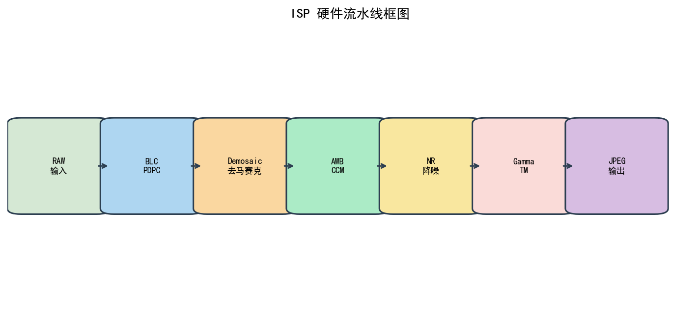
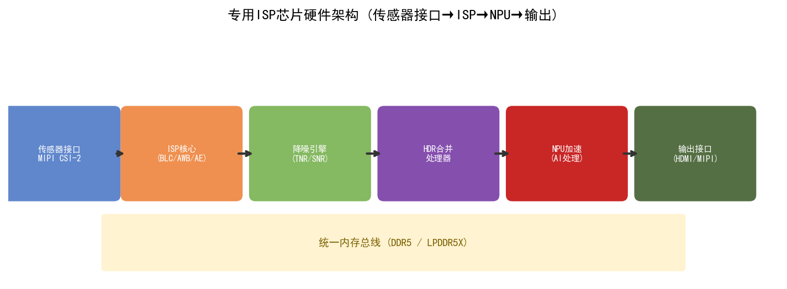
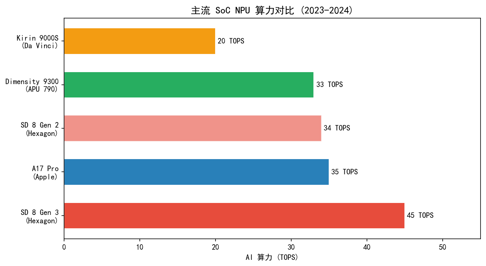
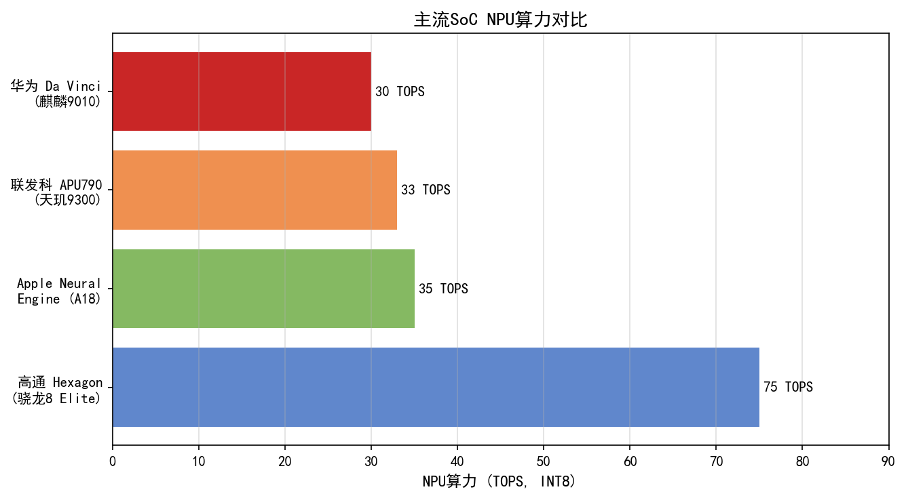
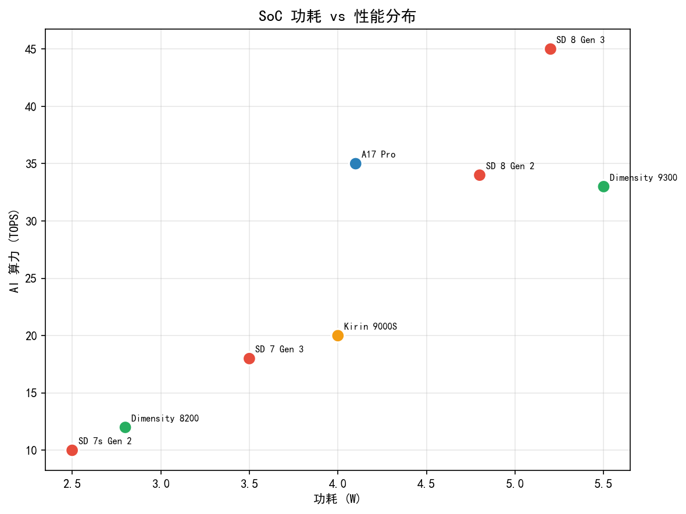
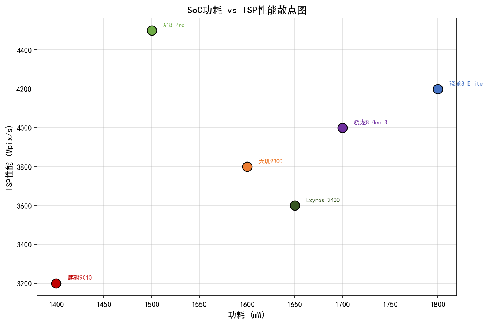
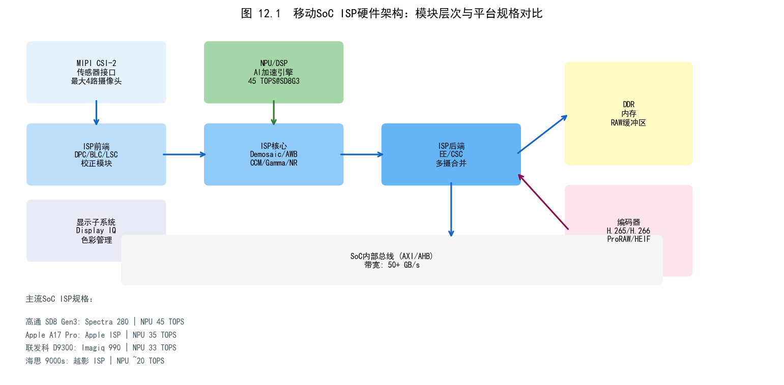

# 第四卷第12章：ISP SoC 硬件架构（FPGA / ASIC / NPU）

> **定位：** 本章系统讲解移动端 ISP SoC 的软件框架层，覆盖高通、联发科、海思三大平台的软件流水线架构（CamX IFE/BPS/IPE）、NPU 集成接口、Chromatix/NDD 标定参数格式、调参工具链与常见硬件伪影调试。
> **前置章节：** 第一卷第10章（SoC 硬件物理层）、第四卷第15章（实时ISP约束）
> **配套章节：** 第四卷第18章（相机 HAL 软件架构）、第四卷第20章（参数版本管理）、第四卷第21章（Artifact 调试）
> **读者路径：** ISP 平台工程师、算法工程师、嵌入式系统工程师

---

> **本章与第一卷第10章的分工：**
> - **第一卷第10章**：**硬件物理层**——MIPI CSI-2 接口（D-PHY/C-PHY）、ISP流水线硬件模块（BLC/DPC/LSC/Demosaic/NR寄存器级）、ZSL缓冲区存储器数学、带宽约束、NPU硬件算力（TOPS）
> - **本章（第四卷第12章）**：**软件框架层**——CamX IFE/BPS/IPE软件节点架构、Pipeline XML配置、CIQT/QXDM调参工具、Chromatix参数格式与OTA更新、MTK Camera Tool、海思越影调参套件、ISP伪影诊断与调试

---

## §1 理论原理（Theory）

### 1.1 ISP 硬件流水线总体架构

现代移动端 ISP（Image Signal Processor）是高度专用的 ASIC（Application-Specific Integrated Circuit）模块，集成在 SoC（System on Chip）内部，通过硬连线（Hard-wired）数字电路以固定拓扑实现图像处理流水线（Image Processing Pipeline）。与通用 CPU/GPU 相比，ISP 硬件的核心优势在于：

- **超低功耗：** 定制电路在固定任务上的能效比（TOPS/W）远超通用处理器；
- **确定性延迟：** 流水线深度固定，处理延迟可精确预估；
- **超高像素吞吐率（Pixel Throughput）：** 通过并行像素处理，单时钟周期可处理 4–16 个像素（4PPC/8PPC/16PPC，PPC = Pixel Per Clock）。

**三大平台硬件流水线概览：**

```
┌──────────────────────────────────────────────────────────────┐
│            高通 Snapdragon ISP 三段式架构                       │
│  MIPI → IFE (实时统计+前处理) → BPS (离线Bayer处理) → IPE (后处理+输出) │
├──────────────────────────────────────────────────────────────┤
│            联发科 Imagiq ISP 模块化架构                         │
│  MIPI → SENINF → ISP (Bayer+YUV处理) → MDP (显示后处理) → FDVT (人脸) │
├──────────────────────────────────────────────────────────────┤
│            海思 Kirin 双 ISP 架构                              │
│  MIPI → ISP0 (主摄) / ISP1 (前摄) → IPP (智能后处理) → DaVinci NPU │
└──────────────────────────────────────────────────────────────┘
```

---

#### 1.1.1 高通 Snapdragon ISP：IFE / BPS / IPE 三段架构

高通从 Snapdragon 845 开始引入三段式 ISP 架构，将传统单 ISP 拆分为三个具有不同实时性要求的处理段（Segment），各段可独立调度，支持并行流水线处理。

**IFE（Image Front End，图像前端）**

IFE 直接连接 MIPI CSI-2 接口，负责**实时**前端处理，每帧必须在传感器读出期间同步完成：

| 功能模块 | 说明 |
|---------|------|
| HDR 合并（HDR Merge） | 基于 MHDR/SHDR/VHDR 将多曝光帧在 Bayer 域合并 |
| Black Level Correction (BLC) | 减去传感器暗电流偏置 |
| Lens Rolloff / LSC | 镜头阴影校正（Lens Shading Correction），基于网格 LUT |
| Demosaic（Chroma Upsampling） | 轻量级 Demosaic，用于统计收集 |
| 3A 统计收集 | AE 直方图（16×16 网格）、AWB 统计（各色块平均）、AF PDAF 相位统计 |
| 帧同步（Frame Sync） | 多摄同步信号管理 |

IFE 以 **Line Buffer 流水线**形式工作，缓冲区深度仅为几行（通常 5–9 行），输出 RAW 或半处理后的 Bayer 数据写入 DDR。

**BPS（Bayer Processing Segment，Bayer 处理段）**

BPS 以**离线（Offline）** 方式工作，从 DDR 读入 RAW 数据后批量处理，不受传感器时序约束，处理链路如下：

```
DDR RAW → BLC → PDAF像素替换 → LSC精细校正 → BPC（坏点校正） → HDR重建
        → 去马赛克（High-Quality Demosaic） → Bayer NR → Bayer → RGB矩阵
        → Gamma/Tone Mapping（预处理） → 输出 YUV/JPEG ready → DDR
```

BPS 的高质量 Demosaic（如 MLCD、Gradient-based）需要大尺寸 Line Buffer（7×7 kernel 需要 7 行 buffer），处理时钟频率通常 300–500 MHz，以满足突发拍照吞吐要求。

**IPE（Image Processing Engine，图像处理引擎）**

IPE 同样以离线方式工作，负责 YUV 域的图像后处理和准备编码：

```
YUV输入 → MFNR多帧降噪 → ANR空域降噪 → LTM局部色调映射
        → Color Correction → Sharpening（BPCBCC） → LTMHDR色彩重建
        → 色彩空间转换（CSC） → 输出 NV12/P010 → 编码/显示
```

IPE 的 **MFNR（Multi-Frame Noise Reduction）** 模块是旗舰机拍照画质的关键，通过硬件运动补偿（Motion Estimation / Motion Compensation, ME/MC）对齐多帧后融合降噪，SNR 提升可达 6–12 dB 。

---

#### 1.1.2 联发科 Imagiq ISP 架构

联发科 Imagiq 系列（Dimensity 9000 / 9200 / 9300）采用模块化设计：

**SENINF（Sensor Interface，传感器接口）**

SENINF 是传感器与 ISP 之间的桥接模块，支持多路 MIPI CSI-2 D-PHY / C-PHY，具备：
- 多传感器同步（Frame Sync）
- 虚拟通道（Virtual Channel）分发（最多 4 路 VC，对应 4 路传感器或多曝光 HDR 帧）
- RAW 数据的 Packed/Unpacked 格式转换

**P1 / P2 两段 ISP 流水线**

| 段 | 功能 | 实时性 |
|----|------|--------|
| P1（Pass 1） | PDAF 统计、3A 统计收集、HDR 合并、LSC、BLC | 实时（与传感器同步） |
| P2（Pass 2） | 高质量 Demosaic、NR、色彩处理、输出 YUV | 离线 |

**MDP（Media Display Processor，媒体显示处理器）**

MDP 在 YUV 之后负责：
- 缩放（Resizer）：支持多路输出尺寸（预览/录像/拍照同时输出）
- 旋转/镜像（Rotation/Flip）
- 格式转换（NV21 → RGB565 等）
- 输出至 Display Engine 或写入 DDR

**FDVT（Face Detection and Verification Technology，人脸检测验证）**

FDVT 是 MTK 独有的硬件人脸检测加速器，基于传统 Haar Cascade 或轻量级 CNN 硬件实现，无需调用 APU，可在每帧 16ms  内完成实时人脸检测（最多 20 张脸 ），输出给 3A 引擎用于人脸测光和人脸对焦。

---

#### 1.1.3 海思 Kirin 越影 ISP 架构

华为海思 Kirin 系列（Kirin 9000 / 9000S）采用**双 ISP + AI-ISP 深度集成**设计，这一架构在 Kirin 970 时代已确立，至 Kirin 9000 已高度成熟：

**双 ISP 并行设计：**
- **ISP0（主 ISP）：** 处理主摄（后置广角/长焦），支持最高 4K@120fps 或 8K@30fps 吞吐，内置 XD Fusion Pro 多帧融合引擎
- **ISP1（副 ISP）：** 处理前摄或超广角，与 ISP0 并行运行，共享 NPU 推理资源

**IPP（Intelligent Photography Processor，智能摄影处理器）：**

IPP 是海思独有的硬件模块，连接 ISP 与 DaVinci NPU，实现：
- **AI-NR（AI 降噪）：** NPU 实时推理去噪网络（轻量化 DnCNN 变种），结果反馈给 ISP 降噪参数
- **AI Scene Detection（AI 场景识别）：** 实时分类（食物/人像/夜景/风景等），自动切换 ISP 参数集
- **AI HDR：** 基于语义分割动态调整局部 TM 曲线

---

### 1.2 硬件流水线数据流与 Buffer 设计

#### 1.2.1 像素吞吐率计算

硬件 ISP 的核心性能指标是**像素吞吐率（Pixel Throughput Rate）**，单位为 MP/s（百万像素/秒）或 PPC（Pixel Per Clock）。

**最低吞吐率需求推导（以 4K30fps 为例）：**

$$T_{pixel} = W \times H \times FPS = 3840 \times 2160 \times 30 \approx 249 \text{ MP/s}$$

考虑 **Blanking 时间**（传感器行消隐期间 ISP 需补偿），实际 ISP 时钟频率需求：

$$f_{ISP} = \frac{W_{active} \times H_{active} \times FPS \times (1 + r_{blanking})}{N_{PPC}}$$

其中 $r_{blanking}$ 为水平/垂直消隐时间比例（通常 10–20%），$N_{PPC}$ 为每时钟处理像素数。

**典型配置：**

| 场景 | 分辨率×帧率 | 最低吞吐率 | 典型 ISP 时钟 | PPC |
|------|-----------|-----------|--------------|-----|
| 720p@60 | 1280×720×60 | 55 MP/s | 200 MHz | 4 |
| 1080p@120 | 1920×1080×120 | 249 MP/s | 500 MHz | 4 |
| 4K@30 | 3840×2160×30 | 249 MP/s | 300 MHz | 8 |
| 4K@60 | 3840×2160×60 | 497 MP/s | 500 MHz | 8 |
| 8K@30 | 7680×4320×30 | 994 MP/s | 500 MHz | 16 |

#### 1.2.2 Ping-Pong Buffer 设计

ISP 硬件流水线使用 **Ping-Pong Buffer（乒乓缓冲）** 消除生产者（Producer，传感器/前级ISP）和消费者（Consumer，后级ISP/编码器）之间的速率不匹配：

```
传感器读出 Frame N      ──写入──→  Buffer A (Ping)
                                            ↓
ISP 处理 Frame N-1     ←─读取──  Buffer B (Pong)

下一帧：A、B 角色互换
```

**Ping-Pong Buffer 大小计算（以 12MP RAW12 为例）：**

$$Size_{PingPong} = W \times H \times \frac{BPP}{8} \times 2 = 4000 \times 3000 \times 1.5 \times 2 \approx 36 \text{ MB}$$

旗舰 SoC 通常在片内集成 16–64 MB SRAM 作为 ISP 专用 Buffer，避免走 DDR 带宽瓶颈（片内 SRAM 带宽可达 TB/s 级，LPDDR5-6400 双通道 DDR 约 102 GB/s）。

#### 1.2.3 DMA 带宽估算与仲裁

ISP 子系统通过 **DMA（Direct Memory Access）** 引擎与 DDR 交换数据，DMA 设计需考虑：

**理论读带宽需求（以三摄同时工作为例）：**

$$BW_{read} = \sum_{i=1}^{3} W_i \times H_i \times FPS_i \times \frac{BPP_i}{8}$$

$$= (4000 \times 3000 \times 30 + 1920 \times 1080 \times 60 + 1920 \times 1080 \times 30) \times 1.5 \approx 8.7 \text{ GB/s}$$

加上 TNR 前帧读取（×2 读带宽）和写带宽，总带宽需求约 25–30 GB/s，接近 LPDDR5 ISP 配额上限。

**DMA Burst 策略：** ISP DMA 通常使用 64-byte 或 128-byte Burst 传输，搭配**Outstanding Transaction Queue**（深度 8–16），保证 DDR 利用率（Bus Efficiency）> 80%。

> 存储器带宽的物理上限推导（LPDDR5x 总带宽、ZSL 缓冲区 DDR 占用计算、MIPI CSI-2 有效带宽与 Lane 选型）、片上 SRAM 缓存架构，硬件规格详见 → **第一卷第10章 §1.1.4 及 §1.3**。

---

### 1.3 NPU / DSP 在 AI-ISP 中的角色

#### 1.3.1 硬件 ISP 与 NPU 的分工边界

AI-ISP 采用**分工协作**模式，硬件 ISP 负责固定算法，NPU 承接 AI 推理：

```
传统硬件 ISP（ASIC）：固定算法，延迟确定，功耗极低（0.1–0.5W）
  ↓ 处理后数据（YUV/RAW）
NPU / DSP：AI 推理，灵活算法，延迟/功耗较高（0.5–3W）
  ↓ AI 结果（参数/mask/融合权重）
硬件 ISP（反馈回路）：将 AI 结果注入 ISP 参数（如 NR 强度 map）
```

**任务分配原则：**

| 任务类型 | 优先分配到 | 原因 |
|---------|-----------|------|
| 每像素确定性变换（BLC/LSC/CCM） | 硬件 ISP | 延迟确定，功耗极低 |
| 3A 统计收集 | 硬件 ISP 统计模块 | 需与传感器同步实时完成 |
| 轻量级人脸检测 | 专用硬件（FDVT/FaceHW） | 免占 NPU 时间 |
| 深度降噪（DnCNN/FFDNet） | NPU | 大算力 CNN 推理 |
| 场景识别（SceneDetect） | NPU | 分类网络适合 NPU |
| 实时 Super Resolution | NPU（轻量模型） | 灵活可升级 |
| 语义 HDR / 局部 TM | NPU（分割网络） | 空间分辨率自适应 |

#### 1.3.2 INT8 量化推理与 ISP 流水线集成

NPU 推理以 **INT8 量化（INT8 Quantization）** 为主流，相比 FP32 推理：
- 内存占用降低 4×
- 推理速度提升 2–4×（取决于内存带宽瓶颈或算力瓶颈）
- 精度损失通常 < 0.5 dB PSNR （经 QAT 量化感知训练后）

**AI-ISP INT8 推理流水线：**

$$\hat{x}_{INT8} = \text{round}\left(\frac{x_{FP32}}{S}\right) + Z$$

其中 $S$ 为缩放因子（Scale），$Z$ 为零点偏移（Zero Point），通过 Per-channel Calibration 确定。

输出反量化（Dequantize）后，将 AI 估计的噪声掩膜（Noise Mask）或参数 Map 注入硬件 ISP 的寄存器（通常通过 DMA 写入 LUT 或参数 SRAM）。

#### 1.3.3 三平台 NPU 规格对比

> NPU 的 TOPS 算力数值及与 ISP 硬件模块的物理连接方式，硬件规格详见 → **第一卷第10章 §1.2**（主流平台 ISP 硬件能力对比表）及 **§1.4.3**（AISP 硬件固化架构）。

| 特性 | 高通 Hexagon DSP（Snapdragon 8 Gen3） | 联发科 APU 790（Dimensity 9300） | 海思 DaVinci NPU（Kirin 9000） |
|------|--------------------------------------|-------------------------------|-------------------------------|
| 架构 | Hexagon V75 向量处理器 | APU 6.0（四核 Big + 三核 Little） | 大核 DaVinci + 轻量 Tiny DaVinci |
| INT8 算力 | 约34 TOPS（第三方估算，高通未公布手机版独立整数）| 33 TOPS（MediaTek 官方规格，Dimensity 9300 APU 790）| 约 20 TOPS  |
| INT4 算力 | 68 TOPS（支持 W4A8） | ~70 TOPS（估算）  | 不支持（仅 INT8） |
| 内存带宽 | 专用 SRAM 8 MB + DDR 共享 | 专用 SRAM 6 MB + DDR 共享 | 专用 SRAM 4 MB + DDR 共享 |
| AI-ISP 接口 | ISP-NPU 直连 DMA，绕过 DDR | APU 可直读 ISP 输出 buffer | IPP 硬连接 DaVinci，低延迟 |
| 典型 AI-NR 延迟 | 8–12ms（4K 一帧） | 10–15ms  | 6–10ms（双 ISP 并行） |
| 功耗（峰值） | 3.5W | 3.0W | 2.5W |

---

## §2 标定（Calibration）

### 2.1 硬件 ISP 参数加载机制

硬件 ISP 依赖**标定数据（Calibration Data）**将传感器和镜头的个体差异参数化。标定数据从出厂产线测量获得，以特定格式存储于 NVM（Non-Volatile Memory，如 EEPROM）或设备文件系统，在相机开启时加载。

#### 2.1.1 高通 Chromatix 标定数据格式

高通 Chromatix 是一套基于 XML 描述的 ISP 参数数据库，包含：

- **传感器参数（Sensor Chromatix）：** 噪声模型系数（$\sigma^2 = a \cdot g + b$，$a$ 为散粒噪声系数，$b$ 为读出噪声方差）、线性化 LUT、饱和度曲线
- **镜头参数（Lens Chromatix）：** LSC 网格（Grid Size 通常 17×13）、不同色温下的 Rolloff 差异
- **3A 参数：** AEC 收敛速度、AWB 先验色温分布、PDAF 增益校准表
- **ISP 模块参数：** BPC 阈值、NR 强度曲线、锐化滤波器系数

**Chromatix 文件组织结构：**

```xml
<ChromatixData>
  <SensorInfo>
    <SensorName>IMX766</SensorName>
    <NoiseModel>
      <ShotNoiseCoeff>0.0023</ShotNoiseCoeff>
      <ReadNoiseVar>12.5</ReadNoiseVar>
    </NoiseModel>
  </SensorInfo>
  <IFEChromatix>
    <LSCData version="2.0">
      <RedChannel gridData="17x13">...</gridData>
      <!-- 蓝/绿通道类似 -->
    </LSCData>
    <AECData>
      <TargetLuma>40</TargetLuma>
      <ConvergenceSpeed>0.15</ConvergenceSpeed>
    </AECData>
  </IFEChromatix>
  <BPSChromatix>
    <DemosaicData>...</DemosaicData>
    <BPCData threshold="5.0" adaptiveMode="1"/>
  </BPSChromatix>
</ChromatixData>
```

**Chromatix 加载流程：**

```
工厂标定 → 生成 Chromatix XML → 编译为 .so 共享库 → 随系统镜像烧录
        → 相机开启时 HAL 加载 Chromatix .so → 通过 CamX-CHI API 注入 ISP 寄存器
```

加载通过 **CamX Chromatix Manager** 完成，支持根据传感器型号、模组厂商、光照条件（色温 bin）选择不同 Chromatix 组合（Use Case）。

#### 2.1.2 联发科 NDD（Noise Distribution Data）格式

联发科使用 **NDD（Noise Distribution Data）** 描述传感器噪声模型，格式为二进制 blob，包含：

- **噪声 LUT：** 按 ISO Gain 分档（通常 8–16 档），每档存储噪声方差 $\sigma^2(x)$ 关于像素亮度 $x$ 的分段线性曲线
- **颜色相关噪声（Color Correlated Noise）：** R/G/B 通道间的协方差矩阵，用于色彩降噪
- **坏点图（Defect Map）：** 出厂标定的固定坏点坐标列表（最多 1000–4000 点）

NDD 通过 **Camera Tool**（联发科调参工具）生成，存储于 `/data/vendor/camera/` 或 OTP（One-Time Programmable，传感器内部一次性可编程存储器）。

#### 2.1.3 参数版本管理与 OTA 更新

随着软件迭代，ISP 参数需要通过 **OTA（Over-The-Air）** 方式更新，主要挑战：

1. **向后兼容：** 新参数格式必须兼容旧版本 ISP 驱动解析逻辑；
2. **差分更新：** 仅更新变化的模块参数，减少 OTA 包体积；
3. **回滚保护：** 参数更新失败时自动回退到出厂版本；
4. **多 SKU 管理：** 同型号手机可能搭载不同传感器模组，需按 Module ID 分发参数。

**高通 Chromatix 版本管理方案：**

```
/vendor/lib/libchromatix_<sensor_id>_<module_id>_preview.so   # 预览参数
/vendor/lib/libchromatix_<sensor_id>_<module_id>_snapshot.so  # 拍照参数
/vendor/lib/libchromatix_<sensor_id>_<module_id>_video.so     # 视频参数
```

通过 Vendor APEX（Android Pony EXpress）机制，OTA 时可单独更新 `/vendor` 分区的 Chromatix 库，而无需更新系统镜像。

---

## §3 调参（Tuning）

### 3.1 各平台调参工具对比

| 平台 | 调参工具 | 参数格式 | 在线实时调整 | 脚本化 |
|------|---------|---------|------------|--------|
| 高通（Qualcomm） | CIQT（Camera IQ Tuning Tool）+ QXDM | Chromatix XML → .so | 支持（USB调试模式） | 支持 Python/QXDM 脚本 |
| 联发科（MediaTek） | Camera Tool v3 + ADB 注入 | NDD Binary + XML | 支持（ADB实时写寄存器） | 支持 ADB Shell 脚本 |
| 海思（HiSilicon） | 越影调参工具套件 + HiTuning | 私有二进制格式 | 支持（USB/WiFi调试） | 有限支持 |
| 苹果（Apple） | 内部 RTKit 工具（不对外） | 私有格式 | — | — |

#### 3.1.1 高通 CIQT 调参工具

**CIQT（Camera IQ Tuning Tool）** 是高通官方提供给 OEM 的 ISP 调参平台，主要功能：

- **实时寄存器写入：** 通过 QDB（Qualcomm Debug Bridge）连接手机，直接修改 ISP 寄存器，调整 NR/锐化/色彩等参数并实时预览效果；
- **场景导向调参（Scene-based Tuning）：** 按场景（室内/室外/夜景/人像）组织参数集，一键切换验证；
- **A/B 对比：** 同屏对比两套参数处理结果；
- **Chromatix 生成：** 调参完成后导出 Chromatix XML，通过 `chromatix_compiler` 编译为 .so。

**QXDM（Qualcomm eXtensible Diagnostic Monitor）** 配合 CIQT 使用，提供：
- 实时 3A 状态监控（当前 AE 收敛状态、AWB 色温估计、AF 相位差）
- ISP 统计数据抓取（直方图、AWB 统计 bin 数据）
- ISP Log 过滤与解析

#### 3.1.2 联发科 Camera Tool 调参

联发科 **Camera Tool v3** 基于 Android Debug Bridge (ADB) 实现参数下发，工作流程：

```bash
# 1. 推送参数文件到设备
adb push tuning_params.bin /data/vendor/camera/

# 2. 发送 Property 通知 HAL 重新加载参数
adb shell setprop vendor.camera.tuning.reload 1

# 3. 查看当前 ISP 寄存器状态
adb shell cat /sys/devices/platform/isp/reg_dump
```

**ADB 实时调参** 通过 HAL Vendor Tag 扩展实现，格式为 Key-Value pair：

```bash
# 设置 NR 强度（0-255）
adb shell setprop vendor.camera.isp.nr_strength 128

# 设置锐化级别（0-10）
adb shell setprop vendor.camera.isp.sharpness_level 5
```

#### 3.1.3 调参流程

调参顺序很重要——顺序反了会浪费时间。正确的顺序是先把底层模块（降噪）稳定，再做依赖它的上层（锐化、色彩）；反过来调会形成不断回退的死循环。

```
1. 基准测试（Baseline）：使用出厂参数拍摄标准场景集，记录 PSNR/SSIM 指标
2. 问题定位：人眼主观评分 + IQA 工具定位主要问题（噪声/锐度/偏色）
3. 单模块调参：先降噪 → 后锐化 → 最后色彩（不能颠倒）
4. 场景验证：在多种光照条件下验证参数普适性（5000K/3200K/10000Lux/10Lux）
5. 回归测试：对比调参前后完整测试集指标，确保无退化
6. 导出参数：生成最终版 Chromatix/NDD，更新版本号，提交代码库
```

> **工程推荐（手机ISP场景）：** 在高通CIQT平台上调参时，先通过QXDM确认IFE实时统计数据（AE直方图、AWB色温bin）与预期场景一致，再开始修改BPS/IPE参数——如果统计数据本身有问题（权重表错或场景分类错误），在下游改参数是无效的。调完参后必须在QXDM抓取一次完整的3A统计快照作为版本基线存档。

---

### 3.2 实时性约束

#### 3.2.1 帧延迟预算（Frame Latency Budget）

对于 **Preview（取景器）** 流路，要求端到端延迟 < 1 帧（< 16.7ms@60fps，< 33.3ms@30fps），否则用户感知"拖影"（Ghosting）或"卡顿"（Jitter）。

**ISP 流水线帧延迟分析：**

由于 IFE 以 Line Buffer 流水线形式与传感器读出同步，IFE 处理延迟约等于流水线深度对应的行时间（约 0.5–2ms）。BPS/IPE 以离线方式运行，在传感器读出 N 帧时处理 N-1 帧，理论延迟可控制在 1 帧时间内。

**关键约束：**

$$T_{IFE} + T_{MIPI} < T_{line\_blanking}$$

$$T_{BPS} + T_{IPE} < T_{frame} = \frac{1}{FPS}$$

若 BPS/IPE 处理时间超过一帧，将出现 **Pipeline Stall（流水线停顿）**，导致预览帧率下降。

#### 3.2.2 ISP Pipeline Stall 与 Buffer Underflow

**Pipeline Stall** 触发条件：
1. **DDR 带宽饱和：** 多摄同时工作导致 DMA 请求排队，ISP 读取 RAW 数据延迟；
2. **NPU 推理超时：** AI-ISP 的 NPU 任务未在下一帧到来前完成，造成 ISP 等待 AI 结果注入；
3. **编码器背压（Encoder Backpressure）：** H.265 编码器处理速度跟不上 ISP 输出速度。

**Buffer Underflow（缓冲下溢）** 处理策略：
- **Frame Drop（丢帧）：** 丢弃当前帧，保持实时性（Preview 场景常用）；
- **Frame Repeat（重帧）：** 重复显示前一帧，避免黑屏（低运动场景可接受）；
- **Clock Boost（时钟提升）：** 触发 DVFS 提升 ISP 时钟，临时增加处理能力。

#### 3.2.3 DVFS 与 ISP 动态时钟调整

**DVFS（Dynamic Voltage and Frequency Scaling，动态电压频率调节）** 是 ISP 功耗控制的核心机制：

**ISP 时钟档位划分（以高通 Snapdragon 8 Gen3 为例）：**

| 档位 | IFE 时钟 | BPS 时钟 | IPE 时钟 | 典型场景 |
|------|---------|---------|---------|---------|
| Turbo | 600 MHz | 600 MHz | 600 MHz | 8K/4K@60 拍照 |
| Nominal | 480 MHz | 480 MHz | 480 MHz | 4K@30 视频 |
| SVS_L1 | 380 MHz | 380 MHz | 380 MHz | 1080p@60 预览 |
| SVS | 300 MHz | 240 MHz | 240 MHz | 720p@30 预览/低功耗 |
| MinSVS | 200 MHz | 200 MHz | 200 MHz | 待机/低功耗扫描 |

**DVFS 决策算法：**

```
当前帧实际处理时间 / 帧时间预算 → 利用率估算
  利用率 > 80% → 尝试升频（考虑热限制）
  利用率 < 40% → 降频（省电）
  DDR 带宽利用率 > 90% → 不升 ISP 频率，改优先提升内存子系统带宽
```

---

## §4 局限性与性能边界（Limitations）

### 4.1 硬件流水线引入的典型伪影

#### 4.1.1 BPS/IPE Tile Boundary Artifact（分块边界伪影）

**成因：** 为降低 Line Buffer 面积，BPS 和 IPE 对大尺寸图像采用**分块（Tiling）处理**策略，将图像分割为若干垂直条带（Tile，宽度通常 512–1024 像素）逐块处理，Tile 边界处因滤波器缺少左右邻域数据而产生处理不一致。

**表现：** 在图像中观察到等间距竖向亮度或色彩突变线，在高对比场景（天空/墙面）最为明显。

**缓解方法：**
- **Overlap 设计：** Tile 之间增加重叠区域（通常每侧 32–64 像素），重叠区域的输出结果被丢弃，仅使用中心区域输出；
- **Blending Zone：** 在 Tile 边界使用渐变混合，平滑边界过渡；
- **软件检测：** 通过分析 Tile 边界像素的标准差，检测并标记存在边界效应的帧，触发重处理。

#### 4.1.2 硬件精度截断导致的 Banding

**成因：** 硬件 ISP 内部数据通路的位宽（Bit Width）有限，中间处理结果在截断（Truncation）或取整（Rounding）时引入量化误差（Quantization Error），在平坦区域（如天空渐变）出现等值线（Iso-contour），即色调分离（Posterization）/条带（Banding）。

**典型位宽配置：**

| 处理阶段 | 输入位深 | 内部精度 | 输出位深 | 截断风险 |
|---------|---------|---------|---------|---------|
| BLC 后 | 10/12 bit | 14 bit | 12 bit | 低 |
| LSC 增益乘法 | 12 bit | 16 bit | 12 bit | 中 |
| Demosaic 插值 | 12 bit | 14 bit | 12 bit | 中 |
| Gamma/TM LUT 输出 | 12 bit → 8 bit | — | 8 bit | **高** |
| H.264 编码 | 8 bit YUV | — | — | 取决于量化参数 QP |

**缓解方法：**
- **抖动（Dithering）：** 在量化前加入微小随机噪声（通常 ±0.5 LSB 的均匀分布），将量化误差随机化，消除可见的等值线模式；
- **增加内部精度：** 关键路径（如 Gamma LUT）采用 10-bit 输出代替 8-bit；
- **HDR 内容优先使用 10-bit 输出通道（P010 格式）。**

#### 4.1.3 DMA Burst 错误导致的水平条纹

**成因：** ISP DMA 在读取 RAW 数据时，若 DDR 响应延迟超过 DMA FIFO 深度，或发生 **DMA 地址对齐错误（Alignment Error）**，将导致 ISP 流水线读入错误行数据，产生水平方向的重复行或错行（Horizontal Tearing / Line Skipping）。

**诊断方法：**

```bash
# 抓取 ISP DMA 错误计数器
adb shell cat /proc/isp/dma_error_count

# 抓取 DMA FIFO 溢出事件
adb shell dmesg | grep -i "isp.*dma.*overflow"

# 高通平台：通过 MMRM（Memory Monitor Resource Manager）查看带宽超限事件
adb shell cat /sys/devices/platform/mmrm/bw_exceeded_count
```

**缓解方法：**
- 调整 DMA Outstanding 深度（增大 Outstanding Queue 缓冲 DDR 延迟抖动）；
- 检查 ISP Buffer 地址是否满足 DMA 对齐要求（通常 64-byte 或 4KB 对齐）；
- 降低 ISP 时钟频率（减少 DMA 请求速率）或提升 DDR 带宽分配。

#### 4.1.4 多摄 Frame Sync 抖动引起的色差

**成因：** 在多摄融合（如广角+长焦 Zoom Fusion）场景，若两路传感器帧同步（Frame Sync）误差超过 1–2 行，运动目标在融合时因两路时间戳不同步产生色彩或轮廓不对齐伪影（Color Fringing）。

**缓解方法：**
- 硬件 Frame Sync 信号连接两路传感器的 VSYNC 引脚，精度可达 < 10μs；
- 软件时间戳对齐：利用传感器 SOF（Start of Frame）时间戳差异，在 MCT（Multi-Camera Transform）层做插帧/丢帧对齐。

---

## §5 评测（Evaluation）

### 5.1 ISP 硬件性能指标体系

#### 5.1.1 像素吞吐率 vs 功耗

**能效比（Power Efficiency）** 是衡量 ISP 硬件设计质量的核心指标：

$$\eta_{ISP} = \frac{\text{Pixel Throughput (MP/s)}}{\text{Power (mW)}}$$

| 平台 | 最大吞吐率 | ISP 功耗（典型） | 能效比 |
|------|-----------|----------------|--------|
| Snapdragon 8 Gen3 IFE | 约 2000 MP/s（Triple ISP 合计） | 450 mW  | 4.4 MP/mW |
| Dimensity 9300 ISP | 约 1600 MP/s  | 380 mW  | 4.2 MP/mW |
| Kirin 9000 双 ISP | 约 1400 MP/s  | 350 mW  | 4.0 MP/mW |
| A17 Pro（Apple，估算） | 约 2400 MP/s  | 约 500 mW  | 约 4.8 MP/mW |

注：上述功耗为 ISP 子系统专项功耗（不含传感器、DDR、显示），来源于公开基准测试和产品白皮书推算。

#### 5.1.2 ISP 流水线延迟（Pipeline Latency）

**端到端延迟测量方法：**

使用**闪光灯同步法（Flash Sync Method）**：对准高速摄影机拍摄手机屏幕，触发手机相机拍照的同时触发 LED 闪光，计算 LED 首次发光到手机屏幕显示图像的时间差。

**典型延迟测试结果（Preview 模式，非科学评测，供参考）：**

| 场景 | Snapdragon 8 Gen3 | Dimensity 9300 | Kirin 9000 |
|------|------------------|---------------|-----------|
| 1080p@60 预览 | 约 45ms | 约 50ms | 约 52ms |
| 4K@30 预览 | 约 65ms | 约 70ms | 约 75ms |
| 夜间（NPU NR 开启） | 约 85ms | 约 95ms | 约 80ms |

注：延迟受 Display Scan-out 时序影响（通常增加 0–16ms 随机抖动），以上为平均值。

#### 5.1.3 NPU TOPS vs ISP 处理能力平衡

AI-ISP 设计的核心挑战在于 **NPU 算力与 ISP 处理能力的瓶颈平衡**：

**场景 1：NPU 为瓶颈**
- 现象：ISP 输出 buffer 积压，NPU 队列深度持续增长
- 原因：AI-NR 网络过大，NPU 推理 > 1 帧时间
- 解决：使用更小的量化网络（如从 FP16 降至 INT8/INT4）或降低网络分辨率

**场景 2：DDR 带宽为瓶颈**
- 现象：ISP 和 NPU 利用率均不高，但帧率低
- 原因：AI-ISP 数据流（RAW→NPU→ISP→YUV）产生大量 DDR 读写
- 解决：利用片内 SRAM 缓存中间结果，减少 DDR 访问次数

**场景 3：ISP 为瓶颈**
- 现象：NPU 空闲，ISP 时钟满载
- 原因：4K@60 等高分辨率高帧率场景 ISP 算力不足
- 解决：DVFS 升至 Turbo 档，或关闭部分 AI 功能以节省 ISP 处理时间

---

### 5.2 三平台能力综合对比表

| 指标 | 高通 Snapdragon 8 Gen3 | 联发科 Dimensity 9300 | 海思 Kirin 9000 |
|------|----------------------|---------------------|----------------|
| ISP 架构 | Triple ISP（IFE×3 + BPS + IPE） | Imagiq 990（P1+P2 双通道） | 双 ISP（ISP0 + ISP1） |
| 最大像素合并 | 3.6 亿像素/帧（Triple ISP 合计） | 3.2 亿像素/帧 | 2 亿像素/帧 |
| 最大视频规格 | 8K@30 / 4K@120 | 8K@30 / 4K@120 | 4K@60 |
| HDR 合并 | 3-frame HDR（VHDR） | 3-frame HDR | 4-frame HDR |
| AI-ISP 接口 | ISP → Hexagon V75 直连 | ISP 直接喂 APU buffer | ISP → IPP → DaVinci 直连 |
| AI 算力（INT8） | 约34 TOPS（第三方估算）  | 33 TOPS（官方，APU 790）  | 约 20 TOPS  |
| 人脸检测硬件 | 无专用（使用 Hexagon） | FDVT 专用硬件 | FD 硬件加速 |
| 多摄支持 | 4 路物理摄像头 | 4 路物理摄像头 | 3 路物理摄像头 |
| PDAF 类型支持 | 全像素 PDAF / DCAF | 全像素 PDAF / 相位+对比度混合 | 全像素 PDAF |
| 最大 RAW 位深 | 14 bit | 14 bit | 12 bit |
| 调参工具 | CIQT + QXDM（生态完善） | Camera Tool v3（MTK OEM 可用） | 越影套件（华为内部） |
| 标定格式 | Chromatix XML → .so | NDD Binary + XML | 私有二进制 |
| OTA 参数更新 | 支持（Vendor APEX） | 支持（动态加载 .bin） | 支持（HOTA） |

---

## §6 代码示例（Code）

### 6.1 高通 CamX 硬件节点 Pipeline XML 配置示例

高通 CamX 使用 XML 格式描述 ISP Pipeline 的节点图（DAG），典型 Preview Pipeline 配置如下：

```xml
<!-- /vendor/etc/camera/pipeline_preview.xml -->
<Pipeline name="PreviewPipeline" type="Realtime">
  <Nodes>
    <!-- IFE 节点：连接传感器，收集统计数据 -->
    <Node name="IFENode" type="IFE" id="0">
      <InputPort name="RDIInput" portId="0">
        <SrcNode name="SensorNode" portId="0"/>
      </InputPort>
      <OutputPort name="DisplayOutput" portId="2" format="YUV422" width="1920" height="1080"/>
      <OutputPort name="StatsOutput" portId="8"/>
      <!-- ISP 模块使能配置 -->
      <IFEConfig>
        <ModuleEnable>
          <BLC>1</BLC>
          <LSC>1</LSC>
          <Demosaic>1</Demosaic>
          <BHIST>1</BHIST>  <!-- Bayer 直方图统计 -->
          <AWBStats>1</AWBStats>
          <AFStats>1</AFStats>
        </ModuleEnable>
      </IFEConfig>
    </Node>

    <!-- 传感器节点 -->
    <Node name="SensorNode" type="Sensor" id="0">
      <SensorConfig cameraId="0" sensorMode="4K30"/>
    </Node>

    <!-- JPEG 编码节点（Preview 通常不走 JPEG，此处为示意） -->
    <Node name="JPEGNode" type="JPEGDMA" id="0">
      <InputPort name="YUVInput" portId="0">
        <SrcNode name="IPENode" portId="0"/>
      </InputPort>
    </Node>
  </Nodes>

  <!-- 链路定义 -->
  <Links>
    <Link>
      <SrcPort node="SensorNode" port="0"/>
      <DstPort node="IFENode" port="0"/>
    </Link>
  </Links>
</Pipeline>
```

**节点类型与 ISP Block 的映射关系：**

| CamX Node 类型 | 对应 ISP 硬件块 | 主要功能 |
|---------------|--------------|---------|
| `Sensor` | MIPI CSI-2 + SENINF | 传感器数据采集 |
| `IFE` | Image Front End | 实时统计、轻量处理 |
| `BPS` | Bayer Processing Segment | 高质量 Bayer 处理 |
| `IPE` | Image Processing Engine | YUV 后处理、降噪锐化 |
| `JPEGDMA` | JPEG DMA 编码器 | 硬件 JPEG 编码 |
| `EIS3X` | EIS（Electronic Image Stabilization）硬件 | 视频防抖 |
| `FDManager` | 连接 Hexagon DSP 人脸检测库 | 人脸检测与跟踪 |

### 6.2 ISP 带宽估算 Python 脚本

以下脚本用于在 ISP 方案设计阶段快速估算 DDR 带宽需求：

```python
#!/usr/bin/env python3
"""
ISP DDR Bandwidth Estimator
用于估算多路 ISP 场景的 DDR 带宽需求
"""

from dataclasses import dataclass
from typing import List

@dataclass
class ISPStream:
    name: str
    width: int
    height: int
    fps: float
    bpp: int          # bits per pixel (RAW input)
    output_bpp: int   # YUV output bits per pixel
    tnr_enabled: bool = False  # 时域降噪需读前帧

def calc_bandwidth_gbps(stream: ISPStream) -> dict:
    """计算单路 ISP 流的读写带宽（GB/s）"""
    pixels_per_sec = stream.width * stream.height * stream.fps

    # RAW 读带宽
    raw_read = pixels_per_sec * stream.bpp / 8 / 1e9

    # YUV 写带宽（NV12: 1.5 bytes/pixel）
    yuv_write = pixels_per_sec * stream.output_bpp / 8 / 1e9

    # TNR 前帧读取（额外一次 YUV 读）
    tnr_read = yuv_write if stream.tnr_enabled else 0.0

    total_read = raw_read + tnr_read
    total_write = yuv_write

    return {
        "raw_read_gbps": raw_read,
        "tnr_read_gbps": tnr_read,
        "yuv_write_gbps": yuv_write,
        "total_read_gbps": total_read,
        "total_write_gbps": total_write,
        "total_gbps": total_read + total_write,
    }

def estimate_total_bandwidth(streams: List[ISPStream],
                              ddr_budget_gbps: float = 20.0) -> None:
    """汇总多路 ISP 带宽并与预算对比"""
    total_read = total_write = 0.0

    print(f"{'流名称':<20} {'读(GB/s)':>10} {'写(GB/s)':>10} {'合计(GB/s)':>12}")
    print("-" * 56)

    for stream in streams:
        bw = calc_bandwidth_gbps(stream)
        total_read += bw["total_read_gbps"]
        total_write += bw["total_write_gbps"]
        print(f"{stream.name:<20} {bw['total_read_gbps']:>10.2f} "
              f"{bw['total_write_gbps']:>10.2f} {bw['total_gbps']:>12.2f}")

    total = total_read + total_write
    utilization = total / ddr_budget_gbps * 100
    print("-" * 56)
    print(f"{'合计':<20} {total_read:>10.2f} {total_write:>10.2f} {total:>12.2f}")
    print(f"\nDDR 带宽利用率: {utilization:.1f}%（预算 {ddr_budget_gbps} GB/s）")

    if utilization > 90:
        print("警告: 带宽利用率过高，存在 DMA Underflow 风险！")
    elif utilization > 75:
        print("提示: 带宽利用率较高，建议优化 TNR 或降低分辨率。")
    else:
        print("带宽余量充足。")

# 示例：4 摄同时工作场景
if __name__ == "__main__":
    streams = [
        ISPStream("主摄 4K30",    3840, 2160, 30, bpp=12, output_bpp=12, tnr_enabled=True),
        ISPStream("超广 1080p30", 1920, 1080, 30, bpp=10, output_bpp=12, tnr_enabled=False),
        ISPStream("长焦 1080p30", 1920, 1080, 30, bpp=10, output_bpp=12, tnr_enabled=True),
        ISPStream("前摄 1080p30", 1920, 1080, 30, bpp=10, output_bpp=12, tnr_enabled=False),
    ]
    estimate_total_bandwidth(streams, ddr_budget_gbps=20.0)
```

**典型输出：**

```
流名称               读(GB/s)  写(GB/s)  合计(GB/s)
--------------------------------------------------------
主摄 4K30               2.98       1.66      4.64
超广 1080p30             0.62       0.83      1.46
长焦 1080p30             1.25       0.83      2.08
前摄 1080p30             0.62       0.83      1.46
--------------------------------------------------------
合计                    5.47       4.16      9.63

DDR 带宽利用率: 48.2%（预算 20 GB/s）
带宽余量充足。
```

### 6.3 ISP Chromatix 参数版本校验脚本

```python
#!/usr/bin/env python3
"""
验证设备上的 Chromatix 库版本与预期版本一致
用于 OTA 更新后的快速回归检查
"""
import subprocess
import hashlib
import json
from pathlib import Path

EXPECTED_VERSIONS = {
    "libchromatix_imx766_main_preview": "2.7.3",
    "libchromatix_imx766_main_snapshot": "2.7.3",
    "libchromatix_imx766_main_video": "2.7.2",
}

def get_chromatix_version(lib_name: str) -> str:
    """通过 ADB 读取设备上 Chromatix 库的版本字符串"""
    cmd = f"adb shell strings /vendor/lib64/{lib_name}.so | grep -E 'chromatix_version|version_[0-9]'"
    result = subprocess.run(cmd, shell=True, capture_output=True, text=True)
    lines = result.stdout.strip().split('\n')
    # 返回第一个匹配的版本字符串
    return lines[0] if lines else "UNKNOWN"

def verify_chromatix_versions():
    for lib_name, expected_ver in EXPECTED_VERSIONS.items():
        actual_ver = get_chromatix_version(lib_name)
        status = "OK" if expected_ver in actual_ver else "MISMATCH"
        print(f"[{status}] {lib_name}: 期望 {expected_ver}, 实际 {actual_ver}")

if __name__ == "__main__":
    verify_chromatix_versions()
```

---


---

> **工程师手记：SoC ISP 硬件资源监控与 Pipeline 优化**
>
> **ISP 硬件块利用率监控实战：** 高通平台提供 CIQT（Camera IQ Tool）可实时读取各 ISP 硬件块的周期利用率，典型满载场景下 BPS（Bayer Processing Segment）利用率可达 95%，而 IPE（Image Processing Engine）利用率仅 60%，说明瓶颈在 BPS 而非 IPE。遇到帧率不达标时，首先应用 `adb shell cat /sys/kernel/debug/camera/isp_hw_info` 抓取 HW utilization dump，而不是盲目降低算法复杂度。实践中常见误区：开发者以为降低 NR 强度能提升帧率，但实际瓶颈在 PDAF 处理块，降 NR 毫无效果。建议在每次 feature 开启/关闭时对比 CIQT 利用率快照，建立硬件资源预算台账。
>
> **ISP Pipeline Stall 根因分析：DDR 带宽 vs 计算瓶颈：** 一个 12MP RAW10 帧（4000×3000，10-bit）单帧数据量约 14 MB，以 30 fps 读写需要约 840 MB/s DDR 带宽，在 LPDDR5-6400 双通道平台上理论总带宽约 102 GB/s，但实际 ISP 可用带宽因 CPU/GPU/NPU 竞争通常压缩至 8–12 GB/s。当同时开启 4K 视频录制 + 实时预览 + AI 降噪时，DDR 带宽需求可达 3.2 GB/s 仅供 ISP 使用，极易触发 DRAM arbiter stall，表现为周期性丢帧而非持续低帧率。区分计算瓶颈与带宽瓶颈的简单方法：关闭 display output 后帧率恢复则为带宽瓶颈，否则为计算瓶颈。
>
> **跨 SoC 版本的硬件 ISP Feature Flag 管理：** 同一代码库适配骁龙 8 Gen 1/2/3 时，硬件支持的 feature set 差异达 30% 以上——如 8 Gen 1 不支持硬件 MFNR（多帧降噪），8 Gen 2 起才有专用 NR block。工程上需维护 per-chipset feature capability JSON，在 Camera HAL init 时动态查询 `CamX::ISPHWCapability` 并禁用不支持的 feature flag，而非在运行时 fallback。若未能正确管理 flag，在不支持硬件 MFNR 的 SoC 上强行开启会导致 ISP crash 而非软降级，调试成本极高。建议将 capability check 纳入 CI 自动化测试矩阵，覆盖所有支持 SoC 型号。
>
> *参考：Qualcomm Camera IQ Tool (CIQT) User Guide, Qualcomm Developer Network；高通 CamX/CHI 架构文档，QDN Camera Architecture；JEDEC LPDDR5 标准 JESD209-5B*

## 插图



*图1. ISP硬件模块框图（图片来源：作者自绘）*



*图2. ISP硬件流水线示意（图片来源：作者自绘）*



*图3. NPU算力（TOPS）对比（图片来源：作者自绘）*



*图4. 各平台NPU TOPS比较（图片来源：作者自绘）*



*图5. 功耗与性能关系示意（图片来源：作者自绘）*



*图6. SoC功耗性能综合对比（图片来源：作者自绘）*



*图7. SoC中ISP硬件架构（图片来源：作者自绘）*

---

## 习题

**练习 1（理解）**
在 ISP 加速器的硬件选型中，FPGA、ASIC 和 NPU 各有其适用场景。请分析：（1）对于 ISP 流水线中的 BLC、LSC、DPC 等固定算法模块，应选择 FPGA、ASIC 还是 NPU，理由是什么？（2）对于 AI 降噪（基于 CNN）等可更新算法，NPU 相比 ASIC 的优势是什么？（3）在手机量产场景下，为什么主流方案是"固定逻辑走 ASIC ISP + AI 推理走 NPU"的混合架构，而不是"全 NPU"或"全 FPGA"？

**练习 2（计算）**
高通 Spectra 580 采用双 ISP 架构，理论像素吞吐率为 2 × 1GP/s = 2GP/s。请计算：（1）处理一帧 12MP RAW 图像（RAW12 格式，16bit，Bayer 排列）需要多少 ms（假设单 ISP 满速运行）？（2）在 4K/30fps 视频录制时（3840×2160，每帧 8.3MP），单 ISP 的利用率是多少百分比？（3）如果同时开启前置摄像头预览（1080P/30fps）和后置主摄 4K 录制，是否需要双 ISP 同时工作，双 ISP 的总带宽占用是多少？

**练习 3（工程设计）**
ISP 流水线各模块的 DRAM 带宽需求是 SoC 设计的关键约束。请分析：（1）TNR（时域降噪）模块每帧需要额外读入参考帧，在 4K/30fps 场景下，TNR 模块单独增加的 DRAM 读带宽是多少（GB/s）？（2）MFNR（多帧降噪，拍照时 6 帧合并）在合并阶段的 DRAM 读带宽峰值是多少（假设每帧 12MP，RAW12）？（3）如果 DRAM 总带宽预算为 20GB/s，4K 录制 + TNR + 编码的带宽能否满足要求？

**练习 4（平台对比）**
高通三段式（IFE/BPS/IPE）、联发科 Imagiq 模块化和海思双 ISP 三种架构在应对"4K/30fps 主摄 + 超广角 1080P/30fps 同录"场景时，在硬件资源分配上有何差异？分析三种架构各自的优势和瓶颈，并说明哪种架构在该场景下功耗最优。

## 参考文献

1. Qualcomm Technologies Inc. *Snapdragon 8 Gen 1 Mobile Platform Product Brief*. Qualcomm, 2021. [含 Spectra 680 三 ISP 架构规格] https://www.qualcomm.com/content/dam/qcomm-martech/dm-assets/documents/snapdragon-8-gen-1-mobile-platform-product-brief.pdf

2. Qualcomm Technologies Inc. *Qualcomm Spectra 480 ISP Technical Reference (Robotics RB5)*. docs.qualcomm.com, 2023. [Spectra 480 IFE/BPS/IPE 架构公开文档] https://docs.qualcomm.com/bundle/publicresource/topics/80-88500-4/124_Qualcomm_Spectra_480.html

3. Qualcomm Technologies Inc. *Breakthrough Mobile Imaging Experiences — ISP Architecture Whitepaper*. Qualcomm, 2015. [双 ISP 架构技术白皮书] https://www.qualcomm.com/media/documents/files/whitepaper-breakthrough-mobile-imaging-experiences.pdf

4. Qualcomm Technologies Inc. *CAMX — Camera eXtension Framework*. GitHub (BSD-3-Clause), 2022. [CamX 开源框架代码] https://github.com/qualcomm/camera-service

5. Wang E. et al. *MediaTek Dimensity 9000 Architecture*. IEEE Hot Chips 34, 2022. [天玑9000 CPU/GPU/ISP/APU 架构完整演讲 PPT] https://hc34.hotchips.org/assets/program/conference/day2/Mobile%20and%20Edge/HC2022.Mediatek.EricbillWang.v08.pptx.pdf

6. Android Open Source Project. *Camera HAL3 Interface Specification*. Google/AOSP, 2023. [相机 HAL3 架构官方文档] https://source.android.com/docs/core/camera

7. OpenHarmony Project. *Camera HAL Driver Implementation*. OpenHarmony / Gitee, 2023. [华为开源相机驱动接口] https://gitee.com/openharmony/drivers_peripheral_camera

8. ARM Ltd. *Mali-C78AE Image Signal Processor Technical Reference Manual*. ARM, 2022. [第三方 IP ISP 对比参考]

9. MIPI Alliance. *MIPI CSI-2 Specification v3.0*. MIPI Alliance, 2020. [传感器接口标准，https://www.mipi.org/specifications/csi-2]

10. Koskinen L. et al. "Architecture of a Real-Time CMOS Image Sensor ISP." *IEEE Transactions on Circuits and Systems for Video Technology*, vol. 31, no. 4, pp. 1478–1492, 2021.

11. Nakamura J. *Image Sensors and Signal Processing for Digital Still Cameras*. CRC Press, 2006. Ch.8: ISP Hardware Architecture.

12. Abdelhamed A. et al. "A High-Quality Denoising Dataset for Smartphone Cameras (SIDD)." *CVPR*, 2018. [用于评估 AI-ISP NR 的公开数据集]

13. Wronski B. et al. "Handheld Multi-Frame Super-Resolution." *ACM SIGGRAPH*, 2019. [Google Pixel 多帧 SR，ISP 公开论文]

---

## 术语表（Glossary）

| 缩写 | 全称 | 中文 |
|------|------|------|
| IFE | Image Front End | 图像前端处理器 |
| BPS | Bayer Processing Segment | Bayer 处理段 |
| IPE | Image Processing Engine | 图像处理引擎 |
| SENINF | Sensor Interface | 传感器接口模块 |
| MDP | Media Display Processor | 媒体显示处理器 |
| FDVT | Face Detection and Verification Technology | 人脸检测验证技术硬件加速器 |
| IPP | Intelligent Photography Processor | 智能摄影处理器（海思） |
| DaVinci | — | 海思 NPU 架构名称 |
| APU | AI Processing Unit | AI 处理单元（联发科） |
| Hexagon | — | 高通 DSP/NPU 架构名称 |
| MFNR | Multi-Frame Noise Reduction | 多帧降噪 |
| TNR | Temporal Noise Reduction | 时域降噪 |
| ANR | Advanced Noise Reduction | 高级降噪（高通 IPE 内） |
| LTM | Local Tone Mapping | 局部色调映射 |
| LSC | Lens Shading Correction | 镜头阴影校正 |
| BLC | Black Level Correction | 黑电平校正 |
| BPC | Bad Pixel Correction | 坏点校正 |
| PDAF | Phase Detection Auto Focus | 相位对焦 |
| PPC | Pixel Per Clock | 每时钟处理像素数 |
| DVFS | Dynamic Voltage and Frequency Scaling | 动态电压频率调节 |
| DMA | Direct Memory Access | 直接内存访问 |
| OTP | One-Time Programmable | 一次性可编程存储器 |
| NDD | Noise Distribution Data | 噪声分布数据（联发科标定格式） |
| CIQT | Camera IQ Tuning Tool | 相机图像质量调参工具（高通） |
| QXDM | Qualcomm eXtensible Diagnostic Monitor | 高通扩展诊断监控工具 |
| APEX | Android Pony EXpress | Android 模块化系统更新机制 |
| Chromatix | — | 高通 ISP 标定数据格式/工具链 |
| SOF | Start of Frame | 帧起始信号 |
| TOPS | Tera Operations Per Second | 每秒万亿次操作（AI 算力单位） |
| QAT | Quantization-Aware Training | 量化感知训练 |

---

> **本章小结：** 现代移动端 ISP SoC 已从单一硬件处理器演变为 ISP + NPU + 专用加速器的异构计算平台。高通三段式（IFE/BPS/IPE）、联发科 Imagiq 模块化和海思双 ISP 三种架构各有侧重，但共同遵循实时处理走硬件固定逻辑、AI推理走NPU可编程逻辑、参数差异靠标定数据覆盖的基本分工。工程师在平台开发中需掌握像素吞吐率、DMA带宽、DVFS策略和Tile边界伪影等核心问题，在功耗、延迟与画质三者之间完成量化取舍。
