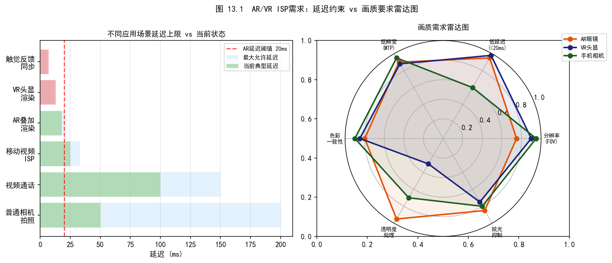
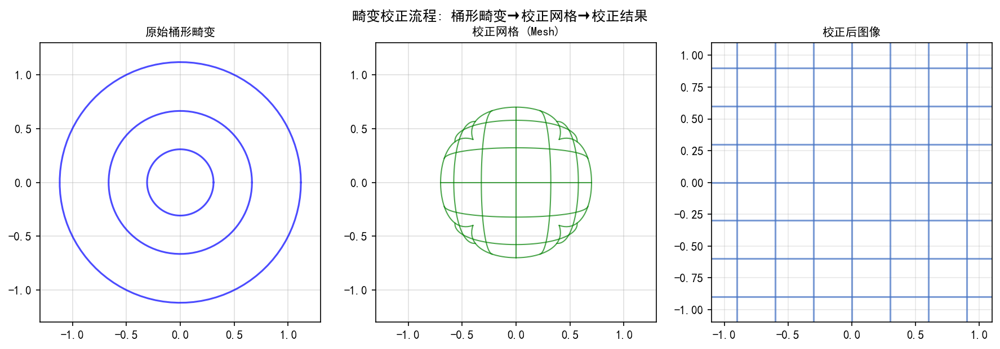
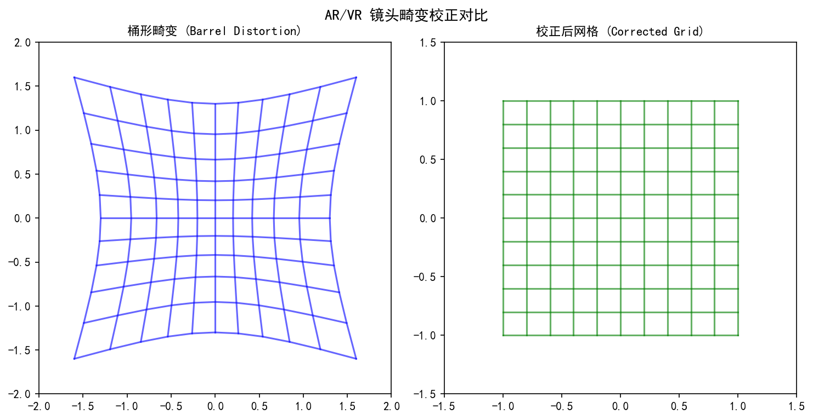
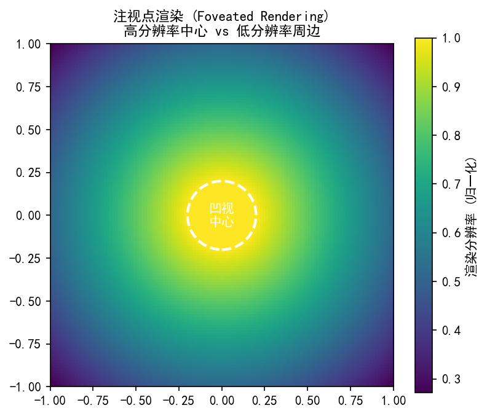
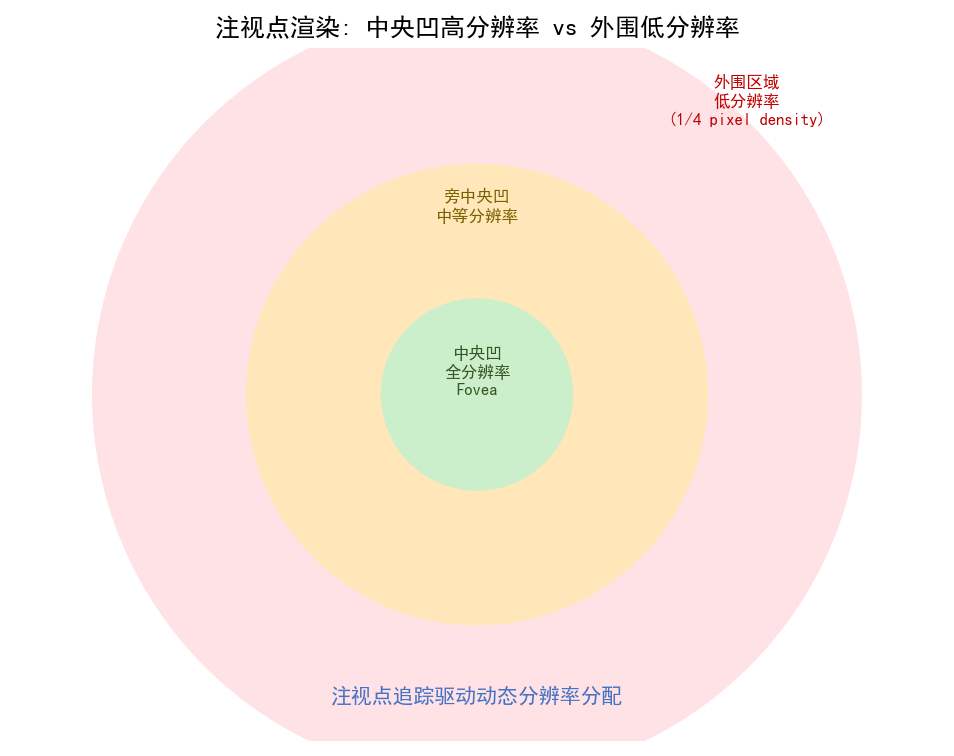
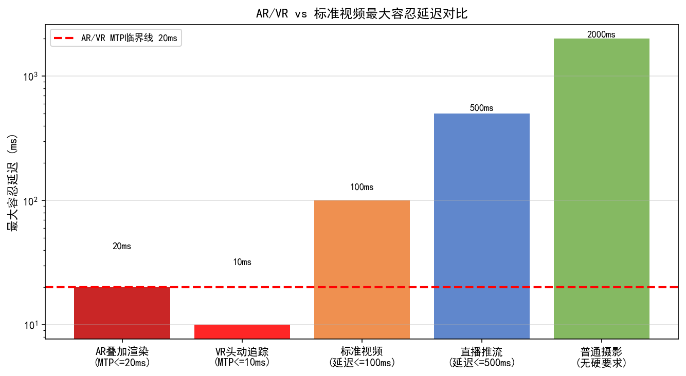
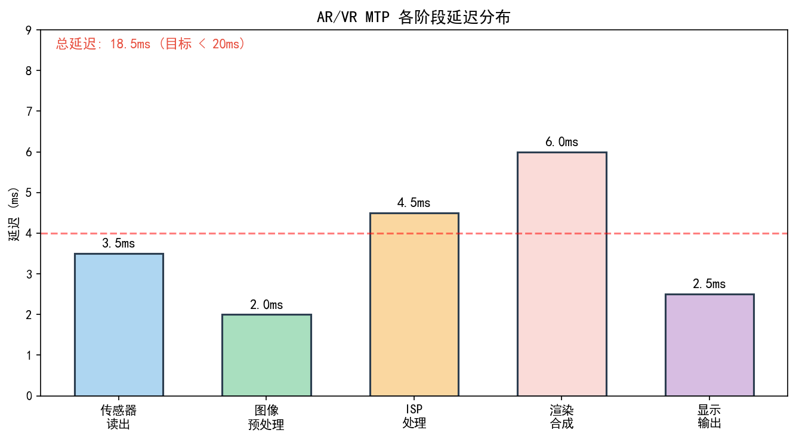

# 第四卷第13章：AR/VR显示ISP

> **定位：** 本章覆盖XR（扩展现实）头显的ISP特殊需求：低延迟渲染、瞳孔间距校正、色差校正、ATW（异步时间扭曲）。
> **前置章节：** 第四卷第01章（3A控制系统）、第二卷第19章（HDR显示信号链）
> **读者路径：** 系统工程师、算法工程师

---

## §1 理论原理

### 1.1 XR头显的成像系统特殊性

手机ISP最坏的情况是拍一张照片质量差——用户顶多觉得这张拍废了。XR头显的ISP如果延迟超标或几何校正有误差，直接后果是用户晕车：视觉-前庭感知不一致会在几分钟内诱发不适。这是XR ISP与手机ISP本质上不同的地方——它不是"图像质量好不好"的问题，而是"用户能不能舒适使用"的问题。

XR头显ISP需要处理三路数据：前置摄像头（pass-through camera）的实时视频、眼动追踪（eye tracking）摄像头数据以及深度传感器数据。每路都有独立的延迟和精度要求。

**关键指标**

1. **端到端延迟（Motion-to-Photon Latency, MTP）**：从头部运动到像素更新的全链路延迟，需 < 20ms（VR舒适阈值），理想 < 10ms（无晕动症）。实测表明延迟超过20ms时约60%用户出现不适（Fernandes & Feiner, 2016）**[7]**。
2. **像素密度（PPD, Pixels Per Degree）**：人眼中央凹（fovea）分辨率约 ~60 PPD **[8]**，XR头显目标 >30 PPD **[8]**，消费级产品约 20–25 PPD 。
3. **视场角（FOV, Field of View）**：水平FOV通常 90°–120°，越大则光学畸变越难校正，同等分辨率下PPD越低。
4. **双目视差（Binocular Disparity）**：左右眼视图的深度编码机制，瞳孔间距（IPD, Inter-Pupillary Distance）校正直接影响立体感知舒适性。

### 1.2 光学畸变模型

XR头显的广角光学系统（菲涅尔透镜或Pancake折叠光路）引入严重的几何畸变，通常采用Brown-Conrady模型（多项式畸变模型）进行描述：

$$x_d = x_u(1 + k_1 r^2 + k_2 r^4 + k_3 r^6) + 2p_1 x_u y_u + p_2(r^2 + 2x_u^2)$$
$$y_d = y_u(1 + k_1 r^2 + k_2 r^4 + k_3 r^6) + p_1(r^2 + 2y_u^2) + 2p_2 x_u y_u$$

其中 $r^2 = x_u^2 + y_u^2$，$(k_1, k_2, k_3)$ 为径向畸变系数，$(p_1, p_2)$ 为切向畸变系数。

VR头显（如Meta Quest系列）中 $k_1$ 通常为负值（桶形畸变），典型范围 $k_1 \in [-0.2, -0.4]$。

**色散畸变（Chromatic Aberration）：** 不同波长的光在透镜中折射角度不同，导致RGB通道产生独立的畸变参数 $(k_{1R}, k_{1G}, k_{1B}, ...)$。色差在视场边缘尤为显著，可达 2–4 像素。

### 1.3 ATW（异步时间扭曲）原理

ATW（Asynchronous TimeWarp）是XR系统最重要的延迟补偿技术，由Oculus于2014年提出并工程化（Antonov et al., 2014）。

GPU渲染一帧（完整光栅化+着色）通常需要5–15ms，在此期间头部继续运动，导致显示的图像与当前头部姿态不匹配，引发视觉-前庭不一致（visual-vestibular conflict），即晕动症（cybersickness）。

ATW的做法是：在GPU渲染完成后、显示器刷新前的极短时间窗口（通常 < 2ms）内，利用**最新的头部姿态传感器数据**对已渲染帧进行2D重投影变换，近似补偿头部运动：

$$\mathbf{p}_{warped} = \mathbf{K} \cdot \Delta\mathbf{R} \cdot \mathbf{K}^{-1} \cdot \mathbf{p}_{rendered}$$

其中 $\Delta\mathbf{R} = \mathbf{R}_{display} \cdot \mathbf{R}_{render}^T$ 是渲染时刻到显示时刻之间的旋转变化，$\mathbf{K}$ 是相机内参矩阵。

ATW仅能补偿**旋转运动**（3 DoF），无法补偿平移运动（6 DoF）。**ASW（Asynchronous SpaceWarp）**利用深度图（depth buffer）进行真3D重投影，可处理平移运动，但需要额外的深度数据和计算资源（Facebook Reality Labs, 2016）。

### 1.4 FOV与PPD计算

给定显示屏分辨率 $(W_{px}, H_{px})$ 和光学FOV $(\theta_H, \theta_V)$，PPD计算为：

$$PPD_H = \frac{W_{px}}{\theta_H}, \quad PPD_V = \frac{H_{px}}{\theta_V}$$

以Apple Vision Pro（micro-OLED，3660×3200 per eye，FOV~100°）为例：

$$PPD_H = \frac{3660}{100} \approx 36.6 \text{ PPD}$$

这已接近人眼中央凹分辨率的60%，是消费级产品中PPD最高的（Koulieris et al., 2019）**[8]**。

### 1.5 注视点渲染（Foveated Rendering）原理

基于人眼视觉特性：中央凹（fovea，约2°视角范围）分辨率最高，周边视觉分辨率以 $\cos^{1.5}(\theta)$ 规律递减（Geisler & Perry, 1998 **[9b]**；注：Campbell & Robson 1968 **[9]** 是 CSF 奠基论文，未给出该周边视觉衰减公式）。通过实时眼动追踪，可将高分辨率渲染集中在注视点周围，形成三层渲染区：

- **Inner zone（约5°）：** 全分辨率渲染
- **Middle zone（5°–30°）：** 50%分辨率
- **Outer zone（>30°）：** 25%分辨率

可节省60–70%的GPU算力（Guenter et al., 2012）**[3]**。眼动追踪通常采用近红外摄像头（NIR camera）+角膜反射（Purkinje reflection）方法，追踪精度约 0.5°–1° ，延迟需 < 5ms 。

---

## §2 算法方法与系统架构

### 2.1 Pass-through ISP流水线

Pass-through的核心工程挑战不是图像质量，是延迟。Vision Pro把pass-through延迟压到了12ms，这基本是2023年消费级产品的天花板——传感器曝光就要1–3ms，剩下的10ms要完成MIPI传输、ISP处理、畸变校正、ATW重投影、渲染合成、显示扫描全链路。每个节点都不能有松弛。

**典型流水线**
```
前置摄像头 → MIPI CSI-2 → 硬件ISP
           ↓
    BLC → Demosaic → Denoising → AWB/AE → CSC
           ↓
    畸变校正（LUT） → 色差校正 → ATW重投影
           ↓
    合成渲染引擎 → 显示驱动 → micro-OLED/LCD
```

**关键延迟节点分解（参考Apple Vision Pro架构，Abrash, 2023）**

| 节点 | 延迟预算 | 说明 |
|------|---------|------|
| 传感器曝光/读出 | 1–3 ms | 低曝光时间需高ISO补偿 |
| MIPI传输 | <0.5 ms | MIPI D-PHY 4-lane |
| 硬件ISP处理 | 1–2 ms | Demosaic+NR+AWB |
| 畸变+色差校正 | 0.5 ms | 硬件LUT查表 |
| ATW重投影 | <0.5 ms | 专用硬件单元 |
| 渲染合成 | 5–10 ms | M2 GPU（Vision Pro） |
| 显示扫描 | 2–3 ms | 90Hz micro-OLED |
| **总计** | **~12 ms** | Vision Pro实测值 |

### 2.2 Apple Vision Pro ISP架构分析

根据公开技术资料（Apple, 2023; Abrash, 2023）及专利文件，Vision Pro的ISP架构具有以下特点：

1. **双芯片协同：** M2芯片负责主ISP和GPU渲染，R1芯片（专用实时芯片）专用于处理12路摄像头、6个麦克风、传感器数据，R1声称 < 12ms全链路延迟 **[5]**。
2. **12路摄像头：** 包括2路立体前置摄像头（pass-through，4K分辨率）、4路下视追踪摄像头、4路眼动追踪摄像头（NIR，每眼2路）、2路LiDAR扫描仪。
3. **硬件畸变校正单元：** R1内置专用畸变校正硬件（ASIC），避免GPU负担，实现 <0.5ms校正延迟 **[5]**。
4. **时间同步总线：** 所有12路传感器通过统一硬件时钟对齐，时间戳精度 < 100μs。

### 2.3 光学畸变校正：预计算LUT方法

**LUT生成流程**
1. 对每个输出像素坐标 $(u_{out}, v_{out})$，通过反向畸变函数计算对应的输入坐标 $(x_{in}, y_{in})$
2. 存储为浮点数映射表（float32），格式 $W \times H \times 2$
3. 运行时查表+双线性插值（或双三次插值）

将ATW旋转变换与畸变校正合并为单次纹理采样，避免两次内存访问：

$$\mathbf{p}_{out} = \text{UndistortLUT}\left(\mathbf{K} \cdot \Delta\mathbf{R} \cdot \mathbf{K}^{-1} \cdot \mathbf{p}_{in}\right)$$

### 2.4 色差（CA）校正系统

色差校正需要对RGB三通道分别应用独立的畸变参数：
- **R通道（~700nm）：** 折射率最小，图像轻微放大（桶形较轻）
- **G通道（~550nm）：** 参考通道
- **B通道（~450nm）：** 折射率最大，图像轻微收缩（桶形较重）

Apple Vision Pro采用Pancake透镜（折叠光路，Kim et al., 2022）可将色差降低约50%（与菲涅尔透镜相比）**[6]**，但仍需数字校正，典型色差残差约0.5–1px 。

### 2.5 IPD校正与立体渲染

**机械IPD调节：** Meta Quest Pro等产品支持机械IPD调节（55–75mm范围），通过物理移动透镜改变瞳孔对准。

**软件IPD校正（虚拟视差调整）：** 对于无法精确匹配的IPD偏差，软件方式通过调整左右眼渲染相机眼距参数：

$$d_{IPD\_offset} = IPD_{actual} - IPD_{default}$$
$$\Delta x_{viewport} = d_{IPD\_offset} \cdot \frac{f_{lens}}{IPD_{default}}$$

### 2.6 多路摄像头时间同步

XR头显中各路摄像头必须严格时间同步，通常采用：
- **硬件帧同步（VSYNC）：** 统一时钟信号驱动所有传感器同步曝光
- **软件时间戳对齐：** ISP硬件为每帧打上高精度时间戳（μs级），渲染引擎根据时间戳选取最近的传感器数据

### 2.7 Meta Quest 3 ISP架构对比

Meta Quest 3（2023年10月发布）采用高通骁龙XR2 Gen 2芯片，与Apple Vision Pro形成当前消费级XR市场的两极。两者在ISP架构上的差异直接反映了不同的设计哲学：

**Meta Quest 3关键ISP参数（公开技术规格）：**

| 参数 | Meta Quest 3 | Apple Vision Pro |
|------|-------------|-----------------|
| SoC | 骁龙 XR2 Gen 2 | Apple M2 + R1 |
| 显示技术 | LCD（Fast-Switch Liquid Crystal）| micro-OLED |
| 显示分辨率 | 2064×2208 per eye | 3660×3200 per eye（micro-OLED，官方规格）|
| 显示刷新率 | 90Hz / 120Hz | 90Hz / 96Hz / 100Hz |
| PPD（水平）| ~25 PPD | ~34 PPD |
| Pass-through摄像头 | 2×RGB（彩色直视透传，约4MP，2448×2448）| 2×RGB立体（4K）|
| Pass-through延迟 | ~40ms（独立测评实测）| < 12ms（Apple R1）|
| 眼动追踪 | 无（标准版）| 有（双眼NIR，120fps）|
| 深度传感器 | 深度投影仪（1路）| LiDAR扫描仪 × 2 |
| ISP架构 | 骁龙XR2 Gen 2集成ISP | 专用R1芯片独立ISP |

**骁龙XR2 Gen 2的ISP特性：**
- 支持最高8K单路ISP处理
- 集成Hexagon DSP兼顾AI降噪（不需额外NPU分担）
- 5路并发摄像头处理能力（pass-through + 追踪摄像头同时运行）
- 相比Apple Vision Pro缺少独立实时芯片，全部任务由XR2 Gen 2单芯片调度，在高负载场景下pass-through延迟波动约2–3ms

### 2.8 显示技术差异对ISP的影响：micro-OLED vs LCD vs MicroLED

XR头显的显示技术选型从根本上影响ISP的色彩处理、亮度映射和延迟管理策略：

| 特性 | LCD（Fast-Switch）| micro-OLED | MicroLED（近未来）|
|------|-----------------|-----------|-----------------|
| 像素发光方式 | 背光+液晶调制 | 自发光有机材料 | 自发光无机LED |
| 峰值亮度 | 800–1500 nits | 1000–5000 nits（Vision Pro约5000nits）| > 10000 nits（预期）|
| 对比度 | ~2000:1（LCD漏光限制）| > 1,000,000:1（像素级关断）| > 1,000,000:1 |
| 黑色表现 | 灰黑（背光无法完全关断）| 纯黑（像素关断）| 纯黑 |
| 响应时间 | 1–5ms（GtG）| < 1μs | < 100ns |
| 色彩体积 | 约 DCI-P3 90%–100% | > DCI-P3 100% | > Rec.2020（预期）|
| 烧屏风险 | 无 | 有（高亮静态内容）| 无 |
| 功耗 | 中（背光始终开启）| 低（暗内容省电）| 低 |
| ISP影响 | 需背光补偿（LSC变化）| 需OLED像素老化补偿 | 色彩映射范围更宽 |

**对ISP的具体影响：**

1. **micro-OLED 的特殊 ISP 需求（如 Vision Pro）：**
   - **像素级亮度补偿：** micro-OLED 面板每个像素的发光效率随使用时间衰减（OLED 老化），需 ISP 动态补偿（Demura 算法）。Vision Pro 的 R1 芯片负责实时运行 Demura 映射，避免静态图案烧屏痕迹。
   - **HDR 色调映射范围扩大：** micro-OLED 5000 nit 峰值亮度要求 ISP 输出 HDR10 或 Dolby Vision 格式（而非传统 SDR sRGB），色调映射曲线需覆盖 0.0001 nit（纯黑）到 5000 nit 全范围，PQ（Perceptual Quantizer）传输函数替代 sRGB Gamma。
   - **低亮度噪声放大：** micro-OLED 的自发光特性使极暗区域中的 ISP 噪声更加可见（无背光遮蔽），需针对 micro-OLED 重新标定 NR 强度曲线（暗部 NR 强度提高约 1.5×）。

2. **LCD（Meta Quest 3）的特殊 ISP 需求：**
   - **背光漏光补偿：** LCD 无法真正关断像素，极暗场景中背光漏光形成约 300 nit 的黑色基底，ISP 需调整黑位拉伸（Black Crush）以弥补对比度损失。
   - **响应时间模糊：** LCD 的 GtG 响应时间约 1–5ms，在 90Hz 刷新率下每帧约 11ms，快速运动时产生拖影（Hold Blur）。ISP 可通过降低运动目标区域的亮度（Motion Dimming）或配合 BFI（黑帧插入）减轻感知。
   - **色彩转换开销更低：** LCD 色域通常约 DCI-P3 90%，色彩映射较 micro-OLED 简单，ISP 的 3D LUT 处理负担相对较轻。

3. **MicroLED 对 ISP 的未来影响（Samsung、Apple 研发中）：**
   - 峰值亮度 > 10000 nit，将需要 Dolby Vision IQ 级别的场景自适应色调映射，ISP 需实时感知环境光并调整 HDR Tone Mapping 参数。
   - 近乎零延迟（< 100ns）的像素响应消除了 LCD/OLED 的响应时间问题，但对 ISP 时钟精度要求更高（显示响应更快，ISP 输出时序抖动更易可见）。

---

## §3 调参与工程指南

### 3.1 延迟预算分配原则

MTP预算的第一条铁律：渲染时间是最大的不确定性来源，也是最难压缩的——GPU负载会波动，场景复杂度不可预测。ISP部分反而是可以严格保证的确定性延迟，重点要压到极限，给渲染留出更多余量：

1. **降低传感器曝光时间：** 通过自动增益（AGC）补偿，建议曝光 < 3ms
2. **固定帧率模式：** 避免动态帧率（VRR）引入的延迟抖动，推荐锁定90Hz或120Hz
3. **异步传感器读取：** R1芯片等专用芯片采用独立低延迟通路，不受主CPU调度影响

### 3.2 ISP参数针对XR的特殊设置

| 参数 | 手机ISP典型值 | XR头显推荐值 | 原因 |
|------|-------------|-------------|------|
| AE收敛速度 | 5–10帧 | 2–3帧 | 快速响应场景亮度变化 |
| AWB收敛速度 | 10–20帧 | 5–10帧 | 防止色彩跳变引发不适 |
| 降噪强度 | 中 | 低（优先延迟） | 避免时域降噪引入延迟 |
| 锐化强度 | 中 | 低 | 避免振铃伪影影响沉浸感 |
| HDR模式 | 开 | 关（pass-through） | HDR合成增加延迟 |

> **工程推荐（XR pass-through场景）：** 时域降噪（TNR）在XR场景下直接禁用——TNR需要帧间对齐，引入额外1帧延迟，直接把MTP从14ms推到28ms。改用单帧空域NR（BNR+CNR），强度调到比手机场景低40%，接受更高残余噪声，换取延迟确定性。如果噪声真的不可接受（超暗室内场景），考虑提高传感器ISO上限而非加强NR。

### 3.3 畸变LUT标定最佳实践

1. **标定环境：** 在稳定光照（CRI > 90）下使用高精度棋盘格（≥9×7格，格间距误差 < 0.05mm）
2. **多位姿采集：** 至少20个角度，覆盖全FOV（包括边缘区域）
3. **温度补偿：** 光学系统有温漂特性，建议在工作温度（35–45°C）下标定
4. **LUT分辨率：** 建议 64×64 或 128×128 网格（运行时双线性插值到全分辨率），平衡精度与内存

### 3.4 眼动追踪NIR摄像头配置

- **帧率：** ≥ 120fps（约8ms/帧），以满足 < 10ms追踪延迟
- **曝光：** 固定短曝光（~0.5ms），配合高强度NIR LED脉冲同步
- **NIR波长：** 850nm或940nm（940nm受太阳光干扰更小）
- **安全标准：** 遵循IEC 62471:2006光生物安全标准，NIR辐照度需在豁免风险组（Exempt Risk Group）内

### 3.5 色差校正调参建议

1. **检测方法：** 用高对比度黑白放射线测试图（Starburst pattern），观察边缘彩色条纹
2. **R/B通道偏移量：** 正常应 < 2px，超过则可能是光学设计问题
3. **温度影响：** Pancake透镜色差有温漂，建议在20°C和45°C两个温度点各做LUT标定

---

## §4 常见伪影与问题分析

### 4.1 晕动症（Cybersickness）

**根因：** 视觉与前庭系统感知不一致，主要由MTP延迟超标（>20ms）引起；其次是帧率波动（frame stutter）。
**排查：** 使用高速摄像机（≥1000fps）测量实际MTP延迟，检查ATW是否正常启用、GPU负载是否过高。
**缓解：** 降低渲染分辨率或细节级别（LOD）、启用ATW/ASW、应用comfort zone（缩减外周FOV，减少视觉流）。

### 4.2 ATW边缘鬼影（Ghosting at ATW Edges）

**根因：** ATW仅进行2D仿射变换，无法处理场景中近处物体的视差变化；快速平移运动产生内容扭曲。
**表现：** 运动物体边缘出现拖影或"橡皮泥"形变，尤其在物体边缘/深度不连续处明显。
**缓解：** 升级到ASW（基于深度图的3D重投影），或提高GPU帧率降低ATW依赖。

### 4.3 色差条纹（Chromatic Fringing）

**根因：** 色差LUT标定误差，或透镜温漂导致参数偏移，或制造工艺导致个体差异。
**表现：** 高对比度边缘（如白底黑字）出现红绿或紫色色带，视场边缘最明显。
**量化：** 用ISO 12233测试卡，测量边缘色带宽度（合格标准 < 1px）。

### 4.4 双目不一致（Stereo Mismatch）

**根因：** 左右眼帧率不同步，或ATW左右眼时间戳差异 > 1ms，导致立体视差不匹配引发眼疲劳。
**表现：** 凝视固定物体时感觉"漂浮"，长时间使用引发头痛。
**排查：** 检查双路ISP时间戳差异，确认帧同步信号正确驱动双路传感器。

### 4.5 暗角（Vignetting）

**根因：** 广角光学系统周边光量不足（余弦四次方定律：$E \propto \cos^4\theta$），LSC参数不足。
**表现：** 图像四角明显偏暗，在pass-through模式下影响沉浸感。
**修复：** 在全FOV范围内（含边缘）重新采集LSC标定数据，确保增益补偿覆盖完整。

### 4.6 运动模糊（Motion Blur）

**根因：** 曝光时间过长（>3ms），头部快速旋转时pass-through图像模糊。
**表现：** 快速转头时物体边缘出现水平拖影。
**权衡：** 缩短曝光时间可减少模糊，但需提升ISO（增加噪声）；XR pass-through场景下**禁止**使用TNR（TNR引入额外1帧延迟，直接推高MTP）——应改用单帧空域NR（BNR/CNR）以低强度覆盖噪声，同时提高传感器ISO上限而非加强降噪。

---

## §5 评测方法

### 5.1 Motion-to-Photon延迟测量

**高速摄像机法（硬件精度最高）：**
使用≥1000fps高速摄像机同时拍摄：(a) 固定在头显上的IMU指示灯（随头部运动触发），(b) 头显显示屏画面变化，通过帧差法精确计算延迟，误差约±1ms 。

**软件时间戳法：**
在ISP/渲染管线中插入时间戳点，统计各节点延迟分布，适合工程调试。

### 5.2 几何畸变残差评估

使用标准棋盘格（GB/T 19897.1）测试图，校正后检测角点坐标残差：
- **合格标准：** RMS < 0.5px（中心区域），< 1.0px（边缘区域）
- **工具：** OpenCV `cv2.calibrateCamera()` + `cv2.undistortPoints()`

### 5.3 双目视差一致性

固定已知深度的标定物（距离1m），测量左右眼图像中对应点的水平视差：
- **理论值：** $disparity = f \cdot IPD / Z$
- **合格标准：** 测量值与理论值偏差 < 0.5px

### 5.4 PPD实际测量

使用可变空间频率正弦光栅（Variable Frequency Grating），测量最小可分辨空间频率 $f_{max}$（lp/px），计算：
$$PPD_{measured} = f_{max} \times \frac{W_{px}}{\theta_H}$$

### 5.5 色差评测

使用ISO 12233分辨率测试图的黑白放射线区域，统计RGB通道亮度曲线的横向偏移量（单位：像素）。

---

## §6 代码示例

### 6.1 Brown-Conrady畸变校正LUT生成

```python
import numpy as np
import cv2
from typing import Tuple

def generate_undistort_lut(
    width: int, height: int,
    K: np.ndarray,
    dist_coeffs: np.ndarray
) -> Tuple[np.ndarray, np.ndarray]:
    """
    为给定相机内参和畸变系数生成去畸变映射LUT。

    Args:
        width, height: 输出图像分辨率
        K: 相机内参矩阵 (3x3), float64
        dist_coeffs: Brown-Conrady畸变系数 [k1, k2, p1, p2, k3]

    Returns:
        map_x, map_y: float32类型的坐标映射表，shape=(height, width)
    """
    map_x, map_y = cv2.initUndistortRectifyMap(
        cameraMatrix=K,
        distCoeffs=dist_coeffs,
        R=None,
        newCameraMatrix=K,
        size=(width, height),
        m1type=cv2.CV_32FC1
    )
    return map_x, map_y


def generate_chromatic_aberration_lut(
    width: int, height: int,
    K: np.ndarray,
    dist_r: np.ndarray,
    dist_g: np.ndarray,
    dist_b: np.ndarray
) -> dict:
    """
    为RGB三通道分别生成色差校正LUT。

    Args:
        dist_r/g/b: 各通道独立畸变系数

    Returns:
        {'R': (map_x, map_y), 'G': ..., 'B': ...}
    """
    luts = {}
    for channel, dist in [('R', dist_r), ('G', dist_g), ('B', dist_b)]:
        map_x, map_y = cv2.initUndistortRectifyMap(
            K, dist, None, K, (width, height), cv2.CV_32FC1
        )
        luts[channel] = (map_x, map_y)
    return luts


def apply_chromatic_aberration_correction(
    image: np.ndarray,
    luts: dict
) -> np.ndarray:
    """
    分通道应用色差校正，image为BGR格式。
    """
    result = np.zeros_like(image)
    # BGR对应索引：B=0, G=1, R=2
    channel_map = {'B': 0, 'G': 1, 'R': 2}
    for ch_name, (map_x, map_y) in luts.items():
        ch_idx = channel_map[ch_name]
        result[:, :, ch_idx] = cv2.remap(
            image[:, :, ch_idx], map_x, map_y,
            interpolation=cv2.INTER_LINEAR
        )
    return result


# 示例：典型VR头显参数
if __name__ == "__main__":
    W, H = 1920, 1080
    fx, fy = 900.0, 900.0
    cx, cy = W / 2.0, H / 2.0
    K = np.array([[fx, 0, cx], [0, fy, cy], [0, 0, 1.0]], dtype=np.float64)

    # VR头显典型桶形畸变系数
    dist_g = np.array([-0.30, 0.12, 0.0, 0.0, -0.02])  # G通道（参考）
    # R/B通道有轻微差异（色散）
    dist_r = dist_g * np.array([0.98, 1.02, 1.0, 1.0, 0.98])  # R稍小
    dist_b = dist_g * np.array([1.02, 0.98, 1.0, 1.0, 1.02])  # B稍大

    luts = generate_chromatic_aberration_lut(W, H, K, dist_r, dist_g, dist_b)

    # 验证LUT内存占用
    map_x_r, map_y_r = luts['R']
    mem_mb = (map_x_r.nbytes + map_y_r.nbytes) * 3 / 1024 / 1024
    print(f"色差LUT总内存: {mem_mb:.1f} MB (3通道, float32)")
```

### 6.2 ATW单应性矩阵计算

```python
import numpy as np
import cv2
import time

def compute_atw_homography(
    K: np.ndarray,
    R_render: np.ndarray,
    R_display: np.ndarray
) -> np.ndarray:
    """
    计算ATW所需的旋转补偿单应性矩阵。

    Args:
        K: 相机内参矩阵 (3x3)
        R_render: 渲染时刻的旋转矩阵（相机坐标系→世界坐标系），3x3
        R_display: 显示时刻的旋转矩阵，3x3

    Returns:
        H: 3x3单应性矩阵，用于图像重投影
    """
    # 增量旋转：从渲染时刻到显示时刻的旋转变化
    # delta_R = R_display * R_render^T
    delta_R = R_display @ R_render.T

    # ATW单应性：H = K * delta_R * K^{-1}
    K_inv = np.linalg.inv(K)
    H = K @ delta_R @ K_inv
    return H


def apply_atw(
    rendered_frame: np.ndarray,
    H: np.ndarray
) -> np.ndarray:
    """
    对已渲染帧应用ATW变换。

    Args:
        rendered_frame: 已渲染图像，uint8 BGR格式
        H: ATW单应性矩阵

    Returns:
        warped: ATW校正后的图像
    """
    h, w = rendered_frame.shape[:2]
    warped = cv2.warpPerspective(
        rendered_frame, H, (w, h),
        flags=cv2.INTER_LINEAR,
        borderMode=cv2.BORDER_REPLICATE  # 边界填充用最近像素，减少黑边
    )
    return warped


def benchmark_atw_latency(n_trials: int = 1000) -> float:
    """测量ATW矩阵计算延迟（不含warpPerspective）。"""
    K = np.eye(3, dtype=np.float64)
    K[0, 0] = K[1, 1] = 900.0
    K[0, 2], K[1, 2] = 960.0, 540.0

    # 模拟0.3度的头部运动
    theta = np.radians(0.3)
    R_r = np.eye(3)
    R_d = np.array([
        [np.cos(theta), 0, np.sin(theta)],
        [0, 1, 0],
        [-np.sin(theta), 0, np.cos(theta)]
    ])

    t0 = time.perf_counter()
    for _ in range(n_trials):
        _ = compute_atw_homography(K, R_r, R_d)
    t1 = time.perf_counter()

    avg_ms = (t1 - t0) * 1000 / n_trials
    print(f"ATW矩阵计算平均延迟: {avg_ms:.4f} ms (n={n_trials})")
    return avg_ms


# PPD计算工具
def compute_ppd(resolution_px: int, fov_deg: float) -> float:
    """计算每度视角像素数（PPD）。"""
    return resolution_px / fov_deg


if __name__ == "__main__":
    # Apple Vision Pro参数（近似值）
    ppd = compute_ppd(resolution_px=3660, fov_deg=100)
    print(f"Vision Pro PPD (水平): {ppd:.1f}")

    benchmark_atw_latency()
```

### 6.3 MTP延迟预算分析工具

```python
from dataclasses import dataclass
from typing import List

@dataclass
class LatencyStage:
    name: str
    latency_ms: float
    is_parallel: bool = False  # 是否与其他阶段并行

def compute_mtp_latency(stages: List[LatencyStage]) -> float:
    """计算端到端MTP延迟（串行阶段累加）。"""
    total = sum(s.latency_ms for s in stages if not s.is_parallel)
    parallel_max = max(
        (s.latency_ms for s in stages if s.is_parallel), default=0
    )
    return total + parallel_max


# 典型XR头显延迟预算
xr_stages = [
    LatencyStage("传感器曝光", 2.0),
    LatencyStage("MIPI传输", 0.3),
    LatencyStage("ISP硬件处理", 1.5),
    LatencyStage("畸变/色差校正", 0.5),
    LatencyStage("渲染合成(GPU)", 7.0),
    LatencyStage("ATW重投影", 0.4),
    LatencyStage("显示扫描", 2.2),  # 1/90Hz ≈ 11ms，但扫描延迟约2ms
]

total_mtp = compute_mtp_latency(xr_stages)
print(f"\nMTP延迟预算分解:")
for s in xr_stages:
    print(f"  {s.name:20s}: {s.latency_ms:.1f} ms")
print(f"  {'总计':20s}: {total_mtp:.1f} ms")
print(f"  目标阈值      :  20.0 ms  ({'达标' if total_mtp < 20 else '超标'})")
```

---


---

> **工程师手记：AR/VR ISP 低延迟实现的工程约束**
>
> **Motion-to-Photon 延迟的 20ms 硬性门槛：** 根据 Oculus 内部研究，MTP（Motion-to-Photon）延迟超过 20ms 即会引发明显晕动症，超过 50ms 则几乎所有用户均感不适。将 20ms 分配到 passthrough 相机链路时，典型预算为：传感器曝光 4ms + 读出 2ms + ISP 处理 3ms + 畸变校正 2ms + 合成渲染 5ms + 显示扫描 4ms = 20ms，每个环节的容错仅约 ±0.5ms。实践中最常见的延迟"杀手"是 ISP 的自动曝光（AE）收敛抖动——当场景亮度突变时，AE 算法单步调整增益可能额外引入 2–3 帧延迟，导致 MTP 飙升至 35ms 以上。AR/VR ISP 必须采用前馈式 AE，结合 IMU 预测未来帧亮度，严格限制每帧 gain 步进幅度（建议不超过 20%）。
>
> **Passthrough 相机延迟的逐级拆解：** Meta Quest 3 passthrough 实测端到端 MTP 约 35–40ms（Optofidelity BUDDY 独立测评，2024），远高于 Apple Vision Pro 的约 11ms（约3.5×差距）。理论硬件流水极限可估算为：MIPI 传输 0.3ms + ISP 流水 1.8ms + 畸变矫正（GPU/DSP）2.1ms + ATW（Asynchronous TimeWarp）重投影 0.8ms + 显示刷新 7.5ms（90Hz面板）≈ 12.5ms，但实际系统因软件调度、操作系统栈延迟和显示 persistence 会将总延迟推高至 35ms 以上。其中显示刷新占比最大（60%）且难以压缩，因此 ISP 侧需将处理时间控制在 2ms 以内，避免挤占显示同步窗口。调试时建议在传感器 FSYNC 脉冲与显示 VSYNC 信号之间插入逻辑分析仪探头，精确量化每级延迟，而不能仅依赖软件时间戳（软件时间戳误差可达 ±1ms）。
>
> **180° FOV 鱼眼镜头实时去畸变的实现策略：** 全景鱼眼镜头径向畸变系数 k1 可达 -0.8（等距投影），边缘像素位移量超过图像宽度的 40%，直接双线性插值会产生严重的 aliasing。实时处理方案通常采用预计算 mesh warp LUT（64×64 网格，每节点 2×float16 = 4 Bytes，总 LUT 大小 16 KB，L1 cache 友好），配合 GPU compute shader 或专用 DSP warp engine 执行。高通 XR 平台的 Adreno GPU 支持 mesh warp 硬件加速，实测 2160×2160 鱼眼帧去畸变耗时约 1.2ms，满足 2ms 预算。需注意 LUT 在不同温度下因镜头热膨胀导致的畸变漂移，建议每隔 5°C 重新标定并热切换 LUT。
>
> *参考：Oculus/Meta Research, "Latency requirements for comfortable VR," SIGGRAPH 2014；Meta Quest 3 Passthrough Latency Overview, Meta Developer Blog 2023；Kannala & Brandt, "A generic camera model and calibration method," IEEE TPAMI 2006*

## 插图



*图1. AR/VR ISP架构示意（图片来源：作者自绘）*



*图2. 畸变校正示意（图片来源：作者自绘）*



*图3. 畸变校正网格（图片来源：作者自绘）*



*图4. 中央凹渲染示意（图片来源：作者自绘）*



*图5. 注视点渲染技术（图片来源：作者自绘）*



*图6. AR/VR延迟需求示意（图片来源：作者自绘）*



*图7. 运动到光子（MTP）延迟示意（图片来源：作者自绘）*

---

## 习题

**练习 1（理解）**
AR 头显的 ISP 延迟要求严格控制在 20ms 以内（MTP 延迟 < 20ms），超过此阈值用户会产生明显的晕动症（Cybersickness）。请解释：（1）20ms 这个数字来自人体生理的哪个约束（前庭-视觉延迟感知阈值）？（2）ISP 处理延迟（如 Demosaic + NR = 5ms）、渲染延迟（10ms）和显示延迟（2ms）如何分配总 MTP 预算？（3）ATW（异步时间扭曲）技术是如何在不降低渲染延迟的前提下减少感知 MTP 延迟的？

**练习 2（分析）**
透视 AR（Pass-through AR，如 Meta Quest 3）的相机-显示对齐误差会导致"虚实不融合"感。请分析：（1）透视 AR 的相机视角与人眼视角之间存在哪两种主要的位置/方向偏差？（2）对齐误差容忍度通常要求 < 0.5°，这对相机标定和实时畸变校正的精度有何具体要求？（3）双眼视差一致性对 ISP 的要求是什么——左右眼摄像头的色彩一致性和亮度一致性差异应分别控制在什么范围内？

**练习 3（工程设计）**
设计一套 AR 头显的 ISP 低延迟优化方案：（1）在 ISP 流水线中，哪些模块可以用"低延迟简化版本"替代（如将 5×5 NR 替换为 3×3，牺牲画质换取延迟）？（2）FPGA 实现的 ISP 和 ASIC 实现的 ISP 在延迟特性上有何本质区别（流水线深度 vs. 数据依赖）？（3）如果系统热设计功耗（TDP）为 3W，ISP + 渲染 + 显示的功耗如何分配才能保证 20ms 内完成一帧处理？

**练习 4（扩展）**
注视点渲染（Foveated Rendering）结合眼动追踪降低了 AR/VR 的渲染功耗，但对 ISP 也提出了新要求。请说明：（1）注视点渲染对 ISP 分辨率处理有何影响（中心高分辨率、边缘低分辨率）？（2）这种非均匀分辨率处理在 ISP 硬件设计上是否容易实现，有哪些挑战？（3）眼动追踪摄像头（NIR 850nm）的 ISP 与可见光摄像头 ISP 在 AWB 和色彩处理上有何根本区别？

## 参考文献

[1] Antonov et al., "Asynchronous Timewarp", Oculus VR Technical Blog, 2014. URL: https://developer.oculus.com/blog/asynchronous-timewarp/

[2] Facebook Reality Labs, "Asynchronous SpaceWarp", Oculus Developer Blog, 2016.

[3] Guenter et al., "Foveated 3D Graphics", *ACM TOG*, 2012.

[4] Abrash, "Creating Apple Vision Pro: The Display System", Apple Tech Talks, 2023.

[5] Apple Inc., "Apple Vision Pro Technical Overview", *官方文档*, 2023.

[6] Kim et al., "Optical Design of Pancake Lens for Compact VR Headset", *Optics Express*, 2022.

[7] Fernandes et al., "Combating VR Sickness through Subtle Dynamic Field-of-View Modification", *IEEE 3DUI*, 2016.

[8] Koulieris et al., "Near-Eye Display and Tracking Technologies for Virtual and Augmented Reality", *Computer Graphics Forum*, 2019.

[9] Campbell et al., "Application of Fourier Analysis to the Visibility of Gratings", *Journal of Physiology*, 1968.

[10] Geisler et al., "A Real-Time Foveated Multiresolution System for Low-Bandwidth Video Communication", *SPIE Human Vision and Electronic Imaging*, 1998.

[11] IEC, "IEC 62471:2006 Photobiological Safety of Lamps and Lamp Systems", *官方文档*, 2006.

[12] Qualcomm Technologies, "Snapdragon XR2 Gen 2 Platform Technical Overview", *官方文档*, 2023.

[13] Meta Platforms, "Meta Quest 3 Technical Specifications", *官方文档*, 2023. URL: https://developer.meta.com/horizon/documentation/unity/unity-sysinfo-devicehardware/

[14] Miller et al., "MicroLED Displays for AR/VR: Progress and Challenges", *SID Symposium Digest of Technical Papers*, 2023.

[15] Lee et al., "OLED Demura Algorithm for XR Display Compensation", *Journal of the Society for Information Display*, 2022.

## §7 术语表

| 术语 | 英文全称 | 含义 |
|------|---------|------|
| ATW | Asynchronous TimeWarp | 异步时间扭曲，基于旋转的延迟补偿技术 |
| ASW | Asynchronous SpaceWarp | 异步空间扭曲，基于深度图的3D重投影延迟补偿 |
| IPD | Inter-Pupillary Distance | 瞳孔间距，影响立体视差舒适性 |
| PPD | Pixels Per Degree | 每度视角像素数，衡量显示角分辨率 |
| FOV | Field of View | 视场角，通常分水平/垂直/对角线FOV |
| CA | Chromatic Aberration | 色差，不同波长光在透镜中折射率不同引起的色散 |
| MTP | Motion-to-Photon | 从运动到像素发光的端到端延迟 |
| Pass-through | — | 将摄像头实时视频透传显示，模拟AR效果 |
| Foveated Rendering | — | 注视点渲染，中心全分辨率、边缘降分辨率 |
| NIR | Near-Infrared | 近红外，眼动追踪常用波段（850/940nm） |
| XR | eXtended Reality | 扩展现实，包含VR/AR/MR的统称 |
| LUT | Look-Up Table | 查找表，用于畸变校正的预计算坐标映射 |
| Pancake | — | 折叠光路透镜设计，可减小头显厚度和色差 |
| Cybersickness | — | 晕动症，视觉-前庭感知不一致引发的不适 |
| micro-OLED | — | 硅基OLED，像素尺寸<10μm，高PPI、自发光，Vision Pro采用 |
| MicroLED | — | 无机LED阵列显示，超高亮度(>10000nit)、无烧屏，XR下一代显示技术 |
| Demura | — | OLED像素老化补偿算法，逐像素动态校正亮度不均匀性 |
| PQ | Perceptual Quantizer | HDR感知量化传输函数（SMPTE ST 2084），替代sRGB Gamma用于高亮度显示 |
| BFI | Black Frame Insertion | 黑帧插入，在LCD显示帧之间插入全黑帧，减轻运动模糊（Hold Blur）|
| Hold Blur | — | LCD像素持续发光导致的运动模糊，区别于运动模糊伪影 |
