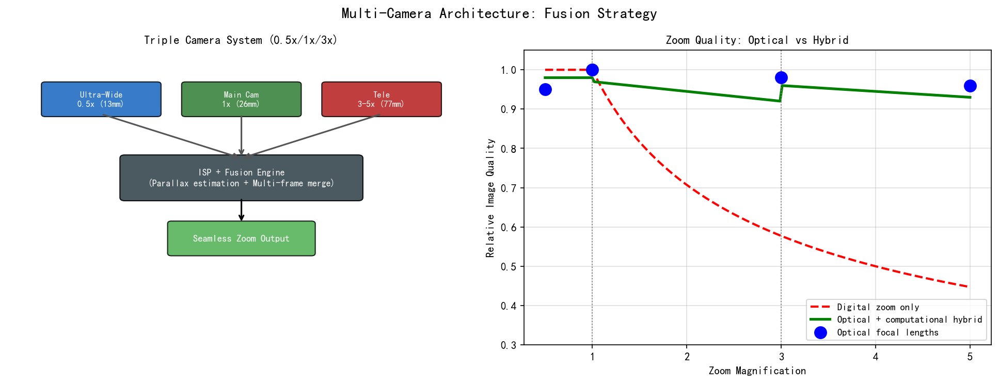
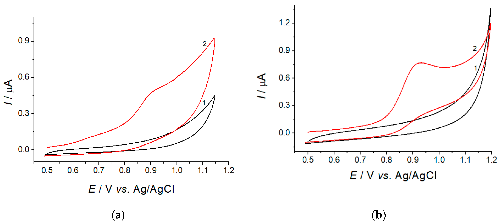
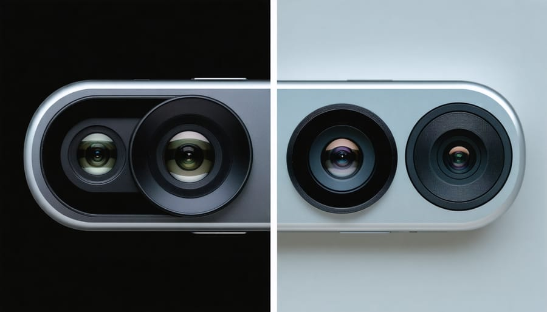
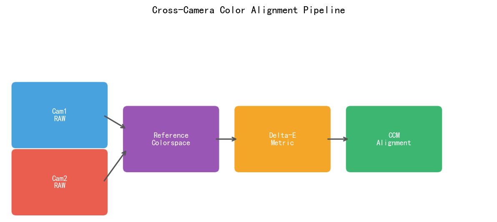
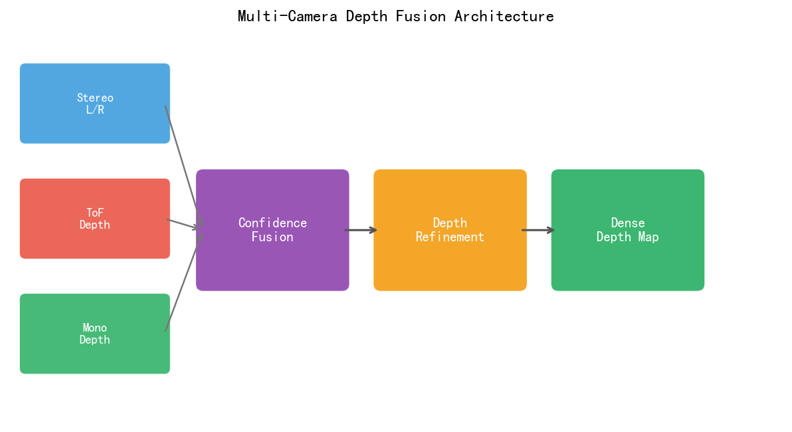
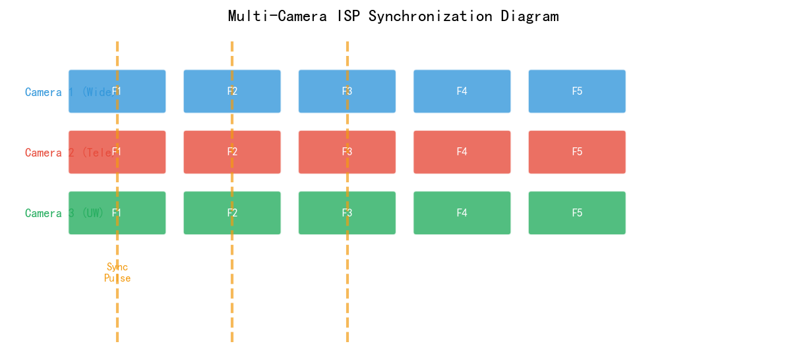
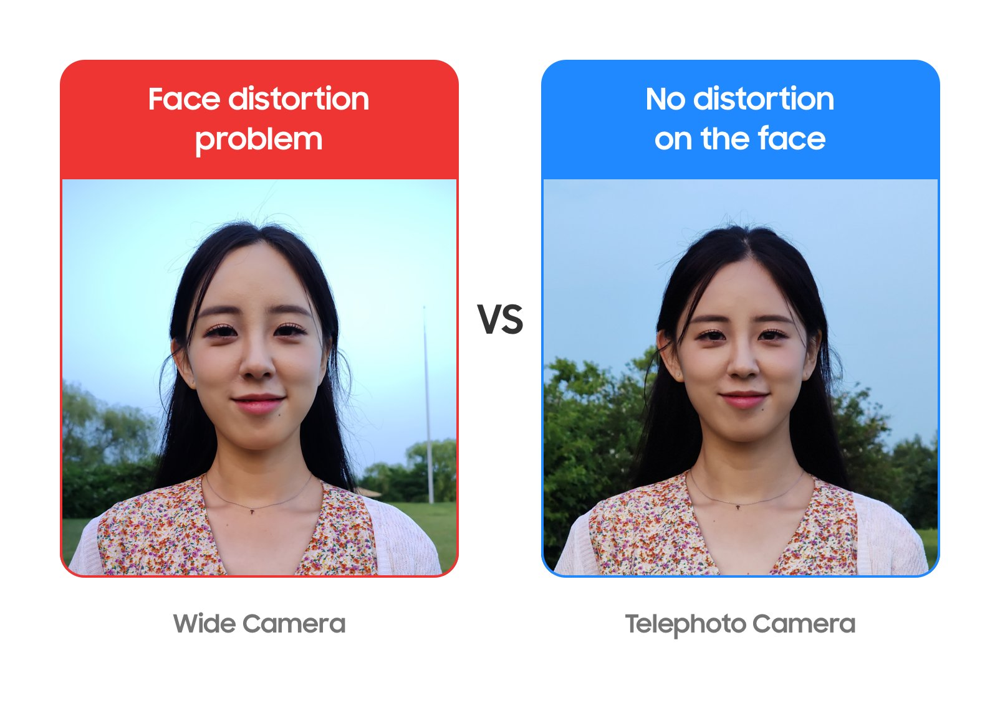

# 第四卷第14章：多摄系统架构设计与跨路一致性保障

> **定位：** 本章覆盖多摄像头系统架构（主摄+超广角+长焦+ToF）、跨路色彩一致性、多摄ISP流水线同步。
> **前置章节：** 第二卷第22章（多摄融合）、第四卷第01章（3A控制系统）
> **读者路径：** 系统工程师

---

## §1 理论原理

### 1.1 多摄系统的工程驱动

手机光学的物理死结：镜头不能做长焦，传感器不能做大。多摄是绕开这个死结的工程妥协——把几颗不同焦段的小传感器堆进同一台手机，用切换+融合来模拟光学上做不到的事。

这带来了三类工程需求，对应三类设计挑战：

1. **焦段覆盖** 超广角（0.5×/0.6×）+ 主摄（1×）+ 中焦（2×–3×）+ 长焦（5×–10×）。设计挑战：切换时不能跳变，色彩和亮度要连续。
2. **计算摄影** 多帧融合（主摄+辅摄）、大光圈（bokeh）、夜景融合。设计挑战：多路图像对齐精度，运动目标的鬼影抑制。
3. **深度感知** ToF或结构光提供深度图，用于人像分割、AR锚定、自动对焦辅助。设计挑战：ToF精度和RGB对齐。

**典型4摄配置（以2024年旗舰为参考）：**

| 摄像头 | 焦距等效 | 传感器尺寸 | 像素 | 光圈 | 功能 |
|--------|---------|-----------|------|------|------|
| 超广角 | 14mm | 1/3.5" | 12MP | f/2.2 | 风景/建筑/视频广角 |
| 主摄 | 24mm | 1/1.3" | 50MP | f/1.8 | 日常拍摄主力 |
| 中焦 | 70mm | 1/3.5" | 12MP | f/2.8 | 人像/中距离 |
| 长焦 | 200mm | 1/4.4" | 12MP | f/6.3 | 超长焦/望远 |

### 1.2 多摄硬件接口与SoC路数限制

**MIPI CSI-2接口：** 每颗摄像头通过独立的MIPI CSI-2通路连接SoC ISP。主流SoC（高通SM8750、苹果A18 Pro）通常支持3–4路物理MIPI接口，每路最多4-lane（D-PHY）或8-lane（C-PHY）。

**虚拟Channel（Virtual Channel, VC）技术：** 当物理MIPI接口不足时，可通过MIPI CSI-2的虚拟通道机制在单条物理通路上复用多路数据流（最多4个VC），但带宽需共享：

$$BW_{total} = \frac{\sum_{i} W_i \times H_i \times FPS_i \times BPP_i}{\eta_{MIPI}}$$

其中 $\eta_{MIPI}$ 为MIPI协议开销效率（通常约85%）。

**ISP路数：** SoC内部ISP硬件通常有2–3个独立处理路（pipeline），多摄时需要分时复用或同时运行多路ISP，主要制约因素是**内存带宽（Memory Bandwidth）**。

### 1.3 多摄时间同步原理

多摄融合（如夜景multi-frame、HDR合并）要求多颗摄像头的曝光帧严格时间对齐。主流同步方案：

**主从硬件同步（Master-Slave Sync）：** 主摄（Master）的FSIN（Frame Sync Input）输出帧同步信号，驱动从摄（Slave）在相同时刻开始曝光：

$$|T_{exp\_master} - T_{exp\_slave}| < 1 \text{ line time} \approx 10\text{–}30\mu s$$

**软件时间戳对齐：** 通过ISP硬件为每帧打上高精度时间戳（μs级），后处理时选取时间戳最接近的帧对进行融合，适用于对实时性要求不高的离线处理。

### 1.4 变焦平滑切换理论

直接切换在消费者测评视频里非常容易被拍到：一瞬间图像亮度跳、色调变、内容位移——早期多摄方案的通病。平滑切换的本质是在切换发生的2–3帧内，让两路图像看起来"像同一台相机拍的"。

**视觉连续性条件（Zoom Continuity）：** 切换时刻 $t_0$ 前后，需满足：
- **亮度连续：** $|L_{out}(t_0^-) - L_{out}(t_0^+)| < \Delta L_{jnd}$（JND约1/3 EV）
- **色调连续：** $\Delta E_{2000}(AWB_{out,before}, AWB_{out,after}) < 2.0$
- **几何连续：** 切换前后的FOV过渡需在2–3帧内完成插值

---

## §2 算法方法与系统架构

### 2.1 多摄ISP系统架构

**分布式ISP架构（现代旗舰主流）：**

```
                    ┌─────────────────────────────────────────┐
                    │              Application Processor        │
┌──────────┐        │  ┌─────┐   ┌─────┐   ┌─────┐           │
│超广角摄像头│─MIPI──►│  ISP │   │ ISP │   │ ISP │           │
└──────────┘        │  #0   │   │ #1  │   │ #2  │           │
┌──────────┐        │  └──┬──┘   └──┬──┘   └──┬──┘           │
│  主摄     │─MIPI──►│     └─────────┴──────────┘             │
└──────────┘        │              │ DDR Interface              │
┌──────────┐        │         ┌────▼────┐                      │
│  长焦     │─MIPI──►│         │ ISP HW  │                      │
└──────────┘        │         │ Shared  │                      │
┌──────────┐        │         │ Buffer  │                      │
│  ToF     │─MIPI──►│         └────┬────┘                      │
└──────────┘        │              │                            │
                    │         ┌────▼────┐                      │
                    │         │  CPU/   │                      │
                    │         │  GPU/   │                      │
                    │         │  NPU    │                      │
                    └─────────────────────────────────────────┘
```

### 2.2 跨摄色彩一致性校正

不同摄像头由于光学特性（镜头透过率、镀膜）、传感器特性（光谱响应曲线）、OTP（One-Time-Programmable，一次性可编程标定数据）差异，在相同场景下输出的色彩存在肉眼可见的差异（ΔE可达3–8）。

**跨摄色彩匹配算法（Cross-Camera Color Calibration）：**

以主摄为参考，对辅摄输出做线性变换（3×3 CCM）矫正：

$$\begin{bmatrix} R' \\ G' \\ B' \end{bmatrix}_{aux} = M_{aux \to main} \cdot \begin{bmatrix} R \\ G \\ B \end{bmatrix}_{aux}$$

其中 $M_{aux \to main}$ 通过最小化主摄与辅摄在标准色卡（X-Rite ColorChecker 24色）上输出的 $\Delta E_{2000}$ 求解（最小二乘法）。

多摄同时工作时，需强制所有摄像头使用**同一组AWB增益**（来自主摄的AWB估计结果），禁止各摄自行估计AWB，避免色温跳变。

**跨摄AWB色温不一致量化：** 由于超广角与长焦镜头的光谱透过率曲线不同、传感器光谱响应差异以及镀膜特性不同，即便使用相同的AWB目标，不同摄像头对相同场景的色温估计值可存在**200–500K的CCT偏差**（超广角 vs 长焦最为典型）。这一偏差在直接切换时可引发肉眼可见的色调跳变（ΔE > 2.0），因此必须通过跨摄CCM（见§2.2）在多个色温节点（2800K、4000K、6500K）分别标定补偿矩阵，并在运行时根据主摄AWB色温插值使用，而非仅使用单组全局CCM。

### 2.3 变焦平滑切换系统

**切换判决（Switch Decision）：** 根据当前焦距请求，判断是否需要跨摄切换：

```
用户焦距请求 z → 判断当前物理摄像头能否覆盖
                 → 若 z < z_threshold_wide: 切换超广角
                 → 若 z > z_threshold_tele: 切换长焦
                 → 否则: 当前摄像头数字变焦
```

**切换过渡策略（Smooth Transition）：**

1. **Alpha混合（Crossfade）：** 切换前后2帧内进行Alpha混合：
$$I_{out}(t) = (1 - \alpha(t)) \cdot I_{from}(t) + \alpha(t) \cdot I_{to}(t)$$
其中 $\alpha(t)$ 从0线性增加到1。

2. **曝光预对齐：** 在切换前N帧（通常3–5帧）提前将目标摄像头的曝光调整到与主摄接近，减少亮度跳变。

3. **几何对齐：** 利用预标定的摄像头间单应性矩阵（Homography）将辅摄图像对齐到主摄视角，再进行融合。

### 2.3b 视差校正与近距离融合保护

多摄镜头间的物理基线（baseline）导致不同摄像头对同一场景产生视角差异（视差），视差大小随拍摄距离变化显著，是多摄融合伪影的根本来源。

**视差随场景深度的量化关系：**

设两摄像头的等效焦距分别为 $f_1$（主摄）和 $f_2$（辅摄），光学中心水平基线距离为 $B$（单位：mm），拍摄距离为 $D$（单位：m），传感器像素间距为 $p$（单位：μm），则辅摄视差（像素数）约为：

$$\text{parallax\_px} = \frac{B \times f_2}{D \times p \times 1000}$$

**典型场景下的视差量级（主摄26mm+长焦85mm，基线B=20mm，p=1.0μm）：**

| 场景深度 D | 视差（像素） | 融合可行性 | 工程处理策略 |
|-----------|-----------|-----------|------------|
| > 3 m     | < 0.5 px  | 可直接融合 | 正常多摄融合（深度辅助对齐） |
| 1–3 m     | 0.5–2 px  | 需视差补偿 | 光流/深度图对齐后融合 |
| 0.3–1 m   | 2–8 px    | 补偿困难   | 仅限单摄拍摄或浅融合比例 |
| < 0.3 m   | > 8 px    | 不可融合   | 强制单摄模式，禁止跨摄融合 |

**近距离融合保护阈值（工程推荐）：**

- 当ToF或PDAF深度估计 $D < D_{threshold}$（通常 **25–40 cm**）时，ISP后处理层自动切换到单摄模式，禁止多摄融合
- 无深度传感器时，可通过以下方式代替判断近场：主摄对焦步数（VCM步数 > 近场阈值）、AF置信度置信区间（近场散景下置信度高）
- Alpha混合权重在 $D < 0.5$ m 区间内线性衰减辅摄权重，而非突变切换

### 2.3c EIS与OIS防抖协同

**OIS（光学防抖）** 通过物理移动镜片或传感器补偿相机抖动，**EIS（电子防抖）** 通过裁剪图像边缘并做数字偏移补偿来实现额外稳定性。两者协同使用时，防抖效果优于任何一种单独使用。

**EIS + OIS联合工作原理：**

| 防抖方式 | 工作频段 | 补偿范围 | FOV影响 |
|---------|---------|---------|---------|
| OIS（机械） | 0–50 Hz（低频抖动） | ±2°（机械极限） | 无FOV损失 |
| EIS（数字） | 0–200 Hz（含高频） | 裁剪余量决定 | **裁剪 10–15% FOV** |
| OIS + EIS联合 | 全频段 | OIS先补偿，EIS补偿残余 | 仅EIS部分裁剪FOV |

**EIS FOV裁剪的工程含义：**

- EIS 需要在图像边缘保留 **10–15%** 的稳定缓冲区域（stabilization margin），作为数字平移的余量。以4K（3840×2160）输出为例，实际采集分辨率需为 **约4267×2400**，裁掉边缘后输出4K。
- 裁剪比例与防抖强度正相关：标准防抖（±1°补偿能力）约需 10% 裁剪，增强防抖（±2.5°）约需 15% 裁剪，极限防抖可达 20%
- **视频模式 vs 拍照模式：** 视频模式通常启用EIS（需要帧间连续稳定），拍照模式依赖OIS+机械快门（单帧不需要帧间一致性，无需EIS裁剪）

**OIS + EIS协同参数设置（工程建议）：**

- OIS工作时先补偿低频机械抖动（0–50 Hz），将残余角速度降低到±0.3°以内
- EIS基于IMU（惯性测量单元）读取的高频抖动（50–200 Hz），对OIS补偿后的残余做数字修正
- EIS裁剪区间（margin）应在ISP图像裁剪模块中静态配置，避免在运动过程中动态调整导致画面跳变
- 多摄防抖时，所有摄像头应共享同一IMU数据源，禁止各摄独立运行EIS估计（否则不同摄像头的稳定偏移不一致，切换时产生跳变）

### 2.4 MIPI虚拟通道（VC）多路复用

**应用场景：** 超广角+深度传感器共用同一MIPI通道时，通过VC ID区分数据流：

```
物理MIPI通路:   [VC0: 超广角RAW12] [VC1: ToF深度] [VC2: ToF信心度] ...
ISP解析:        按VC ID分流至对应ISP模块处理
```

**带宽估算（以4K@30fps为例）：**
$$BW = 3840 \times 2160 \times 30 \times 10 \text{ bit} \approx 2.49 \text{ Gbps}$$

MIPI CSI-2 4-lane D-PHY @4.5Gbps/lane 理论带宽 = 18Gbps，余量充足；但多路同时传输时需精确计算总带宽是否超限。

### 2.5 ToF深度传感器ISP集成

ToF传感器输出的是**原始飞行时间数据**（Raw ToF），需要专用ISP模块处理：

1. **ToF校正：** 多径干扰（Multi-path Interference）消除、温漂校正、像素增益校正
2. **深度计算：** $d = \frac{c \cdot \Delta\phi}{4\pi f_{mod}}$，其中 $\Delta\phi$ 为相位差，$f_{mod}$ 为调制频率
3. **深度滤波：** 双边滤波（保边去噪）、时域滤波（稳定深度图）
4. **对齐：** 将ToF深度图与RGB摄像头空间对齐（外参标定+重投影）

### 2.6 多摄3A联动

**AE联动：** 所有摄像头的EV目标由统一的场景亮度估计决定，各摄根据自身光圈/感光度范围独立调整曝光参数，但最终图像亮度目标一致。

**AF联动：** 主摄的对焦距离估计可共享给其他摄像头，ToF提供全场景深度图辅助所有摄像头快速对焦（Depth-Assisted AF）。

---

## §3 调参与工程指南

### 3.1 OTP标定数据管理

多摄OTP管理最容易踩的坑是：主摄换了新传感器模组，辅摄相关的CCM和AWB基准全部失效，因为这些数据是基于主摄特性标定的。以主摄为坐标系原点存储辅摄"偏差量"而非"绝对值"，可以把主摄换代时的重标范围缩到最小。

每颗摄像头出厂时烧录OTP数据，包含：
- **LSC（镜头阴影校正）：** 各通道增益表（通常16×16或32×32网格）
- **WB标定数据：** 标准光源（D65/A光）下的AWB增益基准值
- **CCM：** 在标准光源下的色彩矩阵

**跨摄OTP管理原则：** 在系统层以主摄为坐标系原点，辅摄的所有OTP参数均存储为"相对主摄的偏差量"。好处在于：主摄光学模组换代时，辅摄只需更新偏差项，不必重新做全量标定。

### 3.2 跨摄色彩匹配标定流程

1. **标准环境：** D65标准光源（CCT ≈ 6504 K；注：5000–6500K 是大范围色温段描述，D65精确色温为6504 K，D50为5000 K，两者不可混淆），照度800–1200 lux，使用X-Rite ColorChecker Classic 24色卡
2. **同时采集：** 所有摄像头同时拍摄色卡，确保光照条件完全一致
3. **ROI对齐：** 通过色卡角点检测，将各摄的色块ROI精确对应
4. **求解CCM：** 对各颜色块，最小化 $\sum_i \Delta E_{2000}(C_{main,i}, M \cdot C_{aux,i})$

**验收标准：** 校正后主辅摄色差 $\bar{\Delta E}_{2000} < 2.0$，单色块 $\Delta E_{2000,max} < 4.0$。

### 3.3 变焦切换阈值调参

切换阈值设太早——切换频繁，用户体验到明显的跳变；设太晚——数字变焦范围过大，主摄1.5×时画面已经模糊了还没切长焦。实践中用Hysteresis（滞后）策略解决这个问题：进切点比退切点高，防止在切换阈值附近反复震荡。

**建议策略（以主摄1×、长焦3×为例）：**
- 从主摄到长焦：切换点设在 2.8×（留0.2×余量，用主摄数字变焦覆盖）
- 从长焦回主摄：切换点设在 2.5×（回切滞后0.3×，避免来回抖动）
- 手抖场景下，滞后区间适当加大（±0.3×→±0.5×）

> **工程推荐（手机多摄场景）：** 调切换阈值时从预对准帧数入手，而不是直接改切换点——预对准帧数从3帧增加到5帧通常能把亮度跳变压到JND以下，同时不改变用户感知到的切换时机。Hysteresis值的调整对减少"来回跳"有效，但会引入"用户主动往回推焦距感觉不灵敏"的副作用，需要做用户测试确认。

### 3.4 多路ISP内存带宽优化

多路ISP同时运行时，内存带宽往往成为瓶颈：

**优化策略：**
1. **交错处理（Interleaving）：** 多路ISP交错访问DDR，避免同时读写冲突
2. **内部SRAM缓存：** 将热点数据（如LSC LUT、3A统计）缓存在ISP内部SRAM，减少DDR访问
3. **降低辅摄ISP精度：** 对非拍照时刻的辅摄（仅用于测光/对焦辅助），降低处理位深（如10bit→8bit）节省带宽
4. **异步唤醒：** 仅在焦距临近切换阈值时才唤醒目标摄像头，平时保持低功耗待机

### 3.5 ToF与RGB对齐误差标定

ToF深度图与RGB的空间对齐误差来源：
- **外参误差：** ToF与RGB相机间的相对位姿（6DoF外参）标定误差
- **时间误差：** ToF帧与RGB帧的时间戳不对齐（建议 < 1ms）
- **分辨率差异：** ToF通常分辨率低（如320×240），深度图需上采样对齐到RGB分辨率

**验收标准：** 1m处深度对齐误差 < 5cm，3m处 < 15cm。

### 3.6 多摄外参标定精度要求

多摄系统中各摄像头之间的相对位姿（外参，包含旋转矩阵 $\mathbf{R}$ 和平移向量 $\mathbf{t}$）是跨摄图像对齐、双目深度、Bokeh分割的基础，精度不足会直接导致融合伪影和深度误差。

**精度规格（按功能划分）：**

| 应用场景 | 旋转误差要求 | 平移误差要求 | 说明 |
|---------|-----------|-----------|------|
| 变焦Crossfade融合 | < 0.3° | < 0.5mm | 几何对齐误差在切换帧上不可见 |
| 人像Bokeh主体分割 | < 0.5° | < 1.0mm | 主体轮廓对齐精度，误差会导致"光晕"伪影 |
| ToF深度辅助AF | < 1.0° | < 2.0mm | 深度辅助对焦，精度要求相对宽松 |
| 双目立体测距 | < 0.1° | < 0.2mm | 视差图精度要求最高，偏差直接影响测距精度 |

**外参标定流程关键控制点：**

1. **标定板规格：** 使用高精度棋盘格（格间距误差 < 0.02mm），在稳定光照（无闪烁、均匀）下采集 ≥ 20 个不同姿态，覆盖全FOV
2. **重投影误差（Reprojection Error）验收：** 每个摄像头内参标定后重投影误差 < 0.3 px；跨摄外参标定后极线误差（Epipolar Error）< 0.5 px
3. **温度适应性：** 手机壳体热变形会导致摄像头间距（Baseline）在 0°C~60°C 范围内漂移约 ±50μm，高精度应用需在工作温度（25°C 和 45°C）分别标定外参并存储，运行时根据 SoC 温度传感器插值选择

### 3.7 主副摄曝光联动时序同步

多摄AE联动中，主摄AE决策到从摄实际执行之间存在固定的时序链路延迟，工程师必须显式建模此延迟，否则在主摄亮度变化较快时，从摄将滞后1–2帧导致亮度不匹配。

**帧级时序模型（以I2C写入曝光参数为例）：**

```
帧N：主摄ISP计算AE结果 EV_N
    → 同帧SOF时刻通过I2C广播曝光参数到从摄寄存器
    → 从摄在帧N+1的SOF实际使用新曝光参数积分
    → 帧N+1：从摄图像反映 EV_N 的曝光

实际有效延迟：1帧（~16.7ms @60fps）
```

**延迟补偿策略：**

- **前馈预测（Predictive Feedforward）：** 主摄AE基于当前场景亮度趋势预测下一帧目标EV，提前1帧发布从摄目标，使从摄实际执行时间与主摄对齐
- **动态场景保护：** 检测到主摄亮度快速变化（帧间 |ΔEV| > 0.2）时，冻结从摄AE并允许略微曝光偏差（< 0.3 EV），优先保证主摄曝光正确
- **切换预警机制（Pre-Switch Alignment）：** 系统检测到用户焦距手势将触发摄像头切换时（通常提前3–5帧），从摄切换到主摄驱动模式并开始跟随主摄EV，确保切换发生时从摄曝光已对齐

**时序同步指标验收：**

$$|\overline{EV}_{master,5} - \overline{EV}_{slave,5}| < 0.15 \text{ EV}$$

即主从摄在任意5帧窗口内的平均EV差值不超过0.15 EV（约10%亮度差，人眼JND约为0.3 EV）。

---

## §4 常见伪影与问题分析

### 4.1 变焦切换跳变（Zoom Switching Jerk）

**表现：** 变焦到切换阈值附近时，图像出现瞬间亮度/色调/清晰度跳变。
**根因：** 切换前后曝光参数差异大（亮度跳变），或AWB增益差异（色调跳变），或几何对齐误差（内容跳变）。
**修复：** 加强切换预对准（3–5帧提前对齐曝光），增大Hysteresis区间，增加Alpha混合过渡帧数。

### 4.2 跨摄色彩不一致（Color Inconsistency）

**表现：** 连续变焦过程中，同一物体色彩在切换摄像头时发生明显变化（肤色偏移最敏感）。
**根因：** 跨摄CCM标定误差，或不同色温下CCM无法完全匹配。
**修复：** 在多个色温节点（2800K、4000K、6500K）各做一组CCM，运行时根据AWB色温插值。

### 4.3 双摄"鬼影"（Ghost Artifact）

**表现：** 多摄融合图像中出现双重轮廓或透明叠影。
**根因：** 两路摄像头帧时间戳不对齐，或运动物体在帧间移动超过对齐精度。
**修复：** 在运动区域（通过光流或帧差检测）禁用融合，直接使用主摄单帧。

### 4.4 ToF深度边缘飞点（Flying Pixels）

**表现：** 深度图中物体边缘出现深度值跳变的噪点（飞点），影响背景虚化等效果。
**根因：** ToF像素接收到前景和背景的混合光（Mixed Pixel），相位解算产生错误深度。
**修复：** 使用双频ToF（两个调制频率），通过一致性检验过滤飞点；或使用RGB纹理引导的深度超分（Depth Upsampling）。

### 4.5 MIPI虚拟通道数据错乱

**表现：** 某路摄像头图像出现帧内数据异常（部分行显示其他摄像头数据）。
**根因：** VC ID配置错误，或MIPI时序不稳定导致数据包混淆。
**排查：** 通过MIPI协议分析仪（如Tektronix DSA8300）抓取物理层波形，检查VC字段。

---

## §5 评测方法

### 5.1 跨摄色彩一致性评测

**标准测试：** 在D65光源下拍摄X-Rite ColorChecker，对各色块分别测量主摄和辅摄的Lab值，计算：
$$\Delta E_{2000}^{avg} = \frac{1}{N}\sum_{i=1}^{N} \Delta E_{2000}(C_{main,i}, C_{aux,i})$$
**合格标准：** $\Delta E_{2000}^{avg} < 2.0$，$\Delta E_{2000}^{max} < 4.0$

### 5.2 变焦切换平滑性评测

**客观指标：** 连续变焦视频中，检测切换前后各1帧内的亮度、色温、清晰度突变量：
- 亮度：$|\Delta EV| < 0.3$
- 色温：$|\Delta CCT| < 200K$ 
- 清晰度（边缘响应MTF50）：变化 < 15% 

**主观评测：** 请10名观察者在标准显示器上观察变焦切换视频，评分1–5分，合格标准 ≥ 4分。

### 5.3 多摄时间同步精度评测

**滚动快门相机法：** 使用LED频闪光源（已知频率），多摄同时拍摄，通过LED明暗条纹位置差异反算时间对齐误差，精度可达 ±0.5 line time。

### 5.4 ToF精度评测

使用标准深度精度测试装置（漫反射目标板，已知精确距离0.5m/1m/2m/3m/5m）：
- **绝对精度：** $|d_{measured} - d_{true}| < 2\%$
- **精度标准差：** $\sigma_d < 1\%$（重复测量）

---

## §6 代码示例

### 6.1 跨摄色彩一致性校正矩阵求解

```python
import numpy as np
from scipy.optimize import minimize
from typing import List, Tuple

def compute_deltaE2000(lab1: np.ndarray, lab2: np.ndarray) -> float:
    """
    计算CIE ΔE2000色差（简化版，完整版参见ISO 11664-6）。

    Args:
        lab1, lab2: CIE L*a*b*色彩值，shape=(3,)

    Returns:
        deltaE: ΔE2000值
    """
    # 简化版ΔE2000（忽略色相权重项，适合工程快速评估）
    dL = lab1[0] - lab2[0]
    da = lab1[1] - lab2[1]
    db = lab1[2] - lab2[2]

    # 完整ΔE2000需考虑kL,kC,kH权重，此处简化为ΔE76
    return np.sqrt(dL**2 + da**2 + db**2)


def solve_cross_camera_ccm(
    rgb_main: np.ndarray,
    rgb_aux: np.ndarray
) -> np.ndarray:
    """
    通过最小二乘法求解辅摄→主摄的3x3色彩变换矩阵（CCM）。

    Args:
        rgb_main: 主摄色块RGB值，shape=(N_patches, 3)，float64, 范围[0,1]
        rgb_aux: 辅摄色块RGB值，shape=(N_patches, 3)

    Returns:
        M: 3x3 CCM矩阵，满足 rgb_main ≈ M @ rgb_aux
    """
    # 最小二乘法：min ||rgb_main - rgb_aux @ M.T||_F^2
    # 解析解：M.T = (rgb_aux.T @ rgb_aux)^{-1} @ rgb_aux.T @ rgb_main
    M_T, _, _, _ = np.linalg.lstsq(rgb_aux, rgb_main, rcond=None)
    M = M_T.T
    return M


def apply_cross_camera_ccm(
    image: np.ndarray,
    M: np.ndarray
) -> np.ndarray:
    """
    对图像应用3x3 CCM色彩变换。

    Args:
        image: 输入图像，shape=(H, W, 3)，float32，范围[0,1]
        M: 3x3 CCM矩阵

    Returns:
        corrected: 色彩校正后的图像
    """
    h, w = image.shape[:2]
    flat = image.reshape(-1, 3)  # (H*W, 3)
    corrected_flat = (M @ flat.T).T  # (H*W, 3)
    corrected = corrected_flat.reshape(h, w, 3)
    return np.clip(corrected, 0.0, 1.0).astype(np.float32)


# 演示：使用ColorChecker 24色卡数据求解CCM
def demo_ccm_calibration():
    np.random.seed(42)
    N_patches = 24

    # 模拟主摄标准色块值（理论值）
    rgb_main = np.random.rand(N_patches, 3).astype(np.float64)

    # 模拟辅摄有轻微色彩偏差（3x3随机扰动）
    true_M_inv = np.eye(3) + np.random.randn(3, 3) * 0.05
    rgb_aux = (true_M_inv @ rgb_main.T).T

    # 求解CCM
    M = solve_cross_camera_ccm(rgb_main, rgb_aux)

    # 评估校正效果
    rgb_corrected = (M @ rgb_aux.T).T
    errors = np.linalg.norm(rgb_corrected - rgb_main, axis=1)
    print(f"CCM校正后RGB均方根误差: {errors.mean():.4f}")
    print(f"CCM矩阵:\n{M}")
    return M
```

### 6.2 变焦切换平滑过渡（Alpha混合）

```python
import numpy as np
import cv2
from typing import Optional

def zoom_switch_alpha_blend(
    frame_from: np.ndarray,
    frame_to: np.ndarray,
    alpha: float,
    homography: Optional[np.ndarray] = None
) -> np.ndarray:
    """
    变焦切换时两路摄像头帧的Alpha混合。

    Args:
        frame_from: 当前摄像头帧（即将切换离开），uint8 BGR
        frame_to: 目标摄像头帧（即将切换进入），uint8 BGR
        alpha: 混合权重 [0, 1]，0=完全使用from，1=完全使用to
        homography: 将frame_to对齐到frame_from视角的单应性矩阵（可选）

    Returns:
        blended: 混合后的图像
    """
    if homography is not None:
        h, w = frame_from.shape[:2]
        frame_to_aligned = cv2.warpPerspective(
            frame_to, homography, (w, h),
            flags=cv2.INTER_LINEAR,
            borderMode=cv2.BORDER_REPLICATE
        )
    else:
        frame_to_aligned = frame_to

    blended = cv2.addWeighted(
        frame_from, 1.0 - alpha,
        frame_to_aligned, alpha, 0
    )
    return blended


def zoom_switch_controller(
    current_zoom: float,
    target_zoom: float,
    cameras: dict
) -> str:
    """
    决定当前焦段应使用哪颗摄像头（含Hysteresis）。

    Args:
        current_zoom: 当前变焦倍率
        target_zoom: 用户请求的目标变焦倍率
        cameras: 各摄像头的覆盖范围，如 {'wide': (0.5, 1.5), 'main': (1.5, 3.0), 'tele': (3.0, 10.0)}

    Returns:
        selected_camera: 应使用的摄像头名称
    """
    # 简化实现：根据当前变焦倍率选择最优摄像头
    for cam_name, (zoom_min, zoom_max) in cameras.items():
        if zoom_min <= target_zoom <= zoom_max:
            return cam_name
    # 超出范围：选最近的
    return sorted(cameras.items(),
                  key=lambda x: min(abs(target_zoom - x[1][0]),
                                    abs(target_zoom - x[1][1])))[0][0]


# 内存带宽计算工具
def compute_mipi_bandwidth(
    cameras: list
) -> float:
    """
    计算多摄系统总MIPI带宽需求。

    Args:
        cameras: 摄像头配置列表，每项为 {'W': int, 'H': int, 'fps': int, 'bpp': int}

    Returns:
        total_bw_gbps: 总带宽（Gbps）
    """
    total_bps = 0
    for cam in cameras:
        bps = cam['W'] * cam['H'] * cam['fps'] * cam['bpp']
        total_bps += bps
        print(f"  {cam.get('name', 'Camera')}: "
              f"{cam['W']}x{cam['H']}@{cam['fps']}fps "
              f"{cam['bpp']}bit = {bps/1e9:.2f} Gbps")

    # MIPI协议开销（约15%）
    effective_bw = total_bps / 0.85
    print(f"  含协议开销总带宽: {effective_bw/1e9:.2f} Gbps")
    return effective_bw / 1e9


if __name__ == "__main__":
    cameras = [
        {'name': '超广角', 'W': 4032, 'H': 3024, 'fps': 30, 'bpp': 10},
        {'name': '主摄',   'W': 8192, 'H': 6144, 'fps': 30, 'bpp': 10},
        {'name': '长焦',   'W': 4032, 'H': 3024, 'fps': 30, 'bpp': 10},
        {'name': 'ToF',    'W': 320,  'H': 240,  'fps': 30, 'bpp': 16},
    ]
    print("多摄MIPI带宽需求：")
    total_bw = compute_mipi_bandwidth(cameras)

    demo_ccm_calibration()
```

---


---

> **工程师手记：多摄ISP同步的三个工程硬约束**
>
> **时间同步误差的严格等级划分：** 多摄系统对时间同步的容忍度因应用场景而异，这个等级差异在工程实现上至关重要。立体视觉/深度估计场景要求两路摄像头曝光中心时间差小于1ms，超出则视差计算会引入明显的运动鬼影；人像模式虚化背景融合可以放宽到5ms以内；而多摄HDR合并则对帧级同步要求最高，通常需要硬件级Frame Sync信号（FSYNC引脚）而不能依赖软件时间戳对齐。在我们的产品线验证中，有一款双摄方案初期只用软件时间戳同步，在快速移动场景下虚化边缘撕裂率高达18%，换成硬件FSYNC后降至0.3%。时序同步看似是平台驱动问题，但ISP工程师必须理解其对图像质量的直接影响，否则无法与驱动团队有效沟通问题根因。
>
> **跨摄AWB一致性协议的工程细节：** 多摄系统中不同传感器的光谱响应曲线存在出厂差异，即使面对同一场景，主摄和超广角各自独立运行AWB算法也会产生0.5~2个色温档（约150~600K）的偏差，在无缝切换时肉眼可见。解决方案是"主摄授权协议"：主摄的AWB估计结果通过HAL层广播给所有从摄，从摄禁止独立运行全局AWB，只允许在主摄色温基础上做±200K范围内的微调。实现这个协议需要在Camera HAL中定义跨Session的共享内存区，确保白平衡增益在每帧预览刷新前同步完成。此外还需要对各摄模组做逐台色差标定（出厂写入OTP），否则协议广播的增益值在不同台机器上效果离散性很大。
>
> **近距离拍摄的视差融合失败区域：** 多摄镜头之间的物理基线距离（通常10~25mm）在拍摄近距离目标（<30cm）时会产生无法通过软件完全消除的视差。以"主摄+潜望长焦"组合为例，两镜头基线约20mm，拍摄15cm处的物体时视差约达7.6个像素（以等效视角换算），超过了大多数深度图辅助融合算法的可靠修复范围。实际处理策略是在距离检测到近场目标时强制切换到单摄模式，不做多摄融合，这个距离阈值通常设置在25~40cm之间，由产品决策而非纯算法能力决定，工程师需要理解这个"软边界"背后的物理原因而不是简单当成黑盒参数。
>
> *参考：Wadhwa et al., "Synthetic Shallow Depth of Field on a Mobile Camera", ACM SIGGRAPH 2018；Shim et al., "Joint Camera Spectral Sensitivity Selection and Hyperspectral Image Recovery", ECCV 2018；Android Camera HAL3 Specification, AOSP Documentation 2023*

## 插图



*图1. 多摄像头系统架构（图片来源：作者自绘）*


---


*图2. 多摄像头系统总体架构（图片来源：作者自绘）*




*图3. 智能手机摄像头阵列（图片来源：作者自绘）*


---


*图4. 多摄像头图像融合（图片来源：作者自绘）*


*图5. 多摄像头立体视觉（图片来源：作者自绘）*


---


*图6. 跨摄像头颜色对齐（图片来源：作者自绘）*



*图7. 多摄像头深度融合（图片来源：作者自绘）*



*图8. 多摄像头ISP同步（图片来源：作者自绘）*



*图9. 三星ISOCELL长焦传感器架构示意图（潜望式变焦光学设计）（图片来源：作者自绘）*

---

## 习题

**练习 1（理解）**
多摄系统中主摄与超广角副摄的感光量差异对图像融合有重要影响。请分析：（1）假设主摄传感器尺寸为 1/1.5"，超广角为 1/4"，在相同光圈和曝光时间下，两者的感光量差异约为多少 EV？（2）这种感光量差异如何影响噪声水平（SNR 差异）？（3）在主副摄融合（如变焦过渡）时，噪声水平不一致会导致什么视觉伪影，如何通过 ISP 参数调整来缓解？

**练习 2（计算）**
多摄光学变焦中，视差（Parallax）是导致融合伪影的主要原因。已知主摄焦距 f₁ = 26mm（等效），长焦焦距 f₂ = 85mm（等效），两镜头光学中心水平间距 B = 8mm，拍摄距离 D = 2m。请计算：（1）目标点在主摄和长焦图像上的视差（像素偏移量，假设传感器像素密度相同）；（2）如果多摄系统要求融合区域的视差 < 2 像素才不产生可见鬼影，该系统对拍摄距离有何限制（最小对焦距离）？

**练习 3（工程设计）**
多摄时间戳同步精度要求 ≤ 1ms。请设计一套多摄同步方案：（1）硬件 FSIN（帧同步）信号方案和软件时间戳对齐方案各自能达到什么同步精度？（2）在 FSIN 不可用的情况下（某些低成本副摄模组不支持），如何通过软件方法将同步误差控制在可接受范围内？（3）当主副摄帧率不同步（主摄 60fps，超广 30fps）时，如何设计时间戳插值和缓存策略？

**练习 4（平台架构）**
高通多摄 MFNR（Multi-Frame Noise Reduction）架构支持跨路多帧融合降噪。请分析：（1）MFNR 在多摄场景下，多路 RAW 数据在 ISP 内部是如何对齐和融合的（先单路降噪再融合，还是先融合再降噪）？（2）与联发科 FeaturePipe 的多摄节点相比，高通 CamX 在多摄 MFNR 的 RAW 缓存策略上有何差异？（3）多摄 MFNR 对 DRAM 带宽的需求比单摄增加了多少倍？

## 参考文献

[1] Heide et al., "FlexISP: A Flexible Camera Image Processing Framework", *ACM SIGGRAPH Asia*, 2014.

[2] Qualcomm Technologies, "Snapdragon 8 Gen 3 Camera Architecture", *官方文档*, 2023.

[3] Sony Semiconductor Solutions, "IMX989: 1-inch Stacked CMOS Image Sensor", *官方文档*, 2023.

[4] MIPI Alliance, "MIPI CSI-2 Specification v4.0", *官方文档*, 2022.

[5] Chen et al., "Encoder-Decoder with Atrous Separable Convolution for Semantic Image Segmentation", *ECCV*, 2018.

[6] Hasinoff et al., "Burst Photography for High Dynamic Range and Low-Light Imaging on Mobile Cameras", *ACM SIGGRAPH Asia*, 2016.

[7] Liang et al., "Programmable Aperture Photography: Multiplexed Light Field Acquisition", *ACM SIGGRAPH*, 2011.

## §7 术语表

| 术语 | 英文全称 | 含义 |
|------|---------|------|
| VC | Virtual Channel | MIPI CSI-2虚拟通道，单物理通路复用多路数据 |
| OTP | One-Time Programmable | 一次性可编程存储器，存储摄像头标定数据 |
| CCM | Color Correction Matrix | 色彩校正矩阵 |
| CCT | Correlated Color Temperature | 相关色温 |
| JND | Just Noticeable Difference | 恰好可感知差异阈值 |
| ToF | Time-of-Flight | 飞行时间深度传感器 |
| FSIN | Frame Sync Input/Output | 帧同步信号，用于多摄硬件同步 |
| Hysteresis | — | 滞后策略，防止切换阈值附近来回抖动 |
| Alpha Blend | — | Alpha混合，两路图像加权叠加 |
| ΔE2000 | — | CIE 2000色差公式，感知线性化的色彩差异度量 |
| MTF50 | Modulation Transfer Function at 50% | 空间频率响应50%处的调制传递函数，衡量锐度 |
| LSC | Lens Shading Correction | 镜头阴影校正 |
| Flying Pixel | — | 飞点，ToF深度图边缘深度突变噪点 |
