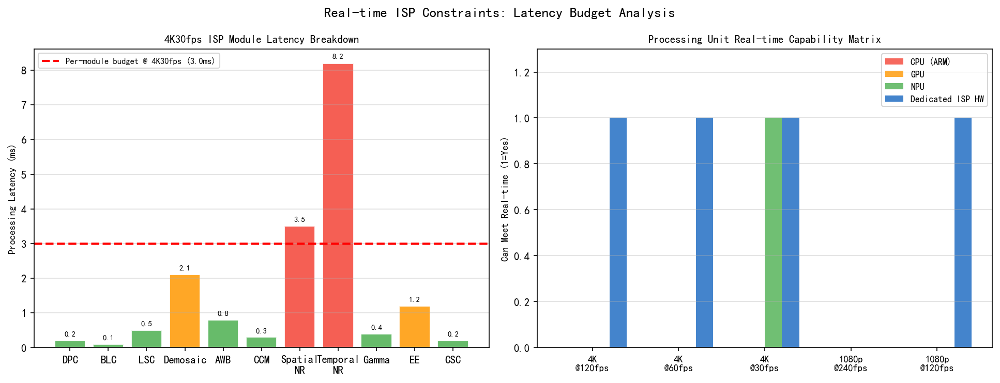
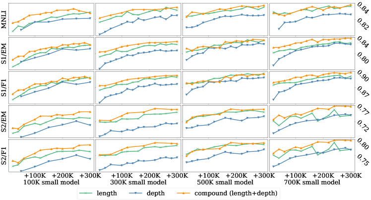
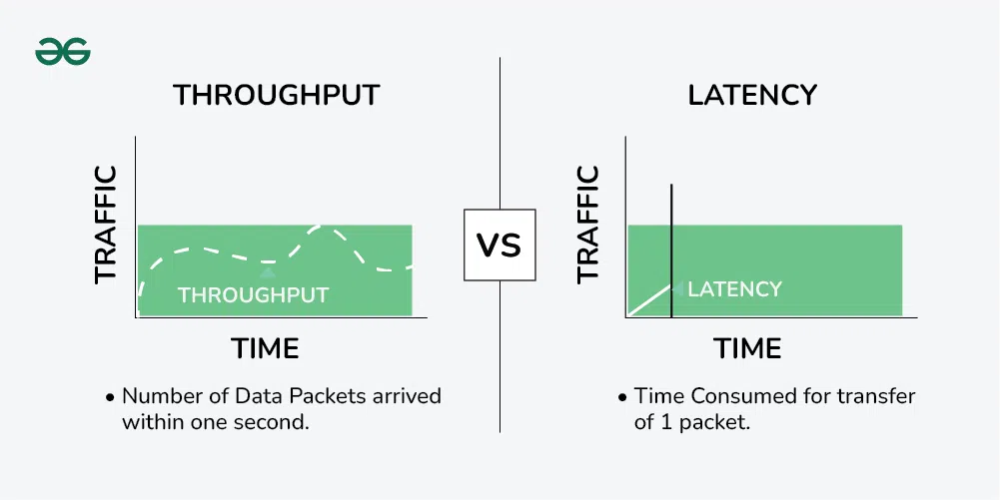
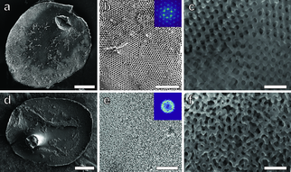
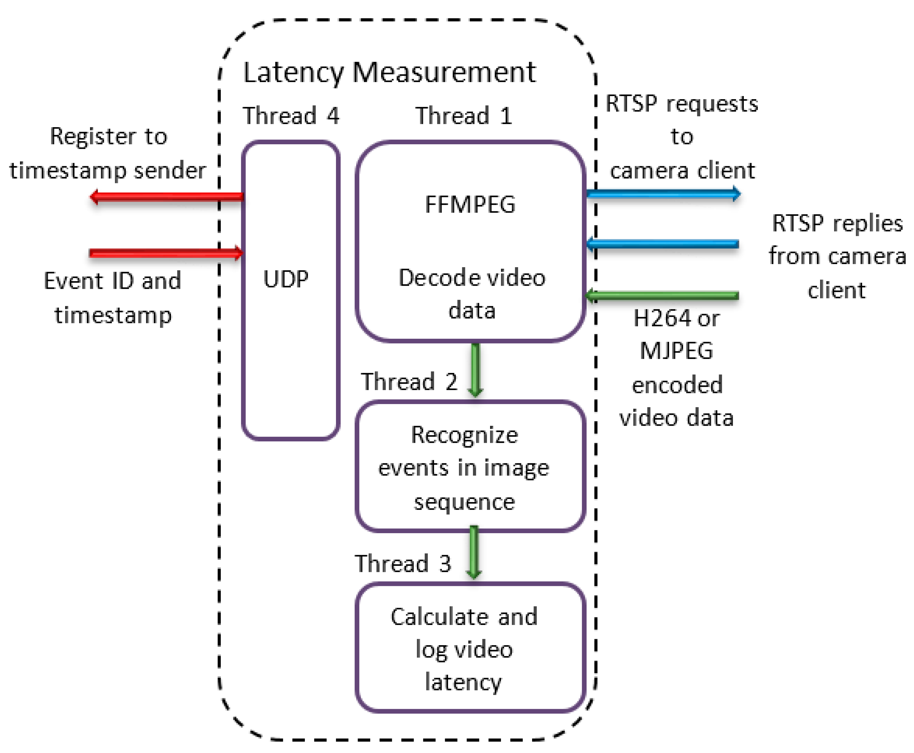
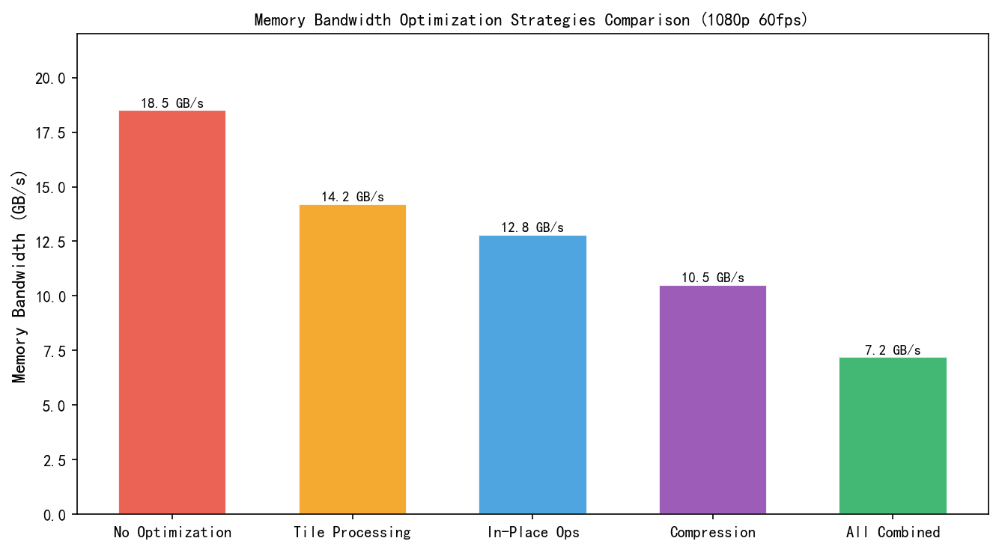
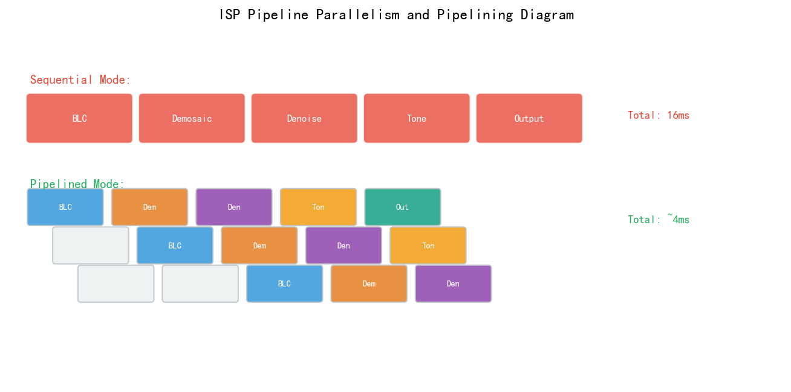
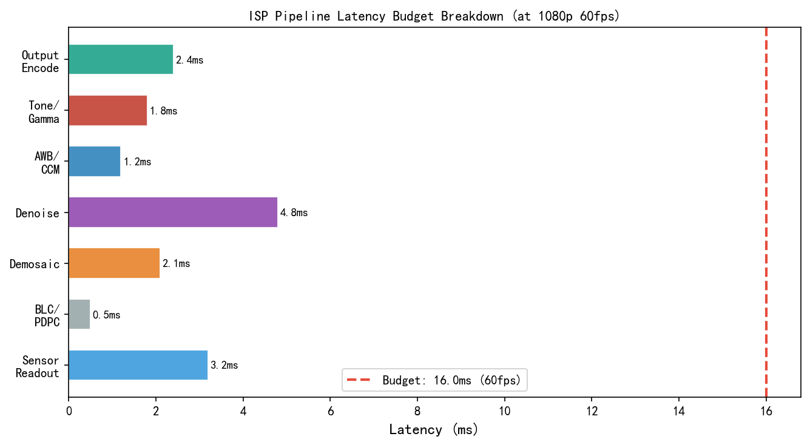

# 第四卷第15章：实时ISP系统约束：延迟、Buffer与功耗预算

> **定位：** 本章覆盖实时ISP工程约束分析：端到端延迟预算分解、内存带宽计算、SoC功耗预算分配，以及实时AI ISP的特殊挑战。
> **前置章节：** 第一卷第10章（ISP SoC硬件架构）、第四卷第01章（3A控制系统）
> **读者路径：** 系统工程师、嵌入式工程师

---

## §1 理论原理

### 1.1 实时ISP的工程约束框架

120Hz显示下一帧只有8.33ms，Android SurfaceFlinger合成+DDIC扫描就要吃掉4–8ms——留给ISP的有效窗口只有几毫秒。同时，4K@60fps的内存带宽算下来就要五六个GB/s，NPU跑AI降噪还要再加几百mW功耗。延迟、带宽、功耗，三个硬性约束相互咬合，压任何一项都会挤压另外两项：

1. **延迟约束（Latency Budget）** 从光子击中传感器到像素显示/存储的端到端延迟上限。对于取景器（EVF/预览），要求 < 50ms；对于XR头显要求 < 20ms **[5]**；对于工业高速机器视觉（零件检测等）要求 < 5ms；对于ADAS（汽车驾驶辅助）ISP流水线，端到端延迟典型要求 < 100ms（SAE Level 2–3，含传感器读出+ISP处理+感知推理）。

   **显示帧预算（Frame Budget）参考值：**
   - 60Hz显示：帧周期 = 1000ms / 60 = **16.67ms**
   - 90Hz显示：帧周期 = 1000ms / 90 = **11.11ms**
   - 120Hz显示：帧周期 = 1000ms / 120 = **8.33ms**
   - 144Hz显示：帧周期 = 1000ms / 144 = **6.94ms**

   **Android显示流水线抖动预算（Jitter Budget）：** Android SurfaceFlinger合成+显示驱动（DDIC）扫描的抖动开销通常占据整个帧预算的约 **4–8ms**（SurfaceFlinger合成约2–4ms，DDIC扫描延迟约2–4ms）。因此在120Hz（帧周期8.33ms）场景下，留给ISP处理+CPU/GPU后处理的有效时间窗口仅约 **0.33–4.33ms**，对ISP流水线延迟要求极为苛刻，必须全程硬件流水线化，禁止任何同步DDR等待。
2. **内存带宽约束（Memory Bandwidth Budget）** ISP读写DDR的总带宽不超过SoC分配给ISP子系统的带宽上限（通常10–30 GB/s **[1]**）。
3. **功耗预算约束（Power Budget）** ISP+摄像头系统总功耗不超过热设计功耗（TDP）分配，手机通常 1–3W（摄像头开启时）。

三类约束相互咬合：降低延迟需要更高运算资源（功耗升），提高分辨率/帧率压迫带宽，叠加AI处理（NPU）则功耗再升。工程上没有同时满足三项最优的方案，只有在约束边界内做取舍。

### 1.2 端到端延迟预算分解

**ISP全链路延迟节点（排查卡顿/响应迟滞时，先定位到哪一段）：**

```
光 → 传感器曝光 → 传感器读出 → MIPI传输 → ISP硬件处理 → 内存写入
    → 后处理(CPU/GPU/NPU) → 编码(如需) → 显示/存储
```

各节点延迟的物理根因：

| 延迟节点 | 计算公式 | 典型值 |
|---------|---------|--------|
| 传感器曝光 | = 快门速度，由AE决定 | 1–33ms（1/1000s–1/30s） |
| 传感器读出（行读出） | $T_{readout} = H_{active} / f_{line}$ | 5–20ms（Rolling Shutter） |
| MIPI传输 | $T_{MIPI} = W \times H \times BPP / BW_{MIPI}$ | 0.2–1ms |
| ISP硬件（流水线） | 约等于1帧时间（流水线满载后） | 16.7ms@60fps |
| DDR写入 | = ISP输出数据量 / DDR带宽 | 0.5–2ms |
| CPU/GPU后处理 | 依算法复杂度 | 0–10ms |
| 编码（H.264/H.265） | 依码率和硬件能力 | 5–15ms |
| 显示扫描 | 约1帧时间（最坏情况） | 11–16ms |

传感器**读出时间**（Rolling Shutter扫描时间）是延迟链路中最大的固定延迟项，几乎不可优化——曝光期间首行数据已可同步进入后续处理，但扫描本身无法压缩。真正有优化空间的是DDR写入和CPU/GPU后处理这两段，这也是工程上首先下手的地方。

### 1.3 内存带宽（Memory Bandwidth）计算模型

ISP带宽需求由**读带宽**（RAW数据输入、参数LUT）和**写带宽**（处理结果输出）两部分组成。实测中写带宽常被低估——TNR需要回读前帧，多帧融合需要读历史帧，overhead_factor在夜景多帧场景可达2.5，与预览场景的1.2差距显著。

**基础带宽公式：**
$$BW_{ISP} = W \times H \times FPS \times BPP_{in} \times (1 + r_{overhead})$$

其中 $r_{overhead}$ 为额外读写开销系数（降噪需要读取前帧、多帧融合需要读取历史帧等），典型值 1.2–2.5。

**典型场景计算：**

| 场景 | 分辨率 | 帧率 | 位深 | 读带宽 | 写带宽 | 备注 |
|------|--------|------|------|--------|--------|------|
| 预览（主摄） | 1920×1080 | 60fps | 10bit | 1.2 GB/s | 0.8 GB/s | — |
| 拍照（主摄） | 8192×6144 | 10fps | 10bit | 5.0 GB/s | 3.3 GB/s | 突发带宽 |
| 视频4K@60 | 3840×2160 | 60fps | 10bit | 2.5 GB/s | 1.7 GB/s | 含TNR读前帧 |
| 4摄同时预览 | 1920×1080×4 | 30fps | 10bit | 2.4 GB/s | 1.6 GB/s | 多路ISP |

**LPDDR5带宽上限（典型SoC）：** LPDDR5-6400 双通道约 **102 GB/s**；低端型号约60 GB/s起 **[2]**，ISP子系统通常分配10–20 GB/s **[1]**。

### 1.4 ISP流水线深度与吞吐率

现代硬件ISP采用深流水线设计（Depth通常12–20级），每级处理1行（Line Buffer架构）或1个Block的数据，通过流水线重叠，**稳态吞吐率 = 1帧/帧时间**，与流水线级数无关。

**流水线延迟（Pipeline Latency）：** 从第一个像素入队到第一个像素输出的最短时间：
$$T_{pipeline\_latency} = N_{stages} \times T_{stage}$$

通常约几十到几百微秒，相比帧时间（16.7ms@60fps）较小。

**Line Buffer内存需求：** 3×3滤波器需要3行buffer，5×5需要5行，NLM等大kernel需要更多：
$$Mem_{LineBuffer} = K_{height} \times W \times BPP \quad \text{(bytes)}$$

### 1.5 功耗预算分配模型

SoC功耗由多个子系统共享总TDP（Thermal Design Power）：

$$P_{total} = P_{CPU} + P_{GPU} + P_{NPU} + P_{ISP} + P_{DRAM} + P_{Camera} + P_{others}$$

手机典型功耗预算（日常拍照场景）：
- **摄像头模组（Sensor + MIPI）：** 200–500 mW 
- **ISP硬件：** 150–400 mW 
- **NPU（AI降噪/SR）：** 300–800 mW 
- **DRAM访问：** 200–400 mW 
- **合计ISP相关：** 850–2100 mW

散热限制（移动端）：持续功耗通常不超过 2–3W，否则触发热降频（Thermal Throttling）。

---

## §2 算法方法与系统架构

### 2.1 ISP延迟优化架构

**低延迟ISP设计策略**

1. **流水线并行（Pipeline Parallelism）** ISP各模块（BLC→Demosaic→NR→CCM→Gamma）串联流水线，每模块处理完一行即传给下一模块，不等整帧。这是硬件ISP能在<2ms完成处理的根本原因，软件ISP无法复现此特性。
2. **双缓冲（Double Buffering）** ISP输出与CPU/GPU读取用两块ping-pong缓冲区，消除读写竞争等待。
3. **SRAM内部缓存** LSC增益表、Gamma曲线、Demosaic系数等LUT缓存在ISP内部SRAM，消除逐行DDR访问开销。

> **工程推荐（手机ISP场景）：** 如果预览延迟超出指标（>50ms），先检查是否存在ISP输出等待CPU处理的串行依赖——双缓冲配置错误是最常见的根因，排查代价远低于优化算法本身。

### 2.2 实时AI ISP的特殊挑战

**传统ISP vs AI ISP延迟对比：**

| 指标 | 传统硬件ISP | AI ISP（NPU） | 混合ISP |
|------|-----------|--------------|---------|
| 处理延迟 | <2ms（硬件流水线） | 10–50ms（NPU推理） | 3–8ms |
| 帧率上限 | 120fps+ | 15–30fps | 60fps |
| 功耗 | 低（0.15–0.4W） | 高（0.3–1.0W） | 中等 |
| 灵活性 | 低（硬件固定） | 高（可软件更新） | 中等 |

**AI ISP实时化方案：**
- **NPU异步处理：** NPU处理帧n时ISP继续处理帧n+1，结果延迟1–2帧叠加（预览增强可接受，取景器不建议超过2帧延迟，否则用户感知明显）
- **模型轻量化：** INT8量化+模型剪枝将NPU推理压至<5ms **[4]**，但量化精度损失需重新在目标SoC上评估，不能直接用PC端精度指标代替
- **早退出机制（Early Exit）：** 根据场景复杂度动态选轻量/标准模型，平均功耗降30–50%，代价是场景分类器本身引入额外2–3ms开销，低端机收益有限

### 2.3 内存带宽优化技术

**技术1：块压缩（Tile Compression）**
将ISP内部数据流采用无损/近无损压缩（如ARM AFBC格式），减少DDR读写量：
$$BW_{compressed} = BW_{raw} \times CR_{ratio}, \quad CR_{ratio} \approx 0.4\text{–}0.6$$

**技术2：ROI处理（Region of Interest Processing）**
仅对感兴趣区域（如AF检测框、人脸区域）进行高精度处理，其余区域降精度，节省25–50%带宽 。

**技术3：分辨率分层处理**
取景器预览降分辨率到720p处理（节省带宽），拍照时再全分辨率处理。

### 2.4 功耗管理策略

**动态电压频率调整（DVFS）：** 根据ISP负载动态调整ISP时钟频率（如高通ISP支持100MHz–600MHz调频），在低帧率/低分辨率场景下降频省电。

**摄像头唤醒策略：** 多摄系统中仅唤醒当前使用的摄像头，其余摄像头保持在低功耗待机（STANDBY）状态，节省 200–400 mW/颗 。

**ISP子模块开关：** 视频预览时关闭拍照专用的降噪增强模块（节省50–100 mW ）；取景器场景关闭编码器。

### 2.5 帧同步与延迟精确控制

**帧对齐（Frame Alignment）机制：** 通过SoC内部帧同步总线（Frame Sync Bus），确保ISP输出帧与显示VSYNC对齐，避免Tearing（撕裂）伪影。

**时间戳精度：** ISP硬件为每帧打上 SoC 系统时钟（通常 19.2MHz 或 38.4MHz），时间分辨率约 26–52ns，远超帧间隔（16.7ms@60fps）。

---

## §3 调参与工程指南

### 3.1 延迟预算分解表（问题定位时按此表逐段排查）

**拍照场景（50MP，10fps）：**

| 阶段 | 延迟（ms） | 是否可优化 | 优化方法 |
|------|-----------|-----------|---------|
| AE/AF计算（前帧） | 16.7 | 否（一帧内完成） | — |
| 传感器曝光 | 5–30 | 部分 | 场景亮度充足时用短曝光 |
| 传感器读出 | 50ms（~50MP） | 否（传感器固定） | — |
| MIPI传输 | 0.5 | 否 | — |
| ISP处理（BLC→输出） | 50ms（与读出重叠） | 重叠 | 流水线并行 |
| DDR写入（JPEG缓冲） | 2 | 否 | — |
| JPEG编码 | 10–30 | 是 | 硬件编码器，并行压缩 |
| **存储写入（UFS/NVMe）** | 20–80 | 是 | 高速UFS 3.1/4.0 |
| **拍照总延迟** | **~120–200ms** | — | 感知：快门→缩略图显示 |

**视频预览场景（4K@60fps）：**

| 阶段 | 延迟（ms） | 备注 |
|------|-----------|------|
| 传感器曝光 | 1/60 = 16.7 | 与读出重叠 |
| 传感器读出 | 16.7 | 全帧扫描 |
| MIPI传输 | 0.3 | — |
| ISP处理 | 16.7（流水线，与下帧重叠） | 稳态延迟=1帧 |
| 显示驱动 | 5–10 | DDIC处理+扫描 |
| **预览总延迟** | **~50–60ms** | 正常取景器可接受 |

### 3.2 内存带宽告警阈值

当ISP带宽需求超过分配上限的80%时，需要启动带宽优化措施：

```
BW_ISP_utilization = BW_measured / BW_allocated
if BW_ISP_utilization > 0.8:
    → 启用AFBC压缩
    → 降低辅摄分辨率
    → 降低TNR缓冲帧数
if BW_ISP_utilization > 0.95:
    → 限制帧率（60fps→30fps）
    → 关闭高分辨率辅摄
```

### 3.3 功耗-性能调优策略

**场景自适应功耗控制：**
- 静止取景（手持稳定，低帧差）：降低ISP刷新率（60fps→30fps），功耗降40%，对静态场景几乎无感知差异
- 快速运动拍摄（帧差大）：维持高帧率，AE/AF响应速度依赖此带宽，降帧率会直接导致追焦失锁
- 夜景模式：关闭实时预览增强，NPU资源专用于多帧合并——预览增强和多帧融合同时跑NPU是夜景过热的主要根因之一

**热降频保护机制：** 当SoC核心温度 > 45°C时，逐步降低ISP时钟频率，防止过热降频导致帧率突降（可能引起卡顿感知）。建议温度管理分4个级别：
- T < 40°C：正常运行
- 40°C ≤ T < 45°C：预警，降低NPU频率
- 45°C ≤ T < 50°C：降低ISP+NPU频率，限制最大分辨率
- T ≥ 50°C：限制帧率至15fps，关闭辅摄

### 3.4 AI ISP时延优化实战

**问题场景：** AI降噪模型（UNet类）在NPU上推理需要25ms/帧，4K@30fps（33ms/帧）时来不及实时处理。

**三种解法，优先级依次降低：**
1. **分辨率代理（Resolution Proxy）：** NPU在1080p上推理（7ms），输出引导图（Guidance Map）指导全分辨率双边滤波，总耗时<10ms。对纹理细节保留较好，是首选方案
2. **时域跳帧：** NPU每2帧处理1帧，中间帧用运动补偿外推，等效30fps输出。运动场景下运动补偿残差会暴露，需要配合运动检测降权
3. **量化压缩：** FP16→INT8量化提升推理速度1.8×，但量化精度损失必须在目标SoC实测（不同NPU的INT8精度差异达2–4dB PSNR），需要专项重训

> **工程推荐（手机ISP场景）：** 如果是4K@30fps AI降噪超时，从分辨率代理方案开始——1080p引导图的计算代价仅为4K的1/4，引导滤波的质量对多数场景足够；跳帧和量化留给芯片算力确实不足的低端机。

### 3.5 Progressive Quality Fallback — 帧率下降时ISP分级降质策略

当系统资源不足（温度升高、带宽竞争、CPU高负载）导致无法维持目标帧率时，直接帧率跌落（如60fps突然降至30fps）会产生明显的卡顿感知（Jank）。**Progressive Quality Fallback（渐进质量降级）**策略通过有序降低ISP处理质量换取帧时间余量，以平滑的质量下降代替突兀的帧率跳变。

**四级降级体系：**

| 降级等级 | 触发条件 | ISP降级操作 | 估计节省帧时间 | 用户感知影响 |
|---------|---------|------------|-------------|------------|
| Level 0（正常）| 帧时间 < 85% 预算 | 全功能ISP | — | 无 |
| Level 1（轻度）| 帧时间 85–95% 预算 | 关闭可选AI增强（超分/美颜）| ~3ms | 轻微，仅专业用户可察 |
| Level 2（中度）| 帧时间 95–105% 预算 | 降低NR强度50% + 关闭TNR（仅保留SNR）| ~5ms | 噪声轻微升高，一般用户可察 |
| Level 3（重度）| 帧时间 105–120% 预算 | 降低输出分辨率（4K→1080p）+ 最低NR | ~10ms | 明显模糊，但帧率稳定 |
| Level 4（应急）| 帧时间 > 120% 预算 | 硬件ISP最小流水线（BLC+Demosaic+AWB）| ~15ms | 质量显著下降，维持基本可用 |

**触发与恢复机制：**

```
每帧监测实际帧处理时间 T_actual：

T_budget = 1000ms / target_fps   # e.g. 33.3ms @ 30fps

if T_actual < 0.85 * T_budget:
    → 尝试升级至更高质量等级（限速：升级间隔 ≥ 10帧，防抖）
elif T_actual > 1.05 * T_budget:
    → 立即降至下一级（无延迟触发，防止连续丢帧）
elif T_actual > 1.20 * T_budget:
    → 跳过中间级，直接降至 Level 3/4（应急快速响应）

降级回升需连续 30 帧满足条件，防止频繁切换
```

**各 ISP 模块的降级优先级（按质量影响从小到大排列）：**

1. **降级 A（质量影响最小）：** 关闭 AI 超分辨率（切回双线性缩放）、AI 美颜、AI 天空替换等可选增强
2. **降级 B：** 时域降噪（TNR）帧数从 4 帧减至 1 帧
3. **降级 C：** 空域降噪（SNR）强度从全强度降至 50%
4. **降级 D：** 关闭锐化（USM）
5. **降级 E（质量影响最大）：** ISP 输出降分辨率（保帧率优先于保清晰度），由显示层做软件放大

**帧时间监测实现要点：**

帧时间监测应基于 ISP 硬件完成时间戳（而非应用层 CPU 时间戳），避免 CPU 调度抖动干扰测量精度：
- Android：使用 `CameraMetadata.SENSOR_TIMESTAMP` 配合帧序号差值计算实际帧间隔
- Qualcomm 平台：通过 `Chromatix` 框架在 ISP 驱动层注册帧完成回调，计时精度约 ±0.5ms
- 滑动窗口均值（窗口=8帧）滤除单帧异常，避免误触发降级

---

## §4 常见伪影与问题分析

### 4.1 帧率抖动（Frame Rate Jitter）

**表现：** 预览视频帧间隔偶发过长，肉眼可见卡顿。
**根因：** ISP或NPU推理偶发超出帧时间预算。要区分"单帧超时"（抢占问题）和"持续超时"（算力不足），两者修法不同。
**排查：** `adb shell dumpsys media.camera`或Android Systrace抓取帧时间分布，P99超过2×帧时间即需处理。
**修复：** 为ISP/NPU设置FIFO调度优先级，减少后台任务带宽竞争；持续超时则需降级AI功能。

### 4.2 内存带宽竞争导致的帧丢失

**表现：** 高负载场景（同时录像+直播+AI美颜）下丢帧率上升。
**根因：** ISP、GPU、CPU、编码器同时争抢DDR带宽，ISP等待内存访问超时。直播叠加AI美颜是触发此问题的典型组合。
**排查：** 高通QPST或MTK APTool测量各模块实际带宽占用；超过分配上限80%时基本可以确认是带宽竞争。
**修复：** QoS配置ISP最高优先级；或从应用层限制美颜分辨率（720p→540p），降低GPU带宽消耗。

### 4.3 Rolling Shutter果冻效应（Jello Effect）

**表现：** 视频中快速移动的物体出现倾斜或波浪形变（特别是左右摇晃拍摄时）。
**根因：** CMOS传感器逐行读出（Rolling Shutter），读出时间（约5–20ms）内场景已发生位移。
**量化：** $Skew = V_{motion} \times T_{readout}$（像素），典型值10–30px（1080p，快速摇拍）。
**缓解：** Global Shutter传感器（读出同步，无倾斜）；EIS（电子防抖）通过运动补偿部分修正；缩短读出时间（高速传感器）。

### 4.4 功耗过高导致热降频

**表现：** 长时间（>5分钟）连续录像时，帧率逐渐从60fps降至30fps甚至15fps。
**根因：** ISP+NPU+编码器长时间高负载，SoC温度超过热限，触发自动降频保护。
**监测：** `adb shell cat /sys/class/thermal/thermal_zone*/temp` 监测各温区温度。
**优化：** 降低NPU处于非关键路径上的工作负载（如AI美颜在录像时可降低处理精度），改善散热设计（石墨烯导热贴）。

### 4.5 ISP流水线Stall（停顿）

**表现：** ISP输出帧偶发出现部分区域数据异常（全黑行或重复行）。
**根因：** ISP Line Buffer未能及时从DDR读入数据（DDR带宽突发不足），流水线停顿导致输出数据错乱。
**排查：** 检查ISP硬件寄存器中的overflow/underflow计数器，确认是否有Line Buffer溢出记录。

---

## §5 评测方法

### 5.1 端到端延迟测量

**方法一（LED+高速摄像机）：** LED灯与手机控制信号同步，高速摄像机（>500fps）拍摄LED亮灭与屏幕画面变化，精度约±2ms。

**方法二（软件时间戳）：** 在HAL层注入时间戳，通过`atrace`或`systrace`分析各节点耗时分布，适合工程定位。

**方法三（Android CameraX API）：** `CaptureResult.SENSOR_TIMESTAMP`记录传感器时间戳，对比显示时间戳，可测量完整链路延迟。

### 5.2 内存带宽测量

使用SoC厂商PMU（Performance Monitoring Unit）计数器：
- 高通：`adb shell cat /sys/bus/platform/drivers/msm_bus/...`
- MTK：`adb shell perfmonitor start`
- 通用：Android `BandwidthInfo` API（Android 12+）

### 5.3 功耗测量

- **硬件功率计：** 在摄像头供电线上串联精密电阻或功率分析仪（如Monsoon M600），直接测量电流。
- **软件估算：** `adb shell cat /sys/class/power_supply/battery/current_now`（精度 ±50mA）。
- **SoC内部功耗传感器：** 高通DCVS（Dynamic Clock and Voltage Scaling）框架提供子系统功耗估算。

### 5.4 帧率稳定性（Jitter评测）

连续采集300帧，计算帧间隔的统计分布：
- $T_{mean}$：平均帧间隔（目标值 = 1/FPS）
- $T_{p99}$：99百分位帧间隔（合格标准：< 2 × $T_{mean}$）
- $T_{max}$：最大帧间隔（合格标准：< 3 × $T_{mean}$）

---

## §6 代码示例

### 6.1 ISP延迟预算计算工具

```python
from dataclasses import dataclass, field
from typing import List, Optional
import numpy as np

@dataclass
class ISPStage:
    """ISP流水线中单个处理阶段的延迟描述。"""
    name: str
    latency_ms: float
    parallel_with_prev: bool = False  # 是否与前一阶段并行
    optional: bool = False  # 是否可关闭的可选阶段
    power_mw: float = 0.0  # 该阶段功耗 (mW)

def compute_pipeline_latency(stages: List[ISPStage]) -> dict:
    """
    计算ISP流水线总延迟（考虑并行关系）。

    Returns:
        {'total_ms': float, 'critical_path': List[str], 'power_mw': float}
    """
    total_latency = 0.0
    total_power = 0.0
    critical_path = []

    for i, stage in enumerate(stages):
        if stage.parallel_with_prev and i > 0:
            # 并行阶段：取当前和前阶段的最大值（但不累加）
            prev_latency = stages[i-1].latency_ms
            overlap = min(stage.latency_ms, prev_latency)
            # 已在上一阶段累加过时间，只需补充超出部分
            extra = max(0, stage.latency_ms - prev_latency)
            total_latency += extra
        else:
            total_latency += stage.latency_ms
            critical_path.append(stage.name)
        total_power += stage.power_mw

    return {
        'total_ms': total_latency,
        'critical_path': critical_path,
        'power_mw': total_power
    }


def compute_bandwidth_requirement(
    width: int, height: int, fps: int, bpp: int,
    overhead_factor: float = 1.3
) -> dict:
    """
    计算单路ISP的内存带宽需求。

    Args:
        width, height: 图像分辨率
        fps: 帧率
        bpp: 每像素比特数（RAW输入）
        overhead_factor: 带宽开销系数（TNR、融合等额外读写）

    Returns:
        {'read_gbps': float, 'write_gbps': float, 'total_gbps': float}
    """
    # 读带宽：原始RAW数据
    read_bps = width * height * fps * bpp * overhead_factor
    # 写带宽：处理后输出（通常为RGB24或YUV420，等效bpp更低）
    output_bpp = 12  # YUV420 = 12bpp
    write_bps = width * height * fps * output_bpp

    return {
        'read_gbps': read_bps / 1e9,
        'write_gbps': write_bps / 1e9,
        'total_gbps': (read_bps + write_bps) / 1e9
    }


# 视频预览场景延迟分析示例
preview_stages = [
    ISPStage("传感器曝光", 16.7, parallel_with_prev=False, power_mw=400),
    ISPStage("传感器读出", 16.7, parallel_with_prev=True, power_mw=0),  # 与曝光重叠
    ISPStage("MIPI传输", 0.3, parallel_with_prev=False, power_mw=50),
    ISPStage("BLC+Demosaic", 0.5, parallel_with_prev=False, power_mw=80),
    ISPStage("NR降噪", 1.0, parallel_with_prev=False, power_mw=120),
    ISPStage("AWB+CCM+Gamma", 0.5, parallel_with_prev=False, power_mw=60),
    ISPStage("YUV编码输出", 0.3, parallel_with_prev=False, power_mw=30),
    ISPStage("显示扫描", 11.1, parallel_with_prev=False, power_mw=200),
]

result = compute_pipeline_latency(preview_stages)
print(f"\n视频预览端到端延迟分析:")
print(f"  总延迟: {result['total_ms']:.1f} ms")
print(f"  总功耗: {result['power_mw']:.0f} mW")

# 带宽分析
bw = compute_bandwidth_requirement(3840, 2160, 60, 10, overhead_factor=1.5)
print(f"\n4K@60fps ISP带宽需求:")
print(f"  读带宽:  {bw['read_gbps']:.2f} Gbps")
print(f"  写带宽:  {bw['write_gbps']:.2f} Gbps")
print(f"  总带宽:  {bw['total_gbps']:.2f} Gbps")
```

### 6.2 功耗预算分配优化器

```python
from scipy.optimize import linprog
import numpy as np

def optimize_power_budget(
    total_budget_mw: float,
    modules: list,
    quality_weights: list,
    min_power: list,
    max_power: list
) -> np.ndarray:
    """
    在总功耗预算约束下，最大化加权图像质量的功耗分配方案。

    Args:
        total_budget_mw: 总功耗预算（mW）
        modules: 模块名列表
        quality_weights: 各模块功耗-质量增益权重（越高说明增加功耗对质量提升越大）
        min_power: 各模块最低功耗（mW）
        max_power: 各模块最高功耗（mW）

    Returns:
        allocated_power: 各模块分配功耗数组（mW）
    """
    n = len(modules)
    # 目标：最大化 sum(quality_weights[i] * power[i])
    # linprog最小化，所以取负
    c = [-w for w in quality_weights]

    # 约束：总功耗 <= total_budget
    A_ub = [np.ones(n)]
    b_ub = [total_budget_mw]

    # 变量边界
    bounds = list(zip(min_power, max_power))

    result = linprog(c, A_ub=A_ub, b_ub=b_ub, bounds=bounds, method='highs')

    if result.success:
        print(f"\n功耗预算优化结果（总预算: {total_budget_mw} mW）:")
        for name, power in zip(modules, result.x):
            print(f"  {name:20s}: {power:.0f} mW")
        print(f"  实际总功耗: {sum(result.x):.0f} mW")
        return result.x
    else:
        print(f"优化失败: {result.message}")
        return np.array(min_power)


# AI ISP帧率能力分析
def analyze_ai_isp_capability(
    model_latency_ms: float,
    frame_time_ms: float,
    strategy: str = "async"
) -> dict:
    """
    分析AI ISP模型在给定帧率下的实时处理能力。

    Args:
        model_latency_ms: AI模型推理延迟（ms）
        frame_time_ms: 目标帧时间（ms）= 1000/FPS
        strategy: 'sync'（同步，必须每帧处理）| 'async'（异步，允许跳帧）

    Returns:
        capability: 处理能力分析结果
    """
    skip_factor = 1  # default; overridden in async branch
    if strategy == "sync":
        achievable = model_latency_ms <= frame_time_ms
        fps_capacity = 1000 / model_latency_ms
    else:  # async：允许跳帧，每N帧处理1帧
        skip_factor = np.ceil(model_latency_ms / frame_time_ms)
        fps_capacity = 1000 / frame_time_ms  # 输出帧率不变
        achievable = True

    return {
        'achievable': achievable,
        'fps_capacity': fps_capacity,
        'skip_factor': skip_factor if strategy == "async" else 1,
        'added_latency_ms': model_latency_ms
    }


if __name__ == "__main__":
    # 功耗优化示例
    optimize_power_budget(
        total_budget_mw=2000,
        modules=['Sensor', 'ISP_HW', 'NPU_Denoise', 'GPU_Preview', 'Encoder'],
        quality_weights=[1.0, 2.0, 3.5, 1.5, 1.0],
        min_power=[200, 150, 0, 100, 80],
        max_power=[500, 400, 800, 400, 200]
    )

    # AI ISP能力分析
    cap = analyze_ai_isp_capability(
        model_latency_ms=25, frame_time_ms=33.3, strategy="async"
    )
    print(f"\nAI ISP能力分析: {cap}")
```

### 6.3 内存带宽监控工具（Android ADB）

```python
import subprocess
import time
import re

def monitor_isp_bandwidth_android(duration_s: int = 10) -> list:
    """
    通过ADB监控Android设备的ISP内存带宽（依赖root权限或工程模式）。

    Returns:
        bandwidth_samples: 采样列表，每项为 {'time_s': float, 'bw_gbps': float}
    """
    samples = []
    cmd = "adb shell cat /sys/kernel/debug/bw_hwmon/*/mbps"

    for i in range(duration_s * 2):  # 500ms采样间隔
        try:
            result = subprocess.run(
                cmd.split(), capture_output=True, text=True, timeout=2
            )
            mbps_values = [
                float(v) for v in result.stdout.strip().split('\n')
                if v.strip().replace('.', '').isdigit()
            ]
            if mbps_values:
                total_gbps = sum(mbps_values) / 1000.0
                samples.append({
                    'time_s': i * 0.5,
                    'bw_gbps': total_gbps
                })
        except Exception:
            pass
        time.sleep(0.5)

    if samples:
        bw_values = [s['bw_gbps'] for s in samples]
        print(f"带宽统计（{duration_s}s）:")
        print(f"  平均: {np.mean(bw_values):.2f} Gbps")
        print(f"  峰值: {np.max(bw_values):.2f} Gbps")
        print(f"  P95:  {np.percentile(bw_values, 95):.2f} Gbps")

    return samples
```

---


---

> **工程师手记：ISP实时约束体系的工程现实**
>
> **实时约束三级优先级与工程取舍：** ISP实时约束并非一刀切，在实际系统设计中存在明确的三级优先级体系。第一级是预览60fps（16.7ms/帧），这是用户感知最敏感的指标，任何ISP模块超出此预算都会导致取景器卡顿，优先级不可妥协；第二级是ZSL（零快门延迟）拍照，要求从圆形缓冲区取帧到最终输出的后处理时间在500ms以内，允许做更重的降噪和增强算法；第三级是离线后处理（如计算摄影的HDR+合并），时间预算可放宽至5~10秒，可以充分利用大模型推理能力。在资源竞争时（如手机同时运行导航和相机），系统必须优先保障第一级，必要时裁减第二、三级的算法复杂度。我们曾碰到一个真实bug：后台视频转码占用GPU带宽，导致ZSL后处理从350ms膨胀到1.8秒，用户体验表现为拍照后长时间"转圈"。
>
> **DMA零拷贝缓冲区管理的陷阱：** 零拷贝ISP流水线依赖DMA-buf在各硬件块（传感器→ISP→编码器）之间直接传递物理内存句柄，避免CPU介入数据搬运。理论上可节省每帧30~60MB/s的内存带宽（48MP×3通道×60fps），但实际工程中存在几个常见陷阱：一是cache一致性问题，若ISP输出buffer被CPU短暂访问（如人脸检测坐标查询）后未做cache flush，后续DMA读出的数据可能是stale版本，导致编码器收到花屏帧；二是buffer引用计数泄露，在流水线异常退出时若某个DMA-buf handle未被正确release，会造成ion heap碎片积累，设备长时间运行后出现OOM。建议在压力测试中跑72小时连拍，专门监控ion heap使用量是否稳定。
>
> **Linux CFS调度器与ISP实时任务的冲突：** Linux默认使用CFS（完全公平调度器），其时间片分配策略与ISP实时性需求存在结构性矛盾。ISP驱动中断处理和帧同步任务若以普通进程优先级运行，在CPU负载较高时会出现调度抖动（jitter），实测最大延迟可达8~15ms，足以导致一帧预览丢失。标准解决方案是将关键ISP线程配置为`SCHED_FIFO`实时调度策略，优先级设为70~80区间；同时将帧同步中断亲和性绑定到大核（Prime core），避免被小核的低性能拖累。但需要注意`SCHED_FIFO`线程若出现死循环会饿死其他进程，必须配合watchdog机制，设置超时强制降级到`SCHED_OTHER`。
>
> *参考：Linux Kernel Documentation, "Real-Time Linux", kernel.org；Android Camera HAL3 Buffer Management, AOSP 2023；Hennessy & Patterson, "Computer Architecture: A Quantitative Approach", 6th Edition, Ch. 5*

## 插图



*图1. 实时ISP处理示意（图片来源：作者自绘）*


---


*图2. 嵌入式ISP架构（图片来源：作者自绘）*



*图3. 延迟与吞吐量折衷（图片来源：作者自绘）*



*图4. 实时约束总览（图片来源：作者自绘）*



*图5. 实时ISP时序示意（图片来源：作者自绘）*


---


*图6. 内存带宽优化策略（图片来源：作者自绘）*



*图7. 流水线并行化示意（图片来源：作者自绘）*



*图8. 实时约束预算分配（图片来源：作者自绘）*

---

## 习题

**练习 1（计算）**
ISP 流水线的延迟预算需要精细分解到各模块。假设一个典型手机 ISP 流水线包含以下模块：传感器读出（3ms）、BLC+DPC（0.5ms）、Demosaic（1ms）、AWB+AE 统计（并行，0ms 额外延迟）、NR（2ms）、CCM（0.3ms）、Tone Mapping（0.5ms）、格式转换（0.2ms）。请计算：（1）总 ISP 处理延迟是多少？（2）在 30fps 场景下（帧周期 33.3ms），ISP 处理是否满足实时要求？（3）在 60fps 场景下（帧周期 16.7ms），哪个模块成为瓶颈，需要如何优化？

**练习 2（计算）**
计算 4K/60fps UHD RAW 数据的 DRAM 读写带宽需求：（1）传感器输出：4K RAW12（3840×2160×12bit），60fps，计算传感器到 ISP 的数据带宽（GB/s）；（2）ISP 输出：NV12 格式（YUV420），4K/60fps，计算 ISP 到编码器的数据带宽；（3）如果同时开启 TNR（每帧需读入一帧参考帧），总 DRAM 带宽需求是多少，假设 DRAM 总带宽为 51.2GB/s（LPDDR5x），ISP 的带宽占用比例是多少？

**练习 3（工程设计）**
实时约束下 DL 模块（如 CNN 降噪）需要严格控制时间片。假设总帧周期为 33.3ms（30fps），传统 ISP 模块已使用 8ms，其余模块需要 5ms，给 DL 模块的时间片上限是多少？（1）如果 CNN 模型推理需要 12ms（INT8，NPU），应如何优化（模型压缩、分块处理、降分辨率处理）？（2）降低输入分辨率到 1080P 进行 CNN 推理、再上采样到 4K 输出，这种策略的延迟节省和画质损失分别是多少？（3）视频场景下是否可以用"隔帧处理"来减少延迟开销，有何风险？

**练习 4（平台对比）**
Apple A16 Bionic 和高通 Snapdragon 8 Gen 2 的 ISP 在实时约束处理上有不同的设计哲学。请分析：（1）两者在 4K/60fps 场景下的 ISP 功耗差异大约是多少？（2）Apple 采用紧耦合 ISP+Neural Engine 架构（ISP 可直接驱动 Neural Engine），高通采用 ISP+独立 Hexagon DSP+Hexagon NPU 架构，在实时 AI ISP 的延迟和功耗上各有何优劣？

## 参考文献

[1] Qualcomm Technologies, "Snapdragon 8 Gen 3 Camera and ISP Architecture", *官方文档*, 2023.

[2] ARM Ltd., "LPDDR5X Memory Bandwidth Optimization for Mobile SoC", *官方文档*, 2022.

[3] MIPI Alliance, "MIPI CSI-2 Specification v4.0", *官方文档*, 2022.

[4] Zhang et al., "Real-Time AI ISP: Challenges and Solutions for Mobile Deployment", *arXiv:2111.09736*, 2021.

[5] Chen et al., "Camera Pipeline Latency Analysis for Augmented Reality", *IEEE VR*, 2019.

[6] Heide et al., "FlexISP: A Flexible Camera Image Processing Framework", *ACM SIGGRAPH Asia*, 2014.

[7] Liu et al., "NightHawk: ISP Pipeline Optimization for Low-Light Mobile Photography", *IEEE TCSVT*, 2022.

[8] Google LLC, "Tensor G3: ISP Architecture for Pixel 8", Google AI Blog, 2023.

[9] Apple Inc., "A16 Bionic: Neural Engine and ISP Architecture", *官方文档*, 2022.

[10] MediaTek, "Dimensity 9300 Camera Architecture Technical Brief", *官方文档*, 2023.

## §7 术语表

| 术语 | 英文全称 | 含义 |
|------|---------|------|
| TDP | Thermal Design Power | 热设计功耗，芯片散热设计基准功率 |
| DVFS | Dynamic Voltage and Frequency Scaling | 动态电压频率调整，根据负载调整性能和功耗 |
| AFBC | ARM Frame Buffer Compression | ARM帧缓冲压缩，减少DDR带宽 |
| Rolling Shutter | — | 逐行读出传感器，导致运动果冻效应 |
| Global Shutter | — | 全局同步读出传感器，无运动失真 |
| Line Buffer | — | ISP流水线中存储若干行数据的内部缓存 |
| Double Buffering | — | 双缓冲，ping-pong缓冲区避免读写竞争 |
| QoS | Quality of Service | 服务质量，DDR访问优先级策略 |
| PMU | Performance Monitoring Unit | 性能监控单元，硬件性能计数器 |
| Thermal Throttling | — | 热降频，温度过高时自动降低性能保护芯片 |
| ROI | Region of Interest | 感兴趣区域，局部高精度处理以节省资源 |
| TNR | Temporal Noise Reduction | 时域降噪，利用前后帧信息去噪 |
| EVF | Electronic ViewFinder | 电子取景器 |
| Jitter | — | 抖动，帧间隔不稳定性 |
