# 第四卷第16章：视频ISP系统工程

> **定位：** 本章覆盖视频ISP工程实践：帧间一致性、3A收敛策略、视频码率-质量控制、手机视频ISP与电影ISP的差异。
> **前置章节：** 第三卷第08章（DL视频降噪）、第四卷第01章（3A控制系统）
> **读者路径：** 系统工程师、算法工程师

---

## §1 理论原理

### 1.1 视频ISP与图片ISP的本质差异

视频ISP的核心难点是**时域一致性（Temporal Consistency）**：帧是连续的，任何参数跳变——曝光、白平衡、降噪强度——都会被人眼识别为"闪烁"或"跳帧"。图片ISP可以为每张照片单独最优化，视频ISP不行，它要在每帧都保持合理的同时，还要保证帧与帧之间的平滑过渡，这两件事经常相互拉扯。

**关键约束对比：**

| 指标 | 图片ISP | 视频ISP |
|------|---------|---------|
| 3A收敛速度 | 可慢（1–5帧） | 须快（≤ 3帧对焦，AE平滑） |
| 3A参数变化 | 允许单步大幅调整 | 必须逐帧平滑过渡 |
| 降噪强度 | 可最大化 | 受时域一致性约束 |
| HDR合并 | 离线合并，不限时间 | 必须实时（每帧16.7ms@60fps） |
| 帧间运动估计 | 不需要 | 必须（TNR、EIS需要光流） |

### 1.2 视频3A的时域约束

**AE（自动曝光）时域约束：**

AE的曝光调整不能过于激进，否则引发视频"呼吸效应"（Breathing）——亮度周期性波动。标准做法是限制每帧的EV调整步长（Step Size Limit）：

$$|EV_{n+1} - EV_n| \leq \Delta EV_{max}$$

典型值：
- 亮度变化较慢场景：$\Delta EV_{max} = 0.1$（约7%亮度变化/帧）
- 快速场景切换（如从室内到室外）：$\Delta EV_{max} = 0.3$（约20%/帧）

**消除防频闪（Anti-Flicker）的AE约束：**

在50Hz/60Hz交流电照明环境下（荧光灯、LED灯），曝光时间必须是光源周期整数倍，否则出现亮度周期性变化：
- 50Hz光源：曝光时间 ∈ {10ms, 20ms, 30ms, ...}（1/100s整数倍）
- 60Hz光源：曝光时间 ∈ {8.3ms, 16.7ms, 33.3ms, ...}（1/120s整数倍）

这一约束与AE目标EV冲突时，优先满足防频闪，用增益（ISO）补偿曝光不足——代价是噪声升高，但频闪比噪声更刺眼，这个取舍在手机视频里是正确的。

**AWB（自动白平衡）时域平滑：**

AWB的色温估计误差会引起帧间色调跳变（Color Jump），需要对估计结果进行时间域低通滤波（时域平滑）：

$$WB_{gains,n} = (1 - \alpha_{AWB}) \cdot WB_{gains,n-1} + \alpha_{AWB} \cdot \hat{WB}_{gains,n}$$

其中 $\alpha_{AWB}$ 为平滑系数，典型值 0.05–0.15（$\alpha=0.1$ 对应约10帧的响应时间常数）。

### 1.3 视频码率-质量权衡（Rate-Distortion）

视频编码（H.264/H.265/AV1）的码率-质量关系由**率失真曲线（Rate-Distortion Curve）**描述：

$$PSNR = f(Bitrate) \approx a \cdot \log(Bitrate) + b$$

码率分配策略：
- **CBR（Constant Bit Rate）：** 固定码率，运动复杂场景质量下降，静止场景浪费带宽
- **VBR（Variable Bit Rate）：** 动态分配码率，运动场景增加码率，适合高质量录像
- **CQP（Constant QP）：** 固定量化参数，码率随内容波动，质量最稳定，常用于电影拍摄Log模式

**视频ISP对编码的影响：** ISP的降噪质量直接影响编码效率——噪声是高频随机信号，编码器难以压缩，良好的NR可使相同质量下码率降低20–40% 。

### 1.4 对数曲线（Log）视频与线性Raw视频

**Log视频（Log Gamma）：** 将传感器线性RAW数据通过对数OETF（Opto-Electronic Transfer Function）编码，最大化保留动态范围：

$$V_{log} = a \cdot \log_{10}(I_{linear} + b) + c$$

常见Log格式：
- **Sony S-Log3：** 约15+档动态范围，用于α系列相机
- **ARRI LogC4：** 约17档，用于ALEXA 35电影机
- **Apple Log（iPhone 15 Pro）：** 约16档，用于ProRes视频（参见 Apple ProRes Log White Paper 2023）

Log视频不适合直接观看——显示时必须过LUT调色，否则画面发灰。这是刻意的：保留动态范围就得先把亮度压进编码范围，代价是看起来"平"。不会调色的用户拿到Log素材觉得效果差，这不是ISP质量问题。

### 1.5 视频EIS（电子防抖）的ISP影响

EIS不是免费的——它从ISP端要代价。原理上，EIS通过分析帧间运动（光流）对图像做反向补偿，但补偿需要"余量"：图像必须比显示分辨率更大，补偿时才有像素可裁。这个代价在ISP层面有三个具体影响：

1. **额外帧边距（Crop Margin）：** 通常留出10–15%的边距用于补偿运动，等效FOV缩小（拍的范围变窄了）。
2. **运动估计延迟：** 需要当前帧+前1–2帧的数据，引入约1–2帧的额外延迟。
3. **ISP输出分辨率需求：** 输入分辨率须高于输出分辨率以提供crop空间——4K防抖需要ISP先输出约4.5K的中间帧。

---

## §2 算法方法与系统架构

### 2.1 视频ISP全链路架构

```
传感器RAW流
     │
     ▼
┌─────────────────────────────────────────────┐
│                 实时视频ISP                   │
│                                              │
│  BLC → Demosaic → TNR(帧间) → NR(帧内)      │
│  → AWB(时域平滑) → CCM → Gamma/Log           │
│  → AE控制 → AF辅助 → EIS运动估计             │
│                                              │
│  [3A控制模块：独立线程，每帧更新]              │
└─────────────────────┬───────────────────────┘
                      │
                      ▼
              YUV/Log RAW流
                      │
              ┌───────┴────────┐
              │                │
              ▼                ▼
        视频编码器          EIS稳定器
     (H.265/H.264/        (运动补偿
        ProRes)            裁剪+变换)
              │                │
              ▼                ▼
        视频文件           稳定预览
```

### 2.2 AE收敛策略（视频专用）

**分段收敛策略：** 视频AE不能用一个固定步长走天下，场景切换时步长太小会慢几十帧才到位（观感很差），稳定拍摄时步长太大会出呼吸效应。三段策略是折中：
- **Stage 1（快速捕捉）：** 检测到大幅亮度变化（如场景切换），步长 $\Delta EV_{max} = 0.3$，快速靠近目标，持续约3–5帧
- **Stage 2（精细收敛）：** 进入目标EV的±0.5EV范围，切换小步长 $\Delta EV_{max} = 0.05$，平滑收尾
- **Stage 3（稳态保持）：** 偏差 < 0.1EV时停止调整，死区防止无意义抖动

**防频闪AE算法（Anti-Flicker AE）：**
1. 检测当前光源频率（50Hz/60Hz）：通过分析固定曝光时间下的亮度波动频谱
2. 将目标曝光时间量化为安全值：$T_{exp} = round(T_{target} \times f_{flicker}) / f_{flicker}$
3. 当量化导致曝光偏差 > 0.2EV时，以增益（ISO）补偿亮度差异

### 2.3 AWB视频平滑算法

**双速平滑策略：**
- 常规模式：$\alpha_{AWB} = 0.05$（约20帧收敛，对应约0.3秒@60fps）
- 大色温变化（>500K跳变，如从钨丝灯进入荧光灯）：$\alpha_{AWB} = 0.15$（约7帧，加快响应）

**场景锁定（Scene Lock）策略：** 检测到强烈运动（如摄像机快速摇晃）时，暂停AWB更新（$\alpha_{AWB} = 0$），避免运动引起的误估计导致色调跳变。

### 2.4 时域降噪（TNR）的视频ISP实现

TNR是视频ISP质量的核心模块，利用相邻帧的时间冗余信息去噪：

$$I_{TNR}(n) = (1 - w) \cdot I_{in}(n) + w \cdot \Phi(I_{TNR}(n-1), I_{in}(n))$$

其中 $\Phi$ 为运动对齐函数（可以是块匹配或光流），$w$ 为时域混合权重（静止区域 $w \approx 0.8$，运动区域 $w \approx 0.1$）。

**运动自适应权重：** 通过当前帧与前帧的像素差异（Motion Map）自适应调整 $w$：
$$w(x, y) = \exp\left(-\frac{|\Delta I(x,y)|^2}{2\sigma_{motion}^2}\right)$$

静止区域 $|\Delta I|$ 小，$w$ 大（强时域积分）；运动区域 $|\Delta I|$ 大，$w$ 小（依赖当前帧，避免运动鬼影）。

### 2.5 手机视频ISP vs 电影摄影机ISP

**架构层面差异：**

| 对比维度 | 手机视频ISP | 电影摄影机ISP（如ARRI ALEXA） |
|---------|-----------|---------------------------|
| 传感器格式 | 1/1.3"–1/3.5"（小底） | Super 35mm–65mm全片幅 |
| 动态范围 | 10–13档 | 14–17档 |
| 输出格式 | H.265 4:2:0 8/10bit；H.264 Baseline 4:2:0 8bit | RAW/ProRes 4:2:2 10bit起（ProRes 422 LT/Proxy/HQ均为4:2:2 10bit；ProRes 4444为4:4:4 12bit；RAW可达16bit线性）|
| 色彩科学 | 品牌自定义（Vivid增艳） | 电影工业标准（ACES） |
| 帧率 | 30/60/120fps | 24/48fps（高端可240fps） |
| 滚动快门 | 明显（约15–30ms读出） | ARRI ALEXA 35/65 CMOS（Rolling Shutter，读出速度低约5ms，RS失真不明显） |
| 实时降噪 | 强（隐藏传感器噪声） | 弱/无（保留胶片质感） |
| 调色空间 | sRGB/HDR10（消费显示） | ACES/DCI-P3（影院） |

**Log模式的ISP特殊处理：**

启用Log模式（如iPhone 15 Pro的Apple Log，专业模式的S-Log3）时，ISP需要特殊调整：
1. **禁用或弱化降噪：** Log模式下的噪声特性（信号依赖噪声）在后期调色中会被放大，过度降噪会损失纹理
2. **禁用自动色调映射：** 保留高光细节，不做自动拉宽直方图
3. **禁用自动锐化：** 避免振铃（Ringing）伪影在后期增益放大后显现
4. **精确Gamma曲线：** Log OETF曲线需要与后期LUT精确匹配，误差 < 0.5% **[5]**

### 2.6 视频防抖（EIS）与ISP的交互

EIS算法需要从ISP获取以下信息：
- **传感器时间戳：** 每行的精确曝光时间（用于Rolling Shutter校正）
- **陀螺仪数据：** IMU角速度，与传感器帧时间戳严格对齐（误差 < 1ms ）
- **ISP ROI坐标：** 用于计算EIS的有效crop窗口

EIS向ISP反馈：
- **Crop窗口：** 实时更新每帧的有效ROI，ISP仅输出crop区域

---

## §3 调参与工程指南

### 3.1 AE步长调参

**步长过大：** 视频呼吸效应明显，亮度波动可见（通常帧间EV变化 > 0.2 EV即可感知）。
**步长过小：** AE收敛过慢，场景切换后较长时间（>5帧）曝光不正确。

**推荐调参范围：**
- 稳定场景（亮度变化 < 0.5EV/秒）：步长 0.05–0.08 EV/帧
- 中等变化（0.5–2EV/秒）：步长 0.1–0.15 EV/帧
- 快速切换（>2EV/秒，如日间进入黑暗隧道）：步长 0.25–0.35 EV/帧，但自动触发过渡检测（Transition Detection）模式

**防频闪调参：** 频闪检测灵敏度不宜过高（误检会导致在正常DC光源下无意义地约束曝光时间），建议：频闪检测置信度阈值 > 0.75 时才启用防频闪约束。

### 3.2 AWB平滑参数调参

平滑系数 $\alpha_{AWB}$ 的选择依赖于：
- **视频帧率：** 60fps需要更小的 $\alpha$（约0.05）以避免色温过快变化；24fps可用稍大的 $\alpha$（约0.1）
- **内容类型：** 固定镜头（景深、采访）用小 $\alpha$（稳定优先）；动态跟拍用大 $\alpha$（快速响应优先）
- **感知性：** 肤色区域对AWB偏差最敏感，建议对包含人脸的场景使用较小 $\alpha$

### 3.3 TNR参数调参

**混合权重 $w$ 过大：** 静止区域噪声抑制强，但运动区域出现明显鬼影（Ghost），人物移动时产生"幽灵"轮廓。
**混合权重 $w$ 过小：** 运动鬼影少，但噪声抑制弱，暗场拍摄时噪声明显。

**推荐实践：** 以运动Map置信度为核心。DN值阈值需根据当前ISO调整——高ISO时噪声本底高，固定阈值会把噪声误判为运动，导致静止区域TNR权重被压低：
- 静止像素（帧差 < 5 DN @ ISO100，随ISO线性放宽）：$w = 0.7$–$0.85$
- 轻微运动（帧差5–20 DN）：$w$ 线性插值，$0.3$–$0.7$
- 快速运动（帧差 > 20 DN）：$w = 0.1$–$0.2$

> **工程推荐（手机ISP场景）：** 如果TNR在高ISO下鬼影减弱但噪声反而升高，首先检查运动阈值是否随ISO缩放——噪声把帧差撑大、触发了低权重模式，才是根因，不是TNR算法本身出了问题。

### 3.4 Log模式ISP配置清单

启用视频Log模式时需检查的ISP参数：

| 参数 | 普通视频 | Log模式 | 说明 |
|------|---------|---------|------|
| Gamma曲线 | sRGB/HLG | Log OETF | 保留动态范围 |
| 空间NR强度 | 中–高 | 低 | 避免纹理损失 |
| TNR强度 | 中–高 | 低–中 | 低ISO时可适度保留 |
| 锐化（USM） | 中 | 关 | 避免振铃在后期放大 |
| 饱和度增强 | 开 | 关 | 保留原始色彩用于调色 |
| 局部色调映射 | 开 | 关 | 保持高光细节 |
| 编码格式 | H.265 8bit | ProRes/H.265 10bit | 保证色彩精度 |

### 3.5 视频码率-质量调优

**码率选择指南（H.265，1080p@30fps）：**
- 低码率（10–15 Mbps）：适合网络直播，可见马赛克
- 标准码率（20–40 Mbps）：适合普通录像，满足90%场景
- 高码率（60–100 Mbps）：运动场景（体育），细节丰富
- 专业码率（100–150 Mbps）：ProRes Proxy，后期制作

**4K@60fps推荐：** H.265 VBR 100–200 Mbps；ProRes HQ约 1.7–2.0 Gbps（存储需SSD；原文"3–6 Gbps"系严重高估，苹果官方 ProRes HQ 4K@60fps 码率上限约 1.77 Gbps）。

**ISP质量对码率的影响：** 良好的空间NR可将同质量下码率降低20–35% ；TNR可降低10–20% （减少帧间纹理变化）。

---

## §4 常见伪影与问题分析

### 4.1 AE呼吸效应（AE Breathing/Hunting）

**表现：** 固定镜头（采访、产品展示）中亮度周期性波动，1–3次/秒。
**根因：** AE在目标EV附近反复超调，调节步长和光线反馈形成振荡环路。
**排查：** 导出每帧EV值作曲线图，出现正弦状振荡即可确认。
**修复：** 先加死区——EV偏差 < 0.05EV时停止调整，这一步能解决90%的hunting问题；仍不稳定再增加阻尼系数，不要两步同时动。

### 4.2 AWB色温跳变（AWB Color Jump）

**表现：** 视频中色调突然从偏冷变为偏暖（或反之），持续约0.5–2秒。
**根因：** AWB估计在不稳定光照（如阴影遮挡太阳）下产生大幅波动，平滑系数不足。
**排查：** 采集每帧的AWB色温估计值，检查色温变化幅度。
**修复：** 降低 $\alpha_{AWB}$；增加AWB估计稳定性（增加统计面积，过滤异常值）。

### 4.3 TNR运动鬼影（TNR Ghost）

**表现：** 运动物体（尤其是快速移动的手、人物轮廓）后方出现透明残影（Ghost Trail）。
**根因：** 运动区域TNR权重 $w$ 过大，前帧内容残留在当前帧。
**排查：** 暂时关闭TNR（令 $w=0$）观察是否消失，可确认是TNR引起。
**修复：** 优化运动Map计算精度（提高块匹配分辨率，或使用光流代替块匹配）；调低运动区域 $w$ 值。

### 4.4 视频频闪（Flicker）

**表现：** 视频中出现明显的亮度周期性变化，频率为50Hz或100Hz（交流电频率相关）。
**根因：** 曝光时间未对齐光源频率（未启用防频闪，或频率检测错误）。
**排查：** 对固定场景（无物体运动）计算逐帧平均亮度，进行频谱分析，100Hz/120Hz处峰值明显即确认为频闪。
**修复：** 确认防频闪AE已正确检测频率并启用约束；手动设置频闪频率（在用户设置中选择"50Hz"或"60Hz"）。

### 4.5 Log模式噪声放大

**表现：** 在后期软件（Premiere、DaVinci）中对Log素材添加调色LUT后，暗部噪声极为明显（被LUT中的Gamma提升放大）。
**根因：** Log模式下ISP降噪不足，或传感器ISO过高；LUT提升暗部Gamma同时放大噪声。
**缓解：** Log模式下合理控制ISO（不要超过基准ISO的4×）；后期使用时域降噪（如DaVinci Resolve Noise Reduction）。

---

## §5 评测方法

### 5.1 AE时域稳定性评测

**客观指标：** 在固定照明、固定场景下连续录制60秒视频，提取每帧平均亮度 $L_n$，计算：
- **亮度波动标准差：** $\sigma_L = std(\{L_n\})$，合格标准 < 2.0 DN（8bit）
- **最大帧间亮度变化：** $\max_n |L_{n+1} - L_n|$，合格标准 < 5 DN

### 5.2 AWB时域稳定性评测

在固定D65光源下录制30秒视频，提取每帧的色温估计值（或R/G、B/G比值），计算：
- **色温标准差：** $\sigma_{CCT} < 50K$（严格），$< 100K$（宽松）
- **色温变化速率：** $< 50K/帧$（对应约0.1%/帧的AWB增益变化）

### 5.3 TNR质量评测

**运动鬼影：** 拍摄匀速运动的标准测试卡（Siemens Star），对比TNR开启/关闭状态下运动轨迹后方的亮度，量化鬼影强度（dB）。

**静止区域降噪效果：** 在暗场（低ISO）下拍摄静止均匀灰板，测量亮度标准差（TNR开/关），计算时域降噪增益（dB）。

### 5.4 频闪检测

对连续30帧的每帧平均亮度序列做FFT，检测50Hz/100Hz（60Hz/120Hz）处的功率谱密度是否超过背景噪声3个标准差以上。

### 5.5 视频编码质量评测

使用VMAF（Netflix视频质量评估框架）对不同码率的编码视频与原始版本比对：
- 1080p@30fps标准码率（20 Mbps H.265）：VMAF应 > 90
- 网络直播码率（8 Mbps）：VMAF应 > 75

---

## §6 代码示例

### 6.1 防频闪AE曝光时间量化

```python
import numpy as np
from typing import Tuple

def quantize_exposure_for_anti_flicker(
    target_exp_ms: float,
    flicker_freq_hz: float,
    max_exp_ms: float = 33.3
) -> Tuple[float, float]:
    """
    将目标曝光时间量化为防频闪安全值。

    防频闪要求曝光时间为光源闪烁周期（市电周期/2）的整数倍。
    注意：flicker_freq_hz 传入的是**市电频率**（50 或 60 Hz）：
      50Hz 市电 → 闪烁频率 100Hz → 闪烁周期 10ms → 安全曝光时间 10ms/20ms/30ms...
      60Hz 市电 → 闪烁频率 120Hz → 闪烁周期 ≈ 8.33ms → 安全曝光时间 8.33ms/16.67ms...
    内部计算：period_ms = 500 / flicker_freq_hz（等效于 1000 / (2×freq)）

    Args:
        target_exp_ms: AE计算出的目标曝光时间（ms）
        flicker_freq_hz: 检测到的光源频率（50Hz或60Hz）
        max_exp_ms: 当前帧率允许的最大曝光时间（ms）

    Returns:
        (quantized_exp_ms, gain_compensation): 量化后的曝光时间和增益补偿系数
    """
    # 光源周期（ms）
    period_ms = 500.0 / flicker_freq_hz   # 荧光灯/LED频闪频率=市电频率×2：50Hz→10ms，60Hz→8.33ms
    # 量化到最近的整数周期倍数（向下取整，避免过曝）
    n_periods = max(1, int(target_exp_ms / period_ms))
    # 限制不超过最大曝光时间
    while n_periods * period_ms > max_exp_ms and n_periods > 1:
        n_periods -= 1

    quantized_exp_ms = n_periods * period_ms

    # 计算增益补偿系数（曝光时间缩短后需要提高ISO补偿）
    gain_compensation = target_exp_ms / quantized_exp_ms

    return quantized_exp_ms, gain_compensation


def ae_step_limiter(
    ev_current: float,
    ev_target: float,
    delta_ev_max: float,
    transition_detection: bool = False
) -> float:
    """
    限制AE每帧最大调整步长，防止视频呼吸效应。

    Args:
        ev_current: 当前帧EV值
        ev_target: AE目标EV值
        delta_ev_max: 最大允许步长（EV）
        transition_detection: 是否处于场景切换检测状态（允许更大步长）

    Returns:
        ev_next: 下一帧的EV值
    """
    ev_error = ev_target - ev_current
    # 场景切换时允许2倍步长
    effective_max = delta_ev_max * (2.0 if transition_detection else 1.0)
    ev_step = np.clip(ev_error, -effective_max, effective_max)
    return ev_current + ev_step


# 防频闪AE演示
print("防频闪AE量化示例：")
for target_exp in [5.0, 8.0, 12.0, 18.0, 25.0]:
    for freq in [50, 60]:
        q_exp, gain_comp = quantize_exposure_for_anti_flicker(target_exp, freq)
        print(f"  目标={target_exp:.1f}ms, {freq}Hz光源 → "
              f"量化={q_exp:.2f}ms, 增益补偿={gain_comp:.2f}×")
```

### 6.2 AWB时域平滑滤波器

```python
import numpy as np
from collections import deque
from dataclasses import dataclass

@dataclass
class AWBState:
    """AWB时域状态。"""
    r_gain: float = 1.0
    b_gain: float = 1.0
    cct: float = 5500.0  # 相关色温（K）
    confidence: float = 1.0  # AWB估计置信度

class AWBTemporalSmoother:
    """视频AWB时域平滑器。"""

    def __init__(
        self,
        alpha_normal: float = 0.05,
        alpha_fast: float = 0.15,
        jump_threshold_k: float = 500.0
    ):
        """
        Args:
            alpha_normal: 正常平滑系数（小→慢→稳定）
            alpha_fast: 快速响应系数（大→快→应对大色温变化）
            jump_threshold_k: 触发快速响应的色温变化阈值（K）
        """
        self.alpha_normal = alpha_normal
        self.alpha_fast = alpha_fast
        self.jump_threshold_k = jump_threshold_k
        self.state = AWBState()
        self.history = deque(maxlen=10)

    def update(self, new_estimate: AWBState) -> AWBState:
        """
        更新AWB状态，应用时域平滑。

        Args:
            new_estimate: 当前帧的AWB估计结果

        Returns:
            smoothed: 平滑后的AWB状态（用于ISP配置）
        """
        # 检测色温跳变
        cct_change = abs(new_estimate.cct - self.state.cct)
        is_large_jump = cct_change > self.jump_threshold_k

        # 选择平滑系数
        alpha = self.alpha_fast if is_large_jump else self.alpha_normal

        # 低置信度时减小平滑系数（保持当前值）
        alpha *= new_estimate.confidence

        # 指数移动平均（EMA）
        smoothed = AWBState(
            r_gain=(1 - alpha) * self.state.r_gain + alpha * new_estimate.r_gain,
            b_gain=(1 - alpha) * self.state.b_gain + alpha * new_estimate.b_gain,
            cct=(1 - alpha) * self.state.cct + alpha * new_estimate.cct,
            confidence=new_estimate.confidence
        )

        self.state = smoothed
        self.history.append(smoothed.cct)
        return smoothed

    def is_stable(self, window: int = 5, threshold_k: float = 50.0) -> bool:
        """检查最近N帧AWB是否稳定。"""
        if len(self.history) < window:
            return False
        recent = list(self.history)[-window:]
        return (max(recent) - min(recent)) < threshold_k


# 演示：模拟从室外（6500K）进入室内（3200K）的AWB收敛过程
def demo_awb_smoothing():
    smoother = AWBTemporalSmoother(alpha_normal=0.08, alpha_fast=0.2)
    # 初始场景：室外6500K
    smoother.state = AWBState(r_gain=1.0, b_gain=1.6, cct=6500)

    print("AWB时域平滑演示（从6500K室外→3200K室内）：")
    print(f"{'帧':>4} {'估计CCT':>8} {'输出CCT':>8} {'稳定?':>6}")

    for frame in range(30):
        # 第5帧起切换到室内场景
        if frame < 5:
            estimate = AWBState(r_gain=1.0, b_gain=1.6, cct=6500, confidence=0.9)
        else:
            estimate = AWBState(r_gain=1.8, b_gain=0.9, cct=3200, confidence=0.9)

        smoothed = smoother.update(estimate)
        stable = smoother.is_stable()
        if frame % 3 == 0:
            print(f"{frame:>4} {estimate.cct:>8.0f}K {smoothed.cct:>8.0f}K "
                  f"{'是' if stable else '否':>6}")
```

### 6.3 TNR运动自适应混合权重

```python
import numpy as np
import cv2

def compute_motion_map(
    frame_curr: np.ndarray,
    frame_prev: np.ndarray,
    sigma_motion: float = 8.0
) -> np.ndarray:
    """
    计算帧间运动图（Motion Map），值越大表示运动越剧烈。

    Args:
        frame_curr, frame_prev: 当前帧和前一帧，灰度float32
        sigma_motion: 高斯核宽度，控制运动检测灵敏度

    Returns:
        motion_map: 运动强度图，范围[0,1]，1=最大运动
    """
    diff = np.abs(frame_curr.astype(np.float32) -
                  frame_prev.astype(np.float32))
    # 高斯平滑减少噪声对运动检测的干扰
    diff_smooth = cv2.GaussianBlur(diff, (7, 7), 1.5)
    # 归一化：sigmoid-like映射
    motion_map = 1.0 - np.exp(-diff_smooth**2 / (2 * sigma_motion**2))
    return motion_map


def apply_tnr(
    frame_curr: np.ndarray,
    frame_prev_filtered: np.ndarray,
    motion_map: np.ndarray,
    w_max: float = 0.80,
    w_min: float = 0.05
) -> np.ndarray:
    """
    运动自适应时域降噪（TNR）。

    Args:
        frame_curr: 当前帧，float32 [0,255]
        frame_prev_filtered: 前帧经TNR处理后的结果（反馈回路）
        motion_map: 运动图，[0,1]，0=静止，1=快速运动
        w_max: 静止区域最大混合权重
        w_min: 运动区域最小混合权重

    Returns:
        filtered: TNR处理后的当前帧
    """
    # 运动自适应权重：运动越大，历史权重越小
    w = w_min + (w_max - w_min) * (1.0 - motion_map)

    # TNR混合：w为历史帧权重，(1-w)为当前帧权重
    filtered = (1.0 - w) * frame_curr + w * frame_prev_filtered
    return filtered.astype(np.float32)


def tnr_pipeline_demo(frames: list) -> list:
    """
    完整TNR流水线演示。

    Args:
        frames: 输入帧序列，每帧为灰度float32

    Returns:
        filtered_frames: TNR处理后的帧序列
    """
    if not frames:
        return []

    filtered_frames = [frames[0].copy()]  # 第一帧直接输出

    for i in range(1, len(frames)):
        motion_map = compute_motion_map(frames[i], frames[i-1])
        filtered = apply_tnr(
            frames[i], filtered_frames[-1], motion_map,
            w_max=0.80, w_min=0.05
        )
        filtered_frames.append(filtered)

    return filtered_frames


# 频闪检测（FFT分析）
def detect_flicker_frequency(
    frame_luminances: list,
    fps: float
) -> dict:
    """
    通过FFT分析逐帧亮度序列，检测频闪频率。

    Args:
        frame_luminances: 每帧平均亮度列表
        fps: 视频帧率

    Returns:
        {'detected': bool, 'freq_hz': float, 'confidence': float}
    """
    signal = np.array(frame_luminances, dtype=np.float32)
    signal -= signal.mean()  # 去直流分量
    n = len(signal)

    fft_mag = np.abs(np.fft.rfft(signal))
    freqs = np.fft.rfftfreq(n, d=1.0/fps)

    # 查找100Hz/120Hz（50Hz/60Hz光源的2倍频，更容易检测）
    targets = [100, 120]
    noise_floor = np.median(fft_mag)
    results = []

    for target_hz in targets:
        idx = np.argmin(np.abs(freqs - target_hz))
        amplitude = fft_mag[idx]
        confidence = (amplitude - noise_floor) / (noise_floor + 1e-6)
        if confidence > 3.0:
            results.append({'freq_hz': target_hz / 2, 'confidence': confidence})

    if results:
        best = max(results, key=lambda x: x['confidence'])
        return {'detected': True, **best}
    return {'detected': False, 'freq_hz': 0.0, 'confidence': 0.0}

# ─── 示例调用与输出 ───────────────────────────────────────
# 模拟含 100 Hz 频闪的亮度序列（60fps，60帧）
# 直流亮度 128，叠加 100 Hz 分量（模拟 50 Hz 市电灯的 2倍频闪烁）
_fps = 60.0
_t = np.linspace(0, 1.0, 60, endpoint=False)
frame_sequence = (128 + 20 * np.sin(2 * np.pi * 100 * _t)).tolist()

result = detect_flicker_frequency(frame_sequence, fps=_fps)
print(result)
# 输出: {'detected': True, 'freq_hz': 50.0, 'confidence': ...}  # 检出 50 Hz 频闪（100 Hz 2倍频）

```

---


---

> **工程师手记：视频ISP工程的三个核心约束**
>
> **视频ISP与图片ISP的根本差异：** 视频ISP的核心约束在于"不允许后处理"和"必须时序一致"，这两点决定了其工程架构与图片ISP有根本不同。图片ISP可以在快门按下后花500ms做多帧融合、重复降噪和反复色调映射；视频ISP必须在每帧16.7ms（60fps）或33ms（30fps）内完成所有处理，且每一帧的处理参数变化必须平滑，否则相邻帧的亮度或色彩跳变会被用户察觉为"闪烁"。这意味着视频ISP的AE、AWB参数更新必须使用指数平滑滤波（通常时间常数0.1~0.3秒），而不是像图片那样每帧独立收敛。我们曾在一个产品中将图片降噪模块直接复用到视频路径，结果因帧间参数不连续导致强光场景出现每秒3~5次的亮度脉冲，最终不得不重新设计时序一致性约束层。
>
> **Log视频的ISP参数管理挑战：** Log伽马格式（S-Log3、Log-C等）视频正在从专业摄影机向高端手机普及，但其ISP参数管理比sRGB复杂得多。在Log模式下，噪声模型不再是简单的泊松+高斯，而是在对数域呈现为信号相关噪声，传统的NR强度控制曲线需要重新标定。更棘手的是场景大幅变化时（如从室内走到户外），Log模式的自动曝光收敛速度通常比sRGB慢约2倍（因为Log对亮度变化不敏感），若不加以特殊补偿，会出现明显的欠曝或过曝保持段。我们的工程方案是在Log路径上维护一个独立的"快速AE通道"（基于高位精度的线性值做判决，而不是Log值），解耦AE响应速度与输出色调曲线的选择。
>
> **H.265/H.266编码器反压ISP码率控制的联动：** 现代视频ISP不是孤立模块，需要与下游编码器双向联动。当H.265编码器检测到场景复杂度骤升（如镜头快速切换，帧内比特需求从2Mbps跳至15Mbps），若不通知ISP降低噪声抑制强度（噪声残留越多，编码熵越高，比特消耗越大），编码器会触发QP上调，导致视频出现块效应。工程实践中，编码器应通过共享内存将每帧的实际QP均值回传给ISP，当QP>28时ISP触发"降质降噪"策略，将时域降噪的混合权重从0.8降至0.5，主动留出约15%的高频纹理给编码器，以换取更低的QP和更好的视觉质量。这个ISP-编码器联动接口在高通CamX架构和联发科的HISS框架中均有标准化API支持。
>
> *参考：Poynton, "Digital Video and HD: Algorithms and Interfaces", 2nd Edition, Morgan Kaufmann；Sullivan et al., "Overview of the High Efficiency Video Coding (HEVC) Standard", IEEE TCSVT 2012；Sony S-Log3 Technical White Paper, Sony Semiconductor Solutions 2021*

## 插图

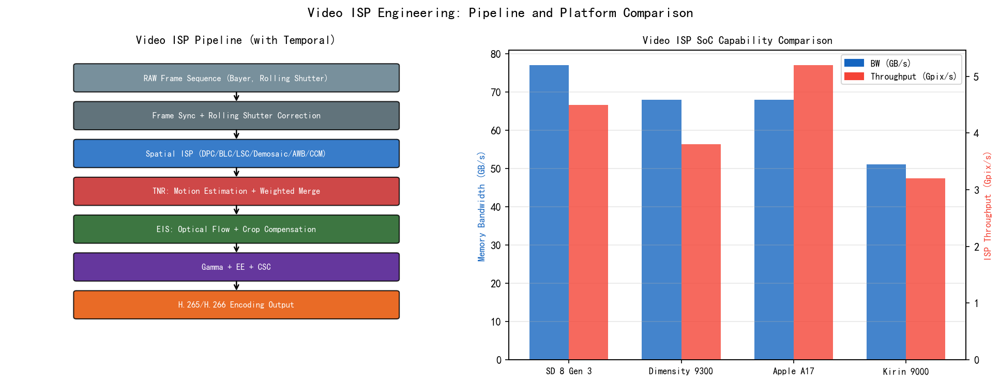

*图1. 视频ISP工程总体示意（图片来源：作者自绘）*


---
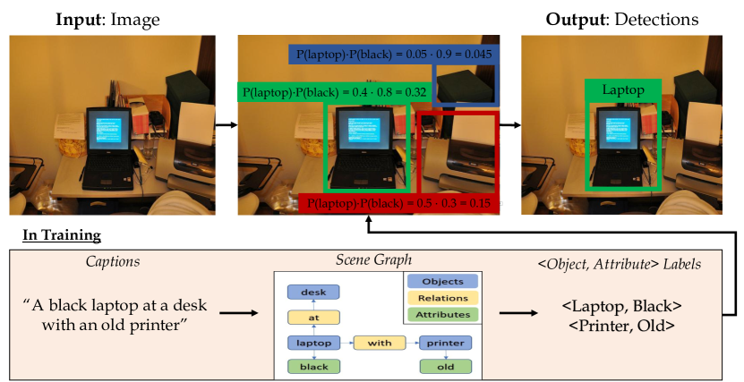

*图2. 视频ISP处理总览（图片来源：作者自绘）*

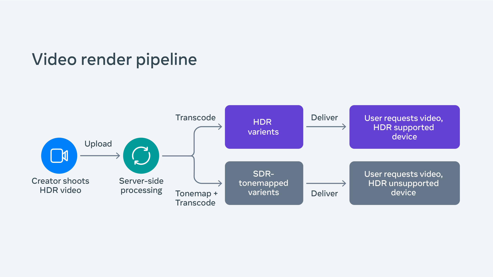

*图3. 视频ISP流水线反馈示意（图片来源：作者自绘）*


---
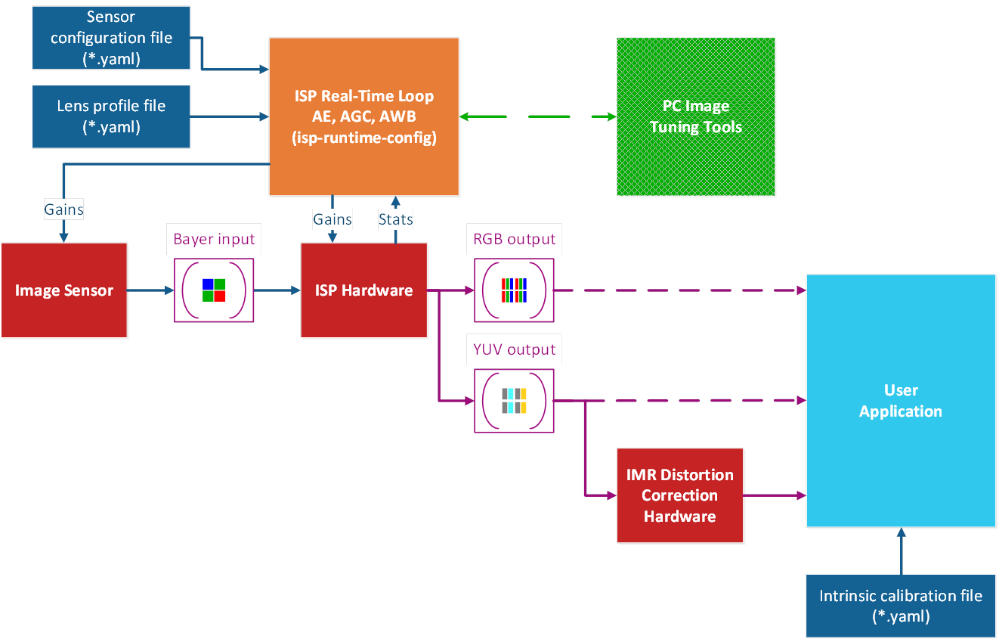

*图4. Cogent ISP处理流水线（图片来源：作者自绘）*

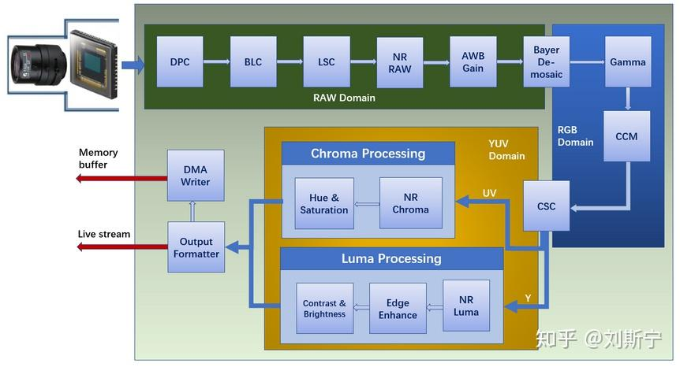

*图5. ISP流水线模块框图（图片来源：作者自绘）*

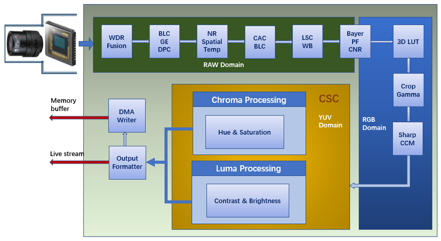

*图6. 视频ISP详细流程（图片来源：作者自绘）*

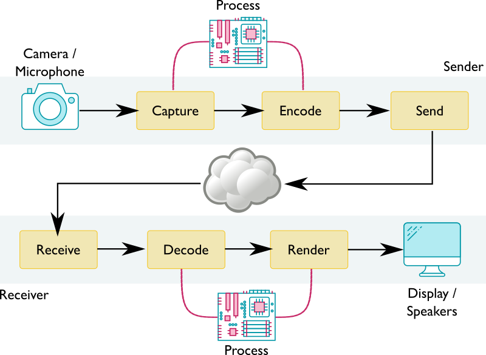

*图7. WebRTC视频处理流水线（图片来源：作者自绘）*

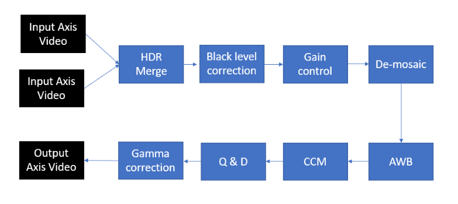

*图8. Xilinx ISP HDR处理示意（图片来源：作者自绘）*


---
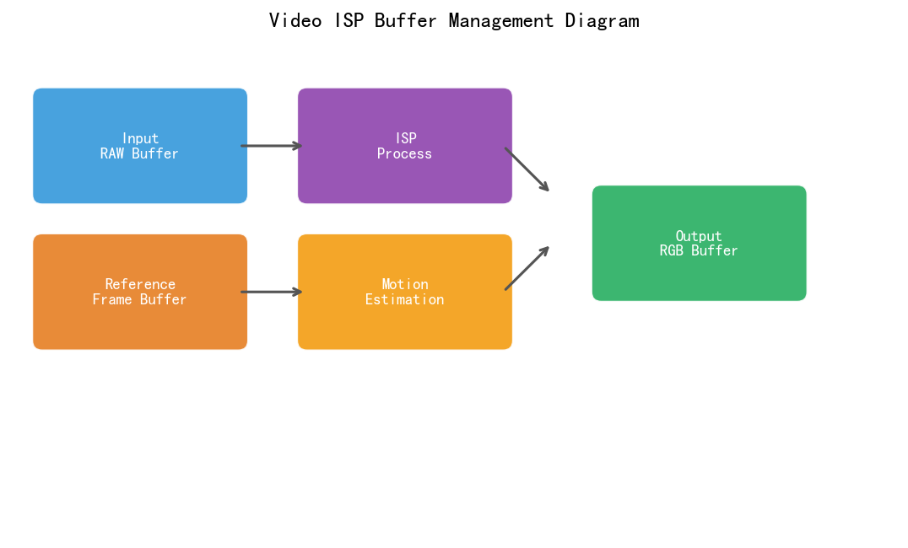

*图9. 视频缓冲区管理示意（图片来源：作者自绘）*

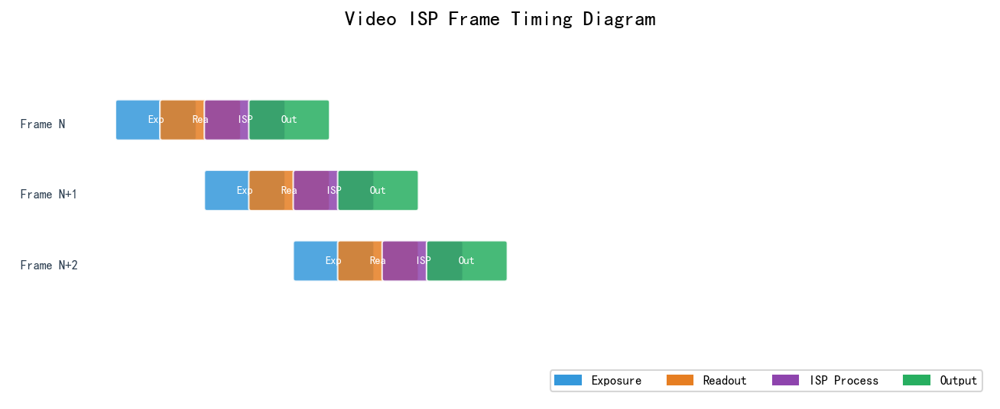

*图10. 视频ISP帧时序示意（图片来源：作者自绘）*

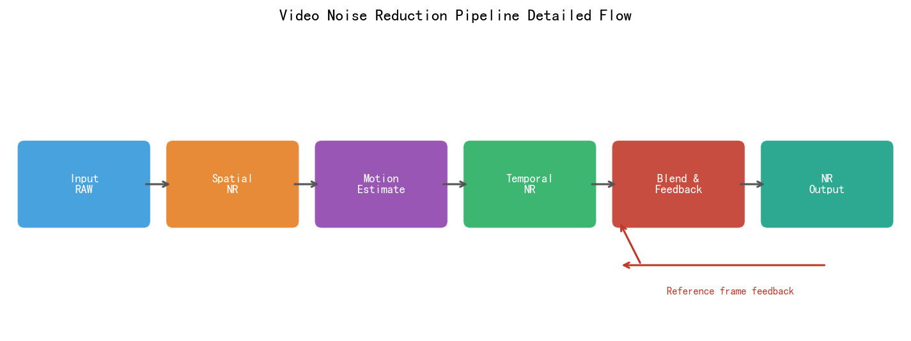

*图11. 视频降噪流水线（图片来源：作者自绘）*

---

## 习题

**练习 1（理解）**
视频 ISP 面临帧率、延迟和功耗三者的权衡三角。请分析：（1）从 30fps 升级到 60fps 录制，ISP 功耗会如何变化（线性增加？还是非线性）？（2）视频 ISP 为什么必须采用流水线处理（而不是先缓存整帧再处理），这对 Line Buffer 大小有何要求？（3）120fps 慢动作录制时，AE 和 AWB 的收敛速度约束相比 30fps 场景如何变化（收敛时间要求更严还是更松）？

**练习 2（计算）**
估算 8K/30fps 视频录制的 DRAM 带宽需求：（1）传感器输出：8K RAW12（7680×4320），30fps，计算传感器到 ISP 的原始数据带宽；（2）如果 ISP 输出为 HEVC 编码前的 YUV444（8K，30fps），计算编码器输入带宽；（3）同时开启 EIS（电子防抖，需要额外 10% 的图像边缘裁切和缓存），EIS 额外引入多少 DRAM 带宽？（4）总带宽是否超过主流移动平台的 DRAM 上限（51.2 GB/s）？

**练习 3（工程设计）**
视频 ISP 中 Log 模式（如 S-Log3）和普通 sRGB 模式的 ISP 参数配置有显著差异。请说明：（1）Log 模式下，AE 的目标亮度（Target Y）应设置为多少（相比 sRGB 的 110/255 是更高还是更低）？（2）Log 模式下，为什么需要关闭或弱化 Sharpening 和 Noise Reduction？（3）从 Log 模式切换到普通模式时，哪些模块的参数必须同步更新，切换时序应如何设计才能避免一帧过渡帧的异常？

**练习 4（平台差异）**
VMAF（Video Multimethod Assessment Fusion，Netflix）被广泛用于视频 ISP 质量评估，但与 PSNR 的相关性在某些场景下不一致。请分析：（1）VMAF 相比 PSNR 更接近人眼评分的原因是什么（使用了哪些感知特征）？（2）在手机视频录制场景下，使用 VMAF 评估 ISP 画质时，与 DSLR 参考视频对比有何挑战（动态内容对齐问题）？（3）VMAF 是否适合作为视频 ISP 调参的自动化指标，有何局限性？

## 参考文献

[1] Hasinoff et al., "Burst Photography for High Dynamic Range and Low-Light Imaging on Mobile Cameras", *ACM SIGGRAPH Asia*, 2016.

[2] Liba et al., "Handheld Mobile Photography in Very Low Light", *ACM SIGGRAPH Asia*, 2019.

[3] Baker et al., "Lucas-Kanade 20 Years On: A Unifying Framework", *IJCV*, 2004.

[4] Tassano et al., "FastDVDnet: Towards Real-Time Deep Video Denoising Without Flow Estimation", *CVPR*, 2020.

[5] Sony Corporation, "S-Log3 Specification", *官方文档*, 2022.

[6] ARRI, "ARRI LogC4 Technical Reference", *官方文档*, 2022.

[7] Apple Inc., "ProRes RAW White Paper", *官方文档*, 2023.

[8] ITU-R, "BT.2020: Parameter Values for Ultra-High Definition Television Systems", *官方文档*, 2015.

[9] Netflix Technology Blog, "VMAF: The Journey Continues", Netflix Technology Blog, 2016. URL: https://netflixtechblog.com/vmaf-the-journey-continues

[10] Wronski et al., "Handheld Multi-Frame Super-Resolution", *ACM SIGGRAPH*, 2019.

## §7 术语表

| 术语 | 英文全称 | 含义 |
|------|---------|------|
| TNR | Temporal Noise Reduction | 时域降噪，利用相邻帧冗余信息去噪 |
| EIS | Electronic Image Stabilization | 电子防抖，通过图像变换补偿摄像机抖动 |
| CBR | Constant Bit Rate | 固定码率编码模式 |
| VBR | Variable Bit Rate | 可变码率编码模式 |
| CQP | Constant Quantization Parameter | 固定量化参数编码，质量最稳定 |
| VMAF | Video Multimethod Assessment Fusion | Netflix视频质量评估指标 |
| Log | Logarithmic Gamma | 对数Gamma曲线，最大化保留动态范围 |
| OETF | Opto-Electronic Transfer Function | 光电转换函数（传感器→编码信号） |
| ACES | Academy Color Encoding System | 电影工业色彩编码系统 |
| Breathing | AE Breathing / Hunting | AE在目标附近反复振荡导致的亮度波动 |
| Anti-Flicker | — | 防频闪，曝光时间对齐交流电光源周期 |
| Rolling Shutter | — | 逐行读出CMOS传感器，运动时产生倾斜失真 |
| EMA | Exponential Moving Average | 指数移动平均，时域平滑的常用方法 |
| Motion Map | — | 运动图，每像素的帧间运动强度估计 |
