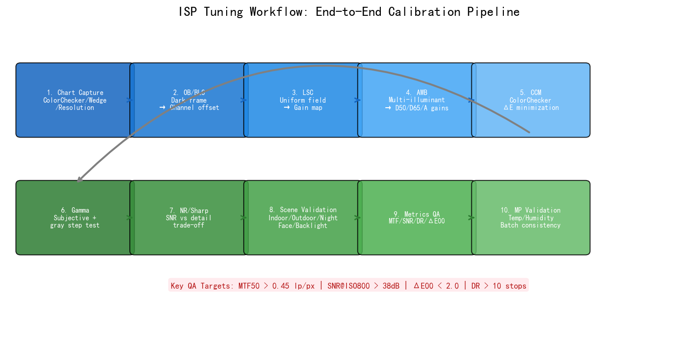
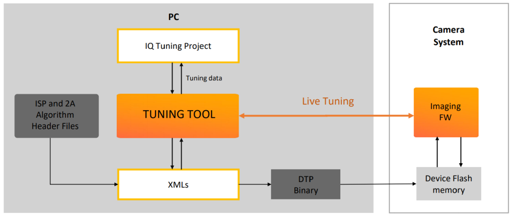
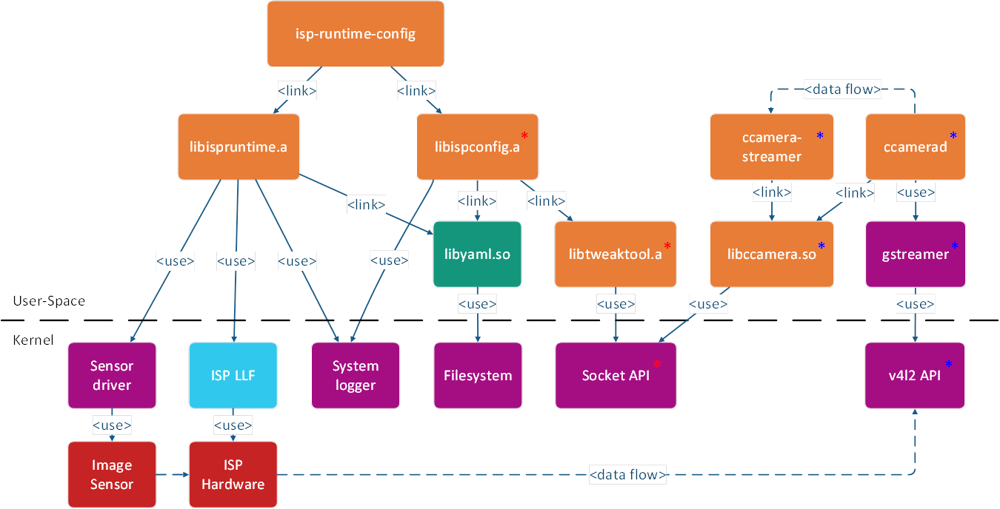
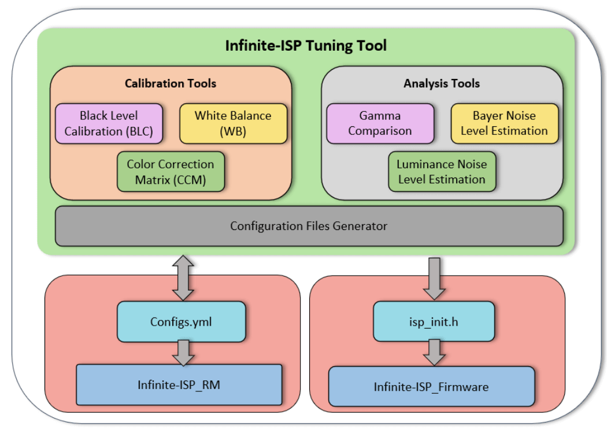
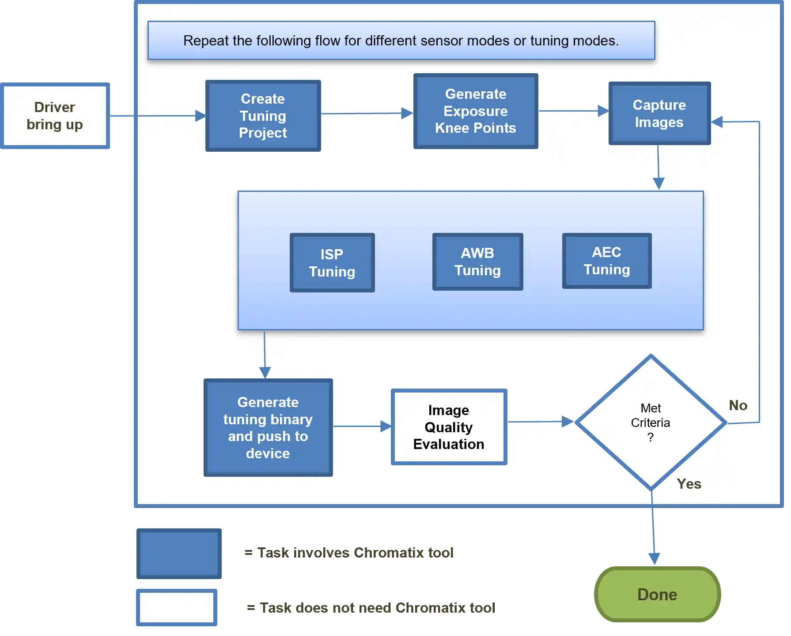
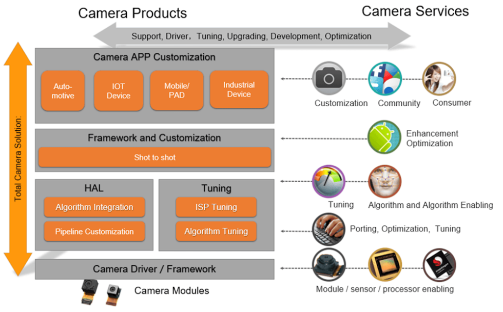
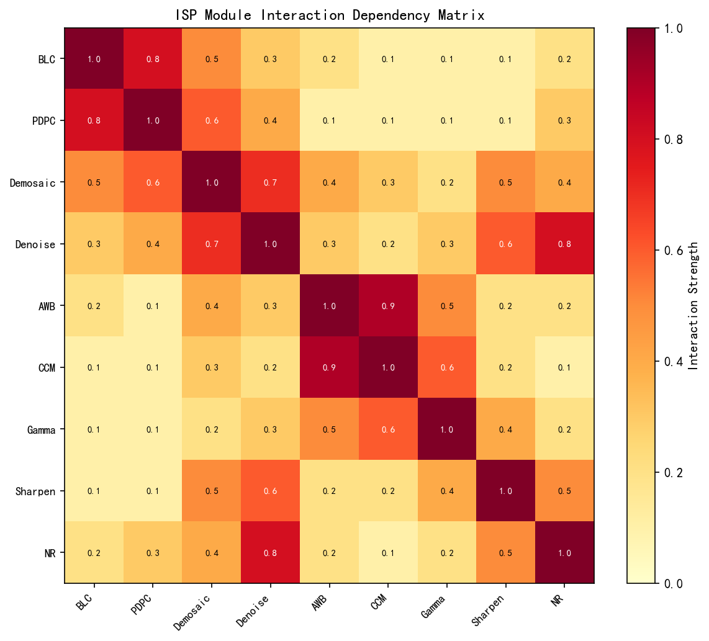
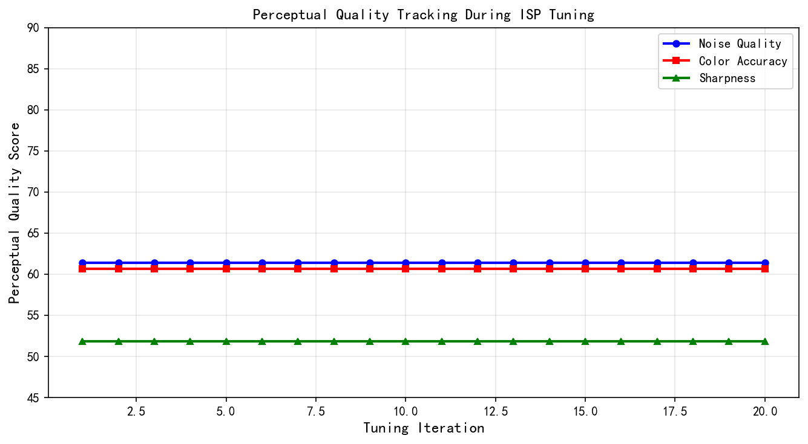
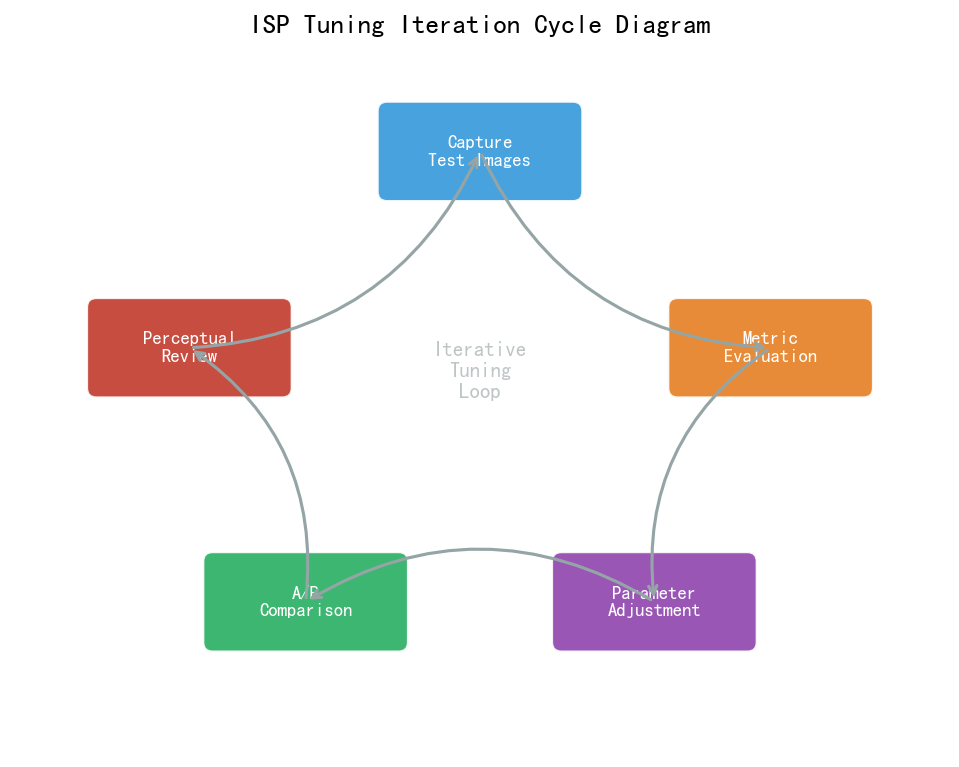

# 第四卷第17章：ISP调参工作流：从样机到量产

> **定位：** 本章覆盖ISP参数调试的全生命周期工程方法论，从EVT样机阶段的基础标定到DVT/PVT量产前的多场景参数收敛，解析迭代调参的系统化流程。
> **前置章节：** 第二卷第08章（镜头阴影校正）、第二卷第05章（自动白平衡）、第四卷第01章（3A控制系统）
> **读者路径：** ISP调参工程师、算法工程师、相机系统工程师

---

## 目录

1. [调参工作流理论基础](#1-调参工作流理论基础)
2. [基础标定流程](#2-基础标定流程)
   - [2.0 十步标定序列总览](#20-十步标定序列总览)
   - [2.0a 主流平台调参工具链（Qualcomm CIQT / MTK CameraTool / HiSilicon 越影）](#20a-主流平台调参工具链)
   - [2.0b 回归测试方法论](#20b-回归测试方法论)
3. [场景化调参指南](#3-场景化调参指南)
4. [常见调参问题与诊断](#4-常见调参问题与诊断)
5. [量产调参验证](#5-量产调参验证)
6. [代码示例](#6-代码示例)
7. [参考资料](#7-参考资料)
8. [术语表](#8-术语表)

---

## §1 调参工作流理论基础

### 1.1 项目阶段划分与调参目标

移动终端相机的研发通常遵循 EVT（Engineering Verification Test，工程验证测试）→ DVT（Design Verification Test，设计验证测试）→ PVT（Production Verification Test，生产验证测试）→ MP（Mass Production，量产）的标准硬件迭代流程。每个阶段对 ISP 调参的深度要求截然不同：

**EVT 阶段**（样机验证，通常持续 4–8 周）：
- 目标：验证光学路径、传感器上电基本功能、ISP pipeline 通路
- 调参重点：黑电平（Black Level Correction，BLC）、坏点校正（Pixel Defect Correction，PDC）、基础 LSC（Lens Shading Correction）
- 质量指标：图像可正常预览，无明显绿紫条纹、无大面积死像素

**DVT 阶段**（设计验证，通常持续 6–12 周）：
- 目标：完成全场景参数收敛，达到量产前 80% 画质目标
- 调参重点：AWB（Auto White Balance）/CCM（Color Correction Matrix）精调、NR（Noise Reduction）/EE（Edge Enhancement）权衡、AE（Auto Exposure）策略、多场景参数切换
- 质量指标：ColorChecker ΔE < 5（D65 光源，*来源：作者经验，需社区验证*），SNR10（信噪比达到 10 dB 的最低照度）满足规格

**PVT 阶段**（量产验证，通常持续 4–6 周）：
- 目标：多机一致性收敛，固化量产参数
- 调参重点：批量机器的参数一致性（Cpk 管控）、出厂标定流程验证
- 质量指标：50 台以上样机的 MTF50 标准差 < 5 lp/ph，ΔE 平均值 < 3（*来源：作者经验，需社区验证*）

**MP 阶段**：
- 目标：持续维护，OTA 参数更新，field bug fix
- 调参重点：复杂场景（逆光、夜景、动态场景）的针对性优化

### 1.2 传感器到显示的调参链路

ISP 调参是一条有严格上下游依赖的链路，各模块不是独立的旋钮，而是级联约束的节点——上游一动，下游全乱：

```
RAW Sensor → BLC → PDC → LSC → Demosaic → CCM → AWB Gain Apply
  → Gamma / Tone Mapping → NR → EE → CSC → Display Output
```

**上游影响下游**的典型规律：
- BLC 偏差会系统性地影响所有后续模块的输入范围，导致 CCM 偏色
- LSC 增益图不准确会使 AWB 在画面边缘区域采样到错误的色温估计值
- Demosaic 引入的 zipper（拉链）伪彩会被 EE 进一步放大

**调参顺序原则**：沿 pipeline 方向从前往后依次收敛，每个模块等上游稳定后再动。这条原则听起来简单，但实际项目里每个阶段都在赶进度，同时动多个模块的情况非常常见——后果就是"调参反复"：NR 花了一周调好，BLC 一改，全部重来。

### 1.3 客观指标与主观分的关系

ISP 画质评价历来面临客观与主观的矛盾。业界通常采用双轨并行策略：

**客观指标**（可量化，可自动化）：
- MTF50（Modulation Transfer Function at 50% contrast）：解析度指标，单位 lp/ph（line pairs per picture height）
- SNR（Signal-to-Noise Ratio）：信噪比，单位 dB
- ΔE2000：色差，衡量 CCM/AWB 准确度
- DR（Dynamic Range）：动态范围，单位 stop 或 dB

**主观评分**（MOS，Mean Opinion Score）：
- 通常采用 5 分制 ACR（Absolute Category Rating，绝对类别评级）量表
- 需要至少 10 名非专业评估者以减少个体偏差
- ABX 盲测法（双盲对比）用于判断细微画质差异

客观指标和主观感知经常打架。过度锐化（EE 增益过高）能把 MTF50 推高，但边缘振铃同时涌现，主观分反而跌。这不是指标设计的问题，而是被测系统本身的非线性——MTF50 只量了单一频率处的响应，量不出振铃的代价。工程师的判断力体现在：数据还在涨，但图像已经不对了，这时候要知道停。

### 1.4 迭代收敛理论：PID 类比

将 ISP 调参视为一个控制问题，可以用 PID（比例-积分-微分）控制器的思路理解迭代收敛：

- **P（比例）**：当前偏差。例如 AWB 增益偏差 ΔG，直接调节对应增益表即可快速响应
- **I（积分）**：历史偏差累积。对系统性偏差（如所有色温下 AWB 偏蓝）进行全局补偿，需要累积多个场景的测量结果
- **D（微分）**：偏差变化速率。防止单场景过拟合——过度调节单一场景参数而破坏其他场景，相当于微分项的超调抑制

实践中的收敛策略：
1. **粗调**：大步长调参，快速定位参数范围（类比 P 控制的主导阶段）
2. **细调**：小步长精修，消除系统性偏差（类比 I 控制的积分补偿）
3. **稳定性检查**：验证调整后其他场景未退化（类比 D 的微分约束，防止过冲）

此外，调参过程中需要建立**参数变更日志**，记录每次修改的参数名称、修改幅度、对应的指标变化。这是防止调参"原路返回"的核心工程实践。

---

## §2 基础标定流程

### 2.0 十步标定序列总览

ISP 标定有严格的顺序依赖——上游一步标定不准，会系统性地污染所有下游模块。以下十步序列是业界通行的最小完整标定集，**必须按序执行，不可并行**：

| 步骤 | 标定项目 | 输入条件 | 输出 | 本节 |
|------|---------|---------|------|------|
| Step 1 | **OB / BLC**（黑电平） | 完全遮光，多温度点 | 各通道 BLC offset + 温度补偿表 | §2.1 |
| Step 2 | **BPC / DPC**（坏点）| 均匀灰场，多帧平均 | 静态坏点图（Static Defect Map） | §2.1 |
| Step 3 | **LSC**（镜头阴影） | 均匀光场（积分球），多色温 | 各通道增益图（Gain Map） | §2.2 |
| Step 4 | **AWB 多光源训练** | D65 / D50 / A / TL84 / CWF 五光源灰卡 | 色温-增益 LUT（WB Gain Curve） | §2.3 |
| Step 5 | **CCM 标定**（ΔE 最小化） | 各标准光源 + ColorChecker 24 色块 | 每光源一套 3×3 CCM 矩阵 | §2.3 |
| Step 6 | **Gamma / Tone Curve** | 线性 RAW 与显示目标对比 | Gamma LUT 或 Tone Mapping 曲线节点 | §3.1 注 |
| Step 7 | **NR 参数优化** | 多 ISO 均匀暗场 + 纹理测试卡 | SNR-vs-ISO NR 强度曲线 | §3.4 |
| Step 8 | **EE / 锐化调优** | ISO 12233 斜边卡（NR 关闭状态下） | MTF50 目标曲线，EE 增益-半径组合 | §2.4 + §5.1 |
| Step 9 | **场景验证** | 室内 / 室外 / 夜景 / 逆光 / 人脸典型场景集 | 场景通过/失败报告 + 参数补丁 | §3 |
| Step 10 | **定量指标验收** | 全套标定完成后 | MTF50 / SNR / DR / ΔE₀₀ 报告 | §5.1 |

#### 各步通过判据（Pass/Fail 标准）

| 步骤 | 通过判据 | 工具验证方式 |
|------|---------|------------|
| BLC 标定 | 暗场各通道残差 `\|Residual_c\| < 0.5 LSB`（12-bit = 0.5/4095 ≈ 0.01%，*来源：作者经验，需社区验证*）| CIQT Histogram / MTK NDD 暗场统计 |
| DPC 标定 | 亮场坏点检出率 < 0.01%，暗场热点 < 50 个/帧（*来源：作者经验，需社区验证*）| CIQT DPC 统计面板 |
| LSC 标定 | 校正后画面角落/中心亮度比 ≥ 0.85（即边角不低于中心 15%，*来源：作者经验，需社区验证*）| 均匀光箱实拍 + Python 统计 |
| AWB 标定 | 三光源下灰卡色温残差 ΔE₇₆ < 2.0（CIE 1976，*来源：作者经验，需社区验证*）| ColorChecker 拍摄 + 色差软件 |
| CCM 标定 | ColorChecker 24 色块平均 ΔE₀₀ < 1.5（CIEDE 2000，*来源：作者经验，需社区验证*）| CIE ΔE 计算工具 / Python colormath |
| Gamma 调整 | 灰阶楔形图 18 阶无可见断层（目视主观）；灰度线性度偏差 < 5%（测光计验证，*来源：作者经验，需社区验证*）| 灰阶楔形图 + X-Rite i1 |
| NR 强度 | SNR 提升 ≥ 3dB（ISO 1600 下），细节 MTF50 衰减 < 10%（对比关 NR 基准，*来源：作者经验，需社区验证*）| 噪声图 + SFR 测试卡 |
| 锐化强度 | 无可见 halo（目视）；边缘过冲 < 15%（edge profile 测量，*来源：作者经验，需社区验证*）| 刀口 MTF 测试 |
| 场景验证 | 室内/室外/夜景/逆光/人脸 五场景无明显色偏、过曝、欠曝 | 主观多人评分 MOS ≥ 4.0/5（*来源：作者经验，需社区验证*）|
| 指标量化 | MTF50 ≥ 0.35 lp/pixel；SNR@ISO800 ≥ 30dB；DR ≥ 11 stops；ΔE₀₀ < 2.0（*来源：作者经验，需社区验证*）| ISO 12233 / IEEE 1858 测试卡 |

**关键依赖说明：**
- Step 1 (BLC) 的准确性直接影响 Step 3 (LSC) 增益图的绝对值和 Step 5 (CCM) 的颜色精度。
- Step 3 (LSC) 完成前不应运行 Step 4 (AWB) 训练——LSC 不准的边缘区域会给 AWB 采样引入系统偏差。
- Step 6 (Gamma) 影响 Step 7 (NR) 和 Step 8 (EE) 的视觉感知效果，三者参数不能孤立收敛。

> **工程师手记：** 实际项目中"Step 1 做好了，Step 3 可以跑"这种线性进展往往是奢望——BLC 在温度补偿没标完之前会随温漂，LSC 标定用的灯箱均匀性可能还没校准，AWB 训练数据也还没有。标准操作是每个步骤做"够用"的临时版本，联调时各步骤并行迭代，但每次迭代仍然要维持步骤间的方向性依赖——不要在 LSC 还不稳的情况下去收敛 AWB 增益，收的结果一定是错的。

### 2.0a 主流平台调参工具链

不同 SoC 平台配套的调参工具直接决定调参效率。以下为三大主流平台的工具链概况（基于公开资料）：

**高通 CIQT（Camera IQ Tuning Tool）：**

高通 Spectra ISP 系列配套的图形化调参工具，支持通过 USB/ADB 连接设备实时注入 Chromatix 参数：
- 可视化编辑 AEC / AWB / AF / NR / EE / CCM 等全模块参数
- 实时显示 ISP 内部统计（BHist 直方图、AWB 采样分布）
- 支持多维参数插值曲线（ISO × 色温 × 缩放比）的 3D 曲面可视化
- 参数版本管理：将当前调参状态保存为 Chromatix XML 快照，可直接对比 diff

参考：Qualcomm Camera IQ Tuning Tool (CIQT) 文档，可从高通开发者网络（developer.qualcomm.com）获取（需注册）。

**MTK CameraTool（NDD 在线调参工具）：**

联发科 Imagiq ISP 配套的 ADB-based 实时调参工具，基于 NDD（Noise Distribution Data）参数体系：
- 通过 ADB shell 命令实时注入参数，无需重烧固件，调参周期可缩短至"修改→秒级生效"
- NDD 格式统一管理 AE / AWB / NR / CCM / Shading 等模块，单文件版本管理
- Camera Tool 支持实时显示 AE lux-index、AWB 色温估计、NR 强度索引等内部状态
- MTK 官方提供 `camera_custom_tuning_sdk` 供 OEM 扩展定制调参界面

参考：MTK MediaTek Camera Tuning Guide，通过联发科 OAP（Open API Portal）获取。

**HiSilicon 越影调参工具链：**

华为 / 海思 ISP 使用自研"越影（YUYING）"工具链，针对 Hi3559 / Hi3519 / Hi3516 等系列：
- 越影 ISP Calibration Tool：支持 BLC / LSC / AWB / CCM 标定的向导式流程
- 越影 ISP Tuning Tool：在线注入 JSON / INI 格式参数，支持场景对比和回归测试
- 海思 ISP Dev Reference 文档（随 SDK 发布）包含完整的 API 和参数说明

参考：HiSilicon ISP Development Reference，随海思 SDK（HiSilicon SDK for Hi3559 / Hi3519 系列）发布，需通过华为合作伙伴渠道获取。

> **工程建议：** 三个平台工具链的成熟度差异显著。高通 CIQT 功能最完整，对多维插值曲线的可视化支持最好，是行业参照标准。MTK NDD 在线注入机制调参效率最高，适合快速迭代的开发阶段。海思越影工具链文档相对封闭，参数命名与前两者差异较大，跨平台迁移经验需要重新积累。无论使用哪个平台，建议在调参开始前先在工具链内验证标定数据读取通路（BLC / LSC 值是否按预期加载），再开始参数调整。

### 2.0b 回归测试方法论

**每次参数变更后应执行回归测试**，防止针对一个场景的优化破坏已通过测试的其他场景。这是 ISP 调参工程中最容易被压力省略、但事后追查代价最高的环节。

**最小回归测试集（Minimum Regression Test Suite）：**

```
核心场景（必测，每次参数变更均需全部通过）：
  1. 18% 灰卡 @ D65 1000 lux — 验证 AE 目标亮度（118 ±5 DN）
  2. ColorChecker 24 色块 @ D65 — ΔE₀₀ 均值 < 3.0
  3. ISO 12233 测试卡 @ 1000 lux — MTF50 中心值不低于基线 95%
  4. 均匀灰场 @ ISO 3200 — SNR 不低于基线 1 dB

扩展场景（DVT 阶段及以后，参数冻结前必测）：
  5. 逆光人像（窗前人物）— 主体不欠曝 > 1.5 EV
  6. 荧光灯室内 @ TL84 — AWB ΔCT < ±200K，无可见频闪条纹
  7. 白炽灯室内 @ 2700K A 光 — AWB ΔCT < ±200K
  8. 低照 10 lux 静态场景 — SNR ≥ 28 dB @ 1 lux 等效
  9. 人脸场景（多人，不同肤色） — 人脸 AE 无明显过曝/欠曝
 10. 高速运动（手持抖动） — AE 无明显呼吸效应（Breathing）
```

**回归测试执行规范：**
1. **变更前快照（Baseline Snapshot）：** 参数变更前，用当前参数跑完整回归测试集并保存报告（MTF50 / ΔE / SNR 数值 + 图像截图）
2. **变更后对比（Delta Report）：** 参数变更后，重跑同一测试集，自动生成与基线的差异报告
3. **接受标准（Accept Criteria）：** 核心场景 P0 指标（MTF50 / ΔE / SNR）退化不超过各自 3σ 测量误差；主观质感不劣于基线（由调参负责人目视确认）
4. **回滚触发（Rollback Trigger）：** 任一核心场景 P0 指标退化超过容差，立即回滚参数变更，分析原因，修复后重新提交

**自动化工具推荐（开源）：**
- `rawpy + OpenCV`：RAW 解码 + MTF50 斜边法计算（可替代 Imatest 基础功能）
- `colour-science`：ΔE₀₀ 计算、色彩空间转换
- `scikit-image` SSIM / GMSD：结构相似度与纹理保留评估

### 2.1 暗场标定：黑电平与噪声底

**黑电平（Black Level）标定**是所有后续标定的基础。ISP 处理的第一步必须减去传感器在无光照条件下的固有输出偏置（offset）。

**标定方法**：
1. 在完全遮光条件下采集 100 帧以上 RAW 图像
2. 对每个颜色通道（Gr、R、B、Gb）分别统计均值和标准差
3. 黑电平值 = 各通道均值的中位数；噪声底（read noise floor）= 各通道标准差的均值

**温度依赖性**：黑电平随传感器温度升高而增大（通常 0.5–2 DN/°C，*来源：作者经验，需社区验证；实际值以传感器 datasheet 为准*）。工程上需要在 25°C 和 45°C 两个温度点分别标定，在参数中以线性插值方式处理温度补偿。部分高端平台（如高通 ISP 系列）支持运行时根据温度传感器动态调整 BLC 值。

**OB（Optical Black）像素的作用**：现代 CMOS 传感器通常在有效像素区外设有遮光的 OB 像素区，可实时监测当前黑电平并动态补偿（称为 OB clamp）。ISP 调参时需确认 OB 像素区域的读取通路正常，且 OB 均值与离线标定值在合理范围内一致（差值 < 2 DN）。

**噪声模型标定**：对后续降噪（NR）算法至关重要。在多个模拟增益（AG，Analog Gain）设置下采集均匀明亮场景（如均匀灰卡）：

- **固定模式噪声（FPN，Fixed Pattern Noise）**：多帧平均后的残余空间不均匀性，通常用标准差表征
- **随机噪声**：满足泊松-高斯混合模型，方差 σ²(μ) = α·μ + σ_r²（α 为散粒噪声系数，σ_r² 为读出噪声方差，μ 为像素均值；符号定义与第一卷第04章 §1.4 完全一致）

将 (μ, σ²) 对在多个增益下拟合，得到噪声模型参数表，作为 NR 算法中强度参数的先验依据。

### 2.2 均匀光场标定：LSC 增益图

**镜头阴影（Lens Shading）** 导致图像四角变暗，典型程度从中心到四角亮度跌落 20%–60% 不等（取决于镜头设计和光圈大小）。LSC 标定需要精确的均匀光场。

**标定设备**：
- **积分球（Integrating Sphere）**：内壁涂漫反射材料的球形腔体，出射光均匀性 > 99%，是最高精度的标定设备，适合研发验证阶段
- **均匀光箱（Flat Field Box / LED Backlight Panel）**：成本较低，均匀性 > 95%，适合批量产线标定，需定期用参考相机校准光箱本身的均匀性

**标定步骤**：
1. 在 D65 等标准光源下，镜头对准均匀光场，固定曝光（关闭 AE，避免 AE 动作引入误差）
2. 采集 R、Gr、Gb、B 四通道 RAW 图像
3. 对每个通道，以图像中心为参考，计算每个像素位置相对于中心的增益补偿值：`G(x,y) = I_center / I(x,y)`
4. 对增益图进行平滑处理（通常用多项式拟合或 2D 高斯平滑），避免噪声引入的高频增益波动
5. 在多个色温下（如 2300K/4000K/6500K）分别标定，并在运行时根据估计色温插值

**注意事项**：
- 标定时曝光应设在传感器线性区间内（通常 40%–50% 满阱容量，Full Well Capacity，FWC）；过低则噪声影响增益图精度，过高则非线性区域引入误差
- 若标定时发生 AE 收敛，增益图将包含 AE 波动误差，需重采

### 2.3 ColorChecker 标定：AWB + CCM

**ColorChecker Classic**（24 色块标准色卡，X-Rite/Macbeth 品牌）是业界最广泛使用的 AWB/CCM 标定工具。

**AWB 标定**（白平衡基础增益）：

在标准光源（如 D65、TL84、A 光）下拍摄灰卡或 ColorChecker 的中性灰色块（第 19–24 块），提取 R/G/B 通道比例，计算 AWB 基础增益：

```
R_gain = G_channel_mean / R_channel_mean
B_gain = G_channel_mean / B_channel_mean
```

在多个色温点重复此操作，生成色温-增益查找表（LUT）。该 LUT 是 AWB 算法估计色温后查询修正增益的基础。

**CCM 标定**（颜色矩阵）：

在已正确白平衡的图像上，对 ColorChecker 的前 18 个色块提取 RGB 值，与 Macbeth 标准 XYZ 值进行最小二乘拟合，求解 3×3 CCM 矩阵：

```
[R']   [a11 a12 a13] [R]
[G'] = [a21 a22 a23] [G]
[B']   [a31 a32 a33] [B]
```

约束条件：CCM 每行之和为 1（保持亮度归一化），对角元素为正，非对角元素绝对值通常不超过 0.5。**在多个色温下分别标定 CCM**（称为 dual-CCM 或 multi-CCM 策略），运行时根据 AWB 估计的色温进行矩阵插值，以适应不同光源下传感器光谱响应的变化。

### 2.3a Gamma / Tone Curve 调参（Step 6）

Gamma 和 Tone Mapping 曲线是 ISP 中连接线性 RAW 域与非线性显示域的桥梁，必须在 BLC / LSC / CCM 标定完成后进行，因为这些前置模块的偏差会系统性地影响 Gamma 调参结果。

**标准 Gamma 曲线标定（基于灰阶卡）：**

1. 在已完成 BLC + LSC + CCM 的条件下，拍摄标准灰阶卡（通常 10–20 级灰阶，反射率覆盖 2%–100%）
2. 提取各灰阶色块的 RAW 线性均值 $I_{linear}$ 和显示输出值 $I_{display}$
3. 拟合 Gamma 曲线，使每级灰阶的 sRGB 显示亮度与视觉感知均匀（通常目标为 ΔL* < 1.0 相邻级之间）
4. 验证：18% 灰卡在 Gamma 校正后的 8-bit 输出应为 118 ±5（对应 sRGB gamma 2.2 编码值 $0.18^{1/2.2} \approx 0.461$）

**Tone Mapping 曲线调参关键约束：**

| 区域 | 目标 | 工程约束 |
|------|------|---------|
| 阴影区（< 10% 亮度） | 细节可见，不过黑 | 不得硬截断（脚部软膝），避免 crush |
| 中调区（18%–50% 亮度） | 对比度自然，18% 灰 = 118 DN | Gamma 斜率保持接近 sRGB 标准（2.2） |
| 高光区（> 80% 亮度） | 高光保护，无白色死区 | 软压缩（Highlight Roll-off），斜率趋近 0 |

**与 NR / EE 的耦合：** Gamma 曲线的阴影区斜率直接影响暗部噪声的视觉感知——斜率越大，低灰阶噪声被放大越多，NR 强度需相应增加。因此 Gamma 曲线不应在 NR 调参完成之前单独锁定。推荐流程：**先 Gamma 粗调（固定标准 sRGB 2.2）→ NR 收敛 → 再根据暗部视觉效果微调 Gamma 阴影区斜率**。

### 2.4 MTF/SFR 解析度标定

**MTF（Modulation Transfer Function，调制传递函数）** 是衡量相机系统（镜头 + 传感器 + ISP）空间分辨率的标准指标。**SFR（Spatial Frequency Response，空间频率响应）** 是基于斜边法的 MTF 测量方法，由 ISO 12233 标准化。

**标定步骤**：
1. 拍摄包含 10:1 对比度斜边（倾斜约 5° 以避免像素栅格效应）的测试图案
2. 使用 Imatest 或开源 sfr 工具提取 MTF50 值
3. 在图像中心和四角（通常为 9 宫格位置）分别测量，评估场内均匀性

**工程评估指标**：
- MTF50：对比度降至 50% 时对应的空间频率，单位 lp/ph
- MTF50P：以奈奎斯特频率（像素间距的倒数）归一化的 MTF50 百分比
- 典型量产目标：中心 MTF50 > 0.75 × 奈奎斯特频率 **[1]**，四角 MTF50 > 60% × 中心值 

**注意**：MTF 标定应在 NR 关闭或 NR 强度设为最低的状态下进行，以测量光学+传感器的本征解析度。NR/EE 对 MTF50 的影响应单独评估。

---

## §3 场景化调参指南

### 3.1 场景分类与参数影响矩阵

ISP 场景化调参的核心挑战是：同一套参数无法同时最优化所有场景。需要识别关键场景，为每个场景定义参数组合，并设计合理的场景切换逻辑。

| 场景 | 光照范围（lux） | 关键 ISP 模块 | 主要矛盾 |
|------|----------------|--------------|---------|
| 日光户外 | 5000–100000 | EE、色彩饱和度、HDR | 高光溢出 vs. 纹理细节 |
| 室内人工光 | 100–1000 | AWB、CCM、NR | 白平衡准确性、色噪声 |
| 低照暗光 | 1–100 | NR、Demosaic、AE | 噪声 vs. 纹理 |
| 逆光/高对比 | 跨度 > 5 stop | HDR merge、LTM | 亮部过曝 vs. 暗部噪声 |
| 夜景长曝 | < 1 | 多帧 NR、去重影 | 运动模糊 vs. 噪声 |

场景化参数组织通常以 ISO 和色温作为一级索引，场景模式（如"人像模式"、"夜景模式"）作为二级覆盖（override）。详细的参数版本管理策略见第四卷第20章。

### 3.2 日光场景调参

**典型光照条件**：LV（Light Value）12–16，传感器工作在最低模拟增益（AG_min）。

**AE 参数**：
- 目标亮度值（Target Luma）：通常设置为 8 bit 编码空间的 108–120（约 42%–47%），兼顾高光保留和暗部细节
- AE 收敛速度：日光场景可设较快收敛（3–5 帧内收敛至 ±2% 的目标亮度误差），减少场景切换时的过曝/欠曝瞬间感

> **关于量产参数参考值的说明：**
> 本章给出的数字（如"AEC_TargetLuma 典型值 110–130 DN"）为跨平台工程经验范围，
> 而非特定机型的出厂配置。具体量产型号的 ISP 参数通常受 NDA 保护无法公开披露。
>
> 公开可查的参考来源：
> 1. **AOSP / LineageOS 提交历史**：部分机型的 Chromatix XML 或 NDD 参数作为 BSP 文件合并进
>    开源内核（搜索：`github.com lineageos device [机型] camera`）
> 2. **高通 CIQT 文档**：可在高通开发者网络（QDN）获取，含典型参数范围与调参指导
> 3. **MTK CameraDoc**：联发科开发者门户（developer.mediatek.com）的 Camera Tuning Guide
> 4. **社区评测数据**：DXOMARK / RTINGS 发布的 ISP 特性分析，部分包含曝光策略的逆向分析
>
> 建议新项目从平台参考设计（Reference Design）的默认 Chromatix/NDD 出发，
> 而非从头设置所有参数——平台参考设计通常已覆盖 80% 的调参工作量。

**EE 参数（锐化）**：
- 日光纹理丰富，EE 增益（Edge Enhancement Gain）可设中等偏高（1.2–1.5× 基准增益）
- 注意控制高频增益的幅度上限（Coring Threshold），防止天空、皮肤等平滑区域出现颗粒感（graining）

**色彩参数**：
- 饱和度（Saturation）：日光下可略增（+5%–+15%），使画面更鲜艳，符合消费者审美偏好
- 色调曲线（Hue Rotation）：对绿色植物和蓝天可进行轻微色调偏转，使颜色更符合人眼期望的"记忆色"（memory color）

**高光保护**：启用 Highlight Roll-off（高光卷折）或 Tone Mapping 曲线的高光压缩部分，防止过曝区域产生白色"死区"（blown highlights）。

### 3.3 室内人工光调参

**典型光照条件**：LV 5–9，荧光灯（TL84, 约 4100K）或暖白 LED（2700K–3500K）混合光源。

**AWB 挑战**：室内混合光源（自然光 + 人工光）是 AWB 算法最难的场景。

调参策略：
- 扩大 AWB 灰世界算法（Gray World Assumption）的色温收敛范围，典型设置为 2200K–7000K
- 增加白点候选的采样区域权重分配，避免被大面积彩色物体（如红墙、绿植）干扰 AWB 估计
- 调节 AWB 收敛速率（Time Constant）：室内光源变化较慢，可设较慢收敛（10–20 帧），减少 AWB 颜色抖动（flicker）

**NR 参数**：
- 室内照度适中，色噪声（Chroma Noise）在 ISO 400–1600 范围内明显，表现为彩色斑点
- 色噪声滤波强度（Chroma Denoise Strength）可设中等偏高（0.6–0.8 归一化强度）
- 亮度噪声滤波需保留纹理，避免过度平滑皮肤和布料细节

**防闪烁（Anti-Banding，AB）**：
- 人工光源（50/60 Hz 交流供电）导致画面出现横纹（banding）
- 曝光时间需锁定为光源频率周期的整数倍：50 Hz 市电 → 1/100s、1/50s；60 Hz 市电 → 1/120s、1/60s
- AE 在室内场景应优先调节增益，而非随意调整曝光时间以保持反闪烁条件

### 3.4 低照暗光调参

**低照场景**（< 10 lux）是调参最难的场景——不是因为参数多，而是因为每个旋钮的代价都很高：多降一点噪声就少一点纹理，多曝一点光就多一点运动模糊，没有全赢的选择。

**AE 策略**：
- 曝光时间优先延长至防抖（OIS，Optical Image Stabilization）极限（通常 1/15s–1/4s，取决于 OIS 能力和用户抖动特性）
- 之后拉升模拟增益（AG）至传感器最大值（通常 ×16 至 ×64），最后启用数字增益（DG）
- 目标亮度可相对日光场景下调（如降至 85–95），接受略欠曝以换取更低噪声，避免暗部噪声被过度放大

**NR 参数调节顺序（低照调参实践顺序）：**
1. 先调 TNR：利用帧间相关性降噪，增益最高，但运动补偿阈值要仔细，阈值过宽则运动区域鬼影；TNR能覆盖的噪声，不要让空域NR去做，代价更高
2. 再调空域 NR（SNR）：覆盖高速运动区域（TNR权重低的区域）；半径和强度一起调，不要只动其中一个
3. 最后才动 EE：低照下 EE 增益要明显压低（< 0.8× 基准），否则噪声和锐化叠加，暗场颗粒感极为明显

> **工程推荐（手机ISP场景）：** 如果是低照调参，从 TNR 开始，把它的帧间权重调到噪声抑制效果明显但静止区域刚刚没有鬼影的边界；然后再开空域NR补剩余噪声；最后EE只开到看起来"清晰但不刺"为止。三步顺序打乱，后面一定要反复返工。

**典型参数范围对比**：

| 参数 | 日光（ISO 100） | 低照（ISO 3200） |
|------|---------------|---------------|
| 亮度 NR 强度 | 0.2–0.4 | 0.7–0.9 |
| 色彩 NR 强度 | 0.3–0.5 | 0.85–0.95 |
| EE 增益 | 1.2–1.5 | 0.5–0.8 |
| 锐化半径（像素） | 1.0–1.5 | 0.8–1.2 |
| TNR 帧间权重 | 0.1–0.2 | 0.5–0.7 |

### 3.5 逆光/高对比场景调参

**逆光场景** 要求 ISP 同时处理亮部（直接光源）和暗部（阴影区），动态范围需求可达 10–14 stop。

**HDR 合并参数**：
- 多帧曝光比（Exposure Ratio）：通常 8×–16×（3–4 stop），由 AE 控制逻辑根据场景对比度自动选择
- 融合权重曲线（Fusion Weight Curve）：控制高/低曝光帧在不同亮度区域的混合比例，过渡区应平滑以避免融合线（seam）伪影
- 鬼影（Ghost）抑制阈值（Ghost Threshold）：运动区域检测灵敏度，过高则 HDR 合并效果不充分（暗部仍有噪声），过低则引入运动重影

**局部色调映射（Local Tone Mapping，LTM）**：
- 全局 Tone Mapping（GTM）只能整体压缩动态范围，会使画面整体变灰、缺乏层次感
- LTM 在局部区域（Tile）独立进行对比度增强，保留高光细节的同时提升暗部细节
- 调参重点：LTM 增益的空间分辨率（Tile Size，通常 64×64 至 256×256 像素）和强度（LTM Gain Limit，通常限制在 4×–8×）之间的权衡；Tile 过小会产生块效应（blocking artifact），Tile 过大效果退化为 GTM

---

## §4 常见调参问题与诊断

### 4.1 过度降噪 vs. 纹理丢失

**症状**：图像看起来像"蜡像"或"油画"，皮肤/毛发/草地细节消失，细节层次减少，主观分明显下降。

**根本原因**：
- 空域 NR 滤波半径过大，平滑了高频纹理
- NR 强度曲线在中高 ISO 区间没有随 SNR 改善而自适应降低
- 亮度 NR 和色彩 NR 强度均偏高，缺乏对边缘和亮度细节的保护

**诊断方法**：
1. 拍摄标准纹理测试图（如 ISO 12233 分辨率测试卡），比较 NR 开/关时的 MTF50 差值
2. MTF50 降低 > 15% 通常认为 NR 对解析度影响过大
3. 对比放大 400% 的毛发/草地/布料局部，判断纹理保留程度
4. 使用 SSIM（Structural Similarity Index）或 GMSD（Gradient Magnitude Similarity Deviation）客观评估纹理保留

**修复策略**：
- 在 NR 强度曲线的中等 ISO 区间（ISO 400–1600）适当降低强度（减少 10%–20%）
- 启用边缘保护（Edge-Aware NR），在高梯度（高对比度边缘）区域自动降低 NR 强度
- 调节 NR 的自适应权重，使平滑区域（天空/皮肤）和纹理区域（毛发/布料）的 NR 强度分开控制

### 4.2 AWB 偏色的系统性诊断

**AWB 偏色**是量产前最常见的画质投诉之一，需要区分偏色的根本原因：

| 偏色类型 | 可能原因 | 诊断方法 |
|---------|---------|---------|
| 所有光源下整体偏暖/冷 | CCM 基础矩阵偏差 | ColorChecker ΔE 分析（关闭 AWB） |
| 特定色温下偏色 | AWB 色温-增益曲线不准确 | 多色温灰卡逐点测试 |
| 大面积彩色背景下偏色 | AWB 算法被主色调污染 | 白点提取算法参数（排除率）调试 |
| 场景切换时瞬间偏色 | AWB 收敛速率/时间常数设置问题 | 视频连续帧 AWB 增益曲线分析 |
| 逆光/高亮场景偏色 | AE 曝光区域影响 AWB 采样分布 | 分析 AWB 统计区域的曝光状态 |

**诊断流程**：
1. 首先确认 BLC 和 LSC 正确（排除上游干扰）
2. 关闭 AWB（固定增益），拍摄标准灰卡，验证 CCM 准确性（ΔE < 2 为合格）
3. 开启 AWB，在单一标准光源下验证各色温点的收敛精度（CCT 误差 < ±150K）
4. 引入复杂场景（混合光源、彩色背景），评估 AWB 抗干扰能力

### 4.3 参数互相干扰的排查方法

ISP pipeline 中参数干扰（Parameter Interaction）是调参复杂性的核心来源。以下是典型干扰链路：

**EE 与 NR 干扰**：NR 降低了图像高频能量，但随后 EE 将其放大，最终效果取决于两者的净增益。正确做法是在 NR 后测量 MTF50，以此作为 EE 的调参基准，而不是在 NR 前测量。

**AE 与 NR 干扰**：AE 改变了 ISO 设置，而 NR 强度通常是 ISO 的函数（通过 ISO 索引的强度曲线）。在 AE 策略（曝光-增益 trade-off 曲线）未固化前，NR 强度曲线无法最终收敛。

**LSC 与 AWB 干扰**：LSC 不准确会导致画面边缘色温估计偏差（边缘区域亮度比中心低，颜色比例失真），进而影响 AWB 收敛。排查时可将 AWB 采样区域限制在画面中心（关闭边缘采样权重），验证 AWB 是否改善。

**Demosaic 与 EE 干扰**：Demosaic 算法（如 AHDE、Menon）在边缘处引入的伪彩（false color）会被 EE 的高频增益放大。需先评估 Demosaic 质量（伪彩抑制效果），再调 EE 参数。

**排查原则**：控制变量——每次只动一个模块，记录修改前后的客观指标变化。这条原则在项目压力下经常被违反，结果是一周后说不清楚是哪次改动导致了退化。参数版本管理（见第四卷第20章）不是形式，是事后追查的唯一依据。

### 4.4 过曝与欠曝的系统性分析

**过曝（Overexposure）** 表现为高亮区域细节丢失（高光溢出，blown highlight），常见原因：

- AE 目标亮度设置过高（> 130/255）
- AE 测光区域偏向暗部（Spot 测光在暗背景下导致主体过曝）
- HDR 合并的曝光比不足，高曝帧本身已过曝

**欠曝（Underexposure）** 表现为暗部细节淹没在噪声中，常见原因：

- AE 目标亮度设置过低（< 90/255）
- AE 测光区域偏向亮部（逆光场景的平均测光导致主体欠曝）
- 曝光限幅（Exposure Cap）设置过于保守，优先 SNR 而牺牲亮度

**诊断工具**：直方图分析（Histogram Analysis）是最直接的工具。过曝表现为直方图右侧截断（right clipping），欠曝表现为左侧堆积（left bunching）。调参时应同时查看 RAW 直方图（反映 AE 控制效果）和 ISP 输出直方图（反映 Tone Mapping 效果）。

---

## §5 量产调参验证

### 5.1 客观指标验收标准

量产前的客观指标验收通常包含以下项目（典型中高端旗舰机标准，各厂商规格有差异）：

| 指标 | 测量方法 | 典型量产目标 |
|------|---------|------------|
| MTF50（中心） | ISO 12233 斜边法 | > 1100 lp/ph（~0.75 × Nyquist，12MP 后置；超过 Nyquist 会引入过锐化振铃伪影） |
| MTF50（四角均值） | 同上 | > 75% × 中心值 |
| SNR @ 1000 lux | ISO 15739 | > 42 dB |
| SNR @ 1 lux | ISO 15739 | > 28 dB |
| ΔE2000（24 色块均值） | ColorChecker + D65 | < 3.0 |
| ΔE2000（最大值） | 同上 | < 6.0 |
| ΔE2000（肤色色块） | ColorChecker 肤色色块 + D65 | < 2.0 |
| 动态范围（DR） | ISO 15739 | > 10.5 stop |
| 白平衡误差（CCT 偏差） | 多色温灰卡 | < ±200 K |
| AWB 稳定性（视频） | 连续帧增益标准差 | < 0.02（归一化增益） |

**平台差异说明**：以高通（Qualcomm）ISP 平台为例，Spectra 系列 ISP 内置了 Chromatix 调参框架，MTF 和 SNR 测量流程有标准化测试应用支持；MTK（联发科）Imagiq ISP 使用 NDD（Noise Distribution Data）参数体系，调参验收流程类似；海思（HiSilicon）ISP 采用自研调参工具链。上述客观指标是平台无关的通用标准。

### 5.2 主观评测流程

**MOS（Mean Opinion Score）评测**流程规范：

1. **评测者选取**：10–20 名非专业评估者，年龄分布均衡（18–50 岁），视力矫正至正常
2. **显示设备校准**：P3 色域显示器，亮度校准至 200 cd/m²，环境光 < 10 lux，白点 D65
3. **样本设计**：每个场景每台设备采集 3 张照片，共测试 10 个代表性场景（日光、室内、低照、逆光、人像等）
4. **评分方式**：5 分制（1=差，2=较差，3=一般，4=好，5=优秀），每组测试间隔 30 秒休息眼睛
5. **统计处理**：去除异常值（偏离均值 > 2σ 的评分），计算 MOS ± 95% 置信区间

**ABX 盲测**专门用来判断"这个调参差异用户能不能感知"——MOS对细微差异不敏感，ABX灵敏度更高：
- A 组：当前版本参数
- B 组：新版本参数（变更了某模块参数）
- X 组：随机为 A 或 B 的一组（评估者不知道）
- 评估者判断"X 更接近 A 还是 B"，统计正确率
- 正确率 > 75% 则认为两版本差异在主观上可感知（具有统计显著性）

**常见陷阱**：评测顺序效应（Order Effect）——评测者对第一张图打分倾向于宽松，需要随机化评测顺序并加入练习题训练。

### 5.2a Golden Sample方法

**Golden Sample（黄金样本）** 是ISP调参工程中维持版本稳定性的核心锚点机制，在量产流程中与Cpk质量控制并行使用。

**定义：** Golden Sample是一套经过充分主观和客观评测确认的、代表当前阶段最优画质的参数集 + 参考图像集。所有后续调参变更必须与Golden Sample对比，只有在客观指标不退化（或退化在容差以内）且主观分不低于Golden Sample的情况下，才能进入下一版本。

**Golden Sample构建流程：**

```
1. 选取代表性场景集（至少20个，覆盖：日光/室内/低照/逆光/人像/文字/夜景）
2. 在当前最优参数下采集参考图像（RAW + JPEG），记录所有拍摄条件（光照/色温/ISO）
3. 对每张参考图像运行完整客观指标测量（MTF50/SNR/ΔE/DR）
4. 组织 ≥ 10 人主观评测，记录MOS均值和置信区间
5. 将客观指标 + MOS + 参数快照存入版本管理数据库，打上版本标签（如 v1.3_golden）
```

**Golden Sample的使用规范：**

- 每次参数变更提交时，自动化测试系统对Golden Sample场景集重新运行全套测试，生成当前版本与Golden版本的指标差异报告（Delta Report）
- Delta Report中任意P0指标（MTF50/SNR/ΔE）退化超过容差（通常各自3σ测量误差范围），则该变更不得合并，需回滚或修正
- **Golden Sample定期更新：** 每当产品达到新的里程碑（EVT→DVT→PVT过渡点），由调参负责人主持评审决定是否更新Golden Sample，更新时保留历史版本快照，确保可追溯

**Golden Sample的常见误用：** 避免把Golden Sample当作"调参目标"（即以追求超过Golden Sample的客观指标为目标）——Golden Sample的价值在于防止退化，而非限制优化上限。新的参数集只要不退化于Golden即可合并，优化幅度本身通过MOS评测确认。

### 5.3 多机一致性 Cpk 控制

量产中参数一致性使用 **Cpk（Process Capability Index，过程能力指数）** 衡量，确保不同批次、不同机器的画质落在规格范围内。

**Cpk 定义**：
```
Cpk = min( (USL - μ) / (3σ),  (μ - LSL) / (3σ) )
```
其中 USL/LSL 为规格上/下限（Upper/Lower Specification Limit），μ 为样本均值，σ 为样本标准差。

**量产要求**：
- Cpk > 1.33 认为过程能力充足（6σ 质量目标为 Cpk > 1.67）
- 关键画质项（如 MTF50、ΔE2000）要求 Cpk > 1.33
- 次要项（如色调偏差、饱和度偏差）要求 Cpk > 1.0

**变异源分析**：当 Cpk < 1.0 时，需查找制造工序中的变异源：
- **镜头装配偏差**（光轴倾斜 / tilt）：导致 MTF 场内不均匀性增大
- **传感器批次差异**（sensor lot variation）：不同批次传感器的黑电平、噪声底差异
- **出厂标定精度**：LSC、AWB 标定流程的重复性（repeatability）

当变异主要来自模组差异时，需要启用 **per-unit 标定**（个体化标定）机制，对每台机器单独标定 LSC 增益图和 AWB 基础增益，而非使用统一的量产参数。

---

## §6 代码示例

### 6.1 AWB 色温-增益曲线拟合

```python
import numpy as np
import matplotlib.pyplot as plt
from scipy.optimize import curve_fit

# 标定数据：色温 (K) 与对应的 R_gain / B_gain
cct_points = np.array([2300, 2700, 3200, 4000, 5000, 6500, 7500])
r_gains    = np.array([2.45, 2.20, 1.98, 1.72, 1.52, 1.35, 1.28])
b_gains    = np.array([0.82, 0.88, 0.95, 1.05, 1.18, 1.38, 1.52])

# 使用有理函数拟合：gain = (a + b*T) / (c + d*T)
# 有理函数在宽色温范围内拟合效果优于简单多项式
def rational_fit(T, a, b, c, d):
    return (a + b * T) / (c + d * T)

# 拟合 R_gain 曲线
popt_r, _ = curve_fit(rational_fit, cct_points, r_gains,
                      p0=[100, 0, 50, 0.01], maxfev=5000)
# 拟合 B_gain 曲线
popt_b, _ = curve_fit(rational_fit, cct_points, b_gains,
                      p0=[0.1, 0.0002, 1, -0.00005], maxfev=5000)

# 生成连续曲线用于运行时插值
T_range = np.linspace(2000, 8000, 1000)
r_fitted = rational_fit(T_range, *popt_r)
b_fitted = rational_fit(T_range, *popt_b)

# 绘图
fig, axes = plt.subplots(1, 2, figsize=(12, 4))

axes[0].scatter(cct_points, r_gains, color='red', s=50, zorder=5, label='标定点')
axes[0].plot(T_range, r_fitted, 'r-', linewidth=2, label='拟合曲线')
axes[0].set_xlabel('色温 (K)')
axes[0].set_ylabel('R_gain')
axes[0].set_title('AWB R_gain vs 色温')
axes[0].legend()
axes[0].grid(True, alpha=0.3)

axes[1].scatter(cct_points, b_gains, color='blue', s=50, zorder=5, label='标定点')
axes[1].plot(T_range, b_fitted, 'b-', linewidth=2, label='拟合曲线')
axes[1].set_xlabel('色温 (K)')
axes[1].set_ylabel('B_gain')
axes[1].set_title('AWB B_gain vs 色温')
axes[1].legend()
axes[1].grid(True, alpha=0.3)

plt.tight_layout()
plt.savefig('awb_gain_curve.png', dpi=150, bbox_inches='tight')
plt.show()

# 给定色温时的增益查询函数
def get_awb_gains(cct, popt_r, popt_b, cct_min=2000, cct_max=8000):
    """根据估计色温查询 AWB 增益（G_gain 归一化为 1.0）"""
    cct = np.clip(cct, cct_min, cct_max)
    r = rational_fit(cct, *popt_r)
    b = rational_fit(cct, *popt_b)
    return float(r), 1.0, float(b)

# 示例输出
print("=== AWB 增益查询示例 ===")
for test_cct in [2700, 4000, 5500, 6500]:
    rg, gg, bg = get_awb_gains(test_cct, popt_r, popt_b)
    print(f"CCT={test_cct}K: R_gain={rg:.3f}, G_gain={gg:.3f}, B_gain={bg:.3f}")
```

### 6.2 SNR-NR 强度权衡曲线生成

```python
import numpy as np
import matplotlib.pyplot as plt

# 噪声模型参数（来自传感器标定）
# 泊松-高斯混合模型：sigma^2 = shot_noise_coeff * mean + read_noise_var
SHOT_NOISE_COEFF = 0.012   # 散粒噪声系数（由标定得到）
READ_NOISE_VAR   = 4.0     # 读出噪声方差（DN^2）

# ISO 列表与对应的有效噪声放大系数（简化线性模型）
ISO_LIST     = np.array([100, 200, 400, 800, 1600, 3200, 6400])
NOISE_FACTOR = ISO_LIST / 100.0   # 归一化增益倍数

def compute_snr(signal_dn, gain_factor, shot_coeff, read_var):
    """计算给定信号电平下的 SNR（dB）"""
    sigma2 = shot_coeff * signal_dn * gain_factor + read_var * (gain_factor ** 2)
    sigma  = np.sqrt(sigma2)
    snr    = 20.0 * np.log10(signal_dn / (sigma + 1e-8))
    return snr

# 在均匀灰场（50% 满阱，约 128 DN @8bit）下计算各 ISO 的 SNR
SIGNAL_LEVEL = 128.0
snr_values = np.array([
    compute_snr(SIGNAL_LEVEL, gf, SHOT_NOISE_COEFF, READ_NOISE_VAR)
    for gf in NOISE_FACTOR
])

# NR 强度推荐曲线：SNR 越低，NR 强度越高（sigmoid 映射）
def nr_strength_from_snr(snr_db, snr_pivot=38.0, k=0.4):
    """将 SNR (dB) 映射为推荐 NR 强度 [0, 1]"""
    return 1.0 / (1.0 + np.exp(k * (snr_db - snr_pivot)))

nr_luma_strengths   = nr_strength_from_snr(snr_values)
nr_chroma_strengths = np.minimum(nr_luma_strengths * 1.1, 1.0)  # 色彩 NR 略强

# 绘图
fig, axes = plt.subplots(1, 3, figsize=(15, 4))

# (1) SNR vs ISO
axes[0].semilogx(ISO_LIST, snr_values, 'go-', linewidth=2, markersize=6)
axes[0].set_xlabel('ISO 增益')
axes[0].set_ylabel('SNR (dB)')
axes[0].set_title('SNR 随 ISO 变化')
axes[0].set_xticks(ISO_LIST)
axes[0].set_xticklabels([str(i) for i in ISO_LIST])
axes[0].grid(True, alpha=0.3)
for iso, snr in zip(ISO_LIST, snr_values):
    axes[0].annotate(f'{snr:.1f}', (iso, snr), textcoords='offset points',
                     xytext=(0, 8), ha='center', fontsize=8)

# (2) 推荐 NR 强度 vs ISO
axes[1].semilogx(ISO_LIST, nr_luma_strengths, 'bs-', linewidth=2,
                 markersize=6, label='亮度 NR')
axes[1].semilogx(ISO_LIST, nr_chroma_strengths, 'r^--', linewidth=2,
                 markersize=6, label='色彩 NR')
axes[1].set_xlabel('ISO 增益')
axes[1].set_ylabel('NR 强度 [0, 1]')
axes[1].set_title('推荐 NR 强度 vs ISO')
axes[1].set_ylim(0, 1.1)
axes[1].set_xticks(ISO_LIST)
axes[1].set_xticklabels([str(i) for i in ISO_LIST])
axes[1].axhline(0.5, color='gray', linestyle=':', alpha=0.5, label='中等强度基准')
axes[1].legend(fontsize=8)
axes[1].grid(True, alpha=0.3)

# (3) NR 强度 vs SNR（映射曲线）
snr_range = np.linspace(20, 50, 200)
nr_range  = nr_strength_from_snr(snr_range)
axes[2].plot(snr_range, nr_range, 'k-', linewidth=2, label='映射曲线')
axes[2].scatter(snr_values, nr_luma_strengths, color='blue', s=60,
                zorder=5, label='亮度 NR 标定点')
axes[2].set_xlabel('SNR (dB)')
axes[2].set_ylabel('NR 强度')
axes[2].set_title('NR 强度 vs SNR（映射）')
axes[2].invert_xaxis()   # SNR 低的 ISO 在图右侧
axes[2].grid(True, alpha=0.3)
axes[2].legend(fontsize=8)

plt.tight_layout()
plt.savefig('snr_nr_tradeoff.png', dpi=150, bbox_inches='tight')
plt.show()

# 输出推荐 NR 参数表
print("\n=== 推荐 NR 强度参数表 ===")
print(f"{'ISO':>8} {'SNR(dB)':>10} {'NR_Luma':>10} {'NR_Chroma':>12}")
print("-" * 45)
for iso, snr, nr_l, nr_c in zip(ISO_LIST, snr_values,
                                  nr_luma_strengths, nr_chroma_strengths):
    print(f"{iso:>8} {snr:>10.1f} {nr_l:>10.3f} {nr_c:>12.3f}")
```

### 6.3 ColorChecker ΔE2000 自动化测量

```python
import numpy as np

# ColorChecker Classic 前18色块的 D65 标准 Lab 值（来自 X-Rite 官方数据）
CC_LAB_D65 = np.array([
    [37.54, 14.37, 14.92],   # 1  暗肤色
    [65.71, 18.13, 17.81],   # 2  浅肤色
    [49.93, -4.88, -21.93],  # 3  天蓝色
    [43.14, -13.10, 21.91],  # 4  叶绿色
    [55.11,  8.84, -25.40],  # 5  蓝天色
    [70.72, -33.40, -0.20],  # 6  青绿色
    [62.66, 36.07, 57.10],   # 7  橙色
    [40.02, 10.41, -45.96],  # 8  紫蓝色
    [51.12, 48.24, 16.25],   # 9  洋红色
    [30.33, 22.98, -20.87],  # 10 紫色
    [72.53, -23.71, 57.26],  # 11 黄绿色
    [71.94, 19.36, 67.86],   # 12 橙黄色
    [28.78, 14.18, -50.30],  # 13 蓝色
    [55.26, -38.34, 31.37],  # 14 绿色
    [42.10, 53.38, 28.19],   # 15 红色
    [81.73,  4.04, 79.82],   # 16 黄色
    [51.94, 49.99, -14.57],  # 17 品红色
    [51.04, -28.63, -28.64], # 18 青色
])

def delta_e_2000(lab1, lab2):
    """
    计算两个 Lab 颜色之间的 CIE ΔE2000 色差。
    参考：Sharma et al., Color Research & Application, 2005.
    """
    L1, a1, b1 = lab1
    L2, a2, b2 = lab2

    # 步骤1：计算 C'ab 和 a'
    C1 = np.sqrt(a1**2 + b1**2)
    C2 = np.sqrt(a2**2 + b2**2)
    C_avg7 = ((C1 + C2) / 2.0) ** 7
    G  = 0.5 * (1.0 - np.sqrt(C_avg7 / (C_avg7 + 25.0**7)))
    a1p = a1 * (1.0 + G)
    a2p = a2 * (1.0 + G)
    C1p = np.sqrt(a1p**2 + b1**2)
    C2p = np.sqrt(a2p**2 + b2**2)

    # 步骤2：h'（色相角）
    h1p = np.degrees(np.arctan2(b1, a1p)) % 360.0
    h2p = np.degrees(np.arctan2(b2, a2p)) % 360.0

    # 步骤3：差值
    dLp = L2 - L1
    dCp = C2p - C1p
    dh_diff = h2p - h1p
    if abs(dh_diff) <= 180.0:
        dhp = dh_diff
    elif dh_diff > 180.0:
        dhp = dh_diff - 360.0
    else:
        dhp = dh_diff + 360.0
    dHp = 2.0 * np.sqrt(C1p * C2p) * np.sin(np.radians(dhp / 2.0))

    # 步骤4：权重函数
    Lp_avg  = (L1 + L2) / 2.0
    Cp_avg  = (C1p + C2p) / 2.0
    dh_abs  = abs(h1p - h2p)
    if dh_abs <= 180.0:
        Hp_avg = (h1p + h2p) / 2.0
    elif h1p + h2p < 360.0:
        Hp_avg = (h1p + h2p + 360.0) / 2.0
    else:
        Hp_avg = (h1p + h2p - 360.0) / 2.0

    T  = (1.0
          - 0.17 * np.cos(np.radians(Hp_avg - 30.0))
          + 0.24 * np.cos(np.radians(2.0 * Hp_avg))
          + 0.32 * np.cos(np.radians(3.0 * Hp_avg + 6.0))
          - 0.20 * np.cos(np.radians(4.0 * Hp_avg - 63.0)))

    SL  = 1.0 + 0.015 * (Lp_avg - 50.0)**2 / np.sqrt(20.0 + (Lp_avg - 50.0)**2)
    SC  = 1.0 + 0.045 * Cp_avg
    SH  = 1.0 + 0.015 * Cp_avg * T

    Cp_avg7 = Cp_avg ** 7
    RC  = 2.0 * np.sqrt(Cp_avg7 / (Cp_avg7 + 25.0**7))
    dth = 30.0 * np.exp(-((Hp_avg - 275.0) / 25.0)**2)
    RT  = -np.sin(np.radians(2.0 * dth)) * RC

    dE = np.sqrt(
        (dLp / SL)**2 +
        (dCp / SC)**2 +
        (dHp / SH)**2 +
        RT * (dCp / SC) * (dHp / SH)
    )
    return dE

def evaluate_ccm_accuracy(measured_lab, reference_lab=CC_LAB_D65, verbose=True):
    """
    批量评估 CCM 准确性，输出各色块 ΔE2000 统计。
    参数：
        measured_lab  : shape (N, 3)，被测相机输出的 Lab 值
        reference_lab : shape (N, 3)，标准参考 Lab 值
    返回：
        de_array : shape (N,)，各色块 ΔE2000 值
    """
    n = len(reference_lab)
    de_values = np.array([
        delta_e_2000(measured_lab[i], reference_lab[i])
        for i in range(n)
    ])
    if verbose:
        print(f"ΔE2000 均值:          {de_values.mean():.2f}")
        print(f"ΔE2000 最大值:        {de_values.max():.2f}（色块 {de_values.argmax()+1}）")
        print(f"ΔE2000 > 5 的色块数:  {(de_values > 5).sum()} / {n}")
        print(f"ΔE2000 > 3 的色块数:  {(de_values > 3).sum()} / {n}")
        if de_values.mean() < 3.0:
            print(">>> 结论: 通过量产验收（均值 < 3.0）")
        else:
            print(">>> 结论: 不通过，需重新标定 CCM")
    return de_values

# 示例：模拟测量值（在标准值基础上叠加随机偏差，模拟实际相机输出）
np.random.seed(42)
simulated_measurement = CC_LAB_D65 + np.random.randn(*CC_LAB_D65.shape) * 1.8

print("=== CCM 准确性评估 ===")
de_results = evaluate_ccm_accuracy(simulated_measurement)
```

---

## §6a 自动化调参：贝叶斯优化与进化算法

人工调参依赖工程师的经验积累，效率有限，且难以在高维参数空间（ISP参数通常有数百个可调节量）中找到全局最优解。自动化调参方法能够在约束条件下系统搜索参数空间，是ISP调参工程向工具化演进的方向。

### 6a.1 ISP调参问题的数学建模

将ISP调参建模为黑盒优化问题（Black-box Optimization）：

$$\boldsymbol{\theta}^* = \arg\min_{\boldsymbol{\theta} \in \Theta} \mathcal{L}(\boldsymbol{\theta})$$

其中：
- $\boldsymbol{\theta} \in \mathbb{R}^d$ 为ISP参数向量（$d$ 通常为几十到几百维）
- $\Theta$ 为参数约束空间（各参数的物理有效范围 + 单调性约束，如"ISO升高则NR强度不降"）
- $\mathcal{L}(\boldsymbol{\theta})$ 为代价函数，通常定义为客观指标的加权组合：

$$\mathcal{L}(\boldsymbol{\theta}) = -w_1 \cdot \text{MTF50}(\boldsymbol{\theta}) - w_2 \cdot \text{SNR}(\boldsymbol{\theta}) + w_3 \cdot \Delta E_{2000}(\boldsymbol{\theta}) + \lambda \cdot \text{penalty}(\boldsymbol{\theta})$$

$\text{penalty}$ 项惩罚违反工程约束的参数组合（如去噪强度过高导致MTF50退化超过阈值）。

**关键挑战：**
- 每次代价函数评估（拍摄+测试）耗时30s~5min，评估预算严重受限
- 参数之间存在复杂非线性耦合（NR↑会使MTF50↓，EE↑会使SNR↓）
- 多目标优化（MTF50和SNR往往负相关），需要Pareto前沿搜索

### 6a.2 贝叶斯优化（Bayesian Optimization）

贝叶斯优化是ISP自动调参中最实用的方法，特别适合代价高昂的黑盒函数优化（即评估次数受限场景）。

**核心思想：** 用高斯过程（Gaussian Process, GP）对代价函数 $\mathcal{L}(\boldsymbol{\theta})$ 建立概率替代模型（Surrogate Model），通过最大化采集函数（Acquisition Function）决定下一个评估点，逐步细化替代模型并接近最优解。

**算法流程：**

```
1. 随机初始化 n_init 个参数点（通常 5–15 个），评估代价函数
2. 用已有 (θ, L(θ)) 观测数据拟合高斯过程替代模型：
       μ(θ), σ²(θ) = GP.fit(observations)
3. 最大化采集函数（Expected Improvement）找下一个候选点：
       θ_next = argmax EI(θ) = argmax E[max(L_best - L(θ), 0)]
4. 评估 L(θ_next)（实际拍摄+测量）
5. 将新观测加入数据集，更新GP，回到步骤2
6. 重复直到评估预算耗尽或满足收敛条件
```

**在ISP调参中的实际效果（工程经验）：**
- 对单一场景（如低照NR参数）的3–5维优化，通常在30~50次评估内收敛，等效于资深工程师数天的人工调参
- 多场景联合优化（跨ISO、跨色温的参数曲线）需要200~500次评估，建议配合自动化测试夹具（无人值守拍摄）在过夜完成

**Python实现骨架（使用scikit-optimize）：**

```python
from skopt import gp_minimize
from skopt.space import Real, Integer
import numpy as np

# 定义参数搜索空间（示例：低照NR调参）
search_space = [
    Real(0.3, 0.95, name='luma_nr_strength'),    # 亮度NR强度
    Real(0.5, 1.0,  name='chroma_nr_strength'),   # 色彩NR强度
    Real(0.4, 1.2,  name='ee_gain'),              # 锐化增益
    Real(0.8, 2.0,  name='ee_radius'),            # 锐化半径（像素）
]

def isp_cost_function(params):
    """
    将参数写入ISP，触发拍摄和测量，返回代价值。
    实际工程中通过ADB或调参工具API实现。
    """
    luma_nr, chroma_nr, ee_gain, ee_radius = params
    # 写入ISP参数（伪代码）
    set_isp_params(luma_nr_strength=luma_nr, chroma_nr_strength=chroma_nr,
                   ee_gain=ee_gain, ee_radius=ee_radius)
    # 触发拍摄并测量
    mtf50 = measure_mtf50()
    snr = measure_snr_at_iso3200()
    # 代价函数：最大化 SNR 同时控制MTF50不低于基线85%
    mtf50_baseline = 0.35  # cy/px
    penalty = max(0, mtf50_baseline * 0.85 - mtf50) * 10.0
    cost = -snr + penalty  # 最小化cost = 最大化SNR + 惩罚MTF退化
    return cost

result = gp_minimize(isp_cost_function, search_space,
                     n_calls=50, n_initial_points=8,
                     random_state=42, verbose=True)
print(f"最优参数: {result.x}, 最优代价: {result.fun:.3f}")
```

### 6a.3 进化算法（Evolutionary Algorithm）

对于高维（d > 20）或存在大量离散参数的ISP调参问题，进化算法（差分进化、CMA-ES）比贝叶斯优化更具优势——贝叶斯优化的GP在高维空间计算复杂度增长快（$O(n^3)$），而进化算法计算量主要取决于种群规模而非维度。

**差分进化（Differential Evolution，DE）适用场景：**
- 同一ISP模块的跨场景参数曲线联合优化（如NR强度随ISO变化的10节点曲线，即10维优化）
- 有明确约束（参数单调性、物理上下界）的中维度优化

**CMA-ES（Covariance Matrix Adaptation Evolution Strategy）适用场景：**
- 多模块参数联合优化（如NR+EE+TM同时调整，约20~50维）
- 代价函数平滑但评估次数充裕（自动化测试夹具，百次以上评估可行）

**进化算法 vs 贝叶斯优化的选择原则：**

| 场景 | 推荐方法 | 原因 |
|------|---------|------|
| 参数维度 < 10，评估昂贵（每次 > 1min） | 贝叶斯优化（GP） | 样本效率高，少量评估即收敛 |
| 参数维度 10~50，评估中等（10s~1min） | CMA-ES | 高维协方差建模，收敛稳定 |
| 参数维度 > 50，含大量离散参数 | 差分进化 | 离散空间友好，并行度高 |
| 多目标优化（MTF vs SNR Pareto前沿） | NSGA-II（多目标进化） | 专为多目标设计，输出Pareto前沿 |

### 6a.4 自动化调参的工程落地注意事项

1. **代价函数设计是核心：** 过于简单的代价函数（如只优化SNR）会找到"噪声极低但蜡像"的极端解。建议加入纹理保留指数（如GMSD梯度相似度）作为约束项，而非仅优化单一指标。

2. **参数约束的工程含义：** 参数空间的约束不只是上下界，还应包含ISP领域知识约束，例如：
   - NR强度曲线必须关于ISO单调递增（不允许高ISO下NR反而弱于低ISO）
   - EE增益必须随NR强度增加而相应降低（防止"过降噪+过锐化"的双重伤害）

   将这些约束编码为约束优化问题或惩罚函数，可大幅缩小有效搜索空间。

3. **评估的可重复性：** 自动化调参依赖稳定的测试环境。照明不稳定、相机热漂移、测试卡位置偏差都会引入评估噪声，使优化器误将噪声当作参数响应。建议每个参数点重复测量3次取均值，并在优化开始前做测试系统稳定性验证（Gage R&R < 10%）。

4. **人机协同调参（Human-in-the-Loop）：** 全自动调参的极值往往在某些主观维度上不理想（如优化器找到高SNR但色彩偏冷的解）。实践中建议：优化器每完成约20次评估，工程师介入检查当前最优解的主观质感，必要时手动添加主观约束（如禁止色温偏移超过100K），然后让优化器继续在修正后的空间内搜索。

## §7 参考资料

1. **ISO 12233:2017** — Photography — Electronic still picture imaging — Resolution and spatial frequency responses. ISO, 2017.

2. **ISO 15739:2023** — Photography — Electronic still picture imaging — Noise measurements. ISO, 2023.

3. **Imatest Documentation** — MTF, SFR, and Noise Measurement Methodology. https://www.imatest.com/docs/ （2024年访问）

4. **Nakamura, J. (2006)**. *Image Sensors and Signal Processing for Digital Still Cameras*. CRC Press.

5. **Lukac, R., & Plataniotis, K. N. (2006)**. *Color Image Processing: Methods and Applications*. CRC Press.

6. **Ohta, N., & Robertson, A. (2005)**. *Colorimetry: Fundamentals and Applications*. Wiley.

7. **Sharma, G., Wu, W., & Dalal, E. N. (2005)**. The CIEDE2000 color-difference formula: Implementation notes, supplementary test data, and mathematical observations. *Color Research & Application*, 30(1), 21–30.

8. **Healey, G. E., & Kondepudy, R. (1994)**. Radiometric CCD camera calibration and noise estimation. *IEEE Transactions on Pattern Analysis and Machine Intelligence*, 16(3), 267–276.

9. **Hasinoff, S. W., et al. (2016)**. Burst photography for high dynamic range and low-light imaging on mobile cameras. *ACM Transactions on Graphics (SIGGRAPH Asia 2016)*, 35(6), Article 192.

10. **Liu, C., Szeliski, R., et al. (2008)**. Automatic estimation and removal of noise from a single image. *IEEE Transactions on Pattern Analysis and Machine Intelligence*, 30(2), 299–314.

11. **Kang, S. B., et al. (2003)**. High dynamic range video. *ACM Transactions on Graphics (SIGGRAPH 2003)*, 22(3), 319–325.

12. **Reinhard, E., et al. (2010)**. *High Dynamic Range Imaging: Acquisition, Display, and Image-Based Lighting*, 2nd ed. Morgan Kaufmann.

13. **Qualcomm Technologies Inc. (2023)**. *Qualcomm Spectra 480 ISP — Tuning Process Overview (Robotics RB5 Platform)*. docs.qualcomm.com. https://docs.qualcomm.com/bundle/publicresource/topics/80-88500-4/124_Qualcomm_Spectra_480.html

14. **Android Open Source Project (2023)**. *Camera HAL3 Specification*. AOSP, source.android.com. https://source.android.com/docs/core/camera

15. **EMVA Standard 1288 v4.0 (2021)**. *Standard for Characterization of Image Sensors and Cameras*. European Machine Vision Association. https://www.emva.org/standards-technology/emva-1288/

---

## §8 术语表

| 术语 | 英文全称 | 说明 |
|------|---------|------|
| EVT | Engineering Verification Test | 工程验证测试阶段，样机早期验证 |
| DVT | Design Verification Test | 设计验证测试阶段，主要调参阶段 |
| PVT | Production Verification Test | 量产验证测试阶段，多机一致性验证 |
| MP | Mass Production | 量产阶段 |
| BLC | Black Level Correction | 黑电平校正，减去传感器暗场偏置 |
| PDC / PDPC | Pixel Defect Correction | 坏点校正，修复死像素和热像素 |
| LSC | Lens Shading Correction | 镜头阴影校正，补偿四角亮度跌落 |
| AWB | Auto White Balance | 自动白平衡 |
| CCM | Color Correction Matrix | 颜色校正矩阵，3×3 线性变换 |
| NR | Noise Reduction | 降噪处理 |
| TNR | Temporal Noise Reduction | 时域降噪，利用帧间相关性 |
| EE | Edge Enhancement | 边缘增强（锐化） |
| AE | Auto Exposure | 自动曝光 |
| MTF | Modulation Transfer Function | 调制传递函数，衡量空间分辨率 |
| MTF50 | MTF at 50% contrast | 对比度降至 50% 时的空间频率 |
| SFR | Spatial Frequency Response | 空间频率响应，斜边法 MTF 测量 |
| SNR | Signal-to-Noise Ratio | 信噪比，单位 dB |
| DR | Dynamic Range | 动态范围，单位 stop 或 dB |
| ΔE2000 | CIEDE2000 Color Difference | CIE 2000 色差公式计算的感知色差 |
| MOS | Mean Opinion Score | 平均意见分，主观评测均分 |
| ACR | Absolute Category Rating | 绝对类别评级量表，5 分制主观评测 |
| Cpk | Process Capability Index | 过程能力指数，衡量量产一致性 |
| LTM | Local Tone Mapping | 局部色调映射 |
| GTM | Global Tone Mapping | 全局色调映射 |
| OB | Optical Black | 光学黑像素，传感器遮光参考区域 |
| FPN | Fixed Pattern Noise | 固定模式噪声，传感器空间不均匀性 |
| CCT | Correlated Color Temperature | 相关色温，单位 K |
| LUT | Look-Up Table | 查找表 |
| AG | Analog Gain | 模拟增益，传感器内部放大倍率 |
| DG | Digital Gain | 数字增益，ISP 数字域放大倍率 |
| LV | Light Value | 光照值（亮度值），对数尺度照度表示 |
| OIS | Optical Image Stabilization | 光学防抖，通过镜片移动补偿抖动 |
| AB | Anti-Banding | 防闪烁，曝光时间与电源频率同步 |
| FWC | Full Well Capacity | 满阱容量，像素最大容纳电荷数 |
| per-unit 标定 | Per-Unit Calibration | 对每台设备单独进行的个体化标定 |

---

> **工程师手记：调参项目里真正耗时的事**
>
> 本章列出了完整的调参工作流，但有一件事书面流程说不清楚：**真正耗时的，从来不是调参本身**。
>
> **前期**的大头是让系统进入"可以正常调参"的状态。驱动报错、RAW 数据格式不对、某个 ISP 节点输出异常、工具链连不上——这些不是调参 bug，但你不解决它们就没法开始。有时候一个月的 EVT 阶段，前三周都在等上游修 bug 或者自己联调，真正用来调参的时间只有最后一周。
>
> **后期**最耗时的是风格方向不一致导致的来回改动。客户说"颜色太冷"，调了暖一点，两周后同一个客户说"肤色偏黄"，再调，再过一个月新版本出来，"整体感觉不对"。没有人说清楚他们要什么，但每次反馈都很确定地说当前版本不对。这类摩擦不是技术问题，是方向对齐问题，但它消耗的工时往往超过所有技术工作的总和。
>
> 能不能提前锁定画质风格基准、约定评估节点、在 EVT 期就把"我们做什么画风"写进 spec——这件事看似管理问题，实际上直接决定了后期调参能不能收敛。

---


---

## 插图



*图1. ISP调优工作流程（图片来源：作者自绘）*


---


*图2. ISP调优流水线（图片来源：作者自绘）*


*图3. ISP调优步骤示意（图片来源：作者自绘）*


---


*图4. 嵌入式ISP调优示意（图片来源：作者自绘）*



*图5. Infinite-ISP调优工具（图片来源：作者自绘）*

---

---

## 习题

**练习 1（理解）**
ISP 调参工作流通常分为样机阶段、EVT（工程验证）、DVT（设计验证）和量产（MP）四个阶段，每个阶段的调参深度和目标不同。请分析：（1）为什么 BLC（黑电平校正）必须是整个调参流程中最先标定的模块，而不是从 AWB 或 CCM 开始？（2）在 DVT 阶段冻结大部分参数后，如果发现某个场景（如日落逆光）的 AE 表现不达标，此时调整 AE 参数是否会影响已通过回归测试的其他场景？如何管理这个风险？（3）量产后固件升级时，如果 ISP 算法版本更新，历史参数文件是否仍然有效？

**练习 2（分析）**
ColorChecker 色卡标定是 CCM（色彩校正矩阵）和 AWB 标定的核心工具。请分析：（1）ColorChecker 标定时，最少需要几种光源条件（色温）？D65、D50、A 光源（2856K）各覆盖什么典型场景？（2）如果只在 D65 单一光源下标定 CCM，在 A 光源（钨丝灯）下拍摄的色彩准确性会受到多大影响？（3）为什么 CCM 标定后还需要进行主观视觉评测，而不能完全依赖 ΔE₀₀ 客观指标？

**练习 3（工程设计）**
参数冻结后的回归测试是防止调参迭代引入新问题（Regression）的关键环节。请设计一套 ISP 参数回归测试方案：（1）选择哪些典型场景作为回归测试集（至少 10 个场景，覆盖亮暗/室内外/人像/风景）；（2）回归测试的自动化评测指标应包含哪些（客观 IQA 指标 + 主观评测的结合）；（3）当新参数导致某指标下降 5% 但提升了目标场景，如何决策是否接受该参数变更？

**练习 4（扩展）**
Imatest 提供了一套完整的 ISP 测试工具链，但在量产环境中自动化部署面临挑战（License 限制、测试速度）。请调研：有哪些开源工具（如 rawpy + OpenCV）可以替代 Imatest 的部分功能（MTF 测量、色彩准确性评估），各自的精度与 Imatest 相比如何？

## 参考文献

[1] ISO 12233:2017, Photography — Electronic still picture imaging — Resolution and spatial frequency responses, ISO, 2017.

[2] ISO 15739:2023, Photography — Electronic still picture imaging — Noise measurements, ISO, 2023.

[3] Imatest Documentation, MTF, SFR, and Noise Measurement Methodology, https://www.imatest.com/docs/ (accessed 2024).

[4] Nakamura, J., Image Sensors and Signal Processing for Digital Still Cameras, CRC Press, 2006.

[5] Lukac, R., & Plataniotis, K. N., Color Image Processing: Methods and Applications, CRC Press, 2006.

[6] Ohta, N., & Robertson, A., Colorimetry: Fundamentals and Applications, Wiley, 2005.

[7] Sharma, G., Wu, W., & Dalal, E. N., "The CIEDE2000 color-difference formula: Implementation notes, supplementary test data, and mathematical observations," Color Research & Application, vol. 30, no. 1, pp. 21–30, 2005.

[8] Healey, G. E., & Kondepudy, R., "Radiometric CCD camera calibration and noise estimation," IEEE Transactions on Pattern Analysis and Machine Intelligence, vol. 16, no. 3, pp. 267–276, 1994.

[9] Hasinoff, S. W., et al., "Burst photography for high dynamic range and low-light imaging on mobile cameras," ACM Transactions on Graphics (SIGGRAPH Asia 2016), vol. 35, no. 6, Article 192, 2016.

[10] Liu, C., Szeliski, R., et al., "Automatic estimation and removal of noise from a single image," IEEE Transactions on Pattern Analysis and Machine Intelligence, vol. 30, no. 2, pp. 299–314, 2008.

[11] Kang, S. B., et al., "High dynamic range video," ACM Transactions on Graphics (SIGGRAPH 2003), vol. 22, no. 3, pp. 319–325, 2003.

[12] Reinhard, E., et al., High Dynamic Range Imaging: Acquisition, Display, and Image-Based Lighting, 2nd ed., Morgan Kaufmann, 2010.

[13] Qualcomm Technologies Inc., Qualcomm Spectra 480 ISP — Tuning Process Overview (Robotics RB5 Platform), docs.qualcomm.com, 2023.

[14] Android Open Source Project, Camera HAL3 Specification, AOSP, source.android.com, 2023.

[15] EMVA Standard 1288 v4.0, Standard for Characterization of Image Sensors and Cameras, European Machine Vision Association, 2021.



*图6. ISP调优过程示意（图片来源：作者自绘）*



*图7. Renesas ISP流水线（图片来源：作者自绘）*


---


*图8. 模块交互矩阵（图片来源：作者自绘）*



*图9. 感知质量跟踪示意（图片来源：作者自绘）*



*图10. 调优迭代周期示意（图片来源：作者自绘）*

