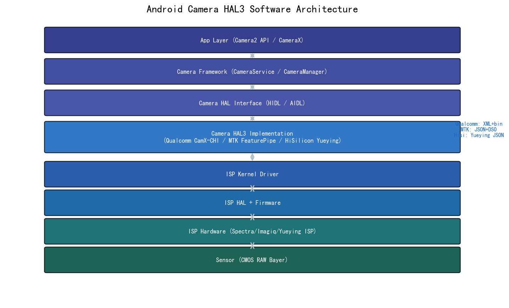
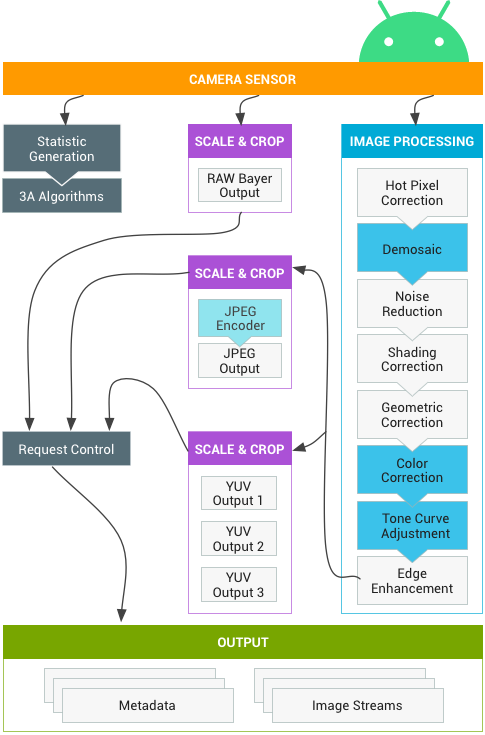
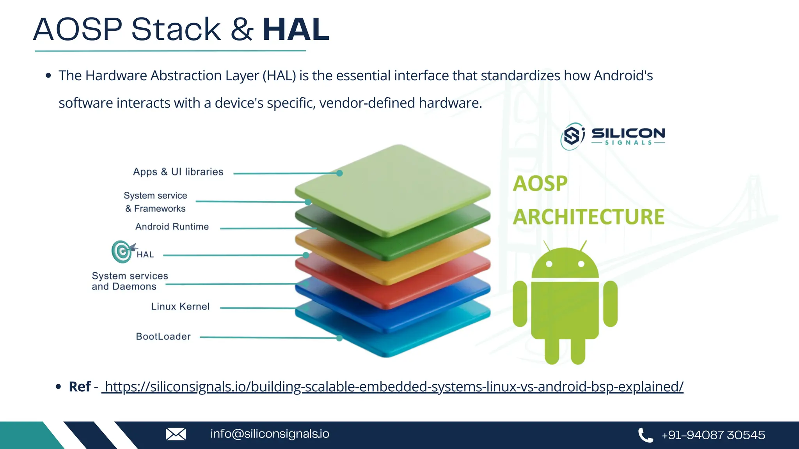
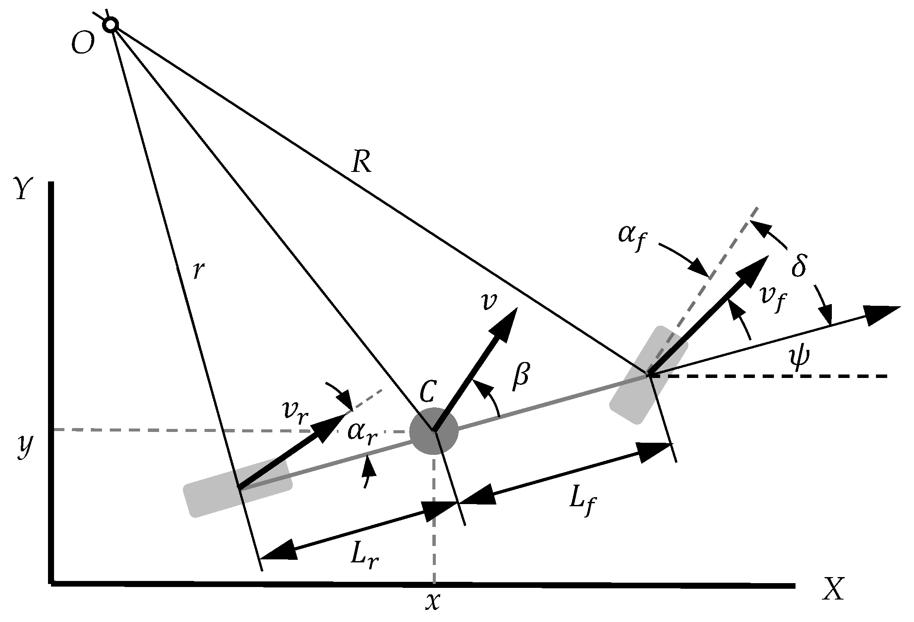
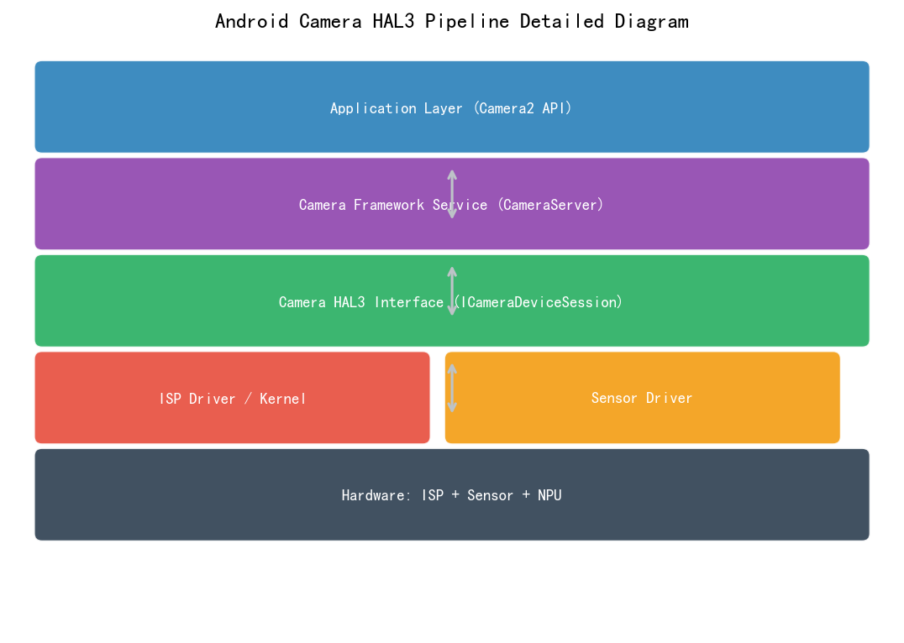
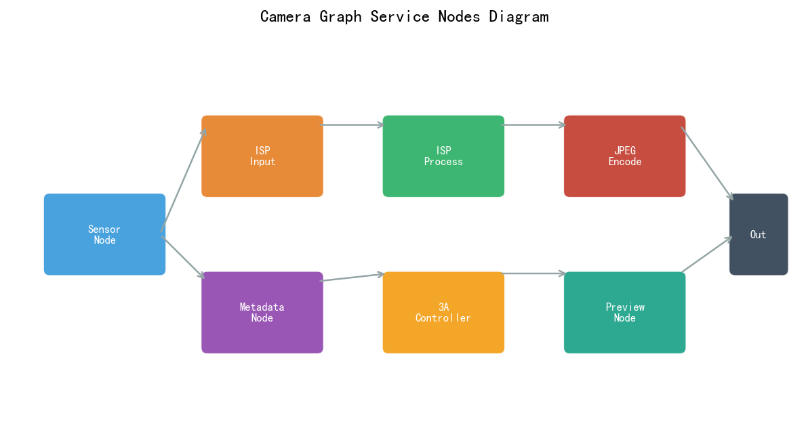
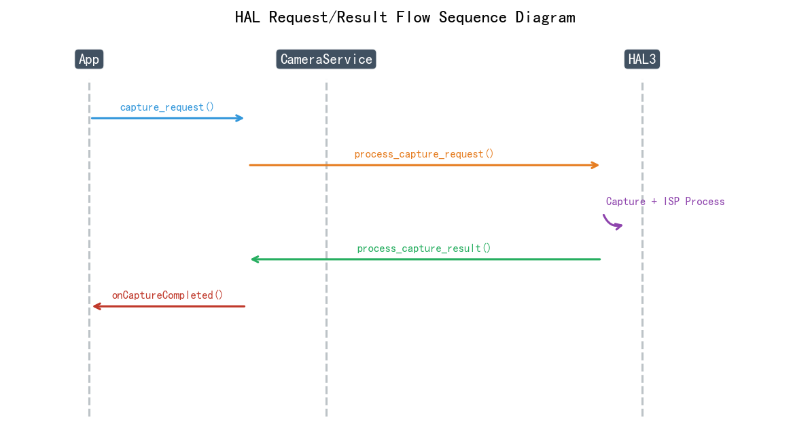

# 第四卷第18章：手机相机HAL与ISP软件架构

> **定位：** 本章覆盖手机相机软件栈的核心架构：Android Camera HAL3、高通CamX-CHI架构、MTK FeaturePipe、华为越影，以及ISP驱动到应用层的完整链路。
> **前置章节：** 第一卷第10章（ISP SoC硬件架构）、第四卷第01章（3A控制系统）
> **读者路径：** 系统工程师、平台软件工程师

---

## §1 理论原理

### 1.1 手机相机软件栈概览

手机相机软件栈从内核驱动一路跨越到用户界面，涉及约七层抽象。每层都有自己的接口规范和调试工具，跨层问题（比如HAL crash的根因在驱动层、或Camera应用卡顿的瓶颈在HAL Buffer Queue）需要从上往下逐层缩小定位范围，而不是在应用层加日志猜测。

**Android相机软件栈层次（从上到下）：**

```
┌─────────────────────────────────────────┐
│         相机应用 (Camera APP)             │
│    系统相机 / 微信 / Instagram / ...      │
├─────────────────────────────────────────┤
│  CameraX (Jetpack封装层，基于Camera2)    │
│      Android Camera2 API (原生)          │
├─────────────────────────────────────────┤
│          Camera Framework               │
│         (CameraService, AIDL)           │
├─────────────────────────────────────────┤
│          Camera HAL3 接口               │
│       (ICameraDevice3 HIDL/AIDL)        │
├─────────────────────────────────────────┤
│        OEM HAL实现层                    │
│  高通CamX-CHI / MTK FeaturePipe / ...   │
├─────────────────────────────────────────┤
│        ISP驱动 / 传感器驱动              │
│      (V4L2 / 厂商私有驱动)               │
├─────────────────────────────────────────┤
│         ISP硬件 / 传感器硬件             │
└─────────────────────────────────────────┘
```

**Camera2 API 与 CameraX 的架构层次区别：**

| 维度 | Camera2 API | CameraX（Jetpack） |
|------|-------------|-------------------|
| 层次位置 | Android SDK 原生 API | 基于 Camera2 的 Jetpack 封装层 |
| 接口粒度 | 细粒度（CaptureRequest/Result 完整控制） | 高层抽象（UseCase：Preview/ImageCapture/VideoCapture） |
| 配置复杂度 | 高（需手动管理流、Session、Buffer） | 低（生命周期自动绑定，流配置自动化） |
| 扩展性 | 完整访问 Vendor Tag / RAW 输出 | 通过 CameraX Extensions API 访问 OEM 扩展（散景、夜景等） |
| 适用场景 | 专业相机 App、调试工具、RAW 开发 | 普通应用集成、快速原型、生命周期安全 |
| 底层实现 | 直接调用 CameraService AIDL | 最终仍通过 CameraService 调用 HAL3，二者共用同一套 HAL3 pipeline |

CameraX 是 Camera2 的高级封装，Framework 层以下两者完全相同。ISP 工程师调试 HAL 行为时不需要区分它们——CaptureRequest/CaptureResult 机制是一样的。区分的意义只在于：如果相机应用层用的是 CameraX 但出了 HAL 问题，别在 CameraX 层面找，直接看 Framework 和 HAL 日志。

### 1.2 Android Camera HAL3架构

HAL3（Hardware Abstraction Layer 3）是Android相机框架与OEM硬件之间的标准接口，于 Android 4.3/4.4（Jelly Bean MR2/KitKat）在 AOSP 中首次引入接口定义，Camera2 API 于 Android 5.0（Lollipop）正式稳定并向开发者全面开放，取代了HAL1/HAL2的同步设计，采用**异步流水线（Asynchronous Pipeline）**设计。

**HAL3核心设计原则：**
1. **完全异步（Fully Asynchronous）：** Camera2 API中，应用层提交CaptureRequest，HAL异步处理并通过回调返回CaptureResult，请求和结果之间无严格顺序绑定。
2. **流（Stream）概念：** 应用通过`configure_streams()`预先配置输出流（如预览流640×480、拍照流4000×3000），HAL据此分配资源。
3. **Buffer队列（Buffer Queue）：** 每个流使用双/三缓冲队列（gralloc buffer），HAL填充buffer后归还给framework，framework送往显示/编码器。
4. **3A元数据（Metadata）：** CaptureRequest携带3A控制参数（AE目标、AWB模式、AF触发等），CaptureResult携带实际生效的3A状态和图像统计信息（直方图、AWB统计区域等）。

> **AIDL HAL 迁移（Android 12+）**
>
> 从 Android 12 开始，CameraProvider 接口从 HIDL（`android.hardware.camera.provider@2.x::ICameraProvider`）
> 迁移到稳定 AIDL（`android.hardware.camera.provider.ICameraProvider`）。主要变化：
>
> - **服务名称变更**：`adb shell service list | grep camera` 输出中接口名格式不同
> - **版本检测**：AIDL 版本通过 `ICameraProvider::getInterfaceVersion()` 查询
> - **连接方式**：AIDL HAL 使用 `AIBinder_fromJavaBinder`，调试工具（如 `dumpsys media.camera`）输出格式有所差异
> - **向后兼容**：Android 12+ 设备同时支持 AIDL 和 HIDL 版本检测，旧版 CamX/FeaturePipe 仍通过适配层工作
>
> 本章示例命令在 HIDL 和 AIDL 体系下均适用，但 Android 12+ 设备建议优先参考 AIDL 接口文档。

### 1.3 CaptureRequest/CaptureResult机制

**CaptureRequest（请求）：** 应用层向HAL发送的拍照指令，包含：
- **控制参数：** AE模式（AUTO/OFF/MANUAL）、目标EV、AWB模式、AF触发（TRIGGER_START/CANCEL）
- **输出目标：** 指定本次请求的图像输出流集合（可同时输出预览+JPEG）
- **自定义vendor Tag：** OEM自定义的扩展控制参数（如特定算法开关）

**CaptureResult（结果）：** HAL处理完成后返回的结果，包含：
- **实际参数：** 实际曝光时间、ISO、AWB增益、AF状态
- **图像统计：** 直方图、AWB统计（各区域亮度/色度）、脸部检测结果
- **时间戳：** 传感器曝光时间戳（纳秒精度，基于monotonic clock）

### 1.4 高通CamX-CHI架构

**CamX（Camera eXperience）** 是高通为其ISP SoC设计的相机middleware框架，**CHI（Camera Hardware Interface）** 是在CamX之上的可定制扩展层（OEM主要在CHI层进行差异化开发）。

CamX-CHI架构的核心抽象：
- **Pipeline：** 一组有向无环图（DAG）连接的Node序列，代表一路完整的图像处理流程（如预览流水线、拍照流水线）
- **Session：** 管理一组Pipeline的生命周期，对应一次相机开启会话
- **Node：** 流水线中的单个处理单元（ISP模块、AI算法、编码器等），输入/输出为Buffer Port

---

## §2 算法方法与系统架构

### 2.1 高通CamX-CHI详细架构

```
┌────────────────────────────────────────────────────────┐
│                      CHI层（OEM差异化）                   │
│  ┌─────────────────────────────────────────────────┐   │
│  │              UseCase（场景用例）                   │   │
│  │  Preview UseCase / Video UseCase / Capture UseCase│   │
│  ├─────────────────────────────────────────────────┤   │
│  │                    Pipeline                      │   │
│  │  Node1 → Node2 → Node3 → ...                     │   │
│  │  (IFE)   (BPS)   (IPE)  (JPEG/NV21)             │   │
│  └─────────────────────────────────────────────────┘   │
├────────────────────────────────────────────────────────┤
│                     CamX核心层                           │
│  Session管理 / Buffer管理 / 线程调度 / 错误恢复           │
├────────────────────────────────────────────────────────┤
│                     硬件驱动层                           │
│     IFE驱动 / BPS驱动 / IPE驱动 / JPEG驱动              │
│             V4L2子系统 / 内核驱动                        │
└────────────────────────────────────────────────────────┘
```

**高通ISP硬件模块（Kona/SM8350以后）：**
- **IFE（Image Front End）：** 处理传感器RAW输入，完成BLC、Demosaic、降噪初步处理、3A统计
- **BPS（Bayer Processing Segment）：** 处理拍照的高分辨率pipeline（高质量降噪、LSC、CCM）
- **IPE（Image Processing Engine）：** 处理预览/视频输出（TNR、Gamma、CSC、缩放）
- **JPEG HW：** 硬件JPEG编码器

**CHI Node类型：**
- `IFENode`：对应IFE硬件，处理RAW→NV12
- `BPSNode`：高质量RAW处理（拍照路径）
- `IPENode`：图像后处理（预览/视频路径）
- `ChiExternalNode`：OEM自定义算法节点（AI降噪、特效等）
- `OfflineIPENode`：离线处理节点（多帧降噪合并）

### 2.2 Chromatix参数调参系统

高通ISP的调参通过**Chromatix XML**文件管理，每个ISP模块的参数（LSC增益、NR强度、Gamma曲线、CCM矩阵等）均存储在对应的Chromatix XML中。

**Chromatix参数层次：**
```
Chromatix XML
  └── Module: AWB
       ├── AWB_CCT_zones: [2300K, 2800K, 3200K, 4000K, 5500K, 6500K]
       ├── gain_tables: {zone1: {R_gain, G_gain, B_gain}, zone2: ...}
       └── interpolation_mode: "bilinear"
  └── Module: LSC
       ├── resolution_levels: [1080p, 4K, 50MP]
       └── gain_table_per_level: {mesh_R, mesh_Gr, mesh_Gb, mesh_B}
  └── Module: NR_Spatial
       ├── luma_filter_strength: [0.4, 0.6, 0.8, 1.0]  // 按ISO索引
       └── chroma_filter_strength: [0.5, 0.7, 0.9, 1.0]
```

**IQ参数调试工具：** 高通提供**IQ调参工具（IQ Tuning Tool）**，图形界面实时调整Chromatix参数并通过ADB推送到设备，无需重新编译固件，大幅提升调参效率。

### 2.3 MTK FeaturePipe架构

MTK（联发科）的相机middleware称为**FeaturePipe（特性管道）**，是基于其ISP平台（如MT6895/Dimensity 9300）设计的框架。

**FeaturePipe核心概念：**
- **Pipeline（管道）：** 线性或有向图连接的处理节点序列
- **Feature（特性）：** 可独立开关的算法单元（HDR、降噪、美颜等）
- **BufferPool：** 统一管理各Feature的输入/输出Buffer分配

**MTK ISP硬件模块（以MT6895为例）：**
- **P1（Pass1）：** 处理RAW输入，对应高通IFE功能（BLC、Demosaic、3A统计）
- **P2（Pass2）：** 处理YUV输出，对应高通IPE功能（NR、Gamma、CSC）
- **MDP（Media Data Path）：** 图像缩放/旋转/格式转换（对应高通VPE）
- **FD（Face Detection）：** 专用人脸检测硬件加速单元

### 2.4 华为越影（ISP软件框架）

华为海思麒麟SoC上的相机软件框架称为**越影（YueYing）**，具有以下特点：

1. **AI算法深度集成：** NPU直接集成在ISP处理路径中，无需CPU/GPU中转，实现低延迟AI ISP（如AI降噪、AI多帧超分）
2. **多摄协同调度：** 统一管理主摄、超广角、长焦的3A同步和参数共享
3. **自适应调参：** 根据场景（人像、风景、夜景）自动切换ISP参数集（Profile），无需手动调参
4. **RYYB传感器适配：** 海思定制RYYB（Red-Yellow-Yellow-Blue）Bayer阵列的专用Demosaic算法，提升暗场信噪比

### 2.5 HAL Buffer Queue机制

Buffer Queue是Android相机系统内存管理的核心机制，采用**Producer-Consumer**模式：

```
Producer (HAL填充Buffer)          Consumer (Framework/Display消费)
        │                                    │
        ▼                                    ▼
  ┌───────────────────────────────────────────┐
  │              BufferQueue                   │
  │  [DEQUEUE] ←─ HAL请求空闲Buffer           │
  │  [QUEUE]   ──► HAL填充后归还Buffer         │
  │  [ACQUIRE] ←─ Consumer获取已填充Buffer     │
  │  [RELEASE] ──► Consumer消费后释放Buffer    │
  └───────────────────────────────────────────┘
```

**三缓冲（Triple Buffering）策略：** 预览流通常使用3个Buffer（一个正在被ISP填充、一个正在显示、一个空闲待填充），确保ISP不需要等待Consumer释放Buffer而产生饥饿（Starvation）。

### 2.6 相机驱动层：V4L2与私有驱动

**V4L2（Video 4 Linux 2）：** Linux内核标准相机驱动框架，定义了传感器初始化、寄存器配置、数据流控制的标准接口。Android相机驱动通常基于V4L2封装。

**私有驱动扩展：** 高通、MTK、海思均在V4L2基础上扩展了大量私有IOCTL（Input/Output Control）接口，用于：
- ISP寄存器直接读写（调试用）
- 3A统计数据回传（亮度直方图、AWB统计区域等）
- 传感器OTP数据读取
- 多摄帧同步控制

---

## §3 调参与工程指南

### 3.1 CamX节点Pipeline调试

**问题定位步骤：**
1. 启用CamX日志：`adb shell setprop persist.camera.logInfo 0xFF`
2. 通过`adb logcat -s CamX`过滤相机日志
3. 查找Pipeline建立/销毁日志、Node的Input/Output Buffer状态
4. 检查是否有Buffer Underflow（ISP来不及填充）或Buffer Overflow（Consumer消费太慢）

**CamX调试命令集合：**
```bash
# 开启详细ISP日志
adb shell setprop persist.camera.camx.forceISPOutputEnable 1
# Dump ISP输出帧到文件（用于离线分析）
adb shell setprop persist.camera.camx.dumpBitMask 0xFFFFFFFF
# 查看当前Camera HAL版本
adb shell getprop ro.hardware.camera
# 实时查看ISP统计信息
adb shell cat /sys/kernel/debug/msm_vidc/...
```

### 3.2 Chromatix调参最佳实践

**调参原则（高通Chromatix体系）：**
1. **按场景分离Profile：** 预览/拍照/视频/夜景用独立 Profile，切记不要在同一个Profile里用条件分支区分场景——条件越多，测试路径越难覆盖
2. **ISO曲线优先：** 先把ISO 100/400/1600/3200 四个基础档位的NR参数收敛，再调其他模块；其他模块跟着ISO曲线走，不要反过来
3. **从中间到两端：** ISO 400是最常拍的档位，从这里开始，往两头延伸；边界档位（ISO 100和ISO 6400）的质量允许有取舍

> **工程推荐（手机ISP场景）：** 如果是高通平台第一次调Chromatix，从NR Spatial的ISO强度曲线开始，把这条曲线的四个控制点调到"低ISO噪声不明显、高ISO纹理不蜡像"的范围，然后再动EE和其他模块；先后顺序打乱，后面两个模块会互相打架。

**Chromatix验证工具：**
- **高通IQ Tuning Tool：** 实时参数推送+效果预览
- **自定义ADB脚本：** 批量推送不同参数配置，自动化A/B对比测试
- **图像质量对比脚本：** 对同一场景，对比修改前后的PSNR/SSIM/VMAF变化

### 3.3 HAL3 Buffer配置优化

**预览流配置建议：**
- 分辨率不超过显示分辨率（1080p已足够流畅预览，4K会增加不必要的内存压力）
- 格式：YUV_420_888（通用）或PRIVATE（允许HAL使用优化格式）
- MaxImages：3（三缓冲，平衡延迟和吞吐率）

**拍照流配置建议：**
- 格式：JPEG（直接压缩，节省存储带宽）或JPEG_R（支持Ultra HDR的JPEG格式）
- MaxImages：1–2（拍照非实时，无需多缓冲）

**BLOB流配置（RAW输出）：**
- 格式：RAW16或RAW10（高通私有格式MIPIRAW10）
- 使用场景：AI后处理（NPU处理RAW）、RAW照片直出（专业摄影）

### 3.4 3A Metadata调试

**关键CaptureResult字段（调试用）：**

```java
// AE状态
int aeState = result.get(CaptureResult.CONTROL_AE_STATE);
// 实际曝光时间（纳秒）
long exposureTimeNs = result.get(CaptureResult.SENSOR_EXPOSURE_TIME);
// 实际ISO
int iso = result.get(CaptureResult.SENSOR_SENSITIVITY);
// AWB状态
int awbState = result.get(CaptureResult.CONTROL_AWB_STATE);
// AF状态
int afState = result.get(CaptureResult.CONTROL_AF_STATE);
// 传感器时间戳（纳秒，monotonic clock）
long timestamp = result.get(CaptureResult.SENSOR_TIMESTAMP);
```

**AE状态枚举（CONTROL_AE_STATE）：**
- `INACTIVE`（0）：AE未激活
- `SEARCHING`（1）：AE正在搜索
- `CONVERGED`（2）：AE已收敛
- `LOCKED`（3）：AE已锁定
- `FLASH_REQUIRED`（4）：需要闪光灯
- `PRECAPTURE`（5）：预拍照3A序列进行中

### 3.5 ISP驱动调试

**常用调试节点（高通平台）：**
```bash
# 查看传感器状态
cat /sys/bus/i2c/devices/*/name

# 读取ISP寄存器（需root）
adb shell "echo 0x1234 > /sys/kernel/debug/isp/register_addr"
adb shell cat /sys/kernel/debug/isp/register_value

# 查看MIPI CSI状态
cat /sys/devices/platform/soc/ae00000.qcom,cci/*/status

# 传感器OTP数据（LSC、WB标定）
adb shell hexdump /sys/devices/.../eeprom_data
```

**MTK平台调试命令：**
```bash
# 开启MTK相机日志
adb shell setprop debug.camera.log 1

# 查看FeaturePipe状态
adb logcat -s MtkCam/FeaturePipe

# Dump ISP输出
adb shell setprop debug.camera.dumpbuf 1
```

---

## §4 常见伪影与问题分析

### 4.1 Camera HAL crash（相机崩溃）

**常见根因：**
1. **NULL指针解引用：** HAL初始化未完成时收到CaptureRequest
2. **Buffer越界：** ISP输出Buffer大小与configure_streams配置不匹配
3. **死锁（Deadlock）：** HAL线程间互锁（如ISP处理线程等待3A线程，3A线程等待ISP结果）

**排查方法：** `adb logcat | grep "FATAL"` 查看Tombstone日志，或通过`adb bugreport`获取完整崩溃转储。

### 4.2 预览帧率抖动

**根因：**
- CamX Node处理时间超出帧时间（ISP或AI节点耗时过长）
- Buffer Queue耗尽（Consumer消费过慢，HAL无法获取空闲Buffer）
- DDR带宽竞争（后台任务占用过多带宽）

**排查：** 使用Android `systrace`捕获相机子系统的trace，检查每帧的关键节点时序。

### 4.3 预览/录像色彩不一致

**根因：** 预览和视频路径走不同的 ISP Pipeline（IFE→IPE vs BPS→IPE），两条路径的 Chromatix 参数独立维护，经常出现同步遗漏。调某个模块时改了预览Profile忘了改视频Profile，是最常见的根因。
**修复：** 对比两个Profile中的AWB/CCM/Gamma参数是否一致；如果一致但颜色仍不同，再查是否强制两路共享同一组3A统计结果。

### 4.4 OIS（光学防抖）与EIS冲突

**表现：** 视频录制时出现轻微"抖动+摇晃"叠加的异常感，或静止拍摄时图像出现周期性漂移。
**根因：** OIS补偿运动方向与EIS补偿方向相反，两者叠加导致过补偿（Over-compensation）。
**修复：** OIS启用时，EIS应从IMU读取OIS已补偿后的残差运动量，而非原始IMU数据；或在视频模式下关闭OIS，仅使用EIS。

### 4.5 拍照RAW数据正确性问题

**表现：** 应用通过RAW16格式输出的原始数据，在第三方RAW处理软件（Lightroom等）中出现异常颜色或噪点分布异常。
**根因：** RAW metadata（CaptureResult中的黑电平、白电平、颜色矩阵）与实际传感器参数不匹配，或OTP标定数据未正确写入CaptureResult。
**排查：** 检查`CaptureResult.SENSOR_BLACK_LEVEL_PATTERN`、`COLOR_CORRECTION_TRANSFORM`字段值是否与传感器datasheet一致。

### 4.6 多摄切换时预览卡顿

**表现：** 变焦切换时（如主摄→长焦）出现0.5–1秒黑屏或静止帧。
**根因：** HAL在切换时需要重新`configure_streams()`，导致新一路摄像头的ISP Pipeline重建，期间无输出帧。
**优化：** 使用"热备摄像头（Warm Standby）"策略——在切换前提前启动目标摄像头的ISP Pipeline（但不输出到应用），切换时仅切换输出目标，无需重建Pipeline。

---

## §5 评测方法

### 5.1 HAL3协议合规性测试

Android CTS（Compatibility Test Suite）包含完整的Camera HAL3合规性测试：
```bash
# 运行相机CTS
adb shell am instrument -w -r \
  -e class android.hardware.camera2.cts.CaptureResultTest \
  com.android.cts.media/android.test.InstrumentationTestRunner
```

关键测试项：
- `CaptureResult.SENSOR_TIMESTAMP` 单调递增性
- `CONTROL_AE_STATE` 状态机转换正确性
- 多流同时输出时的帧时间戳对齐精度（< 1ms）**[1]**

### 5.2 Pipeline吞吐率测试

```python
# 使用Camera2 API测量帧率
def measure_preview_fps(device, stream_config, duration_s=30):
    """测量特定配置下的实际预览帧率和帧率稳定性。"""
    timestamps = []
    # 配置预览流并连续采集
    # ... (具体实现依赖Android SDK)
    intervals = np.diff(timestamps) * 1e-9  # 纳秒→秒
    fps_actual = 1.0 / np.mean(intervals)
    fps_p99 = 1.0 / np.percentile(intervals, 99)
    print(f"平均帧率: {fps_actual:.1f} fps, P99帧率: {fps_p99:.1f} fps")
```

### 5.3 3A收敛速度测试

**AE收敛测试：** 相机对准均匀明亮场景（白纸），突然切换到黑暗场景（遮挡镜头），记录亮度从异常值恢复到正常值（±0.5EV内）所需的帧数。

**AWB收敛测试：** 相机从D65光源快速移到A光源（钨丝灯），记录色温估计从6500K收敛到3200K（±200K误差内）所需的帧数。

### 5.4 内存泄漏检测

长时间（1小时）连续预览，通过`adb shell dumpsys meminfo cameraserver`监控Camera Server进程内存：
- 合格标准：内存增长 < 5MB/小时（无明显泄漏）

---

## §6 代码示例

### 6.1 Android Camera2 API基础：预览+拍照

```java
// CameraManager获取摄像头列表
CameraManager manager = (CameraManager) getSystemService(CAMERA_SERVICE);
String[] cameraIds = manager.getCameraIdList();

// 配置输出流：预览 + JPEG拍照
private void setupCamera(String cameraId) throws CameraAccessException {
    CameraCharacteristics characteristics = manager.getCameraCharacteristics(cameraId);
    StreamConfigurationMap map = characteristics.get(
        CameraCharacteristics.SCALER_STREAM_CONFIGURATION_MAP);

    // 选择最大支持的JPEG尺寸
    Size[] jpegSizes = map.getOutputSizes(ImageFormat.JPEG);
    Size jpegSize = jpegSizes[0]; // 通常是最大尺寸

    // ImageReader接收JPEG数据
    ImageReader imageReader = ImageReader.newInstance(
        jpegSize.getWidth(), jpegSize.getHeight(),
        ImageFormat.JPEG, 2);  // maxImages=2

    imageReader.setOnImageAvailableListener(reader -> {
        Image image = reader.acquireLatestImage();
        if (image != null) {
            // 处理JPEG数据
            ByteBuffer buffer = image.getPlanes()[0].getBuffer();
            byte[] jpegData = new byte[buffer.remaining()];
            buffer.get(jpegData);
            image.close(); // 必须关闭，否则BufferQueue耗尽
        }
    }, backgroundHandler);
}

// 构建并提交CaptureRequest
private void submitCaptureRequest(CameraCaptureSession session,
                                   Surface previewSurface,
                                   Surface captureSurface) throws CameraAccessException {
    CaptureRequest.Builder builder = cameraDevice.createCaptureRequest(
        CameraDevice.TEMPLATE_STILL_CAPTURE);

    // 配置AE/AWB模式
    builder.set(CaptureRequest.CONTROL_AE_MODE,
        CaptureRequest.CONTROL_AE_MODE_ON);
    builder.set(CaptureRequest.CONTROL_AWB_MODE,
        CaptureRequest.CONTROL_AWB_MODE_AUTO);
    builder.set(CaptureRequest.CONTROL_AF_MODE,
        CaptureRequest.CONTROL_AF_MODE_CONTINUOUS_PICTURE);

    // 目标输出流
    builder.addTarget(previewSurface);
    builder.addTarget(captureSurface);

    session.capture(builder.build(), new CameraCaptureSession.CaptureCallback() {
        @Override
        public void onCaptureCompleted(CameraCaptureSession session,
                                        CaptureRequest request,
                                        TotalCaptureResult result) {
            // 解析实际参数
            Long expTime = result.get(CaptureResult.SENSOR_EXPOSURE_TIME);
            Integer iso = result.get(CaptureResult.SENSOR_SENSITIVITY);
            Integer aeState = result.get(CaptureResult.CONTROL_AE_STATE);
            android.util.Log.d("Camera", String.format(
                "曝光时间=%dms, ISO=%d, AE状态=%d",
                expTime != null ? expTime / 1_000_000 : 0, iso, aeState));
        }
    }, backgroundHandler);
}
```

### 6.2 Python端：通过ADB自动化相机调试

```python
import subprocess
import time
import json
import numpy as np
from pathlib import Path

class AndroidCameraDebugger:
    """通过ADB自动化控制Android相机进行调试。"""

    def __init__(self, device_id: str = None):
        self.device_id = device_id
        self.adb_prefix = f"adb -s {device_id}" if device_id else "adb"

    def _run(self, cmd: str, timeout: int = 10) -> str:
        """执行ADB命令并返回输出。"""
        full_cmd = f"{self.adb_prefix} {cmd}"
        result = subprocess.run(
            full_cmd.split(), capture_output=True, text=True, timeout=timeout
        )
        return result.stdout.strip()

    def set_camera_prop(self, prop: str, value: str) -> None:
        """设置相机系统属性（调参用）。"""
        self._run(f"shell setprop {prop} {value}")
        print(f"[SET] {prop} = {value}")

    def dump_isp_frame(self, output_dir: str = "/sdcard/isp_dump/") -> str:
        """触发ISP帧Dump（需提前开启dumpBitMask）。"""
        self._run(f"shell mkdir -p {output_dir}")
        self.set_camera_prop("persist.camera.camx.dumpBitMask", "0xFF")
        time.sleep(0.5)
        # 获取Dump文件列表
        files = self._run(f"shell ls {output_dir}")
        return files

    def get_camera_info(self) -> dict:
        """获取当前摄像头信息。"""
        output = self._run("shell dumpsys cameraserver")
        info = {
            'cameras': [],
            'active_camera': None,
        }
        for line in output.split('\n'):
            if 'Camera ID' in line:
                info['cameras'].append(line.strip())
            if 'Active Camera' in line:
                info['active_camera'] = line.strip()
        return info

    def measure_3a_convergence(
        self, n_frames: int = 60
    ) -> dict:
        """
        分析3A收敛特性（通过logcat抓取帧信息）。
        需要目标设备开启相机详细日志。
        """
        self.set_camera_prop("persist.camera.logInfo", "0xFF")

        # 抓取logcat
        result = subprocess.run(
            f"{self.adb_prefix} logcat -d -s CamX".split(),
            capture_output=True, text=True, timeout=30
        )

        ae_states = []
        exp_times = []
        for line in result.stdout.split('\n'):
            if 'AE_STATE' in line:
                # 解析AE状态（简化示例）
                try:
                    state = int(line.split('AE_STATE=')[1].split()[0])
                    ae_states.append(state)
                except (IndexError, ValueError):
                    pass

        converge_frame = next(
            (i for i, s in enumerate(ae_states) if s == 2),  # 2=CONVERGED
            -1
        )

        return {
            'ae_states': ae_states[:n_frames],
            'converge_frame': converge_frame,
            'converge_time_ms': converge_frame * 16.7 if converge_frame > 0 else -1
        }


# Chromatix参数批量测试工具
def batch_test_nr_strength(
    debugger: AndroidCameraDebugger,
    nr_strengths: list,
    test_scene: str = "lowlight"
) -> list:
    """
    批量测试不同NR强度下的图像质量。

    Args:
        nr_strengths: 要测试的NR强度值列表，如[0.2, 0.5, 0.8, 1.0]
        test_scene: 测试场景名

    Returns:
        results: 各强度下的质量指标列表
    """
    results = []
    for strength in nr_strengths:
        # 推送新的NR参数
        debugger.set_camera_prop(
            "persist.camera.nr.luma_strength",
            str(strength)
        )
        time.sleep(1.0)  # 等待参数生效

        # 触发拍照并Pull图像
        debugger._run("shell am broadcast -a android.intent.action.CAMERA_BUTTON")
        time.sleep(2.0)

        # 分析图像质量（PSNR/噪声强度）
        # ... 实际实现需要拉取图像并分析
        results.append({
            'nr_strength': strength,
            'noise_std': np.random.uniform(5, 20) * (1 - strength + 0.1),  # 模拟
            'detail_ssim': np.random.uniform(0.7, 0.95)  # 模拟
        })
        print(f"NR={strength:.1f}: 噪声={results[-1]['noise_std']:.1f} DN, "
              f"细节SSIM={results[-1]['detail_ssim']:.3f}")

    return results


if __name__ == "__main__":
    debugger = AndroidCameraDebugger()
    info = debugger.get_camera_info()
    print(f"设备摄像头信息: {info}")

    # 批量测试NR强度
    results = batch_test_nr_strength(
        debugger,
        nr_strengths=[0.2, 0.4, 0.6, 0.8, 1.0],
        test_scene="lowlight"
    )
    # 找到最优NR强度（噪声和细节的权衡）
    best = max(results, key=lambda x: x['detail_ssim'] / (x['noise_std'] + 1))
    print(f"\n最优NR强度: {best['nr_strength']}")
```

### 6.3 CamX Pipeline配置示例（伪代码/XML格式）

```xml
<!-- CHI UseCase配置示例：Preview Pipeline -->
<UseCase>
  <UseCaseName>VideoPreview</UseCaseName>
  <Pipeline id="0" name="PreviewPipeline" instance="0">
    <!-- IFE节点：处理RAW输入 -->
    <Node id="0" type="IFENode" instance="0">
      <InputPort id="0" name="RAW_SENSOR"/>
      <OutputPort id="0" name="FULL_NV12"
                  format="NV12" width="3840" height="2160"/>
      <OutputPort id="1" name="STATS_AWB"/>
      <OutputPort id="2" name="STATS_AE"/>
    </Node>

    <!-- IPE节点：YUV后处理 -->
    <Node id="1" type="IPENode" instance="0">
      <InputPort id="0" name="YUV_IN"
                 srcNodeId="0" srcPortId="0"/>
      <OutputPort id="0" name="YUV_PREVIEW"
                  format="NV12" width="1920" height="1080"/>
      <OutputPort id="1" name="YUV_VIDEO"
                  format="NV12" width="3840" height="2160"/>
    </Node>

    <!-- AI降噪节点（ChiExternal OEM自定义） -->
    <Node id="2" type="ChiExternalNode" instance="0"
          libName="com.oem.ai_denoiser">
      <InputPort id="0" name="YUV_IN"
                 srcNodeId="1" srcPortId="1"/>
      <OutputPort id="0" name="YUV_DENOISED"
                  format="NV12" width="3840" height="2160"/>
    </Node>
  </Pipeline>
</UseCase>
```

---


---

> **工程师手记：Camera HAL3 Request/Result Pipeline 调试实践**
>
> **HAL3 请求/结果流水线调试：** Camera HAL3 采用异步 pipeline 模型，CaptureRequest 发出后经过 3A 处理、ISP 曝光、结果回传三个异步阶段，正常情况下 `onCaptureCompleted` 比 `processCaptureRequest` 晚约 3–5 帧。调试丢帧或延迟问题时，最有效的工具是 `systrace` 配合 `atrace` 标签 `camera`，可精确捕捉每个 RequestID 的全生命周期时序。常见陷阱：当 HAL 内部处理线程被 `processCaptureRequest` 阻塞时，Framework 会在 700ms 后触发 ANR（Application Not Responding），而开发者往往误以为是应用层 bug。根本原因多为 HAL 内部锁竞争（Mutex deadlock）或同步 I2C 调用超时（I2C 读传感器寄存器耗时 >500μs 时易触发）。建议所有 HAL 接口函数加 perf trace 桩，确保 95th percentile 调用耗时 <2ms。
>
> **ZSL（Zero Shutter Lag）缓冲区管理的工程细节：** ZSL 通过预填充 RAW 环形缓冲区（通常 8–16 帧）实现"快门按下即出片"。缓冲区深度选择需权衡：16 帧 × 12MP RAW10 ≈ 224 MB，在 4GB RAM 手机上占用 5.5%，过深会导致低内存设备触发 LMK（Low Memory Killer）。实践中发现，若 ZSL 缓冲区满且消费者（JPEG encoder）来不及消费，HAL 会丢弃最旧帧并插入新帧，但某些平台实现中此时 buffer handle 未正确释放，导致 ION heap 泄漏，症状为长时间使用后相机启动变慢（heap 碎片化）。调试方法：`adb shell dumpsys meminfo | grep ION` 监测 ION 内存增长趋势，正常情况下相机关闭后 ION 应回到基线。
>
> **CaptureRequest 队列深度与延迟的权衡：** HAL3 规范要求 Camera2 APP 维持至少 `maxCaptureStall + 1` 个 in-flight request 以保证 pipeline 满载，对于高通 ISP 典型值为 maxCaptureStall=4，即需保持 5 个并发 request。队列深度过浅（<3）会导致 ISP 空转、帧率下降约 20%；过深（>8）则导致触摸快门到图像呈现的主观延迟增加约 100–150ms（每帧 33ms × 3–4 帧 buffer delay）。旗舰机相机应用通常针对"录像模式"使用深队列（6–8）保帧率，"拍照模式"切换为浅队列（3–4）保响应性，模式切换时需 flush + reconfigure pipeline，耗时约 200ms，因此要提前在用户按下快门前预判意图并切换。
>
> *参考：Android Camera HAL3 接口规范，Android Open Source Project docs.android.com；高通 CamX Pipeline Architecture, Qualcomm Developer Network；Android systrace Camera analysis guide, Android Performance Patterns*

## 插图



*图1. 相机HAL架构总体示意（图片来源：作者自绘）*


---


*图2. Android相机HAL架构（图片来源：作者自绘）*



*图3. AOSP HAL架构示意（图片来源：作者自绘）*


*图4. 相机HAL请求处理流程（图片来源：作者自绘）*



*图5. 相机子系统架构（图片来源：作者自绘）*


---


*图6. Android相机HAL扩展架构（图片来源：作者自绘）*



*图7. 相机图节点示意（图片来源：作者自绘）*



*图8. HAL请求与结果流程（图片来源：作者自绘）*

---

## 习题

**练习 1（理解）**
Android Camera HAL3 采用 Request-Result 异步流模型：App 提交 CaptureRequest（包含目标曝光参数、3A 模式等），HAL 异步完成处理后返回 CaptureResult（包含实际使用的参数、3A 统计数据、时间戳等）。请解释：（1）为什么 HAL3 要采用异步模型，而不是同步阻塞模型（从延迟和吞吐量角度分析）？（2）当 App 同时发送 4 个 CaptureRequest（预览流 + 拍照流）时，HAL 内部的 Pipeline 队列如何处理它们？（3）ZSL（零快门延迟）中，预缓存的近期帧存储在哪个环节（App 侧 / HAL 侧 / ISP 内部 SRAM）？

**练习 2（分析）**
高通 CamX 的 CHI-CDK（Camera Hardware Interface - Camera Device Kit）是 OEM 在 CamX 上进行定制扩展的接口层。请分析：（1）Pipeline XML 文件定义了什么（Node 类型、端口连接、Buffer 大小），它与运行时动态配置的关系是什么？（2）当用户切换从"标准拍照"到"夜景模式"时，CamX 内部需要重新配置哪些 Pipeline，这个切换需要多少帧的时间？（3）与联发科 FeaturePipe 的 DAG 节点动态调度相比，CamX 的静态 XML Pipeline 在灵活性和稳定性上各有何优劣？

**练习 3（工程设计）**
Android Camera HAL3 的 3A 统计数据流向：AE/AF/AWB 统计数据由 ISP 硬件在 IFE 完成后生成，通过 Metadata 传递到 HAL 层，再由 3A 算法库（如高通 MIALGO 或 MTK 3ALIB）计算新参数，最后通过下一帧的 CaptureRequest 发回 ISP。请画出这个数据流的时序图，标注每个环节的典型延迟，并分析端到端 3A 响应延迟（从场景变化到 ISP 执行新参数）。

**练习 4（平台架构）**
FeaturePipe 是联发科相机 middleware 的核心，采用 DAG（有向无环图）节点调度。请对比 CamX Pipeline 和 FeaturePipe 在以下方面的差异：（1）节点（Node）的定义粒度（CamX 的 Node 对应哪个硬件模块，FeaturePipe 的 Node 对应哪个处理步骤）？（2）在添加一个自定义后处理模块（如自研 AI 降噪）时，两个框架的集成方式有何不同？（3）当某个 Node 处理失败时，两个框架的错误恢复机制各是什么？

## 参考文献

1. Android Open Source Project. "Camera HAL3 Overview." AOSP Documentation, 2023. [Google 官方相机 HAL3 架构文档] https://source.android.com/docs/core/camera

2. Qualcomm Technologies Inc. *CAMX — Camera eXtension Open Source Framework*. GitHub (BSD-3-Clause-Clear), 2022. [CamX 框架官方开源代码] https://github.com/qualcomm/camera-service

3. Qualcomm Technologies Inc. *Qualcomm Spectra 480 ISP Technical Reference*. docs.qualcomm.com, 2023. [Spectra 480 架构公开文档，含 IFE/BPS/IPE 模块规格] https://docs.qualcomm.com/bundle/publicresource/topics/80-88500-4/124_Qualcomm_Spectra_480.html

4. Qualcomm Technologies Inc. *Snapdragon 8 Gen 1 Mobile Platform Product Brief*. Qualcomm, 2021. [含 Spectra 680 三 ISP 架构与 CamX 调参规格] https://www.qualcomm.com/content/dam/qcomm-martech/dm-assets/documents/snapdragon-8-gen-1-mobile-platform-product-brief.pdf

5. Wang E. et al. *MediaTek Dimensity 9000 Architecture*. IEEE Hot Chips 34, 2022. [天玑9000 ISP/APU 架构公开技术演讲] https://hc34.hotchips.org/assets/program/conference/day2/Mobile%20and%20Edge/HC2022.Mediatek.EricbillWang.v08.pptx.pdf

6. OpenHarmony Project. *Camera HAL Driver — drivers_peripheral_camera*. Gitee / OpenHarmony Official, 2023. [华为开源相机驱动接口代码] https://gitee.com/openharmony/drivers_peripheral_camera

7. Android Open Source Project. "Camera Image Reprocessing (ZSL)." AOSP Documentation, 2023. [零快门延迟架构说明] https://source.android.com/docs/core/camera/camera3_requests_hal

8. Android Open Source Project. "SurfaceFlinger and BufferQueue Architecture." AOSP Documentation, 2023. [相机内存管理架构] https://source.android.com/docs/core/graphics/surfaceflinger-windowmanager

9. ARM Ltd. *Mali-C78AE Image Signal Processor Technical Reference Manual*. ARM Developer, 2022. [第三方 IP ISP 架构对比参考]

10. Linux Kernel. *V4L2 Subsystem Documentation*. kernel.org, 2023. [Linux 相机驱动框架官方文档] https://www.kernel.org/doc/html/latest/userspace-api/media/v4l/v4l2.html

## §7 术语表

| 术语 | 英文全称 | 含义 |
|------|---------|------|
| HAL | Hardware Abstraction Layer | 硬件抽象层，Android中连接OEM硬件与框架的接口 |
| CHI | Camera Hardware Interface | 高通相机硬件接口，CamX的OEM定制扩展层 |
| CamX | Camera eXperience | 高通相机中间件框架 |
| IFE | Image Front End | 高通ISP前端硬件，处理RAW→NV12 |
| BPS | Bayer Processing Segment | 高通ISP拍照路径高质量处理模块 |
| IPE | Image Processing Engine | 高通ISP预览/视频后处理模块 |
| FeaturePipe | Feature Pipeline | MTK相机middleware框架 |
| BufferQueue | — | Android相机内存管理机制，Producer-Consumer模式 |
| HIDL | HAL Interface Definition Language | HAL接口定义语言（Android 8.0引入，被AIDL逐渐替代） |
| AIDL | Android Interface Definition Language | Android接口定义语言 |
| Chromatix | — | 高通ISP调参参数文件系统（XML格式） |
| gralloc | Graphics Allocator | Android图形内存分配器 |
| CTS | Compatibility Test Suite | Android兼容性测试套件 |
| V4L2 | Video for Linux 2 | Linux内核标准视频设备驱动框架 |
| OTP | One-Time Programmable | 一次性可编程存储器，存储出厂标定数据 |
| ZSL | Zero Shutter Lag | 零快门延迟，通过预缓存近期帧实现即拍即得 |
| MDP | Media Data Path | MTK图像缩放/格式转换硬件模块 |
