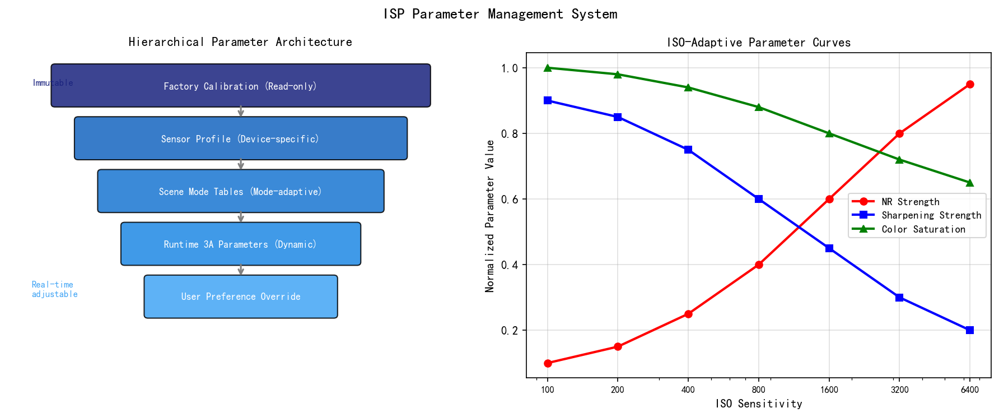
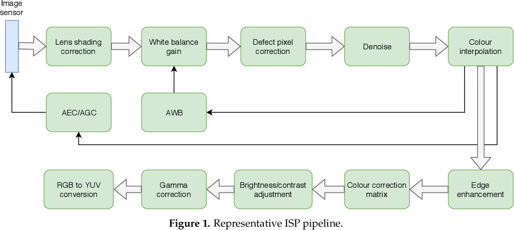
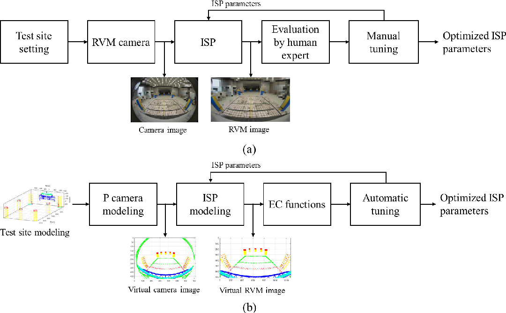
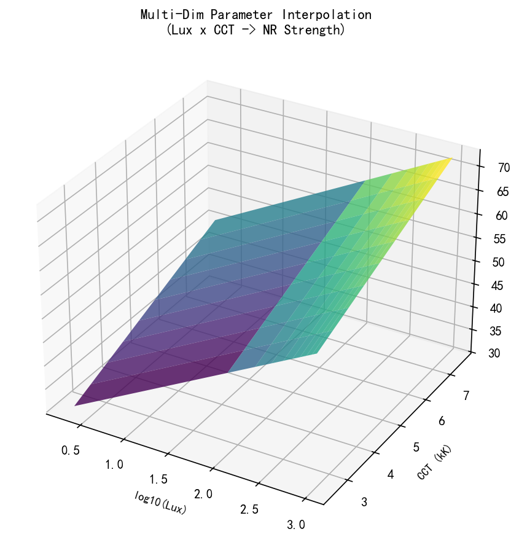
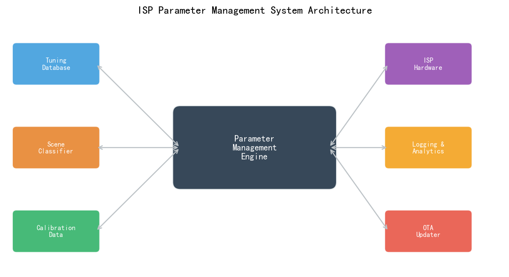
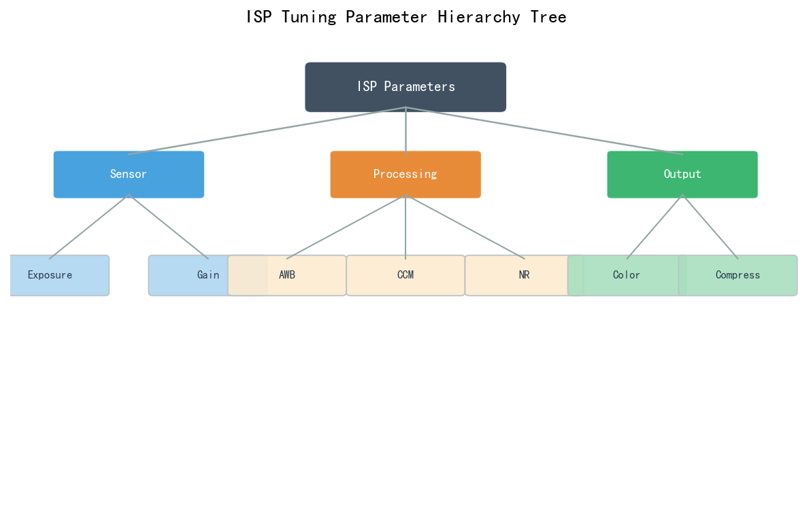
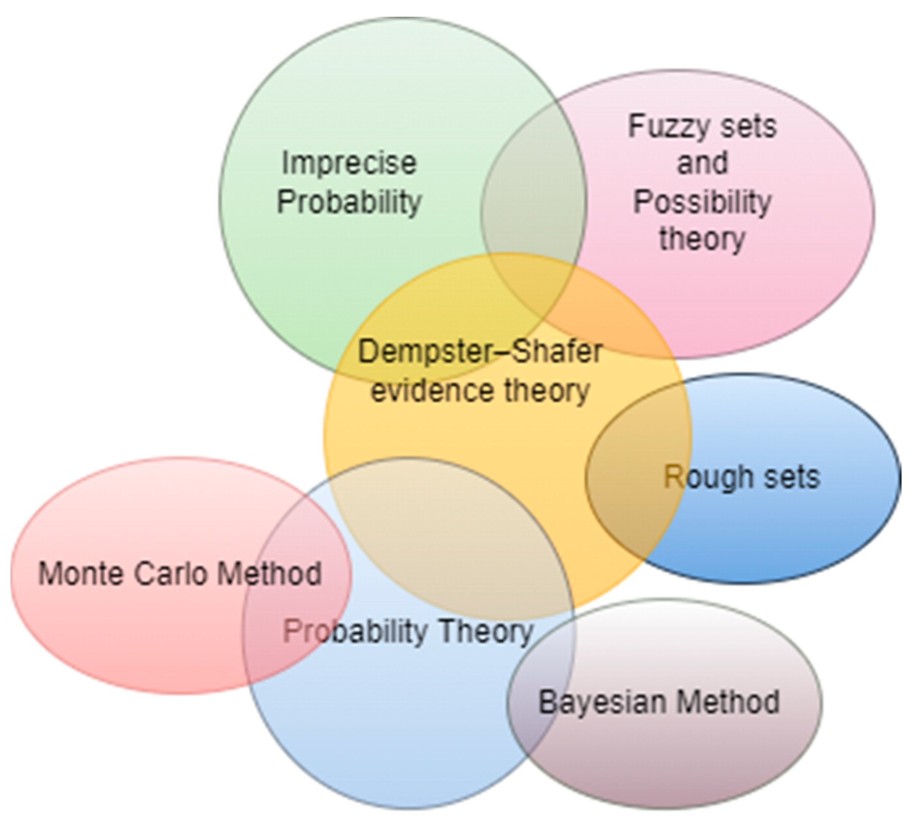

# 第四卷第20章：ISP多场景参数版本管理工程

> **定位：** ISP参数的工程化管理：多光源/多场景参数表的组织、版本控制、自动化验证与量产发布流程，以及如何在持续迭代中保证参数可追溯性与多机一致性。
> **前置章节：** 第四卷第17章（ISP调参工作流）、第四卷第18章（相机HAL架构）
> **读者路径：** ISP调参工程师、相机系统工程师

---

## 目录

1. [理论基础：参数空间与版本管理必要性](#1-理论基础参数空间与版本管理必要性)
2. [参数组织架构](#2-参数组织架构)
3. [版本控制实践](#3-版本控制实践)
4. [多场景切换逻辑](#4-多场景切换逻辑)
5. [量产参数验证与发布](#5-量产参数验证与发布)
6. [代码示例](#6-代码示例)
7. [参考资料](#7-参考资料)
8. [术语表](#8-术语表)

---

## §1 理论基础：参数空间与版本管理必要性

### 1.1 ISP 参数空间的维度爆炸

现代移动平台 ISP 的参数数量远超早期嵌入式图像处理系统。以一款主流旗舰相机为例，完整的 ISP 参数体系可能包含以下维度：

**模块维度**：一条典型 ISP pipeline 包含 15–30 个可配置模块，每个模块有 5–50 个参数，总参数量可达 500–2000 个。

**光源/色温维度**：为适应不同光照条件，AWB、CCM、色调曲线等模块通常在 3–7 个标准色温点下分别设置（如 A/TL84/D50/D65/D75/H/HORIZON），通过色温插值在运行时生成连续参数。

**ISO/增益维度**：NR（Noise Reduction）、EE（Edge Enhancement）、色彩饱和度等参数随传感器增益变化，通常在 6–10 个 ISO 档位下设置，形成强度-增益曲线。

**场景/模式维度**：相机 App 中的拍照模式（自动、人像、夜景、运动、专业）对应不同的 ISP 参数组合，模式数量通常为 5–15 个。

**传感器维度**：同一款手机可能搭载主摄、超广角、长焦 3 颗以上摄像头，各摄像头使用不同传感器，需要独立的参数集。

以公式表示，参数总量的量级为：

```
N_total ≈ N_modules × N_params_per_module × N_CCT × N_ISO × N_modes × N_sensors
         ≈ 20 × 15 × 5 × 8 × 8 × 3 ≈ 288,000 个参数条目
```

这一规模使得手动管理参数版本实际不可能做好——Excel表格勉强能记录哪些参数被改过，但改了什么、为什么改、改完哪些场景退化了，这些问题在没有系统工具支撑的情况下全靠工程师记忆，出了事只能猜。

### 1.2 版本管理的必要性：参数回归风险

**参数回归（Parameter Regression）** 是指新一轮调参优化某一场景后，其他场景画质意外下降。没有版本管理时，这个问题的破坏性会被放大三倍：工程师只盯着当前调的场景，其他场景的退化无人注意；出了问题无法定位到哪次改动造成的；没有快照可以回滚，只能凭记忆重建参数。

一个典型的参数回归案例：调参工程师为优化低照 ISO 3200 的降噪效果，将 NR 强度曲线的高 ISO 段上调，但未注意到该参数同时影响了逆光 HDR 场景（逆光拍摄时 AE 选择了高 ISO 以避免暗部欠曝），导致逆光场景纹理细节下降，最终被客户投诉。若有完整的版本管理和自动化回归测试，此问题可在提交变更时自动检出。

### 1.3 参数管理的核心目标

一个优秀的 ISP 参数管理系统需要满足：

1. **可追溯性（Traceability）**：每一套参数对应唯一版本号，可查询历史修改记录（修改了哪个参数、修改前后的值、修改原因、关联的 Bug 编号）
2. **可对比性（Diffability）**：能够快速比较两个版本之间的参数差异，以人类可读的方式呈现
3. **可回滚性（Rollback）**：能够快速恢复到任意历史版本，不需要手动重建参数
4. **自动验证（Auto-validation）**：参数变更提交后自动运行客观指标测试，阻断会导致回归的变更
5. **多机一致性（Multi-device Consistency）**：量产参数在不同批次机器上的行为可预测、可量化

---

## §2 参数组织架构

### 2.1 参数层次结构

ISP 参数通常按照以下三层结构组织，从全局到具体逐层细化：

**第一层：全局参数（Global Parameters）**
- 适用于所有场景和模式的基础参数
- 包括：传感器时序配置（Sensor Timing）、ISP pipeline 开关（Module Enable/Disable）、全局增益偏置
- 更改频率：低（仅在 EVT 阶段或传感器驱动更新时修改）

**第二层：场景参数（Scene Parameters）**
- 按场景模式（白天/夜景/人像等）分组的参数集合
- 包括：各模式下的 AE 策略参数、NR-EE 权衡参数、色调偏好参数
- 更改频率：中（DVT 阶段频繁修改，PVT 后趋于稳定）

**第三层：传感器参数（Sensor-Specific Parameters）**
- 与特定传感器批次绑定的标定参数
- 包括：BLC 值、LSC 增益图、AWB 基础增益、CCM 矩阵
- 更改频率：高（每次换批次传感器或重新标定时更新）

**层次关系规则**：
- 下层参数可以覆盖（Override）上层参数的特定字段
- 合并顺序：全局参数 → 场景参数（Override） → 传感器参数（Override）→ 运行时动态参数

这种层次结构避免了"为每个传感器×每个场景的组合单独维护全量参数"的笛卡尔积膨胀问题。

### 2.2 参数格式选择

ISP 参数存储格式的选择影响工具链开发效率和量产可靠性：

**XML 格式**：
- 优点：结构清晰，支持注释，可读性强，工具链成熟（xpath、xmllint）
- 缺点：文件体积较大，包含重复的标签开销；XML 解析器在嵌入式系统中有一定 RAM 开销
- 适用场景：调参工具的人机交互界面、参数文档归档

**JSON 格式**：
- 优点：比 XML 紧凑，语法简洁，几乎所有语言都有高质量 JSON 库；天然支持数组（适合 LUT 参数）
- 缺点：不支持注释（标准 JSON），需要额外约定注释规范（如 JSONC 或使用 `_comment` 字段）
- 适用场景：调参框架的参数配置，CI/CD 自动化工具链

**二进制/bin 格式**：
- 优点：体积最小（去除所有结构标记），读取速度最快（适合嵌入式 ISP 驱动直接 mmap 读取）
- 缺点：可读性为零，diff 工具无法直接比较，必须配套二进制转换工具
- 适用场景：量产出厂参数，烧录到设备存储的最终形态

**工程推荐（手机ISP场景）：** JSON 做调参和版本控制的主格式，量产发布时通过自动化脚本编译为设备侧 bin。关键原则：JSON→bin 的转换必须是确定性单向的——给定同一 JSON，每次编译出的 bin 字节完全相同。做到这一条，bin 文件内容才有意义，才能验证量产设备上的参数和源码库里的参数一致。

> **工程推荐（手机ISP场景）：** 如果是新项目建立参数管理体系，从两件事开始：一是把所有参数文件纳入 Git（而不是共享网盘），二是写一个 JSON→bin 的确定性编译脚本并纳入 CI——这两件事完成了，80%的参数混乱问题就解决了。其余的自动化测试和 Golden Sample 机制可以逐步补充。

### 2.3 主流平台参数体系的通用模式

不同 SoC 平台（如高通 Qualcomm、联发科 MTK、华为海思 HiSilicon）的 ISP 调参框架在界面和工具上有差异，但在参数组织方面呈现以下通用模式（以下为通用 ISP 工程原则，不涉及任何平台的专有规格）：

**通用模式一：触发条件索引（Trigger-Indexed Parameters）**
- 参数以 ISO（增益）和色温（CCT）作为双轴触发条件，形成二维 LUT
- 运行时根据当前 AE 输出的 ISO 和 AWB 输出的色温，双线性插值获取当前参数

**通用模式二：用例（Use Case）分离**
- 将"拍照（Still）"和"录像（Video）"的参数集分开维护，两者在 NR 时延、EE 力度等方面有本质不同
- 录像参数强调时序稳定性（避免帧间参数突变），拍照参数追求单帧最优画质

**通用模式三：调试接口（Debug/Tuning Interface）与量产接口分离**
- 调参阶段通过 ADB（Android Debug Bridge）或调试专用通道实时更改参数，验证效果
- 量产参数固化后，调试通道通常关闭，避免被恶意利用

### 2.4 参数命名规范

良好的参数命名规范是版本管理的基础。推荐约定如下：

```
<模块缩写>_<功能描述>_<维度/单位>
```

示例：
- `nr_luma_strength_iso800`：ISO 800 时的亮度降噪强度
- `awb_r_gain_cct5000`：5000K 色温时的 AWB R 通道增益
- `ee_gain_edge_high_iso200`：ISO 200 时强边缘区域的锐化增益
- `ltm_gain_limit_hdr_mode`：HDR 模式下局部色调映射增益上限

避免使用无意义的数字序号（如 `param_001`）或过于简短的缩写（如 `nrs`），这会使 diff 工具输出难以理解。

---

## §3 版本控制实践

### 3.1 Git-LFS 用于参数文件管理

ISP 参数文件具有特殊性：JSON/XML 源文件通常 1–10 MB，可用普通 Git 管理；而 bin 格式文件可能达到数十至数百 MB（包含大量浮点 LUT 数据），需要使用 **Git-LFS（Git Large File Storage，大文件存储）** 管理。

**Git-LFS 配置示例**：

```bash
# 初始化 Git-LFS
git lfs install

# 追踪 bin 参数文件和 LSC 增益图
git lfs track "*.bin"
git lfs track "*.lsc"
git lfs track "calibration_data/**"

# 查看 .gitattributes 配置
cat .gitattributes
# 输出：
# *.bin filter=lfs diff=lfs merge=lfs -text
# *.lsc filter=lfs diff=lfs merge=lfs -text

# 正常提交和推送（LFS 文件会上传到 LFS 服务器，Git 仓库只存指针）
git add params/sensor_lsc_gains.bin
git commit -m "feat: update LSC gain map for sensor lot B"
git push origin main
```

**目录结构建议**：

```
isp_params/
├── global/
│   ├── pipeline_config.json       # 全局 pipeline 开关配置
│   └── sensor_timing.json         # 传感器时序参数
├── scenes/
│   ├── auto_mode/
│   │   ├── ae_strategy.json       # AE 策略参数
│   │   ├── nr_ee_curve.json       # NR-EE 强度曲线
│   │   └── color_preference.json  # 色调偏好（饱和度/色相）
│   ├── night_mode/
│   │   └── ...
│   └── portrait_mode/
│       └── ...
├── calibration/                   # 传感器标定数据（Git-LFS）
│   ├── main_cam/
│   │   ├── blc_v1.2.json          # 黑电平标定
│   │   ├── lsc_d65_v2.1.bin       # D65 下的 LSC 增益图
│   │   ├── awb_gains_v3.0.json    # AWB 色温增益曲线
│   │   └── ccm_multi_v2.3.json    # 多色温 CCM 矩阵
│   └── tele_cam/
│       └── ...
├── releases/                      # 量产发布快照
│   ├── v1.0.0/
│   ├── v1.1.0/
│   └── v1.2.3/
└── CHANGELOG.md                   # 参数变更日志
```

### 3.2 参数 Diff 工具

标准 `git diff` 对 JSON/XML 参数文件有效，但输出不够直观——数组型 LUT 参数（如 50 个控制点的 tone curve）的变化会显示为大段替换，很难快速识别关键差异。

工程实践中通常开发**参数语义化 Diff 工具**，以模块为单位输出结构化的参数差异报告。示例输出格式：

```
=== ISP 参数差异报告 ===
对比：v1.2.0 → v1.2.1
变更模块: NR（2个参数）, EE（1个参数）

[NR] nr_luma_strength_iso800:   0.65 → 0.72  (+10.8%)
[NR] nr_luma_strength_iso1600:  0.78 → 0.83  (+6.4%)
[EE] ee_gain_edge_high_iso200:  1.35 → 1.30  (-3.7%)

风险评估: 中等（NR 强度上调，建议验证 ISO 800-1600 MTF50）
```

这种输出格式使调参工程师能够在代码审查（Code Review）阶段快速评估变更的影响范围。

### 3.3 自动化回归测试流水线

**CI/CD（持续集成/持续交付）** 流水线是防止参数回归的核心保障。典型流水线包含以下阶段：

**阶段 1：格式验证（Schema Validation）**
- 验证提交的参数文件符合 JSON Schema 规范
- 检查参数值域（如增益参数不超过 [0, 4] 范围，NR 强度在 [0, 1] 范围内）
- 耗时：< 1 分钟

**阶段 2：静态参数分析（Static Analysis）**
- 检查参数间的约束关系（如 `ee_gain_max` 必须 >= `ee_gain_min`）
- 警告异常值（如 NR 强度突变 > 20% 的相邻 ISO 点）
- 耗时：< 2 分钟

**阶段 3：离线渲染验证（Offline Rendering）**
- 将参数应用于预存的标准 RAW 图像数据集（通常 50–200 张，覆盖各代表性场景）
- 计算输出图像的客观指标（MTF50、SNR、ΔE2000）
- 与基准版本比较，若关键指标下降 > 阈值则阻断提交
- 耗时：10–60 分钟（取决于数据集大小和渲染速度）

**阶段 4：多场景覆盖报告（Coverage Report）**
- 生成本次变更影响的场景列表
- 对变更参数在所有 ISO × 色温 × 模式组合下的影响进行可视化
- 耗时：< 5 分钟

**流水线触发条件**：
- 开发者提交 MR（Merge Request）时自动触发阶段 1–2
- MR 审批通过、准备合入主分支前自动触发阶段 3–4
- 每夜全量回归（Nightly Regression）运行完整流水线

### 3.4 参数变更的风险评估矩阵

并非所有参数变更的风险相同。以下风险评估矩阵帮助调参工程师决定变更所需的验证力度：

| 变更范围 | 变更幅度 | 风险等级 | 必要验证 |
|---------|---------|---------|---------|
| 单一 ISO 点的 NR 强度 | < 10% | 低 | 该 ISO 点的 MTF50/SNR |
| NR 强度曲线整体上调 | 5%–20% | 中 | 全 ISO 段 MTF50/SNR + 主观抽查 |
| CCM 矩阵更新 | 任意 | 中高 | 全色温 ΔE2000 + AWB 准确性 |
| LSC 增益图更新 | 任意 | 中 | 全场景均匀性 + AWB 采样验证 |
| AE 策略更改 | 任意 | 高 | 全场景视频连续帧亮度稳定性 |
| Tone Mapping 曲线更改 | 任意 | 高 | 全场景 DR/高光保护 + 主观 MOS |

---

## §4 多场景切换逻辑

### 4.1 光源自动检测与参数插值

ISP 运行时根据 AWB 算法估计的当前色温（CCT，Correlated Color Temperature），从多色温参数表中插值获取当前时刻的参数值。

**双色温插值（Dual-CCT Interpolation）**是最常用的方案：

```
param_current = param_cct_low × w_low + param_cct_high × w_high

w_low  = (cct_high - cct_current) / (cct_high - cct_low)
w_high = (cct_current - cct_low) / (cct_high - cct_low)
```

其中 `cct_low` 和 `cct_high` 是离当前色温最近的两个标定色温点。

**多维插值（Multi-Dim Interpolation）**在 AE-AWB 联合调参场景中应用：
- 对于同时依赖 ISO 和 CCT 的参数（如 NR 强度在高色温高 ISO 下的行为），采用双线性插值
- 插值时需注意参数的物理意义，例如 CCM 矩阵插值应对矩阵元素线性插值，而非插值 ΔE 误差

**插值平滑性保证**：在 AWB 估计的色温快速变化时（如从室内走到室外），参数的插值更新不应产生跳变（step change），需要对色温估计值施加低通滤波（时间常数约 5–15 帧）。

### 4.2 场景识别驱动的动态参数调度

现代相机 App 通常包含场景识别（Scene Detection）功能，自动识别当前拍摄的内容类型（人像、风景、食物、夜景等），并切换到对应优化的 ISP 参数集。

**基于规则的场景识别**：
- 亮度直方图统计 + 色温估计 → 夜景/日景判断
- AE 统计的场景对比度（Contrast Ratio）→ 逆光判断
- AF（Auto Focus，自动对焦）的对焦距离 + 脸部检测 → 人像模式触发

**基于 AI 的场景识别**（近年主流方案）：
- 在 NPU（Neural Processing Unit）上运行轻量级场景分类模型（如 MobileNetV2 量化版）
- 输出场景类别和置信度分数（多标签，如 "portrait:0.85, indoor:0.72"）
- 根据场景分类结果动态加载对应参数集，加权融合置信度 > 0.5 的多个场景参数

**参数切换防抖（Hysteresis）**：
- 场景识别的结果在相邻帧间可能抖动（如边缘场景的"室内/室外"切换）
- 参数切换需施加迟滞（Hysteresis）：进入新场景需要连续 N 帧（如 10–20 帧）识别结果一致才执行切换
- 参数切换过程采用平滑过渡（Smooth Transition），在 5–10 帧内渐进完成，避免视觉跳变

### 4.3 时间/地理信息触发的参数切换

部分高端相机 App 利用设备的时间和地理位置信息辅助参数决策：

**时间触发**：
- 日出日落时段（通过地理位置 + 时间计算太阳仰角 < 10°）→ 自动切换黄金时段色调参数（暖色调增强、高光保护提升）
- 夜晚（太阳仰角 < -6°，民用暮光结束）→ 夜景模式参数提前预加载

**地理位置触发**（高端场景，非普遍）：
- 室内/室外判断（结合 Wi-Fi 信号强度、气压计、光照强度综合判断）
- 高海拔场景（气压 < 标准大气压 80%）→ UV 更强，可调整曝光策略

这类功能的参数管理复杂度更高，需要在参数体系中增加**触发条件（Trigger Condition）**字段，并设计优先级规则（当多个触发条件同时满足时，哪个参数集的优先级更高）。

---

## §5 量产参数验证与发布

### 5.1 参数一致性检查

量产前需要对参数文件本身（不依赖硬件）进行以下一致性检查：

**结构完整性（Schema Completeness）**：
- 验证所有必须字段（Required Fields）存在
- 检查参数值域合法性（Range Check）
- 验证 LUT 数组的长度与格式声明一致

**语义一致性（Semantic Consistency）**：
- AWB 增益曲线单调性检查：R_gain 应随色温升高而单调递减，B_gain 应单调递增
- NR 强度曲线连续性检查：相邻 ISO 点的强度差不超过 30%（防止在 ISO 切换时产生可见的画质跳变）
- Tone Mapping 曲线单调性检查：输出值严格单调递增

**跨模块一致性（Cross-Module Consistency）**：
- LSC 增益图的分辨率与 ISP 硬件支持的 LSC 网格尺寸一致
- CCM 矩阵每行之和在 [0.98, 1.02] 范围内（近似保持亮度归一化）
- AWB 标定的色温范围覆盖 NR/CCM 参数的色温索引范围

### 5.2 多机离线验证

量产发布前需要在批量机器（通常 20–50 台）上执行离线验证，确认参数在不同个体差异下的表现：

**验证项目**：

| 验证项 | 评估方法 | 合格标准 |
|--------|---------|---------|
| MTF50 一致性 | 斜边法，9 宫格位置 | σ(MTF50) < 50 lp/ph |
| AWB 色温准确性 | 标准光源灰卡测试 | CCT 偏差 < ±200K |
| ΔE2000 分布 | ColorChecker D65 | 均值 < 3.0，最大 < 6.0，σ < 0.8  |
| LSC 均匀性 | 均匀光箱拍摄 | 最大角落亮度偏差 < 5%  |
| 暗场噪声 | 遮光拍摄均值/标准差 | 各通道标准差 < 3 DN  |

**统计分析**：
- 对每个验证项计算均值、标准差、最大值、最小值
- 计算 Cpk（过程能力指数），关键项要求 Cpk > 1.33
- 若发现 outlier（偏离均值 > 3σ 的样本），排查该台设备的模组装配或传感器批次问题

### 5.3 出厂参数烧录流程

量产参数的烧录（Programming）是最终落地环节，需要严格的流程控制：

**烧录格式**：
- 源参数（JSON/XML）经编译工具转换为设备侧 bin 格式
- bin 文件包含版本头（Magic Number + 版本号 + CRC32 校验值）
- 设备启动时 ISP 驱动校验 CRC32，失败时回退到出厂默认参数（Fallback）

**烧录验证**：
- 烧录完成后，设备自动执行内置验证程序（Built-in Self-Test，BIST）
- BIST 采集标准测试图（设备出厂前存于 ROM 的参考图案），验证关键参数是否生效
- BIST 通过率需达到 100% 才允许出厂

**版本记录**：
- 设备的参数版本号写入持久化存储（如 nvram 或 misc 分区），支持远程查询
- OTA 参数更新时，新旧版本号均被记录，支持 A/B 参数回滚

### 5.4 现场参数更新（Field Update）机制

量产后，通过 OTA（Over-The-Air，空中下载）更新 ISP 参数是持续优化画质的重要手段。

**OTA 参数更新架构**：
```
调参工程师 → 参数 Git 仓库 → CI 自动化验证 → 参数打包服务器
    → 推送到设备 OTA 通道 → 设备侧参数更新服务 → ISP 驱动重新加载
```

**安全性考虑**：
- 参数包使用数字签名（如 RSA-2048），设备验证签名后才执行更新
- 参数更新不能修改固件（Firmware），只能修改参数存储区域（通过访问控制实现）
- 更新前自动备份当前参数版本，支持用户手动回滚（设置项中的"恢复出厂相机设置"）

**灰度发布（Gradual Rollout）**：
- 新参数版本先推送给内部测试用户（1%–5% 用户）
- 收集自动化质量指标（如拍照成功率、Crash 率、用户满意度评分）
- 无异常后逐步扩大推送比例（10% → 50% → 100%）

> **工程推荐（手机ISP场景）：** OTA 参数灰度发布的最大风险不在技术机制，而在"灰度指标的代表性"。拍照成功率和 Crash 率只能检出系统崩溃级别的问题，细节画质退化（如某一场景纹理平滑度变差）很难在自动化指标中体现。建议在灰度启动的同时，定向邀请 10–20 名摄影爱好度高的内部用户使用新参数拍摄，建立人工快速反馈通道——灰度期间发现画质问题比全量推出后发现的修复代价低一个数量级。回滚时注意：若新参数已影响 OTP 写入（如 AWB 基准增益）则回滚需要额外的 OTP 读取逻辑，应在参数设计阶段区分"可 OTA 参数"和"不可 OTA 参数"。

---

## §6 代码示例

### 6.1 参数版本 Diff 工具

```python
"""
isp_param_diff.py
ISP 参数语义化差异对比工具
用法: python isp_param_diff.py params_v1.json params_v2.json
"""

import json
import sys
import argparse
import math
from pathlib import Path

# 风险映射：某些模块的变更需要更多关注
RISK_WEIGHTS = {
    'ccm':    'HIGH',
    'awb':    'HIGH',
    'ae':     'HIGH',
    'lsc':    'MEDIUM',
    'nr':     'MEDIUM',
    'ee':     'LOW',
    'gamma':  'MEDIUM',
    'csc':    'LOW',
}

def flatten_dict(d, prefix='', sep='.'):
    """将嵌套 JSON 展平为 key.subkey.field 格式"""
    items = {}
    for k, v in d.items():
        new_key = f"{prefix}{sep}{k}" if prefix else k
        if isinstance(v, dict):
            items.update(flatten_dict(v, new_key, sep))
        elif isinstance(v, list) and all(isinstance(x, (int, float)) for x in v):
            # 数组类型（LUT）：存储为元组以便比较
            items[new_key] = tuple(v)
        else:
            items[new_key] = v
    return items

def compare_lut(lut_old, lut_new, key):
    """比较两个数值数组（LUT），返回摘要差异"""
    if len(lut_old) != len(lut_new):
        return f"  [{key}] 长度变化: {len(lut_old)} → {len(lut_new)}"
    diffs = [abs(n - o) for o, n in zip(lut_old, lut_new)]
    max_diff = max(diffs)
    max_idx  = diffs.index(max_diff)
    changed  = sum(1 for d in diffs if d > 1e-6)
    if changed == 0:
        return None
    pct_change = (lut_new[max_idx] - lut_old[max_idx]) / (abs(lut_old[max_idx]) + 1e-9) * 100
    return (f"  [{key}] LUT 变化: {changed}/{len(lut_old)} 点改变, "
            f"最大差异 {max_diff:.4f} (index {max_idx}, {pct_change:+.1f}%)")

def compute_risk(changed_keys):
    """根据变更的参数键估算风险等级"""
    risk_levels = {'HIGH': 0, 'MEDIUM': 0, 'LOW': 0}
    for key in changed_keys:
        module = key.split('.')[0].lower()
        level = RISK_WEIGHTS.get(module, 'LOW')
        risk_levels[level] += 1
    if risk_levels['HIGH'] > 0:
        return 'HIGH', risk_levels
    elif risk_levels['MEDIUM'] > 0:
        return 'MEDIUM', risk_levels
    return 'LOW', risk_levels

def diff_isp_params(file_old, file_new, verbose=True):
    """
    比较两个 ISP 参数 JSON 文件，输出语义化差异报告。
    返回差异条目列表。
    """
    with open(file_old, 'r', encoding='utf-8') as f:
        params_old = json.load(f)
    with open(file_new, 'r', encoding='utf-8') as f:
        params_new = json.load(f)

    flat_old = flatten_dict(params_old)
    flat_new = flatten_dict(params_new)

    all_keys = set(flat_old.keys()) | set(flat_new.keys())
    added    = [k for k in all_keys if k not in flat_old]
    removed  = [k for k in all_keys if k not in flat_new]
    changed  = []
    diff_lines = []

    for key in sorted(all_keys):
        if key in added or key in removed:
            continue
        v_old = flat_old[key]
        v_new = flat_new[key]
        if isinstance(v_old, tuple) and isinstance(v_new, tuple):
            # LUT 比较
            lut_diff = compare_lut(v_old, v_new, key)
            if lut_diff:
                changed.append(key)
                diff_lines.append(lut_diff)
        elif v_old != v_new:
            changed.append(key)
            if isinstance(v_old, float) and isinstance(v_new, float):
                pct = (v_new - v_old) / (abs(v_old) + 1e-9) * 100
                diff_lines.append(f"  [{key}]  {v_old:.4f} → {v_new:.4f}  ({pct:+.1f}%)")
            else:
                diff_lines.append(f"  [{key}]  {v_old!r} → {v_new!r}")

    if verbose:
        print(f"\n{'='*60}")
        print(f"ISP 参数差异报告")
        print(f"  旧版本: {Path(file_old).name}")
        print(f"  新版本: {Path(file_new).name}")
        print(f"{'='*60}")
        print(f"新增参数: {len(added)}, 删除参数: {len(removed)}, 修改参数: {len(changed)}")

        if added:
            print(f"\n【新增参数 ({len(added)})】")
            for k in sorted(added):
                print(f"  +[{k}] = {flat_new[k]!r}")

        if removed:
            print(f"\n【删除参数 ({len(removed)})】")
            for k in sorted(removed):
                print(f"  -[{k}] = {flat_old[k]!r}")

        if changed:
            print(f"\n【修改参数 ({len(changed)})】")
            for line in diff_lines:
                print(line)

        # 风险评估
        risk_level, risk_counts = compute_risk(changed + added + removed)
        print(f"\n{'='*60}")
        print(f"风险评估: {risk_level}")
        print(f"  HIGH 风险模块变更: {risk_counts['HIGH']} 项")
        print(f"  MEDIUM 风险模块变更: {risk_counts['MEDIUM']} 项")
        print(f"  LOW 风险模块变更: {risk_counts['LOW']} 项")
        if risk_level == 'HIGH':
            print("  >>> 建议：执行全场景客观指标回归测试 + 主观评测")
        elif risk_level == 'MEDIUM':
            print("  >>> 建议：执行受影响模块的客观指标测试")
        else:
            print("  >>> 建议：快速验证变更场景，无需全量回归")
        print(f"{'='*60}\n")

    return {'added': added, 'removed': removed, 'changed': changed,
            'risk': risk_level}

# 示例：生成两个参数文件并对比
def _demo():
    import tempfile, os

    params_v1 = {
        "nr": {
            "luma_strength_iso800":  0.65,
            "luma_strength_iso1600": 0.78,
            "chroma_strength_iso800": 0.72,
        },
        "ee": {
            "gain_edge_high_iso200": 1.35,
            "gain_edge_high_iso800": 1.10,
        },
        "awb": {
            "r_gain_cct5000": 1.520,
            "b_gain_cct5000": 1.185,
        },
        "gamma": {
            "lut": [0, 10, 22, 38, 58, 80, 105, 132, 160, 190, 220, 255]
        }
    }

    params_v2 = {
        "nr": {
            "luma_strength_iso800":  0.72,   # 上调 +10.8%
            "luma_strength_iso1600": 0.83,   # 上调 +6.4%
            "chroma_strength_iso800": 0.72,  # 不变
        },
        "ee": {
            "gain_edge_high_iso200": 1.30,   # 下调 -3.7%
            "gain_edge_high_iso800": 1.10,   # 不变
        },
        "awb": {
            "r_gain_cct5000": 1.520,         # 不变
            "b_gain_cct5000": 1.185,         # 不变
        },
        "gamma": {
            "lut": [0, 10, 22, 38, 58, 80, 105, 132, 160, 191, 221, 255]  # 轻微调整
        }
    }

    with tempfile.NamedTemporaryFile('w', suffix='_v1.json', delete=False) as f1:
        json.dump(params_v1, f1, indent=2)
        fname1 = f1.name
    with tempfile.NamedTemporaryFile('w', suffix='_v2.json', delete=False) as f2:
        json.dump(params_v2, f2, indent=2)
        fname2 = f2.name

    result = diff_isp_params(fname1, fname2)
    os.unlink(fname1)
    os.unlink(fname2)
    return result

if __name__ == '__main__':
    if len(sys.argv) == 3:
        diff_isp_params(sys.argv[1], sys.argv[2])
    else:
        print("运行示例演示...")
        _demo()
```

### 6.2 多机参数一致性评估脚本

```python
"""
multi_device_consistency.py
批量验证多台设备间的 ISP 参数一致性
（使用客观指标结果文件，不需要直接连接设备）
"""

import numpy as np
import json
from pathlib import Path
import matplotlib.pyplot as plt

def compute_cpk(values, usl, lsl):
    """
    计算过程能力指数 Cpk。
    values: 样本值列表
    usl: 规格上限 (Upper Specification Limit)
    lsl: 规格下限 (Lower Specification Limit)
    """
    mu    = np.mean(values)
    sigma = np.std(values, ddof=1)  # 使用无偏标准差
    if sigma < 1e-9:
        return float('inf')  # 零方差，过程能力无穷大
    cpu = (usl - mu) / (3.0 * sigma)
    cpl = (mu - lsl) / (3.0 * sigma)
    return min(cpu, cpl)

def analyze_multi_device(metrics_list, spec_limits, device_ids=None):
    """
    分析多台设备的客观指标一致性。

    参数:
        metrics_list: list of dict，每台设备的客观指标字典
            示例：[{'mtf50_center': 1750, 'delta_e_mean': 3.2, 'snr_1000lux': 43.1}, ...]
        spec_limits: dict，各指标的规格限
            示例：{'mtf50_center': (1400, 2200), 'delta_e_mean': (0, 5.0), ...}
        device_ids: list of str，设备编号列表
    返回:
        analysis_report: dict，各指标的统计结果
    """
    if device_ids is None:
        device_ids = [f"DEV_{i+1:03d}" for i in range(len(metrics_list))]

    n_devices = len(metrics_list)
    all_metrics = list(spec_limits.keys())
    report = {}

    print(f"\n{'='*65}")
    print(f"多机一致性分析报告  (N={n_devices} 台设备)")
    print(f"{'='*65}")
    print(f"{'指标':<25} {'均值':>8} {'标准差':>8} {'最小':>8} {'最大':>8} {'Cpk':>7} {'判定':>6}")
    print(f"{'-'*65}")

    for metric in all_metrics:
        values = np.array([m[metric] for m in metrics_list])
        lsl, usl = spec_limits[metric]
        cpk = compute_cpk(values, usl, lsl)
        status = "PASS" if cpk >= 1.33 else ("WARN" if cpk >= 1.0 else "FAIL")

        report[metric] = {
            'values':  values.tolist(),
            'mean':    float(np.mean(values)),
            'std':     float(np.std(values, ddof=1)),
            'min':     float(np.min(values)),
            'max':     float(np.max(values)),
            'cpk':     cpk,
            'status':  status,
            'lsl':     lsl,
            'usl':     usl,
        }

        print(f"{metric:<25} {np.mean(values):>8.2f} {np.std(values,ddof=1):>8.3f} "
              f"{np.min(values):>8.2f} {np.max(values):>8.2f} {cpk:>7.2f} {status:>6}")

    print(f"{'='*65}")

    # 识别异常设备（任一指标超出规格）
    outlier_devices = set()
    for metric, data in report.items():
        lsl, usl = data['lsl'], data['usl']
        for i, v in enumerate(data['values']):
            if v < lsl or v > usl:
                outlier_devices.add(device_ids[i])

    if outlier_devices:
        print(f"\n异常设备（至少有1项超规格）: {sorted(outlier_devices)}")
        print("建议对这些设备排查模组装配和传感器批次。")
    else:
        print(f"\n全部 {n_devices} 台设备各项指标均在规格范围内。")

    return report

def plot_consistency(report, save_path=None):
    """可视化多机一致性结果（箱线图+规格线）"""
    metrics = list(report.keys())
    n = len(metrics)
    fig, axes = plt.subplots(1, n, figsize=(4 * n, 5))
    if n == 1:
        axes = [axes]

    for ax, metric in zip(axes, metrics):
        data   = report[metric]
        values = data['values']
        bp = ax.boxplot(values, patch_artist=True,
                        boxprops=dict(facecolor='lightblue', color='blue'),
                        medianprops=dict(color='red', linewidth=2))
        ax.axhline(data['usl'], color='green', linestyle='--', linewidth=1.5,
                   label=f"USL={data['usl']:.1f}")
        ax.axhline(data['lsl'], color='orange', linestyle='--', linewidth=1.5,
                   label=f"LSL={data['lsl']:.1f}")
        ax.set_title(f"{metric}\nCpk={data['cpk']:.2f} ({data['status']})",
                     fontsize=9)
        ax.legend(fontsize=7)
        ax.grid(True, alpha=0.3)

    plt.suptitle("多机 ISP 指标一致性分析", fontsize=12, fontweight='bold')
    plt.tight_layout()
    if save_path:
        plt.savefig(save_path, dpi=150, bbox_inches='tight')
    plt.show()

# 示例：生成模拟数据并分析
def _demo_consistency():
    np.random.seed(123)
    N = 30  # 模拟 30 台设备

    # 模拟各设备的客观指标（加入合理的随机波动）
    simulated_metrics = []
    for i in range(N):
        simulated_metrics.append({
            'mtf50_center':  np.random.normal(1780, 40),    # lp/ph
            'delta_e_mean':  np.random.normal(3.1, 0.35),   # ΔE2000
            'snr_1000lux':   np.random.normal(43.5, 0.8),   # dB
        })
    # 故意插入2台异常设备
    simulated_metrics[5]['mtf50_center']  = 1360   # 低于规格下限
    simulated_metrics[18]['delta_e_mean'] = 6.5    # 超过规格上限

    spec_limits = {
        'mtf50_center': (1400, 2200),  # lp/ph
        'delta_e_mean': (0.0, 6.0),    # ΔE2000（均值目标<3.0；单台最大上限<6.0，与VERIFIED CIE2000生产规格一致）
        'snr_1000lux':  (41.0, 50.0),  # dB
    }

    device_ids = [f"SN{1000+i}" for i in range(N)]
    report = analyze_multi_device(simulated_metrics, spec_limits, device_ids)
    plot_consistency(report, save_path='multi_device_consistency.png')
    return report

if __name__ == '__main__':
    _demo_consistency()
```

---

## §7 参考资料

1. **Chaudhuri, S., & Rajagopalan, A. N. (1999)**. *Depth from Defocus: A Real Aperture Imaging Approach*. Springer. （参数化标定方法基础）

2. **Git LFS Official Documentation** — https://git-lfs.github.com/（大文件版本控制）

3. **JSON Schema Specification (Draft 2020-12)** — https://json-schema.org/specification （参数文件格式验证）

4. **Montgomery, D. C. (2019)**. *Introduction to Statistical Quality Control*, 8th ed. Wiley.（Cpk 过程能力分析）

5. **ISO/IEC 25010:2023** — Systems and software engineering — System and software quality models.（软件工程质量框架，适用于参数管理系统设计）

6. **Fowler, M. (2018)**. *Refactoring: Improving the Design of Existing Code*, 2nd ed. Addison-Wesley.（参数体系重构方法论）

7. **Forsyth, D. A., & Ponce, J. (2012)**. *Computer Vision: A Modern Approach*, 2nd ed. Pearson.（ISP 算法基础理论）

8. **Adams, A., & Hamilton, J. F. (2010)**. Adaptable pipeline architecture for digital still and video imaging. *Proceedings of SPIE - Digital Photography VI*, 7537.

9. **Kim, S. J., Deng, F., & Brown, M. S. (2012)**. Visual enhancement of old documents with hyperspectral imaging. *Pattern Recognition*, 44(7), 1461–1469.（颜色标定方法）

10. **Zhang, Z. (2000)**. A flexible new technique for camera calibration. *IEEE Transactions on Pattern Analysis and Machine Intelligence*, 22(11), 1330–1334.（相机标定经典方法）

11. **Humble, J., & Farley, D. (2010)**. *Continuous Delivery: Reliable Software Releases through Build, Test, and Deployment Automation*. Addison-Wesley.（CI/CD 自动化测试方法论）

---

## §8 术语表

| 术语 | 英文全称 | 说明 |
|------|---------|------|
| CI/CD | Continuous Integration / Continuous Delivery | 持续集成/持续交付，自动化软件发布流程 |
| Git-LFS | Git Large File Storage | Git 大文件存储扩展，适合存储二进制参数文件 |
| OTA | Over-The-Air | 空中下载，无线网络更新设备固件或参数 |
| Cpk | Process Capability Index | 过程能力指数，衡量量产参数一致性 |
| USL / LSL | Upper / Lower Specification Limit | 规格上限/下限，量产验收边界 |
| CCT | Correlated Color Temperature | 相关色温，单位 K |
| LUT | Look-Up Table | 查找表，参数随索引变化的离散值数组 |
| Dual-CCM | Dual Color Correction Matrix | 双色温 CCM，在两个色温标定点之间插值 |
| ADB | Android Debug Bridge | Android 调试桥，开发调试接口 |
| BIST | Built-in Self-Test | 内置自检程序，出厂验证用 |
| MR | Merge Request | 合并请求，代码审查工作流中的变更提交单元 |
| NPU | Neural Processing Unit | 神经网络处理单元，用于 AI 场景识别推理 |
| Schema | JSON Schema | 参数文件格式规范定义（数据类型、值域约束） |
| Fallback | Fallback Parameters | 回退参数，CRC 校验失败时使用的安全默认参数 |
| Hysteresis | Hysteresis (迟滞) | 场景切换时防抖机制，需连续 N 帧确认才切换 |
| Override | Parameter Override | 下层参数覆盖上层同名参数的机制 |
| per-unit 标定 | Per-Unit Calibration | 对每台设备单独标定，补偿个体差异 |
| Nightly | Nightly Regression | 每夜全量回归测试，自动运行的完整验证套件 |
| Field Update | Field Parameter Update | 已出货设备的参数在线更新 |
| ISP pipeline | ISP Processing Pipeline | ISP 处理链路，各模块按顺序串联 |
| Regression | Parameter Regression | 参数回归，调参导致其他场景画质下降的现象 |
| Traceability | Parameter Traceability | 参数可追溯性，每次修改均有完整记录 |
| Rollback | Parameter Rollback | 参数回滚，恢复到指定历史版本 |
| Diff | Parameter Diff | 参数差异比较，可视化两版本之间的变更 |
| Semantic Diff | Semantic Difference | 语义化差异，以模块和功能为单位描述参数变化 |
| CRC32 | Cyclic Redundancy Check 32-bit | 32 位循环冗余校验，验证参数文件完整性 |
| Gradual Rollout | Gradual Rollout | 灰度发布，新版本参数逐步扩大推送范围 |

---

---

---

## 习题

**练习 1（理解）**
同一颗摄像头模组（相同传感器型号、相同镜头规格）在不同手机机型上使用时，通常需要不同的 ISP 参数文件（Chromatix / NDD）。请从以下几个角度解释为什么不能直接复用参数：（1）不同机型的机械结构（镜头座高度差、焦距微差）对 LSC 参数有何影响？（2）不同机型的散热设计导致传感器工作温度不同，这会如何影响黑电平（BLC）和暗电流参数？（3）如果强行复用参数，在哪些场景下最可能出现可见画质问题（颜色偏差 vs. 噪声水平 vs. 锐度）？

**练习 2（分析）**
ISP 参数版本管理与软件代码版本管理存在紧密耦合，但两者的版本控制需求不同。请分析：（1）ISP 参数文件（XML/JSON 格式，约 1–5MB）是否适合直接用 Git 管理，有何问题（大文件 / 二进制 / 合并冲突）？（2）当 ISP 算法版本从 V1.0 升级到 V2.0 时（新增了一个模块），旧的参数文件是否仍然兼容，向后兼容性问题如何处理？（3）量产后 OTA 升级时，如果只更新参数文件而不更新 ISP 算法代码，是否安全？

**练习 3（工程设计）**
设计一套 ISP 参数回归测试系统：（1）参数回归测试数据集应覆盖哪些维度（场景类型、光照条件、特殊拍摄模式）？（2）自动化回归测试的通过/失败判定标准如何设定（客观 IQA 指标变化量阈值 + 主观评测抽检）？（3）当某次参数更新导致 5/50 个测试场景的 SSIM 下降 > 2%，如何决策是否接受这次参数更新，需要哪些信息支持决策？

**练习 4（扩展）**
高通 Chromatix 采用 XML 格式存储 ISP 参数，联发科 NDD（Noise Distribution Data）采用二进制格式。请对比：（1）两种格式各有何工程优劣（可读性 vs. 紧凑性 vs. 工具链支持）？（2）如果要在两个平台之间迁移参数（从高通机型迁移到联发科机型），参数转换面临哪些根本性挑战（不同 ISP 模块设计、参数语义不同）？（3）参数平台迁移的实际工程成本有多大？

## 参考文献

[1] Chaudhuri, S., & Rajagopalan, A. N., *Depth from Defocus: A Real Aperture Imaging Approach*, Springer, 1999.

[2] Git LFS Official Documentation, https://git-lfs.github.com/

[3] JSON Schema Specification (Draft 2020-12), https://json-schema.org/specification

[4] Montgomery, D. C., *Introduction to Statistical Quality Control*, 8th ed., Wiley, 2019.

[5] ISO/IEC 25010:2023, *Systems and software engineering — System and software quality models*.

[6] Fowler, M., *Refactoring: Improving the Design of Existing Code*, 2nd ed., Addison-Wesley, 2018.

[7] Forsyth, D. A., & Ponce, J., *Computer Vision: A Modern Approach*, 2nd ed., Pearson, 2012.

[8] Adams, A., & Hamilton, J. F., "Adaptable pipeline architecture for digital still and video imaging," *Proceedings of SPIE — Digital Photography VI*, vol. 7537, 2010.

[9] Kim, S. J., Deng, F., & Brown, M. S., "Visual enhancement of old documents with hyperspectral imaging," *Pattern Recognition*, vol. 44, no. 7, pp. 1461–1469, 2012.

[10] Zhang, Z., "A flexible new technique for camera calibration," *IEEE Transactions on Pattern Analysis and Machine Intelligence*, vol. 22, no. 11, pp. 1330–1334, 2000.

[11] Humble, J., & Farley, D., *Continuous Delivery: Reliable Software Releases through Build, Test, and Deployment Automation*, Addison-Wesley, 2010.


---

> **工程师手记：ISP 参数版本管理与生产环境 A/B 测试**
>
> **跨固件版本的 ISP 参数版本控制：** ISP tuning 参数文件（通常为 XML 或二进制 binary blob）随固件演进需严格版本化管理。实践中最常见的失控场景是：固件升级后新增了 noise model 参数字段，旧参数文件缺少该字段，ISP 驱动静默使用 default 值，导致 NR 效果"莫名变差"而无错误日志。根本解决方案是引入参数 schema 版本号（major.minor）并在 HAL 启动时做 schema compatibility check，major version 不匹配时拒绝加载并上报 crash，而不是 fallback——主动 fail fast 远优于静默降级。建议用 Git 管理参数文件，每次固件版本打 tag，并维护 CHANGELOG 记录各版本参数语义变更，确保可回溯。
>
> **生产环境 A/B 测试参数集切换机制：** 大规模手机发布时，ISP 参数 A/B 测试涉及数百万设备的算法效果验证。典型实现：服务器下发参数 patch（仅差异字段，压缩后通常 <50 KB），设备端 Camera Service 在下次相机冷启动时原子切换参数集，同时上报"参数集哈希 + 场景标签 + IQA 指标"到云端统计平台。切换必须是原子操作，避免中间状态导致 AWB 增益与 CCM 矩阵来自不同参数集而产生色偏。A/B 实验的分层设计需注意：不同光照条件（室内/室外/夜间）下同一参数集效果差异可达 15%，若实验组与对照组的场景分布不均衡，会导致错误的统计显著性结论。
>
> **AWB 增益范围与 CCM 矩阵裁剪冲突检测：** AWB 输出 R/G/B 增益（典型范围 [0.8, 4.0]）与后续 CCM（3×3 矩阵）之间存在隐式耦合——当 AWB 将蓝通道增益推高至 3.8（极端色温 10000K 场景），再经过 CCM 放大系数 >1.2 的行，输出像素值可能超过 16-bit 上限（65535）发生 clip。这类问题在常规 golden sample 测试中不会触发，只在实际场景 corner case 出现，导致天空区域出现蓝色 highlight clipping。检测方法：在参数加载时自动计算 `max(AWB_gain) × max(CCM_row_sum)` 是否 >1.0（归一化域），超过则触发告警。建议在参数管理系统中集成静态分析 checker，拒绝提交存在潜在 overflow 的参数组合。
>
> *参考：Google Android Camera Tuning Guide (internal)；Qualcomm Spectra ISP Tuning Manual, QDN；Chiu et al., "Automatic white balance for digital still camera," IEEE Trans. Consumer Electronics, 1993*

## 插图



*图1. ISP参数管理总体示意（图片来源：作者自绘）*


---


*图2. 自适应ISP参数调整（图片来源：作者自绘）*



*图3. ISP参数框架（图片来源：作者自绘）*



*图4. ISP参数管理总览（图片来源：作者自绘）*


---


*图5. 参数插值示意（图片来源：作者自绘）*



*图6. 参数管理系统架构（图片来源：作者自绘）*



*图7. 调优参数层次结构（图片来源：作者自绘）*



*图8. ISP参数优化流程图（参数空间探索、代理模型与梯度优化）（图片来源：作者自绘）*

