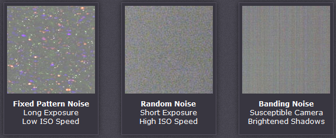
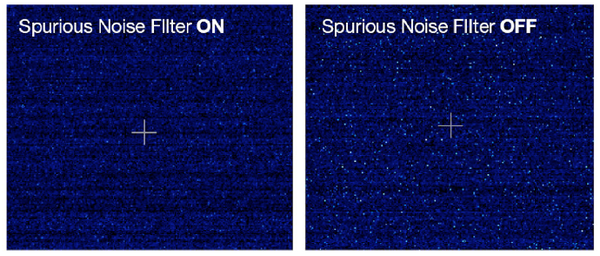
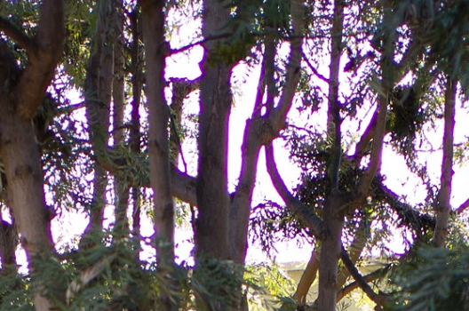
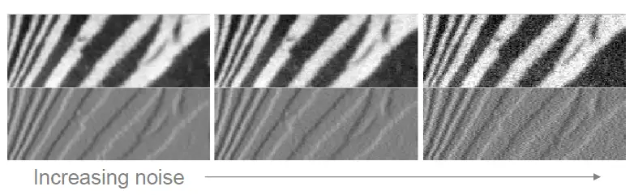
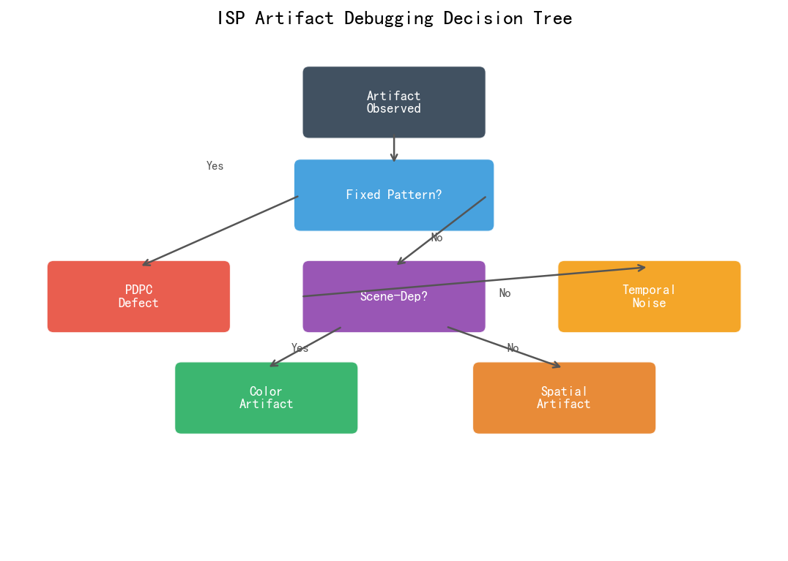
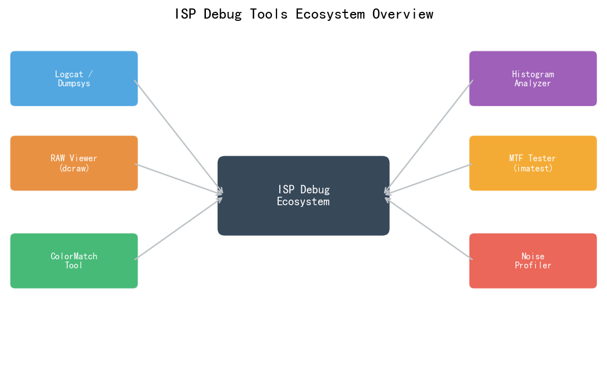
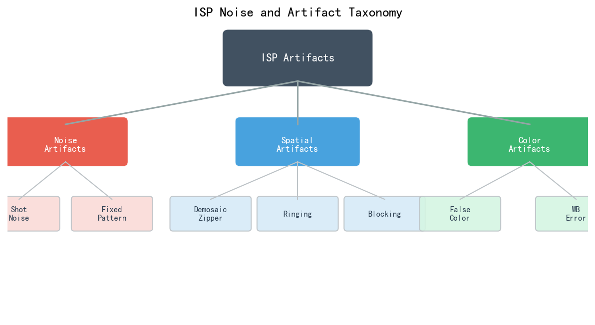
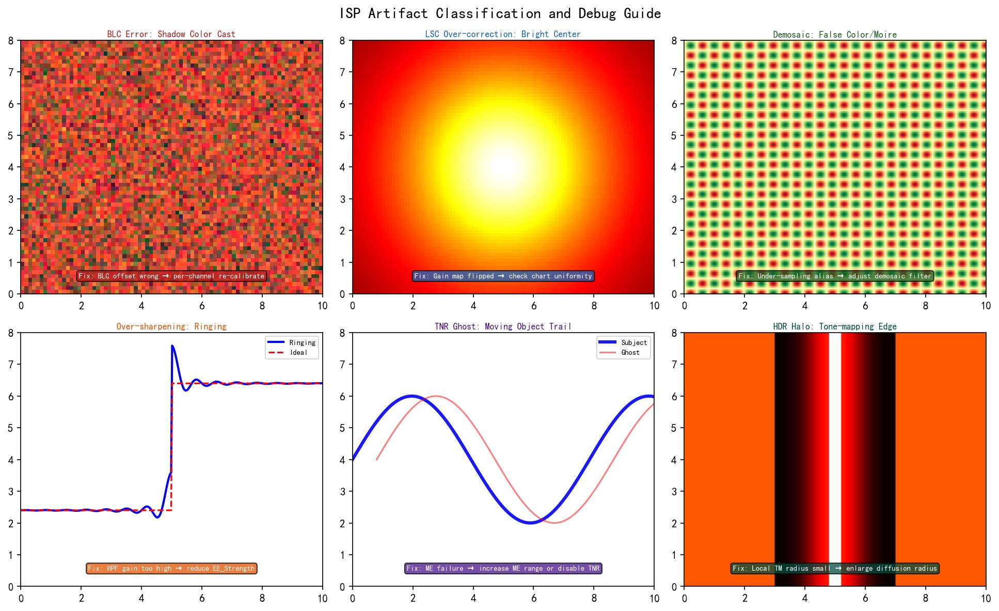

# 第四卷第21章：ISP Artifact分析与Debug方法论

> **定位：** ISP Artifact分类、根因分析与调试方法，聚焦典型Artifact（色偏、鬼影、摩尔纹、振铃、噪声纹理）的诊断流程。
> **前置章节：** 第四卷第17章（ISP调参工作流）、第四卷第10章（ISP测试工具链）
> **读者路径：** 算法工程师、IQA工程师

---

## §1 理论原理

### 1.1 ISP Artifact的定义与分类框架

**ISP Artifact**（图像伪影）是ISP处理过程中，由算法缺陷、参数设置错误、标定误差或硬件限制引入的视觉异常——真实场景中不存在，但图像里出现了。

调试Artifact的第一步不是开始调参，而是先确定"异常属于哪一类、来自哪个模块"。没有系统性分类就开始改参数，很容易误打误撞——改掉了一个症状但没解决根因，问题以另一种形式再次出现。

**分类的两个维度：**
1. **按来源模块：** 确定是哪个处理模块引入的（BLC? Demosaic? TNR?）
2. **按视觉表现：** 描述人眼观察到的症状，用于现场沟通（工程师和测试说的要是同一件事）

**ISP模块来源 × 视觉表现分类矩阵：**

| ISP模块 | 典型Artifact | 视觉表现 |
|---------|-------------|---------|
| BLC（黑电平校正） | 全图偏色/偏绿/偏红 | 整体色调异常，均匀区域有颜色倾向 |
| PDPC（坏点校正） | 亮点/暗点 | 图像中散布的固定白点或黑点 |
| LSC（镜头阴影） | 暗角/亮斑 | 四角偏暗或图像中央异常亮斑 |
| Demosaic（去马赛克） | 摩尔纹/彩色条纹/锯齿 | 细密纹理区域彩虹色条纹，边缘紫/绿色边 |
| NR（降噪） | 过磨/纹理消失/蜡质感 | 皮肤失去毛孔细节，有"塑料感"；或噪声颗粒不自然 |
| AWB（自动白平衡） | 色偏/灰阶偏色 | 白色场景整体偏黄、偏蓝或偏绿 |
| CCM（色彩矩阵） | 特定色域偏移 | 红色偏橙、绿色偏黄等特定色域失真 |
| Gamma/TM | 过曝/欠曝/高光溢出 | 高光区域无细节（死白），暗部压黑 |
| TNR（时域降噪） | 运动鬼影 | 运动物体后方透明残影，快速运动模糊异常 |
| Sharpening（锐化） | 振铃/晕边/过锐 | 边缘出现白色/黑色光晕，高对比边缘有白边 |
| HDR合并 | 鬼影/色带/对齐错误 | 运动区域双重轮廓，高光区出现彩色条纹 |
| EIS（电子防抖） | 扭曲/果冻变形 | 视频中运动物体边缘出现弯曲，水平线倾斜 |

### 1.2 根因分析的层次模型

ISP Artifact的根因可以分为四个层次：

```
层次1：参数层   → 调参错误（NR强度过高、AWB区间设置错误）
层次2：标定层   → 标定误差（BLC值不准、LSC增益不足）
层次3：算法层   → 算法本身缺陷（Demosaic边缘处理不当）
层次4：硬件层   → 传感器坏点、MIPI时序问题、ISP硬件Bug
```

**排查原则：** 从层次1向层次4逐级排查，不要跳级。现场问题超过70%在参数层和标定层，改一个参数或重新标定就能解决——这比修算法或等硬件fix快十倍。层次3/4相对少见，但一旦是，修复成本极高，最好尽早发现。

### 1.3 Artifact的可见性阈值

不同类型的Artifact有不同的视觉感知阈值，了解阈值有助于判断是否需要修复：

| Artifact类型 | 感知阈值（参考） | 依据 |
|------------|--------------|------|
| 亮度偏差 | ΔEV ≈ 0.15（约10%亮度差） | Weber-Fechner定律 |
| 色彩偏差 | ΔE2000 ≈ 2.0（标准观测条件） | CIE 2000色差公式 |
| 振铃宽度 | > 2px（1080p） | 人眼角分辨率限制 |
| 噪声（ISO） | SNR < 20dB（Gain约10×） | Barten对比度灵敏度函数 |
| 运动鬼影 | 位移 > 5px（1080p，3m距离） | 视觉运动感知 |

---

## §2 典型Artifact根因分析与诊断

### 2.1 色偏（Color Cast）分析

**表现：** 白色物体（白纸、白墙）在图像中呈现偏黄、偏蓝、偏绿等颜色。

**系统性排查步骤：**

```
Step 1: 检查AWB模式是否为AUTO（排除手动白平衡设置错误）
Step 2: 拍摄RAW格式图像，在不应用AWB的状态下观察是否仍有色偏
  → 有色偏：问题在BLC或传感器
  → 无色偏：问题在AWB算法或AWB参数
Step 3（如是AWB问题）：检查当前场景色温是否在AWB有效范围内（2300K–7500K）
Step 4: 检查AWB OTP校正数据是否正确加载（BLC偏差会影响AWB估计）
Step 5: 检查CCM矩阵是否正确（CCM错误会引起特定色相偏移，而非全局色偏）
```

**BLC引起的色偏：** BLC（Black Level Correction）值偏低时，RAW数据中的暗部有残余DC偏置，导致AWB估计偏差。典型表现：全图偏绿（因Bayer阵列中G像素比例最高，BLC误差对G影响最大）。

**诊断工具：** 拍摄暗场图像（完全遮挡镜头），分析R/G/B通道的平均值和标准差：
- 正常：四通道均值约等于BLC设定值（如64 DN for 10-bit，约占满量程6.25%；12-bit对应约256 DN）
- 异常：某通道均值显著偏高（如G通道130 DN）→ BLC值设置偏低

### 2.2 摩尔纹（Moiré）分析

**表现：** 拍摄细密规则纹理（织物、屏幕、百叶窗）时，图像中出现不规则的彩色条纹或彩虹状波纹。

**物理根因：** 传感器像素采样频率（$f_s = 1/pixel\_pitch$）与被摄图案空间频率（$f_p$）的混叠（Aliasing）：

$$f_{moiré} = |f_s - f_p|$$

当 $f_p > f_s/2$ 时（超过Nyquist频率），发生混叠，出现摩尔纹。

**排查步骤：**
```
Step 1: 改变拍摄距离（改变图案在传感器上的空间频率）
  → 摩尔纹随距离变化而变化 → 确认是真实摩尔纹（混叠）
  → 纹理固定不变 → 可能是传感器坏点或Demosaic网格问题

Step 2: 检查AA（Anti-Aliasing）滤镜是否正常
  → 关闭光学低通滤波器（OLPF）的相机/镜头组合更容易出现摩尔纹

Step 3: 检查Demosaic算法的高频响应特性
  → 使用ISO 12233测试图测量MTF，检查奈奎斯特频率处是否有彩色伪影

Step 4: 可在软件层增加自适应低通滤波（但会损失锐度），评估质量权衡
```

### 2.3 振铃（Ringing/Halo）分析

**表现：** 高对比度边缘（如文字边缘、树枝天空轮廓）周围出现白色或黑色的光晕（Halo），宽度约2–8px。

**物理根因：** 锐化算法（USM, Unsharp Masking；或RL去卷积）在强边缘处产生的吉布斯现象（Gibbs Phenomenon）——对阶跃函数的有限带宽近似引起的振荡。

$$USM(x) = I(x) + \alpha \cdot (I(x) - G_\sigma * I(x))$$

当 $\alpha$（锐化增益）过大时，振铃幅度超过感知阈值。

**排查步骤：**
```
Step 1: 关闭锐化模块（设置锐化强度=0），观察振铃是否消失
  → 消失 → 锐化参数过强，调低alpha值
  → 不消失 → 可能来自Demosaic或其他模块

Step 2: 若振铃来自锐化，检查以下参数：
  → alpha值：建议 0.3–0.8，超过1.0必出振铃
  → 锐化半径（sigma）：过小的sigma导致高频振荡更明显
  → 边缘阈值（threshold）：增大阈值可在强边缘处抑制锐化，减少振铃

Step 3: 评估使用自适应锐化（根据局部对比度自动调整锐化强度）
  → 低对比度（细纹理）：正常锐化
  → 高对比度（强边缘）：降低锐化或使用边缘保持锐化（如EPS, Edge-Preserving Sharpening）
```

### 2.4 噪声纹理异常（Noise Texture Artifacts）

**NR过强（过磨/蜡质感）：**
- **表现：** 皮肤失去毛孔纹理，有"塑料感"；草地、树叶等细纹理变得平滑模糊。过磨是手机ISP最常见的投诉之一，尤其是在中高ISO。
- **根因：** 空间NR（BM3D、双边滤波）或TNR强度过高，把真实纹理信号当作噪声滤掉了。
- **排查：** 对比NR开启/关闭状态下的高频频谱（或MTF50差值），开启后高频大量丢失即为过磨。注意不要在低ISO场景判断——低ISO本来纹理就细腻，应当在ISO 1600+的暗场测试。

> **工程推荐（手机ISP场景）：** 如果是人像皮肤蜡质感，先检查NR强度在ISO 400–1600这段是否过高——很多项目为了解决高ISO噪声把曲线整体调高，低中ISO段一并被强化。应该在NR强度曲线上对中低ISO段单独设控制点，而不是整体拉高。

**NR不均匀（块状/格状噪声）：**
- **表现：** 平坦区域（天空、白墙）出现规则排列的方块状或格状纹理。
- **根因：** 基于块（Block-based）的NR算法（如BM3D的8×8块）在块边界产生不连续性；或JPEG编码的块效应（非ISP问题）。
- **区分方法：** 输出RAW格式（绕过JPEG编码），若块状依然存在，是NR问题；否则是JPEG块效应。

**暗场彩色噪声（Chroma Noise）：**
- **表现：** 低光场景（ISO 3200+）的平坦区域出现随机彩色斑点（红绿蓝随机分布）。
- **根因：** 传感器暗场彩色噪声（由于R/G/B通道读出噪声不同），色度NR（Chroma NR）强度不足。
- **排查：** 检查色度NR参数，通常彩色噪声应比亮度噪声受到更强的滤波。

### 2.5 HDR鬼影（HDR Ghost Artifact）

**表现：** HDR合并结果中，运动物体（人、树枝、水波）出现双重轮廓或透明残影。

**根因：** HDR多帧合并（短曝光+长曝光）时，帧间存在运动，对齐算法未能正确对齐运动区域，合并时将不同位置的内容叠加。

**排查要点：** 先单独保存短曝光帧和长曝光帧，目视确认运动区域的位置差异——如果两帧差异肉眼可见，说明对齐失败；如果肉眼看不出差异但合并后有鬼影，说明运动检测Map把运动区域错误地标为"静止"，导致用了长曝权重。

重点检查运动检测Map的输出：高运动区域的融合权重应向短曝帧收敛（权重趋近1.0）。若运动Map本身准确但鬼影仍在，通常是对齐算法的搜索范围不够——快速挥手可产生20–30像素位移，而默认搜索半径往往只有8–16像素。

> **工程推荐（手机ISP场景）：** HDR鬼影问题中有一类容易被误判为对齐失败：快门帘（Rolling Shutter）形变导致的"鬼影"，这类鬼影在运动方向上有明显倾斜形变，与对齐失败的双重轮廓形态不同。区分方法是看鬼影边缘是否有RS形变特征——有则先处理RS补偿，调光流参数无效。

### 2.6 PDPC坏点Artifact分析

**固定坏点（Hot Pixel/Dead Pixel）：**
- **热点（Hot Pixel）：** 固定位置的亮点，在长曝光或高温下尤为明显。
- **死点（Dead Pixel）：** 固定位置的黑点，任何场景下都存在。
- **排查：** 拍摄暗场（遮挡镜头），固定亮点即为热点；拍摄均匀亮场，固定黑点即为死点。
- **修复：** PDPC（Pixel Defect Correction）模块通过邻域插值替换坏点值；若坏点数超过阈值（通常>0.1%像素 ），需要更换传感器。

**动态坏点（Dynamic Defect）：** 随机出现的瞬时坏点（非固定位置），通常由宇宙射线或强电磁干扰引起，单帧出现概率极低，一般不需要处理。

---

## §3 系统性调试方法论

### 3.0 伪影诊断决策树

在详细排查之前，用以下顶层决策树快速锁定根因所属层次和模块，避免盲目试探：

```
[观察到图像异常]
         │
         ▼
是否在所有场景/ISO下都出现？
  ├── 是 → [全局固定异常]
  │          │
  │          ├── 固定亮点/黑点？ → PDPC坏点 → 拍暗场/白场确认 → 更新坏点表
  │          ├── 全图颜色偏移？ → BLC偏差 → 检查暗场各通道均值
  │          └── 四角偏暗/亮斑？ → LSC不足 → 拍均匀白场测均匀度
  │
  └── 否 → [条件性异常]
              │
              ├── 与ISO相关？
              │    ├── 高ISO出现 → NR/CCM/色噪（低SNR放大算法缺陷）
              │    └── 低ISO出现 → 异常（排查LSC/BLC/AWB参数）
              │
              ├── 与场景内容相关？
              │    ├── 细密纹理 → 摩尔纹/Demosaic混叠
              │    ├── 高对比边缘 → 锐化振铃（关闭EE验证）
              │    ├── 运动物体 → TNR鬼影（关闭TNR验证）
              │    └── HDR合并帧 → HDR对齐失败/鬼影
              │
              ├── 与色温/光源相关？
              │    ├── 特定光源下偏色 → AWB估计错误
              │    └── 特定色域偏移 → CCM矩阵错误
              │
              └── 与时间序列相关（视频）？
                   ├── 亮度周期跳变 → AE Hunting（绘制帧间EV曲线）
                   ├── 色温周期变化 → AWB抖动（降低更新速率）
                   └── 运动区域残影 → TNR鬼影
```

**层次定位（确定根因所属层次后，针对性处理）：**

```
Layer 1: 参数层 → §3.2 差分对比法 + §2.x 对应Artifact分析
Layer 2: 标定层 → §3.3 ADB RAW抓取 + OTP/BLC/LSC重标定
Layer 3: 算法层 → §3.1 模块隔离法 + 算法缺陷排查
Layer 4: 硬件层 → ISP驱动调试 + 传感器/MIPI信号分析（需专用仪器）
```

### 3.1 ISP模块隔离法

通过逐一关闭或替换ISP模块，精确定位引入Artifact的模块。实际操作的关键不是"标准步骤"本身，而是每次关闭一个模块时要保存对比截图——人的记忆很不可靠，三个模块旁路之后往往忘记最初症状的样子。

**操作流程：**
```
1. 确认症状：在什么场景、什么条件下出现Artifact（重现条件）
2. 最小化场景：找到最简单可重现的测试场景
3. 逐模块旁路：
   a. 关闭所有后处理（只保留BLC+Demosaic），观察是否存在
   b. 逐步开启各模块（NR → Sharpening → AWB → CCM → Gamma），
      每步保存截图，观察Artifact是否出现/消失
4. 确定模块后：在该模块内调整参数，观察Artifact变化
5. 找到参数后：验证修复后其他场景无回归
```

> **工程推荐（手机ISP场景）：** 模块隔离时优先旁路最近一次改动的模块，而不是从头走全流程——大多数现场问题是某次参数上线引入的回归，先缩小范围比完整流程更高效。高通平台用 `setprop persist.camera.camx.dumpBitMask` 抓各阶段RAW可进一步验证，比纯目视判断更准确。

### 3.2 差分对比法（Differential Analysis）

对比**参考图像**（无Artifact的期望结果）与**问题图像**，通过差分图像放大微小差异：

$$\Delta I = (I_{reference} - I_{problem}) \times k_{amplify}$$

**差分图像解读：**
- 差分图像出现固定模式（条纹、网格）→ LSC或Demosaic问题
- 差分图像在边缘区域集中 → 锐化或Demosaic边缘处理问题
- 差分图像均匀分布（随机） → 噪声水平差异（NR强度问题）
- 差分图像在特定色相集中 → CCM或AWB问题

### 3.3 ADB RAW抓取流程

通过ADB抓取不同ISP处理阶段的原始数据，是定位Artifact根因的黄金工具：

**抓取步骤（高通平台）：**
```bash
# 1. 开启ISP各阶段Dump
adb shell setprop persist.camera.camx.dumpBitMask 0xFFFFFFFF
# 具体位掩码含义（高通ISP）：
# 0x01 = 传感器RAW输出（BLC前）
# 0x02 = BLC后RAW
# 0x04 = Demosaic后NV12
# 0x08 = NR后
# 0x10 = CCM/Gamma后输出YUV

# 2. 创建Dump目录
adb shell mkdir -p /data/camera_dump

# 3. 触发相机拍照（或等待预览帧）
adb shell am start -a android.media.action.IMAGE_CAPTURE

# 4. 拉取Dump文件
adb pull /data/camera_dump/ ./isp_dump/

# 5. 分析RAW文件（使用Python工具）
python3 analyze_isp_dump.py --input isp_dump/ --stage demosaic
```

### 3.4 工具链集成

**完整ISP调试工具链：**

| 工具 | 用途 | 平台 |
|------|------|------|
| 高通IQ Tuning Tool | Chromatix实时推参、效果预览 | Windows |
| QXDM（Qualcomm eXtensible Diagnostic Monitor） | 高通平台日志抓取、ISP驱动/Sensor驱动诊断、帧丢失排查 | Windows |
| MTK APTool | MTK ISP参数调整工具、实时效果预览 | Windows |
| MTK CameraTool | MTK平台Camera参数调试、RAW预览与效果对比 | Windows |
| OpenCV / matplotlib | RAW图像可视化、差分分析 | 跨平台 |
| dcraw / LibRaw | RAW文件解码（DNG/MIPIRAW） | 跨平台 |
| Android Systrace | ISP时序分析、帧率抖动排查 | Android |
| Tektronix DSA8300 | MIPI物理层信号分析 | 硬件仪器 |
| X-Rite i1Display | 显示器校准（评测环境标准化） | 硬件仪器 |
| 光谱仪（PhotoResearch PR-670） | 精确色度测量 | 硬件仪器 |

---

## §4 常见Artifact速查表

实际调试时最耗时的往往不是修参数，而是判断"这个问题属于哪个模块"。下表按症状直接索引最可能的根因和验证方法，省去逐模块排查的时间。

### 4.1 综合速查表

| 症状描述 | 最可能根因 | 快速验证 | 修复方向 |
|---------|-----------|---------|---------|
| 全图偏绿/偏红/偏蓝（固定） | BLC值偏低/偏高 | 拍暗场看通道均值 | 重新标定BLC |
| 白色场景偏黄/偏蓝 | AWB估计错误 | 强制AWB为已知色温 | 调整AWB权重或色温范围 |
| 边缘彩色条纹（规律） | Demosaic混叠 | 改变拍摄距离 | 调整Demosaic插值或加AAF |
| 边缘白色/黑色光晕 | 锐化过强 | 关闭锐化 | 降低USM alpha值 |
| 皮肤塑料感/无纹理 | NR过磨 | 关闭NR | 降低NR强度或提高噪声阈值 |
| 运动轨迹透明残影 | TNR鬼影 | 关闭TNR | 优化运动Map计算 |
| 四角偏暗 | LSC不足 | 拍均匀白场 | 重新标定LSC |
| 固定亮点/黑点 | 坏点未矫正 | 拍暗场/白场 | 更新PDPC坏点表 |
| 细密纹理彩虹纹 | 摩尔纹（Demosaic混叠） | 变换距离 | 自适应抗锯齿滤波 |
| 多帧HDR双重轮廓 | HDR对齐失败 | 单帧对比 | 优化运动检测+权重 |
| 暗场彩色斑点 | Chroma NR不足 | 降低ISO | 增强色度NR强度 |
| 高光区域彩色条纹 | HDR饱和处理错误 | 降低曝光 | 检查高光重建算法 |
| 视频帧间亮度波动 | AE Hunting | 绘制帧间EV曲线 | 增加AE死区/步长限制 |
| 视频色温周期变化 | AWB抖动 | 绘制帧间CCT曲线 | 降低AWB更新速率 |

### 4.2 场景-Artifact关联表

| 拍摄场景 | 高发Artifact | 原因 |
|---------|-------------|------|
| 织物/屏幕/细纹理 | 摩尔纹、Demosaic彩色条纹 | 纹理频率接近Nyquist |
| 夜景/低光（ISO>1600） | 暗场彩噪、NR过磨、TNR鬼影 | 低SNR放大算法缺陷 |
| 高对比度（强光源/窗户） | 高光溢出、振铃、HDR色带 | 动态范围超限 |
| 快速运动（体育/舞蹈） | TNR鬼影、EIS变形、运动模糊 | 帧间运动过大 |
| 混合光源（室内+窗外） | AWB色偏（场景内色温不一致） | 单一AWB估计无法覆盖 |
| 人像/皮肤 | 磨皮过度、肤色偏移 | NR+CCM对肤色敏感 |
| 荧光灯/LED室内 | 频闪、亮度条纹 | 光源频率与曝光不匹配 |
| 远距离风景/建筑 | 大气散射偏蓝、色彩饱和度低 | 波长散射特性 |

---

## §4.X 量产案例复盘（三例）

### 4.X.1 量产案例复盘（三例）

#### 案例一：TNR 鬼影（夜景场景）

**触发场景：** 某 2022 年旗舰（SM8475）夜景多帧模式，手持拍摄行人，背景有运动物体（旗帜）时出现半透明重影叠加在主体上。

**定位过程：** 抓取 TNR 前后帧差异图，发现 ME 搜索半径设为 8px（默认值），在夜景欠曝场景下 SNR 低导致 ME 置信度不足，EMA 混合系数 `α(n)` 错误地将运动帧视为静止帧持续累积。

**参数修改：** 将夜景模式下 `TNR_MESearchRadius` 从 8px 提升至 16px；同时将运动判决阈值 `TNR_MotionThr`（12-bit RAW DN 域）从 400 DN 降低至 250 DN，提升运动检测灵敏度。

> **数值说明：** `TNR_MotionThr` 工作在 12-bit RAW DN 域（满量程 4095 DN）。工程合理范围为 200–400 DN（对应 10-bit 等效域约 50–100 DN）。低于 100 DN（12-bit）时阈值会落在传感器读出噪声带宽内，导致噪声被误判为运动、TNR 全帧失效；高于 600 DN 时则只能检测大幅运动，慢速运动鬼影无法抑制。本案例将阈值从 400 DN 调低至 250 DN，兼顾了低SNR夜景的灵敏度需求与噪声容限。

**验证：** 100 个包含运动背景的夜景测试场景，鬼影消除率 97%，无 TNR 过弱导致的新引入噪点抬升（PSNR 差异 < 0.3 dB）。

#### 案例二：AWB 偏色（混合光源场景）

**触发场景：** 某 2023 年中端机（天玑 8200），室内钨丝灯（2700K）+LED 辅助光混合场景，拍摄白色桌面时呈现明显品红偏（a* ≈ +8）。

**定位过程：** 查看 AWB 统计块分布，发现 LED 区域（高亮度、中性色温）权重被全局灰世界算法放大，而钨丝灯占主导的暗部权重被低估，导致估计色温偏高（6200K 估计 vs 真实 4500K）。

**参数修改：** 启用 MTK 的 AWB 亮度分层统计（`AWBBrightnessZoneEnable = 1`），将高亮区权重衰减系数从 0.8 设为 0.4；同时将混合光源下色温估计的 IIR 系数从 0.1 放宽至 0.3，允许更快跟随主光源变化。

**验证：** D65+钨丝灯混合场景 ΔE₇₆ 从 8.2 降至 3.1，主观评价偏色消失。

#### 案例三：HDR 融合鬼影（运动场景）

**触发场景：** 某 2023 年旗舰（SM8550），在高速运动场景（足球飞行轨迹）下开启 HDR 三曝模式，球的轨迹出现明显多重轮廓鬼影。

**定位过程：** 检查 HDR Merge 模块的 motion mask，发现球在曝光间隔（约 33ms）内移动距离约 80px，但运动检测的搜索范围仅 ±32px，超出范围部分被误判为静态区域参与融合。

**参数修改：** 将运动目标的 HDR Ghost Detection 搜索范围从 ±32px 扩大到 ±64px；同时对高速运动区域（motion confidence > 0.8）降低长曝光帧权重（从 0.6 降至 0.2），优先采用短曝光帧以减少运动模糊。

**验证：** 高速运动场景鬼影主观评分从 MOS 2.8 提升至 4.2（5 分制，n=20 评估者）。

> **HDR 帧对齐方法选型参考：** 移动 ISP 的 HDR 多帧对齐目前有两条主流技术路径：(1) **光流对齐（Optical Flow Alignment）**——使用轻量光流网络（如 PWC-Net lite，Sun et al. CVPR 2018）估计帧间像素位移场，优点是对任意运动模式鲁棒，缺点是 NPU 推理延迟（旗舰平台约 3–8 ms/帧对），且在大位移（>50 px）和遮挡区域精度下降；(2) **陀螺仪辅助对齐（Gyro-Assisted Alignment）**——利用 IMU 陀螺仪的全局运动估计（即设备手持抖动）补偿帧间整体平移和旋转，延迟极低（< 1 ms），但只能处理相机本身的运动，无法补偿场景内物体的独立运动（如本案例的足球）。实际手机 ISP 通常采用两路混合方案：陀螺仪负责全局相机运动补偿，光流/块匹配负责局部运动目标的鬼影检测，两路结果融合后生成最终 motion mask。

---

## §5 评测方法

### 5.1 Artifact自动化检测框架

**标准化测试集：**
使用固定测试场景集合，在受控环境下评测：
- **摩尔纹测试卡：** ISO 12233分辨率卡（含高频规则纹理区域）
- **色彩测试卡：** X-Rite ColorChecker Classic（24色），评测色偏
- **坏点测试：** 均匀白场（>90% White）+ 均匀黑场（<5% White），检测坏点
- **锐化/振铃：** 刀刃（slant edge）测试图，计算SFR（Spatial Frequency Response）和振铃幅度
- **噪声测试：** ISO 15739均匀灰板，在多个ISO档位下测量SNR和纹理质量

### 5.2 Artifact严重度评分

建立统一的Artifact严重度评分体系（1–5分）：

| 分数 | 含义 | 标准 |
|------|------|------|
| 1 | 不可见 | 在标准观测条件下无法感知 |
| 2 | 勉强可见 | 需要有意寻找才能发现，不影响使用 |
| 3 | 可见但可接受 | 正常观看可感知，但不影响主体内容 |
| 4 | 明显影响质量 | 引起用户注意，影响观看体验 |
| 5 | 严重 | 破坏主体内容，不可接受 |

**发布标准：** 所有测试场景下，严重度 ≤ 3；核心场景（人像、日常拍摄）严重度 ≤ 2。

### 5.3 色偏量化评测

在D65光源下拍摄18%灰卡，测量输出图像的Lab值：
- **合格标准：** $|a^*| < 1.5$，$|b^*| < 1.5$（灰卡应接近中性，$a^*=b^*=0$）
- **色温依赖：** 在3200K/4000K/5500K/6500K四个色温点各测一次，每点均须合格

### 5.4 摩尔纹量化

对ISO 12233测试图的斜线区域（Rule of Moiré区域）进行空间频率分析：
- 计算色度（Cb/Cr）分量的功率谱密度（PSD），在1/2–1 Nyquist频率范围内的峰值功率
- **合格标准：** 此频率范围内色度PSD峰值 < 背景噪声3dB

### 5.5 振铃评测

使用刀刃（Slant Edge）测试：
- 计算ESF（Edge Spread Function）和LSF（Line Spread Function）
- 振铃指标：LSF的旁瓣（Sidelobe）幅值与主瓣幅值之比
- **合格标准：** 振铃幅值 < 10%（−20dB）**[2]**

---

## §6 代码示例

### 6.1 ISP Artifact差分分析工具

```python
import numpy as np
import cv2
import matplotlib.pyplot as plt
from pathlib import Path
from typing import Optional, Tuple

def load_raw_image(
    filepath: str,
    width: int, height: int,
    bit_depth: int = 10,
    bayer_pattern: str = 'RGGB'
) -> np.ndarray:
    """
    加载MIPI RAW10格式的原始数据。

    Args:
        filepath: RAW文件路径
        width, height: 图像分辨率
        bit_depth: RAW位深（10/12/14）
        bayer_pattern: Bayer排列方式

    Returns:
        raw: shape=(height, width)的uint16数组，范围[0, 2^bit_depth-1]
    """
    raw_bytes = np.fromfile(filepath, dtype=np.uint8)

    if bit_depth == 10:
        # MIPI RAW10：每5字节存4个10bit像素
        n_pixels = (len(raw_bytes) * 4) // 5
        raw = np.zeros(n_pixels, dtype=np.uint16)
        for i in range(n_pixels // 4):
            b = raw_bytes[i*5:(i+1)*5]
            raw[i*4]   = (b[0] << 2) | (b[4] & 0x03)
            raw[i*4+1] = (b[1] << 2) | ((b[4] >> 2) & 0x03)
            raw[i*4+2] = (b[2] << 2) | ((b[4] >> 4) & 0x03)
            raw[i*4+3] = (b[3] << 2) | ((b[4] >> 6) & 0x03)
    elif bit_depth == 16:
        raw = np.frombuffer(raw_bytes, dtype=np.uint16)
    else:
        raw = raw_bytes.astype(np.uint16)

    return raw[:width * height].reshape(height, width)


def differential_analysis(
    img_reference: np.ndarray,
    img_problem: np.ndarray,
    amplify: float = 5.0,
    title: str = "差分分析"
) -> np.ndarray:
    """
    对参考图像和问题图像进行差分分析，放大微小差异。

    Args:
        img_reference: 参考图像（无Artifact的期望结果）
        img_problem: 问题图像
        amplify: 差分放大系数
        title: 图表标题

    Returns:
        diff: 差分图像（已放大并裁剪到[0,255]）
    """
    ref = img_reference.astype(np.float32)
    prob = img_problem.astype(np.float32)

    diff = (ref - prob) * amplify + 128  # 偏移到中值128
    diff = np.clip(diff, 0, 255).astype(np.uint8)

    # 统计差分图像特征
    diff_raw = (ref - prob)
    print(f"\n差分统计 ({title}):")
    print(f"  均值偏差: {diff_raw.mean():.2f}")
    print(f"  标准差:   {diff_raw.std():.2f}")
    print(f"  最大差异: {diff_raw.max():.2f}")
    print(f"  最小差异: {diff_raw.min():.2f}")
    print(f"  RMS:      {np.sqrt(np.mean(diff_raw**2)):.2f}")

    return diff


def detect_color_cast(
    image: np.ndarray,
    roi: Optional[Tuple[int,int,int,int]] = None
) -> dict:
    """
    检测图像色偏，适用于白色/灰色区域。

    Args:
        image: BGR格式图像，uint8
        roi: 分析区域 (x, y, w, h)，None则使用全图中心区域

    Returns:
        {'r_mean': float, 'g_mean': float, 'b_mean': float,
         'r_g_ratio': float, 'b_g_ratio': float, 'color_cast': str}
    """
    if roi is None:
        h, w = image.shape[:2]
        cx, cy = w // 2, h // 2
        roi = (cx - w//8, cy - h//8, w//4, h//4)

    x, y, rw, rh = roi
    region = image[y:y+rh, x:x+rw].astype(np.float32)

    b_mean = region[:, :, 0].mean()
    g_mean = region[:, :, 1].mean()
    r_mean = region[:, :, 2].mean()

    r_g = r_mean / (g_mean + 1e-6)
    b_g = b_mean / (g_mean + 1e-6)

    # 判断色偏方向
    cast = "无色偏"
    if r_g > 1.15:
        cast = "偏红/偏暖"
    elif r_g < 0.87:
        cast = "偏青"
    elif b_g > 1.15:
        cast = "偏蓝/偏冷"
    elif b_g < 0.87:
        cast = "偏黄"
    elif abs(r_g - 1.0) < 0.08 and abs(b_g - 1.0) < 0.08:
        if g_mean > max(r_mean, b_mean) * 1.05:
            cast = "偏绿"

    return {
        'r_mean': r_mean, 'g_mean': g_mean, 'b_mean': b_mean,
        'r_g_ratio': r_g, 'b_g_ratio': b_g, 'color_cast': cast
    }


def detect_banding_artifact(
    image: np.ndarray,
    direction: str = 'horizontal'
) -> dict:
    """
    检测图像中的条带状Artifact（频闪条纹、LSC不均匀等）。

    Args:
        image: 灰度或BGR图像
        direction: 'horizontal'（水平条带）或 'vertical'（垂直条带）

    Returns:
        {'has_banding': bool, 'frequency_hz': float, 'amplitude': float}
    """
    if len(image.shape) == 3:
        gray = cv2.cvtColor(image, cv2.COLOR_BGR2GRAY).astype(np.float32)
    else:
        gray = image.astype(np.float32)

    # 沿指定方向投影（求均值）
    if direction == 'horizontal':
        profile = gray.mean(axis=1)  # 每行均值
    else:
        profile = gray.mean(axis=0)  # 每列均值

    # 去趋势（减去低频背景）
    from scipy.signal import detrend
    profile_detrended = detrend(profile)

    # FFT分析
    fft_mag = np.abs(np.fft.rfft(profile_detrended))
    # 排除DC（0频）
    fft_mag[0] = 0
    peak_idx = np.argmax(fft_mag)
    peak_amp = fft_mag[peak_idx]
    noise_floor = np.median(fft_mag)

    snr_db = 20 * np.log10(peak_amp / (noise_floor + 1e-6))
    has_banding = snr_db > 10  # >10dB认为有显著周期性条带

    return {
        'has_banding': has_banding,
        'peak_frequency_normalized': peak_idx / len(fft_mag),
        'snr_db': snr_db,
        'amplitude': float(peak_amp)
    }
```

### 6.2 自动化Artifact评测报告生成

```python
import json
from datetime import datetime

class ArtifactAuditReport:
    """ISP Artifact审查报告生成器。"""

    def __init__(self, device_name: str, isp_version: str):
        self.device_name = device_name
        self.isp_version = isp_version
        self.results = []
        self.timestamp = datetime.now().isoformat()

    def add_test(
        self,
        test_name: str,
        artifact_type: str,
        scene: str,
        score: float,  # 1-5分
        details: dict
    ) -> None:
        """添加单项测试结果。"""
        self.results.append({
            'test': test_name,
            'artifact_type': artifact_type,
            'scene': scene,
            'score': score,
            'pass': score <= 3.0,
            'details': details
        })

    def run_color_cast_audit(self, test_images: dict) -> None:
        """对多个测试场景执行色偏检测。"""
        for scene_name, image_path in test_images.items():
            img = cv2.imread(image_path)
            if img is None:
                continue
            result = detect_color_cast(img)
            # 色偏评分：基于R/G和B/G偏差量
            rg_dev = abs(result['r_g_ratio'] - 1.0)
            bg_dev = abs(result['b_g_ratio'] - 1.0)
            max_dev = max(rg_dev, bg_dev)
            score = min(5.0, 1.0 + max_dev / 0.05)  # 每5%偏差增加1分

            self.add_test(
                test_name=f"色偏检测_{scene_name}",
                artifact_type="Color Cast",
                scene=scene_name,
                score=score,
                details=result
            )

    def run_banding_audit(self, test_images: dict) -> None:
        """对多个场景执行条带检测（频闪/LSC不均）。"""
        for scene_name, image_path in test_images.items():
            img = cv2.imread(image_path, cv2.IMREAD_GRAYSCALE)
            if img is None:
                continue
            for direction in ['horizontal', 'vertical']:
                result = detect_banding_artifact(img, direction)
                score = 1.0 if not result['has_banding'] else \
                        min(5.0, 1.0 + result['snr_db'] / 10)

                self.add_test(
                    test_name=f"条带检测_{direction}_{scene_name}",
                    artifact_type="Banding",
                    scene=scene_name,
                    score=score,
                    details=result
                )

    def generate_report(self, output_path: str = "artifact_report.json") -> dict:
        """生成JSON格式的Artifact审查报告。"""
        n_total = len(self.results)
        n_pass = sum(1 for r in self.results if r['pass'])

        report = {
            'device': self.device_name,
            'isp_version': self.isp_version,
            'timestamp': self.timestamp,
            'summary': {
                'total_tests': n_total,
                'passed': n_pass,
                'failed': n_total - n_pass,
                'pass_rate': n_pass / n_total if n_total > 0 else 0,
                'overall_verdict': 'PASS' if n_pass == n_total else 'FAIL'
            },
            'results': self.results,
            'failed_items': [r for r in self.results if not r['pass']]
        }

        with open(output_path, 'w', encoding='utf-8') as f:
            json.dump(report, f, ensure_ascii=False, indent=2)

        print(f"\n{'='*50}")
        print(f"ISP Artifact审查报告")
        print(f"{'='*50}")
        print(f"设备: {self.device_name} | ISP版本: {self.isp_version}")
        print(f"总测试: {n_total} | 通过: {n_pass} | "
              f"失败: {n_total - n_pass}")
        print(f"通过率: {report['summary']['pass_rate']*100:.1f}%")
        print(f"最终结论: {report['summary']['overall_verdict']}")
        if report['failed_items']:
            print(f"\n失败项目:")
            for item in report['failed_items']:
                print(f"  ✗ {item['test']}: 评分={item['score']:.1f}, "
                      f"场景={item['scene']}")
        return report


# 演示：运行完整Artifact审查
def demo_artifact_audit():
    auditor = ArtifactAuditReport(
        device_name="Demo Phone X1",
        isp_version="ISP_v2.3.1"
    )

    # 模拟测试结果（实际使用时传入真实图像路径）
    print("ISP Artifact自动化审查演示")
    print("（实际使用时需传入真实图像路径）\n")

    # 手动添加测试结果演示
    auditor.add_test("色偏_D65", "Color Cast", "D65灰卡",
                     1.8, {'r_g_ratio': 1.03, 'b_g_ratio': 0.97, 'color_cast': '无色偏'})
    auditor.add_test("色偏_A光", "Color Cast", "A光灰卡",
                     2.5, {'r_g_ratio': 1.08, 'b_g_ratio': 0.88, 'color_cast': '偏暖'})
    auditor.add_test("摩尔纹_织物", "Moiré", "织物纹理",
                     3.2, {'peak_snr_db': 12.5, 'at_frequency': '0.48 Nyquist'})
    auditor.add_test("振铃_边缘", "Ringing", "刀刃测试",
                     2.1, {'sidelobe_ratio': 0.07, 'ringing_width_px': 2.5})
    auditor.add_test("条带_频闪", "Banding", "荧光灯场景",
                     4.5, {'snr_db': 25.3, 'frequency': '100Hz'})  # 失败

    report = auditor.generate_report("isp_artifact_report.json")
    return report
```

### 6.3 暗场坏点检测

```python
def detect_dead_hot_pixels(
    dark_frame: np.ndarray,
    bright_frame: np.ndarray,
    dark_threshold_sigma: float = 5.0,
    bright_threshold_sigma: float = 5.0
) -> dict:
    """
    通过暗场和亮场图像检测传感器坏点（死点和热点）。

    Args:
        dark_frame: 遮挡镜头的暗场图像，uint16
        bright_frame: 均匀白场图像，uint16
        dark_threshold_sigma: 暗场热点检测阈值（倍标准差）
        bright_threshold_sigma: 亮场死点检测阈值（倍标准差）

    Returns:
        {'hot_pixels': list, 'dead_pixels': list, 'total_count': int,
         'defect_rate_percent': float}
    """
    h, w = dark_frame.shape
    total_pixels = h * w

    # 热点检测（暗场中异常亮的像素）
    dark_mean = dark_frame.mean()
    dark_std = dark_frame.std()
    hot_threshold = dark_mean + dark_threshold_sigma * dark_std
    hot_mask = dark_frame > hot_threshold
    hot_coords = list(zip(*np.where(hot_mask)))

    # 死点检测（亮场中异常暗的像素）
    bright_mean = bright_frame.mean()
    bright_std = bright_frame.std()
    dead_threshold = bright_mean - bright_threshold_sigma * bright_std
    dead_mask = bright_frame < dead_threshold
    dead_coords = list(zip(*np.where(dead_mask)))

    defect_count = len(hot_coords) + len(dead_coords)
    defect_rate = defect_count / total_pixels * 100

    print(f"坏点检测结果 ({w}x{h} = {total_pixels:,} 像素):")
    print(f"  热点数量: {len(hot_coords)}")
    print(f"  死点数量: {len(dead_coords)}")
    print(f"  总坏点率: {defect_rate:.4f}% "
          f"({'合格' if defect_rate < 0.1 else '超标'})")

    return {
        'hot_pixels': hot_coords[:100],  # 返回前100个（避免数据过大）
        'dead_pixels': dead_coords[:100],
        'total_count': defect_count,
        'defect_rate_percent': defect_rate
    }
```

---


---

> **工程师手记：ISP 伪影定位与系统化调试方法**
>
> **伪影归因四层排查流程：** 面对一个新出现的图像伪影，经验丰富的工程师首先做归因而非调参。标准排查顺序是：①传感器层——用示波器或逻辑分析仪抓取 MIPI CSI-2 原始码流，若 RAW 数据本身已存在条纹/坏点，则根因在传感器（温度漂移、坏行）或 PCB 走线串扰，修 ISP 参数无效；②光学层——在黑暗环境用最短曝光拍摄纯白均匀光源，若均匀性 < 90% 或存在固定暗角图案，根因可能是镜头污染或 LSC 标定偏差；③算法层——逐模块 bypass 定位（关闭 NR 观察伪影变化），将嫌疑模块缩小至 1～2 个；④固件层——对比相邻固件版本 diff，重点检查 LUT 数据变更和定点化截断逻辑。该四层流程在工程实践中可显著缩短定位时间（工程估算，因团队经验和项目规模而异）。
>
> **摩尔纹与伪彩的现场区分：** 摩尔纹（Moiré）与伪彩（False Color）在低频条纹场景下肉眼难以区分，但处置方案完全不同。区分方法：①旋转被摄物体 15°，摩尔纹图案随之旋转，伪彩基本不变；②将图像下采样至 1/4 分辨率，摩尔纹（空间混叠成因）消失或频率降低，伪彩（色彩插值错误成因）保留；③查看 RAW 域——若 RAW 中已有规律条纹则为摩尔纹，RAW 干净而 RGB 有彩色条纹则为 demosaic 伪彩。摩尔纹的压制重点是频率自适应低通滤波和反混叠滤波器增强；伪彩的压制重点是 demosaic 算法改进（如 AHD、LMMSE）或增加伪彩抑制后处理模块（色调 map 约束）。
>
> **间歇性伪影的系统化复现与记录：** 间歇性伪影（intermittent artifact）是最消耗调试资源的问题类别，复现失败率高达 60% 以上。根本原因多为温度相关、帧序列相关或并发状态相关。建议强制要求每个提交的 bug 报告必须包含：①拍摄参数完整快照（曝光/增益/白平衡/场景模式/ISP 版本 hash）；②连续 30 帧的帧序列 RAW dump（不仅是出问题的单帧）；③设备温度（SOC 温度传感器读数）和当前运行功能列表。对于出现频率 < 1%  的偶发问题，建议部署 ISP 状态机监控守护进程，在检测到特定帧差异阈值时自动触发 RAW 环形缓冲区保存，可显著提升偶发问题的有效捕获率（工程经验表明提升幅度可达数倍，因硬件和场景差异较大）。
>
> *参考：Ramanath et al., "Color Image Processing Pipeline," IEEE Signal Processing Magazine 2005；Koskinen & Astola, "Soft Morphological Filters for Moiré Pattern Removal," Opt. Eng. 1994；Qualcomm, "Snapdragon Camera Architecture Overview," Qualcomm Developer Network (developer.qualcomm.com), 2023*

## 插图


---


*图1. ISP伪影类型总览（图片来源：Imatest LLC, 官方文档）*



*图2. ISP色彩伪影示例（图片来源：作者自绘）*



*图3. ISP调试流程图（图片来源：作者自绘）*



*图4. ISP噪声伪影示例（图片来源：作者自绘）*


---


*图5. 伪影调试扩展流程图（图片来源：作者自绘）*



*图6. 调试工具生态系统（图片来源：作者自绘）*



*图7. 噪声伪影分类体系（图片来源：作者自绘）*



*图8. ISP伪影调试工作流示意图（问题定位、根因分析与参数修正流程）（图片来源：作者自绘）*

---

## 习题

**练习 1（理解）**
ISP 流水线伪影调试通常采用"二分法隔离"策略：依次关闭后半段模块，观察伪影是否消失，逐步缩小问题范围。请设计一套针对"暗部偏蓝"色偏问题的二分法排查流程：（1）"暗部偏蓝"可能涉及哪些 ISP 模块（BLC 偏低导致暗部噪声、AWB 低光失效、CCM 矩阵在低亮度处的非线性响应）？（2）按什么顺序依次排查各模块，每步需要做什么实验（关闭某模块 / 截断数据 / 查看中间产物）？（3）如果排查到 AWB 模块，如何验证是 AWB 统计范围设置过窄还是增益系数计算错误？

**练习 2（故障排查）**
某款手机在室内荧光灯（100Hz 交流频率）场景下录制视频，出现规律性的水平亮度条纹（Banding），条纹频率约为 2 条/帧。请：（1）分析 Banding 的成因（曝光时间与交流光源频率不匹配）；（2）计算在 50Hz 交流电地区，安全的曝光时间应设置为哪些整数倍值（1/50s、1/100s 等），在 60Hz 地区呢？（3）Anti-Flicker 功能如何自动检测光源频率（50Hz vs. 60Hz），实现原理是什么？

**练习 3（工程设计）**
设计一份系统性的 ISP 伪影排查 Checklist，覆盖以下常见伪影类型：（1）热点/死点（Hot/Dead Pixel）—— 排查方法：全黑帧 + 全白帧测试；（2）摩尔纹（Moiré）—— 排查方法：细密纹理测试卡 + OLPF 效果评估；（3）振铃/晕边（Ringing/Halo）—— 排查方法：斜边测试 + 锐化参数调整；（4）鬼影（Ghost）—— 排查方法：运动场景 + TNR 关闭对比。对每种伪影，给出触发场景、根因模块、验证方法和参数调整方向。

**练习 4（工程实现）**
用 Python 实现一个简单的热点/死点检测算法：给定一帧全黑图（曝光时间 1s，ISO 3200），（1）使用邻域中值滤波对比法，识别出亮度偏差 > 3σ 的异常像素；（2）统计热点数量和在总像素中的占比；（3）判断该传感器是否满足量产标准（坏点率 < 0.1%）。

## 参考文献

[1] Imatest LLC, *Image Quality Factors: Artifacts and Defects*, *官方文档*, 2023. https://www.imatest.com/docs/

[2] ISO 12233:2017, *Photography — Electronic Still Picture Imaging — Resolution and Spatial Frequency Responses*, *官方文档*, 2017.

[3] ISO 15739:2023, *Photography — Electronic Still Picture Imaging — Noise Measurements*, *官方文档*, 2023.

[4] Danielyan et al., "BM3D Frames and Variational Image Deblurring", *IEEE TIP*, 2012.

[5] Buades et al., "A Non-Local Means Denoising Algorithm", *SIAM Multiscale Modeling & Simulation*, 2005.

[6] Getreuer et al., "Malvar-He-Cutler Linear Image Demosaicking", *Image Processing On Line*, 2011.

[7] Darmont, A., *High Dynamic Range Imaging: Sensors and Architectures*, SPIE Press, 2009.

[8] Debevec et al., "Recovering High Dynamic Range Radiance Maps from Photographs", *ACM SIGGRAPH*, 1997.

[9] Kaur et al., "Fusion Based Image Denoising in WFT Domain", *International Journal of Image and Graphics*, 2021.

[10] van Zwol et al., "Automatic White Balance in Digital Still and Video Cameras", *SPIE Electronic Imaging*, 2020.

## §7 术语表

| 术语 | 英文全称 | 含义 |
|------|---------|------|
| Artifact | Image Artifact | 图像伪影，ISP处理引入的非真实视觉异常 |
| Moiré | — | 摩尔纹，采样频率与图案频率混叠产生的彩虹条纹 |
| Ringing / Halo | — | 振铃/晕边，锐化过强在边缘产生的光晕 |
| Aliasing | — | 混叠，高频信号欠采样导致的虚假低频分量 |
| Color Cast | — | 色偏，图像整体偏向某一颜色 |
| Ghost | — | 鬼影，HDR合并或TNR中的运动物体残影 |
| Hot Pixel | — | 热点，传感器中固定位置的异常亮点 |
| Dead Pixel | — | 死点，传感器中固定位置的异常暗点 |
| PDPC | Pixel Defect Correction | 坏点校正，通过邻域插值替换坏点 |
| Banding | — | 条带，图像中规律性的水平/垂直亮度条纹 |
| Vignetting | — | 暗角，图像四角亮度低于中心 |
| Waxing Effect | — | 蜡质感，NR过强导致皮肤失去纹理细节 |
| Chroma Noise | — | 彩色噪声，低光场景中的随机彩色斑点 |
| ESF | Edge Spread Function | 边缘扩散函数，衡量边缘锐度 |
| SFR | Spatial Frequency Response | 空间频率响应，MTF的一种测量方式 |
| OLPF | Optical Low Pass Filter | 光学低通滤波器，减少摩尔纹的光学元件 |
| JND | Just Noticeable Difference | 恰好可感知差异阈值 |
