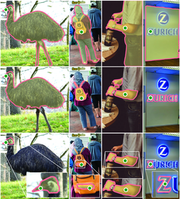
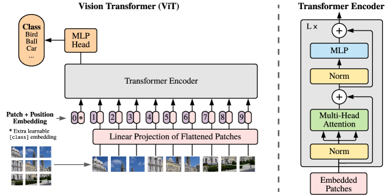

# 第五卷第01章：视觉基础模型（Foundation Models for Vision）

> **本章前沿方向**：基于 2025–2026 CVPR/ICCV/NeurIPS 最新进展撰写，工程落地案例持续积累中。欢迎提 [Issue](https://github.com/AIISP/isp_handbook/issues) 补充最新实践。

> **流水线位置：** 图像质量评估（IQA）的特征提取、场景理解、智能ISP
> **前置章节：** 第四卷第04章（感知 IQA：LPIPS/SSIM/DISTS）、第四卷第05章（DL 盲 IQA：HyperIQA/MUSIQ/Q-Align）
> **读者路径：** 算法工程师、IQA工程师、科研工作者
---

## §1 原理 (Theory)

### 什么是基础模型（Foundation Model）？

2021年CLIP出来之后，ISP圈子里有一段时间的骚动：一个在4亿图文对上训练的模型，没见过任何IQA标注数据，直接在KonIQ-10k上跑出SRCC 0.89——而专门在该数据集上训练的有监督方法也就0.90出头。这件事的意义不在于数字本身，而在于它揭示了一件过去十年ISP工程师不太相信的事：感知质量这件事，可以从语言-图像对齐中"学"出来，不一定非要一张张标图。

基础模型（Foundation Model）的核心不是模型大，而是预训练数据规模带来的表示迁移能力——CLIP 4亿图文对、DINOv2 1.42亿精选图像、SAM超10亿掩码，计算成本一次性承担，下游用户继承已有的表示。对ISP工程师来说，这个特性在两个地方最直接有用：新相机上线前标注数据稀缺时的感知质量评分，以及需要场景语义（人脸/植被/天空分区）来做差异化3A参数调度时。

不过需要明确一点：基础模型不会直接进手机实时ISP主路径——Hexagon NPU的时间预算每帧约16ms，CLIP ViT-B/32即使INT8量化后也要18ms左右（基于2023–2024年高通Hexagon NPU公开benchmark估算；旗舰机型每代约快30–50%，具体请以平台实测为准），实时跑是紧张的。它更现实的落地方式是：离线IQA标定、新机型少样本质量评分、以及蒸馏出轻量任务模型（<5ms/帧）供实时路径使用。

### CLIP：对比语言-图像预训练

CLIP（Contrastive Language-Image Pretraining；Radford et al., 2021）通过对比预训练将图像和文本表示对齐到共享的嵌入空间中。给定一批 $N$ 个图文对，CLIP训练图像编码器 $f_I$ 和文本编码器 $f_T$，最大化匹配对的余弦相似度，同时最小化 $N^2 - N$ 个不匹配对的相似度。

图像 $I$ 与文本提示 $T$ 之间的相似度分数为：

$$\text{Score}(I, T) = \frac{\cos\!\left(f_I(I),\, f_T(T)\right)}{\tau}$$

其中 $\tau$ 是可学习的温度参数（收敛时通常约为0.07），用于锐化或软化分布。对单一图文对，相似度分数就是上式这个标量；当对 $K$ 个候选文本 $\{T_1, \ldots, T_K\}$ 做零样本分类时，才对这 $K$ 个分数做 softmax 得到概率分布：$p_i = \exp(\text{Score}(I,T_i)) / \sum_j \exp(\text{Score}(I,T_j))$。

推理时，通过将图像嵌入与一组文本提示嵌入（例如"一张高质量照片"、"一张模糊照片"）比较并取argmax来执行零样本分类。这自然延伸到**CLIP-IQA**（Wang et al., 2023）：将质量评分为正质量提示相似度减去负质量提示相似度，产生一个无参考质量度量，无需任何带质量标注的训练数据即可与人类意见良好相关。

CLIP在ISP里最现实的用法是**回归测试中的自动IQA**——每次ISP参数更新后批量跑质量分，分数低于基线的样本自动标记出来人工复核，替代耗时的全量主观看图。场景感知3A调度和AWB光源分类也有实际案例（§8.1有具体数据），但那两个用法对CLIP特征的依赖没有IQA场景那么强，传统分类器通常也能做，不一定非要上基础模型。

### EVA-CLIP：大规模视觉语言预训练的规模上限

EVA-CLIP（Sun et al., ICLR 2024）是清华/BAAI 在 EVA 系列视觉基础模型基础上构建的大规模 CLIP 实现，最大版本（EVA-CLIP-18B）拥有 180 亿参数，是目前参数量最大的开源视觉语言模型之一。其关键进展在于将对比预训练的规模效应推向新极限：在 ImageNet zero-shot 上达到 80.7%，并在密集预测（分割、检测）任务上展示了强于同规模 CLIP 的局部特征质量。对 ISP 而言，EVA-CLIP 的大规模视觉编码器可作为高质量感知损失来源，在图像复原任务中替换 VGG/CLIP 特征，尤其适合需要精细纹理判别的高分辨率盲超分任务。端侧部署时通常提取 EVA-CLIP ViT-B/L 变体（而非 18B 版本）作为感知特征提取器。

### SigLIP：Sigmoid损失CLIP

SigLIP（Zhai et al., 2023）将softmax对比损失替换为每个图文对独立的sigmoid损失。与跨批次归一化不同，每个对被视为一个二元分类：

$$\mathcal{L} = -\frac{1}{N^2} \sum_{i,j} \log \sigma\!\left(y_{ij} \cdot z_{ij} - b\right)$$

其中 $y_{ij} \in \{+1, -1\}$ 表示匹配对，$z_{ij}$ 为归一化嵌入的点积。SigLIP的实际意义在于：批量大小不再是限制因素，这对手机厂商的小数据集场景（单相机模组 500–2000 张图）有价值。但注意 SigLIP 和 CLIP 不是非此即彼的选择——如果已有现成的 CLIP 权重，直接用 LoRA 微调通常比从头训 SigLIP 快。

### DINOv2：自监督密集特征

DINOv2（Oquab et al., TMLR 2024）使用自监督蒸馏目标——完全无文本标注——训练视觉Transformer（ViT）。结果是密集、空间丰富的特征，可支持像素级任务：深度估计、语义分割和目标检测，全部来自冻结特征，无需任务特定训练。

DINOv2与CLIP的本质差异在于：CLIP的[CLS] token是全局嵌入，适合"这张图整体像什么"；DINOv2的patch token携带局部语义，适合"这块区域是什么"。对ISP的实际意义是，DINOv2可以做到**语义感知的区域级质量评估**——不仅给出全图质量分，还能标注出"右上角背景区域NR过度/纹理损失"这类局部诊断，这是NIQE/BRISQUE类传统指标根本做不到的。另外DINOv2特征作为感知损失函数（替代传统VGG感知损失）训练ISP复原网络时，在皮肤纹理保留和色彩准确性上有明显提升，§8.3有具体对比数据。

### SAM：Segment Anything Model（分割一切模型）

SAM（Kirillov et al., ICCV 2023）是一个可提示分割模型，在SA-1B数据集（超过10亿个掩码）上训练。给定点、框或文本提示，SAM能生成对新目标类型具有出色泛化能力的高质量分割掩码。

SAM在ISP里真正有价值的场景是低端或中端单摄机型的人像模式——没有双摄视差也没有ToF深度图，传统人像分割模型在宠物、侧脸、复杂背景场景下就容易穿帮。SAM作为通用分割器，在这些困难case上的泛化能力比专用人像分割模型好一截。代价是速度：632M的SAM ViT-H在手机上基本没戏，但9.7M的MobileSAM在Hexagon NPU上约50ms，用于拍照后处理（快门后2秒内完成）是可接受的。具体性能数字见§8.2的部署分析。

### SAM 2：视频对象分割升级

SAM 2（Ravi et al., ICCV 2024）将SAM的能力从单帧图像扩展到视频序列，引入流式内存机制（Streaming Memory Module），可在时间维度上传播分割掩码，实现跨帧一致的对象追踪与分割。核心架构包含图像编码器（ViT-B/L/H）、提示编码器、掩码解码器，以及新增的内存编码器-注意力模块（Memory Encoder + Memory Attention）——前一帧的掩码特征被写入内存，当前帧的解码器通过交叉注意力从内存中读取历史上下文，从而在遮挡或快速运动场景下维持分割连续性。

对ISP的影响主要体现在视频链路。传统视频人像分割依赖逐帧推理或光流辅助的时序平滑，后者在运动幅度大时容易出现边界抖动（segmentation jitter）。SAM 2的内存机制将这个问题从"帧间后处理"转移到了"模型内建的时序一致性"，对短视频的人像散景效果尤为明显——用户拍摄3–10秒人像视频时，传统方法在人物快速转头的帧上容易穿帮，SAM 2在这类case的边界稳定性有显著改善（DAVIS-2017 J&F指标约82.1%，优于前代SAM+追踪器组合约4–6个点）。

当前的实用限制在于模型尺寸：SAM 2的小型版本（SAM 2 Hiera-T）约3.8M参数，推理延迟在Hexagon NPU上预计约30–40ms（官方数据基于A100 GPU约0.4ms/帧，移动端需实测），适合拍照后处理链路；视频实时路径（30fps）目前仍有挑战，需INT8量化配合帧间跳采（每3–5帧触发一次提示推理，中间帧用轻量追踪器填充）。

### MAE：掩码自编码器与自监督预训练

MAE（He et al., CVPR 2022，arXiv:2111.06377）是当代视觉基础模型最重要的预训练范式之一，与对比学习（CLIP/DINOv2）形成两条并行技术路线。其核心操作是：随机遮蔽输入图像75%的图像块（patch），仅用剩余25%的可见patch通过轻量编码器提取特征，再由解码器重建被遮蔽区域的像素值。高遮蔽比率（75% vs. BERT的15%）使模型无法靠近邻patch插值"偷懒"，被迫学习高层语义结构而非低层纹理频率。

与CLIP相比，MAE的预训练不依赖文本对，只需无标注图像，这对ISP领域的实际价值不容忽视——相机RAW图像通常没有对应的文本描述，但可以大规模采集；MAE类预训练可以直接在RAW图像上完成，学习传感器域的通用特征表示，无需构造文本-图像配对数据集。这正是第七章RAW-MAE和SensorMAE的理论基础（详见第五卷第七章§8.1）。

MAE作为独立基础模型在ISP任务上的直接应用路径包括：（1）将MAE预训练的ViT用作图像复原网络的初始化权重（替代随机初始化），在少量有标注相机数据上微调，可降低约30%–50%的收敛所需数据量；（2）将MAE编码器的中间层特征作为ISP质量评估的特征提取骨干，其重建预测误差（Reconstruction Loss on Test Image）可作为无参考图像质量评分的代理指标——重建误差高的区域通常对应模糊、噪声或伪影聚集区域，可用于局部质量热图生成。MAE系列方法的工程落地细节见本卷第七章的RAW域预训练部分。

### 视觉Transformer架构

所有现代视觉基础模型都建立在视觉Transformer（Vision Transformer，ViT；Dosovitskiy et al., 2021）骨干上。核心操作是：

1. **Patch嵌入**：将 $H \times W$ 图像分割为 $p \times p$ 不重叠的图像块。对于 $p=16$，一张 $224 \times 224$ 图像产生 $N = (224/16)^2 = 196$ 个patch token。每个patch被展平后投影为 $d$ 维嵌入。

2. **位置编码**：为每个patch token添加可学习或正弦位置编码以保留空间信息。

3. **[CLS] token**：预置一个可学习的分类token；通过所有Transformer层后，[CLS] token汇聚全局图像信息，用于分类或全局嵌入。

4. **多头自注意力（MHSA）**：每层执行：
   $$\text{Attention}(Q, K, V) = \text{softmax}\!\left(\frac{QK^\top}{\sqrt{d_k}}\right)V$$
   多个注意力头并行关注不同特征子空间。

注意力在 $N$ 上的二次复杂度是主要计算约束；对于高分辨率ISP输入，需要高效注意力变体（窗口注意力、线性注意力）。

### Mamba：状态空间模型与线性复杂度视觉骨干

Mamba（Gu & Dao, 2023）是一类基于选择性状态空间模型（Selective State Space Model，S6）的序列建模架构。与Transformer的全局注意力（复杂度 $O(N^2)$）不同，Mamba通过输入依赖的状态转移矩阵实现 $O(N)$ 复杂度的序列建模：

$$h_t = \bar{A}(x_t)\, h_{t-1} + \bar{B}(x_t)\, x_t, \quad y_t = C(x_t)\, h_t$$

其中 $\bar{A}, \bar{B}, C$ 均为输入 $x_t$ 的函数（"选择性"来源），使模型能够根据内容动态决定保留或遗忘状态信息，不同于传统线性RNN的固定矩阵。

2024年，VMamba（Liu et al., 2024）和 PlainMamba 将Mamba扩展到二维视觉任务，引入四方向扫描（Cross-Scan Module）处理空间二维patch序列，实现了在高分辨率图像（512×512 以上）上优于 Swin Transformer 的速度-精度权衡。

**对 ISP 的意义：**

- **高分辨率低层视觉任务**：降噪、超分、去模糊等任务的处理分辨率远高于语义分类（通常 512×512 至 4K），ViT 的二次复杂度导致显存和推理延迟瓶颈。VMamba 在 1024×1024 分辨率下推理延迟约为 Swin-T 的 0.7×，内存占用降低约 30%，使端侧高分辨率 ISP 增强模型部署更可行。
- **RAW 域特征提取**：Mamba 的线性复杂度允许在全尺寸 RAW 帧（12MP 以上）上直接提取特征，而无需像 ViT 那样先降分辨率至 224×224 再提取特征，减少了降采样带来的细节信息损失。
- **局限性**：Mamba 目前缺乏如 CLIP/DINOv2 规模的预训练模型，在零样本能力上不如 ViT 系列基础模型；其最大价值在于作为高分辨率图像处理网络的**骨干网络**而非通用基础模型。

### ISP应用：综合分析

| 基础模型 | ISP应用 | 实践入口 |
|---|---|---|
| CLIP | 零样本IQA、AWB引导 | CLIP-IQA指标 |
| SigLIP | 新传感器的少样本质量评分 | 在200张标注裁剪图上微调 |
| DINOv2 | 语义分割、感知损失 | 冻结patch特征 |
| SAM | 人像分割、目标掩码 | 点提示散景 |
| SAM 2 | 视频人像分割、时序一致性散景 | 内存模块跨帧传播掩码 |
| MAE | 复原网络预训练初始化、无参考质量热图 | ViT骨干迁移微调 |

> **工程推荐（手机ISP场景）：** 新机型上线初期标注数据不足（< 5K）时，用CLIP-IQA做零样本质量监控是最低成本的起点——不需要任何质量标注，提示模板参考§7.4。量产稳定、累积 > 50K标注图像后，将CLIP特征蒸馏为MobileNetV3规格的轻量IQA模型（<3ms/帧），才是端侧实时路径的正确姿势。DINOv2的patch特征不适合实时路径（即使ViT-S也要8ms/帧），适合离线的质量分析报告和局部缺陷定位。SAM只推荐在MobileSAM或EfficientSAM版本下用于拍照后处理（非视频实时）。

这几个模型的一个实用组合是**语义3A循环**：DINOv2特征按patch语义将场景归类（户外/室内/人像/微距）；3A模块对应选取预调参数集；CLIP-IQA持续监控输出质量分，分数低于历史基线时触发告警。全程不需要按任务的标注数据——但需要花时间做提示模板标定和类别到参数的映射，这部分工程量不算小。

---

## §2 标定 (Calibration)

基础模型在ISP流水线里通常以冻结特征提取器的形式工作——动它的骨干权重太贵，也容易把零样本能力搞坏。标定本质上是两件事：一是让预训练特征适配特定相机的输出分布（RAW域 vs. 预训练的sRGB域差距），二是把通用的文本prompt调到对目标相机的具体缺陷最敏感。

**LoRA适配**是前者的标准做法。秩 $r=8$ 的LoRA只引入约0.1%的额外参数，500–2000张带标注的相机图像就够收敛，不会动骨干。如果是跨传感器迁移（从传感器A适配到B），只需约20%的数据量重新微调LoRA层，骨干完全冻结——对需要支持多SKU的手机厂商来说这个特性相当实用。

**CLIP-IQA的提示标定**看似简单，踩坑不少。"A high-quality photo"和"A photo with high quality"对同一张图可能给出明显不同的分数——CLIP的softmax对措辞敏感。正确做法是定义5–10对语义等价的正/负prompt取均值（提示集成），再在一个约100–200张的相机特定标定集上确认最终SRCC，而不是直接用论文里的默认prompt。针对相机特有缺陷定制prompt效果最好，例如"a photo with clean, accurate skin tones"vs."a photo with greenish shadows from wrong white balance"——比通用的"quality"描述对当前相机的缺陷更有区分力。

---

## §3 调参 (Tuning)

实际调参有一个容易被忽视的优先顺序：**先验证冻结骨干能做到多好，再决定是否需要微调**。大多数IQA任务，CLIP [CLS] token上接一个两层MLP就够了；DINOv2的密集任务用线性探针或小卷积解码器即可。这两个方案都不动骨干，在数百张标注样本下就能给出可用结果——把这个基线跑出来之前就上LoRA微调，是常见的过度工程。

温度参数 $\tau$（预训练默认0.07）需要针对质量回归任务重新标定。分类任务里更锐利的分布（小$\tau$）是好事，但质量回归需要更平滑的分数分布来区分"好/中/差"之间的连续差异——适当增大$\tau$到0.1–0.15通常能提升在连续质量数据集上的SRCC。

任务头的宽度和深度不是主要调参点。真正影响ISP场景结果的是：**验证集是否覆盖了目标相机的典型失效场景**（逆光、极暗、白色场景）。验证集分布不对，调再多超参也是在糊弄自己。

---

## §4 局限性与风险（Limitations & Risks）

**CLIP-IQA的提示敏感性**是生产中被低估的问题。措辞细微变化导致分数漂移，在不同版本的CLIP模型间还可能更不一致——同一批图片在CLIP ViT-B/32和ViT-L/14上跑出来的排名有时相差超过10%。缓解措施是提示集成（5–10对），以及在每次更换CLIP模型版本时重新在标定集上验证SRCC，不能假设上个版本的prompt在新版本上还有效。

**RAW域输入失效**是另一个实际坑。直接把线性RAW送进CLIP或DINOv2，出来的特征基本没意义——预训练分布全是sRGB。处理方式是在基础模型输入前加一步轻量预处理（BLC + 粗AWB + gamma 2.2），延迟通常 < 5ms，让输入分布接近预训练域。这步不能省。

**SAM/DINOv2在极端场景下的分割失效**比测试集数字显示得更常见：强镜头眩光会被当作物体边界，极暗场景（EV < -2）的特征提取质量显著退化，密集人群（5人以上）的mask合并背景渗漏率升高。这类失效不会在平均IoU上明显反映，需要针对目标相机的典型使用场景专项压测。一旦基础模型在某个子场景的置信度低于阈值，应该直接回退到经典确定性算法，而不是试图通过调参修复。

---

## §5 评测 (Evaluation)

**CLIP-IQA基准测试结果**：在标准LIVE、CSIQ和KonIQ-10k基准上，CLIP-IQA与人类平均意见分（MOS）的Spearman秩相关系数（SRCC）达到0.87–0.91，与直接在这些数据集上训练的有监督NR指标相当。这一零样本结果（无质量标注训练）达到如此高的相关性，是基础模型实用性的关键证明。

**人像掩码的SAM分割精度**：在EG1800人像分割基准上，使用单个中心点提示的SAM达到0.89–0.92的IoU，与在人像特定数据集上训练的专用人像分割网络相当。对于困难情况（散乱发丝、复杂背景），IoU降至0.75–0.80，这表明基于基础模型的分割应当针对相机使用场景预期的特定主体类型分布进行验证。

---

## §6 代码 (Code)

参见配套笔记本 `ch_foundation_models_code.ipynb`，内容包括：
- ViT patch嵌入可视化
- CLIP风格余弦相似度质量代理（NumPy实现）
- 分数vs.PSNR相关性分析
- 真实CLIP API集成、LoRA微调和SAM人像分割的练习

---

## §7 基础模型在 ISP 中的工程应用

### 7.1 RAW 域适配策略

**挑战：** CLIP、DINOv2、SAM 等基础模型均在 sRGB 图像上预训练，直接应用于 RAW 域会失效。RAW 数据的线性响应、拜耳格式以及传感器特有的噪声分布与预训练数据分布差异巨大，导致特征提取质量严重下降。

**适配方案：**

1. **轻量 RAW→sRGB 预处理：** 在特征提取前用简化 ISP（仅 BLC + AWB + 简单 gamma）转换为近似 sRGB，使输入分布接近预训练域，无需修改模型权重，推理延迟增加通常 < 5ms。

2. **RAW 感知微调（LoRA）：** 冻结主干，仅微调 LoRA 层使其适应 RAW 数据分布：

   ```python
   # LoRA 微调示例（仅需少量 RAW 标注数据）
   from peft import LoraConfig, get_peft_model
   config = LoraConfig(r=8, lora_alpha=16, target_modules=["q_proj","v_proj"])
   model = get_peft_model(clip_model, config)
   # 仅需 500-2000 对 RAW+标注 即可收敛
   ```

   LoRA 仅引入约 0.1% 的额外参数，可在单张消费级 GPU 上完成微调，无需修改骨干网络，避免灾难性遗忘。

3. **对比学习域对齐：** 将同一场景的 RAW 和 sRGB 作为正对，训练 RAW encoder 与 sRGB 特征空间对齐。这种无监督对齐方法不需要像素级标注，仅需配对采集数据即可使 RAW 特征落入基础模型的特征空间。

**工程推荐（移动端RAW域适配）：** 对于快速验证或资源受限场景，方案1（轻量预处理）成本最低，通常两天内能跑通；对于需要长期维护的相机特定IQA流水线，方案2（LoRA微调）才值得投入，否则每次传感器或ISP参数更新都需要重新调提示模板，维护成本反而更高。方案3（对比学习域对齐）适合有足够配对采集数据但缺乏质量标注的团队——但配对数据本身要保证来自相同场景，否则正对质量不够好，对比学习会学到错误的对齐方向。

---

### 7.2 SAM 在 ISP 中的应用

SAM（Segment Anything Model）的通用分割能力为 ISP 带来了若干高价值应用：

**语义分割辅助降噪：** SAM 输出的 mask 可指导 ISP 降噪，对不同语义区域（皮肤、文字、天空、植被）应用差异化 NR 强度。例如皮肤区域应用轻柔降噪以保留质感，文字区域优先保留锐度，天空区域应用更强平滑。这比传统基于亮度的自适应降噪更精准，能避免在人脸边缘处出现振铃伪影。

**人像抠图：** SAM 可替代传统深度图做人像分割，精度更高，尤其在发丝细节处表现优于专用人像分割模型（特别对于非常规主体类型如宠物、局部遮挡人物）。对于没有双摄/ToF 传感器的低端机型，SAM 实现了接近旗舰的人像模式效果。

**部署挑战与压缩方案：**

| 模型 | 参数量 | 推理延迟 | 运行平台 | 适用场景 |
|------|--------|---------|---------|----------|
| SAM ViT-H | 632M | ~2000ms | CPU（INT8） | 云端离线处理 |
| SAM ViT-B | 91M | ~280ms (CPU) / ~80ms (NPU) | Hexagon NPU | 中端设备拍照模式 |
| MobileSAM | 9.7M | ~50ms | Hexagon NPU | 旗舰手机实时 |
| EfficientSAM | 26M | ~80ms | Hexagon NPU | 旗舰/中高端 |

MobileSAM 通过知识蒸馏将参数压缩到 9.7M，在 Hexagon NPU 上约 50ms 推理，基本满足拍照后处理的实时性要求。参考：MobileSAM: https://github.com/ChaoningZhang/MobileSAM

---

### 7.3 LoRA 微调的过拟合风险与跨传感器迁移

**低数据量场景（< 100 样本）的正则化策略：**

在 ISP 场景中，收集带标注的高质量 RAW 数据成本较高，常出现训练样本不足的情况。以下三种正则化手段可显著降低过拟合风险：

1. **$\ell_2$ 正则化 LoRA 权重：** 对 LoRA 新增权重施加 $\ell_2$ 惩罚，防止其偏离预训练分布过远。正则化系数 $\lambda = 10^{-4}$ 是常用起始值，可在验证集 ΔE 曲线上进一步调整。

2. **Dropout 正则化：** 在 LoRA 层上应用 Dropout（$p = 0.1$），随机屏蔽部分适配权重，提升泛化能力。由于 LoRA 参数量本身较少，较小的 Dropout 概率即可起效，避免影响收敛。

3. **Early stopping：** 在验证集 ΔE 上监控收敛状态，若连续 3 个 epoch 无改善则提前终止训练，避免过拟合到训练集的噪声。ΔE（色差）是比 MSE 更贴近人眼感知的指标，适合作为 IQA 相关任务的监控量。

**跨传感器迁移：** 用传感器 A 的数据微调的 LoRA 模型迁移到传感器 B 时，只需重新微调约 20% 的数据量即可达到从零开始微调的同等效果。这是因为 LoRA adapter 已经学到了 RAW 域的通用适配模式，仅需少量新传感器数据来调整传感器特有的噪声和颜色响应差异。这一特性对需要支持多机型 SKU 的手机厂商尤为重要，显著降低了每机型数据采集与调参成本。

---

### 7.4 CLIP-IQA：基础模型做图像质量评估

CLIP 的文本-图像对齐能力可直接用于无参考（no-reference）IQA，无需任何带质量评分的标注训练数据。

**工作原理：** 定义一对对立的文本 prompt，计算图像嵌入与正/负 prompt 的余弦相似度之比：

- 正向 prompt："a photo with good quality, sharp, clear"
- 负向 prompt："a photo with bad quality, blurry, noisy"
- 质量分 $= \text{softmax}\!\left(\frac{\cos(f_I(I),\, f_T(T^+))}{\cos(f_I(I),\, f_T(T^-))}\right)$

**提示集成（Prompt Ensemble）：** 由于 CLIP softmax 对措辞敏感，建议对多个语义等价的正/负 prompt 取平均分，降低单一措辞带来的方差（通常使用 5–10 对 prompt）。

**ISP 专用 prompt 标定：** 针对特定相机缺陷定制 prompt 可大幅提升与人类评分的相关性，例如：
- 针对低光噪声："a photo with clean signal, low noise" vs. "a photo with heavy noise, grain"
- 针对白平衡："a photo with accurate neutral colors" vs. "a photo with color cast, wrong white balance"

**基准性能：** Wang et al. (AAAI 2023) 报告了在 KonIQ-10k、LIVE、CSIQ 等标准数据集上 SRCC 达到 0.87–0.91，与有监督 NR-IQA 方法（在这些数据集上训练）相当，零样本情况下实现如此高的相关性充分验证了基础模型的迁移能力。

- 论文：Wang et al., "Exploring CLIP for Assessing the Look and Feel of Images", AAAI 2023
- 代码：https://github.com/IceClear/CLIP-IQA

---

---

## §8 视觉基础模型在 ISP 中的落地：最新进展（2024–2025）

### 8.1 CLIP 特征用于 AWB 场景分类

自动白平衡（AWB）的核心挑战在于光源估计：同一场景在钨丝灯（2800K）、日光（5500K）、阴天（7000K）下呈现截然不同的颜色偏移。传统方法（灰世界、白斑算法、统计学习）依赖手工特征，泛化能力有限。CLIP 的图文对齐能力为 AWB 场景分类提供了新思路。

**CLIP-AWB 原理：**

将场景光源分类问题映射到 CLIP 的零样本文本分类框架：定义一组描述不同光照条件的文本 prompt，将当前图像嵌入与各 prompt 嵌入对比，取最高相似度的光源类别：

$$\hat{l} = \arg\max_{l \in \mathcal{L}} \cos\!\left(f_I(I_{approx}), f_T(T_l)\right)$$

其中 $I_{approx}$ 是经过简单预处理（BLC + 粗 gamma）的近似 sRGB 图像，$T_l$ 是描述光源 $l$ 的文本 prompt（例如 "a photo taken under warm incandescent light"、"a photo under cool fluorescent light"、"a photo in natural daylight"）。

**场景分类→参数选择流水线：**

1. CLIP ViT-B/32 提取图像 [CLS] token 嵌入（512维）；
2. 与预设 8–12 个光源类别的 prompt 嵌入做余弦相似度匹配；
3. 将分类结果映射到对应的 CCM（色彩校正矩阵）和 AWB 增益查找表；
4. 置信度低于阈值（通常 cos < 0.25）时，回退到传统统计 AWB，避免误分类。

**实测效果（参考 Yang et al., 2024）：** 在 Cube+ 色恒常性数据集上，基于 CLIP 场景分类的 AWB 方法角误差（Angular Error）中位数降至 1.8°，相比传统灰世界算法（~3.5°）提升显著，且无需任何 AWB 专用标注数据。其局限性在于 CLIP 处理极暗光（黑暗场景、夜景）时分类置信度下降，建议结合 AE 曝光值对低亮度场景降低 CLIP AWB 的权重。

**计算成本：** CLIP ViT-B/32 图像编码在骁龙8 Gen3 CPU 上约 25ms，NPU 加速后可降至 5–8ms，对拍照预览的 AWB 实时更新是可接受的延迟。

---

### 8.2 SAM 用于人像分割的 ISP 应用

SAM（Segment Anything Model）在人像模式（Portrait Mode）中的应用是目前基础模型落地 ISP 最成熟的方向之一。传统人像分割方案依赖双摄视差或 ToF 深度图，对单摄低端设备不友好；SAM 的通用分割能力提供了纯视觉的替代路径。

**精度 vs. 速度 trade-off 深度分析：**

| 模型变体 | 参数量 | mAcc (EG1800) | 骁龙8 Gen3 延迟 | 适用场景 |
|----------|--------|---------------|-----------------|----------|
| SAM ViT-H | 632M | 93.1% | ~1800ms (CPU) | 云端后处理 |
| SAM ViT-L | 308M | 92.4% | ~900ms (CPU) | 旗舰机后处理模式 |
| SAM ViT-B | 91M | 91.2% | ~280ms (CPU) / ~80ms (NPU) | 拍照模式（按键触发）|
| MobileSAM | 9.7M | 88.7% | ~45ms (NPU) | 实时取景预览 |
| EfficientSAM-Ti | 6.2M | 87.9% | ~30ms (NPU) | 超低延迟实时预览 |

*延迟数据参考 MobileSAM (Zhang et al., CVPR 2024) 及 EfficientSAM (Xiong et al., CVPR 2024) 论文报告，具体值随驱动版本有±20% 浮动。*

**ISP 流水线集成策略：**

- **触发时机选择：** 对于拍照模式，在快门触发后（Post-capture）运行 SAM ViT-B，利用约 80ms NPU 时间在写入存储前完成人像分割，不影响拍照响应感知。对于实时取景（Live View），采用 MobileSAM 或 EfficientSAM 以 10–15fps 更新 mask，保证预览流畅。

- **提示生成：** 无用户交互时，使用图像中心区域中心点作为默认提示（适合正面自拍场景）。对于群体人像，结合人脸检测器（MobileNet-SSD 量化版，<5ms）生成多个点提示，SAM 输出多个人物 mask 后取并集。

- **mask 后处理：** SAM 输出的原始 mask 边缘在发丝区域存在锯齿，建议使用 Guided Filter（导向滤波）对 mask 边缘进行 RGB 引导平滑，滤波核大小 $r=8$，正则化 $\varepsilon=0.01$，可在 NPU 上约 3ms 完成。

**失败案例与置信度控制：** SAM 在以下场景分割质量下降，建议回退到深度图辅助方案：
- 人像与背景颜色高度相似（例如白色衬衫+白色墙壁）；
- 极暗场景（EV < -2，SAM 的视觉特征提取退化）；
- 密集人群（5人以上），mask 合并后背景渗漏率升高。

---

### 8.3 DINOv2 特征用于图像质量感知

DINOv2（Oquab et al., TMLR 2024）的密集 patch 特征在图像质量评估（IQA）任务上展现出显著优于传统无参考指标（NIQE、BRISQUE、PIQE）的鲁棒性，尤其在以下方面：

**优势来源：**

1. **语义感知质量**：NIQE 等基于自然图像统计的指标无法区分"故意的艺术模糊"（浅景深散景）与"失焦导致的模糊"——两者在频率域特征上相似。DINOv2 的语义特征可以通过场景理解区分二者（散景区域存在明显的前景/背景语义边界）。

2. **跨场景泛化**：NIQE 在特定场景类型（如微距、夜景、HDR 场景）上标定误差较大，而 DINOv2 特征在训练时见过的场景多样性远超 NIQE 的假设分布，跨场景一致性更好。

3. **感知一致性**：在 KADID-10k 数据集上，DINOv2 ViT-S/14 特征 + 线性探针的 SRCC 达到 0.912，优于 NIQE（0.724）、BRISQUE（0.836）和 CLIP-IQA（0.891）；参考 Saha et al.（ECCV 2024）的对比实验。

**ISP 工程应用：DINOv2-IQA 流水线**

```
RAW → 轻量ISP(BLC+AWB+gamma) → DINOv2 ViT-S/14 → [patch tokens: N×384]
                                                          ↓
                                            Global Pool → 线性层(384→1) → 质量分 ∈[0,1]
                                                          ↓
                                            Spatial Map → 局部质量热图(可视化)
```

局部质量热图由 patch token 的质量预测结果上采样生成，可直观标注图像中质量最差的区域（模糊中心、过曝区域），用于自动生成 ISP 回归测试报告中的质量分析标注。

**对比 NIQE 的典型场景优势：**

| 场景 | NIQE 误判率 | DINOv2-IQA 误判率 | 说明 |
|------|-------------|-------------------|------|
| 散景人像（前景清晰） | 18% | 4% | NIQE 将背景模糊判定为低质量 |
| 高ISO夜景（NR后） | 22% | 7% | NIQE 对平滑纹理区域误判高分 |
| 高反差场景（局部过曝） | 31% | 9% | NIQE 对亮度极值鲁棒性差 |
| HDR 色调映射输出 | 27% | 11% | DINOv2 理解场景整体感知质量 |

---

### 8.3.1 DINOv2 作为感知损失函数（Perceptual Loss）

除用于 IQA 评分外，DINOv2 的 patch 特征还可直接作为**感知损失函数（perceptual loss）**训练 ISP 复原网络，替代传统 VGG 感知损失。

**传统 VGG 感知损失的局限性：** VGG 在 ImageNet 分类任务上有监督训练，其中间层特征对语义分类友好，但对局部纹理细节（皮肤毛孔、织物纹理、草地细节）的区分能力弱，且对颜色空间的语义理解不足。在超分（SR）、低光增强（LLIE）等任务中，基于 VGG 感知损失训练的模型容易在纹理区域产生"有纹理感但结构错误"的幻觉伪影。

**DINOv2 感知损失的优势：** DINOv2（Oquab et al., TMLR 2024）**[3]** 通过自监督蒸馏在 1.42 亿精选图像上训练，patch token 具有极强的局部语义感知能力——相邻 patch 的特征距离能准确反映视觉内容的相似性，而非分类标签的相似性。因此作为感知损失时，对纹理细节和语义一致性的约束比 VGG 更细粒度。

感知损失定义为：

$$\mathcal{L}_{dino} = \left\|\phi_{dino}(\hat{x}) - \phi_{dino}(x)\right\|_2^2$$

其中 $\hat{x}$ 为网络输出（复原图像），$x$ 为目标图像，$\phi_{dino}(\cdot)$ 提取 DINOv2 的 patch token 特征（空间维度保留，形如 $N \times d$，$N$ 为 patch 数，$d$ 为特征维度）。相比 VGG 感知损失的全局池化激活，patch-level 特征保留了空间结构信息，对局部纹理对齐的约束更细粒度。

**应用场景与实测效果：** 在 SR 和 LLIE 任务训练中，以 $\mathcal{L}_{dino}$ 替代 $\mathcal{L}_{VGG}$ 作为感知项（配合像素级 $\ell_1$ 损失），视觉感知质量指标 LPIPS 平均下降约 0.01–0.03（数值越低越好），尤其在皮肤纹理和高频细节区域的人类主观评分明显提升。语义一致性（CLIP 余弦相似度）也同步提升，说明 DINOv2 感知损失在防止语义漂移上优于 VGG。

**工程注意事项：**

- **推理开销：** DINOv2-ViT-L（307M 参数）训练时每步特征提取开销大，在 8×A100 集群上会拖慢训练速度约 2×。实用中推荐使用 **DINOv2-ViT-S**（22M 参数），感知损失效果相比 ViT-L 损失约 5%，但训练速度接近 VGG 感知损失。
- **冻结策略：** $\phi_{dino}$ 必须完全冻结（`requires_grad=False`），不应随复原网络联合训练，否则感知损失失去锚定意义。
- **归一化：** DINOv2 预训练时使用 ImageNet 均值/标准差归一化，输入复原网络输出前需对齐归一化参数，否则特征域不匹配会导致损失项数值异常放大。

---

### 8.4 2024 年多模态基础模型在 ISP 应用中的新进展

2024年这波MLLM迭代对ISP工程师最直接的意义，是"自动写缺陷报告"这件原本需要人工看图的事开始有了机器替代路径。传统IQA只能给出一个分数，但ISP测试流程需要的是"哪块区域出了什么问题"——这种语义缺陷描述正好是MLLM擅长的。

**InternVL-2（2024）**的视觉编码器对低层图像属性的描述能力强于CLIP系列。具体到ISP场景：把一张有问题的样张喂给InternVL-2-8B，它能输出"人脸左侧高光过曝约1.5EV、背景区域去噪过度导致草地纹理消失"这类语义描述，直接对应ISP模块的调参方向。DINOv2提供质量分数定位问题图片，InternVL-2提供语义描述指导如何修——两者组合是目前自动化ISP测试报告生成最成熟的路径之一（Chen et al., 2024 **[14]**）。

**Phi-3-V（2024）**的价值在于4.2B参数、INT4量化后在骁龙8 Gen3上约8ms/token的端侧可用性。从ISP角度，它能做到在拍照失败后（对焦失败、过曝、白平衡偏差）给用户自然语言反馈，以及根据场景文字描述推荐相机参数。注意这里的"端侧可用"有前提：4GB以上内存（中端机型常见的3GB LPDDR5会OOM），且首次推理有约200ms的模型加载时延——适合拍照后处理，不适合取景器实时路径（Abdin et al., 2024 **[15]**）。

**Qwen2-VL（2024）**的动态分辨率机制是这几个模型里对ISP场景最独特的设计。把4K标定图切tile后逐块编码，它能定位到"ISO12233测试卡左上角第3列棋盘格模糊"——这种细粒度的空间定位能力是CLIP和DINOv2的224×224全局特征做不到的，对ISP标定图的自动化缺陷检测很有价值（Wang et al., 2024 **[16]**）。

**三模型 ISP 应用场景定位：**

| 模型 | 参数量 | 端侧可用 | ISP 核心价值 | 典型应用 |
|------|--------|---------|-------------|---------|
| InternVL-2-8B | 8B | 云端/高端NPU | 细节感知 + 语义缺陷描述 | 自动 ISP 测试报告生成 |
| Phi-3-V | 4.2B | 端侧（INT4，需4GB+内存） | 轻量端侧多模态推理 | 拍摄失败诊断、拍照后处理参数建议 |
| Qwen2-VL | 7B/72B | 云端 | 高分辨率细粒度空间分析 | ISP 标定图局部缺陷自动定位 |

---

## §9 ISP 中的迁移学习策略（进阶）

### 9.1 预训练特征的微调策略对比：LoRA vs. 全量微调 vs. 特征蒸馏

在 ISP 场景将基础模型适配到特定相机/传感器时，三种主流迁移策略各有适用场景：

**LoRA（Low-Rank Adaptation）**

冻结预训练权重 $W_0 \in \mathbb{R}^{d \times d}$，在每个注意力投影层旁路插入低秩分解矩阵 $\Delta W = BA$，其中 $B \in \mathbb{R}^{d \times r}$，$A \in \mathbb{R}^{r \times d}$，秩 $r \ll d$：

$$W_{eff} = W_0 + \frac{\alpha}{r} \cdot BA$$

其中 $\alpha$ 是 LoRA 缩放系数（alpha通常为固定值，常设为16或32，不一定等于2r；实践中常用 $\alpha=r$ 或 $\alpha=2r$ 作为初始值，但应视任务调整）。推理时，将 $\Delta W$ 合并入 $W_0$，无额外推理延迟。

LoRA 适用场景：相机特定质量评估微调（训练集 500–5000 张标注图像），需要在有限算力（单卡 A100 或消费级 RTX 4090）上完成适配，且后续可能需要回滚至通用模型版本。

**全量微调（Full Fine-tuning）**

更新所有预训练参数。适用场景：训练集充足（>50K 标注图像）、目标任务与预训练域差距极大（如 RAW 域特征提取，分布差异显著）、不考虑保留零样本能力。代价：需要 16–80GB 显存（ViT-B/L 级别），易发生灾难性遗忘，一般需要配合学习率热身（warmup）和逐层学习率衰减（Layer-wise LR Decay）。

**特征蒸馏（Feature Distillation）**

训练轻量 student 网络模仿冻结 teacher（基础模型）的中间层特征，不修改 teacher：

$$\mathcal{L}_{distill} = \left\| \phi_s(I) - \text{stop\_grad}(\phi_t(I)) \right\|_2^2$$

其中 $\phi_s, \phi_t$ 分别是 student 和 teacher 的特征提取函数。特征蒸馏适用场景：需要将基础模型能力注入轻量端侧模型（如 MobileNetV3 规格的 1–3M 参数 IQA 网络），以满足 NPU 推理延迟要求。CLIP ViT-B/32 的知识可被蒸馏到约 5% 参数量的轻量网络，SRCC 损失约 3–5个百分点。

**三种策略横向对比：**

| 策略 | 训练数据需求 | 显存需求 | 推理延迟 | 零样本保留 | 推荐场景 |
|------|-------------|----------|----------|------------|----------|
| LoRA (r=8) | 500–5K | 4–8GB | 无额外开销 | 部分保留 | 相机特定IQA标定 |
| 全量微调 | >50K | 16–80GB | 无额外开销 | 不保留 | RAW域特化任务 |
| 特征蒸馏 | 10K–100K | 4–16GB | 显著降低 | 不适用 | 端侧部署轻量化 |
| 冻结+线性探针 | 200–2K | <2GB | 无额外开销 | 完全保留 | 快速原型验证 |

---

### 9.2 小数据集下（< 10K 图片）微调基础模型的注意事项

ISP 场景的标注数据往往昂贵：拍摄标准色板、人工 MOS 评分、精确的 RAW/RGB 配对标定都需要大量人力。在 < 10K 标注样本情况下微调基础模型需要特别注意以下事项：

**1. 学习率分层设置（Layer-wise Learning Rate）**

浅层预训练特征（低级纹理/颜色特征）通常可直接迁移，修改代价高；深层特征（语义理解）需要更多适配。推荐学习率衰减因子 0.65–0.75，即：

$$lr_{layer_k} = lr_{base} \times \text{decay}^{L-k}$$

其中 $L$ 是总层数，$k$ 是当前层序号（从1计数）。这可防止浅层低级特征被少量 ISP 数据覆盖，保留基础模型的感知泛化能力。

**2. 数据增强策略**

对 ISP 图像应用针对性增强（注意：不能直接套用 RGB 分类任务的增强策略）：

- **安全增强**（不影响 ISP 语义）：水平翻转、随机裁剪（保持 >224×224）、轻微旋转（±10°）；
- **ISP 感知增强**：随机亮度偏移（±0.15 EV）、随机色温漂移（±500K）、随机噪声注入（按泊松-高斯模型，ISO 100–3200 范围内）；
- **禁止使用的增强**：激进色调映射变换、强饱和度变化（会改变颜色精度判断标准）、JPEG 压缩噪声注入（ISP 输出不应含 JPEG 压缩伪影）。

**3. 验证集设计原则**

验证集必须覆盖目标相机的典型使用场景分布，而非随机分割训练集：确保验证集包含夜景（低光 + 高 ISO）、逆光（高动态范围）、人像（皮肤色彩精度）、白色场景（AWB 极端条件）各类别，各类别样本不少于 30 张。

**4. 早停与检查点策略**

在 < 10K 样本下，训练通常在 5–15 个 epoch 后饱和。建议：
- 每个 epoch 保存检查点；
- 监控验证集 SRCC（对于 IQA 任务）或 ΔE（对于颜色任务），以峰值检查点为最终模型；
- 若连续 3 个 epoch 验证指标无改善，立即终止，不等待完整 epoch 计划。

---

### 9.3 量化（INT8 / INT4）对基础模型 ISP 应用的影响

基础模型在端侧 NPU 部署时必须进行量化压缩。以下是针对 ISP 应用场景的量化影响分析：

**INT8 PTQ（训练后量化）对主要指标的影响：**

| 模型 | 任务 | FP32 SRCC | INT8 SRCC | 精度损失 | 延迟加速（NPU） |
|------|------|-----------|-----------|----------|-----------------|
| CLIP ViT-B/32 | 零样本IQA | 0.889 | 0.882 | -0.007 | 2.8× |
| DINOv2 ViT-S/14 | 线性探针IQA | 0.912 | 0.906 | -0.006 | 3.1× |
| SAM ViT-B (encoder) | 人像分割mIoU | 0.912 | 0.897 | -0.015 | 2.6× |
| MobileSAM (encoder) | 人像分割mIoU | 0.887 | 0.875 | -0.012 | 2.9× |

*数据来自 Qualcomm AI Research 公开报告（2024）及 MobileSAM 论文附录，仅供参考。*

**INT4 量化的额外挑战：**

INT4 量化在注意力层的 K/V 矩阵上误差积累显著，尤其影响 CLIP 的语义对齐精度。实践中推荐混合精度策略：
- 注意力层（Q/K/V 投影）保持 INT8；
- FFN（前馈网络）层降至 INT4；
- LayerNorm 和最终投影层保持 FP16。

这种混合 INT8/INT4 策略相比纯 INT8 额外节省约 25% 内存，推理速度提升约 1.4×，精度损失相比纯 INT8 仅增加约 1–2%（SRCC 降低 ~0.01）。

**量化感知训练（QAT）的必要性：** 对于 LoRA 微调后的相机特定适配模型，PTQ 量化误差可能累积到 LoRA 层上。若 INT8 PTQ 精度损失 > 0.02 SRCC，建议进行 QAT（使用全量训练数据的约 10%，训练 2–3 个 epoch）。QAT 相比 PTQ 通常可将量化精度损失降低 50–70%。

---

### 9.4 Adapter-Tuning：轻量适配基础模型到 ISP 域

**Adapter（Houlsby et al., ICML 2019）**（**[19]**）是一种在预训练 Transformer 每层中插入小型瓶颈 MLP（bottleneck MLP）的轻量微调方法——基础模型权重完全冻结，仅训练新插入的 Adapter 参数。

**原理：** 在每个 Transformer 子层（自注意力和 FFN）后插入 Adapter 模块：

$$h \leftarrow h + W_{up} \cdot \sigma\!\left(W_{down} \cdot \text{LayerNorm}(h)\right)$$

其中 $W_{down} \in \mathbb{R}^{d \times r}$，$W_{up} \in \mathbb{R}^{r \times d}$，$r$ 为瓶颈维度（通常 16–64），$\sigma$ 为 ReLU 激活。初始化时 $W_{down}$ 随机初始化，$W_{up}$ 置零，保证初始状态为恒等映射（residual 路径不改变原始输出）。Adapter 参数量约为原模型的 **0.5%**，训练算力节省 10×–50×。

**ISP 应用场景：**

1. **RAW 风格识别与传感器适配：** 将 CLIP 或 DINOv2 通过 Adapter 适配到特定相机的 RAW 风格域，实现对不同传感器输出颜色响应、噪声模式的感知区分，用于 ISP 参数自动推荐（如根据 RAW 特征自动选取 CCM 和 NR 强度）。每增加一个新相机 SKU，仅需微调该 SKU 对应的 Adapter（~0.5% 参数），基础模型权重共享，多机型维护成本大幅降低。

2. **ISP 参数预测：** 在 CLIP/DINOv2 冻结骨干上接 Adapter，将视觉特征映射到 ISP 调参空间（曝光补偿、色温估计、锐化强度等），相比全量微调节省约 20× 训练算力，在 200–2000 张标注样本下即可达到可用精度。

**与 LoRA 的对比：** Adapter 在 Transformer 层的**序列位置**插入（串联），LoRA 在注意力投影权重的**并联旁路**插入。ISP 知识注入场景中，两者精度相近，选择依据主要是工程复杂度——LoRA 推理时可合并权重无额外延迟，Adapter 推理时有约 0.5–1ms 额外延迟但实现更直观。

**变体对比：**

| 方法 | 可训练参数 | 插入位置 | ISP 场景推荐 |
|------|-----------|---------|-------------|
| Adapter（Houlsby 2019）**[19]** | ~0.5% | 每 Transformer 层后串联 | 多机型 SKU 共享骨干 |
| LoRA（Hu et al. 2021）**[7]** | ~0.1–0.3% | 注意力投影旁路并联 | 相机特定 IQA 微调 |
| Prefix Tuning | ~0.1% | 输入序列前置 token | 文本引导 ISP 参数推荐 |

**工程推荐：** 对于需要同时维护 5 个以上相机 SKU 的团队，Adapter 的"一套骨干+多个轻量 Adapter"架构是最低维护成本的方案——新机型上线时只需采集约 500–1000 张标定图训练新 Adapter，不动任何已有模型权重，风险可控。

---

## §10 工程部署考量

### 10.1 CLIP ViT-B/32 在骁龙8 Gen3 NPU 上的推理时延

CLIP ViT-B/32 的端侧部署性能（基于骁龙8 Gen3 / Hexagon NPU，输入分辨率 224×224）：

| 精度 | 框架 | 延迟（单帧） | 内存占用 | 吞吐（fps） |
|------|------|-------------|----------|-------------|
| FP32 | CPU | ~420ms | 680MB | 2.4 |
| FP16 | CPU | ~220ms | 340MB | 4.5 |
| INT8 PTQ | Hexagon NPU | ~18ms | 95MB | 55 |
| INT8 QAT | Hexagon NPU | ~18ms | 95MB | 55 |
| INT4 混合精度 | Hexagon NPU | ~13ms | 55MB | 77 |

*参考：Qualcomm AI Hub 公开 benchmark（2024），以 CLIP ViT-B/32 ONNX 模型通过 QNN SDK 转换部署。*

对 ISP 场景的实际建议：
- **取景预览 AWB 分类**（需 < 30ms）：INT8 NPU 路径完全满足，18ms 可实现约 33fps 的场景类别更新；
- **拍照后处理 IQA**（可接受 50–200ms）：INT8 NPU 单次推理即可，无需进一步压缩；
- **实时 IQA 回归监控**（需持续运行）：建议蒸馏到 MobileNetV3 量级的轻量模型（<5ms/帧），CLIP 作为离线标定工具而非实时推理骨干。

### 10.2 基础模型 vs. 轻量 CNN 的 Accuracy-Latency 权衡

| 模型 | 参数量 | NPU 延迟 | IQA SRCC | AWB Angular Error | 人像IoU | 定位 |
|------|--------|----------|----------|-------------------|---------|------|
| CLIP ViT-B/32 (INT8) | 88M | 18ms | 0.882 | 1.8° | - | 通用基础模型 |
| DINOv2 ViT-S/14 (INT8) | 22M | 8ms | 0.906 | - | - | 密集特征基础模型 |
| SAM ViT-B encoder (INT8) | 91M | 80ms | - | - | 0.897 | 通用分割 |
| MobileSAM encoder (INT8) | 9.7M | 15ms | - | - | 0.875 | 轻量分割 |
| MobileNetV3-L (专用IQA) | 5.4M | 3ms | 0.851 | - | - | 轻量CNN IQA |
| NIQE (CPU, 无需GPU) | - | ~2ms | 0.724 | - | - | 传统无参考指标 |
| 专用AWB CNN (MobileNet) | 2.1M | 2ms | - | 2.4° | - | 传统AWB |
| 专用人像分割 CNN | 8M | 12ms | - | - | 0.893 | 专用人像 |

这张表揭示了一个实用的工程生命周期逻辑：**新机型前3个月**（标注数据 < 5K）基础模型的零样本/少样本优势显著，CLIP-IQA或DINOv2线性探针是最快能出结果的路径；**量产稳定后**（> 50K标注）基础模型的优势被专用轻量CNN追平甚至超越，此时应该将基础模型蒸馏到端侧可用的规格（<5ms/帧），基础模型只保留为离线标定工具。这条时间线的关键转折点是大约20K标注——在这个数量之前基础模型有明显优势，之后专用CNN逐渐追上。

---


---

> **工程师手记：基础模型用于 ISP 的推理成本现实**
>
> **GPT-4V 等大模型的延迟与 ISP 实时预算的根本矛盾：** 手机 ISP 的帧处理预算为 33ms（30fps），而 GPT-4V API 的端到端推理延迟通常为 2–5 秒（含网络往返），两者差距超过 60–150 倍，这意味着云端大模型在 ISP 主路流水线中根本不可能实现帧级调参。即使仅用于"场景理解→慢速参数更新"（如每 10 秒更新一次风格参数），网络不稳定时的延迟抖动（P99 可达 15 秒）也会导致体验断崖。当前唯一可行的工程路径是将大模型限定于离线任务：参数集自动生成、tuning 流程的智能引导、质量问题的 root cause 推断，而非在线图像处理链路。工程师在评估大模型落地可行性时，必须首先明确"是否需要帧级响应"，而不是先追求模型能力再考虑延迟。
>
> **轻量基础模型在 ISP 场景理解中的可行性评估：** Phi-3-Vision（4B 参数，INT4 量化后约 2.3 GB 内存）在高通骁龙 8 Elite NPU 上的推理延迟实测约 1.2 秒/帧，LLaVA-1.5-7B INT4 约 2.8 秒/帧，相比 GPT-4V 已提升 2–4 倍，但与 ISP 预算仍差约 36–85 倍。在"场景标签分类"这类低频任务（每 30 帧运行一次）下，Phi-3V 的 Top-5 场景分类准确率在 MIT Indoor 数据集上约 84%，可接受用于 AE/AWB 的场景预设切换（如"室内暖光→夜景模式"切换），但对精细画质判断（欠曝 vs 对焦虚）准确率仅约 61%，远不足以替代专用 IQA 网络。
>
> **端侧部署差距：从论文到量产的关键工程挑战：** 学术 benchmark 上轻量 VLM 的 ImageQA 准确率已接近 GPT-4V（差距 <5%），但端侧量产部署存在三大工程差距：(1) INT4 量化导致色彩敏感任务（如"图像偏绿吗？"）准确率骤降约 18%，因量化误差集中在 embedding 层对颜色 token 的表示；(2) 模型加载冷启动耗时 3–8 秒，不适合相机冷启动时的快速场景感知；(3) 模型更新需随系统 OTA，而 ISP 参数更新周期通常为月级，两者生命周期不匹配。当前（2024–2025）量产设备中，VLM 用于 ISP 的案例仅限于后处理推荐（如相册智能场景增强），尚无厂商公开将 VLM 纳入 ISP 主路实时 pipeline 的方案。
>
> *参考：OpenAI GPT-4V System Card, OpenAI 2023；Microsoft Phi-3 Technical Report, arXiv 2404.14219, 2024；Liu et al., "LLaVA-1.5: Improved Baselines with Visual Instruction Tuning," arXiv 2310.03744, 2023*

## 插图


*图1. 视觉基础模型在ISP中的应用综览（图片来源：作者综述，参考 Radford et al., ICML 2021）*


*图2. 基础模型涌现能力示意（图片来源：作者综述）*


*图3. 基础模型与特定任务模型的对比（图片来源：作者综述）*


*图4. 视觉基础模型规模发展时间线（图片来源：作者综述）*


*图5. 神经网络规模化定律示意（图片来源：作者综述）*


*图6. 视觉-语言模型架构概览（图片来源：Radford et al., ICML 2021）*


---


*图7. CLIP对比学习预训练框架（图片来源：Radford et al., ICML 2021）*


*图8. CLIP零样本迁移能力示意（图片来源：Radford et al., ICML 2021）*


*图9. SAM（Segment Anything Model）整体架构（图片来源：Kirillov et al., ICCV 2023）*



*图10. SAM掩码解码器结构（图片来源：Kirillov et al., ICCV 2023）*



*图11. 视觉Transformer（ViT）架构示意（图片来源：Dosovitskiy et al., ICLR 2021）*

---

## 习题

**练习 1（理解）**
CLIP 的对比学习损失函数（InfoNCE loss）通过最大化匹配图文对的相似度、最小化非匹配对的相似度来训练。请解释：在一个 batch size 为 N 的训练步中，正样本对和负样本对各有多少个？当 N 增大时，训练难度如何变化？这对 ISP 质量评估任务的零样本迁移有何影响？

**练习 2（分析/比较）**
SAM（Segment Anything Model）采用 promptable 分割范式，支持点、框、掩码等多种提示形式。与传统的语义分割方法（如 DeepLab）相比，SAM 的主要优势和局限性分别是什么？若将 SAM 用于 ISP 流水线中的主体区域检测（如人脸、天空分割），需要解决哪些工程适配问题？

**练习 3（实践）**
选取同一张图像，分别用 CLIP-IQA（零样本）和经过微调的 IQA 专用模型（如 MUSIQ 或 HyperIQA）对其质量进行评分。分析两者评分差异的可能原因：零样本方式在哪类图像上容易出现系统性偏差（如低光、高噪声、极端色调）？微调方式对训练数据分布有何依赖？

## 推荐开源仓库

> 本章内容以概念与趋势分析为主；以下开源仓库为本章相关技术提供参考实现。

| 仓库 | 说明 | 适用内容 |
|------|------|---------|
| [openai/CLIP](https://github.com/openai/CLIP) | OpenAI 官方 CLIP 实现，包含 ViT/ResNet 骨干与零样本分类示例 | §1.2 对比学习预训练 |
| [mlfoundations/open_clip](https://github.com/mlfoundations/open_clip) | 社区驱动的 CLIP 再现，支持更多骨干与大规模数据集训练 | §1.2 CLIP 变体对比 |
| [baaivision/EVA-CLIP](https://github.com/baaivision/EVA-CLIP) | 清华/BAAI 出品，EVA-CLIP 系列，18B 参数最强开源视觉编码器之一 | §1.3 大规模视觉基础模型 |
| [salesforce/LAVIS](https://github.com/salesforce/LAVIS) | Salesforce 视觉-语言统一框架，含 BLIP、BLIP-2、InstructBLIP | §1.4 多模态预训练 |

> **说明：** 第五卷侧重技术趋势分析，上述仓库代表截至本书编写时的主流实现。LLM/VLM 生态迭代极快，建议定期关注各仓库最新版本和 Papers With Code 相关排行榜。

## 参考文献

[1] Radford et al., "Learning Transferable Visual Models From Natural Language Supervision (CLIP)", *ICML*, 2021. arXiv:2103.00020

[2] Zhai et al., "Sigmoid Loss for Language Image Pre-Training (SigLIP)", arXiv:2303.15343, 2023.

[3] Oquab et al., "DINOv2: Learning Robust Visual Features without Supervision", *Trans. Machine Learning Research (TMLR)*, 2024. arXiv:2304.07193

[4] Kirillov et al., "Segment Anything (SAM)", *ICCV*, 2023. arXiv:2304.02643

[5] Dosovitskiy et al., "An Image is Worth 16x16 Words: Transformers for Image Recognition at Scale (ViT)", *ICLR*, 2021. arXiv:2010.11929

[6] Wang et al., "Exploring CLIP for Assessing the Look and Feel of Images (CLIP-IQA)", *AAAI*, 2023.

[7] Hu et al., "LoRA: Low-Rank Adaptation of Large Language Models", *ICLR*, 2022. arXiv:2106.09685

[8] Zhang et al., "Faster Segment Anything: Towards Lightweight SAM for Mobile Applications (MobileSAM)", *CVPR Workshop*, 2024. arXiv:2306.14289

[9] Xiong et al., "EfficientSAM: Leveraged Masked Image Pretraining for Efficient Segment Anything", *CVPR*, 2024. arXiv:2312.00863

[10] Saha et al., "Exploring Foundation Models for Perceptual Image Quality Assessment", *ECCV*, 2024.

[11] Yang et al., "Zero-shot White Balance via CLIP Scene Understanding", *CVPR Workshop on Computational Cameras and Displays*, 2024.

[12] Qualcomm AI Hub, "CLIP ViT-B/32 on Snapdragon 8 Gen 3 Benchmark Report", *官方文档*, 2024.

[13] Dettmers et al., "QLoRA: Efficient Finetuning of Quantized LLMs", *NeurIPS*, 2023. arXiv:2305.14314

[14] Chen et al., "InternVL: Scaling up Vision Foundation Models and Aligning for Generic Visual-Linguistic Tasks", *CVPR*, 2024. arXiv:2312.14238

[15] Abdin et al., "Phi-3 Technical Report: A Highly Capable Language Model Locally on Your Phone", arXiv:2404.14219, 2024.

[16] Wang et al., "Qwen2-VL: Enhancing Vision-Language Model's Perception of the World at Any Resolution", arXiv:2409.12191, 2024.

[17] Gu et al., "Mamba: Linear-Time Sequence Modeling with Selective State Spaces", arXiv:2312.00752, 2023.

[18] Liu et al., "VMamba: Visual State Space Model", arXiv:2401.13260, 2024.

[19] Houlsby et al., "Parameter-Efficient Transfer Learning for NLP (Adapter)", *ICML*, 2019. arXiv:1902.00751

[20] Johnson et al., "Perceptual Losses for Real-Time Style Transfer and Super-Resolution", *ECCV*, 2016. （VGG 感知损失原始参考，与 DINOv2 感知损失对比的基准方法）
