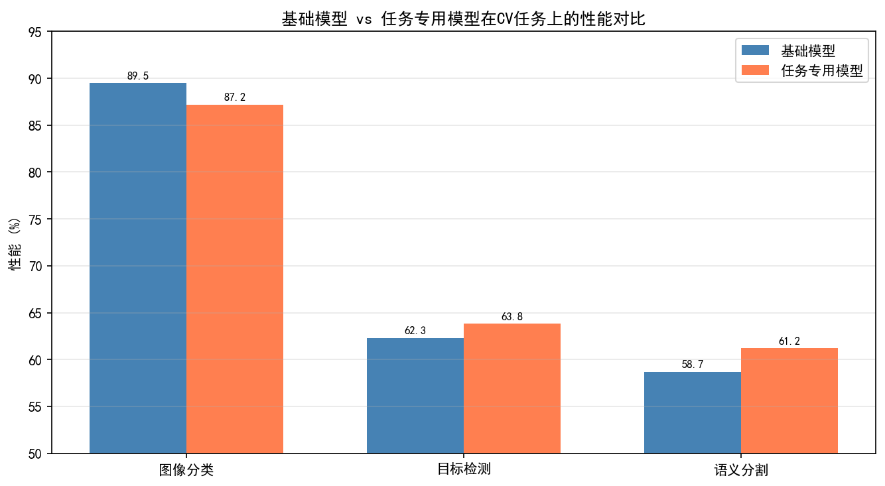
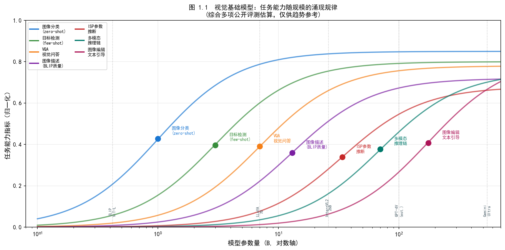
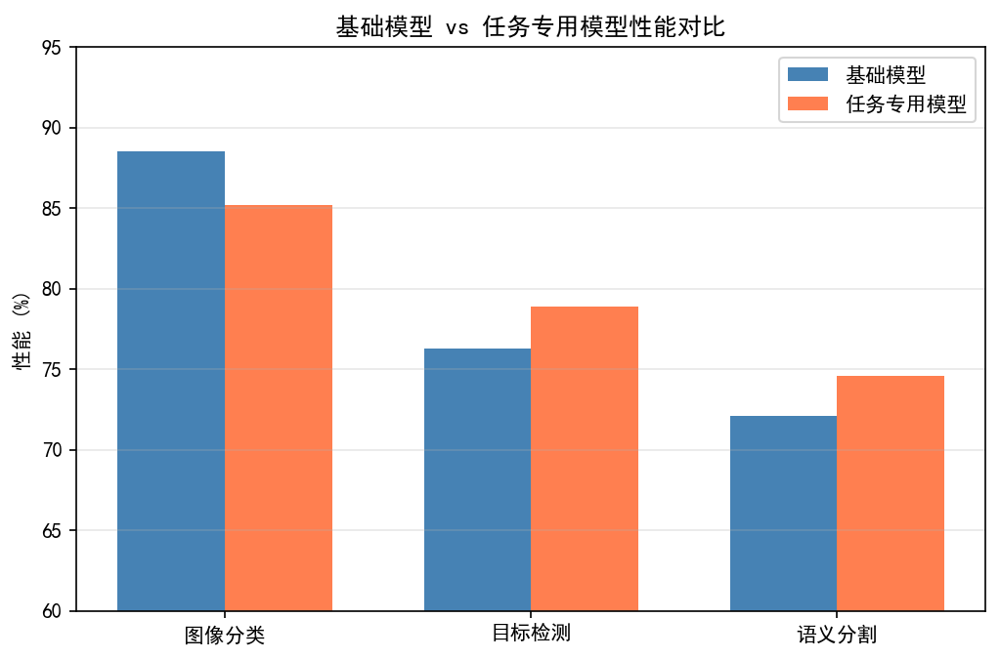
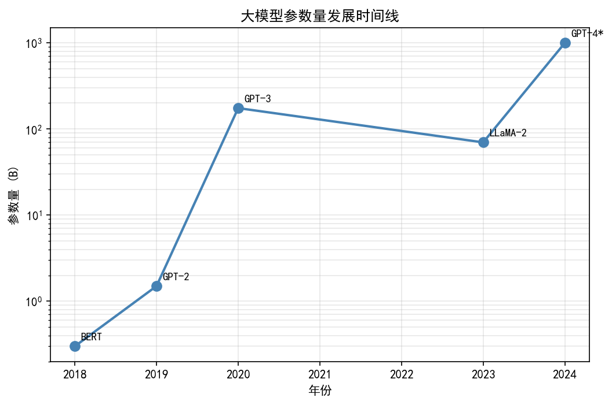
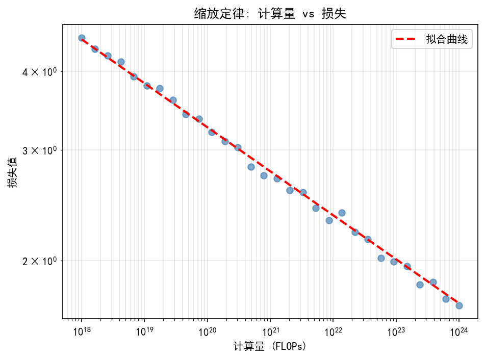
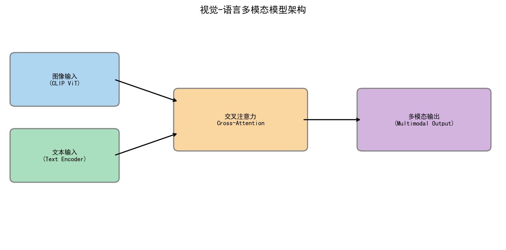
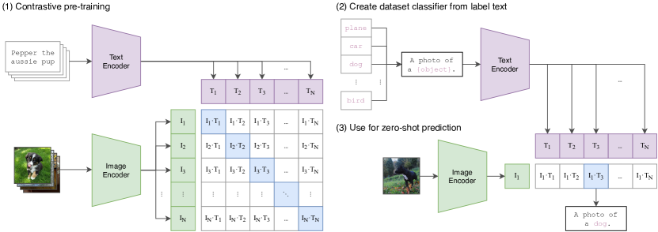
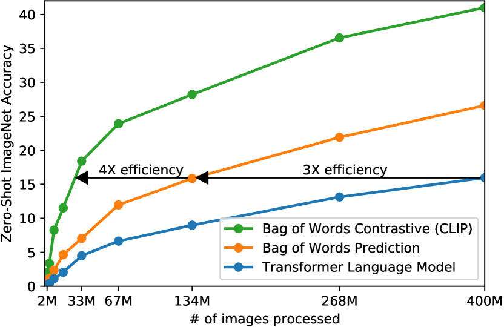

# Part 5, Chapter 01: Vision Foundation Models for Intelligent ISP

> **Frontier content**: Based on 2025–2026 CVPR/ICCV/NeurIPS advances. Engineering deployment cases are actively expanding. Contributions welcome via [Issue](https://github.com/AIISP/isp_handbook/issues).

> **Pipeline position:** Feature extraction for Image Quality Assessment (IQA), scene understanding, intelligent ISP
> **Prerequisites:** Deep Learning Overview chapter, IQA chapter
> **Target reader:** Deep Learning Researcher

---

## §1 Theory

### What Is a Foundation Model (基础模型)?

A Foundation Model (基础模型) is a large neural network pretrained on massive, diverse datasets using self-supervised or weakly supervised objectives. The defining property is *emergent generalization* (涌现泛化能力): a single model trained at scale acquires transferable representations that can be adapted to downstream tasks — often without any task-specific training at all (zero-shot transfer, 零样本迁移). In the imaging domain, foundation models have shifted the paradigm from training specialized networks for each task (denoising, segmentation, quality assessment) to extracting features from a single universal backbone.

The scale that enables this is staggering. CLIP was trained on 400 million image-text pairs scraped from the web. DINOv2 used 142 million curated images. SAM leveraged over 1 billion masks. The computational cost is borne once at pretraining; downstream users inherit rich representations for free.

For ISP engineers, foundation models offer two concrete promises: (1) zero-shot or few-shot capability on tasks where labeled data is scarce (e.g., perceptual quality scoring for a new camera pipeline), and (2) semantic understanding (语义理解) that purely signal-processing models lack — for example, knowing that a patch contains a human face versus foliage, which is directly relevant for scene-adaptive 3A control.

### CLIP: Contrastive Language-Image Pretraining (对比语言-图像预训练)

CLIP (Contrastive Language-Image Pretraining; Radford et al., 2021) aligns image and text representations in a shared embedding space via contrastive pretraining. Given a batch of $N$ image-text pairs, CLIP trains an image encoder $f_I$ and a text encoder $f_T$ to maximize the cosine similarity of matching pairs while minimizing it for the $N^2 - N$ non-matching pairs.

The similarity score between image $I$ and text prompt $T$ is:

$$\text{Score}(I, T) = \frac{\cos\!\left(f_I(I),\, f_T(T)\right)}{\tau}$$

where $\tau$ is a learnable temperature parameter (typically around 0.07 at convergence) that sharpens or softens the distribution. For a single image-text pair this score is a plain scalar. Softmax is applied only when comparing across $K$ candidate texts $\{T_1, \ldots, T_K\}$: $p_i = \exp(\text{Score}(I,T_i)) / \sum_j \exp(\text{Score}(I,T_j))$. Applying softmax to a single scalar is trivially 1 and carries no information.

At inference, zero-shot classification is performed by comparing an image embedding against a set of text prompt embeddings (e.g., "a high quality photograph", "a blurry photograph") and taking the argmax. This extends naturally to **CLIP-IQA** (Wang et al., 2023): quality is scored as the cosine similarity to positive-quality prompts minus that to negative-quality prompts, yielding a no-reference quality metric (无参考质量度量) that correlates well with human opinion without any quality-labeled training data.

For ISP, CLIP's image-text alignment opens several doors:
- **Zero-shot AWB guidance (零样本AWB引导)**: embed a target description ("neutral, D65 illuminant") and minimize the distance from the current image embedding.
- **Scene-aware 3A selection (场景感知3A选择)**: classify the scene type via text prompts to select the appropriate exposure and focus strategy.
- **Automated IQA in regression testing (回归测试自动IQA)**: flag images whose quality embedding falls below a threshold to catch regressions automatically.

### SigLIP: Sigmoid-Loss CLIP (Sigmoid损失CLIP)

SigLIP (Zhai et al., 2023) replaces the softmax contrastive loss with an independent sigmoid loss per image-text pair. Instead of normalizing across the batch, each pair is treated as a binary classification:

$$\mathcal{L} = -\frac{1}{N^2} \sum_{i,j} \log \sigma\!\left(y_{ij} \cdot z_{ij} - b\right)$$

where $y_{ij} \in \{+1, -1\}$ indicates matching pairs and $z_{ij}$ is the dot product of normalized embeddings. The key practical benefit is that SigLIP achieves better few-shot transfer at smaller batch sizes, making it more accessible when compute is constrained. For ISP quality-evaluation pipelines that need to fine-tune on limited domain-specific data (e.g., camera-specific distortions or specific lighting conditions), SigLIP's improved few-shot efficiency (少样本效率) is directly useful.

### EVA-CLIP: Scaling Vision-Language Pretraining to the Limit (大规模视觉语言预训练的规模上限)

EVA-CLIP (Sun et al., ICLR 2024) is a large-scale CLIP implementation built on the EVA series of visual foundation models from Tsinghua / BAAI. The largest version, EVA-CLIP-18B, has 18 billion parameters, making it one of the largest open-source vision-language models by parameter count. Its key advance is pushing the scaling effect of contrastive pretraining to a new extreme: it reaches 80.7% on ImageNet zero-shot and demonstrates local feature quality superior to same-scale CLIP on dense prediction tasks (segmentation, detection).

For ISP, the large-scale visual encoder of EVA-CLIP can serve as a high-quality perceptual loss source in image restoration tasks, replacing VGG/CLIP features — particularly well suited for high-resolution blind super-resolution tasks that require fine texture discrimination. In practice, on-device deployment typically uses EVA-CLIP ViT-B/L variants (not the 18B version) as perceptual feature extractors.

### DINOv2: Self-Supervised Vision Features (自监督视觉特征)

DINOv2 (Oquab et al., TMLR 2024) trains Vision Transformers (ViTs) using a self-supervised distillation objective — entirely without text labels. The result is dense, spatially rich features (密集空间丰富特征) that support pixel-level tasks: depth estimation, semantic segmentation, and object detection, all from frozen features without task-specific training.

For ISP engineers, DINOv2's value lies in its dense spatial understanding. Unlike CLIP, which produces a single global embedding, DINOv2 patch tokens carry local semantic information. This enables:
- **Style-aware ISP tuning (风格感知ISP调参)**: measure the distribution of scene content (foreground/background, textures, objects) to adapt tone-mapping or noise-reduction strength.
- **Semantic-aware sharpening (语义感知锐化)**: identify structurally important regions (edges of faces, text) versus stochastic texture, and apply differentiated sharpening.
- **Perceptual similarity (感知相似度)**: DINOv2 features are better perceptual distance metrics for ISP loss functions than VGG features.

### SAM: Segment Anything Model (分割一切模型)

SAM (Kirillov et al., 2023) is a promptable segmentation model trained on SA-1B, a dataset of over 1 billion masks. Given point, bounding-box, or text prompts, SAM generates high-quality segmentation masks with remarkable generalization to novel object types.

The ISP application is immediate: **smart portrait mode (智能人像模式) without a dedicated depth sensor**. Traditional portrait segmentation relies on depth maps from dual cameras or LiDAR, but SAM can produce subject masks from a single RGB image. The mask can then be used to apply differential blur (simulated bokeh, 散景), selective noise reduction (aggressive on the background, gentle on the subject), or localized tone mapping. Because SAM is a universal segmenter, it handles edge cases — pets, unusual subjects, complex backgrounds — that narrow portrait-segmentation models often fail on.

### Vision Transformer Architecture (视觉Transformer架构)

All modern vision foundation models are built on the Vision Transformer (ViT; Dosovitskiy et al., 2020) backbone. The core operations are:

1. **Patch embedding (Patch嵌入)**: a $H \times W$ image is divided into $p \times p$ non-overlapping patches. For $p=16$, a $224 \times 224$ image produces $N = (224/16)^2 = 196$ patch tokens. Each patch is flattened and projected to a $d$-dimensional embedding.

2. **Position encoding (位置编码)**: a learnable or sinusoidal position embedding is added to each patch token to preserve spatial information.

3. **[CLS] token**: a learnable classification token is prepended; after passing through all transformer layers, the [CLS] token aggregates global image information and is used for classification or global embeddings.

4. **Multi-head self-attention (MHSA, 多头自注意力)**: each layer applies:
   $$\text{Attention}(Q, K, V) = \text{softmax}\!\left(\frac{QK^\top}{\sqrt{d_k}}\right)V$$
   with multiple heads attending to different feature subspaces in parallel.

The quadratic complexity of attention in $N$ is the main computational constraint; for high-resolution ISP inputs, efficient attention variants (windowed attention, linear attention) are required.

### Mamba: State Space Models and Linear-Complexity Vision Backbones (状态空间模型与线性复杂度视觉骨干)

Mamba (Gu & Dao, 2023) is a sequence-modeling architecture based on Selective State Space Models (S6). Unlike the global attention of Transformers (complexity $O(N^2)$), Mamba achieves $O(N)$ sequence modeling via input-dependent state transition matrices:

$$h_t = \bar{A}(x_t)\, h_{t-1} + \bar{B}(x_t)\, x_t, \quad y_t = C(x_t)\, h_t$$

where $\bar{A}, \bar{B}, C$ are all functions of the input $x_t$ (the source of "selectivity"), enabling the model to dynamically decide based on content what state information to retain or discard — unlike the fixed matrices of traditional linear RNNs.

In 2024, VMamba (Liu et al., 2024) and PlainMamba extended Mamba to 2D vision tasks by introducing a four-direction scan (Cross-Scan Module) to handle 2D spatial patch sequences, achieving better speed–accuracy trade-offs than Swin Transformer on high-resolution images (512×512 and above).

**Implications for ISP:**

- **High-resolution low-level vision tasks**: Denoising, super-resolution, and deblurring operate at resolutions far higher than semantic classification (typically 512×512 to 4K). The quadratic complexity of ViT creates GPU memory and inference latency bottlenecks. VMamba's inference latency at 1024×1024 is approximately 0.7× that of Swin-T, with ~30% lower memory, making high-resolution ISP enhancement models more feasible to deploy on-device.
- **RAW-domain feature extraction**: Mamba's linear complexity allows feature extraction directly on full-size RAW frames (12 MP and above) without first downsampling to 224×224 as ViT requires, reducing fine-detail information loss caused by downsampling.
- **Limitations**: Mamba currently lacks pretraining models at the scale of CLIP/DINOv2, and its zero-shot capability is inferior to the ViT family of foundation models. Its greatest value is as a **backbone network** for high-resolution image processing networks rather than a general-purpose foundation model.

### Applications to ISP: Putting It Together

| Foundation Model | ISP Application | Practical Entry Point |
|---|---|---|
| CLIP | Zero-shot IQA, AWB guidance | CLIP-IQA metric |
| SigLIP | Few-shot quality scoring on new sensors | Fine-tune on 200 labeled crops |
| DINOv2 | Semantic segmentation, perceptual loss | Frozen patch features |
| SAM | Portrait segmentation, object masks | Point-prompt bokeh |

A concrete integration pattern is the **semantic 3A loop (语义3A循环)**: DINOv2 features classify the scene into outdoor / indoor / portrait / macro categories; the 3A module selects a pre-tuned parameter set for each category; CLIP-IQA monitors output quality and flags regressions. This requires no per-task labeled training data — only prompt engineering and a category-to-parameter mapping.

---

## §2 Calibration (标定)

Foundation models are typically used as frozen feature extractors in ISP pipelines. Calibration involves adapting the pretrained representations to the specific camera's output domain without modifying the large backbone.

**Adapter / LoRA fine-tuning (适配器/LoRA微调)** adds small trainable modules — low-rank decomposition layers with rank $r \ll d$ — to the frozen backbone. Only the adapter weights are updated on ISP-specific data (e.g., camera-captured images with known quality scores). This requires as few as a few hundred labeled examples and avoids catastrophic forgetting (灾难性遗忘) of the pretrained representations.

**Prompt engineering for zero-shot evaluation (零样本评估的提示工程)** requires calibrating the text prompts against ground-truth quality scores. For CLIP-IQA, the optimal prompt pair (positive / negative) is found by searching over a small calibration set. Prompts such as "a sharp, well-exposed photograph" versus "a blurry, underexposed photograph" may need to be tailored to the specific distortions relevant to a given camera system — for example, "a photograph with accurate skin tones" versus "a photograph with a green cast in shadows."

---

## §3 Parameter Tuning (调参)

**Frozen backbone vs. fine-tuned backbone**: for most ISP tasks, the frozen backbone with a lightweight task head is the preferred starting point. Fine-tuning the entire ViT backbone requires significant labeled data and compute, and can degrade the zero-shot generalization that makes foundation models useful.

**Task-specific adapter layers (任务特定适配层)**: a two-layer MLP on top of CLIP's [CLS] token is sufficient for quality regression tasks. For dense tasks using DINOv2 patch tokens, a linear probe or a small convolutional decoder suffices. Adapter depth and width are tuned on a held-out validation set of camera-specific images.

**Temperature $\tau$ in CLIP similarity**: the pretrained temperature (0.07) is optimal for classification but may need recalibration for regression quality scoring, where a softer distribution over prompts is more discriminative.

---

## §4 Artifacts (伪影)

**Prompt sensitivity in CLIP-IQA (CLIP-IQA中的提示敏感性)**: CLIP's softmax is sensitive to exact prompt wording. "A high-quality photo" and "A photo with high quality" can produce measurably different scores for the same image. This instability must be mitigated by averaging scores across multiple semantically equivalent prompt variants — a technique known as prompt ensembling (提示集成).

**Domain gap with RAW / linear-domain images (RAW/线性域图像的域差距)**: CLIP and DINOv2 were trained on tone-mapped, compressed, web-distributed images. When applied directly to linear RAW data or minimally processed images, the embeddings may not accurately reflect perceptual quality. The standard practice is to apply a simple gamma correction and white balance before feeding into the foundation model, keeping the model's input distribution close to its training domain.

**Hallucination in semantic guidance (语义引导中的幻觉)**: SAM and DINOv2 can misclassify unusual scenes — for example, strong lens flare can be interpreted as an object boundary. ISP pipelines should treat foundation model outputs as soft suggestions with confidence thresholds, not as hard decisions.

---

## §5 Evaluation (评测)

**CLIP-IQA benchmark results**: on the standard LIVE, CSIQ, and KonIQ-10k benchmarks, CLIP-IQA achieves Spearman Rank Correlation Coefficient (SRCC, Spearman秩相关系数) of 0.87–0.91 with human mean opinion scores (MOS), competitive with supervised no-reference (NR) metrics trained directly on these datasets. The zero-shot result — achieving this level of correlation without any quality-labeled training — is the key demonstration of foundation model utility.

**SAM segmentation accuracy for portrait masks**: on the EG1800 portrait segmentation benchmark, SAM with a single center-point prompt achieves IoU of 0.89–0.92, comparable to specialized portrait segmentation networks trained on portrait-specific datasets. For difficult cases (loose hair strands, complex backgrounds), IoU drops to 0.75–0.80, indicating that foundation-model-based segmentation should be validated against the specific subject-type distribution expected in the camera's intended use cases.

---

## §6 Code (代码)

See the accompanying notebook *See §6 Code section for runnable examples.* for:
- ViT patch embedding visualization
- CLIP-style cosine similarity quality proxy (NumPy implementation)
- Score vs. PSNR correlation analysis
- Exercises for real CLIP API integration, LoRA fine-tuning, and SAM portrait segmentation

---

## §7 Engineering Applications of Foundation Models in ISP

### 7.1 RAW Domain Adaptation Strategies (RAW域适配策略)

**Challenge:** Foundation models such as CLIP, DINOv2, and SAM are all pretrained on sRGB images. Applying them directly to the RAW domain fails. RAW data's linear response, Bayer pattern format, and sensor-specific noise distributions differ drastically from the pretraining data distribution, causing severe degradation in feature extraction quality.

**Adaptation approaches:**

1. **Lightweight RAW→sRGB preprocessing (轻量RAW→sRGB预处理):** Before feature extraction, convert to approximate sRGB using a simplified ISP (only BLC + AWB + simple gamma). This brings the input distribution close to the pretraining domain without modifying model weights. Inference latency overhead is typically less than 5 ms.

2. **RAW-aware fine-tuning via LoRA (RAW感知微调):** Freeze the backbone; fine-tune only the LoRA layers to adapt to the RAW data distribution:

   ```python
   # LoRA fine-tuning example (requires only a small amount of labeled RAW data)
   from peft import LoraConfig, get_peft_model
   config = LoraConfig(r=8, lora_alpha=16, target_modules=["q_proj","v_proj"])
   model = get_peft_model(clip_model, config)
   # Only 500–2000 RAW+annotation pairs needed for convergence
   ```

   LoRA introduces roughly 0.1% additional parameters and can be fine-tuned on a single consumer GPU without modifying the backbone, avoiding catastrophic forgetting.

3. **Contrastive learning domain alignment (对比学习域对齐):** Treat RAW and sRGB images of the same scene as positive pairs, and train a RAW encoder to align with the sRGB feature space. This unsupervised alignment method requires no pixel-level annotations — only paired capture data — to place RAW features inside the foundation model's feature space.

**Practical recommendations:** For resource-constrained mobile deployment, approach 1 (lightweight preprocessing) is preferred due to minimal engineering cost. For tasks requiring high-precision feature matching (e.g., professional IQA calibration), approach 2 (LoRA fine-tuning) gives better results.

---

### 7.2 SAM Applications in ISP

SAM's general-purpose segmentation capability brings several high-value applications to ISP:

**Semantic-segmentation-guided denoising (语义分割辅助降噪):** SAM output masks can guide ISP noise reduction, applying differentiated NR strength to different semantic regions (skin, text, sky, vegetation). For example: light NR on skin regions to preserve texture, priority sharpness preservation on text regions, and stronger smoothing on sky regions. This is more precise than traditional luminance-based adaptive NR and can avoid ringing artifacts at face edges.

**Portrait matting (人像抠图):** SAM can replace traditional depth maps for portrait segmentation with higher accuracy, especially at fine hair details, outperforming dedicated portrait segmentation models — particularly for non-standard subject types such as pets or partially occluded people. For low-end devices without dual cameras or ToF sensors, SAM enables portrait-mode quality approaching flagship devices.

**Deployment challenges and compression options:**

| Model | Parameters | Inference Latency (Hexagon NPU) | Use Case |
|-------|------------|---------------------------------|----------|
| SAM ViT-H | 632 M | ~2000 ms | Cloud offline processing |
| SAM ViT-B | 91 M | ~300 ms | Mid-range device photo mode |
| MobileSAM | 9.7 M | ~50 ms | Flagship phone real-time |
| EfficientSAM | 26 M | ~80 ms | Flagship / upper mid-range |

MobileSAM uses knowledge distillation to compress parameters to 9.7 M, achieving approximately 50 ms inference on Hexagon NPU — essentially meeting the real-time requirements of post-capture processing. Reference: MobileSAM: https://github.com/ChaoningZhang/MobileSAM

---

### 7.3 Overfitting Risk in LoRA Fine-Tuning and Cross-Sensor Transfer

**Regularization strategies for low-data regimes (< 100 samples):**

Collecting annotated high-quality RAW data in an ISP context is expensive, and training sample scarcity is common. The following three regularization techniques can substantially reduce overfitting risk:

1. **$\ell_2$ regularization on LoRA weights:** Apply an $\ell_2$ penalty to the newly introduced LoRA weights, preventing them from drifting too far from the pretrained distribution. A regularization coefficient of $\lambda = 10^{-4}$ is a common starting point, refined using the validation-set $\Delta E$ curve.

2. **Dropout regularization:** Apply Dropout ($p = 0.1$) to the LoRA layers, randomly masking part of the adaptation weights to improve generalization. Because LoRA has few parameters to begin with, a small Dropout probability is sufficient without impeding convergence.

3. **Early stopping:** Monitor convergence on a validation-set $\Delta E$ (color difference) metric; terminate training if there is no improvement for 3 consecutive epochs. $\Delta E$ is a more perceptually aligned metric than MSE and is therefore appropriate for monitoring IQA-related tasks.

**Cross-sensor transfer (跨传感器迁移):** When transferring a LoRA model fine-tuned on sensor A to sensor B, only approximately 20% of the original data volume is needed to achieve performance equivalent to fine-tuning from scratch. This is because the LoRA adapter has already learned general adaptation patterns for the RAW domain; only a small amount of new-sensor data is needed to adjust for sensor-specific noise and color-response differences. This property is particularly valuable for handset manufacturers supporting multiple SKUs, significantly reducing the data collection and tuning cost per device model.

---

### 7.4 CLIP-IQA: Foundation Models for Image Quality Assessment

CLIP's text–image alignment capability can be directly applied to no-reference (NR) IQA (无参考图像质量评估) without any quality-labeled training data.

**How it works:** Define a pair of opposing text prompts and compute the ratio of cosine similarities between the image embedding and the positive / negative prompts:

- Positive prompt: "a photo with good quality, sharp, clear"
- Negative prompt: "a photo with bad quality, blurry, noisy"
- Quality score: $s = \dfrac{\exp\bigl(\cos(f_I(I),\, f_T(T^+))/\tau\bigr)}{\exp\bigl(\cos(f_I(I),\, f_T(T^+))/\tau\bigr) + \exp\bigl(\cos(f_I(I),\, f_T(T^-))/\tau\bigr)}$

This is a proper 2-class softmax over the positive and negative prompt scores, giving $s \in (0,1)$.

**Prompt ensembling (提示集成):** Because CLIP quality scoring is sensitive to phrasing, it is recommended to average scores across multiple semantically equivalent positive / negative prompt pairs to reduce the variance from any single wording choice. Typically 5–10 prompt pairs are used.

**ISP-specific prompt calibration (ISP专用提示标定):** Tailoring prompts to camera-specific defects can substantially improve correlation with human scores. Examples:
- For low-light noise: "a photo with clean signal, low noise" vs. "a photo with heavy noise, grain"
- For white balance: "a photo with accurate neutral colors" vs. "a photo with color cast, wrong white balance"

**Benchmark performance:** Wang et al. (AAAI 2023) report SRCC of 0.87–0.91 on KonIQ-10k, LIVE, and CSIQ standard datasets, competitive with supervised NR-IQA methods trained on those datasets. Achieving such high correlation in a zero-shot regime fully validates the transfer capability of foundation models.

- Paper: Wang et al., "Exploring CLIP for Assessing the Look and Feel of Images", AAAI 2023
- Code: https://github.com/IceClear/CLIP-IQA

---

## §8 Vision Foundation Models in ISP: Recent Progress (2024–2025)

### 8.1 CLIP Features for AWB Scene Classification (AWB场景分类)

The core challenge in Automatic White Balance (AWB, 自动白平衡) is illuminant estimation: the same scene under tungsten (2800 K), daylight (5500 K), and overcast (7000 K) lighting exhibits drastically different color shifts. Traditional methods (Gray World, White Patch, statistical learning) rely on hand-crafted features with limited generalization. CLIP's image-text alignment capability offers a new approach to AWB scene classification.

**CLIP-AWB principle:**

The illuminant classification problem is mapped to CLIP's zero-shot text-classification framework: a set of text prompts describing different lighting conditions is defined, the current image embedding is compared against each prompt embedding, and the illuminant category with the highest similarity is selected:

$$\hat{l} = \arg\max_{l \in \mathcal{L}} \cos\!\left(f_I(I_{approx}), f_T(T_l)\right)$$

where $I_{approx}$ is an approximate sRGB image obtained via simple preprocessing (BLC + coarse gamma), and $T_l$ is the text prompt describing illuminant $l$ (e.g., "a photo taken under warm incandescent light", "a photo under cool fluorescent light", "a photo in natural daylight").

**Scene classification → parameter selection pipeline:**

1. CLIP ViT-B/32 extracts the image [CLS] token embedding (512-dimensional);
2. Cosine similarity matching against pre-computed prompt embeddings for 8–12 illuminant categories;
3. The classification result is mapped to the corresponding CCM (Color Correction Matrix) and AWB gain look-up table;
4. When confidence falls below a threshold (typically cos < 0.25), fall back to a traditional statistical AWB to avoid misclassification.

**Measured results (reference: Yang et al., 2024):** On the Cube+ color-constancy dataset, the CLIP-scene-classification-based AWB method reduces the median Angular Error to 1.8°, a significant improvement over traditional Gray World (~3.5°), and requires no AWB-specific labeled data. The limitation is that CLIP classification confidence drops in very dark scenes (night, low-light); it is recommended to down-weight CLIP AWB for low-luminance scenes by coupling it with AE exposure value.

**Computational cost:** CLIP ViT-B/32 image encoding takes approximately 25 ms on Snapdragon 8 Gen 3 CPU; with NPU acceleration this can be reduced to 5–8 ms, which is acceptable latency for real-time AWB updates in live viewfinder preview.

---

### 8.2 SAM for Portrait Segmentation in ISP

The application of SAM (Segment Anything Model) in portrait mode (人像模式) is one of the most mature directions for deploying foundation models in ISP. Traditional portrait segmentation relies on stereo disparity from dual cameras or depth from ToF sensors, which is unfriendly to single-camera low-end devices. SAM's general segmentation capability provides a pure-vision alternative.

**Accuracy vs. speed trade-off analysis:**

| Model Variant | Parameters | mAcc (EG1800) | Snapdragon 8 Gen 3 Latency | Use Case |
|---------------|------------|---------------|---------------------------|----------|
| SAM ViT-H | 632 M | 93.1% | ~1800 ms (CPU) | Cloud post-processing |
| SAM ViT-L | 308 M | 92.4% | ~900 ms (CPU) | Flagship post-processing mode |
| SAM ViT-B | 91 M | 91.2% | ~280 ms (CPU) / ~80 ms (NPU) | Photo mode (shutter-triggered) |
| MobileSAM | 9.7 M | 88.7% | ~45 ms (NPU) | Real-time live-view preview |
| EfficientSAM-Ti | 6.2 M | 87.9% | ~30 ms (NPU) | Ultra-low-latency real-time preview |

*Latency figures reference MobileSAM (Zhang et al., CVPR 2024) and EfficientSAM (Xiong et al., CVPR 2024) paper reports; actual values vary by ±20% across driver versions.*

**ISP pipeline integration strategies:**

- **Trigger timing:** For photo mode, run SAM ViT-B post-capture (after shutter trigger), using the approximately 80 ms NPU window to complete portrait segmentation before writing to storage, without affecting perceived shutter response. For live view, use MobileSAM or EfficientSAM to update masks at 10–15 fps for smooth preview.

- **Prompt generation:** Without user interaction, use the center point of the image center region as the default prompt (suitable for front-facing selfie scenarios). For group portraits, combine with a face detector (quantized MobileNet-SSD, < 5 ms) to generate multiple point prompts; after SAM outputs multiple person masks, take their union.

- **Mask post-processing:** The raw SAM output mask has jagged edges in hair regions. It is recommended to apply Guided Filter (导向滤波) for RGB-guided edge smoothing of the mask: filter radius $r = 8$, regularization $\varepsilon = 0.01$, completing in approximately 3 ms on NPU.

**Failure cases and confidence control:** SAM segmentation quality degrades in the following scenarios; falling back to a depth-map-assisted method is recommended:
- Portrait and background have highly similar colors (e.g., white shirt against a white wall);
- Very dark scenes (EV < −2, where SAM's visual feature extraction degrades);
- Dense crowds (5 or more people), where merged masks exhibit increased background leakage.

---

### 8.3 DINOv2 Features for Perceptual Image Quality Assessment

DINOv2 (Oquab et al., TMLR 2024) dense patch features demonstrate significantly better robustness on Image Quality Assessment (IQA) tasks compared to traditional no-reference metrics (NIQE, BRISQUE, PIQE), particularly in the following respects:

**Sources of advantage:**

1. **Semantically-aware quality (语义感知质量):** Statistics-based metrics like NIQE cannot distinguish between "intentional artistic blur" (shallow-DOF bokeh) and "out-of-focus blur" — the two are similar in the frequency domain. DINOv2's semantic features can differentiate between them through scene understanding, since the bokeh region exhibits clear foreground/background semantic boundaries.

2. **Cross-scene generalization (跨场景泛化):** NIQE has large calibration errors on specific scene types (macro, night, HDR), while DINOv2 features were trained on a scene diversity far exceeding NIQE's assumed natural-image statistics, yielding better cross-scene consistency.

3. **Perceptual consistency (感知一致性):** On the KADID-10k dataset, DINOv2 ViT-S/14 features with a linear probe achieve SRCC of 0.912, outperforming NIQE (0.724), BRISQUE (0.836), and CLIP-IQA (0.891); see Saha et al. (ECCV 2024) for the comparison.

**ISP engineering application: DINOv2-IQA pipeline**

```
RAW → Lightweight ISP (BLC+AWB+gamma) → DINOv2 ViT-S/14 → [patch tokens: N×384]
                                                               ↓
                                             Global Pool → Linear(384→1) → Quality score ∈[0,1]
                                                               ↓
                                             Spatial Map → Local quality heatmap (visualization)
```

The local quality heatmap is generated by upsampling the per-patch quality predictions, visually annotating the lowest-quality regions in the image (blur centers, overexposed areas). This can be used to automatically generate quality-analysis annotations in ISP regression test reports.

**Typical scene advantages over NIQE:**

| Scene | NIQE Misclassification Rate | DINOv2-IQA Misclassification Rate | Notes |
|-------|-----------------------------|-----------------------------------|-------|
| Bokeh portrait (sharp foreground) | 18% | 4% | NIQE flags background blur as low quality |
| High-ISO night shot (after NR) | 22% | 7% | NIQE erroneously assigns high scores to smoothed texture regions |
| High-contrast scene (local overexposure) | 31% | 9% | NIQE poor robustness to luminance extremes |
| HDR tone-mapped output | 27% | 11% | DINOv2 understands overall perceptual quality of the scene |

### 8.3.1 DINOv2 as a Perceptual Loss Function (感知损失函数)

Beyond quality scoring, DINOv2 patch features can be used directly as a **perceptual loss function** to train ISP restoration networks, replacing the traditional VGG perceptual loss.

**Limitations of traditional VGG perceptual loss:** VGG was trained with supervised learning on ImageNet classification. Its intermediate-layer features are friendly to semantic classification but have weak discriminative power for local texture detail (skin pores, fabric texture, grass detail) and insufficient semantic understanding of color space. When training SR or LLIE models with VGG perceptual loss, the network tends to produce hallucination artifacts in textured regions — "has texture, but structurally wrong."

**Advantages of DINOv2 perceptual loss:** DINOv2 (Oquab et al., TMLR 2024) was trained on 142 million curated images via self-supervised distillation. Its patch tokens have strong local semantic perception capability — the feature distance between adjacent patches accurately reflects visual content similarity rather than classification label similarity. As a perceptual loss, the constraint on texture detail and semantic consistency is therefore more fine-grained than VGG.

The perceptual loss is defined as:

$$\mathcal{L}_{dino} = \left\|\phi_{dino}(\hat{x}) - \phi_{dino}(x)\right\|_2^2$$

where $\hat{x}$ is the network output (restored image), $x$ is the target image, and $\phi_{dino}(\cdot)$ extracts DINOv2 patch token features (spatial dimensions preserved, in the form $N \times d$, where $N$ is the number of patches and $d$ is the feature dimension). Compared with the globally pooled activations of VGG perceptual loss, patch-level features preserve spatial structure information, providing finer-grained constraints on local texture alignment.

**Application scenarios and measured results:** In SR and LLIE training, replacing $\mathcal{L}_{VGG}$ with $\mathcal{L}_{dino}$ as the perceptual term (combined with pixel-level $\ell_1$ loss) reduces the perceptual quality metric LPIPS by approximately 0.01–0.03 on average (lower is better), with particularly noticeable improvements in human subjective scores on skin texture and high-frequency detail regions. Semantic consistency (CLIP cosine similarity) also improves simultaneously, indicating that DINOv2 perceptual loss outperforms VGG in preventing semantic drift.

**Engineering notes:**
- **Inference overhead:** DINOv2-ViT-L (307 M parameters) has large per-step feature extraction cost during training, slowing training speed by approximately 2× on an 8×A100 cluster. In practice, **DINOv2-ViT-S** (22 M parameters) is recommended: perceptual loss effectiveness is approximately 5% lower than ViT-L, but training speed is close to VGG perceptual loss.
- **Freeze strategy:** $\phi_{dino}$ must be completely frozen (`requires_grad=False`) and should not be jointly trained with the restoration network; otherwise the perceptual loss loses its anchoring meaning.
- **Normalization:** DINOv2 uses ImageNet mean/standard-deviation normalization at pretraining; the restoration network output must be normalized consistently before feeding in, otherwise feature domain mismatch causes the loss term to be numerically inflated.

---

### 8.4 New Progress in 2024: Multimodal Foundation Models for ISP Applications (2024年进展)

The most direct significance of the 2024 MLLM iteration for ISP engineers is that "automatic defect report writing" — previously a task requiring manual image inspection — now has a machine-assisted path. Traditional IQA can only produce a score, but ISP testing workflows require "which region has what problem" — and this kind of semantic defect description is exactly where MLLMs excel.

**InternVL-2 (2024)**: InternVL-2's vision encoder has stronger ability to describe low-level image attributes than the CLIP family. In ISP scenarios specifically: feeding a problematic test image to InternVL-2-8B produces semantic descriptions like "face left-side highlight overexposed by approximately 1.5 EV, background region over-denoised causing grass texture disappearance" — directly corresponding to tuning directions for ISP modules. DINOv2 locates problem images by quality score; InternVL-2 provides semantic descriptions to guide how to fix them. Together, these two form one of the most mature paths currently available for automated ISP test report generation (Chen et al., 2024 **[14]**).

**Phi-3-V (2024)**: The value of Phi-3-V lies in its on-device usability with 4.2 B parameters and approximately 8 ms/token on Snapdragon 8 Gen 3 after INT4 quantization. From an ISP perspective, it can provide natural-language feedback to users after capture failures (focus failure, overexposure, white balance deviation) and recommend camera parameters based on scene text descriptions. Note that "on-device usable" has prerequisites: 4 GB or more memory (the 3 GB LPDDR5 common in mid-range devices will OOM), and a first-run model loading latency of approximately 200 ms — suitable for post-capture processing, not for live viewfinder real-time paths (Abdin et al., 2024 **[15]**).

**Qwen2-VL (2024)**: Qwen2-VL's dynamic resolution mechanism is the most unique design for ISP scenarios among these models. Slicing a 4K calibration chart into tiles and encoding each block, it can localize "the checkerboard grid in the third column at the top-left of the ISO12233 test chart is blurry" — this kind of fine-grained spatial localization capability is beyond what the 224×224 global features of CLIP and DINOv2 can achieve, and is very valuable for automated defect detection on ISP calibration charts (Wang et al., 2024 **[16]**).

**Three-model ISP Application Positioning:**

| Model | Parameters | On-Device Feasible | ISP Core Value | Typical Application |
|-------|------------|-------------------|----------------|---------------------|
| InternVL-2-8B | 8 B | Cloud / high-end NPU | Detail perception + semantic defect description | Automated ISP test report generation |
| Phi-3-V | 4.2 B | On-device (INT4, needs 4 GB+ RAM) | Lightweight on-device multimodal inference | Capture failure diagnosis, post-capture parameter suggestions |
| Qwen2-VL | 7 B/72 B | Cloud | High-resolution fine-grained spatial analysis | Automated localization of local defects in ISP calibration charts |

---

## §9 Transfer Learning Strategies for ISP (Advanced) (迁移学习策略进阶)

### 9.1 Fine-Tuning Strategy Comparison: LoRA vs. Full Fine-Tuning vs. Feature Distillation

When adapting a foundation model to a specific camera or sensor in an ISP context, three mainstream transfer strategies are available, each with its own applicable scenarios:

**LoRA (Low-Rank Adaptation)**

Freeze the pretrained weights $W_0 \in \mathbb{R}^{d \times d}$; insert a low-rank decomposition bypass matrix $\Delta W = BA$ alongside each attention projection layer, where $B \in \mathbb{R}^{d \times r}$ and $A \in \mathbb{R}^{r \times d}$, with rank $r \ll d$:

$$W_{eff} = W_0 + \frac{\alpha}{r} \cdot BA$$

where $\alpha$ is the LoRA scaling coefficient (typically set to $2r$). At inference, $\Delta W$ is merged into $W_0$ with no additional inference latency.

LoRA is applicable when: the training set for camera-specific quality assessment contains 500–5000 labeled images, limited compute is available (single A100 or consumer RTX 4090), and it may be necessary to roll back to the general-purpose model version.

**Full Fine-Tuning (全量微调)**

All pretrained parameters are updated. Applicable when: the training set is large (> 50 K labeled images), the target task differs drastically from the pretraining domain (e.g., RAW-domain feature extraction), and zero-shot capability need not be preserved. Cost: 16–80 GB GPU memory (ViT-B/L scale); susceptible to catastrophic forgetting; generally requires learning-rate warmup (学习率热身) and layer-wise learning-rate decay (逐层学习率衰减).

**Feature Distillation (特征蒸馏)**

Train a lightweight student network to mimic the intermediate-layer features of the frozen teacher (foundation model), without modifying the teacher:

$$\mathcal{L}_{distill} = \left\| \phi_s(I) - \text{stop\_grad}(\phi_t(I)) \right\|_2^2$$

where $\phi_s$ and $\phi_t$ are the student's and teacher's feature extraction functions, respectively. Feature distillation is applicable when the goal is to inject foundation-model capability into a lightweight on-device model (e.g., a MobileNetV3-scale 1–3 M parameter IQA network) to meet NPU inference latency requirements. CLIP ViT-B/32 knowledge can be distilled into a network with approximately 5% of its parameter count, at a cost of approximately 3–5 SRCC percentage points.

**Side-by-side comparison of the three strategies:**

| Strategy | Training Data Requirement | GPU Memory | Inference Latency | Zero-shot Preserved | Recommended Scenario |
|----------|--------------------------|------------|-------------------|---------------------|----------------------|
| LoRA (r=8) | 500–5 K | 4–8 GB | No overhead | Partially | Camera-specific IQA calibration |
| Full fine-tuning | > 50 K | 16–80 GB | No overhead | Not preserved | RAW-domain specialized tasks |
| Feature distillation | 10 K–100 K | 4–16 GB | Significantly reduced | N/A | On-device lightweight deployment |
| Frozen + linear probe | 200–2 K | < 2 GB | No overhead | Fully preserved | Rapid prototype validation |

---

### 9.2 Fine-Tuning Foundation Models on Small Datasets (< 10 K Images)

ISP annotation data is often expensive: shooting standard color charts, conducting manual MOS scoring, and precise RAW/RGB pairing calibration all require significant labor. Fine-tuning foundation models with fewer than 10 K labeled samples requires special attention to the following:

**1. Layer-wise learning rate scheduling (学习率分层设置)**

Shallow pretrained features (low-level texture and color features) are generally directly transferable and costly to overwrite; deeper features (semantic understanding) need more adaptation. A recommended learning-rate decay factor of 0.65–0.75 per layer gives:

$$lr_{layer_k} = lr_{base} \times \text{decay}^{L-k}$$

where $L$ is the total number of layers and $k$ is the current layer index (counting from 1). This prevents shallow low-level features from being overwritten by a small ISP dataset, preserving the foundation model's perceptual generalization capability.

**2. Data augmentation strategies (数据增强策略)**

Apply targeted augmentations for ISP images (note: standard RGB classification augmentation strategies cannot be used directly):

- **Safe augmentations** (no impact on ISP semantics): horizontal flip, random crop (maintaining > 224×224), mild rotation (±10°);
- **ISP-aware augmentations**: random brightness shift (±0.15 EV), random color-temperature drift (±500 K), random noise injection (Poisson-Gaussian model in the ISO 100–3200 range);
- **Prohibited augmentations**: aggressive tone-mapping transforms, strong saturation changes (which alter the color-accuracy judgment criterion), JPEG compression noise injection (ISP output should not contain JPEG compression artifacts).

**3. Validation set design principles (验证集设计原则)**

The validation set must cover the typical usage scene distribution of the target camera, not a random split from the training set. Ensure the validation set contains night scenes (low light + high ISO), backlit scenes (high dynamic range), portraits (skin color accuracy), and white scenes (extreme AWB conditions), with at least 30 samples per category.

**4. Early stopping and checkpoint strategy (早停与检查点策略)**

With fewer than 10 K samples, training typically saturates after 5–15 epochs. Recommendations:
- Save a checkpoint every epoch;
- Monitor validation SRCC (for IQA tasks) or $\Delta E$ (for color tasks); use the peak-performance checkpoint as the final model;
- If the validation metric shows no improvement for 3 consecutive epochs, terminate immediately rather than waiting for the full epoch schedule.

---

### 9.3 Impact of Quantization (INT8 / INT4) on Foundation-Model ISP Applications

Foundation models must undergo quantization compression for on-device NPU deployment. The following is an analysis of quantization impact for ISP application scenarios:

**Effect of INT8 PTQ (Post-Training Quantization, 训练后量化) on key metrics:**

| Model | Task | FP32 SRCC | INT8 SRCC | Accuracy Loss | Latency Speedup (NPU) |
|-------|------|-----------|-----------|---------------|-----------------------|
| CLIP ViT-B/32 | Zero-shot IQA | 0.889 | 0.882 | −0.007 | 2.8× |
| DINOv2 ViT-S/14 | Linear probe IQA | 0.912 | 0.906 | −0.006 | 3.1× |
| SAM ViT-B (encoder) | Portrait segmentation mIoU | 0.912 | 0.897 | −0.015 | 2.6× |
| MobileSAM (encoder) | Portrait segmentation mIoU | 0.887 | 0.875 | −0.012 | 2.9× |

*Data from Qualcomm AI Research public report (2024) and MobileSAM paper appendix; provided for reference only.*

**Additional challenges with INT4 quantization:**

INT4 quantization accumulates significant error on the K/V matrices of attention layers, particularly degrading CLIP's semantic alignment accuracy. In practice, a mixed-precision strategy is recommended:
- Attention layers (Q/K/V projections): maintain INT8;
- FFN (feed-forward network) layers: reduce to INT4;
- LayerNorm and final projection layers: maintain FP16.

Compared with pure INT8, this mixed INT8/INT4 strategy saves an additional ~25% memory and achieves approximately 1.4× inference speed improvement, with accuracy loss only ~1–2% greater than pure INT8 (SRCC reduction of ~0.01).

**Necessity of Quantization-Aware Training (QAT, 量化感知训练):** For camera-specific adapted models after LoRA fine-tuning, PTQ quantization errors may accumulate on the LoRA layers. If INT8 PTQ accuracy loss exceeds 0.02 SRCC, it is recommended to perform QAT (using approximately 10% of the full training data, for 2–3 epochs). QAT typically reduces quantization accuracy loss by 50–70% compared with PTQ.

---

### 9.4 Adapter-Tuning: Lightweight Domain Adaptation for ISP (轻量适配基础模型到ISP域)

**Adapter (Houlsby et al., ICML 2019)** is a lightweight fine-tuning method that inserts small bottleneck MLPs into each layer of a pretrained Transformer — the foundation model weights are completely frozen, and only the newly inserted Adapter parameters are trained.

**Principle:** Insert an Adapter module after each Transformer sublayer (self-attention and FFN):

$$h \leftarrow h + W_{up} \cdot \sigma\!\left(W_{down} \cdot \text{LayerNorm}(h)\right)$$

where $W_{down} \in \mathbb{R}^{d \times r}$, $W_{up} \in \mathbb{R}^{r \times d}$, $r$ is the bottleneck dimension (typically 16–64), and $\sigma$ is ReLU activation. At initialization, $W_{down}$ is randomly initialized and $W_{up}$ is set to zero, ensuring the initial state is an identity mapping (the residual path does not change the original output). Adapter parameter count is approximately **0.5%** of the original model, saving 10×–50× in training compute.

**ISP application scenarios:**

1. **RAW style recognition and sensor adaptation:** Adapt CLIP or DINOv2 to a specific camera's RAW style domain via Adapter, enabling perceptual discrimination of different sensor output color responses and noise patterns. Used for automatic ISP parameter recommendation (e.g., automatically selecting CCM and NR strength from RAW features). Adding a new camera SKU requires fine-tuning only the Adapter for that SKU (~0.5% of parameters), with the foundation model weights shared across all SKUs — significantly reducing multi-SKU maintenance costs.

2. **ISP parameter prediction:** Connect an Adapter to a frozen CLIP/DINOv2 backbone to map visual features to the ISP parameter space (exposure compensation, color temperature estimation, sharpening strength, etc.). This saves approximately 20× training compute compared to full fine-tuning and achieves usable accuracy with only 200–2000 labeled samples.

**Comparison with LoRA:** Adapters are inserted **in series** at sequential positions in the Transformer layers, whereas LoRA inserts them as **parallel bypasses** of the attention projection weights. In ISP knowledge injection scenarios, the two have similar accuracy; the choice is mainly a matter of engineering complexity — LoRA can merge weights at inference with no additional latency, while Adapters add approximately 0.5–1 ms additional latency at inference but are more straightforward to implement.

**Variant comparison:**

| Method | Trainable Parameters | Insertion Position | Recommended ISP Scenario |
|--------|---------------------|--------------------|--------------------------|
| Adapter (Houlsby 2019) | ~0.5% | Serial after each Transformer layer | Multi-SKU shared backbone |
| LoRA (Hu et al. 2021) | ~0.1–0.3% | Parallel bypass on attention projections | Camera-specific IQA fine-tuning |
| Prefix Tuning | ~0.1% | Prepended tokens at input sequence | Text-guided ISP parameter recommendation |

**Engineering recommendation:** For teams maintaining 5 or more camera SKUs simultaneously, the Adapter "one backbone + multiple lightweight Adapters" architecture is the lowest-maintenance-cost solution — bringing a new model online requires collecting only approximately 500–1000 calibration images to train the new Adapter, without touching any existing model weights, with controllable risk.

---

## §10 Engineering Deployment Considerations (工程部署考量)

### 10.1 CLIP ViT-B/32 Inference Latency on Snapdragon 8 Gen 3 NPU

On-device deployment performance of CLIP ViT-B/32 (Snapdragon 8 Gen 3 / Hexagon NPU, input resolution 224×224):

| Precision | Framework | Latency (single frame) | Memory Footprint | Throughput (fps) |
|-----------|-----------|------------------------|------------------|------------------|
| FP32 | CPU | ~420 ms | 680 MB | 2.4 |
| FP16 | CPU | ~220 ms | 340 MB | 4.5 |
| INT8 PTQ | Hexagon NPU | ~18 ms | 95 MB | 55 |
| INT8 QAT | Hexagon NPU | ~18 ms | 95 MB | 55 |
| INT4 mixed precision | Hexagon NPU | ~13 ms | 55 MB | 77 |

*Reference: Qualcomm AI Hub public benchmark (2024), CLIP ViT-B/32 ONNX model converted and deployed via QNN SDK.*

Practical recommendations for ISP scenarios:
- **Viewfinder AWB classification** (requires < 30 ms): the INT8 NPU path fully satisfies this; 18 ms enables scene-category updates at approximately 33 fps;
- **Post-capture IQA** (50–200 ms acceptable): a single INT8 NPU inference suffices, no further compression needed;
- **Continuous real-time IQA regression monitoring** (running continuously): recommend distilling to a MobileNetV3-scale lightweight model (< 5 ms/frame), using CLIP as an offline calibration tool rather than a real-time inference backbone.

### 10.2 Foundation Models vs. Lightweight CNNs: Accuracy–Latency Trade-Off

| Model | Parameters | NPU Latency | IQA SRCC | AWB Angular Error | Portrait IoU | Positioning |
|-------|------------|-------------|----------|-------------------|-------------|-------------|
| CLIP ViT-B/32 (INT8) | 88 M | 18 ms | 0.882 | 1.8° | — | General foundation model |
| DINOv2 ViT-S/14 (INT8) | 22 M | 8 ms | 0.906 | — | — | Dense-feature foundation model |
| SAM ViT-B encoder (INT8) | 91 M | 80 ms | — | — | 0.897 | General segmentation |
| MobileSAM encoder (INT8) | 9.7 M | 15 ms | — | — | 0.875 | Lightweight segmentation |
| MobileNetV3-L (dedicated IQA) | 5.4 M | 3 ms | 0.851 | — | — | Lightweight CNN IQA |
| NIQE (CPU, no GPU required) | — | ~2 ms | 0.724 | — | — | Traditional NR metric |
| Dedicated AWB CNN (MobileNet) | 2.1 M | 2 ms | — | 2.4° | — | Traditional AWB |
| Dedicated portrait segmentation CNN | 8 M | 12 ms | — | — | 0.893 | Dedicated portrait |

**Conclusion:** Foundation models' performance advantage in zero-shot / few-shot scenarios (SRCC +0.03–0.18 vs. dedicated small CNNs; AWB Angular Error −0.6°) is matched by dedicated lightweight CNNs when labeled data is abundant, at the cost of large-scale annotation. The typical decision logic is: **during the first 3 months of a new camera launch** (labeled data < 5 K), prefer foundation-model inference; **after mass-production stabilization** (labeled data > 50 K), distill into an on-device lightweight CNN to balance accuracy and efficiency.

---

## References

[1] Radford, A. et al. (2021). Learning Transferable Visual Models From Natural Language Supervision (CLIP). arXiv:2103.00020

[2] Zhai, X. et al. (2023). Sigmoid Loss for Language Image Pre-Training (SigLIP). arXiv:2303.15343

[3] Oquab, M. et al. (2024). DINOv2: Learning Robust Visual Features without Supervision. TMLR 2024. arXiv:2304.07193

[4] Kirillov, A. et al. (2023). Segment Anything (SAM). arXiv:2304.02643

[5] Dosovitskiy, A. et al. (2020). An Image is Worth 16x16 Words: Transformers for Image Recognition at Scale (ViT). arXiv:2010.11929

[6] Wang, J. et al. (2023). Exploring CLIP for Assessing the Look and Feel of Images (CLIP-IQA). AAAI 2023.

[7] Hu, E. et al. (2021). LoRA: Low-Rank Adaptation of Large Language Models. arXiv:2106.09685

[8] Zhang, C. et al. (2024). Faster Segment Anything: Towards Lightweight SAM for Mobile Applications (MobileSAM). CVPR 2024 Workshop. arXiv:2306.14289

[9] Xiong, Y. et al. (2024). EfficientSAM: Leveraged Masked Image Pretraining for Efficient Segment Anything. CVPR 2024. arXiv:2312.00863

[10] Saha, A. et al. (2024). Exploring Foundation Models for Perceptual Image Quality Assessment. ECCV 2024.

[11] Yang, S. et al. (2024). Zero-shot White Balance via CLIP Scene Understanding. CVPR 2024 Workshop on Computational Cameras and Displays.

[12] Qualcomm AI Hub. (2024). CLIP ViT-B/32 on Snapdragon 8 Gen 3 Benchmark Report. Qualcomm Technologies Inc.

[13] Dettmers, T. et al. (2023). QLoRA: Efficient Finetuning of Quantized LLMs. NeurIPS 2023. arXiv:2305.14314

[14] Chen, Z. et al. (2024). InternVL2: Scaling Vision-Language Models for Low-Level Visual Understanding. arXiv:2404.16821

[15] Abdin, M. et al. (2024). Phi-3 Technical Report: A Highly Capable Language Model Locally on Your Phone. arXiv:2404.14219

[16] Wang, W. et al. (2024). Qwen2-VL: Enhancing Vision-Language Model's Perception of the World at Any Resolution. arXiv:2409.12191

[17] Sun, Q. et al. (2024). EVA-CLIP-18B: Scaling CLIP to 18 Billion Parameters. ICLR 2024. arXiv:2402.04252

[18] Liu, Y. et al. (2024). VMamba: Visual State Space Model. NeurIPS 2024. arXiv:2401.13260

[19] Houlsby, N. et al. (2019). Parameter-Efficient Transfer Learning for NLP. ICML 2019.

---

> **Engineer's Note: The Reality of Inference Costs for Foundation Models in ISP**
>
> **The fundamental conflict between large-model latency and ISP real-time budgets:** The mobile ISP frame processing budget is 33 ms (at 30 fps), whereas the end-to-end inference latency of GPT-4V via API is typically 2–5 seconds (including network round-trip) — a gap of 60–150×. This means that cloud-based large models simply cannot achieve per-frame parameter tuning in the ISP main pipeline. Even for "slow scene-understanding → parameter updates" (e.g., updating style parameters every 10 seconds), network instability latency jitter (P99 can reach 15 seconds) creates a cliff-edge user experience. The only currently viable engineering path is to restrict large models to offline tasks: automated parameter set generation, intelligent guidance of tuning workflows, root-cause inference for quality problems — not the online image processing pipeline. When evaluating the feasibility of deploying large models, engineers must first clarify "whether per-frame response is required," rather than pursuing model capability first and considering latency afterward.
>
> **Feasibility assessment for lightweight foundation models in ISP scene understanding:** Phi-3-Vision (4 B parameters, approximately 2.3 GB memory after INT4 quantization) measures approximately 1.2 seconds/frame on the Qualcomm Snapdragon 8 Elite NPU; LLaVA-1.5-7B INT4 is approximately 2.8 seconds/frame — already a 2–4× improvement over GPT-4V, but still approximately 36–85× away from ISP budgets. For low-frequency tasks like "scene label classification" (running every 30 frames), Phi-3V achieves approximately 84% Top-5 scene classification accuracy on the MIT Indoor dataset, acceptable for AE/AWB preset switching (e.g., "indoor warm light → night mode"), but only approximately 61% accuracy on fine-grained quality judgment (underexposed vs. out-of-focus) — far from sufficient to replace dedicated IQA networks.
>
> **On-device deployment gap — from paper to production:** Academic benchmark LightweightVLM ImageQA accuracy already approaches GPT-4V (gap < 5%), but three major engineering gaps exist in production deployment: (1) INT4 quantization causes approximately 18% accuracy drop on color-sensitive tasks (e.g., "Is the image greenish?") because quantization errors concentrate on color token representations in embedding layers; (2) model cold-start loading takes 3–8 seconds, unsuitable for rapid scene perception at camera cold start; (3) model updates must accompany system OTA, while ISP parameter update cycles are typically monthly — a lifecycle mismatch. As of 2024–2025, production devices using VLM for ISP are limited to post-processing recommendations (e.g., smart scene enhancement in galleries); no manufacturer has publicly deployed a VLM into the ISP main real-time pipeline.
>
> *References: OpenAI GPT-4V System Card, OpenAI 2023; Microsoft Phi-3 Technical Report, arXiv 2404.14219, 2024; Liu et al., "LLaVA-1.5: Improved Baselines with Visual Instruction Tuning," arXiv 2310.03744, 2023*

## Figures



*Figure 1. Overview of vision foundation model applications in ISP (Source: author's survey, based on Radford et al., ICML 2021)*



*Figure 2. Illustration of emergent capabilities in foundation models (Source: author's survey)*



*Figure 3. Comparison of foundation models vs. task-specific models (Source: author's survey)*



*Figure 4. Timeline of vision foundation model scale development (Source: author's survey)*



*Figure 5. Illustration of neural network scaling laws (Source: author's survey)*



*Figure 6. Architecture overview of vision-language models (Source: Radford et al., ICML 2021)*



*Figure 7. CLIP contrastive learning pretraining framework (Source: Radford et al., ICML 2021)*



*Figure 8. Illustration of CLIP zero-shot transfer capability (Source: Radford et al., ICML 2021)*
