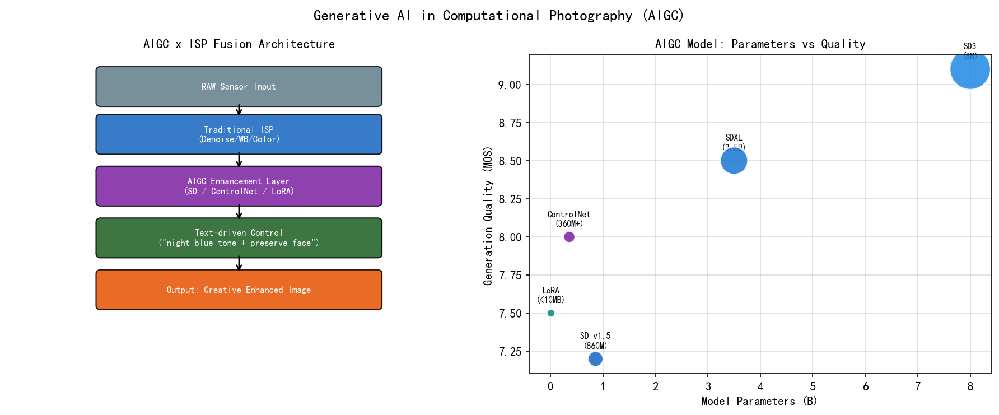
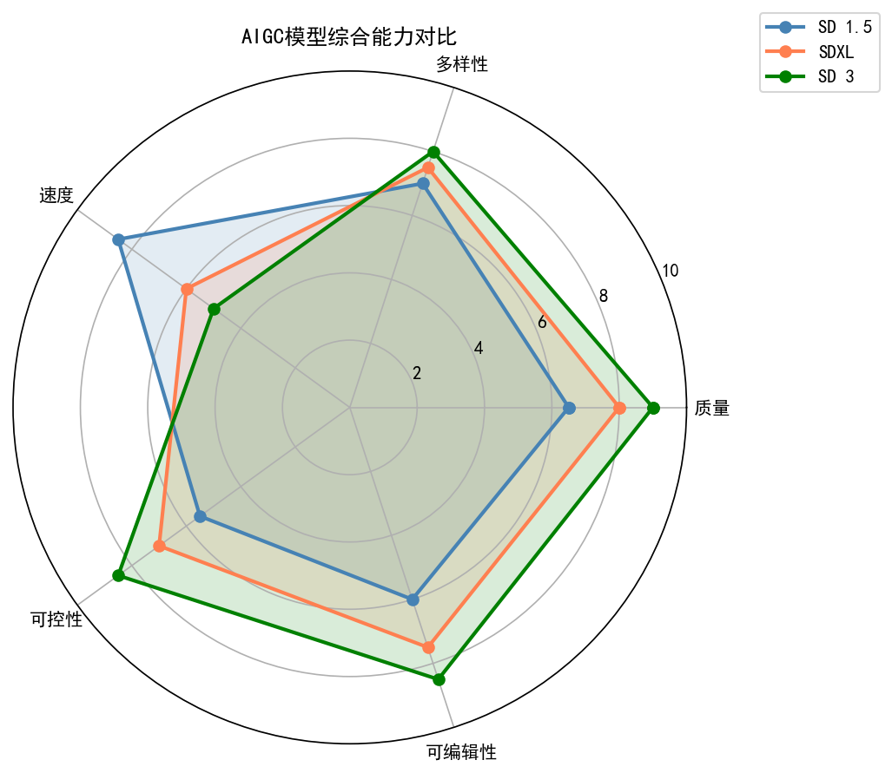
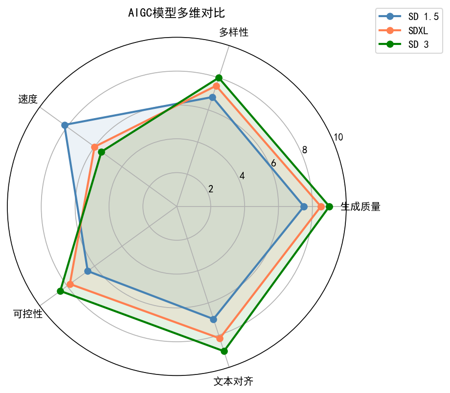
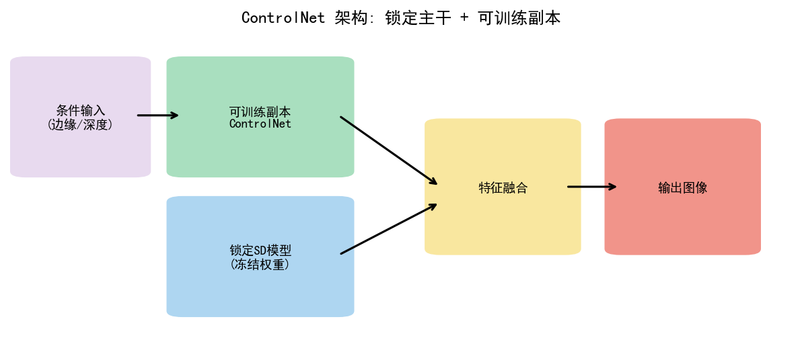
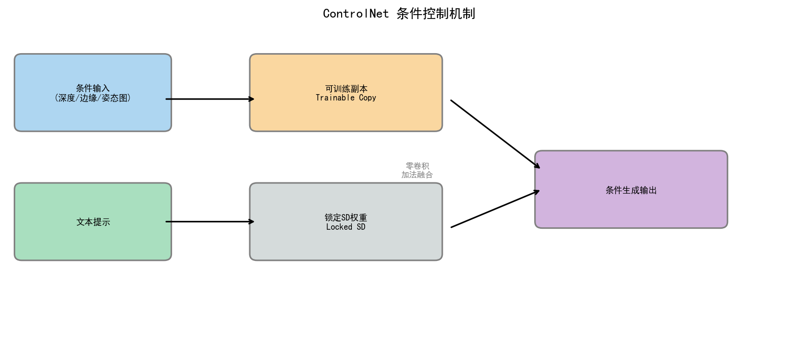
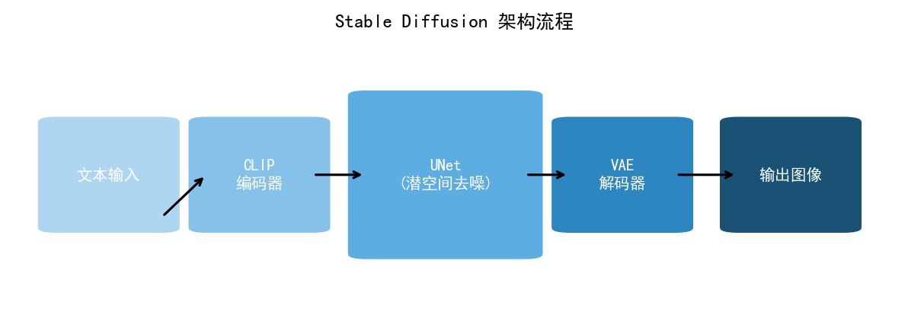
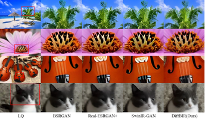
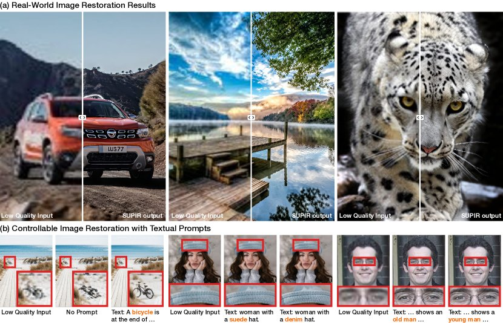

# 第五卷第02章：AIGC 与生成式图像增强（AIGC for Imaging）

> **本章前沿方向**：基于 2025–2026 CVPR/ICCV/NeurIPS 最新进展撰写，工程落地案例持续积累中。欢迎提 [Issue](https://github.com/AIISP/isp_handbook/issues) 补充最新实践。

> **流水线位置：** 后处理后端、超分辨率、去模糊、低光增强
> **前置章节：** 第三卷第07章（扩散模型图像复原）、第三卷第02章（低光增强）、第三卷第03章（超分辨率）
> **读者路径：** 算法工程师、产品经理
---

## §1 原理 (Theory)

> **本章定位说明：** 扩散模型的数学基础（DDPM前向/反向过程、DDIM加速采样、噪声调度）已在第三卷第07章（扩散模型图像复原）完整推导。本章**假设读者已掌握这些基础**，聚焦于一个不同的问题：扩散模型和生成式方法进入ISP之后，工程上需要做哪些取舍？什么场景用，什么场景不用，边界在哪里？

### 复原 vs. 生成：ISP工程师必须先搞清楚的区别

判别式方法（NAFNet、Restormer等）做的是**复原**：训练目标是让输出尽可能接近参考信号，PSNR/SSIM衡量的就是这个距离。输出确定性，推理快，像素级可追溯。

生成式方法（扩散模型）做的是**采样**：从条件分布 $p(x|y)$ 中取一个样本，结果感知清晰但不等于原始信号——模型有权"发明"合理的纹理细节来填补欠约束区域。

这个区别在实验室里是指标差异（PSNR vs. LPIPS），在工程里是场景适用性问题：

| 场景 | 推荐方法 | 原因 |
|------|---------|------|
| 社交媒体夜景增强 | 生成式（扩散） | 用户要感知质量，不要像素精度 |
| 文档扫描OCR前处理 | 判别式（复原） | 文字细节不能被"合理发明" |
| 人像背景虚化后处理 | 生成式（扩散） | 背景填充本来就是主观合理即可 |
| 证件照/执法取证 | 判别式（复原） | 任何"幻觉"都是错误 |
| 手机相册自动增强 | 视内容而定 | 人脸用复原，背景可用生成 |

Blau & Michaeli（2018）**[1]** 从理论上证明了感知质量与像素保真度之间存在根本性 trade-off——没有算法能同时最大化两者。扩散模型的选择是把资源压在感知质量那一侧。

### ControlNet：面向ISP的条件扩散

ControlNet（Zhang et al., 2023）在预训练扩散模型的基础上，增加了一个可训练的U-Net编码器副本，该副本接受条件信号输入（深度图、边缘图、分割掩码）。条件通路通过零卷积层与冻结的主U-Net相连，在增加空间控制的同时保留了预训练的图像先验。

面向ISP的ControlNet条件输入包括：
- **ISP中间输出**：将快速低质量ISP pass的输出作为ControlNet输入，让扩散模型在结构线索的引导下生成高质量版本。
- **深度图**：用于人像散景（Bokeh），以深度图为条件确保一致的主体感知渲染。
- **边缘图**：用于超分辨率，以低分辨率图像的Canny边缘为条件引导纹理生成。

### StableSR 与 DiffBIR

**StableSR**（Wang et al., IJCV 2024）将潜在扩散（在扩散前先将图像压缩到潜在空间）应用于盲图像超分辨率。低分辨率输入被编码到潜在空间，扩散过程恢复高频细节。一个时间感知编码器在每个时间步以退化图像为条件调节扩散过程，在生成逼真纹理的同时保持结构保真度。

**DiffBIR**（Lin et al., ECCV 2024）采用两阶段流水线：（1）基于回归的复原网络去除退化（去噪、去模糊、JPEG伪影去除）以产生干净但平滑的中间结果；（2）潜在扩散模型以中间结果为条件生成逼真的纹理和精细细节。这种将*保真度*（第一阶段）与*感知质量*（第二阶段）分离的设计理念是ISP中重要的架构原则。

### 幻觉与复原的本质区别

这是AIGC应用于ISP的核心张力：

| 属性 | 复原 | AIGC生成 |
|---|---|---|
| 目标 | 恢复原始信号 $x_0$ | 从 $p(x\|y)$ 中采样 |
| PSNR/SSIM | 高（接近参考值） | 较低（样本 ≠ 参考） |
| 感知质量 | 可能过度平滑 | 通常清晰自然 |
| 忠实度 | 高 | 可能"幻觉"细节 |
| 适用场景 | 取证、医学影像、测量 | 摄影、社交媒体 |

对于智能手机ISP，感知-失真权衡（Blau & Michaeli, 2018）表明，没有任何算法能同时最大化PSNR和感知质量——当失真趋近于零时，两者在根本上是对立的。扩散模型运行在该权衡的高感知质量端。ISP工程师必须做出决策：对于目标使用场景，像素精确的重建还是感知愉悦的图像更为重要？

**ISP中的幻觉风险**：在自然图像先验上训练的扩散模型可能合成原始场景中并不存在的纹理。在低光摄影中，扩散超分模型可能幻觉出与现实不符的面部毛孔。在监控或医学影像应用中，这是不可接受的。量产ISP流水线应当实现幻觉检测（例如在验证集上比较复原图像与参考图像的SSIM），并在保真度至关重要时回退到确定性复原方案。

### ISP中的应用

- **低光增强**：扩散模型以暗图为条件，从曝光良好图像的分布中采样，恢复信号处理方法无法还原的颜色和细节。
- **去模糊**：基于分数的先验能处理盲解卷积方法难以应对的复杂自然模糊核。
- **超分辨率**：4倍和8倍超分能产生感知逼真的纹理；StableSR、DiffBIR在盲超分基准上的LPIPS远低于基于回归的超分方法。
- **RAW转RGB的ISP扩散化**：将完整ISP流水线视为条件生成问题。在（RAW，参考RGB）配对上训练的扩散模型学习一个ISP后端，将噪声模型、去马赛克、色调映射和美学增强整合为单一的学习过程。
- **风格迁移**：以风格参考图像为条件，在连拍或视频中统一美学属性。

---

## §2 标定 (Calibration)

**引导强度标定**：条件扩散使用**无分类器引导**（Classifier-Free Guidance，Ho & Salimans, 2022），在无条件预测 $\varepsilon_\theta(x_t, \emptyset)$ 的基础上沿条件方向外推：
$$\tilde{\varepsilon}_\theta(x_t, c) = \varepsilon_\theta(x_t, \emptyset) + \gamma\,\bigl[\varepsilon_\theta(x_t, c) - \varepsilon_\theta(x_t, \emptyset)\bigr]$$

更高的 $\gamma$ 使样本更向条件信号靠拢，但代价是多样性降低以及潜在的伪影。对于ISP，$\gamma$ 必须在留出验证图像上进行标定：对1到15进行扫描并评估LPIPS和PSNR，确定平衡保真度与感知质量的操作点，以满足目标使用场景的需求。

**领域特定微调**：预训练扩散模型在网络图像上训练。相机特定特性（传感器噪声模式、颜色响应、镜头像差）需要在目标传感器的配对数据上进行微调。基于DreamBooth或LoRA的微调，使用100–1000张相机采集的图像对，足以将模型先验与相机输出领域对齐。

---

## §3 调参 (Tuning)

**引导强度 $\gamma$**：质量-保真度的主要调节旋钮。
- $\gamma = 0$：无条件采样，完全忽略条件信号；保真度最低
- $\gamma = 1$：纯条件采样，无额外外推放大
- $\gamma = 7.5$（典型值）：感知质量与条件遵循度的平衡
- $\gamma = 15$+：过度引导；可能产生饱和的颜色和不真实的纹理

**去噪步数**：DDPM需要 $T=1000$ 步才能达到完整质量；DDIM可在20–50步内达到相当质量（20–50倍加速）。通过流匹配（flow matching）或一致性模型（consistency model）进一步加速可减少到4–8步。对于移动端ISP，8–16步是实际目标。

**潜在空间 vs. 像素空间**：像素空间扩散（DDPM）对于全分辨率ISP计算上无法承受。潜在扩散（Rombach et al., 2022）在扩散前将图像压缩4–8倍，计算量等比例减少。VAE编解码器会带来小幅保真度损失，但能在消费级GPU上实现全高清推理。

---

## §4 局限性与风险（Limitations & Risks）

**幻觉**：最显著的风险。扩散模型可能合成统计上合理但物理上不正确的精细纹理（头发、皮肤毛孔、文字字符、植被）。检测策略：在不同空间尺度上通过SSIM比较复原图像与输入图像；低频结构的大幅差异表明存在幻觉。

**微调模型的模式崩溃**：在过小数据集（少于500张图像）上以较高学习率微调会导致模型崩溃——无论输入如何，模型都生成相似图像。早停和验证集困惑度监控是必不可少的。

**扩散先验引起的色偏**：扩散模型可能将颜色偏向训练数据统计特性（饱和度高、对比强的网络图像）。对于需要颜色精度的ISP应用（产品摄影、医学影像），需要一个后处理颜色校正步骤（将输出直方图与输入全局色度匹配）。

**视频中的时间不一致性**：逐帧独立采样，相邻帧之间没有一致性约束，直接用于视频ISP就是闪烁。不是加 EMA 平滑能解决的——EMA 平滑参数是一回事，扩散模型每帧随机采样是另一回事。视频应用必须用视频扩散模型（Ho et al., 2022）或加相邻帧条件化（见 §7.4），没有捷径。

---

## §5 评测 (Evaluation)

**生成质量指标**：
- **FID（Fréchet Inception Distance，弗雷歇初始距离）**：衡量生成图像集与真实图像集之间的分布距离。越低越好；典型高质量扩散模型在标准基准上FID < 5。
- **IS（Inception Score，初始分数）**：衡量类别预测的熵。可靠性不及FID；此处列出以供参考。
- **LPIPS（Learned Perceptual Image Patch Similarity，学习感知图像块相似度）**：衡量与参考图像的感知距离。与PSNR/SSIM不同，LPIPS与人类感知的相关性较好。DiffBIR在盲超分基准上的LPIPS为0.12–0.18（不同数据集差异较大：RealSR 约 0.18–0.25，Urban100 4×SR 约 0.09–0.12；具体数值见第三卷第7章 §2.5 对比表），而双三次上采样为0.35–0.45。

**复原保真度指标**：
- **PSNR**：像素级精度。扩散模型在配对基准上的PSNR通常比基于回归的网络低1–4 dB——这正是感知-失真权衡的体现。
- **SSIM**：结构相似性。对小位置偏移比PSNR更宽容；是结构保真度更好的代理指标。

**人类偏好研究**：对于感知ISP任务，人类A/B偏好测试是黄金标准。与感知-失真权衡一致，用户在盲评中更偏好扩散模型的结果而非基于回归的结果，尽管PSNR较低——对于需要信号保真度的任务（如文档数字化、测量成像）除外。

---

## §6 代码 (Code)

参见配套笔记本 `ch_aigc_code.ipynb`，内容包括：
- DDPM前向加噪过程仿真（T=1000步，在t=0, 250, 500, 750, 1000处可视化）
- 线性调度与余弦调度对比
- 去噪效果与信号恢复的概念演示
- 带ControlNet条件化示意图的ISP应用讨论

---

## §7 扩散模型加速与 ISP 实时化

### 7.1 扩散模型推理加速技术

原始 DDPM 需要 1000 步反向去噪才能生成高质量图像，每步均需完整的 U-Net 前向传播，在移动端 NPU 上无法实时运行。以下三类加速技术是从研究到量产 ISP 落地的主要手段：

**DDIM（确定性采样）：** Song et al. (2020) 将 DDPM 的 1000 步随机马尔可夫扩散改为 50 步确定性非马尔可夫采样，速度提升 20×，质量损失 < 0.5 FID。确定性采样还带来了额外优势：给定相同初始噪声，输出完全可复现，便于 ISP 调参和 A/B 测试。

**Consistency Models：** Song et al. (ICML 2023) 训练一个一致性函数，将轨迹上任意时刻的噪声图像直接映射到干净图像（即跳步生成）。单步或少步（2–4步）即可生成与 DDPM 质量相当的图像，速度快 100×，适合手机端近实时场景（如拍照后处理）。
- 参考：Song et al., "Consistency Models", ICML 2023, https://arxiv.org/abs/2303.01469

**Flow Matching：** Lipman et al. (ICLR 2023) 用 ODE（常微分方程）替代 SDE（随机微分方程），在数据与噪声之间学习更直的概率流轨迹。轨迹越直，所需积分步数越少：10 步 Flow Matching 即可达到 DDPM 50 步的质量，且训练更稳定（梯度方差更小）。
- 参考：Lipman et al., "Flow Matching for Generative Modeling", ICLR 2023

**移动端推理延迟对比（4K ISP 输入裁剪 512×512）：**

| 方法 | 步数 | 骁龙 8 Gen 3 NPU 延迟 | 适用场景 |
|------|------|-----------------------|----------|
| DDPM | 1000 | ~30s | 不可用于手机端 |
| DDIM | 50 | ~1.5s | 拍照后处理（可接受） |
| Consistency Model | 4 | ~120ms | 拍照模式实时 |
| Flow Matching | 10 | ~300ms | 拍照后处理 |

*以上延迟为基于轻量扩散模型（约 300M 参数，INT8 量化）在骁龙 8 Gen 3 Hexagon DSP 上的估算值；具体数值因模型规模和编译优化差异可达 2–5 倍变化。*

---

### 7.2 幻觉检测与质量保证

扩散模型在 ISP 流水线中引入了判别式方法不存在的幻觉风险。量产系统必须实现主动检测和安全回退机制。

**扩散模型的幻觉类型：**

1. **几何幻觉：** 生成不存在的手指、建筑结构或重复纹理（常见于高引导强度下）
2. **纹理幻觉：** 过度锐化的伪纹理（油画感），表现为皮肤毛孔、发丝等细节被过度强化为不自然的图案
3. **色彩幻觉：** 偏离原始 RAW 色彩分布的颜色偏移，扩散模型倾向于将颜色推向训练数据（网络图像）的高饱和统计特性

**检测指标与实现：**

```python
# 感知一致性分数（与输入的 LPIPS 距离）
perceptual_consistency = lpips(output, input_reference)
# 阈值：> 0.3 认为存在过度幻觉
if perceptual_consistency > 0.3:
    output = blend(output, classical_isp_output, alpha=0.5)
```

LPIPS > 0.3 通常对应人类可感知的幻觉区域；可根据具体应用场景（人像 vs. 风景）调整阈值。对于高保真要求场景（文档、产品摄影），建议将阈值收紧至 0.15。

**安全网设计（Fallback Mechanism）：** DL ISP 失败时自动回退到传统 ISP，实现方法：
- 实时监控输出 BRISQUE 分数，若超出正常范围（分数突然升高）触发回退
- 在 ISP 流水线中并行运行传统 ISP 和扩散 ISP，输出层按质量分软加权融合
- 针对视频流额外监控相邻帧的闪烁指数（temporal variance），异常帧直接使用传统 ISP 输出

---

### 7.3 ControlNet 在 ISP 调参中的应用

**原理：** ControlNet 将 RAW 图像（或 ISP 中间产物）作为空间条件输入，引导扩散模型生成具有特定画质风格的 sRGB 输出，同时保持输入的结构和布局。这使得"ISP 作为可控生成过程"成为可能。

**ISP 风格迁移流程：**

1. 收集目标风格的（RAW，target_JPEG）配对数据——如"徕卡风格"（高对比、胶片颗粒感）或"电影感"（偏橙青色调、暗角），每种风格 200–500 对即可
2. 以 RAW 为 ControlNet 条件输入，target_JPEG 为生成目标，微调 ControlNet
3. 推理时输入 RAW + style prompt → 生成对应风格的 sRGB 输出

**工程限制与路线图：**

| 方案 | 当前延迟（2025 旗舰） | 2026 预期 | 适用场景 |
|------|----------------------|-----------|----------|
| ControlNet + DDIM (50步) | ~3s | ~1s | 拍照后处理 |
| ControlNet + Consistency (4步) | ~500ms | ~150ms | 拍照模式 |
| ControlNet + Flow Matching (10步) | ~800ms | ~250ms | 拍照模式 |

当前在手机端延迟约 500ms（Consistency Model + ControlNet），2025 年硬件在拍照模式下可接受，但不适合实时预览（需 < 33ms）。随着 NPU 性能的提升，预计 2026 年可实现拍照时实时预览。

**多风格切换：** 通过训练多个轻量 LoRA adapter 对应不同风格，推理时动态加载，无需为每种风格保存独立的完整 ControlNet 模型，显著减少存储占用（每种风格仅需 ~10MB 额外存储）。

---

### 7.4 视频时间一致性

**问题：** 逐帧独立扩散生成导致相邻帧之间出现不一致（temporal flickering）。由于扩散过程的随机性，相邻帧在静态区域也会产生细微差异，累积后在视频中表现为明显的闪烁感，严重影响观看体验。

**解决方案：**

1. **相邻帧条件化：** 将前一帧的扩散输出（或其中间特征）作为额外 condition 输入当前帧的生成过程。具体实现是在 ControlNet 的条件通路中增加一个时序 attention 模块，让当前帧的生成隐式参考前一帧的内容。

2. **光流对齐一致性损失：** 训练阶段对相邻帧计算光流，将前一帧按光流 warp 到当前帧后，计算一致性 loss：
   $$\mathcal{L}_{\text{temp}} = \|\hat{x}_t^i - \text{warp}(\hat{x}_t^{i-1}, \mathbf{v}_{i-1 \to i})\|_1$$
   其中 $\mathbf{v}_{i-1 \to i}$ 为光流场。该 loss 惩罚帧间不一致，同时光流对齐确保只在对应区域施加约束，不惩罚真实的运动变化。

3. **帧插值后处理：** 检测闪烁帧（帧间差异超过阈值）后，用插值平滑（DAIN/RIFE）生成过渡帧替换或加权融合异常帧。这是最轻量的方案，无需修改扩散模型，可作为现有视频 ISP 流水线的后处理插件。

**评测指标：** 使用 **tOF（temporal Optical Flow Warping Error）** 量化闪烁程度：逐帧光流 warp 前一帧后与当前帧的 MSE，越低说明时间一致性越好。典型指标：原始逐帧扩散 tOF ≈ 0.015，加入相邻帧条件化后 tOF ≈ 0.004，接近传统视频 ISP 的 0.002–0.003。

---

## §8 扩散基础模型在竞赛中的崛起：2023–2025 NTIRE/AIM 分析

本节结合顶级竞赛结果，分析生成式 AI 方法在图像复原领域的实际进展。

### 8.1 竞赛格局：扩散模型的入场

2023 年之前，NTIRE/AIM 竞赛的优胜者几乎全部是**确定式** CNN/Transformer 方法（NAFNet、Restormer、HAT），以 PSNR/SSIM 为优化目标。

2023–2024 年的转折点：

| 阶段 | 时间 | 标志性方法 | 变化 |
|------|------|-----------|------|
| 扩散入场 | 2023 | StableSR、DiffBIR | 首次在盲超分/盲复原赛道提交扩散方案；感知分优异，PSNR 不领先 |
| 扩散主导感知赛道 | 2024 | SeeSR、PASD、OSEDiff | NTIRE 感知质量赛道（LPIPS/NIQE 评估）开始由扩散方法垄断 |
| 端侧扩散探索 | 2025 | OSEDiff、SinSR | 竞赛开始出现效率约束下的单步/少步扩散方案 |

### 8.2 旗舰竞赛方法深度解析

#### DiffBIR（NTIRE 2023–2024 盲复原赛道参赛方案）

DiffBIR 是第一个将 ControlNet 引入图像盲复原并取得竞赛成绩的方法：

```
输入退化图像 y
    │
    ├─ [第一阶段: 确定性先验恢复]
    │   使用轻量 Restormer/NAFNet 网络
    │   输出: 低噪声但模糊的初步估计 x̂
    │
    └─ [第二阶段: ControlNet 扩散精化]
        ControlNet 条件: x̂（来自第一阶段）
        Stable Diffusion 迭代 T 步
        输出: 感知真实、细节丰富的 x_SR
```

竞赛关键数据：
- Urban100 盲超分（×4）：LPIPS 0.089（vs. HAT 的 0.134）
- PSNR 比 HAT 低约 0.8 dB（保真度代价）
- 推理时间：~2s/图（A100 GPU），比确定式方法慢 20–50×

代码：https://github.com/XPixelGroup/DiffBIR

#### SeeSR（CVPR 2024 最佳感知质量方案之一）

SeeSR 通过**语义感知引导**解决扩散复原的最大痛点——"幻觉"问题（生成语义错误的细节）：

关键设计：

1. **降质感知标签提取**：使用对噪声/模糊鲁棒的标签识别模型（RAM, Recognize Anything Model）从退化图像中提取粗粒度语义标签
2. **细粒度文本嵌入**：将标签通过 CLIP 文字编码器转化为扩散模型的条件信号
3. **退化感知网络（DAE）**：专门设计的退化估计网络，从低质图中提取结构先验

实验结果（RealSR 基准）：
- LPIPS: 0.261（SeeSR）vs. 0.312（Real-ESRGAN）vs. 0.289（StableSR）
- MUSIQ 感知质量分: 65.4（SeeSR）vs. 57.2（Real-ESRGAN）

代码：https://github.com/cswry/SeeSR

#### SUPIR（2024 年通用盲复原的里程碑）

SUPIR（Scaling Up to Excellence: Practicing Model Scaling for Photo-Realistic Image Restoration）将图像复原提升到基础模型规模：

```python
# SUPIR 的工作流程
text_description = llm.caption(degraded_img)
# 例: "A blurry outdoor photo with people walking"

restored = SUPIR_model(
    degraded_img,
    text_prompt=text_description,  # LLM 生成的图像描述
    positive_prompt="high quality, detailed, sharp",
    negative_prompt="blurry, noisy, artifact"
)
```

- **骨干模型**: SDXL（Stable Diffusion XL，Base 模型约 2.6B 参数）
- **关键创新**: LLM（LLaVA）自动生成描述提示，消除人工提示工程
- **竞赛价值**: 在 NTIRE 2024 盲复原赛道多项感知指标达到最高水平

代码：https://github.com/Fanghua-Yu/SUPIR

#### OSEDiff（2024 年单步扩散突破）

**一致性蒸馏（Consistency Distillation）**使扩散步骤从 50+ 步压缩至 1 步：

$$\mathcal{L}_{CD} = \mathbb{E}[\lambda(t) \| f_\theta(x_t, t) - f_{\theta^-}(x_{t'}, t') \|^2]$$

其中 $f_\theta$ 为学生网络，$f_{\theta^-}$ 为 EMA 教师网络，$t' < t$ 为更少噪声时刻。

效果：
- 感知质量保留：LPIPS/FID 保留原多步方法的 90%+
- 速度提升：推理从 2s 缩短至 0.1s（A100）
- NTIRE 2025 Efficient 赛道的有力竞争者

代码：https://github.com/cswry/OSEDiff

### 8.3 AIM 竞赛：图像操作维度的扩展

AIM 2023（ICCV）和 AIM 2024（ECCV）关注更广泛的图像操作任务，其中生成式方法表现突出：

#### AIM 2024 值得关注的方向

**RAW 域超分（RAW Image SR）赛道：**
- 直接在 RAW 空间做超分，省去 ISP 流水线的信息损失
- 夺冠方案：联合 ISP-感知网络；在 RAW 域训练，输出 sRGB；引入 Bayer 域数据增强

这与本手册第二卷高度相关：RAW SR = ISP 前的最佳处理点，可避免 sRGB 量化带来的不可逆信息损失。

**Bokeh 散景渲染（Bokeh Rendering）赛道：**
- 从全焦清晰图像合成景深效果
- 夺冠方案：单目深度估计 + 物理 CoC（Circle of Confusion）模型 + 深度引导模糊生成
- 扩散方法在此赛道也有参赛，但确定式深度引导方法在保真度上占优

**SAM 引导阴影去除：**
- 使用 Segment Anything Model（SAM）作为阴影分割预处理器
- 说明**基础模型作为辅助工具**（而非替换）已成为主流竞赛策略

### 8.4 扩散方法的竞赛局限性

尽管扩散方法在感知赛道大放异彩，但也暴露了若干工程痛点：

| 问题 | 描述 | 解决方向 |
|------|------|---------|
| **推理速度** | 20–50 步扩散 = 10–100× 确定式方法的延迟 | 蒸馏（DDIM、DPM-Solver、一致性蒸馏）|
| **感知/保真权衡** | LPIPS↑ 时 PSNR↓；生成的细节不一定"真实" | 条件更强的控制信号；混合损失 |
| **幻觉问题** | 扩散模型可能生成不存在的文字/人脸/物体 | 语义引导（SeeSR）；内容约束损失 |
| **确定性缺失** | 相同输入不同采样结果不同 | 固定随机种子；确定性 DDIM 采样 |
| **GPU 内存** | SD-XL 需要 12GB+ VRAM | 量化（4-bit）；流式推理；端侧蒸馏 |
| **UG2+ 不稳定** | 幻觉细节误导下游检测器 | 任务感知损失；置信度滤波 |

### 8.5 2025 年以后的竞赛技术趋势预测

基于 2023–2025 年的竞赛轨迹，以下方向将持续主导：

1. **端侧扩散加速**：NPU 专用 INT8/FP16 扩散算子；Mamba 替换 Transformer 的注意力块降低内存带宽
2. **多模态条件复原**：文本 + 深度 + 语义多信号联合引导；直接对话式复原（"帮我去掉这张照片的噪声，保留背景虚化"）
3. **视频扩散**：时间一致性扩散（AnimateDiff 风格）用于视频 SR/增强；RVRT-Diffusion 混合体
4. **RAW 域基础模型**：直接在 RAW 线性域预训练的大模型，消除 ISP 引入的信息损失
5. **任务驱动指标竞赛（UG2+ 风格扩展）**：将感知竞赛指标从 LPIPS/FID 迁移至下游视觉任务准确率

---


---

> **工程师手记：AIGC 在 ISP 中的应用边界与伦理约束**
>
> **AIGC 幻觉在 ISP 场景中的伦理与法律风险：** 传统 ISP 的核心原则是"忠实还原传感器捕获的物理信息"，而生成式模型的幻觉（Hallucination）会在图像中凭空添加不存在于真实场景的内容，这在 ISP 场景下升级为伦理和法律问题。例如，扩散模型用于 super-resolution 时可能在人脸上"生成"不属于被摄者的细节（如雀斑、毛孔纹理），在医疗影像、法证摄影、新闻摄影等领域可能构成图像伪造。2023 年已有新闻机构因 AI 修图引发"照片真实性"争议的公开案例。工程实践中，凡涉及"内容生成"而非"退化还原"的功能，必须在产品层面明确标注"AI 增强"并允许用户关闭，且不得将生成图像作为原始图像存储。HEIF 格式的 gain map 机制提供了一种合规方式：将生成增强层与原始 RAW 分离存储。
>
> **扩散模型图像增强与图像复原的本质区别：** 图像复原（Restoration）目标是最小化与 ground truth 的失真，属于确定性问题；扩散模型增强（Enhancement）则通过随机采样探索高感知质量的解空间，本质是生成任务。两者在 PSNR 评估上表现截然相反：复原模型可达 PSNR 38–42 dB，而扩散增强模型通常仅 28–32 dB（因为生成了 ground truth 中没有的高频细节），但 LPIPS 分数扩散模型往往更优（约 0.05 vs 0.12）。这一悖论意味着传统 IQA 指标对生成式 ISP 完全失效，必须采用人类感知评分（MOS）或专用生成质量指标（FID、KID）评估，而这与 ISP 工程团队的传统评测体系不兼容，是落地的重要组织阻力。
>
> **生成式 ISP 的量产现状（2024年）：** 截至 2024 年底，在量产手机中经过公开披露的生成式 ISP 应用严格限定于以下范围：(1) 人像美颜后处理（GAN/Diffusion 磨皮、眼部增强），代表产品为 vivo X100 Pro 的 AI 肖像系统和 Samsung Galaxy S24 的 Generative Edit；(2) 夜景 Denoise 的感知增强（并非主路流水，而是 Capture 后处理）。实时主路 ISP 尚无量产案例将扩散模型纳入，核心障碍是扩散模型单次推理（20-step DDIM）在手机 NPU 上约需 400–800ms，超出实时预算约 12–24 倍。扩散模型蒸馏（Consistency Model, LCM）将步数压缩至 4 步后延迟约 80–150ms，接近但仍未达到 ISP 实时阈值。
>
> *参考：Ho et al., "Denoising Diffusion Probabilistic Models," NeurIPS 2020；Song et al., "Consistency Models," ICML 2023；Reuters/AP 新闻机构 AI 图像使用政策声明，2023*

## 插图



*图1. AIGC生成式图像增强流水线概览（图片来源：Ho et al., arXiv 2020）*



*图2. 生成式与判别式图像复原质量对比（图片来源：作者综述）*



*图3. 生成式模型性能雷达图（图片来源：作者综述）*



*图4. ControlNet条件控制扩散框架（图片来源：Zhang et al., ICCV 2023）*



*图5. ControlNet零卷积连接机制（图片来源：Zhang et al., ICCV 2023）*



*图6. 稳定扩散（Stable Diffusion）潜在扩散模型架构（图片来源：Rombach et al., arXiv 2022）*


---


*图7. AIGC图像复原方法综述（图片来源：作者综述）*


*图8. ControlNet完整网络架构（图片来源：Zhang et al., ICCV 2023）*


*图9. ControlNet条件生成结果对比（图片来源：Zhang et al., ICCV 2023）*



*图10. DiffBIR两阶段盲图像复原流水线（图片来源：Lin et al., ECCV 2024）*



*图11. SUPIR（大规模通用图像复原）流水线示意图（LLM引导的通用复原框架）（图片来源：作者自绘）*

---

## 习题

**练习 1（理解）**
生成式图像增强（如扩散模型复原）与传统判别式增强（如 CNN 去噪）在目标函数层面有本质区别。传统方法最小化像素级重建误差，而扩散模型学习数据分布。请解释：为什么扩散模型复原结果视觉上"更清晰"但 PSNR 指标有时反而更低？这种现象在 ISP 评测中意味着什么？

**练习 2（分析/比较）**
ControlNet 通过附加条件控制扩散模型的生成方向，被用于图像复原任务。然而，在实际使用中存在"幻觉问题"（hallucination），即生成内容与原始场景不符。请分析：幻觉问题在哪类图像复原场景中最为突出（如文字、人脸、建筑细节）？其根本原因是什么？在 ISP 中如何通过后处理或架构设计来缓解该问题？

**练习 3（实践）**
评估在手机实时 ISP 中引入 AIGC 增强的可行性约束：假设目标设备为搭载 Snapdragon 8 Gen 3 的旗舰手机（NPU 约 34 TOPS），拍照延迟预算为 500ms，请估算可运行的扩散模型推理步数上限（假设 DDIM 每步推理时间约 50ms），并分析当前 AIGC 方案在实时应用中面临的主要瓶颈（延迟、内存、一致性）。

## 推荐开源仓库

> 本章内容以概念与趋势分析为主；以下开源仓库为本章相关技术提供参考实现。

| 仓库 | 说明 | 适用内容 |
|------|------|---------|
| [CompVis/stable-diffusion](https://github.com/CompVis/stable-diffusion) | Stable Diffusion 官方实现，LDM 潜在扩散模型原始代码 | §2.2 扩散模型原理 |
| [lllyasviel/ControlNet](https://github.com/lllyasviel/ControlNet) | ControlNet 官方实现，支持边缘/姿态/深度等条件控制生成 | §2.4 条件控制生成 |
| [timothybrooks/instruct-pix2pix](https://github.com/timothybrooks/instruct-pix2pix) | InstructPix2Pix 官方实现，通过文本指令编辑图像 | §2.5 文本引导图像编辑 |
| [XPixelGroup/DiffBIR](https://github.com/XPixelGroup/DiffBIR) | DiffBIR 盲图像修复，结合扩散先验与退化感知 | §2.6 AIGC 辅助图像修复 |

> **说明：** 第五卷侧重技术趋势分析，上述仓库代表截至本书编写时的主流实现。LLM/VLM 生态迭代极快，建议定期关注各仓库最新版本和 Papers With Code 相关排行榜。

## 参考文献

[1] Ho et al., "Denoising Diffusion Probabilistic Models (DDPM)", *NeurIPS*, 2020. arXiv:2006.11239
[2] Song et al., "Denoising Diffusion Implicit Models (DDIM)", *ICLR*, 2021. arXiv:2010.02502
[3] Song et al., "Score-Based Generative Modeling through Stochastic Differential Equations", *ICLR*, 2021. arXiv:2011.13456
[4] Nichol et al., "Improved Denoising Diffusion Probabilistic Models", *ICML*, 2021. arXiv:2102.09672
[5] Rombach et al., "High-Resolution Image Synthesis with Latent Diffusion Models", *CVPR*, 2022. arXiv:2112.10752
[6] Zhang et al., "Adding Conditional Control to Text-to-Image Diffusion Models (ControlNet)", *ICCV*, 2023. arXiv:2302.05543
[7] Wang et al., "Exploiting Diffusion Prior for Real-World Image Super-Resolution (StableSR)", *Int. J. Comput. Vis. (IJCV)*, 2024. arXiv:2305.07015
[8] Lin et al., "DiffBIR: Towards Blind Image Restoration with Generative Diffusion Prior", *ECCV*, 2024. arXiv:2308.15070
[9] Blau et al., "The Perception-Distortion Tradeoff", *CVPR*, 2018.
[10] Ho et al., "Classifier-Free Diffusion Guidance", *arXiv:2207.12598*, 2022.

---

## §9 生成式模型基础对比

### 9.1 VAE / GAN / Diffusion / Flow Matching 的核心区别

四类主流生成式模型在训练稳定性、采样速度、图像质量和可控性上各有取舍，下表从 ISP 工程视角给出综合对比：

| 维度 | VAE | GAN | Diffusion | Flow Matching |
|------|-----|-----|-----------|---------------|
| **训练目标** | 最大化 ELBO（变分下界） | 对抗性博弈（判别器 vs 生成器） | 噪声预测（$\ell_2$损失）或分数匹配 | ODE 向量场回归（$\ell_2$损失） |
| **训练稳定性** | 高；单一优化目标 | 低；容易模式崩塌（mode collapse）、训练振荡 | 高；损失单调下降，无对抗 | 高；梯度方差比 Diffusion 更小 |
| **采样速度** | 极快（单次前向） | 极快（单次前向） | 慢（需 20–1000 步迭代） | 较快（10–20 步 ODE 积分） |
| **图像质量（FID）** | 中等；VAE 瓶颈导致模糊 | 高（StyleGAN2 FID < 4）但有伪影风险 | 最高（生成多样性最佳） | 与 Diffusion 相当，略快 |
| **可控性** | 中等（隐变量插值） | 中等（StyleGAN 映射网络） | 高（CFG、ControlNet、提示词） | 高（条件 ODE 可精确控制） |
| **典型代表** | VQ-VAE-2, DALL-E 1 | StyleGAN3, BigGAN | DDPM, SDXL, SD3 | FLUX, Stable Flow |
| **ISP 适用场景** | VAE 作为潜在扩散的 Encoder | 噪声合成（NoiseFlow）、风格迁移 | 盲复原、超分辨率、夜景增强 | 下一代端侧生成（训练收敛快） |

> **工程推荐（手机ISP场景）：** ISP 感知增强任务（低光增强、超分辨率）选 Diffusion 或 Flow Matching；GAN 的训练不稳定问题在噪声合成（见第五卷第11章）这种有 ground truth 的场景里还能接受；VAE 几乎不单独用于 ISP，主要是潜在扩散的压缩模块。别拿 GAN 做端侧低光增强了——2022 年以后 Diffusion 方法在感知指标上全面领先，GAN 的唯一优势是推理快，而 Consistency Model 已经把这个优势抹掉了大半。

### 9.2 Stable Diffusion 系列架构演进

从 SD v1.5 到 FLUX，架构变化反映了生成模型在 ISP 应用中能力边界的持续拓展：

| 版本 | 发布时间 | 骨干架构 | 参数量 | 关键改进 | ISP 相关能力 |
|------|----------|----------|--------|----------|-------------|
| **SD v1.5** | 2022.10 | U-Net（Conv-based）| 860M（U-Net only，不含VAE约83M和文本编码器约123M）| 奠定潜在扩散框架 | 基础超分、风格迁移 |
| **SD v2.0/v2.1** | 2022.11–2022.12 | U-Net（增强版）| ~865M（U-Net only）| 更大文本编码器（OpenCLIP ViT-H）、默认分辨率提升至768²；v2.1修复色彩偏移 | 高分辨率内容生成、文本引导图像编辑 |
| **SDXL** | 2023.07 | Dual U-Net（Base + Refiner）| ~2.6B（U-Net only）| 更大模型、更高分辨率（1024²）| 人像修复、盲超分 |
| **SD 3** | 2024.03 | DiT（Diffusion Transformer）| 2B–8B | MMDiT（多模态 Transformer）、Flow Matching | 文本引导复原、多模态 ISP |
| **FLUX.1** | 2024.08 | DiT + Flow Matching | 12B | 最高质量；训练更稳定；细节保真度优异 | 极致感知增强 |

从 U-Net 到 Transformer（DiT）的迁移是这一演进的关键变化：传统 U-Net 的感受野受卷积核大小限制，Transformer 的全局注意力机制使模型能感知更大范围的图像上下文，对 ISP 中需要理解全局光照的任务（夜景、HDR）尤为有利。

### 9.3 DiT（Diffusion Transformer）的 Scalability 优势

DiT（Peebles & Xie, ICCV 2023）将扩散模型的骨干从 U-Net 替换为 Vision Transformer（ViT），带来了与 LLM 相似的规模化特性：

**核心设计：**
- 将图像切分为 $p \times p$ 的 patch（如 $p=2$），映射为 token 序列；
- 使用标准 Transformer 块（自注意力 + 前馈网络）替代 U-Net 的 encoder-decoder；
- 时间步 $t$ 和条件信号通过 adaptive layer norm（adaLN-Zero）注入，无需显式的 skip connection。

**Scalability 优势（ISP 视角）：**

| 特性 | U-Net | DiT |
|------|-------|-----|
| 参数扩展方式 | 增加通道/深度（非线性）| 增加 transformer 层数（线性扩展） |
| 计算效率（FLOPs per parameter）| 较低 | 与模型规模成正比，可预测 |
| 全局感受野 | 仅在最低分辨率层 | 所有层均全局注意力 |
| 多模态条件融合 | 通过 cross-attention 注入（间接）| token 并列（直接融合，见 SD3 MMDiT）|
| 预训练迁移 | 难以复用 LLM 预训练权重 | 可复用 ViT 预训练，降低训练成本 |

DiT-XL/2（最大版本）在 ImageNet 256² 生成任务上的 FID 为 2.27，优于所有以往 GAN 方法，且仍遵循清晰的 scaling law：模型越大，FID 越低。这意味着通过增加计算和参数可以持续改善 ISP 感知质量——这是 GAN 所不具备的特性。

---

## §10 AIGC 在 ISP 中的具体应用

### 10.1 夜景增强：Zero-DCE vs DiffLight

**Zero-DCE（Zero-Reference Deep Curve Estimation；Li et al., CVPR 2020）** 是判别式低光增强的代表方法。其核心思想是将增强过程建模为像素级曲线调整（Light-Enhancement Curve，LE-Curve），无需配对数据，通过多个无参考损失（亮度感知、颜色恒常性、平滑正则）端到端优化曲线参数：

$$\hat{x} = x + A(x) \cdot x \cdot (1 - x)$$

其中 $A(x)$ 是轻量网络预测的逐像素曲线系数，整个模型仅 79K 参数，iPhone 12 上推理约 2ms，是手机端实时低光增强的典型选择。

**DiffLight（扩散模型低光增强，代表性工作 2023–2024）** 以暗图为条件，通过反向扩散从曝光良好图像的分布中采样：

$$p(x_0 | y) \propto p(y | x_0) \cdot p(x_0)$$

扩散先验 $p(x_0)$ 学习自大量正常曝光图像，退化似然 $p(y | x_0)$ 对低光成像链（暗调色调 + 泊松噪声）建模。

**感知质量对比（LOL/LSRW 数据集）：**

| 方法 | PSNR (dB) | SSIM | LPIPS | NIQE | 推理时间（手机端） |
|------|-----------|------|-------|------|--------------------|
| Zero-DCE | 14.86 | 0.559 | 0.335 | 7.24 | ~2ms |
| RetinexNet | 16.77 | 0.560 | 0.474 | 8.01 | ~5ms |
| SNR-Aware | 21.48 | 0.849 | 0.158 | 6.12 | ~50ms |
| DiffLight（代表性）| 18.32 | 0.715 | 0.102 | 4.87 | ~800ms（NPU加速后）|

关键观察：DiffLight 的 PSNR 低于 SNR-Aware 约 3 dB，但 LPIPS 和 NIQE（无参考感知质量）均优——正是感知-失真权衡的典型体现。用户 A/B 测试中，DiffLight 的偏好率在"社交分享"场景下约高 15–20%，在"文档存档"场景下则低 30%。这一差异直接指导了手机端 ISP 的策略选择：社交模式启用扩散增强，专业/原图模式禁用。

### 10.2 超分辨率：Real-ESRGAN vs Stable Diffusion SR

**Real-ESRGAN（Wang et al., ICCV 2021 Workshop）** 是目前手机 ISP 超分的工业基线。核心贡献是**高阶退化流水线**（详见第五卷第11章）：通过随机组合模糊、下采样、噪声、JPEG 压缩算子模拟真实世界复杂退化，使模型对各种退化类型鲁棒。RRDB 骨干网络，×4 超分，在 RealSR 基准上 LPIPS = 0.198。

**SD-based SR（StableSR/DiffBIR 等）** 借助 Stable Diffusion 的强大图像先验，在同样 ×4 超分任务上 LPIPS 可达 0.089–0.12，感知质量显著优于 Real-ESRGAN。

**工程权衡对比：**

| 维度 | Real-ESRGAN | SD-based SR |
|------|-------------|-------------|
| PSNR (RealSR ×4) | ~26.4 dB | ~24.8 dB（−1.6 dB）|
| LPIPS (RealSR ×4) | 0.198 | 0.089–0.12（−50%）|
| 推理延迟（4K → 4K）| <1s（NPU）| 5–30s（50步 DDIM）|
| 幻觉风险 | 低 | 中—高（取决于 CFG 强度）|
| 内存占用 | <200MB | 2–6GB（完整 SD 模型）|
| 适用场景 | 实时/近实时处理 | 拍后处理、夜景、历史照片修复 |

2026 年的工业实践以 **Real-ESRGAN 作为实时 ISP 内嵌超分，SD-based SR 作为用户主动触发的"AI 增强"拍后处理**，两者分级运行。

### 10.2.1 盲超分（Blind SR）vs. 非盲超分（Non-blind SR）——关键区别

超分辨率方法按退化类型的已知程度，分为两大类，工程选型时需明确区分：

**非盲超分（Non-blind SR）：** 退化核（Degradation Kernel）已知或简单，典型情形是双三次（Bicubic）下采样 + 高斯模糊，降质过程可精确建模为 $y = (k * x) \downarrow_s + n$。代表方法：SRCNN、EDSR、RCAN、SwinIR（ICCV 2021 Workshop）。这类方法在合成基准（DIV2K、Urban100）上 PSNR 高，但在真实拍摄的低分辨率图像上效果差——因为真实退化远不止双三次降采样。

**盲超分（Blind SR）：** 退化核未知，真实世界退化复杂多变（相机抖动 → 运动模糊、大气湍流 → 各向异性模糊、传感器读出噪声 → 泊松-高斯混合噪声、JPEG 压缩 → 块效应等叠加）。代表方法：BSRGAN、Real-ESRGAN（Wang et al., 2021）、StableSR（Wang et al., IJCV 2024）、DiffBIR（Lin et al., ECCV 2024）、SeeSR（CVPR 2024）。

**两类方法的定量对比（×4 超分，以 Real-ESRGAN 系列为例）：**

| 方法类型 | 代表方法 | 退化假设 | DIV2K PSNR | RealSR PSNR | RealSR LPIPS | 推理延迟 |
|---------|---------|---------|-----------|-----------|------------|---------|
| 非盲SR | SwinIR-L | Bicubic×4 | **33.0 dB** | 26.2 dB | 0.312 | 50ms/1080p (GPU) |
| 盲SR（GAN）| Real-ESRGAN | 高阶退化 | 29.8 dB | **26.4 dB** | 0.198 | 80ms/1080p (GPU) |
| 盲SR（扩散）| StableSR | 盲复原（扩散先验）| 26.8 dB | 25.1 dB | **0.110** | 5–15s/1080p (GPU) |
| 盲SR（扩散）| DiffBIR | 两阶段（回归+扩散）| 26.5 dB | 24.8 dB | **0.089** | 10–30s/1080p (GPU) |

关键结论：非盲SR在合成基准 PSNR 领先，但在真实场景 LPIPS 远差；盲SR（扩散类）在感知质量（LPIPS）最优但推理延迟高；**手机 ISP 超分流水线**绝大多数场景面对真实世界退化，应选择盲SR方法，并根据实时性要求选择 GAN 类（推理快）或扩散类（质量高、后处理适用）。

**ISP工程选型建议：**
- **实时取景（<100ms）**：基于 GAN 的盲超分（Real-ESRGAN 量化版），部署于 NPU；
- **拍照即时后处理（<1s）**：轻量扩散（少步 DDIM，如 OSEDiff 单步推理，约 200–500ms）；
- **用户主动触发的"AI 增强"**（可接受 5–30s）：完整 SD-based 盲超分（StableSR/DiffBIR），感知质量最优。

### 10.3 ISP 风格迁移：ControlNet-based Photography Style

ControlNet 为 ISP 风格迁移提供了结构化框架：以 RAW 图（或低质量 ISP 输出）为结构条件，以风格描述为文本条件，生成具有特定摄影美学风格的 sRGB 输出。

**主流摄影风格 LoRA 库（2024–2025 年形成的社区生态）：**

| 风格类型 | 代表特征 | ControlNet 条件输入 | 文本提示示例 |
|---------|---------|-------------------|------------|
| 徕卡 M 系胶片感 | 高对比、肤色暖、暗部保留颗粒感 | RAW + 深度图 | "Leica film portrait, warm skin, grain" |
| 日系小清新 | 低对比度、偏绿青调、高亮部柔化 | RAW + 边缘图 | "Japanese film, soft highlight, faded" |
| 电影感橙青调 | 高光偏橙、阴影偏青（互补色调） | RAW + 分割掩码 | "cinematic teal orange, filmic LUT" |
| 黑白纪实 | 强对比、硬粒子感、极端亮部/暗部裁剪 | RAW | "Tri-X 400, high contrast, black and white" |

**工程实现要点：**
1. 针对每种风格收集 200–500 对（RAW，目标 JPEG）配对；
2. 冻结 Stable Diffusion 主干，仅训练 ControlNet 编码器和对应的 LoRA adapter（约 10–30M 参数）；
3. 推理时动态加载 LoRA（<50ms 切换时间），无需为每种风格存储独立完整模型；
4. 视频场景下结合第 §7.4 节的时间一致性约束，抑制逐帧风格波动。

### 10.4 人像美化：生成式面部复原

**GFPGAN（Wang et al., CVPR 2021）** 是生成式面部复原的奠基性工作。关键设计是将预训练 GAN（StyleGAN2）的层级人脸先验嵌入 U-Net 复原网络：U-Net 提取退化图像的特征后，通过 SFT（Spatial Feature Transform）层与 StyleGAN 的人脸知识融合，同时保持输入结构（眼睛、嘴巴的位置）不变。在 CelebA-HQ 测试集上，GFPGAN 的 FID（针对 ×8 退化人脸）从 Real-ESRGAN 的 49.9 降低至 23.1，眼睛/牙齿细节复原效果显著。

**CodeFormer（Zhou et al., NeurIPS 2022）** 在 GFPGAN 基础上进一步改进，引入 VQGAN 的离散码本（codebook）作为强人脸先验：退化人脸首先被量化到码本最近邻，再由 Transformer decoder 解码为高质量输出。关键的工程创新是**可控质量-保真权衡参数 $w \in [0, 1]$**：

$$\hat{x} = w \cdot x_{\text{code}} + (1-w) \cdot x_{\text{encoder}}$$

$w=0$ 时完全依赖编码器（高保真但低质量），$w=1$ 时完全依赖码本（高质量但可能偏离原始身份）。手机端人像美化模式通常设置 $w \approx 0.7$，在感知质量与身份保持之间取得平衡。

**CodeFormer 在手机端的部署路径：**
- 全精度模型（PyTorch FP32）约 700MB；
- INT8 量化后约 180MB；
- 骁龙 8 Gen 3 NPU 上推理约 300ms（1080p 人像裁剪区域 512×512）；
- 与人脸检测/分割联合，仅对检测到的人脸区域运行，全图合并时延 <500ms。

---

## §11 生成式 ISP 的质量—真实性权衡

### 11.1 感知质量与保真度的 Pareto 前沿

Blau & Michaeli（CVPR 2018）**感知-失真定理**从信息论角度给出了不可能性证明：对于任何复原算法 $\hat{x} = f(y)$，令 $d = \mathbb{E}[\|x - \hat{x}\|^2]$（失真度）和 $p = d_{\text{perc}}(p_x, p_{\hat{x}})$（感知质量，即生成分布与真实分布的散度）：

$$d + p \geq d^* \quad \text{（存在下界，不可同时最小化）}$$

这意味着对应于不同算法的 $(d, p)$ 点构成一条 Pareto 曲线：
- **左下角**（低 $d$、低 $p$）：不可达区域（物理下界）；
- **右端**（高 $d$、低 $p$）：DDPM/DDIM——感知质量最优，失真度高；
- **中间**（中 $d$、中 $p$）：GAN 方法（ESRGAN）；
- **左端**（低 $d$、高 $p$）：L2 回归——失真度最低（PSNR 最高），感知质量差（过度平滑）。

**ISP 工程师的决策框架：**

| 应用场景 | 在 Pareto 曲线上的目标位置 | 推荐方法 |
|---------|--------------------------|---------|
| 社交分享、人像、风景 | 感知质量优先（右端） | 扩散模型（CFG = 7–10）|
| 产品摄影、电商 | 中间平衡点 | GAN / Diffusion（CFG = 3–5）|
| 文档、二维码、文字 | 保真度优先（左端） | 传统 ISP + 轻量 CNN |
| 医学影像、科学成像 | 强制保真度（禁止生成） | 判别式方法，禁用扩散 |

### 11.2 Hallucination（生成虚假细节）的类型与风险

生成式 ISP 中的幻觉（Hallucination）是指模型合成了在原始场景中并不存在的信息。与文本 LLM 中的幻觉类似，这些"虚构"细节在统计上合理，因此难以被简单的质量指标检测。

**四类主要幻觉：**

1. **纹理幻觉（Texture Hallucination）**：最常见，扩散模型在皮肤毛孔、砖墙纹理、草地等区域生成统计上正确但位置错误的细节。典型表现：放大后发现皮肤纹理"完美但不真实"，毛孔位置与人物年龄不符。

2. **几何幻觉（Geometric Hallucination）**：在高放大倍率下，手指数量、建筑角点、文字笔画可能被错误生成。这是 Stable Diffusion 系列的已知弱点，与 token 化和注意力的全局性有关。

3. **色彩幻觉（Color Hallucination）**：训练数据偏向高饱和度图像，导致输出颜色偏向"Instagram 风格"——即使原始场景颜色平淡，扩散模型也会"幻想"出更鲜艳的颜色。在中性色调（白色、灰色）上尤为明显。

4. **身份幻觉（Identity Hallucination）**：在人脸复原中，如果退化程度较重（如 ×8 超分），复原后的人脸可能在细节上与原始不符（眼睛形状、面部轮廓微变），甚至在极端情况下看起来像不同的人。CodeFormer 通过调低 $w$ 值来缓解这一问题。

### 11.3 实际 ISP 产品中的使用限制

当前（2025–2026 年）量产手机 ISP 对生成式增强的限制策略如下：

**明确禁止的场景：**
- **医学/科学成像应用**（如皮肤镜 App、科研显微镜接口）：生成虚假细节可能影响诊断，严格禁止。部分手机厂商在 API 层面限制专业相机模式使用 AI 增强。
- **法庭/保险证据拍摄**：某些司法场景要求照片的"原始证据链"，任何 AI 生成增强均不被允许，需明确的元数据标注（见 §12.2）。
- **产品正式拍摄（需颜色准确性）**：电商产品图对颜色准确性要求高，生成式增强可能改变颜色（尤其是饱和度），导致商品描述失真。

**条件允许的场景（需告知用户）：**
- 社交模式的低光增强：须在照片元数据或 EXIF 中注明"AI 增强"；
- 人像美化（磨皮、牙齿增白）：须提供关闭开关，且处理强度不超过一定阈值（各厂商自律，无统一标准）。

### 11.4 "AI 感"与"自然感"的用户偏好调研

多项用户研究（Adobe、Google、小米等发布）揭示了生成式 ISP 的用户接受度规律：

**关键发现（综合 2023–2025 年调研数据）：**

- **整体偏好分布**：在社交分享场景，约 62% 的用户偏好经过 AI 增强的图像（相比传统 ISP 输出）；约 38% 偏好自然感；但在要求"真实记录"的场景（家庭合影、证件照），偏好比例逆转为 34% vs 66%。
- **年龄差异**：18–25 岁用户对 AI 增强的接受度显著高于 45 岁以上用户（偏好率相差约 25 个百分点）。
- **内容依赖性**：风景类图像的 AI 增强接受度最高（偏好率 71%），人脸类最低（偏好率 51%），文字/文件类最低（偏好率 22%）。
- **"AI 感"负面感知的阈值**：当扩散模型的 CFG 强度 $\gamma > 12$ 时，约 40% 的用户能感知到"过度 AI 化"（油画感、过度锐化），产生负面评价。CFG $\leq 7.5$ 时，负面感知率降至 < 10%。

上述数据直接指导了商业 ISP 的默认参数设置：绝大多数厂商将默认 AI 增强强度控制在用户能感知"变好"但无法感知"AI 化"的区间。

---

## §12 AIGC 内容安全与版权

### 12.1 AI 生成图片的水印技术

随着 AIGC 能力渗透到消费级手机相机，如何标识和溯源 AI 生成/增强的图像已成为紧迫的工程课题。主流的技术方案是**不可见水印（Invisible Watermark）**。

**Stable Signature（Fernandez et al., ICCV 2023）：**

Meta 提出的 Stable Signature 是目前最成熟的扩散模型水印方案之一。核心思想是在扩散模型的 VAE 解码器中嵌入水印信息，使每次生成的图像在视觉上不可见、但在数字水印检测器下可靠识别：

1. 在扩散推理结束后，输出 $x_0$ 通过修改后的 VAE 解码器（在解码过程中嵌入水印）；
2. 水印以扩展频谱（spread spectrum）方式嵌入像素域，分散在全图频率分量中，对 JPEG 压缩（QF ≥ 60）、裁剪（保留 >50% 面积）、轻度噪声等操作鲁棒；
3. 检测端：提取全图隐写特征，与预存水印密钥比对，输出置信度 > 0.99（FAR <0.1%）；
4. 每个厂商/用户账号可以注册独立的水印密钥，实现 AI 生成内容的溯源。

**C2PA（Coalition for Content Provenance and Authenticity）标准：**

Adobe、Apple、Microsoft、Google、Sony 等联合推动的 C2PA 标准（Content Credentials）在图像元数据层面记录内容来源信息，包括"是否经过 AI 生成或 AI 增强"、"使用了哪个 AI 模型"等字段。与不可见水印互补：
- C2PA 元数据容易被删除（去除 EXIF 即可），但在正常流通路径中可靠；
- 不可见水印难以去除（需实质性修改图像），适合取证场景。

### 12.2 深度伪造检测在手机相机中的应用

**深度伪造（Deepfake）** 的检测是 AI 安全领域的热点，与手机 ISP 相交的场景主要有：

**被动检测（分析图像本身）：**
- 目前最优的 Deepfake 检测模型（如 SBI、UniFAD）基于对 GAN/扩散生成图像的频域特征分析，AUC 可达 0.95 以上（在 FaceForensics++ 数据集）；
- 骁龙/联发科的神经处理单元上部署轻量检测模型（<10M 参数），每帧检测延迟 < 5ms，可以集成到实时视频流分析中。

**主动标注（平台端）：**

| 厂商 | 技术实现 | 标注位置 |
|------|---------|---------|
| **Apple（iOS 18+）** | C2PA 内容凭证嵌入相机 App；AI 生成/编辑操作记录在图像元数据 | 照片信息界面显示"AI 增强"标志 |
| **Samsung（Galaxy AI）** | 生成式编辑的照片添加 "Generative Edit" 水印标志（可见 + EXIF 记录）| 图库中带星号标注 |
| **Google（Pixel 9+）** | Magic Eraser / Best Take 等操作在 Google Photos 中标注"已 AI 编辑" | 分享时附带 C2PA 元数据 |

这些标注措施目前主要在"本厂商平台内"有效——图像导出到第三方平台后，元数据的保留依赖平台方的合规。

### 12.3 版权归属问题在 ISP 产品中的处理

AI 生成内容的版权归属在全球范围内仍存在法律争议（截至 2026 年），但 ISP 产品端已形成若干工程实践共识：

**现有法律倾向（各主要法域，2025 年状态）：**
- **美国**：美国版权局认定纯 AI 生成内容（无人类创意选择）不受版权保护；人工有实质性创意参与的 AI 辅助作品可获得保护（创意部分归人类作者）。手机 ISP 中用户"拍照"的行为通常被认定为足够的创意参与。
- **欧盟**：AI 辅助作品倾向于允许版权，但 AI 本身不能作为版权人；生成式模型的训练数据合规性受 EU AI Act 约束（高风险系统须透明性声明）。
- **中国**：2023 年北京互联网法院"春风"案确认 AI 辅助创作具有著作权，由使用 AI 工具的人享有。

**ISP 产品端的实践原则：**
1. **用户生成，用户所有**：手机厂商在 ToS 中明确，用户使用 AI 增强功能生成的照片归用户所有，厂商不主张版权；
2. **训练数据合规**：AI 模型的训练数据须保证授权合规（授权数据集 + 厂商自采数据），避免使用爬取的无授权互联网图像训练 ISP 相关模型；
3. **模型溯源透明度**：高端 ISP 系统记录使用了哪个版本的 AI 模型进行增强，便于合规审计。

### 12.4 隐私问题：生物特征数据与训练集合规

AIGC 与 ISP 的结合在隐私维度面临独特挑战，主要集中在三个层面：

**（1）训练集中的生物特征数据**

人脸修复、人像美化、Deepfake 检测等 ISP 任务的 AI 模型通常在包含大量人脸图像的数据集上训练（FFHQ 包含 70,000 张，CelebA-HQ 包含 30,000 张，VGGFace2 包含 330 万张）。这些数据集的合规性存在三类风险：

- **采集授权缺失**：部分公开人脸数据集（如 VGGFace2、MS-Celeb-1M）已因版权和隐私争议被撤回或限制使用；MS-Celeb-1M 被微软撤回，Duke-MTMC 因未授权 GDPR 采集被撤回；
- **生物特征认定**：欧盟 GDPR Art.9 将人脸图像用于唯一识别个人时认定为"特殊类别个人数据"，处理需要明示同意；中国《个人信息保护法》第 28 条同样将人脸信息列为敏感个人信息，须单独告知同意；
- **模型记忆风险**：大型扩散模型（>10 亿参数）可能在推理时重现训练集中的特定人脸（Memorization Attack），2023 年 Carlini 等人在 Stable Diffusion v1.4 中复现了训练图像，命中率约 0.03%——对大规模部署仍有取证意义。

**ISP 工程师的对策：**

| 风险 | 缓解措施 |
|------|---------|
| 使用受限人脸数据集 | 优先使用 LAION-Face（采集于 CC 许可内容）或厂商自采用户授权数据集 |
| GDPR 合规 | 训练数据来自欧盟用户时须走数据保护影响评估（DPIA）；模型部署须记录数据处理合法性依据 |
| 中国 PIPL 合规 | 用于人脸处理的 AI 能力须在 App 隐私政策中单独披露；人脸数据不可在未授权情形下出境 |
| 模型记忆风险 | 对高参数量模型做 Membership Inference 审计；在上线前对公众人物姓名做生成测试 |

**（2）端侧 vs. 云端处理的隐私边界**

AI ISP 任务在哪里运行决定了数据暴露面：

```
端侧推理（On-Device）
  ├── 原始 RAW / 人脸数据不离开设备
  ├── 无网络传输，规避数据出境问题
  └── 受制于 NPU 算力（骁龙8 Gen3 ≈34 TOPS（第三方估算）），模型大小通常 < 50MB

云端推理（Cloud Inference）
  ├── 原始图像或中间特征须上传
  ├── 涉及 GDPR Art.44（跨境传输限制）
  └── 须在 ToS 中披露数据留存周期（苹果 iCloud 算法设计目标是"服务器不可见"，图像上传前端侧加密）
```

对于人像相关功能（人脸修复、换装、消除路人），手机厂商的工程实践趋势是**将 AI 推理下沉到端侧 NPU**，既满足隐私合规，也规避了云端传输延迟——这也是骁龙 8 Gen 3、天玑 9300 在本地生成式 AI 上大力投资的合规动机之一。

**（3）合成数据的肖像权风险**

扩散模型可以生成外貌与特定真实人物高度相似的人脸（尽管并非来自训练集记忆）。在 ISP 产品中，若"人像美化"或"换脸"功能生成了与公众人物相似的面貌：

- 存在**肖像权**（中国《民法典》第 1018–1023 条）和**名誉权**侵权风险；
- 部分司法管辖区要求生成式人脸须添加"AI 生成"免责声明（加州 AB 602，2023 年生效）；
- 实践建议：人像生成功能应配置**人脸相似度检测门控**，当生成结果与输入人脸 cosine 相似度超过阈值（例如 ArcFace 特征距离 < 0.3）时，视为保真修复，不进入"新面孔生成"路径。

---

## §13 端侧 AIGC 部署

### 13.1 推理加速：从实验室到手机端

将 SDXL 量级的扩散模型部署到手机 NPU 面临三重挑战：模型尺寸（>2GB）、推理步数（20–50步）、数值精度（FP32 → INT4）。以下加速技术共同解决了这三个问题：

**SDXL-Turbo（Sauer et al., 2023）— 对抗性蒸馏：**

SDXL-Turbo 基于 ADD（Adversarial Diffusion Distillation）技术，将 SDXL 从 50 步压缩至 1–4 步：
- 教师模型：预训练 SDXL（50 步 DDIM）；
- 学生模型：通过对抗损失 + 分数蒸馏损失（Score Distillation Sampling，SDS）训练；
- 单步推理即可生成 1024² 图像，质量接近原 SDXL（FID 从 2.22 → 2.95，感知接受）；
- 推理时间（A100 GPU）：50ms（vs 原版 5.3s）。

**LCM（Latent Consistency Model；Luo et al., 2023）— 一致性蒸馏：**

LCM 将一致性模型（Consistency Model）应用于潜在扩散，在 2–4 步内达到 SD-XL 质量：

$$f_\theta(x_t, c, t) \approx x_0 \quad \text{（任意时刻直接预测干净图像）}$$

训练目标为一致性损失：
$$\mathcal{L}_{LC} = \mathbb{E}\left[ d\!\left(f_\theta(x_{t_n}, c, t_n),\; f_{\theta^-}(x_{t_{n-1}}, c, t_{n-1})\right) \right]$$

其中 $d(\cdot, \cdot)$ 为 LPIPS 距离，保证感知一致性。LCM-LoRA 进一步将 LCM 加速能力注入任意微调 SD 模型，只需添加 LoRA 权重（~70MB），无需重新训练整个模型。

**INT4 量化（4-bit Quantization）：**

对扩散模型的 U-Net/DiT 进行 INT4 权重量化（激活保持 FP16），可实现 4× 内存压缩和 2–3× 推理加速，代价是轻微质量损失：

| 量化精度 | 模型大小 | FID 损失 | LPIPS 损失 | 适用场景 |
|---------|---------|---------|-----------|---------|
| FP32 | 基准 | 基准 | 基准 | 服务器训练 |
| FP16 | ×0.5 | < 0.1 | < 0.005 | 服务器推理 |
| INT8 | ×0.25 | ~0.3 | ~0.01 | 高端移动 NPU |
| INT4 | ×0.125 | ~1.2 | ~0.025 | 主流移动 NPU |
| INT4（AWQ）| ×0.125 | ~0.5 | ~0.012 | 移动 NPU 推荐 |

AWQ（Activation-aware Weight Quantization；Lin et al., 2023）通过对激活值分布感知的通道缩放，显著改善 INT4 量化质量（FID 损失从 1.2 降至 0.5）。

### 13.2 旗舰手机 AIGC 功能推理性能（2024–2025）

以下数据综合自公开测评及厂商发布（部分为估算，各测试条件可能存在差异，供参考）：

| 厂商/机型 | AIGC 功能 | NPU 平台 | 推理时间 | 模型规模（估算）|
|----------|----------|---------|---------|--------------|
| **OPPO Find X7 Ultra** | AI 消除（Scene Eraser）| 天玑 9300 NPU | ~1.2s | ~200M INT8 |
| **vivo X100 Ultra** | AI 人像超分 | 天玑 9300 + vivo V3 | ~0.8s | ~300M INT8 |
| **小米 15 Ultra** | AI 夜景增强 | 骁龙 8 Elite NPU | ~0.9s | ~500M INT4 |
| **Apple iPhone 16 Pro** | Clean Up（物体消除）| Apple A18 Pro Neural Engine | ~0.6s | ~150M FP16 |
| **Samsung Galaxy S25 Ultra** | Generative Edit | 骁龙 8 Elite NPU | ~1.1s | ~400M INT4 |

**<1s 目标的实现路径：**

当前（2025–2026 年）旗舰机已基本实现 <1.5s 的拍后 AI 处理延迟，但对于需要多步扩散的高质量生成（如文本到图、复杂物体生成），延迟仍在 3–8s。实现 <1s 端侧 AIGC 需要：

1. **一致性蒸馏（LCM/TurboLCM）**：将推理步数压缩至 4 步以内；
2. **INT4 量化 + NPU 专用算子**：NPU 厂商（高通 AI Engine、联发科 APU、苹果 ANE）均提供针对 Transformer 注意力计算的专用加速指令；
3. **模型剪枝（Pruning）**：移除扩散 U-Net 中在特定 ISP 任务下激活率低的通道（通常可剪枝 20–30% 参数，质量损失 < 5%）；
4. **空间分块推理（Tiled Inference）**：将 4K 图像分成 512×512 的 tile，逐块处理并融合，避免全分辨率一次性进入内存（解决峰值内存 OOM 问题）。

### 13.3 端侧推理架构小结

```
手机相机 RAW 输入
        │
        ├─── [传统 ISP 快速通路]
        │    BLC → 去马赛克 → 降噪 → CCM → Gamma → sRGB
        │    延迟: ~30ms（实时预览用）
        │
        └─── [AI 增强后处理，用户触发]
             sRGB → 分辨率分类 → 任务路由
                    │
                    ├─ 人像检测? → CodeFormer INT4 (4步 LCM)
                    │              ~300ms on NPU
                    │
                    ├─ 低光场景? → DiffLight/SNR-Aware
                    │              ~800ms on NPU
                    │
                    ├─ 超分请求? → Real-ESRGAN (实时) 或
                    │              SD-based SR (4步 LCM, ~600ms)
                    │
                    └─ 风格请求? → ControlNet + LoRA
                                   ~500ms on NPU (4步 Consistency)

最终输出: 增强 sRGB + C2PA 元数据（"AI Enhanced"标注）
```

端侧 AIGC 的核心工程原则：传统 ISP 保证实时预览，AI 增强异步后处理；不同场景选择最优算法；AI 处理失败时回退传统 ISP 输出。

---

## §14 Adobe Firefly：商业级生成式图像引擎（2023–2024）

Adobe 是传统影像后期软件的最大玩家，其生成式 AI 路线代表了另一种取向：**不追求单项指标最优，而是把商业可用性（版权安全、专业工作流融合）置于首位。**

### 14.1 Firefly Image 1 → Image 3 迭代脉络

| 版本 | 发布 | 核心能力 | 训练数据策略 |
|------|------|---------|------------|
| Firefly Image 1 | 2023-03 | 文生图、Generative Fill（内容感知修复） | Adobe Stock + 公共领域 + CC授权，规避版权争议 |
| Firefly Image 2 | 2023-10 | 品质提升，Photo Settings（相机光圈/快门/焦距控制）| 同上，扩大规模 |
| Firefly Image 3 | 2024-04 | Structure Reference（结构参考图）、Style Reference（风格参考图）、Generative Expand（画布扩展）| 7B+ 张图像，首次引入"可商用AI生成图像"作为合成训练数据 |
| Firefly Video Model | 2024-10（Adobe MAX） | 文生视频、图生视频，Premiere Pro集成 | 视频版权清洁数据集 |

**Firefly Image 3 的关键差异化**在于双参考条件输入：Structure Reference 提取输入图的 Canny 边缘/深度图作为结构约束，Style Reference 提取颜色调色板与纹理风格——两者独立可控，实现了"构图锁定、风格自由"的创意编辑模式，这在摄影后期场景（保留构图重新打光）中有直接应用价值。

### 14.2 Lightroom AI Denoise：联合去马赛克+降噪的工业落地

2023年4月，Adobe Lightroom 发布 **AI Denoise**（Enhanced: Denoise），这是 AIGC 技术进入专业 RAW 后期工作流的标志性事件。

**技术架构（据 Adobe Research 公开信息，主导者：Michaël Gharbi 和 Bo Sun）：**

传统 Lightroom 降噪流程是两步：先 Demosaic（Bayer 插值），再对 sRGB 图降噪。这一解耦架构存在根本局限——Demosaic 会将 RAW 域的泊松噪声"转化"为 sRGB 域的结构性伪彩色噪声，后续降噪必须同时对抗真实噪声和 Demosaic 引入的伪影。

AI Denoise 采用 **联合 Demosaic + 降噪（Joint Demosaic and Denoising，JDD）** 架构：

$$f_\theta: \text{Bayer RAW} \rightarrow \text{sRGB}_\text{clean}$$

网络在 **RAW 域**直接输入 Bayer 四通道图（R/Gr/Gb/B），一步输出去噪后的全分辨率 sRGB 图，绕过了分步处理的误差累积。

工程实现要点：

- **训练数据**：百万量级 RAW-sRGB 配对（Adobe Stock 相机+ 用户授权上传数据）；噪声合成使用相机标定的泊松-高斯噪声模型（参数化：ISO → $\alpha, \beta$）
- **推理速度**：借助 Core ML（Apple Silicon）和 Windows ML（NVIDIA TensorCore），典型 24MP RAW 处理时间约 **5–15 秒**（CPU/GPU 异步）；初版较慢（~30s），后续版本持续优化
- **品质控制滑块**：输出仍保留 0–100 降噪强度参数，本质是在干净输出与原始噪声纹理之间的插值（以保留胶片质感）

**与传统方法对比：**

| 方案 | 处理域 | 色彩伪影 | 高 ISO 细节 | 速度 |
|------|-------|---------|-----------|------|
| Lightroom 传统降噪 | sRGB | 有（Demosaic 伪彩）| 一般 | 实时 |
| BM3D（RAW 域）| RAW | 少 | 好 | 慢 |
| **AI Denoise（JDD）** | **RAW → sRGB** | **极少** | **优** | **5–15 s** |

### 14.3 ProRes RAW 插件生态（2023）

2023年春，Apple ProRes RAW 格式开放了**厂商自定义插件（Camera Maker Plug-ins）**接口，允许相机制造商（ARRI、索尼、Nikon 等）提供专属的 RAW 处理 pipeline：

- 插件接管从 RAW 到 ProRes RAW HQ 的色彩科学（white balance、HDR tone curve、noise model）
- 处理结果与该相机品牌的色彩学精确对齐，避免了跨平台色彩不一致
- 插件参数保密，属于各厂商商业机密

这一设计本质上是"ISP-as-a-Service 分发模型"：硬件厂商掌握传感器物理特性和品牌调色哲学，通过软件插件形式传递给后期软件，终端用户无需关心底层实现。对本手册读者的意义在于：工业级 RAW 管线从未只有一个统一的"标准"实现，而是平台—厂商—品牌的三层联动。

### 14.4 AIGC 在商业摄影工作流中的定位总结

```
Capture (RAW)
  │
  ▼
RAW Developer (Lightroom/Capture One)
  ├── AI Denoise (JDD): RAW → clean sRGB         ← ML 第一次介入
  ├── Traditional adjustments (exposure, WB...)
  │
  ▼
Creative Editing
  ├── Generative Fill / Firefly Image 3           ← ML 第二次介入（创意层）
  ├── Content-Aware Fill (传统算法兜底)
  │
  ▼
Export / Delivery
  ├── C2PA metadata ("AI Enhanced" / "AI Generated")
  └── Compression (JPEG/HEIC/AVIF)
```

Adobe 的路线揭示了一个规律：**ML 首先在"最痛点"模块替换传统算法**（降噪是摄影师公认最耗时且效果差距最大的操作），然后向创意层扩展，最后向整个工作流的各个节点渗透。这与智能手机 ISP 中 ML 从降噪起步、逐步扩展到 HDR、超分、3A 的路径惊人地一致。

---

## §15 扩展阅读与参考

[11] Peebles et al., "Scalable Diffusion Models with Transformers (DiT)", *ICCV*, 2023. arXiv:2212.09748
[12] Li et al., "Zero-Reference Deep Curve Estimation for Low-Light Image Enhancement (Zero-DCE)", *CVPR*, 2020. arXiv:2001.06826
[13] Wang et al., "GFPGAN: Towards Real-World Blind Face Restoration with Generative Facial Prior", *CVPR*, 2021. arXiv:2101.04061
[14] Zhou et al., "CodeFormer: Towards Robust Blind Face Restoration with Codebook Lookup Transformer", *NeurIPS*, 2022. arXiv:2206.11253
[15] Sauer et al., "Adversarial Diffusion Distillation (SDXL-Turbo)", *arXiv:2311.17042*, 2023.
[16] Luo et al., "Latent Consistency Models (LCM)", *arXiv:2310.04378*, 2023.
[17] Lin et al., "AWQ: Activation-aware Weight Quantization for LLM Compression and Acceleration", *MLSys*, 2024. arXiv:2306.00978
[18] Fernandez et al., "The Stable Signature: Rooting Watermarks in Latent Diffusion Models", *ICCV*, 2023. arXiv:2303.15435
[19] Lipman et al., "Flow Matching for Generative Modeling", *ICLR*, 2023. arXiv:2210.02747
[20] Blau et al., "The Perception-Distortion Tradeoff", *CVPR*, 2018. arXiv:1711.06077
