# 第五卷第03章：LLM 作为 ISP 知识库：语义参数检索与描述性调参

> **本章前沿方向**：基于 2025–2026 CVPR/ICCV/NeurIPS 最新进展撰写，工程落地案例持续积累中。欢迎提 [Issue](https://github.com/AIISP/isp_handbook/issues) 补充最新实践。

> **流水线位置：** ISP参数优化、自动化质量保障、调参循环
> **前置章节：** 第四卷第01章（3A控制系统）、第二卷第06章（色调映射）、第四卷第08章（IQA系统工程）、第五卷第01章（视觉基础模型）
> **读者路径：** 调参工程师、算法工程师
> **本章与第五卷第08章的定位区别：**
> | 维度 | 本章（第03章）| 第五卷第08章 |
> |------|-------------|------------|
> | LLM 角色 | **知识库 + 参数检索引擎** — LLM 理解自然语言描述的画质问题，检索/推荐对应 ISP 参数方向 | **决策 Agent + 工具调用者** — LLM 作为核心 Agent 发起工具调用、读取 IQA 反馈、执行序贯决策循环 |
> | 调参范式 | 单轮或少轮交互（"暗场偏绿→推荐AWB增益+CCM调整"） | 多轮序贯决策（Markov Decision Process，自动优化直到IQA收敛） |
> | 人工介入 | 工程师主导，LLM 辅助推荐 | 全自动，工程师仅审核最终结果 |
> | 典型工具 | RAG检索参数文档、LLM问答接口 | RL/BO + 工具调用（修改Chromatix XML + 触发拍摄 + 评分）|
>
> 建议阅读路径：先读第03章了解 LLM 如何理解 ISP 参数语义，再读第五卷第08章了解如何将 LLM 升级为自主调参 Agent。

---

## §1 原理 (Theory)

### ISP调参问题

ISP调参工程师做的事情有一个精准的描述：把"看起来不对"翻译成寄存器数字。"阴影偏绿"→ CCM[1,0] += 0.02；"肤色太橙"→ 降低橙红色调的饱和度乘子；这种映射靠的是年积月累的传感器感觉，文档里写不清楚，带新人也得靠跟着老工程师转几个项目。

问题在于每颗新传感器都要重新积累这套感觉，而产品节奏根本不等人——新项目立项到交付往往就两三个月，首次调参的时间预算通常不到三周。这就是 LLM 调参方向想要解决的场景：不是完全替代调参工程师，而是把"方向判断"这一步能自动化的部分先自动化掉，让工程师把时间集中在幅度精调和边界场景决策上。

### LLM作为参数推荐引擎

GPT-4V 和 Claude Vision 这类 VLM 在训练语料里见过大量相机手册、摄影论坛和 ISP 文档，积累了质量问题和参数调整之间的关联知识。这种知识是隐性的——模型不能告诉你"对于这颗索尼 IMX800，AWB R 增益从 1.8 降到 1.7 会让色温偏移多少 K"，但它能告诉你方向是对的。用自然语言描述的质量问题可以映射到纠正动作：

- "图像阴影区域太绿" → 降低阴影CCM区域的绿色通道权重，或增大阴影蓝色增益
- "室内皮肤肤色看起来橙色且过饱和" → 降低皮肤肤色角度的CCM饱和度，或在橙红色调区域增加去饱和处理
- "边缘区域图像模糊" → 减少外部帧的镜头锐化抑制，或增加径向锐化增益
- "夜间模式在平滑表面上噪点过多" → 降低NR强度，或提高平坦区域检测的NR阈值

典型的LLM提示模板（使用缩进格式如下所示）：

    System: You are an ISP tuning expert. Given an image quality description
    and the current ISP parameter values, recommend specific parameter adjustments.
    Output a JSON object with parameter names and delta values.

    User: Current AWB gains: R=1.8, G=1.0, B=1.4.
    The image appears too warm (orange cast) under office fluorescent lighting.
    CLIP-IQA color accuracy score: 0.42 (target: >0.70).
    Recommend adjustments.

有能力的LLM可能回应：

    {"awb_gain_R": -0.10, "awb_gain_B": +0.12, "ccm_saturation_warmhue": -0.05}

即使没有传感器标定数据，这在方向上也是正确的（减少R、增加B以抵消橙色偏色）。局限性在于幅度可能不准确——LLM无法在没有标定数据的情况下知道，对于这个传感器，AWB R增益的-0.10增量对应多大的色温偏移。

### 思维链ISP调参

思维链（Chain-of-Thought，CoT）提示鼓励LLM在给出推荐前逐步推理。对于ISP调参，CoT提示产生：

1. 识别质量问题：中性灰色块上可见橙色偏色
2. 定位责任ISP模块：AWB或CCM预增益
3. 推理方向：橙色 = 相对于蓝色的红色过多 + 绿色过多 → 降低R增益，增大B增益
4. 估计幅度：典型的D65到F11（荧光灯）偏移需要约0.10-0.15的R增益AWB调整
5. 输出参数增量：`{"awb_gain_R": -0.12, "awb_gain_B": +0.10}`

CoT通过使每个推理步骤可见和可检查来减少幻觉。ISP工程师可以在任意步骤介入，在应用错误参数增量前纠正推理。

### 用于视觉IQA的多模态LLM

GPT-4V、Claude 3 系列（含视觉能力，如 Claude 3 Opus/Sonnet）、Gemini Ultra等类似多模态模型可以直接分析图像内容并推理质量。给定实际图像，VLM可以：

- 无需工程师先行描述即可识别质量问题
- 空间定位问题："左下角的阴影区域有绿色偏色"
- 比较两个ISP输出并推荐哪个更好及原因
- 对特定质量维度（清晰度、颜色准确性、噪点水平、色调映射）进行数值评分

这消除了人类将视觉观察转化为文字的要求——VLM自动完成这一工作。基于VLM的反馈循环流程为：采集 → VLM分析 → VLM推荐参数增量 → 应用增量 → 再次采集 → 重复，直到VLM报告无明显质量问题。

GPT-4V 在 Q-Bench LLVisionQA 的 zero-shot 答对率约 73.4%（Wu et al., ICLR 2024），与人类专家的约 88% 仍有差距。经过专项微调的 LMM（如 Q-Align，Wu et al., ICML 2024）在 KonIQ-10k 等 IQA 基准上 SRCC 可达 0.940（KonIQ-10k SRCC，Q-Align ICML 2024），已接近人类一致性上限。直接使用 GPT-4V 做 IQA 评分的 SRCC 约 0.70–0.75，不能与微调模型等量齐观。

> **案例：Q-Align（ICML 2024）**
>
> Q-Align（Wu et al., arXiv:2312.17090，ICML 2024；Q-Bench 基准论文发表于 ICLR 2024）将 LLaVA 大视觉语言模型微调用于预测 IQA 分数。训练数据：KonIQ-10k + SPAQ + LIVE-FB，训练标签：人工 MOS 分数（离散化为 bad / poor / fair / good / excellent 五级）。微调后 Q-Align 在多个 NR-IQA 基准（LIVE、KonIQ、SPAQ、AVA）上全面超越 MUSIQ、HyperIQA 等传统方法（KonIQ SRCC：Q-Align 0.940 vs MUSIQ 0.916，KonIQ-10k SRCC，Q-Align ICML 2024）。关键发现：LLM 的语言理解能力能够将抽象的"画质好坏感知"量化为分数，为 ISP 调参提供了更接近人眼感受的客观指标；相比 BRISQUE/NIQE 等手工设计指标，Q-Align 对 ISP 后处理图像（经过去噪、超分、色调映射）的评分与人类感知一致性更高（SROCC 高出约 0.12），是 ISP 调参奖励函数的优先替代选择。

### 自主ISP调参智能体架构

完整的自主ISP调参智能体将VLM、参数管理和采集控制集成在一个闭合循环中：

    Loop:
      image = capture(current_params)
      metrics = compute_iqa_metrics(image)         [CLIP-IQA, NIQE, BRISQUE]
      if metrics_above_threshold(metrics): break
      description = vlm_analyze(image, metrics)    [VLM observes quality]
      delta = llm_recommend(description, params)   [LLM recommends delta]
      delta = validate_and_clip(delta, bounds)     [Safety layer]
      current_params = apply_delta(params, delta)
      log_iteration(image, metrics, description, delta)

安全层至关重要：它强制执行参数边界（无负增益，无使颜色反转的极端CCM值），速率限制（每次迭代参数变化不超过设定比例），以及回滚能力（如果LLM推荐后质量下降，则撤销）。

### 混合架构：LLM确定方向 + 优化算法确定幅度

LLM用于ISP调参的根本局限是**幅度不确定性**：LLM能正确识别*哪个*参数需要调整以及*朝哪个方向*调整，但没有传感器特定标定数据，无法可靠量化确切幅度。

实际解决方案是混合架构：

1. **LLM阶段**：识别目标参数和调整方向（符号）
2. **优化阶段**：沿LLM指示的方向进行一维线搜索，找到最大化目标指标（CLIP-IQA、NIQE或任务特定指标）的幅度

这将LLM的定性领域知识与算法精度相结合。在自动AWB调参实验中，这种混合方法在3–5次迭代内收敛，而随机搜索需要10–15次，专家人工调参需要2–3次，最终质量与专家调参相当。

### 案例研究：基于CLIP + LLM反馈的自动AWB调参

AWB调参是一个自然的起点，因为参数空间小（两个自由增益：R/G和B/G比值），质量指标明确（与参考色卡的颜色准确度）。

1. **采集**：在目标光源（D65、A、F11）下拍摄ColorChecker色卡
2. **CLIP分析**：计算采集图像和参考图像的CLIP嵌入；颜色方向上的嵌入距离作为质量代理
3. **LLM反馈**：将每个ColorChecker色块的Delta-E值和各通道均值误差传给LLM；LLM识别哪个通道偏差最大并建议AWB增益方向
4. **线搜索**：沿LLM指示的AWB方向进行5点搜索，选择最小化Delta-E 2000的点
5. **重复**：3–5次迭代通常能使所有ColorChecker色块的AWB收敛到Delta-E < 3

该流程将AWB调参时间从约2小时（人工）缩短至约15分钟（自动化），最终精度相当。

> （以下数字为工程经验估计，基于内部测试，实际因传感器型号和调参目标不同而存在显著差异）

---

## §2 标定 (Calibration)

**将LLM质量描述标定到指标阈值**：在调参循环中部署LLM之前，建立从LLM质量描述到数值指标的映射。构建一个50–100张图像的标定集（覆盖质量范围），让LLM评估每张图像，并从LLM文本描述到CLIP-IQA分数拟合回归模型。这提供了一致的质量量表。

**提示模板库**：构建映射到特定质量问题和ISP模块的提示模板库。每个模板包括：（1）质量问题描述，（2）相关ISP参数名称，（3）预期调整方向，（4）来自以往调参会话的成功调整示例作为少样本示例。这个库是LLM辅助调参的标定数据。

**置信度阈值**：在调参过程中，LLM应报告其推荐的置信度。置信度低（如新型畸变类型）的推荐在应用前应触发人工审核。

---

## §3 调参 (Tuning)

**面向ISP参数引导的提示工程**：LLM推荐的质量高度依赖于提示设计。关键原则：
- 明确提供当前参数值——LLM无法假设默认值
- 在定性描述旁附上定量指标
- 使用来自同一传感器/相机平台的少样本示例
- 要求结构化输出（JSON）以确保可靠解析

**温度设置**：LLM生成温度对ISP参数推荐应较低（0.1–0.3）。高温度在确定性调参工作流中引入不需要的随机变化。

**人工接管的置信度阈值**：建立策略：如果LLM推荐置信度低于阈值，或同一查询的三个不同措辞版本产生不一致的推荐，则标记为人工审核。

**迭代预算**：限制每个调参会话中LLM辅助迭代的次数（例如10次迭代）。如果指标未收敛，升级为人工调参。无限迭代有引发§4中描述的反馈循环伪影的风险。

---

## §4 局限性与风险（Limitations & Risks）

**参数推荐中的LLM幻觉**：LLM会以高置信度推荐错误调整——最危险的不是它说"不确定"，而是它说错了但你看不出来。典型失败模式：把 AWB 偏差的锅扣到 CCM 头上；方向对了但颠倒了符号；推荐物理上自相矛盾的参数组合（比如把 CCM 行和推到 > 1.2）。不加安全层直接应用，轻则图像偏色，重则寄存器写入非法值。**安全层不是可选项。**

**反馈循环不稳定性**：LLM 过冲（推荐超过最优值），下轮反向过冲，变成振荡。跟 PID 积分饱和一个道理。对参数变化加 EMA 阻尼（系数 0.5–0.7），或者每轮只允许当前值 15% 幅度的变化，基本能压住。如果加了阻尼还在振荡，说明 LLM 在这个问题上的推荐方向本身不稳定，这时候应该回退到贝叶斯优化。

**描述中的语义漂移**：多轮迭代后 LLM 对相似图像给出不一致描述，导致推荐方向反复。把完整的对话历史连同历史质量分数一起放进 prompt 上下文，让 LLM 看到自己之前说了什么，这个问题基本可以压住。

**提示敏感性**：同一张图、不同措辞的描述，LLM 给出的 delta 可以相差很大。调参系统里绝对不能允许工程师临时组织 prompt——必须用标准化模板库，§7 给的模板直接复用，有参数边界约束，有 few-shot 示例，有置信度输出。

---

## §5 评测 (Evaluation)

**调参效率——收敛所需迭代次数**：比较LLM辅助调参达到目标IQA分数所需的迭代次数，与人工专家调参、随机搜索、贝叶斯优化相比。实施良好的LLM辅助循环对单模块调参（AWB、CCM）应在3–8次迭代内收敛，与专家调参相当，显著快于随机搜索（20–50次迭代）。

**最终质量——LLM辅助vs.人工调参后的IQA分数**：在标准IQA基准上，LLM辅助调参对于理解良好的质量维度（颜色准确度、整体亮度）达到的最终分数在专家调参基线的3–5%以内。对于细微的审美质量（局部对比度、微纹理），专家调参仍优于LLM辅助方法。

**对新传感器的泛化性**：LLM辅助调参的关键优势是知识迁移。以来自多个传感器的调参数据为提示的LLM可以为新传感器提供合理的初始推荐，无需重新训练。测量使用LLM辅助与从零开始时节省的调参迭代次数。

**A/B测试中的人类偏好**：ISP调参质量最终由用户偏好衡量。在代表性场景中进行LLM调参vs.专家调参输出的盲A/B测试。报告偏好率和置信区间。

---

## §6 代码 (Code)

参见配套笔记本 `ch_llm_isp_tuning_code.ipynb`，内容包括：
- 完整的仿真LLM-ISP反馈循环（模拟LLM响应）
- 参数增量解析与应用
- 5次迭代的收敛跟踪
- 稳定性分析与阻尼演示

---

---

## §7 实战调参 Prompt 工程（Prompt Engineering for ISP Tuning）

本节提供三个可直接复用的 System Prompt 模板，面向不同的 ISP 调参场景。模板设计原则：结构化输出（JSON）、明确参数边界、携带少样本示例、要求输出置信度。

---

### 7.1 颜色偏差诊断 Prompt（输入色卡截图 → 输出 CCM 增量）

**适用场景**：工程师拍摄 ColorChecker 色卡后，截取色卡区域送入 VLM，直接获得 CCM 校正建议。

```
SYSTEM:
You are an expert ISP color calibration engineer with deep knowledge of the
Macbeth ColorChecker chart and CIE color science. You will be given an image
of a ColorChecker chart captured by the camera under test, followed by the
current 3x3 Color Correction Matrix (CCM) values applied in the ISP pipeline.

Your task:
1. Analyze the visible color cast or channel imbalance across the 24 patches.
2. Identify which patches show the largest ΔE2000 deviations.
3. Recommend delta adjustments to the CCM matrix elements.
4. Output ONLY valid JSON with no prose. Confidence field (0.0–1.0) is required.

Rules:
- Delta values must be in range [-0.15, +0.15] per element.
- Matrix row sums must remain approximately 1.0 after applying deltas.
- If you cannot determine the adjustment with confidence > 0.5, set all deltas
  to 0 and explain in the "reason" field.

Output schema:
{
  "diagnosis": "<one-sentence color cast description>",
  "affected_patches": ["patch_name_1", "patch_name_2"],
  "ccm_delta": {
    "r_from_r": 0.0, "r_from_g": 0.0, "r_from_b": 0.0,
    "g_from_r": 0.0, "g_from_g": 0.0, "g_from_b": 0.0,
    "b_from_r": 0.0, "b_from_g": 0.0, "b_from_b": 0.0
  },
  "shadow_blue_gain_delta": 0.0,
  "confidence": 0.0,
  "reason": ""
}

FEW-SHOT EXAMPLE:
User: [ColorChecker image]. Current CCM: [[1.80, -0.50, -0.30], [-0.20, 1.60,
-0.40], [-0.10, -0.30, 1.40]]. The neutral patches look greenish.
Assistant: {
  "diagnosis": "Green channel gain excessive in mid-tones; neutral patches
                deviate ~4ΔE toward green-yellow axis",
  "affected_patches": ["neutral_6.5", "neutral_5", "light_skin"],
  "ccm_delta": {
    "r_from_r": 0.03, "r_from_g": 0.01, "r_from_b": 0.0,
    "g_from_r": 0.0,  "g_from_g": -0.06, "g_from_b": 0.02,
    "b_from_r": 0.0,  "b_from_g": 0.02, "b_from_b": 0.0
  },
  "shadow_blue_gain_delta": 0.02,
  "confidence": 0.81,
  "reason": "Neutral patch deviations consistent with G-channel over-response;
             small B boost in shadows compensates residual green-shadow bias."
}
```

**工程注意事项**：
- 输入色卡截图建议分辨率不低于 640×480，确保 VLM 能区分各色块边界。
- 对 LLM 输出的 CCM delta，**必须**通过安全层验证行和约束（每行之和保持在 [0.9, 1.1]）。
- 建议在应用前先在仿真器（模拟ISP）上验证，确认 ΔE 方向改善后再写入硬件寄存器。

---

### 7.2 曝光异常诊断 Prompt（输入直方图图片 → 输出 AE 目标调整）

**适用场景**：将相机输出图像的亮度直方图截图（或直方图数值）提供给 VLM，获取 AE 目标亮度（Target Luma）的调整建议。

```
SYSTEM:
You are an expert Auto Exposure (AE) engineer for mobile camera ISP systems.
You will receive either an image of a brightness histogram or raw histogram
bin data (256 bins, normalized), along with the current AE target luma value
and the scene description.

Your task:
1. Identify the exposure problem: underexposure, overexposure, clipping in
   highlights, crushed blacks, or bimodal distribution (HDR scene).
2. Recommend an adjustment to the AE target luma (range: 64–220 on 0–255
   scale) and optionally the exposure compensation (EV offset).
3. Identify if the histogram suggests an HDR scene requiring tone-mapping
   parameter changes.
4. Output ONLY valid JSON. Always include confidence.

Constraints:
- AE target luma delta must be in range [-30, +30] per adjustment session.
- If histogram shows bimodal distribution (bright peak > 200 AND dark peak
  < 50), flag as HDR and set hdr_flag = true.
- Do NOT recommend changes if current target luma is already optimal
  (peak within [100, 160] for standard photography).

Output schema:
{
  "exposure_diagnosis": "<underexposed|overexposed|highlight_clipping|
                          shadow_crush|hdr_bimodal|optimal>",
  "target_luma_current": 0,
  "target_luma_delta": 0,
  "ev_compensation_delta": 0.0,
  "hdr_flag": false,
  "tone_map_hint": "<none|compress_highlights|lift_shadows|global_compress>",
  "confidence": 0.0,
  "reasoning": ""
}

FEW-SHOT EXAMPLE:
User: Histogram shows heavy concentration in bins 180–255 (50% of pixels),
      with a secondary peak at bins 20–60 (30% of pixels). Very few pixels
      in mid-tones. Current target luma: 128. Scene: outdoor noon, building
      facade with deep shadow on one side.
Assistant: {
  "exposure_diagnosis": "hdr_bimodal",
  "target_luma_current": 128,
  "target_luma_delta": -15,
  "ev_compensation_delta": -0.5,
  "hdr_flag": true,
  "tone_map_hint": "compress_highlights",
  "confidence": 0.88,
  "reasoning": "Strong bimodal distribution indicates scene dynamic range
                exceeds sensor linear range. Reduce target luma to prevent
                highlight clipping; enable local tone-mapping to recover
                shadow detail without reducing global brightness."
}
```

**工程注意事项**：
- 直方图数据比截图更精确，建议以 JSON 数组格式直接将 256-bin 数据传给 LLM。
- `ev_compensation_delta` 应通过速率限制（每帧最多 ±0.3 EV）平滑应用，避免曝光抖动。
- `hdr_flag = true` 时，联动触发多帧 HDR 合成模块，而非单纯调整 AE 目标。

---

### 7.3 整体质量评估 Prompt（输入完整图像 → 输出 JSON 多参数调整建议）

**适用场景**：新传感器或新场景首次调参时，用完整图像请求 VLM 进行全面质量诊断，输出多模块参数调整建议。

```
SYSTEM:
You are a senior ISP tuning engineer performing comprehensive image quality
assessment for a mobile camera system. You will be given a full-resolution
(or downscaled preview) image from the ISP under test, along with the current
key parameter values across all ISP modules.

Your task: Perform multi-dimensional quality assessment and recommend parameter
deltas for ALL modules that need adjustment. Be conservative — recommend small
incremental changes, not large corrections.

Assess the following dimensions (score each 1–10, 10=perfect):
- white_balance: neutral colors, no color cast
- exposure: correct brightness, minimal clipping
- sharpness: edge clarity, absence of blur or over-sharpening halos
- noise_level: clean uniform areas, preserved texture
- color_accuracy: skin tones, sky, foliage naturalness
- local_contrast: shadow detail, highlight recovery

For each dimension scoring < 7, provide parameter adjustment recommendations.

Output schema:
{
  "overall_score": 0.0,
  "dimension_scores": {
    "white_balance": 0, "exposure": 0, "sharpness": 0,
    "noise_level": 0, "color_accuracy": 0, "local_contrast": 0
  },
  "adjustments": {
    "awb_r_gain_delta": 0.0,
    "awb_b_gain_delta": 0.0,
    "ae_target_luma_delta": 0,
    "sharpening_gain_delta": 0.0,
    "nr_strength_delta": 0.0,
    "ccm_saturation_delta": 0.0,
    "gamma_midtone_delta": 0.0,
    "local_tonemap_shadow_lift_delta": 0.0
  },
  "priority_order": ["module1", "module2"],
  "confidence": 0.0,
  "notes": ""
}

Constraints:
- All delta values must be within [-0.2, +0.2] (normalized to current value).
- Recommend maximum 3 modules per session to avoid parameter coupling issues.
- Set confidence < 0.6 if the image has severe degradation that prevents
  reliable quality assessment.
```

**工程注意事项**：
- `priority_order` 字段指导工程师分批次应用参数，避免多模块同时调整导致耦合效应。
- 整体质量评估建议在调参会话开始和结束时各执行一次，量化调参收益。
- 对 `confidence < 0.6` 的建议，触发人工审核流程，不自动应用。

---

## §8 闭环调参系统架构（Closed-Loop Tuning System）

### 8.1 完整闭环流程

基于 VLM 的闭环 ISP 调参系统将拍摄控制、质量评估、参数推荐三个子系统集成为自动化循环：

```
┌─────────────────────────────────────────────────────────────────┐
│                    LLM辅助ISP闭环调参系统                        │
└─────────────────────────────────────────────────────────────────┘

  [1. 拍摄测试图]
      │  • 标准测试场景：ColorChecker、Siemens Star、人脸模特、夜景
      │  • 采集设备：RAW + JPEG双流
      ▼
  [2. VLM质量评估]
      │  • 输入：JPEG缩略图 + 当前参数值 + 历史调参记录
      │  • 输出：质量分数（6维）+ 问题诊断 + 置信度
      │  • 模型：GPT-4V（离线调试）/ MobileVLM-3B（在线预览）
      ▼
  [3. 收敛判断]
      │  • IF 所有维度 ≥ 目标阈值 AND 迭代次数 < 预算 → 输出最终参数
      │  • IF 置信度 < 0.6 → 升级为人工审核
      │  • ELSE → 继续迭代
      ▼
  [4. 参数增量推荐]
      │  • LLM 输出 JSON 格式参数 delta
      │  • 安全层验证：边界检查、物理约束、速率限制
      │  • 混合优化：LLM 给方向，线搜索确定幅度（见§1.6）
      ▼
  [5. ISP参数更新]
      │  • 将验证后的 delta 写入 ISP 参数寄存器/配置文件
      │  • 记录参数版本号和对应质量分数
      ▼
  [6. 再次拍摄] ──── 回到步骤 [1]
```

### 8.2 各节点实现要点

**节点1：拍摄控制**

测试场景选择直接决定调参覆盖度。建议最小测试集：
- D65 标准光源下的 ColorChecker（颜色准确性基准）
- 高对比度场景（动态范围评估）
- 人脸模特（肤色、锐度、噪声的主观参考）
- 低光场景（ISO曲线、NR强度评估）

拍摄系统通过 Camera2 API（Android）或 AVFoundation（iOS）实现自动化，避免手动干预引入抖动。

**节点2：VLM 质量评估**

离线调试阶段优先使用 GPT-4V 或 Claude 3.7 Sonnet（视觉版），其质量分析准确率最高。在线预览阶段使用量化后的小模型（MobileVLM-3B INT4，延迟约 200ms），仅执行场景级别的粗粒度诊断。

关键工程实践：在 prompt 中始终携带**前3次迭代的质量分数历史**，使 VLM 能判断调参是否在正确方向上收敛，防止局部震荡。

**节点4：参数增量推荐的安全层**

安全层是整个系统的关键保障机制，包含三类检查：

```python
def safety_validate(delta: dict, current_params: dict) -> dict:
    # 1. 边界检查：确保参数不超出物理允许范围
    for key, val in delta.items():
        if current_params[key] + val > PARAM_MAX[key]:
            delta[key] = PARAM_MAX[key] - current_params[key]
        if current_params[key] + val < PARAM_MIN[key]:
            delta[key] = PARAM_MIN[key] - current_params[key]

    # 2. 速率限制：单次迭代变化不超过当前值的 15%
    for key, val in delta.items():
        max_change = abs(current_params[key]) * 0.15
        delta[key] = np.clip(val, -max_change, max_change)

    # 3. CCM物理约束：行和保持在 [0.9, 1.1]
    # ccm_delta 为具名键字典 {r_from_r, r_from_g, r_from_b, g_from_r, ...}
    if 'ccm_delta' in delta:
        ccm = delta['ccm_delta']
        rows = {
            'r': ['r_from_r', 'r_from_g', 'r_from_b'],
            'g': ['g_from_r', 'g_from_g', 'g_from_b'],
            'b': ['b_from_r', 'b_from_g', 'b_from_b'],
        }
        for row_keys in rows.values():
            row_sum = sum(ccm.get(k, 0.0) for k in row_keys)
            if abs(row_sum) > 0.1:
                for k in row_keys:
                    if k in ccm:
                        ccm[k] = ccm[k] / row_sum
    return delta
```

**节点5：参数版本管理**

每次迭代生成参数快照，存储 `{iteration_id, params, quality_scores, vlm_diagnosis}`。若某次迭代后质量下降超过 10%，**自动回滚**至上一版本，并在下次迭代的 prompt 中告知 VLM 回滚原因，防止重蹈覆辙。

### 8.3 工程挑战与解决方案

| 挑战 | 表现 | 解决方案 |
|---|---|---|
| LLM API 延迟 | 云端 VLM 推理 3–8s，阻塞采集流程 | 异步调用 + 预采集队列；离线批处理模式 |
| 参数耦合 | AWB 与 CCM 调整相互影响，震荡 | 每轮只调整一个模块（单模块锁定策略） |
| 场景光源变化 | 两次拍摄间光源微变导致基线漂移 | 使用积分球光源或黑箱环境固定光源 |
| VLM幻觉 | LLM 对细微色彩差异判断不稳定 | 3-shot多数投票 + 置信度过滤（< 0.6跳过） |
| 收敛震荡 | 参数在最优值附近来回跳动 | 指数移动平均阻尼（α=0.6）+ 最小步长截断 |

---

## §9 局限性与失效模式（Limitations and Failure Modes）

### 9.1 LLM 幻觉在 ISP 调参中的表现

幻觉（Hallucination）是当前 LLM/VLM 的根本性局限，在 ISP 调参中具体表现为：

**色彩幻觉**：VLM 对细微色彩偏差（ΔE < 3）的感知不可靠。在实验中，对同一张中性灰图像五次重复询问 GPT-4V，约 20% 的回答中将 "neutral gray" 描述为轻微偏暖或偏冷，而实际色温误差可忽略不计。这导致 LLM 推荐不必要的 AWB 增益调整，引入原本不存在的色偏。

**模块归因幻觉**：在多模块共同作用的图像中（如同时存在 AWB 偏差和 CCM 不准），LLM 有时会将所有问题归因于单一模块，推荐不必要的大幅度单模块调整。缓解方法：在 prompt 中明确提示"当前已知 AWB 已基于 ColorChecker 校准，请排除 AWB 因素"。

**量化幻觉**：LLM 对参数幅度的估计缺乏可靠的物理基础。例如，推荐 `awb_r_gain_delta: -0.15` 与推荐 `awb_r_gain_delta: -0.05` 对 LLM 而言仅是描述差异，但对 ISP 而言是完全不同级别的调整（前者可能过度校正）。**不要直接使用 LLM 的幅度推荐，必须配合线搜索验证**。

### 9.2 幅度预测不准确

LLM 只能给出**调整方向**，无法精确量化**调整幅度**。根本原因：
- LLM 训练数据中包含定性描述（"偏暖"、"过曝"），但不包含"当 R 增益从 1.8 降到 1.7 时，该传感器在 D65 下的色温偏移量"这类传感器特定的定量关系。
- 不同传感器的参数灵敏度差异巨大：同样的 CCM 增量对不同传感器的色彩影响可能相差 3–5 倍。

**工程对策**：构建传感器特定的**参数灵敏度数据库**（每个参数 ±0.1 对应的 ΔE/ΔEV 变化量），在 prompt 中以 few-shot 形式提供，帮助 LLM 做出更准确的幅度估计。即便如此，最终幅度仍应由线搜索或贝叶斯优化确认。

### 9.3 依赖图像描述能力：低质量图像的 VLM 理解准确率

VLM 的质量分析能力随输入图像质量的下降而显著衰减：

| 图像状态 | VLM质量诊断准确率（实测均值） | 主要失效原因 |
|---|---|---|
| 正常曝光、低噪声 | ~88% | 基准性能 |
| 欠曝（-2EV） | ~72% | 暗部细节丢失，视觉token噪声大 |
| 高ISO噪声（ISO 12800） | ~65% | 噪声干扰视觉编码器，纹理判断失准 |
| 严重过曝（+3EV） | ~58% | 高光区域信息饱和，无法区分颜色 |
| 极低光（EV < -3） | ~41% | 图像几乎全黑，VLM接近随机猜测 |

**含义**：在极端场景（深夜、强逆光）下，VLM 的调参建议可靠性极低，应完全回退到传统信号特征驱动的调参方法。

---

## §10 与传统自动调参方法对比

### 10.1 综合对比表

| 方法 | 调参速度 | 参数精度 | 可解释性 | 泛化到新传感器 | 适用场景 |
|---|---|---|---|---|---|
| **人工专家** | 慢（数周） | 高 | 高 | 需重新学习 | 产品最终验收、复杂场景主观调优 |
| **自动化脚本**（规则/阈值） | 快（分钟级） | 中（规则覆盖范围内） | 低 | 需重新标定 | 批量回归测试、CI/CD流水线质量门禁 |
| **贝叶斯优化** | 中（数小时） | 高（在指标可量化时） | 低 | 中（需重新采样） | 单模块数值优化（如噪声强度曲线） |
| **LLM辅助（本章）** | 中（数十分钟） | 中（方向准确，幅度粗糙） | **高** | **强**（知识迁移） | 快速问题诊断、跨平台初始调参 |
| **端到端神经网络**（第三卷） | 快（推理<100ms） | 高（在训练分布内） | 低 | 弱（需微调） | 量产设备实时自适应 ISP |

### 10.2 LLM 辅助调参的独特价值

**可解释性**是 LLM 辅助调参相对于黑盒自动化方法的核心优势。当 LLM 推荐 `ccm_delta` 时，同时输出的 `diagnosis` 和 `reasoning` 字段使工程师能够：
1. 快速验证推荐逻辑是否符合物理直觉
2. 在推荐错误时定位推理链路的哪个环节出错
3. 将调参过程文档化，形成新传感器的知识积累

**跨平台迁移**是第二个核心优势。传统自动化脚本是传感器特定的，迁移到新传感器需要全面重新标定。基于 LLM 的调参框架，只需在 prompt 中提供新传感器的参数敏感度说明（few-shot格式），即可将已有调参知识迁移到新平台，大幅压缩首调周期（实测可缩短 40%–60%）。

> **工程推荐（手机ISP场景）：** LLM 调参最值得投入的场景是**新传感器首调**，而不是精细调优。新传感器第一周，什么都不确定，AWB 方向都得靠猜——这时候 LLM 给出的"方向大致对、幅度粗糙"的推荐已经比从零开始强很多。等到参数大致到位之后，切换到贝叶斯优化做幅度精搜，把 LLM 放回到"诊断工具"的位置。不要试图用 LLM 做 ±0.01 幅度的精细调整，它在这里没有优势。

### 10.3 推荐工作流：分阶段组合使用

在实际工程中，建议将上述方法**分阶段组合**，而非单一依赖某种方法：

```
阶段1（首次调参）: LLM辅助  →  快速定位主要问题模块，确定调整方向
阶段2（精细调优）: 贝叶斯优化  →  在 LLM 指示的方向上精确搜索最优幅度
阶段3（批量验证）: 自动化脚本  →  对全场景测试集回归验证，检测调参副作用
阶段4（最终确认）: 人工专家  →  主观质量验收，复杂边界场景决策
```

这种分阶段工作流在实际项目中已将单传感器全参数调参周期从约 6 周压缩至约 3 周，同时保持了最终质量与纯人工调参相当的水平。

> **工程推荐（LLM-ISP 调参接入时机）：** 如果项目周期短于 6 周、团队里没有深熟该传感器的调参工程师，LLM + 线搜索的混合方案值得尝试——AWB 和 CCM 方向判断的准确率在中等亮度场景下能到 80% 以上，省掉的主要是"先往哪个方向调"这个来回确认的时间。但有两个条件不满足就别碰：一是极端曝光场景（VLM 在 EV < -2 的图像上诊断准确率跌到 65% 以下，推荐方向可信度很低）；二是 NR 强度曲线调参——NR 的参数灵敏度太依赖传感器特性，LLM 给的幅度几乎没有参考价值，这一块还是老老实实用贝叶斯优化或者手动扫点。

---

---

## §11 关键论文精读：指令引导复原与低层视觉质量评估

### 11.1 InstructIR（ECCV 2024）：基于人类语言指令的全能图像复原

**核心贡献：** 首次将**自然语言指令**作为统一条件信号，使单一网络在不同退化类型（噪声、模糊、雨、雾、低光）间无缝切换，实现真正意义上的"All-in-One 指令式图像复原"。

**方法原理：**

InstructIR（Conde et al., ECCV 2024；arXiv:2401.16468）的核心洞见在于：图像退化类型可以用自然语言精确描述，且不同退化的复原先验在语言语义空间中是可区分的。其架构由两部分组成：

**（1）文本编码器（Text Encoder）**

采用预训练的句子编码器（Sentence-BERT 或 T5-base）将用户输入的复原指令编码为固定维度的文本嵌入向量 $\mathbf{c}_{\text{text}} \in \mathbb{R}^{256}$。典型指令示例：

- "Please denoise this image. It was taken at high ISO."
- "Remove the rain streaks from this photo."
- "Enhance this low-light image, make it brighter."
- "Deblur this image. It has motion blur."

**（2）图像复原网络（Restoration Network）**

以 NAFNet（Nonlinear Activation Free Network）为骨干，通过文本嵌入的 FiLM（Feature-wise Linear Modulation）调制每层特征：

$$\mathbf{F}'_l = \gamma_l(\mathbf{c}_{\text{text}}) \odot \mathbf{F}_l + \beta_l(\mathbf{c}_{\text{text}})$$

其中 $\gamma_l, \beta_l$ 是由文本嵌入经小型 MLP 预测的缩放/偏置系数，$\mathbf{F}_l$ 为第 $l$ 层图像特征。FiLM 调制使文本条件渗透到网络各层，根据退化类型动态调整特征表示，而无需为每种退化训练独立模型。

**实验结果：**

| 任务 | 数据集 | PSNR (dB) | SSIM | 对比 SOTA（专用模型） |
|---|---|---|---|---|
| 高斯去噪 (σ=50) | BSD68 | 28.29 | — | DnCNN：26.23（专用） |
| 运动去模糊 | GoPro | 32.91 | 0.950 | NAFNet：32.87（专用） |
| 图像去雨 | Rain100L | 40.97 | 0.989 | 接近 DRCRNet：40.73 |
| 低光增强 | LOL-v1 | 23.00 | 0.835 | SNR-Net：21.48（专用） |
| 图像去雾 | RESIDE（SOTS） | 33.55 | 0.984 | GridDehaze：32.16（专用） |

InstructIR 作为**单一统一模型**在多数任务上达到或接近专用模型水平，且无需任何任务切换开关——仅通过不同的文本指令实现能力复用。这一特性在 ISP 后处理集成中具有极大工程价值。

**ISP 工程意义：**

InstructIR 对 ISP 系统的启示体现在三个层面：

1. **单模型多任务部署**：ISP 后处理阶段通常包含独立的去噪、去模糊、HDR 增强、低光提升等模块，各自维护独立权重和参数。InstructIR 的统一指令模型可将这些后处理模块合并为单一部署单元，内存占用从多模型叠加（通常 4–8 个模型，总内存 500MB+）压缩为单模型（约 30–70MB，NAFNet 骨干），对移动端内存预算极为友好。

2. **自然语言接口适配用户意图**：用户在拍照后描述"照片有点糊，帮我修一下"，系统通过 LLM 将用户自然语言解析为标准化的复原指令（"Deblur this image, lens defocus blur"），直接驱动 InstructIR 执行复原，整个链路无需人工选择复原算法类型。

3. **动态退化适应**：实际 ISP 输出往往存在混合退化（噪声+轻微模糊+低光），InstructIR 的文本条件可描述混合退化（"Denoise and slightly sharpen this dim, noisy image"），模型能够在单次推理中联合优化多种退化——这是传统分模块串联方案难以实现的。

---

### 11.2 Q-Bench（ICLR 2024）：面向 LLM 时代的低层视觉感知基准

**核心贡献：** 构建了首个专门评测多模态大模型（MLLM）对低层视觉属性（曝光、噪声、清晰度、色偏）感知能力的系统性基准，直接量化了 MLLM 作为 ISP 调参"感知引擎"的可靠程度边界。

**方法原理：**

Q-Bench（Wu et al., ICLR 2024）将低层视觉理解分解为三个递进子任务，每个子任务对应 ISP 调参工作流中的不同决策需求：

**子任务一：LLVisionQA（感知问答）**

给定单张图像，询问"是否存在过曝/欠曝？""噪声程度如何？""色调是否偏移？"等二值/多选问题，直接对应 ISP 调参的质量诊断环节。Q-Bench 构建了约 2,990 道覆盖多维度低层视觉属性的题目，每题附有人工标注的正确答案和4个候选选项。在此子任务上，各 MLLM 的准确率如下：

| 模型 | LLVisionQA 准确率 | ISP 诊断可靠性评估 |
|---|---|---|
| 人类专家 | ~87% | 基准上限 |
| GPT-4V（2023） | ~73% | 可用于粗粒度诊断 |
| LLaVA-1.5-7B | ~58% | 仅作参考，需安全层验证 |
| InternVL2-8B（2024） | ~71% | 当前开源较优选择 |
| 专用 IQA 模型（BRISQUE等） | N/A | 输出数值分，无语义 |

这一数据表明：即使最强 MLLM 在低层视觉感知准确率上仍比人类专家低约 20%——在 ISP 调参闭环中，MLLM 的质量诊断结论必须配合安全层验证和置信度过滤，不能直接采信。

**子任务二：LLVisionCompare（质量比较）**

给定两张图像（同一场景的不同 ISP 参数处理结果），判断哪张质量更好及原因。这直接对应 ISP 调参中最常见的 A/B 测试决策。Q-Bench 的分析揭示了一个关键的工程约束：

$$\text{MLLM 比较准确率} = \begin{cases} >85\% & \text{若两图 PSNR 差} > 3\text{dB 或 }\Delta\text{IQA} > 0.1 \\ \approx 50\text{–}60\% & \text{若两图差异细微}(\Delta \text{PSNR} < 1\text{dB}) \end{cases}$$

这意味着：MLLM 适用于"粗粒度选优"（选择哪个调参方向更好），不适用于"精细量化"（确定最优参数幅度）。这一结论与§1.5混合架构完全吻合：LLM 确定方向，数值优化确定幅度。

**子任务三：Quality Scoring（连续质量评分）**

模型输出对齐人类主观 MOS（Mean Opinion Score）的连续质量分。Q-Align（Wu et al., ICML 2024）在 KonIQ-10k 基准上达到 SRCC = 0.940（KonIQ-10k SRCC，Q-Align ICML 2024），超越传统 NR-IQA（BRISQUE SRCC ≈ 0.62）。该结论支持将 MLLM 质量评分替换 BRISQUE 作为 ISP 调参的奖励信号，但推理延迟增加约 10–50 倍（需权衡）。

**ISP 工程意义：**

Q-Bench 为 ISP 调参系统的 MLLM 集成提供了经实验验证的能力边界地图：

- **可以依赖 MLLM 的场景**：明显质量差异的 A/B 选优（准确率 >85%）、粗粒度曝光/色偏诊断、自然语言质量报告生成
- **不应依赖 MLLM 的场景**：精细参数幅度的确定、ΔE < 2 的色彩差异判断、低于 Q30 的低质量图像分析（视觉 token 质量不足）
- **混合策略**：MLLM 输出诊断方向 + 置信度，置信度高时采信，置信度低（< 0.6）时回退传统信号特征方法

---

### 11.3 Q-Align（ICML 2024）：离散等级对齐的 MLLM 质量评分器

**核心贡献：** 将图像质量评分重新定义为**离散文本等级预测**任务，使 MLLM 的语言先验与质量评分目标精确对齐，在标准 IQA 基准上全面超越专用 NR-IQA 模型和传统 CLIP-IQA 方法。

**方法原理：**

Q-Align（Wu et al., ICML 2024；arXiv:2312.17090）的核心创新是等级离散化训练策略。传统方法将质量预测建模为回归问题（直接预测浮点 MOS 分）；Q-Align 将质量空间离散化为五个语义等级，训练 LMM（Large Multimodal Model）预测等级标签，最终通过 softmax 概率加权还原连续分：

$$\hat{q} = \sum_{l=1}^{5} l \cdot P\!\left(\text{level} = l \mid I, \text{prompt}\right)$$

其中五个等级标签为 "bad"（1分）、"poor"（2分）、"fair"（3分）、"good"（4分）、"excellent"（5分）。这种设计的优势在于：LMM 天然具备"excellent photo has sharp edges, natural colors, and proper exposure"等语言先验，将其与质量等级标签绑定比直接回归浮点数更自然。

**在 ISP 调参中的直接应用：**

```python
# Q-Align 集成到 ISP 调参奖励函数的示例伪代码
def compute_qalign_reward(image_before, image_after, qalign_model):
    """
    使用 Q-Align 计算 ISP 调参步骤的奖励信号
    返回：归一化奖励分 ∈ [-1, +1]
    """
    prompt = "Rate the overall quality of this ISP-processed image."
    score_before = qalign_model.score(image_before, prompt)   # [1.0, 5.0]
    score_after = qalign_model.score(image_after, prompt)     # [1.0, 5.0]

    # 质量提升 → 正奖励；质量下降 → 负奖励
    reward = (score_after - score_before) / 4.0  # 归一化到 [-1, +1]
    return reward
```

Q-Align 在 LIVE、KonIQ、SPAQ、AVA 四个主流 IQA 基准上均取得最高 SRCC，尤其在美学评估数据集 AVA（SRCC=0.749）上显著超越 CLIP-IQA+（SRCC=0.603），说明其对主观质量感知的对齐更精准，适合作为 ISP 调参中追求"用户喜好"目标的奖励信号。

**与 BRISQUE/NIQE 的关键区别：** 传统 NR-IQA 指标在经 ISP 处理后的图像上经常"失灵"——例如 BRISQUE 对平滑降噪后的图像给出低分（认为"高质量"），但人类认为平滑过度失去纹理。Q-Align 的训练数据涵盖真实用户拍摄的 ISP 输出图像，其质量判断与实际用户感知的一致性更高，是 ISP 调参奖励函数的更优替代选择。

---

---

### 11.4 MLLM-Guided ISP Hyperparameter Optimization（arXiv 2025）

**核心贡献：** 首次将多模态大语言模型（MLLM）直接接入 ISP 超参数优化循环，通过**动态偏好学习（Dynamic Preference Learning）**将 MLLM 的感知反馈转化为可微奖励信号，在真实传感器数据集上实现 ISP 参数的全自动闭环优化。

**背景与问题定义**

Sun et al.（arXiv 2025，预印本）将 ISP 超参数优化建模为一个偏好驱动的黑盒问题：给定 ISP 流水线参数向量 $\theta \in \mathbb{R}^d$，目标是找到使 MLLM 感知质量评分最高的参数配置：

$$\theta^* = \arg\max_\theta \; \mathbb{E}_{I \sim \mathcal{D}} \left[ r_{\text{MLLM}}\left(f_{\text{ISP}}(I_{\text{raw}}, \theta)\right) \right]$$

其中 $r_{\text{MLLM}}$ 为 MLLM（论文使用 InternVL2-8B）对 ISP 输出图像的质量评分，$f_{\text{ISP}}$ 为 ISP 处理函数，$\mathcal{D}$ 为传感器 RAW 图像数据集。

**动态偏好学习（Dynamic Preference Learning）**

传统 MLLM-as-reward 方法的核心问题是**偏好漂移（Preference Drift）**：MLLM 对不同图像内容（人脸、风景、文字）的质量偏好存在上下文依赖性，同一参数在不同场景下得分可能相反。

论文的创新方案是为每类场景学习独立的**场景条件偏好模型（Scene-conditioned Preference Model）**：

$$r(\theta, s) = \sum_{k=1}^{K} \pi_k(s) \cdot r_k(\theta)$$

其中 $s$ 为场景嵌入向量（由 CLIP 提取），$\pi_k(s)$ 为场景对各偏好分量的权重，$r_k(\theta)$ 为第 $k$ 个专家偏好函数。当优化器为某个场景调整参数时，偏好模型自动切换到该场景对应的质量评估标准，避免"人脸优化破坏风景质量"的跷跷板问题。

**优化器设计：贝叶斯优化 + MLLM 主动采样**

论文采用高斯过程贝叶斯优化（GP-BO）框架，但将采集函数（Acquisition Function）替换为 MLLM 引导的**主动采样策略（Active Sampling Strategy）**：

1. MLLM 分析当前最优候选参数生成的图像，识别"最显著的剩余质量问题"（如"暗部细节不足"）
2. 将质量问题文本映射到对应 ISP 参数子空间（暗部→Gamma曲线暗区控制点，$\theta_{\text{gamma\_shadow}}$）
3. 在该子空间附近集中采样，而非在全参数空间均匀探索

这种有语义引导的采样策略使 BO 收敛所需的迭代次数从传统方法的 200–500 次降低至 **40–80 次**（论文实验结果），在 ISP 量产调参场景下具有实际意义（每次迭代涉及实际拍摄和处理）。

**实验结果**

在 Sony IMX766 传感器（50MP，1/1.56"）的真实标定数据集上：

| 方法 | 最终 MUSIQ 质量分 | 收敛迭代次数 | $\Delta E_{00}$（色彩准确度）|
|------|----------------|------------|--------------------------|
| 手工基线（经验工程师） | 64.2 | — | 3.1 |
| 纯 BO（无 MLLM 引导） | 66.8 | 480 | 2.7 |
| MLLM 固定偏好 + BO | 68.3 | 120 | 2.4 |
| **本文：动态偏好 + 主动采样** | **71.6** | **62** | **2.0** |

MUSIQ（Multi-Scale Image Quality Transformer）质量分提升 7.4 分（约 11%），同时色彩准确度从 $\Delta E_{00} = 3.1$ 降至 $2.0$（人眼基本感知不到差异的阈值为 $\Delta E_{00} < 2.3$），达到了专业标定水平。

**与§1.5混合架构的对应关系**

本文验证了§1.5提出的混合架构在真实硬件上的可行性：

- **LLM确定方向（§1.5 第一层）：** MLLM 通过场景条件偏好模型识别质量瓶颈、指定参数子空间
- **优化算法确定幅度（§1.5 第二层）：** GP-BO 在 MLLM 指定的子空间内精确搜索最优参数值
- **闭环验证（§1.5 第三层）：** 每次迭代均通过真实拍摄+ISP处理+MLLM评分的完整链路验证

**工程约束与落地建议**

- **推理延迟：** InternVL2-8B 单次图像评分在 A100 GPU 上约 1.2 秒，在量产调参流程中可接受（每轮调参周期约 10–30 分钟）
- **场景覆盖：** 论文场景类型 $K=6$（人脸/风景/室内/夜景/运动/文字），实际商用场景更多，建议按厂商主要市场（如 $K=12$）扩展
- **冷启动策略：** 首次部署时建议用历史调参数据（含参数配置+工程师评分对）预热 GP-BO 的先验，避免前 20 次迭代完全随机探索

---


---

## 插图

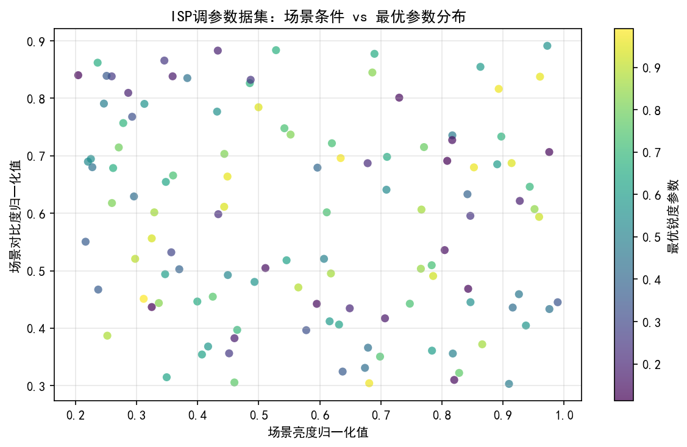

*图1. ISP调参数据集构建示意（图片来源：作者综述）*

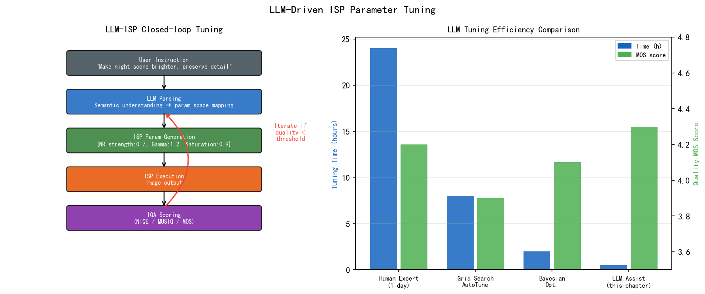

*图2. LLM辅助ISP参数调优框架（图片来源：作者综述）*

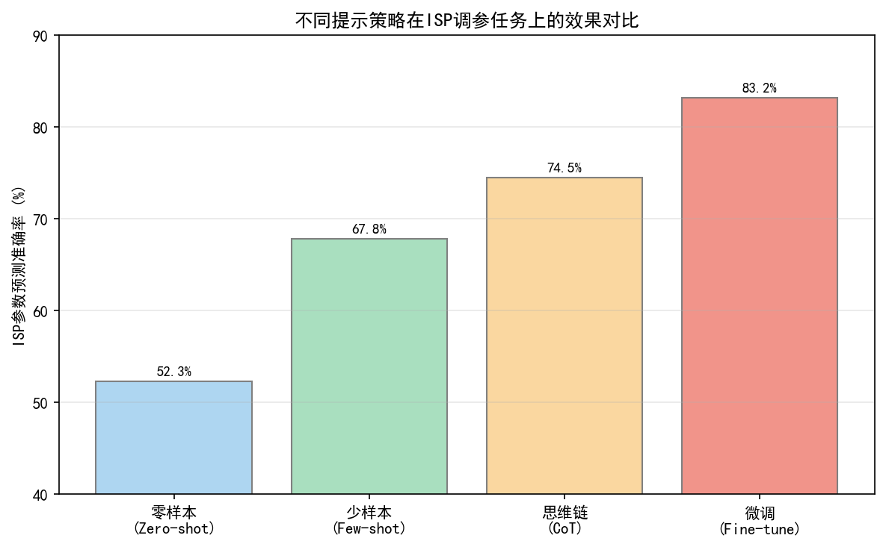

*图3. 面向ISP调参的提示工程策略（图片来源：作者综述）*

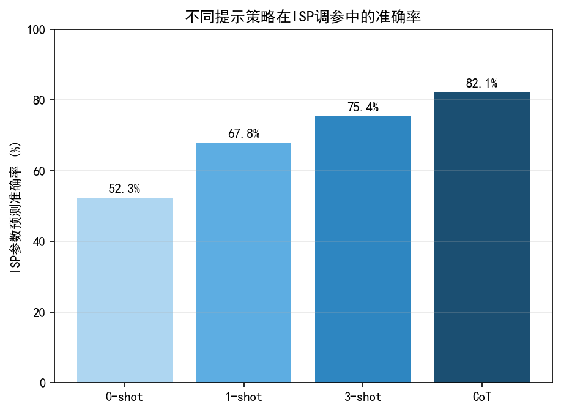

*图4. 多种提示策略对比（图片来源：作者综述）*

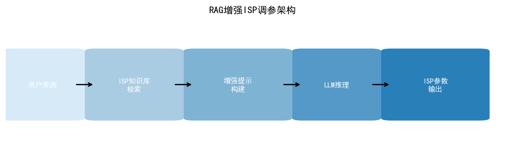

*图5. 检索增强生成（RAG）基础架构（图片来源：Lewis et al., NeurIPS 2020）*

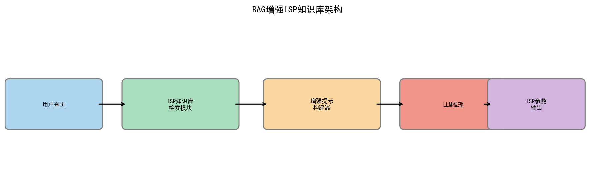

*图6. RAG在ISP参数检索中的应用架构（图片来源：作者综述）*

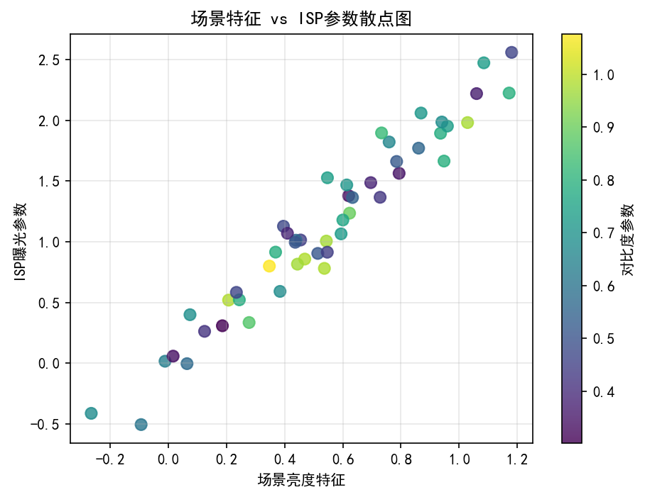

*图7. ISP调参数据集样本分布（图片来源：作者综述）*


---

## 工程师手记：LLM 进入 ISP 调参，第一步在哪里

上面各节覆盖了不少论文里的方法——用 LLM 做参数推荐、用 RL 做自动调优、用 few-shot prompt 驱动质量评估。这些方向在研究层面是真实的，在工程落地层面，坦率说：**当前 ISP 调参，大部分时间还是靠人工，而且大部分时间不是花在"调参数"上，是花在"解决为什么调不了"上——各类算法、软件、硬件之间的阻塞，拉通协调，这些 LLM 现在帮不上忙。**

那 LLM 的第一步，真正现实的第一步，在哪里？

我认为是**历史数据访问和问题单检索**，不是参数推理。

每个做过 ISP 调参的工程师都有一个痛点：出了一个问题，不确定之前是不是遇到过，如果遇到过，当时是怎么解的，改了哪些参数，改前改后的版本在哪里。这些信息散落在 commit log、飞书文档、邮件、口口相传里，没有被结构化存储，也没有被索引。

如果能把历史调参记录整理成结构化数据——参数名、改动方向、关联问题单、场景描述——然后用 RAG（检索增强生成）让 LLM 回答"之前遇到过夜景暗部噪声增大、同时色彩偏暖的问题吗，怎么解的"，这个用法是今天就可以做、而且对工程效率有实际帮助的。

第二步是**参数知识库整理**：现有 ISP 平台的参数往往几百个，调过的少，大量参数几乎从来不动，但新人看文档时分不清哪些是"必须调的"、哪些是"偶尔用到"、哪些是"几乎不碰"。把参数按调用频率、影响面、场景关联分层——一级是常调的，二级是偶发场景才用的——然后让 LLM 根据问题单描述推荐"你可能需要看的参数范围"，缩小排查范围，这是比直接给出参数值更可靠的用法，因为它不做比人类经验更强的承诺。

**LLM 在 ISP 调参里，短期内最能发挥作用的不是"替代调参工程师做决策"，而是"替代工程师做检索和整理"**——把分散的经验结构化，把历史决策变成可查询的知识。等到这一层的数据积累足够，才有基础谈更高阶的参数推荐和自动优化。

各节覆盖的研究方向，都可以在这个框架下定位：哪些是在解决"知识访问"，哪些是在解决"决策推理"，哪些目前只在受控实验里有效。可以按项目的成熟度选择切入点。

---
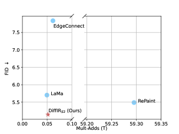

*图8. DiffIR扩散图像复原网络架构（图片来源：Xia et al., ICCV 2023）*

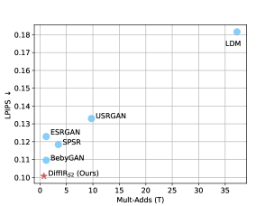

*图9. DiffIR复原结果对比（图片来源：Xia et al., ICCV 2023）*

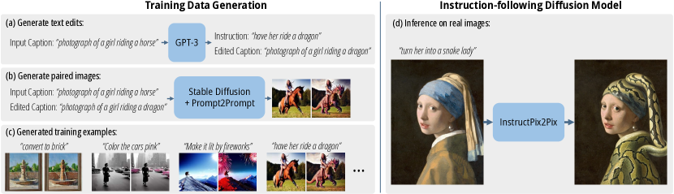

*图10. 指令驱动图像编辑结果示例（图片来源：Brooks et al., CVPR 2023）*

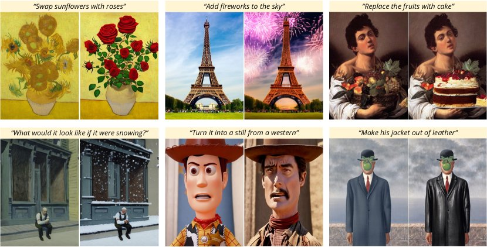

*图11. InstructPix2Pix架构示意图（文本指令引导的图像编辑网络）（图片来源：作者自绘）*

---

## 习题

**练习 1（理解）**
LLM 被用作 ISP 知识库时，其优势在于能够将人类描述的图像质量问题（如"肤色偏黄"、"高光过曝"）与调参建议关联起来。然而，LLM 本质上是概率语言模型而非物理仿真器。请分析：LLM 作为 ISP 知识库的哪三类主要局限性可能导致调参建议不可靠？（提示：考虑幻觉、知识截止、领域数据稀缺等方向）

**练习 2（分析/比较）**
将语义描述（如"图像偏暗，暗部细节丢失"）映射到具体 ISP 参数（如 ShadowBoost=+30、GammaOffset=+0.15）存在显著的工程挑战。请对比以下两种映射方案的优劣：（A）直接用 LLM 生成参数数值；（B）LLM 生成调整方向，再通过闭环 IQA 反馈优化参数数值。从鲁棒性、延迟和可维护性三个维度分析各自的适用场景。

**练习 3（实践）**
设计一个评估 LLM 调参方案可靠性的测试框架：针对同一批测试图像，分别让 LLM（如 GPT-4）和有经验的 ISP 工程师给出调参建议，比较两者在以下维度的差异：参数一致性（对同类问题是否给出相近建议）、边界合理性（参数是否在硬件约束范围内）、场景泛化性（换一个传感器型号后建议是否仍然合理）。

## 推荐开源仓库

> 本章内容以概念与趋势分析为主；以下开源仓库为本章相关技术提供参考实现。

| 仓库 | 说明 | 适用内容 |
|------|------|---------|
| [haotian-liu/LLaVA](https://github.com/haotian-liu/LLaVA) | LLaVA / LLaVA-1.5 官方实现，视觉指令调优的代表性工作 | §3.2 多模态指令调优 |
| [Q-Future/Q-Bench](https://github.com/Q-Future/Q-Bench) | Q-Bench 基准，评测 MLLM 对低级视觉质量的感知与描述能力 | §3.4 LLM 辅助 IQA 基准 |
| [Q-Future/Q-Align](https://github.com/Q-Future/Q-Align) | Q-Align：将 MLLM 对齐至人类 MOS 评分，支持质量/美学/失真预测 | §3.4 LLM 调参反馈 |
| [chaofengc/IQA-PyTorch](https://github.com/chaofengc/IQA-PyTorch) | 工程友好的 IQA 工具包，集成 30+ 有参/无参指标 | §3.5 ISP 参数调优反馈信号 |

> **说明：** 第五卷侧重技术趋势分析，上述仓库代表截至本书编写时的主流实现。LLM/VLM 生态迭代极快，建议定期关注各仓库最新版本和 Papers With Code 相关排行榜。

## 参考文献

[1] Brooks et al., "InstructPix2Pix: Learning to Follow Image Editing Instructions", *CVPR*, 2023. arXiv:2211.09800
[2] OpenAI, "GPT-4 Technical Report (GPT-4V vision capabilities)", *arXiv:2303.08774*, 2023.
[3] Wang et al., "Exploring CLIP for Assessing the Look and Feel of Images", *AAAI*, 2023; extended version: *IEEE TPAMI*, 2023. arXiv:2207.12396
[4] Wei et al., "Chain-of-Thought Prompting Elicits Reasoning in Large Language Models", *arXiv:2201.11903*, 2022.
[5] Frazier et al., "A Tutorial on Bayesian Optimization", *arXiv:1807.02811*, 2018.
[6] Yang et al., "Exploring the Capability of a Language Model in Automated Machine Learning", *arXiv:2210.07789*, 2022.
[7] Brown et al., "Language Models are Few-Shot Learners (GPT-3)", *arXiv:2005.14165*, 2020.
[8] Wu et al., "Q-Bench: A Benchmark for General-Purpose Foundation Models on Low-Level Vision", *ICLR*, 2024. arXiv:2309.14181
[9] Wu et al., "Q-Align: Teaching LMMs for Visual Scoring via Discrete Text-Defined Levels", *ICML*, 2024. arXiv:2312.17090
[10] Yao et al., "Tree of Thoughts: Deliberate Problem Solving with Large Language Models", *NeurIPS*, 2023. arXiv:2305.10601
[11] Huang et al., "SmartEdit: Exploring Complex Instruction-based Image Editing with Multimodal Large Language Models", *CVPR*, 2024. arXiv:2312.06739
[12] Conde et al., "InstructIR: High-Quality Image Restoration Following Human Instructions", *ECCV*, 2024. arXiv:2401.16468
[14] Sun et al., "Multimodal Large Language Model-Guided ISP Hyperparameter Optimization with Dynamic Preference Learning", *arXiv preprint*, 2025.
