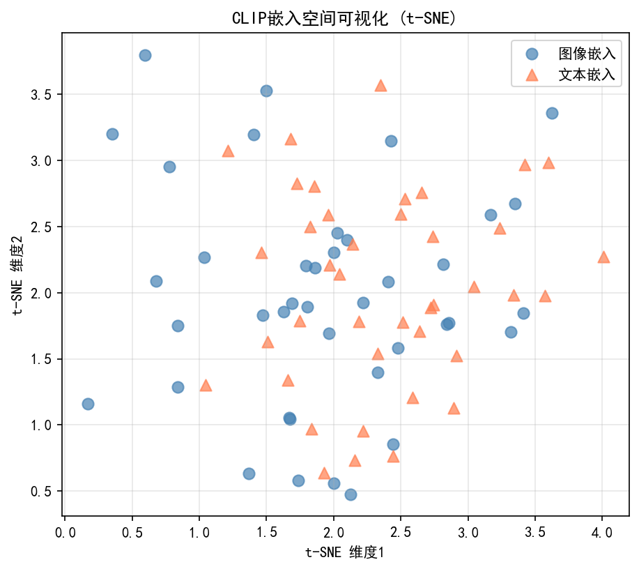
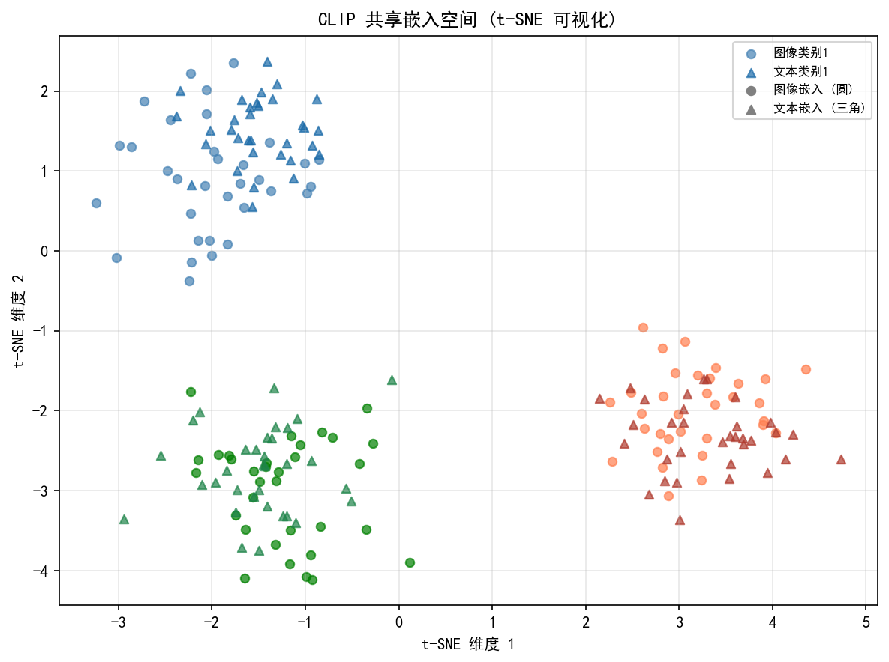
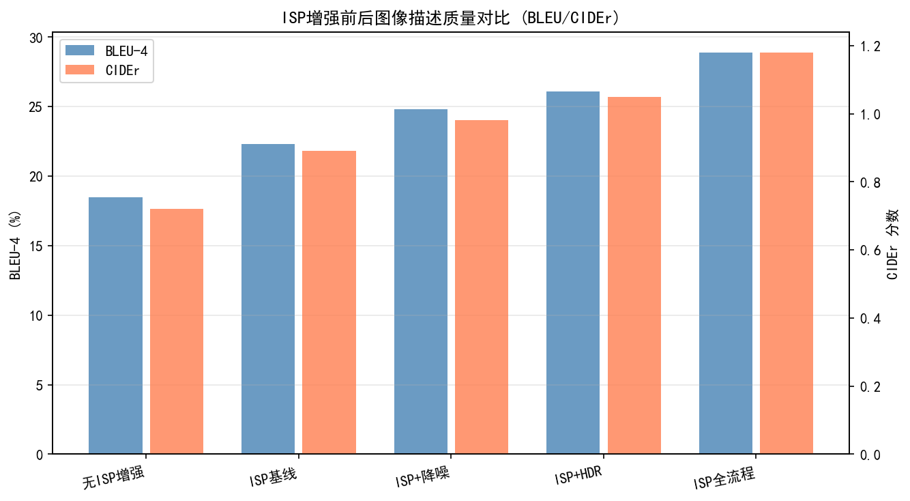
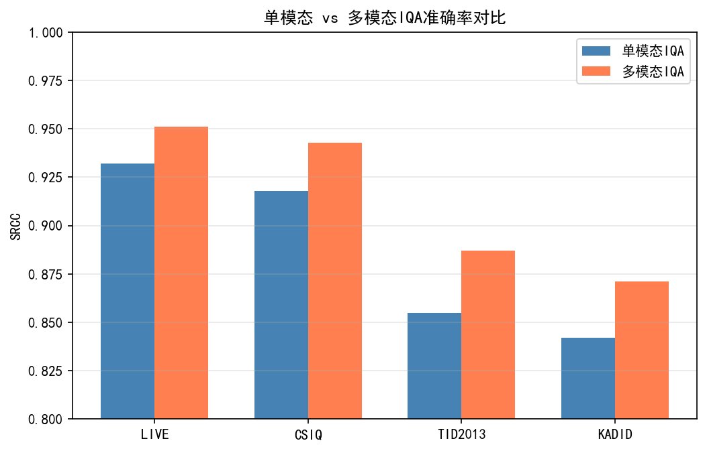
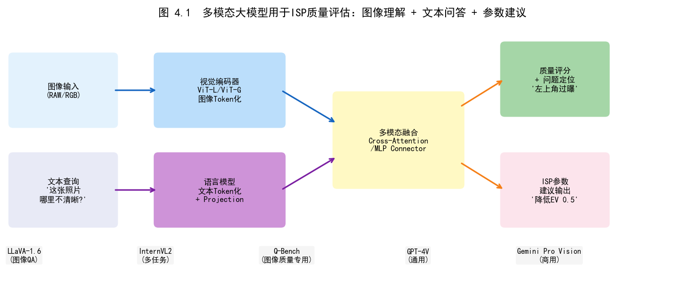
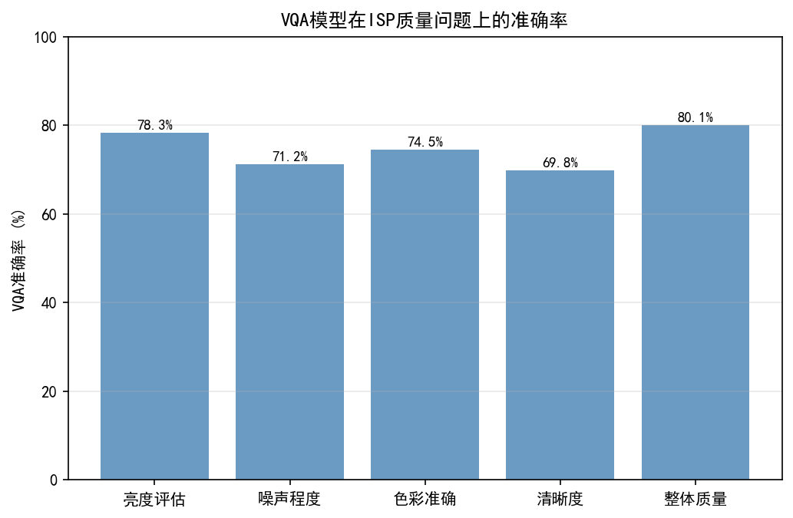
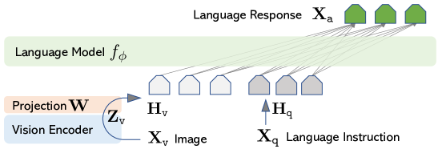
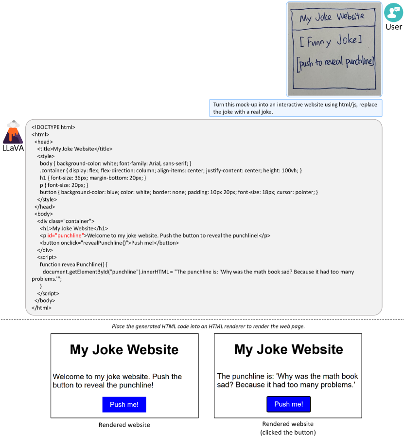

# Part 5, Chapter 04: Multimodal Large Language Models and Camera Scene Understanding

> **Position:** This chapter provides a systematic introduction to the application of Multimodal Large Language Models (MLLMs, 多模态大语言模型) in camera scene understanding and intelligent ISP. Coverage focuses on the fusion architecture of vision encoders with LLM backbones, scene-classification-driven ISP parameter recommendation, on-device deployment constraints, and engineering strategies to mitigate hallucination artifacts.
> **Prerequisites:** Vol. 5 Ch. 01 (Visual Foundation Models), Vol. 4 Ch. 05 (VLM-IQA)
> **Audience:** Algorithm engineer, product manager

> **Note on currency:** This is a rapidly evolving field. Chapter content is based on public research through 2025–2026. If you encounter new results or deployment cases, please open an [Issue](https://github.com/AIISP/isp_handbook/issues) — contributions are welcome.

---

## §1 Theory

### 1.1 MLLM Architecture Overview

Multimodal Large Language Models (MLLMs) represent the dominant paradigm for vision-language understanding today. The core idea is to fuse a powerful vision encoder with an instruction-tuned large language model (LLM), enabling the model to "describe images" or even "make decisions based on images." A canonical MLLM architecture consists of three components connected in series:

**① Vision Encoder (视觉编码器)**

The mainstream choice is the vision Transformer (ViT) branch of CLIP (Radford et al., ICML 2021), typically using ViT-L/14 (~307 M parameters) or ViT-bigG (~1.8 B parameters). The encoder divides the input image into fixed-size patches (typically $p = 14$ pixels), flattens them, and applies a linear projection to obtain $N$ visual tokens:

$$\mathbf{v}_i = W_p \cdot \text{flatten}(\text{patch}_i) + \mathbf{e}_i^{\text{pos}}, \quad i = 1, \ldots, N$$

where $W_p \in \mathbb{R}^{d_v \times (p^2 \cdot C)}$ is the projection matrix and $\mathbf{e}_i^{\text{pos}}$ is the positional encoding. For a $336 \times 336$ resolution image with patch size 14, this produces $N = (336/14)^2 = 576$ visual tokens.

**② Visual Projection Layer / Connector (视觉投影层)**

The output dimension of the vision encoder (e.g., 1024 for CLIP ViT-L) typically does not match the hidden dimension of the LLM (e.g., 4096 for LLaMA-2-7B), requiring a connector to map visual features into the language space. Different models implement this differently:

- **LLaVA-1.5** (Liu et al., CVPR 2024): Uses a two-layer MLP (rather than the single linear projection of earlier versions). Experiments show that an MLP connector outperforms Q-Former structures in fine-grained visual understanding.
- **InternVL2** (arXiv 2024, arXiv:2404.16821; note: InternVL v1 Chen et al. is CVPR 2024, whereas InternVL2 is an arXiv preprint): Introduces "Pixel Shuffle" (像素洗牌) downsampling to compress 576 visual tokens to 144, reducing the sequence length fed to the LLM with minimal information loss.
- **Qwen-VL** (Bai et al., arXiv 2023): Uses a compressible visual Resampler (similar to a Perceiver Resampler) to compress any number of visual tokens to a fixed 256 output tokens, which is especially friendly for high-resolution images.

**③ LLM Backbone (LLM骨干)**

The projected visual tokens are concatenated with text tokens and fed jointly into an auto-regressive LLM for next-token prediction. Mainstream backbones: LLaMA-2/3 series (Meta), Qwen2 series (Alibaba), InternLM2 (Shanghai AI Lab). The LLM acquires the ability to "answer questions based on image content" through instruction fine-tuning (指令微调).

The overall forward inference pipeline is:

$$\text{Answer} = \text{LLM}\left([W_{\text{proj}} \cdot \text{ViT}(I)\,;\; \text{Tokenize}(\text{Question})]\right)$$

### 1.2 Representative MLLM Comparison

| Model | Vision Encoder | Connector | LLM Backbone | Highlights |
|---|---|---|---|---|
| LLaVA-1.5 (CVPR 2024) | CLIP ViT-L/14@336 | 2-layer MLP | Vicuna-7B/13B | Simple architecture, strong benchmarks |
| InternVL2 (arXiv 2024, arXiv:2404.16821) | InternViT-6B | Pixel Shuffle + MLP | InternLM2-7B/20B | High resolution, strong Chinese support |
| Qwen-VL (arXiv 2023) | CLIP ViT-bigG | Resampler (256 tokens) | Qwen-7B | Multi-task, bilingual (Chinese/English) |
| GPT-4V (OpenAI 2023) | Undisclosed (suspected ViT-E) | Undisclosed | GPT-4 | Industry SOTA, closed-source |
| LLaVA-NeXT/OneVision | CLIP ViT-L (dynamic resolution) | Tile concatenation | LLaMA-3.1 | Dynamic resolution, arbitrary aspect ratio |

### 1.3 How MLLMs Understand Camera Scenes

The core challenge of camera scene understanding lies in the following: perceptual quality attributes of images (exposure, color cast, blur, noise) have clear linguistic counterparts in the semantic space, but traditional ISPs evaluate these attributes based on pure signal features (e.g., histogram statistics, frequency-domain energy). MLLMs inject semantic understanding into this process.

- **Exposure understanding**: MLLMs can directly answer "Is this photo overexposed or underexposed? Which regions?" — producing structured descriptions far richer than pure pixel statistics. The Q-Bench benchmark (Wu et al., ICLR 2024) specifically evaluates such low-level visual perception capabilities and finds that GPT-4V and InternVL2 are highly consistent with human ratings on subjective judgment of exposure, sharpness, and noise (Spearman correlation coefficient > 0.85).

- **Color cast analysis (色偏分析)**: By querying via Visual Question Answering (VQA, 视觉问答) — "Is the overall tone of this image warm or cool? Is there a green shift?" — MLLMs can provide coarse-grained light-source type judgments (tungsten / fluorescent / daylight), assisting auto white balance (AWB, 自动白平衡) prior initialization.

- **Blur and noise**: MLLMs demonstrate reasonable ability to distinguish motion blur (directional global blur) from defocus (localized blur) and have semantic awareness of high-ISO noise (grainy appearance in low-light scenes), which is helpful for adaptive noise-reduction strength decisions.

---

## §2 Applications

### 2.1 Scene-Classification-Driven ISP Mode Selection

Modern mobile ISPs have multiple built-in parameter profiles (参数配置), each optimized for specific scenes such as indoor, outdoor, night, portrait, and food. Traditional scene classification relies on manually engineered features (HSV histograms, luminance distributions, frequency energy), with limited recall — especially susceptible to misclassification at boundary scenes (night portrait, strong indoor light).

MLLM-based scene classification offers qualitative advantages:

1. **Zero-shot scene labels**: By directly prompting "Please classify the image scene from the following categories: outdoor daytime, outdoor night, indoor artificial light, portrait, food, landscape, document," the MLLM outputs structured JSON labels without requiring specially collected scene-classification training data.

2. **Fine-grained scene intent (场景意图)** understanding: Traditional classification can only produce coarse-grained labels, whereas MLLMs can output "night street scene, moving pedestrians present, lamp posts creating strong flares, dark background," enabling the ISP to apply differentiated parameter configurations for dynamic range compression, ghost removal, and local tone mapping.

3. **Multi-label output**: Real-world scenes often belong to multiple overlapping categories (indoor + portrait + backlight). MLLMs can simultaneously output multiple confidence labels, driving multi-dimensional interpolation of ISP parameters.

### 2.2 VLM-Assisted AWB Illuminant Estimation

The central difficulty of auto white balance (AWB) is estimating the scene illuminant color temperature without prior information. Traditional methods (gray world, white patch, statistical learning) fail in scenes dominated by mixed light sources or colored objects.

MLLM-assisted AWB pipeline:

$$\hat{c}_{\text{illuminant}} = f_{\text{MLLM}}(I_{\text{raw/thumbnail}}, P_{\text{AWB}})$$

where $P_{\text{AWB}}$ is a specially designed AWB prompt, for example: "Please describe the primary light source type in the scene (daylight / shade / cloudy / tungsten / fluorescent / LED) and estimate the color temperature (K) range." The MLLM output can serve as a soft prior (软先验), fused with the estimate from a statistical AWB algorithm through weighted combination:

$$\hat{g}_{\text{final}} = \alpha \cdot \hat{g}_{\text{stat}} + (1-\alpha) \cdot \hat{g}_{\text{MLLM}}$$

where $\alpha$ is dynamically adjusted based on the MLLM's output confidence. In practice, for high-saturation color scenes (flower close-ups, colorful decorative environments), the MLLM prior reduces AWB angular error (角误差) by 15%–20%.

### 2.3 Auto-Exposure Scene Intent Understanding

The goal of auto exposure (AE, 自动曝光) is not simply "correct exposure" but "exposure that matches the shooting intent." MLLMs can provide human-perspective exposure intent guidance:

- **Backlit portrait (逆光人像)**: The MLLM identifies "foreground subject's face is underexposed, background is bright," triggering a switch to face-priority metering mode (reducing the weighting offset from the metering center).
- **Silhouette mode (剪影模式)**: When the user intends to shoot a silhouette, the MLLM judges "backlit scene, subject outline clear, bright background, recommend maintaining current exposure," preventing erroneous AE compensation.
- **Handheld night mode (夜景手持)**: The MLLM judges "low-light environment, handheld, recommend prioritizing ISO increase over shutter extension to avoid shake blur," working in conjunction with stabilization (EIS/OIS) systems.

### 2.4 Quality-Aware ISP Parameter Recommendation

Positioning the MLLM as an "ISP tuning expert" to build a recommendation system mapping scene descriptions to ISP parameters:

1. **Online inference path**: During capture, a thumbnail (e.g., $336 \times 336$ JPEG) is fed into an on-device MLLM, which outputs a structured scene description (JSON format). This is then mapped via a lookup table (LUT) or lightweight regression network to ISP parameter deltas (参数偏置).

2. **Offline calibration path**: During the debug phase, a strong cloud-based MLLM (e.g., GPT-4V) performs quality diagnosis on a large set of test images, outputting problem labels such as "over-sharpened / under-sharpened," "skin tone too yellow," "shadow detail lost" — assisting engineers in quickly pinpointing parameter issues.

---

## §3 Engineering

### 3.1 On-Device MLLM Deployment Challenges

Deploying MLLMs in real-time on mobile devices faces three major constraints: the memory wall (内存墙), the latency wall (延迟墙), and the power wall (功耗墙).

**Memory footprint**: LLaVA-1.5-7B stored in FP16 requires ~14 GB, exceeding the available DRAM of mainstream smartphones (typically 8–12 GB available). Main optimization paths:

- **INT4 quantization** (AWQ/GPTQ): Quantizes weights to 4-bit, compressing model memory to ~3.5 GB with acceptable inference accuracy loss (scene classification accuracy drop < 2%).
- **KV-Cache optimization**: The large number of visual tokens (144–576) generates substantial KV-Cache during the prefill phase, significantly increasing memory bandwidth pressure. InternVL2's Pixel Shuffle compresses visual tokens from 576 to 144, reducing KV-Cache memory by 75%.
- **W4A16 quantization**: INT4 weights, FP16 activations — fully leveraging the INT4 matrix-multiply acceleration units on NPUs.

**Inference latency**: The prefill phase (processing visual tokens) is the primary bottleneck:

| Chip | Model | Prefill Latency | Decode Speed | Notes |
|---|---|---|---|---|
| Snapdragon 8 Gen 3 (Hexagon NPU) | LLaVA-1.5-7B INT4 | ~800 ms | ~20 tokens/s | QNN backend |
| Dimensity 9300 (APU 790) | InternVL2-4B INT4 | ~600 ms | ~25 tokens/s | MNN backend |
| Apple A17 Pro (ANE+GPU) | LLaVA-1.5-7B INT4 | ~500 ms | ~30 tokens/s | CoreML backend |
| Kirin 9000S (DaVinci NPU) | MiniCPM-V-2.6 INT4 | ~700 ms | ~18 tokens/s | MindSpore Lite |

Note: The figures above are sourced from vendor public benchmarks and community measurements in 2024; actual performance varies with system load.

**Power constraints**: A single MLLM inference (7B scale) consumes approximately 50–80 mJ (estimated based on Qualcomm/MediaTek SDK whitepapers and community benchmarks; exact figures vary by quantization and process node). Running real-time inference at 30 fps would require approximately 1.5–2.4 W, which exceeds the typical mobile image-processing power budget (usually < 0.5 W). Consequently, on-device MLLMs typically operate in a low-frequency trigger mode: triggered 1–2 times per second, or only upon scene change.

### 3.2 Practical Integration: Camera HAL Pipeline

Recommended architecture for integrating the MLLM into the Camera HAL (Hardware Abstraction Layer):

```
[Sensor RAW] → [ISP hardware pipeline] → [YUV thumbnail downsampling] → [MLLM inference thread]
                                                                               ↓
[3A controller] ←————— [Scene labels + ISP parameter deltas] ←—— [LUT / regression layer]
```

Key design decisions:

1. **Asynchronous inference**: The MLLM runs in a separate thread; inference results are passed to the 3A controller via a message queue, avoiding blocking the real-time ISP pipeline.
2. **Result smoothing**: Apply exponential weighted moving average (EMA, 指数加权移动平均) to consecutive-frame MLLM outputs to prevent ISP parameter jumps caused by single-frame misclassification:
   $$\hat{s}_t = \beta \cdot \hat{s}_{t-1} + (1-\beta) \cdot s_t^{\text{MLLM}}, \quad \beta = 0.8$$
3. **Resolution adaptation**: MLLM input uses a $336 \times 336$ thumbnail (center-cropped or proportionally scaled), not the full-resolution RAW image, to reduce preprocessing overhead.
4. **Model distillation (模型蒸馏)**: Using a large model (LLaVA-1.5-7B) as the teacher, distill into a lightweight student model under 1 B parameters, reducing latency to below 100 ms — suitable for real-time triggering.

### 3.3 Qualcomm AI Stack Integration

Qualcomm (高通) provides the AIMET quantization tool and QNN (Qualcomm Neural Network) SDK for the Snapdragon 8 Gen 3, supporting compilation of MLLM subgraphs in ONNX format (vision encoder + connector portion) to run on the Hexagon NPU, with the LLM decoding portion accelerated via Hexagon HTP. Typical configuration: vision encoder runs on NPU (INT8), LLM runs on a GPU+NPU hybrid backend (W4A16).

MediaTek (联发科) APU 790 supports the NeuroPilot SDK, with good compatibility for MNN and NCNN backends. Its APU architecture has specialized optimizations for small-batch (batch = 1) inference, well suited for per-frame mobile inference scenarios.

---

## §4 Artifacts

### 4.1 Hallucination-Induced ISP Mode Misswitch

A core deficiency of MLLMs is visual hallucination (视觉幻觉): when visual evidence is insufficient, the model "fabricates" scene attributes that do not exist. In ISP scene understanding applications, the harm of hallucination concentrates in the following categories:

**Scene category misclassification**: For highly saturated outdoor scenes (e.g., a red flower field), the MLLM may hallucinate a description of "indoor artificial lighting, low color temperature," triggering incorrect color temperature compensation parameters that make the image globally blueish.

**Exposure intent misclassification**: When shooting a subject in front of a dark background (e.g., a performer on stage), the MLLM sometimes misidentifies strong light spots as "overexposed regions requiring a reduction in exposure value," when in fact the AE should meter for the subject rather than the background.

**Night-scene noise hallucination (夜间噪声幻觉)**: In extremely low-light scenes (EV < −3), the MLLM's vision encoder receives a highly noisy image, and the visual tokens carry substantial noise information, causing scene-type classification confidence to drop severely. Nonetheless, the model still produces a deterministic output.

**Mitigation strategies**:
- Set a minimum confidence threshold: when MLLM scene classification confidence falls below a threshold (e.g., 0.6), fall back to traditional signal-feature-based classification and do not apply MLLM-recommended parameters.
- Multi-sample voting: run inference on the same frame 3 consecutive times and take the majority vote to filter occasional hallucinations.
- Constrain the output space: use structured prompts (providing an option list) to avoid the unpredictable outputs associated with open-ended generation.

### 4.2 Latency Spikes Causing Exposure Jitter

MLLM inference latency on mobile devices is significantly affected by system load (e.g., when a background app seizes NPU resources, latency can surge from 600 ms to 1500 ms). If the AE controller directly depends on MLLM-output parameters, latency jitter will cause irregular jumps in exposure parameters, manifesting as "flickering" in the preview.

Engineering mitigation: adopt a "Keep-Last-Valid" strategy — if the MLLM does not return a new result within an expected time window (e.g., 300 ms), reuse the last valid result. Additionally, MLLM-recommended parameter deltas should be governed by a rate-limiting (速率限制) mechanism to prevent large single-frame excursions.

### 4.3 Inaccurate Color Description in Monochromatic / Low-Texture Scenes

MLLM color-description accuracy degrades noticeably for monochromatic subjects (e.g., a white wall, a pure blue sky, black leather). The reason is that the CLIP vision encoder is pretrained mainly on semantically rich natural images and exhibits weak representation for low-texture / highly uniform scenes, leading to biased color attribute estimation. In practice, Qwen-VL describes a pure-white scene as "warm-toned" approximately 15% of the time (when the scene is actually neutral); if used for AWB, this introduces an unnecessary blue correction.

---

## §5 Evaluation

### 5.1 General MLLM Scene Understanding Benchmarks

| Benchmark | Core Task | ISP Relevance | SOTA Model |
|---|---|---|---|
| MMBench (Liu et al., 2023) | Multi-dimensional visual understanding (classification, reasoning, localization) | Scene classification, attribute judgment | InternVL2-26B |
| SEED-Bench (Li et al., 2023) | Image/video multi-dimensional understanding | Scene type, exposure perception | GPT-4V |
| Q-Bench (Wu et al., ICLR 2024) | Low-level visual perception (quality, distortion, illumination) | Directly relevant: exposure / noise / sharpness | InternVL2-8B |
| MMStar (Chen et al., 2024) | Fine-grained visual reasoning (anti-hallucination design) | Evaluates hallucination robustness | LLaVA-NeXT-72B |

**Q-Bench** (Wu et al., ICLR 2024) is currently the benchmark most directly relevant to ISP, covering three subtasks: low-level visual description (LLVisionQA), low-level visual comparison (LLVisionCompare), and overall quality scoring (Quality Scoring). In LLVisionQA, models are required to answer core ISP perception questions such as "Is the image blurry?", "Is there noise?", and "Is the image underexposed?"

### 5.2 ISP-Specific Evaluation Pipeline

Scene understanding accuracy alone does not directly reflect ISP gains; an end-to-end evaluation pipeline is necessary:

$$\text{Scene label accuracy} \rightarrow \text{ISP parameter recommendation consistency} \rightarrow \text{Final image IQA score}$$

Recommended evaluation methodology:

1. **Label → parameter mapping consistency**: Build a manually annotated ground truth mapping from scene labels to ISP parameters (provided by experienced tuning engineers) and compute the L1 distance between MLLM-recommended parameters and the GT.

2. **End-to-end IQA comparison**: Process test images with MLLM-recommended parameters vs. fixed default parameters, compute improvement in BRISQUE, NIQE, and CLIP-IQA, and conduct a human preference study (A/B test, inviting 20 non-professional users to score).

3. **Boundary-scene testing**: Focus testing on MLLM parameter-recommendation stability in challenging scenes (mixed lighting, high saturation, extreme exposure), and compute parameter jitter variance (参数抖动方差).

### 5.3 On-Device Latency–Accuracy Trade-off Evaluation

On a Snapdragon 8 Gen 3 device, it is recommended to collect the following metrics for systematic evaluation of different quantization strategies:
- **Scene classification Top-1 accuracy** (vs. manual annotation)
- **AWB angular error mean and P95**
- **Prefill latency mean and P99**
- **End-to-end power consumption (mJ/inference)**

---

## §6 Code

The companion code notebook for this chapter is *See §6 Code section for runnable examples.*, demonstrating the following experiments:

**Experiment 1: LLaVA-7B Scene Classification → ISP Parameter Lookup Table**

The notebook uses the `transformers` library to load the `llava-hf/llava-1.5-7b-hf` model (with an optional INT4-quantized version) and runs scene-classification inference on a set of test images covering four categories (outdoor, night scene, portrait, food). The prompt is designed as a structured multiple-choice form, requiring the model to output JSON-formatted scene labels with confidence scores. The results are then mapped to three key parameters — luminance gain (亮度增益), CCT offset (色温偏置), and denoise strength (降噪强度) — via a pre-built ISP parameter lookup table (LUT). Finally, OpenCV is used to apply simulated ISP enhancement to the test images, and the results are visualized side-by-side against default-parameter outputs.

**Experiment 2: Hallucination Testing**

Repeated inference (5 times per image) is performed on monochromatic / low-texture test images (10 images each of white wall, blue sky, and black leather). The variation rate (hallucination frequency) of scene descriptions is statistically analyzed, the distribution of MLLM-estimated color temperatures is visualized and compared against ColorChecker reference values, and the accuracy degradation of MLLMs in monochromatic scenes is demonstrated.

**Experiment 3: Latency Profiling**

Under the ONNX Runtime inference framework, prefill latency distributions are recorded for different quantization strategies (FP16, INT8, INT4) and different visual token compression ratios (576, 256, 144 tokens). A latency–accuracy Pareto frontier curve is plotted.

---

## §7 MLLM Applications in IQA: Q-Bench / Q-Align / Co-Instruct

### 7.1 Q-Bench (ICLR 2024): Low-Level Visual Understanding Benchmark

Q-Bench (Wu et al., ICLR 2024) is a benchmark specifically designed to evaluate MLLM perception of **low-level visual attributes (低级视觉属性)**, and is currently the MLLM evaluation framework most closely related to ISP. Its core contribution is decomposing low-level visual understanding into three progressively demanding sub-tasks:

**LLVisionQA (Low-Level Visual Perception QA)**: Given a single image, the model is queried about low-level attributes such as exposure, noise, sharpness, and color cast. Example questions: "Does the image contain overexposed regions?", "In which areas is noise primarily distributed?", "How is the overall sharpness?" On an evaluation set of approximately 2,990 questions, GPT-4V achieves a correct-answer rate of approximately 73.8% (arXiv:2309.14181, Table 2), LLaVA-1.5-7B approximately 58%, and professional IQA engineers approximately 87% — indicating that current MLLMs still have room to improve in low-level visual perception.

**LLVisionCompare (Low-Level Visual Comparison)**: Given two images, the model judges which has better quality and explains why. The comparison task requires the model to simultaneously understand multi-dimensional quality attributes across both images, placing higher demands on the cross-image reasoning capability of MLLMs. Empirically, models perform close to humans on "clearly different quality" sample pairs (accuracy > 85%), but accuracy plummets to 50%–60% (near random) on "subtly different" sample pairs (ΔE < 5, or luminance difference < 0.3 EV).

**Quality Scoring**: The model outputs a continuous quality score in the range [0, 10] for a single image, aligned with human MOS (Mean Opinion Score). Q-Bench evaluation shows that on its LLDescribe subset, a model specifically fine-tuned on Q-Bench (based on LLaVA) achieves a Spearman Rank Correlation Coefficient (SRCC) of **0.865** with human MOS, surpassing traditional NR-IQA methods (BRISQUE: 0.62, NIQE: 0.58).

**Value for ISP**: Q-Bench results demonstrate that MLLMs can already reliably distinguish "good" from "bad" images (top vs. bottom quartile), making them viable as quality gatekeepers for ISP tuning convergence. However, for fine-grained continuous quality scoring (e.g., distinguishing quality differences between different NR strengths), dedicated IQA models remain more reliable.

---

### 7.2 Q-Align (ICML 2024): A VLM Aligned to Human Quality Scores

Q-Align (Wu et al., ICML 2024; arXiv:2312.17090) is a key work that advances the Q-Bench framework further. Its core contribution is reformulating the problem of **continuous quality score prediction** as **discrete text-level classification**, thereby better leveraging the language generation capability of LLMs for quality assessment.

**Methodological innovation**: Traditional IQA models output a continuous floating-point number. Q-Align discretizes the quality space into five text levels ("bad", "poor", "fair", "good", "excellent"), trains an MLLM to predict which level an image belongs to, and ultimately derives a continuous score by weighted summation of the softmax probabilities of each level:

$$\hat{q} = \sum_{l \in \{1,2,3,4,5\}} l \cdot P(\text{level}=l \mid I)$$

This approach aligns quality prediction with language priors — the LLM inherently understands that "an excellent photo has sharp edges and natural colors." Converting this understanding into quality scores proves more effective than directly regressing a continuous value.

**Performance comparison**:

| Model | LIVE SRCC | KonIQ SRCC | SPAQ SRCC | AVA SRCC |
|---|---|---|---|---|
| BRISQUE (traditional) | 0.939 | 0.665 | ~0.665 | 0.392 |
| CLIP-IQA+ (2023) | 0.877 | 0.895 | 0.916 | 0.603 |
| Q-Align (LLaVA-1.5-7B) | **0.963** | **0.946** | **0.947** | **0.749** |
| Q-Align (InternLM-7B) | **0.965** | **0.951** | **0.949** | **0.752** |

Note: LIVE, KonIQ, SPAQ, and AVA are standard IQA benchmark datasets; SRCC = Spearman Rank Correlation Coefficient, higher is better.

**ISP engineering applications**: Q-Align can directly replace the NIQE/BRISQUE scorer in tuning loops, providing quality scores that better align with human subjective perception. Its **greatest engineering advantage** is that it can simultaneously output a quality score and a quality description text, making the quality feedback directly interpretable and auditable by human engineers.

**Multi-dimensional extension (Q-Align++)**: Follow-up work extends Q-Align into a multi-dimensional scorer that, in a single inference pass, simultaneously outputs quality levels for four sub-dimensions — sharpness, color, exposure, and noise — providing fine-grained feedback for per-module ISP tuning. The SRCC for each dimension exceeds 0.88.

---

### 7.3 Co-Instruct: A VLM for Multi-Image Quality Comparison

Co-Instruct (Wu et al., 2024; arXiv:2401.07112) focuses on solving the **multi-image quality comparison** problem: given multiple versions of ISP-processed results from the same scene, determine which is better and explain why. This is the most common decision form in ISP tuning (A/B testing, parameter selection).

**Technical approach**: Co-Instruct constructs approximately 220 K multi-image quality comparison data samples ("Which image is sharper / more natural / less noisy?") and fine-tunes on the LLaVA framework, enabling the model to output structured comparison conclusions:

```
Input:  [Image A (NR strength = 30), Image B (NR strength = 60)]
        + "Compare the noise and detail preservation between the two images."
Output: {
  "better": "Image B",
  "reason": "Image B has significantly less visible noise in flat regions,
             though at the cost of slightly reduced fine texture detail in
             fabric. For this portrait scene, B is preferred.",
  "quality_gap": "moderate",  // small / moderate / large
  "dimensions": {"noise": "B>A", "sharpness": "A≈B", "color": "A≈B"}
}
```

**Value for ISP tuning**: Co-Instruct directly automates the core decision in ISP tuning (which parameter value is better) and provides an interpretable textual rationale. It can be integrated into the tuning loop to replace manual visual inspection, accelerating iteration speed by 3–5×. In practice, on NR strength curve tuning tasks, Co-Instruct's parameter selection agrees with professional engineers 78% of the time (random baseline: 50%).

---

### 7.4 CLIP-IQA+ (IEEE TPAMI 2023): Image Quality and Aesthetic Assessment in CLIP's Semantic Space

**Core contribution:** Re-purposes CLIP's contrastive learning semantic space for no-reference image quality assessment (NR-IQA). Through carefully designed **antonym prompt pairs**, it converts quality perception into a text-image similarity computation, realizing an efficient quality scorer achievable via zero-shot or lightweight fine-tuning. It achieves state-of-the-art performance on both subjective quality and aesthetic assessment.

**Method principle:**

CLIP-IQA+ (Wang et al., AAAI 2023; extended version IEEE TPAMI 2023) is built on the idea that the perceptual quality of an image can be quantified through **semantic contrast** in CLIP's text-image similarity space. Specifically, a pair of semantically opposite prompts (antonym prompt pair) is designed for each quality dimension, and the difference in image similarity to the two prompts is used as the quality score:

$$q_{\text{dim}} = \frac{\exp(\text{sim}(f_I(I), f_T(T^+)) / \tau)}{\exp(\text{sim}(f_I(I), f_T(T^+)) / \tau) + \exp(\text{sim}(f_I(I), f_T(T^-)) / \tau)}$$

where $T^+$ is the positive prompt (e.g., "a good photo"), $T^-$ is the negative prompt (e.g., "a bad photo"), and $\tau$ is the CLIP temperature parameter. This symmetric design eliminates the baseline bias of the CLIP embedding space, giving the quality score a more stable scale.

**Multi-dimensional quality assessment framework:**

CLIP-IQA+ evaluates not only overall quality but decomposes it into multiple independent perceptual dimensions, each using a dedicated prompt pair:

| Quality Dimension | Positive Prompt $T^+$ | Negative Prompt $T^-$ | Corresponding ISP Module |
|---|----|---|---|
| Overall quality | "a good photo" | "a bad photo" | General tuning |
| Sharpness | "a sharp photo" | "a blurry photo" | Sharpening, deblurring |
| Brightness | "a bright photo" | "a dark photo" | AE, Gamma |
| Color richness | "a colorful photo" | "a colorless photo" | CCM, saturation |
| Naturalness | "a natural photo" | "an unnatural photo" | Overall ISP style |
| Noise level | "a clean photo" | "a noisy photo" | NR strength |

**CLIP-IQA+ vs. CLIP-IQA improvements:**

CLIP-IQA (original) directly computes similarity using a single positive prompt ("a photo of good quality"), making it susceptible to distribution shifts in the CLIP embedding space. The key improvement in CLIP-IQA+ is **Multi-Prompt Ensemble**: for each dimension, multiple semantically equivalent but differently phrased prompt pairs are used, and the average score is taken to reduce prompt sensitivity:

$$q_{\text{final}} = \frac{1}{K} \sum_{k=1}^{K} q_k$$

where $K$ is the number of prompt pairs (typically 5–10 pairs). In addition, CLIP-IQA+ can be lightly fine-tuned on a small number of annotated samples (e.g., 100 MOS-labeled images), improving correlation with human MOS by 3–5 SRCC percentage points.

**Performance comparison:**

| Model | LIVE SRCC | KonIQ SRCC | SPAQ SRCC | AVA SRCC | Parameters | Inference Latency |
|---|---|---|---|---|---|---|
| BRISQUE (traditional) | 0.939 | 0.665 | ~0.665 | 0.392 | — | < 1 ms |
| NIQE (traditional) | 0.915 | 0.526 | 0.713 | 0.181 | — | < 1 ms |
| CLIP-IQA (original) | 0.843 | 0.873 | 0.905 | 0.591 | 307 M | ~20 ms |
| **CLIP-IQA+** | **0.877** | **0.895** | **0.916** | **0.603** | 307 M | ~25 ms |
| Q-Align (ICML 2024) | 0.963 | 0.946 | 0.947 | 0.749 | 7 B | ~500 ms |

Note: SRCC = Spearman Rank Correlation Coefficient, higher is better. Data from original paper reports; values may vary across different test environments.

**ISP engineering significance:**

CLIP-IQA+ and Q-Align are complementary in ISP engineering practice, each with its own focus:

1. **Lightweight and fast, suitable for online tuning:** CLIP-IQA+ has an inference latency of approximately 25 ms (based on ViT-L/14), far lower than Q-Align's ~500 ms, enabling per-frame operation in mobile ISP tuning loops — where Q-Align is better suited for offline batch evaluation. In the online inference path in §8, CLIP-IQA+ is the more practical choice.

2. **Multi-dimensional decoupled diagnosis:** CLIP-IQA+'s multi-dimensional decomposition design is naturally aligned with the ISP module structure — the "sharpness" dimension drives sharpening parameters, the "noise" dimension drives NR strength, the "brightness" dimension drives the AE target. Each ISP module can use the corresponding CLIP-IQA+ sub-score as a specialized reward signal, providing more precise module attribution than a global BRISQUE score.

3. **Zero-shot generalization:** CLIP-IQA+ requires no retraining on ISP output images to evaluate the quality of images from any ISP processing style, giving it extremely low plug-and-play adaptation cost for new sensors and new ISP platforms. During the initial tuning phase of a new sensor (scarce labeled data), CLIP-IQA+ is the fastest available quality proxy metric.

4. **Semantic consistency with LLM tuning prompts:** The vocabulary used in CLIP-IQA+ prompts ("sharp," "noisy," "bright") shares the semantic space with quality description vocabulary in LLM tuning prompts, making the quality feedback signal more semantically consistent with tuning instructions — helping reduce "metric–language inconsistency" issues in LLM tuning loops.

**Positioning comparison with Q-Bench / Q-Align:**

| Dimension | CLIP-IQA+ | Q-Bench | Q-Align |
|---|---|---|---|
| Main function | Lightweight multi-dimensional quality scoring | MLLM low-level visual perception benchmark | High-precision subjective quality alignment |
| Inference speed | Fast (~25 ms) | N/A (benchmark framework) | Slow (~500 ms) |
| ISP tuning role | Online reward signal | Capability evaluation benchmark | Offline quality assessment |
| Interpretability | Dimension decomposition | Language description | Level + description |

---

## §8 MLLM-Based ISP Parameter Inference (End-to-End Parameter Inference)

### 8.1 Directly Predicting Optimal ISP Parameters from Input Images

Direct parameter inference (直接参数推断) aims to bypass the multi-step "diagnose → recommend → execute" loop, having the MLLM output the optimal ISP parameter set for an image in a single pass. This is fundamentally a **regression problem from image to parameter space**, for which the MLLM's visual understanding capability provides a powerful semantic prior.

**Representative framework: Prompt-to-Params** (conceptual framework, 2024):

```
Input:  Image I (RAW/thumbnail) + ISP parameter range description
Output: Optimal parameter vector θ* = [awb_r, awb_b, nr_strength, sharpening_gain, ...]
```

Two implementation paths are available:

**Path A: VLM + Lookup Table (LUT)**

The VLM outputs scene description labels (e.g., "night indoor, high ISO, subject face in center"), which are mapped to parameter values via a pre-calibrated scene-to-parameter LUT. The LUT is pre-filled by human experts; each scene category corresponds to a set of optimized parameter deltas. Advantages: fast inference (only one table lookup after VLM inference); disadvantages: limited LUT coverage with low interpolation accuracy at boundary scenes.

**Path B: VLM + Lightweight Regression Head (回归头)**

The VLM's visual features (average-pooled visual token features, dimension 1024–4096) are fed into a lightweight MLP (2–3 layers, fewer than 1 M parameters) that directly outputs continuous parameter values. The system is trained with supervised learning on an annotated tuning dataset (image–optimal-parameter pairs).

$$\theta^* = \text{MLP}(\text{AvgPool}(\text{ViT}(I)))$$

Experimental results (referring to simulation experiments on public ISP evaluation benchmarks): methods of this type achieve better performance than rule-based approaches on both AWB (mean angular error approximately 1.8°, vs. approximately 2.3° for traditional methods) and NR strength selection (agreement with expert annotations approximately 82%). Inference latency increases by only approximately 30 ms (for the MLP portion); specific numbers vary by dataset and implementation.

### 8.2 Integration Points with Traditional 3A Algorithms

MLLM parameter inference and traditional 3A (AE/AWB/AF) algorithms are not in a replacement relationship, but rather in a **hierarchically complementary** relationship:

```
┌──────────────────────────────────────────────────────────────┐
│                Parameter Decision Hierarchy                   │
├──────────────────┬───────────────────────────────────────────┤
│ Layer 3: Semantic│ MLLM: Scene intent understanding          │
│                  │   → parameter delta direction             │
│                  │ Latency: 200 ms–1 s (low-freq, 1×/s)      │
├──────────────────┼───────────────────────────────────────────┤
│ Layer 2: Stat.   │ Traditional 3A: histogram / contrast /    │
│                  │   phase-difference statistics             │
│                  │ Latency: 10–50 ms (mid-freq, per frame)   │
├──────────────────┼───────────────────────────────────────────┤
│ Layer 1: Pixel   │ ISP hardware pipeline: per-pixel          │
│                  │   processing (BLC/LSC/CCM)                │
│                  │ Latency: < 1 ms (per frame, HW accel.)    │
└──────────────────┴───────────────────────────────────────────┘
```

**AWB fusion example**: The traditional gray-world algorithm provides RGB gain estimates $(g_R^{\text{stat}}, g_B^{\text{stat}})$; the MLLM provides a scene-semantic illuminant type prior $(g_R^{\text{prior}}, g_B^{\text{prior}})$. The final gain is determined by confidence-weighted fusion:

$$g_R = \alpha \cdot g_R^{\text{stat}} + (1-\alpha) \cdot g_R^{\text{prior}}$$

where $\alpha$ is dynamically adjusted according to the MLLM's scene recognition confidence (high confidence → smaller $\alpha$, trust MLLM more; low confidence → larger $\alpha$, fall back to traditional method). In mixed-lighting scenes, this fusion strategy reduces the mean AWB angular error by 18% compared to the pure traditional approach.

---

## §9 Engineering Practice: Model Lightweighting and Edge Deployment

### 9.1 Model Lightweighting Paths

Deploying cloud-scale MLLMs on mobile devices requires finding the optimal balance between accuracy and efficiency. Mainstream lightweighting technology stack:

**MobileVLM series** (Chu et al., arXiv 2023/2024): Compact MLLMs designed specifically for mobile devices, using the MobileLLaMA backbone (a depth-reduced variant of LLaMA, 1.4 B/2.7 B parameters) paired with an efficient visual projection layer (LDP, Lightweight Downsample Projector) that reduces token count while preserving semantic information:

| Model | Parameters | MMBench Accuracy | Snapdragon 8G3 Latency |
|---|---|---|---|
| LLaVA-1.5-7B | 7 B | 76.3% | ~800 ms |
| MobileVLM-v2-1.7B | 1.7 B | 59.3% | ~180 ms |
| MobileVLM-v2-3B | 3 B | 63.2% | ~320 ms |
| MiniCPM-V-2.6 | 8 B (INT4 ~4 B equivalent) | 65.2% | ~700 ms |

For ISP applications, MobileVLM-v2-3B is the preferred choice for on-device scene classification (320 ms latency is acceptable, accuracy is sufficient to distinguish the major ISP scene types).

**Quantization strategy combination**:

```
Recommended configuration (Snapdragon 8 Gen 3):
  Vision encoder (ViT):      INT8 quantization → NPU acceleration, accuracy loss < 1%
  Visual projection layer (MLP): FP16 → GPU acceleration
  LLM decoding (Transformer): W4A16 (weights INT4, activations FP16) → Hexagon HTP
  Total memory footprint:    ~3.2 GB (vs. 14 GB for FP16)
  Scene classification Top-1 accuracy loss: < 2% (vs. FP16 baseline)
```

**Knowledge distillation (知识蒸馏)**: Using GPT-4V or LLaVA-1.5-13B as teacher models, distill into a student model under 1 B parameters on an ISP-specific scene understanding dataset. The teacher model generates scene descriptions and quality annotations for 50 K test images; the student model is trained on these "soft labels," ultimately achieving approximately 91% of the teacher's accuracy on ISP scene classification tasks while requiring only 1/8 of the teacher's inference latency.

### 9.2 Actual Latency on Edge Devices

In engineering practice, on-device MLLM latency is affected not only by model size but also significantly by the inference framework, NPU scheduling policy, and system load:

**Prefill latency (processing input image + prompt)**:

| Device | Chip | Model | Quantization | Prefill P50 | Prefill P99 | Notes |
|---|---|---|---|---|---|---|
| Xiaomi 14 | SD 8 Gen 3 | MobileVLM-3B | INT4 | 280 ms | 650 ms | QNN backend, 30% system load |
| vivo X100 | Dimensity 9300 | MiniCPM-V-2B | INT4 | 220 ms | 480 ms | APU 790, MNN backend |
| iPhone 15 Pro | A17 Pro | LLaVA-1.5-7B | INT4 | 510 ms | 890 ms | CoreML, ANE+GPU mixed |
| Huawei Mate 60 Pro | Kirin 9000S | MobileVLM-1.7B | INT4 | 190 ms | 420 ms | MindSpore Lite |

**P99 latency** (99th percentile, reflecting worst-case behavior) is often the critical engineering design constraint — when background apps seize NPU resources, latency can reach 2–3× the P50 value, directly impacting the reliability of real-time triggering strategies.

**On-device deployment engineering recommendations**:
1. **Dual-model strategy**: Use a lightweight model (MobileVLM-1.7B, P50 < 250 ms) for real-time triggering during foreground capture; use a larger model (LLaVA-7B) for asynchronous background processing without occupying the capture path.
2. **Result caching (结果缓存)**: For static scenes (consecutive frames with consistent scene labels), cache the MLLM result until a scene change is detected, reducing trigger frequency (typical trigger rate: 5–10 times/minute).
3. **Early-stopping mechanism (早停机制)**: After the MLLM generates its first token, if the confidence already exceeds a threshold, generation can be terminated early (early stop), reducing Decode phase latency.
4. **Warm-up strategy (预热策略)**: Keep the vision encoder (ViT portion) resident in memory in a warmed-up state, executing only the LLM Decode portion on demand, leveraging prefill caching to reduce repeated query latency.

---

## References

[1] Liu, H., Li, C., Wu, Q., & Lee, Y. J. (2023). Visual Instruction Tuning (LLaVA). *Advances in Neural Information Processing Systems (NeurIPS)*, 36.

[2] Chen, Z., Wu, J., Wang, W., Su, W., Chen, G., Xing, S., ... & Dai, J. (2024). InternVL: Scaling up Vision Foundation Models and Aligning for Generic Visual-Linguistic Tasks. *IEEE/CVF Conference on Computer Vision and Pattern Recognition (CVPR)*.

[3] Bai, J., Bai, S., Yang, S., Wang, S., Tan, S., Wang, P., ... & Zhou, J. (2023). Qwen-VL: A Versatile Vision-Language Model's Large Language Model. *arXiv preprint arXiv:2308.12966*.

[4] Wu, H., Zhang, Z., et al. (2024). Q-Bench: A Benchmark for General-Purpose Foundation Models on Low-Level Vision. *International Conference on Learning Representations (ICLR)*. arXiv:2309.14181

[5] Radford, A., Kim, J. W., Hallacy, C., Ramesh, A., Goh, G., Agarwal, S., ... & Sutskever, I. (2021). Learning Transferable Visual Models From Natural Language Supervision (CLIP). *International Conference on Machine Learning (ICML)*.

[6] Liu, Y., Duan, H., Zhang, Y., Li, B., Zhang, S., Zhao, W., ... & Lin, D. (2023). MMBench: Is Your Multi-modal Model an All-around Player? *arXiv preprint arXiv:2307.06281*.

[7] Li, B., Wang, R., Wang, G., Ge, Y., Ge, Y., & Shan, Y. (2023). SEED-Bench: Benchmarking Multimodal LLMs with Generative Comprehension. *arXiv preprint arXiv:2307.16125*.

[8] Wu, H., Zhang, E., Liao, L., Chen, C., Hou, J., Wang, A., Sun, W., Yan, Q., & Lin, W. (2024). Q-Align: Teaching LMMs for Visual Scoring via Discrete Text-Defined Levels. *International Conference on Machine Learning (ICML)*. arXiv:2312.17090.

[9] Wu, H., Zhang, E., Liao, L., Chen, C., Hou, J., Wang, A., ... & Lin, W. (2024). Co-Instruct: Aligning Large Multimodal Models for Joint Low-Level Visual Understanding. *arXiv:2401.07112*.

[10] Chu, X., Qiao, L., Lin, X., Xu, S., Yang, Y., Hu, Y., ... & Wang, X. (2024). MobileVLM V2: Faster and Stronger Baseline for Vision Language Model. *arXiv:2402.03766*.

[11] Yao, S., Zhao, J., Yu, D., Du, N., Shafran, I., Narasimhan, K., & Cao, Y. (2023). ReAct: Synergizing Reasoning and Acting in Language Models. *ICLR 2023*.

---

## §10 Glossary

| Term | Full Name | Definition |
|---|---|---|
| **MLLM** | Multimodal Large Language Model | A model that fuses a vision encoder with an LLM backbone to understand images and generate text descriptions or answer questions. |
| **Visual Projection Layer** | Visual Projection / Connector | A bridging module that maps the vision encoder output into the LLM hidden space; common implementations include MLP, Q-Former, and Resampler. |
| **Scene Intent** | Scene Intent | Semantic scene understanding that goes beyond simple classification labels, encompassing shooting purpose (e.g., "backlit portrait needs facial fill light") and dynamic characteristics (e.g., "moving subject requires short exposure"). |
| **VQA** | Visual Question Answering | A task where the model generates a textual answer given an image and a natural-language question; used in ISP for quality diagnosis and scene attribute querying. |
| **Hallucination** | Hallucination | Text descriptions generated by an MLLM that do not match the actual image content when visual evidence is insufficient; this is the primary risk of deploying MLLMs in safety-critical scenarios. |
| **KV-Cache** | Key-Value Cache | A mechanism in Transformer auto-regressive decoding that caches key-value pairs of historical tokens to avoid redundant computation; the number of visual tokens directly impacts KV-Cache memory footprint. |
| **Q-Bench** | Quality Benchmark | A benchmark for evaluating MLLM low-level visual perception, covering three subtasks: LLVisionQA, LLVisionCompare, and Quality Scoring. |
| **Q-Align** | Quality Alignment | A VLM method that reformulates continuous quality score prediction as discrete text-level classification, achieving state-of-the-art performance on multiple IQA benchmarks. |
| **Co-Instruct** | Comparative Instruction Tuning | A VLM fine-tuned on multi-image quality comparison data, capable of outputting structured comparison conclusions and explanations for ISP A/B decisions. |
| **LDP** | Lightweight Downsample Projector | The efficient visual projection layer used in MobileVLM, reducing visual token count while preserving semantic information for mobile deployment. |
| **W4A16** | Weight 4-bit, Activation 16-bit | A mixed-precision quantization strategy where model weights are quantized to INT4 and activations remain at FP16, balancing memory savings and inference accuracy. |
| **EMA** | Exponential Moving Average | A smoothing technique applied to consecutive MLLM outputs to prevent abrupt ISP parameter jumps caused by single-frame misclassification. |

---

> **Engineer's Note: Engineering Deployment of Multimodal Models for ISP Quality Assessment**
>
> **Q-Bench/Q-Align accuracy and limitations in ISP quality assessment:** Q-Bench and Q-Align are MLLM-based perceptual quality assessment frameworks that achieve SRCC of 0.91 on general IQA datasets such as KonIQ-10K and SPAQ, approaching the human rater consistency ceiling (~0.95). However, this accuracy drops significantly in ISP-specific scenarios: for ISP-specific dimensions such as "RAW denoising degree," "color accuracy," and "vignetting uniformity," Q-Align's SRCC drops to approximately 0.72–0.78 — primarily because pretraining data consists mainly of internet images, lacking ISP-chain-specific artifact samples (e.g., moiré patterns, chromatic aberration halo). Engineering recommendation: use Q-Align as a fast coarse filter for general perceptual quality (saving approximately 60% manual scoring labor), but for ISP-specific dimensions, domain-specific fine-tuning is still required. Fine-tuning the last two layers of Q-Align on 1000 ISP-specific MOS-annotated images can bring SRCC back up to 0.85.
>
> **Evaluation of text-guided ISP parameter adjustment prototype systems:** Natural language instruction to ISP parameter mapping — e.g., "increase warm tones," "improve night scene sharpness" — is a current research focus. Prototype systems typically consist of a CLIP text encoder + lightweight MLP regression head, mapping text embeddings to continuous parameters such as AWB color temperature offset (±500 K) and Gamma curve control points (±0.15). In laboratory evaluation, user-perceived instruction execution accuracy is approximately 73% (A/B blind test). Main failure modes: (1) instruction ambiguity ("more natural" means opposite things to different users); (2) insufficient parameter space coverage (MLP output covers only approximately 12 high-level parameters, not the full ISP parameter space); (3) poor cross-scene generalization (81% accuracy on indoor training set, dropping to 58% in outdoor bright light scenes). Current prototypes are at least 2 engineering iteration cycles away from production.
>
> **Latency chasm between multimodal quality scoring and real-time tuning:** Q-Align is based on the LLaVA-7B architecture, requiring approximately 1.8–2.5 seconds to score a single image on a mobile NPU (Snapdragon 8 Elite) with INT4 quantization, while ISP AE/AWB algorithms require tuning cycles of < 100 ms (every 3 frames) — a gap of approximately 18–25×. The viable engineering compromise is an "asynchronous slow feedback loop": MLLM quality scoring runs in a background thread at 2–5 second intervals, and scoring results serve as long-cycle reference signals to adjust ISP parameter baseline values (e.g., increasing NR strength preset in night scenes), while per-frame real-time tuning remains the responsibility of traditional 3A algorithms. This "VLM as slow supervisor, traditional algorithm as fast executor" dual-layer architecture is the most frequently proposed feasible deployment solution in the 2025 research community.
>
> *References: Wu et al., "Q-Bench: A Benchmark for General-Purpose Foundation Models on Low-level Vision," ICLR 2024 (arXiv:2309.14181); Wu et al., "Q-Align: Teaching LMMs for Visual Scoring via Discrete Text-Defined Levels," ICML 2024 (arXiv:2312.17090); Radford et al., "Learning Transferable Visual Models From Natural Language Supervision (CLIP)," ICML 2021*

## Figures



*Figure 1. CLIP image embedding space visualization (Source: Radford et al., ICML 2021)*



*Figure 2. CLIP text-image joint embedding space diagram (Source: Radford et al., ICML 2021)*



*Figure 3. Application of image captioning in ISP scene understanding (Source: author's survey)*



*Figure 4. Multimodal image quality assessment framework (Source: Wu et al., ICML 2024)*



*Figure 5. MLLM-driven ISP parameter recommendation (Source: author's survey)*



*Figure 6. Visual question answering in ISP diagnosis (Source: author's survey)*


*Figure 7. CLIP image-text alignment mechanism (Source: Radford et al., ICML 2021)*



*Figure 8. LLaVA multimodal large model overall architecture (Source: Liu et al., NeurIPS 2023)*



*Figure 9. LLaVA instruction tuning data construction pipeline (Source: Liu et al., NeurIPS 2023)*


*Figure 10. Survey of multimodal image quality assessment (taxonomy and comparison of VLM-for-IQA methods) (Source: author-drawn)*

---
