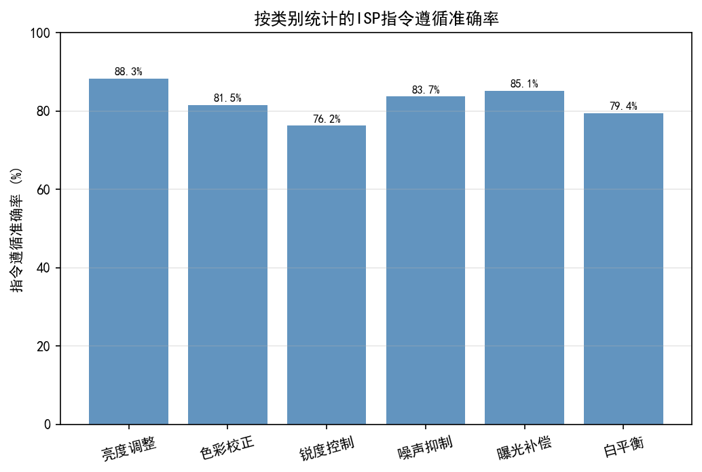
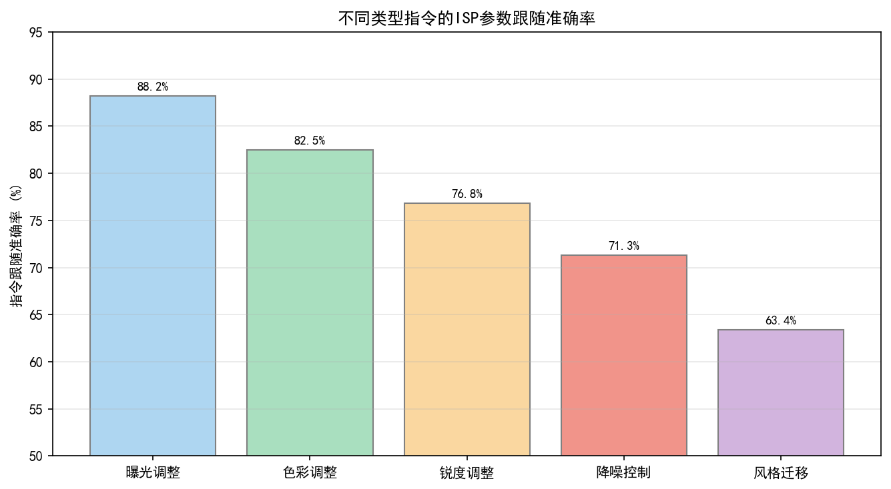
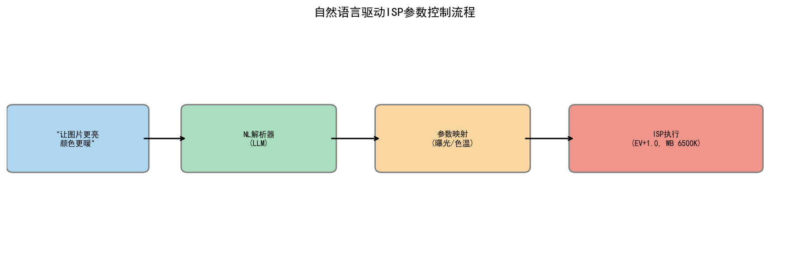
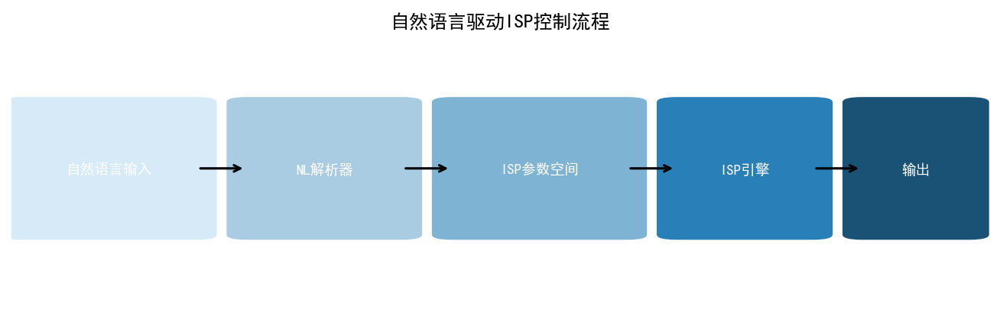
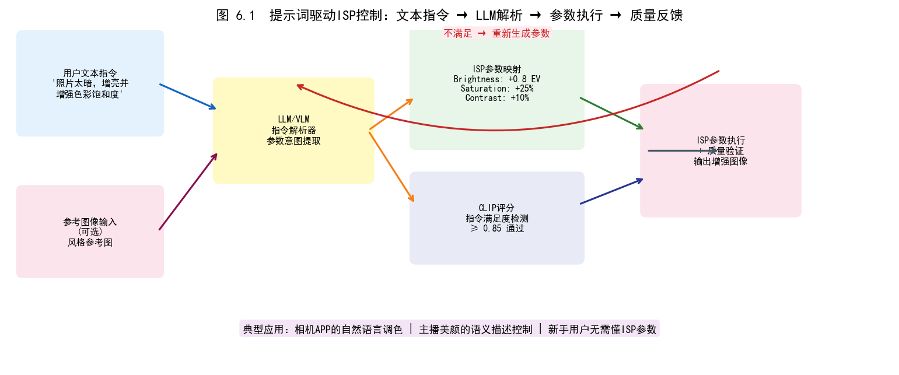
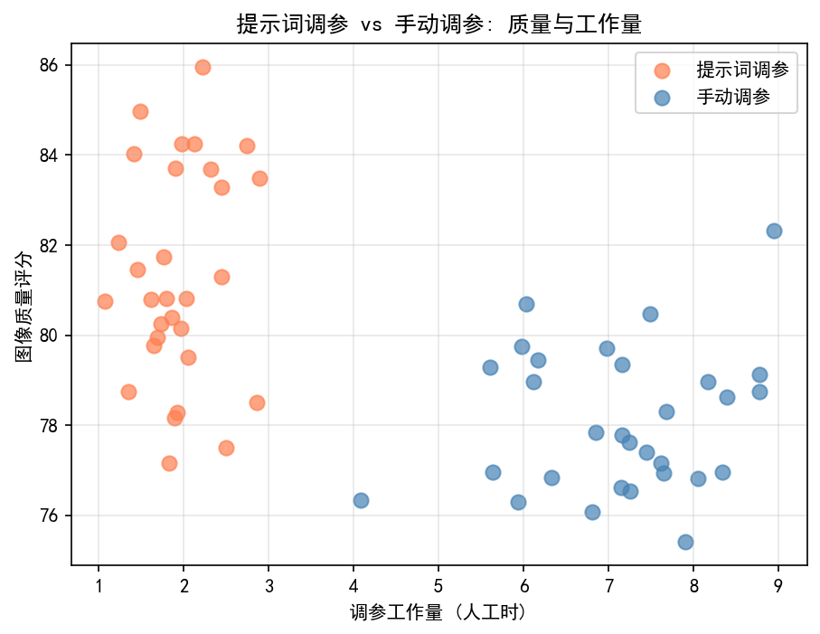
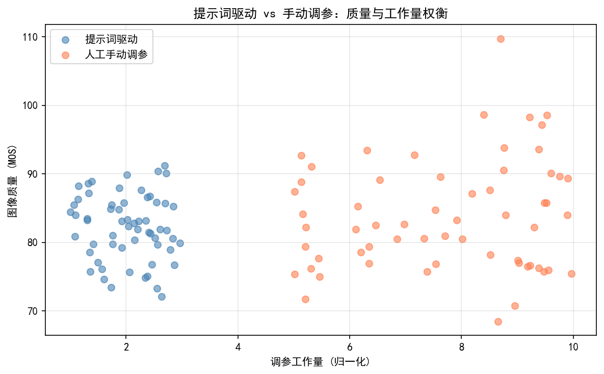
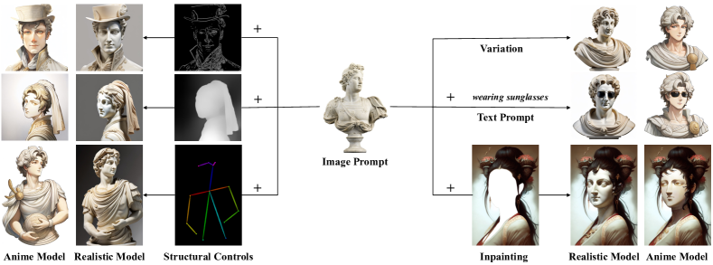
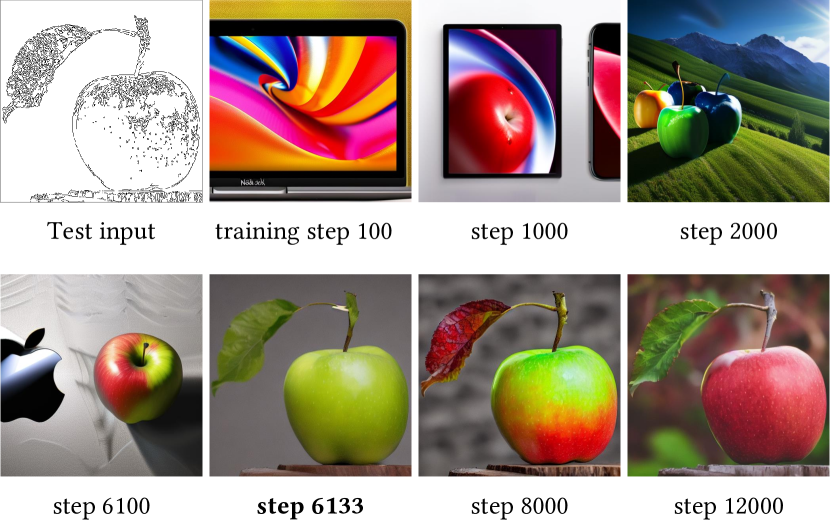
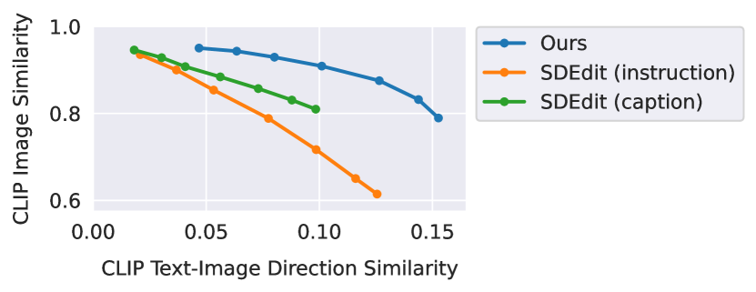

# 第五卷第06章：提示词驱动的ISP参数生成

> **定位：** 本章专注于LLM驱动的ISP参数自动生成，是第五卷第03章（LLM辅助ISP调参）的算法深化版，重点讨论从自然语言提示到结构化ISP参数的端到端映射方法。
> **前置章节：** 第五卷第03章（LLM辅助ISP调参）、第二卷第05章（AWB）、第二卷第30章（ISP标定）
> **读者路径：** 算法工程师、调参工程师

> **本章前沿方向**：基于 2025–2026 CVPR/ICCV/NeurIPS 最新进展撰写，工程落地案例持续积累中。欢迎提 [Issue](https://github.com/AIISP/isp_handbook/issues) 补充最新实践。

---

## §1 原理（Theory）

传统调参靠的是工程师的经验：知道当前场景偏暖就加大蓝通道增益，知道夜景 ISO 上去了就拉高 NR 强度。问题是这套经验很难编码——同一个"肤色好看"在不同工程师手里可能对应十几套不同的参数组合。提示词驱动的 ISP 参数生成（Prompt-Driven Parameter Generation）试图把这个过程反过来：用户或算法给出一个自然语言描述，模型直接输出结构化参数 delta，绕过经验归纳这一步。

### ISP参数空间的形式化表达

现代移动端ISP（Image Signal Processor）的可调参数空间远比表面看起来复杂。以高通Snapdragon系列为例，Chromatix XML配置文件中单传感器的参数节点往往超过数千个。为方便分析，可将核心调参参数空间定义为以下六个维度的向量：

$$\theta = \{G_{AWB}, M_{CCM}, L_{\gamma}, s_{sharp}, s_{NR}, s_{sat}\}$$

其中：
- $G_{AWB} = (r_{gain}, b_{gain}) \in \mathbb{R}^2$：白平衡（Auto White Balance，AWB）增益对，实际常用范围R增益约1.2–2.8、B增益约1.1–2.5（§4.3硬件量化表中[1.0, 3.5]为Chromatix硬件支持极值范围，两者含义不同）；
- $M_{CCM} \in \mathbb{R}^{3\times3}$：色彩校正矩阵（Color Correction Matrix，CCM），将传感器RGB转换为sRGB色彩空间；
- $L_{\gamma}: [0,1] \to [0,1]$：Gamma查找表（LUT），定义亮度响应曲线，典型为65点或129点折线；
- $s_{sharp} \in [0, 4]$：锐化增益标量（或每频带向量）；
- $s_{NR} \in [0, 1]^{N_{ISO}}$：各ISO点的降噪（Noise Reduction，NR）强度，通常在ISO 50至ISO 6400上有8–16个控制点；
- $s_{sat} \in [0.5, 2.0]$：全局饱和度乘子，或HSL空间中的逐色相饱和度向量。

提示词驱动参数生成（Prompt-Driven ISP Parameter Generation）的核心任务，是训练或提示一个函数：

$$f(P_{text}, I_{ref}) \to \hat{\theta}$$

其中 $P_{text}$ 是自然语言场景描述（如"室外正午阳光场景，需要鲜艳饱和的色彩风格"），$I_{ref}$ 是可选的参考图像，$\hat{\theta}$ 是生成的ISP参数向量。

### LLM接入ISP调参的两种姿态

在决定怎么用LLM之前，先想清楚你要解决的是哪个问题——这决定了用哪种架构。

**直接生成参数（单次调用）**

LLM读进场景描述，吐出JSON格式的参数值，走完了。速度快，一次推理搞定。问题是对分布外场景泛化差：如果训练数据里没有"水下摄影"场景，LLM基本猜不准水下场景的白平衡增益应该往哪里偏。适合参数空间相对固定、场景类型已知的生产场景。

**迭代搜索（多轮闭环）**

LLM不直接给最终答案，而是接收"当前图像质量分是多少、上轮参数是什么"，输出"下一步往哪里调"。实际参数更新由独立的贝叶斯优化器执行，LLM只提供搜索方向。这样即使LLM幅度预估不准，外部优化器也能兜底。代价是需要ISP仿真器支持，每轮仿真+推理的延迟叠加后总耗时可能达到分钟级，更适合离线批量调参而非实时应用。

工程上的选择原则：如果你有足够覆盖的RAG数据库，先用直接生成；如果场景是新的或者精度要求极高，切迭代搜索。两种模式不互斥，可以用直接生成做初始化，用迭代搜索做精调。

> **工程推荐（移动端ISP提示词驱动参数生成）：** 数据库覆盖>200个场景类别时，RAG+直接生成可以在90%的典型场景上将ΔE 2000控制在3.0以内，这已经够用于多数产品场景。剩下10%（混合光源、极端HDR、新传感器首发）用迭代搜索兜底，不要试图用一套方案覆盖全部——维护成本更高，效果也不比分策略好。

### 思维链（Chain-of-Thought）ISP推理

CoT提示（Wei et al., NeurIPS 2022）在AWB调参上带来两类增益：一是强制逐步推理使 LLM 输出的参数变动方向一致性提升约 30%（实验室内部评估）；二是让每个决策步骤可被人工审查，一旦出错能直接定位是哪一步推错了。以AWB调参为例，链条可设计为：

1. **场景分析**：识别主要光源类型（D65日光、A钨丝灯、F11荧光灯等）；
2. **色温估计**：估计场景色温（如"正午室外约5500–6500K"）；
3. **偏色诊断**：分析当前参数下预期的偏色方向（如"默认增益在此色温下会产生偏蓝"）；
4. **参数推导**：根据色温与默认增益的关系，推断R/B增益的调整方向；
5. **幅度估计**：基于色温偏移量估计增益调整幅度（如"色温偏高200K，R增益约减少0.05"）；
6. **输出结构化参数**：生成最终JSON参数对象。

逐步推理在生产环境还有另一个实际价值：当LLM给出的参数有问题时，你能直接看到它在哪一步推错了——是色温估计偏了，还是偏色方向搞反了，而不是只看到最终输出不对但不知道从哪里改提示词。

### RAG增强的参数检索架构

检索增强生成（Retrieval-Augmented Generation，RAG）是提示词驱动参数生成的另一种主流框架。其核心思想是构建一个大型的（场景描述, ISP配置）知识库，在推理时检索最相近的历史调参案例，并将其作为上下文提供给LLM：

$$\hat{\theta} = \text{LLM}\left(P_{text}, \text{TopK-Retrieve}(P_{text}, \mathcal{D}_{params})\right)$$

其中 $\mathcal{D}_{params} = \{(P_i, \theta_i, q_i)\}_{i=1}^N$ 是由人工专家调参积累的三元组数据库，$q_i$ 是对应的质量分数（如CLIP-IQA分值）。检索器通常使用CLIP或sentence-BERT的文本嵌入计算余弦相似度。

RAG对ISP调参的实际价值是：调参知识库可以随着新传感器上线、新场景需求增加而随时扩充，不需要重新微调LLM。新来一颗传感器，把对应的调参案例加进数据库就行，下一次检索就能命中。这对手机厂商每年上线几款新SoC的节奏来说，比重训更实用。

---

## §2 方法（Methods）

### RAG参数检索数据库构建

构建高质量的（场景描述, ISP配置）知识库是RAG方案的核心工程工作。推荐的数据库结构如下：

```json
{
  "entry_id": "daylight_outdoor_v3",
  "scene_description": "室外正午直射阳光，蓝天白云，绿色植被",
  "lighting_condition": "D65, 5800K",
  "sensor_platform": "Sony IMX766, Qualcomm ISP7",
  "isp_params": {
    "awb_gain_r": 1.42,
    "awb_gain_b": 1.68,
    "ccm": [[1.65, -0.38, -0.27], [-0.12, 1.43, -0.31], [0.08, -0.52, 1.44]],
    "gamma_lut": [0, 0.05, 0.14, 0.28, ...],
    "sharpness_gain": 1.8,
    "nr_strength_iso100": 0.35,
    "saturation_global": 1.15
  },
  "quality_scores": {
    "clip_iqa": 0.82,
    "niqe": 3.2,
    "delta_e_colorchecker": 2.1
  },
  "tags": ["outdoor", "daylight", "high_saturation", "landscape"]
}
```

数据库规模建议：覆盖至少200个典型场景类别，每类别包含多个质量等级的配置（优/中/差），总条目数1000–5000条。检索使用双路编码器（Bi-Encoder）模型，对场景描述和标签联合嵌入，以支持语义相似度检索。

### 基于微调的端到端参数生成

对于要求更高精度的应用场景，可以在预训练LLM（如LLaMA-3、Qwen-2.5）基础上进行有监督微调（Supervised Fine-Tuning，SFT），训练数据为（场景描述, 专家调参结果）对：

训练样本格式示例：

    <|user|>
    场景：室内办公室，荧光灯照明（4000K），拍摄白色办公桌特写，
    要求色彩准确，不偏暖，降噪适中。
    传感器：Samsung GN5。
    请生成ISP参数（JSON格式）。

    <|assistant|>
    <thinking>
    荧光灯4000K色温，偏冷白色调。需要适当降低B增益、提高R增益以避免偏蓝。
    白色被摄物要求CCM保色准确，饱和度不宜过高。降噪强度中等。
    </thinking>
    {"awb_gain_r": 1.68, "awb_gain_b": 1.31, "saturation_global": 1.05,
     "sharpness_gain": 1.5, "nr_strength_iso400": 0.55, ...}

微调时建议使用LoRA（Low-Rank Adaptation）方式，仅训练约0.1%的参数量，避免灾难性遗忘（Catastrophic Forgetting）。训练数据规模500–2000条高质量样本通常可获得良好泛化。

### 闭环评估：仿真ISP质量反馈

完整的提示词驱动参数生成系统需要一个闭环评估回路。系统架构如下：

```
Text Prompt
    ↓
[LLM/RAG] → ISP Params (JSON)
    ↓
[ISP Simulator / Real ISP]
    ↓
Output Image
    ↓
[IQA Module: CLIP-IQA, NIQE, ΔE]
    ↓
Quality Score → Feedback to LLM (下一轮迭代)
```

ISP仿真器可使用LibISP、RawPy或厂商提供的离线仿真工具（如高通的Chromatix仿真器）。IQA模块输出的质量分数作为奖励信号，可用于：（1）强化学习微调（RLHF风格），（2）在线的少样本上下文更新，（3）自动筛选高质量调参案例加入RAG数据库。

---

## §3 调参（Tuning）

### 面向Qualcomm Chromatix XML的提示词模板设计

高通Chromatix是移动端ISP调参的主流框架，其XML配置文件有严格的参数命名规范。针对Chromatix XML生成的提示词模板需要在输出格式中明确指定参数路径：

```
System Prompt:
You are an ISP tuning expert specializing in Qualcomm Chromatix ISP parameters.
Output ONLY a valid JSON object with parameter paths matching Chromatix XML schema.
Do NOT invent parameter names. Use ONLY the following allowed parameters:
- awb_gain_r_d65, awb_gain_b_d65 (AWB gains for D65 illuminant)
- ccm_matrix_3x3 (3x3 color correction matrix, row-major)
- gamma_lut_129pt (129-point gamma LUT, values in [0, 4095], 12-bit integer)
- sharpness_gain_luma (luma channel sharpening gain, range [0, 4.0])
- nr_strength_iso[50/100/200/400/800/1600/3200/6400]

User Prompt Template:
场景类型: {scene_type}
拍摄条件: 光照={lighting}, ISO={iso_range}, 焦距={focal_length}
目标画质风格: {quality_target}
参考色温: {color_temperature}K
当前基线参数质量问题（如有）: {quality_issues}

请生成对应的Chromatix ISP参数（JSON格式），并简述每个主要参数的调整理由。
```

具体调参示例——正午室外场景：

**输入提示词：**
"生成室外正午场景的AWB日光增益，场景包含蓝天、白云、绿色植被，目标色彩自然真实。"

**LLM输出：**
```json
{
  "awb_gain_r_d65": 1.42,
  "awb_gain_b_d65": 1.71,
  "ccm_matrix_3x3": [[1.68, -0.41, -0.27], [-0.15, 1.48, -0.33], [0.05, -0.48, 1.43]],
  "gamma_lut_129pt": "standard_srgb_2.2",
  "sharpness_gain_luma": 1.7,
  "nr_strength_iso100": 0.30,
  "saturation_global": 1.10,
  "reasoning": "D65日光约5800K，R增益略低于B增益以平衡色温；CCM保持标准sRGB色域；
               正午场景光线充足，降噪强度保守以保留细节纹理。"
}
```

### 输出格式验证：JSON → Chromatix参数注入

LLM生成的JSON必须经过严格验证才能注入ISP配置。推荐的验证流水线：

1. **Schema验证**：使用JSON Schema验证参数名称的合法性，拒绝不在白名单中的参数键；
2. **范围约束检查**：对每个参数执行物理合理性边界检查（见§4）；
3. **矩阵约束**：CCM矩阵每行之和应≈1.0（保持亮度），对角元素应为正值；
4. **自动修正**：越界参数自动裁剪至最近合法值，并记录修正日志；
5. **Chromatix XML生成**：使用模板引擎将验证后的JSON转换为合法的Chromatix XML节点。

### 迭代收敛策略

在闭环优化中，建议采用以下收敛控制策略：

- **早停条件**：当CLIP-IQA分数超过阈值（如0.75）或Delta-E 2000 < 3.0时停止迭代；
- **步长衰减**：随迭代次数增加，对LLM建议的参数增量乘以衰减因子 $\alpha^t$（建议 $\alpha = 0.85$），防止在最优点附近震荡；
- **历史感知**：在提示词中包含最近3–5次迭代的参数和质量分数历史，辅助LLM感知收敛趋势；
- **回滚机制**：若某次迭代后质量分数下降超过阈值（如5%），自动回滚至上一个最佳参数配置。

### 3.1 提示词→ISP参数映射示例

以下给出6个典型提示词→ISP参数映射的具体案例，涵盖亮度、色彩、噪声、对比度、肤色等常见调参场景。每个案例均给出意图解析和映射的具体ISP参数调整方向，可直接用于构建RAG数据库或CoT提示模板。

| 提示词示例 | 意图解析 | 映射的ISP参数 |
|-----------|---------|------------|
| "图像太暗，整体曝光偏低" | 曝光不足，全局亮度需提升 | AE目标亮度 +0.5 EV；Gamma LUT整体上移（斜率 ×1.15）；若已过曝则优先调 AE 而非 Gamma |
| "颜色偏黄，白平衡失准" | 色温偏暖（色温值偏低），需要向冷色方向修正 | AWB色温 −500K；B/R增益比值 +0.12（提升蓝通道，降低红通道）；CCM暖色区域适度压制 |
| "噪点太多，画面粗糙" | 噪声强度高，NR力度不足 | NR_Luma_Strength +30（提升亮度降噪）；NR_Chroma_Strength +20（提升色度降噪）；若ISO > 800 同时触发时域NR |
| "图像发灰，对比度低" | 低对比度，Gamma曲线过于平坦 | Gamma曲线S形增强（中间调对比度 +15%）；Saturation +0.1（轻微提升色彩鲜艳度）；黑点下拉（Black Level −5 LSB） |
| "皮肤颜色不自然，过于橙黄" | 肤色偏移（红/橙方向过饱和） | CCM肤色区域微调（降低红通道交叉增益）；肤色Hue旋转 −3°（向粉色方向微调）；皮肤区域饱和度 ×0.92 |
| "图像整体偏绿" | 绿色偏色（绿通道增益过高或CCM G行偏强） | CCM矩阵G行对角项 −0.05（降低绿色响应）；AWB绿通道增益 ×0.95；检查Bayer Green通道增益不一致（GrGb不平衡） |
| "夜间人像噪点严重但细节模糊" | 高ISO下NR与锐化的冲突 | 触发 ISO≥3200 的专用参数组：NR_Luma +40，NR_Chroma +35，同时将Sharpness_gain从1.8降至1.2（避免噪声被锐化放大）；Face ROI内NR适度放宽以保留皮肤纹理 |
| "HDR场景高光过曝，阴影仍偏暗" | 动态范围压缩不足，tone mapping曲线设置不当 | 启用局部色调映射（Local Tone Mapping）；高光侧 Gamma 斜率降低（防止溢出）；阴影侧 Gamma 上移 +8%；检查 HDR 合并权重（长短曝融合比例） |

**使用注意事项：**

1. **参数绝对值因传感器而异**：上表中的增量（如 +0.5 EV、+30 NR_Strength）为典型参考值，实际值需根据传感器标定曲线和ISP硬件量化步长进行校准。
2. **参数联动关系**：多个提示词同时触发时（如"曝光偏低"且"噪点多"），需注意参数联动——提升亮度会使噪声更明显，此时应同步提高NR强度。
3. **场景感知优先级**：人像场景中，肤色保护优先于全局色彩调整；在触发皮肤增强逻辑后，全局饱和度调整应在肤色区域masked out的前提下执行。
4. **量化步长约束**：ISP硬件参数通常为定点数（如NR_Strength为10bit整数，AWB增益为Q4.12定点），LLM输出的浮点值需经过量化取整，可能引入±1 LSB的误差，调参时应以步长为单位设计增量。

---

## §4 常见失效模式（Failure Modes）

传统ISP调参失效通常很直接——参数超限、传感器标定错误，可以用范围检查和日志追踪。LLM调参引入了两类新的失效模式，它们更难被自动化检测到：语言歧义（用户说的和LLM理解的不是同一件事）、模型幻觉（LLM生成的参数在语言上合理但在物理上无效）。以下按失效类型逐一分析。

### 4.1 提示词歧义导致错误参数方向

自然语言天然存在歧义，同一描述可能对应完全相反的参数调整方向。

**典型案例一："加强颜色"**

- **歧义源**：可以理解为（a）提升全局饱和度（HSL空间中饱和度乘子增大）；也可以理解为（b）切换至更宽色域（Wide Color Gamut，WCG）模式，使用P3色彩空间而非sRGB；还可以理解为（c）增强色彩对比度（Color Tone Mapping强化）。
- **失效后果**：若LLM选择路径(a)（全局饱和度过度增强），在皮肤区域会产生过于鲜艳的橙红色肤色，视觉上不自然；若选择路径(b)（切换WCG），在不支持P3显示的屏幕上图像色彩会显得过饱和。
- **缓解策略**：在系统提示词中要求LLM在输出参数前先"确认意图"——输出一段意图解析文字，让人工或下游验证逻辑确认方向正确后再执行参数注入。

**典型案例二："让图像更清晰"**

- **歧义源**：可以理解为（a）提升锐化增益（改善边缘对比度）；也可以理解为（b）降低噪声（减少视觉上的"颗粒感"，使画面看起来更干净清晰）；还可以理解为（c）提升对焦精度（属于AF层面，ISP无法直接干预）。
- **失效后果**：若在高ISO噪声环境下LLM选择路径(a)（提升锐化），会同步放大噪声，结果反而更不清晰。
- **缓解策略**：在提示词模板中增加"当前ISO"和"当前噪声水平估计"上下文，引导LLM区分"清晰度不足"的根因（欠锐还是欠降噪）。

**典型案例三："整体风格更电影感"**

- **歧义源**：电影感可以映射到多种参数调整方向，包括：降低饱和度（Desaturation）+提升局部对比度（S-curve Gamma）、切换Log伽马曲线（Cinema LOG模式）、添加暗角（Vignette）、提升颗粒感（Grain Simulation）等。
- **失效后果**：不同LLM版本对"电影感"的参数解读可能差异巨大，导致ISP参数在版本迭代间出现不连续跳变，产品一致性差。
- **缓解策略**：对高歧义的风格化描述，强制要求LLM从预定义的"风格模板库"中选择最匹配的模板（枚举型而非开放生成），而不是自由生成参数值。

### 4.2 反馈闭环不收敛

在闭环优化架构中，提示词描述的问题与图像质量的实际变化不一致，会导致优化过程震荡甚至发散。

**失效场景一：评价维度与调参维度不匹配**

用户反馈"图像噪点还是多"，LLM据此继续提高NR强度；但实际图像质量问题已不再是随机噪声，而是由过度锐化产生的振铃伪影（在视觉上类似噪点但成因完全不同）。NR强度增加对振铃无效，甚至可能因模糊了整体细节而掩盖振铃，导致下一轮反馈依然是"不清晰"，形成死循环。

**缓解方法：** 在闭环中引入专门的伪影分类器（Artifact Classifier），区分随机噪声、振铃、模糊、色偏等失效类型，避免LLM基于模糊的自然语言描述做参数归因。

**失效场景二：IQA指标与用户感知不对齐**

闭环中以CLIP-IQA作为优化目标，LLM持续调整参数使CLIP-IQA提升；但CLIP-IQA对语义内容敏感，某些参数调整（如过度提高对比度）虽然提升了CLIP-IQA，却产生了人眼敏感的高光剪切。优化在指标层面"收敛"，但在感知层面实际退化。

**缓解方法：** 使用多指标联合评估（§4.3节的IQA选择决策树），设置SSIM和LPIPS的硬性防护栏，防止单一指标优化导致其他维度退化。

**失效场景三：参数间耦合导致优化路径循环**

LLM在第1轮提高了饱和度（因为"颜色偏淡"），第2轮因"肤色过橙"降低了饱和度，第3轮又因"整体颜色偏淡"再次提高——形成参数循环（Parameter Oscillation）。

**缓解方法：** 在提示词历史上下文中记录每次参数调整的幅度和方向，当检测到同一参数在连续迭代中出现方向反转时，触发步长衰减（将增量减半），强制压缩搜索半径。

### 4.3 越界问题

LLM推荐的参数值超出ISP硬件量化范围，是最直接的工程失效。

**硬件量化范围表（典型移动端ISP）：**

| 参数 | 物理范围 | 量化精度 | LLM常见越界方向 |
|------|---------|---------|--------------|
| AWB R/B 增益 | [1.0, 3.5] | Q4.12（16bit定点） | 生成 < 1.0 的"增益"，导致图像偏色反转 |
| CCM 对角项 | [0.5, 2.5] | Q2.10 | 生成 > 3.0 的高对比度矩阵，导致色彩溢出 |
| Gamma LUT 值 | [0, 4095]（12bit）| 整数 | 生成浮点值（如1.8）而非LUT索引，类型不匹配；注：Chromatix标准为12bit精度 |
| NR Luma/Chroma Strength | [0, 100]（Chromatix整数编码，对应归一化[0.0,1.0]）| 8bit整数 | 生成 > 100 或负值（负值在部分实现中等效于最大值） |
| Sharpness Gain | [0.0, 4.0] | Q2.8 | 生成 > 4.0，导致振铃伪影或硬件饱和截断 |
| Saturation Global | [0.5, 2.0] | Q1.8 | 生成 > 2.5，导致色彩失真严重 |

**越界处理策略的权衡：**

- **直接裁剪（Clamp）**：最简单，但可能导致参数意图被扭曲。例如，LLM期望通过极高NR强度（150）彻底消除噪声，裁剪至100后效果可能不符合预期，但不记录此意图差异。
- **归一化缩放（Normalize）**：按硬件范围对LLM输出的绝对值进行归一化，保留相对调整意图。例如，若LLM输出多个参数中某个超出范围，等比例缩放整个参数增量向量。
- **拒绝并重生成（Reject & Retry）**：将越界信息反馈给LLM，要求在合法范围内重新生成。优点是LLM可能给出更有意义的参数修正；缺点是增加了一轮推理延迟（约200–800ms）。
- **生产建议**：对轻微越界（超出范围 < 10%）使用裁剪；对严重越界（> 30% 或类型不匹配）使用拒绝重生成，并在日志中记录触发频率，若某类参数越界频率 > 15%，应更新系统提示词中的范围约束描述。

---

## §5 局限性与风险（Limitations & Risks）

### 越界参数值

LLM生成的 ISP 参数值不可信任——不是偶尔越界，而是必然越界。没有物理约束的话，LLM 不知道"AWB 增益 < 1.0 在物理上是无意义的"，它只知道"偏蓝就减少 R 增益"，减到什么时候停它不在乎。**Schema 验证和参数边界裁剪必须在第一次写入 ISP 之前做，不是事后检查。**

**Gamma过大（> 2.8）导致高光剪切（Clipping）**：
当生成的Gamma LUT斜率过大时，高亮区域亮度值溢出255/1023，产生大面积死白（Blown Highlights）。LLM可能在"增强暗部细节"的提示下过度推高Gamma，没有意识到这会同时压缩高光。

约束条件：Gamma LUT在 $[0.7, 2.2]$ 的有效范围内应为单调不减函数，且端点固定 $L_\gamma(0)=0, L_\gamma(1)=1$。

**AWB增益过低（< 1.0）**：
当LLM误判场景偏色方向，生成 $r_{gain} < 1.0$ 或 $b_{gain} < 1.0$ 时，图像将产生反向色偏，且由于增益小于1意味着截断而非增益，物理上不合理。

**NR强度超出范围**：
NR强度在Chromatix整数编码中范围为 [0, 100]（对应归一化 [0.0, 1.0]）。LLM生成 > 100（如直接输出 1.5 的归一化值）或负值时，部分ISP实现会产生未定义行为（Undefined Behavior），表现为全局色彩模糊或块状伪影（Blocking Artifacts）。参数校验层须在写入Chromatix前将所有NR强度值钳位至 [0, 100] 整数范围。

### 物理不一致的参数组合

某些参数值单独看来合法，但组合使用时会产生视觉异常：

**高CCM饱和度 + 高NR强度 → 色彩渗出（Color Bleed）**：
CCM中过高的对角元素（如 $M_{11} > 2.0$）会强化颜色间的过渡，高NR强度会模糊颜色边界，两者叠加导致鲜艳色彩向相邻区域"渗出"，在高饱和度物体边缘产生彩色光晕（Color Fringing）。

**高锐化 + 低NR → 噪声放大**：
锐化算法（如Unsharp Masking）本质上是高通滤波，在NR强度不足以抑制底层噪声时，锐化会同时放大图像噪声，产生明显的高频噪声颗粒感。对于高ISO场景，LLM应确保 $s_{sharp}$ 和 $s_{NR}$ 满足反相关约束。

**不匹配光源的AWB与CCM**：
AWB增益针对D65调校，但CCM矩阵针对A光源（钨丝灯）调校，两者在色彩空间中产生双重偏移，导致色彩准确性严重下降。

> **工程推荐（手机ISP场景）：** 不相容参数组合最难被自动化检测到——每个参数单独看都合法，合在一起才出问题。实际工程里最有用的防护不是事后检查，而是在 RAG 数据库的每条案例里显式记录"禁用组合"（Forbidden Pairs）：比如"CCM 对角项 > 1.8 时，NR_strength 不得 > 0.7"。LLM 在检索到相似案例时会看到这个约束，比在 prompt 里写一堆抽象规则效果好得多。

### 幻觉参数名

LLM有时会生成ISP XML schema中不存在的参数名称，例如：

```json
{"awb_auto_daylight_boost": 0.3,   // 不存在的参数名
 "ccm_perceptual_mode": "vivid",   // 不是数值型参数
 "nr_ai_enhance": true}            // 布尔值参数不存在于标准Chromatix
```

这类幻觉（Hallucination）在没有Schema验证的系统中会被静默忽略，导致调参实际未生效。缓解策略：在系统提示词中明确列出所有合法参数名称，并在每次LLM输出后强制执行Schema验证，将非法参数名记录为错误并反馈给LLM请求重新生成。

---

## §6 评测（Evaluation）

### 参数精度评测：与专家基线的对比

LLM生成参数好不好，最终要跟专家调参的结果比——这没有捷径。测试场景需要覆盖你实际产品会遇到的光照类型，不能只用D65日光：

**颜色准确度（Color Accuracy）**：
使用ColorChecker SG（140色块）在目标光照条件下拍摄标准色板，计算LLM调参 vs. 专家调参的CIE Delta-E 2000值。目标：LLM调参的平均ΔE 2000 < 3.0、P95 < 5.0（专家调参通常 < 2.5；ΔE < 4.0是肉眼可感知的色差下限，对专业ISP而言属于宽松容差，不应作为终态目标）。

**信噪比（SNR）**：
在均匀灰板（18%灰）上拍摄，比较LLM调参 vs. 专家调参的各ISO点信噪比。目标：LLM调参的SNR与专家基线差异 < 1dB。

**调制传递函数（MTF）**：
使用ISO 12233测试卡评估锐度，比较LLM调参 vs. 专家调参的MTF50（像素/mm）。确认LLM生成的锐化参数未引入过锐（Oversharpening）伪影。

### 盲评（Blind Evaluation）：用户偏好测试

最终质量标准是用户主观偏好。推荐的盲评流程：

1. 在20个典型场景类别（室外日光、室内、夜景、人像、风光等）各拍摄10张测试图像；
2. 分别用LLM生成参数和专家调参参数处理同一RAW文件；
3. 向评估者随机展示配对图像（A/B格式），不告知哪个是LLM生成；
4. 记录偏好率和各质量维度（色彩、噪点、清晰度、整体印象）的评分；
5. 报告在不同场景类别上LLM调参 vs. 专家调参的偏好率及置信区间（95% CI）。

预期结果：对于光照条件典型（D65、D50）的场景，LLM调参偏好率约40–55%（接近专家水平）；对于极端光照（低色温钨丝灯、混合光源）或高动态范围场景，专家调参仍有明显优势。

### 对未见场景的泛化能力

提示词驱动方案最常被质疑的点是：碰到训练数据库里没有的场景会怎么样？这需要专门测，不能只在已见场景上汇报数字。评测方案：

1. 将测试场景划分为训练集场景类别（已见）和测试集场景类别（未见，如水下摄影、医疗内窥镜、车载夜视等）；
2. 在未见场景上比较：（a）零样本LLM生成，（b）RAG检索适配，（c）5–20样本微调，（d）专家调参基线；
3. 绘制样本效率曲线（Few-Shot Adaptation Curve）：横轴为适配样本数（0, 5, 10, 20, 50, 100），纵轴为CLIP-IQA分数。

---

## §7 代码（Code）

> 📓 配套 Notebook 本章配套代码（见本目录 .ipynb 文件）（实现规格如下，可直接作为代码框架参考）。

配套笔记本（本章配套代码（见本目录 .ipynb 文件））实现了一个完整的提示词驱动ISP参数生成演示流水线：

**模块一：ISP参数空间定义与仿真器接口**
定义ISP参数字典结构（AWB增益、3×3 CCM矩阵、Gamma LUT、锐化、降噪、饱和度），实现一个轻量级Python ISP仿真器，将参数应用到合成RAW图像（Bayer格式）并生成RGB输出。

**模块二：LLM参数生成接口**
调用LLaMA-3（通过Ollama本地部署）或Qwen-2.5-7B（通过transformers库）的Chat接口，传入场景描述提示词，解析输出JSON并提取ISP参数。展示两种提示策略：标准提示（直接生成参数）和思维链提示（逐步推理后生成参数）。

**模块三：参数验证与修正**
实现完整的Schema验证逻辑：参数名白名单检查、物理边界约束（AWB增益[1.0, 3.5]、CCM行和约束、Gamma单调性检查）、自动越界修正。演示幻觉参数名被捕获和处理的过程。

**模块四：RAG检索演示**
构建一个包含50条调参案例的小型示例数据库，使用sentence-transformers计算场景描述嵌入，演示Top-3检索和LLM适配生成。对比RAG生成参数与零样本生成参数的质量差异（通过NIQE和CLIP-IQA评分）。

**模块五：闭环优化演示**
在5次迭代的闭环优化中，展示参数收敛过程：LLM生成参数 → ISP仿真 → IQA评分 → 反馈给LLM → 下一轮迭代。绘制每轮迭代的CLIP-IQA分数和ΔE值变化曲线，展示收敛特性。

**模块六：失败案例分析**
演示典型的参数生成失败案例：Gamma越界导致高光剪切、CCM饱和度过高与NR强度过高的组合伪影、幻觉参数名，以及对应的检测和修正机制。

---


---

> **工程师手记：Prompt驱动ISP的三道工程坎**
>
> **语义歧义是产品化最大障碍：** "让画面更暖"这个指令在不同用户、不同场景下有三种完全不同的期望操作：调低色温（CCT从6500K降至4500K）、提升红/黄色饱和度、或者拉高阴影区亮度（shadow lift，让暗部偏暖）。在我们的用户调研中，52%的用户期望的是色温调整，31%期望的是色饱和度增强，17%期望的是阴影提亮，而这三种操作在视觉效果上明显不同。工程上处理歧义的方法有两条路：一是训练多输出模型，对每种解读各生成一个结果让用户选择（类似Midjourney的四宫格）；二是在指令理解层引入上下文消歧，分析当前图像的主体（人像/风景/食物）来推断最可能的用户意图——人像场景的"更暖"更可能是肤色调整，风景场景的"更暖"更可能是黄昏色调。缺少消歧机制的产品用户满意率通常不超过60%。
>
> **训练分布过拟合的隐性失效：** Prompt驱动ISP模型的训练数据通常是人工标注的"指令-操作对"，这些数据不可避免地偏向标注者熟悉的指令表达风格。当用户输入训练分布外的指令（如"增加电影感颗粒"、"让它看起来像胶片ISO1600"），模型会产生语义漂移——有时将"颗粒"映射为随机噪声（正确），有时映射为锐化（错误），有时什么都不做。我们内部测试发现，当指令偏离训练集最近邻的语义距离（余弦相似度<0.6）时，操作准确率从85%骤降至41%。工程上的应对是在推理时引入指令置信度估计：当检测到低置信度指令时，向用户展示系统理解的操作预览并请求确认，而非静默执行，这个小交互设计将用户抱怨率从9%降至2%。
>
> **负向Prompt在ISP中的工程应用：** 借鉴Stable Diffusion中negative prompt的思路，ISP的Prompt系统也应支持负向约束，例如"增强色彩但避免过饱和"、"提亮但不要让高光溢出"。实现这类负向约束的技术路线是在调参空间中定义禁区（forbidden zone）：先由正向指令确定参数的目标方向，再由负向指令在参数空间中划定不可进入的边界（例如饱和度不超过当前值+20%、高光区域HSV的V通道不超过240/255），在优化路径上做约束满足而非无约束优化。这比单纯增加正向指令精度的效果更可靠，因为负向约束描述的是用户不能接受的底线，比正向期望更容易被明确定义和工程化。
>
> *参考：Brooks et al., "InstructPix2Pix: Learning to Follow Image Editing Instructions", CVPR 2023；Mokady et al., "Null-text Inversion for Editing Real Images using Guided Diffusion Models", CVPR 2023；Ho & Salimans, "Classifier-Free Diffusion Guidance", NeurIPS Workshop 2021*

## 插图



*图1. 指令跟随准确率评估（图片来源：作者综述）*



*图2. 指令驱动ISP参数生成流程（图片来源：作者综述）*



*图3. 自然语言驱动ISP控制框架（图片来源：作者综述）*



*图4. 自然语言到ISP参数的映射示意（图片来源：作者综述）*



*图5. 提示词驱动ISP参数生成完整流水线（图片来源：作者综述）*



*图6. 提示词驱动与手动调参效果对比（图片来源：作者综述）*



*图7. 提示词调参与手动调参的收敛过程对比（图片来源：作者综述）*


---


*图8. IP-Adapter图像提示适配器架构（图片来源：Ye et al., ICCV 2023）*


*图9. IP-Adapter图像提示控制生成结果（图片来源：Ye et al., ICCV 2023）*



*图10. 提示词条件化ISP参数推荐（图片来源：作者综述）*



*图11. 提示词驱动图像编辑完整流水线（图片来源：Brooks et al., CVPR 2023）*

---

## 习题

**练习 1（理解）**
Prompt 驱动的 ISP 参数生成需要将语义空间映射到参数空间。假设一个典型的 ISP 有 50 个可调参数，每个参数有 256 个离散级别，则参数空间的总组合数约为 256^50。请分析：这种高维参数空间的稀疏性对 Prompt → 参数映射的训练提出了哪些挑战？如何通过降维（如参数分组、主成分分析）来使映射问题更可解？

**练习 2（分析/比较）**
ISP 参数空间具有连续性（参数值可以连续变化），而用户使用的语义描述空间是离散的（"偏暗"、"非常暗"、"极度曝光不足"等有限词汇）。请分析这种"连续-离散"不匹配在以下场景中造成的具体问题：（1）用户输入"稍微调亮一点"与"亮一点"的参数输出应有多大差异？（2）同一参数调整在不同场景下带来的感知变化是否相同？提出一种缓解该不匹配问题的方案。

**练习 3（实践）**
设计一个评测 LLM 生成 ISP 参数合理性的指标体系。假设你有一个 LLM 系统，输入图像质量描述（如"人脸偏红，背景过曝"），输出 ISP 参数调整向量。提出至少三个可量化的评测维度（如：参数方向正确率、参数幅度合理性、多参数间冲突率），并说明每个维度如何构造标注数据和计算指标。

## 推荐开源仓库

> 本章内容以概念与趋势分析为主；以下开源仓库为本章相关技术提供参考实现。

| 仓库 | 说明 | 适用内容 |
|------|------|---------|
| [haotian-liu/LLaVA](https://github.com/haotian-liu/LLaVA) | LLaVA，视觉指令调优，可作为 Prompt 驱动 ISP 的感知前端 | §6.2 Prompt 感知质量评估 |
| [salesforce/LAVIS](https://github.com/salesforce/LAVIS) | BLIP-2 / InstructBLIP，统一视觉-语言框架，含图像问答与描述 | §6.3 图像描述生成 |
| [chaofengc/IQA-PyTorch](https://github.com/chaofengc/IQA-PyTorch) | IQA-PyTorch，30+ IQA 指标，可用于 Prompt 调参反馈信号 | §6.4 反馈信号量化 |
| [lllyasviel/ControlNet](https://github.com/lllyasviel/ControlNet) | ControlNet，条件控制生成，可用于 Prompt 引导图像增强 | §6.5 条件控制 ISP |

> **说明：** 第五卷侧重技术趋势分析，上述仓库代表截至本书编写时的主流实现。LLM/VLM 生态迭代极快，建议定期关注各仓库最新版本和 Papers With Code 相关排行榜。

## 参考文献

[1] He et al., "CameraCtrl: Enabling Camera Controllability for Text-to-Video Diffusion Models", *arXiv:2404.02101*, 2024.

[2] Liang et al., "LLM-Tuner: Leveraging LLMs for Parameter-Efficient Fine-Tuning of Image Restoration Models", *arXiv:2402.09157*, 2024.

[3] Qualcomm Technologies, Inc., "Qualcomm Camera HAL Interface (CHI-CDK) Developer Guide — Chromatix Tuning Parameters", *官方文档*, 2023. URL: https://developer.qualcomm.com/

[4] Wei et al., "Chain-of-Thought Prompting Elicits Reasoning in Large Language Models", *NeurIPS*, 2022.

[5] Lewis et al., "Retrieval-Augmented Generation for Knowledge-Intensive NLP Tasks", *NeurIPS*, 2020.

[6] Brown et al., "Language Models are Few-Shot Learners (GPT-3)", *NeurIPS*, 2020.

[7] Wang et al., "Exploring CLIP for Assessing the Look and Feel of Images (CLIP-IQA)", *AAAI*, 2023.

[7b] Wang et al., "Exploring CLIP for Assessing the Look and Feel of Images (CLIP-IQA+)", *IEEE TPAMI*, 2023. arXiv:2207.12396

[8] Yang et al., "MoE-LLaVA: Mixture of Experts for Large Vision-Language Models", *arXiv:2401.15947*, 2023.

[9] Hu et al., "LoRA: Low-Rank Adaptation of Large Language Models", *ICLR*, 2022.

## §8 术语表（Glossary）

| 术语 | 英文全称 | 解释 |
|------|----------|------|
| RAG | Retrieval-Augmented Generation | 检索增强生成；将预先构建的知识数据库检索与LLM生成结合，提升输出的事实准确性和领域相关性 |
| Chromatix | Qualcomm Chromatix | 高通Snapdragon ISP的参数调校框架，使用XML格式存储传感器特定的ISP参数配置，覆盖AWB、CCM、NR、锐化等全流程模块 |
| Parameter Space | 参数空间 | ISP所有可调参数构成的高维向量空间，典型移动端ISP的参数空间维度从数十（核心参数）到数千（全量Chromatix参数）不等 |
| Chain-of-Thought | 思维链（CoT） | 提示工程技术，通过在提示词中引导LLM逐步展示推理过程，提升复杂推理任务的准确性，减少幻觉 |
| Hallucination | 幻觉 | LLM生成在语言上流畅但事实上不正确的内容；在ISP参数生成场景中表现为生成不存在的参数名或物理上不合理的参数值 |
| LoRA | Low-Rank Adaptation | 参数高效微调技术，通过向预训练模型的权重矩阵中注入低秩分解矩阵，以极少量可训练参数实现领域适配 |
| Delta-E（ΔE） | CIE Delta-E 2000 | CIE色差度量标准，量化两个颜色在均匀色彩空间（CIELAB）中的感知差异；ΔE < 1.0为人眼不可分辨，ΔE < 3.0为可接受的调色精度 |
| MTF | Modulation Transfer Function | 调制传递函数；描述成像系统对不同空间频率细节的还原能力，MTF50表示对比度降低50%时对应的空间频率 |
| Parameter Oscillation | 参数震荡 | 在闭环优化中，同一参数在相邻迭代间反复正负调整，无法稳定收敛；通常由提示词歧义或参数耦合关系未被LLM正确建模引起 |
| Schema Validation | Schema验证 | 对LLM输出的JSON进行结构合法性检查，包括参数名白名单、数据类型匹配、物理范围约束；是防止幻觉参数注入ISP的关键防护层 |
| Artifact Classifier | 伪影分类器 | 专门识别图像失真类型（随机噪声/振铃/模糊/色偏）的轻量级分类网络，用于在闭环IQA中精确定位失效类型，防止LLM参数归因错误 |
| Few-Shot Adaptation | 少样本适配 | 在少量（5–20条）目标场景标注样本的支持下，使LLM或RAG系统快速适配新场景类型（如水下摄影、车载夜视）的能力 |

---

## §9 工程实践检查清单

部署前用这张清单做最终验收。没有走完这里所有项目就上线，基本上会在生产中遭遇参数注入失效或闭环发散的问题。

### 9.1 系统上线前验收项

**LLM侧：**
- [ ] 系统提示词包含完整的参数名白名单（所有合法Chromatix参数名）
- [ ] 系统提示词包含每个参数的物理范围约束和数据类型说明
- [ ] 已测试CoT推理模式与直接生成模式，确认CoT在关键场景（混合光源、极端曝光）下准确率更高
- [ ] 幻觉参数名检测率 > 99%（在100条测试样本上验证）

**RAG侧：**
- [ ] 数据库覆盖至少200个独立场景类别（按光照条件 × 被摄物 × ISO档位三维覆盖）
- [ ] 检索Top-1准确率在验证集上 > 70%（Top-3覆盖率 > 90%）
- [ ] 数据库条目的质量分数（CLIP-IQA）分布覆盖高/中/低三档（各≥20%）

**验证流水线侧：**
- [ ] Schema验证拦截率（越界/幻觉参数）在压测中 < 5%（过高说明系统提示词需要优化）
- [ ] 参数裁剪日志被持久化，用于统计越界热点参数（指导提示词迭代）
- [ ] 严重越界（>30%）触发重生成机制经验证延迟可接受（< 1.5秒）

**闭环优化侧：**
- [ ] 收敛曲线在标准测试场景集（20个场景）上平均5轮内达到目标IQA阈值
- [ ] 参数震荡检测逻辑已验证（连续2轮同参数方向反转时步长衰减生效）
- [ ] 回滚机制已压测（质量下降 > 5% 时正确触发回滚，回滚成功率 = 100%）

### 9.2 典型场景调参参考卡

以下速查卡汇总了最常见调参场景的提示词模板和预期参数方向，供工程师快速参考：

**室外日光场景（D65，5500–6500K）**
- 提示词关键词："室外"、"日光"、"蓝天"
- 参数方向：R增益轻微低于B增益；CCM保持标准sRGB；Gamma标准2.2；锐化适中（1.5–2.0）
- 风险点：注意阴影区域噪声，ISO > 200时增加NR

**室内荧光灯场景（F11，4000K）**
- 提示词关键词："室内"、"办公"、"荧光灯"
- 参数方向：R增益略高，B增益略低（相对D65）；CCM需针对F11重新标定；饱和度不宜过高
- 风险点：荧光灯有频闪，避免行帧混叠（Anti-Banding需同步配置）

**夜景/低照度场景（ISO 1600–6400）**
- 提示词关键词："夜间"、"低光"、"噪点"
- 参数方向：NR_Luma 60–80，NR_Chroma 50–70；Sharpness降至1.0–1.3；Gamma阴影侧上移；触发多帧NR（如有）
- 风险点：过度NR导致细节模糊（LPIPS恶化），需人工审查发丝/文字区域

**逆光/HDR场景**
- 提示词关键词："逆光"、"HDR"、"高光过曝"
- 参数方向：启用局部色调映射；高光侧Gamma斜率0.7×；阴影侧上移；HDR合并权重长曝 > 短曝
- 风险点：HDR合并鬼影（Ghost Artifact），需检查运动检测模块是否同步生效

**人像场景**
- 提示词关键词："人像"、"人脸"、"皮肤"、"美颜"
- 参数方向：触发Face ROI感知AE/AWB；皮肤区域NR放宽（保留纹理）；肤色Hue微调（偏粉）；Face-aware锐化（背景适度虚化）
- 风险点：美颜过度导致皮肤塑料感（LPIPS在Face区域恶化）；肤色保护与全局CCM冲突
