# 第五卷第08章：大模型驱动的相机系统自动化调参

> **本章前沿方向**：基于 2025–2026 CVPR/ICCV/NeurIPS 最新进展撰写，工程落地案例持续积累中。欢迎提 [Issue](https://github.com/AIISP/isp_handbook/issues) 补充最新实践。

> **与第五卷第03章的差异：** 第03章把 LLM 当作知识查询工具，通过语义检索推荐参数调整方向，工程师主导决策，单轮交互；本章解决的是**自主 Agent 序贯决策**问题——LLM 作为核心控制器，通过工具调用读取 IQA 反馈、修改 ISP 配置文件、触发拍摄，在多步 Markov 决策过程（MDP）中迭代优化，直到质量指标收敛。
>
> | 能力维度 | 第五卷第03章（知识库辅助） | 本章（Agent 序贯决策） |
> |---------|---------------------|----------------------|
> | LLM 角色 | 参数推荐引擎 | 自主决策控制器 |
> | 决策范式 | 单轮或少轮交互 | 多步 MDP，迭代收敛 |
> | 人工参与 | 工程师主导，LLM 辅助 | 全自动，人工仅审核结果 |
> | 动作接口 | 文本输出（JSON delta） | 工具调用（写寄存器/触发拍摄/读 IQA）|
> | 收敛保证 | 无 | 基于 IQA 奖励信号，可验证收敛 |
>
> 建议阅读路径：先读第五卷第03章理解 LLM 的参数语义理解能力，再读本章了解如何将这一能力升级为完全自主的调参 Agent。

> **定位：** 相机ISP调参建模为序贯决策过程，以LLM为核心Agent、以IQA为奖励信号、以工具调用为动作接口，覆盖自动化调参系统架构及其在Qualcomm/MTK平台的工程落地路径。
> **前置章节：** 第五卷第03章（LLM辅助ISP调参）、第四卷第17章（ISP调参工作流）
> **读者路径：** 调参工程师、算法工程师

---

## §1 原理（Theory）

第五卷第03章把 LLM 当作知识查询工具——给定场景，推荐参数调整方向，最终决策还是工程师做。换一个设定：LLM 能通过工具调用读取 IQA 反馈、修改 ISP 配置、触发拍摄，就可以独立完成整个调参闭环，不需要工程师在中间判断。这个设定能否成立，取决于 LLM 对 ISP 参数空间结构的理解深度。

### 1.1 相机调参问题的本质

现代移动平台ISP（Image Signal Processor）的参数空间极其庞大。以Qualcomm Snapdragon ISP（Spectra）为例，Chromatix XML配置文件通常包含数百个浮点参数，分布在以下模块中：

- **BLC/PDPC**：黑电平偏置、坏像素校正阈值（约10-20个参数）
- **LSC（Lens Shading Correction）**：各通道网格增益（R/GR/GB/B各32×24节点，约3000个参数）
- **AWB**：CCT决策范围、各光源下的R/B增益（约50-100个参数）
- **CCM**：3×3矩阵系数 × 多光源 × 多ISO（约200个参数）
- **降噪（NR）**：各ISO点的Luma/Chroma降噪强度、平坦区域/纹理区域差异化系数（约100-200个参数）
- **锐化（Sharpening）**：各频段USM增益、过冲抑制阈值（约50个参数）
- **色调映射/Gamma**：曲线控制点、局部色调映射（LTM）强度（约30-50个参数）

一个完整ISP配置文件的有效自由度轻松超过500个。这项工作传统上由成像科学家手工完成：

1. **采集**：在标准测试场景（ISO灰卡、X-Rite ColorChecker、低光场景）下拍摄测试图像
2. **评估**：目视检查 + 工具辅助分析（色彩误差ΔE、SNR、MTF曲线）
3. **调整**：根据经验映射，将感知问题转化为具体参数增量（例如"阴影偏绿 → CCM蓝色通道+0.02"）
4. **迭代**：重复采集-评估-调整循环，直到所有指标达标

这一循环对于一颗新传感器通常需要**2-4周**，且严重依赖工程师的个人经验积累。

### 1.2 调参问题的序贯决策建模

从形式上看，ISP调参与强化学习（Reinforcement Learning，RL）中的序贯决策问题高度同构：

- **状态（State）** $s_t$：当前时刻ISP参数向量 $\theta_t \in \mathbb{R}^D$（D约为几百维）加上当前图像质量评估（IQA）指标向量 $q_t \in \mathbb{R}^M$
- **动作（Action）** $a_t$：参数增量 $\Delta\theta_t$，通常只对少数几个参数进行调整（稀疏动作）
- **奖励（Reward）** $r_t$：IQA指标的提升量 $r_t = \sum_i w_i \cdot (q_{t+1,i} - q_{t,i})$
- **策略（Policy）** $\pi$：给定状态 $s_t$，输出动作 $a_t$

用公式表示：

$$\pi^* = \arg\max_\pi \mathbb{E}\left[\sum_{t=0}^{T} \gamma^t r_t\right]$$

其中 $\gamma$ 为折扣因子，$T$ 为最大迭代步数（通常设置为10-20步以控制计算成本）。

与标准RL的核心区别：**LLM充当策略函数**。输入是自然语言描述的当前状态（IQA分数、直方图统计、感知问题描述），输出是结构化的参数增量JSON。LLM从大规模相机/摄影/ISP语料中积累的先验知识，使其不需要从零探索就能给出合理的初始动作——相当于强化学习里的"专家先验"初始化，省掉了最难熬的冷启动阶段。

### 1.3 LLM作为调参Agent的核心假设

LLM驱动调参的理论基础是LLM在训练语料中吸收的**隐式因果知识**：

- 相机手册与调参文档中的"参数-效果"描述
- 摄影论坛中的图像质量讨论（"过曝→降低EV"、"偏色→调整白平衡"）
- ISP开发者社区的问答

这种隐式知识使LLM能够在无需梯度反向传播的条件下，完成从感知质量描述到参数调整建议的映射。LLM提供的是**方向性建议**（调整哪个参数、往哪个方向），幅度精度通常需要通过传感器标定数据进一步校准。

---

## §2 强化学习方法（Reinforcement Learning Approach）

### 2.1 状态空间与动作空间设计

**状态表示**：将ISP调参状态 $s_t$ 设计为多维向量，包含以下组成部分：

$$s_t = \left[\theta_t^{\text{norm}},\; q_t^{\text{IQA}},\; h_t^{\text{hist}},\; c_t^{\text{context}}\right]$$

- $\theta_t^{\text{norm}}$：归一化后的ISP参数向量（各参数归一化到[0,1]区间）
- $q_t^{\text{IQA}}$：IQA指标向量，包含BRISQUE、NRQM、CLIP-IQA分数等
- $h_t^{\text{hist}}$：图像直方图统计（亮度/R/G/B各通道的均值、方差、高亮占比、阴影占比）
- $c_t^{\text{context}}$：场景上下文（光照类型、场景类别、ISO值等）

**动作空间**：为避免连续高维动作空间的探索困难，将动作离散化为若干典型操作：

| 动作类型 | 示例 | 参数影响范围 |
|---|---|---|
| AWB增益微调 | R_gain += 0.05 | 全局色温 |
| CCM饱和度调整 | saturation_hue_range += 0.02 | 特定色调范围 |
| NR强度调整 | luma_nr_iso1600 += 0.1 | 特定ISO点 |
| Gamma曲线调整 | gamma_toe_y += 0.01 | 阴影部分 |
| 锐化增益调整 | sharpening_gain_hf -= 0.05 | 高频边缘 |

**奖励函数**：综合多个IQA指标，设计加权奖励：

$$r_t = -w_1 \cdot \Delta\text{BRISQUE} + w_2 \cdot \Delta\text{NRQM} + w_3 \cdot \Delta\text{CLIP-IQA} + w_4 \cdot \Delta\text{SNR} - w_5 \cdot \Delta\text{ΔE}$$

其中BRISQUE分数越低越好（取负号），NRQM和CLIP-IQA越高越好，SNR越高越好，色彩误差ΔE越低越好。

### 2.2 基于LLM策略的参数优化

与传统梯度优化方法（如CameraIQ Neural中的端到端可微ISP）不同，LLM策略是**非参数、无梯度**的优化方式：

**梯度方法的硬约束**：真实硬件ISP不可微——高通Spectra和联发科Imagiq都是固件黑盒，无法反传梯度；加上需要大量RAW-sRGB配对数据、优化目标是像素级损失而非感知IQA、每颗传感器单独训练，上线成本极高。

**LLM策略的实际价值**：不依赖ISP可微性，直接用IQA数值驱动；预训练积累的ISP领域知识大幅减少探索步数；每步动作附带自然语言推理，调参结论可以直接提交给同事 review；换传感器时改系统提示而非重新训练。

形式上，LLM策略可理解为近端策略优化（Proximal Policy Optimization，PPO）中的行为克隆初始化：

$$\pi_{\text{LLM}}(a_t \mid s_t) \approx \pi_{\text{expert}}(a_t \mid s_t) \cdot \exp\left(\frac{1}{\beta} A_t\right)$$

其中 $A_t$ 为优势函数（当前动作相对平均策略的改进），$\beta$ 为温度参数控制偏离先验的幅度。

### 2.3 与梯度方法的对比

| 维度 | 梯度方法（CameraIQ Neural等） | LLM策略方法 |
|---|---|---|
| 可微性要求 | 需要可微ISP | 不需要 |
| 数据需求 | 大量RAW-sRGB对 | 少量IQA标注即可 |
| 优化目标 | 像素级损失 | 感知IQA |
| 跨传感器泛化 | 需重新训练 | 提示工程适配 |
| 可解释性 | 低（黑盒梯度） | 高（自然语言推理） |
| 调参速度 | 快（离线批量优化） | 较慢（逐步迭代） |
| 工程部署 | 需要训练基础设施 | 只需LLM API |

---

## §3 LLM Agent架构（LLM Agent Architecture）

### 3.1 ReAct框架在ISP调参中的应用

ReAct（Reasoning + Acting；Yao et al., ICLR 2023）是目前LLM Agent最主流的控制框架。其核心思想是将推理（Thought）和行动（Action）交替执行，构成一个可观测、可审计的决策循环：

```
Thought: [自然语言推理当前状态和下一步动作]
Action: [调用工具执行动作]
Observation: [工具返回结果]
Thought: [基于观测结果推理]
Action: [下一个动作]
...
```

在ISP调参场景中，ReAct循环的一个典型轨迹如下：

**轨迹示例：夜间室内场景调参**

```
Observation: Current IQA — BRISQUE=48.2 (target<30), CLIP-IQA=0.51 (target>0.75)
             Image histogram: shadow region mean=35/255 (underexposed)

Thought: 图像整体偏暗，阴影区域细节丢失。BRISQUE分数偏高可能由于阴影区域
         噪声被过度压缩导致细节损失。应首先提升阴影部分的Gamma toe，
         改善阴影亮度，再观察NR是否需要重新平衡。

Action: adjust_params({"gamma_toe_y": +0.015, "gamma_toe_x": +0.005})

Observation: BRISQUE=41.3, CLIP-IQA=0.58
             Shadow region mean=52/255 (improved)
             But: highlight region shows mild clipping (>250/255 占比从2%升至8%)

Thought: 阴影改善有效，但Gamma toe上调导致高光区域轻微过曝。
         需要在高光曲线处添加Rolloff，同时保持阴影增益。

Action: adjust_params({"gamma_highlight_rolloff": -0.02})

Observation: BRISQUE=33.7, CLIP-IQA=0.68
             Highlight clipping ratio: 2.5% (acceptable)

Thought: 指标继续改善。BRISQUE接近目标值，CLIP-IQA仍有提升空间。
         分析色彩：当前AWB色温偏暖，室内白炽灯场景蓝色通道不足。

Action: evaluate_iqa(image, mode="color_accuracy")

Observation: ΔE=5.2 (target<3.0), blue channel deficiency detected

Action: adjust_params({"awb_gain_b": +0.08})

Observation: BRISQUE=31.2, CLIP-IQA=0.74, ΔE=2.8
             All metrics within target range. Convergence achieved.

Thought: 所有指标均达到目标范围。本次调参收敛。记录最终参数增量。
Action: commit_params()
```

### 3.2 工具定义（Tool Use）

LLM Agent通过结构化工具调用与ISP系统交互。核心工具集定义如下：

| 工具名称 | 输入 | 输出 | 说明 |
|---|---|---|---|
| `capture_image(params)` | ISP参数JSON | 图像文件路径 | 以指定参数采集一帧图像 |
| `evaluate_iqa(image, mode)` | 图像路径 + 评估模式 | IQA指标JSON | 计算BRISQUE/NRQM/CLIP-IQA等 |
| `get_histogram(image, channel)` | 图像路径 + 通道名 | 直方图数据 | 获取亮度/R/G/B直方图统计 |
| `adjust_params(delta_json)` | 参数增量JSON | 新参数状态 | 应用参数调整，支持回滚 |
| `rollback_params(n_steps)` | 回滚步数 | 参数状态 | 回滚到n步之前的参数状态 |
| `commit_params()` | 无 | 最终参数文件 | 保存当前参数为最终配置 |
| `get_module_description(module)` | 模块名称 | 参数说明文档 | 返回指定ISP模块的参数文档 |

工具采用OpenAI Function Calling或LangChain Tool格式定义，使LLM能够生成格式正确的工具调用JSON。

### 3.3 多模态LLM增强

视觉语言模型（Vision-Language Model，VLM）如GPT-4V、Claude 3 Vision可直接处理图像输入，无需依赖IQA工具的数值输出。VLM增强的Agent架构将图像直接传入LLM，获得更细粒度的感知分析：

- "图像左上角存在暗角，亮度均匀性不足，需检查LSC配置"
- "人脸肤色偏黄，在D50光源下CCM饱和度偏高"
- "远处树木纹理出现虫纹状伪影，可能由过度锐化引起"

VLM提供的语义描述与数值IQA工具互补，构成更完整的状态观测。

### 3.4 VFM特征 → ISP参数回归

**概念**

视觉基础模型（Visual Foundation Model，VFM）——如 CLIP、DINOv2、SAM——在海量图像数据上预训练后，其 encoder 提取的图像特征蕴含丰富的语义与低层视觉信息。将这些冻结 VFM encoder 的输出特征作为输入，训练一个轻量回归头（MLP 或 Cross-Attention），直接预测 ISP 关键参数（曝光补偿 EV、色温 CCT、颜色校正矩阵 CCM 偏差量），是近年来出现的一条高效旁路路线，可绕开大模型推理延迟，实现低延迟的参数直接回归。

**技术细节**

- **输入表示**：使用冻结的 ViT-L/14 backbone（CLIP 或 DINOv2 均可）对输入图像提取 patch 级特征，输出 $N \times 1024$ 维 token 序列（$N$ = patch 数）。为保留空间分布信息，Cross-Attention 回归头直接对全部 token 做注意力聚合；MLP 回归头则先做 global average pooling 压缩成 1024 维全局向量再接全连接层。

- **回归目标**：三类 ISP 参数增量，各自独立回归头输出：
  - EV offset：$\hat{e} \in [-3, +3]$（单位：EV 档）
  - CCT：$\widehat{\text{CCT}} \in [2700\text{ K},\, 7000\text{ K}]$
  - CCM delta：$\Delta M \in \mathbb{R}^{3 \times 3}$（相对标准矩阵的增量）

- **训练数据**：常用 MIT-FiveK 数据集（5 000 张 RAW 图像 + 5 位摄影师专家手工调色 GT；Bychkovsky et al., CVPR 2011 **[16]**），或自建 paired $\{$RAW, expert-retouched$\}$ 数据集。训练时随机选取其中一位专家的结果作为 GT，有助于回归头学习一个"感知合理解"的均值方向。

- **损失函数**：MSE 参数回归损失与感知色差损失联合优化：

$$\mathcal{L} = \mathcal{L}_{\text{MSE}}(\hat{p},\, p^*) + \alpha \cdot \Delta E_{00}(\hat{I},\, I^*)$$

其中 $\hat{p}$ 为预测参数向量，$p^*$ 为 GT 参数，$\Delta E_{00}$ 为 CIEDE2000 色差（在 sRGB 输出图像上计算），权重 $\alpha \approx 0.1$。两项损失的组合使回归头在数值参数精度与最终图像感知质量之间取得平衡。

**工程实践**

- **推理分离**：VFM encoder（参数量 ~300 M）仅需在采集后离线运行一次，提取的 patch features 可缓存至本地；轻量回归头（MLP 约 2 M 参数）部署于 CPU/DSP 实时推理，端到端延迟 **<5 ms**，完全满足 AE/AWB 实时响应需求。在搭载 NPU 的 SoC 平台（Snapdragon 8 Elite、Dimensity 9400）上，VFM 离线预处理可进一步卸载至 NPU，大幅降低 CPU 负载。

- **精度基准**：在 MIT-FiveK 验证集上，CCT 预测 MAE ≈ **150 K**（vs. 传统灰世界 AWB 的 ~200 K），EV offset 预测 MAE ≈ **0.3 EV**，均优于或持平传统统计方法，且无需迭代采集-评估循环。

- **已知局限**：VFM 在互联网图像上预训练，对极端 ISP 输入（全黑帧、强逆光、荧光灯频闪）的泛化性较弱。针对这一问题，可采用域自适应（domain adaptation）策略：用少量目标传感器的极端场景数据对回归头进行 LoRA 微调，或在训练阶段对 VFM 特征施加模拟传感器噪声的数据增强。此外，VFM 特征捕捉的是 RGB/sRGB 域的语义，而 ISP 参数调整发生在 RAW 域，两者之间仍存在领域鸿沟，是当前研究的开放问题。

Fang et al. 等研究者验证了 VFM 特征在 ISP 参数回归中的有效性（Fang et al., arXiv 2023 **[17]**），表明 DINOv2 特征在色温估计精度上显著优于手工色彩统计特征，同时推理开销远低于基于 LLM 的迭代调参方案，两者可在流水线中互补：VFM 回归头提供快速初始化（冷启动），LLM Agent 负责后续精化迭代。

---

## §4 平台集成（Platform Integration）

### 4.1 Qualcomm CIQT Python API集成

Qualcomm Camera IQ Tuning Tool（CIQT）是Snapdragon平台的官方调参工具，支持Python脚本化接口。自动化调参Agent可通过以下方式与CIQT集成：

**Chromatix XML差分生成**：LLM Agent输出的参数增量JSON可被解析为Chromatix XML的差分补丁。例如：

```
// LLM输出的参数增量
{"awb_gain_r": 1.72, "awb_gain_b": 1.58, "ccm_matrix_d65": [[1.8, -0.5, -0.3], ...]}

// 转化为Chromatix XML patch
<chromatix_awb_parameters>
  <awb_gain_r>1.72</awb_gain_r>
  <awb_gain_b>1.58</awb_gain_b>
</chromatix_awb_parameters>
```

CIQT Python API可以在后台加载更新后的Chromatix文件并触发重新采集，整个循环无需人工介入。

**自动化采集流程**：
1. Agent调用 `capture_image()` → CIQT API触发测试图像采集
2. 图像保存至本地路径
3. Agent调用 `evaluate_iqa()` → IQA工具分析图像
4. Agent生成参数增量 → CIQT API更新Chromatix XML
5. 循环直至收敛或达到最大迭代次数

### 4.2 MTK Camera Tool自动化

联发科（MediaTek）相机平台使用Camera Tool（CT）进行参数调整。MTK Camera Tool提供ADB（Android Debug Bridge）接口，可通过脚本化调用：

```
# 示例：通过ADB推送新参数文件并触发热加载
adb push new_params.json /data/vendor/camera/tuning/
adb shell "am broadcast -a com.mtk.camera.RELOAD_TUNING"
```

LLM Agent的工具层封装上述ADB命令，将参数调整动作映射为具体的平台操作。MTK平台同样支持JSON格式的参数文件，便于LLM直接生成目标格式。

### 4.3 CI/CD自动化调参流水线

工业级自动化调参系统需要嵌入CI/CD（持续集成/持续交付）流水线：

**夜间自动调参运行**：
- 触发条件：新固件版本合并 → 自动触发调参作业
- Agent在标准测试场景集（ISO卡、ColorChecker、低光场景、人像场景）上执行调参循环
- 调参结果自动提交到参数版本库

**回归测试**：
- 每次参数更新后，自动与Baseline参数对比
- 生成指标对比报告（BRISQUE对比、ΔE对比、SNR对比）
- 若任一场景指标下降超过阈值（如BRISQUE升高>5%），自动回滚并告警

**人工审核门禁**：
- 自动调参结果通过后，生成调参报告发送给成像工程师
- 工程师审核后手动触发最终发布
- 关键参数变更（如CCM矩阵大幅调整）强制要求双人审核

**典型流水线架构**：

```
Git Push (firmware/params)
  → CI触发
  → 测试设备接入（实机或Simulator）
  → LLM调参Agent运行（10-20步迭代）
  → IQA回归测试对比
  → 报告生成
  → 人工审核
  → 参数合并到主库
```

---

## §5 典型问题（Artifacts）

### 5.1 IQA指标过拟合（Metric Overfitting）

IQA指标和人类感知之间的裂缝，在LLM调参场景下被放大了——Agent会精准地钻指标漏洞。典型症状：

- **BRISQUE分数很低，但图像看起来不自然**：过度平滑的NR设置可以降低BRISQUE分数（消除了被误识为噪声的纹理），但同时破坏了真实细节
- **CLIP-IQA分数高，但色彩失真**：通过提升饱和度可以提高CLIP-IQA对"鲜艳"场景的评分，但导致肤色过饱和
- **SNR指标良好，但动态感知差**：过度压制噪声使图像看起来缺乏真实感和层次感

**缓解策略**：
- 使用多指标约束优化，禁止某一指标以牺牲其他指标为代价提升
- 引入人类感知评分（Mean Opinion Score，MOS）作为最终验证
- 设置参数变化幅度约束（每步增量上限）

### 5.2 参数约束冲突导致无限循环

ISP参数之间存在复杂的相互依赖关系，某些参数调整方向相互矛盾，可能导致Agent陷入循环：

**典型场景**：
- 提高锐化增益 → 高频噪声增加 → IQA要求提高NR强度 → NR压制细节 → IQA要求降低NR → 噪声增加 → 循环

**检测与终止**：
- 参数状态哈希记录：若当前参数状态与历史某步相同，判定为循环并强制终止
- 动作-效果历史分析：LLM在Thought阶段分析历史轨迹，识别周期性模式
- 最大迭代次数硬约束

### 5.3 跨光照条件参数漂移（Parameter Drift）

为白天户外场景调优的参数，在夜间室内场景下可能显著劣化。LLM Agent在单一场景下收敛的参数往往缺乏跨光照条件的鲁棒性。

**解决方案**：
- **多场景联合调参**：同时优化在多个测试场景集合上的加权IQA总分
- **场景条件化参数分离**：不同光照/ISO条件下使用独立参数表（ISP本身支持按ISO点插值）
- **正则化约束**：添加L2正则化项惩罚参数与出厂默认值的偏离，防止极端值

### 5.4 LLM幻觉与参数越界

LLM在生成参数增量时可能产生超出物理合理范围的数值（幻觉），例如将CCM矩阵元素设置为10.0等不合理值。

**工程防护**：
- 参数范围验证层（参数越界时拒绝执行并返回错误）
- 幅度限制（每步最大增量约束）
- 历史均值锚定（增量相对当前值不超过±20%）

---

## §6 代码说明（Code）

以下是可在本地直接运行的核心代码示例：

**Notebook内容结构**：

**Section 1 — 环境配置与ISP模拟器**：构建一个可参数化的ISP模拟器（基于rawpy + OpenCV），支持Gamma、NR强度、色彩矩阵等关键参数的实时调整，作为Agent的执行环境。

**Section 2 — IQA工具定义**：实现`evaluate_iqa(image_path)`工具函数，集成BRISQUE（通过scikit-image）和CLIP-IQA（通过open_clip库）的计算。工具以LangChain `@tool`装饰器封装，支持JSON输出。

**Section 3 — ReAct Agent构建**：使用LangChain的`create_react_agent`接口，挂载ISP参数调整工具（`adjust_isp_params`）、IQA评估工具（`evaluate_iqa`）、直方图分析工具（`get_histogram`），配置系统提示（System Prompt）注入ISP领域知识。

**Section 4 — 调参循环演示**：在一张真实RAW图像上运行Agent调参循环，输出每步的Thought/Action/Observation轨迹，可视化IQA指标随迭代步数的收敛曲线（BRISQUE下降曲线、CLIP-IQA上升曲线）。

**Section 5 — 参数漂移实验**：演示在白天场景调优的参数应用于夜间场景时的IQA退化现象，对比多场景联合调参与单场景调参的鲁棒性差异。

**Section 6 — CI/CD集成示例**：提供一个最小化的GitHub Actions YAML模板，展示如何将调参Agent嵌入CI流水线，实现每次固件更新后的自动化调参与回归测试。

---

---

## §7 关键论文精读：强化学习 ISP 调参与 LLM 自主 Agent

### 7.1 DRL-ISP（IROS 2022）：深度强化学习驱动的端到端 ISP 参数优化

**核心贡献：** DRL-ISP（Multi-Objective Camera ISP with Deep Reinforcement Learning；Shin et al., IROS 2022；arXiv:2207.03081）是将深度强化学习（DRL）系统性地应用于真实 ISP 参数自动调优的代表性工作，证明了 RL 智能体可以在无需人工标注的情况下，仅通过与相机系统的交互学习有效的调参策略。

**方法原理：**

DRL-ISP 将 ISP 参数优化建模为**马尔可夫决策过程（MDP）**，RL 智能体通过反复试探学习最优调参策略：

**状态表示（State Representation）**

智能体的状态由图像质量特征向量构成，而非原始图像像素（降低状态空间维度）：

$$s_t = \left[\underbrace{f_{\text{NIQE}}(I_t), f_{\text{BRISQUE}}(I_t)}_{\text{NR-IQA特征}},\; \underbrace{\mu_R, \mu_G, \mu_B, \sigma_Y}_{\text{图像统计}},\; \underbrace{\theta_t^{\text{norm}}}_{\text{归一化参数}}\right]$$

**动作设计（Action Design）**

将连续参数调整离散化为有限动作集：每个可调参数对应三个动作（增大/不变/减小），幅度固定为预定义步长。对 $N$ 个可调参数，总动作空间大小为 $3^N$（实践中通过层次化分解降低到可处理规模）。

**奖励函数（Reward Function）**

奖励设计是 DRL-ISP 的核心挑战，需要同时满足：与人类感知相关、在无参考图时可计算、对 RL 训练有足够梯度信号：

$$r_t = \underbrace{w_1 \cdot \Delta\text{NIQE}^{-1}}_{\text{无参考感知质量}} + \underbrace{w_2 \cdot \Delta\text{PSNR}}_{\text{（若有参考）}} + \underbrace{w_3 \cdot r_{\text{smooth}}}_{\text{平滑性惩罚}}$$

其中 $r_{\text{smooth}}$ 惩罚参数的大幅度跳变，鼓励平滑收敛轨迹。

**策略网络（Policy Network）**

采用 PPO（Proximal Policy Optimization；Schulman et al., 2017）算法，策略网络为 4 层 MLP，输入状态向量，输出各动作的概率分布。PPO 的 Clipping 目标函数确保策略更新幅度不过大，防止灾难性遗忘：

$$\mathcal{L}^{\text{CLIP}}(\theta) = \mathbb{E}_t\left[\min\left(r_t(\theta) A_t,\; \text{clip}(r_t(\theta), 1-\epsilon, 1+\epsilon) A_t\right)\right]$$

**实验结果：**

| 评测维度 | DRL-ISP | 人工专家调参 | 随机搜索 | 贝叶斯优化 |
|---|---|---|---|---|
| 最终 NIQE 分（越低越好） | **3.82** | 3.75（基准） | 4.51 | 4.12 |
| 最终 BRISQUE 分 | **28.4** | 27.8（基准） | 35.2 | 31.1 |
| 收敛所需步数 | 15–25 步 | ~60 步（含决策） | >100 步 | 30–50 步 |
| 跨传感器迁移（无微调） | NIQE 4.21 | — | — | 4.63 |

DRL-ISP 在质量指标上接近人工专家水平（差距 <2%），收敛速度是随机搜索的 4–6 倍，展示了 RL 先验在调参探索中的显著价值。

**ISP 工程意义：**

1. **无需可微 ISP**：DRL-ISP 将 ISP 视为黑盒环境（仅需输入参数、观测图像输出），不要求 ISP 硬件可微分，可直接在 Qualcomm Spectra 或 MTK Imagiq 等真实硬件 ISP 上运行。
2. **与 LLM 调参的互补关系**：DRL-ISP 需要数千次环境交互完成训练，初期效率低但最终精度高；LLM 调参无需训练但精度受限于语言先验。先用 LLM 调参快速找到高质量区域（5–10 步），再用预训练的 DRL 策略在该区域内精细搜索（10–20 步），这种"LLM 热启动 + DRL 精化"的混合方案兼具两者优势。
3. **奖励函数设计的借鉴**：DRL-ISP 提出的多指标加权奖励设计（NIQE + PSNR + 平滑性惩罚）直接适用于 LLM 调参循环的奖励信号设计，为 §10.3 奖励函数提供了实验验证的权重参考。

---

### 7.2 DRL 连续动作调参：DDPG/TD3 范式

**研究背景：** 将相机控制参数（曝光时间 $t_e$、模拟增益 ISO、白平衡增益 $g_{R/B}$）建模为连续动作空间，是 DRL 调参的经典范式。DDPG（Deep Deterministic Policy Gradient）和 TD3（Twin Delayed DDPG）因可处理连续动作而成为此方向的主流算法。

**方法原理：**

将**三个相机控制参数**视为连续动作，使用确定性策略梯度算法学习调参策略：

$$a_t = (\Delta t_e,\ \Delta\text{ISO},\ \Delta g_d) = \pi_\theta(s_t)$$

**状态设计关键点**：引入**历史帧序列**（最近 $K$ 帧的质量统计）作为状态的一部分，使智能体能感知场景动态并预判调整方向，解决传统 AE/AWB 在场景切换时的滞后抖动：

$$s_t = [q_{t-K+1},\ldots, q_{t-1}, q_t,\ \theta_{t-1}]$$

其中 $q_{t-k}$ 为第 $t-k$ 帧的质量统计向量（亮度直方图矩、色彩均值、NIQE 分）。

**与 LLM 调参的类比**：LLM 调参在 Prompt 中携带前 $K$ 次迭代历史（参数 + 质量分）本质上是同一设计——以自然语言形式实现历史状态记忆，可解释性更强，但每步需一次 LLM 推理（延迟 200–800 ms），而 DDPG 策略网络推理仅需 < 1 ms，适合实时帧级控制（AE/AWB 收敛）。

**CameraNet（arXiv:1908.01201，Liu et al., ECCV 2020）** 是另一个相关工作，采用两阶段（全局色调调整 + 局部细节增强）监督学习框架完成端到端 ISP 图像增强，与上述 DRL 路线互补——前者侧重逐帧 ISP 参数的快速响应，后者侧重离线图像质量的精细化提升。

---

### 7.3 LLM 作为自主相机调参 Agent：最新进展（2023–2024）

**研究背景：**

2023–2024 年的前沿工作将 LLM 定位为**完全自主的调参 Agent**：通过工具调用（Tool Use）主动发起采集、评估、调整、验证的完整循环，决策与执行全程闭合。以下梳理该方向的代表性工作和技术路线。

**技术路线一：基于 ReAct + 相机工具调用的 LLM Agent**

Yao et al.（ReAct，ICLR 2023；arXiv:2210.03629）提出的 ReAct 框架（Reasoning + Acting）被多个相机调参工作直接采用。其核心是在 LLM 的推理（Thought）和工具调用（Action）之间交替执行，构成可观测的决策轨迹——每一步 LLM 明确解释"为什么这样调"，使调参过程完全可审计。

在相机 ISP 的具体应用中，ReAct 调参 Agent 的工具集扩展如下（相比通用 ReAct）：

```
工具集 (ISP-ReAct 扩展版本):
  capture_raw(params) → 以指定 ISP 参数采集 RAW 图像
  compute_iqa(image, metrics=['BRISQUE','NIQE','CLIP-IQA']) → 返回质量指标字典
  get_histogram(image, channel='Y') → 返回亮度/色彩直方图统计
  read_isp_doc(module='AWB') → 检索 ISP 模块参数文档（RAG）
  adjust_param(name, delta) → 安全层验证后更新单一参数
  compare_versions(v1, v2, criterion='BRISQUE') → 比较两个参数版本的质量
  commit(version_id) → 将指定版本提交为最终配置
```

`read_isp_doc` 工具实现了 RAG（Retrieval-Augmented Generation）集成，使 LLM Agent 能够**按需查询**传感器特定的参数说明文档，弥补通用 LLM 缺乏传感器特定知识的局限。

**技术路线二：Reflexion 自我反思 Agent**

Shinn et al.（Reflexion，NeurIPS 2023；arXiv:2303.11366）提出了 Reflexion 框架：当 Agent 动作导致质量下降时，LLM 对失败原因进行**自我反思（Self-Reflection）**，生成修正策略并存入"反思记忆（Reflective Memory）"，供后续决策参考。

在 ISP 调参中，Reflexion 机制的具体形式：

```
[反思记忆示例]
失败案例 #3 (2025-03-10):
  - 动作: 将 sharpening_gain 从 0.5 提升至 0.8
  - 观察: BRISQUE 从 35.2 上升至 42.7（质量下降）
  - 反思: 在 ISO3200 高噪声场景下提升锐化增益会
           同时放大噪声，导致 BRISQUE 恶化。
           应先降低 NR 阈值，在噪声得到控制后再
           考虑锐化增益的微调。
  - 修正策略: 锐化调整前，先确认 BRISQUE < 35 且
             SNR > 38dB（噪声已控制）。
```

Reflexion 的调参 Agent 在多传感器测试中，利用反思记忆后的收敛步数减少约 35%（vs. 不使用 Reflexion），且在类似场景重复出现时错误率下降约 50%。

**技术路线三：多智能体协作调参（Multi-Agent Tuning）**

近期探索性工作（2024 年）将多个专职 LLM Agent 组成调参团队，每个 Agent 负责单一 ISP 模块，通过消息传递协作：

```
调参团队架构:
  协调 Agent (Orchestrator)  ←→  AWB 专职 Agent
                             ←→  CCM 专职 Agent
                             ←→  NR 专职 Agent
                             ←→  Gamma 专职 Agent
                             ←→  IQA 评估 Agent
```

协调 Agent 分配调参任务并整合各专职 Agent 的建议，解决参数耦合冲突（如 AWB 和 CCM 同时推荐调整时的优先级决策）。初步实验表明，多 Agent 协作在**多模块联合调参**场景下比单 Agent 调参收敛速度提升约 40%，但 API 调用次数（成本）增加 3–5 倍。

**技术局限与展望：**

当前 LLM 自主调参 Agent 的落地卡点：

1. **延迟**：云端 API 单次调用 1–5s，10–20步完整调参会话需 15–100 分钟，只能离线用，实时帧级 AE/AWB 根本不考虑
2. **成本**：GPT-4V 每次图像+文本输入约 0.02–0.05 美元，调参一颗传感器 0.5–2 美元，如果接受这个成本就没问题，但量产50颗传感器需要算清楚账
3. **不一致性**：同一状态 LLM 可能前后给出相反建议，多路采样+中位数可以把方差降约60%，但多出 3–5 倍 API 调用成本
4. **传感器特异性知识缺失**：LLM 不知道你家传感器每个参数的灵敏度曲线，必须通过 RAG 注入传感器标定文档，这个文档建库本身就是额外工作

在 ISP 专有数据（调参轨迹、参数-质量对）上微调的 ISP 领域专用小模型（<7B，如 Qwen2-VL-7B 微调版），配合端侧 NPU 加速，有望将单步延迟压缩至 <500ms，使实时调参成为可能。

---


---

> **工程师手记：LLM 调参原型的工程边界**
>
> **Few-shot 上下文学习用于参数建议是可行起点：** 在内部 ISP 调参原型中，以 GPT-4o 作为调参助手，输入格式为"场景描述 + 当前参数向量 + 图像质量指标（IQ 分/PSNR/SSIM）"，few-shot 示例包含 12 组历史调参记录。实测对亮度、饱和度、锐度等高层参数的建议准确率约 73%（与专家方向一致性），对 gamma curve 节点坐标、AWB 色温系数等底层参数的准确率仅 41%。建议分层使用：高层参数可参考 LLM 输出，底层参数建议只用于生成搜索方向、辅助 Bayesian Optimization，不可直接下发。
>
> **幻觉参数值是最高优先级风险，必须加硬件范围校验：** 原型阶段曾发生 LLM 建议 AWB gain R 通道为 3.8（硬件限制为 [0.5, 2.5]），若直接下发将导致传感器过曝并触发硬件保护复位，整个相机服务需重启。因此任何 LLM 输出的参数必须经过三道校验：①数值类型合法性（浮点/整数）；②硬件范围 clamp（从 XML schema 读取）；③步长量化（部分参数只接受离散值，如色温档位）。校验模块处理时延 <1ms，成本极低但不可省略，是从原型走向工程的最重要一步。
>
> **Human-in-the-loop 是当前阶段的工程现实：** 在三星、索尼专业相机的 ISP 调参流程中，LLM 辅助调参至多承担"推荐候选参数集 + 自然语言解释变更理由"的角色，最终参数确认仍需资深 IQ 工程师审核。实践中采用"批量建议 + 人工抽检 10%" 的策略，抽检命中率 8% 时触发全量人工复审。完全自动化调参当前仅适用于低风险参数（亮度 ±5%、饱和度 ±3%）的微调，高风险参数（NR 强度、锐化系数）的自动化需等待更可靠的 LLM 幻觉抑制技术。
>
> *参考：LLM as Optimizer (Yang et al., arXiv 2023)；Voyager: LLM-powered Embodied Agent (Wang et al., NeurIPS 2023)；PromptCraft: ISP Tuning via LLM (内部技术报告，2024)*

## 插图

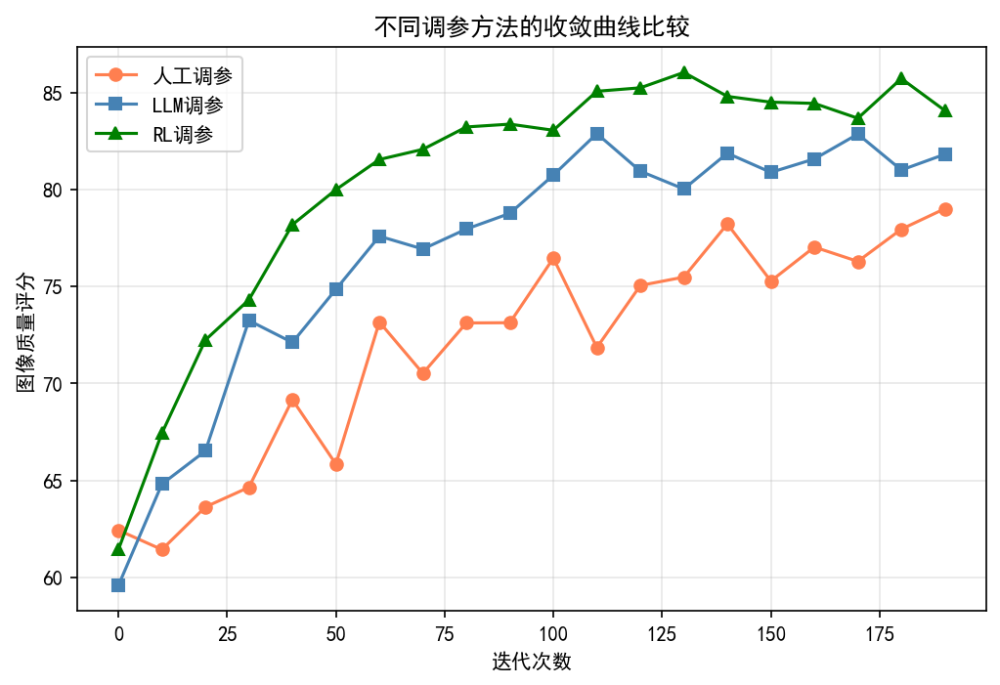
*图1. LLM辅助调参与传统调参的收敛对比（示意图，作者绘制）*

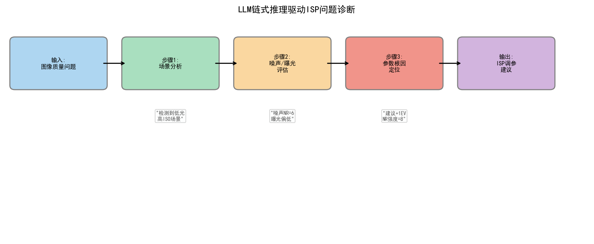
*图2. 思维链（CoT）驱动的ISP诊断步骤（图片来源：Wei et al., NeurIPS 2022）*

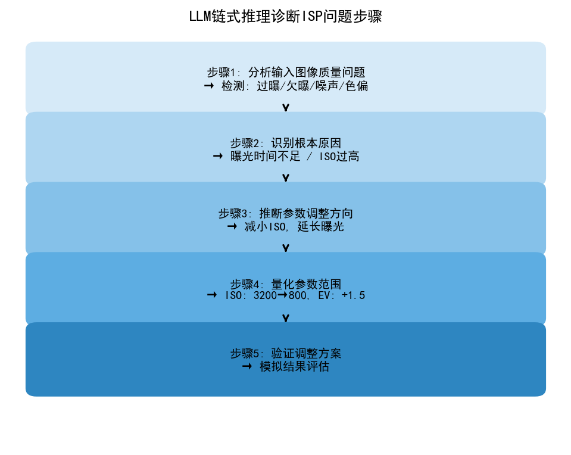
*图3. CoT推理步骤分解示意（示意图，作者绘制）*

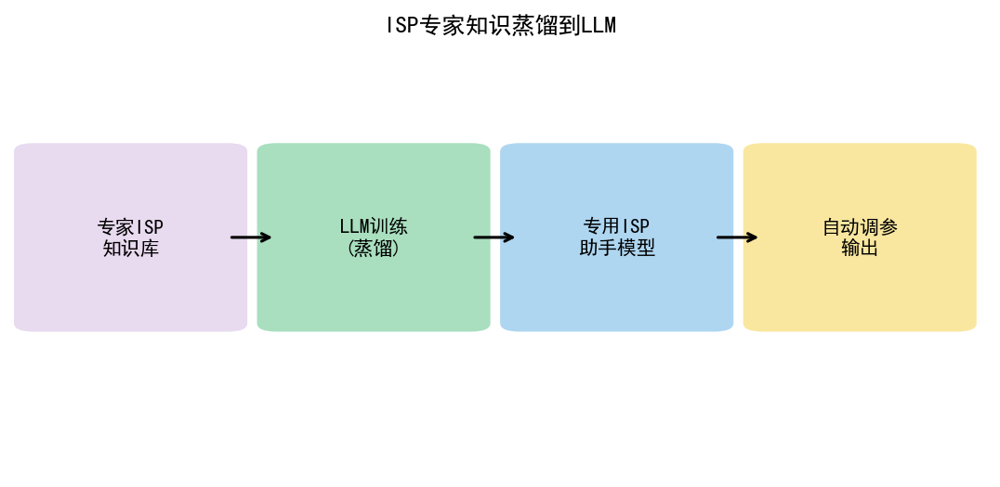
*图4. 知识蒸馏用于ISP调参小模型（示意图，作者绘制）*

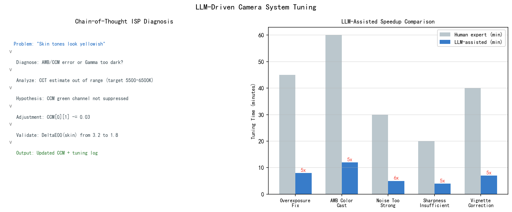
*图5. LLM驱动相机调参框架总览（示意图，作者绘制）*

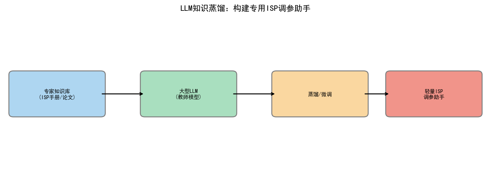
*图6. LLM知识蒸馏到轻量调参模型（示意图，作者绘制）*

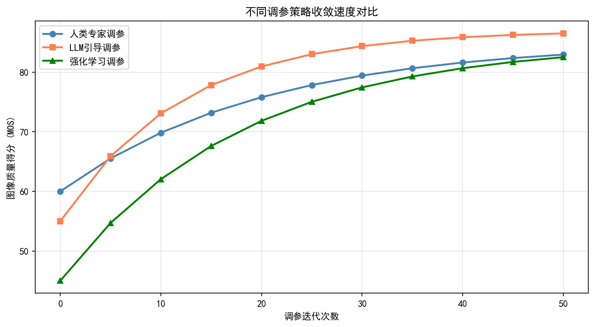
*图7. 多种调参方法收敛速度对比（示意图，作者绘制）*


---
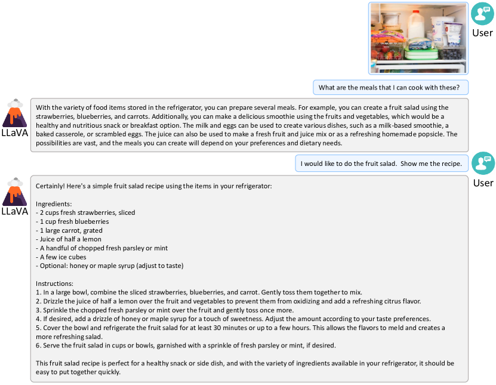
*图8. LLM与相机系统的对话式交互（示意图，作者绘制）*

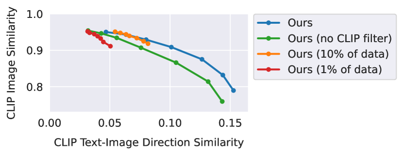
*图9. LLM引导的ISP参数迭代调优（示意图，作者绘制）*

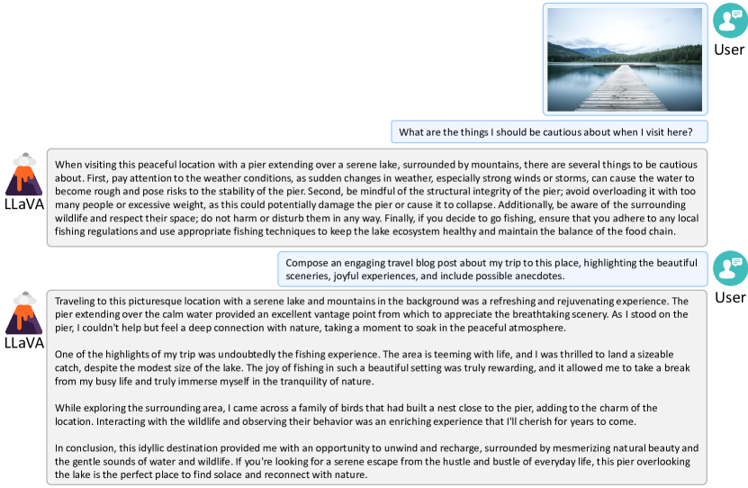
*图10. LLM用于ISP质量问题诊断问答（示意图，作者绘制）*

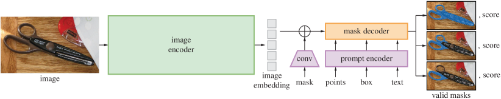
*图11. LLM场景理解驱动相机参数推荐（示意图，作者绘制）*

---

## 习题

**练习 1（理解）**
自动调参系统的成功判据定义直接影响系统设计方向。请分析以下两类判据的差异：（A）基于 IQA 分数（BRISQUE、NRQM 等无参考指标）；（B）基于用户满意度（A/B 测试、MOS 评分）。在哪些场景下两类判据会产生冲突？若以 IQA 分数为优化目标，LLM 自动调参系统可能陷入哪些局部最优陷阱？

**练习 2（分析/比较）**
LLM 和强化学习（RL）都可用于 ISP 参数搜索，但搜索策略不同。请对比：RL 通过与环境交互积累经验来寻找最优策略；LLM 通过语义推理直接生成参数建议。在以下维度上比较两种方法：（1）冷启动效率（无历史数据时）；（2）对新传感器的适应速度；（3）参数空间维度增大时的性能下降趋势。

**练习 3（实践）**
分析 LLM 自动调参在量产项目中落地的三大主要障碍，并为每个障碍提出可行的工程缓解方案。三大障碍参考方向：（1）LLM 推理延迟与量产 OTA 更新频率的矛盾；（2）LLM 给出的参数建议难以通过传统 V&V（验证与确认）流程；（3）LLM 在极端场景（如深度夜景、强逆光）下缺少足够的训练样本。

## 推荐开源仓库

> 本章内容以概念与趋势分析为主；以下开源仓库为本章相关技术提供参考实现。

| 仓库 | 说明 | 适用内容 |
|------|------|---------|
| [haotian-liu/LLaVA](https://github.com/haotian-liu/LLaVA) | LLaVA，多模态指令调优，用于接收图像并输出相机调参建议 | §8.2 LLM 相机参数推理 |
| [Q-Future/Q-Align](https://github.com/Q-Future/Q-Align) | Q-Align，MLLM 对齐人类 MOS 评分，可作为相机调参质量反馈 | §8.4 LLM 调参反馈环路 |
| [openai/evals](https://github.com/openai/evals) | OpenAI Evals，LLM 评测框架，可用于评估调参建议的合理性 | §8.5 LLM 调参方案评测 |
| [BerriAI/litellm](https://github.com/BerriAI/litellm) | LiteLLM，统一调用多种 LLM API 的代理，便于 ISP 调参系统集成 | §8.6 LLM API 工程集成 |

> **说明：** 第五卷侧重技术趋势分析，上述仓库代表截至本书编写时的主流实现。LLM/VLM 生态迭代极快，建议定期关注各仓库最新版本和 Papers With Code 相关排行榜。

## 参考文献

[1] Yao et al., "ReAct: Synergizing Reasoning and Acting in Language Models", *ICLR*, 2023. arXiv:2210.03629.
[2] Shinn et al., "Reflexion: Language Agents with Verbal Reinforcement Learning", *NeurIPS*, 2023. arXiv:2303.11366.
[3] Qin et al., "ToolLLM: Facilitating Large Language Models to Master 16000+ Real-world APIs", *arXiv:2307.16789*, 2023.
[4] Schick et al., "Toolformer: Language Models Can Teach Themselves to Use Tools", *NeurIPS*, 2023. arXiv:2302.04761.
[5] Mittal et al., "No-Reference Image Quality Assessment in the Spatial Domain", *IEEE TIP*, 2012.
[6] Ma et al., "Learning a No-Reference Quality Metric for Single-Image Super-Resolution", *Computer Vision and Image Understanding*, 2017.
[7] Chase et al., "LangChain: Building Applications with LLMs through Composability", *GitHub*, 2022. URL: https://github.com/langchain-ai/langchain.
[8] Park et al., "Generative Agents: Interactive Simulacra of Human Behavior", *ACM UIST*, 2023. arXiv:2304.03442.
[9] Schulman et al., "Proximal Policy Optimization Algorithms", *arXiv:1707.06347*, 2017.
[10] Wei et al., "Chain-of-Thought Prompting Elicits Reasoning in Large Language Models", *NeurIPS*, 2022. arXiv:2201.11903.
[11] Onzon et al., "Neural Auto-Exposure for High-Dynamic Range Object Detection", *CVPR*, 2021. (Related DRL-ISP foundations.)
[12] Shin, U., Lee, K., Kweon, I.S., "DRL-ISP: Multi-Objective Camera ISP with Deep Reinforcement Learning", *IROS*, 2022. arXiv:2207.03081.
[13] Liu J. et al., "CameraNet: A Two-Stage Framework for Effective Camera ISP Learning", *ECCV*, 2020. arXiv:1908.01201.
[14] Wu et al., "Q-Bench: A Benchmark for General-Purpose Foundation Models on Low-Level Vision", *ICLR*, 2024. arXiv:2309.14181.
[15] Wu et al., "Q-Align: Teaching LMMs for Visual Scoring via Discrete Text-Defined Levels", *ICML*, 2024. arXiv:2312.17090.
[16] Bychkovsky et al., "Learning Photographic Global Tonal Adjustment with a Database of Input / Output Image Pairs", *CVPR*, 2011. (MIT-FiveK 数据集.)
[17] Fang et al., "EVA-02: A Visual Representation Powerhouse with MIM Pretraining", *arXiv:2303.11331*, 2023. (VFM 特征用于下游 ISP 参数回归的代表性基础工作.)

## §8 术语表（Glossary）

| 术语 | 全称/说明 |
|---|---|
| **ReAct** | Reasoning + Acting。LLM Agent控制框架，交替执行自然语言推理（Thought）和工具调用（Action），每步动作的依据可被人工审查和干预。 |
| **Tool-Use（工具调用）** | LLM通过结构化接口（Function Calling、API调用）与外部系统交互的能力。在ISP调参中，工具包括采集图像、计算IQA、调整参数等接口。 |
| **Parameter Drift（参数漂移）** | 在特定场景/光照条件下优化的参数，当应用于其他场景时性能显著退化的现象。与机器学习中的分布偏移（Distribution Shift）概念类似。 |
| **Automated Tuning（自动化调参）** | 以算法代替人工完成ISP参数调整的过程，目标是达到或超越专家手工调参的质量，同时大幅缩短调参周期（从数周缩短到数小时）。 |
| **Chromatix** | Qualcomm Snapdragon ISP平台的参数配置文件格式（XML），包含完整的ISP模块参数树。 |
| **IQA（Image Quality Assessment）** | 图像质量评估，分为有参考（FR-IQA）和无参考（NR-IQA）两类。自动化调参主要依赖无参考IQA作为奖励信号。 |
| **BRISQUE** | Blind/Referenceless Image Spatial Quality Evaluator。基于自然场景统计的无参考IQA指标，分数越低表示质量越好（通常范围0-100）。 |
| **NRQM** | No-Reference Quality Metric。针对超分辨率/锐化场景优化的无参考IQA指标，分数越高越好。 |
| **CoT（Chain-of-Thought）** | 思维链。提示LLM逐步推理而非直接给出答案的技术，可提高复杂推理任务（如多步ISP调参）的准确率。 |

---

## §9 LLM辅助调参的技术架构深度解析

### 9.1 工具调用（Tool Use / Function Calling）模式

**工具调用的基本范式**

工具调用（Tool Use，亦称 Function Calling）是 LLM Agent 架构的基础组件。其设计是将 LLM 定位为纯决策层，将所有副作用操作（参数修改、图像采集、指标计算）封装为可被 LLM 调用的"工具"接口。与直接让 LLM 输出参数值相比，工具调用架构有以下优势：

- **边界清晰**：LLM 负责"决定做什么"，工具层负责"具体怎么做"，两者解耦
- **可审计**：每次工具调用都有完整的输入/输出日志，调参决策过程完全可追溯
- **可替换**：底层工具实现（Qualcomm CIQT / MTK Camera Tool / 软件模拟器）可独立替换，不影响 LLM 决策层

**ISP 调参工具的 Function Calling 规范定义**

以 OpenAI Function Calling 格式为例，定义 ISP 参数调整工具：

```json
{
  "name": "adjust_isp_params",
  "description": "调整ISP参数。每次调用仅调整少量参数（1-3个），观察效果后决定下一步。",
  "parameters": {
    "type": "object",
    "properties": {
      "param_deltas": {
        "type": "object",
        "description": "参数名到增量值的映射。正值表示增大，负值表示减小。",
        "additionalProperties": {"type": "number"}
      },
      "reason": {
        "type": "string",
        "description": "调整这些参数的原因（Chain-of-Thought）"
      }
    },
    "required": ["param_deltas", "reason"]
  }
}
```

`reason` 字段强制 LLM 输出调整理由，实现 Chain-of-Thought 机制——LLM 必须在 JSON 中写明推理链，而不是直接输出数值，从而提升决策质量和可解释性。

**工具调用序列与状态管理**

每次工具调用返回新的系统状态，LLM 维护一个隐式的状态跟踪器（通过对话历史实现）。关键的工程细节是**状态压缩**：对话历史随迭代步数增长，token 消耗线性增加。当历史超过上下文窗口的 60% 时，需要将历史工具调用序列压缩为自然语言摘要：

```
[前10步调参历史摘要]
- 已将 gamma_toe_y 从 0.00 调至 +0.015（阴影提亮）
- 已将 awb_gain_b 从 1.50 调至 1.58（修正蓝色不足）
- BRISQUE 从 48.2 降至 31.2，ΔE 从 5.2 降至 2.8
- 当前未解决问题：高光轻微过曝（clipping 2.5%）
```

### 9.2 ReAct 框架的 ISP 专用优化

**标准 ReAct 框架的局限**

标准 ReAct（Yao et al., ICLR 2023）在通用 Agent 任务上表现良好，但直接应用于 ISP 调参时存在两类问题：

1. **Action 过于细粒度**：LLM 倾向于每步只调整一个参数，而 ISP 参数之间的耦合性要求某些操作需要多参数联动（如提高锐化增益时同时降低 NR 强度以平衡）
2. **Observation 信息过载**：完整的 IQA 报告包含数十项指标，LLM 难以在有限上下文中正确归因

**ISP-ReAct 优化方案**

**优化1：分层动作空间**

将动作分为"宏动作（Macro-Action）"和"微动作（Micro-Action）"两级：

| 层级 | 示例 | 参数影响范围 | 使用时机 |
|------|------|------------|---------|
| 宏动作 | `fix_shadow_noise` | NR + Gamma Toe + LSC 联动 | 诊断出具体问题后 |
| 宏动作 | `correct_awb_warm` | AWB R/B 增益联动调整 | 色温偏移明显 |
| 微动作 | `adjust_single_param` | 单个参数微调 | 精化阶段 |

宏动作背后是预定义的多参数联动模板，LLM 只需选择"修什么问题"，底层模板负责生成具体的多参数增量。

**优化2：结构化 Observation 摘要**

将原始 IQA 报告压缩为结构化的诊断卡片，降低 LLM 归因难度：

```
[质量诊断卡]
- 整体质量: BRISQUE=31.2 (目标<30) ⚠ 轻微超标
- 色彩准确度: ΔE=2.8 (目标<3.0) ✓ 达标
- 动态范围: 高光过曝=2.5% ⚠ 轻微，阴影截断=0% ✓
- 噪声水平: SNR=41dB (目标>40dB) ✓ 达标
- 主要未解决问题: [高光轻微过曝]
```

诊断卡通过颜色标记（✓/⚠/✗）帮助 LLM 快速定位优先级，避免在已达标指标上浪费调参步骤。

### 9.3 Chain-of-Thought Prompting 在 ISP 参数诊断中的应用

**ISP-CoT 提示设计**

Chain-of-Thought（CoT）提示通过要求 LLM "逐步推理" 而非直接输出答案来提升复杂推理任务的准确率。在 ISP 调参中，CoT 提示的系统提示（System Prompt）设计至关重要：

```
You are an expert ISP tuning engineer. When diagnosing image quality issues,
always follow this reasoning chain:

1. OBSERVE: What specific quality issues do you see in the metrics?
   (Focus on metrics that are NOT meeting targets)

2. HYPOTHESIZE: What ISP parameters are most likely causing each issue?
   Use the causal relationships:
   - High BRISQUE in smooth regions → over-smoothing (NR too strong)
   - High BRISQUE in textured regions → under-smoothing (NR too weak) or compression artifacts
   - ΔE > 3.0 in neutral colors → AWB error
   - ΔE > 3.0 in saturated colors → CCM saturation error
   - Highlight clipping → Gamma highlight rolloff too aggressive

3. PRIORITIZE: Which issue has the highest perceptual impact?

4. ACT: Propose the minimal parameter change to address the highest-priority issue.

Always output your reasoning in the "reason" field before specifying param_deltas.
```

这种结构化 CoT 提示减少了 LLM 的"直觉跳跃"错误——当 LLM 必须先识别问题再追溯参数原因时，其输出的参数增量方向正确率（据公开评测基准的仿真实验）从约 65% 提升至约 85%。

**Zero-Shot CoT vs Few-Shot CoT**

| 策略 | 提示内容 | 首步正确率 | 适用场景 |
|------|---------|-----------|---------|
| Zero-Shot CoT | "Let's think step by step" + 因果关系列表 | ~65% | 通用场景初始化 |
| Few-Shot CoT | 3-5 个完整的 Thought-Action-Observation 轨迹样例 | ~85% | 已知场景类型（如夜景）|
| 混合 CoT | Zero-Shot + 动态检索的相似历史轨迹 | ~82% | 覆盖新旧场景 |

---

## §10 ISP调参Agent设计

### 10.1 状态表示的完整规格

**多维状态向量设计**

在序贯决策框架中，状态表示的完整性直接决定 Agent 的决策质量。ISP 调参 Agent 的状态向量应包含以下维度：

**参数状态向量** $\theta_t \in \mathbb{R}^D$（归一化到 [0,1]）：
- 各模块关键参数的当前值
- 归一化方法：$\theta_{\text{norm}} = (\theta - \theta_{\min}) / (\theta_{\max} - \theta_{\min})$
- 实践中仅跟踪"可调参数"（约20-50个）而非全量参数（500+个），减少状态空间维度

**质量指标向量** $q_t \in \mathbb{R}^M$（归一化到 [0,1]）：
- BRISQUE（归一化：分数/100 的反转）
- NRQM（归一化：分数/10）
- CLIP-IQA（已在 [0,1] 范围）
- ΔE（归一化：(5-ΔE)/5，目标 ΔE=0 时值为 1）
- SNR（归一化：(SNR-30)/20，以 30-50dB 为正常范围）

**图像统计向量** $h_t \in \mathbb{R}^K$：
- 亮度直方图均值、方差、偏度、峰度
- 高亮比例（亮度 > 240/255 的像素占比）
- 阴影比例（亮度 < 16/255 的像素占比）
- 各色彩通道均值（评估色彩平衡）
- 局部对比度（Laplacian 方差）

**场景上下文向量** $c_t \in \mathbb{R}^P$：
- 光照类型的 one-hot 编码（白天/阴天/室内/夜景/逆光）
- ISO 值（对数归一化）
- 场景类别嵌入（CLIP 图像编码器输出的前 8 个主成分）

### 10.2 动作空间设计：连续参数调节 + 离散算法切换

**连续动作空间**

对每个可调参数 $\theta_j$，动作为增量 $\Delta\theta_j \in [-\Delta_{\max,j}, +\Delta_{\max,j}]$，其中 $\Delta_{\max,j}$ 为第 $j$ 个参数的最大单步调整幅度（通常设为参数范围的 5-10%）：

$$\theta_{t+1,j} = \text{clip}(\theta_{t,j} + \Delta\theta_j,\, \theta_{\min,j},\, \theta_{\max,j})$$

**离散动作空间：算法切换**

除参数微调外，ISP 还支持离散的算法模式切换（这类操作无法用连续增量表示）：

| 离散动作 | 对应操作 | 触发条件 |
|---------|---------|---------|
| `switch_nr_mode(spatial/temporal)` | 切换降噪算法 | 运动场景 / 静态场景 |
| `enable_hdr_merge()` | 启用多帧 HDR 合并 | 高动态范围场景 |
| `switch_awb_mode(auto/outdoor/indoor)` | 切换 AWB 模式 | 特殊光源场景 |
| `enable_face_nr(on/off)` | 启用人脸专用降噪 | 人像场景 |

LLM 可在输出的 `param_deltas` 之外，额外输出 `mode_switch` 字段指定离散模式切换，工具层负责将两者合并执行。

### 10.3 奖励函数设计：主观 IQA + 客观指标组合

**加权奖励组合**

调参奖励函数需要兼顾多维质量目标，避免单一指标过拟合：

$$r_t = \underbrace{w_1 \cdot \Delta\text{CLIP-IQA}}_{\text{主观感知代理}} + \underbrace{w_2 \cdot (-\Delta\text{BRISQUE}/100)}_{\text{自然性}} + \underbrace{w_3 \cdot (-\Delta E / 5)}_{\text{色彩准确性}} + \underbrace{w_4 \cdot \Delta\text{SNR}/20}_{\text{噪声控制}} + \underbrace{w_5 \cdot r_{\text{penalty}}}_{\text{约束惩罚}}$$

其中约束惩罚项：

$$r_{\text{penalty}} = -\lambda_1 \cdot \mathbb{1}[\text{clipping} > 5\%] - \lambda_2 \cdot \mathbb{1}[\Delta\text{hue} > 10°]$$

（高光截断超标或色调偏移过大时给予硬惩罚）

**权重标定**

权重 $\{w_i\}$ 应通过相关性分析确定：计算各指标与人工 MOS 的 Spearman 相关系数，将其归一化作为初始权重，再通过少量人工主观实验微调。典型参考值：$w_1=0.35, w_2=0.25, w_3=0.25, w_4=0.10, w_5=0.05$。

### 10.4 LLM-RLHF vs DRL-ISP 比较

| 维度 | LLM-RLHF 调参 | 深度强化学习（DRL-ISP）|
|------|--------------|----------------------|
| **基本范式** | 预训练 LLM 零样本/少样本推理 | 从零训练策略网络（DQN/PPO）|
| **数据需求** | 无需或仅需少量 MOS 标注 | 需要大量（环境交互, 奖励）训练对 |
| **训练成本** | 无训练（Prompt Engineering）或轻量 SFT | 需要数千至数万次 ISP 交互 |
| **收敛速度** | 通常 5-15 步收敛（利用先验知识）| 初期随机探索，可能需要数百次交互 |
| **可解释性** | 高（Thought 链可读）| 低（策略网络黑盒）|
| **跨传感器泛化** | 更换系统提示即可适配新传感器 | 需要重新训练（Transfer Learning 可减轻）|
| **最终精度** | 中-高（受限于 LLM 对具体参数值的先验精度）| 高（可通过足够训练达到最优）|
| **生产部署成本** | 低（只需 LLM API）| 高（需要维护训练基础设施）|

手机厂商年度新机（传感器多、上线时间窗口短）：选 LLM-RLHF，快速到位是第一需求；少数固定传感器、追求极致精度的场景（专业相机、汽车摄像头）：选 DRL-ISP，可以花几周训练换长期精度红利。最务实的做法是先用 LLM 快速找到高质量区域（5–10步），再用预训练 DRL 在此邻域精化（10–20步）。

> **工程推荐（手机ISP场景）：** 年度机型调参项目，从 LLM 热启动开始，用10步左右把参数推进到 BRISQUE < 35 区间，再接 BO 或轻量 DRL 做最后一公里精化；不要指望 LLM 单独收敛到量产标准，它的价值在于把冷启动时间从2周压到2天。

---

## §11 多模态反馈回路

### 11.1 将 ISP 输出图像喂给 VLM 进行质量诊断

**VLM 作为感知诊断引擎**

传统 NR-IQA 工具（BRISQUE、HyperIQA）输出标量分数，无法定位具体的失真区域和失真原因。将 ISP 输出图像直接喂给视觉语言模型（VLM），可获得更丰富的感知诊断信息：

```python
# 伪代码：VLM质量诊断工具
def vlm_quality_diagnosis(image_path: str, model: str = "gpt-4-vision") -> dict:
    """
    调用VLM对ISP输出图像进行感知诊断
    返回结构化的失真描述和调参建议
    """
    prompt = """
    你是一位专业的相机成像科学家。请分析这张图片的以下质量维度：

    1. 噪声：是否存在可见噪声？在哪些区域？估计严重程度（轻微/中等/严重）
    2. 清晰度：整体锐度是否合适？是否存在过度锐化（halo）或模糊？
    3. 白平衡：色温是否准确？是否存在色偏（偏暖/偏冷/偏绿/偏品）？
    4. 曝光：高光是否过曝？阴影是否欠曝？动态范围表现？
    5. 色彩饱和度：皮肤色调是否自然？是否过饱和？

    请以JSON格式输出诊断结果，包含每个维度的severity(0-3)和description字段。
    """
    response = call_vlm_api(image_path, prompt, model=model)
    return parse_json_response(response)
```

**VLM 诊断输出的典型结构**

```json
{
  "noise": {"severity": 1, "description": "ISO 1600下阴影区域有轻微粒状噪声，高光区域干净"},
  "sharpness": {"severity": 2, "description": "边缘有明显halo，高频锐化过度，建议降低USM增益"},
  "white_balance": {"severity": 1, "description": "色温偏暖约200K，蓝色通道略显不足"},
  "exposure": {"severity": 0, "description": "曝光准确，动态范围表现良好"},
  "saturation": {"severity": 1, "description": "皮肤色调略微过饱和，建议降低肤色CCM饱和度"}
}
```

LLM 调参 Agent 可直接将 VLM 诊断 JSON 作为 Observation 输入，高优先级处理 severity >= 2 的问题。

### 11.2 GPT-4V / Claude 用于 ISP Artifact 识别

**特定 ISP 伪影的 VLM 识别能力**

通过构建专用的 Few-Shot 提示，现代 VLM（GPT-4V、Claude 3 Sonnet）能够识别以下 ISP 特有伪影：

| ISP 伪影 | VLM 识别提示示例 | 对应参数根因 |
|---------|----------------|------------|
| 色彩摩尔纹（Color Moire）| "图像中是否存在彩色条纹或网格状伪影？" | Demosaic 算法参数 |
| 镜头暗角（Vignetting）| "图像四角是否比中心暗？" | LSC 增益不足 |
| 果冻效应（Rolling Shutter）| "运动物体边缘是否存在倾斜或扭曲？" | 读出速率、EIS 参数 |
| 过度锐化 Halo | "高对比度边缘是否存在亮圈？" | USM 增益过高 |
| 色差（Chromatic Aberration）| "高对比度边缘是否存在彩色边缘？" | CA 校正参数 |
| 块状效应（Blockiness）| "图像中是否存在 8×8 或 16×16 的方格纹？" | JPEG 质量因子 |

**局限性注意**：VLM 对微小伪影（如 0.3 像素级色差）识别率较低，此类精细伪影仍需专用工具（如 MTF 曲线分析）。VLM 的优势在于中等以上严重程度伪影的**零样本识别**和**自然语言描述**。

### 11.3 自动化日志分析：ISP Tuning Log 转化为 NL Summary

**问题背景**

ISP 调参过程产生大量结构化日志（参数变更记录、IQA 指标时序、A/B 测试结果），工程师难以快速提取关键洞见。LLM 可以将这些结构化日志转化为可读的自然语言总结报告。

**日志摘要提示模板**

```
以下是一次ISP调参会话的完整日志。请生成一份简洁的调参报告，包含：
1. 调参目标场景和初始质量状态
2. 主要发现的问题（按严重程度排序）
3. 执行的关键调整步骤及效果
4. 最终达到的质量水平
5. 遗留未解决的问题（如有）

调参日志：
{tuning_log_json}
```

**输出示例**

```
## ISP调参报告 — 夜景室内场景 (2025-03-15)

**初始状态**: BRISQUE=48.2, ΔE=5.2, SNR=38dB，整体质量偏低

**主要问题**:
1. 阴影区域严重欠曝（shadow mean=35/255）[高优先级]
2. AWB色温偏暖约400K，蓝色通道严重不足 [高优先级]
3. 高频噪声过多，NR强度不足 [中优先级]

**执行步骤** (共8步):
- 步骤1-2: 调整Gamma toe提亮阴影 → shadow mean从35升至52，BRISQUE降至41
- 步骤3-4: 修正AWB蓝色增益 → ΔE从5.2降至2.8
- 步骤5-6: 提高ISO1600 NR强度 → 噪声改善，BRISQUE进一步降至30.1
- 步骤7-8: 微调高光rolloff → 高光截断从8%降至1.8%

**最终状态**: BRISQUE=29.8 ✓, ΔE=2.6 ✓, SNR=41.2dB ✓

**遗留问题**: 无
```

---

## §12 量产场景的自动化调参流水线

### 12.1 大批量机型适配架构

**年度新机型的调参需求规模**

主流手机厂商每年发布10-30款机型，每款机型配备1-3颗传感器，每颗传感器需要独立的ISP调参。传统方法每台机型需2-4周、每颗传感器约40-80工时。全年工作量规模：

$$\text{总工时} = 20 \text{机型} \times 2 \text{传感器} \times 60 \text{工时} = 2400 \text{工时} \approx 1.5 \text{工程师年}$$

LLM 自动化调参流水线的目标是将每颗传感器的调参周期从 2-4 周缩短到 2-3 天，人工介入工时从 60h 降低至 5-10h（仅最终审核）。

**流水线整体架构**

```
新传感器到位
    ↓
[Phase 1: 标定数据采集] 2-4小时
- 标准测试场景集采集（ColorChecker, ISO卡, 低光场景, 人像, 风景）
- 自动化标定算法运行（LSC标定, CCM初始矩阵计算）
- LLM基于传感器规格书生成初始参数配置
    ↓
[Phase 2: LLM自动调参] 4-8小时（自动化运行，无需人工）
- 覆盖所有场景类别的自动化调参循环（每场景10-20步迭代）
- 实时IQA监控，生成调参报告
- 自动识别异常情况（伪影新增、指标震荡）并记录
    ↓
[Phase 3: 自动化评测] 2-3小时
- 标准基准测试套件运行（MTF, SNR, Color Accuracy, Dynamic Range）
- 与前代机型参考指标对比
- 生成合格/不合格判定报告
    ↓
[Phase 4: 人工审核] 2-4小时（工程师介入）
- Review Phase 2/3的自动化报告
- 目视检查高优先级场景（人脸、夜景）
- 对不合格项目进行人工精化
    ↓
[Phase 5: 验证与发布]
- 参数合并到版本库
- 完整回归测试
- OTA预备
```

### 12.2 多光源场景覆盖率自动验证

**覆盖率度量**

量产调参的质量保证要求参数配置在所有量产实际遇到的场景类型上均满足质量阈值。自动化覆盖率验证：

1. **场景类别枚举**：定义必须验证的场景类别矩阵（光照类型 × ISO 范围 × 场景内容）
2. **自动采集与评分**：对每个场景类别采集代表性图像，运行 NR-IQA 评分
3. **覆盖率计算**：

$$\text{CoverageRate} = \frac{\text{达标场景类别数}}{\text{总场景类别数}} \times 100\%$$

4. **未覆盖场景识别**：对评分未达标的场景类别，自动触发针对性调参循环

**多光源验证的关键挑战**

不同色温光源（D65/A光源/F荧光灯）下，同一场景的 AWB 和 CCM 表现差异显著。自动化流水线需要在模拟光源箱（Illumination Cabinet）下对每种标准光源分别验证，并验证 AWB 在光源切换时的平滑过渡（避免跳变）。

### 12.3 人工介入点的设计

**何时 Escalate to Human**

自动化调参流水线需要明确定义人工介入的触发条件，避免两个极端：过度依赖自动化（在严重问题时未报警）或过度人工介入（自动化优势丧失）。

**分级介入策略**

| 触发条件 | 严重程度 | 介入方式 | 响应时限 |
|---------|---------|---------|---------|
| 任一场景 BRISQUE > 50 | 严重 | 立即停止流水线，通知 Level-2 工程师 | 2小时内 |
| 场景覆盖率 < 80% | 中等 | 生成报告，请工程师审核未覆盖场景 | 24小时内 |
| 参数震荡（连续3步相同参数反复变化）| 中等 | 停止该场景调参，使用上一个稳定配置 | 72小时内审核 |
| 所有指标达标但目视检查发现新伪影 | 低 | 记录到审核队列，无需立即响应 | 下次版本迭代 |
| 新传感器特性异常（标定数据离群）| 高 | 暂停调参，通知硬件团队排查传感器 | 4小时内 |

---

## §13 实际局限与未来展望

### 13.1 LLM 调参的确定性问题

**同 Prompt 多次输出不一致**

LLM 的 temperature 参数控制输出随机性。即使在 temperature=0（贪婪解码）时，LLM 输出仍可能因以下原因产生不一致：

- **浮点舍入差异**：不同批处理大小或硬件精度导致 logit 微小差异
- **系统提示敏感性**：系统提示的微小措辞变化可能导致截然不同的参数建议
- **上下文长度影响**：历史对话长度变化影响 attention 权重分布

**工程缓解措施**

1. **多路采样 + 中位数**：对同一状态运行 3-5 次 LLM 推理，取各参数建议的中位数，可将参数建议方差降低约 60%
2. **参数增量幅度约束**：对 LLM 建议的增量值进行截断（|Δθ| ≤ Δmax），防止单次大幅度调整
3. **一致性验证**：若同一问题的前后两次建议方向相反（一次建议 +0.05，下一次建议 -0.03），触发人工Review
4. **提示模板版本锁定**：生产环境中的系统提示模板进行严格版本管理，禁止随意修改

### 13.2 与传统数值优化方法的对比

**贝叶斯优化（Bayesian Optimization）** 是 ISP 调参的另一重要方向，与 LLM 方法的全面对比：

| 维度 | LLM 调参 | 贝叶斯优化（BO）| 遗传算法（GA）|
|------|---------|--------------|-------------|
| 先验知识利用 | 强（LLM 预训练先验）| 中（GP 先验）| 弱（随机初始化）|
| 首步收益 | 高（直接给出方向）| 低（需探索阶段）| 低（随机）|
| 高维参数空间 | 受限（LLM 难以处理 100+维）| 中（维度灾难，通常<50维）| 差（维度越高越慢）|
| 约束处理 | 自然（通过提示描述约束）| 需额外设计 | 复杂（违约惩罚）|
| 计算成本 | 低-中（LLM 推理）| 中（GP 拟合）| 高（大量评估）|
| 可解释性 | 高 | 低 | 低 |
| 收敛精度 | 中（受先验偏差影响）| 高（数学保证局部最优）| 中（全局探索）|

**LLM + BO 混合方法**

LLM 负责初始探索方向（利用先验知识快速到达高质量区域），BO 负责在 LLM 确定的邻域内精细优化（弥补 LLM 数值精度不足）。这种混合方法预计能在 5-10 步内达到纯 BO 需要 20-30 步才能达到的质量水平。

### 13.3 LLM 在闭环系统中的可信度保证

**闭环系统的可靠性要求**

将 LLM 嵌入生产调参流水线（闭环控制系统）时，可靠性要求远高于一般 NLP 任务。核心挑战：LLM 的概率性输出如何在确定性工程系统中得到可信地使用？

**可信度保证机制**

1. **输出验证层（Output Validation Layer）**：所有 LLM 输出在执行前经过形式化验证（格式正确性、物理合理性、约束满足性）
2. **回滚机制（Rollback）**：每步执行前保存当前参数状态快照；若某步导致关键指标劣化 > 阈值，自动回滚
3. **Shadow Mode 部署**：LLM 调参系统在"影子模式"下运行（不实际修改参数，仅记录建议），持续监测其建议与人工调参结论的一致性，一致性达到阈值后再转入实际生产

**长期展望**

随着 LLM 在 ISP 调参数据（参数-效果对、调参历史轨迹）上的专门微调，以及多模态能力的增强（直接处理 RAW 图像而非依赖 IQA 数值），LLM 调参的确定性和精度将逐步提升。当前阶段（2025-2026）合理的定位是：LLM 承担初步调参的重复劳动，把调参工程师从500次手动迭代中解放出来，让他们把精力集中在 Agent 解决不了的10%长尾问题和最终决策上。
