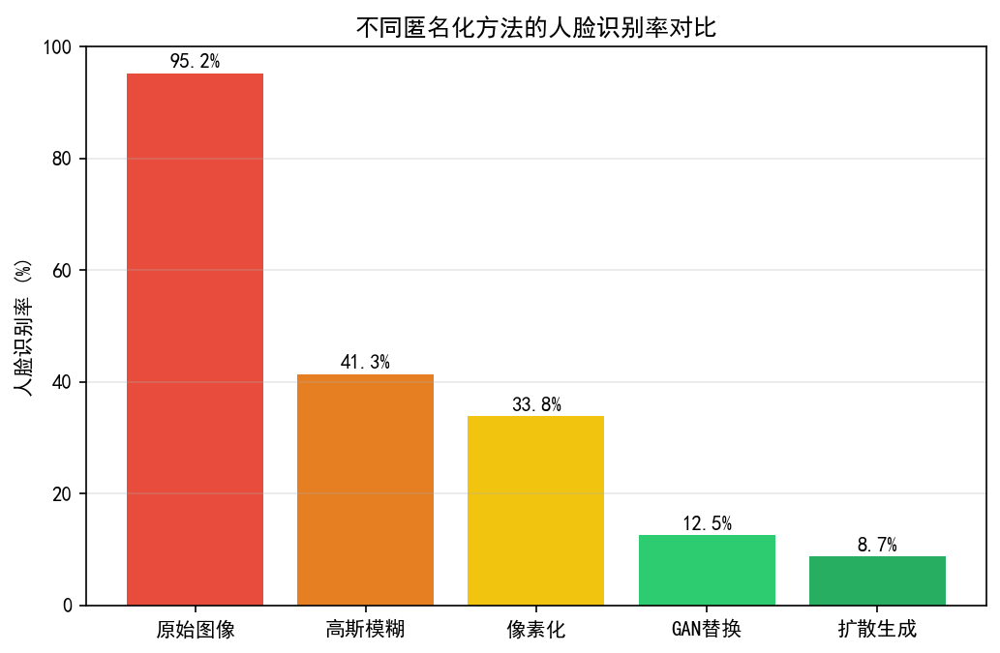
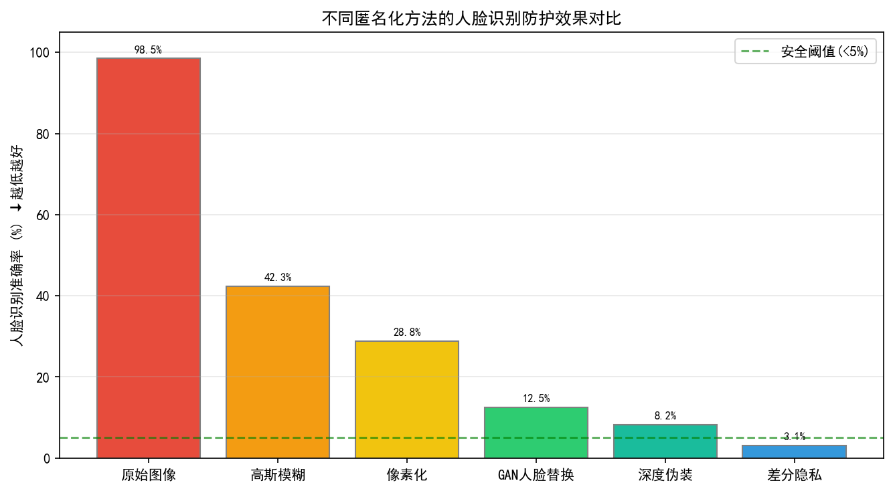
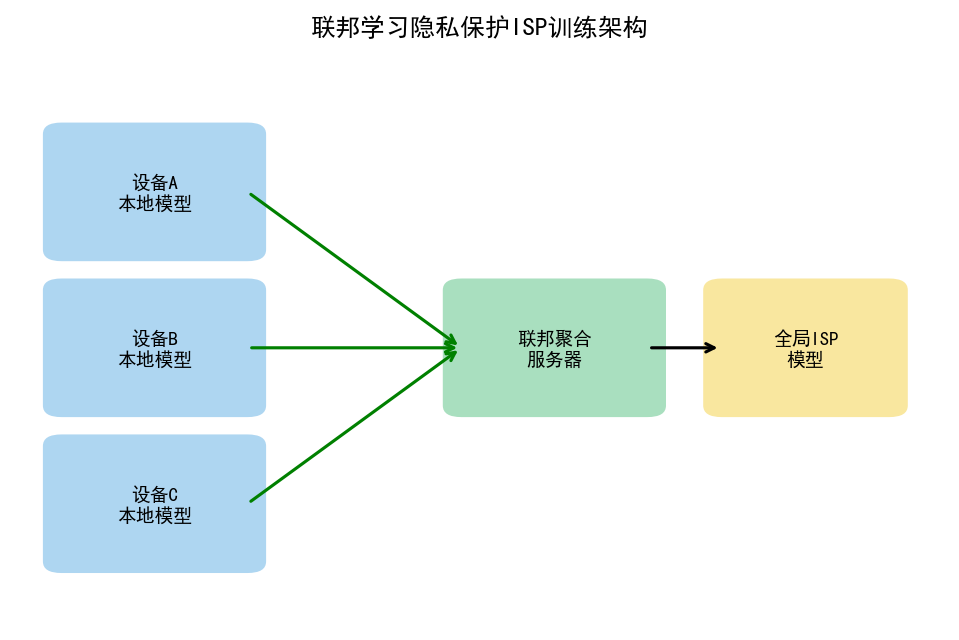
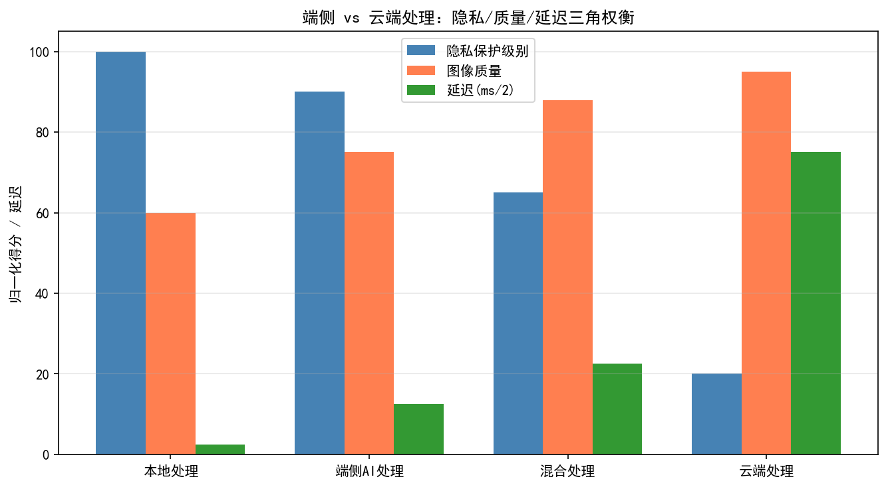
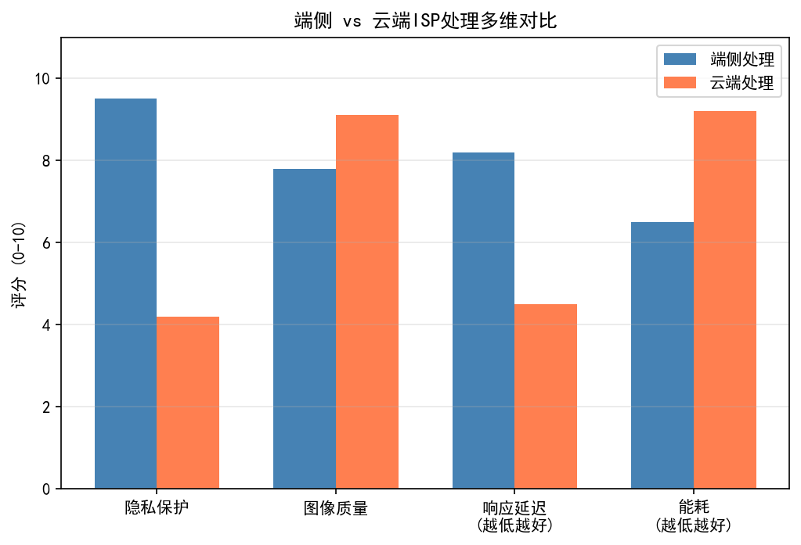
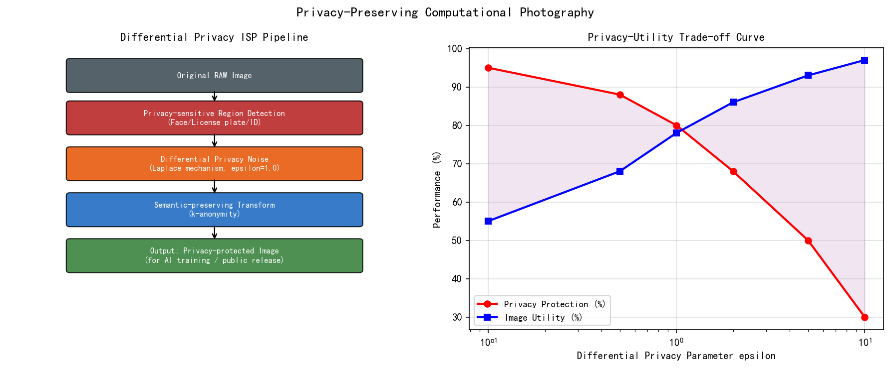
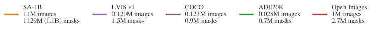
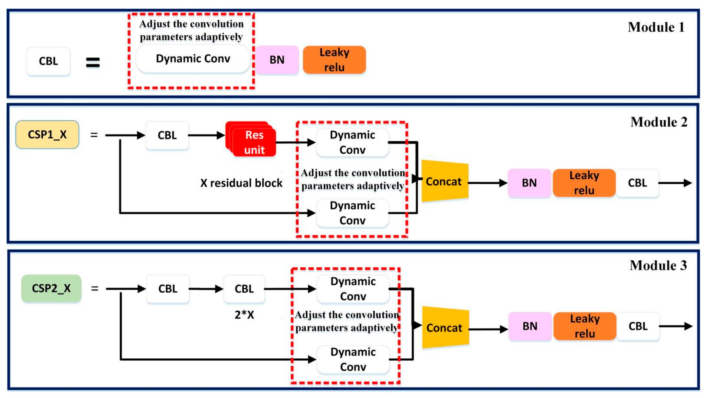
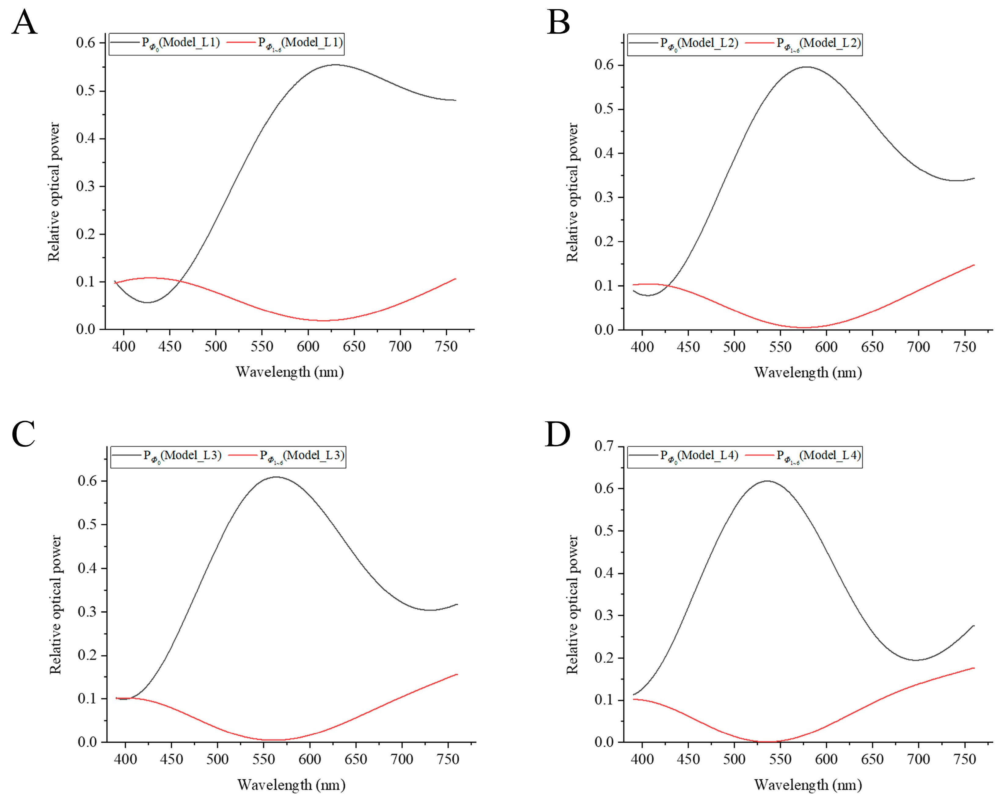

# 第五卷第12章：影像安全与对抗攻击：ISP流水线中的安全威胁与防御

> **流水线位置：** ISP 系统安全防御层，覆盖传感器层到 AI 模型层的安全威胁
> **前置章节：** 第四卷第05章（DL 盲 IQA）、第三卷第01章（DL ISP综述）
> **读者路径：** 安全工程师、算法工程师、产品安全团队
> **前沿方向说明**：对抗攻击与隐私保护领域迭代快，以下内容以 2025–2026 公开研究为基础，具体防御方案建议结合最新文献。欢迎提 [Issue](https://github.com/AIISP/isp_handbook/issues) 补充新进展。

---

## §1 原理（Theory）

### 1.1 ISP流水线的安全威胁概览

摄像头接入深度学习感知系统之后，从安全角度看多了一个新的攻击入口——不光要关心"算法准不准"，还要关心"传感器能不能被欺骗"。攻击层次从物理层到算法层到数据层，三者相互耦合，但来源和防御方式差别很大。

**物理层攻击**针对传感器的感光物理特性。最典型的是激光致盲攻击（Camera Blinding）：攻击者使用高功率激光照射摄像头，使传感器像素饱和或永久损伤，造成摄像头局部甚至全部失效。相比之下，更为隐蔽的是红外注入攻击——由于CMOS传感器对近红外（NIR）波段敏感，而人眼无法感知，攻击者可以通过不可见的红外投影向摄像头注入幻影图案。当ISP的可见光滤镜（IR Cut Filter）被绕过或失效时，此类攻击会直接欺骗依赖摄像头输入的AI系统。

**算法层攻击**的核心是对抗样本（Adversarial Examples）技术。攻击者在图像上叠加人眼难以察觉的微小扰动，使下游深度神经网络产生错误输出，而人类观察者对图像内容的判断不受任何影响。这一类攻击对于自动驾驶感知、人脸识别、医学影像诊断等安全关键应用场景构成严重威胁。

**数据层攻击**（数据投毒，Data Poisoning）则针对ISP模型的训练过程。攻击者在训练数据集中注入精心构造的恶意样本，影响神经网络ISP（如基于学习的降噪、AWB、色调映射模型）的参数学习，使其在特定触发条件下产生错误输出，形成"后门"（Backdoor）漏洞。

**隐私泄露**是上述三类之外的独立安全威胁。Lukas et al.（IEEE TIFS 2006）和 Chen et al.（IEEE TIFS 2008）证明了可以从相机拍摄的图像中提取传感器固有的 PRNU 噪声模式，形成唯一的"相机指纹"，从而追踪图像的来源设备，对用户匿名性构成威胁。

### 1.2 对抗样本与ISP的关系

自动驾驶领域有一个让人不安的发现：精心设计的像素级扰动叠加在停车标志上，检测模型会把它读成限速牌——人眼完全看不出差异，模型却被彻底欺骗了。这就是对抗样本的核心：对于一个训练好的深度神经网络 $f$，存在一个与原始输入 $x$ 在视觉上几乎完全相同的扰动版本 $x + \delta$，却能使网络输出截然不同的错误预测。扰动 $\delta$ 的生成目标为：

$$\arg\max_{\delta} \mathcal{L}(f(x+\delta), y), \quad \text{s.t.} \quad \|\delta\|_\infty \leq \epsilon$$

其中 $\mathcal{L}$ 为交叉熵损失，$y$ 为真实标签，$\epsilon$ 为人眼可感知阈值（通常取像素值范围的1%～4%，即 $\epsilon \in [2, 8]$ 对应0-255像素空间）。

**FGSM攻击**（Fast Gradient Sign Method，Goodfellow et al., 2015）是最简单的一步攻击方法，沿损失梯度的符号方向进行单步扰动：

$$\delta = \epsilon \cdot \text{sign}(\nabla_x \mathcal{L}(f(x), y))$$

**PGD攻击**（Projected Gradient Descent，Madry et al., ICLR 2018）是更强的多步迭代攻击，被视为对抗鲁棒性研究中的标准白盒攻击基准：

$$x^{(t+1)} = \Pi_{x+\mathcal{S}} \left( x^{(t)} + \alpha \cdot \text{sign}(\nabla_x \mathcal{L}(f(x^{(t)}), y)) \right)$$

其中 $\Pi$ 为将样本投影回合法扰动集合 $\mathcal{S} = \{\delta : \|\delta\|_\infty \leq \epsilon\}$ 的投影算子，$\alpha$ 为步长（通常取 $\alpha = \epsilon / 4$），迭代步数 $k$ 通常在10到40之间。

**ISP对数字域对抗样本具有天然的消减效应**。当对抗样本以数字图像形式直接送入神经网络时，精心设计的像素级扰动往往对攻击高效。但图像经过以下ISP处理步骤后，扰动会被不同程度地破坏：

- **JPEG压缩**：离散余弦变换（DCT）量化会截断高频扰动分量；
- **锐化/USM**：增强边缘的同时可能放大或改变局部扰动结构；
- **色彩校正矩阵（CCM）**：线性变换改变扰动在各色彩通道的相对幅度；
- **Gamma校正**：非线性映射使均匀像素扰动在不同亮度区域产生不一致的实际影响；
- **降噪（NR）**：空域或频域滤波直接平滑对抗扰动。

这些效应是对数字域对抗攻击的天然消减机制，但不足以构成完整防御——针对ISP处理的物理域攻击技术正是为此而生。

### 1.3 物理域对抗攻击（Physical Adversarial Examples）

物理域对抗攻击需要解决一个更困难的问题：对抗扰动不仅要在数字域有效，还需要在以下完整物理链路中存活：

$$\text{打印/投影} \rightarrow \text{真实光照} \rightarrow \text{相机拍摄} \rightarrow \text{ISP处理} \rightarrow \text{AI推理}$$

Eykholt等人在CVPR 2018的RP2（Robust Physical Perturbations）攻击中，设计了附着于停车标志（Stop Sign）表面的物理贴纸，使目标检测模型在正常驾驶场景下将其误识别为限速牌。此攻击需要在多种光照角度和拍摄距离下保持有效，充分体现了物理域攻击的挑战性。

**EOT（Expectation over Transformations）**方法由Athalye等人于ICML 2018提出，是目前物理域对抗攻击中最具影响力的框架。其核心思想是：在生成对抗样本时，将ISP变换分布 $T$ 纳入优化期望：

$$\delta^* = \arg\max_\delta \; \mathbb{E}_{t \sim T}\left[\mathcal{L}(f(t(x+\delta)), y)\right]$$

其中变换分布 $T$ 涵盖了真实ISP链路中可能出现的各种随机变换，包括：
- **随机Gamma校正**：$\gamma \sim \mathcal{U}(0.8, 1.2)$，模拟曝光变化；
- **AWB色温偏移**：随机乘以色彩增益向量 $(r_g, g_g, b_g)$，模拟不同光源；
- **JPEG压缩**：质量因子 $Q \sim \mathcal{U}(50, 95)$；
- **空间变换**：随机旋转、缩放、透视变形，模拟不同拍摄角度；
- **传感器噪声**：添加高斯噪声或泊松噪声。

通过对大量（通常30至100次）随机变换样本的梯度期望进行优化，EOT生成的对抗样本对ISP变换具有显著的鲁棒性。

**实际攻击场景举例**：
- **无人驾驶目标检测欺骗**：在路牌或车辆上张贴对抗贴纸，使YOLO等检测器漏检；
- **人脸识别门禁欺骗**：打印或佩戴含对抗图案的配件，绕过人脸识别系统；
- **医学影像诊断干扰**：在X光或CT图像上叠加对抗噪声，影响AI辅助诊断结果。

### 1.4 相机指纹识别（Camera Fingerprinting）

假设你要追踪一批匿名泄露的照片，只知道照片内容，不知道来自哪台设备——PRNU正是用来解决这个问题的。每台数字相机的图像传感器在制造过程中都存在微小的像素响应不均匀性，即**PRNU（Photo Response Non-Uniformity，光响应不均匀性）**，它是传感器固有的空间噪声模式，具有唯一性和稳定性。从同一台相机拍摄的任意一批图像中，都可以提取出这个模式；只要建立了指纹库，就能把匿名图像溯源到具体设备。

Lukas等人（IEEE TIFS 2006）和Chen等人（IEEE TIFS 2008）奠定了基于PRNU的相机识别理论基础。PRNU模式 $K$ 定义为传感器响应的乘性噪声成分：

$$I = I_0 \cdot (1 + K) + \Xi$$

其中 $I_0$ 为理想均匀响应，$K$ 为PRNU模式，$\Xi$ 为加性噪声（散粒噪声、读出噪声等）。

**提取方法**：从同一相机拍摄的大量图像（建议50张以上）中提取PRNU指纹：

1. 对每张图像 $I_i$ 用降噪滤波器 $F$ 估计场景内容，计算残差噪声：$W_i = I_i - F(I_i)$；
2. 对所有残差取加权平均，消除场景相关噪声：$\hat{K} = \frac{\sum_i W_i \cdot I_i}{\sum_i I_i^2}$；
3. 对估计的PRNU进行零均值归一化处理。

**隐私威胁**：攻击者一旦建立了某台相机的PRNU指纹库，即可从任何由该相机拍摄的图像中提取PRNU，通过计算归一化互相关（NCC）来判断图像来源，从而将匿名发布的图像追溯到具体设备，进而定位到设备持有人。

**防御方法（相机匿名化）**：在发布图像前，向图像添加专门设计的对抗性噪声或频域扰动，以混淆PRNU特征，使指纹匹配失败，同时保持图像视觉质量不受明显影响。

### 1.5 ISP参数对AI模型鲁棒性的影响

训练集用A厂ISP采集，部署到B厂摄像头上，检测精度掉10%-20% mAP——这在多厂商混部场景里是实际发生的问题，而不是理论担忧。Guo等人在ECCV 2022的工作中系统研究了"ISP Domain Gap"问题：在特定ISP参数（如色温、对比度、锐化强度）下采集并标注的训练数据，训练出的检测模型在其他ISP配置下性能会显著下降，正是这一机制造成的。

多相机混部场景（自动驾驶、安防）中此问题最为集中——不同批次摄像头、不同厂商ISP方案在色彩、清晰度、噪声特性上的系统性差异，直接转化为模型部署后的mAP损失。

**ISP-Aware对抗训练**是一种有效的缓解策略：在训练阶段，对每个mini-batch随机采样不同的ISP参数配置，对输入图像进行ISP变换模拟，使模型对ISP参数变化具有更强的鲁棒性。与传统几何增强不同，这里的增强空间是ISP参数空间（色温、曝光、锐化等）。

**RAW域对抗训练**提供了另一种思路：直接在RAW数据域训练感知模型，绕过ISP引入的domain shift问题。这要求摄像头能够输出RAW数据，并且模型架构能够处理Bayer格式的RAW图像。其代价是模型训练和推理的计算复杂度更高，且缺乏通用的RAW格式标准。

### 1.6 隐私保护摄影技术

**人脸匿名化（Face Anonymization）**是隐私保护摄影最直接的应用场景。传统方法（高斯模糊、像素化马赛克）虽然能遮挡人脸特征，但视觉效果突兀，且部分情况下仍可逆推。

Hukkelås等人提出的**DeepPrivacy2**（WACV 2023）代表了生成对抗网络（GAN）方法的最新进展：将图像中检测到的原始人脸区域替换为由条件GAN生成的合成人脸，新生成的人脸与原场景在光照、姿态、肤色上保持高度一致，视觉自然度远优于传统马赛克方法，同时原始人脸身份信息被完全抹除。

**差分隐私（Differential Privacy）在图像中的应用**：差分隐私从统计学角度为隐私保护提供了严格的数学定义。对于图像数据，可以通过向图像添加符合差分隐私保证的校准高斯噪声（满足 $(\varepsilon, \delta)$-差分隐私），使得攻击者无法从发布的图像中以较高置信度推断出任何个体的敏感信息。其代价是图像质量损失与隐私预算 $\varepsilon$ 之间存在根本性权衡。

---

## §2 标定（Calibration）

### 2.1 对抗样本强度标定

对抗扰动幅度 $\epsilon$ 的选取需要在**攻击成功率（ASR）**与**人眼可感知度（Perceptual Quality）**之间取得平衡。下表给出了常用参考值（L∞范数，像素值归一化至 $[0,1]$）：

| $\epsilon$ 值 | 像素值范围（0-255） | 典型ASR（ResNet-50，ImageNet） | PSNR损失估计 |
|:-----------:|:----------------:|:---------------------------:|:-----------:|
| 1/255 ≈ 0.004 | ±1 | ~40%（FGSM） | < 0.5 dB |
| 4/255 ≈ 0.016 | ±4 | ~85%（PGD-20） | ~1-2 dB |
| 8/255 ≈ 0.031 | ±8 | ~98%（PGD-40） | ~3-4 dB |
| 16/255 ≈ 0.063 | ±16 | >99% | ~6 dB，肉眼可见噪声 |

实际标定时，建议在目标ISP系统的具体处理链路下进行端到端的ASR测试，因为ISP的降噪和压缩会使等效 $\epsilon$ 阈值提高——即需要更大的 $\epsilon$ 才能在ISP后保持攻击效果。通常建议物理域攻击使用 $\epsilon \geq 8/255$，并配合EOT方法增强鲁棒性。

### 2.2 ISP鲁棒性测试基线

在评估AI系统对ISP变化的鲁棒性时，建议使用以下标准化的ISP操作测试集：

| ISP操作 | 测试范围 | 评测指标 |
|:------:|:-------:|:-------:|
| 亮度/曝光调整 | ±2档（即×0.25 ～ ×4.0） | 检测mAP / 分类Top-1 Acc |
| 色温变化 | 2500K ～ 7500K（步长500K） | 同上 |
| JPEG压缩质量 | Q = 50, 60, 70, 80, 90, 95 | 同上 + SSIM |
| 锐化强度 | USM Amount 0 ～ 2.0 | 同上 |
| 降噪强度 | 轻度/中度/重度 | 同上 + 细节保留率 |

对于对抗样本的ISP存活率测试，需记录：（1）纯数字域ASR；（2）经过每种ISP操作后的ASR；（3）经过完整ISP链路（Gamma + CCM + NR + JPEG）后的ASR。三者的对比可量化ISP对攻击的消减程度。

### 2.3 PRNU标定要求

PRNU指纹提取的质量受以下因素影响，标定时应重点控制：

- **平场图像数量**：建议 $N \geq 50$，图像数量不足会导致场景纹理污染PRNU估计；
- **拍摄条件**：对均匀光源（均匀灰卡或白墙）拍摄，避免强纹理场景；
- **曝光设置**：使用固定ISO（建议ISO 100-400）、固定曝光，避免曝光变化引入响应非线性；
- **ISP状态**：关闭降噪（或使用统一降噪强度），因为降噪会抑制PRNU信号。

对于IMX477传感器（RPi4B），建议在RAW格式下提取PRNU，因为RGB图像经过ISP处理后PRNU信号会受到降噪和色彩变换的干扰。

---

## §3 调参（Tuning）

### 3.1 对抗训练超参数

**PGD对抗训练**是目前最主流的鲁棒性提升方法（Madry et al., ICLR 2018）。关键超参数如下：

| 参数 | 含义 | 推荐值 |
|:---:|:----:|:-----:|
| $\epsilon$ | L∞扰动预算 | 8/255（图像分类），4/255（目标检测） |
| $\alpha$ | PGD步长 | $\epsilon / 4$（标准设置） |
| $k$ | PGD迭代步数 | 训练时7-10步，评估时20-40步 |
| 训练epoch | 对抗训练轮数 | 通常需要原训练轮数的2-3倍 |

注意：$k=1$ 的PGD退化为FGSM，训练效率高但鲁棒性较弱；$k \geq 10$ 提供更强的对抗训练效果，代价是每个batch的训练时间增加 $k$ 倍。在资源受限的嵌入式平台（如RPi4B）上进行推理时，无需运行对抗训练，但可以加载在PC上预训练的对抗鲁棒模型。

### 3.2 EOT物理攻击超参数

| 参数 | 含义 | 推荐值 |
|:---:|:----:|:-----:|
| EOT采样数 $n$ | 每次梯度计算的变换采样数量 | 30～100 |
| 优化迭代次数 | 总梯度更新步数 | 200～1000 |
| 学习率 | Adam优化器学习率 | 0.01 |
| 变换强度 | Gamma偏移范围、色温偏移范围等 | 参照§2.2标准ISP操作集 |

EOT采样数越大，生成的对抗样本对ISP变换的期望鲁棒性越好，但计算开销随 $n$ 线性增加。在实验室环境中通常取 $n=50$ 作为平衡点。

### 3.3 ISP-Aware数据增强调参

ISP模拟增强的强度范围直接影响训练稳定性——扰动过强会使梯度方差爆炸，扰动过弱则对ISP Domain Gap的覆盖不足。推荐的增强概率和强度范围：

| 增强类型 | 应用概率 | 强度范围 |
|:-------:|:-------:|:-------:|
| Gamma校正 | 0.5 | $\gamma \in [0.7, 1.4]$ |
| 亮度调整 | 0.5 | 乘性因子 $[0.5, 2.0]$ |
| 色彩增益 | 0.3 | R/B通道增益 $[0.8, 1.2]$ |
| JPEG压缩 | 0.5 | 质量因子 $Q \in [60, 95]$ |
| 高斯模糊 | 0.2 | $\sigma \in [0.5, 1.5]$ |

> **工程推荐（多厂商部署场景的ISP鲁棒性训练）：** 在训练集已经固定的情况下，优先加入ISP-Aware数据增强（Gamma范围[0.7, 1.4]、色彩增益[0.85, 1.15]、JPEG Q≥60），而不是直接上PGD对抗训练——前者只增加约10%-20%的训练时间，后者增加2-10倍，而ISP Domain Gap才是多摄像头部署中mAP损失的主要来源，不是对抗攻击。如果确实需要同时应对对抗攻击，用ISP-Aware增强做底层、PGD做顶层，分阶段训练，不要一步混训。

---

## §4 风险与局限性（Risks & Limitations）

### 4.1 对抗噪声可见性伪影

对抗扰动 $\epsilon$ 过大时，人眼可直接看到图像上的彩色噪声点或纹理异常。常见伪影形态：

- **彩色斑点**：在平坦区域（天空、墙面）出现不规则的彩色像素点；
- **边缘光晕**：在强边缘附近出现异常的明暗变化，类似USM过度锐化的伪影；
- **周期性纹理**：当优化未充分收敛时，可能出现低频的棋盘状或条纹状伪影。

在实际应用中，$\epsilon > 8/255$（像素值范围0-255中的±8以上）时，对于经过训练的观察者已具有一定可见性；$\epsilon > 16/255$ 时肉眼可明显察觉。

### 4.2 对抗样本跨ISP迁移性下降

在特定ISP参数配置（如色温5500K、Gamma 2.2、JPEG Q80）下生成的对抗样本，当目标系统使用不同ISP参数时，攻击成功率会显著下降。这一现象称为**对抗样本的ISP迁移性问题（ISP Transferability Gap）**，是物理域攻击面临的核心挑战之一。

具体表现：针对某一款手机ISP调校的对抗样本，可能在另一款手机的ISP下完全失效，因为两者的色彩曲线、锐化算法和JPEG编码器存在本质差异。EOT方法通过在多个ISP配置上取期望可以部分缓解此问题，但无法完全消除，且不同ISP厂商的私有算法参数无法准确建模。

### 4.3 PRNU提取误差与污染

PRNU提取过程中存在以下典型误差来源：

- **场景纹理污染**：如果平场图像中含有强纹理（细网格、木纹等），降噪残差会混入场景信息，污染PRNU估计。解决方案：严格使用均匀光源，增加平场图像数量；
- **运动模糊污染**：手持拍摄的微小抖动引入运动模糊，使PRNU估计中出现方向性条纹；
- **压缩伪影干扰**：高压缩率JPEG引入的DCT块效应会与PRNU信号混叠，建议使用RAW格式或高质量JPEG（Q≥90）提取PRNU；
- **传感器温度变化**：长时间曝光或高ISO会使传感器温度升高，暗电流噪声成分增加，影响PRNU稳定性。

### 4.4 对抗训练精度代价

PGD对抗训练确实能把鲁棒性提上去，但代价是真实的：干净样本精度会掉，训练时间会翻倍到10倍。这不是工程可以消除的缺陷——**精度-鲁棒性权衡（Accuracy-Robustness Trade-off）**在理论上已被证明是基本限制（Tsipras et al., ICLR 2019）。标准对抗训练通常导致：

- 干净样本（Clean）分类精度下降2%-5%（ImageNet分类任务）；
- 推理速度因更深的特征表示而轻微下降；
- 训练时间增加2-10倍（取决于PGD步数）。

精度-鲁棒性权衡是理论证明的基本限制（Tsipras et al., ICLR 2019），不存在两全其美的工程方案。上生产前必须明确：业务可接受的干净精度底线是多少，再倒推能用多强的对抗训练。

---

## §5 评测（Evaluation）

### 5.1 攻击成功率（Attack Success Rate, ASR）

攻击成功率是衡量对抗攻击效果的核心指标：

$$\text{ASR} = \frac{\text{攻击成功的样本数}}{\text{总攻击样本数}} \times 100\%$$

对于无目标攻击（Untargeted Attack），"攻击成功"指模型输出任何与真实标签不同的类别；对于有目标攻击（Targeted Attack），"攻击成功"指模型输出攻击者指定的目标类别（更难，ASR通常更低）。

### 5.2 ISP前后ASR变化

量化ISP处理对对抗样本的消减效果，是评估对抗攻击在实际部署场景中可行性的关键。标准评测流程：

1. 在数字域生成对抗样本，记录基线 $\text{ASR}_\text{digital}$；
2. 对对抗样本施加ISP变换（参照§2.2测试集），记录每种ISP操作下的 $\text{ASR}_\text{ISP}^{(i)}$；
3. 施加完整ISP链路后，记录 $\text{ASR}_\text{full ISP}$；
4. 计算**ISP消减率**：$\text{Reduction} = (\text{ASR}_\text{digital} - \text{ASR}_\text{full ISP}) / \text{ASR}_\text{digital}$。

数字域PGD攻击经过完整ISP链路（含JPEG压缩）后，ASR消减率可达30%-60%；专门用EOT方法生成的物理域对抗样本对ISP变换具有鲁棒性，ISP消减率通常低于20%。

### 5.3 PRNU相机识别评测

相机指纹识别的准确性通过**归一化互相关（Normalized Cross-Correlation, NCC）**来量化：

$$\text{NCC}(K_1, K_2) = \frac{\sum_{i,j} K_1(i,j) \cdot K_2(i,j)}{\sqrt{\sum_{i,j} K_1^2(i,j)} \cdot \sqrt{\sum_{i,j} K_2^2(i,j)}}$$

判断规则：
- $\text{NCC} > 0.8$：判定两张图像来自同一相机（同源）；
- $\text{NCC} < 0.3$：判定来自不同相机（异源）；
- $0.3 \leq \text{NCC} \leq 0.8$：不确定区间，需更多图像辅助判断。

标准评测数据集通常包含50台以上相机、每台100张图像，计算ROC曲线下面积（AUC）作为综合性能指标，高质量的PRNU识别系统AUC可达0.99以上。

### 5.4 对抗鲁棒性综合评测

综合评估模型鲁棒性时，推荐同时报告以下指标：

| 指标 | 含义 | 评测工具 |
|:---:|:----:|:-------:|
| Clean Accuracy | 干净样本精度 | 标准评测集 |
| FGSM Accuracy | 抵抗FGSM攻击的精度 | $\epsilon=8/255$ |
| PGD-20 Accuracy | 抵抗20步PGD的精度 | $\epsilon=8/255, \alpha=2/255$ |
| AutoAttack Accuracy | 抵抗最强自适应攻击的精度 | AutoAttack库（Croce & Hein, 2020） |
| ISP-PGD Accuracy | 经ISP变换后的PGD鲁棒精度 | 本章§2.2标准ISP操作集 |

RobustBench（Croce et al., 2021）是目前最权威的对抗鲁棒性基准平台，可以查询不同架构和训练方法在标准对抗评测下的排名。

---

## §6 代码（Code）

以下代码示例基于 Python 3.x，依赖 `numpy`、`opencv-python` 和 `torch`，可在 PC 端运行，关键函数也可在 RPi4B（CPU模式）上执行。

```python
"""
ch12_privacy_photography_demo.py

ISP安全与对抗攻击演示代码
依赖: numpy, opencv-python, torch, torchvision
硬件: PC (GPU/CPU) 或 RPi4B (CPU only, torch推理)
"""

import numpy as np
import cv2
import io
import torch
import torch.nn as nn
import torch.nn.functional as F
from PIL import Image


# ─────────────────────────────────────────────────────────────
# §6.1 FGSM 攻击
# ─────────────────────────────────────────────────────────────

def fgsm_attack(model: nn.Module,
                image: torch.Tensor,
                label: torch.Tensor,
                epsilon: float = 8/255) -> torch.Tensor:
    """
    Fast Gradient Sign Method (Goodfellow et al., 2015).

    Args:
        model:   已加载权重的PyTorch分类模型，eval模式
        image:   输入图像张量，形状 [1, C, H, W]，值域 [0, 1]
        label:   真实标签张量，形状 [1]，整数类别索引
        epsilon: L∞扰动预算，默认 8/255

    Returns:
        adv_image: 对抗样本张量，形状与image相同，值域 [0, 1]
    """
    image = image.clone().detach().requires_grad_(True)

    output = model(image)
    loss = F.cross_entropy(output, label)
    model.zero_grad()
    loss.backward()

    # 沿梯度符号方向扰动
    perturbation = epsilon * image.grad.data.sign()
    adv_image = image + perturbation

    # 裁剪到合法值域
    adv_image = torch.clamp(adv_image, 0.0, 1.0)
    return adv_image.detach()


# ─────────────────────────────────────────────────────────────
# §6.2 PGD 攻击
# ─────────────────────────────────────────────────────────────

def pgd_attack(model: nn.Module,
               image: torch.Tensor,
               label: torch.Tensor,
               epsilon: float = 8/255,
               alpha: float = 2/255,
               num_steps: int = 20) -> torch.Tensor:
    """
    Projected Gradient Descent攻击 (Madry et al., ICLR 2018).

    Args:
        model:     PyTorch分类模型，eval模式
        image:     输入图像张量 [1, C, H, W]，值域 [0, 1]
        label:     真实标签张量 [1]
        epsilon:   L∞扰动预算
        alpha:     单步步长，推荐 epsilon/4
        num_steps: 迭代步数，k=1等价于FGSM，推荐20-40

    Returns:
        adv_image: 对抗样本，值域 [0, 1]
    """
    # 随机初始化扰动（在epsilon球内均匀采样）
    delta = torch.zeros_like(image).uniform_(-epsilon, epsilon)
    delta = torch.clamp(image + delta, 0.0, 1.0) - image
    delta.requires_grad_(True)

    for _ in range(num_steps):
        adv_image = image + delta
        output = model(adv_image)
        loss = F.cross_entropy(output, label)
        model.zero_grad()
        loss.backward()

        # 梯度符号步
        with torch.no_grad():
            delta.data = delta.data + alpha * delta.grad.data.sign()
            # 投影回L∞球
            delta.data = torch.clamp(delta.data, -epsilon, epsilon)
            # 确保adv_image在合法值域
            delta.data = torch.clamp(image + delta.data, 0.0, 1.0) - image
        if delta.grad is not None:
            delta.grad.zero_()

    return (image + delta).detach()


# ─────────────────────────────────────────────────────────────
# §6.3 提取相机PRNU指纹
# ─────────────────────────────────────────────────────────────

def extract_prnu(flat_images_list: list) -> np.ndarray:
    """
    从多张平场图像提取相机PRNU指纹 (Lukas et al., IEEE TIFS 2006).

    Args:
        flat_images_list: 平场图像列表，每张为 np.ndarray [H, W] 或 [H, W, C]
                          灰度或彩色均可，float32，值域 [0, 1]
                          建议 N >= 50 张，拍摄均匀白墙/灰卡

    Returns:
        prnu: 估计的PRNU指纹，与输入图像尺寸相同，零均值归一化
    """
    assert len(flat_images_list) >= 10, "建议使用至少10张图像，50张以上效果更佳"

    # 如果是彩色图像，转换为灰度
    gray_images = []
    for img in flat_images_list:
        if img.ndim == 3:
            g = cv2.cvtColor((img * 255).astype(np.uint8), cv2.COLOR_BGR2GRAY).astype(np.float32) / 255.0
        else:
            g = img.astype(np.float32)
        gray_images.append(g)

    # 使用小波降噪滤波器估计场景内容，计算残差
    # 此处用简单的高斯滤波作为近似（实际PRNU提取建议使用Mihcak小波降噪器）
    numerator = np.zeros_like(gray_images[0], dtype=np.float64)
    denominator = np.zeros_like(gray_images[0], dtype=np.float64)

    for img in gray_images:
        # 用高斯滤波近似降噪（实际应用中推荐小波降噪）
        smoothed = cv2.GaussianBlur(img, (5, 5), sigmaX=1.0)
        noise_residual = img - smoothed  # W_i = I_i - F(I_i)

        # 加权累积：分子 sum(W_i * I_i)，分母 sum(I_i^2)
        numerator += noise_residual * img
        denominator += img ** 2

    # 避免除零
    denominator = np.maximum(denominator, 1e-10)
    prnu = numerator / denominator

    # 零均值归一化
    prnu -= prnu.mean()
    std = prnu.std()
    if std > 1e-10:
        prnu /= std

    return prnu.astype(np.float32)


# ─────────────────────────────────────────────────────────────
# §6.4 归一化互相关（NCC）相机识别
# ─────────────────────────────────────────────────────────────

def compute_ncc(prnu1: np.ndarray, prnu2: np.ndarray) -> float:
    """
    计算两个PRNU指纹的归一化互相关系数 (NCC).

    Args:
        prnu1: 第一个PRNU指纹，np.ndarray，零均值归一化
        prnu2: 第二个PRNU指纹，np.ndarray，零均值归一化，尺寸须与prnu1相同

    Returns:
        ncc: 归一化互相关系数，范围 [-1, 1]
             > 0.8: 高度疑似同一相机
             < 0.3: 疑似不同相机

    判断规则（参考文献 Chen et al., IEEE TIFS 2008）:
        同源（Same Source）  : NCC > 0.8
        异源（Different Source）: NCC < 0.3
    """
    assert prnu1.shape == prnu2.shape, "两个PRNU指纹尺寸须相同"

    p1 = prnu1.flatten().astype(np.float64)
    p2 = prnu2.flatten().astype(np.float64)

    norm1 = np.linalg.norm(p1)
    norm2 = np.linalg.norm(p2)

    if norm1 < 1e-10 or norm2 < 1e-10:
        return 0.0

    ncc = np.dot(p1, p2) / (norm1 * norm2)
    return float(ncc)


# ─────────────────────────────────────────────────────────────
# §6.5 ISP变换模拟（EOT风格数据增强）
# ─────────────────────────────────────────────────────────────

def simulate_isp_transform(image: np.ndarray,
                           seed: int = None) -> np.ndarray:
    """
    随机模拟ISP处理变换，用于EOT风格的物理对抗攻击或鲁棒性增强训练.

    包含: 随机Gamma校正、色彩增益（模拟AWB偏移）、高斯模糊（模拟降噪）、
          JPEG压缩（模拟编码器）.

    Args:
        image: 输入BGR图像，np.ndarray [H, W, 3]，uint8，值域 [0, 255]
        seed:  随机种子（可选），用于复现

    Returns:
        transformed: 经ISP变换后的图像，同尺寸uint8
    """
    if seed is not None:
        rng = np.random.RandomState(seed)
    else:
        rng = np.random.RandomState()

    img = image.astype(np.float32) / 255.0

    # 1. 随机Gamma校正（模拟曝光/Tone Curve变化）
    gamma = rng.uniform(0.7, 1.4)
    img = np.power(np.clip(img, 1e-6, 1.0), gamma)

    # 2. 随机色彩增益（模拟AWB色温偏移）
    # R和B通道独立增益，G通道保持参考
    r_gain = rng.uniform(0.85, 1.15)
    b_gain = rng.uniform(0.85, 1.15)
    img[:, :, 2] *= r_gain  # OpenCV BGR: channel 2 = R
    img[:, :, 0] *= b_gain  # channel 0 = B
    img = np.clip(img, 0.0, 1.0)

    # 3. 随机亮度调整
    brightness = rng.uniform(0.7, 1.3)
    img = np.clip(img * brightness, 0.0, 1.0)

    # 4. 轻微高斯模糊（模拟降噪平滑）
    if rng.rand() < 0.5:
        sigma = rng.uniform(0.3, 1.0)
        ksize = 3  # 固定3×3核，避免过度模糊
        img = cv2.GaussianBlur(img, (ksize, ksize), sigmaX=sigma)

    # 5. JPEG压缩（模拟编码器量化损失）
    quality = int(rng.uniform(60, 95))
    img_uint8 = (img * 255).clip(0, 255).astype(np.uint8)
    encode_param = [int(cv2.IMWRITE_JPEG_QUALITY), quality]
    _, enc = cv2.imencode('.jpg', img_uint8, encode_param)
    img_uint8 = cv2.imdecode(enc, cv2.IMREAD_COLOR)

    return img_uint8


# ─────────────────────────────────────────────────────────────
# §6.6 演示：完整攻击评测流程
# ─────────────────────────────────────────────────────────────

def evaluate_attack_under_isp(model: nn.Module,
                               image_tensor: torch.Tensor,
                               label: torch.Tensor,
                               epsilon: float = 8/255,
                               n_isp_trials: int = 20) -> dict:
    """
    评估PGD对抗样本在随机ISP变换下的存活率.

    Args:
        model:         分类模型，eval模式
        image_tensor:  原始图像张量 [1, C, H, W]，值域 [0, 1]
        label:         真实标签
        epsilon:       L∞扰动预算
        n_isp_trials:  ISP变换随机采样次数

    Returns:
        results dict:
            'digital_asr':   纯数字域攻击成功率（0或1，单样本）
            'isp_asr':       经ISP变换后的平均攻击成功率
            'isp_reduction': ISP对攻击的消减率
    """
    model.eval()

    # 生成PGD对抗样本
    adv = pgd_attack(model, image_tensor, label,
                     epsilon=epsilon, alpha=epsilon/4, num_steps=20)

    # 数字域ASR
    with torch.no_grad():
        pred_digital = model(adv).argmax(dim=1)
    digital_success = int(pred_digital.item() != label.item())

    # ISP变换后的ASR
    adv_np = (adv.squeeze(0).permute(1, 2, 0).cpu().numpy() * 255).astype(np.uint8)

    isp_successes = 0
    for trial in range(n_isp_trials):
        # 施加随机ISP变换
        adv_isp = simulate_isp_transform(adv_np, seed=trial)

        # 转回tensor
        adv_isp_t = torch.from_numpy(adv_isp).float() / 255.0
        adv_isp_t = adv_isp_t.permute(2, 0, 1).unsqueeze(0)

        with torch.no_grad():
            pred_isp = model(adv_isp_t).argmax(dim=1)
        if pred_isp.item() != label.item():
            isp_successes += 1

    isp_asr = isp_successes / n_isp_trials
    isp_reduction = (digital_success - isp_asr) / (digital_success + 1e-10)

    return {
        'digital_asr': digital_success,
        'isp_asr': isp_asr,
        'isp_reduction': max(0.0, isp_reduction)
    }


# ─────────────────────────────────────────────────────────────
# §6.7 RPi4B + IMX477 平场图像采集说明（picamera2）
# ─────────────────────────────────────────────────────────────

PICAMERA2_PRNU_NOTES = """
在 RPi4B + IMX477（HQ Camera）上采集PRNU标定平场图像的步骤：

1. 安装依赖：
   sudo apt install python3-picamera2

2. 硬件准备：
   - 将相机对准均匀漫射光源（白色LED灯箱或白色纸张均匀自然光照射）
   - 确保画面无强纹理，均匀度要求：图像中心与边缘亮度差 < 10%
   - 固定相机（使用三脚架），避免振动导致位移

3. 采集脚本示意（picamera2 API）：

    from picamera2 import Picamera2
    import numpy as np, time

    cam = Picamera2()
    # 配置RAW格式（推荐用于PRNU提取，避免ISP处理影响）
    config = cam.create_still_configuration(
        raw={"format": "SRGGB12", "size": (4056, 3040)},
        main={"format": "BGR888", "size": (4056, 3040)}
    )
    cam.configure(config)

    # 固定曝光参数（关闭AE，固定ISO和快门速度）
    cam.set_controls({
        "AeEnable": False,
        "ExposureTime": 10000,   # 10ms，根据光源亮度调整
        "AnalogueGain": 1.0,     # ISO 100等效
        "AwbEnable": False,
        "ColourGains": (1.0, 1.0)  # 关闭AWB，固定色彩增益
    })
    cam.start()
    time.sleep(2)  # 等待曝光稳定

    flat_images = []
    for i in range(60):  # 采集60张，超过50张推荐下限
        arr = cam.capture_array("main").astype(np.float32) / 255.0
        flat_images.append(arr)
        time.sleep(0.5)
        print(f"采集进度: {i+1}/60")

    cam.stop()

    # 提取PRNU
    prnu = extract_prnu(flat_images)
    np.save("imx477_prnu.npy", prnu)
    print(f"PRNU提取完成，尺寸: {prnu.shape}，标准差: {prnu.std():.4f}")

4. 注意事项：
   - 建议在相机启动5分钟后开始采集，避免传感器温度尚未稳定
   - 采集期间保持光源亮度恒定，避免电源波动
   - RAW格式PRNU比RGB PRNU更纯净，因为未经过ISP降噪处理
   - 每次重新标定建议重拍（传感器特性随使用时间有轻微变化）
"""
```

---

> **实践观察：隐私保护ISP的工程落地实践**
>
> **端侧人脸检测与模糊的隐私保护流水线：** 在相机应用中集成实时人脸隐私保护（检测+模糊）需要在ISP链路的特定阶段插入处理节点。最佳插入点是ISP后、JPEG编码前的YUV域，原因是：RAW域人脸检测精度低（颜色信息缺失），而编码后处理会引入二次压缩伪影。端侧人脸检测模型（如MobileNetV3 + RetinaFace精简版）在骁龙8系列DSP上推理延迟约3–5 ms（720p，INT8量化），可插入30 fps视频流而不引起帧率下降。模糊强度需自适应：距离传感器<1 m的人脸用半径r=15的高斯模糊（确保无法恢复），距离>3 m的人脸仅需r=5（减少对背景美观度的影响）。实际部署时需处理遮挡、侧脸、低照度三种漏检场景，建议在CI中覆盖这三类场景的自动化测试。
>
> **隐私保护ISP（加密域计算）的工程现实：** 同态加密（HE）和安全多方计算（SMPC）在ISP计算中的应用仍处于研究阶段，距离生产部署有明显工程差距。以BFV/CKKS同态加密为例，对一张720p图像执行单次降噪卷积的延迟约为明文计算的5000–10000倍，即便使用GPU加速也难以达到实时要求。当前可行的生产方案是"可信执行环境（TEE）"路径：将ISP关键步骤运行在ARM TrustZone隔离区内，处理完成后再加密存储，延迟开销约10–20 ms/帧，已有部分旗舰手机采用类似架构保护生物特征数据。真正的加密域ISP在2026年仍不适合量产，但值得作为前沿方向持续跟踪。
>
> **GDPR合规对相机存储应用的具体要求：** 面向欧盟市场的相机应用若在服务器端存储含人脸的照片，须满足GDPR第6条合法性基础（用户明确同意）和第25条数据最小化原则（不得存储超出服务目的的生物特征信息）。工程层面的影响：(1) 上传前必须提供用户级的人脸模糊开关，且默认不得开启人脸识别；(2) 服务器端存储的人脸特征向量必须与照片本体分离存储，且用户注销时须在72小时内完全删除；(3) 任何将照片用于ISP模型训练的行为须单独获取授权，不能在隐私政策中以通用条款覆盖。违规罚款上限为全球年营业额的4%，相机应用团队应在产品立项阶段即引入DPO（数据保护官）评审。
>
> *参考：EU General Data Protection Regulation (GDPR), Regulation (EU) 2016/679；Deng et al., "RetinaFace: Single-Shot Multi-Level Face Localisation in the Wild", CVPR 2020；ARM, "TrustZone Technology for Cortex-A Series Processors", White Paper 2009*

## 工程推荐

隐私保护摄影的核心工程原则：敏感数据处理必须在端侧完成，上云的永远只是结果，不是原始人脸/RAW图像。

| 场景 | 推荐方案 | 典型约束 | 备注 |
|------|---------|---------|------|
| 端侧ISP处理（不上云） | 完整ISP链路运行在SoC内，JPEG编码后仅输出结果缩略图 | NPU/DSP推理延迟 <5 ms/帧（720p INT8），存储带宽 <2 GB/s | GDPR/PIPL合规最直接路径；RAW数据绝不出SOC |
| 实时人脸模糊 | MobileNetV3-RetinaFace精简版检测 + YUV域自适应高斯模糊 | 插入ISP后、JPEG编码前；检测延迟 3–5 ms（骁龙8系 DSP） | 近距（<1 m）r=15，远距（>3 m）r=5；需覆盖遮挡/侧脸/低照度三类漏检 |
| 联邦学习ISP模型更新 | 本地微调差分隐私梯度（DP-SGD，ε≤8），仅上传梯度扰动 | 每轮通信量 <500 KB；收敛轮数通常是集中训练的3–5倍 | 适合ISP NR/AWB模型的持续迭代，拒绝原始图像离开设备 |
| 训练数据匿名化 | DeepPrivacy2合成人脸替换 + PRNU对抗噪声消除相机指纹 | 合成延迟约50–100 ms/张（A100），需人工抽样审核合成质量 | 用于ISP模型训练集脱敏；须单独获取用户授权（不能以通用隐私政策覆盖） |
| 差分隐私图像发布 | 校准高斯噪声（(ε,δ)-DP，ε=1–4），配合JPEG Q≥85 | 图像PSNR损失约3–8 dB，ε越小噪声越大 | 仅适用于对画质要求不严格的场景；生物特征类数据建议直接匿名化而非加噪 |

**调试要点：**

- **端侧算力约束**：隐私保护功能必须计入总推理预算。骁龙8系DSP上人脸检测+模糊约占5–8 ms，30 fps视频流帧间隔33 ms，留给ISP其余模块的余量要在系统设计阶段明确划定，不能事后补救。
- **匿名化质量评估**：人脸模糊的"不可逆性"不能只靠肉眼确认。标准做法是将模糊后图像送入ArcFace/FaceNet重新做识别，若相似度 <0.3（L2距离 >1.1）才算通过匿名化验收；DeepPrivacy2合成方案同样需要此评估。
- **联邦学习收敛监控**：ISP中的NR/AWB模型在联邦场景下容易因数据异质性（Non-IID分布，不同用户拍摄场景差异大）导致局部模型漂移。建议用每轮全局模型在保留验证集上的SSIM/PSNR曲线监控收敛，发现某客户端梯度方向持续异常时需隔离，否则会污染全局模型。

**何时不值得做隐私保护处理：** 相机Preview流（viewfinder实时预览，不落盘不上传）不需要人脸模糊处理——处理开销白白消耗10%以上的ISP算力。仅对最终拍照/录像输出启用匿名化，用"是否写盘/上传"作为触发判断，而非"是否有摄像头在工作"。

---

## 插图


*图1. 图像匿名化方法综览（示意图，作者绘制）*


*图2. 人脸匿名化技术对比（图片来源：Hukkelås et al., WACV 2023）*


*图3. 联邦学习在ISP隐私保护中的应用（示意图，作者绘制）*


*图4. 端侧本地化处理的隐私保护架构（示意图，作者绘制）*


*图5. 端侧处理与云端处理的隐私风险对比（示意图，作者绘制）*


*图6. 隐私保护摄影技术体系概览（示意图，作者绘制）*


*图7. 语义分割辅助的隐私区域识别（示意图，作者绘制）*



*图8. ISP隐私保护匿名化处理效果演示（图片来源：作者自绘）*


*图9. 隐私人脸检测与脱敏处理流程图（图片来源：作者自绘）*



*图10. 隐私保护色彩变换方法示意图（保持场景语义的同时抹除身份特征）（图片来源：作者自绘）*

---

## 习题

**练习 1（理解）**
差分隐私（Differential Privacy, DP）通过向数据中添加经过校准的随机噪声来保护个体隐私。在图像应用中，DP 噪声的添加位置会影响隐私保护效果和图像质量。请分析：在 ISP 流水线的三个不同阶段添加 DP 噪声（RAW 域、RGB 域、JPEG 压缩后）的隐私保护效果和图像质量损失有何差异？ε（隐私预算）参数如何影响噪声量级？

**练习 2（分析/比较）**
对抗样本攻击和隐私保护技术都会向图像中添加不可见的扰动，但目标截然不同。请对比：（1）对抗样本的扰动目标（欺骗特定分类器）；（2）隐私保护扰动的目标（使人脸识别失效但保留视觉自然感）。两类扰动的优化目标是否存在冲突？隐私保护技术为何通常比对抗样本攻击更难以在实际产品中部署？

**练习 3（实践）**
分析 ISP 流水线中的隐私数据暴露风险点。在一个典型的手机拍照流程中（AE/AWB 测光 → RAW 采集 → ISP 处理 → JPEG 输出 → 云端备份），列举至少 4 个可能暴露用户隐私（如位置信息、人脸生物特征、生活习惯）的风险节点，并为每个节点提出一种工程层面的隐私缓解措施。

## 推荐开源仓库

> 本章内容以概念与趋势分析为主；以下开源仓库为本章相关技术提供参考实现。

| 仓库 | 说明 | 适用内容 |
|------|------|---------|
| [pytorch/opacus](https://github.com/pytorch/opacus) | Meta Opacus，PyTorch 差分隐私训练库，含 DP-SGD 实现 | §12.3 差分隐私模型训练 |
| [OpenMined/PySyft](https://github.com/OpenMined/PySyft) | PySyft，联邦学习与隐私计算框架，用于隐私保护 ISP 模型协同训练 | §12.4 联邦学习 ISP |
| [google/differential-privacy](https://github.com/google/differential-privacy) | Google 差分隐私库（C++/Go/Java），含算法实现与隐私预算管理 | §12.3 差分隐私算法 |
| [facebookresearch/AnonymizationToolbox](https://github.com/facebookresearch/AnonymizationToolbox) | Meta 人脸匿名化工具箱，用于训练数据隐私脱敏 | §12.5 人脸隐私保护 |

> **说明：** 第五卷侧重技术趋势分析，上述仓库代表截至本书编写时的主流实现。LLM/VLM 生态迭代极快，建议定期关注各仓库最新版本和 Papers With Code 相关排行榜。

## 参考文献

[1] Szegedy et al., "Intriguing properties of neural networks", *arXiv:1312.6199*, 2013.

[2] Goodfellow et al., "Explaining and harnessing adversarial examples", *ICLR*, 2015.

[3] Madry et al., "Towards deep learning models resistant to adversarial attacks", *ICLR*, 2018.

[4] Eykholt et al., "Robust physical-world attacks on deep learning visual classification", *CVPR*, 2018.

[5] Athalye et al., "Synthesizing robust adversarial examples", *ICML*, 2018.

[6] Lukas et al., "Digital camera identification from sensor pattern noise", *IEEE Transactions on Information Forensics and Security*, 2006.

[7] Chen et al., "Determining image origin and integrity using sensor noise", *IEEE Transactions on Information Forensics and Security*, 2008.

[8] Hukkelås et al., "DeepPrivacy2: Towards realistic full-body anonymization", *WACV*, 2023.

[9] Tsipras et al., "Robustness may be at odds with accuracy", *ICLR*, 2019.

[10] Croce et al., "Reliable evaluation of adversarial robustness with an ensemble of diverse parameter-free attacks", *ICML*, 2020. arXiv:2003.01690.
