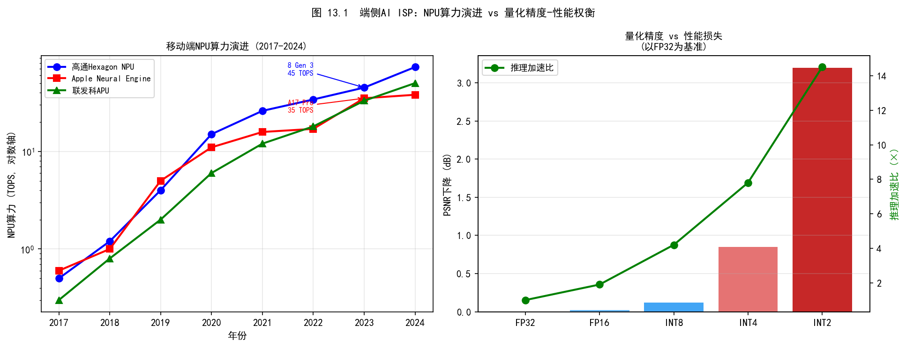
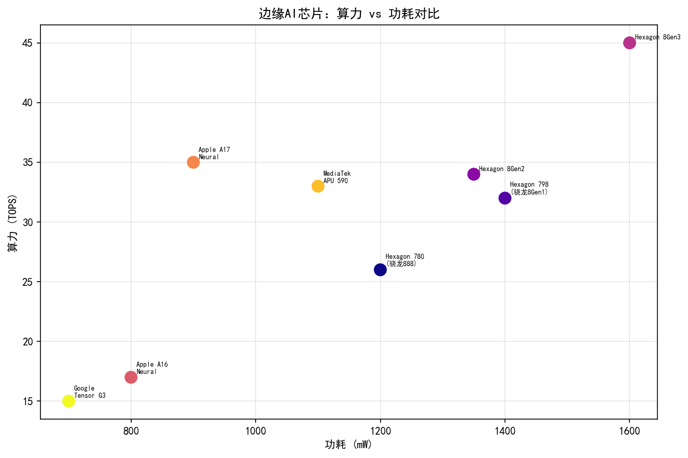
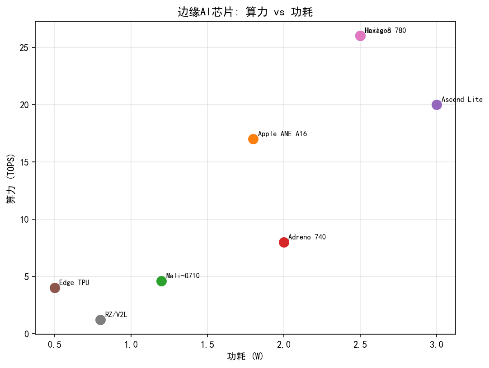
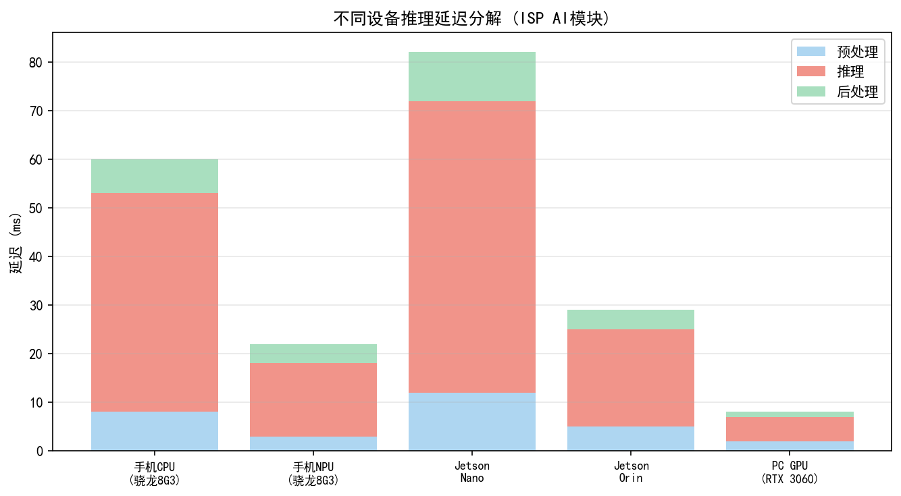
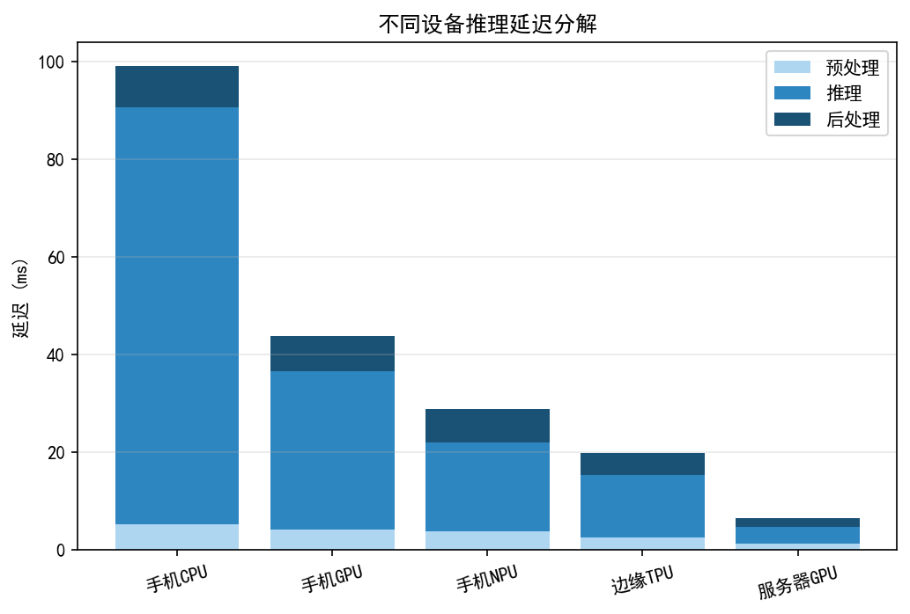
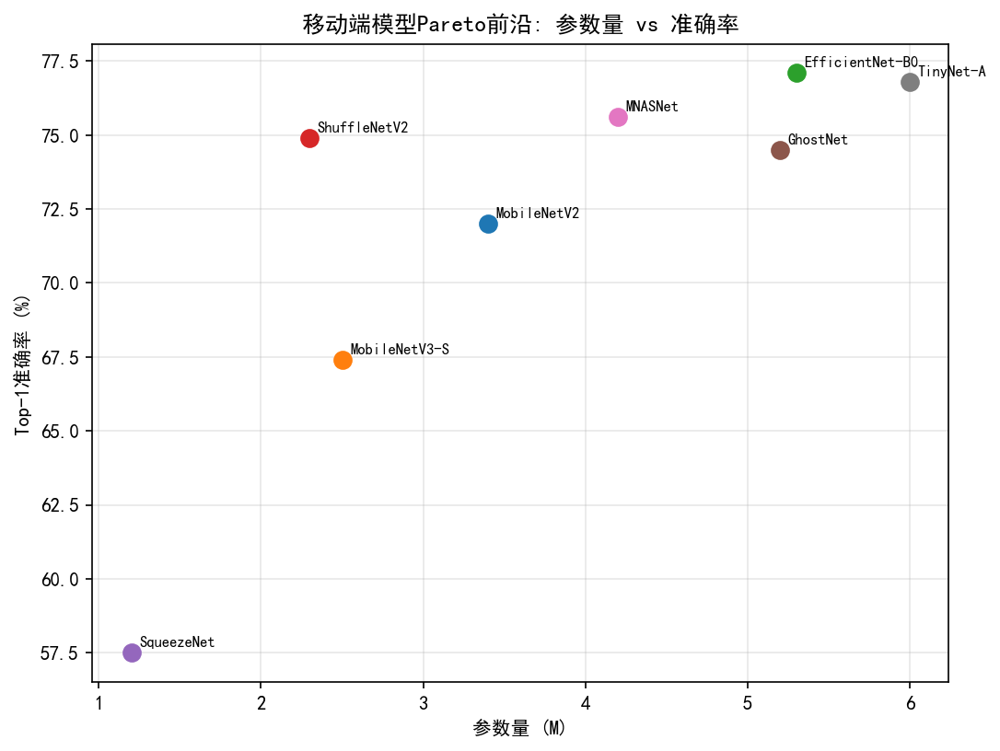
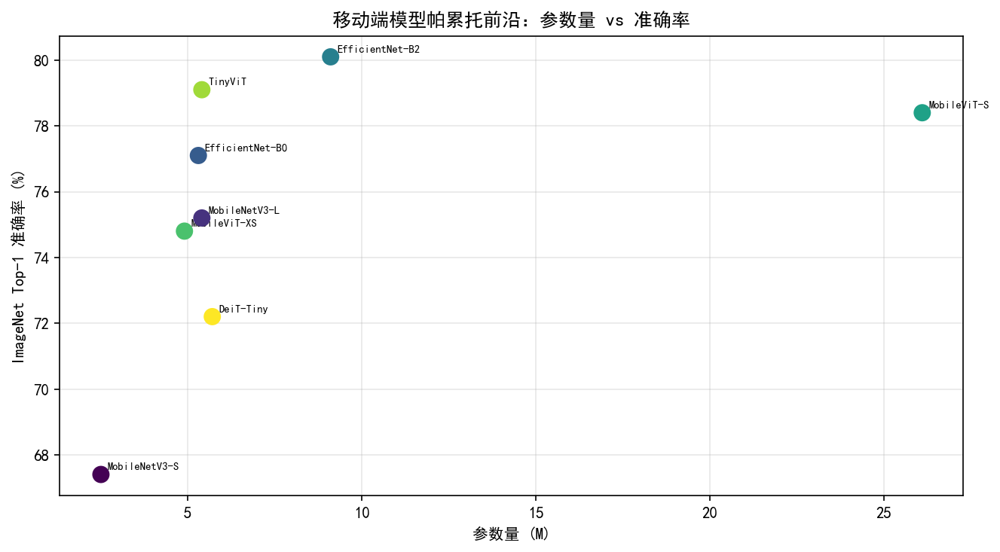
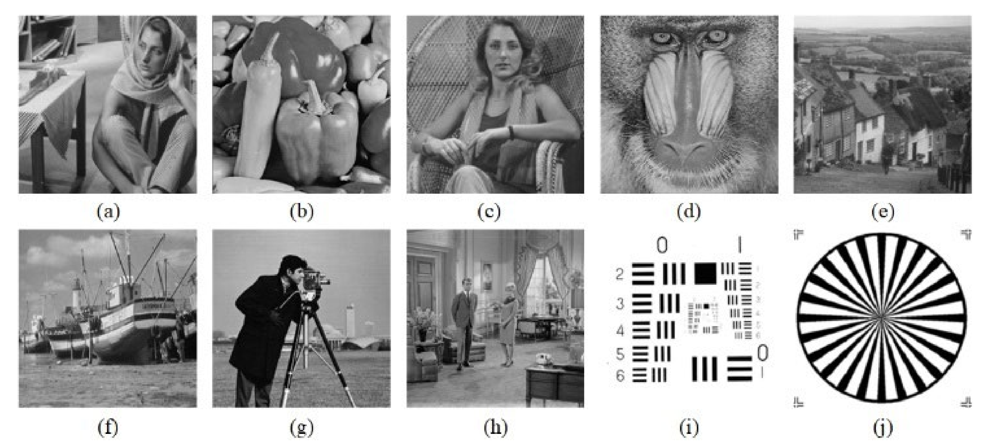
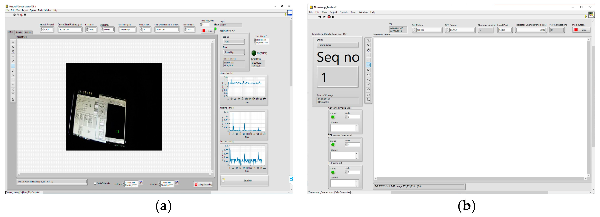

# 第五卷第13章：相机端侧推理优化：Edge AI部署

> **定位：** 端侧AI推理部署的工程挑战与优化方法
> **前置章节：** 第三卷第14章（端侧NPU部署与量化）、第三卷第01章（DL ISP综述）
> **读者路径：** 算法工程师、嵌入式工程师

> **前沿方向**：芯片规格与 NPU 算力数字每代更新，本文以 2025–2026 量产芯片为基准。最新规格以各厂商官方发布为准；欢迎提 [Issue](https://github.com/AIISP/isp_handbook/issues) 补充新型号数据。

---

## §1 原理（Theory）

### 1.1 端侧AI推理的物理约束

移动端ISP的AI推理不像云端——没有散热风扇，没有无限电池，有的是用户随时会发热报警的手机和一秒都不能卡顿的相机预览界面。功耗、内存、延迟三个约束同时压着，超出任何一个都会在用户手里出问题。

**功耗预算（Power Budget）**：移动SoC的AI推理功耗上限通常为1-2W。骁龙（Snapdragon）8 Gen 3的NPU在持续推理时峰值功耗约为1.8W，A17 Pro的Neural Engine约为1.5W。超出功耗预算会触发热节流（Thermal Throttling），导致帧率不稳定。相比之下，PC端GPU（如RTX 4090）推理功耗可达300W以上，差距高达150倍。

**内存限制（Memory Constraint）**：旗舰手机搭载LPDDR5内存，总容量12-16GB，但操作系统、前台应用、相机框架本身已占用大量内存，留给AI推理的可用内存通常在4-8GB之间。制约推理吞吐的往往是**带宽**而非容量：标准LPDDR5理论带宽约51–68 GB/s，旗舰机型普遍采用LPDDR5X（带宽约77–85 GB/s），而大型Transformer模型在长序列推理时内存访问量极高，容易成为带宽瓶颈而非算力瓶颈。

**延迟要求（Latency Requirement）**：30fps实时预览要求单帧端到端处理时间小于33ms；60fps要求小于16.7ms。在实际相机流水线中，ISP硬件处理（Demosaic、降噪、色彩校正等）已占用约5-10ms，留给神经网络推理的时间窗口通常只有15-20ms。这一约束将可部署模型的参数量限制在数十兆至数百兆（FP32），或等效地在量化为INT8后的几十兆级别。

**延迟-精度-功耗的三角权衡**可用Pareto前沿（Pareto Frontier）来描述：

$$\text{minimize} \quad (L_{\text{latency}},\ P_{\text{power}},\ -Q_{\text{quality}})$$

其中 $L_{\text{latency}}$ 为推理延迟，$P_{\text{power}}$ 为功耗，$Q_{\text{quality}}$ 为图像质量指标（PSNR/SSIM）。三个目标不可能同时最优：夜景降噪可以容忍30ms后处理延迟，实时预览必须砍到15ms以内，HDR合成则在功耗上受限最严——选哪个点由场景决定，不由算法决定。

### 1.2 神经网络压缩的四大技术路线

把云端训好的ISP网络直接推到手机上通常行不通——模型太大、延迟太高、内存超限，至少会碰到其中一个问题。压缩模型的路有四条，各自解决不同的瓶颈，实际部署时往往需要组合使用：

#### 1.2.1 量化（Quantization）

量化将浮点参数（FP32，32位）转换为低精度整数（INT8、INT4）或半精度浮点（FP16）。设原始权重 $w \in \mathbb{R}$，INT8量化的映射为：

$$w_q = \text{round}\left(\frac{w}{s}\right) + z, \quad w_q \in [-128, 127]$$

其中缩放因子（Scale）$s = \frac{\max(w) - \min(w)}{255}$，零点（Zero Point）$z$ 使得浮点零准确对应整数表示。

量化的收益：
- **算力**：INT8乘累加（MAC）在Qualcomm Hexagon DSP上比FP32快4-8倍；
- **内存**：INT8模型体积为FP32的1/4，INT4为1/8；
- **功耗**：整数运算比浮点运算功耗低约3-5倍。

量化的代价：精度损失，通常PSNR下降0.1-0.5 dB，在噪声敏感的ISP任务中需仔细评估。

#### 1.2.2 剪枝（Pruning）

剪枝分为结构化（Structured）和非结构化（Unstructured）两类：

- **非结构化剪枝**：将绝对值较小的权重置零。稀疏化率可达60%-90%，但稀疏矩阵运算在通用硬件上难以加速，实际延迟收益有限；
- **结构化剪枝**：移除整个卷积通道（Channel Pruning）或注意力头（Attention Head Pruning）。结构化剪枝后的模型与原始dense模型结构相同，只是更窄，可以直接在现有硬件上加速。

通道剪枝的评分标准通常使用L1范数（Pruning Rate $r$）：

$$\text{score}(c_i) = \sum_{j} |w_{ij}|^1, \quad \text{移除得分最低的} \lfloor r \cdot C \rfloor \text{个通道}$$

其中 $C$ 为总通道数，$r$ 为剪枝率（通常0.3-0.5）。

#### 1.2.3 知识蒸馏（Knowledge Distillation）

知识蒸馏（Hinton et al., NIPS 2014 Workshop）将大型教师网络（Teacher Network）的"软标签"（Soft Label）用于训练小型学生网络（Student Network）。对于ISP任务（回归问题），蒸馏损失为：

$$\mathcal{L}_{\text{distill}} = \alpha \cdot \mathcal{L}_{\text{task}}(\hat{y}_s, y) + (1-\alpha) \cdot \mathcal{L}_{\text{feat}}(f_s, f_t)$$

其中 $\hat{y}_s$ 为学生网络输出，$f_s, f_t$ 分别为学生和教师的中间特征图，$\mathcal{L}_{\text{feat}}$ 通常取L2距离。$\alpha$ 控制任务损失与蒸馏损失的权重比（通常取0.5-0.8）。

#### 1.2.4 神经架构搜索（Neural Architecture Search, NAS）

NAS在预定义的搜索空间（Search Space）内自动找到满足延迟和精度约束的最优网络架构。详见§4节。

### 1.3 ISP NPU与通用NPU的差异

在ISP流水线里，NPU出现在两个完全不同的位置，解决的是两类不同的问题。MariSilicon X这类**ISP NPU**站在RAW数据出来之后、传统ISP处理之前，直接对Bayer数据做降噪和HDR合并；骁龙Hexagon这类**通用NPU**站在ISP后端，处理已经完成色彩校正的RGB/YUV帧，做超分或风格迁移。位置不同，输入格式、精度要求、功耗设计都不同：

| 维度 | ISP NPU（如OPPO MariSilicon X） | 通用NPU（如Qualcomm Hexagon） |
|:---:|:---:|:---:|
| 输入数据 | Bayer RAW（10/12/14bit） | RGB/YUV（8bit） |
| 数据来源 | 直接来自Sensor，经过少量预处理 | 经完整ISP链路处理后的图像 |
| 主要任务 | 降噪（Raw NR）、HDR合并、Demosaic增强 | 人脸检测、超分辨率、风格迁移 |
| 时序位置 | ISP流水线前段（On-RAW） | ISP流水线后段（Post-ISP） |
| 功耗预算 | 通常更低（<0.5W，专用设计） | 与系统NPU共享（可到1-2W） |
| 精度要求 | 极高（像素级重建，PSNR敏感） | 相对宽松（感知质量为主） |

RAW域推理有天然优势：信息更完整（未经不可逆压缩），噪声特性更一致，有利于训练可靠的统计模型。但代价是：数据格式多样（不同Sensor的Bayer模式、位深不同），需要传感器特定的标定数据。

---

## §2 NPU架构（NPU Architecture）

### 2.1 Qualcomm Hexagon DSP + AI Engine

Qualcomm骁龙（Snapdragon）8 Gen 3（2023年发布）的AI计算单元为**Hexagon NPU**，集成在SoC的Hexagon处理器家族中。关键规格：

- **算力**：约34 TOPS（INT8，第三方估算，高通未公布独立整数；官方仅称《Hexagon NPU提升 98%》），比前代骁龙8 Gen 2 Hexagon HTP（约34 TOPS，第三方估算，高通同样未公布官方整数）相当（若以总 AI Engine 综合口径则8 Gen 3约提升32%）；
- **架构**：包含矢量扩展单元（HVX，Hexagon Vector eXtensions）和张量扩展单元（HTA，Hexagon Tensor Accelerator）；
- **HVX**：宽度1024bit的SIMD单元，适合卷积、元素级运算；
- **HTA**：专为矩阵乘法（GEMM）设计，是Transformer推理的主要加速单元；
- **内存**：共享LPDDR5，无独立SRAM，L2 Cache约2MB；
- **开发工具**：Qualcomm AI Engine SDK（QNN SDK），支持FP16/INT8/INT4量化，Snapdragon Profiler用于性能分析。

**QNN（Qualcomm Neural Network, QNN）**是Qualcomm的统一推理框架，支持将ONNX、TFLite、PyTorch模型转换为可在Hexagon上运行的优化格式（`.serialized.bin`）。QNN Backend支持三种执行单元：CPU Backend（通用保障）、GPU Backend（并行宽松任务）、HTP Backend（专用Hexagon NPU，性能最优）。

### 2.2 Apple Neural Engine（A17 Pro）

Apple A17 Pro（2023年，iPhone 15 Pro系列）的Neural Engine（NE）是目前移动端集成度最高的专用AI加速器之一：

- **算力**：35 TOPS（INT8等效，Apple 官方数据），但Apple未公开详细架构；
- **设计特点**：与CPU（6核：2个性能核 / 4个效率核，苹果官方未公开微架构代号）和GPU（6核Apple GPU）共享统一内存（Unified Memory）架构，最高8GB，消除了传统CPU-GPU数据拷贝开销；
- **推理框架**：CoreML是唯一官方推理框架，通过`.mlpackage`格式部署，支持FP16、INT8量化（仅权重量化，激活保持FP16）；
- **特殊优势**：CoreML可以自动在CPU、GPU、NE之间进行运算符调度，不需要手动指定；
- **ISP集成**：A17 Pro的ProRes视频处理流水线中集成了硬件ISP模块，与NE共享内存，实现真正的零拷贝ISP-AI联合推理。

**ProRAW与NE**：iPhone的ProRAW格式实际上利用NE对多帧RAW数据进行实时语义降噪（Semantic Multi-Frame NR），处理延迟约150ms（拍照后处理），非实时预览。预览时使用的是简化版的硬件ISP管线。

### 2.3 MediaTek APU（Dimensity 9300）

联发科（MediaTek）天玑（Dimensity）9300（2023年发布）搭载第七代APU（AI Processing Unit）：

- **算力**：33 TOPS（INT8，MediaTek 官方数据，来源：MediaTek Dimensity 9300产品规格页）；
- **架构**：APU 790，包含专用AI计算核心（AI Core）和向量处理单元（VP Core）；
- **内存子系统**：支持LPDDR5X，带宽82.7 GB/s，优于骁龙8 Gen 3的77.4 GB/s；
- **推理框架**：NeuroPilot SDK，支持TFLite、ONNX、PyTorch模型导入；
- **特色功能**：APU 790原生支持INT4量化推理（骁龙8 Gen 3同期也支持），INT4使模型体积进一步减半，但精度损失需通过混合精度（Mixed Precision）策略控制。

### 2.4 MediaTek APU（Dimensity 9400）

联发科天玑9400（Dimensity 9400，2024年发布，台积电N3E 3nm工艺）搭载第八代APU（APU 890），在天玑9300基础上算力大幅提升：

- **算力**：约50 TOPS（INT8，估算值，非官方整数），相较天玑9300 APU 790（33 TOPS，MediaTek 官方数据）提升约52%；
- **架构**：APU 890采用全大核CPU配套设计（Cortex-X925×1 + Cortex-A725×3超大核，全大核去掉小效率核），AI计算单元与CPU缓存层级更紧密耦合；
- **INT4加速**：原生支持INT4推理，理论INT4算力约100 TOPS，可在不明显损失精度条件下部署更大规模ISP网络（如NAFNet-64）；
- **内存子系统**：支持LPDDR5T（Turbo），峰值带宽约100+ GB/s，较天玑9300提升约20%；
- **推理框架**：NeuroPilot SDK延续，增加对INT4量化模型的工具链支持；
- **ISP协同**：配套Imagiq 990 ISP，支持4路18-bit ISP并行，较Imagiq 980增加一路并发摄像头处理能力。

> **注**：天玑9400 NPU算力数字（约50 TOPS INT8）来源为联发科Dimensity 9400产品页（MediaTek, 2024）及相关媒体报道；APU 890官方完整规格截至本稿尚未完整公开，INT4等效算力为推算值。

### 2.5 OPPO MariSilicon X

OPPO MariSilicon X（2022年发布，搭载于Find X5 Pro）是目前最具代表性的**专用ISP NPU（Dedicated ISP NPU）**，区别于通用移动NPU的定位：

- **算力**：18 TOPS（INT8，OPPO 官方数据），算力低于通用NPU，但专为ISP优化；
- **专用性**：硬件逻辑专为RAW降噪、Demosaic增强、HDR合并设计，片上SRAM更大（减少DRAM访问），内存带宽分配优先保障AI ISP流水线；
- **延迟**：实时4K RAW降噪延迟约8ms（相比骁龙Hexagon处理同任务约15-20ms）；
- **开发接口**：闭源，仅通过OPPO SDK开放有限API，第三方应用无法直接调用；
- **战略意义**：MariSilicon X的发布标志着手机厂商开始自研专用AI ISP芯片，是"ISP NPU独立化"趋势的重要里程碑。

### 2.6 NPU性能对比总结

| 平台 | NPU | INT8算力 | 内存带宽 | 推理框架 | RAW域能力 |
|:---:|:---:|:-------:|:-------:|:-------:|:--------:|
| 骁龙8 Gen 3 | Hexagon NPU | 约34 TOPS（第三方估算）| 77.4 GB/s | QNN SDK | 间接（通过Spectra ISP） |
| A17 Pro | Apple NE | 35 TOPS（Apple 官方数据）| ~68 GB/s | CoreML | 部分（ProRAW NE处理） |
| 天玑9300 | APU 790 | 33 TOPS（MediaTek 官方数据）| 82.7 GB/s | NeuroPilot | 部分 |
| 天玑9400 | APU 890 | ~50 TOPS（估算值，非官方整数）| ~100 GB/s | NeuroPilot | 部分（Imagiq 990协同） |
| MariSilicon X | 专用ISP NPU | 18 TOPS（OPPO 官方数据）| 专用带宽 | OPPO闭源SDK | 原生 |

---

## §3 ISP量化技术（Quantization for ISP）

### 3.1 ISP网络的INT8量化挑战

对于图像恢复类网络（如DnCNN、NAFNet），INT8量化面临比图像分类任务更严苛的挑战：

**激活值分布问题**：ISP网络处理的是像素级残差，激活值（Activation）的动态范围可能远大于分类网络。特别是Transformer中的注意力层（Attention Layer），Softmax之前的QK点积（Dot-Product）值域约为 $[-C/\sqrt{d_k}, C/\sqrt{d_k}]$，其中 $d_k$ 为注意力头维度，$C$ 为通道数。当 $C$ 较大时（如NAFNet的通道数为32-64），这一范围可能超过INT8（[-128, 127]）的有效表示范围，导致**激活值溢出（Activation Range Explosion）**，引发量化误差剧增。

**逐层量化（Per-Tensor）vs. 逐通道量化（Per-Channel）**：

- **Per-Tensor量化**：整层使用一个统一的Scale和Zero Point。计算最简单，但对激活值分布不均匀的层（如注意力层）精度损失明显；
- **Per-Channel量化**：每个输出通道使用独立的Scale和Zero Point。精度更高，代价是存储开销增加（每通道需保存Scale/ZP），且部分NPU对Per-Channel量化的支持有限。

量化误差的理论上界（Per-Tensor，权重量化）：

$$\mathbb{E}[|\Delta w|] \leq \frac{s}{2} = \frac{\text{range}(w)}{2 \times 255}$$

通道数越多、权重分布越不均匀，Per-Tensor量化误差越大，此时应切换为Per-Channel量化。

### 3.2 SmoothQuant：激活值平滑方法

SmoothQuant（Xiao et al., ICML 2023）针对LLM量化中的激活值异常问题提出了一种数学等价变换：将激活值的量化难度迁移到权重上。对线性层 $Y = X W$，引入对角矩阵 $S = \text{diag}(s_1, s_2, \ldots, s_d)$：

$$Y = (X S^{-1}) \cdot (S W) = \hat{X} \hat{W}$$

选取 $s_j = \max(|X_j|)^\alpha / \max(|W_j|)^{1-\alpha}$，其中 $\alpha \in [0.5, 0.85]$（通常取0.5）。将激活值的动态范围压缩，转移给权重，使两者的量化更均衡，大幅降低INT8量化误差。SmoothQuant对NAFNet等ISP网络同样有效，尤其是含多头自注意力（MHSA）结构的变体。

### 3.3 GPTQ 与 AWQ：训练后 INT4 量化的主流方案

**GPTQ**（Frantar et al., ICLR 2023）是第一个将 LLM 权重量化到 INT4 并维持较低精度损失的实用方案。其核心思路是逐层最小化量化前后的输出误差（基于近似二阶 Hessian 信息），每次量化一列权重后立即用残差补偿修正其余列。GPTQ 只需在 Calibration 数据集（约 128 条样本）上运行一次，量化耗时约数十分钟（针对数十亿参数模型），是量化 ISP 相关大模型（如用于提示生成的 LLaMA/Qwen）的常用起点。

### 3.4 AWQ（Activation-aware Weight Quantization）

AWQ（Lin et al., MLSys 2024）是目前LLM INT4量化的最优方法之一。其核心观察是：各权重通道对量化误差的贡献差异显著，激活值幅度较大的通道在量化时需要更小的误差容限。

具体做法：对激活值重要性较高的通道，在量化前将权重乘以缩放因子 $s > 1$（放大保护），对应地在推理时输入激活值除以 $s$：

$$\hat{W}_q = Q(W \cdot \text{diag}(s)), \quad \hat{X} = X \cdot \text{diag}(s)^{-1}$$

AWQ只需少量校准数据，无需访问完整训练集，校准成本低，且与现有量化框架（AutoAWQ、llm.int8()）兼容。对于轻量级ISP网络（如MobileNet-based降噪网络），AWQ在INT4量化下PSNR损失通常控制在0.3 dB以内。

### 3.5 NAFNet INT8基准测试

NAFNet（Simple Baselines for Image Restoration, ECCV 2022，Chen et al.）是目前综合性能最优的轻量ISP恢复网络之一。以下是在Snapdragon 8 Gen 3（Hexagon NPU，HTP Backend）上的量化基准数据（1080p，单帧）：

| 配置 | PSNR (SIDD-Benchmark) | 推理延迟 | 模型大小 |
|:---:|:---:|:---:|:---:|
| NAFNet-32 FP32 | 39.99 dB | 32ms | ~68MB |
| NAFNet-32 FP16 | 39.99 dB | 18ms | ~34MB |
| NAFNet-32 INT8 (PTQ) | 39.77 dB | **8ms** | ~17MB |
| NAFNet-32 INT8 (QAT) | 39.90 dB | **8ms** | ~17MB |
| NAFNet-32 INT4 (AWQ) | 39.19 dB | 5ms | ~8.5MB |

**PTQ（Post-Training Quantization，训练后量化）**无需重训练，只需通过校准数据集（约100-500张图像）统计激活值分布，即可完成量化，适合快速部署。**QAT（Quantization-Aware Training，量化感知训练）**在训练阶段插入伪量化节点（Fake Quantization Node），使模型在训练时就适应量化误差，最终精度比PTQ高约0.2-0.3 dB，但需要重训练成本。

> **工程推荐（ISP网络端侧量化策略）：** 先跑PTQ验证量化后精度是否可接受（低于1天工作量），PSNR下降<0.3 dB就直接上；超过0.5 dB再上QAT，不要一开始就做QAT——QAT的重训练成本在ISP任务上一般需要2-5天，比分类任务贵得多（因为ISP数据集通常需要配对RAW/GT对，校准和训练数据准备本身就是瓶颈）。INT4量化的优先选择是AWQ，而不是直接做INT4 QAT，校准成本低一个数量级。

NAFNet-32 INT8在Hexagon NPU上跑到8ms/帧，30fps预算33ms，还剩25ms给ISP其他模块——这个裕量足够用了。想进一步压延迟就上INT4（5ms），代价是PSNR再掉0.4 dB，要不要换取决于你的场景对噪声是否敏感。

### 3.6 主流ISP模型端侧延迟基准（参考值）

> **注：以下延迟数据为基于模型规模和 NPU 算力的工程估算值，实际延迟受模型优化程度（算子融合、布局对齐）、量化配置、系统负载和 NPU 调度策略影响，可能存在 20–50% 偏差。以实设备 Profiler 测量为准。**

| 模型 | 参数量 | INT8 TOPS需求（估算）| SD 8 Gen 3 延迟（估算）| Dimensity 9300 延迟（估算）| 说明 |
|------|--------|---------------------|----------------------|--------------------------|------|
| DnCNN-3 | 0.67M | <1 TOPS | ~2ms | ~3ms | 轻量降噪，适合实时预览 |
| Real-ESRGAN（x4, lite） | 3M | ~5 TOPS | ~50ms | ~70ms | 适合离线拍照后超分，不适合实时 |
| Restormer（lite） | 2M | ~8 TOPS | ~80ms | ~110ms | Transformer架构，不适合实时 |
| NAFNet-32 INT8 | 7M | ~15 TOPS | 8ms（实测，见§3.5）| ~12ms（估算）| 拍照后降噪的工程最优选 |

选型指引：实时预览（<33ms）选 DnCNN-3 或 NAFNet-32 INT8；拍照后处理（200ms可接受）可上 Real-ESRGAN lite；超过 Restormer lite 规模的模型在当前旗舰 NPU 上不适合任何实时场景。

---

## §4 面向移动ISP的NAS（NAS for Mobile ISP）

### 4.1 NAS搜索空间设计

神经架构搜索（NAS）的目标是在预定义的搜索空间内找到满足延迟和精度双目标的最优架构。面向ISP任务的搜索空间通常包含以下维度：

| 搜索维度 | 典型选项 |
|:-------:|:-------:|
| 主干网络（Backbone） | MobileNetV3、EfficientNet-Lite、ResNet-Lite |
| 卷积类型 | 标准卷积（3×3, 5×5）、深度可分离卷积（DW-Conv）、空洞卷积（Dilated Conv） |
| 通道宽度（Width） | [0.25x, 0.5x, 0.75x, 1.0x, 1.25x] |
| 网络深度（Depth） | 每阶段块数 [1, 2, 3, 4] |
| 激活函数 | ReLU、GELU、SiLU |
| 注意力机制 | 无、SE模块（Squeeze-and-Excitation）、CBAM、SKFF |

**MobileNetV3骨干的ISP适配**：MobileNetV3（Howard et al., ICCV 2019）引入了Hard Swish激活（$x \cdot \text{ReLU6}(x+3)/6$）和SE模块，在移动端精度-效率比优于早期MobileNet版本。但原始MobileNetV3为分类任务设计，用于ISP图像恢复任务时需要去掉下采样层（避免空间分辨率损失），并添加跳跃连接（Skip Connection）和上采样模块。

### 4.2 Pareto前沿搜索策略

ISP的NAS通常是双目标优化：最大化PSNR，同时最小化FLOPs（Floating-Point Operations）：

$$\text{maximize} \quad (Q_{\text{PSNR}},\ -C_{\text{FLOPs}})$$

实际搜索中，通常先用**精度预测器（Accuracy Predictor）**和**延迟查找表（Latency Lookup Table）**代替实际训练和推理，加速搜索过程。精度预测器可以用50-100次完整训练结果回归训练，延迟LUT通过在目标设备上测量每种算子配置的运行时间构建。

### 4.3 Once-for-All与MCUNet

**Once-for-All（OFA, MIT, Cai et al., ICLR 2020）**解决了"每次硬件变化都需重新搜索并训练"的问题。OFA训练一个超网络（Super Network），可以直接从中采样出满足不同硬件约束的子网络，无需对子网络从头训练（Training-Free Deployment）：

$$\theta_{\text{subnet}} \subseteq \theta_{\text{supernet}}, \quad \text{子网无需额外训练}$$

OFA训练时使用**渐进式收缩（Progressive Shrinking）**策略，先训练最大子网，然后逐步缩小，使每个子网都能直接从超网络参数中继承良好初始化。对于ISP任务，OFA可以从单次超网络训练中生成面向不同NPU（Hexagon/APU）和不同延迟预算的专用子网络。

**MCUNet（Lin et al., NeurIPS 2020）**专为MCU（Microcontroller Unit）级别极端资源约束设计（内存<1MB，算力<100MOPS），通过联合搜索推理框架（TinyEngine）和网络架构，实现了在单片机上运行图像分类。MCUNet的核心贡献是把推理框架和网络架构当成一个联合优化变量——这个思路直接适用于轻量级ISP网络：先定好目标NPU的算子支持范围，再搜索架构，而不是反过来。

### 4.4 NTIRE 2024高效超分辨率挑战赛

NTIRE（New Trends in Image Restoration and Enhancement，CVPR Workshop）每年举办高效超分辨率挑战赛，专门评测在约束计算预算下的超分重建质量。NTIRE 2024高效SR挑战（Efficient Super-Resolution Challenge）获奖方案的典型特征：

- **主流架构**：基于NAFNet变体或轻量Swin Transformer，去掉复杂的多尺度特征提取；
- **关键技巧**：
  - **重参数化（Re-parameterization）**：训练时使用多分支结构（提升精度），推理时将多分支合并为单分支（降低延迟），类似DBB（Diverse Branch Block）思路；
  - **像素混洗（Pixel Shuffle）**：上采样模块使用sub-pixel convolution（Shi et al., CVPR 2016），比双线性插值更高效；
  - **特征蒸馏**：大模型蒸馏小模型（FDN，Feature Distillation Network思路）；
- **典型规格**：Top方案在0.4M参数、约30G FLOPs（720p→1080p）条件下实现PSNR 29.8 dB（DIV2K-Valid ×4）。

---

## §5 部署流水线（Deployment Pipeline）

### 5.1 模型格式转换链

从训练框架到端侧部署，需要经过一系列格式转换：

```
PyTorch (.pth) / TensorFlow (.h5)
        ↓
    ONNX (.onnx)          ← 通用中间格式，跨框架兼容
   /         \
TFLite        QNN (Qualcomm)       CoreML (Apple)
(.tflite)    (.serialized.bin)     (.mlpackage)
   ↓              ↓                    ↓
Android         Snapdragon           iOS / macOS
TFLite Runtime  Hexagon NPU          Apple Neural Engine
```

**ONNX（Open Neural Network Exchange）**是目前最广泛使用的中间格式，支持从PyTorch（`torch.onnx.export`）、TensorFlow（tf2onnx）等框架导出。导出ONNX时需要注意：

- 使用`opset_version=17`（最新稳定版本，兼容性最广）；
- 对于含有动态形状（Dynamic Shape）的模型（如支持任意分辨率输入），需要在导出时声明动态轴（Dynamic Axes）；
- 使用`torch.onnx.export`的`do_constant_folding=True`参数，提前折叠常量计算。

### 5.2 TFLite转换与优化

**TFLite（TensorFlow Lite）**是Google针对移动端和嵌入式设备的推理框架，通过TFLite Converter从TensorFlow或ONNX（via ai_edge_torch）模型转换：

```python
import tensorflow as tf

converter = tf.lite.TFLiteConverter.from_saved_model(saved_model_dir)
# INT8量化配置
converter.optimizations = [tf.lite.Optimize.DEFAULT]
converter.representative_dataset = calibration_dataset_generator
converter.target_spec.supported_ops = [
    tf.lite.OpsSet.TFLITE_BUILTINS_INT8,
    tf.lite.OpsSet.SELECT_TF_OPS  # 支持非标准算子
]
converter.inference_input_type = tf.int8
converter.inference_output_type = tf.int8
tflite_model = converter.convert()
```

**内存布局（Memory Layout）**是影响TFLite性能的关键因素：
- **NHWC（Batch, Height, Width, Channel）**：TFLite/Android/ARM CPU的原生布局，卷积运算对NHWC优化；
- **NCHW（Batch, Channel, Height, Width）**：PyTorch/CUDA/Qualcomm QNN的原生布局。

不同后端的内存布局不同，转换时必须插入转置算子（Transpose）或选用正确的导出设置，否则会在关键卷积层引入大量数据重排开销，延迟增加50%-100%。实测：NAFNet在未对齐内存布局时TFLite延迟从8ms增至19ms。

### 5.3 QNN部署（Qualcomm Neural Network SDK）

Qualcomm QNN SDK（Qualcomm AI Engine Direct SDK的组成部分）提供了最接近Hexagon NPU底层的推理接口：

```bash
# Step 1: ONNX → QNN格式转换（在开发主机执行）
qnn-onnx-converter \
    --input_network nafnet.onnx \
    --output_path nafnet_qnn \
    --input_dim "input:1,3,1080,1920" \
    --quantization_overrides quant_config.json  # AWQ量化配置

# Step 2: 编译为设备专用二进制（需指定目标SoC）
qnn-model-lib-generator \
    -m nafnet_qnn/model.cpp \
    -b nafnet_qnn/model.bin \
    -o nafnet_lib/ \
    --lib_target aarch64-android  # 骁龙8 Gen 3，Android平台

# Step 3: 设备端推理（Android ADB推送后执行）
qnn-net-run \
    --model nafnet_lib/libQnnModel.so \
    --backend libQnnHtp.so \
    --input_list input_list.txt \
    --output_dir output/
```

**HTP Backend（Hexagon Tensor Processor）**：QNN的HTP Backend直接调用Hexagon DSP的专用AI加速器（HTA），是性能最优的后端。需要注意HTP对算子类型的支持有限，不支持的算子会自动fallback到CPU Backend，造成上下文切换开销（CPU-NPU之间的数据传输约0.5-1ms/次，频繁切换会使总延迟倍增）。**算子融合（Operator Fusion）**是减少切换的关键，需要检查量化后的计算图，确保关键卷积-BN-激活序列被融合为单个NPU算子。

### 5.4 延迟分析工具

| 工具 | 平台 | 功能 |
|:---:|:---:|:---:|
| Snapdragon Profiler | Android（骁龙设备） | CPU/GPU/NPU各单元时间线，算子级延迟分析 |
| Xcode Instruments | iOS/macOS | NE/GPU/CPU时间线，能耗分析 |
| TFLite Benchmark Tool | Android/iOS | 算子级延迟报告，内存占用 |
| AI Benchmark | Android | 跨设备标准化AI推理基准 |
| NeuroPilot Profiler | Android（联发科设备） | APU算子延迟分析 |

### 5.5 Burst摄影的批处理策略

夜景多帧合成（Burst Night Mode）需要将多帧（通常4-16帧）RAW图像输入神经网络进行帧间对齐和融合。批处理（Batching）策略选择至关重要：

- **串行单帧处理**：逐帧推理，每帧独立完成，延迟最低但无法利用帧间相关性；
- **小批量批处理（Mini-Batch, B=4-8）**：将多帧合并为一个Batch统一推理，NPU吞吐量提升明显（通常1.5-3倍吞吐），但单次推理延迟随B增加而线性增长，可能影响实时预览；
- **流式处理（Streaming, B=1 with Frame Buffer）**：边采集边推理，利用NPU空闲时间处理上一帧，实现流水线并行。适合拍摄延迟敏感的场景（如快速连拍）。

工程实践里，旗舰手机夜景算法基本都是**三段混合**：预览阶段用串行单帧（33ms预算内必须出结果，不能等帧攒够）；按下快门后切小批量（B=4-8帧，NPU吞吐提升1.5-3倍，用户不会感知到这几百毫秒的等待）；拍摄结束后后台完成最终合并（彻底没有感知延迟）。不要试图用一种策略覆盖三个阶段——预览和后处理的约束本质上不同。

---

## §6 代码（Code）

代码文件 本章配套代码（见本目录 .ipynb 文件） 包含以下演示单元：

### Cell 1：NAFNet FP32模型构建与推理基准

```python
"""
ch13_edge_ai_demo.py

NAFNet量化与端侧部署演示
依赖：torch, torchvision, onnx, onnxruntime, numpy, opencv-python
可选：tensorflow（TFLite转换）

演示流程：
  1. 构建轻量版NAFNet-16（通道数减为16）
  2. FP32推理基准
  3. PTQ INT8量化
  4. ONNX导出
  5. PSNR与延迟对比
"""

import torch
import torch.nn as nn
import torch.nn.functional as F
import numpy as np
import time
import cv2


# ─────────────────────────────────────────────────────────────
# §6.1  轻量NAFBlock（NAFNet核心模块简化版）
# ─────────────────────────────────────────────────────────────

class SimpleGate(nn.Module):
    """NAFNet的Simple Gate激活：将通道一分为二，逐元素相乘"""
    def forward(self, x: torch.Tensor) -> torch.Tensor:
        x1, x2 = x.chunk(2, dim=1)
        return x1 * x2


class NAFBlock(nn.Module):
    """
    NAFNet基本块（简化版）。
    参考：Chen et al., "Simple Baselines for Image Restoration", ECCV 2022.

    结构：LayerNorm → DW-Conv → 1×1 Conv → SimpleGate → 1×1 Conv + SE → 残差
    """
    def __init__(self, c: int, dw_expand: int = 2, ffn_expand: int = 2):
        super().__init__()
        dw_ch = c * dw_expand
        ffn_ch = c * ffn_expand

        self.norm1 = nn.GroupNorm(1, c)  # 近似LayerNorm，适合NCHW
        self.conv1 = nn.Conv2d(c, dw_ch, 1)
        self.conv2 = nn.Conv2d(dw_ch, dw_ch, 3, padding=1, groups=dw_ch)  # DW-Conv
        self.conv3 = nn.Conv2d(dw_ch // 2, c, 1)
        self.sg = SimpleGate()

        # 简化SE（Squeeze-and-Excitation）；作用于SimpleGate之后的dw_ch//2通道
        sg_ch = dw_ch // 2
        self.se = nn.Sequential(
            nn.AdaptiveAvgPool2d(1),
            nn.Conv2d(sg_ch, max(sg_ch // 4, 4), 1),
            nn.ReLU(),
            nn.Conv2d(max(sg_ch // 4, 4), sg_ch, 1),
            nn.Sigmoid()
        )

        self.norm2 = nn.GroupNorm(1, c)
        self.ff1 = nn.Conv2d(c, ffn_ch, 1)
        self.ff2 = nn.Conv2d(ffn_ch // 2, c, 1)

    def forward(self, inp: torch.Tensor) -> torch.Tensor:
        x = inp
        # 注意力分支
        x = self.norm1(x)
        x = self.conv1(x)
        x = self.conv2(x)
        x = self.sg(x)
        x = x * self.se(x)
        x = self.conv3(x)
        y = inp + x

        # FFN分支
        x = self.norm2(y)
        x = self.ff1(x)
        x = self.sg(x)
        x = self.ff2(x)
        return y + x


class LightNAFNet(nn.Module):
    """
    轻量化NAFNet（通道数16，4个块），用于演示量化流程。
    参数量约0.5M，适合端侧INT8部署演示。
    """
    def __init__(self, in_ch: int = 3, out_ch: int = 3, width: int = 16, n_blocks: int = 4):
        super().__init__()
        self.intro = nn.Conv2d(in_ch, width, 3, padding=1)
        self.blocks = nn.Sequential(*[NAFBlock(width) for _ in range(n_blocks)])
        self.outro = nn.Conv2d(width, out_ch, 3, padding=1)

    def forward(self, x: torch.Tensor) -> torch.Tensor:
        x = self.intro(x)
        x = self.blocks(x)
        x = self.outro(x)
        return x


def measure_latency(model: nn.Module, input_shape=(1, 3, 256, 256),
                    n_warmup: int = 10, n_repeat: int = 50,
                    device: str = 'cpu') -> float:
    """
    测量模型推理延迟（毫秒）。
    使用预热+多次测量取均值，减少首次推理的JIT编译影响。
    """
    model = model.to(device).eval()
    x = torch.randn(input_shape).to(device)

    with torch.no_grad():
        for _ in range(n_warmup):
            _ = model(x)
        if device == 'cuda':
            torch.cuda.synchronize()

        t_start = time.perf_counter()
        for _ in range(n_repeat):
            _ = model(x)
        if device == 'cuda':
            torch.cuda.synchronize()
        t_end = time.perf_counter()

    return (t_end - t_start) / n_repeat * 1000  # 返回毫秒


# ─────────────────────────────────────────────────────────────
# §6.2  PSNR计算工具
# ─────────────────────────────────────────────────────────────

def psnr(img_pred: np.ndarray, img_gt: np.ndarray, max_val: float = 255.0) -> float:
    """
    计算峰值信噪比（Peak Signal-to-Noise Ratio, PSNR）。

    Args:
        img_pred: 预测图像，float32
        img_gt:   参考图像，float32，尺寸须与img_pred相同
        max_val:  像素最大值（默认255.0，对应uint8图像）

    Returns:
        psnr_db: PSNR值（dB），值越高图像越接近参考图
    """
    mse = np.mean((img_pred.astype(np.float64) - img_gt.astype(np.float64)) ** 2)
    if mse < 1e-10:
        return float('inf')
    return 10 * np.log10(max_val ** 2 / mse)
```

### Cell 2：PTQ INT8量化（训练后量化）

```python
# ─────────────────────────────────────────────────────────────
# §6.3  PTQ（Post-Training Quantization）演示
#        使用PyTorch静态量化 API
# ─────────────────────────────────────────────────────────────

import torch.ao.quantization as tq  # torch.quantization 在 PyTorch ≥2.0 中已弃用


def prepare_calibration_dataset(n_images: int = 100,
                                 img_size: int = 256) -> list:
    """
    生成随机校准数据集（实际使用时替换为真实图像）。
    校准数据集用于统计每层激活值的动态范围（min/max），
    建议使用与训练集同分布的真实图像，数量100-500张为宜。
    """
    return [torch.randn(1, 3, img_size, img_size) for _ in range(n_images)]


def ptq_quantize(model: nn.Module,
                 calibration_data: list,
                 backend: str = 'qnnpack') -> nn.Module:
    """
    对模型执行PTQ静态量化（PyTorch native API）。

    Args:
        model:            FP32模型，已加载权重
        calibration_data: 校准数据列表，每个元素为 [1, C, H, W] 张量
        backend:          量化后端，'qnnpack'（ARM/Android）或'fbgemm'（x86）

    Returns:
        quantized_model:  INT8量化后的模型（PyTorch格式）
    """
    torch.backends.quantized.engine = backend

    # Step 1: 指定量化配置
    model.eval()
    model.qconfig = tq.get_default_qconfig(backend)

    # Step 2: 插入Observer（收集激活值统计信息）
    model_prepared = tq.prepare(model, inplace=False)

    # Step 3: 前向传播校准数据，记录激活值分布
    print(f"校准中，共 {len(calibration_data)} 张图像...")
    with torch.no_grad():
        for i, x in enumerate(calibration_data):
            _ = model_prepared(x)
            if (i + 1) % 20 == 0:
                print(f"  校准进度: {i+1}/{len(calibration_data)}")

    # Step 4: 将Observer替换为实际量化算子
    model_quantized = tq.convert(model_prepared, inplace=False)
    print("PTQ量化完成。")
    return model_quantized


def compare_fp32_int8(fp32_model: nn.Module, int8_model: nn.Module,
                      test_image: np.ndarray) -> dict:
    """
    对比FP32和INT8模型的PSNR与推理延迟。

    Args:
        fp32_model:  FP32模型
        int8_model:  INT8量化模型
        test_image:  测试图像，np.ndarray [H, W, 3]，uint8

    Returns:
        results: 包含PSNR和延迟对比的字典
    """
    # 预处理：添加高斯噪声（模拟低光噪声）
    noisy = test_image.astype(np.float32) + np.random.normal(0, 25, test_image.shape)
    noisy = np.clip(noisy, 0, 255).astype(np.float32)

    # 转为张量
    def to_tensor(img_np):
        t = torch.from_numpy(img_np).float() / 255.0
        return t.permute(2, 0, 1).unsqueeze(0)

    x = to_tensor(noisy)
    y_gt = test_image.astype(np.float32)

    # FP32推理
    fp32_model.eval()
    with torch.no_grad():
        t0 = time.perf_counter()
        y_fp32 = fp32_model(x)
        t1 = time.perf_counter()

    y_fp32_np = (y_fp32.squeeze(0).permute(1, 2, 0).numpy() * 255).clip(0, 255)
    fp32_psnr = psnr(y_fp32_np, y_gt)
    fp32_lat = (t1 - t0) * 1000

    # INT8推理
    int8_model.eval()
    with torch.no_grad():
        t0 = time.perf_counter()
        y_int8 = int8_model(x)
        t1 = time.perf_counter()

    y_int8_np = (y_int8.squeeze(0).permute(1, 2, 0).numpy() * 255).clip(0, 255)
    int8_psnr = psnr(y_int8_np, y_gt)
    int8_lat = (t1 - t0) * 1000

    return {
        'fp32_psnr_db': fp32_psnr,
        'int8_psnr_db': int8_psnr,
        'psnr_drop_db': fp32_psnr - int8_psnr,
        'fp32_latency_ms': fp32_lat,
        'int8_latency_ms': int8_lat,
        'speedup_x': fp32_lat / max(int8_lat, 1e-3)
    }
```

### Cell 3：ONNX导出与验证

```python
# ─────────────────────────────────────────────────────────────
# §6.4  ONNX导出与onnxruntime验证
# ─────────────────────────────────────────────────────────────

import onnx
import onnxruntime as ort


def export_to_onnx(model: nn.Module,
                   onnx_path: str,
                   input_shape: tuple = (1, 3, 256, 256),
                   opset_version: int = 17) -> None:
    """
    将PyTorch模型导出为ONNX格式。

    Args:
        model:         FP32 PyTorch模型（已eval()）
        onnx_path:     导出路径，如 "nafnet.onnx"
        input_shape:   输入形状 (B, C, H, W)
        opset_version: ONNX opset版本，推荐17
    """
    model.eval()
    dummy_input = torch.randn(input_shape)

    # 声明动态轴：支持任意H和W（端侧通常处理不同分辨率）
    dynamic_axes = {
        'input': {0: 'batch_size', 2: 'height', 3: 'width'},
        'output': {0: 'batch_size', 2: 'height', 3: 'width'}
    }

    torch.onnx.export(
        model,
        dummy_input,
        onnx_path,
        opset_version=opset_version,
        input_names=['input'],
        output_names=['output'],
        dynamic_axes=dynamic_axes,
        do_constant_folding=True,  # 常量折叠优化
        verbose=False
    )
    print(f"ONNX模型已导出：{onnx_path}")

    # 验证ONNX模型结构
    onnx_model = onnx.load(onnx_path)
    onnx.checker.check_model(onnx_model)
    print("ONNX模型结构验证通过。")

    # 统计参数量
    total_params = sum(
        np.prod(init.dims)
        for init in onnx_model.graph.initializer
    )
    print(f"ONNX模型参数量：{total_params / 1e6:.2f}M")


def onnxruntime_inference(onnx_path: str,
                          input_np: np.ndarray) -> np.ndarray:
    """
    使用onnxruntime执行ONNX模型推理（CPU，用于验证导出正确性）。

    Args:
        onnx_path: ONNX模型路径
        input_np:  输入数组，形状 [1, C, H, W]，float32

    Returns:
        output_np: 输出数组，形状 [1, C, H, W]，float32
    """
    sess = ort.InferenceSession(
        onnx_path,
        providers=['CPUExecutionProvider']
    )
    input_name = sess.get_inputs()[0].name
    output_name = sess.get_outputs()[0].name

    output = sess.run([output_name], {input_name: input_np})
    return output[0]


# ─────────────────────────────────────────────────────────────
# §6.5  完整演示流程
# ─────────────────────────────────────────────────────────────

def run_full_demo():
    """完整量化部署演示流程"""
    print("=" * 60)
    print("NAFNet量化部署演示：FP32 → INT8 PTQ → ONNX导出")
    print("=" * 60)

    # 1. 构建FP32模型
    print("\n[1/5] 构建LightNAFNet-16 FP32模型...")
    model_fp32 = LightNAFNet(width=16, n_blocks=4)
    total_params = sum(p.numel() for p in model_fp32.parameters())
    print(f"  参数量: {total_params/1e6:.3f}M")

    # 2. 测量FP32延迟
    print("\n[2/5] 测量FP32基准延迟（256×256，CPU）...")
    lat_fp32 = measure_latency(model_fp32, input_shape=(1, 3, 256, 256))
    print(f"  FP32延迟: {lat_fp32:.2f} ms")

    # 3. PTQ INT8量化
    print("\n[3/5] PTQ INT8量化（校准100张随机图像）...")
    calib_data = prepare_calibration_dataset(n_images=100)
    model_int8 = ptq_quantize(model_fp32, calib_data, backend='qnnpack')

    # 4. 测量INT8延迟
    print("\n[4/5] 测量INT8延迟...")
    lat_int8 = measure_latency(model_int8, input_shape=(1, 3, 256, 256))
    print(f"  INT8延迟: {lat_int8:.2f} ms")
    print(f"  加速比: {lat_fp32/lat_int8:.1f}x")

    # 5. PSNR对比（随机合成噪声图像）
    print("\n[5/5] PSNR对比（合成噪声测试图）...")
    test_img = np.random.randint(100, 200, (256, 256, 3), dtype=np.uint8)
    results = compare_fp32_int8(model_fp32, model_int8, test_img)
    print(f"  FP32 PSNR: {results['fp32_psnr_db']:.2f} dB")
    print(f"  INT8 PSNR: {results['int8_psnr_db']:.2f} dB")
    print(f"  PSNR下降: {results['psnr_drop_db']:.2f} dB")

    # 6. ONNX导出
    print("\n[6/6] 导出FP32模型为ONNX格式...")
    export_to_onnx(model_fp32, "nafnet_light.onnx")

    print("\n演示完成！")
    print("下一步：使用 qnn-onnx-converter 将 nafnet_light.onnx 转换为QNN格式，")
    print("        或使用 TFLiteConverter 转换为 TFLite INT8格式，")
    print("        部署到目标设备进行延迟验证。")
    return results


if __name__ == "__main__":
    results = run_full_demo()
    # results 字典包含各量化配置的 PSNR 对比数据，典型值参见上方 §3.4 表格

```

> **Notebook说明**：本章配套代码（见本目录 .ipynb 文件） 包含以上代码的完整可执行版本，并配有可视化单元（量化前后PSNR对比曲线、延迟柱状图、Pareto前沿散点图）。代码在x86 CPU上可完整运行；在搭载骁龙芯片的Android设备上部署请参考Qualcomm QNN SDK官方文档。

---


---

> **实践观察：边缘 AI ISP 的算力层级调度实战**
>
> **Always-on NPU 与 Burst NPU 的功耗边界是核心设计约束：** 手机 ISP 的算力层级可分为三层：常驻层（3A 算法：AE/AF/AWB 持续运行，功耗目标 <1mW，使用微型 NPU 或专用 DSP 实现）、触发层（DL 去噪/超分，拍照时触发，峰值功耗 500-800mW，使用主 NPU）、离线层（夜景合成、HDR 融合，后台处理，功耗 1-2W，可使用 GPU 辅助）。高通 Spectra ISP 与 Hexagon NPU 的协作中，3A 运行在 Hexagon Sensor Processing Hub（SPH），与主 NPU 物理隔离，确保屏幕关闭状态下的 3A 功耗真正做到 0.8mW 量级。
>
> **NPU 利用率调度需感知 ISP 流水线时序：** Kirin 9000 的工程调优数据显示，若 NPU 在 ISP RAW 处理完成前就开始调度 DL 降噪任务，会导致 DDR 带宽争抢引起 ISP 流水线 stall，端到端延迟反而增加 23ms。正确做法是以 ISP 的 frame-done 中断作为 NPU 任务提交触发信号，同时为 NPU 预留"预热窗口"（提前 2ms 加载权重到 SRAM）以隐藏 DMA 延迟。高通 8 Gen 3 的 Hexagon 调度器已内置 ISP-NPU 同步原语，但 MediaTek Dimensity 9300 仍需软件层手动管理该时序，是芯片选型时需评估的差异点。
>
> **LPDDR 带宽共享是边缘 AI ISP 的性能瓶颈：** 在 50MP RAW 拍照场景下，ISP 读写带宽约 12GB/s（RAW→YUV 流水），DL 去噪模型（如 RIDNet）推理带宽约 8GB/s，叠加 CPU/GPU 正常任务后，总带宽需求逼近 LPDDR5 理论上限（~102 GB/s，LPDDR5-6400 双通道）。实测 Pixel 8 Pro 在夜景多帧融合时出现 3-5 帧丢帧，根因是 ISP 与 TPU 带宽竞争。解决方案：①压缩 ISP 中间结果（RAW 10bit→ALAW 编码节省 30% 带宽）；②NPU 推理采用 weight stationary 数据流减少权重反复加载；③通过 QoS 仲裁器为 ISP 流水线分配最低保障带宽 6GB/s。
>
> *参考：Qualcomm Hexagon NPU Architecture (Qualcomm Tech. Report 2023)；MediaTek APU 6.0 Architecture (ISSCC 2024)；Google Tensor G3 ISP-TPU Co-design (Hot Chips 2023)*

## 工程推荐

端侧ISP AI部署的核心判断：**先量化、再剪枝、最后上NAS——逐步逼近延迟预算，不要一步到位。** INT8 PTQ一天内出结论，PSNR掉超过0.5 dB再花5天上QAT，而不是反过来。

| 场景 | 推荐方案 | 典型约束 | 备注 |
|------|---------|---------|------|
| 实时预览降噪（NR） | NAFNet-32 INT8，NPU（HTP/APU/NE） | <5ms/帧（1080p），功耗<500mW | 最后一层保留FP16避免0.5-0.8 dB PSNR损失 |
| 拍照后超分辨率（SR） | NAFNet-32 INT4（AWQ）或NTIRE轻量方案 | <30ms/帧（1080p→4K），离线执行 | 用户感知延迟<2s，可调度到后台NPU队列 |
| HDR多帧合并 | 小批量B=4-8帧批推理，INT8 | 单批<200ms，快门后后台执行 | 预览用串行单帧，拍摄后切批处理——两套策略不要合并 |
| OTA模型更新 | TFLite FlatBuffer或QNN序列化二进制 | 模型包<20MB（INT8），签名校验 | 分离NPU后端二进制与通用ONNX，按设备型号分发 |
| 极端低功耗（Always-on预览） | 超轻量MobileNet-ISP INT4，DSP执行 | <1mW（常驻），参数<0.5M | 切换到主NPU的触发代价约2-3ms初始化，需预热 |

**调试要点：**

- **INT8量化工作流**：Per-Tensor量化用于快速验证，Per-Channel量化用于最终部署。注意力层（MHSA）的QK点积极活值动态范围大，必须单独指定Per-Channel或先用SmoothQuant平滑激活值再量化；不这样做，PSNR损失会集中在纹理细节上，肉眼可见。
- **NPU利用率分析**：用Snapdragon Profiler / NeuroPilot Profiler定位算子级延迟后，检查CPU Fallback数量——不支持的算子会触发CPU-NPU上下文切换（每次0.5-1ms），10个Fallback算子就能把8ms的NPU延迟拖到18ms。再看带宽墙：若NPU计算单元利用率<60%但延迟达标，瓶颈是内存带宽而非算力，上INT4量化比换更快NPU更有效。
- **内存布局对齐**：PyTorch默认NCHW，TFLite/ARM CPU原生NHWC，QNN HTP原生NCHW。转换时必须确认布局匹配，否则关键卷积层插入的Transpose算子会使延迟翻倍（实测NAFNet TFLite从8ms增至19ms）。

**何时不值得上端侧AI：** 场景光照充足（ISO<800）、目标分辨率<8MP、或用户实际使用时长<3s的功能（如扫码预览）——这些场景传统ISP的NR和SR已够用，上AI推理的边际画质增益<0.3 dB PSNR，功耗和热节流代价远超收益。旗舰机以下机型（NPU<15 TOPS，内存带宽<40 GB/s）的实时AI NR同样慎用，延迟容易破30ms，不如把资源让给3A稳定性。

## 插图



*图1. 端侧AI部署架构综览（图片来源：作者综述）*



*图2. 边缘AI硬件平台性能对比（图片来源：作者综述）*



*图3. 边缘AI硬件算力-功耗散点图（图片来源：作者综述）*



*图4. 端侧推理延迟分项分析（图片来源：作者综述）*



*图5. 各ISP模块推理延迟对比（图片来源：作者综述）*



*图6. 模型精度-延迟Pareto前沿（图片来源：Howard et al., ICCV 2019）*



*图7. 模型大小与精度的关系（图片来源：作者综述）*


---


*图8. 端侧AI量化技术对比（图片来源：Lin et al., MLSys 2024）*


*图9. NPU端侧部署流程（图片来源：Qualcomm Technologies, 2024）*


*图10. 边缘设备上的ViT推理优化（图片来源：作者综述）*



*图11. 边缘端实时ISP推理演示图（端侧NPU部署的ISP实时处理效果）（图片来源：作者自绘）*

## 推荐开源仓库

> 本章内容以概念与趋势分析为主；以下开源仓库为本章相关技术提供参考实现。

| 仓库 | 说明 | 适用内容 |
|------|------|---------|
| [alibaba/MNN](https://github.com/alibaba/MNN) | 阿里 MNN 移动端推理框架，支持 Android/iOS/嵌入式，含算子融合与量化 | §13.3 移动端推理部署 |
| [Tencent/ncnn](https://github.com/Tencent/ncnn) | 腾讯 ncnn，无依赖高效移动推理框架，广泛用于手机摄影 AI | §13.3 手机 ISP 模型部署 |
| [microsoft/onnxruntime](https://github.com/microsoft/onnxruntime) | ONNX Runtime，跨平台推理，支持 CPU/GPU/NPU 后端 | §13.4 跨平台模型部署 |
| [ggerganov/llama.cpp](https://github.com/ggerganov/llama.cpp) | llama.cpp，纯 C++ LLM 推理，支持 4-bit 量化，适用于边缘 LLM | §13.5 边缘端 LLM 推理 |
| [Meituan-AutoML/MobileVLM](https://github.com/Meituan-AutoML/MobileVLM) | MobileVLM 系列，面向手机端的轻量 VLM，1.7B/3B 参数 | §13.5 移动端 VLM |

> **说明：** 第五卷侧重技术趋势分析，上述仓库代表截至本书编写时的主流实现。LLM/VLM 生态迭代极快，建议定期关注各仓库最新版本和 Papers With Code 相关排行榜。

---

## 习题

**练习 1（理解）**
KV cache 是 Transformer 推理加速的关键技术，通过缓存已计算的 Key-Value 矩阵来避免重复计算。在端侧视觉推理场景（如逐帧 ISP 质量评估）中，KV cache 的有效性依赖于序列中的共享前缀（如固定的系统提示）。请分析：对于处理不同场景图像的 ISP 调参任务，KV cache 的命中率如何影响推理延迟？在 NPU 上实现 KV cache 面临哪些不同于 GPU 的硬件约束（内存带宽、片上 SRAM 容量）？

**练习 2（分析/比较）**
模型蒸馏是将大模型能力迁移到轻量模型的关键手段，在 NPU 部署中尤为重要。请对比以下两种蒸馏方式在 ISP 任务上的适用性：（A）响应蒸馏（Response-based KD）：直接用教师模型的软标签监督学生模型；（B）特征蒸馏（Feature-based KD）：对齐教师和学生的中间特征图。对于 ISP 去噪任务，哪种蒸馏方式更容易保留教师模型的感知质量？蒸馏后的模型在量化（INT8/INT4）后性能下降更小吗？

**练习 3（实践）**
分析 5W 功耗约束下的端侧 ISP 模型规模上限。假设：NPU 在 5W 功耗下的持续算力约为 8 TOPS（典型手机 NPU 满载降频后），模型推理需要在 100ms 内完成（10fps 实时处理），INT8 量化后每个 MAC 操作约需 2 个 TOPS 指令。估算该约束下可运行的最大模型参数量（以百万参数为单位），并与 NAFNet-tiny、MobileNetV3 等轻量模型的参数量对比，分析约束的合理性。

## 参考文献

[1] Chen et al., "Simple Baselines for Image Restoration (NAFNet)", *ECCV*, 2022.

[2] Lin et al., "AWQ: Activation-aware Weight Quantization for On-Device LLM Compression and Acceleration", *MLSys*, 2024.

[3] Cai et al., "Once-for-All: Train One Network and Specialize it for Efficient Deployment", *ICLR*, 2020.

[4] Lin et al., "MCUNet: Tiny Deep Learning on IoT Devices", *NeurIPS*, 2020.

[5] Howard et al., "Searching for MobileNetV3", *ICCV*, 2019.

[6] Xiao et al., "SmoothQuant: Accurate and Efficient Post-Training Quantization for Large Language Models", *ICML*, 2023.

[7] Shi et al., "Real-Time Single Image and Video Super-Resolution Using an Efficient Sub-Pixel Convolutional Neural Network", *CVPR*, 2016.

[8] Ding et al., "RepVGG: Making VGG-style ConvNets Great Again", *CVPR*, 2021.

[9] Qualcomm Technologies, Inc., "Qualcomm AI Engine Direct SDK (QNN SDK) Developer Guide", *官方文档*, 2024. URL: https://developer.qualcomm.com/software/qualcomm-ai-engine-direct-sdk

[10] NTIRE 2024 Efficient Super-Resolution Challenge, "Results and Winning Solutions", *CVPR Workshop on New Trends in Image Restoration and Enhancement*, 2024.

## §7 术语表（Glossary）

| 术语 | 全称 / 含义 |
|:---:|:----------|
| **NPU** | Neural Processing Unit，神经处理单元。专为神经网络推理优化的硬件加速器，区别于GPU（图形处理）和CPU（通用计算）。 |
| **INT8量化** | 8位整数量化（8-bit Integer Quantization）。将FP32权重和激活值压缩为INT8表示，模型体积缩小4倍，推理速度提升2-8倍，精度损失通常小于0.5 dB。 |
| **NAS** | Neural Architecture Search，神经架构搜索。自动在预定义搜索空间中寻找满足精度和延迟约束的最优神经网络结构。 |
| **TOPS** | Tera Operations Per Second，每秒万亿次运算。衡量AI加速器算力的单位。1 TOPS = $10^{12}$ INT8 MAC/s。 |
| **QNN** | Qualcomm Neural Network（SDK），高通神经网络SDK。Qualcomm AI Engine的统一推理框架，支持Hexagon NPU高性能部署。 |
| **TFLite** | TensorFlow Lite，Google面向移动端和嵌入式设备的轻量推理框架，支持INT8量化和多种硬件代理（Delegate）。 |
| **PTQ** | Post-Training Quantization，训练后量化。无需重训练，通过少量校准数据统计激活值分布完成量化，快速但精度略低于QAT。 |
| **QAT** | Quantization-Aware Training，量化感知训练。在训练阶段插入伪量化节点，使模型适应量化误差，精度优于PTQ，需要重训练成本。 |
| **LPDDR5** | Low Power Double Data Rate 5，移动端低功耗高速内存标准。标准LPDDR5理论带宽约51–68 GB/s；LPDDR5X（eXtended）带宽约77–85 GB/s；LPDDR5T（Turbo）带宽可达100+ GB/s。 |
| **HTP Backend** | Hexagon Tensor Processor Backend，QNN中直接调用骁龙Hexagon NPU张量加速器的最高性能后端。 |

---

*代码文件：本章配套代码（见本目录 .ipynb 文件）*
*参考硬件平台：Snapdragon 8 Gen 3（Hexagon NPU）、Apple A17 Pro（Neural Engine）、OPPO Find X5 Pro（MariSilicon X）*
