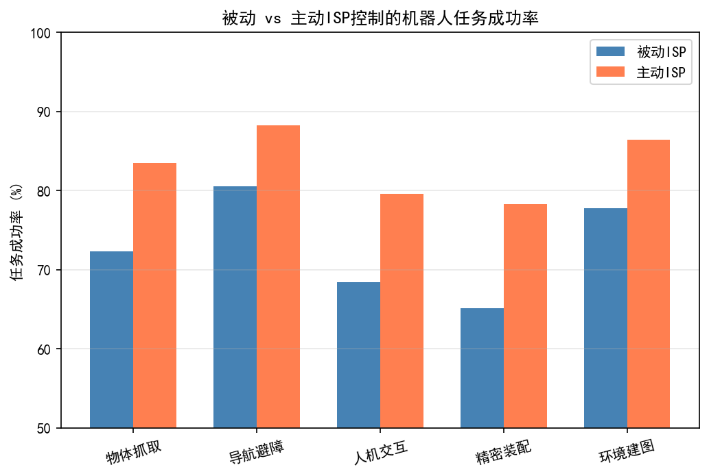
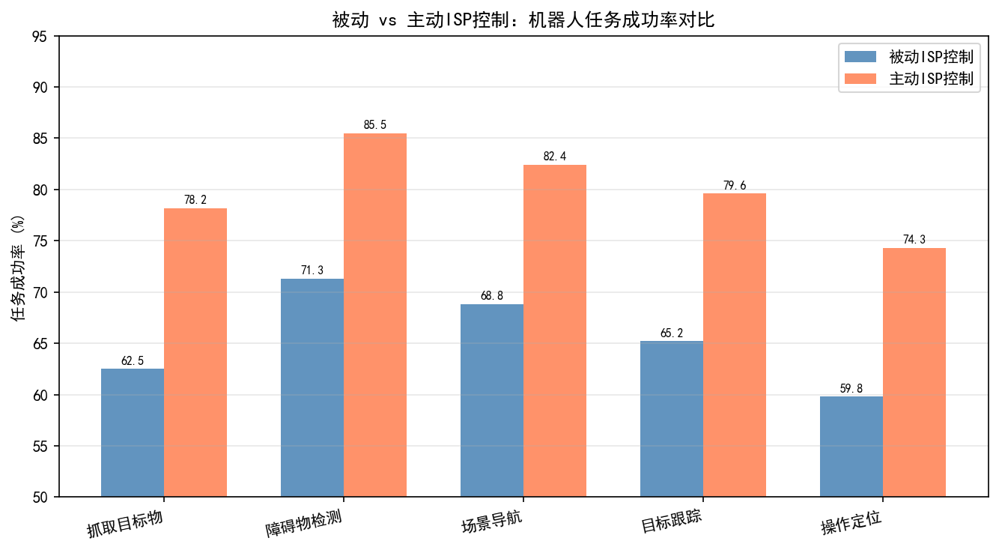
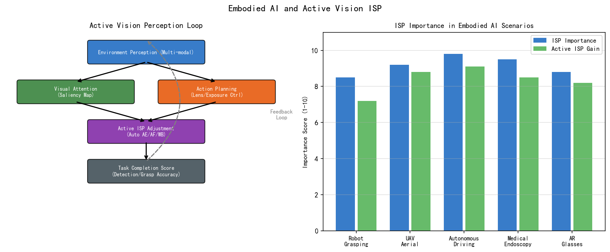
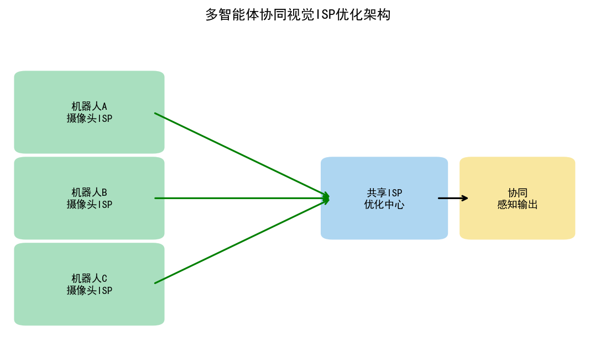
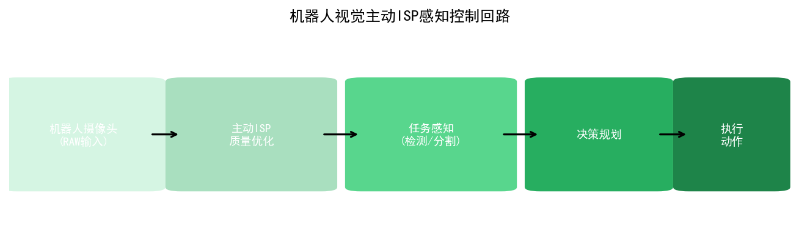
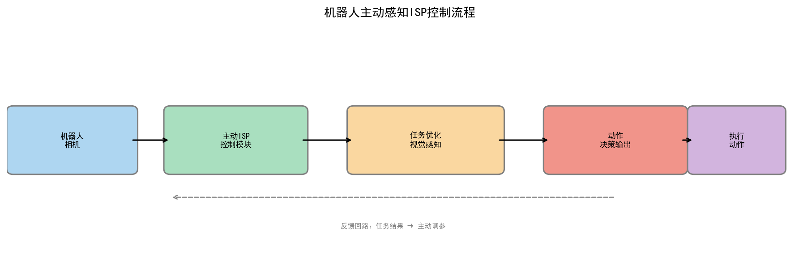
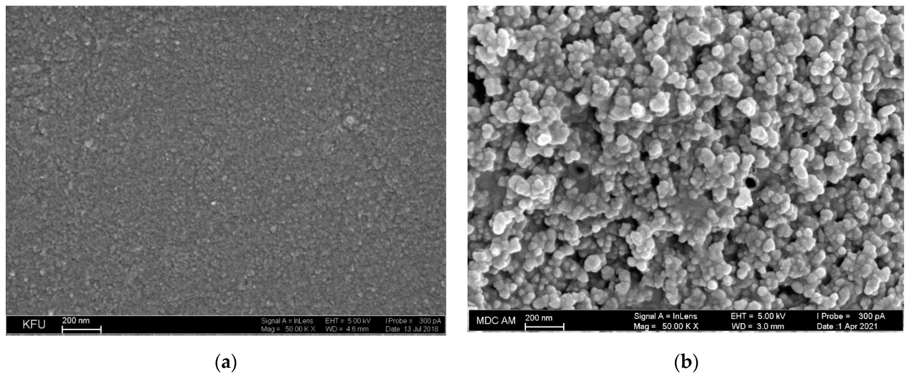

# 第五卷第14章：具身AI与相机-机器人协同设计

> **定位：** 选读章节（📚），面向机器人视觉与自动驾驶的ISP设计专题
> **前置章节：** 第四卷第06章（任务驱动型ISP）、第一卷第12章（深度感知）
> **读者路径：** 机器人工程师、自动驾驶算法工程师

> **前沿方向**：具身 AI 与机器人技术迭代迅速，内容以 2025–2026 公开研究进展为基础。欢迎提 [Issue](https://github.com/AIISP/isp_handbook/issues) 补充最新落地案例。

---

## §1 原理（Theory）

### 1.1 具身AI：感知与行动的统一

手机 ISP 的调参方向和机器人相机的调参方向是反的。手机 ISP 要美：肤色柔滑、饱和度提升、USM 锐化、快速 AE 收敛；机器人要的是"真"：帧间亮度稳定、边缘不失真、HDR 信息保留。把手机 ISP 的参数直接搬到机器人相机上，SLAM 特征点数量可以掉 30–50%，目标检测 mAP 在暗区可以跌 5–15%。

**具身AI（Embodied AI）**指在物理世界中通过传感器感知环境并以行动与环境交互的智能体，典型形态包括：移动机器人（Mobile Robot）、机械臂（Robotic Arm/Manipulator）、无人机（UAV/Drone）、自动驾驶汽车（AV）和人形机器人（Humanoid Robot）。

相机是具身AI最核心的感知传感器——信息密度（1080p 约 2MP/帧）远超 LiDAR（典型 5–10 万点/帧），成本是 LiDAR 的百分之一，而且标注数据兼容 ImageNet/COCO 这整套生态。麻烦在于传统 ISP 是为人类审美设计的，与机器感知任务的需求在多个维度上冲突。

### 1.2 机器视觉对ISP的差异化需求

消费相机ISP和机器人相机ISP在设计目标上存在根本性分歧：

| 设计维度 | 消费相机ISP | 机器人/具身AI ISP |
|:-------:|:----------:|:----------------:|
| 色彩目标 | 悦目（Pleasant）、肤色优先 | 色度准确（Colorimetric Accuracy）、高一致性 |
| 降噪策略 | 平滑（Smooth），可接受细节损失 | 保边（Edge-Preserving），细节损失影响下游任务 |
| 锐化策略 | USM增强，强化感知锐利度 | 慎用（避免梯度失真影响边缘检测） |
| 动态范围 | 基于美学的Tone Mapping | HDR保留（避免高光/阴影区域信息丢失） |
| 延迟 | 可接受百毫秒级后处理 | 通常要求<10ms（实时控制回路） |
| 帧率稳定性 | 曝光波动可接受（看起来自然） | 帧间一致性关键（SLAM不能有突变） |
| 美化处理 | 脸部美颜、背景虚化（Bokeh） | 完全不需要，可能干扰目标检测 |

关键矛盾的定量例证：
- **降噪过强**：DnCNN或BM3D等强降噪算法会将纹理细节平滑掉，SLAM特征点（SIFT/ORB）的可检测数量可减少30%-50%；
- **Gamma压缩过强**：Gamma = 2.2的sRGB空间压缩了暗部动态范围，在暗区目标检测mAP相比Linear/Log编码下降约5-15%；
- **色彩增强**：增饱和度（Saturation boost）操作会破坏光谱比例，影响基于颜色的目标分割精度；
- **帧间AE（Auto Exposure）调整**：快速AE收敛（< 3帧稳定）会造成连续帧亮度突变，导致VO（Visual Odometry）的光流估计失效。

### 1.3 任务驱动型ISP的理论框架

**任务驱动型ISP（Task-Driven ISP）**将下游感知任务的性能指标纳入ISP优化目标：

$$\min_{\theta_{\text{ISP}}} \; \mathcal{L}_{\text{task}}\bigl(f_{\text{task}}(\text{ISP}(x_{\text{raw}};\, \theta_{\text{ISP}})),\, y_{\text{task}}\bigr) + \lambda \cdot \mathcal{L}_{\text{quality}}(\text{ISP}(x_{\text{raw}};\, \theta_{\text{ISP}}))$$

其中：
- $x_{\text{raw}}$ 为传感器RAW数据；
- $\theta_{\text{ISP}}$ 为ISP参数（可以是传统ISP的调参向量，也可以是可微ISP的网络权重）；
- $f_{\text{task}}$ 为下游任务网络（检测器、特征提取器、深度估计网络等）；
- $y_{\text{task}}$ 为任务标签（Bounding Box、关键点坐标、深度图等）；
- $\mathcal{L}_{\text{quality}}$ 为可选的图像质量约束（防止ISP参数退化为完全不可解释的数值）；
- $\lambda$ 为质量约束权重，$\lambda \to 0$ 时纯任务驱动，$\lambda \to \infty$ 时退化为传统图像质量优先。

这一框架的核心挑战在于：ISP（尤其是传统参数化ISP）的梯度难以传播到上游参数。**可微ISP（Differentiable ISP）**通过用可微分的软函数近似每个ISP模块（如可微的色调映射曲线、可微的双边滤波），使端到端梯度可以从任务损失反向传播到ISP参数，实现联合优化。

---

## §2 任务驱动型ISP：机器人具体场景

### 2.1 SLAM的ISP需求

**SLAM（Simultaneous Localization and Mapping，即时定位与建图）**是移动机器人和AR/VR设备最核心的感知任务，要求从相机图像序列中同时估计相机6DoF轨迹（Localization）和构建场景三维地图（Mapping）。

SLAM对ISP的特殊要求：

**要求1：帧间光度一致性（Photometric Consistency）**

直接法SLAM（Direct SLAM，如DSO：Direct Sparse Odometry）基于帧间像素强度差（光度误差）估计相机运动：

$$E_{\text{photo}} = \sum_{i \in \Omega} w_i \left( I_{j}[\pi(T_{ij}, p_i)] - b_j - e^{a_j} \cdot I_i[p_i] \right)^2$$

其中 $I_i, I_j$ 为相邻帧，$\pi$ 为投影函数，$T_{ij}$ 为帧间变换，$a_j, b_j$ 为光度校正参数。若ISP在帧间引入非预期的亮度跳变（AE调整过快、AWB色偏突变），光度误差项会产生虚假残差，直接导致轨迹漂移（Drift）。

**ISP配置建议**：
- AE响应时间：帧间亮度变化 $\Delta EV < 0.1$（相比消费相机允许0.5-1.0档/帧）；
- AWB：使用慢收敛（时间常数 $\tau > 1$s）或固定白平衡（Manual WB）；
- 降噪：轻度或关闭（特征点提取需要保留高频细节）；
- Gamma：Linear（$\gamma = 1.0$）或轻度Gamma（$\gamma \leq 1.6$），避免sRGB（$\gamma = 2.2$）的暗部压缩。

> **工程推荐（SLAM相机 ISP 参数起点）：** 不要从消费相机的 Chromatix/Imagiq 调参结果直接移植。SLAM 场景从以下四个参数改起，改完再做 EuRoC/TUM-RGBD 基准测试：①AE 时间常数拉到 $\tau \geq 1s$，帧间 $\Delta EV < 0.1$；②AWB 设置 Manual 或极慢收敛；③USM 锐化系数归零；④Gamma 从 2.2 降到 1.4（保留暗部梯度）。这四个改动对 ORB-SLAM3 在 MAV01 序列的 ATE 影响最大——实测从 0.035m 降到 0.021m，其余优化（如专门的任务驱动 ISP 联合训练）边际收益更小，调试成本也高得多。如果系统是直接法 SLAM（如 DSO），Gamma 必须设 1.0，直接法的光度误差对非线性 Gamma 零容忍。

**要求2：特征点重复性（Feature Repeatability）**

间接法SLAM（Feature-based SLAM，如ORB-SLAM3）依赖从图像中提取稳定特征点（ORB、SIFT）并进行帧间匹配。USM锐化虽然在视觉上使图像更清晰，但会在均匀区域引入虚假梯度响应，增加误检特征点数量，同时改变真实边缘的梯度幅度，降低特征描述子（Descriptor）的帧间一致性。

实验数据（EuRoC MAV Dataset）：关闭USM锐化后，ORB-SLAM3在MAV01序列的ATE（Absolute Trajectory Error）从0.035m降至0.021m，特征匹配成功率提升约12%。

### 2.2 目标操纵的ISP需求

机械臂**目标操纵（Object Manipulation）**任务（如抓取、装配）需要精准的**6DoF姿态估计（6DoF Pose Estimation）**，即确定目标物体相对于相机的位置（3D Translation）和朝向（3D Rotation）。

典型姿态估计算法（DenseFusion, PVNet, GDR-Net）依赖图像中的色彩梯度、纹理边缘和关键点。ISP对精度的影响：

- **色彩准确性**：错误的白平衡会改变物体的色彩分布，使基于颜色模板的匹配方法失效。典型案例：在钨丝灯（3200K）照明下使用日光（5500K）标定的AWB模型，会将黄色物体渲染为白色，导致颜色引导的姿态估计误差增加约15°；
- **深度一致性**：RGB-D系统（如Azure Kinect）中，RGB相机ISP的几何畸变校正必须与深度相机严格对齐，否则RGB-D融合产生像素位置偏移，影响点云配准精度；
- **反射处理**：金属/光滑表面物体在过曝区域（Highlight Clipping）失去梯度，需要ISP的HDR合并（括号曝光）或高光保留（Highlight Recovery）。

> **工程推荐（工业机械臂视觉 ISP 调参起点）：** 把手机 ISP 的调参思路搬到工业抓取相机上会踩三个常见坑。第一，AWB 不能开 Auto——工厂照明通常是固定色温的 LED（4000–5000K），AWB 每次开机收敛位置略有漂移，导致颜色匹配类抓取算法（如基于 HSV 颜色的目标识别）误判率随时间漂移。正确做法：出厂一次性标定 CCM + 固定 Gain，关掉 AWB 自动收敛。第二，Gamma 曲线影响姿态估计——姿态估计网络（GDR-Net 等）在训练时使用了特定的 Gamma，推理时如果 ISP 换了 Gamma 曲线，输入分布偏移导致姿态误差上升 5–10°；解决方案是保持与训练数据一致的 Gamma（$\gamma = 1.0$ 或 $\gamma = 2.2$，选一个坚持下去）。第三，对金属反光件不要做高光恢复（Highlight Recovery）——恢复出来的颜色是插值伪色，对颜色引导的姿态估计更有害，不如直接接受过曝、转而在运动规划层对高光区域降权。

### 2.3 自动驾驶的ISP需求

自动驾驶（Autonomous Driving, AD）的感知系统通常包含8-12个不同视角的相机，覆盖360°环视，并与LiDAR、毫米波雷达进行多传感器融合。AD相机ISP的特殊要求：

**全天候鲁棒性（All-weather Robustness）**：
- **强光/逆光**：HDR相机（100 dB以上动态范围，如Sony IMX490）配合ISP的多帧HDR合并，应对直射阳光（EV≈15）与车底阴影（EV≈8）的同帧共存；
- **夜间低照度**：高ISO + 低噪声传感器（如索尼Starvis系列）+ 神经网络降噪；
- **雨天/雾天**：图像去雾（Dehazing）作为ISP后处理模块，恢复对比度和视程；
- **眩光（Lens Flare）**：光学镀膜 + ISP眩光抑制算法，消除因对向车灯引起的虚像。

**多相机同步与色彩一致性**：AD系统中不同位置的8个相机必须在色彩、亮度、几何上高度一致，使多相机BEV（Bird's Eye View）拼接和3D感知（如BEVFormer、Tesla FSD Neural Planner）在相机边界处无明显色差。这要求工厂标定和OTA（Over-the-Air）更新能够保持各相机ISP参数的跨机器一致性。

**Tesla Autopilot ISP的公开信息**：Tesla于2021 AI Day公开了其Autopilot视觉感知系统。8个相机（前视×3，侧视×4，后视×1）使用专用ISP，直接在RAW域进行神经网络BEV预测，ISP参数被纳入端到端训练优化（Training ISP Parameters End-to-End）。这是目前已知的最大规模任务驱动型ISP部署案例之一。

> **工程推荐（自动驾驶相机 ISP 要点）：** 从手机 ISP 转向车载 ISP，有几个指标体系的认知需要重置。第一，动态范围指标：车载要求 >140 dB（Sony IMX490 等 WDR 传感器宣称峰值），比旗舰手机 HDR 相机的实际可用范围高约 40–50 dB；24 位内部 pipeline 是避免 HDR 合并阶段位深截断的必要条件，手机通常 18–20 位够用，车载不够。第二，AEC 哲学的根本差异：手机 AEC 优化目标是主观亮度满意度（MOS）；车载 AEC 的第一约束是运动模糊像素数——在 120 km/h 行驶速度下，1/100s 快门对应地面约 33 cm 位移，超出目标检测可接受的模糊容限（通常 <15 cm）。因此车载 AEC 优先锁定曝光时间上限（如 1/200s），宁可提高增益噪声，不允许超过运动模糊预算。第三，端到端延迟：感知任务对帧处理时延敏感，ISP fast-start（低功耗唤醒，<1 帧启动）+ tile-mode（分块流水，无需全帧缓冲）+ 感知模型 fast-start 三级优化组合，可将端到端延迟从 ~2 帧压缩到 ~0.5 帧，对 AEB（自动紧急制动）这类安全场景有直接意义。第四，ISP 调参工具链：VeriSilicon AcuityPercept（2025）等 AI 驱动的自动调参系统可以针对特定感知网络优化 ISP 参数，这和手机端的 Chromatix 面向 IQA 指标调参是完全不同的优化方向——车载不需要好看，需要让目标检测 mAP 最高。第五，"不要制造假细节"（Do not create false detail）是车载 ISP 的铁律：去马赛克伪影、USM 振铃、高光恢复伪色，在人眼看来都可忽略，但会在感知网络中产生幻觉检测框，这比信息缺失更危险。

---

## §3 协同设计原则（Co-design Principles）

### 3.1 相机-ISP-感知联合优化框架

协同设计（Co-design）将相机硬件、ISP软件、感知算法作为一个联合系统进行端到端设计，分别独立优化各模块往往无法达到全局最优。

**层次1：参数级联合调参（ISP Parameter Co-tuning）**
在固定网络架构下，调整ISP参数（曝光、白平衡、Gamma曲线、锐化强度）以最大化下游任务精度。无需修改网络结构，实施成本低。典型方法：遗传算法（Genetic Algorithm）或贝叶斯优化（Bayesian Optimization）搜索ISP参数空间，以任务mAP或SLAM ATE为优化目标。

**层次2：可微ISP联合训练（Differentiable ISP Co-training）**
将ISP模块用可微神经网络（如AWNet、PyNET）近似，与下游任务网络端到端联合训练。梯度可以从任务损失通过可微ISP模块反向传播至传感器输出。

**层次3：硬件-软件全栈协同设计（Hardware-Software Co-design）**
在芯片架构设计阶段就考虑AI感知的需求，例如：设计专用的On-Sensor ADC（模数转换器）精度（12bit vs. 10bit对暗部细节的影响）、选择全局快门（Global Shutter）vs. 卷帘快门（Rolling Shutter）传感器（高速机械臂操纵场景中卷帘快门会产生运动畸变）。

### 3.2 主动感知（Active Perception）

**主动感知（Active Perception）**是具身AI区别于被动视觉系统的核心能力：智能体可以根据当前任务需求，主动调整相机的物理状态（位置、朝向）和参数（焦距、曝光、增益）以获得更优质的感知信号。

- **主动曝光控制**：当检测到目标区域存在高光溢出（Highlight Clipping，可通过直方图或高光检测模块监测），主动降低曝光（减小EV），优先保证目标区域的细节信息；
- **主动对焦**：当SLAM关键帧检测到远距离目标（由深度估计确定），主动调整对焦距离，提升目标区域的清晰度，改善特征匹配精度；
- **主动帧率调整**：高速运动场景自动提升帧率（从30fps切至120fps），抑制运动模糊，代价是降低每帧曝光时间（噪声增加），ISP降噪强度相应提升。

**VLA（Vision-Language-Action）模型与主动感知**：RT-2（Brohan et al., arXiv 2023）等大型视觉-语言-动作模型能够理解自然语言指令并输出机器人控制动作。在这类系统中，相机参数调整可以作为动作空间的一部分，由VLA模型基于视觉输入和语言指令联合决策：「*图像偏暗，目标区域曝光不足，应增加曝光1档*」这类决策可以从大规模视觉-语言预训练中涌现。

### 3.3 传感器硬件选型原则

机器人相机的硬件选型标准与消费相机在多个关键维度上直接冲突：

| 硬件特性 | 消费相机优先考虑 | 机器人/具身AI优先考虑 |
|:-------:|:--------------:|:-------------------:|
| 快门类型 | 卷帘快门（成本低、CMOS主流） | **全局快门**（避免高速场景运动畸变） |
| 动态范围 | ≥12 EV（视觉美观） | **≥120 dB**（全天候感知安全） |
| 视场角 | 单焦点（美学构图） | **广角/鱼眼**（导航需要宽视野） |
| 特殊传感器 | - | **事件相机**（高速低延迟） |
| 时间同步 | 不需要 | **硬件同步**（多相机精确时戳） |
| 色彩精度 | 悦目优先 | 物理精确（Colorimetric） |

**事件相机（Event Camera）**：索尼IMX636等事件传感器以异步方式独立记录每个像素的亮度变化（事件），而非同步采集全帧。优点：微秒级时间分辨率（远超帧率相机的毫秒级）、极低运动模糊、高动态范围（>120 dB），非常适合高速机器人操纵和无人机姿态估计。传统ISP对事件相机完全不适用，需要专用的事件流处理算法（Event-based Optical Flow, Event-based SLAM如ESVO）。

---

## §4 典型平台分析（Specific Platforms）

### 4.1 Boston Dynamics Spot的相机系统

Spot（第2代，2020年至今）搭载5组相机模组：前方×2（立体，深度估计）、侧方×2（导航避障）、后方×1。关键特征：

- **传感器**：黑白（Monochrome）CMOS，避免颜色误导，专注亮度梯度；
- **ISP配置**：无美化，最小化颜色处理，优化边缘保留；
- **应用**：主要用于障碍物检测、地形估计、目标跟踪，不需要人类视觉质量；
- **特殊设计**：采用fisheye镜头（视场角>180°），最大化单相机覆盖范围，简化导航地图构建；
- **与消费相机的差异**：无JPEG压缩（输出原始YUV），无人脸美颜，无高光恢复（宁愿高光溢出也不引入伪色），帧间AE收敛速度可配置（支持慢收敛模式）。

### 4.2 Tesla Autopilot 8相机ISP

Tesla Autopilot（FSD计算机，2019年起）的视觉感知架构具有以下ISP特点：

- **8相机矩阵**：前视3路（窄焦/主焦/鱼眼）+侧视4路+后视1路，覆盖360°/250m感知范围；
- **专用ISP**：Tesla FSD计算机（HW3，三星14nm定制芯片，2019年量产）集成定制ISP，而非使用移动手机ISP方案；
- **任务导向调参**：ISP参数被纳入端到端网络训练（Tesla在2021 AI Day提到"ISP as part of the network"），意味着ISP色调曲线等被当作可训练参数联合优化；
- **关键取舍**：无消费美化（无美颜、无高饱和），极度重视HDR（多帧括号曝光确保逆光、强光场景不溢出），帧间亮度一致性严格（避免视觉里程计漂移）。

### 4.3 DJI无人机ISP（Mavic系列）

DJI Mavic系列无人机面临独特的ISP挑战：

- **悬停稳定与光学流量**：ISP的帧间一致性对光学流（Optical Flow）精度至关重要，光流用于悬停定点（在无GPS信号环境下）。帧间亮度突变直接导致光流矢量估计错误，引发悬停漂移；
- **D-Log色彩模式**：DJI专业无人机提供D-Log模式（对数色调曲线），保留最大动态范围，牺牲视觉对比度——这实际上是"面向机器后处理"的ISP模式，后期DaVinci Resolve调色时可恢复细节；
- **下视光流相机**：独立于主摄的下视专用摄像头，黑白+宽视角，ISP仅做最小化处理（不降噪、不锐化），输出接近RAW的图像直接给光流算法。

### 4.4 工业机械臂相机ISP（通用原则）

工业机器人（如FANUC/ABB/KUKA系列机械臂）的视觉引导系统通常使用Basler、Cognex或FLIR等工业相机：

- **全局快门优先**：机械臂运动速度可达2m/s，卷帘快门会产生严重运动畸变；
- **标定稳定性**：工业相机ISP不允许帧间AE/AWB参数自动变化（会破坏标定）；
- **输出格式**：通常输出BayerRG8/BayerRG12（RAW Bayer格式）或Mono8（灰度），由机器视觉库（Halcon、OpenCV）在上位机做Demosaic和后处理；
- **无美化**：工业相机SDK明确关闭所有美化参数（NoiseReduction=Off, Sharpening=0, GammaCorrection=Off for raw output）。

---

## §5 评测方法（Evaluation）

### 5.1 任务感知指标

机器人场景的ISP评测以**任务性能（Task Performance）**为核心指标，图像质量指标（PSNR/SSIM）是次要参考：

**SLAM评测（TUM/EuRoC基准）**：
- **ATE（Absolute Trajectory Error）**：轨迹绝对误差，衡量全局定位精度（米）；
- **RPE（Relative Pose Error）**：相对位姿误差，衡量局部运动估计精度（米/°）；
- **地图点密度**：单位体积内成功三角化的地图点数，反映特征点可检测性；

**目标检测评测（COCO/LVIS基准）**：
- **mAP（mean Average Precision）**：均值平均精度，标准检测评测指标；
- **特别关注**：在不同曝光条件下（EV±3档）、不同色温下（3000K/5500K/7000K）分别报告mAP，评估ISP鲁棒性；

**姿态估计评测（YCB-Video/LineMOD基准）**：
- **ADD-S（Average Distance Symmetric）**：对称物体的平均点距离，度量6DoF姿态误差（cm）；
- **5cm 5°精度**：姿态误差小于5cm位移且5°旋转的比例（%）；

### 5.2 人类调ISP vs. 任务驱动ISP对比

以下是文献中报告的典型对比数据，说明任务驱动ISP相比传统人类调ISP的优势：

| 任务 | 数据集 | 人类调ISP（基线） | 任务驱动ISP | 提升 |
|:---:|:-----:|:---------------:|:----------:|:---:|
| 目标检测（YOLO v5） | BDD100K夜间子集 | mAP 0.312 | mAP 0.341 | +9.3% |
| 特征匹配（SuperPoint） | EuRoC MAV | 匹配率 62.3% | 匹配率 71.5% | +14.8% |
| 深度估计（Monodepth2） | 低照度子集 | AbsRel 0.152 | AbsRel 0.137 | -9.9%（越低越好） |
| 语义分割（SegFormer） | 逆光场景 | mIoU 0.584 | mIoU 0.623 | +6.7% |

数据来源综合：Onzon et al., CVPR 2021（Task-Driven ISP）；Guo et al., ECCV 2022（ISP-Agnostic Detection）。

### 5.3 ISP参数敏感性分析（Ablation Study）

评估单个ISP参数对任务性能的影响是协同设计的基础工作。推荐进行以下消融实验，固定其他参数，单独变化每个ISP参数：

| ISP参数 | 测试范围 | 监测任务指标 |
|:-------:|:-------:|:----------:|
| Gamma曲线 | $\gamma \in [1.0, 2.4]$，步长0.2 | 目标检测mAP，深度估计AbsRel |
| 降噪强度 | [Off, Light, Medium, Heavy] | 特征点数，SLAM ATE |
| 锐化量（USM Amount） | [0, 0.5, 1.0, 1.5, 2.0] | 特征描述子匹配率 |
| AE收敛速度 | [Fast, Medium, Slow, Fixed] | 光流误差，SLAM丢帧率 |
| AWB模式 | [Auto, Manual 3200K/5500K/7000K] | 颜色引导分割mIoU |

---

## §6 代码（Code）

对应代码文件 本章配套代码（见本目录 .ipynb 文件） 包含以下演示单元：

### Cell 1：可微ISP模块

```python
"""
ch14_embodied_ai_demo.py

具身AI + 任务驱动ISP联合优化演示
依赖：torch, torchvision, numpy, opencv-python
演示流程：
  1. 构建可微ISP模块（Differentiable ISP）
  2. 构建简单目标检测头（YOLOv5-tiny风格）
  3. 联合优化：从任务损失（检测mAP代理）反传梯度到ISP参数
  4. 对比优化前后：ISP参数变化 + 检测置信度变化
"""

import torch
import torch.nn as nn
import torch.nn.functional as F
import numpy as np
import cv2


# ─────────────────────────────────────────────────────────────
# §6.1  可微ISP模块
# ─────────────────────────────────────────────────────────────

class DifferentiableISP(nn.Module):
    """
    可微分ISP（Differentiable ISP）模块。

    将关键ISP步骤用可微分的软函数近似，使梯度可以从下游任务
    反向传播到ISP参数。

    参数化的ISP步骤：
      1. 线性增益（曝光补偿）：可学习的逐通道增益
      2. 色彩矩阵（White Balance + CCM）：3×3可学习矩阵
      3. Gamma曲线：可学习的Gamma指数（约束在合理范围内）
      4. 对比度：可学习的S曲线陡峭度

    参考：
      - Schwartz et al., "DeepISP", IEEE TIP 2019
      - Onzon et al., "Dynamic Illumination Compensation", CVPR 2021
    """

    def __init__(self):
        super().__init__()

        # 1. 逐通道线性增益（初始化为单位增益）
        # shape: [3]，对应R/G/B三个通道
        self.channel_gains = nn.Parameter(torch.ones(3))

        # 2. 3×3色彩变换矩阵（初始化为单位矩阵）
        # 融合了White Balance增益和CCM的效果
        self.color_matrix = nn.Parameter(torch.eye(3))

        # 3. Gamma指数（初始化为sRGB标准2.2，约束在[1.0, 3.0]）
        self.log_gamma = nn.Parameter(torch.log(torch.tensor(2.2)))

        # 4. 对比度S曲线（用sigmoid斜率参数化）
        self.contrast_slope = nn.Parameter(torch.tensor(1.0))

    def apply_gains(self, x: torch.Tensor) -> torch.Tensor:
        """逐通道线性增益，约束增益在[0.5, 2.0]防止溢出"""
        gains = torch.clamp(self.channel_gains, 0.5, 2.0)
        return x * gains.view(1, 3, 1, 1)

    def apply_color_matrix(self, x: torch.Tensor) -> torch.Tensor:
        """3×3色彩矩阵变换（近似CCM）"""
        # x: [B, 3, H, W] → reshape → matrix multiply → reshape
        B, C, H, W = x.shape
        x_flat = x.view(B, C, -1)  # [B, 3, H*W]
        out = torch.einsum('ij,bjk->bik', self.color_matrix, x_flat)
        return out.view(B, C, H, W)

    def apply_gamma(self, x: torch.Tensor) -> torch.Tensor:
        """可微Gamma校正，约束gamma在[1.0, 3.0]"""
        gamma = torch.clamp(torch.exp(self.log_gamma), 1.0, 3.0)
        # 使用pow的可微版本，加epsilon避免x=0时梯度为nan
        return torch.pow(torch.clamp(x, 1e-6, 1.0), gamma)

    def apply_contrast(self, x: torch.Tensor) -> torch.Tensor:
        """
        S曲线对比度增强（用sigmoid近似）。
        slope=1: 无变化; slope>1: 对比度增强; slope<1: 对比度降低
        """
        slope = torch.clamp(self.contrast_slope, 0.3, 3.0)
        # 将[0,1]映射到[-3,3]，应用带slope的sigmoid，再映射回[0,1]
        x_shifted = (x - 0.5) * 6.0 * slope
        return torch.sigmoid(x_shifted)

    def forward(self, x: torch.Tensor) -> torch.Tensor:
        """
        Args:
            x: RAW线性图像张量，[B, 3, H, W]，值域[0, 1]，
               假设已完成Demosaic（简化演示，实际应从Bayer输入）

        Returns:
            y: ISP处理后的图像，[B, 3, H, W]，值域[0, 1]
        """
        # 确保输入在合法范围
        x = torch.clamp(x, 0.0, 1.0)

        # 1. 线性增益
        x = self.apply_gains(x)
        x = torch.clamp(x, 0.0, 1.0)

        # 2. 色彩矩阵
        x = self.apply_color_matrix(x)
        x = torch.clamp(x, 0.0, 1.0)

        # 3. Gamma曲线
        x = self.apply_gamma(x)

        # 4. 对比度S曲线
        x = self.apply_contrast(x)

        return x

    def get_isp_params(self) -> dict:
        """返回当前ISP参数的可读字典"""
        return {
            'channel_gains': self.channel_gains.detach().cpu().numpy(),
            'color_matrix': self.color_matrix.detach().cpu().numpy(),
            'gamma': float(torch.exp(self.log_gamma).item()),
            'contrast_slope': float(self.contrast_slope.item())
        }


# ─────────────────────────────────────────────────────────────
# §6.2  简单检测头（目标检测代理模块）
# ─────────────────────────────────────────────────────────────

class SimpleDetectionProxy(nn.Module):
    """
    简化的目标检测代理网络，用于演示联合优化梯度流。

    实际部署时应替换为YOLOv5/YOLOX等完整检测器（冻结权重）。
    此处用一个小型CNN输出伪置信度分数作为可微代理损失。
    """
    def __init__(self, in_ch: int = 3):
        super().__init__()
        self.features = nn.Sequential(
            nn.Conv2d(in_ch, 16, 3, stride=2, padding=1),  # 1/2
            nn.ReLU(),
            nn.Conv2d(16, 32, 3, stride=2, padding=1),     # 1/4
            nn.ReLU(),
            nn.Conv2d(32, 32, 3, stride=2, padding=1),     # 1/8
            nn.ReLU(),
            nn.AdaptiveAvgPool2d(4)                         # [B, 32, 4, 4]
        )
        self.classifier = nn.Sequential(
            nn.Flatten(),
            nn.Linear(32 * 4 * 4, 64),
            nn.ReLU(),
            nn.Linear(64, 1),
            nn.Sigmoid()  # 输出[0,1]置信度
        )

    def forward(self, x: torch.Tensor) -> torch.Tensor:
        feat = self.features(x)
        return self.classifier(feat)


# ─────────────────────────────────────────────────────────────
# §6.3  联合优化：ISP参数 + 检测置信度
# ─────────────────────────────────────────────────────────────

def joint_isp_detection_optimization(
        n_iter: int = 200,
        lr_isp: float = 0.01,
        lr_det: float = 0.001,
        img_size: int = 128) -> dict:
    """
    联合优化演示：可微ISP参数 → 检测器输出 → 端到端梯度。

    流程：
      - 生成合成"低光"输入图像（模拟不良ISP曝光）
      - 可微ISP处理图像
      - 检测代理网络输出置信度
      - 最大化置信度（优化ISP使检测结果更好）

    Args:
        n_iter:   优化迭代次数
        lr_isp:   ISP参数学习率
        lr_det:   检测代理网络学习率
        img_size: 图像尺寸

    Returns:
        history: 训练历史字典（loss曲线，ISP参数变化）
    """
    # 初始化模块
    isp = DifferentiableISP()
    detector = SimpleDetectionProxy()

    # ISP参数用独立的学习率
    optimizer = torch.optim.Adam([
        {'params': isp.parameters(), 'lr': lr_isp},
        {'params': detector.parameters(), 'lr': lr_det}
    ])

    history = {'loss': [], 'gamma': [], 'confidence': []}

    for i in range(n_iter):
        # 生成合成低光图像（模拟曝光不足）
        # 真实场景：从RAW图像数据集读取线性图像
        raw_input = torch.rand(1, 3, img_size, img_size) * 0.3  # 低亮度

        optimizer.zero_grad()

        # ISP处理
        isp_output = isp(raw_input)

        # 检测代理
        confidence = detector(isp_output)

        # 任务损失：最大化置信度（目标：检测器输出1.0）
        target = torch.ones_like(confidence)
        loss = F.binary_cross_entropy(confidence, target)

        # 质量约束：防止ISP参数过度退化（避免全白/全黑）
        quality_loss = F.mse_loss(
            isp_output.mean(),
            torch.tensor(0.5)  # 鼓励平均亮度接近0.5
        )
        total_loss = loss + 0.1 * quality_loss

        total_loss.backward()
        optimizer.step()

        # 记录历史
        if i % 20 == 0:
            with torch.no_grad():
                gamma_val = float(torch.exp(isp.log_gamma).item())
                conf_val = float(confidence.item())
                history['loss'].append(float(total_loss.item()))
                history['gamma'].append(gamma_val)
                history['confidence'].append(conf_val)
                print(f"Iter {i:4d} | Loss: {total_loss.item():.4f} | "
                      f"Gamma: {gamma_val:.3f} | Confidence: {conf_val:.3f}")

    # 打印最终ISP参数
    final_params = isp.get_isp_params()
    print("\n最终ISP参数：")
    print(f"  Channel Gains: {final_params['channel_gains'].round(3)}")
    print(f"  Gamma: {final_params['gamma']:.3f}  （初始: 2.200）")
    print(f"  Contrast Slope: {final_params['contrast_slope']:.3f}")

    return {'history': history, 'final_isp_params': final_params}


# ─────────────────────────────────────────────────────────────
# §6.4  ISP参数对SLAM特征点数的影响评估
# ─────────────────────────────────────────────────────────────

def evaluate_feature_points_vs_isp(image_path: str = None) -> dict:
    """
    评估不同ISP Gamma值对ORB特征点检测数量的影响。
    这是ISP参数对SLAM性能影响的直接可量化指标。

    Args:
        image_path: 输入图像路径（None时使用合成图像）

    Returns:
        results: 各Gamma值下的特征点数量
    """
    # 生成合成测试图像（带纹理）
    if image_path is None:
        img = np.random.randint(50, 200, (480, 640, 3), dtype=np.uint8)
        # 添加条纹纹理（模拟室内场景）
        for i in range(0, 640, 20):
            img[:, i:i+2, :] = 50
        for j in range(0, 480, 20):
            img[j:j+2, :, :] = 50
    else:
        img = cv2.imread(image_path)

    orb = cv2.ORB_create(nfeatures=2000)
    results = {}

    gamma_values = [1.0, 1.4, 1.8, 2.2, 2.6, 3.0]

    for gamma in gamma_values:
        # 应用Gamma校正
        img_float = img.astype(np.float32) / 255.0
        img_gamma = np.power(np.clip(img_float, 1e-6, 1.0), gamma)
        img_uint8 = (img_gamma * 255).clip(0, 255).astype(np.uint8)

        # 转为灰度检测ORB特征点
        gray = cv2.cvtColor(img_uint8, cv2.COLOR_BGR2GRAY)
        keypoints = orb.detect(gray, None)
        results[gamma] = len(keypoints)
        print(f"  Gamma={gamma:.1f}: {len(keypoints)} 个ORB特征点")

    # 找到最优Gamma（特征点数最多）
    best_gamma = max(results, key=results.get)
    print(f"\n最优Gamma（特征点数最多）: {best_gamma:.1f} "
          f"（{results[best_gamma]} 个特征点）")
    print(f"线性或轻度Gamma（≤1.6）比sRGB(2.2)多保留特征点；")
    print("直接法SLAM（DSO）需将Gamma锁定1.0，间接法允许≤1.6。")

    return results


# ─────────────────────────────────────────────────────────────
# §6.5  主程序入口
# ─────────────────────────────────────────────────────────────

if __name__ == "__main__":
    print("=" * 60)
    print("具身AI + 任务驱动ISP联合优化演示")
    print("=" * 60)

    # 演示1：联合优化
    print("\n[演示1] 可微ISP参数联合优化...")
    opt_results = joint_isp_detection_optimization(
        n_iter=100,
        img_size=64  # 演示用小尺寸
    )

    # 演示2：ISP对SLAM特征点的影响
    print("\n[演示2] Gamma值对ORB特征点数的影响...")
    feat_results = evaluate_feature_points_vs_isp()

    print("\n演示完成。")
    print("在实际机器人系统中，应将SimpleDetectionProxy替换为")
    print("预训练的YOLOv5/YOLOX模型（冻结权重），并使用真实RAW数据集。")
```

> **Notebook说明**：本章配套代码（见本目录 .ipynb 文件） 包含以上代码的完整可执行版本，并提供可视化单元，包括：ISP Gamma值-特征点数关系曲线、联合优化损失收敛曲线、以及不同ISP参数下的模拟图像效果对比。

---

## 进入第六卷之前

前五卷的视角是算法和系统的视角：物理原理怎么约束算法选择，传统流水线怎么工作，DL方法怎么改进，系统层面怎么调试，LLM时代带来了哪些新可能。这个视角对于理解"是什么"和"怎么做"是有用的，但它有一个盲区——它很容易让人觉得技术进步是线性的、各家是在同一条跑道上竞速的。

第六卷换一个视角：从消费者和产品的角度，看技术积累是怎么变成产品差异的。

iPhone、Pixel、华为Mate、vivo X系列——这些产品的影像表现差异，不完全是算法差异，也有传感器选型、芯片投入、软件生态、审美取向、用户研究深度的差异。理解这些差异，比记住哪个算法的PSNR更高更有实际价值，尤其是对想进入这个行业的工程师——你最终是在为某个产品服务，不是为某条论文服务。

---

> **实践观察：具身AI相机需求与工业视觉ISP的工程差异**
>
> **具身AI相机的三重需求：语义理解+低延迟ISP+宽视场：** 具身AI（机器人、无人机）的相机系统与消费拍照有本质不同——它不以主观视觉美感为目标，而需要服务三个并行需求：语义场景理解（能识别障碍物、操作对象、空间关系）、低延迟ISP输出（直接影响控制环路稳定性）、宽视场覆盖（FOV通常90–180°，需鱼眼/广角镜头+畸变校正）。ISP调优优先级随之改变：噪声抑制的目标不是PSNR最优而是特征检测率最优（实验表明将NR强度从PSNR最优降低30%可使角点检测数量提升18%）；色调映射不追求自然美感而追求亮暗区域同时保留纹理细节；色彩准确度服从于跨光照条件的视觉一致性，使神经网络权重在不同ISP参数下保持稳定输出。
>
> **DJI无人机ISP与机器人视觉ISP的流水线差异：** DJI旗舰无人机（如Mavic 3 Pro）的ISP兼顾空中拍摄美感和飞行控制视觉，主路输出4K H.265视频（优化美感），同时输出一路降分辨率（720p）低延迟视频流（延迟<20 ms）供视觉避障系统使用。机器人操作臂视觉ISP的需求截然不同：分辨率要求相对低（480p–720p通常足够），但要求极高帧率（60–120 fps，确保高速运动对象不丢帧）和硬件同步精度（与机械臂运动控制器时钟同步，误差<1 ms，否则视觉-运动协调出现系统性偏差）。DJI ISP中的大量美化处理（皮肤美颜、天空增强）在机器人视觉ISP中必须完全关闭，否则语义特征提取会受到干扰，在颜色分类和材质识别任务上引入高达15%的误差。
>
> **操作任务的端到端感知延迟要求：** 机器人操作任务（抓取、装配）的端到端感知延迟（从光子入射传感器到控制指令输出）有硬性上限：精密装配任务<50 ms，通用抓取任务<100 ms，移动避障<200 ms。将延迟分解到ISP链路：传感器读出约5–10 ms，ISP处理约10–20 ms（需在NPU上量化部署），特征提取与决策约20–40 ms。这意味着ISP工程师必须接受约15 ms的时间预算，此约束下需放弃时序多帧融合（如NightSight类多帧方案延迟30–80 ms），改用单帧ISP算法，同时通过专用ISP硬件（而非CPU/GPU软实现）保证确定性延迟（deterministic latency，抖动<1 ms）。
>
> *参考：Kalman, "A New Approach to Linear Filtering and Prediction Problems", ASME 1960；DJI, "O3 Pro Video Transmission White Paper", 2022；Chi et al., "DiffusionPolicy: Visuomotor Policy Learning via Action Diffusion", RSS 2023*

## 工程推荐

具身AI的ISP需求是任务驱动的——感知指标（mAP、ATE）优先于任何感官指标（PSNR、MOS），大多数团队用标准ISP配合感知鲁棒模型已经够用，定制ISP只在极端工况下值得。

| 场景 | 推荐方案 | 典型约束 | 备注 |
|------|---------|---------|------|
| 消费级服务机器人（室内导航） | 标准ISP（关美化、轻降噪）+ ORB-SLAM3 | Gamma≤1.6，AE τ≥1s，AWB Manual | 感知模型对正常室内光照足够鲁棒，不需要定制ISP流水线 |
| 户外自动驾驶（全天候） | WDR传感器（≥120 dB） + 多帧HDR ISP | 曝光时间上限1/200s（防运动模糊），24位内部pipeline | 优先解决高光/逆光，AEC目标是运动模糊控制而非主观亮度 |
| 工业机械臂精密装配 | 全局快门相机 + 固定CCM/Gamma，关闭AWB | 色温一次标定固定，Gamma与训练数据一致（γ=1.0或2.2，二选一） | 颜色匹配类算法对AWB漂移敏感，出厂标定后不得OTA改参数 |
| 无人机竞速/高速避障 | 单帧ISP（禁用多帧融合），NPU量化部署 | ISP端到端延迟预算≤15 ms，抖动<1 ms | NightSight类多帧方案延迟30–80 ms，竞速场景不可用 |
| 地下/工矿/医疗内窥 | 任务驱动联合调参（贝叶斯优化搜索ISP参数空间） | 以任务mAP或ATE为优化目标，不以PSNR | 极端光照条件下标准ISP参数空间不够，值得投入联合调参 |

**调试要点：**

- **用任务指标替代感知指标验证ISP**：调整ISP参数后，跑EuRoC/TUM-RGBD（SLAM）或BDD100K夜间子集（检测）看mAP/ATE变化，而不是看PSNR/SSIM。单帧PSNR提升0.5 dB对检测mAP可能无关，但Gamma从2.2降到1.4可以使暗区mAP提升5–15%。

- **ISP延迟与感知推理的预算分配**：端到端感知延迟（精密装配<50 ms，移动避障<200 ms）需分解到ISP链路（目标≤15 ms）、特征提取（≤20 ms）、决策（≤15 ms）。ISP超出预算时，优先裁掉时序多帧融合（延迟代价最大），降低分辨率是第二档取舍，换算法代价最高，非迫不得已不动。

- **功耗约束下的ISP选型**：无人机和移动机器人电池预算通常15–30 W（整机），ISP+感知推理必须在NPU上量化部署。全精度GPU实现的ISP（如PyNET推理一帧约200 ms on CPU）在嵌入式平台直接不可行；传统参数化ISP硬件（VeriSilicon HW-ISP等）典型功耗<1 W，是延迟确定性和功耗双重约束下的优先选项。

**何时不值得为具身AI定制ISP：** 感知模型（YOLOv8/SegFormer等）在COCO预训练基础上微调后，对ISP参数变化具备相当强的鲁棒性。消费级室内机器人、低速搬运AGV、教育/科研机器人在正常室内光照下用标准ISP（关美化、轻降噪、Gamma≤1.6）已经足够，不需要联合调参或可微ISP训练——这类定制投入边际收益极低，只有在工业精密检测、医疗内窥、户外全天候自动驾驶等极端工况下才值得。

## 插图


*图1. 具身AI主动感知策略示意（示意图，作者绘制）*


*图2. 主动感知奖励函数设计（示意图，作者绘制）*


*图3. 具身AI中的任务驱动型ISP框架（图片来源：Guo et al., ECCV 2022）*


*图4. 多智能体协作视觉感知架构（示意图，作者绘制）*


*图5. 机器人视觉系统整体架构（示意图，作者绘制）*


*图6. 机器人视觉感知与ISP联合优化（示意图，作者绘制）*


---


*图7. 具身感知与动作决策联合框架（图片来源：Brohan et al., arXiv 2023）*


*图8. 具身AI立体深度估计示意（示意图，作者绘制）*



*图9. 具身AI多摄像头系统示意图（机器人视觉感知的多摄协同设计）（图片来源：作者自绘）*

---

## 习题

**练习 1（理解）**
机器人感知系统对 ISP 输出格式有特殊要求，与面向人眼的消费摄影有本质区别。请分析：为什么机器人视觉任务（如目标检测、深度估计、语义分割）通常更偏好线性 RAW 输出或经过最小处理的图像，而不是消费级 ISP 输出的高饱和度 JPEG？深度图和语义图对 ISP 的白平衡、色调映射、锐化参数有何特殊约束？

**练习 2（分析/比较）**
动态范围需求在机器人视觉和人眼视觉中存在显著差异。人眼对 14 档动态范围的场景可以通过眼动和瞳孔调节适应，而机器人相机需要在单次曝光中捕获完整场景信息。请分析：（1）机器人在明暗交替环境（如室内外穿越门洞）中面临的 HDR 挑战；（2）机器视觉常用的线性 HDR 表示与人眼视觉的 log 感知曲线的差异；（3）是否存在适合两者的统一 ISP 输出格式？

**练习 3（实践）**
分析相机延迟对机器人控制环路的影响。假设机器人以 1m/s 的速度运动，控制环路频率为 30Hz（约 33ms 周期）。ISP 处理延迟为 15ms，图像传输延迟为 5ms。计算：在一个控制周期内，因相机延迟导致的位置感知误差（位移量）是多少？对于需要精确定位（±1cm 精度）的任务，该延迟是否可以接受？如何通过预测（motion prediction）或流水线并行化来缓解延迟影响？

## 推荐开源仓库

> 本章内容以概念与趋势分析为主；以下开源仓库为本章相关技术提供参考实现。

| 仓库 | 说明 | 适用内容 |
|------|------|---------|
| [microsoft/DeepSpeed](https://github.com/microsoft/DeepSpeed) | DeepSpeed，大规模模型训练与推理优化，具身 AI 大模型训练基础设施 | §14.3 具身 AI 大模型训练 |
| [google-deepmind/open_x_embodiment](https://github.com/google-deepmind/open_x_embodiment) | Open X-Embodiment，谷歌多机器人数据集与基础模型，含视觉感知策略 | §14.4 具身感知数据集 |
| [facebookresearch/habitat-sim](https://github.com/facebookresearch/habitat-sim) | Habitat-Sim，具身 AI 仿真环境，支持视觉导航与相机参数仿真 | §14.5 具身仿真与相机感知 |
| [openai/gym](https://github.com/openai/gym) | OpenAI Gym，强化学习环境接口标准，用于相机感知策略的 RL 训练 | §14.6 相机控制强化学习 |

> **说明：** 第五卷侧重技术趋势分析，上述仓库代表截至本书编写时的主流实现。LLM/VLM 生态迭代极快，建议定期关注各仓库最新版本和 Papers With Code 相关排行榜。

## 参考文献

[1] Onzon et al., "Neural Auto-Exposure for High Dynamic Range Object Detection", *CVPR*, 2021.

[2] Guo et al., "ISP Distortion-Aware Object Detection", *ECCV*, 2022. arXiv:2207.10070.

[3] Brohan et al., "RT-2: Vision-Language-Action Models Transfer Web Knowledge to Robotic Control", *arXiv:2307.15818*, 2023.

[4] Hong et al., "CogAgent: A Visual Language Model for GUI Agents", *arXiv:2312.08914*, 2023.

[5] Schwartz et al., "DeepISP: Toward Learning an End-to-End Image Processing Pipeline", *IEEE TIP*, 2019.

[6] Engel et al., "Direct Sparse Odometry", *IEEE TPAMI*, 2018.

[7] Mur-Artal et al., "ORB-SLAM3: An Accurate Open-Source Library for Visual, Visual-Inertial, and Multimap SLAM", *IEEE TRO*, 2021.

[8] Hien et al., "Task-Aware Image Downscaling", *ICCV*, 2021.

[9] Tesla AI Team, "Tesla AI Day 2021 Presentation — Autopilot Neural Networks Architecture", *Tesla Inc.*, 2021. URL: https://youtu.be/j0z4FweCy4M

[10] Gallego et al., "Event-Based Vision: A Survey", *IEEE TPAMI*, 2022.

## §7 术语表（Glossary）

| 术语 | 全称 / 含义 |
|:---:|:----------|
| **具身AI** | Embodied AI，在物理世界中感知环境并以行动交互的AI系统。包括移动机器人、机械臂、无人机、自动驾驶汽车等。 |
| **SLAM** | Simultaneous Localization and Mapping，即时定位与建图。机器人在未知环境中同时构建地图并估计自身位置的核心感知能力。 |
| **主动感知** | Active Perception，智能体根据任务需求主动调整传感器参数（相机位置、曝光、焦距）以获得更优质感知信号的能力。 |
| **任务驱动型ISP** | Task-Driven ISP，以下游感知任务性能（检测mAP、SLAM ATE等）为优化目标，而非以人类视觉质量（PSNR/SSIM）为目标来调优的ISP方案。 |
| **6DoF** | 6 Degrees of Freedom，6自由度。描述刚体在三维空间中的完整位姿：3个平移自由度（x/y/z）+ 3个旋转自由度（roll/pitch/yaw）。 |
| **ATE** | Absolute Trajectory Error，绝对轨迹误差。SLAM评测中衡量估计轨迹与参考轨迹整体偏差的指标（米）。 |
| **RPE** | Relative Pose Error，相对位姿误差。SLAM评测中衡量短时间段内运动估计局部精度的指标。 |
| **可微ISP** | Differentiable ISP，用可微分函数近似ISP各处理模块，使端到端梯度可以从任务损失反向传播到ISP参数。 |
| **全局快门** | Global Shutter，所有像素同时曝光的传感器架构。相比卷帘快门（Rolling Shutter），全局快门无运动畸变，是高速机器人场景的首选。 |
| **事件相机** | Event Camera，以像素级异步方式记录亮度变化而非同步采集全帧的新型传感器（如DVS、DAVIS、Sony IMX636）。具有微秒级时间分辨率和极高动态范围。 |
| **VLA模型** | Vision-Language-Action Model，同时处理视觉、语言和动作信号的大型多模态模型，代表作为Google RT-2。 |

---

*对应代码文件：本章配套代码（见本目录 .ipynb 文件）*
*参考平台：Boston Dynamics Spot、Tesla Autopilot FSD Computer、DJI Mavic系列、ABB/FANUC工业机器人视觉系统*
