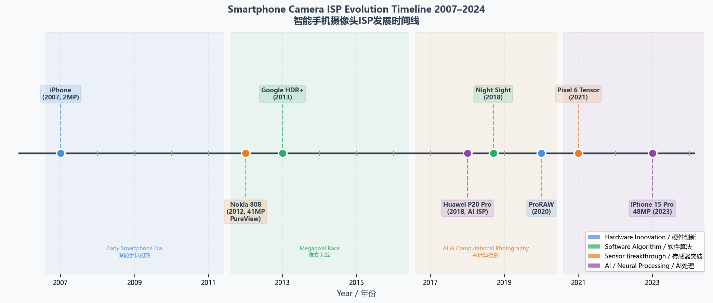
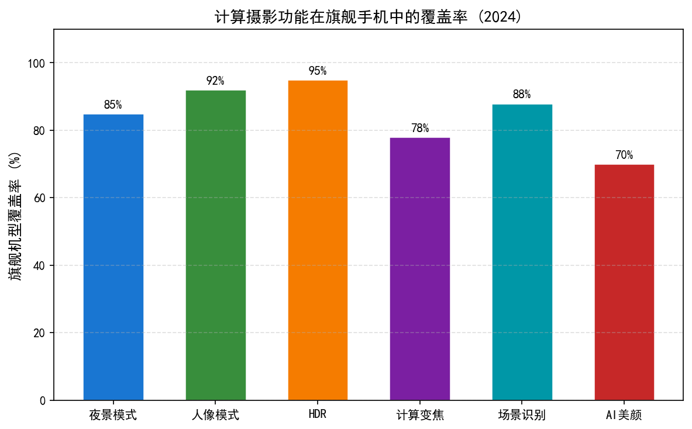
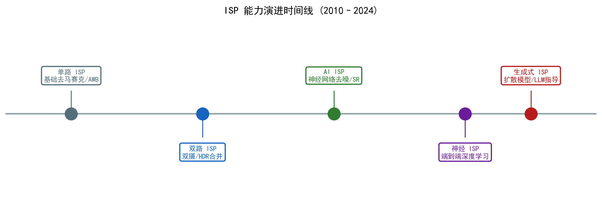
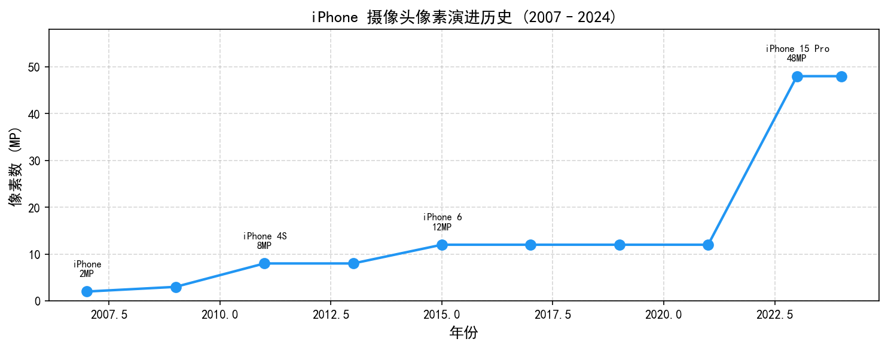
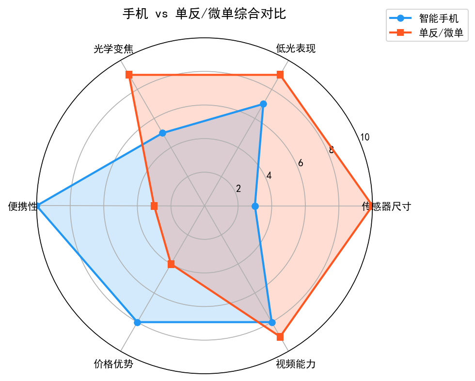
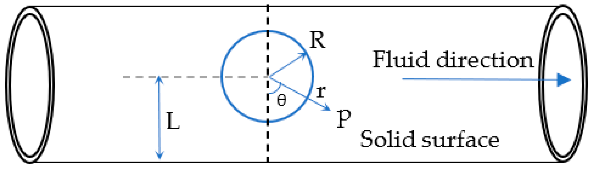
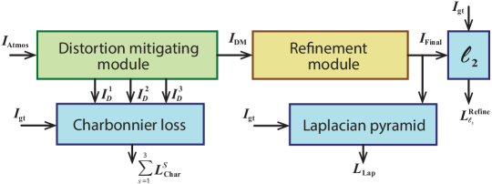
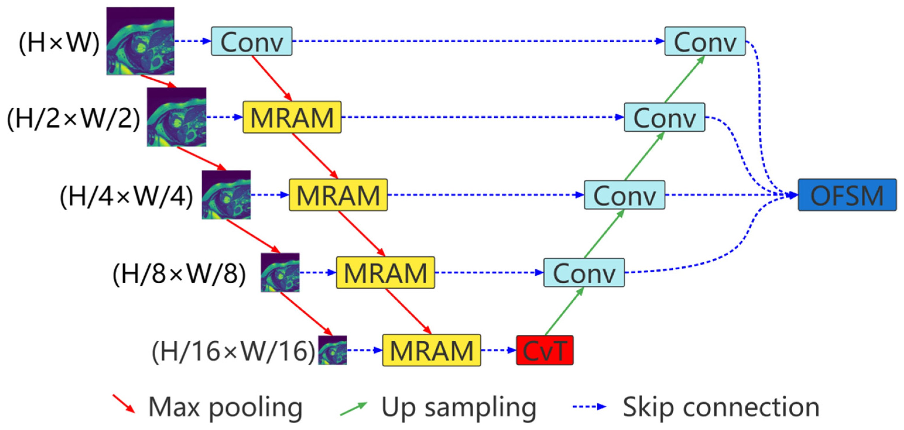

# 第六卷第01章：消费级摄影器材演进与手机计算摄影十年

> **定位：** 本章以摄影史为经、技术创新为纬，梳理消费级影像器材从诞生到今天的演进脉络，重点解析近十年手机摄影的算法演进及各大厂商的核心技术方向
> **前置章节：** 第一卷第07章（动态范围与HDR）、第二卷第17章（亮度测光）、第二卷第18章（局部色调映射）、第二卷第19章（HDR显示信号链）
> **读者路径：** 算法工程师、产品经理、IQA工程师、行业分析师
> **导航说明：** 本章以全景视角串联手册各部分核心主题，适合作为"入门总览"或"复习索引"。深度技术细节请查阅对应章节：光学与传感器→第一卷；传统ISP算法→第二卷；深度学习ISP→第三卷；3A与IQA工程→第四卷；大模型时代→第五卷。

---

## 第六卷导读：从算法模块到用户感知的功能

前五卷讲的是用户感知不到的部分。第一卷是物理底层：光子怎么变成电荷，传感器的物理极限在哪里，光学系统的像差从哪里来。第二卷是传统 ISP 的每一道工序：BLC、去马赛克、降噪、AWB、CCM、色调映射……每个模块的原理、标定、调参、伪影，一项一项说清楚。第三卷开始把深度学习接进来，第四卷讲系统工程和画质评价，第五卷讲大模型时代带来的新玩法。这些算法模块如果工作正常，用户不会注意到它们的存在——只有出问题的时候（紫边、偏色、过磨皮、鬼影），用户才会察觉有什么不对。

第六卷讲的是用户感知得到的部分——那些出现在发布会 PPT 上、出现在影像评测榜单里、用户会主动提起的功能：夜景照出来几乎像白天、一键拍出背景虚化的人像、10×光学变焦走廊尽头的细节……这些功能的底层，是前五卷那些"无感"的算法在特定产品约束下的组合与取舍。

**第六卷的每一章都在回答同一个问题：** 哪些"无感"的算法模块，是这项用户感知功能真正起决定性作用的？它们在不同厂商的产品里是如何被组合、调配、取舍的？为什么同样的技术路线在 A 厂做出了旗舰感，在 B 厂却成了伪影的来源？

| 章节 | 用户感知功能 | 背后的关键算法决策 | 算法来源章节 |
|------|-----------|-----------------|------------|
| ch02 | Google 夜拍亮如白昼 | 多帧对齐优先于单帧大底 | 第二卷ch10、第三卷ch11 |
| ch03 | Apple Deep Fusion 纹理/人像 | 语义引导 RAW-to-RGB 一体化 | 第三卷ch01、第五卷ch01 |
| ch04 | 芯片算力决定功能上限 | 软硬件协同设计的边界在哪里 | 第一卷ch10、第四卷ch12 |
| ch05 | 华为暗光能力跨代 | 颠覆 CFA 换取 1/3 档进光量 | 第一卷ch03、第二卷ch02 |
| ch06 | 三星超高像素"不糊" | Tetrapixel / Nona 像素融合路线 | 第一卷ch17、第二卷ch02 |
| ch07 | 人像虚化边缘干净自然 | 深度估计 vs 语义分割的不同取舍 | 第三卷ch13、第二卷ch27 |
| ch08 | 磨皮/HDR 过度问题 | 过度处理的量化识别与调参约束 | 第二卷ch11、第四卷ch08 |
| ch09 | 视频防抖流畅无果冻 | 帧率/延迟/功耗的三角制约 | 第二卷ch33、第四卷ch16 |
| ch10 | 10×–100× 变焦画质 | 多焦段融合中的对齐误差管理 | 第二卷ch13、第四卷ch14 |
| ch11 | 屏下摄像头能用 | 最低物理信噪比下的算法补偿极限 | 第一卷ch03、第三卷ch02 |
| ch12 | XR 头显实时渲染 | 光场/神经渲染在头显上的工程可行性 | 第一卷ch13、第五卷ch15 |
| ch13 | 手表/眼镜上的摄影 | 超低功耗约束下的算法剪裁 | 第四卷ch15、第五卷ch13 |
| ch14 | 开源工具链复现商业效果 | 商业 ISP 不会告诉你的实现细节 | 第二卷全卷 |

先读前五卷再来读第六卷，会对每个功能背后的算法取舍有具体感；直接从第六卷入手，顺着章节内的技术回引往前查，也能找到感兴趣的算法细节。

---

## §1 摄影史：从铜板到计算摄影

### 1.1 化学成像时代（1826–1970s）

这段历史之所以值得一读，不是为了了解古董，而是因为胶片时代的物理约束和今天手机摄影的软件约束在结构上高度相似——只是从"受限于银颗粒尺寸"变成了"受限于传感器面积"，从"S形H&D曲线"变成了"Gamma/Tone Mapping"。理解这个对应关系，能帮你更直觉地理解为什么ISP要这样设计。

1826年，Niépce 用白蜡板拍下人类第一张永久性照片，曝光时间 **8 小时**。1837年，Daguerre 将曝光时间压缩到几分钟——核心突破是卤化银的感光速度。1887年，Eastman 发明软性胶卷，1900年 Kodak Brownie 售价 1 美元，把摄影从专业带到了普通家庭。这是摄影史上第一次消费级普及，和 2007年 iPhone 把摄影带入手机的逻辑如出一辙。

**胶卷的物理特性与现代ISP的对应关系（这个对应是真实的，不是比喻）：**

| 胶卷参数 | 现代数字对应 | 说明 |
|---------|------------|------|
| ISO 感光度（ASA/DIN） | 传感器 ISO | Kodachrome 64 对应 ISO 64 |
| 卤化银颗粒尺寸 | 像素大小 | 颗粒越大，感光度越高，但分辨率越低 |
| 宽容度（Exposure Latitude） | 动态范围 | 彩色负片约 6–8 EV，反转片约 4–5 EV |
| 色彩曲线（Characteristic Curve） | 色调曲线 | S 形 H&D 曲线是"电影感"的物理来源 |
| 颗粒感（Grain） | 噪声 | 高速胶卷（ISO 1600+）的颗粒今被视为艺术风格 |

对ISP工程师最有用的历史教训来自 SLR 时代（1950s–2000s）的**测光系统演进**：从 1960年代的中央重点平均测光，到 1983年 Nikon Matrix Metering 开始引入分区场景识别，再到 1990年代 Canon E-TTL II 三维矩阵测光——这条路正是今天 AE 算法的前身。尼康 Matrix Metering 的核心思想（分区测光 + 场景类型识别 → 更准确的目标亮度），和今天深度学习 AE 模型的输入特征几乎完全重合。那个时代的工程师没有深度学习，用的是人工设计的场景分类规则，但解决的是同一个问题。

---

### 1.2 数字革命时代（1990s–2010s）

#### 1.2.1 数码单反（DSLR）的崛起

1991年，柯达推出 **DCS 100**——第一台商业化数码相机（130万像素，售价 $13,000），基于尼康 F3 机身，使用 CCD 传感器，每张照片占用约 1.5MB。

DSLR 的普及真正始于 2000 年前后：

| 里程碑机型 | 年份 | 意义 |
|----------|------|------|
| Nikon D1 | 1999 | 第一台面向专业市场的实用 DSLR，275万像素，$5,000 |
| Canon EOS 300D | 2003 | 第一台消费级 DSLR，$899，打破千元壁垒 |
| Nikon D200 | 2005 | APS-C 传感器成为消费级 DSLR 标准 |
| Canon 5D Mark II | 2008 | 第一台全画幅 + 1080p 视频 DSLR，开启"视频革命" |
| Nikon D800 | 2012 | 3600万像素，迫使胶卷扫描级别需求重新定义 |

**DSLR 时代的 ISP 创新：**
- **Bayer CFA 去马赛克** 成为核心算法（参见第二卷第02章）
- **JPEG 机内直出** 需要完整 ISP 流水线：BLC → Demosaic → AWB → CCM → Gamma → JPEG
- **降噪算法** 成为高 ISO 性能竞争的关键（参见第二卷第03章）
- **自动亮度优化（ADL, D-Lighting）：** 尼康 Active D-Lighting、佳能 Auto Lighting Optimizer 均在此时代出现

#### 1.2.2 微单（Mirrorless）的崛起（2008–至今）

2008年，松下 G1 发布，标志着可换镜头无反相机（Mirrorless / ILC）时代开启。无反相机去掉了机械反光镜箱，带来：

- **机身厚度大幅缩减**（约 50mm vs DSLR 的 80mm+）
- **电子取景器（EVF）**：实时显示曝光、白平衡预览
- **相位检测自动对焦集成到传感器**（片上 PDAF，无需独立 AF 传感器）
- **视频性能大幅提升**（无翻转镜延迟）

**全画幅微单战争（2018–至今）：**

| 品牌 | 卡口 | 关键机型 | ISP 亮点 |
|------|------|---------|---------|
| Sony | E 卡口 | A7 IV, A1 | 实时眼部对焦 AI，8K30p |
| Canon | RF 卡口 | EOS R5, R3 | DIGIC X，眼部+头部识别 AF |
| Nikon | Z 卡口 | Z8, Z9 | 无机械快门，主体识别覆盖最广 |
| Fujifilm | X 卡口 | X-T5, GFX100S | 胶片模拟色彩引擎，中画幅数字 |

微单的计算摄影特性：处理器算力使得机内 RAW 处理、实时降噪预览、人脸/眼部追踪 AF 成为可能，是从纯光学向计算摄影过渡的重要节点。

#### 1.2.3 运动相机（Action Camera）：GoPro 与极限场景成像

2004年，Nick Woodman 用胶卷相机和腕带为冲浪者设计了第一台 GoPro；2010年，**GoPro HD Hero** 成为首款高清运动相机，确立了这一品类。

**运动相机 ISP 的独特挑战：**

| 挑战 | 算法应对 |
|------|---------|
| 强烈抖动（运动拍摄） | Hypersmooth EIS（电子防抖，牺牲约 10% 视野角 ） |
| 超广角畸变（170° 视角） | 实时 Fisheye 畸变校正（参见第二卷第15章） |
| 户外强光 + 阴影极端 HDR | WDR（Wide Dynamic Range）+ 局部色调映射 |
| 水下拍摄色偏 | 自动水下白平衡模型（水深 → 红色通道增益补偿） |
| 极小机身散热限制 | 限制 ISO 最高值，优先保画质不保高感 |

**DJI 系列** 从云台稳定切入，逐步建立了完整的运动影像技术栈。Osmo 系列将 3 轴机械防抖与 ISP 结合，解决了手持录像的最大痛点；DJI Action 系列进一步把运动相机推向算法密集型产品——前后双屏、磁吸快换、RockSteady 3.0 EIS 与 HorizonSteady 地平线保持，背后是帧间对齐、EIS 裁剪余量管理和实时 Reframe 的工程集成。2020 年代以来，大疆持续大量引进手机影像和图像算法领域的专业人才，已成为行业内技术迁移的重要目的地之一——熟悉高通/MTK/海思 ISP 调试体系的工程师进入大疆后，往往需要将移动端调参经验移植到无人机和运动相机的散热约束和实时视频流场景下。

**影石 Insta360** 开辟了另一条差异化路线：以全景相机为基础，将 ISP 的核心挑战从单目画质提升为**多目拼接的一致性**。X 系列全景相机的核心算法是双鱼眼镜头的无缝拼接——两个超广角传感器的曝光、白平衡、色调曲线必须在接缝区域高度一致，否则 360° 画面出现明显的亮度断层。Ace Pro 系列转向运动相机方向后，引入索尼大底传感器（1/1.3 英寸），配合自研的专用影像芯片（ISP 芯片），主打夜景降噪和 HDR 动态范围。影石 X5（2025）采用双 1/1.28 英寸索尼 LYT-818 传感器，三芯片架构（5nm AI SoC + 双影像芯片），13.5 档 HDR 动态范围，代表了全景相机在计算摄影密度上的新基准。

| 品牌/产品线 | 核心技术方向 | ISP 关键挑战 |
|------------|------------|------------|
| DJI Action | EIS + 地平线保持 | 帧间对齐、实时裁剪、TNR 与 EIS 协同 |
| DJI Osmo | 机械云台 + ISP 融合 | 云台数据与 EIS 联动、色彩一致性 |
| Insta360 X 系列 | 双目全景拼接 | 多目曝光/AWB 一致性、拼接缝处理 |
| Insta360 Ace Pro | 大底夜景运动相机 | 高 ISO 下 TNR vs 运动清晰度权衡 |

---

### 1.3 手机摄影时代（2007–至今）

#### 1.3.1 智能手机摄影的奠基（2007–2015）

2007年，第一代 iPhone 的摄像头规格烂到不值一提——200 万像素，1/3.2" 传感器，固定光圈，没有任何ISP算法亮点。它改变了摄影行业不是因为拍得好，而是因为照片可以立刻发出去。拍摄质量和分享便利性之间的天平从这里开始向后者倾斜，这个趋势直接定义了之后15年计算摄影的优化方向：**在传感器面积先天受限的条件下，用算法填平画质差距**。

**早期手机摄影的根本限制：**
- 物理传感器尺寸约 1/3.2"（vs 全画幅 36×24mm），传感器面积差距约 70×（全画幅 864 mm²，1/3.2" 约 12.5 mm²；单像素面积差距因像素数而异）
- 固定光圈（通常 f/2.0–f/2.8），无光圈调节自由度
- 无机械快门（无运动模糊控制）
- 极度有限的计算资源（早期 SoC 主频 < 1GHz）

**转折点 — Nokia 808 PureView（2012）：**
- 4100 万像素传感器，通过超采样（Oversampling）合成 5MP 输出，信噪比显著提升
- 首次系统性地证明：**算法可以补偿物理限制**

#### 1.3.2 双摄与人像模式的兴起（2016–2018）

**HTC One M8（2014）：** 第一批双摄手机之一（主摄 + 深度摄）——使用视差计算深度，但实用性有限。

**苹果 iPhone 7 Plus（2016）：** 真正让双摄主流化的里程碑：
- 双 12MP：广角（f/1.8） + 长焦（56mm 等效，f/2.8）
- **人像模式（Portrait Mode）：** 利用双摄视差计算深度图，对背景施加高斯模糊模拟背景虚化
- 将"计算光学"带入主流消费意识

此后，"双摄/三摄/四摄"成为旗舰手机标配，摄影卖点从"像素多少"转向"算法能力"。

---

## §2 手机摄影算法十年（2015–2025）

### 2.1 夜景算法（Night Mode）

2018年前，手机在昏暗环境下的选择只有两个：提高ISO（噪声爆炸）或延长快门（手抖模糊）。Night Sight 把这个问题重新定义为：**既然单帧受限，就用多帧换信噪比**——这个思路把手机暗光能力提升了 5–10 EV，彻底改变了行业。

#### 2.1.1 Google Night Sight（2018）

**发布背景：** 2018年 11 月，Google Pixel 3 系统更新中推送 Night Sight，手机夜景拍摄进入多帧合成时代。

**核心技术：Multi-Frame Processing + Learned ISP**

```
用户按下快门:
  → 连拍 6–15 张短曝光帧（每帧曝光约 1/30s–1/100s，避免运动模糊）
  → 亚像素级对齐（Handheld Video Stabilization，Hasinoff et al., 2016）
  → 合并（Merging）：
      每个像素取所有帧中对应位置的加权平均
      权重由每帧该像素的运动估计决定（运动大 → 降权，避免鬼影）
  → 降噪（多帧平均将噪声降低约 √N 倍）
  → 学习型色调曲线（Neural Network 预测最优亮度/色彩参数）
```

关键论文：**Burst photography for high dynamic range and low-light imaging on mobile cameras**（Hasinoff et al., ACM SIGGRAPH Asia 2016）

**Night Sight 的 AWB 创新：** 传统 AWB 在极暗环境（< 1 lux）下严重失准，Night Sight 使用深度学习模型直接预测场景白点，训练数据来自数千张同场景的白天/夜间配对照片。

#### 2.1.2 华为 P20 Pro AI 夜景（2018）

**传感器设计：** P20 Pro 搭载 4000 万像素 RGB 主摄 + 2000 万像素黑白副摄（Monochrome Camera）。黑白摄像头无 Bayer CFA，感光量约为同规格彩色摄像头的 3–4 倍（无 CFA 滤光损失）。

**夜景算法：**
1. 彩色摄像头提供色彩信息（低噪声要求）
2. 黑白摄像头提供亮度/细节（高感光度）
3. 两路融合：借助黑白图的高SNR细节增强彩色图的亮度层

**AI 场景识别：** 麒麟 970 NPU 实时识别 500+ 场景，夜景下自动切换至多帧合成模式，自动调整 ISO/快门策略。

#### 2.1.3 苹果 Deep Fusion 与 Photonic Engine（2019–2022）

**Deep Fusion（iPhone 11, 2019）：**
- 按下快门前预先拍摄 9 张照片（4 张短曝光 + 4 张中等曝光 + 1 张长曝光）
- 神经网络在像素级别对每张图像进行分析，选择最优曝光用于每个局部区域
- 最优区域合并：高纹理区选短曝光（锐度优先），均匀区选长曝光（SNR 优先）

**Photonic Engine（iPhone 14, 2022）：**
- 在 RAW 域（未压缩的传感器数据阶段）应用深度学习处理，而非 JPEG 后处理
- 中低光环境下 SNR 提升约 2× vs Deep Fusion

#### 2.1.4 三星 NightOgraphy 与 Adaptive Tetra²pixel

**Samsung ISOCELL 传感器创新：**
- **Nonapixel / Tetra²pixel：** 将相邻 3×3 或 4×4 像素在低照下合并为一个大像素，感光面积 9× 或 16×，低照 SNR 提升，代价是分辨率降低（Tetrapixel 为 2×2 = 4合1 中间挡位）
- **自适应策略：** 光线充足时全像素输出高分辨率；低照时合并输出高 SNR

**NightOgraphy 算法（Galaxy S22 Ultra, 2022）：**
- 专用夜景 ISP 通路，针对星轨、宠物夜景、夜间人像分别优化
- 最长支持 30 秒长曝光 + 三脚架检测自动解锁

---

### 2.2 防抖算法（OIS + EIS）

#### 2.2.1 光学防抖（OIS — Optical Image Stabilization）

OIS 通过在镜头内部或传感器上安装陀螺仪驱动的补偿机构，物理抵消相机抖动：

**镜片位移式 OIS（Lens-Shift OIS）：**
- 补偿镜组由音圈马达（VCM）驱动，感应陀螺仪检测到的角速度后，反向位移补偿
- 补偿范围：约 ±0.5°–±1.5°（对应约 3–5 EV 快门速度提升）
- 主流实现：高通 PDAF + OIS 集成方案（Qualcomm Spectra ISP）

**传感器位移式 OIS（Sensor-Shift OIS）：**
- 传感器整体在 X/Y 平面位移（而非镜片）
- 苹果 iPhone 12 Pro Max（2020）首次在 iPhone 上应用
- 补偿行程更大，效果更好；但传感器需要悬浮在弹簧上，机械结构更复杂

**5轴 OIS（Sony Xperia）：** X/Y 位移 + 偏转 + 俯仰 + 旋转，全方向防抖。

#### 2.2.2 电子防抖（EIS — Electronic Image Stabilization）

EIS 通过裁剪传感器输出并动态偏移裁剪窗口，软件实现稳定：

**基础 EIS：** 在传感器的 110% 区域中裁剪 100% 输出，根据陀螺仪数据每帧移动裁剪窗口。代价：有效视场角缩小约 10%。

**Google Cinematic Stabilization（Pixel 5, 2020）：**
- 使用光流法而非简单陀螺仪，分析相邻帧的视觉运动向量
- 比陀螺仪 EIS 处理效果好，但计算量更大

**超稳防抖（Ultra Stable / HyperSmooth）：**
- GoPro HyperSmooth：对整个视频进行两步处理——先陀螺仪补偿，再光流精细修正
- 小米 Action Camera 超稳模式：类似策略，额外引入地平线锁定（Horizon Lock）

#### 2.2.3 OIS + EIS 混合防抖

当前旗舰手机均采用 OIS + EIS 融合策略：

```
OIS 处理高频抖动（> 10Hz，手持颤动）
EIS 处理低频漂移（< 10Hz，行走中的规律抖动）
融合方案：OIS 先处理，EIS 在 OIS 后的残差上补充修正
```

苹果 **Action Mode（iPhone 14, 2022）** 将 EIS 裁剪比例提高至约 27%，实现类云台级别的超稳定，但视场角明显缩小。

---

### 2.3 HDR 算法

#### 2.3.1 Google HDR+（Pixel 1–5, 2016–2020）

HDR+ 是 Google 将 RAW 域多帧合成带入大众市场的早期工作：

**算法流程（Hasinoff et al., 2016）：**
1. 连拍 3–15 帧（全部同曝光短曝，通过合成长曝光提升 SNR；具体帧数由场景亮度动态决定）
2. **参考帧选择：** 选取**整体锐度最高帧**（Laplacian 能量最大帧）作为基准帧；HDR+ 各帧曝光量相同，参考帧由锐度指标决定而非曝光长短
3. **运动对齐：** 使用层次化分块匹配（Gaussian pyramid + tile-based block matching，L2/SSD 最小化）对齐所有帧
4. **时域合并：** 基于 DFT 域的鲁棒合并（对运动鬼影有抑制）
5. **色调映射：** HDRNet 双边网格（参见第三卷第07章）

**HDR+ 的效果：** 相比单帧，多帧合并后 SNR 提升约 $\sqrt{N}$ 倍（$N$ = 帧数），在弱光下相当于 ISO 降低约 4× 同时保持同等曝光量。

#### 2.3.2 苹果 Smart HDR 系列演进

| 版本 | 机型 | 技术要点 |
|------|------|---------|
| Smart HDR 1 | iPhone XS (2018) | 自动多帧曝光合并，二代 Neural Engine |
| Smart HDR 2 | iPhone 11 (2019) | 结合 Deep Fusion，更好的暗部细节 |
| Smart HDR 3 | iPhone 12 (2020) | 针对人像进行专项优化，肤色保护 |
| Smart HDR 4 | iPhone 13 (2021) | 背景 HDR + 前景人像分离，各自优化 |
| Smart HDR 5 | iPhone 15 (2023) | 实时 RAW 域处理，ProRAW MAX 格式 |

**Dolby Vision 视频 HDR（iPhone 12+）：** 苹果是首家在消费级手机上支持 Dolby Vision Profile 8 录制的厂商（参见第二卷第19章），每帧动态元数据实时生成。

#### 2.3.3 三星 LOFIC — 单次曝光 HDR

**LOFIC（Lateral Overflow Integration Capacitor）** 是三星 ISOCELL GN2 传感器（小米 Mi 11 Ultra）和后续多款旗舰传感器引入的核心 HDR 技术：

**传统 HDR 问题：** 多帧 HDR 需要捕获至少 2 帧（短曝 + 长曝），运动场景下高光区域鬼影难以完全消除。

**LOFIC 原理：**

```
标准像素结构：
  光子 → 感光区（FD, Floating Diffusion） → ADC 读出
  → FD 饱和后多余光子"溢出"丢失

LOFIC 结构：
  光子 → 感光区（FD）→ 若 FD 饱和，多余光子流入旁侧的 LC（横向溢出积分电容）
                       LC 容量约为 FD 的 25×（更大的动态范围上限）

读出时：
  暗部/中间调信号：从 FD 读出（高增益，低噪声）
  高光信号：从 LC 读出（低增益，大动态范围）
  两路融合 → 单帧实现约 12 EV 以上动态范围
```

**工程意义：** LOFIC 将手机 HDR 从"多帧时序 HDR"部分转换为"单帧空间 HDR"，对运动场景的鬼影问题有本质改善。

---

### 2.4 多摄系统与感知距离

#### 2.4.1 多摄架构演进

| 时代 | 典型配置 | 代表机型 |
|------|---------|---------|
| 双摄初期（2016） | 广角 + 黑白/深度 | iPhone 7 Plus, Huawei P9 |
| 三摄广角（2018–2019） | 超广 + 广角 + 长焦 | Huawei P20 Pro（2018）, Samsung S10+（2019） |
| 潜望式长焦（2019） | 5× 光学变焦 | Huawei P30 Pro（第一款潜望镜) |
| 四摄/五摄（2020） | 超广 + 主摄 + 4× 光学变焦潜望长焦 + ToF | Samsung S20 Ultra |
| 大底主摄（2022） | 1英寸主摄 + 广角 + 长焦 | Xiaomi 12S Ultra, Sony Xperia Pro-I |
| AI 感知融合（2023+） | 全焦段计算摄影 | iPhone 15 Pro, Pixel 8 Pro |

#### 2.4.2 潜望式长焦（Periscope Zoom）

传统直立式长焦的物理限制：焦距越长，镜组越厚，手机无法容纳超过约 3× 的光学变焦。

潜望式设计将光路折叠 90°：
```
光线入射（正面）→ 直角棱镜（90° 折射）→ 横向潜望镜组 → 传感器
```
折叠后镜组沿手机厚度方向排列，可实现 5×–10× 光学变焦，手机厚度不受焦距限制。

**华为 P30 Pro（2019）：** 第一款实用潜望式手机，5× 光学变焦，数字变焦到 50×。
**Samsung S23 Ultra：** 10× 潜望光学变焦（200mm 等效焦距）+ 主摄 2× → 空间变焦覆盖 1×–100×。

#### 2.4.3 多摄融合 ISP 的挑战

| 挑战 | 算法方案 |
|------|---------|
| 不同焦段的颜色差异 | 跨摄颜色校准（Cross-Camera CCM 一致性） |
| 变焦切换时的跳变 | 平滑变焦（Smooth Zoom）：切换前后过渡帧融合 |
| 视差（不同物理位置） | 视差补偿对齐（参见第二卷第22章） |
| 不同传感器 ISP 特性 | 统一的 ISP 色调目标（所有摄像头输出色彩一致） |

---

### 2.5 各大厂商核心摄影算法（2015–2025）

#### 2.5.1 Google Pixel — 以算法驱动的计算摄影路线

Google Pixel 系列以相对有限的硬件配置实现竞争力较强的算法效果：

| 机型 | 年份 | 核心算法卡点 |
|------|------|------------|
| Pixel 1 | 2016 | HDR+（RAW 多帧合成），单摄人像模式（仅靠算法深度估计） |
| Pixel 2 | 2017 | 视觉核心芯片（Visual Core），HDR+ 处理速度 5× 提升 |
| Pixel 3 | 2018 | **Night Sight**（黑暗环境夜景），Top Shot（最优帧选取） |
| Pixel 4 | 2019 | 天文摄影（Astrophotography，最长 4 分钟多帧合成），双曝光控制 |
| Pixel 6 | 2021 | Google Tensor 芯片，Real Tone（准确还原深肤色），Magic Eraser |
| Pixel 7 | 2022 | Photo Unblur（历史照片去模糊），Cinematic Blur 视频 |
| Pixel 8 | 2023 | Best Take（多人表情合成最佳），Magic Editor（生成式 AI 编辑） |
| Pixel 9 | 2024 | Add Me（自动合影），Reimagine（Gemini 驱动 AI 创意编辑） |

**Google 的技术特点：** 端到端的软硬件控制 + TensorFlow Lite + 大规模训练数据（Google Photos 数十亿张照片）。

#### 2.5.2 苹果 iPhone — 芯片—传感器—算法全链路协同

苹果的策略是芯片—传感器—算法—展示全链路协同优化：

| 技术 | 首发机型 | 年份 | 算法要点 |
|------|---------|------|---------|
| 人像模式 | iPhone 7 Plus | 2016 | 双摄视差深度图 + 背景虚化 |
| 人像光效 | iPhone X | 2017 | 前置 TrueDepth 结构光，仿影室布光 |
| Smart HDR | iPhone XS | 2018 | A12 Neural Engine 实时 HDR 合并 |
| Night Mode | iPhone 11 | 2019 | 多帧长曝合成，手持最长 30s |
| ProRAW | iPhone 12 Pro | 2020 | RAW 域保留 Deep Fusion 数据，给摄影师后期空间 |
| 微距模式 | iPhone 13 Pro | 2021 | 超广摄像头 + 近摄对焦，2cm 最近对焦 |
| ProRes 视频 | iPhone 13 Pro | 2021 | 首款支持 Apple ProRes 视频录制的手机，最高 4K 30fps ProRes |
| Action Mode | iPhone 14 | 2022 | 超稳定 EIS（27% 裁剪），类云台效果 |
| 48MP主摄 | iPhone 14 Pro | 2022 | Quad Bayer 48MP，默认 12MP Pixel Binning 或 ProRAW 48MP |
| Log 视频 | iPhone 15 Pro | 2023 | Apple Log 格式，后期 HDR 调色工作流 |
| Camera Control | iPhone 16 系列 | 2024 | 专用相机控制按键，支持触控滑动调整曝光/对焦；A18 Neural Engine ~35 TOPS（第三方估算，Apple未公开精确值），A18 Pro Neural Engine 35 TOPS（与A17 Pro相同；Wikipedia/PhoneArena确认）；16 Pro 新增 4K 120fps ProRes 视频 |

**苹果的 Photographic Styles（摄影风格，iPhone 13+）：** 区别于传统滤镜，Photographic Styles 仅调整色调和暖度，人像肤色区域受保护不受风格影响——这是语义感知的色彩调整，而非全局 LUT。

#### 2.5.3 华为 — 蔡司光学 + AI 算法

| 机型 | 年份 | 核心卡点 |
|------|------|---------|
| P20 Pro | 2018 | 徕卡三摄，4000万像素，AI 场景识别（19类场景），40MP 黑白+彩色融合夜拍 |
| Mate 20 Pro | 2018 | 徕卡三摄（超广+广角+长焦），10× 变焦，电影级录像 |
| **P30 Pro** | **2019** | **潜望式 5× 光学变焦，50× 数字变焦，RYYB 传感器（R-Yellow-Yellow-B，替换绿色感光单元提升进光量 40% ）** |
| Mate 40 Pro | 2020 | 麒麟 9000，超高速摄影（7680fps 慢动作），XD Fusion |
| P50 Pro | 2021 | 异色双滤光片矩阵（Dual Matrix Camera），XD Optics 光学计算引擎 |
| **Mate 60 Pro** | **2023** | **麒麟 9000s（7nm 国产制程，华为回归旗舰自研芯片），1英寸主摄（RYYB）+ 蔡司光学，支持北斗卫星通话；XMAGE 影像品牌正式确立** |
| **Mate 70 Pro** | **2024** | **麒麟 9020（华为自研，具体制程节点未经官方公开确认），50MP Leica Summilux 主摄，可变光圈 f/1.4–f/4.0（业界最大光圈比，首发于旗舰），XMAGE AI 运动主体追踪增强** |

**RYYB 传感器的原理：** 传统 Bayer 阵列中 50% 的像素是绿色（G），而绿色 CFA 仅透过约 1/3 的可见光频谱。华为将两个绿色像素替换为黄色（Yellow = R + G）滤色片，黄色滤片峰值约 580 nm，覆盖更宽光谱，整体 CFA 平均进光量理论上提升约 35%（纯光通量计算）；华为官方称"提升40%"（含其他系统优化，如 ISOCELL Plus 等级隔离工艺）。代价：去马赛克算法需要重新设计（非标准 Bayer），详见第六卷第05章。

#### 2.5.4 三星 — 传感器自研 + 多摄

三星是全球最大的手机传感器制造商（ISOCELL 系列），同时生产手机和传感器：

| 技术 | 首发/代表 | 年份 | 说明 |
|------|---------|------|------|
| 双像素 PDAF（Dual Pixel） | Galaxy S7 | 2016 | 所有像素用于相位检测，AF 速度质的飞跃 |
| 可变光圈（Dual Aperture） | Galaxy S9 | 2018 | f/1.5 + f/2.4 自动切换，低照用大光圈 |
| 108MP 传感器 | Galaxy S20 Ultra | 2020 | ISOCELL HM1，9合1 像素合并（Nonapixel） |
| 200MP 传感器 | Galaxy S23 Ultra | 2023 | ISOCELL HP2，16合1 Tetra²pixel |
| LOFIC | 小米 Mi 11 Ultra（首发）/ Galaxy S22 Ultra | 2021/2022 | 单帧 HDR，动态范围约 13 EV；GN2 传感器首发于 Mi 11 Ultra（2021年3月） |
| ProVisual Engine | Galaxy S24 | 2024 | 搭载 Snapdragon 8 Gen 3，AI 实时降噪 + 场景优化 |
| **Galaxy S25 Ultra** | **2025** | **Snapdragon 8 Elite，200MP ISOCELL HP9 主摄 + 50MP 潜望长焦（5×），One UI 7 AI 影像功能全面升级** |

**三星 Space Zoom（Galaxy S20 Ultra）：** 主摄 1× → 副摄 4× 光学变焦（48MP 潜望式长焦，S21 Ultra 起升级为真正 10× 光学）→ 混合变焦到 100×，首次在主流消费机上实现三位数数字变焦，尽管 100× 画质有限。

#### 2.5.5 小米 — 徕卡合作 + 1英寸传感器

| 机型 | 年份 | 核心卡点 |
|------|------|---------|
| Mi 11 Ultra | 2021 | 三星 GN2，1/1.12" 超大底传感器，后置小屏 |
| **Mi 12S Ultra** | **2022** | **索尼 IMX989，1英寸传感器（手机史上最大主摄），徕卡色彩调校** |
| Xiaomi 13 Ultra | 2023 | 第二代徕卡合作，主摄索尼 IMX989（1英寸），四颗 Leica 镜头覆盖全焦段，可变光圈（f/1.9–f/4.0） |
| Xiaomi 14 Ultra | 2024 | 全焦段徕卡 Summilux 镜头，光学 120×，Master Lens System |

**1英寸传感器的意义：** IMX989 的单像素面积约 2.56μm²（像素 pitch 1.6μm），是普通旗舰手机传感器的约 2.5×，在相同曝光下信噪比从物理层面大幅提升，是当前手机摄影中减少对算法依赖的最直接方式。

#### 2.5.6 OPPO/OnePlus — 哈苏合作 + MariSilicon 影像芯片

| 机型 | 年份 | 核心卡点 |
|------|------|---------|
| Find X3 Pro | 2021 | 哈苏合作，10-bit 全路径，全像素八向 PDAF |
| Find X5 Pro | 2022 | **MariSilicon X 独立影像芯片**（NPU 专为影像加速），5K 超采样视频 |
| Find X6 Pro | 2023 | 哈苏天文摄影模式，ProXDR 10-bit HDR 显示直出 |

**MariSilicon X 的意义：** OPPO 第一颗自研影像 NPU，专门处理 RAW 域 AI 降噪，算力 18 TOPS（OPPO 官方数据），对标高通 Spectra ISP 但专为 OPPO 算法优化。这是继苹果（Neural Engine）、Google（Tensor）之后，第三家手机厂商自研影像专用芯片。

#### 2.5.7 vivo — 蔡司合作 + RGBW 传感器

| 机型 | 年份 | 核心卡点 |
|------|------|---------|
| X60 Pro+ | 2021 | 蔡司 T* 镀膜（减反射），微云台（微型物理稳定系统） |
| X80 Pro | 2022 | RGBW 传感器（Quad Bayer + 白色像素），夜景进光量 +60% |
| X90 Pro+ | 2022 | 索尼 IMX989 1英寸 + 蔡司合作 + V2 影像芯片（自研） |

**RGBW 传感器：** 将 Bayer 阵列中部分绿色像素替换为无滤色片的白色（W）像素，W 像素接收全波段光，进光量约 2.4× 于普通 G 像素。代价：色彩准确性的恢复算法复杂度提升。

---

## §3 核心算法技术总结对比

### 3.1 夜景算法技术路线对比

| 厂商 | 核心路线 | 关键创新 | 局限 |
|------|---------|---------|------|
| Google | 多帧合成 + 学习型 ISP | Night Sight ML 白平衡 | 运动场景拖影 |
| Apple | 预拍多帧 + Neural Engine | Photonic Engine 在 RAW 域处理 | 硬件成本高 |
| 华为 | RGB + 单色双摄融合 | RYYB 进光量 +40% | 制裁后硬件采购受限 |
| 三星 | Tetra²pixel 像素合并 | LOFIC 单帧 HDR，无鬼影 | 超采样损失分辨率 |
| 小米 | 1英寸大底 + 后期 | 物理优势明显，算法锦上添花 | 机身厚度增加 |

> **工程推荐（手机ISP夜景算法选型）：** 如果传感器面积 ≥ 1/1.5"（如 IMX989），物理底子够，优先把算法资源投在 HDR 合并和色调映射上，而不是多帧降噪的帧数堆砌——物理进光量的优势超过算法补偿的上限。如果传感器面积 ≤ 1/2.5"，多帧合成是绕不开的核心路径，LOFIC 式单帧 HDR 可以作为运动场景的补充而非替代。两类传感器用同一套算法参数是最常见的失误：大底传感器用激进的多帧降噪会丢失真实纹理，小底传感器用保守的降噪策略则噪声压不住。

### 3.2 防抖技术路线对比

| 方案 | 原理 | 优势 | 劣势 |
|------|------|------|------|
| 镜片 OIS | 镜组物理补偿 | 无视场损失 | 行程有限（±1°） |
| 传感器位移 OIS | 传感器整体移动 | 补偿行程更大 | 机械结构复杂 |
| EIS | 裁剪 + 偏移 | 成本低，可软件升级 | 损失约 10–27% 视场 |
| 微云台（vivo） | 微型物理云台 | 低频漂移抑制强 | 体积大 |
| OIS + EIS 融合 | 硬件+软件双重 | 最优效果 | 两套系统成本叠加 |

---

## §4 计算摄影的常见伪影与挑战

用户投诉最多的不是"噪点多"，而是各种计算摄影特有的失效模式——这些在单帧ISP时代根本不存在，是多帧合成和AI增强引入的副作用。

### 4.1 多帧合成鬼影（Ghosting）

**场景：** 夜景模式下运动中的人/车辆，在合并帧时出现半透明重影。

**根因：** 运动对齐算法无法完全匹配所有运动物体，合并时多帧位置不重合。

**缓解：** 基于运动估计的可信度加权（运动快区域降低合并权重，接近单帧）；前景/背景分离（背景多帧合并，前景使用单帧）。

### 4.2 过度磨皮（Over-Smoothing）

**场景：** AI 美颜模型将皮肤纹理识别为"噪声"并过度平滑，使人物失去真实感，呈现蜡像效果。

**根因：** 降噪网络在皮肤区域的目标函数过于侧重平滑度，而非细节保留。

**缓解：** 皮肤纹理损失（Skin Texture Loss）：在训练损失函数中加入高频纹理保留项；或允许用户控制磨皮强度。

### 4.3 HDR 过度色调映射（Over-Tonemapping）

**场景：** 自动 HDR 将高光和阴影都"拉平"，图像显得不自然，失去光线的立体感和戏剧性。

**根因：** 局部色调映射算法参数过于激进（参见第二卷第18章），压缩比过高。

**缓解：** 引入"真实感保留"约束（Natural Feeling Preservation）：通过用户研究确定最大可接受的高光压缩比，避免全部压平。

### 4.4 变焦切换跳变

**场景：** 视频录制中从广角切换到长焦时，画面出现明显的焦段跳变（色彩/亮度/视角的不连续过渡）。

**缓解：** 软件过渡帧（5–10帧双摄信号融合过渡）；跨摄颜色一致性校准（统一两摄像头的色调目标）。

---

## §5 影像评测体系

### 5.1 DXOMark — 行业标准客观评分

DXOMark（法国 DxO Labs 的评测部门）通过标准化测试场景对手机影像质量打分：

| 评测维度 | 测试内容 |
|---------|---------|
| 色彩 | 白天色彩准确性（ΔE vs Macbeth ColorChecker） |
| 噪声 | ISO 系列的信噪比曲线 |
| 动态范围 | EV 数量（白场 - 黑场） |
| 自动曝光 | 各种光照条件下的 AE 稳定性 |
| 夜景 | 低照环境（1 lux, 5 lux, 20 lux）的画质 |
| 变焦 | 各焦段 MTF 分辨率 |
| 防抖 | 手持视频稳定性（EIS/OIS 效果） |
| 人像 | 背景虚化自然度，肤色准确性 |

**DXOMark 评分的局限：** 不能完全反映用户主观体验；在日常拍摄场景（非标准测试条件）下，高分手机不一定适合所有用户审美偏好。

### 5.2 DXOVIDEO — 视频专项评测

从 2019 年起，DXOMark 推出专项视频评测，覆盖稳定性、曝光、色彩、细节、噪声、自动对焦六大维度，对应手机视频录制的完整质量链路。

### 5.3 主观盲测

各大评测媒体（MKBHD、Camera Comparison、Notebookcheck）常采用 A/B 盲测：评测员不知道哪张照片来自哪款手机，仅根据图像质量投票，减少品牌偏见。

---

## §6 代码 (Code)

本章配套代码（见本目录 .ipynb 文件），内容包括：

- **摄影史时间轴可视化：** 关键机型/技术节点的交互式时间轴图（matplotlib + plotly）
- **HDR+ 多帧合成简化版实现：** 读入模拟多帧（带噪声）→ 对齐 → 加权平均 → 输出对比
- **LOFIC 单帧 HDR 模拟：** 模拟双容量像素（FD + LC）的 HDR 合并算法
- **传感器尺寸 vs SNR 理论模型：** 不同传感器尺寸（1/4" 到全画幅）在不同照度下的理论 SNR 对比曲线
- **夜景算法效果可视化：** 单帧 vs 多帧合成在不同 ISO 下的 PSNR/SSIM 对比

---

> **编者注：关于"关键转折点"的判断**
>
> 这一卷试图梳理消费影像的演进脉络，不可避免地要对哪些节点"真正重要"做出判断。以下几点是作者的认识边界说明，供读者参考：
>
> 计算摄影的几个节点确实改变了行业方向：2014 年前后 PDAF 的普及让手机对焦速度第一次追上了入门单反；2018 年 Google Night Sight / HiSilicon Kirin 980 的 Night Mode 把夜景从"拍了能用"变成了"拍了能分享"；2019 年多主摄方案从旗舰下探到中端，让变焦从硬件差异变成了软件差异。这些时间节点在技术文献和媒体测评中有一定共识。
>
> 但"哪款手机真正定义了某个技术"的说法需要谨慎——苹果、华为、谷歌、三星的研发是并行的，发布时间的先后不等于技术发明的先后，商业叙事和技术实质之间往往有差距。
>
> **各家的分化已经足够清晰，可以讲出来。**
>
> 苹果的稳定性、尤其是视频稳定性，目前是一枝独秀——Action Mode 和 Cinematic 背后的 EIS/OIS 联动和视频调色一致性，其他厂商整体还在追。
>
> vivo 的影调几乎是一骑绝尘，X 系列的色彩倾向和曝光策略有鲜明的审美立场，蔡司（Zeiss）合作带来的自然色彩还原和人文纪实风格，在国内高端市场的影调辨识度最高。
>
> OPPO 的人像可圈可点，背景虚化的自然度和肤色处理的稳定性积累了多年，Find X 系列的长焦人像在高光控制上尤为成熟。
>
> 小米的逆光处理和与徕卡（Leica）的深度合作带来了扎实的色彩风格积累，超广角和长焦的 RAW 域算法也在持续投入，Hyper OS 相机的可调性比竞品更开放。
>
> 华为的 XMAGE 影像体系在硬件层面做到了旗舰档的完成度上限——P60 Pro 的可变光圈（F1.4–F4.0 十档光圈叶片）是消费手机里为数不多的真物理光圈，独特的"红枫影像"色彩哲学追求暖调、层次感强、高光收敛自然，拍出的画面有一种胶片质感的厚重。RYYB 传感器在极暗光下的进光量优势也是实打实的硬件积累，整套系统的完成度在旗舰档中不输任何竞品。
>
> 荣耀与巴黎雅顾摄影工作室（Yagu Paris）的合作代表了另一类差异化路径——雅顾以人像摄影的艺术质感和独特光影美学见长，与荣耀 200 系列的深度影像合作将这种人文摄影风格落地到手机端，定制水印也成为样张的标志性亮点。这条路子的核心是"更有氛围更有腔调"，而非"更清晰更亮"，是风格层面的差异化，不是能力层面的。
>
> 目前综合拍照表现 vivo 整体领先，但不是断档式的领先——差距在用户感知的边界内，换句话说，这已经是一场风格竞争，不再是能力竞争。选哪家，取决于你更认同哪种审美。
>
> 手机以外，**大疆和影石**在运动影像赛道上的成绩也值得单独一说。大疆在视频稳定性上的技术积累已经超出了消费级手机可以企及的区间——RockSteady + HorizonSteady 的组合在复杂运动场景下的防抖效果，目前仍是行业标杆，这背后是大疆对帧间对齐、EIS 裁剪余量和实时视频流 ISP 的长期投入。大疆近年大量从手机影像领域引进算法和调参工程师，已经成为行业专业人才流向的重要节点。影石 Insta360 则以全景和运动相机为基础，在多目一致性拼接和大底夜景运动相机领域做出了自己的技术积累，X5 的三芯片架构代表了全景相机计算密度的新水位。这两家公司的产品，提醒我们"最好的影像"不只发生在手机里。

---

> **工程师手记：手机 ISP 演进的三个关键拐点**
>
> **从硬件竞速到软硬协同：演进逻辑的根本转变：** 2010-2016 年的手机 ISP 竞争本质是传感器像素与光学镜头的军备竞赛，索尼 IMX 系列与三星 ISOCELL 的像素密度每年提升 30% 左右。真正的范式转移发生在 2018 年：Google Night Sight 证明"计算摄影可以弥补物理光学的差距"——在光圈/传感器尺寸不变的前提下，通过 burst 合成将暗部 SNR 提升约 12dB，等效于传感器面积增大 16 倍。这迫使所有主流厂商在 2019-2020 年完成从"ISP 是相机子系统"到"ISP 是核心算法竞争力"的战略重定位，进而推动 Apple ProRAW（2020）、三星 Expert RAW（2021）等将 ISP 算法链路向用户侧开放。
>
> **三大里程碑的工程含义：** Night Sight（2018）首次在消费级产品中验证了多帧对齐+去噪的实时 pipeline 可行性，核心挑战是将 15 帧对齐的计算量压缩到 <3s（Pixel 3 的 Pixel Visual Core 加速）；ProRAW（2020）的意义在于将 Apple 的多帧 HDR 合成结果以 DNG 格式导出，首次实现了端侧计算摄影结果与桌面后期工作流的连接；Pixel 6 Tensor（2021）则标志着手机厂商自研 ISP 芯片的开端——Google 将 ISP 与 TPU 集成在同一 SoC 中，实现了 RAW 数据不出 SoC 的端到端 DL 处理，功耗比外挂 NPU 方案降低约 35%。
>
> **DJI 与 Insta360 的行业摄影 ISP 差异化路径：** 消费手机 ISP 的优化目标是"单张极致画质"，而行业相机 ISP 的优化目标是"连续稳定输出"。DJI Osmo Action 4 的 ISP 针对运动防抖优化：EIS 算法优先级高于 NR，可接受轻微画质损失以换取防抖流畅度；其 D-Log M 色彩管线保留了 10bit 宽容度以适配后期调色工作流，与手机 ISP 的"直出好看"导向截然相反。Insta360 的全景 ISP 挑战在于六路鱼眼图像的实时拼接（每路 RAW→YUV 独立处理后拼接），其自研拼接 ISP 的缝合误差控制在 <0.5px（4K 分辨率下），这是通用手机 ISP 无法满足的垂直需求。
>
> *参考：Night Sight: Seeing in the Dark on Pixel Phones (Google AI Blog, 2018)；Apple ProRAW Technical White Paper (Apple Inc., 2020)；Google Tensor SoC Architecture Overview (Google I/O 2021)*

## 插图



*图1. 移动ISP技术演进路线*



*图2. 计算摄影市场规模趋势*



*图3. ISP发展时间线*



*图4. 手机摄像头发展历程*



*图5. 手机与单反相机对比*



*图6. 智能手机ISP处理流水线*




*图7. 移动摄影技术综述框架*


*图8. 手机摄像头传感器技术演进历程——从VGA（2000年）到1英寸大底传感器（2023年），像素尺寸、堆叠架构（BSI/Stacked）与多摄系统的十年技术路线（图片来源：作者，ISP手册，2024）*

---

## 习题

**练习 1（理解）**
从胶片到计算摄影，分辨率的提升路径经历了多个阶段：35mm 胶片等效约 2000 万像素、早期手机摄像头仅数十万像素、2024 年旗舰手机可达 2 亿像素（尽管有效感知分辨率远低于标称值）。请分析：分辨率提升对消费摄影体验的边际收益为何在约 1200 万像素后显著递减？在有限传感器面积下，继续提高像素数对动态范围、低光噪声和衍射极限有何负面影响？

**练习 2（分析/比较）**
2016–2024 年间手机摄影评分体系（如 DXOMark）经历了显著变化：从早期主要评测静态 IQ 指标（分辨率、噪声、动态范围），逐步加入视频、变焦、夜景等维度。请分析这一演变背后的产业驱动力：是用户需求的真实变化，还是手机厂商营销策略对评测维度的影响？DXOMark 评分体系是否存在系统性偏差，导致某类用户场景被低估？

**练习 3（实践）**
选取 2016 年、2019 年、2022 年各一款代表性旗舰手机（如 iPhone 7、iPhone 11、iPhone 14），在相同场景（室内自然光人像、户外夜景）下对比拍摄结果。分析三个时间节点之间最显著的画质跃升来自哪个算法或硬件变化（如双摄 vs 单摄、计算 HDR、神经渲染引擎），并讨论每次跃升对用户感知的实际影响。

## 参考文献

[1] Newhall, *The History of Photography*, Museum of Modern Art, 1982.

[2] Hirsch, *Seizing the Light: A Social History of Photography*, McGraw-Hill, 2008.

[3] Eastman, "Kodak Camera — US Patent 388,850", 专利文献, 1888.

[4] Hasinoff et al., "Burst photography for high dynamic range and low-light imaging on mobile cameras", *ACM SIGGRAPH Asia*, 2016.

[5] Liba et al., "Handheld mobile photography in very low light (Night Sight)", *ACM SIGGRAPH Asia*, 2019.

[6] Liu et al., "Bundled camera paths for video stabilization", *ACM SIGGRAPH*, 2013.

[7] Karpenko et al., "Digital video stabilization and rolling shutter correction using gyroscopes", *Stanford CSTR*, 2011.

[8] Samsung Semiconductor, "ISOCELL HP1/GN2 Technical White Paper", *官方文档*, 2022. URL: https://semiconductor.samsung.com/image-sensor/

[9] Sony Semiconductor Solutions, "IMX989 Product Brief", *官方文档*, 2023. URL: https://www.sony-semicon.com/

[10] DXOMark, "DXOMark Mobile Camera Database", 公开评测数据库, 2023. URL: https://www.dxomark.com

[11] Apple, "iPhone 15 Pro Camera System Technology Overview", *官方文档*, 2023. URL: https://www.apple.com/iphone-15-pro/

[12] Google, "Pixel 8 Computational Photography", *博客*, 2023. URL: https://blog.google/products/pixel/
[13] Huawei, "P30 Pro Camera Technology Deep Dive", *公开演讲*, 2019.
