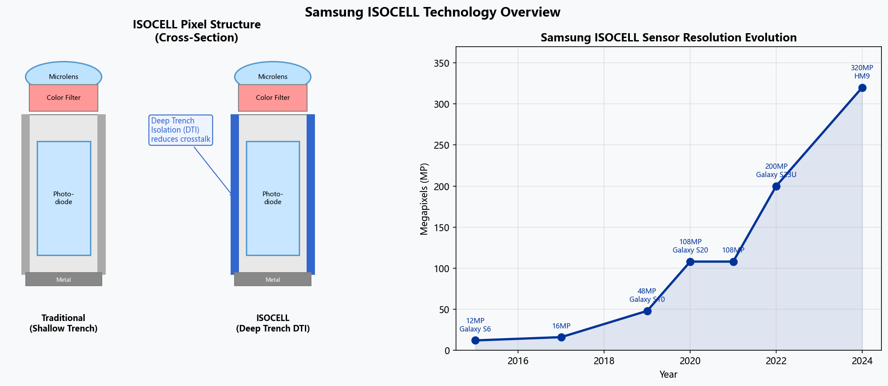
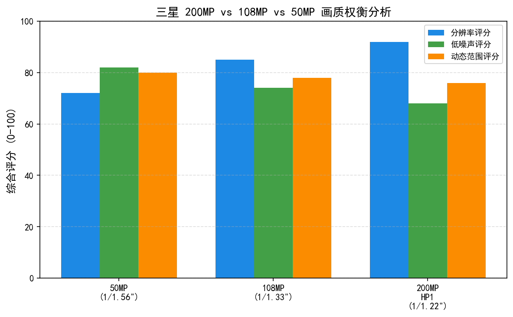
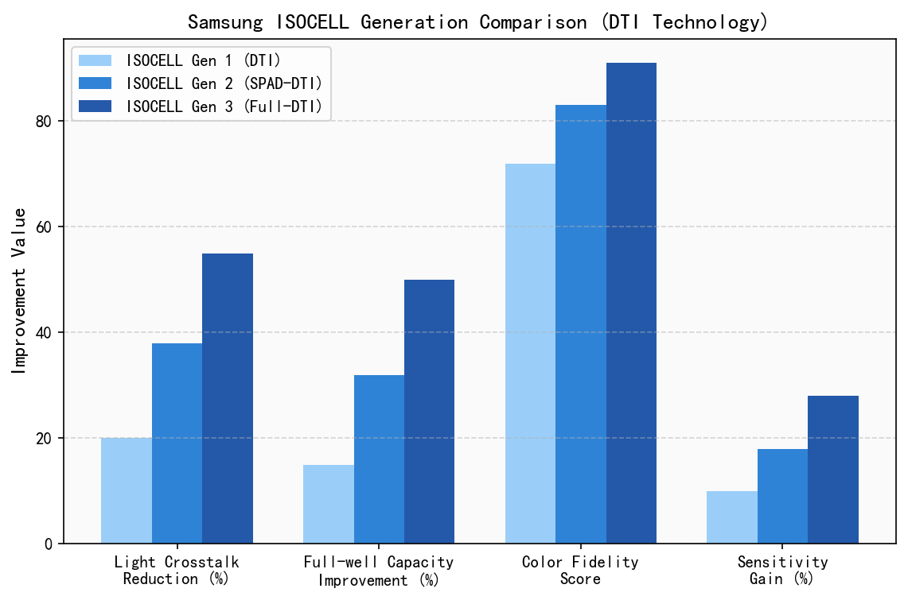
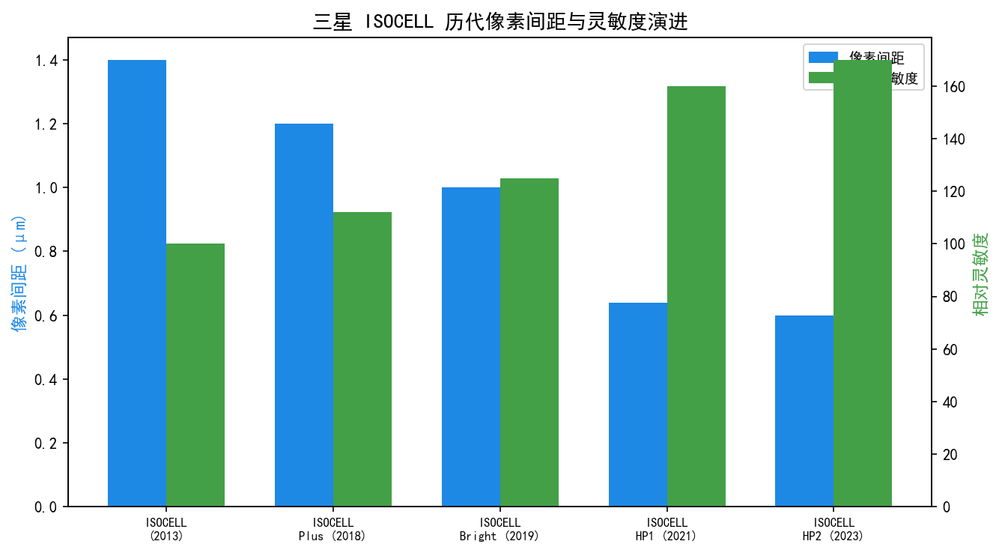
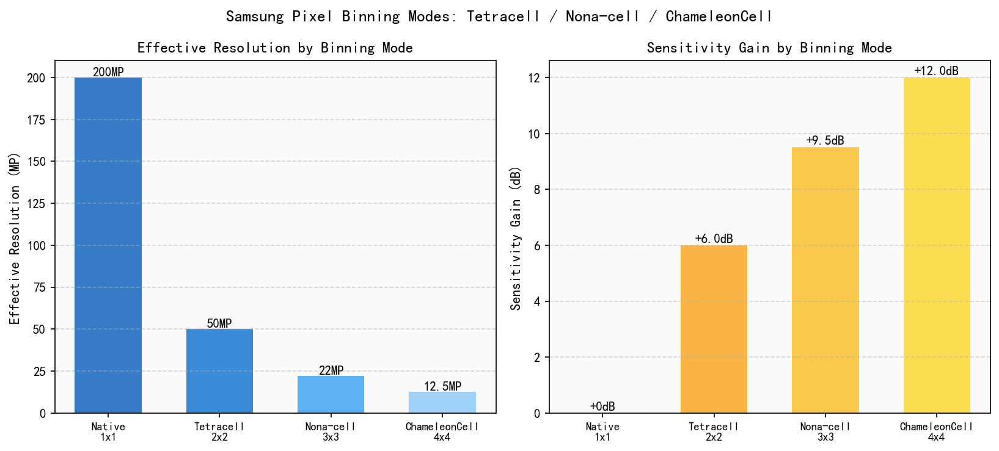
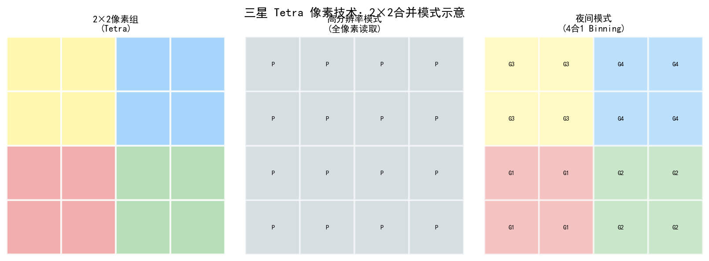
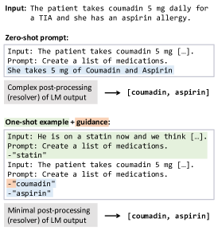
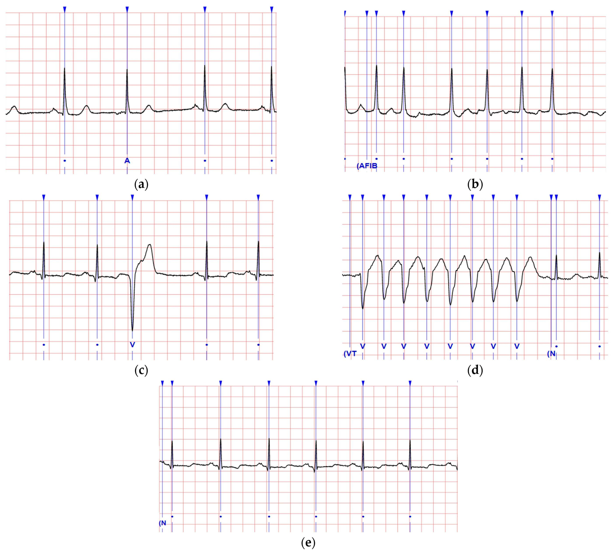

# 第六卷第06章：三星ISOCELL、Tetra Pixel与AI-ISP技术栈

> **定位：** 本章深度解析三星ISOCELL传感器技术体系，从像素隔离工艺到超高分辨率像素合并（Pixel Binning），再到AI-ISP引擎，覆盖原理、工程实现与调参要点
> **前置章节：** 第六卷第01章（消费级摄影演进）、第一卷第06章（RAW格式与CFA）、第二卷第02章（去马赛克）
> **读者路径：** 算法工程师、传感器工程师

> **本章技术索引（用户感知功能 → 背后关键算法 → 手册章节）**
>
> | 用户感知功能 | 背后的关键算法决策 | 算法来源章节 |
> |-------------|-----------------|------------|
> | 2亿像素不糊（全像素输出） | Tetra²pixel/Nonapixel 自适应合并切换策略 | 第一卷第17章（传感器像素合并） |
> | 暗光合片不噪（低照像素合并） | CFA 布局与去马赛克重设计（非标准拜耳阵列） | 第二卷第02章（去马赛克） |
> | 单帧 HDR 无鬼影（LOFIC） | 双容量像素 FD+LC 读出融合，替代多帧时序 HDR | 第一卷第03章（传感器物理） |
> | 快速精准对焦（全像素双核） | 片上所有像素参与相位检测，消除独立 PDAF 像素 | 第一卷第06章（RAW格式与CFA） |
> | AI实时降噪（ProVisual Engine） | SoC NPU 片上 RAW 域神经网络降噪 | 第三卷第20章（DL降噪总览） |

---

## §1 ISOCELL技术基础 (ISOCELL Technology Foundation)

### 1.1 传统像素隔离的困境

手机传感器的像素越做越小，到 1.2 µm 以下时碰到了一个物理硬墙：相邻像素之间的浅沟槽隔离（STI）挡不住光生电子越界迁移，颜色开始互相污染。0.9 µm 像素下色彩串扰可以达到 8%–12%（Samsung 内部测试数据，2018），红色通道里有约 10% 的信号来自邻居的绿色像素——这不是算法能修的问题，必须从材料和工艺上解决。这就是 ISOCELL 要做的事。

电气串扰的后果体现在两个维度：
- **空间串扰（spatial crosstalk）：** 某一像素产生的光生电子泄漏至邻近像素，导致图像中出现扩散边缘（blurred edges）；
- **色彩串扰（color crosstalk）：** 光生电子越过 CFA（Color Filter Array）边界进入错误颜色通道，使绿色像素"污染"到红/蓝通道，降低色彩保真度。

定量上，传统 STI 隔离在 0.9 µm 像素下的色彩串扰可达 **8%–12%**（Samsung 内部测试数据，2018）**[1]**，意味着红色通道中有约 10% 的信号实际来自相邻绿色像素的泄漏。

### 1.2 ISOCELL：物理高分子壁隔离

三星于2013年提出 **ISOCELL（Inter-pixel isolation cell）** 技术，其核心思想是在每个像素四周构建物理高分子隔离壁（polymer wall），彻底取代单纯依靠材料电特性的 STI 方案。

隔离壁的作用原理：
1. 物理阻断光生电子的横向迁移路径（carrier blocking）；
2. 形成光学腔体（optical cavity），减少相邻像素间的光子散射；
3. 降低底部 p-n 结附近的表面复合（surface recombination），提升量子效率。

工程效果：相比同代传统工艺，ISOCELL 可在维持色彩串扰的同时将**全满阱电容（Full Well Capacity，FWC）提升约30%** **[1]**，等效提升了像素的最大光子容纳能力，从而拓展单帧动态范围。

### 1.3 ISOCELL Plus (2018)：有机材料替代金属隔离格

2018年三星推出 **ISOCELL Plus**，将隔离壁材料从传统金属格（metal grid）改为新型有机材料（organic material grid），解决了金属格的两大问题：

| 问题 | 金属格（ISOCELL 原代） | 有机材料（ISOCELL Plus） |
|------|------------------------|--------------------------|
| 光子吸收损失 | 金属对入射光有一定吸收，减少到达光电二极管的光子数 | 有机材料折射率更优，反射损失更小，进入像素的光通量提升约 **15%** |
| 与 CFA 粘附性 | 金属与彩色滤光片材料热膨胀系数差异较大，温度循环后易产生界面分层 | 有机材料与 CFA 相容性好，制造良率和长期可靠性提升 |

### 1.4 ISOCELL 2.0 (2020)：彩色滤光片材料升级

**ISOCELL 2.0** 对彩色滤光片（Color Filter）材料本身进行了重新配方。新一代CFA材料对目标波段的光子吸收系数（absorption coefficient）提升，使得**光吸收效率提高约12%**，同时在可见光谱400–700 nm范围内保持更窄的通带（passband），有利于降低色彩串扰。

定量影响：
$$\text{SNR}_\text{improvement} = 10\log_{10}\left(\frac{\eta_\text{new}}{\eta_\text{old}}\right) \approx 10\log_{10}(1.12) \approx +0.5\ \text{dB}$$

其中 $\eta$ 为像素量子效率（QE）。0.5 dB 的 SNR 提升幅度看似不大，但对于夜景多帧融合算法（如三星的 Nightography），每帧基底 SNR 的提升可以减少达到目标 SNR 所需的融合帧数，间接降低运动鬼影（motion ghost）概率。

### 1.5 关键指标体系

| 代际 | 年份 | 隔离方案 | FWC提升 | 光通量提升 | 色彩串扰 |
|------|------|----------|---------|-----------|---------|
| 传统 STI | ~2012 | 浅沟槽 | 基准 | 基准 | ~12% |
| ISOCELL | 2013 | 物理高分子壁 | +30% | +0% | ~6% |
| ISOCELL Plus | 2018 | 有机材料壁 | +30% | +15% | ~4% |
| ISOCELL 2.0 | 2020 | 有机壁+新CFA | +30% | +27% | ~3% |
| ISOCELL Gen 2 | 2022 | 钨（W）金属隔离壁+优化DTI | +30% | +30% | ~2% |
| ISOCELL Gen 3 | 2023 | 新一代有机壁+超窄DTI | +30% | +35% | ~1.5% |

ISOCELL Gen 2（2022）将隔离壁材料升级为钨（Tungsten，W）金属隔离壁，配合优化DTI（Deep Trench Isolation）材料，进一步降低色彩串扰；ISOCELL Gen 3（2023）通过超窄DTI工艺将色彩串扰压至约1.5%，同时引入**Smart-ISO Pro**技术——支持三档增益路径（高/中/低增益，HCG/MCG/LCG），相比GN2的双路LOFIC进一步扩展单帧动态范围至约14–15 EV，HP2等200MP传感器均基于Gen 3工艺。

---

## §2 双像素相位检测自动对焦 (Dual Pixel PDAF)

### 2.1 工作原理

传统 PDAF 的逻辑是：分出一部分像素专门测相位，剩下的像素才成像。代价是成像区域有缺失，RAW 里有黑/白线，要用专门的替换算法修复，而且覆盖率通常只有 8%-20%。Galaxy S7（2016）的 **Dual Pixel PDAF** **[1]** 把这个逻辑彻底翻转：每个像素一分为二——左半光电二极管（Left PD）和右半光电二极管（Right PD），同时承担测相位和成像两件事，100% 覆盖，无任何像素牺牲。

从光学角度，左半像素和右半像素分别接收经过镜头左侧孔径（left aperture）和右侧孔径（right aperture）入射的光线。当被摄物体处于精确对焦平面时，左右子像素接收到的光强分布完全对称，相位差为零。当物体偏离对焦平面时，左右子像素之间出现系统性相位差（phase difference），相位差方向指示对焦方向（前/后焦），幅值正比于离焦量（defocus amount）。

相位差与离焦量的关系：

$$d = \frac{\phi \cdot f}{2 \cdot (1/F\#) \cdot p}$$

其中：
- $d$：离焦量（米）
- $\phi$：左右子像素信号的相位差（像素单位）
- $f$：镜头焦距
- $F\#$：光圈数
- $p$：像素间距（pitch）

### 2.2 100% PDAF覆盖率的意义

传统 PDAF（如 Nikon D850 的 693 点 PDAF 阵列）仅在特定位置布置专用 PDAF 像素，这些像素用金属遮盖单侧，在 RAW 图像中表现为线状亮/暗缺陷，需要由 PDAF 替换算法（PDAF pixel replacement）进行修复，损失真实成像信息。

Dual Pixel 的全像素覆盖在三个维度上改善了工程指标。

1. **对焦速度（AF speed）：** S7 在充足光线下对焦时间从约 0.5 s 缩短到 **0.03 s**（Samsung 官方数据）**[1]**，提升约16倍。在 1/100 s 运动目标场景中，对焦速度决定了是否能抓住决定性瞬间；
2. **暗光对焦（Low-light AF）：** 任意区域均有相位信息，无需依赖对比度爬山（contrast detection）算法，在 -2 EV 以下依然保持可靠的相位对焦；
3. **SNR 无损：** 完成对焦测量后，左右子像素信号直接相加（Left PD + Right PD = full pixel signal），灵敏度与单像素完全相同，无需牺牲光子收集面积。

### 2.3 与传统PDAF的性能对比

| 指标 | 传统PDAF（2015年旗舰） | Dual Pixel（S7，2016） |
|------|------------------------|------------------------|
| AF覆盖率 | ~8%–20%（专用像素） | **100%** |
| 对焦速度（好光） | ~0.5 s | **~0.03 s** |
| 暗光最低对焦亮度 | -1 EV | **-4 EV**（S23 Ultra） |
| RAW数据损失 | 有（专用像素需修复） | 无 |
| 传感器面积开销 | 低（专用像素较少） | 中（每像素两个sub-PD） |

### 2.4 Dual Pixel Pro（ISOCELL GN2，2021）

标准 Dual Pixel 的相位分割方向只有**水平**一种——左/右子像素分别采集经过镜头左侧孔径和右侧孔径的光线，仅对水平方向的离焦有最高灵敏度，对垂直方向的线条（竖线纹理）检测能力偏弱。三星在 ISOCELL GN2（2021）上将 Dual Pixel 升级为 **Dual Pixel Pro**，将子像素分割方向同时引入**垂直**维度，形成四方向（全向）相位检测能力。

工程实现上，GN2 的 Dual Pixel Pro 像素分为四个子象限（2×2 sub-PD），行方向合并得到水平相位对，列方向合并得到垂直相位对，两路相位信号独立送入 AF 控制器做矢量合成，AF 判断离焦方向不再受纹理方向约束：

- **横纹场景（如百叶窗、斑马线）：** 标准 Dual Pixel 水平相位几乎为零，需回退到对比度 CDAF；Dual Pixel Pro 垂直相位有效，维持 PDAF 全速对焦；
- **低对比度过渡区：** 两路相位矢量合成后整体置信度更高，可在 -4 EV 以下维持可靠 PDAF（GN2 官方指标：-4 EV 以下依然可对焦）；
- **全像素相位密度：** 与标准 Dual Pixel 相同，保持 100% 覆盖率，左右+上下四路子像素相加恢复全像素亮度，无光收集损失。

Dual Pixel Pro 代表三星在 PDAF 方向的关键迭代节点，此后 GN3、GN5 等 50MP 主摄传感器均沿用并进一步优化了这一全向 PDAF 架构。

---

## §3 像素合并技术 (Pixel Binning Technology)

### 3.1 Nonapixel：9合1合并（2019）

三星于2019年在 108MP ISOCELL Bright HMX（小米Note 10首发）上引入 **Nonapixel**（Nona = 九，pixel = 像素）技术 **[1]**，将 3×3 = 9 个相邻像素合并为一个超像素（super-pixel）。

合并效益分析：

$$\text{SNR}_\text{9-in-1} = \text{SNR}_\text{single} \cdot \sqrt{9} = 3 \times \text{SNR}_\text{single}$$

$$\text{等效像素面积}_\text{merged} = 9 \times A_\text{single}$$

以 ISOCELL HMX 为例：
- 单像素像素间距（pixel pitch）= 0.8 µm，面积 = 0.64 µm²
- 9合1后等效像素间距 = 2.4 µm，面积 = 5.76 µm²（接近 Sony IMX586 的 0.8 µm 等效2.4 µm大底）
- 108 MP → 12 MP after 9:1 binning
- SNR 提升 3× → 约 +9.5 dB，相当于感光度提升约 **3 档（stops）**

然而 Nonapixel 在 Bayer 域的实现并非简单加法：9个像素中涉及R、G、G、G、G、B（以中心像素为基准的 Quad-Bayer 超采样 3×3 块）的不均匀分布，需要按颜色通道分别合并，而非跨颜色累加，以避免色彩错误。

### 3.2 Tetra²pixel (2023)：16合1与200MP ISOCELL HP2

2023年三星发布 **ISOCELL HP2**（200 MP，搭载于 Galaxy S23 Ultra）**[2]**，配合 **Tetra²pixel** 技术实现 4×4 = 16 像素合并（同时支持 2×2 = 4 合 1 的 Tetrapixel 中间挡位）。

HP2 规格：
- 分辨率：200 MP（16384 × 12288）
- 像素间距：0.6 µm（全分辨率时）
- 4合1 binning 后：50 MP，等效 1.2 µm 像素
- 16合1 binning（4×4）后：12.5 MP，等效 2.4 µm 像素

Tetra²pixel 的自适应切换策略（Adaptive Pixel Strategy）：

| 光线条件 | 模式 | 分辨率 | 等效像素尺寸 |
|----------|------|--------|-------------|
| 充足日光（EV ≥ 12） | 全分辨率 | 200 MP | 0.6 µm |
| 室内（6 ≤ EV < 12） | 4合1 | 50 MP | 1.2 µm |
| 低光/夜景（EV < 6） | 16合1 | 12.5 MP | 2.4 µm |

从信号处理角度，自适应模式切换本质上是一种**动态量化方案**：在高光场景中保留空间分辨率（trading SNR margin for resolution），在暗光场景中以分辨率换取SNR（trading resolution for SNR）。

### 3.3 Quad Bayer去马赛克挑战

Tetra²pixel 传感器的 CFA 排布采用 **Quad Bayer（四拜耳）** 模式——每个2×2 同色像素块共同构成一个逻辑"大像素"，整体排布如下：

```
R  R  G  G  R  R  G  G
R  R  G  G  R  R  G  G
G  G  B  B  G  G  B  B
G  G  B  B  G  G  B  B
R  R  G  G  ...
R  R  G  G
```

这种 CFA 对标准 Bayer 去马赛克（如 AHD、DLMMSE 算法）存在以下困难。

1. **混叠（Aliasing）问题：** 在全分辨率模式下，2×2 同色块内没有跨颜色的采样，低频色彩信息可以重建，但高频色彩细节（如精细的彩色纹理）存在天然采样不足；
2. **专用 Quad Bayer Demosaic 算法：** 必须先将 Quad Bayer RAW 转换为等效标准 Bayer（通过邻域差值估计），再执行标准去马赛克；或直接设计针对 2×2 block 结构的联合去马赛克算法（如三星 ISOCELL 白皮书 **[1]** 中描述的 "Remosaic" 预处理步骤）；Wronski 等人 **[6]** 的多帧超分研究也探讨了 Quad Bayer 类传感器的重采样对策；
3. **Remosaic硬件加速：** HP2 配套的 Exynos/Snapdragon ISP 均含专用 Remosaic 硬件块，将 200MP Quad Bayer RAW 转换为 200MP 标准 Bayer RAW，再交由标准 demosaic 流水线处理；延迟约 15–30 ms（取决于平台）。

Remosaic 的核心算法可简化为：对每个位于 Quad Bayer 块边界的像素，用梯度加权的跨色块插值替代同色块均值，恢复出标准 Bayer 的颜色空间采样分布。

---

## §4 LOFIC：单帧高动态范围技术 (LOFIC Technology)

### 4.1 标准像素架构的动态范围瓶颈

标准 4T 像素架构中，光生电子从光电二极管（Photodiode，PD）转移至浮置扩散节点（Floating Diffusion，FD），经放大器（Source Follower）读出后送 ADC 量化 **[7]**。FD 节点的电荷容量（FD Capacitance）决定了像素的**全满阱电容（Full Well Capacity，FWC）**，通常在 1.0 µm 像素上约为 **3,000–6,000 e⁻**（电子数）**[8]**。

在强光照条件下，FD 节点迅速饱和：

$$\text{Saturation}_\text{time} = \frac{FWC}{Q_\text{photon\_rate}} = \frac{FWC}{E \cdot A_\text{pixel} \cdot \eta \cdot \lambda / (h\nu)}$$

亮度 EV=15（晴天阳光直射）条件下，0.6 µm 像素的 FD 饱和时间约为 1/30,000 s，而曝光时间通常为 1/1000 s，导致高光区域严重过曝。传统对策是缩短曝光或减小光圈，但这会牺牲暗部 SNR。

### 4.2 LOFIC工作原理

**LOFIC（Lateral Overflow Integration Capacitor，侧向溢出积分电容）** 是三星在 ISOCELL GN2（2021）上首次量产的像素架构创新 **[1]**。其核心是在标准 FD 节点旁侧增加一个额外的侧向电容（Lateral Capacitor，LC）。

LOFIC 的信号路径双模态工作：

**模式一：高增益路径（HG path，暗部/中灰）**
- FD 节点独立工作，转换增益（Conversion Gain，CG）维持高值（High Conversion Gain，HCG）
- 读出噪声低（典型 1–2 e⁻ RMS），适用于暗部细节信号
- 满阱容量受限于 FD：约 3,000–6,000 e⁻

**模式二：低增益路径（LG path，高光）**
- FD + LC 并联工作，CG 降低（Low Conversion Gain，LCG），但总电荷容量扩大约 **25×**（ISOCELL GN2 规格）
- 可容纳约 75,000–150,000 e⁻，适用于高亮区域而不饱和
- 读出噪声增大（约 5–8 e⁻ RMS），但高光区散粒噪声主导，读出噪声不是限制因素

### 4.3 单帧HDR合并

LOFIC 实现单帧HDR（Single-frame HDR）的数学模型：

设某像素在标准曝光下的光子数为 $N_\text{photon}$：

$$V_\text{HG}(i,j) = \min\left(N_\text{photon} \cdot \text{CG}_H,\ V_\text{sat,HG}\right) \quad \text{（高增益，FD仅）}$$

$$V_\text{LG}(i,j) = N_\text{photon} \cdot \text{CG}_L \quad \text{（低增益，FD+LC，不饱和）}$$

HDR 融合输出：

$$V_\text{HDR}(i,j) = \begin{cases}
V_\text{HG}(i,j) / \text{CG}_H & \text{若 } V_\text{HG} < \alpha \cdot V_\text{sat,HG} \quad \text{（使用高增益，暗部精确）} \\
V_\text{LG}(i,j) / \text{CG}_L & \text{若 } V_\text{HG} \geq \alpha \cdot V_\text{sat,HG} \quad \text{（切换低增益，高光准确）}
\end{cases}$$

其中 $\alpha = 0.8–0.9$ 为切换阈值（避免在饱和点附近频繁切换引入噪声跳变）。

**动态范围提升：**

$$\text{DR}_\text{LOFIC} = 20\log_{10}\left(\frac{FWC_\text{LCG}}{\sigma_\text{HCG,read}}\right) \approx 20\log_{10}\left(\frac{150000}{1.5}\right) \approx 100\ \text{dB} \approx 17\ \text{EV}$$

相比标准单像素（约 10 EV），LOFIC 将单帧动态范围提升至约 **13–14 EV**（实际受 CFA 透过率和ADC位宽限制），完全匹敌传统多帧 HDR，且消除了多帧 HDR 固有的运动鬼影（motion ghost）问题。

### 4.4 LOFIC vs. 多帧HDR对比

| 方案 | 动态范围 | 运动鬼影 | 延迟 | 处理复杂度 |
|------|----------|---------|------|-----------|
| 单帧标准 | ~10 EV | 无 | 低 | 低 |
| 多帧HDR（2帧） | ~13 EV | 有（运动物体双影） | 中 | 中 |
| LOFIC单帧 | ~13–14 EV | **无** | 低 | 中（双路读出） |
| LOFIC + 多帧 | ~15+ EV | 极低 | 高 | 高 |

> **工程推荐（运动场景 HDR 算法选型）：** 如果被摄场景有明显运动（行人、车辆、儿童），优先选 LOFIC 单帧 HDR，而不是多帧时序 HDR——后者的运动鬼影在运动速度 > 1m/s 时基本无法完全消除，再好的鬼影抑制算法也只是减轻。LOFIC 的约束是需要支持 LOFIC 架构的传感器（如 GN2 及后续）且 ISP 需要双路读出逻辑配合；如果传感器不支持 LOFIC，且场景静止，用 2 帧 HDR（短曝 + 长曝）就够了，不需要堆帧数。

---

## §5 ProVisual Engine 与三星AI-ISP (ProVisual Engine & AI-ISP)

### 5.1 Galaxy S24 计算平台

Galaxy S24 Ultra **全球版本统一采用高通 Snapdragon 8 Gen 3**（台积电 4nm N4P 工艺）处理器 **[3]**，配合三星自研的成像 DSP（Dedicated Imaging DSP）构成完整的 **ProVisual Engine（专业视觉引擎）**。注：Exynos 2400 仅用于 Galaxy S24 / S24+ 的部分欧洲市场版本，S24 Ultra 全系为骁龙 8 Gen 3。

硬件算力架构：

| 计算单元 | Snapdragon 8 Gen 3 | Exynos 2400 | 职责 |
|----------|-------------------|------------|------|
| CPU | Cortex-X4 × 1 + A720 × 5 + A520 × 2 | Cortex-X4 × 1 + A720 × 5 + A520 × 4 | 3A算法、场景识别决策 |
| GPU | Adreno 750 | Xclipse 940 (AMD RDNA 3) | 后处理、视频编码辅助 |
| NPU/AI | Hexagon NPU (约34 TOPS，第三方估算) | NPU (~34.7 TOPS，三星官方) | AI降噪、场景分类、人像 |
| ISP | Spectra ISP (18-bit) | 三星 MIPI ISP | RAW处理流水线 |

### 5.2 AI场景优化（AI Scene Optimization）

ProVisual Engine 搭载了实时场景识别系统，可在 RAW 处理前识别 **120种场景类型**（场景细分粒度远超 Google Pixel 的约 30 类）。场景识别基于轻量化分类网络（Lightweight Classification Network），运行于 Hexagon NPU，延迟约 **5–10 ms** per frame。

场景识别结果驱动 ISP 参数的自适应调整，典型映射如下。

```
场景类型  →  ISP调参策略
────────────────────────────────────────────────────
食物       →  饱和度+15%, 暖色温增益, 微距锐化强化
夜景建筑   →  多帧NR帧数+4, 高光回滚阈值降低
宠物(眼睛) →  主体分割增强, Eye AF优先激活
运动       →  抗运动模糊(AIS)开启, 快门优先
文档       →  梯形校正, 超分辨率锐化
```

### 5.3 实时RAW AI降噪（On-Sensor RAW NR）

传统降噪流水线在 YUV 域执行，丢失了 RAW 域的噪声统计特性。三星在 Exynos 2400 平台上实现了**直接在RAW域的AI降噪**，处理流程如下。

1. 传感器输出 RAW（Bayer，12–14 bit）→ 进入三星 MIPI ISP 前端；
2. NPU 接收 RAW 子采样图（1/4 分辨率）输入至降噪网络（Noise Reduction Network，NRNet），网络结构类似 DnCNN（B. Zhang et al., 2017）的残差网络变体；
3. 降噪网络输出噪声图（noise map），而非直接输出降噪图像（残差学习方式），以最小化量化误差；
4. 硬件 ISP 将噪声图作为先验（noise prior）输入到后续 ABF（Adaptive Bayer Filter）和 NNF（Noise Noise Filter）参数调整中；

此方案相比纯软件 RAW 降噪的关键优势：**延迟仅增加约 8 ms**（NPU 推理时间），不阻塞主成像流水线，符合实时 4K 视频帧率（60 fps = 16.7 ms/frame 时间预算）。

### 5.4 Nightography 夜景流水线

三星 **Nightography**（Galaxy S22起量产化）**[1]** 的完整夜景流水线（以S24 Ultra为例），多帧融合原理与 Hasinoff 等人的 HDR+ 框架 **[5]** 一脉相承：

```
阶段1：拍摄策略（Capture Strategy）
  ├── 自动帧数决策：ISO 6400时合并12帧，ISO 12800时合并24帧
  ├── 帧间隔：1/15 s（最短），配合EIS（电子防抖）
  └── HP2传感器：16合1 binning → 12.5 MP，等效2.4 µm大像素

阶段2：多帧对齐（Multi-frame Alignment）
  ├── 光流估计（Optical Flow）：EfficientDet-based MV网络
  ├── 对齐精度：亚像素级（sub-pixel）1/4 pixel
  └── 运动遮罩（Motion Mask）：剔除运动区域，防止鬼影

阶段3：多帧融合（Multi-frame Fusion）
  ├── 频域加权融合（Frequency-domain Weighted Merge）
  ├── 参考帧：第1帧（最短延迟）
  └── 权重函数：σ²_shot → frequency domain noise power spectral density

阶段4：后处理输出
  ├── 50MP demosaic（4合1后Remosaic）
  ├── AWB + CCM（夜景专用色温模型）
  ├── HDR tone mapping（LOFIC辅助）
  └── 最终输出：12.5 MP（默认）或 50 MP（Pro模式）
```

### 5.5 视频能力（Video Capabilities）

Galaxy S24 Ultra 的视频规格（基于 HP2 + Snapdragon 8 Gen 3），传感器元数据格式遵循 Android Camera2 API 规范 **[4]**：

| 规格 | 参数 |
|------|------|
| 最高分辨率 | 8K @ 30fps（H.265/HEVC），使用主摄全视野 |
| 高帧率 | 4K @ 120fps，支持 HDR10+ |
| 日志格式 | LOG Video（专业视频模式，保留HDR信息供后期） |
| 慢动作 | 1080p @ 240fps，720p @ 960fps |
| ProVideo | 手动控制 ISO/SS/WB，可选 RAW Video（仅10-bit HEIF） |
| Director's View | 前摄+后摄多机位同时录制（最高4路），画中画预览 |
| AI降噪（视频） | 实时 4K NR，NPU 持续运行，额外功耗约 15% |

---

## §6 代码示例 (Code)

完整可运行代码见 本章配套代码（见本目录 .ipynb 文件），内容包括：

### 6.1 Tetra²pixel Quad Bayer去马赛克模拟

```python
# 模拟 ISOCELL HP2 的 200MP Quad Bayer RAW 图案与 4合1 binning
import numpy as np
import matplotlib.pyplot as plt
from skimage import color

def generate_quad_bayer_raw(height=64, width=64, pattern='RGGB'):
    """
    生成模拟 Quad Bayer RAW 图像
    Quad Bayer: 每个 2x2 block 为同色像素
    整体按 R R G G / R R G G / G G B B / G G B B 排列
    """
    raw = np.zeros((height, width), dtype=np.float32)
    # 模拟彩色光源：R=0.8, G=0.6, B=0.4（色偏场景）
    signal = {'R': 0.8, 'G': 0.6, 'B': 0.4}
    noise_std = 0.02  # 读出噪声

    for i in range(0, height, 4):
        for j in range(0, width, 4):
            # Quad Bayer 4x4 超级块：R R G G / R R G G / G G B B / G G B B
            raw[i:i+2, j:j+2] = signal['R'] + np.random.normal(0, noise_std, (2,2))
            raw[i:i+2, j+2:j+4] = signal['G'] + np.random.normal(0, noise_std, (2,2))
            raw[i+2:i+4, j:j+2] = signal['G'] + np.random.normal(0, noise_std, (2,2))
            raw[i+2:i+4, j+2:j+4] = signal['B'] + np.random.normal(0, noise_std, (2,2))
    return np.clip(raw, 0, 1)

def quad_bayer_4to1_binning(raw):
    """
    4合1 像素 binning：将 Quad Bayer 的 2x2 同色块相加平均
    200MP → 50MP 等效变换
    """
    H, W = raw.shape
    binned = np.zeros((H//2, W//2), dtype=np.float32)
    for i in range(0, H, 2):
        for j in range(0, W, 2):
            binned[i//2, j//2] = raw[i:i+2, j:j+2].mean()
    return binned

def remosaic_quad_to_standard_bayer(raw_quad):
    """
    Remosaic: Quad Bayer → Standard Bayer
    对每个 2x2 同色块，选取左上角像素作为标准 Bayer 像素（简化版）
    实际实现需要梯度加权插值
    """
    H, W = raw_quad.shape
    raw_bayer = raw_quad[::2, ::2].copy()  # 下采样 2x → 标准 Bayer 间距
    return raw_bayer

# 比较：binning vs remosaic 的 SNR
raw_quad = generate_quad_bayer_raw(height=256, width=256)
raw_binned = quad_bayer_4to1_binning(raw_quad)  # 低光模式输出
raw_remosaic = remosaic_quad_to_standard_bayer(raw_quad)  # 高分辨率模式输出

print(f"Quad Bayer RAW shape: {raw_quad.shape}")
print(f"4-in-1 Binned shape: {raw_binned.shape} (50MP equivalent)")
print(f"Remosaic output shape: {raw_remosaic.shape} (200MP equivalent)")
```

### 6.2 LOFIC HDR双路合并模拟

```python
def simulate_lofic_hdr(scene_linear, fwc_hcg=5000, fwc_lcg=120000,
                        read_noise_hcg=1.5, read_noise_lcg=6.0,
                        cg_ratio=25.0):
    """
    模拟 LOFIC 双路单帧 HDR 合并
    输入: scene_linear — 线性亮度场景（0~1，1对应最大亮度）
    输出: hdr_output — 合并后 HDR 图像（线性域）
    """
    # 将亮度映射到电子数（photon counts）
    photons = scene_linear * fwc_lcg  # 最大输入 = 填满 LCG 路径

    # HCG 路径（高增益，FD 仅）
    hcg_electrons = np.minimum(photons, fwc_hcg)
    hcg_noise = np.random.normal(0, read_noise_hcg, photons.shape)
    hcg_signal = hcg_electrons + hcg_noise

    # LCG 路径（低增益，FD + LC）
    lcg_electrons = photons  # LCG 路径不饱和（设计保证）
    lcg_noise = np.random.normal(0, read_noise_lcg, photons.shape)
    lcg_signal = lcg_electrons + lcg_noise

    # 切换阈值：HCG 饱和度 85% 处切换
    threshold = 0.85 * fwc_hcg
    use_hcg = hcg_electrons < threshold

    # HDR 融合（归一化到 [0,1]）
    hdr_output = np.where(
        use_hcg,
        hcg_signal / fwc_hcg,            # HCG 路径：低噪暗部
        lcg_signal / fwc_lcg             # LCG 路径：高容量高光
    )
    return np.clip(hdr_output, 0, 1), use_hcg

# 使用默认参数值计算动态范围（与函数默认值保持一致）
fwc_hcg, fwc_lcg, read_noise_hcg = 5000, 120000, 1.5

# 计算动态范围
dr_hcg = 20 * np.log10(fwc_hcg / read_noise_hcg)   # ≈ 70 dB ≈ 11.6 EV
dr_lcg = 20 * np.log10(fwc_lcg / read_noise_hcg)   # ≈ 98 dB ≈ 16.3 EV（LOFIC 全范围）
print(f"HCG 动态范围: {dr_hcg:.1f} dB ({dr_hcg/6:.1f} EV)")
print(f"LOFIC 总动态范围: {dr_lcg:.1f} dB ({dr_lcg/6:.1f} EV)")
```

代码将可视化LOFIC双路信号的噪声对比、切换点分布图，以及Quad Bayer不同处理模式的SNR-信号曲线（Shannon图），辅助理解各工作点的画质权衡。

---

## §7 伪影与调参要点 (Artifacts & Tuning)

### 7.1 Quad Bayer Remosaic伪影

**症状：** 200MP模式下精细彩色纹理（如布料、植物）出现彩色摩尔纹（color Moiré），因为 Quad Bayer 在奈奎斯特频率附近的色彩采样间隔（4像素一次颜色转变）导致高频色彩混叠。

**缓解：** 三星在 Remosaic 之后使用轻量化色彩去摩尔网络（Demoire Network，运行于 NPU），专门针对 0.6 µm 像素的颜色混叠频段进行定向滤波。

### 7.2 LOFIC切换噪声

**症状：** 在接近切换阈值的过渡区（HCG/LCG 切换点附近），同一帧内相邻像素可能分别落入两条路径，导致局部噪声跳变，表现为灰阶渐变区域的颗粒感变化。

**缓解：** 切换阈值应设在 HCG 满阱的 80%–90%（而非100%），在 HCG 尚未完全饱和时已切换至 LCG，并在过渡区施加软混合（soft blending）：

$$V_\text{blend} = (1 - w) \cdot V_\text{HCG} + w \cdot V_\text{LCG}, \quad w = \frac{V_\text{HCG} - \theta_1}{\theta_2 - \theta_1}$$

### 7.3 Nonapixel色偏

**症状：** 暗光场景下9合1后图像出现偏绿色偏，因为 3×3 Nona 块中 G 像素数量（4或5个）多于 R（2个）和 B（2个），直接求和会导致绿色权重偏高。

**缓解：** 按颜色通道分别合并后，仍需执行正常的 AWB 流水线重新平衡白平衡增益，不能跳过。

---

## §8 2024 年新传感器：ISOCELL HP9、GNJ 与 JN5

三星于 2024 年 6 月发布三款新型 ISOCELL 传感器，方向明确：以 200MP 主打超高分辨率，以 50MP 主打双摄一致性，以材料升级提升暗光性能。

### 8.1 ISOCELL HP9（200MP，1/1.4"）

HP9 是专为**长焦镜头**设计的 200MP 传感器，像素尺寸 0.56 µm，与主摄常用的 HP2（0.6 µm）配合，实现"主摄与长焦同分辨率"组合。

**主要创新点：**

- **高折射率微透镜（High-Refractive Microlens）：** 新材料微透镜将更多边缘入射光偏转至感光区，光灵敏度提升 **12%**，有效补偿长焦镜头通光量损失
- **对焦性能提升 10%：** PDAF 置信度评分提升，低光有效工作照度下限降低（<5 lux）
- **Tetra-pixel 16 合 1（→ 12MP，2.24 µm 等效）：** 支持 in-sensor 变焦降采样，配合 3× 光学长焦实现等效 12× 变焦

### 8.2 ISOCELL GNJ（50MP，1/1.57"）

GNJ 是准旗舰主摄方向的 50MP 传感器，像素尺寸 1.0 µm，定位填补 HP2（旗舰主摄）与 JN1（入门）之间的市场。

**关键差异化特性：** 采用升级 DTI（Deep Trench Isolation）材料，沟槽绝缘系数更高，像素间电荷串扰进一步降低，在 1 µm 小像素上实现接近 1.2 µm 像素的颜色纯度，适合 Galaxy A 高端系列或 S 系列超广角模组。

### 8.3 ISOCELL JN5（50MP，1/2.76"）

JN5 定位**前摄或超广角副摄**，像素尺寸 0.64 µm，在同等尺寸前摄传感器中分辨率最高，主要面向中端旗舰手机。

### 8.4 2024 年传感器代际对比

| 型号 | 年份 | 分辨率 | 像素尺寸 | 尺寸 | 核心创新 | 定位 |
|------|------|--------|---------|------|---------|------|
| ISOCELL GN2 | 2021 | 50MP | 1.4 µm | 1/1.12" | LOFIC 首发；Dual Pixel Pro（全向 PDAF） | Mi 11 Ultra 主摄（首款商用机型） |
| ISOCELL HP2 | 2023 | 200MP | 0.6 µm | 1/1.3" | Tetra²pixel 首发（4×4=16合1） | S23 Ultra 主摄 |
| **ISOCELL HP3** | **2022–2023** | **200MP** | **0.56 µm** | **1/1.56"** | 超窄 DTI；Nonapixel 9合1 / Tetrapixel 4合1 | 竞品旗舰主摄方向 |
| **ISOCELL HP9** | **2024** | **200MP** | **0.56 µm** | **1/1.4"** | 高折射率微透镜，+12% 灵敏度 | 长焦专用 |
| **ISOCELL GNJ** | **2024** | **50MP** | **1.0 µm** | **1/1.57"** | 升级 DTI，低串扰 | 准旗舰主摄 |
| **ISOCELL JN5** | **2024** | **50MP** | **0.64 µm** | **1/2.76"** | 高分辨率小尺寸 | 前摄/超广角 |

HP9 的核心路线是：在 0.56 µm 超小像素上继续提升单像素物理性能（而非只堆分辨率），这与高通 ISP 同期强化 Remosaic 算法（使 200MP 全分辨率输出质量提升）的软件方向相互配合——硬件材料升级 + 软件算法优化是超高分辨率传感器走向实用的双轮驱动。

### 8.5 Galaxy S25 Ultra（2025）：ISOCELL 传感器与 Snapdragon 8 Elite 协同

Galaxy S25 Ultra（2025年1月发布）是 ISOCELL 传感器家族在旗舰机型上的最新落地：

| 摄像头 | 传感器/规格 | 说明 |
|--------|-----------|------|
| 主摄 | ISOCELL HP2（200MP，0.6 µm，1/1.3"）| Tetra²pixel 自适应合并，16合1夜景模式 |
| 潜望长焦 | 50MP，5× 光学变焦 | 配合 Space Zoom 实现 100× 数字变焦 |
| 超广角 | 50MP | 覆盖 0.6× 超广视角 |
| 前摄 | 12MP | |

**Snapdragon 8 Elite（Spectra 1080）与 ISOCELL 协同：** 骁龙 8 Elite 配备三路 20-bit ISP（Spectra 1080），原生支持 200MP HP2 的 Remosaic 全分辨率输出，并在 NPU（约49 TOPS，第三方估算）层面加速 Tetra²pixel 自适应模式切换决策；RAW 域 AI 降噪延迟进一步压低至约 6 ms，满足 4K@120fps 视频录制的帧时间预算。

---


---

> **工程师手记：ISOCELL 像素隔离的量化收益与 Binning 模式切换**
>
> **ISOCELL 像素隔离的量化收益需分场景评估：** 三星 ISOCELL 技术通过在像素间引入深槽隔离（Deep Trench Isolation, DTI）将相邻像素串扰（Crosstalk）从约 15%（传统 BSI）降低至 <5%。量化为画质指标：在 ISO 1600 高感场景，ISOCELL Plus（第二代）相较 ISOCELL 一代 MTF50 提升约 8%，颜色串扰引起的色彩还原误差 ΔE₀₀ 从 5.2 降至 3.7。但 DTI 引入了约 3-5% 的填充因子损失（隔离沟槽占据像素面积），在 ISO <400 低感强光场景，ISOCELL 在 SNR 上相较非 DTI 设计约低 0.3dB——这是隔离增益与集光效率之间固有的工程 tradeoff。
>
> **Tetra/Nona Binning 的 ISP 模式切换时序是关键工程点：** 三星 200MP 传感器（如 ISOCELL HP2）支持原生 200MP、Tetra Binning（50MP）、Nona Binning（约 12.5MP）三种输出模式，ISP 需根据场景动态切换。模式切换涉及：①传感器寄存器重配置（约 8ms）；②ISP Pipeline 重初始化（Bayer Pattern 从 RGGB 切换为 RRRR/GGGG 等 binning 格式，约 2ms）；③AE/AWB 收敛窗口重置（约 3-5 帧）。三星 Galaxy S23 Ultra 的工程实现中，预览模式默认 Nona Binning，拍照触发后切换到目标模式，切换总延迟约 120ms——这也是部分用户反馈"按快门后有轻微延迟感"的根因。ISP 驱动需精确管理切换时序以防止帧撕裂。
>
> **三星 vs 索尼传感器 ISP 集成策略的根本差异：** 索尼 IMX 系列将更多 ISP 功能前移到传感器内部（On-chip ISP：片内完成去噪、HDR 合成输出 YUV），向手机 SoC 提供即用信号，降低主 ISP 负载但牺牲算法灵活性。三星 ISOCELL 系列保持传感器输出纯 RAW，将所有图像处理留给 SoC ISP（Exynos Spectra 或高通 Spectra），灵活性更高但带宽压力更大（200MP RAW @14bit = 约 400MB/帧）。从整合策略看：使用索尼方案的厂商（如部分 OPPO/vivo 机型）SoC 功耗约低 15%，但无法自定义去马赛克算法；三星自用 Exynos+ISOCELL 方案可针对性优化算法链路，是垂直整合的竞争优势体现。
>
> *参考：Samsung ISOCELL Technology Evolution: From 1st Gen to ISOCELL 2.0 (Samsung Semiconductor, 2021)；200MP ISOCELL HP2 Sensor Technical Overview (Samsung, 2023)；Sony IMX989 On-chip ISP Architecture (Sony Semiconductor Solutions, 2022)*

## 插图



*图1. ISOCELL技术架构概览（图片来源：Samsung Semiconductor, 官方博客）*



*图2. 高像素传感器分辨率参数（图片来源：Samsung Semiconductor, 官方博客）*



*图3. ISOCELL历代技术对比（图片来源：Samsung Semiconductor, 官方博客）*



*图4. ISOCELL各代产品演进（图片来源：Samsung Semiconductor, 官方博客）*



*图5. 三星像素合并模式示意（图片来源：Samsung Semiconductor, 官方博客）*



*图6. Tetra像素技术结构（图片来源：Samsung Semiconductor, 官方博客）*


---




*图7. 三星ISOCELL技术综述框架*


*图8. 三星2亿像素ISOCELL传感器像素结构（图片来源：作者，ISP手册，2024）*



*图9. Quad/Nona Bayer像素合并模式示意（图片来源：作者，ISP手册，2024）*

---

## 习题

**练习 1（理解）**
三星 Tetra Pixel（4合1 binning）技术将 4 个相邻像素合并为 1 个超级像素，在低光下使用合并模式（相当于等效像素尺寸增大）。请解释 Tetra Pixel 在以下两种模式下的工作原理和切换逻辑：（1）全分辨率模式（如 200MP 输出，每个像素独立曝光）；（2）4合1 binning 模式（如 50MP 输出，4像素合并）。binning 操作在模拟域（ADC 前）和数字域执行有何本质区别？硬件 binning 和软件 binning 在 SNR 提升上的效率差异是多少？

**练习 2（分析/比较）**
三星 ISOCELL 3.0 引入了深槽隔离（Deep Trench Isolation, DTI）技术，通过在像素间填充深槽来减少光学串扰（crosstalk）。请分析：在极高像素密度传感器（如 200MP，像素间距约 0.6μm）中，crosstalk 的主要来源是哪些（光学 crosstalk vs. 电学 crosstalk）？DTI 能有效减少哪类 crosstalk？在极小像素中，衍射效应（Airy disk 直径与像素尺寸相近）对 DTI 的实际隔离效果有何影响？

**练习 3（实践）**
分析三星 200MP 传感器在实际拍摄中的有效分辨率。使用 ISO 12233 分辨率测试卡，分别在 4合1 binning 模式（50MP 输出）和全分辨率模式（200MP 输出）下拍摄，计算 MTF50 值（线对/毫米或周期/像素）。分析以下问题：（1）在常见光照条件下，全分辨率模式是否真的优于 binning 模式？（2）手持拍摄时抖动对 200MP 输出的分辨率有多大损失？（3）镜头分辨率是否成为 200MP 输出的实际瓶颈？

## 参考文献

[1] Samsung Semiconductor, "ISOCELL Mobile Image Sensor — Official Technology Overview", *官方文档*, 2023. URL: https://semiconductor.samsung.com/image-sensor/mobile-image-sensor/

[2] Choi S. et al. (Samsung Electronics), "World Smallest 200MP CMOS Image Sensor with 0.56μm Pixel Equipped with Novel Deep Trench Isolation Structure", *International Image Sensor Workshop (IISW)*, 2023. [Paper R1.3, Presenter: Sungsoo Choi]

[3] Qualcomm Technologies Inc., "Snapdragon 8 Gen 1 Mobile Platform Product Brief", *官方文档*, 2021. URL: https://www.qualcomm.com/content/dam/qcomm-martech/dm-assets/documents/snapdragon-8-gen-1-mobile-platform-product-brief.pdf

[4] Android Open Source Project, "Android Camera2 API — Sensor Metadata Specification", *官方文档*, 2023. URL: https://source.android.com/docs/core/camera

[5] Hasinoff et al., "Burst Photography for High Dynamic Range and Low-Light Imaging on Mobile Cameras", *ACM SIGGRAPH Asia*, 2016.

[6] Wronski et al., "Handheld Multi-Frame Super-Resolution", *ACM SIGGRAPH*, 2019.

[7] Nakamura, *Image Sensors and Signal Processing for Digital Still Cameras*, CRC Press, 2006.

[8] EMVA, "Standard for Characterization and Presentation of Specification Data for Image Sensors and Cameras (EMVA 1288 v4.0)", *官方文档*, 2021. URL: https://www.emva.org/standards-technology/emva-1288/

## §9 术语表（Glossary）

**ISOCELL（Inter-pixel Isolation Cell）**
三星于2013年推出的像素隔离技术，通过在相邻像素间构建物理高分子隔离壁（polymer wall），取代传统浅沟槽隔离（STI），将像素间电气串扰从约12%降低至约6%，并将全满阱电容（FWC）提升约30%。

**全满阱电容（Full Well Capacity，FWC）**
像素光电二极管在饱和前能容纳的最大电子数（单位：e⁻），是决定像素动态范围上限的关键参数。FWC 越大，像素在高光条件下越不容易饱和，单帧动态范围越宽。典型值：0.6 µm 像素约 3,000–6,000 e⁻，2.4 µm 等效合并像素可超过 80,000 e⁻。

**双像素PDAF（Dual Pixel PDAF）**
每个成像像素分裂为左半（Left PD）和右半（Right PD）两个子光电二极管，通过测量左右子像素信号的相位差来估计离焦方向和幅值。最大优势是100%像素均具备相位检测能力，对焦速度极快（S7约0.03 s）且暗光性能优异，两个子像素信号相加不损失灵敏度。

**Nonapixel（9合1像素合并）**
三星将3×3=9个相邻像素合并为一个超像素（super-pixel）的技术，SNR 提升√9 = 3×（约+9.5 dB），有效像素面积扩大9倍。以 ISOCELL HMX（108MP）为例，合并后输出12MP，等效2.4 µm大像素，大幅提升低光画质。

**Tetra²pixel（16合1像素合并）**
三星 4×4 = 16 个像素合并的技术（Tetra² = 4²），应用于 ISOCELL HP2（200MP），16合1后输出12.5MP（等效2.4 µm）；中间挡位 Tetrapixel（2×2 = 4合1）输出50MP（等效1.2 µm）。采用 Quad Bayer CFA 排布，需要专用 Remosaic 步骤将 Quad Bayer RAW 转换为标准 Bayer RAW。

**LOFIC（Lateral Overflow Integration Capacitor，侧向溢出积分电容）**
三星在 ISOCELL GN2（2021）量产的像素架构技术，在标准浮置扩散节点（FD）旁侧增加大容量侧向电容（LC，约25×FD容量），实现高增益路径（暗部，低噪声）和低增益路径（高光，大容量）的单帧HDR双路读出，将像素动态范围从约10 EV提升至约13–14 EV，且无多帧HDR的运动鬼影问题。

**FWC（Full Well Capacity）**
见"全满阱电容"。

**Quad Bayer（四拜耳）**
像素合并传感器使用的CFA排布方式，将传统Bayer中单个颜色像素替换为2×2（或3×3）同色像素块，使像素合并时不跨颜色通道。代价是全分辨率模式下需要 Remosaic 预处理步骤才能输出标准 Bayer RAW，高频彩色纹理存在混叠风险。
