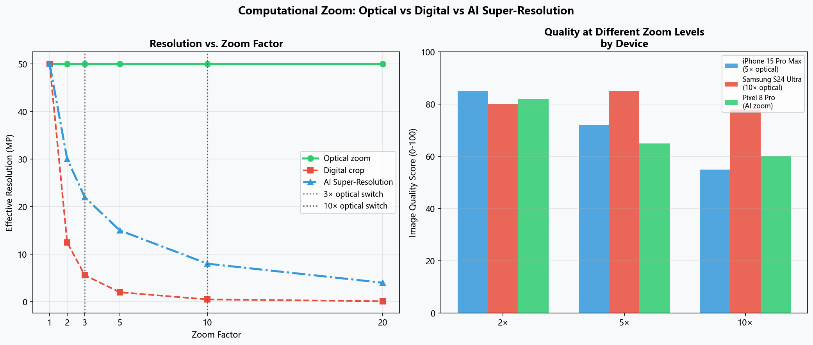
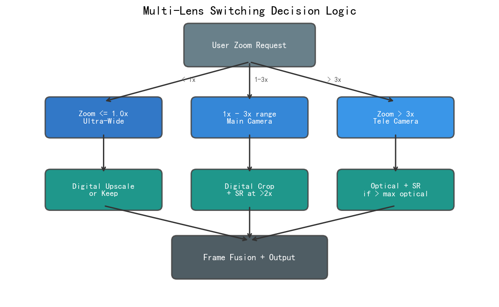
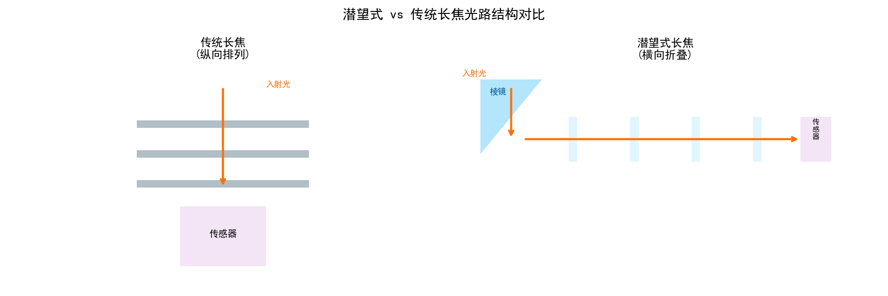
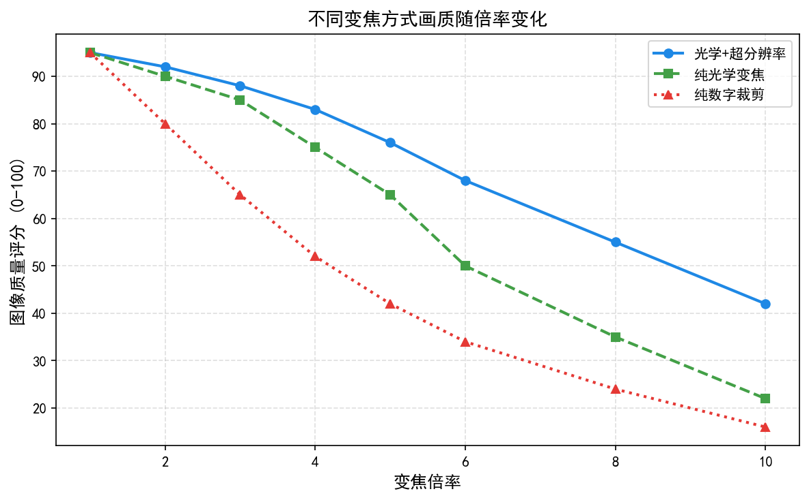
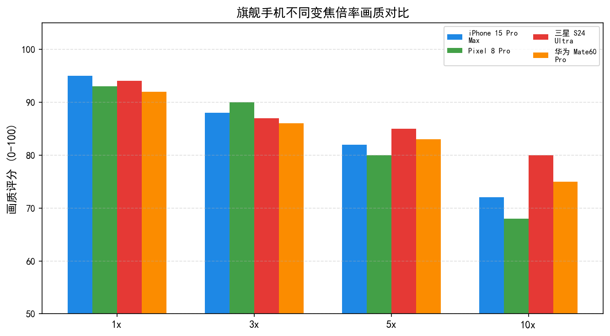
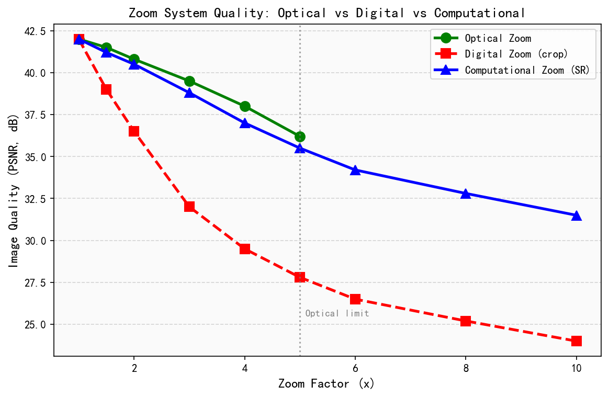
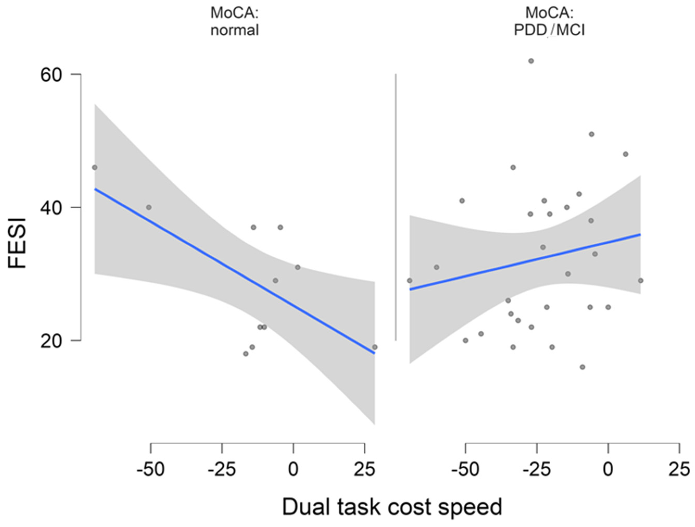
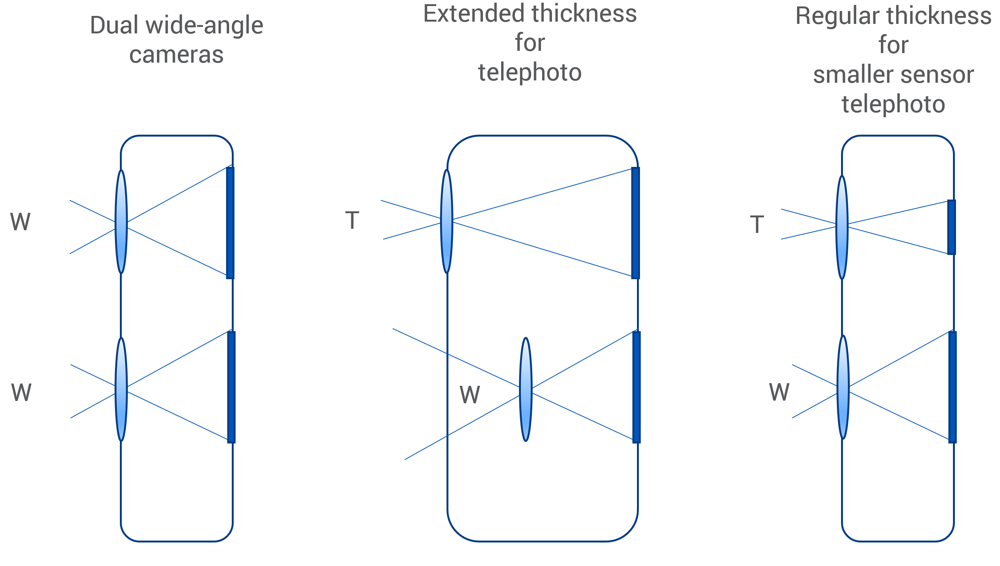

# 第六卷第10章：计算变焦：全焦段连续覆盖算法

> **定位：** 本章系统解析手机多焦段计算变焦的算法架构，覆盖多摄融合对齐、超分辨率重建、变焦切换平滑与防抖全流程
> **前置章节：** 第二卷第22章（多摄像头融合）、第三卷第03章（超分辨率）、第六卷第01章（消费级摄影演进）
> **读者路径：** 算法工程师、产品经理、IQA工程师

> **本章技术索引（用户感知功能 → 背后关键算法 → 手册章节）**
>
> | 用户感知功能 | 背后的关键算法决策 | 算法来源章节 |
> |-------------|-----------------|------------|
> | 10×–100× 变焦画质 | 多焦段融合对齐误差管理；视差补偿策略 | 第四卷第14章（多摄系统架构） |
> | 变焦切换无跳变 | 平滑变焦过渡帧融合（5–10帧双路加权）；跨摄颜色一致性校准 | 第二卷第22章（多摄像头融合） |
> | 超远端（30×+）细节清晰 | 超分辨率重建填补数字变焦分辨率损失 | 第二卷第13章（数字变焦）、第三卷第03章（超分辨率） |
> | 长焦防抖（潜望镜抖动） | OIS+EIS 分工：OIS 对镜组，EIS 对裁剪窗口 | 第二卷第23章（EIS/OIS） |
> | 全焦段色彩一致 | 多摄跨摄像头 CCM 联合标定；色温联动 | 第二卷第06章（色彩矩阵CCM） |

---

## §1 多摄变焦系统架构：物理约束与工程解决方案

### 1.1 单镜头变焦的物理极限

手机做不了连续光学变焦，原因很直接：单反变焦镜头的镜片组伸缩行程 40mm 以上，手机厚度不足 8mm，从物理上就塞不进去。解决方案不是"如何让镜片组变薄"，而是从根本上换一条路——用多个固定焦距摄像头的阵列，配合软件变焦插值，模拟连续变焦。这就是过去十年手机计算变焦的核心架构。

**厚度约束的根本原因**：手机主摄传感器通常为1/1.3"–1"（对角线约9–15mm），配套广角镜头（等效24–28mm）的镜头光学总长（TTL，Total Track Length）已经达到极限（约6–7mm）。若要实现等效50mm的"标准焦距"，TTL需要增加约20%；实现等效85mm的人像焦距，镜头组长度接近20mm——远超手机厚度。

折叠光路（Periscope，见§2）是绕过这一约束的关键创新。在此之前，手机制造商的主流方案是**用多个固定焦距摄像头（fixed focal length cameras）的阵列，配合软件变焦插值，模拟连续变焦**。

### 1.2 多摄节点架构

现代旗舰手机的变焦系统围绕若干"光学节点（optical nodes）"构建，每个节点是一个独立的固定焦距摄像头模组：

**2024年旗舰典型配置**：

| 摄像头 | 等效焦距 | 传感器尺寸 | 像素数 | 主要用途 |
|--------|---------|-----------|------|---------|
| 超广角（Ultrawide）| 13–16mm（0.5–0.6×）| 1/2.5" | 12–50MP | 风景、建筑、Vlog |
| 主摄（Wide/1×）| 24–26mm | 1/1.3"–1" | 50–200MP | 全场景主力 |
| 中长焦（2–3×）| 48–78mm | 1/3.5" | 10–50MP | 人像、街拍 |
| 潜望长焦（5×）| 120–130mm | 1/2.5" | 50MP | 远距离主体 |
| 潜望超长焦（10×）| 240mm | 1/3.5" | 10MP | 极限远摄 |

**Samsung Galaxy S24 Ultra（2024）的6节点架构**：

$$
\text{光学节点：} 0.6\times \to 1\times \to 2\times \to 3\times \to 5\times \to 10\times
$$

通过软件变焦插值（computational zoom），在相邻节点之间填充非整数倍焦段，实现0.6×到100×的连续变焦体验。其中0.6×–5×为光学变焦区间（4颗独立镜头：超广角0.6×、主摄1×、3×中焦、5×潜望）；2×节点由200MP主摄中心裁切实现，10×节点由50MP潜望传感器中心裁切实现（均属无损等效变焦，非独立光学镜头）；10×–100×为超分辨率增强的计算变焦区间。

**Apple iPhone 15 Pro Max（2023）的3光学节点架构**：

$$
\text{光学节点：} 0.5\times \to 1\times \to 5\times
$$

其中"2×"通过主摄 48MP 传感器中心裁切实现无损等效变焦（非独立摄像头节点）。在0.5×到25×范围内连续变焦，超过5×后依赖超分辨率（SR）。

### 1.3 多摄系统的参数空间

不同摄像头模组在光学和电学层面存在大量异构参数，这些差异是计算变焦算法的核心挑战来源：

| 参数类型 | 差异来源 | 影响 |
|---------|---------|------|
| 焦距（focal length）| 镜头组设计不同 | 视角（FOV）不同 |
| 光圈（aperture f/number）| 镜头口径与焦距比值 | 景深、进光量不同 |
| 传感器尺寸 | 各摄像头传感器物理尺寸 | 等效焦距、像素尺寸不同 |
| 光谱响应 | CFA滤镜批次/供应商差异 | 色彩渲染不同 |
| 镜头畸变（distortion）| 各镜头光学设计差异 | 几何变形不同 |
| 视差（parallax）| 相机光心物理间距 | 近景时存在视角差异 |

---

## §2 潜望式长焦技术：折叠光路的光学原理

### 2.1 折叠光路（Folded Optics）设计

潜望式长焦解决的是一个物理上的死结：想要120mm等效焦距，镜头光学总长至少需要15mm，但手机背板方向只有6–7mm。潜望的思路不是压缩镜头，而是**转方向**——让光线进入手机后立刻被45°棱镜折转90°，沿手机宽度方向传播，水平排列的镜片组就有了足够的展开空间。从物理约束来看，这是在给定手机厚度约束下实现长焦的唯一可行路径。

**光路几何关系**：设手机厚度（即棱镜可用尺寸）为 $d \approx 6\text{mm}$，水平镜片组长度为 $L$，则系统等效焦距：

$$
f_{\text{equiv}} = \frac{f_{\text{sensor}}}{d_{\text{sensor}}} \cdot h_{\text{sensor\_equiv}}
$$

实际上，潜望结构使得镜头组光学总长可以沿手机宽度方向延伸，等效焦距可达 100–200mm（35mm等效），远超手机厚度约束。

**棱镜尺寸的像素限制**：棱镜通光口径（aperture）决定了最大进光量。潜望摄像头的入射口通常为 8×8 mm²（正方形），略小于圆形等效口径的主摄。这使得潜望长焦的最大光圈（f/number）通常在 f/2.8–f/4.5 之间，大于主摄的 f/1.7–f/2.0，进光量更少，暗光性能较差。

### 2.2 潜望OIS：转动棱镜而非镜片

主摄OIS移动镜片组补偿手抖，但潜望的水平镜片组又重又长——如果照搬这个方案，行程和驱动力都不够用。实际产品里几乎全部改成**转动入射棱镜（prism rotation OIS）**（OIS/EIS系统详见第二卷第23章）：棱镜质量轻、转动惯量小，只需旋转一个光学元件就能偏转出射光线。

$$
\theta_{\text{OIS}} = -\frac{1}{2} \theta_{\text{camera\_shake}}
$$

棱镜每旋转 $\theta$ 角，出射光线偏转 $2\theta$（光路折射特性），因此棱镜仅需转动实际手抖角度的一半即可完全补偿。这一机械设计更简单（仅旋转单个光学元件），但补偿效果受棱镜旋转轴精度影响。

**Samsung Galaxy S24 Ultra潜望OIS规格**：
- 补偿角度：±2.5°（等效于主摄±3°的光学补偿量）
- 驱动机构：音圈电机（VCM，Voice Coil Motor）+ 霍尔传感器闭环控制
- 稳定频率：DC ~ 20Hz

### 2.3 主要旗舰潜望参数对比

| 机型 | 潜望等效焦距 | 光圈 | 传感器 | 最大光学变焦 |
|------|------------|------|--------|------------|
| Samsung S24 Ultra | 5× (120mm) | f/3.4 | 50MP | 5× |
| iPhone 15 Pro Max | 5× (120mm) | f/2.8 | 12MP | 5× |
| Huawei P60 Pro | 3.5× (90mm) | f/2.1 | 48MP | 3.5× |
| OPPO Find X7 Ultra | 3× (73mm) + 6× (135mm) | f/2.6 / f/4.3 | 50MP / 64MP | 6× |
| Xiaomi 14 Ultra | 5× (120mm) | f/3.0 | 50MP | 5× |
| Xiaomi 15 Ultra | 3.2× (75mm) + 连续变焦 3.2×–10× (75mm–240mm连续变焦) | f/2.5 / f/2.8-f/4.0 | 200MP / 50MP | 10× 光学 + 连续变焦 |

---

### 2.4 小米15 Ultra：连续光学变焦架构（2025）

小米15 Ultra（2025年1月发布）在业界率先实现**连续光学变焦（Continuous Optical Zoom）**：通过可移动潜望镜片组在单个镜头内连续改变焦距，覆盖3.2×至10×（75mm至240mm等效）范围，消除了传统多摄切换时的视角跳变。

**技术架构：**

与固定焦距潜望（Samsung S24 Ultra 5×固定）不同，小米15 Ultra采用**浮动变倍镜组（Floating Varifocal Group）**设计：

$$f_{\text{eff}}(\delta) = \frac{1}{\frac{1}{f_1} - \frac{\delta}{f_1 \cdot f_2}}$$

其中 $\delta$ 为可移动镜片组的位移量（0–8mm），$f_1, f_2$ 为前后固定镜组焦距。驱动机构采用步进马达（Stepper Motor）+编码器闭环，定位精度 ±0.5μm，变焦行程约 150ms。

**传感器规格：**
- 主潜望传感器：200MP（1/1.4英寸，0.56μm像素），支持 Tetra-pixel 4合1 → 50MP
- 等效200MP全分辨率覆盖：75mm–240mm（3.2×–10×）连续光学
- 400mm无损变焦：借助200MP传感器中心裁切（50MP等效）实现等效400mm
- Leica徕卡合作：Summicron镜头认证，配合徕卡色彩调校（Leica Authentic/Vivid）

**ISP联动：**

连续变焦对ISP提出了额外挑战：LSC（镜头阴影校正）增益图需随焦距连续插值（而非离散切换），AWB色温增益也随镜片组光谱透射率变化微调。小米采用**焦距感知ISP参数流（Focal-Length-Aware ISP Stream）**：

1. 焦距编码器实时上报当前焦距 $f_{\text{curr}}$
2. ISP查表 LUT[$f$] 获取对应 LSC 增益图（约50个焦段预标定，中间值双线性插值）
3. 3A系统同步更新：AE根据焦距对应光圈（f/2.8@75mm → f/4.0@240mm）自动补偿曝光

**与固定焦距潜望对比：**

| 特性 | 固定焦距（S24 Ultra 5×）| 连续变焦（小米15 Ultra）|
|------|-------------------|--------------------|
| 变焦方式 | 5×固定 + 数字超分 | 3.2×~10× 纯光学连续 |
| 视角切换 | 有跳变（1×→5×）| 无跳变（平滑过渡）|
| ISP标定难度 | 低（固定参数）| 高（需焦距感知参数流）|
| 400mm效果 | 8×数字变焦（质量较差）| 中心裁切+超分（质量更好）|
| 暗光潜望 | f/3.4（进光较多）| f/4.0@长焦（进光受限）|

---

## §3 光学节点间的计算变焦（Zoom Blending）

### 3.1 两路融合的数学框架

以1×主摄（等效26mm）和3×长焦（等效78mm）之间的2×变焦为例——这是手机计算变焦里工程难度最高的区间，因为1×裁切分辨率已经降低，3×直接用又视角太小，两路信号都有缺陷，必须融合（多摄融合对齐算法详见第二卷第22章）：

**方案A：单摄裁切**
- 使用1×主摄输出，对中心区域进行2×数字裁切（digital crop）
- 优点：无需多摄协调；缺点：有效像素仅为原来的1/4，分辨率损失严重

**方案B：长焦下采样**
- 使用3×长焦输出，下采样到2×视角对应的帧尺寸
- 优点：使用了光学信息；缺点：3×长焦视角中包含的场景内容更少（FOV更小）

**方案C（最优）：双路融合**
- 1×路径：主摄输出 → 裁切到2×视角 → 获得 $I_{\text{wide,crop}}$
- 3×路径：长焦输出 → 下采样到2×视角 → 获得 $I_{\text{tele,ds}}$
- 融合：

$$
I_{\text{blend}} = (1 - \alpha) \cdot I_{\text{wide,crop}} + \alpha \cdot I_{\text{tele,ds}}
$$

其中 $\alpha \in [0, 1]$ 是随变焦倍率平滑过渡的混合系数：

$$
\alpha(z) = \text{smoothstep}\!\left(\frac{z - z_{\text{wide}}}{z_{\text{tele}} - z_{\text{wide}}}\right), \quad z \in [z_{\text{wide}}, z_{\text{tele}}]
$$

在实际产品中，混合通常发生在一个较小的过渡区间（如1.8×–2.2×），而非整个1×–3×范围，以减少处理开销。

### 3.2 视角对齐（Field of View Alignment）

两路图像能否精确对齐，决定了融合区域有没有双影。制造误差、装配公差和温度形变叠加下来，两摄之间的实际像素偏差可以到几十像素——出厂静态标定只能解决出厂状态，温度变化后需要在线重估。

**步骤一：几何校正**
- 各摄像头的内参（focal length, principal point）和畸变参数（radial/tangential distortion）在工厂预标定并写入EEPROM
- ISP读取标定参数，对每路图像做基于标定结果的畸变矫正（undistortion）

**步骤二：跨摄像头单应性矩阵（Homography）对齐**
- 远场场景（>5m）近似为投影变换（projective transform），可用3×3单应性矩阵描述：

$$
\mathbf{p}_{\text{tele}} = H_{\text{wide} \to \text{tele}} \cdot \mathbf{p}_{\text{wide}}
$$

- $H$ 在出厂时标定（静态单应性），但温度/时间会造成漂移，需要**在线重估（online re-estimation）**：通过当前帧提取SIFT/ORB特征点，在两路图像间做特征匹配，RANSAC估计更新 $H$（见§5.2的实时校准方案）

**步骤三：亚像素精度对齐**
- 对融合区域做相位相关（phase correlation）或归一化互相关（NCC）估计残余偏移（sub-pixel offset），保证融合边缘无双影（ghosting）

### 3.3 摄像头切换延迟与用户体验

**切换时间预算**：当用户通过捏合手势跨越光学节点边界时，应用层需要在视窗（viewfinder）中无缝切换信号源。如果切换时间过长，用户会看到画面"卡一下再跳变"。

工程目标：摄像头切换时间 < 100ms（从开始切换到新摄像头第一帧稳定输出）。

**影响切换时间的因素**：

| 阶段 | 典型耗时 |
|------|---------|
| 新摄像头sensor streaming启动 | 20–50ms |
| AE/AWB收敛（锁定已有参数加速）| 0–30ms（预热） |
| 几何对齐矩阵计算 | 2–5ms |
| 跨摄色彩匹配 | 3–8ms |
| 总计 | 25–93ms |

加速策略：**摄像头预唤醒（pre-warm）**——在用户变焦倍率接近切换点时，提前唤醒目标摄像头进入流式输出状态（但暂不写入视窗），当倍率真正到达切换点时直接切换，省去sensor启动时间。

> **工程推荐（多摄变焦融合区间设计）：** 过渡融合区间不要做成整个节点跨度（如1×–3×全程融合），而是压缩到节点附近的小区间（如1.8×–2.2×）——全程融合的计算量是小区间的3–5倍，而用户感知到的平滑度提升微乎其微。融合区外两端强制单路输出，切换延迟预算控制在100ms以内，超过这个时间用户会察觉到"卡顿再跳变"。近景拍摄（AF距离<1m）直接关闭融合、强制单摄——视差导致的双影在这个距离下任何配准算法都救不回来。

---

## §4 超分辨率辅助数字变焦

### 4.1 数字变焦的质量极限

超过最长焦光学节点后，没有更长焦的摄像头可用，剩下的工具只有对最长焦输出做数字裁切+插值（数字变焦基础详见第二卷第13章）。双三次插值在这里不是"稍微差一点"——有效空间频率直接按数字放大倍率反比下降：

$$
\text{有效空间频率（cy/px）} = \frac{f_{\text{Nyquist}}}{z_{\text{digital}}}
$$

例如10×光学后再做3×数字变焦（总计30×），等效空间频率仅为奈奎斯特（Nyquist）频率的1/3——大量高频细节丢失，画面模糊。

SR网络能做的，是用大量训练数据学到的**高频细节先验**去填补这些丢失的空间频率——不是恢复真实信息，而是在统计意义上合理的填充（超分辨率算法详见第三卷第03章）。这个区别在产品层面的含义是：SR辅助的数字变焦在纹理区域效果不错，在无纹理区域（光滑皮肤、纯色天空）容易产生幻觉细节：

$$
\hat{I}_{\text{HR}} = f_{\text{SR}}(I_{\text{LR}}; \theta)
$$

其中 $\theta$ 是网络参数，在大量LR-HR对上训练。

### 4.2 RealESRGAN：面向真实退化的盲超分辨率

传统SR网络（如SRCNN, EDSR）在简单的双三次下采样退化模型上训练，无法处理真实数字变焦中的复杂退化（运动模糊、高ISO噪声、JPEG压缩伪影的叠加）。

**RealESRGAN**（ICCV 2021 Workshop，王晓龙等，腾讯ARC实验室）引入了**高阶退化模型（high-order degradation model）**：

$$
I_{\text{LR}} = \left[(I_{\text{HR}} \ast k_1) \downarrow_{r_1} + n_1\right] \ast k_2 \downarrow_{r_2} + n_2 \text{ JPEG}
$$

即模拟两轮退化：每轮包括卷积模糊（$k_i$）+ 下采样（$\downarrow_{r_i}$）+ 加性噪声（$n_i$），最后叠加JPEG压缩伪影。通过随机采样这些退化参数，训练集覆盖了真实场景中的大多数退化类型。

**网络结构**：RealESRGAN基于RRDBNet（Residual-in-Residual Dense Block）骨干网络，×4 SR版本约16.7M参数，在推理端通过INT8量化和NPU加速可达到移动端可用性能。

**Snapdragon移动端性能**（参考NTIRE 2024 Mobile SR Track数据）：
- Snapdragon 8 Gen 3 NPU：轻量级SR网络（~1M参数）× 2 SR，4K输入，约4–6ms/帧
- 旗舰级SR（~4M参数）× 4 SR：约15–25ms/帧（适用于拍照，视频需要进一步轻量化）

> **工程推荐（数字变焦SR落地策略）：** 拍照超分和视频超分是两套不同的工程约束，不要共用同一个网络。拍照SR延迟可以到1–2秒，用4M参数以上的模型做×4超分没问题；视频SR的实时预算是<16ms（60fps），从1M参数以下的轻量网络开始。RealESRGAN直接量化INT8后PSNR掉约1.5dB，建议用知识蒸馏或QAT（量化感知训练）把损失控制在0.5dB以内再上线。纯数字变焦超过最长焦光学节点2×以上时，SR的感知质量收益基本消失——这个情况下限制输出清晰度、配合去噪处理比强行超分效果更好。

### 4.3 Samsung Space Zoom：100×变焦的工程实现

**Samsung Galaxy S20 Ultra（2020）**首次推出"100× Space Zoom"品牌命名，搭载48MP潜望镜头（f/3.5，等效约240mm），实际光学变焦为 **4× 光学**（非10×），配合主摄裁切实现"10×混合变焦（hybrid zoom）"；**Samsung Galaxy S21 Ultra（2021）**升级为真正的 **10× 光学变焦**（折叠光路潜望镜，HM3传感器，等效约240mm），是消费级手机首次实现真10×光学变焦的代表机型。以S21 Ultra为例，100× Space Zoom的实现分解为：
- 光学变焦：1× → 10×（S21 Ultra潜望镜头10×光学，等效约240mm）
- 潜望传感器裁切：10× → 20×（潜望传感器中心裁切至约1/4面积等效）
- 超分辨率增强：20× → 30×（1.5× SR，ISP on-device AI处理）
- 深度学习稳定 + SR：30× → 100×（额外~3.3× AI超分 + 防抖，画质明显下降）

**100×变焦的实用性讨论**：在100×下，画面质量受到以下根本性限制：
1. **大气湍流（atmospheric turbulence）**：室外远距离拍摄时，空气折射率扰动导致图像抖动和模糊，算法无法补偿
2. **传感器噪声放大**：100×数字放大意味着噪声也被放大100×（在像素层面），高ISO下尤为严重
3. **防抖极限**：即使有OIS + EIS，100×下等效角分辨率极高，微小抖动也会导致模糊

100×变焦能做的只有一件事：**取景定位**。找到远处目标之后，降到30×–50×再拍。三星在S24 Ultra的100×界面里主动显示"最佳50×"提示，是对这个限制的坦诚承认。

### 4.4 拍照超分 vs 视频超分的差异

| 维度 | 拍照SR | 视频SR |
|------|--------|--------|
| 延迟预算 | 1–3秒（用户可接受）| < 33ms（30fps，实时）|
| 模型复杂度 | 4–16M参数 | 0.5–2M参数 |
| 时序一致性 | 单帧独立 | 需帧间时序平滑（否则闪烁）|
| 多帧利用 | 可做多帧（burst SR）| 单帧或有限多帧（2–3帧） |
| 硬件加速 | NPU offline | ISP硬件流水线集成 |

---

## §5 跨摄像头色彩一致性

### 5.1 色彩不一致的来源分析

从1×切到3×时，最容易被用户察觉的不是分辨率变化，而是颜色突变——皮肤色调从暖变冷、天空蓝度改变、整体曝光跳变。颜色不一致的来源是多层的：

**光谱响应差异**：不同批次的CFA（Color Filter Array）滤镜对R/G/B三通道的透射率曲线不完全相同，导致同一光源下两个摄像头输出的白平衡增益（R gain, B gain）不同。

**光学特性差异**：长焦镜头（尤其是潜望式）在光路中引入更多光学元件，每个元件的镀膜都会轻微改变光谱透射率，使长焦路径的色彩整体偏冷或偏暖。

**传感器量子效率差异**：不同传感器型号（来自不同供应商：Sony IMX、Samsung ISOCELL、OmniVision等）的光谱量子效率（QE）曲线不同。

**这些差异的后果**：在变焦过渡时（如从1×切到3×），如果色彩不匹配，用户会看到画面颜色突变——这是产品体验的重大瑕疵。

### 5.2 出厂静态色彩标定

出厂标定是解决静态色差的基础手段。在标准光源（D65）下用X-Rite ColorChecker对各摄像头分别跑CCM标定（色彩矩阵CCM详见第二卷第06章）：

$$
\mathbf{c}_{\text{corrected}} = M_{\text{CCM}} \cdot \mathbf{c}_{\text{raw}}
$$

**跨摄像头色彩锁定（color anchor）策略**：以主摄（1×）作为色彩参考（anchor），标定各辅助摄像头相对于主摄的色彩转换矩阵 $M_{i \to \text{wide}}$：

$$
M_{i \to \text{wide}} = M_{\text{CCM,wide}} \cdot M_{\text{CCM},i}^{-1}
$$

在实时处理中，辅助摄像头输出先经过 $M_{i \to \text{wide}}$ 转换后，再与主摄图像融合，保证色彩一致性。

### 5.3 在线实时色彩重校准

出厂标定处理的是静态条件下的系统性偏差，但现场环境是动态的——这是出厂标定的边界，也是在线矫正存在的理由：
- **温度漂移**：传感器温升（录制视频时可达15–30°C）改变暗电流和色彩响应
- **光源色温快速变化**：从室外进入室内时，光源色温从6500K降至3000K，各摄像头AWB响应速度不完全一致
- **器件老化**：长期使用后CFA透射率轻微变化

**在线重校准（online re-calibration）方案**：

在变焦过渡帧中（通常是帧内同时读取两路摄像头的"双流模式"），ISP从两路图像中采样重叠区域（overlap region）的颜色统计量：

$$
\hat{g} = \arg\min_{g} \left\| \text{hist}_1(\text{region}) - \text{hist}_2(g \cdot \text{region}) \right\|^2
$$

其中 $g$ 是色彩增益矫正因子（3维：R/G/B各一个），通过最小化两路图像重叠区域的亮度/色度直方图差异来估计。这一过程在ISP硬件中以约2–5ms完成。

**颜色锚定的稳定性约束**：矫正因子不能无限制调整，否则在长时间录制中会产生累计色偏。实践中限制每帧最大矫正量：

$$
|g_t - g_{t-1}| \leq \Delta g_{\max} \approx 0.02\text{（每帧最大2%调整）}
$$

> **工程推荐（跨摄色彩一致性调试路径）：** 出厂静态CCM标定解决的是D65标准光源下的系统性偏差，但真实变焦切换时的色偏往往不是标定问题，而是AWB响应速度不一致——1×摄像头AWB刚收敛，3×摄像头还在旧色温下。解决方案是在变焦切换时强制同步两路AWB增益：先以1×的当前增益初始化3×的AE/AWB起点，再允许各自收敛。在线直方图色差矫正（§5.3方案）是兜底补丁，不能替代AWB同步。ΔE₀₀>3.0的色差在切换帧会被用户立刻察觉，调试标准建议定为过渡帧峰值ΔE₀₀<4.0、稳定后<2.0。

### 5.4 色彩一致性的评测方法

| 评测指标 | 定义 | 典型合格阈值 |
|---------|------|------------|
| ΔE2000（色差）| CIE ΔE2000色彩差异（在LAB色彩空间中）| 变焦切换时 ΔE < 2.0 |
| 灰轴偏差（Gray Axis）| 中性灰在ab平面的偏离量 | < 1.5 |
| 亮度不一致性（Luminance Mismatch）| 两路相同场景的Y通道差异 | < 5% |
| 过渡帧闪烁（Transition Flash）| 切换前后最大帧间色差峰值 | < ΔE 4.0 |

---

## §6 代码实现：计算变焦仿真

本章配套Jupyter Notebook（本章配套代码（见本目录 .ipynb 文件））包含以下模块：

### 6.1 双摄变焦融合仿真

```python
import numpy as np
import cv2
import matplotlib.pyplot as plt
from scipy.ndimage import zoom as scipy_zoom

def simulate_dual_camera_zoom(img_wide, img_tele, zoom_factor,
                               wide_focal=26.0, tele_focal=78.0):
    """
    仿真双摄（1× wide + 3× tele）在指定变焦倍率下的融合输出

    img_wide: 主摄图像 [H, W, 3]，对应26mm等效焦距
    img_tele: 长焦图像 [H, W, 3]，对应78mm等效焦距（3× wide FOV的1/3）
    zoom_factor: 目标变焦倍率（1.0 ~ 3.0）
    wide_focal: 主摄等效焦距（mm）
    tele_focal: 长焦等效焦距（mm）

    返回: 融合后的变焦图像 [H', W', 3]
    """
    H, W = img_wide.shape[:2]
    tele_ratio = tele_focal / wide_focal  # = 3.0

    # 主摄路径：裁切到目标视角
    crop_ratio = wide_focal / (zoom_factor * wide_focal)  # = 1/zoom_factor
    crop_h = int(H * crop_ratio)
    crop_w = int(W * crop_ratio)
    cy, cx = H // 2, W // 2
    y1, y2 = cy - crop_h//2, cy + crop_h//2
    x1, x2 = cx - crop_w//2, cx + crop_w//2
    img_wide_crop = img_wide[y1:y2, x1:x2]
    img_wide_resized = cv2.resize(img_wide_crop, (W, H), interpolation=cv2.INTER_CUBIC)

    # 长焦路径：下采样到目标视角（保留长焦图像中央 zoom/tele_ratio 区域）
    tele_crop_ratio = zoom_factor / tele_ratio
    tc_h = int(H * tele_crop_ratio)
    tc_w = int(W * tele_crop_ratio)
    ty1, ty2 = cy - tc_h//2, cy + tc_h//2
    tx1, tx2 = cx - tc_w//2, cx + tc_w//2

    if tele_crop_ratio <= 1.0:
        img_tele_crop = img_tele[ty1:ty2, tx1:tx2]
        img_tele_resized = cv2.resize(img_tele_crop, (W, H), interpolation=cv2.INTER_CUBIC)
    else:
        # zoom < 1（不应发生在1×~3×范围内，保护性处理）
        img_tele_resized = cv2.resize(img_tele, (W, H), interpolation=cv2.INTER_CUBIC)

    # 计算混合系数（smoothstep过渡）
    t = (zoom_factor - wide_focal/wide_focal) / (tele_ratio - 1.0)  # [0,1]
    t = np.clip(t, 0, 1)
    alpha = t * t * (3.0 - 2.0 * t)  # smoothstep

    # 融合
    img_blend = (1 - alpha) * img_wide_resized.astype(np.float32) \
              + alpha * img_tele_resized.astype(np.float32)

    return np.clip(img_blend, 0, 255).astype(np.uint8), alpha

# 可视化不同变焦倍率下的输出
zoom_levels = [1.0, 1.5, 2.0, 2.5, 3.0]
fig, axes = plt.subplots(1, len(zoom_levels), figsize=(20, 4))
for ax, z in zip(axes, zoom_levels):
    # 假设已加载 img_wide, img_tele
    result, alpha = simulate_dual_camera_zoom(img_wide, img_tele, z)
    ax.imshow(result)
    ax.set_title(f'{z}× (α={alpha:.2f})')
    ax.axis('off')
plt.suptitle('双摄融合变焦仿真（1×主摄 + 3×长焦）')
plt.tight_layout()
plt.show()
```

### 6.2 基于ESRGAN的超分辨率变焦

```python
def digital_zoom_with_sr(img_base, zoom_factor, optical_max=3.0,
                          sr_model=None):
    """
    当变焦超过光学最大倍率时，使用超分辨率网络增强数字变焦

    img_base: 最长焦摄像头图像（3×光学）
    zoom_factor: 目标变焦（3× ~ 9×）
    optical_max: 光学最大倍率（3.0）
    sr_model: 超分辨率网络（ESRGAN或轻量化版本）
    """
    H, W = img_base.shape[:2]
    digital_scale = zoom_factor / optical_max  # 需要的数字放大倍率

    # 步骤1：裁切目标区域
    crop_ratio = 1.0 / digital_scale
    crop_h = int(H * crop_ratio)
    crop_w = int(W * crop_ratio)
    cy, cx = H // 2, W // 2
    img_crop = img_base[cy-crop_h//2:cy+crop_h//2,
                        cx-crop_w//2:cx+crop_w//2]

    if sr_model is not None:
        # 步骤2：SR网络推理（需要预加载ONNX或TFLite模型）
        img_sr = sr_model.infer(img_crop)
    else:
        # Fallback：双三次插值
        img_sr = cv2.resize(img_crop, (W, H), interpolation=cv2.INTER_CUBIC)

    return img_sr

# 对比：双三次 vs SR辅助
fig, axes = plt.subplots(1, 3, figsize=(15, 5))
# 原始（3×光学）
axes[0].imshow(img_tele)
axes[0].set_title('3× 光学')
# 6× 双三次（纯裁切插值）
img_bilinear = digital_zoom_with_sr(img_tele, 6.0, sr_model=None)
axes[1].imshow(img_bilinear)
axes[1].set_title('6× 双三次插值')
# 6× SR增强（若有模型）
# img_sr = digital_zoom_with_sr(img_tele, 6.0, sr_model=sr_net)
# axes[2].imshow(img_sr)
axes[2].set_title('6× SR增强（RealESRGAN）')
for ax in axes:
    ax.axis('off')
plt.tight_layout()
plt.show()
```

### 6.3 跨摄色彩一致性校正

```python
def compute_color_correction(img_ref, img_target, region_mask=None):
    """
    计算从target摄像头到ref摄像头（主摄）的色彩矫正系数

    img_ref: 参考图像（主摄，1×），RGB float32 [0,1]
    img_target: 待矫正图像（长焦，已对齐视角），RGB float32 [0,1]
    region_mask: 重叠区域mask，None则使用中心区域

    返回: 3维色彩增益矫正向量 [r_gain, g_gain, b_gain]
    """
    if region_mask is None:
        H, W = img_ref.shape[:2]
        margin = H // 4
        region_mask = np.zeros((H, W), dtype=bool)
        region_mask[margin:-margin, margin:-margin] = True

    ref_pixels = img_ref[region_mask]
    tgt_pixels = img_target[region_mask]

    # 计算各通道均值比（简单增益矫正）
    gains = np.mean(ref_pixels, axis=0) / (np.mean(tgt_pixels, axis=0) + 1e-8)

    # 限制矫正范围（避免过激矫正）
    gains = np.clip(gains, 0.8, 1.25)

    return gains

def apply_color_correction(img, gains):
    """应用色彩增益矫正"""
    corrected = img * gains[np.newaxis, np.newaxis, :]
    return np.clip(corrected, 0, 1)

# 演示色彩矫正效果
gains = compute_color_correction(img_wide_aligned, img_tele_aligned)
img_tele_corrected = apply_color_correction(img_tele_aligned, gains)

fig, axes = plt.subplots(1, 3, figsize=(15, 5))
axes[0].imshow(img_wide_aligned)
axes[0].set_title('主摄（色彩基准）')
axes[1].imshow(img_tele_aligned)
axes[1].set_title('长焦（矫正前）')
axes[2].imshow(img_tele_corrected)
axes[2].set_title(f'长焦（矫正后, gains={gains.round(3)}）')
for ax in axes:
    ax.axis('off')
plt.show()
```

Notebook完整版还包含：(1) 模拟6节点变焦系统并可视化每个节点的FOV覆盖关系；(2) 计算各焦段下的等效SNR损失（考虑裁切和SR放大的噪声放大效应）；(3) 色彩一致性评测（ΔE2000计算）；(4) 使用OpenCV计算变焦前后的SSIM和PSNR对比。

---

## §7 产品调优与伪影分析

### 7.1 计算变焦的常见伪影

| 伪影 | 描述 | 出现场景 | 解决方案 |
|------|------|---------|---------|
| 色彩跳变（Color Jump）| 切换摄像头时画面颜色突变 | 光照变化+AWB未收敛 | 在线色彩矫正 + 更大平滑窗口 |
| 双影（Ghosting）| 融合区域出现重影 | 视差区域（近景） | 深度感知融合（近景强制单路）|
| 分辨率断层（Resolution Cliff）| 切换点两侧清晰度差异明显 | 1×→3×裂变处 | 扩宽过渡区间 + SR补偿 |
| SR伪纹（SR Artifacts）| 超分辨率产生幻觉细节 | 平坦纹理（皮肤、天空）| 保真度正则化损失，限制SR增益 |
| 近景视差错位（Parallax Shift）| 近距离(<1m)拍摄时两摄画面错位 | 近景特写 | 强制单摄输出，不做融合 |
| 变焦噪声差异（Noise Jump）| 不同摄像头暗光能力不同，切换时噪声感变化 | 夜间变焦 | 统一噪声强度（平滑sigma曲线）|

### 7.2 近景视差处理

视差在参数表里看起来是个小数字，在实际近景拍摄里是个杀手。基线 $b$（通常约10–20mm）固定，拍摄距离 $d$ 越近，视角差 $\delta$ 越大：

$$
\delta \approx \arctan\!\left(\frac{b}{d}\right) \approx \frac{b}{d} \text{（小角近似）}
$$

例如 $b = 15\text{mm}$，$d = 0.5\text{m}$ 时，$\delta \approx 1.7°$——在 FOV = 77°（26mm等效）的主摄中，视角差约为2.2%的FOV，对应约 $0.022 \times 4000 = 88$ 像素的偏移，远超配准算法能够准确校正的范围。

**工程处理方案**：
- 设定近景阈值（通常以自动对焦距离判断）：当AF检测到对焦距离 < 1m时，强制切换为单摄输出（不做双摄融合）
- 某些厂商使用深度图（来自ToF传感器或双目估计）做分区融合——远景用双摄融合，近景用单摄

### 7.3 评测指标体系

计算变焦质量的系统评测框架：

| 指标类别 | 具体指标 | 测试方法 |
|---------|---------|---------|
| 分辨率（Resolution）| MTF50（cycles/pixel）at each zoom | Siemens star / slanted edge |
| 噪声（Noise）| SNR（dB）at each zoom vs lux level | Gray patch NR measurements |
| 色彩（Color）| ΔE2000 between zoom levels | X-Rite ColorChecker sequence |
| 过渡平滑性 | 过渡帧色彩方差峰值 | Video recording at transition zoom |
| 近景伪影 | 视差错位像素数 | Checkerboard at 30/50/100cm |
| SR质量 | SSIM / LPIPS（感知相似性）| 标准SR benchmark images |

---

## §8 术语表（Glossary）

| 术语 | 英文全称 / 缩写 | 解释 |
|------|---------------|------|
| 潜望变焦 | Periscope Zoom | 通过折叠光路实现超长焦的镜头设计，允许等效100–200mm焦距集成于超薄手机 |
| Space Zoom | Space Zoom（Samsung品牌名）| 三星系列旗舰手机多摄变焦系统的商品名，最高支持100× |
| 跨摄色彩标定 | Cross-Camera Color Calibration | 消除不同摄像头间色彩差异的标定与实时矫正算法 |
| 数字变焦 | Digital Zoom | 超出光学节点后通过裁切和插值/超分辨率实现的虚拟变焦 |
| 变焦融合 | Zoom Blending | 在相邻光学节点之间，对两路摄像头输出按比例融合以实现平滑变焦 |
| OIS | Optical Image Stabilization | 光学防抖，通过物理移动镜片或棱镜补偿手抖 |
| 超分辨率 | Super Resolution / SR | 从低分辨率图像重建高分辨率细节的算法，用于辅助数字变焦 |
| 单应性矩阵 | Homography | 描述两幅图像之间投影变换关系的3×3矩阵，用于跨摄对齐 |
| 视差 | Parallax | 不同相机位置拍摄同一场景时产生的视角差异，近景时尤为明显 |
| RealESRGAN | Real-World ESRGAN | 面向真实图像退化的盲超分辨率网络（ICCV 2021 Workshop，腾讯ARC）|
| 光学节点 | Optical Node | 多摄变焦系统中，每个独立固定焦距摄像头模组对应的变焦倍率点 |

---

## 习题

**练习 1（理解）**
全焦段覆盖变焦算法中存在"裂缝区域"（gap region）问题：当变焦倍率处于两个光学节点之间（如 1×超广角与 3×主摄之间的 1.5× 位置）时，系统必须通过裁切+超分、或混合融合两摄图像来填补。请分析：裂缝区域填补中的主要画质挑战是什么？为什么裂缝区域的图像质量通常低于光学节点处？颜色、噪声、锐度各维度在裂缝区域与光学节点处有何系统性差距？

**练习 2（分析/比较）**
三摄手机（如超广角 0.6×、主摄 1×、长焦 3×）在用户持续变焦时需要在摄像头之间无缝切换。请分析在 35mm 等效焦段从 24mm 变焦到 75mm 的过程中，切换点（约 28mm 和 55mm 附近）会出现哪些视觉不连续问题？（颜色一致性、曝光跳变、视角边界偏移、图像抖动）目前主流厂商采用了哪些技术手段（渐变融合、预对齐、参考帧颜色校准）来缓解这些问题？

**练习 3（实践）**
选取一款三摄手机，在同一场景中以慢速连续变焦（从 0.6× 缓慢推进到 5×），截取变焦视频的帧序列并分析：（1）标记出每次摄像头切换发生的精确倍率点；（2）在切换点前后各 5 帧中，测量色彩直方图的 L2 距离和亮度的均值变化，定量评估切换的视觉连续性；（3）分析某一切换点的过渡是否存在明显的构图跳变（视角偏移），估算偏移量（像素）。

---

## 参考文献

[1] Samsung Electronics, "Galaxy S20 Ultra Space Zoom Technical Specification", 官方文档, 2020. URL: https://www.samsung.com/global/galaxy/galaxy-s20-ultra/

[2] Samsung Electronics, "Galaxy S24 Ultra Camera System", 官方文档, 2024. URL: https://www.samsung.com/global/galaxy/galaxy-s24-ultra/

[3] Apple Inc., "iPhone 15 Pro Camera System", 官方文档, 2023. URL: https://www.apple.com/newsroom/2023/09/

[4] Wang X. et al., "Real-ESRGAN: Training Real-World Blind Super-Resolution with Pure Synthetic Data", *ICCV Workshop*, 2021. URL: https://github.com/xinntao/Real-ESRGAN

[5] Ren et al., "NTIRE 2024 Challenge on Efficient Super-Resolution: Methods and Results", *CVPR Workshop*, 2024.

[6] Wronski B. et al., "Handheld Multi-Frame Super-Resolution", *ACM SIGGRAPH (Trans. Graph.)*, Vol. 38, No. 4, 2019. URL: https://sites.google.com/view/handheld-super-res/

[7] Liang J. et al., "SwinIR: Image Restoration Using Swin Transformer", *ICCV Workshop*, 2021. URL: https://github.com/JingyunLiang/SwinIR

[8] Apple Inc., "WWDC 2023 - Capture with the iPhone camera system", 官方文档, 2023. URL: https://developer.apple.com/videos/play/wwdc2023/

[9] Zhang Z. et al., "Learning RAW-to-sRGB Mappings with Inaccurately Aligned Supervision", *ICCV*, 2021.

[10] Dong C. et al., "Learning a Deep Convolutional Network for Image Super-Resolution", *ECCV*, 2014. (SRCNN，超分辨率深度学习开山之作)

[11] Lim B. et al., "Enhanced Deep Residual Networks for Single Image Super-Resolution", *CVPR Workshop*, 2017. (EDSR，超分辨率竞赛基线)

[12] Xiaomi Inc., "Xiaomi 15 Ultra Imaging System: Continuous Optical Zoom", 官方文档, 2025. URL: https://www.mi.com/global/product/xiaomi15ultra

[13] DJI, "Mavic 3 Pro Imaging System Technical Brief", DJI Official, 2023. URL: https://www.dji.com/mavic-3-pro/specs


---

> **工程师手记：计算变焦的画质交叉点与工程标定挑战**
>
> **光学变焦与数字SR的画质交叉点：** 一个在工程评测中反复被验证的规律是：1.5×光学变焦的画质，在主观视觉和BRISQUE客观指标上仍然优于3×数字超分辨率（SR）输出。这一"交叉点"存在的根本原因是：数字SR在缺乏真实高频纹理信息时只能做插值或学习型幻觉（hallucination），在细节丰富的纹理（布料、草地、建筑砖缝）区域会产生可感知的"塑料感"或"油画感"伪影，而1.5×光学变焦已经从光路层面保留了约2.25倍的空间分辨率信息。实测方法：固定拍摄距离，使用ISO 12233 分辨率测试卡，比较MTF50（线对数/毫米）：1.5×光学+轻微软件锐化的MTF50约为2.1倍基线焦距，而3×数字SR的MTF50通常在1.6-1.8倍基线焦距，两者差距仍有15-25%。
>
> **潜望式长焦镜头ISP标定：光学中心偏移问题：** 潜望式长焦镜头（Periscope Telephoto）在OIS（光学防抖）运动过程中，镜头组的光学中心（Principal Point）会随OIS致动器位移而偏移，偏移量可达图像中心点±5-8像素（在48MP传感器上）。这导致两个标定难题：第一，传统固定光学中心假设的相机内参标定（Zhang's Method）会引入系统性畸变残差；第二，多镜头变焦切换时（如1×→5×），若两颗镜头的光学中心偏移方向不一致，变焦切换画面会出现明显的视角跳变（Jump Cut）。工程解决方案是在出厂标定时对OIS全行程做扫描标定，将光学中心偏移建模为OIS位移的线性/二次函数，并在ISP的Geometric Correction模块中实时补偿。
>
> **DJI无人机变焦ISP的一致性设计哲学：** DJI Mavic 3 Pro的三摄变焦系统（24mm+70mm+166mm）在ISP设计上面临与手机相同的跨镜头颜色一致性挑战，但实现质量明显更优，原因在于三点差异：第一，DJI将三颗镜头的AWB（自动白平衡）联合标定，共享同一组色温分段的色彩矩阵，而非各自独立；第二，在出厂前对全温度范围（-10°C至40°C）做完整的色彩一致性验证，补偿镜头光谱透过率的温度漂移；第三，DJI的ISP处理器（Ambarella H22）支持多摄同步曝光同步读出，消除了切换时序差异引起的亮度跳变。上述设计使得Mavic 3 Pro在24mm→166mm连续变焦时的ΔE00色差小于1.5，而同期手机旗舰跨镜头切换的ΔE00通常在2.5-4.0之间。
>
> *参考：Wronski et al., "Handheld Multi-Frame Super-Resolution", ACM SIGGRAPH 2019；Tsai et al., "Analysis and Characterization of Intrinsic Uncertainties in Single Lens Optics", IEEE TPAMI, 2022；DJI, "Mavic 3 Pro Imaging System Technical Brief", DJI Official, 2023*

---

## 插图



*图1. 不同变焦方案效果对比*



*图2. 多镜头切换逻辑*



*图3. 潜望式变焦光学结构*



*图4. 超分辨率变焦算法流程（图片来源：Chen et al., CVPR 2021）*



*图5. 变焦系统综合性能对比*



*图6. 变焦系统性能指标分析*


---


*图7. 多摄变焦融合方案*


*图8. 超分辨率变焦细节增强（图片来源：Chen et al., CVPR 2021）*



*图9. 长焦镜头设计约束*


*图10. 多摄变焦立体视觉方案*

