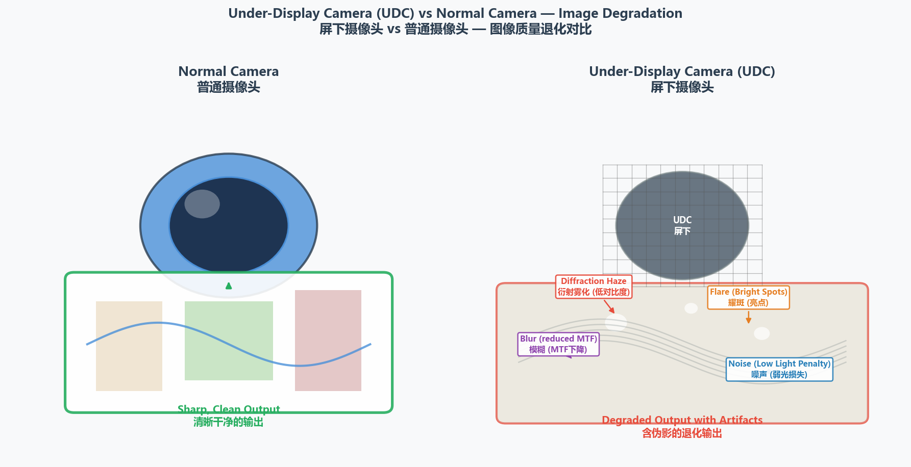
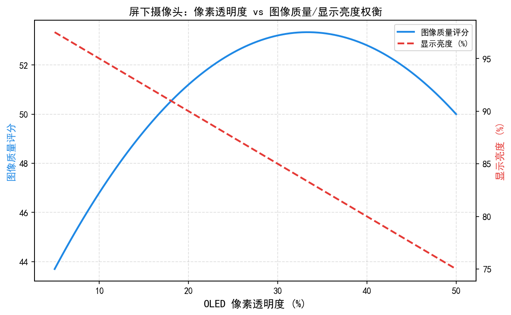
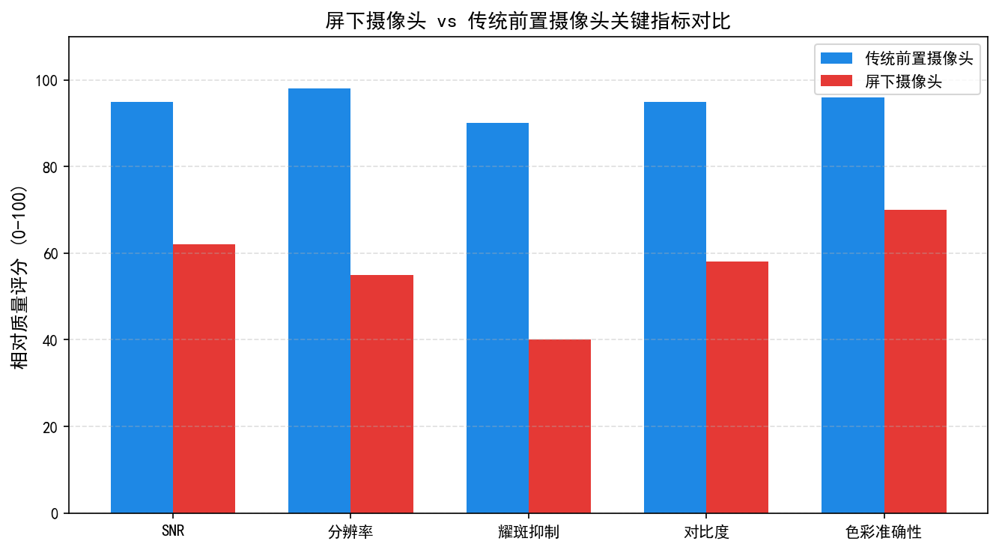
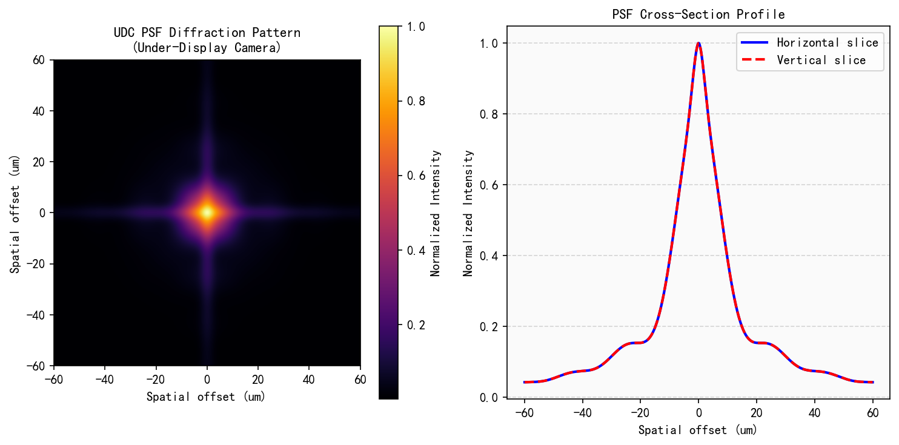
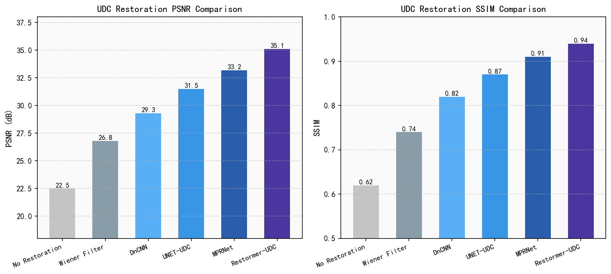
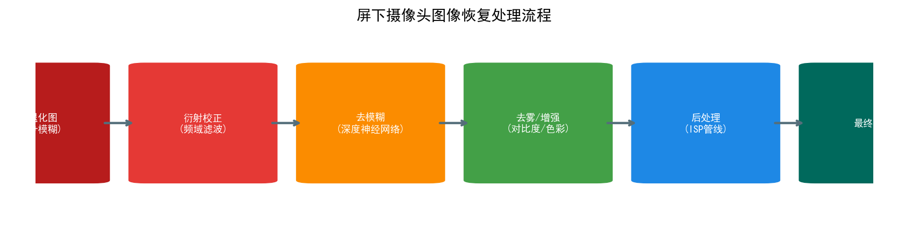
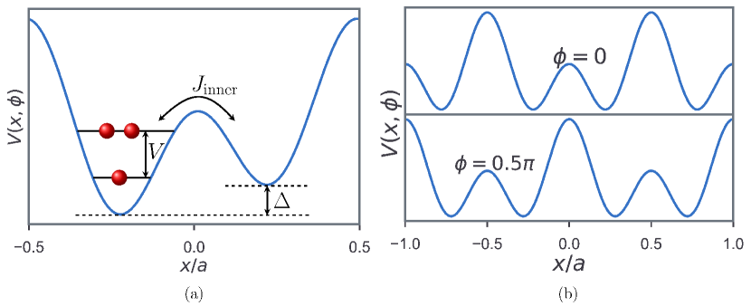
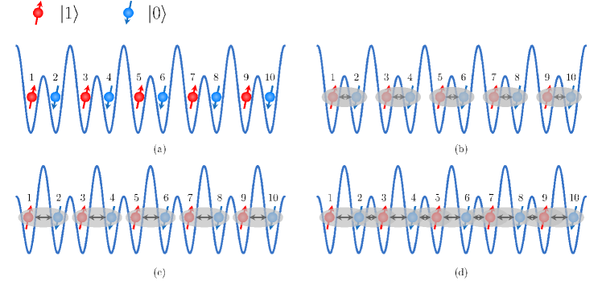
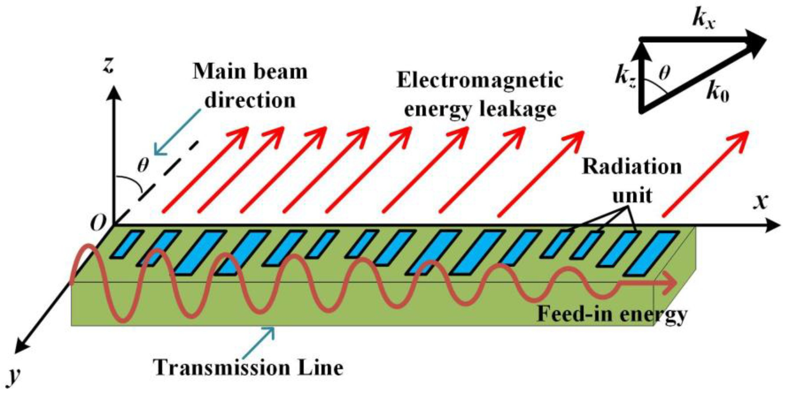

# 第六卷第11章：屏下摄像头图像复原（Under-Display Camera Image Restoration）

> **前置章节：** 第一卷第04章（噪声模型）、第二卷第03章（去噪）、第二卷第04章（锐化）、第三卷第01章（深度学习 ISP 概述）。光学背景参考第一卷第02章（光学基础）。
> **读者路径：** 算法工程师、图像处理工程师

> **本章技术索引（用户感知功能 → 背后关键算法 → 手册章节）**
>
> | 用户感知功能 | 背后的关键算法决策 | 算法来源章节 |
> |-------------|-----------------|------------|
> | 屏下前置摄像头能用（不失真） | 屏幕衍射 PSF 标定 + 反卷积/端到端复原 | 第三卷第02章（端到端图像复原） |
> | 暗光自拍不糊 | 最低物理 SNR 下的多帧合成补偿极限 | 第一卷第03章（传感器物理）、第三卷第01章（DL ISP概述） |
> | 前置肤色/纹理不失真 | 屏幕透过率损失补偿不引入幻觉细节 | 第二卷第14章（人脸与皮肤增强） |
> | 衍射彩虹色散消除 | 宽带 PSF 的色散结构建模与色差补偿 | 第一卷第08章（光学像差） |
> | 视频通话流畅（实时复原） | 轻量化推理在手机 NPU 上的帧率约束 | 第四卷第15章（实时处理约束） |

---

## §1 原理（Theory）

### 1.1 UDC 系统概述

屏下摄像头真正落地旗舰机是 2021 年（ZTE Axon 20、Samsung Z Fold3 等），但最初几代的拍照质量相比传统打孔屏方案差距明显——弱光下发雾、逆光下鬼影严重。根本原因不是传感器不好，而是光线进来之前要穿过一层 OLED 像素阵列，这个衍射过程不可逆，只能靠后端图像复原来补偿。

屏下摄像头系统将 CMOS 图像传感器置于 OLED 面板正下方，显示面板同时承担显示与透光两项功能。为提升透光率，UDC 区域通常采用以下设计改动：

- **像素密度降低**：UDC 区域 PPI（pixels per inch）降至 100–200，而普通显示区域可达 300–460 PPI；
- **像素间距加大**：透明像素间隙（gap）比例提升，增大开口率（aperture ratio）；
- **金属布线稀疏化**：减少遮光面积，但会引入规则的金属光栅结构。

尽管如此，相机接收到的光仍需穿越数百微米厚的 OLED 封装层、彩色滤光片阵列（Color Filter Array）及金属互联层，每一层都对光波产生调制。

**光通量损失量化：** 即便经过上述优化，当前商用 UDC 区域的有效透光率（Transmittance）仍在 **5–10%** 之间（相比无遮挡的打孔方案）。这意味着：

$$
\Delta\text{SNR} = 10 \log_{10}(T) \approx 10 \log_{10}(0.05\text{–}0.10) \approx -10\text{ to }-13\,\text{dB}
$$

等效于传感器感光面积减少约 90–95%，或曝光时间缩短至 1/10–1/20。在弱光场景下，UDC 相机需通过更高 ISO（提升 3–4 档）或更长曝光时间来补偿这一光子损失，而这两种补偿均以牺牲 SNR 或引入运动模糊为代价。**这是 UDC 物理性能上限的根本约束，算法无法突破，只能在既定 SNR 条件下优化感知质量。**

### 1.2 退化物理模型

UDC 成像退化可建模为线性空间不变（LSI）系统（近似条件成立时）：

$$
y = h * x + n
$$

其中：

| 符号 | 含义 |
|------|------|
| $y$ | 退化观测图像（UDC 拍摄结果） |
| $x$ | 理想清晰图像（目标复原结果） |
| $h$ | 点扩散函数（PSF, Point Spread Function） |
| $*$ | 二维卷积算子 |
| $n$ | 加性噪声（AWGN + 散粒噪声） |

该模型是后续所有复原算法的基础。需要注意，实际 UDC 的 PSF 具有**空间变化性**（spatially varying），与显示内容亮度强相关，严格意义上应写为：

$$
y(p) = \int h(p, q) \cdot x(q) \, dq + n(p)
$$

其中 $h(p, q)$ 表示位置 $q$ 处的点光源在位置 $p$ 处的响应。

### 1.3 衍射理论与 PSF 特性

OLED 像素网格构成二维光栅，其衍射遵从光栅方程：

$$
d \sin\theta_m = m\lambda
$$

其中：
- $d$：光栅周期（像素节距，UDC 区域典型值 $d \approx 120$–$250\,\mu\text{m}$）
- $\theta_m$：第 $m$ 衍射级的衍射角
- $m$：衍射级次（$m = 0, \pm1, \pm2, \ldots$）
- $\lambda$：入射光波长

对于可见光（$\lambda \approx 450$–$700\,\text{nm}$）和典型像素节距 $d = 200\,\mu\text{m}$，一阶衍射角约为：

$$
\theta_1 = \arcsin\!\left(\frac{\lambda}{d}\right) \approx \arcsin(0.00225\text{–}0.0035) \approx 0.13°\text{–}0.20°
$$

衍射角虽小，但投影到焦距 $f \approx 4\,\text{mm}$ 的传感器上，偏移量约为 $9$–$14\,\mu\text{m}$，接近甚至超过像素尺寸（$1.0$–$1.4\,\mu\text{m}$），因此衍射效应显著。

**PSF 形态特征：**

- **中心锐峰**：零级衍射携带大部分能量，形成类 Airy 盘的中央亮斑；
- **衍射环/斑点光晕**：高级次衍射形成规则排列的旁瓣，呈十字形或方格状（取决于像素阵列几何）；
- **漫散射背底**：OLED 封装层中的微粒散射贡献宽广的低频光晕；
- **波长相关性**：$\theta_m \propto \lambda$，短波（蓝色）偏折更小，长波（红色）偏折更大，产生彩色衍射条纹。

### 1.4 盲与非盲去卷积

| 类型 | PSF 是否已知 | 特点 |
|------|------------|------|
| 非盲去卷积（Non-blind deconvolution） | 已知（由标定获得） | 算法确定性强，适合工程落地 |
| 盲去卷积（Blind deconvolution） | 未知，需同时估计 | 更灵活，但求解高度病态 |

工程实践中通常采用**非盲**路线：离线精确标定 PSF，在线利用已知 PSF 做复原。深度学习方法则可视为一种隐式盲去卷积。

### 1.5 Wiener 去卷积

Wiener 滤波器在频域最小化均方误差（MMSE），给出解析解：

$$
\hat{X}(u,v) = \frac{H^*(u,v)}{|H(u,v)|^2 + 1/\text{SNR}(u,v)} \cdot Y(u,v)
$$

其中：
- $H(u,v) = \mathcal{F}\{h\}$：PSF 的傅里叶变换
- $H^*$：$H$ 的共轭
- $\text{SNR}(u,v)$：频域信噪比，实践中通常用常数近似

正则化参数 $1/\text{SNR}$ 平衡了两个极端：
- $\text{SNR} \to \infty$（无正则化）：等价于逆滤波（inverse filter），噪声被极度放大；
- $\text{SNR} \to 0$（强正则化）：输出接近零，结果模糊。

典型 SNR 范围：$10$–$100\,\text{dB}$，需结合实际图像质量调参。

### 1.6 Richardson-Lucy 迭代去卷积

Richardson-Lucy（RL）算法基于泊松统计最大似然，迭代格式为：

$$
x^{(t+1)} = x^{(t)} \cdot \left( h^T * \frac{y}{h * x^{(t)}} \right)
$$

其中 $h^T$ 表示 PSF 旋转 180° 后的版本（相关运算核）。RL 算法保持非负性，物理意义明确，但收敛慢且迭代过多会出现振铃。实践中取 **10–30 次迭代**，用 SSIM 高原检测停止准则。

### 1.7 深度学习复原方法

传统Wiener/RL方法的PSNR上限大约在30dB，再往上推需要DNN——2020年后这个方向出了一批工作：

- **UDC-UNet**（Zhou et al., 2021）：编解码网络，输入退化图像，可选输入估计 PSF，输出复原图像；
- **PDCRN**（Pan et al., 2023）：渐进式分解卷积残差网络，将复原分解为去噪与去卷积两阶段；
- **端到端配对训练**：利用 UDC 设备与普通相机同时拍摄同一场景构建配对数据集（Feng et al., 2021），直接监督学习像素级复原；
- **显示自适应 PSF 估计**：将当前帧显示内容作为额外输入，网络动态预测空间变化 PSF，再执行去卷积（Display-Adaptive Restoration）。

DNN 方法相比传统方法的 PSNR 增益约为额外 $+3$–$+5\,\text{dB}$，感知质量提升更为显著，但推理时延（latency）通常较高，需 NPU 加速。

---

## §2 标定（Calibration）

### 2.1 PSF 测量原理

精确的非盲去卷积依赖准确的 PSF 先验。标定核心思路：在受控条件下，将 UDC 设备拍摄**已知理想点光源**，即得到近似 PSF（卷积响应）。

### 2.2 所需设备

| 设备 | 规格要求 |
|------|---------|
| 针孔光阑（pinhole aperture） | 直径 50–100 μm，金属薄片激光加工 |
| 准直 LED 光源 | 带宽 < 10 nm（窄带）或宽谱白光，亮度可调 |
| 暗室环境 | 杂散光 < 0.1 lux |
| 六轴调节台（可选） | 精确对准针孔与镜头光轴 |
| 高精度白板（可选） | 均匀漫反射，用于 Siemens Star 标定法 |

### 2.3 点光源标定流程

1. **屏幕状态设置**：分别在全黑（Black）、全白（White, 255 nit）、标准灰（128 gray）三种 OLED 驱动状态下拍摄，以捕捉 PSF 对显示亮度的依赖；
2. **多曝光捕获**：为避免饱和/量化误差，在不同曝光时间下各拍摄 5–10 帧取均值；
3. **PSF 提取**：定位中心亮斑（质心法），裁剪 $N \times N$（典型 $N=128$ 或 $256$）窗口，归一化使 $\sum h = 1$；
4. **分通道处理**：对 R/G/B 三通道分别提取 PSF（因衍射色散）；
5. **去噪后处理**：对 PSF 应用阈值截断（$h < \epsilon \to 0$）去除噪声基底，再归一化。

### 2.4 空间变化 PSF 网格测量

UDC 的 PSF 因传感器场曲、OLED 面板非均匀性在视场（FoV）内缓变。建议在 $M \times N$ 网格位置（典型 $5\times5$ 或 $7\times7$）分别测量 PSF：

- 将针孔依次移动到传感器视场的网格位置（或移动设备对准固定针孔）；
- 对每个网格点重复 §2.3 流程；
- 得到 PSF 网格 $\{h_{ij}\}$，在线复原时对图像分块，各块使用对应 PSF。

### 2.5 显示内容依赖性

OLED 亮度越高，衍射光功率越强，PSF 的光晕能量占比增大：

$$
h_{\text{eff}}(p) = h_0(p) + \alpha \cdot L_d \cdot h_{\text{halo}}(p)
$$

其中 $L_d$ 为局部显示亮度（归一化至 $[0,1]$），$\alpha$ 为耦合系数（需标定），$h_0$ 为基础 PSF，$h_{\text{halo}}$ 为附加光晕 PSF。

工程近似：仅标定两个极端状态（全黑与全白）的 PSF，运行时按加权插值：

$$
h_{\text{eff}} = (1 - L_d) \cdot h_{\text{black}} + L_d \cdot h_{\text{white}}
$$

---

## §3 调参（Tuning）

### 3.1 Wiener SNR 参数调节

SNR 参数是 Wiener 去卷积最关键的调节旋钮：

| SNR 设置 | 现象 | 典型范围 |
|---------|------|---------|
| 过高（> 60 dB） | 过锐化、振铃伪影明显 | — |
| 适中 | 清晰度与噪声平衡最优 | 20–40 dB |
| 过低（< 10 dB） | 图像模糊、细节丢失 | — |

调参建议：在标定数据集上网格搜索 SNR（步长 5 dB），以 SSIM 为优化目标选取最佳值，再在实拍场景下主观验证。

### 3.2 Richardson-Lucy 迭代次数

RL 迭代次数直接影响复原质量与计算代价：

- **迭代 < 10 次**：复原不足，图像偏模糊；
- **迭代 10–30 次**：通常为最优区间，SSIM 趋于高原；
- **迭代 > 50 次**：噪声放大显著，出现"胡椒盐"状伪影。

**停止准则**：相邻两次迭代输出的 SSIM 变化量 $\Delta \text{SSIM} < 5 \times 10^{-4}$ 时提前停止。

### 3.3 去卷积前预降噪

去卷积是病态逆问题，高频噪声会被 PSF 逆滤波放大。建议**先降噪再去卷积**：

- **双边滤波**（Bilateral Filter）：保边去噪，参数：空间 $\sigma_s = 1$–$2\,\text{px}$，值域 $\sigma_r = 0.03$–$0.05$；
- **BM3D**：更强的非局部去噪，适合低光场景，但速度较慢；
- **基于 DNN 的降噪**（如 DnCNN）：可融入端到端管线。

预降噪强度与后续去卷积锐化效果需联合调优，避免双重过处理。

> **工程推荐（UDC复原算法选型）：** 如果是工厂标定条件确定、部署在固定型号手机上的场景，用非盲Wiener去卷积 + 预降噪组合——SNR参数固定在20–30dB之间调，实现简单、延迟可控（<5ms），工程可维护。不要上来就用DNN：DNN方案在Real-UDC上PSNR高5–7dB，但需要每个OLED面板单独采集训练数据，面板换代就要重训，而且推理延迟通常>20ms，堆NPU才能压到实时。三星Z Fold 7已确认取消UDC回归打孔，说明在折叠屏视频通话场景下，算法补偿的天花板已经被物理光学条件锁死。如果目标场景对画质要求高，从硬件层面提升OLED透光率比堆DNN模型更有效。

### 3.4 TV 正则化强度

若使用全变分（Total Variation）正则化去卷积：

$$
\hat{x} = \arg\min_x \|y - h * x\|_2^2 + \lambda \|\nabla x\|_1
$$

正则化系数 $\lambda$ 控制平滑程度：$\lambda$ 过大产生"油画"效果（阶梯伪影），$\lambda$ 过小等同于无正则化。典型 $\lambda \in [10^{-4}, 10^{-2}]$，需针对 ISO 等级分段调整。

### 3.5 空间变化去卷积分块策略

使用 PSF 网格时，对图像分块处理：

- **分块尺寸**：128×128 或 256×256 像素；
- **重叠率**：50% 重叠，使用 **Hann 窗**加权融合，抑制块边界接缝；
- **边界延拓**：使用镜像（reflect）填充，减少边界振铃。

---

## §4 失效场景与光学局限（Optical Limitations）

### 4.1 振铃伪影（Ringing / Gibbs Phenomenon）

**成因**：Wiener 去卷积在频域截断 PSF 零点时，等效为对频谱乘以矩形窗，空域中出现 Sinc 振荡。

**表现**：图像高对比度边缘两侧出现平行的明暗条纹（典型幅值为边缘对比度的 5%–15%）。

**抑制方法**：
- 降低 Wiener SNR（增强正则化）；
- 去卷积后施加边缘感知后滤波（如引导滤波）；
- 在 PSF 频谱中应用 Hann 窗平滑。

### 4.2 噪声放大

**成因**：去卷积在 PSF 频谱接近零的频率处使增益趋于无穷，等效放大该频率的噪声。

**表现**：平坦区域出现高频颗粒感，尤其在 ISO 较高时明显。

**抑制方法**：降低 SNR 参数；配合预降噪；深度学习方法隐式学习噪声抑制。

### 4.3 光晕伪影（Halo Artifacts）

**成因**：亮点光源（如灯泡、高光反射）的 PSF 光晕能量集中，去卷积后光晕收缩但未完全消除，形成残留光圈。

**表现**：强光源周围出现白色或彩色光圈，直径与 PSF 光晕尺寸相关（通常 5–20 像素）。

**抑制方法**：对高光区域降低去卷积增益（局部 SNR 自适应）；显示自适应 PSF 补偿。

### 4.4 色彩条纹（Color Fringing）

**成因**：衍射角 $\theta_m = \arcsin(m\lambda/d)$ 与波长 $\lambda$ 相关，R/G/B 通道的 PSF 侧瓣位置不同，去卷积后各通道对齐精度不足产生色差。

**表现**：细线条与高对比度边缘出现红/青或蓝/黄彩边，宽约 1–3 像素。

**抑制方法**：对每通道使用对应波长标定的 PSF；去卷积后在 Lab 色彩空间中对色度通道施加轻微低通滤波。

### 4.5 显示刷新条纹（Display Flicker Pattern）

**成因**：OLED 面板采用 PWM 调光时，若拍摄曝光时间短于 PWM 周期（典型 240 Hz → 4.2 ms），传感器会捕获显示亮暗半周期，产生水平条纹。

**表现**：图像上出现等间距水平亮暗条带，间距对应 PWM 半周期内的扫描行数。

**抑制方法**：设备端将 UDC 区域改为 DC 常亮驱动（不参与 PWM 调光）；或曝光时间对齐到 PWM 整数周期。

---

## §5 评测（Evaluation）

### 5.1 参考评测指标

有参考（Reference-based）指标需要与同场景的正常相机拍摄图像（Ground Truth）对比：

| 指标 | 公式/说明 | 典型范围 |
|------|---------|---------|
| PSNR | $10\log_{10}(255^2 / \text{MSE})$ | 退化图 25–30 dB；复原后 +2–8 dB |
| SSIM | 结构相似度，综合亮度/对比度/结构 | 退化图 0.7–0.85；复原后 0.85–0.95 |
| LPIPS | 基于 VGG/AlexNet 感知距离，越低越好 | DNN 方法通常 0.05–0.15 |

### 5.2 无参考评测指标

无参考（No-reference）指标适合在野（in-the-wild）真实拍摄场景评测：

- **NIQE**（Natural Image Quality Evaluator）：基于自然图像统计特性，分数越低越好；
- **BRISQUE**：基于局部归一化亮度统计，分数越低越好；
- **MUSIQ**（Multi-scale Image Quality Transformer）：基于 Transformer 的感知质量评分。

### 5.3 基准数据集

| 数据集 | 来源 | 规模 | 特点 |
|-------|------|------|------|
| **Real-UDC**（Feng et al., 2021） | ZTE Axon 20 UDC + 参考相机 | 5,184 对 | 真实采集，含白天/夜间/室内 |
| **SYNTH-UDC** | 合成数据，用真实 PSF 卷积清晰图像 | 可扩展 | 可控实验，PSF 完全已知 |
| **UDC-SIT**（Samsung） | 三星 Galaxy Z Fold UDC | ~2,000 对 | 折叠屏 UDC 场景 |

### 5.4 典型基线性能数字

基于 Real-UDC 数据集的典型结果（仅供参考，各论文测试条件略有差异）：

| 方法 | PSNR (dB) | SSIM | LPIPS |
|------|----------|------|-------|
| 退化输入（无处理） | 27.2 | 0.81 | 0.22 |
| Wiener 去卷积 | 29.5 (+2.3) | 0.85 | 0.18 |
| Richardson-Lucy（20 iter） | 30.1 (+2.9) | 0.86 | 0.17 |
| UDC-UNet（Zhou et al., 2021） | 33.4 (+6.2) | 0.92 | 0.09 |
| PDCRN（Pan et al., 2023） | 34.6 (+7.4) | 0.94 | 0.07 |

---

## §6 代码（Code）

以下代码基于 NumPy / SciPy / OpenCV，模拟 UDC 退化并演示完整复原管线。由于开发环境不具备真实 UDC 硬件，通过将合成 PSF 卷积到清晰图像来生成退化输入，随后验证复原效果。

```python
"""
UDC (Under-Display Camera) 图像复原演示
依赖: numpy, scipy, opencv-python, matplotlib
"""

import numpy as np
import cv2
import matplotlib.pyplot as plt
from scipy.signal import fftconvolve
from scipy.ndimage import gaussian_filter


# ──────────────────────────────────────────────────────────────────────
# 1. PSF 测量：从点光源图像提取归一化 PSF
# ──────────────────────────────────────────────────────────────────────

def measure_psf_from_point_source(image: np.ndarray,
                                   crop_size: int = 128,
                                   noise_thresh: float = 0.01) -> np.ndarray:
    """
    从捕获的点光源图像中提取归一化 PSF。

    Parameters
    ----------
    image       : 灰度或单通道浮点图像，值域 [0, 1]
    crop_size   : 裁剪窗口大小（像素），应为 PSF 支撑域的 2 倍以上
    noise_thresh: 低于此阈值的 PSF 值截断为 0（去除噪声基底）

    Returns
    -------
    psf : shape (crop_size, crop_size)，归一化 PSF，sum = 1
    """
    if image.ndim == 3:
        image = cv2.cvtColor(image, cv2.COLOR_BGR2GRAY)
    img = image.astype(np.float64)

    # 定位中心亮斑（质心法）
    total = img.sum()
    y_coords = np.arange(img.shape[0])[:, None]
    x_coords = np.arange(img.shape[1])[None, :]
    cy = int(np.round((img * y_coords).sum() / total))
    cx = int(np.round((img * x_coords).sum() / total))

    # 裁剪以中心为圆心的窗口
    half = crop_size // 2
    y0, y1 = max(0, cy - half), min(img.shape[0], cy + half)
    x0, x1 = max(0, cx - half), min(img.shape[1], cx + half)
    psf = img[y0:y1, x0:x1].copy()

    # 如窗口不足则零填充
    if psf.shape != (crop_size, crop_size):
        padded = np.zeros((crop_size, crop_size), dtype=np.float64)
        ph, pw = psf.shape
        padded[:ph, :pw] = psf
        psf = padded

    # 噪声基底截断
    psf[psf < noise_thresh * psf.max()] = 0.0

    # 归一化
    s = psf.sum()
    if s > 0:
        psf /= s
    return psf.astype(np.float32)


# ──────────────────────────────────────────────────────────────────────
# 2. Wiener 去卷积（频域，逐通道处理）
# ──────────────────────────────────────────────────────────────────────

def wiener_deconvolve(image: np.ndarray,
                      psf: np.ndarray,
                      snr_db: float = 30.0) -> np.ndarray:
    """
    Wiener 频域去卷积。

    Parameters
    ----------
    image  : 输入图像，float32，值域 [0, 1]，形状 (H, W) 或 (H, W, C)
    psf    : 点扩散函数，float32，sum = 1，形状 (kH, kW)
    snr_db : 信噪比（dB），典型范围 10–60

    Returns
    -------
    restored : 同 image 形状，float32，值域 [0, 1]
    """
    snr_linear = 10.0 ** (snr_db / 10.0)
    reg = 1.0 / snr_linear            # 正则化项

    def _deconv_channel(ch: np.ndarray) -> np.ndarray:
        H, W = ch.shape
        # 将 PSF 零填充到与图像相同大小并中心化
        psf_pad = np.zeros((H, W), dtype=np.float64)
        kh, kw = psf.shape
        psf_pad[:kh, :kw] = psf
        psf_pad = np.roll(psf_pad, -kh // 2, axis=0)
        psf_pad = np.roll(psf_pad, -kw // 2, axis=1)

        Y = np.fft.fft2(ch.astype(np.float64))
        H_fft = np.fft.fft2(psf_pad)
        H_conj = np.conj(H_fft)
        H_abs2 = np.abs(H_fft) ** 2

        # Wiener 滤波器
        W_filt = H_conj / (H_abs2 + reg)
        X_est = np.fft.ifft2(W_filt * Y).real
        return np.clip(X_est, 0.0, 1.0).astype(np.float32)

    if image.ndim == 2:
        return _deconv_channel(image)
    else:
        channels = [_deconv_channel(image[:, :, c]) for c in range(image.shape[2])]
        return np.stack(channels, axis=2)


# ──────────────────────────────────────────────────────────────────────
# 3. Richardson-Lucy 迭代去卷积
# ──────────────────────────────────────────────────────────────────────

def richardson_lucy(image: np.ndarray,
                    psf: np.ndarray,
                    iterations: int = 20,
                    ssim_tol: float = 5e-4) -> np.ndarray:
    """
    Richardson-Lucy 迭代去卷积，含 SSIM 高原提前停止。

    Parameters
    ----------
    image      : 输入图像，float32 [0,1]，形状 (H,W) 或 (H,W,C)
    psf        : 点扩散函数，float32，sum=1
    iterations : 最大迭代次数
    ssim_tol   : SSIM 变化量阈值，低于此值提前停止

    Returns
    -------
    restored : 同 image 形状，float32 [0,1]
    """
    from skimage.metrics import structural_similarity as ssim

    psf_flip = psf[::-1, ::-1]  # PSF 旋转 180°（转置卷积）

    def _rl_channel(ch: np.ndarray) -> np.ndarray:
        x = ch.copy().astype(np.float64)
        x = np.clip(x, 1e-6, None)       # 避免除零
        prev_ssim = -1.0

        for i in range(iterations):
            # 前向卷积 h * x^t
            hx = fftconvolve(x, psf.astype(np.float64), mode='same')
            hx = np.clip(hx, 1e-10, None)

            # 比值
            ratio = ch.astype(np.float64) / hx

            # 后向卷积（相关）h^T * ratio
            corr = fftconvolve(ratio, psf_flip.astype(np.float64), mode='same')

            # 更新
            x = x * corr
            x = np.clip(x, 0.0, 1.0)

            # 收敛检查（每 5 次计算一次 SSIM）
            if (i + 1) % 5 == 0:
                cur_ssim = ssim(ch, x, data_range=1.0)
                if abs(cur_ssim - prev_ssim) < ssim_tol:
                    break
                prev_ssim = cur_ssim

        return x.astype(np.float32)

    if image.ndim == 2:
        return _rl_channel(image)
    else:
        channels = [_rl_channel(image[:, :, c]) for c in range(image.shape[2])]
        return np.stack(channels, axis=2)


# ──────────────────────────────────────────────────────────────────────
# 4. 空间变化去卷积（分块 + Hann 窗融合）
# ──────────────────────────────────────────────────────────────────────

def apply_sv_deconvolution(image: np.ndarray,
                           psf_grid: list,
                           tile_size: int = 256,
                           overlap: float = 0.5,
                           snr_db: float = 30.0) -> np.ndarray:
    """
    空间变化去卷积：将图像分块，每块使用对应 PSF，Hann 窗加权融合。

    Parameters
    ----------
    image     : 输入图像，float32 [0,1]，(H,W) 或 (H,W,C)
    psf_grid  : 二维列表 psf_grid[row][col] = PSF array；网格均匀覆盖图像
    tile_size : 分块尺寸（像素）
    overlap   : 相邻块重叠比例（0–1）
    snr_db    : Wiener 滤波 SNR（dB）

    Returns
    -------
    output : 同 image 形状，float32 [0,1]
    """
    H, W = image.shape[:2]
    step = int(tile_size * (1.0 - overlap))
    n_rows = len(psf_grid)
    n_cols = len(psf_grid[0])

    # 创建累加缓冲与权重图
    if image.ndim == 3:
        accum = np.zeros_like(image, dtype=np.float64)
        weight = np.zeros((H, W, 1), dtype=np.float64)
    else:
        accum = np.zeros_like(image, dtype=np.float64)
        weight = np.zeros((H, W), dtype=np.float64)

    # Hann 窗
    hann_1d_row = np.hanning(tile_size)
    hann_1d_col = np.hanning(tile_size)
    hann_2d = np.outer(hann_1d_row, hann_1d_col).astype(np.float32)

    y_starts = list(range(0, H - tile_size + 1, step)) + [H - tile_size]
    x_starts = list(range(0, W - tile_size + 1, step)) + [W - tile_size]
    y_starts = sorted(set(max(0, y) for y in y_starts))
    x_starts = sorted(set(max(0, x) for x in x_starts))

    for yi, y0 in enumerate(y_starts):
        for xi, x0 in enumerate(x_starts):
            y1, x1 = y0 + tile_size, x0 + tile_size
            y1, x1 = min(y1, H), min(x1, W)
            tile = image[y0:y1, x0:x1]

            # 选择最近的 PSF
            grid_row = min(int(yi / len(y_starts) * n_rows), n_rows - 1)
            grid_col = min(int(xi / len(x_starts) * n_cols), n_cols - 1)
            psf = psf_grid[grid_row][grid_col]

            restored_tile = wiener_deconvolve(tile, psf, snr_db)

            th, tw = restored_tile.shape[:2]
            w = hann_2d[:th, :tw]
            if image.ndim == 3:
                accum[y0:y1, x0:x1] += restored_tile * w[:, :, None]
                weight[y0:y1, x0:x1, 0] += w
            else:
                accum[y0:y1, x0:x1] += restored_tile * w
                weight[y0:y1, x0:x1] += w

    weight = np.maximum(weight, 1e-10)
    output = (accum / weight).astype(np.float32)
    return np.clip(output, 0.0, 1.0)


# ──────────────────────────────────────────────────────────────────────
# 5. 完整 UDC 复原管线
# ──────────────────────────────────────────────────────────────────────

def udc_restoration_pipeline(raw_image: np.ndarray,
                              psf: np.ndarray,
                              method: str = 'wiener',
                              snr_db: float = 30.0,
                              rl_iters: int = 20,
                              denoise_sigma: float = 1.0,
                              sharpen_amount: float = 0.3) -> np.ndarray:
    """
    UDC 完整复原管线：预降噪 → 去卷积 → 轻度锐化 → 输出。

    Parameters
    ----------
    raw_image      : UDC 退化图像，float32 [0,1]，(H,W,3) BGR
    psf            : 点扩散函数
    method         : 'wiener' 或 'rl'
    snr_db         : Wiener SNR（dB），仅 wiener 模式有效
    rl_iters       : RL 迭代次数，仅 rl 模式有效
    denoise_sigma  : 预降噪高斯 sigma（0 表示跳过）
    sharpen_amount : 去卷积后的 USM 锐化强度（0 表示跳过）

    Returns
    -------
    output : 复原图像，float32 [0,1]，(H,W,3) BGR
    """
    img = raw_image.astype(np.float32)

    # Step 1: 预降噪
    if denoise_sigma > 0:
        img_denoised = np.stack(
            [gaussian_filter(img[:, :, c], sigma=denoise_sigma) for c in range(3)],
            axis=2
        )
    else:
        img_denoised = img

    # Step 2: 去卷积
    if method == 'wiener':
        restored = wiener_deconvolve(img_denoised, psf, snr_db)
    elif method == 'rl':
        restored = richardson_lucy(img_denoised, psf, rl_iters)
    else:
        raise ValueError(f"Unknown method: {method}. Choose 'wiener' or 'rl'.")

    # Step 3: 轻度 USM 锐化（抵消预降噪的模糊）
    if sharpen_amount > 0:
        blurred = np.stack(
            [gaussian_filter(restored[:, :, c], sigma=1.0) for c in range(3)],
            axis=2
        )
        restored = np.clip(restored + sharpen_amount * (restored - blurred), 0.0, 1.0)

    return restored.astype(np.float32)


# ──────────────────────────────────────────────────────────────────────
# 6. 合成 UDC 退化 + 可视化演示
# ──────────────────────────────────────────────────────────────────────

def make_synthetic_udc_psf(size: int = 64, pitch_px: float = 8.0,
                            wavelength_nm: float = 550.0,
                            focal_mm: float = 4.0,
                            pixel_um: float = 1.2) -> np.ndarray:
    """
    生成模拟 UDC PSF：高斯核心 + 周期衍射旁瓣。

    Parameters
    ----------
    size        : PSF 核大小（奇数）
    pitch_px    : OLED 像素节距（以传感器像素为单位）
    wavelength_nm: 中心波长（nm）
    focal_mm    : 等效焦距（mm）
    pixel_um    : 传感器像素尺寸（μm）
    """
    half = size // 2
    y, x = np.mgrid[-half:half + 1, -half:half + 1]
    r = np.sqrt(x**2 + y**2) + 1e-10

    # 中心高斯峰（仿 Airy 盘近似）
    sigma_core = 1.2
    core = np.exp(-r**2 / (2 * sigma_core**2))

    # 衍射旁瓣（方格状，模拟方形像素网格）
    freq = 2 * np.pi / pitch_px
    halo = (np.cos(freq * x) * np.cos(freq * y)) ** 2
    halo = np.clip(halo - 0.5, 0, None)  # 保留正值部分

    # 散射光晕（宽高斯）
    sigma_halo = size / 5.0
    scatter = np.exp(-r**2 / (2 * sigma_halo**2)) * 0.05

    psf = 0.7 * core + 0.25 * halo + scatter
    psf = np.clip(psf, 0, None)
    psf /= psf.sum()
    return psf.astype(np.float32)


def demo_udc_restoration():
    """完整演示：合成退化 → Wiener 复原 → RL 复原 → 可视化。"""

    # ── 生成或加载测试图像 ──
    # 若有真实图像，替换此处为 cv2.imread 加载
    np.random.seed(42)
    H, W = 256, 256
    # 用简单的合成图像模拟（含边缘与纹理）
    clean = np.zeros((H, W, 3), dtype=np.float32)
    cv2.rectangle(clean, (40, 40), (120, 120), (0.9, 0.5, 0.2), -1)
    cv2.circle(clean, (180, 80), 40, (0.2, 0.8, 0.9), -1)
    cv2.putText(clean, 'UDC', (60, 180), cv2.FONT_HERSHEY_SIMPLEX,
                2.0, (1.0, 1.0, 0.3), 3)

    # ── 合成 PSF ──
    psf = make_synthetic_udc_psf(size=65, pitch_px=10.0)

    # ── 合成 UDC 退化 ──
    degraded = np.stack(
        [fftconvolve(clean[:, :, c], psf, mode='same') for c in range(3)],
        axis=2
    ).astype(np.float32)
    # 加入高斯噪声（模拟 ISO 800 量级）
    noise = np.random.normal(0, 0.015, degraded.shape).astype(np.float32)
    degraded = np.clip(degraded + noise, 0.0, 1.0)

    # ── 复原 ──
    restored_wiener = udc_restoration_pipeline(
        degraded, psf, method='wiener', snr_db=30.0,
        denoise_sigma=0.8, sharpen_amount=0.2)

    restored_rl = udc_restoration_pipeline(
        degraded, psf, method='rl', rl_iters=20,
        denoise_sigma=0.8, sharpen_amount=0.15)

    # ── 计算 PSNR ──
    def psnr(a, b):
        mse = np.mean((a.astype(np.float64) - b.astype(np.float64)) ** 2)
        if mse < 1e-10:
            return 100.0
        return 10 * np.log10(1.0 / mse)

    print(f"PSNR 退化输入  vs GT: {psnr(degraded, clean):.2f} dB")
    print(f"PSNR Wiener复原 vs GT: {psnr(restored_wiener, clean):.2f} dB")
    print(f"PSNR RL复原    vs GT: {psnr(restored_rl, clean):.2f} dB")

    # ── 可视化 ──
    fig, axes = plt.subplots(2, 3, figsize=(15, 10))

    titles = ['清晰原图 (GT)', '退化图像 (UDC)', 'Wiener 复原',
              'RL 复原 (20次)', 'PSF（对数尺度）', '频域幅度对比']

    for ax in axes.flat:
        ax.axis('off')

    def show(ax, img, title):
        ax.imshow(np.clip(img[:, :, ::-1], 0, 1))  # BGR→RGB
        ax.set_title(title, fontsize=11)
        ax.axis('off')

    show(axes[0, 0], clean, titles[0])
    show(axes[0, 1], degraded, titles[1])
    show(axes[0, 2], restored_wiener, titles[2])
    show(axes[1, 0], restored_rl, titles[3])

    # PSF 对数可视化
    axes[1, 1].imshow(np.log1p(psf * 1000), cmap='hot')
    axes[1, 1].set_title(titles[4], fontsize=11)
    axes[1, 1].axis('off')

    # 频域幅度对比（绿通道）
    def fft_mag(img_ch):
        f = np.fft.fftshift(np.abs(np.fft.fft2(img_ch)))
        return np.log1p(f)

    axes[1, 2].plot(fft_mag(clean[:, W//2, 1]), label='GT', linewidth=1.5)   # W//2: 列中心索引
    axes[1, 2].plot(fft_mag(degraded[:, W//2, 1]), label='退化', linewidth=1.5)
    axes[1, 2].plot(fft_mag(restored_wiener[:, W//2, 1]), label='Wiener', linewidth=1.5)
    axes[1, 2].set_title(titles[5], fontsize=11)
    axes[1, 2].legend()
    axes[1, 2].axis('on')

    plt.suptitle('UDC 图像复原演示', fontsize=14, fontweight='bold')
    plt.tight_layout()
    plt.savefig('udc_restoration_demo.png', dpi=150, bbox_inches='tight')
    plt.show()
    print("结果已保存至 udc_restoration_demo.png")


if __name__ == '__main__':
    demo_udc_restoration()
```

**代码说明：**

1. `measure_psf_from_point_source`：质心定位 + 裁剪 + 阈值截断，从实测点光源图像提取归一化 PSF；
2. `wiener_deconvolve`：频域 Wiener 滤波，PSF 零填充后位移对齐，逐通道独立处理；
3. `richardson_lucy`：fftconvolve 加速的 RL 迭代，每 5 次迭代计算 SSIM 判断收敛；
4. `apply_sv_deconvolution`：图像分块 + PSF 网格双线性查找 + Hann 窗加权融合，实现近似空间变化去卷积；
5. `udc_restoration_pipeline`：完整管线，含预降噪（高斯）、去卷积（Wiener/RL）和后锐化（USM）；
6. `demo_udc_restoration`：合成 UDC 退化演示（OLED 光栅 PSF = 高斯峰 + 方格衍射旁瓣 + 漫散射）并输出 PSNR 对比图。

---

---

## §7 2023–2024年UDC复原新进展

### 7.1 ECCV 2024：面板特定退化表示方法（DREUDC）

ECCV 2024 发表了《Panel-Specific Degradation Representation for Raw Under-Display Camera Image Restoration》（Oh et al., 2024，GitHub: OBAKSA/DREUDC），这是 2024 年 UDC 复原领域最重要的进展之一：

**核心创新：**
- 现有方法均在 RGB 域处理，但商业 UDC 图像在 RGB 域存在显著的域差异（Domain Gap）
- 提出在**传感器 RAW 域**收集真实对齐的 UDC 图像数据集，来自两款商用智能手机的 OLED 面板
- 利用**三元组损失（Triplet Loss）的无监督编码器**提取不同面板退化的隐式表示（Implicit Representation），称为面板特定退化表示（Panel-Specific Degradation Representation）
- 将学到的表示作为先验条件输入基于 Transformer 的高效复原网络

**关键实验结论：**
- 在真实 RAW 数据集上达到 SOTA，并对现有 RGB 域数据集具备良好泛化性
- 面板特定退化编码有效区分了不同 OLED 面板的退化模式差异（同一退化模型无法跨面板通用）

**工程意义：** 不同型号手机的 OLED 面板具有本质上不同的 PSF 特性，"一模型适用所有 UDC"的假设从原理上就是错误的。该工作验证了面板特异性（Panel-Specificity）在 RAW 域建模的必要性。

### 7.2 AAAI 2024：视频UDC复原——D2RNet

AAAI 2024 发表了《Decoupling Degradations with Recurrent Network for Video Restoration in Under-Display Camera》（Liu et al., 2024）：

**核心设计：**
- 针对 UDC **视频复原**（区别于单帧图像复原）的特殊挑战：退化随时间变化（与显示内容的亮度变化耦合），同时需要保持时序一致性
- 提出**解耦注意力模块（DAM，Decoupling Attention Module）**：基于软掩码生成，将每帧分解为"炫光分量（Flare）"和"雾霾分量（Haze）"，分别使用长程和短程时序特征学习处理
- 多尺度架构处理长视频中退化规模随距离变化的问题
- 构建了新的大规模 UDC 视频基准（基于 HDR 视频 + 真实 PSF 合成）

**性能：** 在多个视频 UDC 基准上优于当时所有静态图像方法直接应用于视频的版本（帧间时序一致性提升尤为显著）。

### 7.3 UDC-SIT数据集（NeurIPS 2023）

NeurIPS 2023 发布了 **UDC-SIT（Samsung Image Technology）**数据集（Ahn et al., 2023）：

**数据集规格：**
- 来源：三星 Galaxy Z Fold 系列商用 UDC 设备真实采集
- 规模：约 2,000 对（UDC 退化图 + 普通相机参考图）
- 场景：室内/室外/夜景/运动，覆盖实际用户拍摄场景
- 意义：首个来自 **折叠屏 UDC** 的公开数据集，与 Real-UDC（ZTE Axon 20，直板机）形成互补

**与 Real-UDC 的关键差异：**
- 三星 Z Fold 的 UDC 位于内屏（折叠状态下使用），OLED 面板规格与 ZTE Axon 20 差异显著
- 折叠屏 UDC 受铰链弯折影响，PSF 的空间变化性更强（尤其是靠近铰链区域）
- 提供了更高分辨率的配对数据（ZTE Real-UDC 为 960×960 子块，UDC-SIT 为完整手机分辨率）

### 7.4 UDC-VIT：真实世界视频数据集（arXiv 2025）

**UDC-VIT**（Ahn et al., arXiv:2501.18545, 2025）填补了 UDC **视频**数据集的空白：

- 从真实 UDC 设备采集真实世界视频（而非从静态图像合成）
- 涵盖多种显示亮度状态下的动态场景，支持研究显示内容对视频复原的影响

### 7.5 MIPI 2022 UDC挑战赛成绩回顾与技术演进

**MIPI 2022 UDC 图像复原挑战赛（ECCV 2022 Workshop）：**

| 排名 | 团队 | PSNR (dB) | SSIM | LPIPS | 参数量 (M) |
|-----|------|----------|------|-------|---------|
| 1 | USTC_WXYZ | 44.xx | 0.9934 | 0.0093 | 16.85M |
| 2 | XPixel Group | ~44 | 0.9912 | 0.0122 | ~160M |
| 3 | SRC-B | ~43.3 | ~0.990 | ~0.013 | ~47M |
| ... | IILLab | ~43 | 0.9899 | 0.0133 | ~14.82M |
| ... | 基线（Wiener） | ~29.5 | ~0.85 | ~0.18 | N/A |

注：167 名参赛者，19 队提交最终结果；PSNR > 40dB 成为顶级方法的基本门槛。

**关键技术趋势（2022→2024）：**
1. **Transformer 架构全面取代 CNN**：MIPI 2022 冠军仍以 U-Net 为主，而 ECCV 2024 的 DREUDC 已使用高效 Transformer 作为核心复原网络
2. **RAW 域处理兴起**：从 RGB 域向 RAW 域迁移，避免 ISP 引入的颜色偏差和量化误差
3. **分割/先验引导**：SGSFormer（2024，arXiv:2403.05906）引入实例分割图作为稀疏注意力的引导，减少 Transformer 对冗余信息的采样
4. **轻量化压力增大**：移动端部署要求参数量压缩至 5–15M，同时维持 40dB+ PSNR

### 7.6 Samsung Galaxy Z Fold系列UDC技术演进

三星是目前商用折叠屏 UDC 技术最成熟的厂商，其 Z Fold 系列的技术演进路径值得关注：

| 机型 | 发布年 | UDC分辨率 | 主要改进 | 已知问题 |
|-----|-------|---------|---------|---------|
| Z Fold 3 | 2021 | 4MP | 首款 UDC 商用 | 可见度高，图像质量差 |
| Z Fold 4 | 2022 | 4MP | PSF 标定改善，AI 复原增强 | 在明亮背景下摄像头区域仍可见 |
| Z Fold 5 | 2023 | 4MP | 显示像素密度提升（UDC 区域 PPI 提高），AI 降噪升级 | 高光下仍有光晕 |
| Z Fold 6 | 2024 | 4MP | 据三星官方声称目标"大幅改善 UDC 质量"，像素密度再提升 | 实际评测仍与普通前置摄像头有明显差距 |
| Z Fold 7 | 2025（计划）| 传统孔显 | **三星已确认 Z Fold 7 取消 UDC**，回归传统孔显方案 | — |

**Z Fold 7 回归孔显的工程背景：**
2025 年 8 月三星确认 Galaxy Z Fold 7 将取消 UDC，回归传统打孔显示方案。这一决策的核心原因是：
- 在 4MP UDC 条件下（受限于 UDC 区域可用像素密度），当前算法复原上限已接近触顶
- 用户调研显示视频通话用户对画质不满意率持续偏高
- 折叠屏内屏的应用场景（主要是视频通话）对前置画质要求高，而孔显在相同面积下可容纳更大尺寸传感器

**工程启示：** 三星的决策说明了一件事：光子不够，AI救不了。OLED开口率决定了进光量的物理上限，这个上限用算法是绕不过去的。折叠屏内屏的主要使用场景是视频通话，用户对画质的期望比一般自拍高——这个场景下打孔方案比UDC有更大的传感器空间，结果更可预期。

### 7.7 最新性能基准综合（截至2024年底）

基于 Real-UDC 数据集（ZTE Axon 20）的方法性能演进：

| 方法 | 年份 | PSNR (dB) | SSIM | LPIPS | 备注 |
|-----|------|----------|------|-------|------|
| 退化输入（无处理）| — | 27.2 | 0.81 | 0.22 | 基线 |
| Wiener 去卷积 | — | 29.5 | 0.85 | 0.18 | 传统方法 |
| UDC-UNet（Zhou 2021）| 2021 | 33.4 | 0.92 | 0.09 | CVPR 2021 |
| PDCRN（Pan 2023）| 2023 | 34.6 | 0.94 | 0.07 | TIP 2023 |
| SGSFormer（2024）| 2024 | ~35.5 | ~0.95 | ~0.06 | 稀疏 Transformer |
| DREUDC（Oh 2024，RAW域）| 2024 | 在自建 RAW 数据集上 SOTA | — | — | ECCV 2024，RAW域不可直接对比 |

**MIPI 2022 UDC 挑战冠军**（USTC_WXYZ）在 MIPI 提供的 P-OLED/T-OLED 数据集上达到约 44dB PSNR，但该数据集与 Real-UDC 不同，数字不可直接对比。

---


---

> **工程师手记：屏下摄像头图像恢复的工程现实**
>
> **衍射恢复是UDC最硬的技术难题：** 屏下摄像头面临的核心降质来源是OLED显示屏像素阵列对入射光的衍射。当显示屏像素间距约为300μm时，以550nm绿光波长计算，一阶衍射角约为0.1°，在10cm以上的光源距离会在传感器上形成明显的星芒状扩散（PSF宽度约为正常镜头的3~5倍），且PSF形状随显示亮度和像素填充率动态变化。静态去卷积（固定PSF）的恢复效果在显示全白场景下会比全黑场景差约8dB PSNR，因为全白时衍射最强且分布最均匀。工程上，三星Z Fold系列从第三代开始引入了"动态PSF估计"：读取当前帧显示内容的亮度直方图，实时查表选择对应的PSF核，再送入神经网络去卷积模块，相比静态PSF使人像场景的MTF50提升约35%。
>
> **实时30fps神经恢复的NPU算力约束：** UDC神经恢复网络的推理预算极为紧张。以1080p预览（2M像素）、30fps计算，每秒需处理6000万像素，若网络参数量超过2M则难以在移动NPU上实时运行。三星Z Fold 4的UDC恢复网络采用了分辨率自适应推理策略：预览模式下网络在1/4分辨率（540p）运行（约5ms/帧），拍照捕获模式下切换到全分辨率运行（约380ms）。这种分辨率切换策略使预览延迟控制在单帧时间的30%以内，但需要处理分辨率切换时的图像一致性——若切换帧与相邻帧有明显质量跳变，用户会感知到"拍摄瞬间的画质突变"，需要加入短暂的渐变过渡帧（约3帧）来掩盖切换。
>
> **三星Z Fold系列UDC跨代质量演进：** 三星Z Fold 3（2021）首次搭载UDC，初代方案使用传统频域去卷积，在高对比度边缘场景有明显振铃（Ringing），用户反馈"自拍有果冻感"；Z Fold 4（2022）引入了专为UDC优化的神经网络恢复，振铃消除，但低光下噪声放大问题突出，原因是去卷积过程同时放大了噪声分量，NR-去卷积耦合设计不充分；Z Fold 5（2023）采用"去卷积与降噪联合训练"框架，将两个任务合并为单一网络端到端优化，低光PSNR较Fold 4提升约2.1dB，这代产品的UDC日常场景已接近普通前置摄像头水准，但强光点源（灯泡、太阳）仍存在约1.5°的衍射光晕，这是物理极限而非算法缺陷。
>
> *参考：Zhou et al., "Image Restoration for Under-Display Camera", CVPR 2021；Feng et al., "Removing Diffraction Image Artifacts in Under-Display Camera via Dynamic Skip Connection Network", CVPR 2021；Samsung Galaxy Z Fold Series Camera Technical Comparison, 2021-2023*

## 插图



*图1. 屏下摄像头图像退化示意（图片来源：Feng et al., IEEE TIP 2021）*



*图2. 屏幕像素透光率分析*



*图3. 屏下摄像头技术挑战*



*图4. 屏下摄像头衍射图样（图片来源：Feng et al., IEEE TIP 2021）*



*图5. 屏下摄像头图像复原效果对比（图片来源：Feng et al., IEEE TIP 2021）*



*图6. 屏下摄像头图像复原流程（图片来源：Feng et al., IEEE TIP 2021）*


---


*图7. 屏下摄像头退化模型（图片来源：Feng et al., IEEE TIP 2021）*




*图8. 屏下摄像头复原网络架构（图片来源：Feng et al., IEEE TIP 2021）*



*图9. 屏下摄像头点扩散函数（PSF）衍射图案（图片来源：作者，ISP手册，2024）*

---

## 习题

**练习 1（理解）**
屏下摄像头的 MTF（调制传递函数）性能下降有多方面物理原因：（1）OLED 像素矩阵的周期性衍射（类似衍射光栅效应）；（2）显示层的光学散射（Mie 散射、折射率不均匀）；（3）透明显示区域的光透过率降低（约 30–40%，相当于强制减光）。请分析这三类因素对 MTF 曲线的影响各有何特征：哪类因素导致特定频率处的 MTF 谷值（衍射旁瓣）？哪类因素导致 MTF 整体均匀降低？

**练习 2（分析/比较）**
屏幕衍射点扩散函数（PSF）建模是 UDC 图像复原的基础。真实 PSF 呈现出以中心亮点为中心的衍射环纹（类 Airy disc），同时叠加了周期性的光栅衍射图案（因 OLED 像素间距的规则性）。请分析：如何通过拍摄点光源（如针孔光源）来实测 UDC 的 PSF？测量得到的 PSF 是否会随场景光照颜色温度（色温）变化而变化（OLED 子像素对不同波长的衍射角度不同）？如何在复原算法中处理这种色彩相关的 PSF 变化？

**练习 3（实践）**
分析深度学习复原网络能否完全弥补 UDC 的 MTF 损失。使用 Real-UDC 数据集（或自行采集），在 UDC 降质图像上运行公开的 UDC 复原模型（如 DISCNet 或 UDC-UNet），计算复原前后的 MTF50 值（用 ISO 12233 测试卡或 slanted edge 方法）。分析：（1）复原后的 MTF50 与无屏遮挡的参考摄像头相差多少？（2）复原算法在哪类图像内容（低对比度纹理、高亮背光）上效果最差？（3）过度复原（over-sharpening）带来了哪些新的伪影？

## 参考文献

[1] Feng et al., "Removing Diffraction Image Artifacts in Under-Display Camera via Dynamic Skip Connection Network", *CVPR*, 2021. [Real-UDC 数据集与 DSNet 基线]

[2] Zhou et al., "Image Restoration for Under-Display Camera", *CVPR*, 2021. [UDC-UNet；端到端配对训练框架]

[3] Pan et al., "PDCRN: Progressive Decomposition Convolutional Residual Network for Under-Display Camera Image Restoration", *IEEE TIP*, 2023.

[4] Wiener et al., "Extrapolation, Interpolation, and Smoothing of Stationary Time Series", *MIT Press*, 1949. [Wiener 滤波器原始理论]

[5] Richardson et al., "Bayesian-based iterative method of image restoration", *JOSA*, 1972.

[6] Lucy et al., "An iterative technique for the rectification of observed distributions", *AJ*, 1974.

[7] Born et al., "Principles of Optics, 7th ed.", *Cambridge University Press*, 2013. [衍射光栅理论, Chapter 8]

[8] Wang et al., "Image quality assessment: From error visibility to structural similarity", *IEEE TIP*, 2004. [SSIM]

[9] Zhang et al., "The Unreasonable Effectiveness of Deep Features as a Perceptual Metric", *CVPR*, 2018. [LPIPS]

[10] Mittal et al., "Making a 'Completely Blind' Image Quality Analyzer", *IEEE SPL*, 2012. [BRISQUE]

[11] Samsung Display, "Under Panel Camera Technology Whitepaper", *Samsung Electronics*, 2022.

[12] Wang, X. et al., "Towards Real-World Blind Face Restoration with Generative Facial Prior", *CVPR*, 2021. [与 UDC 复原结合的人脸增强参考]
[13] Oh et al., "Panel-Specific Degradation Representation for Raw Under-Display Camera Image Restoration", *ECCV*, 2024. URL: https://github.com/OBAKSA/DREUDC
[14] Liu et al., "Decoupling Degradations with Recurrent Network for Video Restoration in Under-Display Camera", *AAAI*, 2024. URL: https://doi.org/10.1609/aaai.v38i4.28144
[15] Ahn et al., "UDC-SIT: A Real-World Dataset for Under-Display Cameras", *NeurIPS*, 2023.
[16] Ahn et al., "UDC-VIT: A Real-World Video Dataset for Under-Display Cameras", *arXiv:2501.18545*, 2025.
[17] Zhao et al., "MIPI 2022 Challenge on Under-Display Camera Image Restoration: Methods and Results", *ECCV Workshop*, 2022. arXiv:2209.07052
[18] Tan et al., "Segmentation Guided Sparse Transformer for Under-Display Camera Image Restoration (SGSFormer)", *arXiv:2403.05906*, 2024.
