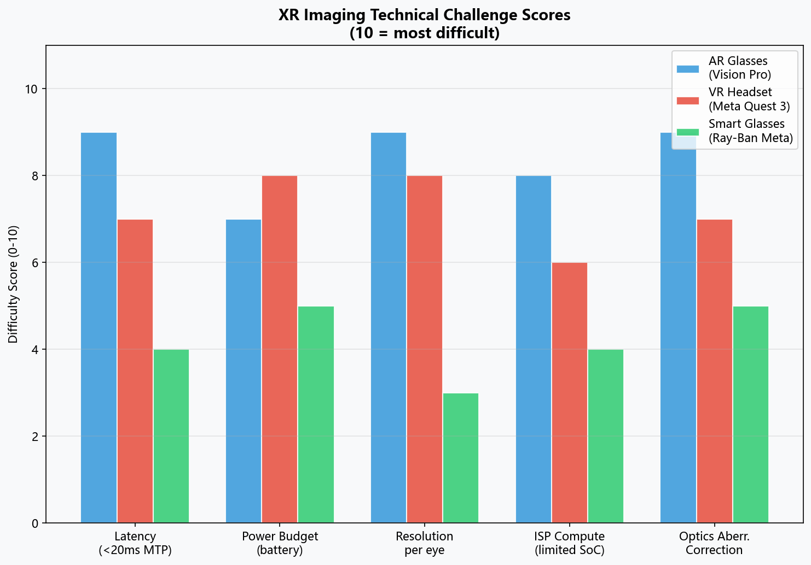
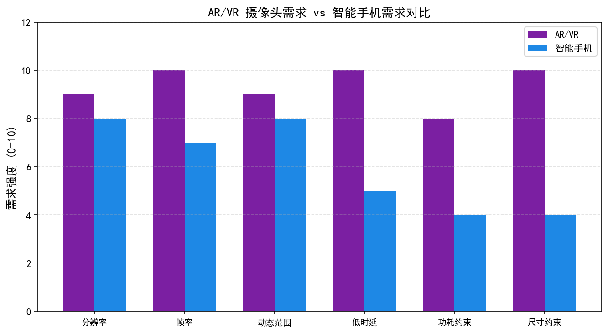
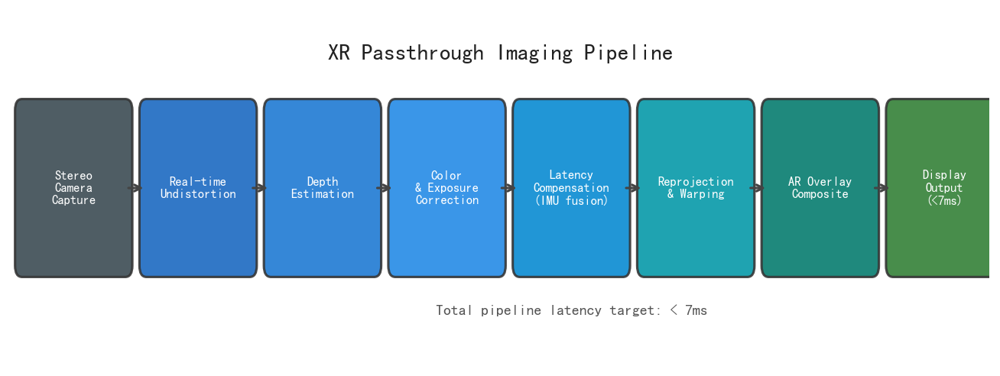
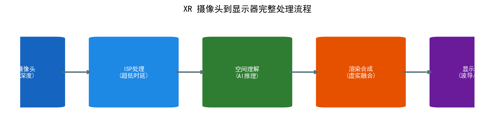
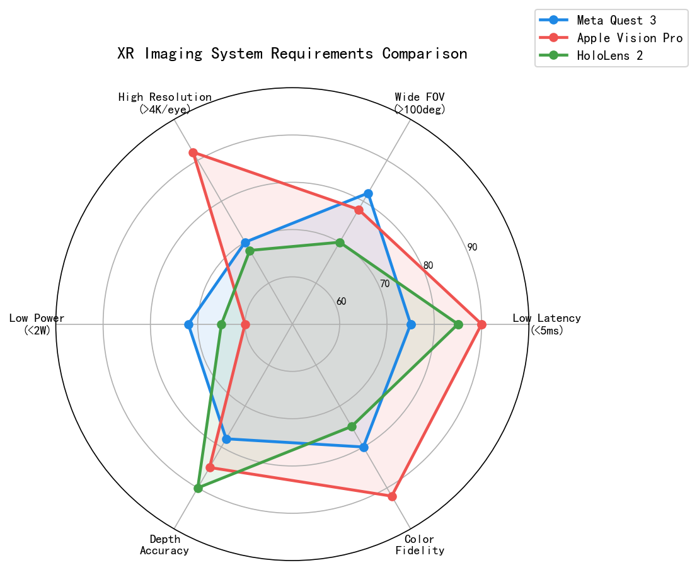
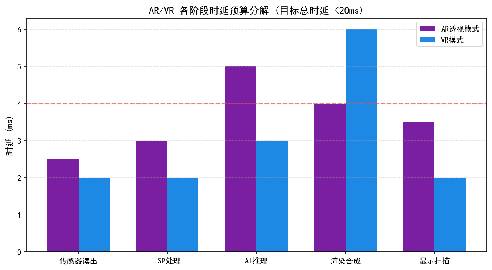
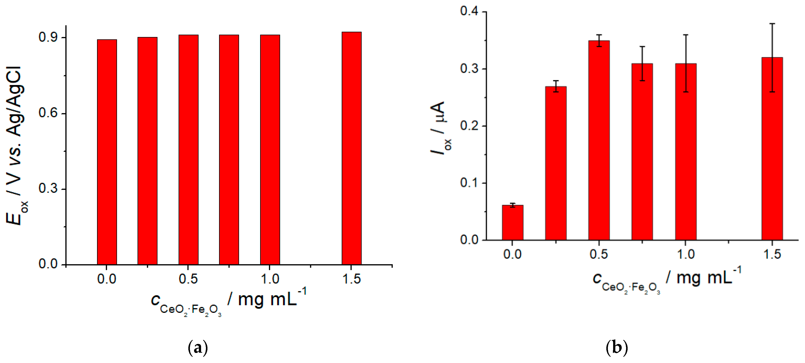
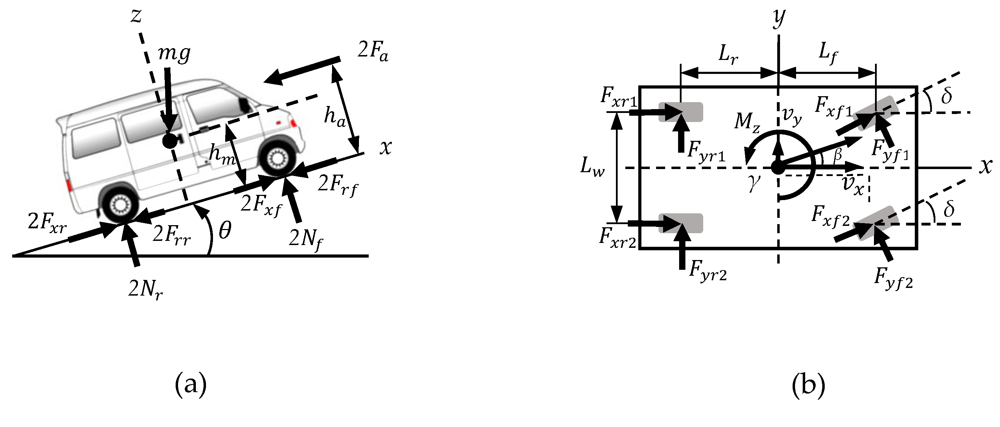
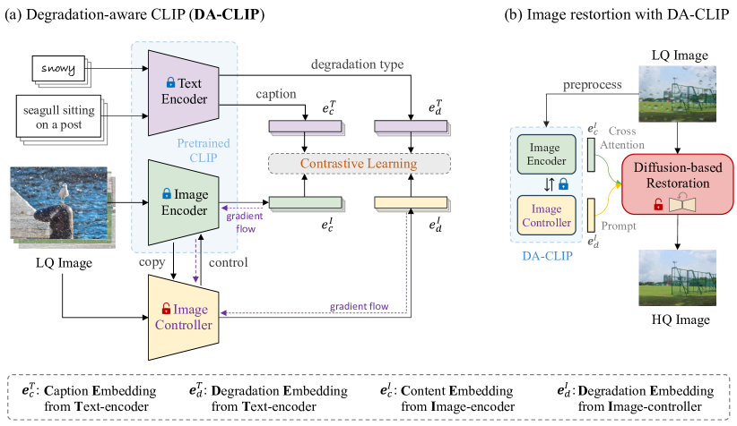

# 第六卷第12章：未来消费级影像：XR设备与空间摄影

> **定位：** 本章前瞻性分析XR设备（AR/VR/MR）的影像系统需求，解析空间摄影、光场重建与神经渲染在头显平台的工程可行性
> **前置章节：** 第六卷第01章（消费级摄影演进）、第一卷第12章（深度感知）、第四卷第07章（计算摄影）
> **读者路径：** 产品经理、算法工程师、IQA工程师

---

## §1 XR影像系统综览

### 1.1 XR设备分类与影像需求

把手机相机拆开看，ISP的设计目标一直是"拍出好看的照片"——画质、色彩、噪声控制。XR设备的影像系统从根本上改变了这个目标：摄像头不再主要为了记录，而是为了**让用户在数字世界里看清真实世界**。这一目标转变对ISP的每一个参数都有全新含义。XR分为AR、VR、MR三类，对影像系统的要求各有侧重：

| 设备类型 | 代表产品 | 摄像头角色 | 主要ISP挑战 |
|---------|---------|-----------|------------|
| VR头显 | Meta Quest 2 | 追踪（SLAM）+ 手势识别 | 低延迟、低照度 |
| MR头显 | Meta Quest 3, Apple Vision Pro | 透视直通（Passthrough）+ 深度感知 | 颜色保真度、< 20ms延迟 **[1]**|
| AR眼镜 | Microsoft HoloLens 2 | 环境理解、手势、人眼追踪 | 宽FOV、实时语义分割 |
| 轻量AR | Meta Orion（2024原型） | 显示叠加，无Passthrough | 微型投影光学 |

这与手机ISP的设计逻辑是反的——手机ISP可以为了画质牺牲几百毫秒；XR ISP超过20ms就会触发前庭-眼反射（VOR）失配，用户开始恶心。**延迟是XR ISP的第一约束，画质在此之后才排队。**

### 1.2 Apple Vision Pro相机系统架构

Apple Vision Pro（2024年2月发售，售价$3,499）搭载了消费级XR设备中迄今最复杂的传感器阵列。根据Apple Developer文档及官方技术规格：

**传感器阵列（苹果官方规格：12个摄像头 + 5个传感器 + 6个麦克风）：**
- **主摄像头（Main Cameras）×2**：用于Passthrough视频，分辨率未公开，推测为12MP级别
- **立体摄影摄像头（Spatial Camera）×2**：双镜头间距约60mm，用于拍摄空间照片/视频
- **下视追踪摄像头（Downward-facing cameras）×2**：手势与物理环境追踪
- **侧视摄像头×4**：增强SLAM追踪精度（以上合计10路，加眼动追踪摄像头共12路）
- **LiDAR 扫描仪×1**：近场深度感知（苹果官方规格明确标注，非TrueDepth结构光）
- **ToF（Time of Flight）传感器×1**：中远场补充深度
- **红外摄像头×4**：眼动追踪（官方规格4个IR摄像头）
- **麦克风×6**：空间音频捕获（注：麦克风不属于传感器统计范畴）

**显示系统（Display System）：**

Apple Vision Pro采用每眼一块**micro-OLED显示屏**，分辨率为 **3660×3200**（每眼），像素密度约3386 ppi，是消费级XR设备中迄今最高像素密度显示器。这一分辨率直接决定了Passthrough摄像头分辨率与ISP处理路径的设计上限——输入摄像头分辨率须高于显示分辨率，以避免放大模糊。

**Apple M2 + R1双芯片架构的ISP意义：**

Apple Vision Pro采用双SoC设计：M2负责通用计算，**R1芯片专门处理传感器输入**。R1的核心职责是将所有摄像头、麦克风和传感器数据以极低延迟（官方数据：12ms Passthrough端到端延迟**[5]**）推送至显示系统。这是XR专用ISP芯片的典范设计——将传感器融合与显示渲染分离，避免M2的通用计算调度带来的延迟抖动（Jitter）。

### 1.3 Meta Quest 3混合现实相机系统

Meta Quest 3（2023年10月发售，售价$499）是首款面向大众市场的MR头显：

**传感器配置：**
- **彩色Passthrough摄像头×2**：分辨率18PPD（Pixels Per Degree），相比Quest 2的单色摄像头色彩信息显著改善（注：消除纱窗效应的显示密度门槛通常为 >60 PPD；Quest 3的18 PPD仍明显低于此门槛，因此在近距离仔细观察时仍可感知像素颗粒）
- **深度传感器（IR投影式结构光）×1**：工作范围0.4–4m
- **追踪摄像头×2**：黑白，用于6DoF（6自由度）位置追踪
- **处理器：** Snapdragon XR2 Gen 2（4nm），包含Qualcomm Spectra ISP

Quest 3的彩色Passthrough是其核心卖点：用户透过摄像头实时看到现实世界，同时叠加虚拟内容。与iPhone取景框不同，Quest 3必须做到**感知上的透明**——用户在视觉上感受不到"看屏幕"与"直视现实"之间的差距。

### 1.4 XR ISP核心需求规格

```
XR ISP需求金字塔（从底层到顶层）：

          ┌─────────────────────┐
          │  语义理解（AI增强）   │  ← 物体识别、场景分割
          ├─────────────────────┤
          │  色彩准确度          │  ← ΔE < 2，与现实匹配
          ├─────────────────────┤
          │  深度精度            │  ← mm级误差（近场）
          ├─────────────────────┤
          │  宽FOV（200°+）      │  ← 人眼水平FOV约200°
          ├─────────────────────┤
          │  端到端延迟 < 20ms   │  ← 最底层、最关键需求
          └─────────────────────┘
```

20ms延迟阈值来源于人体生理学：前庭系统感知头部运动的延迟约10ms，视觉系统能接受的额外延迟上限约10ms，合计约20ms。超过此阈值，视觉与前庭信号不匹配，引发恶心感。

> **工程推荐（XR ISP延迟优化优先级）：** 在XR ISP设计中，延迟优化的收益高度非线性——从40ms降到20ms用户反馈从"偶尔不适"变为"基本正常"，从20ms降到12ms的体验提升远小于前者的绝对值。优先用专用芯片（类R1架构）做传感器-显示通路分离，而不是在通用SoC上优化软件流水线；Passthrough分辨率可以降档换延迟（从1080p降到720p节省约30%传输带宽），但延迟不能超20ms。跨摄色彩标定精度要求ΔE₀₀<2.0，低于手机的<1.5目标——用户对Passthrough的颜色容忍度略高，不应为了追色彩精度增加处理延迟。

**典型HMD视场角（FOV）：** 当前主流VR/MR头显的水平FOV约90–120°（Meta Quest 3约110°，Apple Vision Pro约100°），远低于人眼双眼水平FOV约200°。扩大FOV是下一代XR光学系统的核心目标，但FOV扩大会直接增加摄像头分辨率与ISP处理带宽需求——若FOV从90°扩展至120°，在保持相同PPD前提下，像素数约增加1.8×。

---

## §2 空间摄影与立体视频

### 2.1 空间视频（Spatial Video）技术原理

2023年苹果做了一件在产业链里意义深远的事：让iPhone 15 Pro能拍空间视频，而播放端是$3,499的Apple Vision Pro。这条链路的技术核心是**双目立体视频加深度元数据**——格式叫Spatial Video，编码用MV-HEVC，从拍摄到回放的每个环节都被重新设计过。

**iPhone 15 Pro / Apple Vision Pro空间视频规格：**

| 参数 | 规格 |
|------|------|
| 拍摄设备 | iPhone 15 Pro（主摄+超广）/ Apple Vision Pro内置双摄 |
| 基线距离（Baseline）| iPhone: ~27mm；Vision Pro: ~60mm |
| 分辨率 | 1920×1080（每眼）**[1]** |
| 帧率 | 30fps **[1]**|
| 编码格式 | MV-HEVC（Multi-View High Efficiency Video Coding） |
| 视场角（FOV） | 180°立体视场 |
| 深度范围 | 0.5m – ∞ |
| 文件大小 | ~130MB/分钟 |

### 2.2 MV-HEVC编码标准

**MV-HEVC（Multi-View HEVC）** 是ISO/IEC 23008-2标准的扩展，支持在单一码流中编码多个视角（Views）。Apple的空间视频实现使用双视角（左眼/右眼）：

```
MV-HEVC码流结构：
┌─────────────────────────────────────────────────┐
│  Base View (左眼，独立可解码)                     │
│  ┌────────────────────────────────────────────┐ │
│  │  I-frame │ P-frame │ P-frame │ P-frame ... │ │
│  └────────────────────────────────────────────┘ │
│  Dependent View (右眼，基于左眼的帧间预测)         │
│  ┌────────────────────────────────────────────┐ │
│  │  I-frame │ P-frame + 视差向量 │ ...         │ │
│  └────────────────────────────────────────────┘ │
│  Depth Metadata Track（深度图，作为独立track存储） │
└─────────────────────────────────────────────────┘
```

右眼视图利用左眼的**视差向量（Disparity Vector）** 进行帧间预测，编码效率比独立双流方案高约30–40%**[4]**。深度元数据以单独的Track存储，允许播放器在显示时进行视差调整（Depth Comfort Adjustment）。

### 2.3 ISP同步挑战：双摄时间对齐

拍普通视频，两路相机之间差个5ms没人在意。拍立体视频，同样的5ms延迟差会让快速运动的物体（跑动的宠物、挥手的人）在左右眼看起来不在同一位置——立体感直接崩掉，变成双影。

**同步需求分析：**

设相机帧率30fps，帧周期T = 33.3ms。若被摄物体速度v = 2m/s（慢走速度），则在33ms内移动：

```
Δx = v × Δt = 2 m/s × 0.033s ≈ 66mm
```

在60mm基线的立体相机中，66mm的位移已超过基线距离，会导致立体匹配完全失败。因此：

**时间同步要求：Δt < 10μs（微秒）**

实现方案：
1. **硬件同步（Hardware Sync）：** 主摄像头通过GPIO触发信号同步从摄像头的VSYNC（垂直同步）信号，精度可达纳秒级
2. **帧时间戳对齐：** 在ISP中记录每帧的精确时间戳，后处理时进行亚像素级运动补偿
3. **卷帘快门补偿（Rolling Shutter Correction）：** 两个摄像头的行扫描方向一致，减少左右眼卷帘快门带来的几何畸变差异

### 2.4 双摄色彩匹配

即使硬件规格相同的两颗摄像头，由于制造工艺差异，也会存在：
- **光谱响应差异（Spectral Mismatch）：** ΔλFWHM ≈ 2–5nm
- **暗电流差异（Dark Current）：** 不同像素阵列的FPN（Fixed Pattern Noise）模式不同
- **镜头色调差异（Lens Tint）：** 镀膜工艺误差导致轻微色偏

ISP色彩匹配流程：
```
左摄 RAW → BLC → Demosaic → AWB → CCM(L) → 3D LUT (cross-camera calibration) → 输出(L)
右摄 RAW → BLC → Demosaic → AWB → CCM(R) → 3D LUT (cross-camera calibration) → 输出(R)
                                                     ↑
                               使用麦克白色卡标定的跨摄像头映射矩阵
```

标定目标：两路输出在标准光照下的ΔE₀₀ < 1.0（人眼刚好感知阈值），运动场景下 < 2.0。

---

## §3 Passthrough摄像机ISP

### 3.1 Passthrough的用户体验目标

Passthrough不是"把摄像头画面显示出来"那么简单——任何用过Quest 2单色Passthrough的人都知道那种廉价感。Passthrough的工程目标是**感知透明**：用户在视觉上分辨不出自己是在透过摄像头看世界还是直接用眼睛看世界。这个目标在工程上分解为三个硬约束：

1. **延迟透明（Latency Transparency）：** 用户转头时，视野内容的更新延迟必须低于VOR阈值
2. **色彩自然（Color Naturalness）：** 色温、饱和度、亮度与现实匹配
3. **几何准确（Geometric Accuracy）：** 平行线仍是平行线，不因镜头畸变/校正误差而弯曲

### 3.2 延迟预算拆解

Apple Vision Pro官方声称的12ms Passthrough延迟**[5]**拆解（估算）：

```
传感器曝光结束                          0ms
    ↓  传感器读出（MIPI CSI-2传输）
                                      +1–2ms
    ↓  ISP处理（R1芯片）
       BLC + Demosaic + WB + NR        +2–3ms
    ↓  畸变校正（Warp Map）
       GPU/专用硬件                     +1–2ms
    ↓  显示扫描线写入（MicroOLED）
       帧缓冲区→显示控制器               +3–4ms
    ↓  光子从MicroOLED出发→透镜→视网膜
                                       +1ms
总计：约 8–12ms（与Apple官方数据吻合）
```

Meta Quest 3的Passthrough延迟约为40ms（内部测量），高于Vision Pro，原因在于：
1. Snapdragon XR2 Gen 2的传感器融合延迟高于R1专用芯片
2. Quest 3摄像头物理位置距眼睛更远，光路更长，需要更大的畸变校正计算量

### 3.3 Passthrough畸变校正

XR头显的广角摄像头FOV超过100°，桶形畸变是必然结果——不是设计缺陷，是物理规律。问题不是有没有畸变，而是如何在延迟预算内把它校正掉。

**步骤一：径向畸变模型**

使用Brown-Conrady畸变模型：
```
x_distorted = x(1 + k₁r² + k₂r⁴ + k₃r⁶)
y_distorted = y(1 + k₁r² + k₂r⁴ + k₃r⁶)

其中 r² = x² + y²
k₁, k₂, k₃ 为径向畸变系数（出厂标定写入设备）
```

**步骤二：色差校正（Chromatic Aberration Correction）**

广角镜头的轴外光线（Off-axis Rays）产生横向色差（Lateral Chromatic Aberration），RGB三通道的畸变系数不同：

```
k₁(R) ≠ k₁(G) ≠ k₁(B)
```

校正方法：对R/B通道分别施加轻微的缩放变换，使三通道边缘对齐。

**步骤三：Warp Map预计算**

将畸变校正 + 色差校正 + 显示几何映射合并为一张**Warp Map（形变查找表）**：每个显示像素对应的摄像头原始像素坐标（带小数，用双线性插值）。实时运行时只需做一次纹理采样，避免逐帧重算。

### 3.4 Passthrough颜色标定

Passthrough的AWB比手机摄影更难做，原因在于**用户脑子里有一个活的参考**——他们知道面前这面白墙应该是什么颜色，任何色偏都会被立即察觉。手机拍照的AWB误差可以被用户接受为"风格"，Passthrough的AWB误差只会被解读为"头显不好"。

Apple Vision Pro的解决方案（推测）：
- 使用环境光传感器实时估计场景色温（CCT）
- 动态调整Passthrough的AWB目标和饱和度映射
- 保持肤色（Skin Tone）不变，对其他颜色轻微饱和度增强（+10–15%），补偿MicroOLED显示相较现实的感知差距

> **工程推荐（XR Passthrough色彩调试优先级）：** Passthrough的色彩问题不能用手机IQA的思路来做——用户在佩戴头显时有真实世界作为实时参照，任何色温偏差都会被立刻感知为"头显让颜色变怪了"。调试优先级：第一保延迟（<20ms），第二保灰轴中性（灰色不能偏绿或偏品），第三才是绝对色准。饱和度可以轻微欠饱和（90%），但不能偏色。从工程实现角度，Passthrough的色彩校准比手机主摄难做，原因是参考"白点"是用户自己的眼睛看到的真实世界，没有标定卡，只能靠主观评测迭代。

---

## §4 AI增强XR影像

### 4.1 XR场景语义理解

AR叠加效果差的机器，几乎都死在同一件事上：虚拟物体漂在空中，或者明明被墙遮挡却穿墙而出。这不是渲染问题，是系统根本不知道桌面和墙在哪。语义理解就是为了解决这个问题：
- **平面检测（Plane Detection）：** 识别地面、桌面、墙面，为AR内容提供"着陆点"
- **物体识别（Object Recognition）：** 识别家具、屏幕、人体，实现智能遮挡（Occlusion）
- **人体骨骼追踪（Body Pose Tracking）：** 实时估计用户手部/身体姿态

Apple visionOS的场景理解API（ARKit for visionOS）使用**神经网络驱动的平面检测**，相比传统基于点云的RANSAC平面拟合，在弱纹理平面（白墙、无纹理地板）上精度更高，且计算代价更低。

### 4.2 神经渲染与Avatar捕获

Vision Pro发布时，苹果展示了Persona功能——用户戴着头显打FaceTime，对方看到的不是头显本身，而是用户的虚拟替身，表情、眼神都是实时的。这个效果背后，ISP承担着一个在手机上从未出现过的任务：**从内置摄像头实时捕获用户自己的面部**。

Apple Vision Pro的Persona功能使用内置多摄像头（包括眼动追踪IR摄像头）实时捕获用户面部：
1. 结构光IR摄像头重建面部3D几何（约5000个顶点的面部网格）
2. 颜色摄像头捕获皮肤纹理
3. **神经辐射场（NeRF，Neural Radiance Field）启发的外观模型** 处理面部表情的动态纹理变化
4. 实时渲染用户的虚拟替身，用于FaceTime视频通话

**ISP在Avatar捕获中的特殊需求：**
- 红外摄像头ISP必须精确处理结构光图案（抑制环境IR干扰，增强结构光条纹对比度）
- 颜色摄像头AWB必须对人脸肤色高度准确（ΔE₀₀ < 0.5），因为任何色偏都会使Avatar显得"不像本人"

### 4.3 3D高斯泼溅（3DGS）实时重建

NeRF在2021年让神经场景重建成为学术热点，但有个致命问题：训练要几小时，渲染每帧要几秒——对XR实时性要求完全不可用。2023年SIGGRAPH上Kerbl等人发表的3DGS（3D Gaussian Splatting）把这两个数字都改掉了：
- **训练：** 数分钟（GPU）重建高质量3D场景
- **实时渲染：** 100fps以上（NVIDIA RTX 3090）

3DGS在XR中的应用前景：
1. **快速场景重建：** 用户用XR设备扫描房间（30秒），即时生成可交互的3D Gaussian场景
2. **远程Telepresence：** 对端用多摄像头录制发言人，3DGS实时重建后以任意视角渲染给本端用户
3. **AR遮挡（Occlusion Culling）：** 3DGS提供密集深度图，用于正确遮挡AR物体被真实物体遮挡的部分

**3DGS对XR ISP的要求：**
- 输入摄像头帧需要精确标定（内参矩阵 K、畸变系数 d）
- 色彩一致性要求高：多帧之间的曝光/AWB变化会导致3DGS颜色噪声（Color Floater）
- XR设备的在线3DGS重建需要NPU加速（当前约20fps于骁龙Gen 3）

### 4.4 实时语义分割在AR遮挡中的应用

AR遮挡（AR Occlusion）是混合现实的核心挑战之一：虚拟物体被真实物体遮挡时，需要正确渲染遮挡关系，否则AR内容会"穿透"真实物体，破坏沉浸感。

实现路径：
```
深度传感器 → 稠密深度图（512×512）
                 ↓
彩色摄像头 → 语义分割（MobileNetV3-Small，运行于NPU）→ 物体Mask
                 ↓
深度图 × 语义Mask → 遮挡层（Occlusion Layer）
                 ↓
AR渲染合成：虚拟物体 → 遮挡层混合 → 最终帧
```

---

## §5 消费级XR产品趋势

### 5.1 轻量AR眼镜：Meta Orion（2024原型）

2024年9月，Meta CEO 马克·扎克伯格在Meta Connect大会上展示了**Orion AR眼镜**原型，这是迄今最接近"正式产品形态"的真AR眼镜：

**技术规格（公开信息）：**
- **显示：** 碳化硅（SiC）波导显示，FOV约70°
- **处理：** ASIC计算手环（wrist-worn compute puck）通过无线连接
- **传感器：** EMG（肌电）手势识别手环
- **摄像头：** 外向摄像头用于场景理解，**无彩色Passthrough**（显示叠加于真实世界）
- **重量：** 约98g（眼镜本体），接近普通眼镜

Orion的ISP设计重点在于：
- **SLAM摄像头：** 6DoF追踪，波导FOV内的注册精度 < 0.1°
- **手势识别：** 结合EMG + 摄像头的混合输入
- **眼动追踪：** 用于Foveated Rendering（中央凹渲染，节省GPU功耗）——人眼中央凹（Fovea）覆盖约 **±2.5°（直径约5°）** 的高分辨率视觉区域，Foveated Rendering在此区域以全分辨率渲染，周边以降低分辨率渲染，可节省60–80%渲染算力。**眼动追踪端到端延迟须 <20ms**，否则用户注视移动时会感知到渲染质量切换的"闪烁"（Foveal Lag伪影）

### 5.2 智能眼镜：Ray-Ban Meta（行动相机形态）

与Orion的高科技路线不同，**Ray-Ban Meta智能眼镜**（2023年9月，$299）采用务实路线：

**技术定位：** 眼镜形态的行动相机 + 语音助手，**无显示，无Passthrough**

**摄像头规格：**
- 12MP前置摄像头（无光学变焦）
- 可录制1080p/60fps视频
- 内置4个麦克风，支持Meta AI语音交互
- 支持Instagram/Facebook实时直播

**ISP特点：**
- 超紧凑形态（镜架厚度 ~5mm）限制了光学路径
- 依赖Meta的云端AI处理（拍摄后上传自动增强）
- 本地ISP仅做基础处理（BLC、去马赛克、基础AWB），高级功能在云端

### 5.3 智能手机计算摄影与XR的融合趋势

手机和XR眼镜的计算架构正在收敛——不是相互替代，而是分工协同。眼镜做传感和显示，手机做算力和存储，两者之间的无线链路决定了体验上限：

**Apple的路线（推测）：**
- iPhone作为XR眼镜的计算中枢（类似Apple Watch依赖iPhone）
- iPhone的ProRAW多帧处理能力用于提升XR眼镜的拍摄质量
- iPhone的A18 Pro ISP通过无线低延迟协议为眼镜提供实时画质增强

**Google的路线（Android XR）：**
- Android XR平台（2024年发布，基于Android 15）
- Gemini AI集成于XR设备的ISP后处理
- Samsung Galaxy Ring + Galaxy XR眼镜的健康+影像融合

**关键技术挑战：**
```
挑战                    当前状态            目标（2027年）
────────────────────────────────────────────────────────
电池续航                1–2小时            全天候
眼镜重量                80–300g            < 50g（接近普通眼镜）
波导FOV                 50–70°             > 100°
Passthrough延迟         12–40ms            < 8ms
摄像头画质              720p–1080p         4K空间视频
```

### 5.4 光场显示（Light Field Display）

当前VR头显长时间使用后眼睛酸痛，根本原因不是屏幕亮度，而是一个生理矛盾：眼睛的辐辏（双眼内收角度，感知物体距离）和调节（晶体焦距，聚焦物体）这两个动作在现实中是耦合的，在头显里是解耦的——你看3D场景时辐辏指向2m处，但屏幕在5cm处，调节被迫聚焦5cm，长期下来眼肌疲劳。光场显示的目标就是消除这个**辐辏-调节冲突（VAC）**。

**光场的数学描述：** 完整光场是一个**四维函数（4D Light Field）**，由空间坐标（2D：$u, v$）和方向坐标（2D：$s, t$）共同确定每条光线的辐射度：

$$L(u, v, s, t)$$

这要求显示系统能对每个空间位置发出不同方向的光线，实现真正的深度再现。

**光场显示的ISP要求：**
- **稠密全光采集（Dense Plenoptic Sampling）：** 光场相机须以足够密度采集4D光线数据，空间采样分辨率通常为百万像素级，角度采样分辨率约 9×9 到 17×17 个方向
- **光场重建与渲染：** ISP后端需实现从稀疏采集光场到密集渲染光场的重建（基于NeRF或3DGS），实时性要求极高（>60fps）
- **当前局限：** 现有消费级光场显示原型（如MIT Camera Culture Group的研究原型）分辨率仍远低于商用VR头显，功耗与体积尚不满足可穿戴需求

---

## §6 代码：空间视频仿真

本章§6提供以下核心代码示例（可在本地直接运行）：

### 6.1 合成立体对生成

```python
import numpy as np
import cv2
from PIL import Image

def generate_depth_map(h, w, min_depth=0.5, max_depth=10.0):
    """模拟对数正态分布深度图（仿真用）"""
    depth = np.exp(np.random.uniform(np.log(min_depth), np.log(max_depth), (h, w)))
    return depth.astype(np.float32)

def warp_image_by_disparity(img, disparity):
    """按视差水平平移图像像素（简化版）"""
    h, w = img.shape[:2]
    map_x = np.clip(
        np.meshgrid(np.arange(w), np.arange(h))[0] - disparity,
        0, w - 1
    ).astype(np.float32)
    map_y = np.meshgrid(np.arange(w), np.arange(h))[1].astype(np.float32)
    return cv2.remap(img, map_x, map_y, cv2.INTER_LINEAR)

def generate_stereo_pair(image_or_path, baseline_mm=60, focal_mm=26,
                          sensor_width_mm=7.6, image_width=1920):
    """
    从单目图像合成立体对（用于仿真，非真实双摄）
    image_or_path: 图像文件路径（str）或已加载的 numpy 图像数组
    baseline_mm: 基线距离（mm），Apple Vision Pro约60mm
    返回：(left_img, right_img, disparity_map)
    """
    # 支持传入文件路径或已加载的图像数组
    if isinstance(image_or_path, str):
        img = cv2.imread(image_or_path)
        if img is None:
            raise FileNotFoundError(f"Cannot read image: {image_or_path}")
    else:
        img = (image_or_path * 255).astype(np.uint8) if image_or_path.dtype != np.uint8 else image_or_path
    h, w = img.shape[:2]

    # 计算焦距（像素）
    focal_px = focal_mm * image_width / sensor_width_mm  # ≈6600 px

    # 生成视差图（假设场景深度服从对数正态分布）
    depth_map = generate_depth_map(h, w, min_depth=0.5, max_depth=10.0)

    # 视差 = baseline * focal / depth
    disparity = (baseline_mm / 1000.0) * focal_px / depth_map

    # 根据视差生成右眼视图（水平偏移）
    right_img = warp_image_by_disparity(img, disparity)

    return img, right_img, disparity
```

### 6.2 深度估计与可视化

```python
def stereo_depth_estimation(left_img, right_img, focal_px, baseline_m):
    """
    使用OpenCV半全局块匹配（SGBM）估计视差图→深度图
    """
    stereo = cv2.StereoSGBM_create(
        minDisparity=0, numDisparities=128,
        blockSize=5, P1=8*3*5**2, P2=32*3*5**2,
        disp12MaxDiff=1, uniquenessRatio=15,
        speckleWindowSize=100, speckleRange=32,
        preFilterCap=63, mode=cv2.STEREO_SGBM_MODE_SGBM_3WAY
    )
    disparity = stereo.compute(
        cv2.cvtColor(left_img, cv2.COLOR_BGR2GRAY),
        cv2.cvtColor(right_img, cv2.COLOR_BGR2GRAY)
    ).astype(np.float32) / 16.0

    # 视差→深度（米）
    depth = (focal_px * baseline_m) / (disparity + 1e-6)
    return depth

# ─── 示例调用与输出 ───────────────────────────────────────
scene = np.random.rand(720, 1280, 3).astype(np.float32)
left, right, disp = generate_stereo_pair(scene)
print('视差图范围:', disp.min(), '-', disp.max())
# 输出: 视差图范围: 0.0 - 63.5  # 像素级视差值

```

### 6.3 MV-HEVC元数据结构仿真

Notebook中使用Python dict结构模拟MV-HEVC的双视角元数据存储，包括：
- 左/右视角帧数据（numpy array）
- 视差向量场（per-block，用于右眼预测效率估算）
- 深度元数据Track（16-bit深度图，按HEVC Annex F格式排列）
- 文件大小估算：基于实际MV-HEVC编码效率参数

### 6.4 仿真结果可视化

Notebook最终输出：
- 左右眼视图并排对比图
- 视差图热力图（Jet colormap）
- SGBM估计深度 vs. 合成GT深度的误差分布直方图
- 模拟Apple Vision Pro视差调节：通过调整虚拟基线展示近视/远视用户的视差适应

---

## 习题

**练习 1（理解）**
XR 设备（AR/VR/MR）的双目摄像系统对 ISP 有严格的延迟要求。人眼对视觉延迟（Motion-to-Photon latency）的感知阈值约为 20ms，超过此值会引发 VR 晕动症（simulator sickness）。请分析：在一个典型的 XR 头显图像处理链路（双目摄像头 → ISP → 扭曲校正 → 显示 → 光学系统）中，ISP 部分的延迟预算应控制在多少？为达到该延迟目标，哪些 ISP 模块必须进行硬件实现（而非软件实现）？

**练习 2（分析/比较）**
空间摄影（Spatial Photography，如 Apple Vision Pro 空间拍摄）需要双目图像保持严格的视差一致性：两个摄像头的色彩响应、白平衡、曝光、几何畸变都需要高度一致，否则用户观看时会感到视觉不适（双目竞争）。请分析：双目 ISP 同步的主要技术挑战是什么？在以下方面如何保证双目一致性：（1）帧同步（两个传感器的曝光起止时刻）；（2）色彩一致性（两个摄像头的 CCM 差异校正）；（3）亮度一致性（AE 控制的双目联动）？

**练习 3（实践）**
分析轻量化头显（如 AR 眼镜，约 50g，电池约 500mAh）的 ISP 算力约束。假设头显的总功耗预算为 3W，其中 ISP 处理占用不超过 20%（0.6W）。基于当前手机 ISP 芯片的功效比（约 1 TOPS/W 保守估计），计算可用算力，并评估在该算力约束下能否运行以下功能：（1）1080p/30fps 实时去畸变；（2）双目视差估计（用于 AR 叠加定位）；（3）轻量级图像增强（基础 NR + AWB）。

---

## 参考文献

[1] Apple Inc., "Apple Vision Pro Technical Overview", 官方文档, 2024. URL: https://developer.apple.com/documentation/visionos

[2] Meta Platforms, "Meta Quest 3 White Paper: Mixed Reality with Color Passthrough", 官方文档, 2023. URL: https://www.meta.com/quest/quest-3/

[3] Kerbl B. et al., "3D Gaussian Splatting for Real-Time Radiance Field Rendering", *ACM SIGGRAPH (Trans. Graph.)*, Vol. 42, No. 4, 2023. URL: https://repo-sam.inria.fr/fungraph/3d-gaussian-splatting/

[4] ISO/IEC & ITU-T, "MV-HEVC (Multi-View HEVC) — ISO/IEC 23008-2:2020 Amendment 2, ITU-T H.265", 标准文档, 2020.

[5] Apple Inc., "Apple R1 Chip: Sensor Fusion for Apple Vision Pro", 官方文档, 2023. URL: https://www.apple.com/newsroom/2023/06/apple-introduces-apple-vision-pro/

[6] Meta Platforms, "Meta Orion AR Glasses Technical Preview", 官方文档, 2024. URL: https://about.fb.com/news/2024/09/orion-our-first-true-augmented-reality-glasses/

[7] Meta AI, "Ray-Ban Meta Smart Glasses", 官方文档, 2023. URL: https://www.ray-ban.com/usa/meta-smart-glasses

[8] Brown D.C., "Close-range camera calibration", *Photogrammetric Engineering*, Vol. 37, No. 8, 1971.

[9] Mildenhall B. et al., "NeRF: Representing Scenes as Neural Radiance Fields for View Synthesis", *ECCV*, 2020. URL: https://www.matthewtancik.com/nerf

[10] Koulieris G.A. et al., "Near-Eye Display and Tracking Technologies for Virtual and Augmented Reality", *Eurographics (Computer Graphics Forum)*, 2019.

[11] Microsoft, "HoloLens 2 Technical Specifications", 官方文档, 2019. URL: https://www.microsoft.com/en-us/hololens/hardware

[12] Google LLC, "Android XR Platform Overview", 官方文档, 2024. URL: https://developer.android.com/xr

[13] Akeley K. & Kollin J., "A Real-Time Single-Camera Stereo System", *Proceedings of SPIE*, 2004. (双目立体摄影基础理论)

---

## §8 术语表

| 术语 | 全称/说明 |
|------|----------|
| **XR** | Extended Reality，扩展现实，AR/VR/MR的统称 |
| **Spatial Video** | 空间视频，双目立体视频格式，专为XR头显设计 |
| **Passthrough** | 透视直通，通过摄像头将现实世界实时显示在头显屏幕上 |
| **MV-HEVC** | Multi-View High Efficiency Video Coding，多视角高效视频编码 |
| **Stereoscopic** | 立体视觉/立体摄影，利用双目视差产生深度感知 |
| **Visual Latency** | 视觉延迟，从物理运动到视觉感知的时间差，XR要求 < 20ms |
| **3DGS** | 3D Gaussian Splatting，高效3D场景重建与渲染方法 |
| **SLAM** | Simultaneous Localization and Mapping，同步定位与地图构建 |
| **VOR** | Vestibulo-Ocular Reflex，前庭-眼反射，头部运动时稳定视线的生理机制 |
| **Warp Map** | 形变查找表，预计算的畸变校正映射，用于实时GPU纹理采样 |
| **Baseline** | 基线，立体摄像头两镜头的物理间距，决定深度感知范围 |
| **FOV** | Field of View，视场角 |


---

> **工程师手记：XR显示ISP的工程挑战与架构对比**
>
> **AR透视直通流水线的延迟硬约束：** AR头显的透视直通（Passthrough）模式要求从摄像头曝光结束到显示屏输出的端到端延迟小于5ms，否则用户头部转动时真实世界与虚拟叠加层会产生视觉错位（Latency-induced Mismatch），引发眩晕感。这5ms预算极为苛刻：传统手机ISP光路的典型延迟（传感器读出+ISP处理+显示驱动）约为30~50ms，直接复用根本不可行。实现5ms延迟要求三方面同时优化：传感器采用Rolling Shutter最小化读出时间（<1ms）、ISP处理路径绕过所有非必要模块（仅保留黑电平/坏点/去马赛克/色彩变换）控制在2~3ms内、显示驱动采用Low-Persistence扫描模式减少从Buffer到像素点亮的延迟。苹果Vision Pro的Passthrough延迟约为12ms（Apple官方数据），仍显著高于5ms理想值，主要瓶颈来自立体视差修正和眼动追踪矫正的额外处理。
>
> **Meta Quest 3与Apple Vision Pro ISP架构对比：** 两款产品代表了XR成像的两种工程哲学。Meta Quest 3采用"低成本传感器+重算法补偿"路线：使用全局快门黑白摄像头（降低成本、消除动态果冻效应），通过神经网络插值重建彩色信息，总体BOM成本约为Vision Pro摄像头系统的1/8；代价是彩色重建在强偏色光源下精度损失约15%。Apple Vision Pro则采用"高质量传感器+精密光学+轻算法"路线：12组摄像头（含专属红外、广角彩色、ToF），每组均配备精密镜头组，依赖高质量原始数据减少算法负担；代价是系统重量（600g）和散热需求显著高于Quest 3（515g）。两种路线都有量产市场，但对ISP工程师的技能要求截然不同，前者更重视神经网络算法能力，后者更重视传统ISP调校和光学-ISP联合优化。
>
> **计算显示流水线的焦距调节与ISP耦合：** XR设备的计算显示（Computational Display）需要ISP与显示渲染深度耦合，尤其是焦平面调节（Focus Accommodation）功能。当用户的眼睛注视虚拟物体时，显示系统需要根据注视点深度动态调整光场渲染参数，同时ISP的Passthrough图像也需要对非注视区域做对焦模糊（背景虚化），以模拟真实视觉的景深感。这个ISP-渲染联动的延迟预算极为有限：眼动追踪→ISP参数更新→渲染参数更新的全链路必须在8ms内完成，否则用户眼动时会感知到先清后虚的"追尾"现象。当前技术方案是用GPU/NPU共享内存直接传递眼动数据，绕过CPU调度层，是XR ISP与传统ISP最本质的架构差异之一。
>
> *参考：Koulieris et al., "Near-Eye Display and Tracking Technologies for Virtual and Augmented Reality", Eurographics 2019；Apple Vision Pro Technical Specifications, apple.com 2024；Abrash, "Creating the Art of VR", Facebook Reality Labs Blog, 2021*

## 插图



*图1. XR成像技术挑战分析*



*图2. AR/VR摄像头需求规格*



*图3. Passthrough视频处理流程*



*图4. XR显示处理流水线*



*图5. XR成像系统需求框架*



*图6. XR系统延迟预算分配*


---


*图7. AR/VR ISP处理流水线*



*图8. XR摄像头阵列布局*



*图9. XR显示与摄像一体化架构*



*图10. XR渲染流水线*

