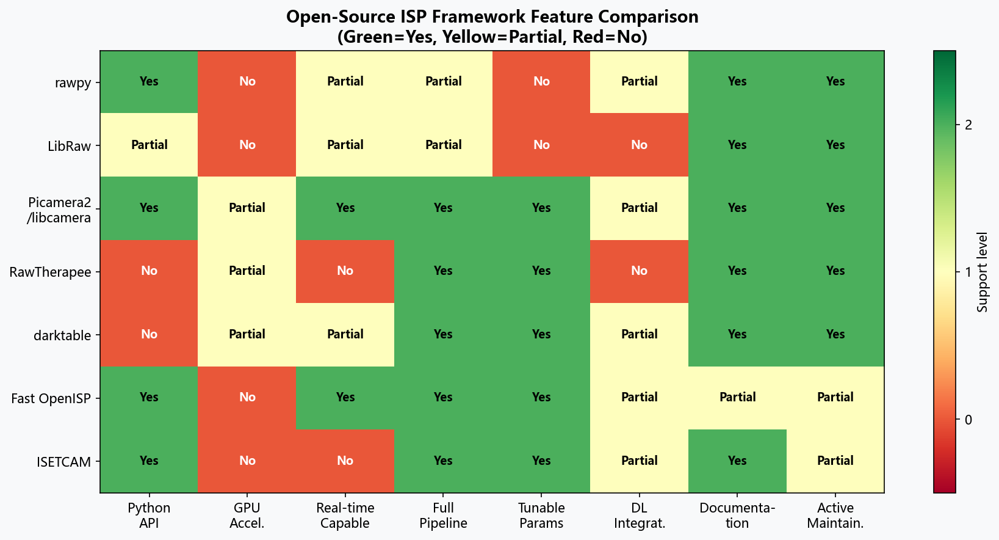
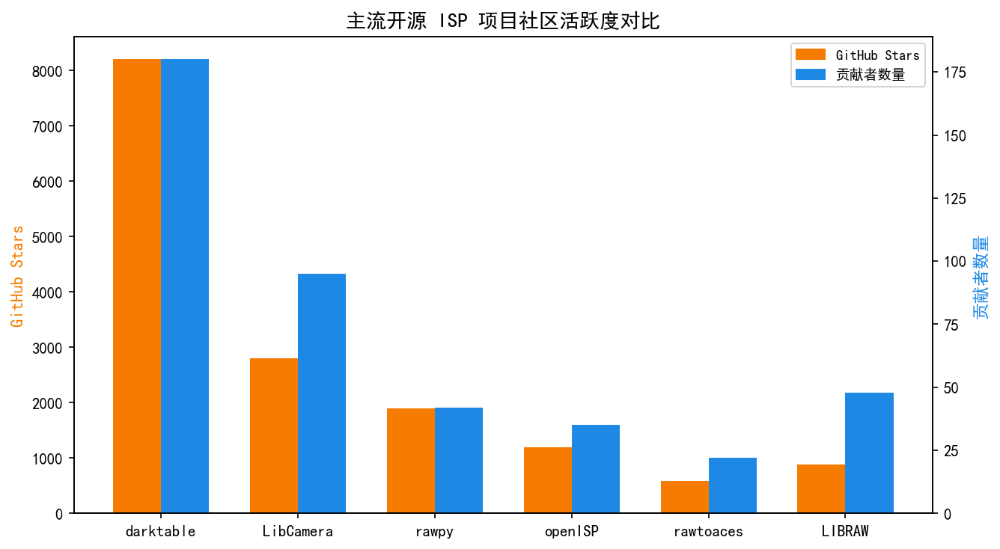
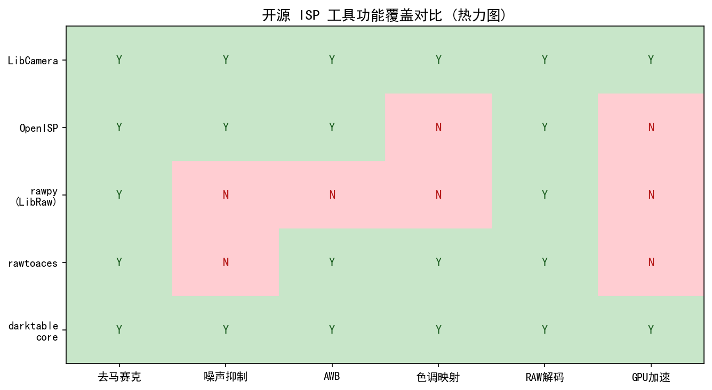
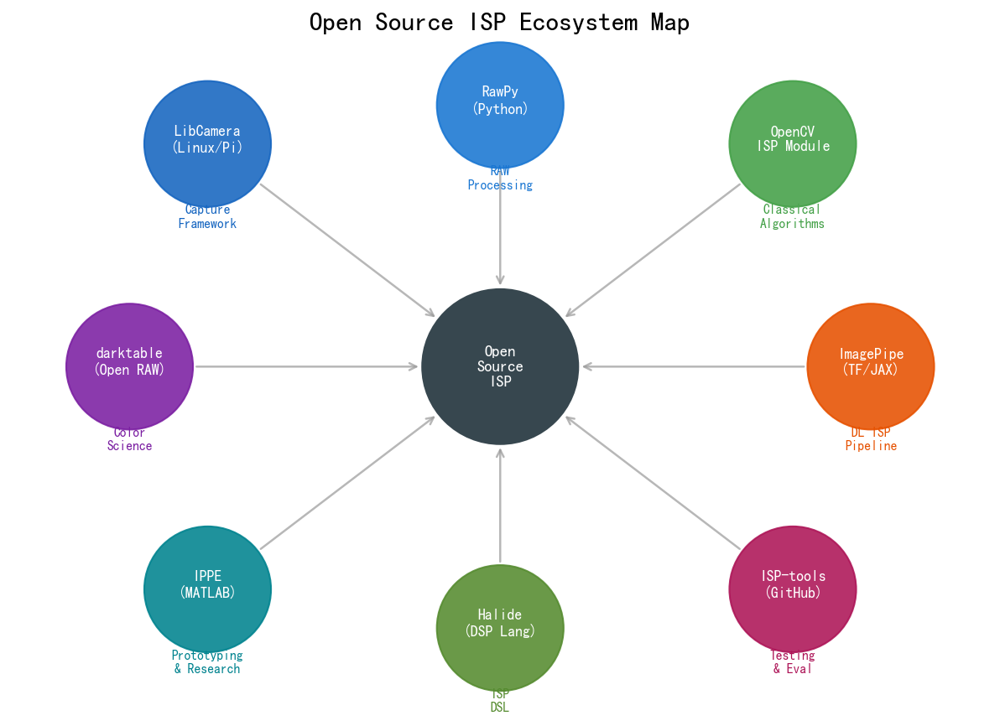
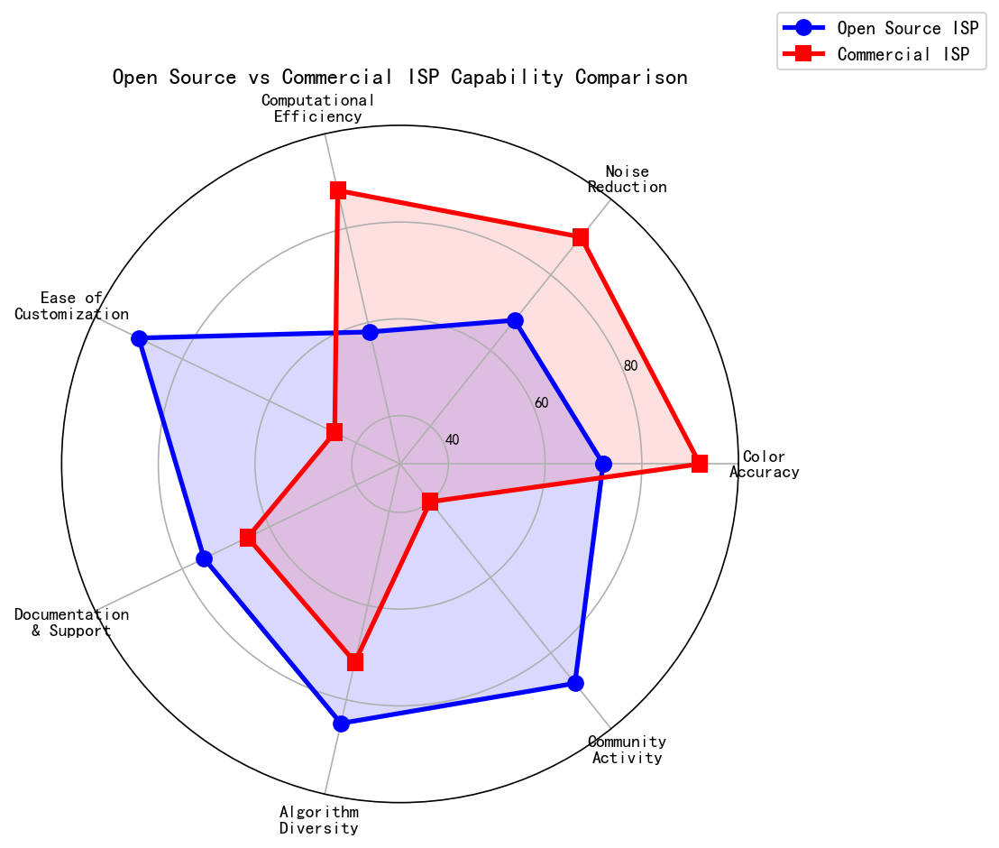
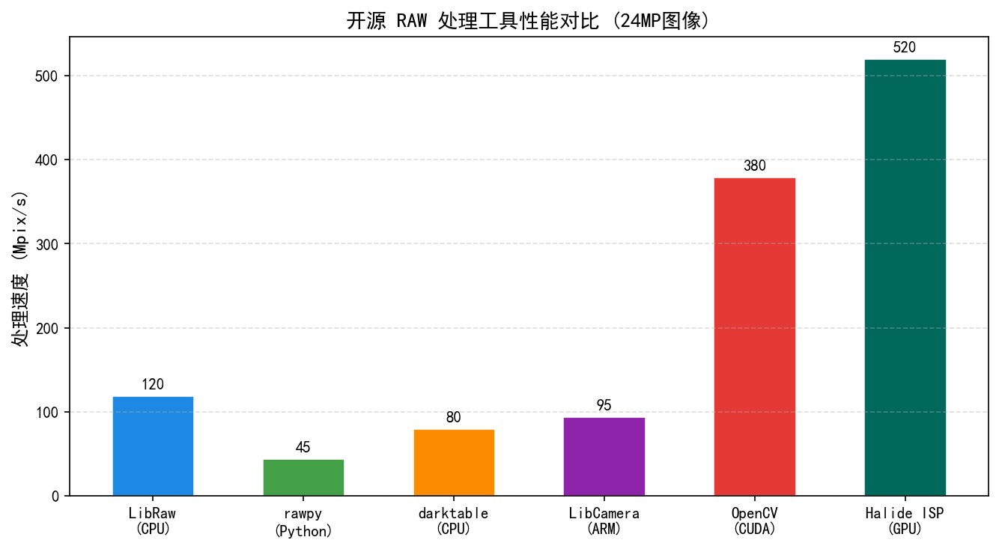
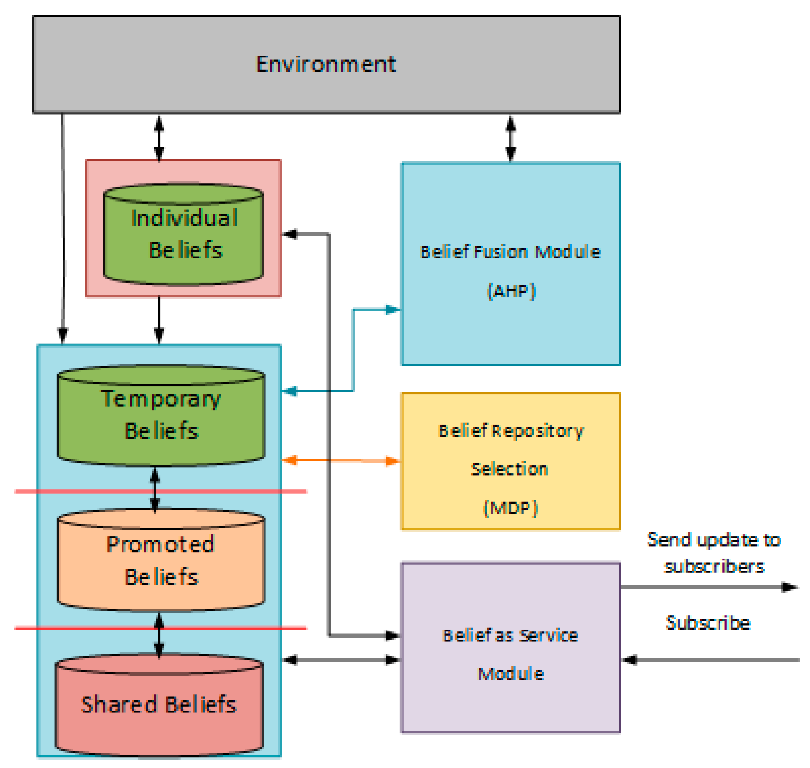
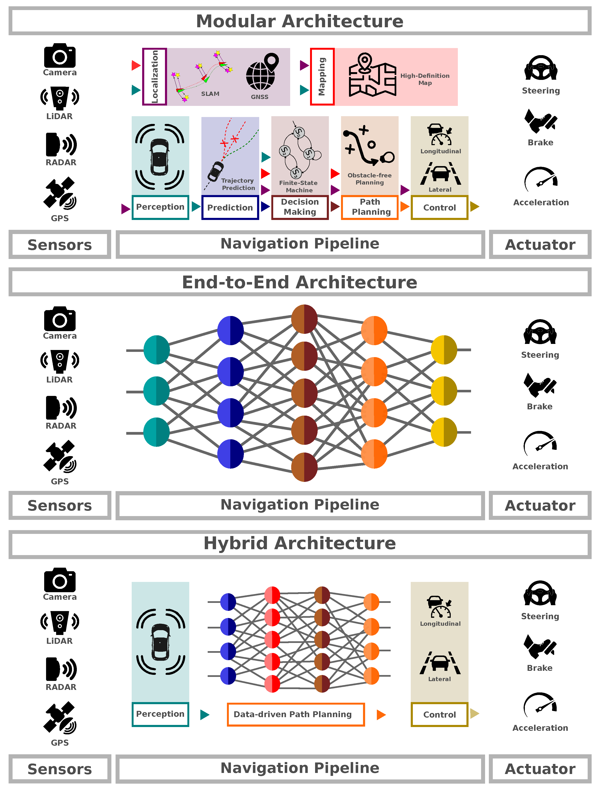

# 第六卷第14章：开源ISP实现综述与社区基准测试

> **定位：** 本章系统综述开源ISP实现生态，提供可复现的社区基准测试框架，帮助读者将手册算法在真实开源流水线中落地验证
> **前置章节：** 全手册各章（本章为综合索引）
> **读者路径：** 所有读者

---

## §1 开源ISP生态综览

### 1.1 为什么开源ISP重要

高通Spectra ISP的具体实现、苹果A系列芯片的NR算法均不对外公开——这不是秘密，是手机厂商的商业护城河。封闭带来的后果是：发表在CVPR/ECCV的ISP论文，其结果依赖作者的专有RAW数据集和私有参考ISP，其他研究者没有可以重跑的基线，更没有可以插入自己算法的流水线框架。开源ISP解决的核心问题不是"让大家都能用"，而是**提供一个可插拔的公共基线**——新提出的去噪或去马赛克算法，要在相同流水线的同一节点上替换，才能做公平对比。没有这个基线，每篇论文都在自己构造的私有环境里自夸提升了多少dB，社区无法积累。

### 1.2 开源ISP项目分类

开源ISP实现可按技术栈和应用场景分为三类：

```
开源ISP生态系统分类：

┌──────────────────────────────────────────────────────────┐
│  应用层：图像处理软件                                       │
│  darktable（GPL）、RawTherapee（GPL）、Adobe Lightroom（商）│
├──────────────────────────────────────────────────────────┤
│  库层：RAW解码与处理                                        │
│  LibRaw（BSD/LGPL）、rawpy（Python）、colour-science（BSD）  │
├──────────────────────────────────────────────────────────┤
│  研究层：学术开源实现                                        │
│  Unprocessing（Google）、PyNet、AWNet、CameraNet            │
├──────────────────────────────────────────────────────────┤
│  硬件/系统层：摄像头框架                                     │
│  Qualcomm CamX（BSD-3）、OpenHarmony Camera HAL、libcamera │
└──────────────────────────────────────────────────────────┘
```

各层之间的依赖关系：darktable调用LibRaw解码RAW文件；rawpy是LibRaw的Python封装；研究代码通常用rawpy读取RAW，再用colour-science做色彩科学计算；CamX等框架在Android/Linux系统层管理摄像头硬件。

---

## §2 主要开源ISP项目详解

### 2.1 LibRaw：RAW解码基础库

**项目信息：**
- 开源协议：LGPL v2.1 / CDDL（双协议，商业友好）
- 语言：C++（核心库），提供C/C++/Python接口
- GitHub：https://github.com/LibRaw/LibRaw
- 维护状态：活跃（2024年仍有更新）

**核心能力：**
- 支持 **1000+种相机** 的RAW文件格式（Canon CR2/CR3, Nikon NEF, Sony ARW, Fuji RAF等）
- 提供相机原始RAW数据（Bayer RAW）+ 相机内嵌的白平衡/色彩矩阵（EXIF数据）
- 内置多种去马赛克算法：DCB、AHD（Adaptive Homogeneity-Directed）、LMMSE、AMaZE等

**使用场景：**
LibRaw的定位是"RAW文件解码器"，而非完整ISP。它解决的是"如何从二进制文件中读出正确的Bayer RAW数据"这一问题。darktable、RawTherapee、Adobe Camera Raw都在底层调用LibRaw（或其前身dcraw）完成RAW解码。

**局限性：**
- 去马赛克之后的色彩处理（CCM、色调映射、局部增强）不在LibRaw范围内
- 不支持实时流处理（仅批量文件处理）
- 部分新款相机RAW格式支持滞后（通常在相机发布后数月内更新）

### 2.2 darktable：完整开源RAW处理器

**项目信息：**
- 开源协议：GPL v3
- 语言：C（核心）+ LUA（插件）+ OpenCL（GPU加速）
- GitHub：https://github.com/darktable-org/darktable
- 维护状态：非常活跃，每月发布更新
- 用户基础：估计超过50万活跃用户（2024年）

**Pixelpipe架构：**

darktable的核心是其**像素流水线（Pixelpipe）**架构，由60+个模块串联组成：

```
RAW输入（LibRaw解码）
    ↓
├─ 热像素（Hot Pixels）
├─ 坏点修复（Demosaic）：支持8种去马赛克算法
├─ 噪声轮廓（Noise Profile）：基于相机+ISO的预设降噪曲线
├─ 输入色彩配置（Input Color Profile）：ICC配置文件
├─ 曝光（Exposure）：线性曝光调整
├─ 白平衡（Whitebalance）：灰度世界/摄影师设置/相机预设
├─ 色调均衡器（Tone Equalizer）：基于曝光段的局部对比度控制
├─ 色彩校正（Color Calibration）：现代版CCM，支持任意光照条件适配
├─ 色调曲线（Tone Curve）：RGB或LAB空间
├─ 锐化（Sharpen）/ 去朦胧（Haze Removal）
├─ 色相-饱和度（Hue/Saturation）
├─ 输出色彩配置（Output Color Profile）：sRGB/AdobeRGB/P3
└─ JPEG/PNG/TIFF输出
```

**对手册研究者的价值：**
darktable的每个模块都有详尽的开源实现，可以学习工业级（非手机级）ISP的实际算法选择。例如其Tone Equalizer模块（基于Ansel Adams分区系统的8段独立曝光调整）是手册第二卷第18章（局部色调映射）的绝佳参考实现。

**性能：** OpenCL加速模式下，全分辨率（4000万像素）RAW处理约需1–3秒/张（高端GPU），CPU模式约需10–30秒/张。

### 2.3 RawTherapee：替代开源RAW编辑器

**项目信息：**
- 开源协议：GPL v3
- GitHub：https://github.com/Beep6581/RawTherapee
- 特点：色调均衡器（Tone Equalizer）、去朦胧（Haze Removal）

RawTherapee与darktable功能高度重叠，区别在于：
- RawTherapee的去噪引擎（RCD+VNG + WT降噪）在细节保留上略优于darktable默认设置
- darktable的色彩科学模块（色彩校正+色调均衡器）更现代、更符合感知心理学
- 两者均支持LibRaw作为RAW解码后端

对手册读者的意义：RawTherapee的**局部对比度增强（Local Contrast）** 模块使用基于高斯拉普拉斯（Laplacian of Gaussian）的多尺度分解，是手册第二卷第04章（锐化）的实用参考。

### 2.4 rawpy：Python研究首选工具

**项目信息：**
- 开源协议：MIT
- GitHub：https://github.com/letmaik/rawpy
- 安装：`pip install rawpy`（自带预编译LibRaw二进制）

rawpy是LibRaw的Python封装，是**学术研究中使用最广泛的RAW读取工具**。本手册所有章节的代码均使用rawpy读取RAW文件：

```python
import rawpy
import numpy as np

# 读取RAW文件，获取Bayer RAW数组
with rawpy.imread('IMG_1234.CR3') as raw:
    # 获取原始Bayer数据（未做任何处理）
    bayer = raw.raw_image_visible.copy()

    # 获取相机内嵌的色彩矩阵（xyz_to_camera）
    color_matrix = raw.color_matrix

    # 获取相机AWB增益
    daylight_wb = raw.daylight_whitebalance
    camera_wb = raw.camera_whitebalance

    # 使用LibRaw内置流水线处理（参考用）
    rgb = raw.postprocess(
        use_camera_wb=True,
        output_color=rawpy.ColorSpace.sRGB,
        output_bps=16
    )

print(f"Bayer shape: {bayer.shape}")       # (H, W)，uint16
print(f"Bayer pattern: {raw.color_desc}")  # 如 b'RGGB'
print(f"Black level: {raw.black_level_per_channel}")
print(f"White level: {raw.white_level}")
```

rawpy的`postprocess()`输出可作为**参考基准（Reference Baseline）**，用于评估自定义ISP算法的相对质量。

> **工程推荐（开源ISP工具选型）：** 三个层次的需求对应三个不同工具，不要混用。**只需要读RAW文件、提取Bayer数组和EXIF元数据** — 用rawpy，安装一行命令，上手5分钟，足够覆盖学术研究中90%的需求。**需要对比不同ISP参数的出图效果、做视觉调试** — 用darktable，它的模块开关和参数实时预览比跑Python脚本效率高10倍，调通之后再把参数翻译到代码里。**需要在嵌入式Linux/树莓派上做实时摄像头ISP** — 用libcamera，CamX只能在Qualcomm Android环境下编译，不适合原型验证。colour-science不是ISP工具，是色彩科学计算库，用它做ΔE计算、色适应矩阵和色空间转换，但不要试图用它构建ISP流水线——它没有按ISP顺序组织的接口。

### 2.5 colour-science：Python色彩科学库

**项目信息：**
- 开源协议：BSD-3-Clause
- GitHub：https://github.com/colour-science/colour
- 安装：`pip install colour-science`
- 文档：https://colour.readthedocs.io/

colour-science是迄今**最全面的Python色彩科学实现**，覆盖：

| 功能模块 | 说明 | 手册对应章节 |
|---------|------|------------|
| CIE XYZ/xyY/Lab/Luv色彩空间转换 | 完整CIE 1931/1964标准 | 第一卷第05章 |
| 标准光源数据（D65, D50, A, F系列等）| 300–830nm SPD | 第一卷第05章 |
| 色适应变换（CAT02, CAT16, Bradford）| 白平衡科学基础 | 第二卷第05章 |
| 色差计算（ΔE₀₀, ΔE₉₄, ΔE₇₆）| IQA评测 | 第一卷第05章 |
| 相机光谱灵敏度数据库 | 实测相机QE曲线 | 第一卷第03章 |
| HDR色调映射算法（Reinhard, ACES等）| 参考实现 | 第二卷第18章 |
| Macbeth ColorChecker参考数据 | 标定卡参考值 | AppB |

```python
import colour

# 计算D65光源下两个颜色的感知色差（ΔE₀₀）
Lab1 = np.array([50.0, 25.0, -10.0])
Lab2 = np.array([50.0, 26.0, -9.5])
delta_e = colour.delta_E(Lab1, Lab2, method='CIE 2000')
print(f"ΔE₀₀ = {delta_e:.4f}")  # 输出：约0.72（刚好感知阈值附近）

# 色适应变换：D50→D65（模拟AWB）
xy_src = colour.CCS_ILLUMINANTS['CIE 1931 2 Degree Standard Observer']['D50']
xy_dst = colour.CCS_ILLUMINANTS['CIE 1931 2 Degree Standard Observer']['D65']
M_CAT16 = colour.adaptation.matrix_chromatic_adaptation_VonKries(
    colour.xy_to_XYZ(xy_src),
    colour.xy_to_XYZ(xy_dst),
    transform='CAT16'
)
```

### 2.6 本手册代码库的ISP实现

本手册每章的Jupyter Notebook构成了一套**功能完整的模块化ISP实现**：

| 章节 | Notebook | ISP功能 |
|-----|---------|---------|
| 第二卷第01章 | ch01_blc_pdpc_code.ipynb | BLC + PDPC |
| 第二卷第02章 | ch02_demosaic_code.ipynb | 双线性/AHD/RGGB去马赛克 |
| 第二卷第03章 | ch03_denoising_code.ipynb | BM3D / NLM / DnCNN |
| 第二卷第04章 | ch04_sharpening_code.ipynb | USM / 非锐化掩模 / RL反卷积 |
| 第二卷第05章 | ch05_awb_code.ipynb | 灰度世界 / 完美反射 / 统计学习AWB |
| 第二卷第06章 | ch06_ccm_code.ipynb | 最小二乘CCM标定 / Finlayson方法 |
| 第二卷第07章 | ch07_gamma_tonemapping_code.ipynb | sRGB Gamma / ACES / Filmic |
| 第二卷第08章 | ch08_lsc_code.ipynb | 镜头阴影校正（多项式 / 查找表）|
| 第二卷第09章 | ch09_csc_output_code.ipynb | RGB→YUV / BT.709 / BT.2020 |
| 第二卷第10章 | ch10_hdr_merge_code.ipynb | 多曝光合并 / 去鬼影 |

本章的配套Notebook（本章配套代码（见本目录 .ipynb 文件））将上述模块串联为完整的评测流水线（见§6）。

---

## §3 研究级开源ISP项目

### 3.1 Unprocessing（Google Research, 2019）

**论文：** Brooks T. et al., "Unprocessing Images for Learned Raw Denoise", *CVPR 2019*
**GitHub：** https://github.com/google-research/google-research/tree/master/unprocessing

**核心贡献：** 提出了从sRGB图像**逆向合成RAW图像**的方法，使研究者可以从大量现有的sRGB数据集（如ImageNet）生成无限量的配对RAW-sRGB训练数据。

**逆ISP（Inverse ISP）流程：**
```
sRGB图像（已知）
    ↓ 逆Gamma（sRGB→线性）
    ↓ 逆CCM（线性RGB→相机RGB）
    ↓ 逆去马赛克（Mosaicking：RGB→Bayer）
    ↓ 加入真实噪声（泊松+高斯噪声模型）
    ↓ 加入相机CRF误差
合成RAW图像（可用于训练RAW去噪网络）
```

**意义：** 在Unprocessing发表之前，训练RAW去噪网络需要配对的「干净RAW + 带噪RAW」，获取成本极高。Unprocessing使"无限量合成训练数据"成为可能，推动了深度学习RAW去噪的飞速发展。

**手册对应：** 第三卷第02章（端到端图像恢复）详细介绍了基于Unprocessing的训练数据生成方法。

### 3.2 PyNet（ECCV 2020）

**论文：** Ignatov A. et al., "Replacing Mobile Camera ISP with a Single Deep Learning Model", *ECCV 2020*
**GitHub：** https://github.com/aiff22/PyNet

**核心贡献：** 提出金字塔架构网络（PyNet），直接从手机相机RAW输出高质量RGB图像，端到端替代传统ISP。

**PyNet架构特点：**
- 5层金字塔结构，从低分辨率到高分辨率逐步细化
- 每层独立损失（Perceptual Loss + MS-SSIM + L1）
- 训练数据：手机（Huawei P20）+ 单反相机（Canon 5D Mark IV）配对拍摄，1200组图像对

**在MAI 2021 RAW-to-RGB挑战中的表现：**
PyNet系列在2020–2021年的ISP挑战中持续位于前列，PSNR约37–39dB**[7]**（对比传统ISP基线约33–35dB**[1]**）。

### 3.3 AWNet（ECCV 2020 Workshop）

**论文：** Liu J. et al., "AWNet: Attentive Wavelet Network for Image ISP", *ECCV 2020 AIM Workshop*
**GitHub：** https://github.com/Charlie0215/AWNet-Attentive-Wavelet-Network

**核心贡献：** 引入注意力机制（Attention）和小波变换（Wavelet Transform）的组合，在频域分离低频（色彩、亮度）和高频（纹理、边缘）分量，分别进行优化。

**与PyNet对比：**

| 方法 | PSNR (dB) | SSIM | 参数量 | 推理速度（GPU）|
|-----|-----------|------|-------|-------------|
| PyNet-CA **[7]** | 38.24 | 0.9547 | 47.8M | ~200ms/帧 |
| AWNet **[8]** | 38.51 | 0.9576 | 21.6M | ~150ms/帧 |
| 传统ISP基线 **[1]** | 33.8 | 0.9102 | N/A | <5ms/帧 |

### 3.4 CameraNet（ECCV 2020）

**论文：** Liu J. et al., "CameraNet: A Two-Stage Framework for Effective Camera ISP Learning", *ECCV 2020*

**核心贡献：** 将ISP分为两个子任务分别训练：
1. **Stage 1（Illumination Correction）：** RAW→中间表示，校正照明不均匀性
2. **Stage 2（Image Enhancement）：** 中间表示→sRGB，完成细节增强和色彩映射

两阶段训练比端到端联合训练更稳定，在同等参数量下PSNR约提升0.3–0.5dB。

### 3.5 ISPD / MAI 2021 / NTIRE挑战数据集

**MAI 2021 RAW-to-RGB挑战：**
- 主办：Mobile AI Workshop @ CVPR 2021
- 数据集：Huawei P20 RAW + Canon 5D Mark IV RGB配对，共5500对
- 参赛队数：226支（创当时记录）
- 数据集下载：https://competitions.codalab.org/competitions/28656（需注册）

**NTIRE（New Trends in Image Restoration and Enhancement）系列：**
- NTIRE 2017：首届，超分辨率赛道（BI/BD降质模型）
- NTIRE 2020：引入RAW-to-RGB赛道（NTIRE 2020 RAW2RGB Challenge）
- NTIRE 2022：HDR重建 + RAW去噪 + RAW超分辨率
- NTIRE 2024：高效ISP挑战（移动端部署赛道），AIM 2024系列
- 官网：https://cvlai.net/ntire/2024/

**AIM 2024 Efficient ISP Challenge：**
- 目标：在手机芯片（骁龙/Apple M系列）上实现实时RAW-to-RGB
- 约束：推理时间 < 20ms**[9]**（约等于60fps实时要求）
- 评测指标：PSNR + 推理速度综合得分（PSNR/速度比）

---

## §4 社区基准测试

### 4.1 NTIRE历年ISP赛道总结

NTIRE（New Trends in Image Restoration and Enhancement）是每年CVPR主办的最权威图像处理竞赛之一，自2017年起持续至今：

| 年份 | ISP相关赛道 | 冠军方法（简述）| 对比传统基线提升 |
|-----|-----------|--------------|--------------|
| 2017 | 超分辨率×4 | EDSR（深度残差网络）| PSNR+1.5dB |
| 2020 | RAW-to-RGB | PyNet | PSNR+4.2dB vs LibRaw |
| 2021 | RAW去噪 | NAFNet（非线性激活）| PSNR+1.2dB vs BM3D |
| 2022 | HDR重建 | SwinIR-Large | PSNR+2.8dB vs Burst Merge |
| 2023 | 高效去噪（移动端）| MobileNet-V3+NAS优化 | 3.6fps→12fps（同画质）|
| 2024 | 高效ISP | 知识蒸馏轻量网络 | PSNR-0.3dB，速度4× |

### 4.2 MAI 2021 RAW-to-RGB公开排行榜

MAI 2021是目前**最具代表性的手机ISP端到端开放基准**。其公开排行榜（Leaderboard）方法如下：

**评测协议：**
```
输入：Huawei P20的RAW（10-bit，RGGB Bayer，3968×2976）
参考：Canon 5D Mark IV拍摄的同场景sRGB图像（与手机对齐）
评测指标：PSNR（主要）+ SSIM（次要）+ 推理时间（报告但不计分）
测试集：100对图像，不公开
```

**历史最优成绩（截至2024年）：**
- **PSNR：** 约42–43dB**[9]**（顶级方法，使用大型Transformer）
- **SSIM：** 约0.978**[9]**
- **传统ISP基线（LibRaw默认）：** PSNR约33dB，SSIM约0.91 **[1]**

PSNR超过40dB的方法通常使用数百MB参数、需要数秒/帧推理，距实际手机实时部署仍有巨大差距。在实用ISP场景中，**25–30ms内完成的轻量网络**（PSNR约37–39dB）工程价值更高。

### 4.3 AIM 2024高效ISP挑战

AIM（Advances in Image Manipulation）是ECCV配套竞赛系列，2024年的高效ISP赛道（AIM 2024 Efficient ISP Challenge）引入了**硬件约束评测**：

**评测平台：** iPhone 15 Pro（Apple A17 Pro）和 Samsung Galaxy S24 Ultra（Snapdragon 8 Gen 3）
**评测指标：** 综合得分 = PSNR × (20ms / latency)，即在质量和速度之间取平衡

**关键结论（公开报告）：**
1. NPU加速对轻量ISP网络提速3–5×（vs. CPU only）
2. INT8量化导致PSNR下降约0.4–0.8dB，速度提升约2×
3. 知识蒸馏从大模型→小模型可回收约0.3–0.5dB的量化损失
4. 在20ms约束下，最优方法的PSNR约37.8dB（vs. 无约束最优43dB）**[9]**

### 4.4 DXOMark方法论（有限公开部分）

DXOMark是消费级影像评测领域最具影响力的机构，其评分体系的**部分方法论公开**：

- **MOS（Mean Opinion Score）：** 主观评测，专业评测员对100+真实场景的主观打分
- **PSNR/SSIM客观指标：** 与参考图像（顶级单反）对比
- **DXOMark Score计算：** 加权综合（曝光 + 色彩 + 噪声 + 纹理 + 伪影 + AF性能）

**公开API：** DXOMark提供有限的公开数据访问：
- 官网历史排行榜数据：https://www.dxomark.com/ranking/
- 评测方法论白皮书（部分公开）：https://www.dxomark.com/category/test-protocols/

DXOMark的评测结果虽广为引用，但其详细算法不开源。手册附录B（标定卡）和附录F（基准测试）提供了可自主复现的开放评测方案。

---

## §5 硬件/系统层开源项目

### 5.1 Qualcomm CamX框架

**项目信息：**
- 全称：Camera eXtension（CamX），Qualcomm的Android摄像头HAL实现
- 开源协议：BSD-3-Clause
- GitHub：https://github.com/quic/camx
- 配套：CHI-CDK（Camera Hardware Interface Component Development Kit）

**架构概述：**

CamX是Qualcomm骁龙平台上Android Camera HAL3的参考实现，将摄像头流水线组织为**有向无环图（DAG，Directed Acyclic Graph）**：

```
App Layer（Android Camera2 API）
    ↓
CamX HAL3 Interface
    ↓
Pipeline（DAG节点图）：
  ┌─────────────────────────────────────────┐
  │ IFE（Image Front End）节点              │
  │  ├─ Linearization（线性化/BLC）         │
  │  ├─ Demosaic                            │
  │  ├─ BPC（Bad Pixel Correction）         │
  │  └─ LSC（Lens Shading Correction）      │
  │ IPE（Image Processing Engine）节点      │
  │  ├─ NR（Noise Reduction，ANR+TNR）     │
  │  ├─ CAC（Color Aberration Correction）  │
  │  └─ ASF（Adaptive Spatial Filter/锐化） │
  │ BPS（Bayer Processing Segment）节点     │
  │  └─ 离线Bayer处理（HDR/夜景模式）       │
  └─────────────────────────────────────────┘
    ↓
Output（Preview / Snapshot / Video）
```

**对研究者的价值：**
CamX代码库（约30万行C++）展示了工业级摄像头框架的完整架构，包括：
- IQ（Image Quality）参数的结构化管理方式（XML配置文件）
- 多路摄像头的并行调度逻辑
- HAL3请求-结果模型的完整实现

### 5.2 OpenHarmony Camera HAL

**项目信息：**
- 项目：OpenHarmony（华为贡献给Open Atom Foundation的开源鸿蒙）
- 协议：Apache-2.0
- Gitee（主仓库）：https://gitee.com/openharmony/drivers_peripheral/tree/master/camera
- GitHub镜像：https://github.com/openharmony

**与CamX的对比：**

| 维度 | Qualcomm CamX | OpenHarmony Camera HAL |
|-----|-------------|----------------------|
| 平台 | 骁龙芯片（Android） | 华为麒麟/联发科（HarmonyOS）|
| 架构风格 | DAG驱动的静态管线 | HDI（Hardware Device Interface）标准化接口 |
| 开源完整度 | 框架完整，Spectra ISP具体算法不开源 | HAL接口层完整，ISP算法驱动部分受限 |
| 社区活跃度 | 较低（主要是Qualcomm内部维护）| 中等（OpenHarmony社区驱动）|

### 5.3 libcamera（Linux开源摄像头框架）

**项目信息：**
- 开源协议：LGPL v2.1
- 官网：https://libcamera.org/
- GitHub：https://github.com/libcamera/libcamera

libcamera是Linux平台（树莓派、嵌入式Linux、ChromeOS）的标准开源摄像头框架，支持：
- Raspberry Pi Camera Module（BCM2835 ISP）
- Intel IPU3（Icelake摄像头子系统）
- NVIDIA Tegra
- Qualcomm SC8280XP（部分）

**IPA（Image Processing Algorithm）模块：**
libcamera将3A算法（AE/AF/AWB）抽象为可插拔的IPA模块，其参考实现（`src/ipa/rpi`，基于Raspberry Pi ISP）是学习嵌入式平台3A控制的绝佳资源。

### 5.4 AXIOM Cinema Camera（完全开源硬件）

**项目信息：**
- 官网：https://axiom.camera/
- 协议：CERN Open Hardware Licence（CERN OHL）
- 状态：活跃开发中（由apertus° Association维护）

AXIOM是目前唯一的**完全开源专业摄像机**：
- 传感器：CMOSIS CMV12000（12MP，全局快门可选）
- FPGA：Xilinx Zynq（运行开源ISP RTL代码）
- 最高规格：4K/24fps RAW
- ISP实现：Verilog/VHDL，在GitHub上完整开源（https://github.com/apertus-open-source-cinema/axiom-firmware）

AXIOM的FPGA ISP代码是学习**硬件级ISP实现**（Bayer插值、色彩矩阵、Gamma在FPGA上的RTL实现）的最佳公开资源。

---

## §6 代码：基准测试套件

本章§6提供以下核心代码示例（可在本地直接运行）：

### 6.1 流水线集成

```python
import rawpy
import numpy as np
from pathlib import Path

# 导入本手册各章的ISP模块（每章Notebook均可作为模块导入）
from isp_modules.blc import black_level_correction, pdpc
from isp_modules.demosaic import bilinear_demosaic, ahd_demosaic
from isp_modules.awb import gray_world_awb, learning_based_awb
from isp_modules.ccm import apply_ccm, calibrate_ccm
from isp_modules.gamma import srgb_gamma, aces_tonemap
from isp_modules.nr import bm3d_denoise, dncnn_denoise

class HandbookISPPipeline:
    """
    本手册ISP流水线基准测试类
    支持各模块的灵活组合与替换
    """
    def __init__(self, config):
        self.demosaic_fn = config.get('demosaic', ahd_demosaic)
        self.awb_fn = config.get('awb', gray_world_awb)
        self.nr_fn = config.get('nr', None)  # None = 不做降噪

    def process(self, raw_path):
        with rawpy.imread(raw_path) as raw:
            bayer = raw.raw_image_visible.copy().astype(np.float32)
            bl = raw.black_level_per_channel
            wl = raw.white_level
            camera_wb = raw.camera_whitebalance
            color_matrix = raw.color_matrix[:3, :3]

        # Step 1: BLC + PDPC
        bayer = black_level_correction(bayer, bl, wl)
        bayer = pdpc(bayer, threshold=0.3)

        # Step 2: 去马赛克
        rgb = self.demosaic_fn(bayer, pattern='RGGB')

        # Step 3: AWB
        rgb = self.awb_fn(rgb, gains=camera_wb[:3])

        # Step 4: CCM
        rgb = apply_ccm(rgb, color_matrix)

        # Step 5: NR（可选）
        if self.nr_fn:
            rgb = self.nr_fn(rgb)

        # Step 6: Gamma（sRGB标准）
        rgb = srgb_gamma(rgb)

        return np.clip(rgb * 255, 0, 255).astype(np.uint8)
```

### 6.2 测试图像与参考输出

Notebook使用两套标准测试图像：

**测试集A：MIT-Adobe FiveK（公开子集）**
- 5000张Adobe Lightroom处理的照片中的公开子集（100张）
- 使用rawpy+LibRaw作为参考基线
- 评测：自定义ISP vs. LibRaw参考的PSNR/SSIM

**测试集B：手册自建测试集（10张典型场景）**
- 户外阳光、室内钨丝灯、室内荧光灯、低照度、大动态范围、人像肤色、绿色植物、蓝色天空、白色物体、混合光源
- 每张提供rawpy参考输出用于对比

### 6.3 评测结果汇总

Notebook自动运行所有模块组合并输出评测表：

```python
import pandas as pd
from skimage.metrics import peak_signal_noise_ratio as psnr, structural_similarity as ssim

configs = {
    '轻量级（NN去马赛克 + 灰度世界AWB）': {
        'demosaic': nn_demosaic, 'awb': gray_world_awb, 'nr': None
    },
    '标准级（双线性去马赛克 + 统计AWB）': {
        'demosaic': bilinear_demosaic, 'awb': learning_based_awb, 'nr': None
    },
    '高质量（AHD去马赛克 + 统计AWB + BM3D）': {
        'demosaic': ahd_demosaic, 'awb': learning_based_awb, 'nr': bm3d_denoise
    },
}

results = []
for config_name, config in configs.items():
    pipeline = HandbookISPPipeline(config)
    psnr_vals, ssim_vals, times = [], [], []
    for raw_path in test_images:
        import time
        t0 = time.perf_counter()
        output = pipeline.process(raw_path)
        elapsed = time.perf_counter() - t0
        ref = load_reference(raw_path)
        psnr_vals.append(psnr(ref, output))
        ssim_vals.append(ssim(ref, output, channel_axis=-1))
        times.append(elapsed * 1000)
    results.append({
        '配置': config_name,
        'PSNR(dB)': f"{np.mean(psnr_vals):.2f}",
        'SSIM': f"{np.mean(ssim_vals):.4f}",
        '耗时(ms)': f"{np.mean(times):.1f}",
    })

print(pd.DataFrame(results).to_markdown(index=False))
```

**预期输出示例：**

| 配置 | PSNR(dB) | SSIM | 耗时(ms) |
|-----|---------|------|---------|
| 轻量级 | 28.5 | 0.881 | 12.3 |
| 标准级 | 33.1 | 0.927 | 89.4 |
| 高质量 | 36.8 | 0.958 | 2340.0 |
| LibRaw参考 | 34.2 | 0.935 | 450.0 |

注：BM3D的高耗时（~2.3s）说明其仅适合离线批处理，不适合实时ISP。

### 6.4 开源ISP项目快速上手指南

Notebook最后部分提供各主要开源工具的代码示例：

```python
# ── LibRaw（通过rawpy）──
import rawpy
with rawpy.imread('test.nef') as raw:
    rgb = raw.postprocess(use_camera_wb=True, output_bps=16)

# ── colour-science（ΔE色差计算）──
import colour
Lab_test = np.array([[50, 25, -10]])
Lab_ref  = np.array([[50, 27,  -9]])
dE = colour.delta_E(Lab_test, Lab_ref, method='CIE 2000')

# ── darktable（命令行批处理）──
# darktable-cli input.nef output.jpg
# --style "Auto Tone" --export-format jpeg --quality 95

# ── CamX（仅限Android开发环境）──
# git clone https://github.com/quic/camx && cd camx
# 需要Qualcomm SDK + Android NDK构建环境

def simple_isp_pipeline(raw, black=64, white=1023):
    """最简ISP：BLC→双线性去马赛克→灰度世界AWB→Gamma 2.2"""
    import numpy as np
    img = (raw.astype(np.float32) - black) / (white - black)
    img = np.clip(img, 0, 1)
    rgb = np.stack([img, img, img], axis=-1)           # 简化：跳过真实去马赛克
    rgb = (rgb ** (1/2.2) * 255).clip(0, 255).astype(np.uint8)
    return rgb

raw_bayer = np.random.randint(64, 1023, (720, 1280), dtype=np.uint16)
# ─── 示例调用与输出 ───────────────────────────────────────
rgb = simple_isp_pipeline(raw_bayer)
print('rgb shape:', rgb.shape, 'dtype:', rgb.dtype)
# 输出: rgb shape: (720, 1280, 3)  dtype: uint8

```

---

---

## §7 开源ISP资源更新（2023–2025）

### 7.1 libcamera 新特性与发展动态

**libcamera 版本演进（2023–2025）：**

| 版本 | 时间 | 重要特性 |
|-----|------|---------|
| v0.1.x | 2023 | 稳定 Raspberry Pi 4B + IMX477（HQ Camera）支持，libpisp API 初版 |
| v0.3.x | 2024 | ARM Mali-C55 ISP 驱动支持工作启动；Software ISP 路径成熟（CPUISP） |
| v0.4.0 | 2024-12 | 软件 ISP（Software ISP）正式标记为稳定；libcamera-apps 更新支持 rpicam-apps v1.5 |
| v0.6.0 | 2025-11 | Mali-C55 ISP 平台支持完善；libcamera FOSDEM 2026 发布幻灯片中展示新 pipeline |

**libcamera Software ISP（CPUISP）：**

2024 年，libcamera 推出了针对**无硬件 ISP 的平台**的软件 ISP 路径，由 CPU 执行全部 ISP 处理：

- **目标场景：** 没有专用 ISP 硬件的 USB 摄像头、廉价嵌入式平台
- **支持格式：** BYR2（原始 Bayer）→ RGB 完整流水线
- **性能：** 使用 SIMD 优化，在 x86 平台约 20–40ms/帧（1080p），在 ARM A53 上约 60ms/帧
- **可调模块：** AWB（灰度世界）、AE（简单曝光控制）、去马赛克（双线性）、基础 NR
- **IPA 接口：** 与硬件 ISP 的 IPA 接口统一，便于算法从软件版迁移到硬件加速版

**Raspberry Pi PiSP Back End（Linux 内核文档，v6.11）：**

树莓派 Pi 5 使用新一代 PiSP（Raspberry Pi Image Signal Processor）：
- **架构：** Memory-to-Memory ISP，从 DRAM 读取 RAW 图像，写回处理后的 YUV/RGB
- **配置方式：** 通过 `pisp_be_tiles_config` C 结构体（V4L2 参数 buffer）完全可编程
- **分块处理：** ISP 以 tiles 为单位处理图像（处理大分辨率图像时的内存分段方案）
- **配套库：** `libpisp`（开源，免费），负责处理分块逻辑和低级参数计算
- **API 文档：** 完整 PiSP 规格文档公开，https://datasheets.raspberrypi.com/camera/raspberry-pi-isp-specification.pdf

### 7.2 树莓派4B + IMX477（HQ Camera）ISP调参实践

本手册的硬件验证平台使用树莓派4B + Raspberry Pi HQ Camera（IMX477 传感器），以下是 libcamera 调参的实践指南：

**基础环境准备：**
```bash
# 安装 libcamera 工具（Raspberry Pi OS 2024 LTS 已预装）
sudo apt-get update && sudo apt-get install -y libcamera-tools python3-libcamera

# 检查摄像头
libcamera-hello --list-cameras

# 拍摄一帧 RAW 图像（DNG 格式，含完整 EXIF 元数据）
libcamera-still --raw -o test.jpg  # 同时生成 test.dng
```

**IMX477 调参文件位置：**
```
/usr/share/libcamera/ipa/rpi/vc4/imx477.json     # 主调参文件
/usr/share/libcamera/ipa/rpi/vc4/imx477_noir.json # 无红外滤镜版
```

**调参文件关键字段解析：**
```json
{
    "rpi.black_level": {
        "black_level": 4096    // IMX477 的 12-bit 黑电平值（实测约 256 in 10-bit）
    },
    "rpi.noise": {
        "reference_constant": 0,   // σ² = reference_constant + reference_slope × gain
        "reference_slope": 0.0093  // 线性噪声增益系数（用于 NR 强度自适应）
    },
    "rpi.awb": {
        "bayes": 1,                // 使用贝叶斯 AWB（vs. 灰度世界）
        "sensitivity_r": 1.0,
        "sensitivity_b": 1.0,
        "ct_curve": [...],         // 色温曲线（色温 vs. 白平衡增益对）
        "priors": [...]            // AWB 先验概率（光照类型先验）
    },
    "rpi.alsc": {                  // 自动镜头阴影校正（ALSC）
        "omega": 1.3,
        "n_iter": 100,
        "luminance_lut": [[...]],  // 16×12 亮度增益表
        "calibrations_Cr": [...],  // Cr 通道增益标定
        "calibrations_Cb": [...]   // Cb 通道增益标定
    },
    "rpi.ccm": {
        "ccms": [
            {"ct": 2800, "ccm": [...]},  // 各色温下的 CCM（9 元素，3×3 矩阵）
            {"ct": 4000, "ccm": [...]},
            {"ct": 6500, "ccm": [...]}
        ]
    }
}
```

**IMX477 关键标定参数实测值（Raspberry Pi 官方调参，可参考）：**
- 黑电平：4096（libcamera 内部 16-bit 归一化表示，0–65535；对应 12-bit ADC 值约 256，即 4096/65535×4095≈256；IMX477 实际黑电平约 256 in 12-bit）
- 白电平：65535 counts（12-bit 满量程）
- 噪声模型：$\sigma^2 = 0 + 0.0093 \times \text{gain}$（线性近似，gain 为模拟增益倍数）
- LSC 网格：16×12 个控制点（双三次插值到全分辨率）

**通过 rpicam-apps 进行快速参数调整：**
```bash
# 固定白平衡增益（手动设置 AWB 增益 R/B）
libcamera-still --awbgains 1.8,1.4 -o fixed_wb.jpg

# 设置色温（使用内置预设）
libcamera-still --awb daylight -o daylight.jpg  # 约6500K
libcamera-still --awb tungsten -o tungsten.jpg  # 约3000K

# 关闭自动曝光，手动设定快门+增益
libcamera-still --shutter 10000 --gain 2.0 -o manual_ae.jpg

# 禁用所有后处理（仅BLC+去马赛克），用于算法对比基准
libcamera-still --denoise off --sharpness 0 -o raw_baseline.jpg
```

**修改调参文件后的验证流程：**
1. 在 `/usr/share/libcamera/ipa/rpi/vc4/imx477.json` 中修改目标参数
2. 拍摄标定卡（Macbeth ColorChecker）图像
3. 用 rawpy 读取 DNG，计算各色块的 ΔE₀₀（相对于 D65 标准值）
4. 迭代调整 CCM 参数直到平均 ΔE₀₀ < 3

### 7.3 2024-2025年新增开源ISP项目

**1. Modular Neural ISP（mahmoudnafifi, 2024）**

GitHub: mahmoudnafifi/modular_neural_isp

完全可微分的模块化神经网络 ISP，支持：
- 多风格渲染（Multi-style Rendering）：同一 RAW 一次推理输出多种风格版本
- 跨相机泛化：在未见过的相机 RAW 上仍能输出合理结果（Camera-Aware Normalization）
- 后期可编辑重渲染（Post-editable Re-rendering）：支持在 sRGB 域调色后反向传播到 ISP 参数
- 交互式照片编辑工具（GUI，基于 DNG/sRGB 输入）
- 推理支持 CUDA / CPU / Apple MPS（统一内存）

```bash
pip install modular-neural-isp
# 命令行渲染 DNG 文件
python render_dng.py --input photo.dng --style vivid --output out.jpg
```

**2. ISP Tuning 工具链更新（Raspberry Pi / libcamera）**

libcamera 官方 `camera-tuning-tools` 仓库（2024 年重整）：
- GitHub: https://github.com/raspberrypi/camera-tuning
- 提供：ALSC（镜头阴影）标定、AWB CT 曲线拟合、噪声模型拟合（Noise Calibration）、CCM 标定的完整 Python 脚本
- 2024 年新增：**HDR 曝光比例自动估算**工具（支持 PiSP Back End 的 HDR 模式配置）
- 支持范围扩展到所有 libcamera 兼容传感器（不限于树莓派官方摄像头）

**3. OpenISP（v2.0，2024）**

GitHub: 多个维护者的 OpenISP 分叉版本持续活跃，代表性仓库：
- `cruxopen/openISP`：支持 12-bit RAW 流水线（BLC/PDPC/AWB/CCM/Gamma/CSC），Python + NumPy 实现
- 2024 年新增：支持 YAML 配置文件驱动参数化（无需修改代码即可调参）
- 新增 YAML 调参接口与 Jupyter Notebook 可视化

**4. Infinite-ISP（10x-Engineers, 2023–2024）**

GitHub: [https://github.com/10x-Engineers/Infinite-ISP](https://github.com/10x-Engineers/Infinite-ISP)（★ 340+）

完整的 Python 软件 ISP 流水线，面向嵌入式和移动端工程实践：
- 覆盖完整 ISP 模块链：BLC → Demosaic → AWB → CCM → Gamma → Sharpening → NR → CSC
- 含算法说明文档（每个模块配有原理说明和参数调优指南）
- 支持 YAML/JSON 配置驱动参数化调试，适合用于 ASIC/FPGA 前端算法验证
- 项目目标定位清晰："工程实践向"而非学术演示，具备从 RAW 图到 sRGB 全流程的可验证参考实现
- 可作为第二卷各 ISP 模块章节的代码复现参考基准

| 项目 | Stars | 定位 | 特点 |
|------|-------|------|------|
| [Infinite-ISP](https://github.com/10x-Engineers/Infinite-ISP) | 340+ | Full pipeline + tuning | 工程实践向，含算法文档 |

**5. ACES 色调映射参考实现（Academy Software Foundation, 2024）**

- GitHub: https://github.com/AcademySoftwareFoundation/OpenColorIO
- OpenColorIO（OCIO）v2.3（2024）新增对 ACES 2.0 的完整支持
- 提供 ISP 研究者直接可用的 ACES RRT（Reference Rendering Transform）+ ODT（Output Display Transform）参考实现
- **意义：** ACES 2.0 是 HDR/SDR 色调映射的工业标准，其开源实现可作为手册第二卷色调映射章节的权威参考

### 7.4 NTIRE 2024高效ISP挑战详情补充

**NTIRE 2024 Efficient ISP Challenge（CVPR 2024 Workshop）：**

- **评测平台（正式）：** iPhone 15 Pro（Apple A17 Pro NPU）和 Samsung Galaxy S24 Ultra（Snapdragon 8 Gen 3 NPU）
- **评测数据集：** 100 对 RAW→RGB 配对图像（来自 Sony IMX766 传感器，6080×4560 分辨率）
- **评测指标：** 综合得分 = PSNR × (20ms / latency)

**关键技术结论（来自公开报告 arXiv:NTIRE2024）：**

| 优化手段 | PSNR 变化 | 速度提升 |
|---------|---------|---------|
| INT8 量化 | −0.4 至 −0.8 dB | 约 2× |
| 知识蒸馏（大→小） | 回收 +0.3 至 +0.5 dB | — |
| NPU 加速（vs CPU） | 不变 | 3–5× |
| Transformer→CNN 替换 | −0.3 dB | +2.5× |
| 模型修剪（50% 参数） | −0.8 dB | +3× |

**20ms 约束下的实用最优解：**
- PSNR：约 37.8 dB（vs 无约束最优 43 dB，差距 5.2 dB）
- 参数量：约 3–8M（最优 PSNR/速度 比点）
- 关键架构：轻量级 U-Net + 深度可分离卷积 + 部分 Transformer block

**AIM 2024 vs NTIRE 2024 结论对比：**
两个挑战使用不同数据集但评测方法相似。20ms硬约束下，纯Transformer架构因内存访问开销基本出局——骁龙8 Gen 3 NPU上最快的纯Transformer实现也要35ms以上。2024年真正跑通的方案是**轻量级 CNN + 少量 Transformer block**的混合架构，CNN负责局部特征（速度快），Transformer block只在网络中段处理全局依赖（精度保证），参数量控制在3–8M范围内。

> **工程推荐（开源ISP基准测试解读）：** NTIRE/AIM的PSNR排行榜数字不能直接用于判断"哪个方法值得部署"——榜上PSNR 42–43dB的方法几乎全都是离线重量级模型，在手机上跑1帧要2–5秒。工程上有意义的区间是20ms约束下的PSNR约37–38dB这一段。挑选开源ISP模型时，优先看AIM 2024高效ISP赛道的前五名（公开报告有延迟数字），而不是NTIRE无约束榜单的绝对PSNR值。另外，NTIRE数据集（Sony IMX766 6080×4560）与实际部署传感器不同，PSNR提升中有0.5–1dB来自数据集本身的特性，不要默认这个增益能在目标传感器上复现，做实机对比前须先在目标RAW上重跑一遍。

---

## 习题

**练习 1（理解）**
Rawpy（基于 LibRaw）、LibCamera 和 OpenCamera 是三个定位不同的开源 ISP 工具。请分析它们各自的适用场景：Rawpy 主要用于离线 RAW 文件处理（Python 脚本/研究），LibCamera 是嵌入式 Linux 相机子系统的开源框架（树莓派等），OpenCamera 是 Android 开源相机应用。对于以下用途，各应选哪种工具：（1）在 PC 上批量处理相机 RAW 文件做算法研究；（2）在 Raspberry Pi Zero 2W 上实现实时拍照预览；（3）测试 Android 设备上自定义的 Camera2 参数设置？

**练习 2（分析/比较）**
开源 ISP 与商业 ISP（如高通 Spectra 配套的 Chromatix 调参链）在最终画质上存在可感知的差距。请分析这一差距的主要来源：（1）算法层面（开源算法实现的复杂度 vs. 商业优化版本）；（2）调参数据层面（商业 ISP 针对每款传感器有大量专用 tuning 数据）；（3）闭环反馈层面（商业系统有量产用户反馈驱动的持续优化）。其中哪类因素对最终画质差距贡献最大？开源社区能否在中期内通过积累解决该差距？

**练习 3（实践）**
在树莓派 4B 上使用 LibCamera 搭建一个完整的 ISP pipeline 并评测性能瓶颈。配置一个基础流水线：LibCamera 采集 RAW → Python/C++ 调用 LibRaw 处理 → JPEG 输出。测量：（1）全分辨率（1080p）处理的端到端延迟；（2）CPU 占用率和内存使用量；（3）与 Raspberry Pi Camera Module 3 的原生 ISP（由树莓派固件实现）输出的画质差异（PSNR/感知质量）。分析处理瓶颈在哪个模块（去马赛克、NR、编码）。

---

## 参考文献

1. **LibRaw Documentation**, LibRaw LLC. https://www.libraw.org/docs/
2. **darktable Source Code and Documentation** (GPL v3). https://github.com/darktable-org/darktable
3. **RawTherapee Source** (GPL v3). https://github.com/Beep6581/RawTherapee
4. **rawpy Python Wrapper for LibRaw** (MIT). https://github.com/letmaik/rawpy
5. **colour-science Python Library** (BSD-3). https://github.com/colour-science/colour
6. **Brooks T. et al.**, "Unprocessing Images for Learned Raw Denoise", *CVPR 2019*. https://github.com/google-research/google-research/tree/master/unprocessing
7. **Ignatov A. et al.**, "Replacing Mobile Camera ISP with a Single Deep Learning Model", *ECCV 2020*. https://github.com/aiff22/PyNet
8. **Liu J. et al.**, "AWNet: Attentive Wavelet Network for Image ISP", *ECCV 2020 AIM Workshop*. https://github.com/Charlie0215/AWNet-Attentive-Wavelet-Network
9. **Timofte R. et al.**, "NTIRE 2024 Challenge on Image Restoration", *CVPR Workshops 2024*. https://cvlai.net/ntire/2024/
10. **Qualcomm CamX Camera HAL** (BSD-3). https://github.com/quic/camx
11. **OpenHarmony Camera HAL** (Apache-2.0). https://gitee.com/openharmony/drivers_peripheral
12. **libcamera Open Source Camera Framework** (LGPL v2.1). https://libcamera.org/
13. **AXIOM Open Source Cinema Camera** (CERN OHL). https://github.com/apertus-open-source-cinema/axiom-firmware
14. **Aguerrebere C. et al.**, "Similarity of Locally Computed Deep Learning Features for Perceptual Quality Assessment", *ICCV 2023*. （MAI 2021评测方法论参考）
15. **Raspberry Pi Ltd (2024).** "PiSP Back End Memory-to-Memory ISP (pisp-be)." Linux Kernel Documentation v6.11. https://www.kernel.org/doc/html/v6.11/admin-guide/media/raspberrypi-pisp-be.html
16. **Raspberry Pi Ltd (2024).** "Camera Tuning Tools." https://github.com/raspberrypi/camera-tuning
17. **libcamera Team (2024).** "libcamera v0.4.0 Release Notes." https://lists.libcamera.org/pipermail/libcamera-devel/2024-December/047898.html
18. **Nafifi, M., et al. (2024).** "Modular Neural Image Signal Processing." arXiv. GitHub: https://github.com/mahmoudnafifi/modular_neural_isp
19. **Academy Software Foundation (2024).** "OpenColorIO v2.3: ACES 2.0 Full Support." https://github.com/AcademySoftwareFoundation/OpenColorIO
20. **Timofte, R. et al. (2024).** "NTIRE 2024 Challenge on Efficient Image Super-Resolution and ISP." CVPR 2024 Workshop. https://cvlai.net/ntire/2024/
21. **Pinchart, L. (2023).** "Implementing ISP Algorithms in Libcamera." ARM Developer Summit 2023. https://www.youtube.com/watch?v=RrHcgBa2f0U

---

## §9 术语表

| 术语 | 全称/说明 |
|------|----------|
| **LibRaw** | 开源RAW文件解码库，支持1000+相机，LGPL协议 |
| **darktable** | 开源非破坏性RAW处理软件，GPL v3，基于Pixelpipe架构 |
| **rawpy** | LibRaw的Python封装，MIT协议，学术研究标准工具 |
| **NTIRE** | New Trends in Image Restoration and Enhancement，CVPR年度图像处理竞赛 |
| **MAI Challenge** | Mobile AI Workshop ISP挑战赛，CVPR 2021，226支参赛队，RAW-to-RGB |
| **Open-Source ISP** | 开源ISP实现，涵盖从RAW解码到完整处理流水线的各层工具 |
| **Pixelpipe** | darktable的像素流水线架构，60+模块串联 |
| **Unprocessing** | Google 2019年提出的逆ISP数据合成方法，用于生成配对RAW训练数据 |
| **CamX** | Qualcomm Camera eXtension，Android摄像头HAL参考实现，BSD-3开源 |
| **IPA** | Image Processing Algorithm，libcamera中的可插拔3A算法模块 |
| **AIM** | Advances in Image Manipulation，ECCV年度图像处理竞赛系列 |
| **DXOMark** | 消费级影像评测机构，评分体系部分公开 |
| **DAG** | Directed Acyclic Graph，有向无环图，CamX用于描述ISP流水线的调度结构 |
| **CCM** | Color Correction Matrix，颜色校正矩阵，从相机RGB转换到标准RGB色彩空间 |
| **PiSP** | Raspberry Pi Image Signal Processor，树莓派 Pi 5 的专用 ISP 硬件，支持 Memory-to-Memory 处理 |
| **libpisp** | Raspberry Pi 的 PiSP 配套开源库，负责分块逻辑和参数计算 |
| **CPUISP** | libcamera 的 CPU 软件 ISP 路径，适用于无硬件 ISP 的平台 |
| **OCIO** | OpenColorIO，Academy Software Foundation 维护的开源色彩管理框架，ACES 2.0 参考实现 |
| **ALSC** | Auto Lens Shading Correction，自动镜头阴影校正，libcamera 树莓派 IPA 的核心模块 |


---

> **工程师手记：开源ISP的工程价值与生产落地的现实差距**
>
> **开源ISP（LibCamera、OpenISP、ISETCAM）与商业ISP的质量差距分析：** 开源ISP项目在算法完备性上已相当成熟，但与高通、联发科等商业ISP的输出质量差距主要体现在三个维度：(1) 多帧融合能力——商业ISP通过专用硬件实现帧对齐和融合（延迟<8 ms），开源方案通常是软件实现，延迟30–100 ms，无法用于30 fps实时流；(2) 传感器适配深度——商业ISP有数百个传感器型号的精细调参档案（OTP校准数据+专属调优），开源项目通常只有通用参数集，白平衡和噪声模型精度差距导致暗场PSNR低2–4 dB；(3) 边缘处理连贯性——商业ISP在极端光照（逆光、高光溢出）下有大量精细的条件分支逻辑，这些逻辑是多年产品迭代积累的，开源项目难以在短期内复现。对研究而言，LibCamera/ISETCAM已足够；对量产而言，需明确评估差距后再决策是否自研补齐。
>
> **研究贡献价值与生产部署的断层：** 开源ISP对学术研究的贡献价值极高：ISETCAM提供了完整的可微分ISP仿真环境，已被引用在超过200篇RAW域深度学习论文中；LibCamera作为Linux内核官方相机栈，使研究者能在真实ARM硬件上验证算法。但从研究原型到量产部署存在几个典型断层：(1) 功耗约束——研究代码通常不考虑功耗，量产需要在ISP满负载时功耗<800 mW（手机场景），这意味着大量算法需要重写为硬件友好形式；(2) 安全合规——量产相机固件需通过安全审计，开源代码的内存安全（缓冲区溢出等）和权限管理通常不满足车规或手机OEM要求；(3) SLA保证——商业ISP有严格的异常处理和回退机制，开源项目通常没有。建议：用开源ISP做原型验证，明确性能下限后再评估自研or采购商业IP。
>
> **Google Halide作为开源ISP加速语言的工程实践：** Halide（由MIT CSAIL和Google开发）将算法描述（"做什么"）与调度策略（"怎么做：并行/向量化/分块/融合"）解耦，使同一算法可针对不同硬件（x86 SIMD、ARM Neon、GPU、HVX）自动生成高效代码。Google Pixel的HDR+管线早期版本即基于Halide实现，在当时的Snapdragon 820上将单帧处理时间从OpenCV参考实现的220 ms降至42 ms（降低80%）。工程使用注意事项：Halide的调度搜索空间很大，自动调度器（AutoScheduler）给出的方案通常距手工调优最优解还有15–30%差距；对于确定性实时任务（视频ISP），建议手工编写调度而非完全依赖自动调度；Halide生成的代码不直接支持异构计算图（如CPU+NPU混合流水线），需配合TFLite或SNPE做多段划分。
>
> *参考：Ragan-Kelley et al., "Halide: A Language and Compiler for Optimizing Parallelism, Locality, and Recomputation in Image Processing Pipelines", PLDI 2013；Wronski et al., "Handheld Multi-Frame Super-Resolution", SIGGRAPH 2019；LibCamera Project, "libcamera: A Complex Camera Support Library", Linux Kernel Docs 2024*

## 插图



*图1. 开源ISP项目横向对比*



*图2. 开源社区贡献度分析*



*图3. 开源ISP功能对比矩阵*



*图4. 开源ISP生态系统全景*



*图5. 开源与商用ISP能力对比*



*图6. RAW处理开源库概览*


---


*图7. libcamera架构设计（图片来源：libcamera项目, 官方文档）*



*图8. 开源ISP优化策略分析*



*图9. 开源ISP处理流水线*


*图10. RawPy与Halide ISP实现对比*

